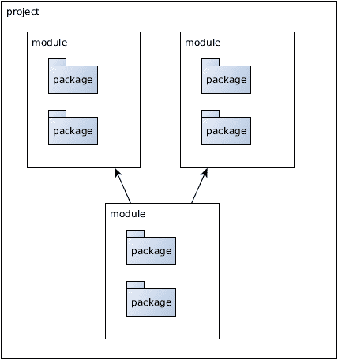
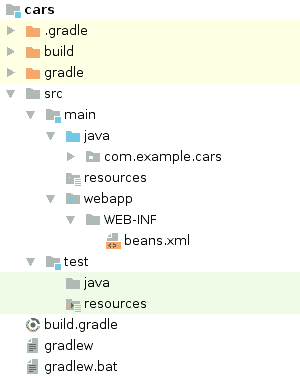
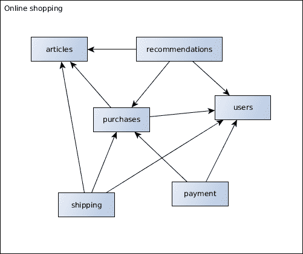
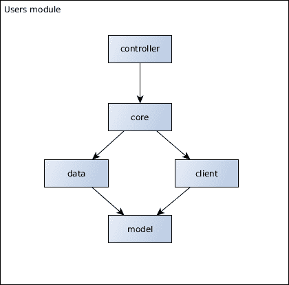
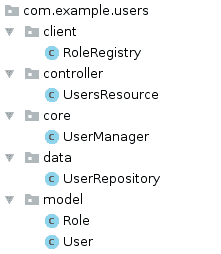
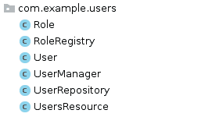
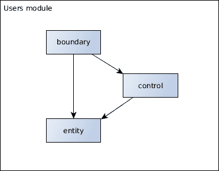
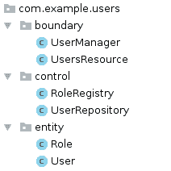

# 第二章：设计和构建 Java 企业应用程序

每个软件都是以某种方式设计的。设计包括系统的架构、项目的结构以及代码的结构和质量。它可以很好地传达意图，也可以使意图变得模糊。工程师在实现之前需要设计企业应用程序或系统。为了做到这一点，软件的目的和动机需要明确。

本章将涵盖：

+   开发软件时应关注哪些方面

+   项目构建结构和 Java EE 构建系统

+   如何构建企业项目模块

+   如何实现模块包结构

# 企业应用程序的目的

在每一个行动背后，无论是日常生活、大型组织还是软件项目，都应该有一个原因。我们人类需要知道我们为什么做事情。在企业软件开发中，这一点并无不同。

当我们构建软件应用程序时，首先应该问的问题是 *为什么？* 为什么需要这个软件？为什么有必要花费时间和精力去开发解决方案？以及为什么公司应该关心自己开发这个解决方案？

换句话说，应用程序的目的是什么？这个软件试图解决什么问题？我们希望应用程序实现重要的业务流程吗？它会产生收入吗？它将通过销售产品、通过营销、支持客户或业务流程直接产生收入，还是通过其他方式支持客户、员工或业务流程？

这些以及其他问题针对应用程序的业务目标。一般来说，在投入时间和精力之前，每件软件都需要在整体图中找到其合理性。

最明显的合法化是实施必要的业务用例。这些用例为整体业务带来一定的价值，并将迟早实现功能并产生收入。最终，软件应该尽可能好地实现业务用例的目标。

# 开发者应该关注什么

因此，软件开发人员和项目经理首先应该关注满足业务需求和实现用例。

这听起来显然，但企业项目的焦点往往过于偏离到其他关注点。开发者将精力投入到实现细节或对解决实际问题帮助甚微的功能上。我们过去见过多少日志实现、自制的企业框架或过度设计的抽象级别？

非功能性需求、软件质量以及所谓的横切关注点实际上是软件开发的重要方面。但所有工程努力的首要和主要焦点应该是满足商业需求并开发具有实际目的的软件。

# 满足客户需求

我们有以下问题：

+   应用程序的商业目的是什么？

+   用户最关心的最重要的功能是什么？

+   哪些方面会产生收入？

这些问题的答案应该为利益相关者所知晓。如果不是这样，那么正确的做法是退一步，审视整个软件领域的全景，并重新考虑软件存在的合理性。并非所有情况下的动机都是纯粹的商业驱动。实际上，有很多情况下我们会实施那些不直接产生收入但间接支持他人的解决方案。这些情况无疑是必要的，我们将在第八章“微服务与系统架构”中涵盖这些情况以及如何构建合理的系统景观的一般主题。

除了这些支持性软件系统之外，我们关注商业方面。牢记这个主要目标，首先要解决的问题是如何对商业用例进行建模并将它们转化为软件。只有在之后，才会使用某些技术来实现这些用例。

这些优先级也将反映客户需求。应用程序的利益相关者关心的是能够实现其目的的软件。

软件工程师往往有不同的看法。他们关心实现细节和解决方案的优雅性。工程师们通常对某些技术充满热情，花费大量时间和精力选择正确的解决方案以及有效地实施它们。这包括许多技术横切关注点，如日志记录，以及所谓的过度设计，这在商业领域并非强制性的。拥抱软件工艺当然有其重要性，并且对于编写更好的软件是必不可少的，但很多时候它与客户的动机是正交的。在花费时间和精力处理实现细节之前，工程师们首先应该了解客户的需求。

项目时间表要求是另一个需要考虑的方面。软件团队会权衡商业用例与技术解决方案的质量。他们倾向于推迟必要的软件测试或质量措施以满足截止日期。用于实现商业应用的技术应该支持有效和务实的发展。

当从付费客户或时间有限且预算有限的经理的角度看待企业世界时，软件工程师可能会理解他们的优先级。首先关注收入生成用例是强制性的。客户和经理将这些技术必要性视为一种*必要的恶*。

本书剩余部分将向您展示如何使用 Java EE 满足并平衡这两个动机。

# 外部企业项目结构

在心中牢记商业用例的目标，让我们将焦点稍微更多地转向现实世界的企业项目。在后面的章节中，我们将看到有哪些方法可以帮助我们在架构中以适当的方式反映业务领域。

# 商业和团队结构

软件项目通常由工程师团队、软件开发人员或架构师开发。为了简单起见，我们将它们称为开发者。软件开发人员、架构师、测试人员以及所有类型的工程师应该时不时地编写代码。

然而，在大多数情况下，我们有多个人同时在一个软件项目上工作。这已经要求我们考虑一些事情，主要是沟通和组织开销。当我们观察由多个团队在多个项目（甚至暂时是同一项目）上工作的组织结构时，我们会面临更多的挑战。

康威定律声称：

设计系统的组织 [...] 受限于产生与这些组织的沟通结构相复制的设计。

- 梅尔文·康威

话虽如此，团队的组织方式和相互沟通的方式不可避免地会渗透到软件设计中。在构建软件项目时，必须考虑开发者的组织结构及其有效的沟通结构。在第八章*微服务和系统架构*中，我们将详细探讨如何构建多个分布式系统以及更具体的微服务。

即使在一个由少数开发者组成的团队拥有的单一项目中，也可能会同时开发多个特性和错误修复。这一事实影响了我们规划迭代、组织、整合源代码以及构建和部署可运行软件的方式。特别是第六章，*应用开发工作流程*和第七章，*测试*将涵盖这一主题。

# 软件项目内容

企业软件项目包括构建和交付应用程序所需的几个工件。让我们更仔细地看看它们。

# 应用源代码

首先，所有企业应用程序，可能像任何应用程序一样，都是用源代码编写的。源代码可以说是我们软件项目最重要的部分。它代表了应用程序及其核心功能，可以看作是软件行为的单一真相来源。

项目的源代码被分为运行在生产环境中的代码和用于验证应用程序行为的测试代码。测试代码和生产代码的技术以及质量要求可能会有所不同。在第七章“测试”中，我们将深入探讨软件测试的技术和结构。除了那一章之外，本书的重点在于生产代码，即已发布并处理业务逻辑的代码。

# 软件结构

软件项目以特定的结构组织源代码。在 Java 项目中，我们可以将组件和职责分别聚类到 Java 包和项目模块中：



结构化这些组件显然更多的是一种架构必要性而非技术必要性。任意打包的代码在技术上也能同样良好运行。然而，这种结构有助于工程师理解软件及其职责。通过聚类实现连贯特性的软件组件，我们增加了内聚性，并实现了源代码的更好组织。

本章节和下一章将讨论由埃里克·埃文斯所著书籍中描述的**领域驱动设计**（Domain-Driven Design）的好处，以及如何在业务驱动包中组织代码的原因和方法。目前，我们先记录下来，我们将形成逻辑特性的连贯组件分组到逻辑包或项目模块中。

Java SE 9 提供了将模块作为 Java 9 模块发布的能力。这些模块本质上类似于具有声明其他模块依赖和用法限制能力的 JAR 文件。由于本书针对的是 Java EE 8，并且 Java 9 模块在实际项目中的应用尚未广泛推广，我们将仅涵盖 Java 包和项目模块。

进一步分解软件项目的结构，软件组件的下一个更小的单元是 Java 类。类及其职责封装了领域中的单一功能。它们理想上是松散耦合的，并显示出高度的内聚性。

关于清洁代码实践和如何在源代码中表示功能已经有很多论述。例如，罗伯特·C·马丁所著的《Clean Code》一书，解释了诸如适当命名或重构等方法，这些方法有助于在包、类和方法中实现精心制作的源代码。

# 版本控制系统

由于大多数软件项目需要协调多个开发者同时进行的代码更改，源代码需要置于版本控制之下。**版本控制系统**（**VCS**）已经确立为可靠协调、跟踪和了解软件系统变更的必要手段。

版本控制系统的选择有很多，例如 Git、Subversion、Mercurial 或 CVS。在过去的几年里，**分布式修订控制系统**，尤其是**Git**，已被广泛接受为最先进的工具。它们使用所谓的*哈希树*或*默克尔树*来存储和解决单个提交，这使得高效的*差异*和*合并*成为可能。

分布式 VCS 使开发人员能够以分布式的方式与项目仓库一起工作，而无需始终需要网络连接。每个工作站都有自己的仓库，它包含完整的历史记录，并最终与中央项目仓库同步。

就本书撰写时的情况来看，绝大多数软件项目使用 Git 作为版本控制系统。

# 二进制

版本控制系统（VCS）的项目仓库应仅包含由开发人员产生和维护的源代码。当然，企业应用程序必须以某种二进制工件的形式部署。只有这些可运输的二进制文件才能作为可执行软件运行。二进制文件是开发和构建过程的最终成果。

在 Java 世界中，这意味着 Java 源代码被编译成可移植的字节码，通常分别打包为**Web 应用程序存档**（**WAR**）或**Java 存档**（**JAR**）。WAR 或 JAR 文件包含了发送应用程序、框架依赖项或库所需的所有类和文件。**Java 虚拟机**（**JVM**）最终执行字节码，以及与之相关的我们的业务功能。

在企业项目中，部署工件，即 WAR 或 JAR 文件，要么部署到应用程序容器中，要么自身携带容器。需要应用程序容器，因为除了它们提炼的业务逻辑外，企业应用程序还必须集成其他关注点，例如应用程序生命周期或各种形式的通信。例如，一个实现了某些逻辑但无法通过 HTTP 通信访问的 Web 应用程序几乎没有价值。在 Java 企业版中，应用程序容器负责提供这种集成。打包的应用程序包含提炼的业务逻辑，并部署到服务器上，服务器负责处理其余部分。

近年来，出现了更多像 Docker 这样的 Linux 容器技术。这进一步推动了可运输二进制的思想。然后，*二进制*不仅包含打包的 Java 应用程序，还包含运行应用程序所需的所有组件。例如，这包括应用程序服务器、Java 虚拟机和所需的操作系统二进制文件。我们将在第四章，“轻量级 Java EE”中讨论发送和部署企业应用程序的主题，特别是关于容器技术。

二进制文件作为软件构建过程的一部分生成。它使得从存储库的源代码中可靠地重新创建所有二进制文件成为可能。因此，二进制文件不应被纳入版本控制之下。对于生成的源代码也是如此。例如，在以前，用于 SOAP 通信所需的 JAX-WS 类通常是从描述符文件生成的。生成的源代码在构建过程中创建，也不应被纳入版本控制之下。其理念是仅在存储库中保留提炼后的源代码，而不保留可以从中派生的任何工件。

# 构建系统

构建过程首先负责将 Java 软件项目的源代码编译成字节码。每次对项目进行更改时都会发生这种情况。所有现代构建系统都提供了有用的约定，以最小化所需的配置。

在企业领域，拥有所有不同的框架和库，组织并定义所有对 API 和实现的依赖关系是一个重要的步骤。如**Apache Maven**或**Gradle**之类的构建工具通过包括强大的依赖关系解析机制来支持开发者。构建工具添加了编译或运行应用程序所需的相应版本的依赖项。这简化了在多个开发者之间设置项目的过程。它还使得构建可重复。

将编译后的类及其依赖项打包成部署工件也是构建过程的一部分。根据所使用的技术，工件被打包为 WAR 或 JAR 文件。第四章，*轻量级 Java EE* 将讨论打包 Java 企业应用的不同方式及其优缺点。

主题，*Gradle* 和 *Apache Maven*，将更深入地讨论这两个主要构建系统的实现和差异。

# 单模块与多模块项目

如前所述，我们可以分别组织应用程序的源代码为 Java 包和项目模块。项目模块将相关功能组合成可单独构建的子项目。它们通常由构建系统指定。

起初，将项目模块拆分背后的动机是相当可以理解的。将 Java 代码和包分组到相关模块中，为开发者提供了一个更清晰的视图，使得结构更佳，并增加了凝聚力。

多模块的另一个原因是构建时间性能。我们的软件项目越复杂，编译和打包成工件所需的时间就越长。开发者通常一次只接触项目中的少数几个位置。因此，理念是不总是重新构建整个项目，而只重新构建应用所需更改的必要模块。这是 Gradle 构建系统的一个宣传优势，通过只重新构建已更改的部分来节省时间。

这种做法的另一个论点是可以在多个项目中重用某些子模块。通过将子项目构建成自给自足的工件，我们可能可以将子工件包含到另一个软件项目中。例如，一种常见的做法是设计一个*模型*模块，它包含业务域的实体，通常作为独立的**普通 Java 对象**（**POJOs**）。这个模型会被打包成 JAR 文件，并在其他企业项目中作为依赖项重用。

然而，这种方法也有一些缺点，或者更确切地说，是错觉。

# 重复使用的错觉

我们必须提醒自己，软件项目是由开发团队构建的，因此项目结构将因此遵循他们的沟通结构。在多个项目中重用某些模块需要相当多的协调。

# 技术依赖

任何要重用的项目模块都必须满足特定标准。首先，共享模块的技术必须与目标项目相匹配。这听起来很显然，但在实现细节上有很多影响。特别是使用的库和框架不可避免地会导致涉及的模块耦合并依赖于特定的技术。例如，Java EE 中的模型类通常包含来自 JPA 等 API 的注解，这些注解需要在所有依赖模块中可用。

对于共享模块正确运行所必需的特定版本的第三方依赖项甚至具有更多技术影响。这些依赖项必须在运行时可用，并且不能与其他依赖项或其版本冲突。这可能导致服务器上已经存在的冲突依赖项带来很多麻烦。同样，包含隐式依赖的实现细节也是如此。

这的典型例子是像 Jackson 或 Gson 这样的 JSON 映射库。许多第三方依赖项使用这些库的特定版本，这些版本可能与运行时其他依赖项或版本冲突。另一个例子是日志实现，如**Logback**或**Log4j**。

通常，共享模型应尽可能自给自足，或者至少只包含不会轻易出现这些问题的稳定依赖项。一个非常好的稳定依赖项例子是 Java EE API。由于企业版的向后兼容性，API 的使用和由此产生的功能在引入新版本时不会中断。

即使 Java EE API 是共享模块的唯一依赖项，它也会将模型绑定到特定版本，并减少改变的自由度。

# 组织挑战

共享技术和依赖项伴随着组织挑战。开发者和团队的数量越多，所使用的技术和依赖项的影响就越大。团队必须就某些技术、使用的框架和库及其版本达成一致。

如果一个团队想要更改这个依赖图或某些使用的技术中的某些内容，这种更改需要大量的协调和开销。第八章“微服务和系统架构”涵盖了在多个系统中共享代码和工件的问题，以及这是否是可取的。

# 可重用性考虑

交易的总是可重用性和处理这些问题与简单性和潜在重复之间的权衡。根据自给自足的程度，选择将倾向于一个或另一个。一般来说，协调依赖项、版本和技术成本超过了避免冗余的好处。

然而，一个重要的问题是要问项目模块是垂直还是横向分层。横向分层的例子是典型的三层架构，将集群分为*表示层*、*业务层*和*数据层*。垂直分层意味着根据业务领域分组功能。例如，包括所有技术要求（如 HTTP 端点或数据库访问）在内的账户、订单或文章模块。这两种类型的模块都有可能被重用。

在现实中，像模型这样的横向分层模块更有可能被其他项目共享。这类模块自然具有更小的依赖性种类，理想情况下为零。相反，垂直分层模块将包含实现细节并期望某些情况，例如容器的配置方式。同样，这很大程度上取决于要共享的模块中使用的科技。

# 项目工件

让我们退一步，看看我们企业应用的部署工件。通常，一个应用程序会产生一个单一的工件，用于运行我们的软件。即使最终使用了多个多模块，这些模块最终也会归结为一个或少数几个工件。因此，在大多数情况下，所有这些结构都会再次简化为单个 JAR 或 WAR 文件。考虑到模块的可重用性，这并不一定是既定的，这引发了是否每个项目都需要多个模块的问题。最终，引入和管理子项目，无论是垂直的还是水平的，都需要一定的开发者努力。

诚然，如果只重建已更改的子项目，那么拆分代码库可以提高构建性能。然而，在*Apache Maven*和*Gradle*以及第四章*轻量级 Java EE*中，我们将看到将单个合理设计的项目构建成一个单一工件是足够快的，而且通常还有其他方面负责使构建变慢。

# 每个工件一个项目

建议将企业项目打包成一个单一的部署工件，该工件源自单个项目模块。部署工件的数量和结构映射了软件项目的结构。如果项目产生了其他工件，它们也将被组织在单独的项目模块中。这使项目结构易于理解和轻量。

通常，企业项目将产生一个可发布的 JAR 或 WAR 文件，源自单个项目模块。然而，有时我们确实有很好的理由创建在项目之间共享的模块。这些模块随后被合理地构建为自己的项目模块，构建自己的工件，例如 JAR 文件。

对于多模块项目，还有其他动机。验证已部署的企业应用程序的系统测试可能不依赖于生产代码，从*外部*进行。在某些情况下，将这些测试组织为多模块项目的一部分，作为单独的项目模块是有意义的。

另一个例子是前端技术，这些技术与后端应用程序只是松散耦合。随着现代以客户端为中心的 JavaScript 框架越来越被使用，与后端的耦合也降低了。前端开发和的生命周期可能不同于后端应用程序。因此，将技术拆分为几个子项目，甚至几个软件项目是有意义的。*为现代前端技术结构化*这一主题涵盖了如何应对这些情况。

然而，这些情况也符合将更广泛意义上的*工件*映射到项目模块的概念。系统测试项目是独立于生产代码使用和执行的。开发和构建前端项目也可能与后端部分不同。可能还有其他情况，在这种情况下也是建议的。

# Java EE 的构建系统

项目模块被指定为构建系统的模块。我们是否可以遵循简单的方式有一个单一的项目或多个项目；例如，受系统测试的驱动，我们将它们作为构建过程的一部分进行构建和执行。

一个好的构建系统需要提供某些功能。它的主要任务是编译源代码并将二进制文件打包成工件。所需的依赖项也会被解决并用于编译或打包。依赖项在几个范围内是必需的，例如在编译、测试或运行时。不同的范围定义指定了依赖项是否与工件一起打包。

项目应该以可靠、可重复的方式构建。具有相同项目内容和构建配置的多个构建必须产生相同的结果。这对于实施**持续交付**（**CD**）管道非常重要，这些管道可以实现可重复构建。也就是说，构建系统必须能够在**持续集成**（**CI**）服务器上运行，例如**Jenkins**或**TeamCity**。这要求软件提供命令行界面，特别是对于基于 Unix 的系统。第六章，*应用程序开发工作流程*，将展示持续交付背后的动机。

构建系统将由在各种环境和操作系统上工作的软件工程师使用，这也应该得到支持。对于基于 JVM 的构建系统，这种可移植性通常是默认的。可能存在项目有特定要求的情况，例如需要在特定环境中构建的本机代码。然而，对于 Java 企业应用来说，这种情况通常并不存在。

通常，构建过程应该尽可能快地运行。启动和配置构建系统不应花费太多时间。构建时间越长，周转时间越高，工程师从构建管道中获得的反馈就越慢。在第四章，*轻量级 Java EE*，我们将更详细地介绍这个主题。

在撰写本文时，Apache Maven 是最受大多数 Java 开发者熟悉的、最常用的构建系统。

Maven 是一个基于 Java 的构建系统，通过 XML 进行配置。它的项目由所谓的**项目对象模型**（**POM**）定义。Maven 利用**约定优于配置**的方法，最大限度地减少了所需的配置。默认配置非常适合 Java 应用程序。

另一个使用率很高的构建工具是 Gradle。Gradle 是一个提供基于 Groovy 的**领域特定语言**（**DSL**）的构建工具，可以配置完全可扩展和可脚本化的项目构建。由于 Groovy 是一种完整的编程语言，Gradle 构建脚本自然强大且灵活。

Gradle 和 Maven 都包括复杂的依赖管理，非常适合构建基于 Java 的项目。当然，还有其他构建系统，例如 SBT，但是 Gradle 和 Maven 无疑是使用最广泛的，将在下一节中介绍。

# Apache Maven

Apache Maven 在基于 Java 的项目中广泛使用，并且为大多数企业开发者所熟知。这种广泛的使用和工具的熟悉性当然是一个优势。

Maven 基于**约定优于配置**的方法，这简化了直接使用场景。然而，Maven 的配置并不总是提供灵活性。实际上，这种不灵活性有时是一个特性。由于更改默认 Maven 项目结构和构建过程很麻烦，大多数 Java 企业项目都以非常相似和熟悉的方式出现。新开发者可以轻松地找到项目构建配置的路径。

以下代码片段显示了 Maven 项目结构的典型示例：


这对于大多数企业 Java 开发者来说都很熟悉。这个示例 Web 应用程序被打包成一个 WAR 文件。

Apache Maven 的一个缺点是其定义使用的构建插件和依赖关系的方式相对不透明。在不明确指定插件版本（如**Maven 编译插件**）的情况下使用默认构建约定可能会导致不希望的变化。这违反了可重复构建的原则。

因此，需要可重复性的项目通常会在 POM 中显式指定并覆盖插件依赖关系版本。这样做，项目将始终使用相同的版本进行构建，即使默认插件版本发生变化。

超级 POM 定义是指定确切插件版本的另一种常见解决方案。项目 POM 可以从父项目中继承并减少样板插件定义。

开发者可以使用显示应用默认配置和潜在继承后结果的*有效 POM*视图。

Maven POM 的一个典型问题是企业项目非常经常过度使用 XML 定义。它们过早地引入了本应由构建约定覆盖的插件或配置。以下代码片段显示了 Java EE 8 项目的最小 POM 要求：

```java
<project 

         xsi:schemaLocation="http://maven.apache.org/POM/4.0.0
         http://maven.apache.org/xsd/maven-4.0.0.xsd">
    <modelVersion>4.0.0</modelVersion>

    <groupId>com.example.cars</groupId>
    <artifactId>car-manufacture</artifactId>
    <version>1.0.1</version>
    <packaging>war</packaging>

    <dependencies>
        <dependency>
            <groupId>javax</groupId>
            <artifactId>javaee-api</artifactId>
            <version>8.0</version>
            <scope>provided</scope>
        </dependency>
    </dependencies>

    <build>
        <finalName>car-manufacture</finalName>
    </build>

    <properties>
        <maven.compiler.source>1.8</maven.compiler.source>
        <maven.compiler.target>1.8</maven.compiler.target>
        <failOnMissingWebXml>false</failOnMissingWebXml>
        <project.build.sourceEncoding>UTF-8</project.build.sourceEncoding>
    </properties>
</project>
```

*汽车制造*应用程序构建在一个 WAR 工件中。`finalName`覆盖了 WAR 文件的隐含名称，这里结果为`car-manufacture.war`。

指定的 Java EE 8 API 是直接企业解决方案所需的生产依赖的唯一依赖。第四章，*轻量级 Java EE*将深入探讨项目依赖及其影响。

提供的`properties`标签消除了显式配置构建插件的需求。按照约定，Maven 插件使用属性进行配置。指定这些属性将重新配置使用的插件，而无需显式声明完整定义。

属性使得项目使用 Java SE 8 进行构建，所有源文件都被视为 UTF-8 编码。WAR 文件不需要包含`web.xml`部署描述符；这就是为什么我们指示 Maven 在缺少描述符时不要使构建失败。在过去，Servlet API 需要部署描述符来配置和映射应用程序的 Servlet。然而，自从 Servlet API 版本 3 推出以来，`web.xml`描述符不再是必需的；Servlet 可以通过注解进行配置。

Maven 在其构建过程中定义了几个阶段，例如*编译*、*测试*或*打包*。根据所选阶段，将执行多个步骤。例如，触发*打包*阶段将编译`main`以及`test`源代码，运行测试用例，并将所有类和资源打包到工件中。

Maven 构建命令在 IDE 或`mvn`命令行中触发，例如，作为`mvn package`。此命令触发*打包*阶段，从而生成打包的工件。有关 Apache Maven 的阶段和功能更详细的信息，可以在其官方文档中找到。

# Gradle

在撰写本文时，Gradle 在 Java 企业项目中的使用不如 Apache Maven 普遍。这可能是因为企业开发者通常不熟悉 Gradle 使用的 Groovy 等动态 JVM 语言。然而，编写 Gradle 构建文件并不需要深入了解 Groovy。

Gradle 带来了许多好处，最重要的是其灵活性。开发者可以利用编程语言的全部功能来定义和可能自定义项目构建。

Gradle 将在后台保持一个守护进程的运行，该守护进程在第一次构建后将被重用，以加快后续构建执行的效率。它还会跟踪构建输入和输出，以及自上次构建执行以来是否进行了更改。这使得系统可以缓存步骤并减少开发构建时间。

然而，根据项目的复杂性和使用的依赖项，这种优化可能甚至不是必需的。第四章，*轻量级 Java EE*将涵盖项目依赖项和零依赖应用程序的影响。

以下代码片段显示了 Gradle 项目的构建结构：



如您所见，结构相当类似于 Maven 项目，区别在于默认情况下构建的二进制文件放置在`build`目录中。

对于没有 Gradle 安装的环境，Gradle 项目通常包含一个包装脚本。

以下代码演示了一个`build.script`文件的示例：

```java
plugins {
    id 'war'
}

repositories {
    mavenCentral()
}

dependencies {
    providedCompile 'javax:javaee-api:8.0'
}
```

Gradle 构建任务通过命令行触发，使用`gradle`或提供的包装脚本。例如，执行`gradle build`是`mvn package`的类似物，编译源代码，执行测试并构建工件。

拥有一个完整的编程语言定义构建文件有其一定的优势。随着构建脚本被视为代码，开发者被鼓励为变得过于复杂的定义应用清洁代码原则。例如，复杂的构建步骤可以被重构为几个可读的方法。

然而，这种力量也带来了过度工程化构建的危险。正如所说，Apache Maven 的不可灵活性可以被认为是一种特性；轻松定制构建脚本的可行性最终导致构建定义非常具体于项目。与 Maven 相比，过度定制的构建可能成为不熟悉项目的开发者的障碍。

经验表明，绝大多数企业级项目构建相当相似。这引发了这样一个问题：Gradle 提供的灵活性是否是必需的。与产品开发不同，没有特殊要求的项目，使用 Maven 作为构建系统已经足够。

因此，本书的其余部分将在需要构建系统时使用 Maven 作为示例。然而，所有代码示例同样适用于使用 Gradle。

# 为现代前端技术进行结构化

在了解了企业级系统的现代构建系统之后，让我们看看如何将前端技术集成到后端。

传统上，这相当直接。在大多数情况下，Web 应用程序的前端是服务器端渲染的 HTML 页面，由 JSP 或 JSF 驱动。HTML 是在服务器上按需制作的，即按请求制作，然后返回给客户端。为了实现这一点，JSP 或 JSF 页面必须位于后端。因此，整个企业应用程序将作为一个单一工件进行打包和部署。

# 进入 JavaScript 框架

随着新的前端技术，基本上是复杂的 JavaScript 框架，尤其是单页应用程序的出现，这个前提已经发生了很大的变化。Web 前端框架变得更加以客户端为中心，并且比过去包含了更多的业务逻辑。在服务器端，这意味着后端和前端之间的交互从细粒度方法转变为更粗粒度、业务用例方法。

因此，随着 JavaScript 框架越来越以客户端为中心和强大，前端和后端之间的通信从紧密耦合的请求和响应转变为更*API-like*的使用，通常是 JSON 通过 HTTP。这也意味着服务器端变得更加客户端无关。例如，仅通过*RESTful-like*、JSON 格式的 API 进行通信，使得原生或移动客户端，如智能手机，可以使用与前端相同的 API。

我们在许多企业项目中看到了这种趋势。然而，有人可能会争论将更多逻辑放入客户端的相关性，或者是否在服务器端和客户端之间有一个混合解决方案，即部分在服务器端渲染，部分在客户端渲染，更为合适。不深入探讨这个话题，让我们看看几个关键点。

数据或内容的准备将在服务器端进行得更快。服务器端有更多的能力和资源可用。服务器还可以利用诸如缓存等功能，并利用*看到*整个图景的优势。

高级前端技术通常包括一种利用所谓的*hashbang*页面的导航逻辑。一个 hashbang 页面的 URL 示例是`/car-manufacture/#!/cars/1234`。例如，这些页面，比如*car 1234*，并不位于服务器上，而是在客户端渲染。该子页面的 URL 是在 hash 符号之后确定的，这在通过 HTTP 请求资源时不会被考虑。这意味着客户端请求一个通用的*入口页面*，然后执行整个导航逻辑，包括渲染子页面。这显然减少了请求数量，但缺点是服务器无法支持准备或预渲染内容；所有事情都在客户端发生。一些大公司，如 Twitter，最初追求这种方法，但后来又放弃了，原因就在于此。特别是，在移动设备上查看这些页面会带来一定的挑战。由于潜在的缓慢移动连接和较少的计算能力，在这些设备上渲染和执行复杂客户端逻辑确实比显示预渲染的 HTML 要花费更长的时间。

与静态类型的高级语言如 Java 相比，JavaScript 前端确实存在动态类型语言在编程过程中引入更多潜在错误的问题，这些问题本可以通过编译器来避免。正因为如此，我们看到了像 TypeScript 这样的更高级的前端技术出现，它引入了静态类型和更高级的语言特性，这些特性最终被转换成 JavaScript。

# 组织现代前端

然而，无论选择哪种具体的前端技术，企业项目都比过去具有更复杂的前端。这带来了如何组织日常开发工作的新挑战。通常，前端和后端的工作周期会有所不同。一些开发者典型地会将自己视为更偏向后端，而其他人则更偏向前端。即使团队仅由*全栈*开发者组成，随着时间的推移，一些事实上的角色很可能会出现。

因此，根据所使用的技术的不同，将前端分离成一个单独的项目是有意义的。正如之前所说，一旦软件的某个部分是单独发货或具有与其余部分不同的生命周期，创建一个专门的项目模块就很有意义。

如果前端技术可以在不依赖任何后端依赖（除了 HTTP 使用）的情况下部署，组织项目就相当直接。该项目可以单独构建和部署在 Web 服务器上，并将使用来自客户端的一个或多个后端。这个项目只包含静态资源，如 HTML、JavaScript 或 CSS 文件，这些文件被传输到客户端并在那里执行。除了 HTTP API 之外，将没有对使用的后端有紧密的技术依赖。

这个方面显然需要在开发初期就很好地沟通，并在后端侧进行文档记录。通常，后端定义 HTTP 资源，以 JSON 格式提供所需的内容，如果需要，可以由查询参数进行过滤。JSON 格式之所以受欢迎，是因为 JavaScript 客户端代码可以直接将响应作为 JavaScript 对象使用，而无需进行任何其他转换。

如果前端将与后端一起作为单个工件部署，则项目结构需要更多的协调。该工件包含技术层的两个层面，并在构建时编译和打包。在开发过程中，如果前端开发的周期与后端侧不同，这种组合可能并不一定有帮助。目前专注于前端开发的程序员可能不想每次都构建后端部分。同样，后端技术等待可能缓慢的 JavaScript 编译和打包也是如此。

在这种情况下，将项目拆分成几个可以单独构建的模块是有意义的。已经证明有效的方法是将前端模块打包成一个单独的模块，并将其作为后端模块的依赖项引入，然后后端模块将一起打包它。通过这样做，前端模块可以清楚地单独构建，而后端开发者也可以通过使用他们最新的前端版本来重新构建后端部分。因此，两边的构建时间都减少了。

为了实现这一功能，Servlet API 可以提供静态资源，这些资源不仅打包在存档中，还打包在包含的 JAR 文件中。位于 WAR 文件中包含的 JAR 文件的`META-INF/resources`下的资源，也由 Servlet 容器提供。前端项目包含所有必需的前端技术、框架和工具，并构建一个单独的 JAR 文件。

这使得开发者能够将前端项目与后端项目分开，以适应不同的生命周期。

本书余下的部分将专注于通过机器到机器通信（如 Web 服务）可访问的后端技术和业务用例。

# 企业项目代码结构

在看到我们如何组织企业项目结构之后，让我们更仔细地看看项目内部的结构。假设我们已经建模了一个在规模和责任上合理的企业系统，我们现在将项目的关注点映射到代码结构中。

之前，我们讨论了垂直与水平模块层。这正是我们在结构化项目时需要考虑的方面之一。

# 企业项目中的情况

传统上，典型企业项目的结构是一个三层架构。三层意味着三个技术驱动的层，即*表示层*、*业务层*和*数据层*。换句话说，项目是水平组织的，有三个子模块或包。

理念是将关注点从数据层、业务层以及它们与表示层分离。因此，低层上的功能不能有任何对高层功能的依赖，只有相反。业务层不能使用表示层的功能，只有相反。对于数据层不依赖于业务层也是如此。

每个技术驱动的层或模块都有其自身的内部依赖关系，这些依赖关系不能从外部使用。例如，只有*数据层*能够使用数据库，从*业务层*的直接调用是不可能的。

另一个动机是能够在不影响其他层的情况下交换实现细节。如果数据库技术被改为另一种技术，从理论上讲，这不会影响其他两层，因为数据层封装了这些细节。如果表示技术发生变化，情况也是如此。实际上，甚至可以开发几个*表示层*，所有这些层都使用相同的*业务层*组件，至少如果这些层被组织为独立的模块的话。

我们已经看到了关于通过技术关注点组织和分离责任必要性的激烈讨论，这些讨论大多来自高级架构师。然而，这种方法有一些缺点。

# 水平与垂直分层

清洁代码全部关于旨在被人类而非机器理解的代码。设计领域和组织职责也是如此。我们希望找到易于让工程师了解项目内容的结构。

在已经高度抽象的技术关注点上进行结构化时，挑战在于软件的目的和领域被模糊和隐藏在抽象的较低层。当不熟悉项目的人查看代码结构时，他们首先看到的是三个技术层，尽管在某些情况下名称和数字可能有所不同。这至少看起来熟悉，但它并没有告诉他们实际的领域。

软件工程师寻求理解领域模块，而不一定是技术层。

例如，当触及*账户*功能时，开发者会考虑与账户领域相关的所有内容，而不是一次性查看所有数据库访问类。除此之外，开发者很少搜索*所有数据库访问类*，而是寻找处理当前领域逻辑的那个单一类。

当需要对系统进行更改时，也是如此。功能上的更改更有可能影响单个或少数业务领域的所有技术层，但几乎不会一次性影响单个技术层中的所有类。例如，将字段更改为用户账户可能会影响用户模型、数据库访问、业务用例，甚至展示逻辑，但不一定影响其他所有模型类。

为了更清晰地表达开发者感兴趣的部分，让我再举一个例子。想象一个家庭将衣物整理在一个大衣柜里。他们可以将所有家庭成员的裤子集中在一个抽屉里，同时为所有袜子、所有衬衫分别设置单独的抽屉。但当家庭成员尝试穿衣时，他们不太可能一次性寻找所有裤子。相反，他们只对个人的衣物感兴趣，无论是裤子、衬衫、袜子还是其他东西。因此，他们首先按几个衣柜区域组织衣物是有意义的，每个家庭成员一个，然后按*技术衣物*方面进行结构化，理想情况下遵循类似的架构。同样的情况也适用于软件职责。

# 以业务驱动结构

Uncle Bob 曾经写过关于*尖叫架构*的文章，这种架构应该首先向工程师说明整个企业项目的目的。这个想法是，当查看建筑蓝图和看到结构和详细的内部布局时，你立刻就能知道：*这是一座房子*，*这是一座图书馆*，*这是一座火车站*。软件系统也应该如此。你应该能够查看项目结构，并能够说：*这是一个会计系统*，*这是一个书店库存系统*，*这是一个订单管理系统*。这是否是我们大多数项目的实际情况？或者，查看最高层级的模块和包是否更多地告诉我们：*这是一个 Spring 应用程序*，*这个系统有一个表示层、业务层和数据层*，*这个系统使用 Hazelcast 缓存*？

技术实现对我们开发者来说当然很重要。但再次强调，我们首先关注的是业务问题。遵循这种方法，这些方面也应该反映在项目和模块结构中。

最重要的是，这意味着我们的领域应该反映在应用程序结构中。仅仅通过查看最高层级的包名，就应该能很好地了解软件试图做什么。因此，我们首先关注业务问题，其次是实现细节。

建筑的蓝图计划首先会构建一个关于建筑的概念，如何分隔房间，以及门和窗户的位置。然后，作为次要优先级，它们可能会指定使用的材料、砖块和混凝土的类型。

作为对微服务的一个展望，考虑以下内容：设计垂直模块使得团队能够更轻松地将应用程序拆分为多个应用程序的系统。通过查看模块依赖关系，例如通过静态代码分析，可以描绘出系统之间集成点的位置。这些集成点将以某种形式的应用程序间通信出现。从理论上讲，我们然后可以取那个单独的模块，加上最少的*管道*，将其打包为一个独立的、自给自足的应用程序。

关于命名的一个观点：通过使用术语*模块*，我们现在关注的是以 Java 包和子包实现的业务驱动模块，而不是构建项目模块。术语*模块*更多地作为一个概念，而不是严格的技术实现。

# 设计合理的模块

更实际一些，我们如何找到合理大小和结构的模块？

将业务关注点放在首位，一个好的开始是绘制应用程序所有责任和使用情况的概述。这可能是一部分头脑风暴会议的一部分，理想情况下是与业务领域专家一起进行，如果这一步之前还没有完成。应用程序有哪些责任？我们有哪些由业务驱动的使用案例？哪些连贯的功能可以观察到？对这些问题的回答已经给出了一个很好的想法，即哪些模块可能被表示，而不必关注外部系统、实现细节或框架选择。

在这一步中，我们已经开始考虑这些业务关注点之间的依赖关系。依赖关系是判断模块是否应该拆分或，特别是在发现循环依赖时，应该合并在一起的有用指标。从更高层次开始构建这些概述图，并在几次迭代中逐步向下工作，将给出更清晰的图像，了解应用程序的业务内容。一般来说，确定的模块应该与领域专家识别的业务方面很好地匹配。

以一个在线购物应用程序为例，它可以识别用于*用户*、*推荐*、*文章*、*支付*和*运输*的模块。这些将反映为基础领域模块：



确定的模块代表了我们应用程序中的基础 Java 包。

在这些考虑因素上投入一些努力是有意义的。然而，一如既往，任何*确定性的*结构或实现，无论是在代码层面还是模块层面，都应该能够在以后进行更改。新的需求可能会出现，或者一旦开发者开始深入研究领域，可能会有更好的理解。无论在哪个层面，迭代重构都将提高系统的质量。

第八章，*微服务和系统架构*，将展示在设计包含分布式应用的系统时的类似动机和方法。特别是，将讨论领域驱动设计的边界上下文和上下文映射方法。

# 实现包结构

假设我们已经找到了合适的 Java 基础包作为起点。现在，如何实现内部包结构，即使用哪些子包？

# 包内容

首先，让我们看看垂直切片模块的内容。由于它是根据业务关注点建模的，因此该模块将包括实现某些功能所需的一切。

首先，该模块包括用于用例的技术入口点，例如 HTTP 端点、表示框架控制器或 JMS 端点。这些类和方法通常使用 Java EE 原则，如控制反转，以便在容器中调用，一旦某些通信触达应用程序。

启动实际用例的功能是下一个同样重要的关注点。它们通常与技术端点不同，因为它们不包含任何通信逻辑。业务用例边界是我们领域逻辑的入口点。它们作为托管豆实现，通常是无状态的会话豆，换句话说，是无状态的 EJB 或 CDI 管理豆。

边界负责启动和实现业务逻辑。在用例逻辑仅包含几个步骤的情况下，边界可以足够地包含整个逻辑在业务方法或类定义中的私有方法中。然后不需要其他代理。对于绝大多数用例，边界会将逻辑委派给相应的服务。这些代理具有更细粒度的责任。根据领域，这包括实现详细业务逻辑或访问外部系统，如数据库。遵循领域驱动设计语言，这些类包括服务、事务脚本、工厂和存储库。

下一种类型的对象都是通常被认为是 *model* 内容的类，例如实体、值对象和传输对象。这些类代表领域中的实体，但也可以，并且应该实现业务逻辑。例如，在数据库中管理的实体豆、其他 POJO 和枚举。

在某些情况下，包可能还包含具有业务或技术责任的拦截器等横切关注点。现在所有这些类型的组件都必须在模块内组织。

# 水平包分层

如果我们要组织模块内容，我们的第一次尝试可能就是通过技术分层来设计内部包结构。首先按业务关注点切片，然后是技术关注点，至少听起来是合理的。

在 *users* 包中，这意味着拥有如 *controller*、*business* 或 *core*、*model*、*data* 和 *client* 等子包。通过遵循这种方法，我们根据技术类别将 *users* 包内的责任分割开来。为了保持一致性，项目中所有其他模块和包都会根据其内容拥有类似的包。这种想法类似于三层架构，但位于领域模块内部。

其中一个子包将被视为技术入口点，例如 *controller*。这个包将包含启动用例逻辑的通信端点，并作为应用程序外的入口点。以下显示了水平组织化的 `users` 包的结构：



这种结构如下所示在 Java 包中实现：



# 平坦模块包

组织模块内容的一个更简单、更直接的方法是将所有相关类直接放入此模块包中的扁平层次结构中。对于`users`包来说，这意味着将所有类，包括用户相关的用例入口点、用户数据库访问代码、潜在的外部系统功能，以及用户实体类本身，直接放入此包中。

根据模块的复杂性，这可以是一个干净、直接的方法，或者随着时间的推移变得过于无序。特别是实体、值对象和传输对象可以达到一定数量的类，如果放入一个单独的包中，将极大地降低清晰度和概览性。然而，从这种方法开始并稍后重构是非常有意义的。

下图显示了示例`users`包的包结构：



这种方法的优点是它得到了 Java 语言的良好支持。默认情况下，Java 类和方法具有包私有可见性。这一事实与将所有类组织在一个地方相结合，利用了封装和可见性实践。希望从包外部访问的组件具有公共可见性；所有仅在此包内部访问的类和方法定义了包私有可见性。因此，包可以封装所有内部关注点。

# 实体控制边界

应对模块包中的类数量，存在另一种类似技术分层的方法，但包定义更少且更清晰。想法是根据模块的使用案例边界来结构化，即后续的业务逻辑组件，以及哪些是实体类。

这侧重于根据模块包的责任来组织模块包，但与水平分层相比，在顶层包层中包含的技术细节较少。**边界**包包含用例启动器、边界，这些边界可以从系统外部访问。这些类通常代表 HTTP 端点、消息驱动的豆类、前端相关的控制器，或者简单地是企业 Java Bean。它们将实现业务驱动的用例，并可选择委托给位于可选**控制**包中的后续类。**实体**包包含模块中的所有**名词**，即领域实体或传输对象。

Ivar Jacobson 为以下组织模块的方式提出了术语**实体控制边界**：



# 包

让我们更深入地了解一下边界包。其理念是所有从前端或系统外部发起的业务用例都从这里启动。创建、更新或删除用户的调用首先到达这个包中的类。根据用例的复杂程度，边界要么完全处理逻辑，要么在变得过于复杂之前委托给控制层。

对于 Java 企业应用，边界包中的类实现为托管 Bean。如前所述，通常在这里使用 EJB。

如果边界中的逻辑变得过于复杂，无法在一个类中管理，我们将逻辑重构为在边界中使用的委托。这些委托或*控制*被放置在控制包中。它们通常执行更详细的企业逻辑或通过在边界中启动的技术事务处理数据库或外部系统访问。

这种结构增加了内聚性和可复用性，并遵循单一职责原则。一旦我们引入这些抽象层，业务用例的结构就变得更加易于阅读。你可以从将边界视为用例的入口点开始，依次回溯每个委托步骤。

在领域驱动设计语言中，控制包的内容包括服务、事务脚本、工厂和存储库。然而，对于业务用例而言，存在控制包是可选的。

在我们的领域核心，我们有所有实体和价值对象。这些，连同传输对象，构成了我们的领域模块模型，即用例通常处理的那些对象。它们组织在实体包中，这是实体控制边界模式的最后一个包。

那么，关于与表示相关的组件和横切关注点，如拦截器或框架*管道*逻辑呢？幸运的是，在现代 Java EE 项目中，所需的框架管道逻辑被限制在一定的范围内，正如我们将在第三章，“实现现代 Java 企业应用”中看到的。所需的东西很少，例如使用应用程序激活器类启动 JAX-RS，这些都被放置在我们的项目根包或特定的`platform`包中。对于横切关注点也是如此，例如那些不绑定到特定模块，而是整个应用程序的由技术动机驱动的拦截器。这些类的数量通常不多；如果是这样，那么一个专门的包是有意义的。拥有这样一个平台包的危险在于，它自然会诱使开发者将其他组件也放入其中。这个地方只是用来放置少数平台特定类；其他所有东西都应该位于其自己的业务动机模块包中。

以下是一个使用实体控制边界模式的`users`模块的示例：



# 包访问

并非从实体控制边界模式的每个包的所有访问都是允许的或是有意义的。一般来说，逻辑流程从边界开始，向下到控制包和实体包。因此，边界包因此对控制（如果存在）和实体包都有依赖。不允许使用其他模块的边界，因为这不会有意义，因为边界代表一个业务用例。访问另一个边界意味着调用应该是独立、独立用例的东西。因此，边界只能向*下*的层次结构到控制。

然而，从边界到其他模块控制的依赖和调用是被允许的，在某些情况下也是有意义的。开发者必须注意，在从其他模块访问组件时，事务作用域仍然被正确选择。当访问其他模块的控制时，它们也会与该外国模块的实体一起工作或返回这些实体。这种情况发生在非平凡用例中，只要注意责任分配得当，并且控制和使用实体正确，就不会成为问题。

控制可以访问其他模块的控制、自己的以及外国实体。与边界相同的原因，控制调用任何边界的功能是没有意义的。这相当于在运行中的用例内启动新的顶级业务用例。

实体只能依赖于其他实体。在某些情况下，可能需要在控制上设置导入，例如，如果存在可以实施复杂逻辑的 JPA 实体监听器或 JSON-B 类型转换器。这些由技术驱动的案例是例外，在这种情况下，为了简单起见，允许导入这些类。理想情况下，这些实体*支持*组件，如实体监听器或转换器，应直接位于实体包中。由于其他依赖和代理的使用，这个前提并不总是能够得到满足，这不应该导致过于复杂的技术解决方案。

这也引出了另一个更普遍的话题。

# 不要过度强制架构

无论你选择哪种架构模式，应用程序的主要优先级应该是业务领域。这既适用于寻找合理的、由领域驱动的模块，也适用于如何在模块内结构化包，以便开发者可以以最少的努力与之合作。

这是一点需要注意的重要事项：开发者应该能够在不过于复杂或过度强制的结构和架构下工作。我们过去已经看到了太多例子，故意使用技术驱动的层或过于严格的模式，只是为了*符合书本*和满足某些约束。但这些约束通常是自发的，并不能满足任何更高的目的。我们应该理智地重新考虑需要什么，什么只是让开发过程膨胀。当你有时间的时候，搜索一下*载货文化编程*这个术语，你会找到一个有趣的现实世界故事，讲述的是在不质疑其目的的情况下遵循规则和仪式。

因此，不要过度复杂化或过度强化架构。如果有一种简单直接的方法可以满足当前的需求，那就去做吧。这不仅适用于过早的重构，也适用于架构设计。如果将几个类放入一个命名良好的包中可以达到目的，并且清楚地说明了理由，为什么不呢？如果一个业务用例边界类已经能够满足整个简单逻辑，为什么还要引入空委托？

跟随架构模式所付出的代价，即使不是在所有地方都需要，是统一性与简单性之间的权衡。让所有包、模块和项目都展示相同的模式和结构，对开发者来说是一个熟悉的画面。然而，在第八章*微服务与系统架构*中，我们将更详细地看到，最终，统一性是一个不太可能在整个组织或单个项目中实现的目标。制作更简单且最终更灵活的东西的好处，在很多情况下超过了统一性。

同样，过度尝试使用技术层封装实现也是一样。确实，模块以及类应该封装实现细节并提供干净、清晰的接口。然而，这些责任可以并且应该包含在单个、理想上自给自足的包或类中。通过技术术语打包模块的关注点最终会将细节暴露给模块的其余部分，例如，使用数据库或连接到外部系统的客户端。首先按领域动机组织，使我们能够将功能封装到单个责任点中，对模块或应用的其余部分来说是透明的。

为了防止意外滥用打包方式，最简单、最透明的方法是引入静态代码分析。类和整个包中的包导入可以被扫描和分析，以检测和防止不希望的依赖。这代表了一种安全措施，类似于测试用例，以避免粗心大意的错误。静态代码分析通常作为构建过程的一部分在持续集成服务器上运行，因为它们可能需要一些时间来构建。在第六章“应用程序开发工作流程”中，我们将更深入地探讨这个话题。

# 摘要

企业软件应该以解决业务问题为主要优先级来构建，导致以业务驱动应用和技术，而不是以技术驱动解决方案。业务用例最终将为公司创造收入。

如果可能的话，企业应用应该在一个构建项目中开发每个工件，并保持在版本控制之下。将项目拆分成几个独立的构建模块，最终归结为一个单一工件，并不会增加太多价值。对于粗略的项目结构，建议垂直而不是水平地组织软件模块。这意味着按照业务而不是技术问题来组织。查看项目结构应该立即让开发者了解项目的领域和责任。

单个应用程序模块可以以最简单的方式设计为一个单一的、平面的 Java 包。如果每个模块的类数量较少，这是推荐的。对于更复杂的模块，使用如实体控制边界等模式添加另一个分层层是有意义的。

应该提醒软件工程师不要过度强调软件架构。经过深思熟虑的设计和官僚组织当然在很大程度上支持开发者构建高质量的软件。然而，合理设计和过度工程之间总是有一个快乐的平衡点。

在看到企业项目的课程结构和如何设计模块之后，让我们深入一层，看看如何实现项目模块。下一章将向您展示使用 Java EE 实现企业应用需要哪些步骤。
