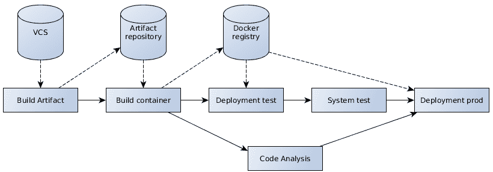
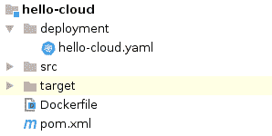
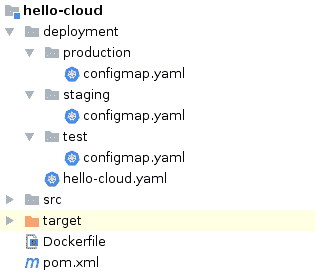
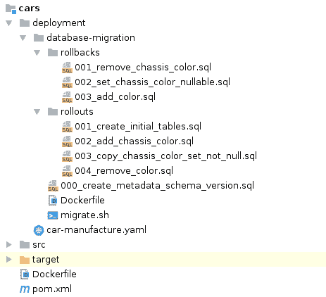
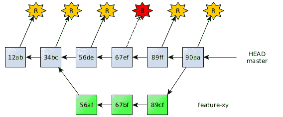

# 第六章：应用程序开发工作流程

在上一章中，我们看到了软件公司快速行动的必要性。这对基础设施和运行时环境以及工程师团队的合作方式都有影响。现代环境的动机在于可扩展性、灵活性和最小化时间和精力。

开发工作流程甚至比基础设施本身更重要。从编写源代码到运行的应用程序在生产中运行的全过程都应该以合理和高效的方式进行指定。再次强调，在快速变化的世界中快速行动意味着这些流程应该尽可能自动化和可靠地运行，尽可能减少人为干预。

本章将涵盖以下主题：

+   持续交付的动机和必要性

+   生产力管道的内容

+   如何自动化所有涉及步骤

+   如何可持续地确保和提升软件质量

+   所需的团队文化和习惯

# 生产力开发工作流程的动机和目标

在开发工作流程中快速行动旨在通过快速周转来提供快速反馈。为了提高生产力，负责应用程序行为的开发者需要及时验证实施的功能和错误修复。这包括在构建、软件测试和部署上花费的时间。

生产力工作流程的关键是自动化。软件工程师应该尽可能多地花时间在设计、实施和讨论业务逻辑上，尽可能少地花在横切关注点和重复性任务上。计算机被设计用来快速且可靠地执行确定性和直接的任务。然而，人类在设计和思考创造性、复杂任务方面更擅长。因此，不需要太多决策的简单、直接的过程应该由软件执行。

构建系统是一个良好的起点。它们自动化编译、解决依赖关系和软件项目的打包。持续集成服务器将这种方法进一步推进。它们协调整个开发工作流程，从构建工件到自动化测试和部署。持续集成服务器是软件交付的*黄金真相来源*。它们在中央位置持续集成所有开发者的工作，确保项目处于可发货状态。

持续交付通过在每次构建时自动将构建的软件发送到某些环境，继续了持续集成的做法。由于软件更改在进入生产之前必须得到适当的验证，因此应用程序首先部署到测试和预生产环境中。所有部署操作都必须确保环境已准备好并正确配置，并且已正确推出。自动和手动端到端测试确保软件按预期工作。然后通过手动触发自动化部署以*半自动化*的方式将软件部署到生产环境中。

持续交付与持续部署之间的区别在于，后者在满足质量要求的情况下，会自动将每个提交的软件版本部署到生产环境中。

所有这些方法都最大限度地减少了开发者干预的需求，最大限度地减少了周转时间，并提高了生产力。

理想情况下，持续交付方法不仅支持推出，还支持可靠的回滚。尽管软件版本在验证之前，但有时出于某些原因需要回滚。在这种情况下，可以通过提交一个将撤销最近更改的新版本，或者回滚到工作状态的方式来向前推进。

如前所述，软件应以可靠的方式进行构建。所有使用的技术的版本，例如构建依赖项或应用程序服务器，都应明确指定。重新构建的应用程序和容器会产生相同的结果。同样，开发工作流程的管道步骤也应产生相同的输出。确保在测试环境中验证过的相同应用程序工件随后被部署到生产环境中至关重要。在本章的后面部分，我们将介绍如何实现可重复、可重复和独立的构建。

在可靠性方面，自动化流程也是一个重要方面。特别是，由软件执行而不是人为干预的部署远不太可能出错。所有必要的管道步骤都得到了很好的定义，并且在每次执行时都隐式验证。这为自动化流程建立了信心，最终比手动执行流程更可靠。

验证和测试是持续交付的重要前提。经验表明，绝大多数软件测试都可以以自动化的方式进行执行。下一章将深入探讨这一主题。除了测试之外，质量保证还涵盖了项目在架构和代码质量方面的软件质量。

持续交付工作流程包括构建、测试、运输和以生产化和自动化的方式部署软件所需的所有步骤。让我们看看如何构建有效的工作流程。

# 实现开发工作流程

持续交付管道由多个按顺序或并行执行的管道构建步骤组成。所有步骤都是作为单个构建的一部分执行的。构建通常由提交或更确切地说，是将代码更改推送到版本控制中触发。

以下将探讨持续交付管道的各个方面。这些通用步骤与所使用的技术无关。

下图展示了简化后的持续交付管道的高级概述。这些步骤在持续集成服务器上执行，并使用外部仓库，如版本控制、工件和容器仓库：



# 版本控制一切

开发者普遍认为源代码应该被纳入版本控制。分布式版本控制工具，如 Git，已被广泛接受为最先进的工具。然而，正如之前提到的，除了应用程序源代码外，还有更多资产需要跟踪。

基础设施即代码背后的动机是将所有需要部署应用程序的工件保存在一个中央位置。对应用程序、配置或环境所做的所有更改都表示为代码并提交到仓库。基础设施即代码利用可重复性和自动化。进一步采取这种方法还包括将持续交付管道定义为代码。*管道即代码*部分将以广泛使用的 Jenkins 服务器为例介绍这种方法。

正如我们在上一章中看到的，12 因素应用的第一原则实际上是将构建和运行应用程序所需的所有文件和工件保存在一个仓库中。

持续交付管道的第一步是从版本控制仓库检出特定的提交。使用分布式版本控制系统的团队需要将所需状态同步到集中式仓库。持续集成服务器从历史中的特定提交状态开始启动构建过程。

选择特定提交版本而不是最新状态的原因是为了实现可重复性。只有基于特定提交的构建才能可靠地产生相同的结果。这只有在构建是从带有特定提交的版本控制检查中开始的条件下才可能实现。检查入操作通常从相应的提交版本触发构建。

检出仓库状态提供了所有必要的源代码和文件。下一步是构建软件工件。

# 构建二进制文件

正如我们在第一章中看到的，术语二进制文件包括所有运行企业应用程序的可执行工件。项目仓库仅包含源代码和基础设施所需文件和工件。二进制文件由持续集成服务器构建。

管道中的一个步骤负责构建这些二进制文件并以可靠的方式使其可用。

# Java 艺术品

在 Java EE 中，二进制文件首先包括以归档形式打包的企业应用程序。遵循零依赖应用程序的方法会导致将项目构建和打包到一个薄的 WAR 文件中，其中只包含应用程序的业务逻辑。此构建操作包括解决所需的依赖项、编译 Java 源代码，并将二进制类和其他文件打包到归档中。WAR 文件是构建管道中产生的第一个艺术品。

应用程序艺术品使用 Maven 或 Gradle 等构建系统构建，这些系统安装在 CI 服务器上并执行。通常，项目构建已经执行了基本的代码级别测试。无需容器运行时即可在代码级别执行的测试可以在管道早期验证类和组件的行为。快速失败和尽可能早地中断构建的持续交付方法最小化了周转时间。

如果需要，构建系统可以将艺术品发布到艺术品仓库。例如，**Sonatype Nexus** 或 **JFrog Artifactory** 这样的艺术品仓库保存构建的艺术品版本以供以后检索。然而，如果应用程序以 Linux 容器形式分发，艺术品不一定需要部署到仓库。

如第二章所示，*设计和结构化 Java 企业应用程序*，Java 项目通过命令 `mvn package` 使用 Maven 构建。包阶段编译所有 Java 生产源代码，编译和执行测试源代码，并将应用程序（在我们的例子中）打包到 WAR 文件中。CI 服务器执行类似此命令的构建系统命令，在本地工作区目录中构建艺术品。可以使用 `mvn deploy` 命令将艺术品部署到艺术品仓库，用于后续步骤；或者它可以直接从工作区目录中获取。

# 艺术品版本

如前所述，构建系统需要以可靠的方式生成艺术品。这要求 Java 艺术品以独特的版本构建和归档，以便以后可以识别。软件测试验证企业应用程序的特定版本。后续部署需要引用后续构建步骤中的相同版本。能够识别和引用不同的艺术品版本是必要的。这对于所有二进制文件都适用。

12 个因素原则之一是明确声明依赖项，不仅适用于正在使用的依赖项，还适用于它们的版本。如前所述，这对于容器构建同样适用。指定的 Docker 基础镜像以及安装的软件应通过它们的版本明确、唯一地标识。

然而，指定 Java 构建为快照版本是很常见的，例如，`0.1-SNAPSHOT`。与发布版本不同，快照代表当前正在开发的软件状态。依赖关系解析始终尝试在存在多个快照版本时包含最新的快照，类似于 Docker 的`latest`标签。快照背后的工作流程是在开发水平足够时，将快照版本发布到唯一编号的版本。

然而，快照版本与持续交付的理念相矛盾。在持续交付管道中，每个提交都是一个潜在的生产部署候选者。快照版本自然不适用于生产部署。这意味着工作流程需要将快照版本更改为发布版本，一旦软件版本得到充分验证。然而，一旦构建完成，Java 工件就不应该被更改。经过验证的相同工件应该用于部署。因此，快照版本不适合持续交付管道。

遵循广泛采用的语义版本化方法，应用开发者需要关注其版本的向后兼容性。语义版本化描述了如`1.1.0`、`1.0.0-beta`或`1.0.1+b102`这样的软件版本。为了表示既适用于持续交付又提供语义版本化元数据的版本，带有唯一构建元数据的正确编号版本是一个很好的解决方案。例如，`1.0.1+b102`表示*主版本*为`1`、*次版本*为`0`、*修订版本*为`1`和构建编号`102`。加号后面的部分代表可选的构建元数据。即使在一连串构建中语义版本没有改变，产生的工件仍然可以识别。这些工件可以被发布到工件仓库，并通过这些版本号在以后检索。

这种版本化方法针对的是企业级应用项目，而不是产品。同时拥有多个已发布和受支持版本的产品，需要更复杂的版本化工作流程。

在撰写本文时，还没有关于容器版本化的既定标准。一些公司遵循语义版本化方法，而其他公司则仅使用 CI 服务器构建编号或提交哈希。所有这些方法都是有效的，只要容器镜像不使用相同的标签重建或分发两次。单个构建必须产生一个独特的容器镜像版本。

# 构建容器

容器镜像也代表二进制文件，因为它们包含了运行中的应用程序，包括运行时和操作系统二进制文件。为了构建容器镜像，需要存在基础镜像以及所有在构建时添加的工件。如果它们在构建环境中不存在，基础镜像会隐式地被检索。

对于在 Dockerfile 中定义的每个构建步骤，都会在上一层之上添加一个镜像层。最后但同样重要的是，将刚刚构建的应用程序添加到容器镜像构建中。如前所述，Java EE 应用程序容器由一个安装和配置的应用服务器组成，该服务器在运行时自动部署 Web 存档。

这个镜像构建是由 CI 服务器作为流水线的一部分来执行的。一个解决方案是安装 Docker 运行时，就像 Maven 构建系统一样。然后，流水线步骤简单地调用在作业工作空间目录中的类似`docker build -t docker.example.com/hello-cloud:1 .`的镜像构建。例如，Docker 镜像构建会将 Maven 的`target`目录下的 WAR 文件添加到容器中。

构建的镜像会根据构建号或其他唯一信息标记为镜像名称和唯一标记。Docker 镜像名称暗示了它们将被推送到哪个注册表。例如，`docker.example.com/hello-cloud:1`这样的镜像标识符将隐式地从主机`docker.example.com`传输。在大多数情况下，流水线会将镜像推送到 Docker 注册表，通常是公司特定的注册表。

根据公司的流程，Docker 镜像也可以作为流水线的一部分进行重新标记。例如，特殊的标记，如`latest`标记，可以指向实际构建的最新版本等。这是通过显式重新标记镜像来实现的，使得两个标识符指向同一个镜像。与 Java 归档不同，Docker 镜像可以在不更改其内容的情况下重新标记。第二个标记还需要推送到仓库。然而，本章的其余部分将向您展示，使用*latest*版本，如 Docker 的`latest`标记来引用镜像并不是必需的。实际上，与快照版本类似，建议避免使用*latest*版本。在所有工件版本中保持明确性可以减少错误的可能性。

一些工程师认为，如果 CI 服务器本身运行在 Docker 容器中，在 CI 服务器内部运行 Docker 构建可能不是最佳选择。Docker 镜像构建会临时运行容器。当然，可以在容器中运行容器或将运行时连接到另一个 Docker 主机，而不必将整个平台暴露于潜在的安全风险。然而，一些公司选择在 CI 服务器之外构建镜像。例如，OpenShift，一个建立在 Kubernetes 之上的 PaaS，提供了包含 CI 服务器和镜像构建功能的构建功能。因此，可以从 CI 服务器编排镜像构建，然后在 OpenShift 平台上构建。这为在 CI 服务器上直接构建容器镜像提供了另一种选择。

# 质量保证

Java 工件构建已经执行了一些基本的质量保证。它执行包含的代码级别测试，例如单元测试。一个合理的管道由几个测试范围和场景组成，它们都有略微不同的优势和劣势。包含的单元测试在代码级别运行，可以在没有任何进一步运行环境的情况下执行。它们的目的是验证单个类和组件的行为，并在测试失败的情况下提供快速反馈。我们将在下一章中看到，单元测试需要独立且快速地运行。

测试结果通常从 CI 服务器记录下来，以便于可见性和监控。使管道步骤的结果可见是持续交付的重要方面。CI 服务器可以跟踪通过的单位测试数量，并显示随时间的变化趋势。

可用的构建系统插件可以跟踪执行测试的代码覆盖率。覆盖率显示了在测试运行期间代码库的哪些部分已被执行。一般来说，更高的代码覆盖率是可取的。然而，覆盖率的高百分比本身并不能说明测试的质量和测试断言的覆盖率。测试结果及其覆盖率只是几个质量特性之一。

源代码已经可以提供关于软件质量的很多信息。所谓的**静态代码分析**在项目静态源代码文件上执行某些质量检查，而不执行它们。这种分析收集有关代码语句、类和方法的大小、类和包之间的依赖关系以及方法复杂性的信息。静态代码分析已经可以在源代码中找到潜在的错误，例如未正确关闭的资源。

**SonarQube** 是最知名的代码质量工具之一。它通过关联不同分析方法的结果，如静态代码分析或测试覆盖率，来提供关于软件项目质量的信息。合并的信息被用来为软件工程师和架构师提供有用的质量指标。例如，哪些方法是复杂的但同时又经过充分测试的？哪些组件和类在大小和复杂性方面最大，因此是重构的候选者？哪些包存在循环依赖，可能包含应该合并在一起的组件？测试覆盖率是如何随时间演变的？有多少代码分析警告和错误，以及这个数字是如何随时间演变的？

遵循一些关于静态代码分析的基本指南是明智的。一些指标只是从粗略的角度提供了关于软件质量的见解。测试覆盖率就是一个例子。覆盖率高的项目并不一定意味着软件经过良好的测试；断言语句可能是不切实际的或不足够的。然而，测试覆盖率的趋势确实可以提供关于质量的信息，例如，软件测试是否添加了新的和现有的功能以及错误修复。

也有一些指标应该严格遵守。代码分析警告和错误就是其中之一。警告和错误会告诉工程师有关代码风格和质量违规的问题。它们是关于需要修复的问题的指标。

首先，不应该有编译或分析警告。要么构建通过了足够的质量检查，一个**绿灯**；要么质量不足以部署，一个**红灯**。两者之间没有合理的中间状态。软件团队需要明确哪些问题是合理的并且需要解决，哪些不是。因此，项目中表明轻微问题的警告被视为错误；如果有充分的理由解决它们，工程师必须这样做，否则构建应该失败。如果检测到的错误或警告代表了一个**假阳性**，它不会被解决；相反，它必须由过程忽略。在这种情况下，构建是成功的。

采用这种方法可以实现**零警告政策**。项目构建和分析中始终存在大量错误和警告，即使它们不是关键的，也会引入某些问题。现有的警告和错误会模糊项目的质量视图。工程师无法一眼看出数百个问题是否真的是问题。此外，已经存在大量问题会削弱工程师修复新引入的警告的积极性。例如，想象一个房屋状况极差，墙壁损坏，窗户破碎。如果再有一扇窗户破碎，没有人会在意。但是，一个最近破碎的窗户，而其他方面都保养得很好的房子，会促使负责人采取行动。对于软件质量检查也是如此。如果有数百个警告，没有人会关心最后一次提交中新引入的违规行为。因此，项目的质量违规数量应该是零。构建或代码分析中的错误应该中断管道构建。要么项目代码需要修复，要么需要调整质量规则以解决问题。

代码质量工具，如 SonarQube，在构建管道步骤中集成。由于质量分析仅操作静态输入，该步骤可以轻松并行化到下一个管道步骤。如果质量门不接受结果，构建将失败，工程师需要在继续开发之前解决该问题。这是将质量集成到管道中的重要方面。分析不仅应该提供见解，还应该积极阻止执行以强制采取行动。

# 部署

在构建二进制文件之后，或在软件质量正在验证期间，企业应用程序将被部署。根据项目情况，通常有几个用于测试目的的环境，例如测试或预发布，当然还有生产环境。如前所述，这些环境应尽可能相似。这大大简化了 CI 服务器编排的部署过程。

部署应用程序的过程通常涉及将刚刚构建的版本中的二进制文件部署到环境中。根据基础设施的外观，这可以通过简单的脚本或更复杂的技术来实现。原则应该是相同的，二进制文件以及配置应以自动和可靠的方式提供给环境。在这个步骤中，还将执行应用程序或环境可能需要的潜在准备步骤。

现代环境，例如容器编排框架，支持基础设施即代码。基础设施配置被捕获在项目仓库中的文件中，并在部署时应用于所有环境。潜在差异，例如 Kubernetes 配置映射的内容，也在仓库中以不同的表现形式表示。

使用 IaC 以及容器比自制的 shell 脚本提供更高的可靠性。应用程序应始终以幂等的方式部署，无论环境处于何种状态。由于容器镜像包含整个堆栈，结果与从头开始安装软件相同。所需的环境配置也通过 IaC 文件应用。

新的容器镜像版本可以通过编排框架以多种方式部署。有一些命令会明确设置 Kubernetes 部署中使用的 Docker 镜像。然而，为了满足可靠性和可重复性的要求，只编辑基础设施即代码文件并在集群上应用它们是有意义的。这确保了配置文件是唯一的真相来源。CI 服务器可以编辑 IaC 文件中的镜像定义，并将更改提交到 VCS 仓库。

如前一章所述，Docker 镜像在 Kubernetes 部署定义中指定：

```java
# deployment definition similar to previous chapter
# ...
    spec:
      containers:
      - name: hello-cloud
        image: docker.example.com/hello-cloud:1
        imagePullPolicy: IfNotPresent
        livenessProbe:
# ...
```

这些镜像定义在 CI 服务器过程中更新，并应用于 Kubernetes 集群。CI 服务器通过`kubectl` CLI 执行 Kubernetes 命令。这是与 Kubernetes 集群通信的标准方式。`kubectl apply -f <file>`将包含 YAML 或 JSON 定义的文件或目录的基础设施即代码内容应用。管道步骤执行与此类似的命令，提供在项目仓库中更新的 Kubernetes 文件。

采用这种方法使得基础设施即代码文件既包含环境的当前状态，也包含工程师所做的更改。所有更新都是通过将相应版本的 Kubernetes 文件应用到集群中来进行的。集群旨在满足新的期望状态，包含新的镜像版本，因此将执行滚动更新。在触发此更新后，CI 服务器将验证部署是否已成功执行。可以通过类似于`kubectl rollout status <deployment>`的命令来跟踪 Kubernetes 的滚动操作，该命令等待部署成功滚动或失败。

此过程将在所有环境中执行。如果为多个环境使用单个部署定义，则只需更新一次镜像标签定义，当然。

为了给出一个更具体的例子，以下展示了 Maven 项目的潜在配置文件结构：



`hello-cloud.yaml`文件包含多个 Kubernetes 资源定义。这可以通过用三条横线(`---`)分隔每个 YAML 对象定义来实现。为每种资源类型提供单独的文件，例如`deployment.yaml`、`service.yaml`等，也是同样可行的。Kubernetes 可以处理这两种方法。YAML 对象中的`kind`类型定义指示资源的类型。

上一章展示了容器编排框架如何实现零停机时间部署。将新镜像版本应用到由 CI 服务器编排的环境中也实现了这一目标。因此，环境将能够一次至少服务一个活动应用程序。这种方法对于生产环境尤为重要。

# 配置

理想情况下，基础设施即代码涵盖了定义整个环境所需的所有方面，包括运行时、网络和配置。使用容器技术和容器编排极大地支持和简化了这种方法。如前所述，机密内容，如凭证，不应置于版本控制之下。这应该由管理员手动在环境中进行配置。

在多个环境中不同的配置可以使用项目存储库中的多个文件来表示。例如，为每个环境包含子文件夹是有意义的。以下图像展示了示例：



`configmap.yaml` 文件的内容包括特定的配置映射内容以及可能的不同命名空间定义。如前一章所述，Kubernetes 命名空间是一种区分环境的方式。以下代码展示了特定生产配置映射的示例：

```java
---
kind: ConfigMap
apiVersion: v1
metadata:
  name: hello-cloud-config
  namespace: production
data:
  application.properties: |
    hello.greeting=Hello production
    hello.name=Java EE
---
```

# 凭证

由于安全原因，通常不会在项目存储库中包含秘密内容，如凭证。管理员通常会在特定环境中手动配置它们。与其他 Kubernetes 资源类似，秘密绑定到特定的命名空间。

如果一个项目需要多个秘密，例如，针对各种外部系统的特定凭证，手动配置它们可能会变得繁琐且难以跟踪。配置的秘密必须以安全的形式进行文档化和跟踪，且在项目存储库之外。

另一种方法是在存储库中存储加密凭证，这些凭证可以使用单个主密钥解密。因此，存储库可以安全地包含配置的凭证，以加密形式存在，同时仍然安全，不会泄露秘密。运行中的应用程序将使用动态提供的主密钥来解密配置的凭证。这种方法提供了安全性和可管理性。

让我们看看一个潜在的解决方案。加密的配置值可以安全地存储在 Kubernetes 配置映射中，因为解密后的值只会对容器进程可见。项目可以在配置映射定义中将加密凭证与其他配置值一起定义为代码。管理员为每个环境添加一个包含用于对称加密凭证的主密钥的秘密。这个主密钥被提供给运行中的容器，例如，使用前面看到的作为环境变量。运行中的应用程序使用这个单一的环境变量来解密所有加密的凭证值。

根据所使用的技术和算法，一个解决方案是在加载属性文件时直接使用 Java EE 应用程序解密凭证。为了提供一个使用最新加密算法的安全解决方案，应在运行时安装**Java 密码学扩展**（**JCE**）。另一种方法是部署应用程序之前先解密值。

# 数据迁移

使用数据库存储其状态的程序绑定到特定的数据库模式。通常，模式的变化需要应用程序模型进行更改，反之亦然。随着应用程序的积极开发和领域模型的持续精炼和重构，模型最终将需要数据库模式进行更改。新添加的模型类或其属性需要也在数据库中持久化。重构或删除的类和属性也应该在数据库中进行迁移，以避免模式出现分歧。

然而，数据迁移比代码更改更困难。无状态应用程序可以简单地用新版本替换，其中包含新的功能。然而，包含应用程序状态的数据库需要在模式更改时仔细迁移状态。

这种情况发生在迁移脚本中。关系型数据库支持在保持数据完整性的同时更改其表。这些脚本在部署软件的新版本之前执行，确保数据库模式与应用程序匹配。

在使用零停机时间方法部署应用程序时，需要记住一个重要的方面。滚动更新将至少在环境中同时运行一个活动实例。这导致旧软件版本和新软件版本在短时间内同时激活。编排应该注意，应用程序应该优雅地启动和关闭，分别让正在进行的请求完成其工作。连接到中央数据库实例的应用程序将导致多个应用程序版本同时访问数据库。这要求应用程序支持所谓的**N-1 兼容性**。当前的应用程序版本需要与加上和减去一个版本的相同数据库模式版本一起工作。

为了支持 N-1 兼容性，滚动更新方法需要同时部署新的应用程序版本和更新数据库模式，确保版本之间的差异不超过一个版本。这意味着，相应的数据库迁移将在应用程序部署之前执行。因此，数据库模式和应用程序都通过小迁移步骤而不是跳跃式地发展。

然而，这种方法并不简单，涉及一定的规划和谨慎。特别是，应用程序版本回滚需要特别注意。

# 添加数据库结构

向数据库模式添加表或表列相对简单。新的表或列不会与旧的应用程序版本冲突，因为它们对它们来说是未知的。

由新的领域实体产生的新表可以直接添加到模式中，从而产生版本*N+1*。

定义某些约束（如 *not null* 或 *unique*）的新表列需要考虑表当前的状态。旧的应用程序版本仍然可以向表中写入；它将忽略新列。因此，约束不一定能够满足。新列首先必须是 *可空的* 并且没有其他约束。新的应用程序版本必须处理该列中的空值，可能是来自旧应用程序版本的 `null` 值。

只有在当前部署完成后，下一个版本（*N+2*）才会包含正确的约束。这意味着添加定义约束的列至少需要两个单独的部署。第一个部署添加了列，并以 `null`-安全的方式增强了应用程序的模型。第二个部署确保所有包含的值满足列约束，添加约束，并移除 `null`-安全行为。当然，这些步骤仅在列的目标状态定义约束时才是必需的。

回滚到旧版本的方式类似。回滚到中间部署（从 *N+2* 到 *N+1*）需要再次移除约束。

回滚到原始状态（*N+0*）将删除整个列。然而，数据迁移不应删除未转移到其他地方的数据。回滚到没有列的状态也可以简单地不更改列，以避免丢失数据。业务专家必须回答的问题是：在此期间添加的数据会发生什么？故意不删除这些数据可能是一个合理的方法。然而，当再次添加列时，滚动脚本需要考虑已存在的列。

# 更改数据库结构

更改现有的数据库表或列更为复杂。无论是重命名列还是更改类型或约束，过渡必须在几个步骤中执行。直接重命名或更改列会导致与已部署的应用程序实例不兼容；更改需要中间列。

让我们用一个例子来检查这种方法。假设汽车实体有一个属性 *color*，必须设置，在数据库列 `color` 中表示。假设它将被重构为数据库列中的 *chassis color* 或 `chassis_color`。

与之前的方法类似，更改是在几次部署中执行的。第一次部署添加了一个可空列 `chassis_color`。应用程序代码被增强以使用新的模型属性。由于较旧的应用程序版本尚不了解该属性，因此在第一次部署期间并非从所有位置可靠地写入，因此第一个代码版本仍然从旧的、`color` 列中读取颜色，但将值写入旧列和新列。

下一次部署的迁移脚本通过用`color`列的内容覆盖`chassis_color`列来更新缺失的列值。通过这样做，确保新列被一致地填充。同时，也将非空约束添加到新列。然后，应用程序代码版本将只从新的列读取，但仍然写入两个列，因为旧版本在短时间内仍然活跃。

下一次部署步骤将`color`列的非空约束移除。这个版本的应用程序代码不再使用旧列，而是读取和写入`chassis_color`。

接下来和最终的部署将删除`color`列。现在所有数据已经逐步转移到新的`chassis_color`列。应用程序代码不再包含旧模型属性。

更改列类型或外键约束需要类似的步骤。以零停机时间逐步迁移数据库的唯一方法是分小步骤迁移，使用中间列和属性。建议对迁移脚本和应用程序代码进行几个只包含这些更改的提交。

与之前的方法类似，回滚迁移必须在数据库脚本和代码更改的反向顺序中执行。

# 删除数据库结构

删除表或列比更改它们更直接。一旦领域模型的一些属性不再需要，它们的用法就可以从应用程序中移除。

首次部署将应用程序代码修改为停止从数据库列读取，但仍继续向其写入。这是为了确保旧版本仍然可以读取除`null`之外的其他值。

下一次部署将从数据库列移除一个可能的非空约束。应用程序代码停止向该列写入。在这一步中，模型属性的出现已经可以从代码库中移除。

最终部署步骤将删除该列。如前所述，是否实际删除列数据高度依赖于业务用例。回滚脚本需要重新创建已删除的列，这意味着之前的数据已经丢失。

# 实施迁移

正如我们所看到的，数据迁移必须分几个步骤执行。部署前的回滚脚本以及部署。这意味着应用程序支持 N-1 兼容性，并且一次只执行一个部署。

迁移过程需要执行多个软件版本发布，每个版本在应用程序代码和模式迁移脚本上都是一致的。工程师需要相应地规划他们的提交。及时执行完整的模式迁移是明智的，以保持数据库模式整洁，并确保持续迁移不会被简单地遗忘。

相应模型重构的本质在于，现有数据是否需要保留或可以丢弃。一般来说，建议不要丢弃数据。这意味着不要删除包含不存在于其他地方的数据的结构。

正如我们在示例中看到的，迁移将以优雅的步骤进行；特别是在数据库约束方面，如*非空*或引用完整性约束。迁移脚本应该是健壮的。例如，迁移不应该在尝试创建已存在的列时失败。它们可能已经存在于之前的回滚中。一般来说，提前思考和测试不同的滚动和回滚场景是有意义的。

工程师在更新表内容时需要考虑更新时间。一次性更新大型表将花费相当多的时间，数据可能会被锁定。这需要提前考虑；理想情况下，通过在单独的数据库中测试脚本来实现。对于涉及大量数据的情况，可以通过按 ID 分区数据等方式，将更新步骤分批执行。

所有滚动和回滚迁移脚本都应该位于项目存储库中。数据库模式包括一个与编号迁移脚本相对应的模式版本。这个版本作为元数据存储在数据库中，与当前的架构状态一起。在每次部署之前，数据库模式都会迁移到期望的版本。紧接着，具有相应版本的程序被部署，确保版本之间不会超过一个版本。

在容器编排框架中，这意味着在通过滚动更新部署新应用程序版本之前，需要执行数据库迁移。由于可能有多个 pod 副本，这个过程必须是幂等的。将数据库架构迁移到同一版本两次，必须产生相同的结果。Kubernetes pods 可以定义所谓的**初始化容器**，这些容器在真实容器启动之前执行*一次性*过程。初始化容器是互斥运行的。它们必须成功退出，然后才能启动实际的 pod 容器进程。

以下代码片段展示了`initContainer`的一个示例：

```java
# ...
    spec:
      containers:
      - name: hello-cloud
        image: .../hello-cloud:1
      initContainers:
      - name: migrate-vehicle-db
        image: postgres
        command: ['/migrate.sh', '$VERSION']
# ...
```

前面的例子表明，初始化容器镜像包含了连接到数据库实例的正确工具以及所有最近的迁移脚本。为了实现这一点，这个镜像也被构建到管道中，包括从存储库中获取的所有迁移脚本。

然而，有许多方法可以迁移数据库模式。这里的重要方面是，需要先执行幂等迁移，同时不进行第二次部署操作。相应版本的迁移脚本将按顺序执行，直到版本匹配。脚本执行后，数据库中的元数据版本也会更新。

代码版本和数据库版本之间的关联可以在项目仓库中跟踪。例如，包含在提交版本中的最新部署脚本对应于所需的数据库模式。*构建元数据*部分更深入地讨论了所需的元数据和存储位置。

由于所选择的迁移解决方案高度依赖于项目的技术，因此这里没有一种可以展示的*万能解药*方法。以下示例提供了一个可能的解决方案，关于迁移文件结构和执行过程的*伪代码*。它展示了将之前讨论的`color`列更改为`chassis_color`的迁移文件示例：



上述示例展示了将数据库模式版本迁移到所需状态的部署和回滚脚本。部署脚本`004_remove_color.sql`通过删除之前展示的示例中的`color`列，将模式版本转换为版本`4`。相应的回滚脚本`003_add_color.sql`将模式回滚到版本`3`，其中`color`列仍然存在；换句话说，版本`3`包含`color`列，而版本`4`不包含，这两个迁移文件能够来回回滚。

以下展示了执行迁移的脚本的伪代码。在调用脚本时，要迁移的目标版本作为参数提供：

```java
current_version = select the current schema version stored in the database

if current_version == desired_version
    exit, nothing to do

if current_version < desired_version
    folder = /rollouts/
    script_sequence = range from current_version + 1 to desired_version

if current_version > desired_version
    folder = /rollbacks/
    script_sequence = range from current_version - 1 to desired_version

for i in script_sequence
    execute script in folder/i_*.sql
    update schema version to i
```

此迁移脚本在实际部署之前在初始化容器中执行。

# 测试

验证管道步骤的输出是持续交付中最重要方面之一。它通过在上线前检测潜在错误来提高软件质量。适当的验证在过程中创造了可靠性。通过编写软件测试，尤其是回归测试，开发者对更改和重构功能变得自信。最终，软件测试使我们能够自动化开发过程。

构建二进制文件已经执行了代码级别的测试。项目中的其他测试可能需要在单独的管道步骤中执行，具体取决于它们是否在代码级别或运行容器中操作。特别是端到端测试需要运行环境。

在应用程序已部署到测试环境后，可以执行端到端测试。通常，一个项目包含几个测试层，具有不同的责任，在单独的步骤中运行。根据项目和使用的技术的不同，可能会有各种各样的测试。始终的做法是执行流水线步骤并充分验证结果。通过这样做，可以最小化破坏新或现有功能以及引入潜在错误的风险。特别是，具有*生产就绪*特性的容器编排框架支持公司实现交付可扩展、高可用性、高质量的企业应用程序的目标。第七章*测试*涵盖了测试的所有不同表现形式，包括其在持续交付流水线中的执行。

考试不及格将立即导致流水线停止，并阻止相应的二进制文件进一步使用。这是实现快速反馈并加强软件质量过程的一个重要方面。工程师应绝对避免绕过正常流程的步骤和其他*快速修复*。这些做法与持续改进和将质量融入持续交付流程的理念相矛盾，并最终导致错误。如果测试或质量门失败，构建必须中断，或者必须更改应用程序的代码或验证。

考试不及格不仅应该中断构建，还应该提供关于为什么该步骤失败以及记录结果的见解。这是构建元数据的一部分。

# 构建元数据

构建元数据记录了在构建执行过程中收集的所有信息。特别是，所有资产的具体版本应被跟踪以供进一步参考。

从头到尾运行的构建不一定需要更多信息。步骤在一个运行中执行，直到构建中断或成功完成。然而，如果需要引用或重新执行特定的步骤或工件，则需要更多信息。

艺术品版本是这种必要性的主要例子。WAR 文件及其内容对应于 VCS 提交历史中的一个特定版本。为了跟踪从部署的应用程序中起源的提交，这些信息需要被跟踪。对于容器镜像版本也是如此。为了识别容器的起源和内容，版本需要可追溯。数据库模式版本是另一个例子。数据库模式版本通过遵循 N-1 兼容性匹配特定应用程序版本，包括上一个和下一个版本。需要迁移数据库模式的部署必须知道要迁移到的数据库模式版本，以便达到所需的应用程序版本。

当流程允许推出特定应用程序版本时，需要特别要求构建元数据。通常，连续交付部署会向前推进到当前存储库版本。然而，特别是涉及数据库模式和迁移时，将环境滚动到任意状态的可能性是一个巨大的好处。理论上，这个过程是这样的：*获取这个特定的应用程序版本，并执行所有必要的操作，以便在该特定环境中运行它*，无论推出是向前还是向后移动。

为了提高可追溯性和可重现性，建议跟踪有关构建的质量信息。这包括，例如，自动化测试结果、手动测试或代码质量分析的结果。然后部署步骤能够在部署前验证特定元数据的存在。

存储元数据有许多可能的解决方案。一些工件存储库，如 JFrog Artifactory，提供了将构建工件与自定义元数据链接的可能性。

另一种方法是使用持续集成服务器来跟踪这些信息。这听起来像是存储构建元数据的良好选择；然而，根据持续集成服务器的操作和设置方式，不一定建议用它来存储持久数据。旧构建可以被丢弃并丢失信息。

通常，存储工件和信息时，*真实点*的数量应该保持较低，并且明确定义。因此，使用工件存储库来存储元数据确实是有意义的。

另一种更定制化的解决方案是使用公司版本控制系统（VCS）存储库来跟踪某些信息。使用，例如，Git 来存储元数据的一个大优点是它提供了持久数据及其结构的完全灵活性。持续集成服务器已经包含访问 VCS 存储库的功能，因此不需要特定的供应商工具。存储库可以存储所有类型的信息，这些信息作为文件持久化，例如记录的测试结果。

不论如何实现，元数据存储库在管道的多个点被访问，例如在执行部署时。

# 迁移到生产环境

连续交付管道的最后一步是将代码部署到生产环境。这种部署可以是手动触发的，或者在实施足够的验证和自动化测试后自动触发。绝大多数公司使用手动触发的部署。但即使管道不是从一开始就“完全”进行，连续交付通过自动化所有必要的步骤也能提供巨大的好处。

管道然后只有两个启动点：触发执行的仓库初始提交，以及所有步骤经过手动和自动验证后的最终部署到生产环境。

在容器编排环境中，部署到生产环境，即部署到单独的命名空间或单独的集群，与部署到测试环境的方式相同。由于基础设施作为代码的定义与之前执行的定义相似或理想上是相同的，这项技术降低了生产环境中环境不匹配的风险。

# 分支模型

软件开发流程可以利用不同的分支模型。软件分支从同一源头出现，但在开发状态上有所不同，以便能够并行开发多个开发阶段。

尤其是功能分支是一种流行的方法。功能分支创建一个单独的分支，用于开发特定的软件功能。在功能完成后，该分支被合并到*主*分支或*主干*。在功能开发期间，主分支和其他分支保持不变。

另一种分支模型是使用发布分支。发布分支包含特定版本的单一软件发布。想法是有一个专门的点用于发布版本，可以在此处添加错误修复和功能。所有应用于特定发布的对主分支所做的更改也都在发布分支中执行。

然而，这样的分支模型与持续交付的理念相矛盾。例如，功能分支会推迟功能集成到主分支。新功能集成的延迟越长，潜在的合并冲突的可能性就越大。因此，只有在功能分支是短期存在并且及时集成到主分支的情况下，才建议在持续交付管道中使用功能分支。

同时发布版本和在这些版本上工作与持续发布版本的理念相矛盾。理想情况下，实现的功能应尽可能快地发布到生产环境中。

至少对于企业项目来说是这样的。持续的生命周期意味着每个提交都是一个潜在的生产部署候选者。在主分支上集成和应用工作是有意义的，这样就可以尽早集成和部署功能，并通过自动化测试进行验证。因此，持续交付和持续部署的分支模型相当直接。更改直接应用于主分支，由构建管道构建、验证和部署。

通常不需要手动标记发布。在持续交付管道中的每个提交都隐式地有资格发布并部署到生产环境中，除非自动化验证发现错误。

下图显示了持续部署分支模型的概念：



单个功能分支保持短期存在，并及时合并回`master`分支。发布版本在构建成功时隐式创建。失败的构建不会导致生产环境的部署。

然而，对于产品以及库来说，建议采用不同的分支模型。由于存在多个支持的**主要**和**次要**版本以及它们潜在的错误修复，为不同的发布版本实现分支是有意义的。例如，发布版本分支如`v1.0.2`可以用于继续支持错误修复，例如到`v1.0.3`，而主要开发则继续在新版本上进行，例如`v2.2.0`。

# 技术

在设计持续交付管道时，问题仍然是使用哪种技术。这不仅包括 CI 服务器本身，还包括开发工作流程中使用的所有工具，如版本控制、工件存储库、构建系统和运行时技术。

使用的具体技术取决于实际需求以及团队熟悉程度。以下示例将使用 Jenkins、Git、Maven、Docker 和 Kubernetes。截至编写本书时，这些技术被广泛使用。然而，对于工程师来说，理解其背后的原理和动机更为重要。技术本身是可以互换的。

无论选择什么工具，建议使用工具的预期用途。经验表明，工具往往被错误地用于更适合使用不同技术执行的任务。一个典型的例子是构建系统，例如 Maven。项目通常定义的构建过程承担的责任不仅仅是构建工件。

不将构建容器或部署软件到工件构建中的责任混合在一起是有意义的。这些关注点最好通过连续集成服务器直接实现。将这些步骤引入构建过程是不必要的，会不必要地将构建技术与环境耦合。

因此，建议以直接的方式使用工具的预期用途。例如，建议通过相应的 Docker 二进制文件而不是构建系统插件来构建 Docker 容器。所需的高级抽象层最好在管道即代码定义中添加，如下面的示例所示。

# 管道即代码

我们之前看到了将配置表示为代码的好处，主要是基础设施即代码文件。同样的动机导致了管道即代码定义，即指定 CI 服务器管道步骤的配置。

在过去，许多 CI 服务器，如 Jenkins，需要手动配置。CI 服务器作业必须经过繁琐的操作来构建管道。特别是，为新应用程序或其功能分支重建管道需要繁琐的手动工作。

代码化流水线定义指定了作为软件项目一部分的持续交付流水线。CI 服务器根据脚本构建并执行流水线，这极大地简化了定义和重用项目构建流水线。

有许多 CI 服务器支持将流水线定义作为代码。最重要的方面是工程师理解这项技术的动机和好处。以下展示了 Jenkins 的示例，Jenkins 是 Java 生态系统中最广泛使用的 CI 服务器之一。

Jenkins 的用户可以在 `Jenkinsfile` 中构建流水线，该文件使用 Groovy DSL 定义。Groovy 是一种可选类型的动态 JVM 语言，非常适合 DSL 和脚本。Gradle 构建脚本也使用 Groovy DSL。

以下示例展示了 Java 企业项目的非常简单的流水线步骤。这些示例旨在提供一个对执行过程的粗略理解。有关 Jenkinsfile 的完整信息、其语法和语义，请参阅文档。

以下展示了一个基本的 `Jenkinsfile` 示例，其中包含了一个基本的流水线定义。

```java
node {
    prepare()

    stage('build') {
        build()
    }

    parallel failFast: false,
            'integration-test': {
                stage('integration-test') {
                    integrationTest()
                }
            },
            'analysis': {
                stage('analysis') {
                    analysis()
                }
            }

    stage('system-test') {
        systemTest()
    }

    stage('performance-test') {
        performanceTest()
    }

    stage('deploy') {
        deployProduction()
    }
}

// method definitions
```

`stage` 定义指的是 Jenkins 流水线中的步骤。由于 Groovy 脚本提供了一种完整的编程语言，因此可以并且建议应用清洁代码实践，以生成可读的代码。因此，特定步骤的内容被重构为分离的方法，所有这些方法都在相同的抽象层。

例如，`prepare()` 步骤封装了几个执行过程以满足构建前提条件，例如检出构建仓库。以下代码展示了其方法定义：

```java
def prepare() {
    deleteCachedDirs()
    checkoutGitRepos()
    prepareMetaInfo()
}
```

构建阶段还封装了几个子步骤，从执行 Maven 构建、记录元数据和测试结果，到构建 Docker 镜像。以下代码展示了其方法定义：

```java
def build() {
    buildMaven()
    testReports()
    publishArtifact()
    addBuildMetaInfo()

    buildPushDocker(dockerImage, 'cars')
    buildPushDocker(databaseMigrationDockerImage, 'cars/deployment/database-migration')
    addDockerMetaInfo()
}
```

这些示例提供了如何定义和封装特定行为到步骤的见解。提供详细的 Jenkinsfile 示例超出了本书的范围。我将向您展示必要的粗略步骤，以给出所需逻辑执行的概念，以及如何在这些流水线脚本中以可读和高效的方式定义它们。然而，实际的实现却高度依赖于项目。

Jenkins 流水线定义提供了包含所谓的流水线库的可能性。这些是包含常用功能的预定义库，旨在简化使用并减少多个项目中的重复。建议将某些功能外包到公司特定的库定义中，特别是关于环境特定的功能。

以下示例展示了将 *汽车制造* 应用程序部署到 Kubernetes 环境的过程。在将特定镜像和数据库模式版本部署到 Kubernetes 命名空间时，会在构建流水线内部调用 `deploy()` 方法：

```java
def deploy(String namespace, String dockerImage, String databaseVersion) {
    echo "deploying $dockerImage to Kubernetes $namespace"

    updateDeploymentImages(dockerImage, namespace, databaseVersion)
    applyDeployment(namespace)
    watchRollout(namespace)
}

def updateDeploymentImages(String dockerImage, String namespace, String databaseVersion) {
    updateImage(dockerImage, 'cars/deployment/$namespace/*.yaml')
    updateDatabaseVersion(databaseVersion 'cars/deployment/$namespace/*.yaml')

    dir('cars') {
        commitPush("[jenkins] updated $namespace image to $dockerImage" +
            " and database version $databaseVersion")
    }
}

def applyDeployment(namespace) {
    sh "kubectl apply --namespace=$namespace -f car-manufacture/deployment/$namespace/"
}

def watchRollout(namespace) {
    sh "kubectl rollout status --namespace=$namespace deployments car-manufacture"
}
```

此示例更新并提交了 VCS 存储库中的 Kubernetes YAML 定义。执行将基础设施即代码应用到 Kubernetes 命名空间，并等待部署完成。

这些示例旨在让读者了解如何将持续交付管道作为管道即代码定义与容器编排框架（如 Kubernetes）集成。如前所述，还可以利用管道库来封装常用的`kubectl` shell 命令。动态语言如 Groovy 允许工程师以可读的方式开发管道脚本，并以与其他代码相同的努力对待它们。

# Java EE 工作流程

展示的示例涵盖了通用的 Java 构建管道，当然，这些也适用于 Java EE。实际上，使用 Java Enterprise 高度支持高效的开发管道。快速构建以及因此快速的开发者反馈对于有效的持续交付工作流程至关重要。

无依赖的应用程序，尤其是当打包在容器中时，如我们在第四章中看到的，*轻量级 Java EE*，利用了这些原则。打包的工件或容器层中的企业应用程序，分别只包含针对 API 开发的业务逻辑。应用程序容器提供实现。

持续交付管道从无依赖的应用程序中受益，因为涉及的构建和分发步骤分别只需要短的执行和传输时间。工件构建以及容器构建尽可能快地运行，只复制绝对必要的部分。同样，发布和部署工件以及容器层只包含所需业务关注点，以最小化传输时间。这导致快速周转和快速反馈。

拥有有效的管道对于在开发团队中实施持续交付文化至关重要。由于管道运行速度快，提供快速反馈，并增加了软件质量达到标准的信心，工程师们更有动力尽早和频繁地提交代码。

如前所述，构建时间不应超过几秒钟。包括端到端测试在内的构建管道执行不应超过几分钟，理想情况下甚至更快。

付出努力使构建和管道运行更快应该是工程团队的目标。在工作日中，开发者经常构建和提交项目。每次提交都会导致一个持续交付构建，这可能是生产部署的潜在候选者。如果整个流程仅比例如多 1 分钟，那么每次构建软件时，团队中的所有开发者都要多等 1 分钟。可以想象，这种延迟随着时间的推移会累积成很大的数字。如果开发者必须等待结果，他们可能会倾向于更少地提交代码。

因此，提高管道的稳定性和性能是对团队生产力的长期投资。那些在出现错误时能更快地中断构建并提供快速、有用反馈的测试和步骤应尽可能早地运行。如果某些端到端测试由于项目性质和测试本身的性质而不可避免地运行时间更长，它们可以被定义为单独的下游管道步骤，以避免延迟早期验证的反馈。可以并行运行的步骤，如静态代码分析，应该并行运行，以加快整体执行速度。使用现代的 Java EE 开发方法极大地支持构建高效的建设管道。

然而，技术只是有效持续交付的一个方面。引入持续交付对开发团队的文化产生了更大的影响。让我们更深入地了解一下这一点。

# 持续交付文化和团队习惯

有效的持续交付依赖于健康的团队文化。如果团队不遵循持续交付的原则和建议，即使最好的技术也帮助不大。如果没有足够的软件测试来验证已部署的软件，实现自动化部署的管道几乎没有价值。如果开发者很少提交他们的更改，使得集成变得困难和繁琐，最积极的 CI 服务器也帮不上忙。如果团队不对失败的测试做出反应，或者在最坏的情况下，将测试执行设置为忽略，那么全面测试覆盖和代码质量检查就没有价值。

# 责任

持续交付始于对软件负责。如前所述，对于 DevOps 运动来说，开发者仅仅构建他们的软件并让其他团队处理潜在的错误是不够的。创建并拥有应用程序的开发团队了解其责任、使用的技术以及在潜在错误发生时的故障排除。

想象一家只有一位开发者的小型初创公司，这位开发者负责整个应用程序。显然，这个人必须处理所有技术问题，例如开发、构建、部署以及解决应用程序的故障。他将拥有关于应用程序内部的最佳知识，并能有效地解决潜在问题。显然，这种单一责任点的方法与可扩展性相反，只适用于小型团队。

在更大的公司中，有更多的应用程序、更多的开发者和更多的团队，他们有不同的责任。在分割和转移责任方面的挑战在于转移知识。理想情况下，这种知识是在一个紧密合作、共同开发相同软件的工程师团队中传播的。就像在小型初创公司一样，开发应用程序的座右铭应该是：“你构建它，你就运行它”。对于单一团队来说，这只有在中央、明确且自动化的流程支持下才有可能。实施持续交付管道实现了这些流程，以确保可靠地发布软件。

管理和改进这些流程成为整个工程师团队的责任，而不再是*运维问题*。所有开发者都有责任构建和发布对业务有价值的软件。这当然涉及一些职责或团队习惯。

# 提早且频繁地提交代码

持续交付必须由整个团队共同实践。负责功能或错误修复的开发者应该尽早且频繁地将代码提交到主分支。这对于实现持续集成至关重要。在将更改合并到主分支之前的时间越长，合并和集成功能就越困难。一次性添加复杂功能与软件*持续*进化的理念相矛盾。尚未对用户可见的功能可以通过功能开关排除。

经常提交代码鼓励开发者从一开始就编写足够的、自动化的软件测试。这当然是在开发过程中需要付出的努力，但长期来看总是会有回报。在开发功能时，工程师们对其功能性和边界有清晰的认识。从一开始就包含单元测试以及复杂的端到端测试，比在功能编写完成后进行要容易得多。

尤其对于经验较少的开发者来说，重要的是要指出，提交功能的前期版本并不是什么可耻的事情，而是开发过程的一部分。尚未重构且看起来并不完美的代码，但满足需求并提供商业价值，可以在第二次运行中清理。在开发过程中尽早提交代码比推迟到最后一刻不提交要更有帮助。

# 立即修复问题

立即解决构建错误是另一个需要培养的重要团队习惯。失败的测试不应被忽视或推迟，而应尽快修复。频繁失败且未得到妥善处理的构建会降低所有团队成员的生产力。例如，一个失败的测试使得项目无法构建，这会阻止其他开发者集成和验证他们的功能。然而，由于测试失败或质量违规导致的失败构建是验证工作有效的迹象，显然比误报（即错误地显示为绿色构建）要好得多。然而，重要的是在项目构建失败时尽快修复。开发者应该在将代码推送到中央仓库之前，在自己的本地机器上执行基本的快速验证，例如构建 Java 项目并执行代码级别的测试。他们应该注意不要滥用管道来寻找不必要的错误，这些错误会无端打扰其他团队成员。

如前所述，编译器或代码分析警告应被视为破坏构建的错误。这引入了零警告政策，敦促工程师修复问题或调整验证。因此，构建、编译或代码风格警告也是破坏构建的错误，需要尽快修复。

导致构建中断的团队成员应该是首先调查根本原因的人。然而，保持管道处于健康状态是整个团队的责任。这回到了整个团队对整个项目负责的原则。不应该有专属的*代码所有权*，也就是说，项目的一部分应该只被单个团队成员所熟知。通常情况下，编写特定功能的开发者对该功能有更好的了解。尽管如此，在所有情况下，团队应该能够处理项目的所有领域并修复潜在的问题。

# 可见性

持续交付所提供的可见性是另一个重要方面。包括提交、构建、验证和部署在内的整个开发过程都可以在一个地方进行跟踪和理解。在持续交付管道中，哪些可见性方面是重要的？

首先，需要表示软件是否处于可发货状态。这包括构建在编译、测试和代码分析方面的健康状况。仪表板或所谓的**极端反馈**设备，例如物理的绿色和红色 LED 灯，可以提供关于这一点的快速概述。

一个合理的构建可见性在构建成功时不应信息过载，但在构建失败时应提供清晰直接的洞察。这再次遵循了构建中不存在警告的原则；要么成功通过，没有其他事情要做，要么失败并需要采取行动。提供这种“绿色或红色”信息的仪表板或其他设备已经提供了有用的洞察。这些可见性工具应该对所有团队成员可访问，以促进协作。

然而，为了避免过多地干扰日常开发，首先通知负责构建中断的人员是有意义的。他们可能拥有进一步的知识，如何在必要时不会打扰到同事的工作中修复构建。CI 服务器提供发送电子邮件、使用聊天通信或其他形式通知的功能。这既提高了软件质量，也提高了开发者的生产力。

在构建过程中收集的信息可以用来衡量软件项目的质量。这首先包括构建和测试结果以及代码质量指标，如测试覆盖率。这些信息可以随时间显示，以提供关于软件质量的洞察和趋势。

其他非常有趣的元数据与构建管道本身有关。构建通常需要多长时间？一天中有多少次构建？构建失败有多频繁？最常见的失败原因是什么？失败的构建需要多长时间才能修复（*恢复时间*）？对这些问题的回答提供了关于持续交付过程质量的宝贵洞察。

收集到的信息作为进一步改进流程的良好起点。持续交付的可见性不仅照亮了当前项目状态，还可以将工程师的注意力引向某些热点。总体目标是持续改进软件。

# 持续改进

持续交付的整体心态旨在以一致的质量交付软件。自动化流程鼓励使用质量验证。

当然，良好的软件质量不是免费的。足够的测试用例以及代码质量分析需要一定的时间和精力。然而，自动化和持续提高质量，在达到初始阈值后，将长期带来回报，并最终导致更好的软件。

新功能和发现的错误在开发过程中需要充分验证，以确保功能按预期工作。通过自动化测试并将它们作为回归测试，开发者可以确信不会有新的错误在未来破坏功能。对于代码质量分析也是如此。一旦分析设置好了适当的规则，并且发现的错误被消除，它就确保了不会有新的违规行为进入软件。如果出现新的误报违规，规则会被调整，并将防止未来出现新的误报。

引入新的测试场景，如端到端测试，也极大地支持了这种方法。回归测试越来越减少新引入的错误的几率。再次强调，自动化是关键。正如我们在第七章“测试”中将会看到的，人类干预对于定义合理的测试场景是有帮助的。然而，将这些测试自动化并使其成为流程的一部分对于软件质量至关重要。通过这样做，随着时间的推移，质量会不断提高。

当然，这要求工程师将一定的优先级放在质量改进上。提高软件质量以及重构不会为业务带来任何即时利益。这些努力将长期产生回报——通过以恒定的速度继续产生新功能或以确信不会破坏其他东西的确定性来改变现有行为。

# 摘要

生产力开发工作流程需要快速周转时间和快速反馈。自动化重复性任务最小化了在构建、测试和部署上花费的时间。零依赖的 Java EE 应用程序通过最小化构建、发布和部署时间来支持快速反馈。

定义哪些错误类别会破坏构建非常重要。开发者应该意识到，构建要么因为合法错误而失败，要么通过，没有任何可以抱怨的地方。对构建结果没有影响的警告几乎没有价值。

数据迁移是另一个需要考虑的重要话题。部署无状态应用程序相对容易；需要考虑的是需要与应用程序代码匹配的数据库模式。通过滚动更新和迁移脚本，这些脚本以小批量方式推出修改，使得应用程序可以零停机时间部署。因此，应用程序需要支持 N-1 兼容性。

持续交付依赖于健康的团队文化。仅仅实施技术必要性是不够的；所有软件工程师都需要接受这些原则。潜在的构建问题、测试结果、软件质量和部署状态应该对整个软件团队可见。

持续交付流程支持软件的持续改进。添加的验证步骤，例如自动软件测试，每次构建应用程序时都会运行，从而实现回归测试并避免特定错误再次发生。当然，这要求开发者投入精力进行质量改进。在长期来看，持续交付所付出的努力将得到回报。

下一章将继续探讨软件质量领域，并将涵盖测试企业应用程序的内容。
