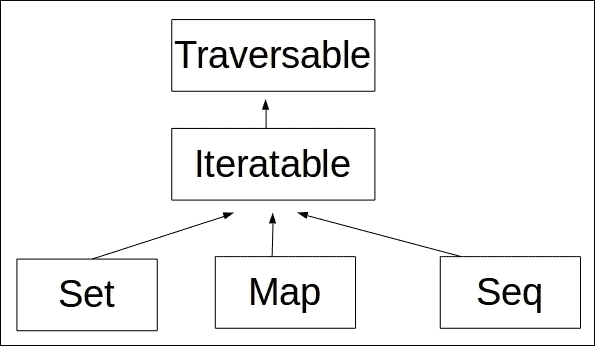
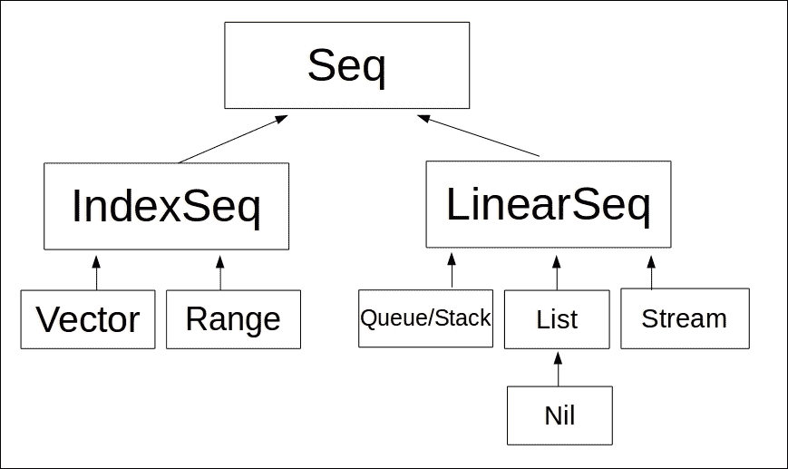
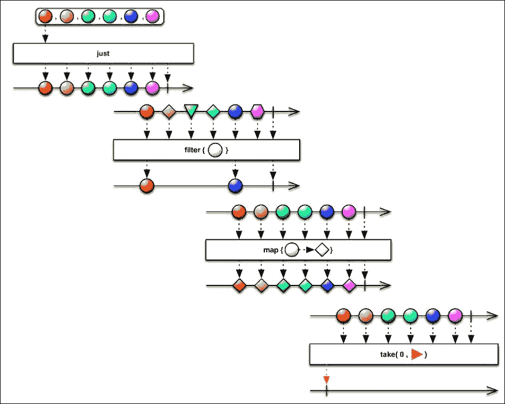
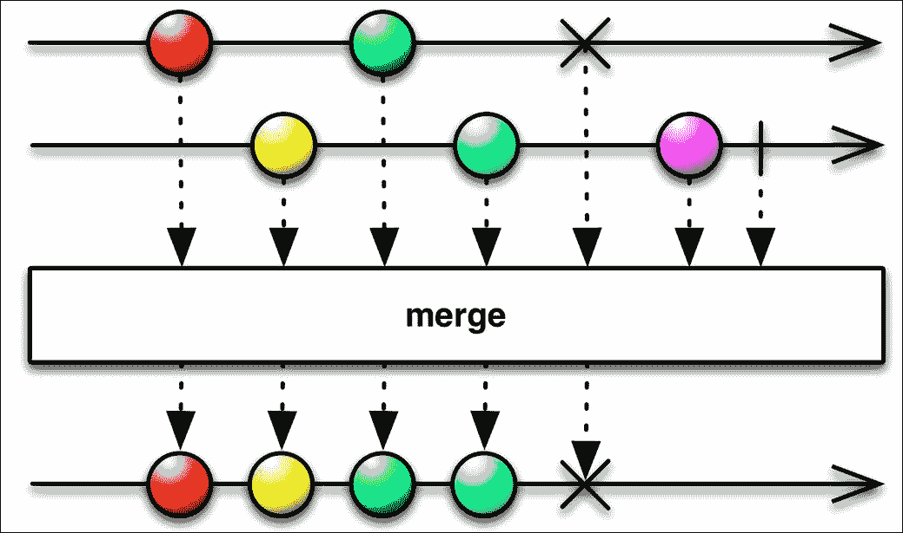

# 第一章。FP、响应式和 Scala 简介

在我们的第一章中，我们将学习函数式编程（**FP**）、响应式编程和 Scala 语言的基本概念。这些概念如下所示：

+   使用 Eclipse Scala IDE 设置 Scala 开发环境。

+   语言的基本结构，如 var、val、for、if、switch 和操作符重载。

+   函数式编程与面向对象编程之间的区别。

+   纯函数式编程（FP）的原则：不可变性、无副作用、状态纪律、组合和高级函数。

+   FP 的概念，如 lambda、递归、for 推导、部分函数、Monads、柯里化和函数。

+   模式匹配、递归、反射、包对象和并发。

让我们开始吧！

# 函数式编程

FP 根本不新。FP 的第一个实现是 Lisp，始于 20 世纪 50 年代。目前，我们正处于一个后函数式编程时代，那时我们拥有 50 年代强大的数学原理和思想，与现代最美丽和先进的工程技术相结合，也称为**Java 虚拟机**（**JVM**）。Scala 是一种基于 JVM 的后函数式编程语言。位于 JVM 之上为我们带来了许多好处，如下所示：

Scala 是一种基于 JVM 的函数式编程语言。位于 JVM 之上为我们带来了许多好处，如下所示：

+   **可靠性和性能**：Java 被我们目前排名前 10 的网站中的 10 个使用，如 Netflix、Apple、Uber、Twitter、Yahoo、eBay、Yelp、LinkedIn、Google、Amazon 等。JVM 是规模化的最佳解决方案，并且已经由这些网站规模公司进行了实战测试。

+   **原生 JVM 生态系统**：完全访问包括框架、库、服务器和工具在内的所有 Java 生态系统。

+   **操作利用**：您的操作团队可以像运行 Java 一样运行 Scala。

+   **遗留代码利用**：Scala 允许您轻松地将 Scala 代码与 Java 代码集成。这个特性非常棒，因为它使得 Java 遗留系统集成变得容易。

+   **Java 互操作性**：用 Scala 编写的代码可以在 Java 中访问。

Scala 是由 Martin Odersky 于 2001 年在 EPFL 创建的。Scala 是一种强静态类型语言，并受到了另一种名为**Haskell**的函数式语言的启发。Scala 解决了 Java 语言的几个批评，并通过更少的代码和更简洁的程序，在不损失性能的情况下提供了更好的开发者体验。

Scala 和 Java 与 JVM 具有相同的底层结构，但在设计上，Scala 与 Java 相比是不同的语言。Java 是一种命令式面向对象的语言，而 Scala 是一种后函数式、多范式的编程语言。FP 与 **面向对象编程**（**OOP**）的工作原理不同。OOP 由于 Java、C#、Ruby 和 Python 等语言而变得非常流行和稳固。然而，Scala、Clojure、F# 和 Swift 等语言正在获得巨大的动力，FP 在过去 10 年中得到了很大的发展。大多数新的语言都是纯函数式、后函数式或混合（如 Java 8）。在这本书中，你将看到 Scala 代码与 Java 代码的比较，这样你可以亲自看到 Scala 相比 Java 和命令式 OOP 语言要紧凑、客观和直接得多。

FP 从学术界开始，传播到全世界；FP 到处都是。像 Hadoop 和 Spark 这样的大数据和流处理解决方案（建立在 Scala 和 Akka 之上）都是建立在 FP 思想和原则之上的。FP 传播到 UI，有了 **RxJavaScript** - 你甚至可以在 Datomic（Clojure）数据库中找到 FP。像 Clojure 和 Scala 这样的语言使 FP 对企业和专业开发者更加实用和有吸引力。在这本书中，我们将探讨 Scala 语言的原理和实践方面。

# 函数式编程原理

FP 是一种思考方式，一种构建和构建程序的具体风格。拥有 FP 语言在语法方面有很大帮助，但最终，一切都关于思想和开发者心态。FP 倾向于以声明式编程方式管理纪律状态和不可变性，而不是像 Java、Python 和 Ruby 这样的 OOP 语言主要使用的命令式编程。

FP 的根源可以追溯到数学中的 **Lambda 演算** - 20 世纪 30 年代开发的一种形式系统。Lambda 演算是一种数学抽象，不是编程语言，但如今在编程语言中很容易看到其概念。

命令式编程使用语句来改变程序状态。换句话说，这意味着你向程序下达命令以执行操作。这种方式描述了程序需要操作的步骤序列。你需要记住的是，FP 的工作方式关注于程序应该完成什么，而不是告诉程序如何去做。当你用 FP 编码时，你倾向于使用更少的变量、循环和条件语句，并编写更多的函数和函数组合。

以下 FP 的核心原理：

+   不可变性

+   纪律状态

+   纯函数和无副作用/纪律状态

+   首类函数和高阶函数

+   类型系统

+   引用透明性

让我们详细理解这些原理。

## 不可变性

不变性概念是 FP 的核心，这意味着一旦你给某个东西赋值，该值就不会改变。这非常重要，因为它消除了副作用（任何在局部函数作用域之外的东西），例如，在函数外部更改其他变量。不可变性使得代码更容易阅读，因为你知道你正在使用的函数是一个纯函数。由于你的函数具有规范的状态且不更改函数外部的其他变量，因此你不需要查看函数定义外的代码。这听起来像你根本不处理状态，那么你怎么可能以这种方式编写专业应用程序呢？好吧，你会改变状态，但以一种非常规范的方式。你会创建另一个实例或指向该实例的另一个指针，但你不会改变该变量的值。拥有不可变性是拥有更好、更快、更正确程序的关键，因为你不需要使用锁，而且你的代码天生就是并行的。

## 规范的状态

共享可变状态是邪恶的，因为它很难扩展和并发运行。什么是共享可变状态？一个简单的方式来理解它就是将其视为一个所有函数都可以访问的全局变量。为什么这很糟糕？首先，因为很难保持这个状态正确，因为有许多函数可以直接访问这个状态。其次，如果你正在进行重构，这种代码通常也是最难重构的。阅读这种代码也很困难。这是因为你永远不能信任局部方法，因为你的局部方法只是程序的一部分。并且带有可变状态，你需要查找所有使用该变量的函数，以便理解逻辑。调试也是如此困难。当你带着 FP 原则进行编码时，你应尽可能避免共享可变状态。当然，你可以有状态，但你应该将其保持为局部状态，这意味着在函数内部。这就是状态纪律：你使用状态，但以一种非常规范的方式。这很简单，但如果你是一名专业开发者，这可能很难，因为这种方面现在在 Java、.NET、Ruby 和 Python 等企业语言中很常见。

## 纯函数和无副作用

纯函数是没有副作用的函数。副作用很糟糕，因为它们是不可预测的，并使你的软件难以测试。假设你有一个没有参数接收且不返回任何内容的方法——这是我们可能遇到的最糟糕的事情之一，因为你怎么测试它？你怎么重用这段代码？这并不是我们所说的纯函数。可能有哪些副作用？数据库调用、全局变量、IO 调用等等。这很有道理，但你不能只使用纯函数，因为这样不实用。

## 一等函数和高级函数

首类意味着语言将函数视为一等公民。换句话说，这意味着语言支持将函数作为参数传递给其他函数，并将值作为函数返回。首类函数还意味着语言允许你将函数存储为变量或任何其他数据结构。

高阶函数与首类函数相关，但它们不是同一回事。高阶函数通常意味着语言支持部分函数应用和柯里化。高阶函数是一个数学概念，其中函数与其他函数一起操作。

部分函数是指你可以将一个值（参数）固定到特定的函数上，你以后可能改变也可能不改变。这对于函数组合来说很棒。

柯里化是一种将具有多个参数的函数转换为一系列函数的技术，每个函数只有一个参数。Scala 语言并不强制使用柯里化，然而，像 ML 和 Haskell 这样的语言几乎总是使用这种技术。

## 类型系统

类型系统完全关乎编译器。其理念很简单：你创建一个类型系统，通过这样做，你可以利用编译器来避免各种错误和错误。这是因为编译器有助于确保你只有正确的类型作为参数、转换语句、函数组合等等。编译器不会允许你犯任何基本错误。Scala 和 Haskell 是强类型语言的例子。与此同时，Common Lisp、Scheme 和 Clojure 是动态语言，它们可能在编译时接受错误值。强类型系统最大的好处之一是你必须编写的测试更少，因为编译器会为你处理几个问题。例如，如果你有一个接收字符串的函数，这可能很危险，因为你可以几乎在字符串中传递任何东西。然而，如果你有一个接收名为 salesman 类型的函数，那么你不需要编写验证来检查它是否是 salesman。所有这些可能听起来很愚蠢，但在实际应用中，这可以节省大量的代码并使你的程序编写得更好。强类型的另一个巨大好处是，你将拥有更好的文档，因为你的代码成为你的文档，而且可以更清楚地了解你可以或不能做什么。

## 指称透明性

指称透明性是一个与纯函数和不可变性紧密相关的概念，因为你的程序有较少的赋值语句，并且当你有它时，你往往永远不会改变那个值。这很好，因为你可以用这种技术消除副作用。在程序执行期间，由于没有副作用，任何变量都可以被替换，程序变得指称透明。Scala 语言在声明变量时使这个概念非常清晰。

# 安装 Java 8 和 Scala 2.11

Scala 需要 JVM 才能运行，因此我们在安装 Scala 之前需要获取 JDK 8。访问 Oracle 网站，并从 [`www.oracle.com/technetwork/pt/java/javase/downloads/index.html`](http://www.oracle.com/technetwork/pt/java/javase/downloads/index.html) 下载并安装 JDK 8。

下载 Java 后，我们需要将 Java 添加到 `PATH` 变量中；否则，你可以使用终端。我们这样做如下：

```java
$ cd ~/
$ wget --no-cookies --no-check-certificate --header "Cookie: gpw_e24=http%3A%2F%2Fwww.oracle.com%2F; oraclelicense=accept-securebackup-cookie" "
http://download.oracle.com/otn-pub/java/jdk/8u77-b03/jdk-8u77-linux-i586.tar.gz"
$ tar -xzvf $ jdk-8u77-linux-x64.tar.gz 
$ rm -f jdk-8u77-linux-x64.tar.gz

```

下一步是创建一个名为 `JAVA_HOME` 的环境变量，并将 Java 8 二进制文件放入 `PATH` 变量中。在 Linux 中，我们需要编辑 `~/.bashrc` 文件，并导出所需的变量，如下所示：

```java
export JAVA_HOME=~/jdk1.8.0_77
export PATH=$PATH:$JAVA_HOME/bin

```

保存文件后，在同一终端中，我们需要通过 `$ source ~/.bashrc` 命令来源文件。

现在我们可以测试我们的 Java 8 安装。只需输入 `$ java -version`。你应该会看到如下类似的内容：

```java
$ java -version
java version "1.8.0_77"
Java(TM) SE Runtime Environment (build 1.8.0_77-b03)
Java HotSpot(TM) Server VM (build 25.77-b03, mixed mode)

```

让我们开始吧。我们将使用最新的 Scala 版本 2.11.8。然而，这本书中的代码应该与任何 Scala 2.11.x 版本兼容。首先，让我们从 [`www.scala-lang.org/`](http://www.scala-lang.org/) 下载 Scala。

Scala 在 Windows、Mac 和 Linux 上都能运行。对于这本书，我将展示如何在基于 Debian 的 Ubuntu Linux 上使用 Scala。打开你的浏览器并访问 [`www.scala-lang.org/download/`](http://www.scala-lang.org/download/)。

下载 `scala 2.11.8`：它将是一个 TGZ 文件。解压它并将其添加到你的路径中；否则，你可以使用终端。这样做如下：

```java
$ cd ~/
$ wget http://downloads.lightbend.com/scala/2.11.8/scala-2.11.8.tgz
$ tar -xzvf scala-2.11.8.tgz
$ rm -rf scala-2.11.8.tgz

```

下一步是创建一个名为 `SCALA_HOME` 的环境变量，并将 Scala 二进制文件放入 `PATH` 变量中。在 Linux 中，我们需要编辑 `~/.bashrc` 文件并导出所需的变量，如下所示：

```java
export SCALA_HOME=~/scala-2.11.8/
export PATH=$PATH:$SCALA_HOME/bin

```

保存文件后，在同一终端中，我们需要通过 `$ source ~/.bashrc` 命令来源文件。

现在我们可以测试我们的 Scala 安装。只需输入 `$ scala -version`。你应该会看到如下类似的内容：

```java
$ scala -version
Scala code runner version 2.11.8 -- Copyright 2002-2016, LAMP/EPFL

```

你已经成功安装了 Java 8 和 Scala 2.11。现在我们准备好开始学习 Scala 中的 FP 原则了。为此，我们将在开始时使用 Scala REPL。Scala REPL 是默认 Scala 安装的一部分，你只需在终端中输入 `$ scala`，如下所示：

```java
$ scala
Welcome to Scala 2.11.8 (Java HotSpot(TM) Server VM, Java 1.8.0_77).
Type in expressions for evaluation. Or try :help.
scala>
Scala REPL

```

恭喜！你已经成功安装了 Java 8 和 Scala 2.11。

# 读取、评估、打印和循环 - REPL

**读取评估打印循环**（**REPL**）也被称为语言外壳。许多其他语言都有外壳，例如 Lisp、Python 和 Ruby 等。REPL 是一个简单的环境，可以用来实验语言。使用 REPL 可以编写非常复杂的程序，但这不是 REPL 的目标。使用 REPL 并不影响像 Eclipse 或 IntelliJ IDEA 这样的 IDE 的使用。REPL 是测试简单命令和程序的理想选择，无需像使用 IDE 那样花费大量时间配置项目。Scala REPL 允许你创建变量、函数、类以及复杂的函数。每个命令都有一个历史记录；也有一定程度的自动完成。作为一个 REPL 用户，你可以打印变量值并调用函数。

# 使用 REPL 的 Scala Hello World

让我们开始吧。打开你的终端，输入 `$ scala` 以打开 Scala REPL。一旦 REPL 打开，你只需输入 `"Hello World"`。通过这样做，你执行了两个操作：评估和打印。Scala REPL 将创建一个名为 `res0` 的变量，并将你的字符串存储在那里。然后它将打印 `res0` 变量的内容。

## Scala REPL Hello World 程序

我们将看到如何在 Scala REPL 中创建 Hello World 程序，如下所示：

```java
$ scala
Welcome to Scala 2.11.8 (Java HotSpot(TM) 64-Bit Server VM, Java 1.8.0_77).
Type in expressions for evaluation. Or try :help.
scala> "Hello World"
res0: String = Hello World
scala> 

```

Scala 是一种混合语言，这意味着它既是面向对象的，也是函数式的。你可以在 Scala 中创建类和对象。接下来我们将使用类创建一个完整的 Hello World 应用程序。

## Scala 面向对象的 Hello World 程序

我们将看到如何在 Scala REPL 中创建面向对象的 Hello World 程序，如下所示：

```java
$ scala
Welcome to Scala 2.11.8 (Java HotSpot(TM) 64-Bit Server VM, Java 1.8.0_77).
Type in expressions for evaluation. Or try :help.
scala> object HelloWorld {
 |   def main(args:Array[String]) = println("Hello World")
 | }
defined object HelloWorld
scala> HelloWorld.main(null)
Hello World
scala>

```

首先你需要意识到，我们使用的是 object 而不是 class。与 Java 相比，Scala 语言有不同的结构。在 Scala 中，Object 是一个单例。这与在 Java 中编写单例模式相同。

接下来我们看到 Scala 中用于创建函数的 `def` 关键字。在前面的程序中，我们创建了一个类似于 Java 中创建的方式的 main 函数，并调用内置函数 `println` 来打印字符串 Hello World。Scala 默认导入了一些 Java 对象和包。在 Scala 中编码不需要你输入，例如，`System.out.println("Hello World")`，但如果你愿意，你也可以这样做。让我们在下面的代码中看看它：

```java
$ scala
Welcome to Scala 2.11.8 (Java HotSpot(TM) 64-Bit Server VM, Java 1.8.0_77).
Type in expressions for evaluation. Or try :help.
scala> System.out.println("Hello World") 
Hello World
scala>

```

我们可以，我们也将做得更好。Scala 为控制台应用程序提供了一些抽象，因此我们可以用更少的代码行数来编写这个代码。为了实现这个目标，我们需要扩展 Scala 类 App。当我们从 App 继承时，我们执行了继承，我们不需要定义 main 函数。我们只需将所有代码放入类的主体中，这非常方便，使得代码整洁且易于阅读。

## Scala REPL 中的 Scala HelloWorld App

我们将看到如何在 Scala REPL 中创建 Scala HelloWorld App，如下所示：

```java
$ scala
Welcome to Scala 2.11.8 (Java HotSpot(TM) 64-Bit Server VM, Java 1.8.0_77).
Type in expressions for evaluation. Or try :help.
scala> object HelloWorld extends App {
 |  println("Hello World")
 | }
defined object HelloWorld
scala> HelloWorld
object HelloWorld
scala> HelloWorld.main(null)
Hello World
scala>

```

在 Scala REPL 中编码了 HelloWorld 对象之后，我们可以询问 REPL HelloWorld 是什么，正如你可能意识到的，REPL 会回答 HelloWorld 是一个对象。这是 Scala 编写控制台应用程序的一种非常方便的方法，因为我们只需三行代码就可以有一个 Hello World 应用程序。遗憾的是，要在 Java 中实现相同的程序，需要更多的代码。Java 是一种性能出色的语言，但与 Scala 相比，它是一种冗长的语言。

## Java HelloWorld 应用程序

我们将看到如何创建 Java HelloWorld 应用程序如下：

```java
    package scalabook.javacode.chap1; 

    public class HelloWorld { 
      public static void main(String args[]){ 
        System.out.println("Hellow World"); 
      } 
    } 

```

Java 应用程序需要六行代码，而在 Scala 中，我们能够用 50%的代码（三行代码）完成同样的工作。这是一个非常简单的应用程序。当我们编写复杂的应用程序时，这种差异会更大，因为 Scala 应用程序的代码量远少于 Java。

记住，我们在 Scala 中使用对象是为了有一个单例（确保只有一个类实例的设计模式），如果我们想在 Java 中实现相同的功能，代码可能如下所示：

```java
    package scalabook.javacode.chap1; 

    public class HelloWorldSingleton { 

      private HelloWorldSingleton(){} 

      private static class SingletonHelper{ 
        private static final HelloWorldSingleton INSTANCE =  
        new HelloWorldSingleton(); 
      } 

      public static HelloWorldSingleton getInstance(){ 
        return SingletonHelper.INSTANCE; 
      } 

      public void sayHello(){ 
        System.out.println("Hello World"); 
      } 

      public static void main(String[] args) { 
        getInstance().sayHello(); 
      } 
    } 

```

这不仅仅关乎代码的大小，还关乎一致性和语言为你提供更多的抽象。如果你编写的代码更少，最终你的软件中出现的错误也会更少。

# Scala 语言 - 基础知识

Scala 是一种静态类型语言，具有非常表达性的类型系统，以安全且连贯的方式强制执行抽象。Scala 中的所有值都是 Java 对象（在运行时未装箱的原生类型），因为最终，Scala 是在 Java JVM 上运行的。Scala 强制执行不可变性作为核心的 FP 原则。这种强制执行在 Scala 语言的多个方面发生，例如，当你创建一个变量时，你以不可变的方式创建它，当你使用集合时，你会使用不可变集合。Scala 还允许你使用可变变量和可变结构，但按照设计，它更倾向于不可变结构。

# Scala 变量 - var 和 val

当你在 Scala 中编码时，你使用运算符`var`创建变量，或者你可以使用运算符`val`。`var`运算符允许你创建可变状态，只要你将其本地化，遵循 CORE-FP 原则，并避免可变共享状态，这是可以的。

## Scala REPL 中的 var 使用

我们将看到如何在 Scala REPL 中使用 var 如下：

```java
$ scala
Welcome to Scala 2.11.8 (Java HotSpot(TM) 64-Bit Server VM, Java 1.8.0_77).
Type in expressions for evaluation. Or try :help.

scala> var x = 10
x: Int = 10

scala> x
res0: Int = 10

scala> x = 11
x: Int = 11

scala> x 
res1: Int = 11

scala> 

```

然而，Scala 有一个更有趣的结构叫做`val`。使用`val`运算符使你的变量不可变，这意味着一旦设置了值，就不能更改它。如果你尝试更改 Scala 中`val`变量的值，编译器会给你一个错误。作为一个 Scala 开发者，你应该尽可能多地使用`val`变量，因为这是一种良好的 FP 思维模式，并且会使你的程序更好。在 Scala 中，一切都是对象；没有原生类型 -- `var`和`val`规则适用于所有可能的对象，除了`Int`或`String`甚至是一个类。

## Scala 在 Scala REPL 中的 val 使用

我们将看到如何在 Scala REPL 中使用`val`，如下所示：

```java
$ scala
Welcome to Scala 2.11.8 (Java HotSpot(TM) 64-Bit Server VM, Java 1.8.0_77).
Type in expressions for evaluation. Or try :help.
scala> val x = 10
x: Int = 10
scala> x
res0: Int = 10
scala> x = 11
<console>:12: error: reassignment to val
 x = 11
 ^
scala> x
res1: Int = 10
scala>

```

# 创建不可变变量

现在，让我们看看如何在 Scala 中定义最常见的数据类型，如`Int`、`Double`、`Boolean`和`String`。记住，你可以根据需要使用`val`或`var`创建这些变量。

## Scala REPL 中的 Scala 变量类型

我们将看到如何在 Scala REPL 中查看 Scala 变量类型，如下所示：

```java
$ scala
Welcome to Scala 2.11.8 (Java HotSpot(TM) 64-Bit Server VM, Java 1.8.0_77).
Type in expressions for evaluation. Or try :help.
scala> val x = 10
x: Int = 10
scala> val y = 11.1
y: Double = 11.1
scala> val b = true
b: Boolean = true
scala> val f = false
f: Boolean = false
scala> val s = "A Simple String"
s: String = A Simple String
scala>

```

在前面的代码中，我们没有定义变量的类型。Scala 语言会为我们解决这个问题。然而，如果你想指定类型，也是可能的。在 Scala 中，类型位于变量名称之后。

## Scala REPL 中的具有显式类型的 Scala 变量

我们将在 Scala REPL 中看到具有显式类型的 Scala 变量，如下所示：

```java
$ scala
Welcome to Scala 2.11.8 (Java HotSpot(TM) 64-Bit Server VM, Java 1.8.0_77).
Type in expressions for evaluation. Or try :help.
scala> val x:Int = 10
x: Int = 10
scala> val y:Double = 11.1
y: Double = 11.1
scala> val s:String = "My String "
s: String = "My String "
scala> val b:Boolean = true
b: Boolean = true
scala>

```

# Scala 的条件和循环语句

与任何其他语言一样，Scala 支持`if`和`else`这样的条件语句。虽然 Java 有`switch`语句，但 Scala 有一个更强大且功能性的结构，称为模式匹配器（Pattern Matcher），我们将在本章后面介绍。Scala 允许你在变量赋值时使用`if`语句，这既实用又有用。

## 在 Scala REPL 中的 if 语句

我们将看到如何在 Scala REPL 中使用`if`语句，如下所示：

```java
$ scala
Welcome to Scala 2.11.8 (Java HotSpot(TM) 64-Bit Server VM, Java 1.8.0_77).
Type in expressions for evaluation. Or try :help.
scala> val x = 10
x: Int = 10
scala> if (x == 10) 
 | println ("X is 10")
X is 10
scala> val y = if (x == 10 ) 11
y: AnyVal = 11
scala> y
res1: AnyVal = 11
scala>

```

在前面的代码中，你可以看到我们根据`if`条件设置了变量`y`。Scala 的`if`条件非常强大，并且也可以用于返回语句。

## 在 Scala REPL 中的返回语句中的 if 语句

我们将看到如何在 Scala REPL 中的返回语句中使用`if`语句，如下所示：

```java
$ scala
Welcome to Scala 2.11.8 (Java HotSpot(TM) 64-Bit Server VM, Java 1.8.0_77).
Type in expressions for evaluation. Or try :help.
scala> val x = 10
x: Int = 10
scala> def someFunction = if (x == 10) "X is 10"
someFunction: Any
scala> someFunction
res0: Any = X is 10
scala>

```

Scala 也支持`else`语句，你还可以在变量和返回语句中使用它们，如下所示：

```java
~$ scala
Welcome to Scala 2.11.8 (Java HotSpot(TM) 64-Bit Server VM, Java 1.8.0_77).
Type in expressions for evaluation. Or try :help.
scala> val x = 10
x: Int = 10
scala> if (x==10){
 |   println("X is 10")
 | } else {
 |   println ("X is something else")
 | }
X is 10
scala>

```

现在你将学习如何在 Scala 中使用 for 循环。在 Scala 中，for 循环非常强大。我们将从基础知识开始，稍后我们将继续介绍用于列表推导的函数式循环，也称为`List`推导。

在 Scala 中，for 循环与范围（range）一起工作，范围是 Scala 的另一种数据结构，表示从起点到终点的数字。范围是通过左箭头运算符（`<-`）创建的。只要你在同一个 for 循环中使用分号（`;`），Scala 就允许你在同一个 for 循环中有多个范围。

你还可以在 for 循环中使用`if`语句来过滤数据，并顺畅地与`List`结构一起工作。Scala 允许你在 for 循环中创建变量。现在，让我们看看一些代码，这些代码展示了 Scala 语言中各种 for 循环的使用。

## Scala REPL 中的基本 for 循环

我们将看到如何在 Scala REPL 中使用基本 for 循环，如下所示：

```java
$ scala
Welcome to Scala 2.11.8 (Java HotSpot(TM) 64-Bit Server VM, Java 1.8.0_77).
Type in expressions for evaluation. Or try :help.
scala> for ( i <- 1 to 10)
 | println("i * " + i + " = " +  i * 10)
i * 1 = 10
i * 2 = 20
i * 3 = 30
i * 4 = 40
i * 5 = 50
i * 6 = 60
i * 7 = 70
i * 8 = 80
i * 9 = 90
i * 10 = 100
scala> 

```

现在，我们将使用名为`List`的 Scala 数据结构创建一个 for 循环。这非常有用，因为在代码的第一行，你可以定义一个`List`以及设置其值。由于我们使用的是`List`结构，因此除了`List`本身之外，你不需要传递任何其他参数。

## 在 Scala REPL 中使用带有 List 的 for 循环

我们将看到如何在 Scala REPL 中使用`for`与`List`，如下所示：

```java
$ scala
Welcome to Scala 2.11.8 (Java HotSpot(TM) 64-Bit Server VM, Java 1.8.0_77).
Type in expressions for evaluation. Or try :help.
scala> val listOfValues = List(1,2,3,4,5,6,7,8,9,10)
listOfValues: List[Int] = List(1, 2, 3, 4, 5, 6, 7, 8, 9, 10)
scala> for ( i<- listOfValues ) println(i)
1
2
3
4
5
6
7
8
9
10
scala>

```

接下来，我们可以使用带有 `if` 语句的 for 循环来实现一些过滤操作。在本书的后续部分，我们将探讨使用函数的更函数式的方法来处理过滤。对于这段代码，假设我们只想获取列表中的偶数并打印它们。

## Scala REPL 中的带有 if 语句的 for 推导式 - Scala REPL

我们将展示如何在 Scala REPL 中使用 `for` 与 `if` 语句，如下所示：

```java
$ scala
Welcome to Scala 2.11.8 (Java HotSpot(TM) 64-Bit Server VM, Java 1.8.0_77).
Type in expressions for evaluation. Or try :help.
scala> val listOfValues = List(1,2,3,4,5,6,7,8,9,10)
listOfValues: List[Int] = List(1, 2, 3, 4, 5, 6, 7, 8, 9, 10)
scala> for ( i<- listOfValues ) if  (i % 2== 0) println(i)
2
4
6
8
10
scala>

```

## Java 代码过滤偶数

在 Scala 语言中，我们只需要两行代码就可以完成这个过滤操作，而在 Java 中，这至少需要十一行代码，如下面的代码所示：

```java
    package scalabook.javacode.chap1; 

    import java.util.Arrays; 
    import java.util.List; 

    public class ForLoopsEvenNumberFiltering { 
      public static void main(String[] args) { 
        List<Integer> listOfValues = Arrays.asList( 
          new Integer[]{1,2,3,4,5,6,7,8,9,10}); 
        for(Integer i : listOfValues){ 
          if (i%2==0) System.out.println(i); 
        } 
      } 
    } 

```

# 对于推导式

也称为列表或序列推导式，for 推导式是函数式编程中执行循环的一种方式。这是语言支持，用于根据其他集合创建 `List` 结构或集合。这项任务在 `SetBuilder` 语法中执行。另一种实现相同目标的方法是使用 `Map` 和 `filter` 函数，我们将在本章后面介绍。for 推导式可以用生成器形式使用，这将引入新的变量和值，或者以归约方式使用，这将过滤值，生成一个新的集合或序列。语法是：`for (expt) yield e`，其中 `yield` 操作符将新值添加到从原始序列创建的新集合/序列中。

## Scala REPL 中的推导式

我们将展示如何在 Scala REPL 中使用 `for` 推导式，如下所示：

```java
$ scala
Welcome to Scala 2.11.8 (Java HotSpot(TM) 64-Bit Server VM, Java 1.8.0_77).
Type in expressions for evaluation. Or try :help.
scala> val names = Set("Diego", "James", "John", "Sam", "Christophe")
names: scala.collection.immutable.Set[String] = Set(John, Sam, Diego, James, Christophe)
scala> 
scala> val brazilians = for {
 |   name <- names 
 |   initial <- name.substring(0, 1)
 |     } yield if (name.contains("Die")) name
brazillians: scala.collection.immutable.Set[Any] = Set((), Diego)
scala>

```

在前面的代码中，我们创建了一个名字的集合。正如你所见，Scala 默认偏好不可变数据结构，并使用 `immutable.Set`。当我们应用 `for` 循环时，我们只是在过滤包含特定子字符串的 `names`，然后，使用 `yield` 操作符，我们创建了一个新的 `Set` 结构。`yield` 操作符将保持你正在使用的结构。例如，如果我们使用 `List` 结构，它将创建一个 `List` 而不是 `Set` 结构，`yield` 操作符将始终保持变量上的相同数据集合。前面代码的另一个有趣之处在于，我们将 `for` 推导式的结果保存在一个名为 Brazilians 的变量中。Java 没有 for 推导式，但我们可以使用类似的代码，尽管这将需要更多的行数。

## 使用集合进行过滤的 Java 代码

我们将展示如何使用 Java 代码进行集合过滤，如下所示：

```java
    package scalabook.javacode.chap1; 

    import java.util.LinkedHashSet; 
    import java.util.Set; 

    public class JavaNoForComprehension { 
      public static void main(String[] args) { 

        Set<String> names = new LinkedHashSet<>(); 
        Set<String> brazillians = new LinkedHashSet<>(); 

        names.add("Diego"); 
        names.add("James"); 
        names.add("John"); 
        names.add("Sam"); 
        names.add("Christophe"); 

        for (String name: names){ 
          if (name.contains("Die")) brazillians.add(name);  
        } 

        System.out.println(brazillians); 
      } 
    } 

```

# Scala 集合

在上一节中，我们看到了如何在 Scala 中以不可变的方式创建 `List` 和 `Set` 结构。现在我们将学习如何以可变的方式处理 `List` 和 `Set` 结构，以及其他集合，如序列、元组和 Maps。让我们看看 Scala 集合层次结构的树状图，如下面的图所示：



现在我们来看看 Scala 的 Seq 类层次结构。正如你所见，Seq 也是可遍历的。



Scala 集合扩展自可遍历，这是所有集合派生的主要特质。例如，`List` 结构扩展自 `Seq` 类层次结构，这意味着序列 - `List` 是一种序列。所有这些树都是不可变或可变的，具体取决于您最终使用的 Scala 包。

让我们看看如何在 Scala 中使用 `List` 结构执行基本可变操作。为了进行过滤和删除操作，我们需要使用以下 `Buffer` 序列：

```java
$ scala
Welcome to Scala 2.11.8 (Java HotSpot(TM) 64-Bit Server VM, Java 1.8.0_77).
Type in expressions for evaluation. Or try :help.
scala> var ms = scala.collection.mutable.ListBuffer(1,2,3)
ms: scala.collection.mutable.ListBuffer[Int] = ListBuffer(1, 2, 3)
scala> ms += 4
res0: scala.collection.mutable.ListBuffer[Int] = ListBuffer(1, 2, 3, 4)
scala> ms += 5
res1: scala.collection.mutable.ListBuffer[Int] = ListBuffer(1, 2, 3, 4, 5)
scala> ms += 6
res2: scala.collection.mutable.ListBuffer[Int] = ListBuffer(1, 2, 3, 4, 5, 6)
scala> ms(1)
res3: Int = 2
scala> ms(5)
res4: Int = 6
scala> ms -= 5
res5: scala.collection.mutable.ListBuffer[Int] = ListBuffer(1, 2, 3, 4, 6)
scala> ms -= 6
res6: scala.collection.mutable.ListBuffer[Int] = ListBuffer(1, 2, 3, 4)
scala>

```

让我们看看下一组代码。

## 在 Scala REPL 中创建、删除和获取可变列表中的项

我们将看到如何在 Scala REPL 中创建、删除和获取可变列表中的项如下：

```java
$ scala
Welcome to Scala 2.11.8 (Java HotSpot(TM) 64-Bit Server VM, Java 1.8.0_77).
Type in expressions for evaluation. Or try :help.
scala> var names = scala.collection.mutable.SortedSetString
names: scala.collection.mutable.SortedSet[String] = TreeSet(Diego, Jackson, Poletto)
scala> names += "Sam"
res2: scala.collection.mutable.SortedSet[String] = TreeSet(Diego, Jackson, Poletto, Sam)
scala> names("Diego")
res4: Boolean = true
scala> names -= "Jackson"
res5: scala.collection.mutable.SortedSet[String] = TreeSet(Diego, Poletto, Sam)
scala>

```

您是否曾想在方法中返回多个值？嗯，在 Java 中您必须创建一个类，但在 Scala 中，有一个更方便的方式来执行此任务，而且您不需要每次都创建新类。元组允许您在方法中返回或简单地持有多个值，而无需创建特定类型。

## Scala 元组

我们将看到 Scala 元组如下：

```java
$ scala
Welcome to Scala 2.11.8 (Java HotSpot(TM) 64-Bit Server VM, Java 1.8.0_77).
Type in expressions for evaluation. Or try :help.
scala> val config = ("localhost", 8080)
config: (String, Int) = (localhost,8080)
scala> config._1
res0: String = localhost
scala> config._2
res1: Int = 8080
scala>

```

Scala 有特殊的方法称为 `_1` 和 `_2`，您可以使用它们来检索元组的值。您需要记住的唯一一点是值在元组中按照插入顺序存储。

Scala 拥有一个非常实用且有用的集合库。例如，Map 是一个键/值对，可以根据键检索，键是唯一的。然而，Map 的值不需要是唯一的。像其他 Scala 集合一样，您有可变和不可变 Map 集合。请记住，Scala 更倾向于不可变集合而不是可变集合。

## Scala REPL 中的 Scala 不变 Map

我们将在 Scala REPL 中看到 Scala 不变 Map 的用法如下：

```java
$ scala
Welcome to Scala 2.11.8 (Java HotSpot(TM) 64-Bit Server VM, Java 1.8.0_77).
Type in expressions for evaluation. Or try :help.
scala> val numbers = Map("one"   -> 1, 
 |                   "two"   -> 2,
 |                   "three" -> 3,
 |                   "four"  -> 4,
 |                   "five"  -> 5,
 |                   "six"   -> 6,
 |                   "seven" -> 7,
 |                   "eight" -> 8,
 |                   "nine"  -> 9,
 |                   "ten"   -> 10)
numbers: scala.collection.immutable.Map[String,Int] = Map(four -> 4, three -> 3, two -> 2, six -> 6, seven -> 7, ten -> 10, five -> 5, nine -> 9, one -> 1, eight -> 8)
scala> 
scala> numbers.keys
res0: Iterable[String] = Set(four, three, two, six, seven, ten, five, nine, one, eight)
scala> 
scala> numbers.values
res1: Iterable[Int] = MapLike(4, 3, 2, 6, 7, 10, 5, 9, 1, 8)
scala> 
scala> numbers("one")
res2: Int = 1
scala>

```

如您所见，当您使用 `Map()` 创建 Map 时，Scala 使用 `scala.collection.immutable.Map`。键和值都是可迭代的，您可以使用 `keys` 方法访问所有键，或使用 `values` 方法访问所有值。

## Scala REPL 中的 Scala 可变 Maps

我们将在 Scala REPL 中看到 Scala 可变 Map 的用法如下：

```java
$ scala
Welcome to Scala 2.11.8 (Java HotSpot(TM) 64-Bit Server VM, Java 1.8.0_77).
Type in expressions for evaluation. Or try :help.
scala> val map = scala.collection.mutable.HashMap.empty[Int,String]
map: scala.collection.mutable.HashMap[Int,String] = Map()
scala> map += (1 -> "one")
res0: map.type = Map(1 -> one)
scala> map += (2 -> "two")
res1: map.type = Map(2 -> two, 1 -> one)
scala> map += (3 -> "three")
res2: map.type = Map(2 -> two, 1 -> one, 3 -> three)
scala> map += (4 -> "mutable")
res3: map.type = Map(2 -> two, 4 -> mutable, 1 -> one, 3 -> three)
scala> 

```

如果您正在处理可变状态，您必须明确指定，这在 Scala 中是很好的，因为它增加了开发者的意识，并默认避免了可变共享状态。因此，为了有一个可变 Map，我们需要明确使用 `scala.collection.mutable.HashMap` 创建 Map。

# 摩纳哥

摩纳哥是可组合的参数化容器类型，它支持高阶函数。记住，高阶函数是接收函数作为参数并返回函数作为结果的函数。在函数式编程中最常用的函数之一是 Map。Map 接收一个函数，将其应用于容器中的每个元素，并返回一个新的容器。

## Scala REPL 中的 Scala Map 函数

我们将在 Scala REPL 中看到 Map 函数的用法如下：

```java
$ scala
Welcome to Scala 2.11.8 (Java HotSpot(TM) 64-Bit Server VM, Java 1.8.0_77).
Type in expressions for evaluation. Or try :help.
scala> 
scala> val numbers = List(1,2,3,4,5,6)
numbers: List[Int] = List(1, 2, 3, 4, 5, 6)
scala> def doubleIt(i:Int):Double = i * 2
doubleIt: (i: Int)Double
scala> val doubled = numbers.map( doubleIt _ )
doubled: List[Double] = List(2.0, 4.0, 6.0, 8.0, 10.0, 12.0)
scala> val doubled = numbers.map( 2.0 * _ )
doubled: List[Int] = List(2.0, 4.0, 6.0, 8.0, 10.0, 12.0)
scala>

```

在前面的代码中，我们创建了一个包含数字 1,2,3,4,5 和 6 的数字列表。我们还定义了一个名为`doubleIt`的 Scala 函数，它接收一个整数并将其乘以`2.0`，得到一个双精度浮点数。`map`函数对`List (1,2,3,4,5,6)`中的每个元素调用`doubleIt`，结果是新的容器，一个新的`List`实例，包含新的值。

Scala 有一些语法糖可以帮助我们更高效。例如，你可能会意识到在之前的代码中，我们也做了`2.0 * _`。下划线是一个特殊操作符，用于这个特定情况——它表示当前值正在被迭代到集合中。Scala 会为我们从这个表达式创建一个函数。

正如你可能已经意识到的，`map`函数有很多用途：一个原因是你可以不显式使用`for`循环来做复杂的计算，这使得你的代码更函数式。其次，我们可以使用`map`函数将元素类型从一种类型转换为另一种类型。这就是我们在之前的代码中所做的：我们将整数列表转换为双精度浮点数列表。看看下面的：

```java
scala> val one = Some(1) 
one: Some[Int] = Some(1)
scala> val oneString = one.map(_.toString)
oneString: Option[String] = Some(1)

```

`map`函数在多个数据结构上操作，而不仅仅是集合，正如你在之前的代码中看到的。你几乎可以在 Scala 语言中的任何地方使用`map`函数。

`map`函数很棒，但你可能会得到嵌套的结构。这就是为什么，当我们与 Monads 一起工作时，我们使用一个稍微不同的`map`函数版本，称为`flatMap`，它的工作方式与`map`函数非常相似，但以扁平形式返回值而不是嵌套值。

为了有一个 monad，你需要有一个名为`flatMap`的方法。其他函数语言，如 Haskell，将`flatMap`称为`bind`，并使用操作符`>>=`。语法随着语言的变化而变化，但概念是相同的。

Monads 可以以不同的方式构建。在 Scala 中，我们需要一个单参数构造函数，它将作为 monad 工厂工作。基本上，构造函数接收一个类型`A`，并返回`Monad[A]`或简称为`M[A]`。例如，对于`List`的`unit(A)`将是`== List[A]`和`unit(A)`，其中`a`是一个 Option `== Option[A]`。在 Scala 中，你不需要有 unit；这是可选的。要在 Scala 中有一个 monad，你需要实现 map 和`flatMap`。

与 Monads 一起工作会使你写的代码比以前稍微多一点。然而，你将获得一个更好的 API，这将更容易重用，并且你的潜在复杂性将被管理，因为你不需要写一个充满`if`和 for 循环的复杂代码。可能性通过类型表达，编译器会为你检查。让我们看看 Scala 语言中的一个简单的 monad 示例：

## Scala 中的 Option Monad

我们将如下看到 Scala 中的 Option Monad：

```java
$ scala
Welcome to Scala 2.11.8 (Java HotSpot(TM) 64-Bit Server VM, Java 1.8.0_77).
Type in expressions for evaluation. Or try :help.
scala> val a:Option[Int] = Some(1)
a: Option[Int] = Some(1)
scala> a.get
res0: Int = 1
scala> val b:Option[Int] = None
b: Option[Int] = None
scala> b.get
java.util.NoSuchElementException: None.get
 at scala.None$.get(Option.scala:347)
 at scala.None$.get(Option.scala:345)
 ... 32 elided
scala> b.getOrElse(0)
res2: Int = 0
scala> a == b
res3: Boolean = false
scala> 

```

在 Haskell 中，这被称为 Maybe monad。Option 表示可选值，因为我们不能 100%确定值是否存在。为了表达一个值，我们使用 `Some` 类型，为了表达值的缺失，我们使用 none。Option Monads 非常好，它们使你的代码更加明确，因为一个方法可能会接收或返回一个 option，这意味着你明确地表示这可能是 null。然而，这种技术不仅更加明确，而且更加安全，因为你不会得到一个 null 指针，因为你有一个容器包围着值。尽管如此，如果你在 `Option` 中调用 `get` 方法，并且它是 none，你将得到一个 `NoSuchelementException`。为了解决这个问题，你可以使用 `getOrElse` 方法，并且你可以提供一个回退值，在 none 的情况下将被使用。好吧，但你可能想知道 `flatMap` 方法在哪里。别担心，Scala 为我们实现了这个方法到 `Option` 抽象中，所以你可以无问题地使用它。

```java
scala> val c = Some("one")
c: Some[String] = Some(one)
scala> c.flatMap( s => Some(s.toUpperCase) )
res6: Option[String] = Some(ONE)

```

Scala REPL 可以为你执行自动补全。如果你输入 **C** + **Tab**，你会看到 `Some` 类的所有可用方法。`map` 函数可供你使用，正如我之前所说的，Scala 中根本没有任何单元函数。然而，如果你在自己的 API 中添加它，这并不错误。

## 使用 Scala REPL 的所有方法列表

以下是使用 Scala REPL 的所有方法列表：

```java
$ scala
Welcome to Scala 2.11.8 (Java HotSpot(TM) 64-Bit Server VM, Java 1.8.0_77).
Type in expressions for evaluation. Or try :help.
scala> val c = Some("one")
c: Some[String] = Some(one)
scala> c.
++             count       foreach              iterator     productArity   seq         toBuffer             unzip 
++:            drop        genericBuilder       last         productElement size        toIndexedSeq         unzip3 
/:             dropRight   get                  lastOption   productIterator slice      toIterable           view 
:\             dropWhile   getOrElse            map          productPrefix  sliding     toIterator           withFilter 
WithFilter     equals      groupBy              max          
reduce         span        toLeft               x 
addString      exists      grouped              maxBy        
reduceLeft     splitAt     toList               zip 
aggregate      filter      hasDefiniteSize      min          reduceLeftOption stringPrefix   toMap           zipAll 
canEqual       filterNot   hashCode             minBy        reduceOption   sum         toRight              zipWithIndex 
collect        find        head                 mkString     reduceRight    tail        toSeq 
collectFirst   
flatMap        headOption  nonEmpty             reduceRightOption   tails          toSet 
companion            flatten     
init           orElse      repr                 take           
toStream 
contains    fold                 inits                orNull         sameElements takeRight           toString 
copy           foldLeft    isDefined            par          
scan           takeWhile   toTraversable 
copyToArray    foldRight      isEmpty     partition            scanLeft            
to             toVector 
copyToBuffer         forall      isTraversableAgain product scanRight            toArray        
transpose 
scala> c

```

# Scala 类、特性和面向对象编程

作为一种混合函数式语言，Scala 允许你编写面向对象的代码并创建类。现在我们将学习如何创建类和类内的函数，以及如何处理特性，特性在概念上类似于 Java 接口，但在实践中要强大得多。

## Scala REPL 中的简单 Scala 类

我们将在 Scala REPL 中看到以下简单的 Scala 类：

```java
$ scala
Welcome to Scala 2.11.8 (Java HotSpot(TM) 64-Bit Server VM, Java 1.8.0_77).
Type in expressions for evaluation. Or try :help.
scala> class Calculator {
 |    def add(a: Int, b: Int): Int = a + b
 |    def multiply(n: Int, f: Int): Int = n * f
 | }
defined class Calculator
scala> 
scala> val c = new Calculator
c: Calculator = Calculator@380fb434
scala> c.add(1,2)
res0: Int = 3
scala> c.multiply(3,2)
res1: Int = 6
scala>

```

初看，前面的代码看起来像 Java。但让我们添加构造函数、获取器和设置器，然后你就可以看到我们只需几行代码就能完成多少工作。

## Scala REPL 中的 Scala 简单 Java 对象

以下是在 Scala REPL 中展示的 Scala 简单 Java 对象：

```java
$ scala
Welcome to Scala 2.11.8 (Java HotSpot(TM) 64-Bit Server VM, Java 1.8.0_77).
Type in expressions for evaluation. Or try :help.
scala> class Person(
 |   @scala.beans.BeanProperty var name:String = "",
 |   @scala.beans.BeanProperty var age:Int = 0
 | ){
 |    name = name.toUpperCase
 |    override def toString = "name: " + name + " age: " + age
 | }
defined class Person
scala> 
scala> val p  = new Person("Diego",31)
p: Person = name: DIEGO age: 31
scala> val p1 = new Person(age = 31, name = "Diego")
p1: Person = name: DIEGO age: 31
scala> p.getAge
res0: Int = 31
scala> p1.getName
res1: String = DIEGO
scala> 

```

Scala 中的构造函数只是代码行。你可能意识到，我们在前面的例子中得到了 `name` 变量，并应用了一个函数将给定的名字转换为大写。如果你想，你可以放任意多的行，并且可以执行你想要的任何计算。

在相同的代码上，我们还执行了方法重写，因为我们重写了 `toString` 方法。在 Scala 中，为了进行重写，你需要在函数定义前使用 `override` 操作符。

我们只是用 Scala 写了一个只有几行代码的 **纯 Java 对象**（**POJO**）。Scala 有一个特殊的注解叫做 `@scala.beans.BeanProperty`，它可以为你生成 getter 和 setter 方法。这非常有用，可以节省很多代码。然而，目标必须是公共的；你不能在私有 `var` 或 `val` 对象上应用 `BeanProperty` 注解。

## Java 中的 Person 类

以下是在 Java 中的 Person 类：

```java
    package scalabook.javacode.chap1; 

    public class JavaPerson { 

      private String name; 
      private Integer age; 

      public JavaPerson() {} 

      public JavaPerson(String name, Integer age) { 
        super(); 
        this.name = name; 
        this.age = age; 
      } 

      public JavaPerson(String name) { 
        super(); 
        this.name = name; 
      } 

      public JavaPerson(Integer age) { 
        super(); 
        this.age = age; 
      } 

      public Integer getAge() { 
        return age; 
      } 

      public void setAge(Integer age) { 
        this.age = age; 
      } 

      public String getName() { 
        return name; 
      } 

      public void setName(String name) { 
        this.name = name; 
      } 

    } 

```

# 特质和继承

在 Scala 中也可以进行继承。对于这样的任务，你在类定义之后使用 `extend` 操作符。Scala 只允许你扩展一个类，就像 Java 一样。Java 不像 C++ 那样允许多重继承。然而，Scala 通过使用特质的混合技术允许这样做。Scala 特质类似于 Java 接口，但你也可以添加具体代码，并且你可以在代码中拥有任意数量的特质。

## Scala 继承代码在 Scala REPL

以下是在 Scala REPL 中的 Scala 继承代码：

```java
$ scala
Welcome to Scala 2.11.8 (Java HotSpot(TM) 64-Bit Server VM, Java 1.8.0_77).
Type in expressions for evaluation. Or try :help.
scala> class Person(
 |   @scala.beans.BeanProperty var name:String = "",
 |   @scala.beans.BeanProperty var age:Int = 0
 | ){
 |    name = name.toUpperCase
 |    override def toString = "name: " + name + " age: " + age
 | }
defined class Person
scala> 
scala> class LowerCasePerson(name:String,age:Int) extends Person(name,age) {
 |    setName(name.toLowerCase)
 | }
defined class LowerCasePerson
scala> 
scala> val p  = new LowerCasePerson("DIEGO PACHECO",31)
p: LowerCasePerson = name: diego pacheco age: 31
scala> p.getName
res0: String = diego pacheco
scala> 

```

Scala 不像 Java 那样支持构造函数的继承。因此，你需要重写构造函数并通过超类传递值。类内的所有代码都将作为次要构造函数。类定义中括号 `()` 内的所有代码都将作为主要构造函数。可以使用 `this` 操作符来拥有多个构造函数。对于这个特定的实现，我们改变了默认行为，并添加了新的构造函数代码，以便将给定的名称转换为小写，而不是 `Person` 超类定义的默认大写。

## Scala 特质示例代码在 Scala REPL

以下是在 Scala REPL 中的 Scala 特质示例代码：

```java
$ scala
Welcome to Scala 2.11.8 (Java HotSpot(TM) 64-Bit Server VM, Java 1.8.0_77).
Type in expressions for evaluation. Or try :help.
scala> trait Car
defined trait Car
scala> 
scala> trait SportCar {
 |    val brand:String 
 |    def run():String = "Rghhhhh Rghhhhh Rghhhhh...."
 | }
defined trait SportCar
scala> 
scala> trait Printable {
 |    def printIt:Unit 
 | }
defined trait Printable
scala> 
scala> class BMW extends Car with SportCar with Printable{
 |    override val brand = "BMW"
 |    override def printIt:Unit = println(brand + " does " + run() )
 | }
defined class BMW
scala> 
scala> val x1 = new BMW
x1: BMW = BMW@22a71081
scala> x1.printIt
BMW does Rghhhhh Rghhhhh Rghhhhh....
scala>

```

在前面的代码中，我们创建了多个特质。其中一个叫做 Car，是母特质。特质也支持继承，我们通过 `SportCar` 特质从 `Car` 特质扩展了它。`SportCar` 特质要求一个名为 brand 的变量，并定义了 run 函数的具体实现。最后，我们有一个名为 `BMW` 的类，它从多个特质扩展而来——这种技术称为 **混合**。

## 在 Scala REPL 中使用变量混合技术的 Scala 特质

以下是在 Scala REPL 中使用变量混合技术的 Scala 特质示例：

```java
$ scala
Welcome to Scala 2.11.8 (Java HotSpot(TM) 64-Bit Server VM, Java 1.8.0_77).
Type in expressions for evaluation. Or try :help.
scala> trait SportCar {
 |    def run():String = "Rghhhhh Rghhhhh Rghhhhh...."
 | }
defined trait SportCar
scala> 
scala> val bmw = new Object with SportCar
bmw: SportCar = $anon$1@ed17bee
scala> bmw.run
res0: String = Rghhhhh Rghhhhh Rghhhhh....
scala>

```

Scala 确实是一个非常强大的语言。你可以在运行时向变量添加特质。当你定义一个变量时，你可以在赋值之后使用 `with` 操作符。这是一个非常有用的特性，因为它使得函数组合更容易。你可以拥有多个专门的特质，并且可以根据需要将它们添加到你的变量中。

Scala 允许你创建 `类型别名`，这是一个非常简单的技术，可以提高你代码的可读性。它只是一个简单的别名。

## 在 Scala REPL 中的 Scala 类型别名示例

以下是在 Scala REPL 中的 Scala 类型别名示例：

```java
$ scala
Welcome to Scala 2.11.8 (Java HotSpot(TM) 64-Bit Server VM, Java 1.8.0_77).
Type in expressions for evaluation. Or try :help.
scala> type Email = String
defined type alias Email
scala> 
scala> val e = new Email("me@mail.com.br")
e: String = me@mail.com.br
scala>

```

当你用 Scala 编码时，强烈建议你为一切使用 `type` 别名和特质，因为这样你将获得编译器的更多优势，并且可以避免编写不必要的代码和单元测试。

# 案例类

在 Scala 的面向对象特性方面，我们还没有完成；还有另一种非常有趣的方式来处理 Scala 中的类：所谓的案例类。案例类很棒，因为你可以拥有一个代码行数远少于常规类的类，并且案例类可以是模式匹配器的一部分。

## Scala REPL 中的案例类特性

以下是在 Scala REPL 中的案例类特性：

```java
$ scala
Welcome to Scala 2.11.8 (Java HotSpot(TM) 64-Bit Server VM, Java 1.8.0_77).
Type in expressions for evaluation. Or try :help.
scala> case class Person(name: String, age: Int)
defined class Person
scala> val p = Person("Diego",31)
p: Person = Person(Diego,31)
scala> val p2 = Person("Diego",32)
p2: Person = Person(Diego,32)
scala> p.name
res0: String = Diego
scala> p.age
res1: Int = 31
scala> p == p 
res2: Boolean = true
scala> p.toString
res3: String = Person(Diego,31)
scala> p.hashCode
res4: Int = 668670772
scala> p.equals(p2)
res5: Boolean = false
scala> p.equals(p)
res6: Boolean = true
scala>

```

这是 Scala 处理类的方式。因为这样既简单又紧凑，你几乎可以用一行代码创建一个类，并且可以免费获得 `equals` 和 `hashCode` 方法。

# 模式匹配器

当你在 Java 中编码时，你可以使用 Switch 语句。然而，在 Scala 中，我们有一个更强大的特性，称为模式匹配，它是一种增强版的 switch。

## Scala 中的简单模式匹配器

以下是一个 Scala 中的简单模式匹配器：

```java
$ scala
Welcome to Scala 2.11.8 (Java HotSpot(TM) 64-Bit Server VM, Java 1.8.0_77).
Type in expressions for evaluation. Or try :help.
scala> def resolve(choice:Int):String = choice match {
 |     case 1 => "yes"
 |     case 0 => "no"
 |     case _ => throw new IllegalArgumentException("Valid arguments are: 0 or 1\. Your arg is: 
           " + choice)
 | }
resolve: (choice: Int)String
scala> println(resolve(0))
no
scala> println(resolve(1))
yes
scala> try {
 |   println(resolve(33))
 | } catch{
 |   case e:Exception => println("Something Went Worng. EX: " + e)
 | }
Something Went Worng. EX: java.lang.IllegalArgumentException: Valid arguments are: 0 or 1\. Your arg is: 33
scala>

```

Scala 使用模式匹配进行错误处理。Java 没有像 Scala 那样的模式匹配。它类似于 switch 语句；然而，模式匹配可以在方法返回语句中使用，就像前面代码中看到的那样。Scala 开发者可以指定一个特殊的操作符 `_`（下划线），它允许你在模式匹配器范围内指定任何内容。这种行为类似于 `if` 条件中的 `else`。然而，在 Scala 中，你可以在多个地方使用 `_`，而不仅仅是作为 Java switch 中的其他分支。

Scala 中的错误处理类似于 Java 中的错误处理。我们使用 try...catch 块。主要区别在于你必须在 Scala 中使用模式匹配，这很棒，因为它为你的代码增加了更多的灵活性。Scala 中的模式匹配可以对许多数据结构进行操作，如案例类、集合、整数和字符串。

前面的代码相当简单直接。接下来，我们将看到使用 Scala 模式匹配器特性的更复杂和高级的代码。

## Scala REPL 中的高级模式匹配器

以下是在 Scala REPL 中使用的高级模式匹配器：

```java
$ scala
Welcome to Scala 2.11.8 (Java HotSpot(TM) 64-Bit Server VM, Java 1.8.0_77).
Type in expressions for evaluation. Or try :help.
scala> def factorial(n:Int):Int = n match {
 |     case 0 => 1
 |     case n => n * factorial(n - 1)
 | }
factorial: (n: Int)Int
scala> 
scala> println(factorial(3))
6
scala> println(factorial(6))
720
scala> 

```

模式匹配可以非常函数式地使用。例如，在前面代码中，我们使用模式匹配进行递归。不需要创建变量来存储结果，我们可以直接将模式匹配放入函数返回，这非常方便，并且可以节省大量的代码行数。

## Scala REPL 中的高级复杂模式匹配器

以下是在 Scala REPL 中使用的高级复杂模式匹配器：

```java
$ scala
Welcome to Scala 2.11.8 (Java HotSpot(TM) 64-Bit Server VM, Java 1.8.0_77).
Type in expressions for evaluation. Or try :help.
scala> trait Color
defined trait Color
scala> case class Red(saturation: Int)   extends Color
defined class Red
scala> case class Green(saturation: Int) extends Color
defined class Green
scala> case class Blue(saturation: Int)  extends Color
defined class Blue
scala> def matcher(arg:Any): String = arg match {
 |   case "Scala"                            => "A Awesome Language"
 |   case x: Int                               => "An Int with value " + x
 |   case Red(100)                        => "Red sat 100"
 |   case Red(_)                            => "Any kind of RED sat"
 |   case Green(s) if s == 233       => "Green sat 233"
 |   case Green(s)                          => "Green sat " + s
 |   case c: Color                           => "Some Color: " + c
 |   case w: Any                            => "Whatever: " + w
 | }
matcher: (arg: Any)String
scala> println(matcher("Scala"))
A Awesome Language
scala> println(matcher(1))
An Int with value 1
scala> println(matcher(Red(100)))
Red sat 100
scala> println(matcher(Red(160)))
Any kind of RED sat
scala> println(matcher(Green(160)))
Green sat 160
scala> println(matcher(Green(233)))
Green sat 233
scala> println(matcher(Blue(111)))
Some Color: Blue(111)
scala> println(matcher(false))
Whatever: false
scala> println(matcher(new Object))
Whatever: java.lang.Object@b56c222
scala>

```

Scala 的模式匹配器非常神奇。我们只是在模式匹配器的中间使用了 `if` 语句，还使用了 `_` 来指定对任何红色值的匹配。我们还在模式匹配器表达式中使用了案例类。

# 部分函数

部分函数非常适合函数组合。正如我们从模式匹配器中学到的那样，它们可以使用情况语句进行操作。在函数组合方面，部分函数非常出色。它们允许我们分步骤定义一个函数。Scala 框架和库大量使用这个特性来创建抽象和回调机制。还可以检查是否提供了部分函数。

部分函数是可预测的，因为调用者可以在之前检查值是否将被应用到部分函数中。部分函数可以带有或没有类似情况语句的代码。

## Scala REPL 中的简单部分函数

下面是一个使用 Scala REPL 的简单部分函数示例：

```java
$ scala
Welcome to Scala 2.11.8 (Java HotSpot(TM) 64-Bit Server VM, Java 1.8.0_77).
Type in expressions for evaluation. Or try :help.
scala> val positiveNumber = new PartialFunction[Int, Int] {
 |   def apply(n:Int) = n / n
 |   def isDefinedAt(n:Int) = n != 0
 | }
positiveNumber: PartialFunction[Int,Int] = <function1>
scala> 
scala> println( positiveNumber.isDefinedAt(6) )
true
scala> println( positiveNumber.isDefinedAt(0) )
false
scala> 
scala> println( positiveNumber(6) ) 
1
scala> println( positiveNumber(0) ) 
 java.lang.ArithmeticException: / by zero
 at $anon$1.apply$mcII$sp(<console>:12)
 ... 32 elided
scala>

```

部分函数是 Scala 类。它们有一些您需要提供的方法，例如`apply`和`isDefinedAt`。`isDefinedAt`函数由调用者使用，以检查`PartialFunction`是否会接受并操作提供的值。当`PartialFunction`由 Scala 执行时，`apply`函数将执行工作。

## 在 Scala REPL 中使用情况语句的 Scala 部分函数

下面是一个在 Scala REPL 中使用情况语句的 Scala 部分函数示例：

```java
$ scala
Welcome to Scala 2.11.8 (Java HotSpot(TM) 64-Bit Server VM, Java 1.8.0_77).
Type in expressions for evaluation. Or try :help.
scala> val positiveNumber:PartialFunction[Int, Int]  =  {
 |   case n: Int if n != 0 => n / n
 | }
positiveNumber: PartialFunction[Int,Int] = <function1>
scala> 
scala> println( positiveNumber.isDefinedAt(6) )
true
scala> println( positiveNumber.isDefinedAt(0) )
false
scala> 
scala> println( positiveNumber(6) ) 
1
scala> println( positiveNumber(0) ) 
scala.MatchError: 0 (of class java.lang.Integer)
 at scala.PartialFunction$$anon$1.apply(PartialFunction.scala:253)
 at scala.PartialFunction$$anon$1.apply(PartialFunction.scala:251)
 at $anonfun$1.applyOrElse(<console>:11)
 at $anonfun$1.applyOrElse(<console>:11)
 at scala.runtime.AbstractPartialFunction$mcII$sp.apply$mcII$sp
  (AbstractPartialFunction.scala:36)
 ... 32 elided
scala>

```

使用情况语句，Scala 在处理`PartialFunction`时更加流畅。当您使用情况语句时，您不需要提供`apply`和`isDefinedAt`函数，因为模式匹配器会处理这些。

## Scala REPL 中的部分函数组合

下面是 Scala REPL 中的部分函数组合示例：

```java
$ scala
Welcome to Scala 2.11.8 (Java HotSpot(TM) 64-Bit Server VM, Java 1.8.0_77).
Type in expressions for evaluation. Or try :help.
scala> val even:PartialFunction[Int, String] = {
 |   case i if i%2 == 0 => "even"
 | }
even: PartialFunction[Int,String] = <function1>
scala> 
scala> val odd:PartialFunction[Int, String] = { case _ => "odd"}
odd: PartialFunction[Int,String] = <function1>
scala> 
scala> val evenOrOdd:(Int => String) = even orElse odd
evenOrOdd: Int => String = <function1>
scala> 
scala> println( evenOrOdd(1) == "odd"  )
true
scala> println( evenOrOdd(2) == "even" )
true
scala>

```

Scala 允许我们组合任意多的`PartialFunctions`。`PartialFunction`的组合是通过`orElse`函数实现的。在前面的代码中，我们定义了一个不可变的变量`even`，用于验证偶数。其次，我们创建了一个名为`odd`的第二个不可变变量，用于检查奇数。然后我们进行了组合，并使用`orElse`运算符创建了一个名为`evenOrOdd`的第三个`PartialFunction`，它通过组合偶数和奇数。

# 包对象

Scala 有像 Java 一样的包。然而，Scala 的包也是对象，您可以在包内编写代码。在包方面，Java 没有 Scala 那样的能力。如果您向包中添加代码，它将对该包内的所有类和函数都可用。

## package.scala

您的 `package.scala` 文件应包含以下代码

```java
    package com.packait.scala.book 

    package object commons { 

      val PI = 3.1415926 

      object constraintsHolder { 
        val ODD = "Odd" 
        val EVEN = "Even" 
      } 

      def isOdd(n:Int):String  = if (n%2==0) constraintsHolder.ODD else 
      null   

      def isEven(n:Int):String = if (n%2!=0) constraintsHolder.EVEN 
      else null 

      def show(s:String) = println(s) 

    } 

```

这是一个 Scala 包对象。这里有一个特殊的标记，称为`package`对象，您可以使用它来定义所有在包或子包内部定义的类、对象和函数的公共代码。在这种情况下，我们定义 PI 的值作为一个常量，还有一个包含`Odd`和`Even`字符串值的对象持有者。还有三个辅助函数，这些函数将被包内的类使用。

## MainApp.scala

您的 `MainApp.scala` 文件应包含以下代码

```java
    package com.packait.scala.book.commons 

    object MainApp extends App { 

      show("PI is: " + PI) 
      show(constraintsHolder.getClass.toString()) 

      show( isOdd(2) ) 
      show( isOdd(6) ) 

      show( isEven(3) ) 
      show( isEven(7) ) 

    } 

```

正如您在前面的代码中所看到的，这个新对象被放置在包中：`com.packait.scala.book.commons`。另一个有趣的事实是，由于`package`对象特性，我们在这里没有任何导入语句。当您编译并运行此程序时，您将看到以下输出：

```java
PI is: 3.1415926
class com.packait.scala.book.commons.package$constraintsHolder$
Odd
Odd
Even
Even

```

Scala 大量使用`Package`对象，为所有 Scala 开发者提供了许多快捷方式和便利。以下是 Scala `package`对象定义：

```java
    /*                     __                                               
    *\ 
    **     ________ ___   / /  ___     Scala API                            
    ** 
    **    / __/ __// _ | / /  / _ |    (c) 2003-2013, LAMP/EPFL             
    ** 
    **  __\ \/ /__/ __ |/ /__/ __ |    http://scala-lang.org/               
    ** 
    ** /____/\___/_/ |_/____/_/ | |                                         
    ** 
    **                          |/                                          
    ** 
    \*                                                                      
    */ 

    /** 
     * Core Scala types. They are always available without an explicit 
     import. 
     * @contentDiagram hideNodes "scala.Serializable" 
     */ 
    package object scala { 
      type Throwable = java.lang.Throwable 
      type Exception = java.lang.Exception 
      type Error     = java.lang.Error 

      type RuntimeException                = java.lang.RuntimeException 
      type NullPointerException            = 
      java.lang.NullPointerException 
      type ClassCastException              = 
      java.lang.ClassCastException 
      type IndexOutOfBoundsException       = 
      java.lang.IndexOutOfBoundsException 
      type ArrayIndexOutOfBoundsException  = 
      java.lang.ArrayIndexOutOfBoundsException 
      type StringIndexOutOfBoundsException = 
      java.lang.StringIndexOutOfBoundsException 
      type UnsupportedOperationException   = 
      java.lang.UnsupportedOperationException 
      type IllegalArgumentException        = 
      java.lang.IllegalArgumentException 
      type NoSuchElementException          = 
      java.util.NoSuchElementException 
      type NumberFormatException           = 
      java.lang.NumberFormatException 
      type AbstractMethodError             = 
      java.lang.AbstractMethodError 
      type InterruptedException            = 
      java.lang.InterruptedException 

      // A dummy used by the specialization annotation. 
      val AnyRef = new Specializable { 
        override def toString = "object AnyRef" 
      } 

      type TraversableOnce[+A] = scala.collection.TraversableOnce[A] 

      type Traversable[+A] = scala.collection.Traversable[A] 
      val Traversable = scala.collection.Traversable 

      type Iterable[+A] = scala.collection.Iterable[A] 
      val Iterable = scala.collection.Iterable 

      type Seq[+A] = scala.collection.Seq[A] 
      val Seq = scala.collection.Seq 

      type IndexedSeq[+A] = scala.collection.IndexedSeq[A] 
      val IndexedSeq = scala.collection.IndexedSeq 

      type Iterator[+A] = scala.collection.Iterator[A] 
      val Iterator = scala.collection.Iterator 

      type BufferedIterator[+A] = scala.collection.BufferedIterator[A] 

      type List[+A] = scala.collection.immutable.List[A] 
      val List = scala.collection.immutable.List 

      val Nil = scala.collection.immutable.Nil 

      type ::[A] = scala.collection.immutable.::[A] 
      val :: = scala.collection.immutable.:: 

      val +: = scala.collection.+: 
      val :+ = scala.collection.:+ 

      type Stream[+A] = scala.collection.immutable.Stream[A] 
      val Stream = scala.collection.immutable.Stream 
      val #:: = scala.collection.immutable.Stream.#:: 

      type Vector[+A] = scala.collection.immutable.Vector[A] 
      val Vector = scala.collection.immutable.Vector 

      type StringBuilder = scala.collection.mutable.StringBuilder 
      val StringBuilder = scala.collection.mutable.StringBuilder 

      type Range = scala.collection.immutable.Range 
      val Range = scala.collection.immutable.Range 

      // Numeric types which were moved into scala.math.* 

      type BigDecimal = scala.math.BigDecimal 
      val BigDecimal = scala.math.BigDecimal 

      type BigInt = scala.math.BigInt 
      val BigInt = scala.math.BigInt 

      type Equiv[T] = scala.math.Equiv[T] 
      val Equiv = scala.math.Equiv 

      type Fractional[T] = scala.math.Fractional[T] 
      val Fractional = scala.math.Fractional 

      type Integral[T] = scala.math.Integral[T] 
      val Integral = scala.math.Integral 

      type Numeric[T] = scala.math.Numeric[T] 
      val Numeric = scala.math.Numeric 

      type Ordered[T] = scala.math.Ordered[T] 
      val Ordered = scala.math.Ordered 

      type Ordering[T] = scala.math.Ordering[T] 
      val Ordering = scala.math.Ordering 

      type PartialOrdering[T] = scala.math.PartialOrdering[T] 
      type PartiallyOrdered[T] = scala.math.PartiallyOrdered[T] 

      type Either[+A, +B] = scala.util.Either[A, B] 
      val Either = scala.util.Either 

      type Left[+A, +B] = scala.util.Left[A, B] 
      val Left = scala.util.Left 

      type Right[+A, +B] = scala.util.Right[A, B] 
      val Right = scala.util.Right 

      // Annotations which we might move to annotation.* 
    /* 
      type SerialVersionUID = annotation.SerialVersionUID 
      type deprecated = annotation.deprecated 
      type deprecatedName = annotation.deprecatedName 
      type inline = annotation.inline 
      type native = annotation.native 
      type noinline = annotation.noinline 
      type remote = annotation.remote 
      type specialized = annotation.specialized 
      type transient = annotation.transient 
      type throws  = annotation.throws 
      type unchecked = annotation.unchecked.unchecked 
      type volatile = annotation.volatile 
      */ 
    } 

```

# 函数

与任何伟大的函数式编程语言一样，Scala 有很多内置函数。这些函数使我们的代码更加流畅和函数式；现在是时候学习一些这些函数了：

```java
$ scala
Welcome to Scala 2.11.8 (Java HotSpot(TM) 64-Bit Server VM, Java 1.8.0_77).
Type in expressions for evaluation. Or try :help.
scala> // Creates the numbers 1,2,3,4,5 and them multiply they by 2 and creates a new Vector
scala> println ((1 to 5).map(_*2)) 
Vector(2, 4, 6, 8, 10)
scala> 
scala> // Creates 1,2,3 and sum them all with each orher and return the total
scala> println ( (1 to 3).reduceLeft(_+_) )
6
scala> 
scala> // Creates 1,2,3 and multiply each number by it self and return a Vector
scala> println ( (1 to 3).map( x=> x*x ) )
Vector(1, 4, 9)
scala> 
scala> // Creates numbers 1,2,3,4 ans 5 filter only Odd numbers them multiply them odds by 2 and return a Vector
scala> println ( (1 to 5) filter { _%2 == 0 } map { _*2 } )
Vector(4, 8)
scala> 
scala> // Creates a List with 1 to 5 and them print each element being multiplyed by 2
scala> List(1,2,3,4,5).foreach ( (i:Int) => println(i * 2 ) )
2
4
6
8
10
scala> 
scala> // Creates a List with 1 to 5 and then print each element being multiplied by 2
scala> List(1,2,3,4,5).foreach ( i => println(i * 2) )
2
4
6
8
10
scala> 
scala> // Drops 3 elements from the lists
scala> println( List(2,3,4,5,6).drop(3))
List(5, 6)
scala> println( List(2,3,4,5,6) drop 3 )
List(5, 6)
scala> 
scala> // Zip 2 lists into a single one: It will take 1 element of each list and create a pair List
scala> println(  List(1,2,3,4).zip( List(6,7,8) )) 
List((1,6), (2,7), (3,8))
scala> 
scala> // Take nested lists and create a single list with flat elements
scala> println( List(List(1, 2), List(3, 4)).flatten )
List(1, 2, 3, 4)
scala> 
scala> // Finds a person in a List by Age
scala> case class Person(age:Int,name:String)
defined class Person
scala> println( List(Person(31,"Diego"),Person(40,"Nilseu")).find( (p:Person) => p.age <= 33 ) )
Some(Person(31,Diego))
scala>

```

# 部分应用

在 Scala 中，下划线（`_`）在不同的上下文中意味着不同的事情。下划线可以用来部分应用一个函数。这意味着稍后将会提供值。这个特性对于函数组合很有用，并允许您重用函数。让我们看看一些代码。

## Scala REPL 中的部分函数

以下是一个使用部分函数的 Scala REPL 示例：

```java
$ scala
Welcome to Scala 2.11.8 (Java HotSpot(TM) 64-Bit Server VM, Java 1.8.0_77).
Type in expressions for evaluation. Or try :help.
scala> def sum(a:Int,b:Int) = a+b
sum: (a: Int, b: Int)Int
scala> 
scala> val add6 = sum(6,_:Int)
add6: Int => Int = <function1>
scala> 
scala> println(add6(1))
7
scala>

```

在前面的代码中，首先，我们定义了一个名为`sum`的函数，它接受两个`Int`参数并计算这两个参数的和。稍后，我们定义了一个函数并将其存储在一个名为`add6`的变量中。对于`add6`函数的定义，我们只是调用 sum 函数，传递`6`和`_`。Scala 将获取通过`add6`传递的参数，并将其传递给`sum`函数。

# 柯里化函数

这个特性在像 Haskell 这样的函数语言中非常流行。柯里化函数与部分应用类似，因为它们允许一些参数现在传递，其他参数稍后传递。然而，它们有一些不同之处。

## 柯里化函数 - Scala REPL

以下是一个使用柯里化函数的 Scala REPL 示例：

```java
$ scala
Welcome to Scala 2.11.8 (Java HotSpot(TM) 64-Bit Server VM, Java 1.8.0_77).
Type in expressions for evaluation. Or try :help.
scala> // Function Definition
scala> def sum(x:Int)(y:Int):Int = x+y
sum: (x: Int)(y: Int)Int
scala> 
scala> // Function call - Calling a curried function 
scala> sum(2)(3)
res0: Int = 5
scala> 
scala> // Doing partial with Curried functions
scala> val add3 = sum(3) _
add3: Int => Int = <function1>
scala> 
scala> // Supply the last argument now
scala> add3(3)
res1: Int = 6
scala>

```

对于前面的代码，我们在函数定义中创建了一个柯里化函数。Scala 允许我们将常规/普通函数转换为柯里化函数。以下代码显示了`curried`函数的用法。

## Scala REPL 中的柯里化转换

以下是一个使用柯里化转换的 Scala REPL 示例：

```java
$ scala
Welcome to Scala 2.11.8 (Java HotSpot(TM) 64-Bit Server VM, Java 1.8.0_77).
Type in expressions for evaluation. Or try :help.
scala> def normalSum(x:Int,y:Int):Int=x+y
normalSum: (x: Int, y: Int)Int
scala> 
scala> val curriedSum = (normalSum _).curried
curriedSum: Int => (Int => Int) = <function1>
scala> 
scala> val add3= curriedSum(3)
add3: Int => Int = <function1>
scala> 
scala> println(add3(3))
6
scala>

```

# 运算符重载

与 C++类似，Scala 允许运算符重载。这个特性对于创建自定义**领域特定语言**（**DSL**）非常有用，这对于创建更好的软件抽象或为开发人员或商业人士创建内部或外部 API 非常有用。您应该明智地使用这个特性——想象一下，如果所有框架都决定使用隐式参数重载相同的运算符！您可能会遇到麻烦。与 Java 相比，Scala 是一个非常灵活的语言。然而，您需要小心，否则您可能会创建难以维护或甚至与其他 Scala 应用程序、库或函数不兼容的代码。

## Scala REPL 中的 Scala 运算符重载

以下是一个使用 Scala 运算符重载的 Scala REPL 示例：

```java
$ scala
Welcome to Scala 2.11.8 (Java HotSpot(TM) 64-Bit Server VM, Java 1.8.0_77).
Type in expressions for evaluation. Or try :help.
scala> case class MyNumber(value:Int){
 | def +(that:MyNumber):MyNumber = new MyNumber(that.value + this.value)
 | def +(that:Int):MyNumber = new MyNumber(that + this.value)
 | }
defined class MyNumber
scala> val v = new MyNumber(5)
v: MyNumber = MyNumber(5)
scala> 
scala> println(v)
MyNumber(5)
scala> println(v + v)
MyNumber(10)
scala> println(v + new MyNumber(4))
MyNumber(9)
scala> println(v + 8)
MyNumber(13)
scala>

```

如您所见，我们有两个名为 `+` 的函数。其中一个函数接收一个 `MyNumber` 案例类，另一个接收一个 `Int` 值。如果您愿意，您也可以在 Scala 中使用面向对象编程（OO）和常规类及函数。我们在这里也倾向于使用不可变性，因为我们总是在操作 `+` 发生时创建一个新的 `MyNumber` 实例。

# 隐式参数

隐式参数允许您在 Scala 中施展魔法。权力越大，责任越大。隐式参数允许您创建非常强大的 DSL，但它们也允许您变得疯狂，所以请明智地使用。您可以使用隐式函数、类和对象。Scala 语言以及 Scala 生态系统中的其他核心框架，如 Akka 和 PlayFramework，都多次使用了隐式参数。

## SCALA REPL 中的 Scala 隐式参数

```java
$ scala
Welcome to Scala 2.11.8 (Java HotSpot(TM) 64-Bit Server VM, Java 1.8.0_77).
Type in expressions for evaluation. Or try :help.
scala> implicit def transformStringtoInt(n:String) = n.toInt
warning: there was one feature warning; re-run with -feature for details
transformStringtoInt: (n: String)Int
scala> 
scala> val s:String = "123456"
s: String = 123456
scala> println(s)
123456
scala> 
scala> val i:Int = s
i: Int = 123456
scala> println(i)
123456
scala>

```

要使用隐式参数，您需要在函数前使用关键字 `implicit`。Scala 将在适当的时候隐式调用该函数。对于这个例子，它将调用将 `String` 类型转换为 `Int` 类型的转换。

## Scala REPL 中的隐式参数

```java
$ scala
Welcome to Scala 2.11.8 (Java HotSpot(TM) 64-Bit Server VM, Java 1.8.0_77).
Type in expressions for evaluation. Or try :help.
scala> implicit val yValue:Int = 6
yValue: Int = 6
scala> def sum(x:Int)(implicit yValue:Int) = x + yValue
sum: (x: Int)(implicit yValue: Int)Int
scala> val result = sum(10)
result: Int = 16
scala> println(result)
16
scala>

```

对于最后给出的代码中的另一个情况，我们在 `sum` 函数中使用了隐式参数。我们在这里还使用了一个柯里化函数。我们首先定义了 `implicit` 函数，然后调用了 `sum` 函数。这种技术对于外部化函数配置和您希望避免硬编码的值很有用。它还节省了代码行数，因为您不必总是传递参数给所有函数，所以它非常方便。

# Futures

Futures 提供了一种高效的方式来以非阻塞 I/O 风格编写并行操作。Futures 是可能尚未存在的值的占位符对象。Futures 是可组合的，并且它们使用回调而不是传统的阻塞代码。

## Scala REPL 中的简单 Future 代码

```java
$ scala
Welcome to Scala 2.11.8 (Java HotSpot(TM) 64-Bit Server VM, Java 1.8.0_77).
Type in expressions for evaluation. Or try :help.
scala> import concurrent.Future
import concurrent.Future
scala> import concurrent.ExecutionContext.Implicits.global
import concurrent.ExecutionContext.Implicits.global
scala> 
scala> val f: Future[String] = Future { "Hello world!" }
f: scala.concurrent.Future[String] = Success(Hello world!)
scala> 
scala> println("Result: " + f.value.get.get)
Result: Hello world!
scala> 
scala> println("Result: " + f)
Result: Success(Hello world!)
scala>

```

为了在 Scala 中使用 futures，我们必须导入 `concurrent.Future`。我们还需要一个执行器，这是一种处理线程的方式。Scala 有一个默认的执行服务集合。如果您喜欢，可以对其进行调整，但就目前而言，我们可以直接使用默认设置；为此，我们只需导入 `concurrent.ExecutionContext.Implicits.global`。

可以检索 `Future` 的值。Scala 有一个非常明确的 API，这使得开发者的生活更加轻松，同时也为我们提供了如何编写我们自己的 API 的良好示例。Future 有一个名为 `value` 的方法，它返回 `Option[scala.util.Try[A]]`，其中 `A` 是你为 future 使用的通用类型；在我们的例子中，它是一个 String `A`。`Try` 是执行 try...catch 的另一种方式，这更安全，因为调用者事先知道他们调用的代码可能会失败。`Try[Optional]` 表示 Scala 将尝试运行一些代码，这些代码可能会失败——即使它们没有失败，你也可能会收到 `None` 或 `Some`。这种类型的系统使每个人的生活都变得更好，因为你可以有 `Some` 或 `None` 作为 Option 返回值。Futures 是一种回调。在我们的前一个示例代码中，结果获得得相当快，然而，我们经常使用 futures 来调用外部 API、REST 服务、微服务、SOAP Web 服务或任何需要时间运行且可能无法完成的代码。Futures 还与模式匹配器一起工作。让我们看看另一个示例代码。

## 在 Scala REPL 中完整的 Future 示例

```java
$ scala
Welcome to Scala 2.11.8 (Java HotSpot(TM) 64-Bit Server VM, Java 1.8.0_77).
Type in expressions for evaluation. Or try :help.
scala> import concurrent.Future
import concurrent.Future
scala> import concurrent.ExecutionContext.Implicits.global
import concurrent.ExecutionContext.Implicits.global
scala> import scala.util.{Success, Failure}
import scala.util.{Success, Failure}
scala> def createFuture():Future[Int] = {
 | Future { 
 | val r = scala.util.Random
 | if (r.nextInt(100)%2==0) 0 else throw new RuntimeException("ODD numbers are not good here :( ")
 | }
 | }
createFuture: ()scala.concurrent.Future[Int]
scala> def evaluateFuture(f:Future[_]) {
 | f.onComplete {
 | case Success(i) => println(s"A Success $i ")
 | case Failure(e) => println(s"Something went wrong. Ex: ${e.getMessage}")
 | }
 | }
evaluateFuture: (f: scala.concurrent.Future[_])Unit
scala> evaluateFuture(createFuture)
scala> Something went wrong. Ex: ODD numbers are not good here :( 
evaluateFuture(createFuture)
A Success 0 
scala> evaluateFuture(createFuture)
Something went wrong. Ex: ODD numbers are not good here :( 
scala> evaluateFuture(createFuture)
Something went wrong. Ex: ODD numbers are not good here :( 
scala> evaluateFuture(createFuture)
A Success 0 
scala> evaluateFuture(createFuture)
A Success 0 
scala>

```

有一个名为 `createFuture` 的函数，每次调用它都会创建一个 `Future[Int]`。在上面的代码中，我们使用 `scala.util.Random` 生成介于 0 和 99 之间的随机数。如果数字是偶数，我们返回一个 `0`，表示成功。然而，如果数字是奇数，我们返回一个 `RuntimeException`，这表示失败。

有一个名为 `evaluateFuture` 的第二个函数，它接收任何 Future。我们允许函数的结果是任何类型的通用参数化类型，因为我们使用了魔法下划线 `_`。然后我们使用两个案例类 `Success` 和 `Failure` 进行模式匹配。在两种情况下，我们只是在 `stdin` 上打印。我们还使用了另一个有趣且实用的 Scala 功能，称为字符串插值。我们需要在 `""` 前以 `s` 开头字符串。这允许我们使用 `$` 和 `${}` 来评估上下文中的任何变量。这是与我们迄今为止所做不同的字符串连接方法。稍后，我们为 `evaluteFuture` 函数调用了 `6` 次，每次传递由 `createFuture` 函数创建的新 Future。

# 反应式编程和 RxScala

响应式编程更好、可扩展，是构建应用程序的更快方式。响应式编程可以用面向对象的语言实现，然而，它们与函数式编程语言结合时更有意义。当函数式编程与响应式编程结合时，我们得到一个称为**函数式响应式编程**（**FRP**）的东西。Scala FRP 可用于许多目的，如 GUI、机器人技术和音乐，因为它为你提供了一个更好的模型来模拟时间。响应式编程是一种新技术，它与流（也称为数据流）一起工作。流是一种以能够表达数据转换和流动的方式思考和编写应用程序的方法。主要思想是通过电路或流传播变化。是的，我们正在谈论一种新的异步编程方式。

用于响应式编程的主要库称为**响应式扩展**（**Rx**） - [`reactivex.io/`](http://reactivex.io/)，最初由 Eric Meijer 为.NET 构建。它结合了观察者模式和迭代器模式以及函数式编程的最佳思想。Rx 为许多语言提供了实现，如 Scala、Java、Python、.NET、PHP 等（[`github.com/ReactiveX`](https://github.com/ReactiveX)）。使用 Rx 进行编码很简单，你可以创建流，使用类似查询的运算符进行组合，还可以订阅任何可观测流以执行数据转换。Rx 被许多成功的公司使用，如 Netflix、GitHub、Microsoft、SoundCloud、Couchbase、Airbnb、Trello 等。在这本书中，我们将使用 RxScala，它是响应式流的 Scala 实现。

下表显示了您需要了解的主要类/概念，以便与 Rx 一起工作。

| **术语/类** | **概念** |
| --- | --- |
| 可观测对象 | 从源创建异步可组合的流。 |
| 观察者 | 一种回调函数类型。 |
| 订阅 | 订阅者和可观测对象之间的绑定。接收来自可观测对象的通告。 |

响应式流也是试图统一和标准化响应式流处理的通用规范名称。有几个实现，如 RxJava/RxScala、Reactor、Akka、Slick 和 Vert.x。更多信息请参阅[`github.com/reactive-streams/reactive-streams-jvm`](https://github.com/reactive-streams/reactive-streams-jvm)。

回到可观测对象 -- 我们可以对可观测对象执行各种操作。例如，我们可以过滤、选择、聚合、组合、执行基于时间的操作，并应用背压。与回调相比，使用可观测对象有两个显著的优点。首先，可观测对象对底层 I/O 和线程的处理方式没有偏见，其次，当你编写复杂代码时，回调往往会嵌套，这时事情会变得丑陋且难以阅读。由于函数式编程（FP），可观测对象有简单的方法来进行组合。

Observables 在值可用时将值推送到消费者，这很好，因为这样值可以以同步或异步的方式到达。Rx 提供了一系列集合操作符，可以执行各种你可能需要的数据转换。现在让我们看看一些代码。我们将使用 RxScala 版本 0.26.1，它与 RxJava 版本 1.1.1+兼容。RxScala 只是 RxJava 的一个包装器（由 Netflix 创建）。为什么不直接使用 RxJava 呢？因为语法不会很愉快；使用 RxScala，我们可以获得流畅的 Scala 体验。RxJava 很棒，然而，Java 语法对于这个来说并不愉快——实际上，Scala 的语法相当糟糕。

## 简单的 RxScala Scala

```java
package scalabook.rx.chap1 

import rx.lang.scala.Observable 
import scala.concurrent.duration._ 

object SimpleRX extends App { 

  val o = Observable. 
            interval(100 millis). 
            take(5)             

  o.subscribe( x => println(s"Got it: $x") )             
  Thread.sleep(1000)           

  Observable. 
      just(1, 2, 3, 4). 
      reduce(_+_). 
      subscribe( r => println(s"Sum 1,2,3,4 is $r in a Rx Way")) 

} 

```

如果你运行前面的 Scala 程序，你将看到以下输出：

## 简单的 RxScala Scala - 在控制台中的执行

```java
Got it: 0 
Got it: 1 
Got it: 2 
Got it: 3 
Got it: 4 
Sum 1,2,3,4 is 10 in a Rx Way 

```

如果你尝试在 Scala REPL 中运行此代码，它将会失败，因为我们需要 RxScala 和 RxJava 依赖项。为此，我们需要 SBT 和依赖项管理。不要担心，我们将在下一章中介绍如何在 Scala 应用程序中使用 SBT。

回到 Observables，我们需要导入 Scala Observable。确保你从 Scala 包中获取它，因为如果你获取 Java 版本，你将会遇到问题：在代码的第一个部分，我们将从 0 开始每 100 毫秒获取一个数字，这段代码将会无限期地运行。为了避免这种情况，我们使用 take 函数将限制放入集合中，这样我们就会得到前五个值。然后，稍后，我们订阅观察者，当数据准备好时，我们的代码将会运行。对于第一个示例，它非常简单，我们只是打印出我们得到的值。在这个程序中有一个线程休眠，否则程序将会终止，你将看不到控制台上的任何值。

代码的第二部分做了更有趣的事情。首先，它从一个静态值列表中创建了一个 Observable，这些值是 1、2、3 和 4。我们将一个 reduce 函数应用到这些元素上，它会将所有元素相加，然后我们订阅并打印结果。

## 复杂的 Scala 与 RxScala Observables

```java
package scalabook.rx.chap1 

import rx.lang.scala.Observable 

object ComplexRxScala extends App { 

  Observable. 
      just(1,2,3,4,5,6,7,8,9,10).       // 1,2,3,4,5,6,7,8,9,10 
      filter( x => x%2==0).             // 2,4,6,8,10 
      take(2).                          // 2,4 
      reduce(_+_).                      // 6 
      subscribe( r => println(s"#1 $r")) 

   val o1 = Observable. 
            just(1,2,3,4,5,6,7,8,9,10).  // 1,2,3,4,5,6,7,8,9,10 
            filter( x => x%2==0).        // 2, 4, 6, 8, 10 
            take(3).                     // 2, 4 ,6     
            map( n => n * n)             // 4, 16, 36 

   val o2 = Observable.                  
            just(1,2,3,4,5,6,7,8,9,10). // 1,2,3,4,5,6,7,8,9,10  
            filter( x => x%2!=0).       // 1, 3, 5, 7, 9    
            take(3).                    // 1, 3, 5 
            map( n => n * n)            // 1, 9, 25 

   val o3 = o1\. 
           merge(o2).                  // 2,16, 36, 1, 9, 25 
           subscribe( r => println(s"#2 $r")) 

} 

```

代码的前一部分创建了一个从 1 到 10 的数字 Observable，然后应用了一个`filter`函数，它只会获取偶数。然后它将它们相加，计算它们的总和，最后打印出解决方案。你可以将其可视化如下面的图像所示：



对于代码的第二部分，我们创建了两个不同的 Observable。第一个是偶数，第二个是奇数。这两个 Observable 彼此解耦；你可以控制你想要的任意多个 Observable。稍后，代码使用 merge 函数将这两个 Observable 合并成一个第三和新的 Observable，它包含第一个和第二个 Observable 的内容。



合并 2 个 Observables

有许多功能和选项，您可以在[`rxmarbles.com/`](http://rxmarbles.com/)和[`github.com/ReactiveX/RxScala`](https://github.com/ReactiveX/RxScala)查看完整列表。为了简化，目前我们只使用数字。稍后，我们将使用这些知识进行更高级的合成，包括数据库调用和外部 Web 服务调用。

# 摘要

在本章中，我们学习了 FP（函数式编程）、响应式编程和 Scala 语言的基本概念。我们了解了 Scala 语言和函数式编程的基本结构，包括函数、集合、Scala 中的面向对象编程，以及使用 Futures 的并发编程。

接下来，我们将了解如何使用 SBT 构建 Scala 项目。我们将学习如何使用 SBT 编译和运行 Scala 应用程序。
