# 第七章：创建报告

到目前为止，我们学习了如何使用 Activator 启动我们的应用程序，使用 Scala 和 Play 框架开发我们的 Web 应用程序，并使用 RxScala 添加反应式微服务调用进行数据流计算。我们还使用 BDD 和 Play 框架进行了单元测试和控制器测试。然后，我们使用 Slick 将数据持久化到 MySQL 中。现在我们将继续我们的应用程序。

在本章中，您将学习如何使用 JasperReports 编写报告。JasperReports 是一个针对 Java 的非常稳定的报告解决方案，并且可以很容易地在 Scala 中使用。我们将使用 Jasper 创建数据库报告，并将我们的应用程序更改为具有这种功能。 

在本章中，我们将涵盖以下主题：

+   理解 JasperReports

+   将数据库报告添加到我们的应用程序中

# 介绍 JasperReports

JasperReports ([`community.jaspersoft.com/project/jasperreports-library`](http://community.jaspersoft.com/project/jasperreports-library)) 是一个非常流行且稳定的报告解决方案，可以生成多种格式的报告，例如：

+   HTML

+   Excel

+   Word

+   Open Office 格式

+   PDF

为了获取您的报告，您有一个名为 Jaspersoft Studio 的视觉工具，在其中您可以拖放标签、图像、数据字段等元素。Jasper 会将这些元数据（报告定义）存储在一个 XML 文件中，也称为**JRXML**。如果您愿意，您可以在没有任何编辑器的情况下编辑和操作这个 XML；然而，使用 Jaspersoft Studio 工具来提高生产力会更好。

Jasper 可以与多个数据源一起工作，例如数据库、XML，甚至是内存中的对象。对于这本书，我们将使用数据库数据源来访问我们的 MySQL 数据库。

# JasperReports 工作流程

JasperReports 具有相同的执行阶段，包括编译您的报告并在特定格式（例如 HTML）中渲染。第一个阶段是报告设计。如果您没有使用 Jaspersoft Studio 视觉工具，我们假设您已经有了您的 JRXML 文件。下一步是将 JRXML 编译成 Jasper 文件。这个编译阶段不需要每次都发生；只有在您更改 JRXML 时才需要；否则，您可以使用相同的 Jasper 文件。有一些策略可以缓存 Jasper 文件，所以基本上您可以在构建时进行缓存，或者您可以在应用程序中按需缓存。对于我们的应用程序，我们将使用第二种方法--在应用程序中按需缓存。

下一个阶段是渲染或导出。您可以将报告导出为 Jasper 支持的多种格式，例如 HTML、EXCEL 或 PDF 等。您可以使用相同的报告布局并导出为任何您喜欢的格式。对于我们的应用程序，我们将使用 PDF 格式。

# Jasper 会话

一个 JRXML 有不同方式评估和在不同时间评估的部分。以下图表显示了所有可用的会话：

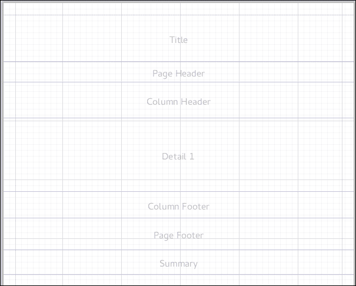

不同的部分如下：

+   **标题**：这是打印一次

+   **页面页眉**：这是打印在所有打印页的开头

+   **列标题**：这是打印在每个详细列的开头

+   **详细**：这是从数据源读取的每个记录打印的地方

+   **列页脚**：这是打印在每个详细列的末尾

+   **页面页脚**：这是打印在所有打印页的末尾

+   **摘要**：这是打印在报告的末尾，通常用于显示计算、总计和一般总结

Jasper 是一个非常灵活的报告解决方案，它还允许我们在 Jasper 报告内部运行 Groovy 脚本来进行动态计算以及动态布局。如果您不想根据某些条件打印页面，或者基于数据库中的内容，或者您不想显示某些数据，这将非常有用。

接下来，我们将安装 Jaspersoft Studio 并开始为我们应用程序创建报告。

# 安装 Jaspersoft Studio 6

为了做到这一点，您需要安装 Java 8。如果您没有安装，请回到第一章，*FP、响应式和 Scala 简介*，并遵循设置说明。Jasper 真的非常棒，因为它可以在多个平台上运行；然而，它在 Windows 上运行得更好。我们使用 Linux，因此我们需要处理字体。JasperReports 使用许多微软的核心字体，例如 Arial 和 Times New Roman。Linux 上有一些选项可以拥有源文件。您可以在 Linux 上查找 mscorefonts 安装程序，或者只需从 Windows 复制字体。

如果您有双启动 Linux/Windows 安装，您可以前往 Windows 驱动器上的位置 `WindowsDrive/Windows/Fonts`。您需要将所有字体文件复制到 Linux 上的 `/usr/share/fonts` 并运行 `$ sudo fc-cache -fv`。这可能需要一些时间——对于我的 Windows 安装，大约是 ~300 MB 的字体。您可以在 Linux 上测试是否拥有 Windows 核心字体。打开 writer 并检查字体。您应该看到类似以下的内容：

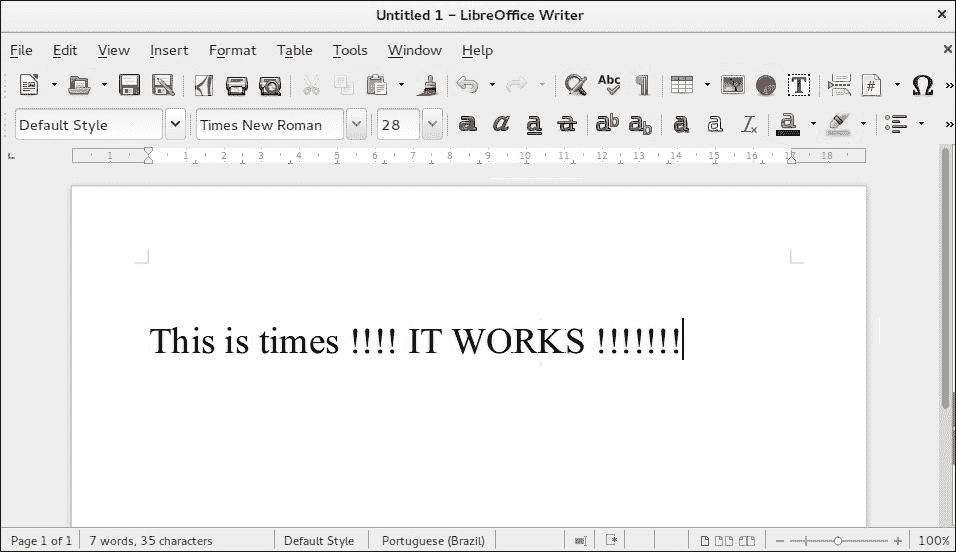

为什么这如此重要？因为如果您没有放置正确的字体，Jasper 将无法工作。它将抛出一些随机异常，这些异常没有意义，但很可能与缺少字体有关。

一旦我们有了字体，我们就可以继续下载 Jaspersoft Studio 6。对于这本书，我们将使用 6.2.2 版本。您可以从 [`community.jaspersoft.com/project/jasperreports-library/releases`](http://community.jaspersoft.com/project/jasperreports-library/releases) 下载它。如果您在 Linux 上，强烈建议使用 `DEB` 软件包；否则，您将需要安装几个其他依赖项。

一旦您下载并安装了 Jaspersoft Studio 并打开程序，您将看到与此类似的用户界面：

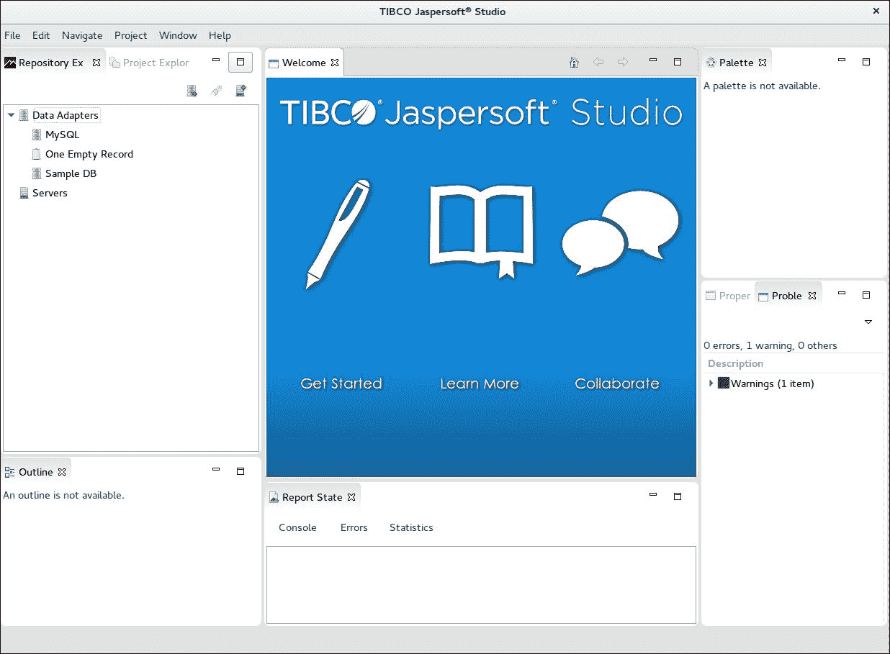

我们已经成功安装了 Jaspersoft Studio。现在，我们需要配置我们的 MySQL 数据源，以便开始为我们的应用程序创建报告。

# 在 Jaspersoft Studio 中配置 MySQL 数据适配器

打开 Jaspersoft Studio 6 并点击**文件** | **新建** | **数据适配器向导**。您将看到以下屏幕：

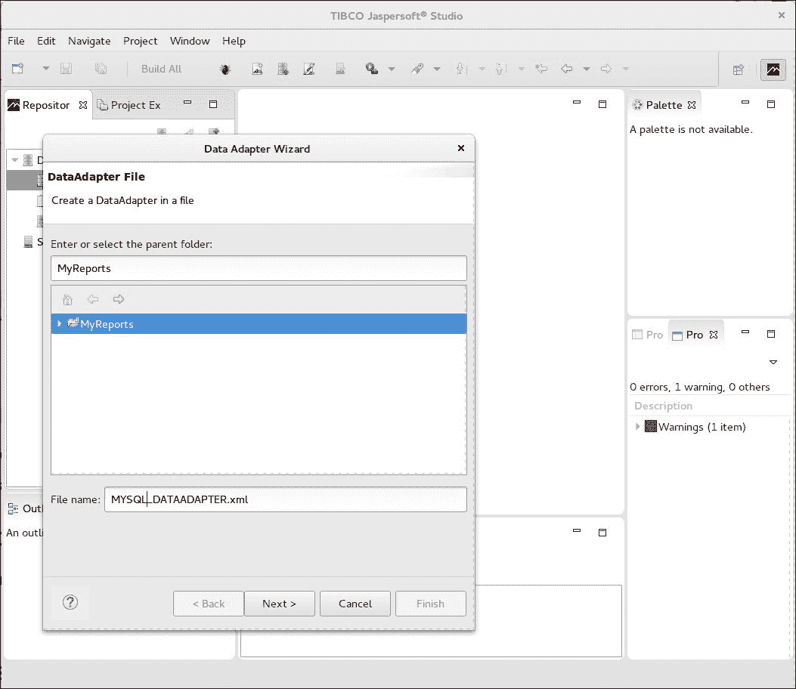

**文件名**应为 `MYSQL_DATAADAPTER.xml`，然后您可以点击**下一步 >**。

接下来，我们需要选择数据库适配器的类型。有几个选项，例如 Cassandra、MongoDB、HBase、JSON 文件等。

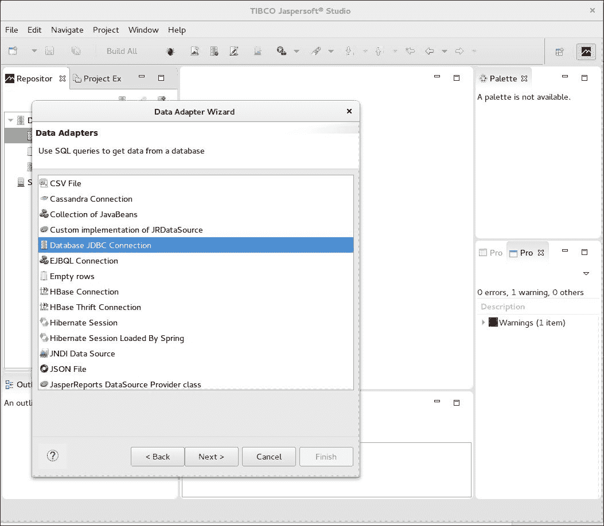

我们需要选择**数据库 JDBC 连接**并点击**下一步 >**。

现在，我们需要配置连接详情。

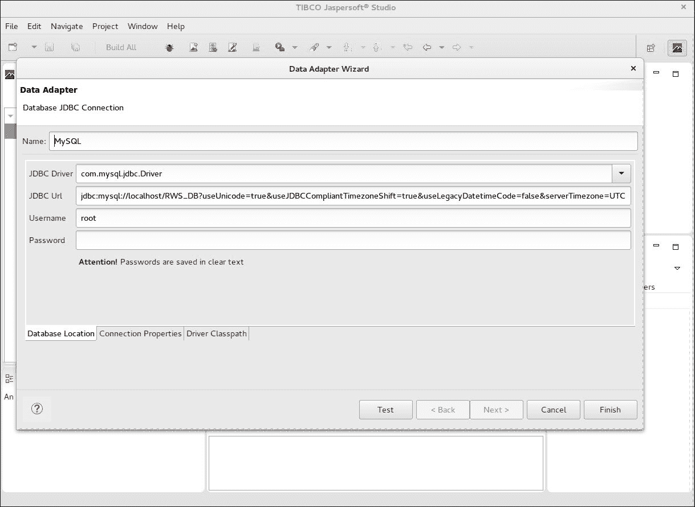

字段应填写如下：

+   **名称：**`MySQL`

+   **JDBC 驱动程序：**`com.mysql.jdbc.Driver`

+   **JDBC URL：**`jdbc:mysql://localhost/RWS_DB?useUnicode=true&useJDBCCompliantTimezoneShift=true&useLegacyDatetimeCode=false&serverTimezone=UTC`

+   **用户名：**`root`

+   **密码：**`此字段需要为空，或者如果您正在使用密码，请输入密码。`

我们还需要将驱动程序配置到 Jaspersoft Studio 的类路径中。由于我们在同一个盒子上运行应用程序，我们已经在 `~/.ivy2/cache/mysql/mysql-connector-java/jars/mysql-connector-java-6.0.3.jar` 文件夹中下载了 MySQL 驱动程序，使用 SBT。我们只需要在第三个标签页上指出它，该标签页称为 `Driver Classpath`。

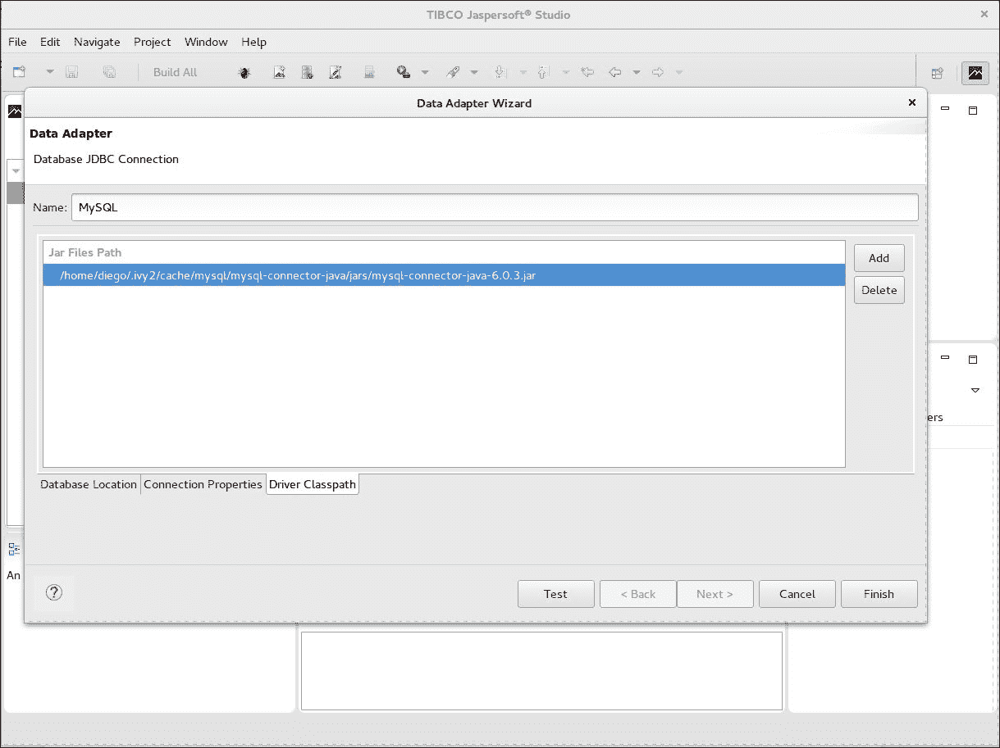

现在我们可以测试连接，看看是否一切正常。


太好了！现在我们已经配置好了我们的 MySQL 数据库适配器，准备开始为您的应用程序创建报告。

# 创建产品报告

要创建产品报告，请点击**文件** | **新建** | **Jasper 报告**。然后选择**发票**模板。

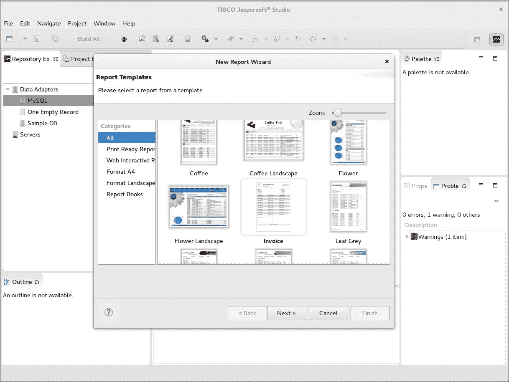

现在您可以点击**下一步 >**，我们将设置报告的名称。文件名将是 `Products.jrxml`。点击**下一步** **>**。然后，我们需要选择**数据源：** `MySQL`。

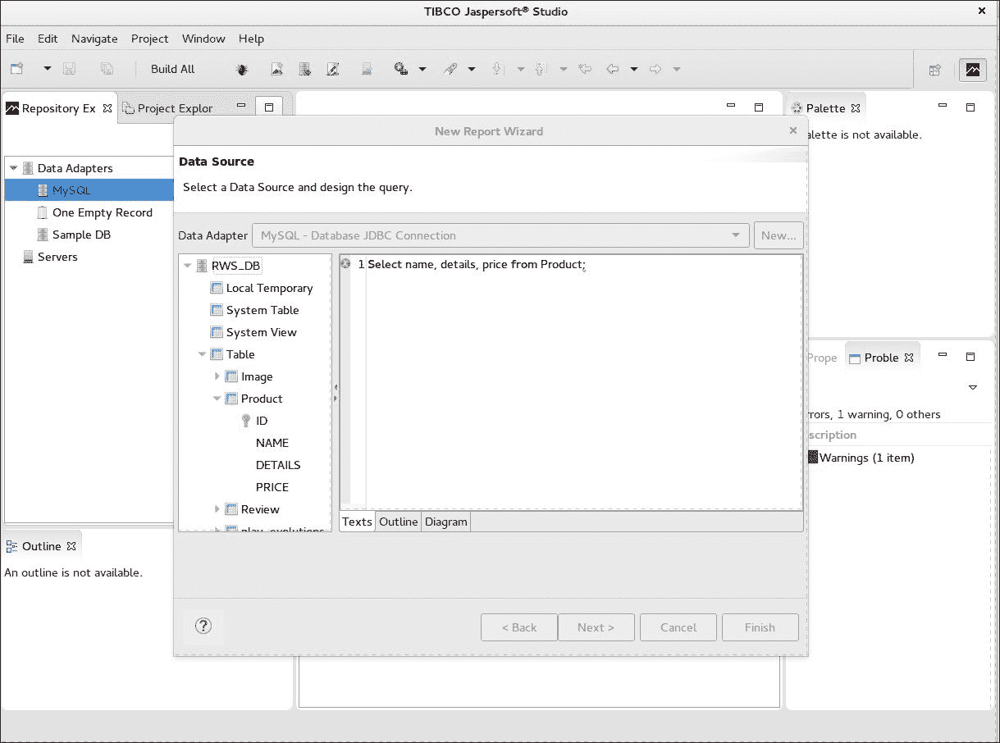

现在，您需要运行 `Select name, details, price from Product;` 查询。

在设置完 SQL 查询后，您可以点击**下一步 >**。

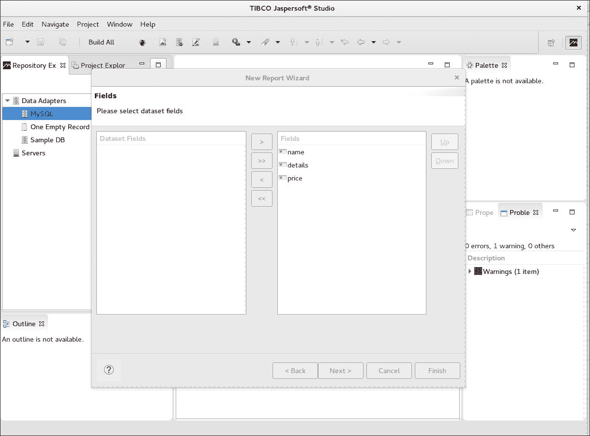

接下来，您需要选择将在报告中使用的字段。从左侧列表中选择所有字段并将它们移动到右侧列表。然后点击**下一步 >**。对于这个报告，我们不需要分组排序，所以只需跳过分组并再次点击**下一步 >**。

恭喜！我们已经完成了设置。我们可以使用 Jaspersoft Studio 预览报告。只需点击名为 **Products.jxml** 的新报告。我们将移除所有不需要的字段以及标志。然后报告将看起来像这样：

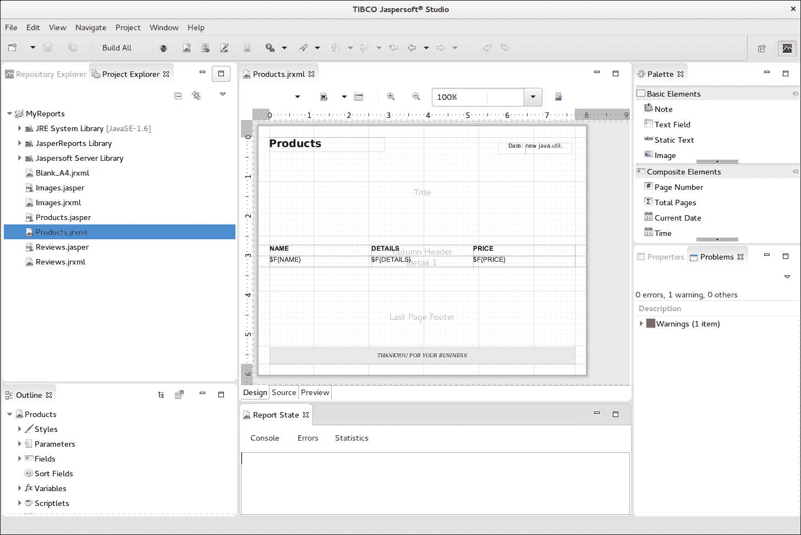

我们将更改标题为 `Products` 并删除所有其他信息，但保留 **名称**、**详情**和**价格**标题，这些将被保留。我们还将保留来自 MySQL 数据库的 **$F{NAME}**、**$F{DETAILS}** 和 **$F{PRICE}** 字段。

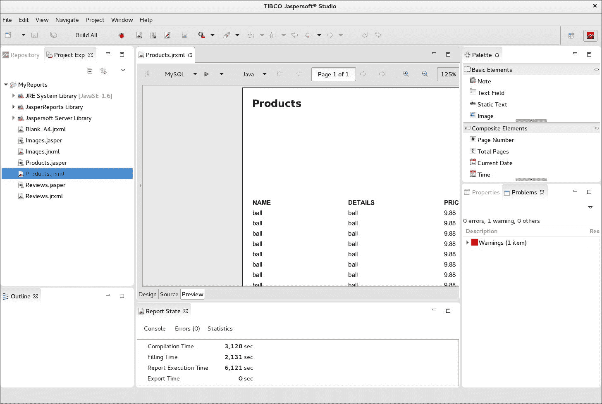

现在，我们可以看到报告预览。我们需要点击底部名为 **预览** 的选项卡。有几个预览选项。我们必须从屏幕顶部选择 **MySQL** 作为数据源以及导出格式；在这里，我们使用 **Java** 来查看 UI。您也可以选择其他格式，例如 **PDF**。

接下来，我们需要创建审查和图像的报告。

# 创建审查报告

现在，我们将创建审查报告。我们将使用与产品报告非常相似的过程。让我们开始创建审查报告：

1.  点击 **文件** | **新建** | **Jasper 报告**。选择 **发票** 模板并点击 **下一步 >**。

1.  文件名将是 `Reviews.jrxml`。然后点击 **下一步 >**。

1.  从 **数据适配器** 中选择 **MySQL** 并点击 **下一步 >**。

1.  **查询（文本）** 应包含以下代码片段：

    ```java
            Select p.name, r.author, r.comment 
            from Product p, Review r 
            where p.id = r.product_id; 

    ```

1.  然后点击 **下一步 >**。

1.  选择所有字段：**名称**、**作者**和**评论**，然后点击 **下一步**。>

1.  让我们跳过 **分组** 部分，点击 **下一步** 然后点击 **完成**。

1.  我们将移除所有模板标签和字段，只保留数据库字段，所以我们应该有类似这样的内容：


就这样！我们已经有了审查报告。如果您愿意，可以点击屏幕底部的 **预览** 选项卡，并选择 **MySQL** 和 **Java** 来查看报告。请记住，您将需要数据；否则，它将是空的。

# 创建图像报告

现在，我们将创建图像报告。我们将遵循与产品报告和审查报告非常相似的过程。由于我们有图像 URL，我们还将显示图像，因此我们需要使用不同的组件。让我们开始创建图像报告：

1.  点击 **文件** | **新建** | **Jasper 报告**。

1.  选择 **发票** 模板并点击 **下一步**。

1.  文件名将是 `Images.jrxml`。然后点击 **下一步**。

1.  从 **数据适配器** 中选择 **MySQL** 并点击 **下一步 >**。

1.  **查询（文本）** 应包含以下代码片段：

    ```java
            Select p.name, i.url 
            from Image i, Product p 
            where p.id = i.product_id; 

    ```

1.  然后点击 **下一步 >**。

1.  选择所有字段：**名称**、**url**，然后点击 **下一步 >**。

1.  让我们跳过分组部分，点击 **下一步 >** 然后点击 **完成**。

现在，我们需要移除所有标签和字段，就像我们对其他报告所做的那样，只保留数据适配器中的标签和字段。

我们需要添加一个名为 **Image** 的图像组件。你可以在右侧的 **基本元素** 面板中找到它。只需将其拖放到详细带中，如图所示：

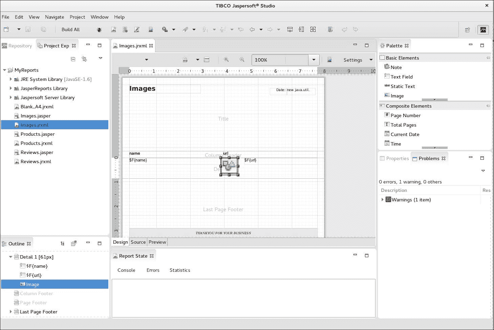

选择一个自定义表达式，然后输入 `$F{url}`。

就这样！现在我们已经有了包含图像的图像报告，是时候更改 Play 框架应用程序，以便在那里以 PDF 格式渲染此报告了。

# 将 JasperReports 集成到 Play 框架中

我们需要在 `ReactiveWebStore/app` 下创建一个新的文件夹，名为 `reports`。然后，我们将从 Jaspersoft Studio 复制所有三个新的 `.jrxml` 文件到这个文件夹，并设置构建依赖项。

## build.sbt

首先，我们需要在 `build.sbt` 文件中添加新的依赖项。

在添加 Jasper 依赖项后，你的 `build.sbt` 文件应该看起来像这样：

```java
    libraryDependencies ++= Seq( 
      // .... Other dependencies .... 
      "net.sf.jasperreports" % "jasperreports" % "6.2.2"  withSources() 
      ,"net.sf.jasperreports" % "jasperreports-functions" % "6.2.2", 
      "net.sf.jasperreports" % "jasperreports-chart-themes" % "6.2.2" 
    ) 
    resolvers += "Jasper" at 
    "https://jaspersoft.artifactoryonline.com/jaspersoft/repo/" 
    resolvers += "JasperSoft" at 
    "https://jaspersoft.artifactoryonline.com/jaspersoft/jaspersoft-
    repo/" 
    resolvers += "Jasper3rd" at 
    "https://jaspersoft.artifactoryonline.com/jaspersoft/
    jaspersoft-3rd-party/" 
    resolvers += "mondrian-repo-cache" at 
    "https://jaspersoft.artifactoryonline.com/jaspersoft/
    mondrian-repo-cache/" 
    resolvers += "spring-mil" at "http://repo.spring.io/libs-milestone" 
    resolvers += "spring-rel" at "http://repo.spring.io/libs-release" 
    resolvers += "oss" at 
    "https://oss.sonatype.org/content/groups/public/" 

```

因此，基本上，我们添加了所有的 JasperReports 依赖和解析器，这些解析器是一系列远程仓库，SBT 可以在其中查找 `jar` 文件。你可以在控制台运行 `$ activator compile` 命令来重新加载新的依赖项。运行 `compile` 后，再次生成 eclipse 文件是很重要的，所以你需要运行 `$ activator eclipse`。

## 通用报告生成器

现在是时候用 Scala 编码了。我们将在 Scala 中创建一个通用报告生成器。在 `ReactiveWebStore/app/reports` 下，我们将创建一个新的 Scala 类，名为 `ReportBuilder.scala`。

你的 `ReportBuilder.scala` 文件应该包含以下代码：

```java
    package reports 
    object ReportBuilder { 
      private var reportCache:scala.collection.Map[String,Boolean] =  
      new scala.collection.mutable.HashMap[String,Boolean].empty 
      def generateCompileFileName(jrxml:String): String =  
      "/tmp/report_" + jrxml + "_.jasper" 
      def compile(jrxml:String){ 
        if(reportCache.get(jrxml).getOrElse(true)){ 
          JasperCompileManager.compileReportToFile( new  
          File(".").getCanonicalFile +     "/app/reports/" + jrxml ,  
          generateCompileFileName(jrxml)) 
          reportCache += (jrxml -> false) 
        } 
      } 
      def toPdf(jrxml:String):ByteArrayInputStream = { 
        try { 
          val os:OutputStream = new ByteArrayOutputStream() 
          val reportParams:java.util.Map[String,Object] = new  
          java.util.HashMap() 
          val con:Connection = DriverManager.getConnection 
          ("jdbc:mysql://localhost/RWS_DB?user=root&password       
            =&useUnicode=true&useJDBCCompliantTimezoneShift       
          =true&useLegacyDatetimeCode=false&serverTimezone=UTC") 
          compile(jrxml) 
          val jrprint:JasperPrint = JasperFillManager.fillReport 
          (generateCompileFileName(jrxml),  reportParams, con) 
            val exporter:JRPdfExporter = new JRPdfExporter() 
          exporter.setExporterInput(new SimpleExporterInput(jrprint)) 
          exporter.setExporterOutput 
          (new SimpleOutputStreamExporterOutput(os)); 
          exporter.exportReport() 
          new ByteArrayInputStream 
          ((os.asInstanceOf[ByteArrayOutputStream]).toByteArray()) 
        }catch { 
          case e:Exception => throw new RuntimeException(e) 
        } 
      } 
    } 

```

首先，我们在 `generateCompileFileName` 函数中设置一个临时目录来存储 Jasper 编译文件。正如你所见，我们将编译后的报告存储在 `/tmp/`。如果你不使用 Linux，你需要更改此路径。

接下来，我们有编译函数，它接收一个作为参数的 JRXML 报告。有一个报告缓存 `Map` 对象，用于对 Jasper 文件进行按需缓存。这个映射以 JRXML 报告作为键，布尔文件作为值。这个解决方案允许你按需编译报告。

最后，我们有 `toPdf` 函数，它将接收 `jrxml` 函数并编译所需的报告。此函数使用 `DriverManager` 获取 SQL 连接，以便将连接发送到 Jasper 引擎。最后，有由 `JasperFillManager` 管理的填充过程，它将接收 Jasper 文件和报告参数（对我们来说是一个空映射）以及 SQL 连接。

在用数据库中的数据填充报告后，我们可以使用 `JRPdfExporter` 命令将报告导出为 PDF。由于这是一个通用函数，我们将返回一个 `ByteArrayInputStream`，这是一个内存中的流结构。

接下来，下一步是更改我们的控制器，以便能够为产品、评论和图像生成报告。

## 将报告添加到产品控制器

我们需要更改产品控制器以公开新的报告功能。

在添加报告功能后，您的 `ProductController.scala` 文件应该看起来像这样：

```java
    @Singleton 
    class ProductController @Inject() (val messagesApi:MessagesApi,val 
    service:IProductService) extends Controller with I18nSupport { 
      //... rest of the controller code... 
      def report() = Action { 
        import play.api.libs.concurrent. 
        Execution.Implicits.defaultContext 
        Ok.chunked( Enumerator.fromStream(  
        ReportBuilder.toPdf("Products.jrxml") ) ) 
        .withHeaders(CONTENT_TYPE -> "application/octet-stream") 
        .withHeaders(CONTENT_DISPOSITION -> "attachment;  
          filename=report-products.pdf" 
        ) 
      }
    }
```

就在这里，我们有一个名为 `report` 的新函数。我们需要使用我们的 `ReportBuilder` 方法，并将 `Products.jrxml` 作为参数传递。我们使用 `Ok.chunked` 函数以便能够将报告流式传输到浏览器。我们还设置了一些响应头，例如内容类型和文件名，这些将被报告为 `products.pdf`。

现在，我们将将相同的代码应用到评论和图片控制器上。

## 将报告添加到评论控制器

现在是时候为评论控制器创建报告函数了。让我们开始吧。

在添加报告功能后，您的 `ReviewController.scala` 文件应该看起来像这样：

```java
    @Singleton 
    class ReviewController @Inject() 
    (val messagesApi:MessagesApi, 
      val productService:IProductService, 
    val service:IReviewService) 
    extends Controller with I18nSupport { 
      //... rest of the controller code... 
      def report() = Action { 
        import play.api.libs.concurrent.Execution. 
        Implicits.defaultContext 
        Ok.chunked( Enumerator.fromStream(  
        ReportBuilder.toPdf("Reviews.jrxml") ) ) 
        .withHeaders(CONTENT_TYPE -> "application/octet-stream") 
        .withHeaders(CONTENT_DISPOSITION -> "attachment;  
        filename=report-reviews.pdf") 
      } 
    } 

```

这里与产品控制器相同的逻辑。主要区别是 `jrxml` 文件和文件名响应头。现在，我们可以移动到最后一个控制器--图片控制器。

## 将报告添加到图片控制器

最后，我们将像对产品控制器和评论控制器所做的那样应用相同的逻辑，但现在是我们更改图片控制器的时候了。

在添加报告功能后，您的 `ImageController.scala` 文件应该看起来像这样：

```java
    @Singleton 
    class ImageController @Inject() 
    (val messagesApi:MessagesApi, 
      val productService:IProductService, 
    val service:IImageService) 
    extends Controller with I18nSupport { 
      // ... rest of the controller code ... 
      def report() = Action { 
        import play.api.libs.concurrent.Execution. 
        Implicits.defaultContext 
        Ok.chunked( Enumerator.fromStream(  
        ReportBuilder.toPdf("Images.jrxml") ) ) 
        .withHeaders(CONTENT_TYPE -> "application/octet-stream") 
        .withHeaders(CONTENT_DISPOSITION -> "attachment;  
        filename=report-images.pdf") 
      } 
    } 

```

好的，我们已经完成了所有的控制器。然而，我们还需要配置路由，否则我们无法调用控制器--这是下一步。

# 路由 - 添加新的报告路由

现在，我们需要添加报告的新路由。为此，我们将编辑 `conf/routes` 文件，如下所示：

```java
    GET     /reports           controllers.HomeController.reports  
    # 
    # Reports 
    # 
    GET  /product/report       controllers.ProductController.report 
    GET  /review/report        controllers.ReviewController.report 
    GET  /image/report         controllers.ImageController.report 

```

现在我们已经完成了路由，我们需要更改 UI 以便公开新的报告功能。我们将创建一个包含所有报告的新视图，并且为了方便起见，我们还将为每个资源 UI（产品、评论和图片）添加一个按钮。

# 新的集中式报告 UI

我们需要在 `ReactiveWebStore/views/reports_index.scala.html` 创建一个新的视图。

您的 `reports_index.scala.html` 文件应该看起来像这样：

```java
    @()(implicit flash: Flash) 
    @main("Reports") { 
      <a href="/product/report"> Products  
      Report</a><BR> 
      <a href="/review/report"> Reviews Report  
      </a><BR> 
      <a href="/image/report"> Images  
      Report</a><BR> 
    } 

```

因此，这里我们将基本上列出所有资源--产品、评论和图片，并将相关控制器链接起来，当用户点击相应的链接时，将下载 PDF 报告。现在我们需要编辑每个资源（产品、图片和评论）视图，以便在那里添加报告链接。

## 为每个视图添加报告按钮

让我们先编辑产品视图。

您的 `product_index.scala.html` 文件应该看起来像这样：

```java
    @(products:Seq[Product])(implicit flash: Flash) 
    @main("Products") { 
      // ... rest of the ui code ... 
      <p> 
        <a href="@routes.ProductController.blank" class="btn btn- 
        success"> 
        <i class="icon-plus icon-white"></i>Add Product</a>  
        <a href="@routes.ProductController.report" class="btn btn- 
        success"> 
        <i class="icon-plus icon-white"></i>Products Report</a> 
      </p> 
    } 

```

如您所见，我们添加了一个指向新报告函数的新按钮。我们还需要为评论和图片 UI 执行相同的操作。

您的 `review_index.scala.html` 文件应该看起来像这样：

```java
    @(reviews:Seq[Review])(implicit flash: Flash) 
    @main("Reviews") { 
      // ... rest of the ui code ... 
      <p> 
        <a href="@routes.ReviewController.blank" class="btn btn- 
        success"><i class="icon-plus icon-white"></i>Add Review</a>  
        <a href="@routes.ReviewController.report" class="btn btn- 
        success"><i class="icon-plus icon-white"></i>Review Report</a>  
      </p> 
    } 

```

现在我们可以向图片视图添加最终的按钮。

您的 `image_index.scala.html` 文件应该看起来像这样：

```java
    @(images:Seq[Image])(implicit flash:Flash) 
    @main("Images") { 
      // ... rest of the ui template ... 
      <p> 
        <a href="@routes.ImageController.blank" class=
        "btn btn-success"><i class="icon-plus icon-white"></i>Add 
        Image</a>  
        <a href="@routes.ImageController.report" class=
        "btn btn-success"><i class="icon-plus icon-white"></i>
        Images Report</a>  
      </p> 
    } 

```

一切准备就绪！现在我们可以运行 `$ activator run` 来查看新的用户界面和报告按钮。访问 `http://localhost:9000/`：

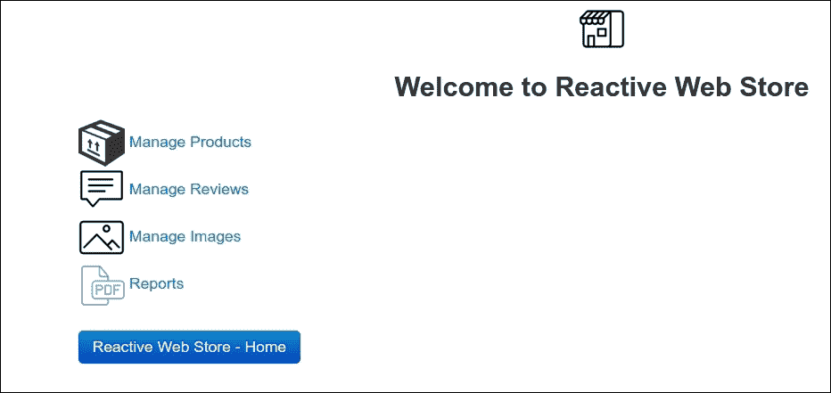

如果你访问 `http://localhost:9000/reports` 或点击 **报告**，你会看到以下内容：

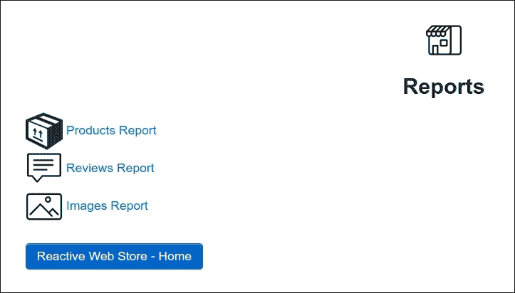

就这样！我们在 Play 框架应用程序上已经使所有报告都正常工作。

# 摘要

在本章中，你学习了如何使用 Jaspersoft Studio 和 JasperReports 创建自定义报告。此外，你还修改了应用程序以集成 Play 框架和 JasperReports。

在下一章中，你将学习如何使用 Akka 框架。我们将继续构建我们的应用程序，并采用演员模型为你的应用程序带来一个全新的杀手级特性。
