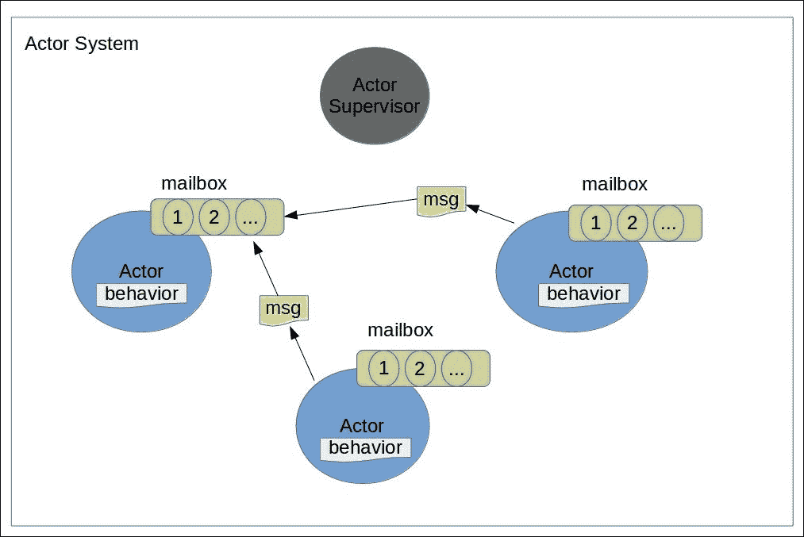
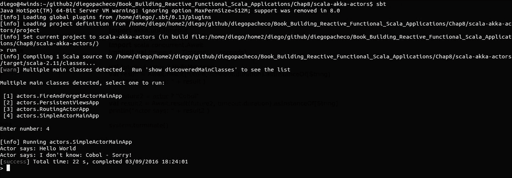
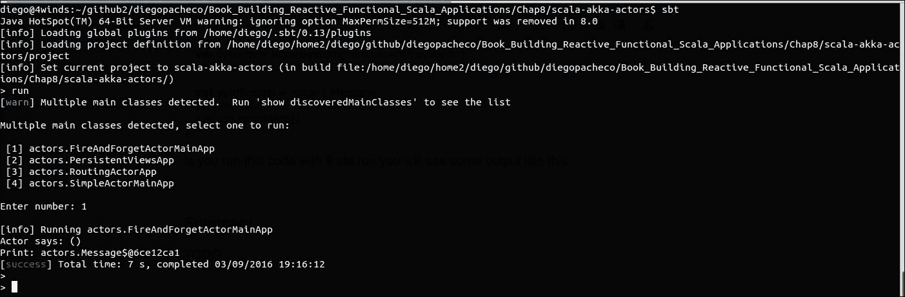
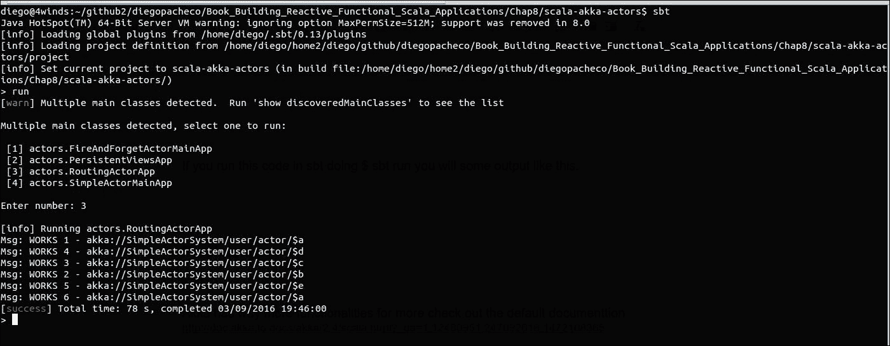
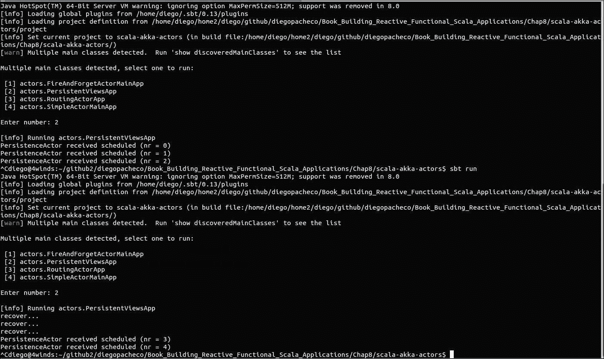
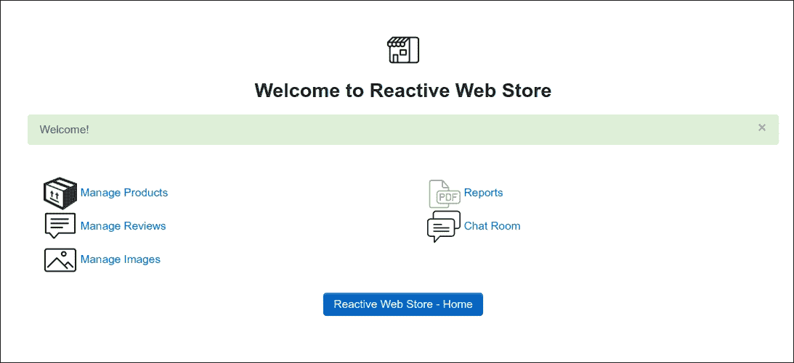
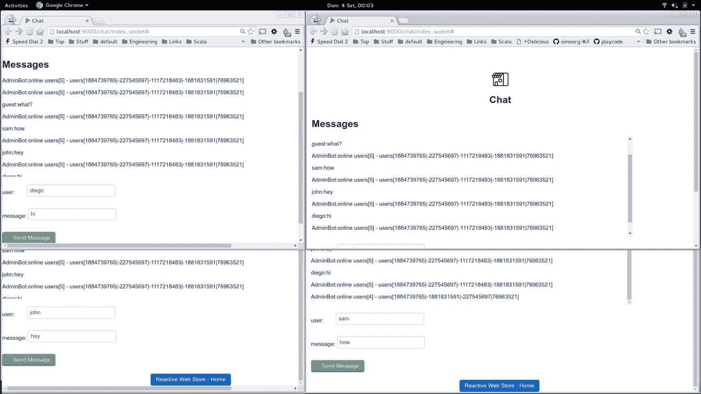

# 第八章：使用 Akka 开发聊天

在前面的章节中，我们使用 Slick 将数据持久化到 MySQL，并使用 Jasper reports 编写 PDF 报告。现在，我们将使用 Akka 在我们的应用程序中添加更多功能。

在本章中，您将学习如何使用 Akka 框架创建 Actors。我们将结合使用 Play 框架和 WebSockets 来实现聊天功能。

本章将涵盖以下主题：

+   理解 Actor 模型

+   Actor 系统、Actor 路由和调度器

+   邮箱、Actor 配置和持久化

+   创建我们的聊天应用程序

+   测试我们的 Actors

# 添加 Akka 的新 UI 介绍

Akka ([`akka.io/`](http://akka.io/)) 是一个用于在 Scala、Java 和 .NET 中构建并发、分布式和弹性消息驱动应用程序的框架。使用 Akka 构建应用程序具有以下优点：

+   **高性能**：Akka 在具有 ~2.5 百万 Actors 每 GB RAM 的通用硬件上，每秒可以处理高达 5000 万条消息。

+   **设计上的弹性**：Akka 系统具有本地和远程 Actors 的自我修复特性。

+   **分布式和弹性**：Akka 拥有所有扩展应用程序的机制，例如集群、负载均衡、分区和分片。Akka 允许您根据需求扩展或缩小 Actors。

Akka 框架为并发、异步和分布式编程提供了良好的抽象，例如 Actors、Streams 和 Futures。在生产环境中有许多成功的案例，例如 BBC、Amazon、eBay、Cisco、The Guardian、Blizzard、Gilt、HP、HSBC、Netflix 以及许多其他公司。

Akka 是一个真正的反应式框架，因为从发送和接收消息到 Actors 的所有操作都是无锁的、非阻塞的 IO 和异步的。

# Actor 模型的介绍

并发编程的关键是避免共享可变状态。共享状态通常需要锁和同步，这使得您的代码并发性降低，复杂性增加。Actors 不共享任何东西；它们有内部状态，但它们不共享它们的内部状态。

Actors 具有位置透明性；它们可以在本地或远程系统以及集群中运行。混合本地和远程 Actors 也是可能的——这对于可扩展性来说非常好，并且非常适合云环境。Actors 可以在任何地方运行，从您的本地设备、云、裸金属数据中心和 Linux 容器。

## 什么是 Actor？

Actors 可以作为线程、回调监听器、单例服务、**企业 JavaBeans (EJB**)、路由器、负载均衡器或池以及**有限状态机 (FSM**)的替代品。Actor 模型概念并非全新；它是由 Carl Hewitt 在 1973 年创建的。Actor 模型在电信行业中得到了广泛的应用，例如在 Erlang 这样的坚固技术中。Erlang 和 Actor 模型在 Ericsson 和 Facebook 等公司取得了巨大的成功。

Actors 有一种简单的工作方式：

+   代码组织单元：

    +   处理

    +   存储

    +   通信

        +   它们管理内部状态

        +   它们有一个邮箱

        +   它们通过消息与其他 Actor 进行通信

        +   它们可以在运行时改变行为

# 消息交换和邮箱

Actor 通过消息相互交谈。有两种模式：一种称为 ask，另一种称为 fire and forget。两种方法都是异步和非阻塞 IO。当一个 Actor 向另一个 Actor 发送消息时，它并不是直接发送给另一个 Actor；实际上，它是发送到 Actor 的邮箱中。

消息以时间顺序的方式入队到 Actor 邮箱中。Akka 中有不同的邮箱实现。默认的是基于**先进先出**（**FIFO**）的。这是一个好的默认设置；然而，你可能需要一个不同的算法，这是可以的，因为如果你需要，你可以更改邮箱。更多详细信息可以在官方文档中找到（[`doc.akka.io/docs/akka/2.4.9/scala/mailboxes.html#mailboxes-scala`](http://doc.akka.io/docs/akka/2.4.9/scala/mailboxes.html#mailboxes-scala)）。Actor 存在于 Actor 系统中。在一个集群中你可以有多个 Actor 系统：



Akka 将 actor 状态封装在邮箱中，并将其与 Actor 行为解耦。Actor 行为是你将在 Actor 内部拥有的代码。你需要将 Actor 和 Akka 视为一个协议。所以，基本上，你需要定义你将有多少个 Actor，以及每个 Actor 在代码、责任和行为方面的作用。Actor 系统有 Actor 和监督者。监督者是 Akka 机制之一，用于提供容错性和弹性。监督者负责 Actor 实例，并且可以根据需要重启、终止或创建更多的 Actor。

Actor 模型非常适合并发和可伸缩性；然而，就像计算机科学中的每一件事一样，都有权衡和缺点。例如，Actor 需要新的思维方式和不同的思考方式。

没有万能的解决方案。一旦你有了你的协议，可能很难在协议外部重用你的 Actor。一般来说，与面向对象的类或函数式编程中的函数相比，Actor 可能更难组合。

# 使用 Akka 编码 Actor

让我们看看以下使用 Akka 框架和 Scala 编写的 Actor 代码：

```java
    import akka.actor._ 
    case object HelloMessage 
    class HelloWorldActor extends Actor { 
      def receive = { 
        case HelloMessage => sender() ! "Hello World" 
        case a:Any => sender() ! "I don't know: " + a + " - Sorry!" 
      } 
    } 
    object SimpleActorMainApp extends App{  
      val system = ActorSystem("SimpleActorSystem") 
      val actor = system.actorOf(Props[HelloWorldActor])  
      import scala.concurrent.duration._ 
      import akka.util.Timeout 
      import akka.pattern.ask 
      import scala.concurrent.Await 
      implicit val timeout = Timeout(20 seconds)  
      val future = actor ? HelloMessage 
      val result = Await.result(future, 
      timeout.duration).asInstanceOf[String] 
      println("Actor says: " + result )  
      val future2 = actor ? "Cobol" 
      val result2 = Await.result(future2, 
      timeout.duration).asInstanceOf[String] 
      println("Actor says: " + result2 )    
      system.terminate() 
    } 

```

如果你将这段 Akka 代码在你的控制台中的`sbt`上运行，你会看到类似以下的输出：

```java
$ sbt run 

```



让我们更仔细地看看我们刚刚编写的这段 Akka 代码，其中我们定义了一个名为`HelloWorldActor`的 Scala 类。为了使这个类成为 Actor，我们需要扩展 Actor。Actor 默认是反应式的，这意味着它们正在等待接收消息以对消息做出反应。你需要在一个事件循环中编写你的行为。在 Akka 中，这是通过在 Scala 中用模式匹配器编写`receive`函数来完成的。

模式匹配器将定义参与者可以做什么。你需要编写所有你希望该参与者处理的消息类型。正如我之前提到的，你需要有一个协议；所以你的协议有一个名为`HelloMessage`的消息。在 Akka 中，使用 Scala 对象作为消息是一种常见的做法。然而，你可以传递几乎所有类型作为消息。甚至可以发送带有参数的 case 类。

好的，我们已经有了我们的协议，即我们的参与者以及他们可以交换的消息。现在我们需要创建一个参与者系统并启动我们的应用程序。正如你所看到的，我们将使用`ActorSystem`对象来创建参与者系统。参与者系统需要有一个名称，可以是任何你喜欢的字符串，只要它包含任何字母[a-z, A-Z, 0-9]以及非开头的'-'或'_'。

在创建系统之后，你可以创建参与者。系统有一个名为`actorOf`的函数，可以用来创建参与者。你需要使用一个特殊对象`Props`并传递`actor`类。为什么我们需要这样做呢？这是因为 Akka 管理参与者状态。你不应该尝试自己管理参与者实例。这是危险的，因为你可能会破坏引用透明性，你的代码可能不会工作。

对于这段代码，我们使用的是 ask 模式。我们将使用它来向参与者发送消息，并想知道参与者将返回什么。正如之前提到的，Akka 以异步和非阻塞的方式进行所有操作。然而，有时你想要立即得到答案，不幸的是，你将需要阻塞。

为了立即得到答案，我们需要定义一个超时并使用`Await`对象。当你使用`?`（ask 模式）向参与者发送消息时，Akka 会为你返回一个 Future。然后，你可以将带有超时的 Future 传递给`Await`，如果答案在超时之前返回，你将得到参与者的响应。

再次强调，我们在这里阻塞是因为我们想要立即得到答案，而且我们处于参与者系统之外。记住，当一个参与者在与参与者系统内的另一个参与者交谈时，它永远不应该阻塞。所以请小心使用`Await`。

在这段代码中，另一个重要的事情是参与者内部的`sender()`方法接收一个函数。这意味着你想要获取发送消息给你的参与者的引用。由于我们正在执行`sender() !`方法，我们正在将答案发送回调用者。`sender()`函数是 Akka 对处理其他参与者或函数调用者的响应消息的抽象。

我们还有一个使用`Any`的情况，这意味着所有其他消息都将由该代码块处理。

ask 模式是向参与者发送消息的一种方式。还有一种叫做`FireAndForget "!"`的模式。fire and forget 将发送一个消息，不会阻塞并等待答案。所以，没有答案——换句话说，Unit。

让我们看看使用`FireAndForget`消息交换的一些代码：

```java
    import akka.actor._  
    object Message  
    class PrinterActor extends Actor { 
      def receive = { 
        case a:Any => 
        println("Print: " + a) 
      } 
    } 
    object FireAndForgetActorMainApp extends App{ 
      val system = ActorSystem("SimpleActorSystem") 
      val actor = system.actorOf(Props[PrinterActor])     
      val voidReturn = actor ! Message 
      println("Actor says: " + voidReturn ) 
      system.terminate() 
    } 

```

如果你使用`$ sbt run`运行此代码，你将看到以下输出：



在这里，我们有一个`PrinterActor`方法，它几乎可以接受任何东西并在控制台上打印。然后，我们将创建一个 Actor 系统，并使用“fire and forget”模式（即“!”）向我们的 Actor 发送消息，正如你所看到的，我们将收到 Unit；最后，我们将使用`terminate`选项等待 Actor 系统的关闭。

# Actor 路由

Akka 提供了路由功能。从业务角度来看，这很有用，因为你可以根据业务逻辑和行为将消息路由到正确的 Actor。对于架构，我们可以用它作为负载均衡，并将消息路由到更多的 Actor 以实现容错和可伸缩性。

Akka 提供了几种路由选项，如下所示：

+   **RoundRobin**：这是一个随机逻辑，将消息发送到池中的每个不同的 Actor。

+   **SmallestMailbox**：这会将消息发送到消息较少的 Actor。

+   **Consistent Hashing**：这根据哈希 ID 对 Actor 进行分区。

+   **ScatterGather**：这会将消息发送到所有 Actor，第一个回复的获胜。

+   **TailChopping**：这会将消息随机发送到路由，如果一秒内没有收到回复，它会选择新的路由并再次发送，依此类推。

让我们看看以下代码的实际应用：

```java
    import akka.actor._ 
    import akka.routing.RoundRobinPool  
    class ActorUpperCasePrinter extends Actor { 
      def receive = { 
        case s:Any => 
        println("Msg: " + s.toString().toUpperCase() + " - " + 
        self.path) 
      } 
    } 
    object RoutingActorApp extends App {    
      val system = ActorSystem("SimpleActorSystem") 
      val actor:ActorRef = system.actorOf(   
        RoundRobinPool(5).props(Props[ActorUpperCasePrinter]),name = 
      "actor")  
      try{ 
        actor ! "works 1" 
        actor ! "works 2" 
        actor ! "works 3" 
        actor ! "works 4" 
        actor ! "works 5" 
        actor ! "works 6"  
      }catch{ 
        case e:RuntimeException => println(e.getMessage()) 
      }   
      system.terminate() 
    } 

```

如果你使用`sbt`运行此代码，即使用`$ sbt run`，你将得到以下输出：



因此，这里我们有一个`ActorUppercasePrinter`函数，它会打印接收到的任何内容，并调用`toString`函数，然后`toUpperCase`。最后，它还会打印`self.path` Actor，这将 Actor 的地址。Actor 以类似于文件系统的层次结构组织。

使用 Akka 有多种方式 - Akka 支持代码或配置（`application.conf`文件）。在这里，我们创建了一个具有五个路由的循环池 Actor。我们将目标 Actor 传递给路由器，它将成为我们的打印 Actor。

如你所见，当我们使用“fire and forget”模式发送消息时，每个消息都会被发送到不同的 Actor。

# 持久化

Akka 在内存上工作。然而，使用持久化是可能的。在 Akka 中，持久化仍然处于某种实验阶段。但是，它是稳定的。对于生产环境，你可以使用高级持久化插件，例如 Apache Cassandra。为了开发和教育的目的，我们将在文件系统中使用 Google leveldb。Akka 提供了多种持久化选项，例如视图和持久化 Actor。

让我们看看使用 Google leveldb 和文件系统的持久化 Actor 的例子：

```java
    import akka.actor._ 
    import akka.persistence._ 
    import scala.concurrent.duration._ 
    class PersistenceActor extends PersistentActor{  
      override def persistenceId = "sample-id-1" 
      var state:String = "myState" 
      var count = 0    
      def receiveCommand: Receive = { 
        case payload: String => 
        println(s"PersistenceActor received ${payload} (nr = 
        ${count})") 
        persist(payload + count) { evt => 
          count += 1 
        } 
      }        
      def receiveRecover: Receive = { 
        case _: String => 
        println("recover...") 
        count += 1 
      } 
    }  
    object PersistentViewsApp extends App { 
      val system = ActorSystem("SimpleActorSystem") 
      val persistentActor = 
      system.actorOf(Props(classOf[PersistenceActor]))     
      import system.dispatcher 
      system.scheduler.schedule(Duration.Zero, 2.seconds, 
      persistentActor, "scheduled") 
    } 

```

执行`$ sbt run`命令将给出以下输出：



如果你使用`$ sbt run`运行此代码，然后停止并再次运行，你将看到每次停止和启动时都会存储和恢复数据。

如你所见，你的 Actor 需要扩展`PersistentActor`以获得持久化支持。你还需要提供一个`persistenceID`。

在这里，你需要实现两个接收函数。一个是命令（也称为消息），另一个是恢复。当这个 Actor 接收消息时，将激活命令的接收循环，而当 Actor 启动时，将激活恢复循环并从数据库中读取持久化数据。

因此，这个 Actor 有一个计数器来计算它接收到的每个消息，并在控制台上打印出它接收到的每个消息。就是这样；正如你所看到的，它非常简单。为了使用这个功能，你还需要配置你的`application.conf`。

你的`application.conf`文件应该看起来像这样：

```java
    akka { 
      system = "SimpleActorSystem" 
      remote { 
        log-remote-lifecycle-events = off 
        netty.tcp { 
          hostname = "127.0.0.1" 
          port = 0 
        } 
      } 
    } 
    akka.cluster.metrics.enabled=off  
    akka.persistence.journal.plugin = 
    "akka.persistence.journal.leveldb" 
    akka.persistence.snapshot-store.plugin = 
    "akka.persistence.snapshot-store.local"  
    akka.persistence.journal.leveldb.dir = "target/persistence/journal" 
    akka.persistence.snapshot-store.local.dir = 
    "target/persistence/snapshots"  
    # DO NOT USE THIS IN PRODUCTION !!! 
    # See also https://github.com/typesafehub/activator/issues/287 
    akka.persistence.journal.leveldb.native = false 

```

因此，我们在这里定义了一个简单的 Akka 系统（本地模式），并配置了 Google leveldb 的持久化。正如你所看到的，我们需要提供一个持久化的路径，并且这个路径必须在操作系统上存在。

由于我们使用了额外的功能，我们还需要更改`build.sbt`以导入我们需要的所有 jar 文件，包括 Akka、持久化和 leveldb。

你的`build.sbt`文件应该看起来像这样：

```java
    // rest of the build.sbt file ...   
    val akkaVersion = "2.4.9"                
    libraryDependencies += "com.typesafe.akka" %% "akka-actor" % 
    akkaVersion 
    libraryDependencies += "com.typesafe.akka" %% "akka-kernel" % 
    akkaVersion 
    libraryDependencies += "com.typesafe.akka" %% "akka-remote" % 
    akkaVersion 
    libraryDependencies += "com.typesafe.akka" %% "akka-cluster" % 
    akkaVersion 
    libraryDependencies += "com.typesafe.akka" %% "akka-contrib" % 
    akkaVersion 
    libraryDependencies += "com.typesafe.akka" %% "akka-persistence" % 
    akkaVersion 
    libraryDependencies += "org.iq80.leveldb" % "leveldb" % "0.7" 
    libraryDependencies += "org.iq80.leveldb" % "leveldb-api" % "0.7" 
    libraryDependencies += "org.fusesource.leveldbjni" % "leveldbjni" % 
    "1.8" 
    libraryDependencies += "org.fusesource.leveldbjni" % "leveldbjni-
    linux64" % "1.8" 
    libraryDependencies += "org.fusesource" % "sigar" % "1.6.4" 
    libraryDependencies += "org.scalatest" % "scalatest_2.11" % "2.2.6" 

```

就这样。这就是我们需要持久化 Actor 状态的所有内容。

### 注意

Akka 有更多的功能。更多内容，请查看默认文档[`doc.akka.io/docs/akka/2.4/scala.html?_ga=1.12480951.247092618.1472108365`](http://doc.akka.io/docs/akka/2.4/scala.html?_ga=1.12480951.247092618.1472108365)。

# 创建我们的聊天应用程序

现在我们对 Akka 有了更好的了解，我们将继续开发我们的应用程序。Akka 与 Play 框架有很好的集成。我们现在将使用 Akka 和 Play 框架中的 Actors。让我们为我们的应用程序构建一个简单的聊天功能。我们将更改代码以添加新的 UI，并使用 Akka 测试套件测试 Actors。

Play 框架已经为我们包含了 Akka 在类路径中，所以我们不需要担心它。然而，我们需要将 Akka 测试套件依赖项添加到`build.sbt`文件中，以便在我们的类路径中有这些类。

你的`build.sbt`应该看起来像这样：

```java
    // rest of the build.stb ...  
    libraryDependencies ++= Seq( 
      "com.typesafe.akka" %% "akka-testkit" % "2.4.4" % Test, 
    // rest of the deps ... 
    )  
    // rest of the build.stb ... 

```

好的，现在你可以去控制台输入`$ activator`，`$ reload`，然后`$ compile`。这将强制 sbt 下载新的依赖项。

现在我们需要创建一个名为 Actors 的包。这个包需要位于`ReactiveWebStore/app/`目录下。我们将开始创建一个`ActorHelper`实用对象，以便拥有一个通用的 ask 模式函数，这是我们之前看到的。这是一个 Actor 辅助的通用 ask 模式实用工具。

你的`ActorHelper.scala`文件应该看起来像这样：

```java
    package actors  
    object ActorHelper {  
      import play.api.libs.concurrent.
      Execution.Implicits.defaultContext 
      import scala.concurrent.duration._ 
      import akka.pattern.ask 
      import akka.actor.ActorRef 
      import akka.util.Timeout 
      import scala.concurrent.Future 
      import scala.concurrent.Await    
      def get(msg:Any,actor:ActorRef):String = { 
        implicit val timeout = Timeout(5 seconds) 
        val result = (actor ? msg).mapTo[String].map { result => 
        result.toString } 
        Await.result(result, 5.seconds) 
      } 
    } 

```

`ActorHelper`只有一个函数：`get`。这个函数将从任何消息中给出的任何 Actor 获取答案。然而，正如你所看到的，我们有一个五秒的超时。如果结果在这段时间内没有返回，将会抛出一个异常。

在此代码中，我们还将 Actor 结果映射到 String，通过在结果 future 中调用 `toString` 函数。这不是很多代码；然而，有很多导入，这使得代码更简洁，我们可以用更少的代码和更少的导入从 Actors 获取答案。

# 聊天协议

现在我们需要定义我们的协议。为此功能，我们需要三个 Actor。我们创建的 Actor 将如下所示：

+   **ChatRoom**：这将包含聊天室中所有用户的引用。

+   **ChatUser**：这将每个用户（活动浏览器）有一个实例。

+   **ChatBotAdmin**：这个简单的 Bot Admin 将提供关于聊天室的状态。

`ChatUserActor` 需要加入 `JoinChatRoom` 对象以开始聊天。`ChatUserActor` 还需要向 `ChatMessage` 类发送消息给 `ChatRoomActor`，该类将向所有用户广播消息。`ChatBotAdmin` 将从 `ChatRoomActor` 的 `GetStats` 对象中获得报告。

让我们开始编写这个协议。首先，我们需要定义这些 Actor 之间交换的消息，如下面的代码片段所示：

```java
    package actors  
    case class ChatMessage(name:String,text: String) 
    case class Stats(users:Set[String])  
    object JoinChatRoom 
    object Tick 
    object GetStats 

```

如您所见，我们有一个名为 `ChatMessage` 的类，其中包含一个名称和文本。这将是在聊天中每个用户发送的消息。然后，我们将有一个统计类，其中包含一组用户--这将是在聊天应用程序中登录的所有用户。

最后，我们有一些动作消息，例如 `JoinChatRoom`、`Tick` 和 `GetStats`。所以，`JoinChatRoom` 将由 `ChatUserActor` 发送到 `ChatRoomActor` 以加入聊天。`Tick` 将是一个定期发生的预定消息，以便 `ChatBotAdmin` 向所有已登录用户发送关于聊天室的状态。`GetStats` 是 `ChatBotAdminActor` 发送到 `ChatRoomActor` 的消息，以获取关于谁在房间中的信息。

现在我们来编写我们的三个演员。

`ChatRoomActor.scala` 文件应该看起来像这样：

```java
    package actors  
    import akka.actor.Props 
    import akka.actor.Terminated 
    import akka.actor.ActorLogging 
    import akka.event.LoggingReceive 
    import akka.actor.Actor 
    import akka.actor.ActorRef 
    import play.libs.Akka 
    import akka.actor.ActorSystem  
    class ChatRoomActor extends Actor with ActorLogging {  
      var users = Set[ActorRef]()  
      def receive = LoggingReceive { 
        case msg: ChatMessage => 
        users foreach { _ ! msg } 
        case JoinChatRoom => 
        users += sender 
        context watch sender   
        case GetStats => 
        val stats:String = "online users[" + users.size + "] - users[" 
        + users.map( a =>        a.hashCode().mkString("|") + "]" 
        sender ! stats 
        case Terminated(user) => 
        users -= user 
      } 
    } 
    object ChatRoomActor { 
      var room:ActorRef = null 
      def apply(system:ActorSystem) = { 
        this.synchronized { 
          if (room==null) room = system.actorOf(Props[ChatRoomActor]) 
          room 
        } 
      } 
    } 

```

`ChatRoomActor` 有一个名为 `users` 的变量，它是一个 `ActorRef` 的集合。`ActorRef` 是对任何演员的泛型引用。我们有一个接收函数，包含三个情况：`ChatMessage`、`JoinChatRoom` 和 `GetStats`。

`ChatUserActor` 方法将发送一个 `JoinChatRoom` 来加入房间。如您所见，我们通过 `sender()` 函数从发送者 Actor 获取 `ActorRef` 方法，并将此引用添加到用户集合中。这样，`ActorRef` 集合就代表了当前聊天室中在线登录的用户。

另一个情况是与 `ChatMessage` 方法相关。基本上，我们将消息广播给聊天中的所有用户。我们这样做是因为我们有所有演员的引用。然后，我们将调用 `foreach` 函数逐个迭代所有用户，然后我们将使用操作符下划线 `_` 表示的每个用户 Actor 发送消息，使用 `FireAndForget "!"`。

`GetStats` 案例创建了一个包含所有聊天室统计信息的字符串。目前，统计信息只是在线用户的数量，这是通过在用户对象上调用 size 函数计算出来的。我们还展示了所有标识已登录 Actor 的哈希码，只是为了好玩。

这就是我们的 `ChatRoomActor` 实现。正如你所见，不描述另一个 Actor 就很难谈论一个 Actor，因为协议总是有点耦合。你可能也会想知道为什么我们为 `ChatRoomActor` 方法有一个伴随对象。

这个对象是为了提供一个创建 Actor 实例的简单方法。我们为我们的设计创建了一个单独的房间；我们不希望有多个聊天室，所以我们需要控制房间 Actor 的创建。

如果房间为空，我们将创建一个新的房间；否则，我们将返回内存中已经获取的房间缓存的实例。我们需要一个 Actor 系统的实例来创建演员，这就是为什么我们在 `apply` 函数中接收系统。当有人编写 `ChatRoomActor(mySystem)` 这样的代码时，`apply` 函数将被调用。

现在，让我们转向 `ChatUserActor` 的实现。

`ChatUserActor.scala` 文件应该看起来像这样：

```java
    package actors  
    import akka.actor.ActorRef 
    import akka.actor.Actor 
    import akka.actor.ActorLogging 
    import akka.event.LoggingReceive 
    import akka.actor.ActorSystem 
    import akka.actor.Props  
    class ChatUserActor(room:ActorRef, out:ActorRef) extends Actor with 
    ActorLogging { 
      override def preStart() = { 
        room ! JoinChatRoom 
      }  
      def receive = LoggingReceive { 
        case ChatMessage(name, text) if sender == room => 
        val result:String = name + ":" + text 
        out ! result 
        case (text:String) => 
        room ! ChatMessage(text.split(":")(0), text.split(":")(1)) 
        case other => 
        log.error("issue - not expected: " + other) 
      } 
    }  
    object ChatUserActor { 
      def props(system:ActorSystem)(out:ActorRef) = Props(new       
      ChatUserActor(ChatRoomActor(system), out)) 
    } 

```

这个演员比上一个稍微容易一些。`ChatUserActor` 接收一个参数，即房间演员引用和一个输出演员。房间将是一个用户将用来与其他用户通信的房间实例。被调用的 `ActorRef` 方法是 Play 框架的 Actor，负责将答案发送回控制器和 UI。

我们基本上只有两种情况：一种是我们接收一个 `ChatMessage`，另一种是聊天室中的 `ChatUserActors` 方法。所以，我们只需要通过输出演员发送回 UI。这就是为什么有一个带有结果的 fire-and-forget 消息给输出 Actor。使用新的 Actor 模型可能会有危险，请参阅[`doc.akka.io/docs/akka/current/scala/actors.html`](http://doc.akka.io/docs/akka/current/scala/actors.html) 了解更多。

另一种情况是只接收一个字符串，这个字符串将是该 Actor 自身的消息。记住，每个 Actor 代表一个用户和一个通过 WebSocket 实现的全双工连接的浏览器。现在不用担心 WebSocket；我们将在本章的后面更详细地介绍它。

对于这个案例函数，我们将 `ChatMessage` 方法发送到房间。我们将消息分成两部分：用户名和文本，它们通过 `:` 分隔。

这里，我们也为了良好的实践而有一个伴随对象。所以，你可以调用 `ChatUserActor`，传递 Actor 系统和一个 curried 参数给输出演员。

现在，我们将转向最后一个 Actor：Bot Admin Actor，它应该看起来像这样：

```java
    package actors  
    import akka.actor.ActorRef 
    import akka.actor.Actor 
    import akka.actor.ActorLogging 
    import akka.event.LoggingReceive 
    import akka.actor.ActorSystem 
    import akka.actor.Props 
    import scala.concurrent.duration._  
    class ChatBotAdminActor(system:ActorSystem) extends Actor with 
    ActorLogging { 
      import play.api.libs.concurrent.Execution.
      Implicits.defaultContext 
      val room:ActorRef = ChatRoomActor(system) 
      val cancellable = system.scheduler.schedule(0 seconds, 
      10 seconds, self , Tick) 
      override def preStart() = { 
        room ! JoinChatRoom 
      }  
      def receive = LoggingReceive { 
        case ChatMessage(name, text) => Unit 
        case (text:String) => room ! ChatMessage(text.split(":")(0), 
        text.split(":")(1)) 
        case Tick => 
        val response:String = "AdminBot:" + ActorHelper.get
        (GetStats, room) 
        sender() ! response 
        case other => 
        log.error("issue - not expected: " + other) 
      } 
    } 
    object ChatBotAdminActor { 
      var bot:ActorRef = null 
      def apply(system:ActorSystem) = { 
        this.synchronized { 
          if (bot==null) bot = system.actorOf(Props
          (new ChatBotAdminActor(system))) 
          bot 
        } 
      } 
    } 

```

如您所见，这个 Actor 接收聊天室引用作为参数。使用 Actor 系统，它获取聊天室 Actor 的引用。这个 Actor 现在已经接收到了`ActorSystem`消息。

使用名为 system 的 Actor 系统变量，我们还将为这个 Actor 每十秒安排一个`Tick`。这次，窗口间隔将是机器人通知聊天室当前状态的时间。

我们还将重写`preStart`函数。Akka 将在 Actor 在 actor 系统中创建时调用此函数。此实现将向房间发送一条消息，即`JoinChatRoom`。

如同所有 Actor 一样，有接收函数的实现。第一个情况`ChatMessage`返回 Unit。如果您想使这个机器人对人们做出响应，请移除 Unit 并编写您想要的适当的 Scala 代码。

在第二种情况下，我们将有一个要发送到聊天室的消息字符串。最后，在这个情况之后，我们将有一个每十秒出现的`Tick`方法。因此，我们将使用`ActorHelper`从房间获取统计数据，然后我们将发送一个包含房间信息的字符串消息。这将触发第二种情况并向整个房间广播消息。

最后，我们有一个伴生对象。我们不希望有两个机器人实例，这就是为什么我们将通过设计控制这个对象创建。我们已经完成了 Actor 的实现。接下来，我们需要为聊天 Actor 工作一个新的控制器。

# 聊天控制器

我们需要创建一个新的控制器。这个控制器将位于`ReactiveWebStore/app/controllers`。

## 实现聊天控制器

`ChatController.scala`应类似于以下内容：

```java
    package controllers  
    import akka.actor.ActorSystem 
    import akka.stream.Materializer 
    import javax.inject._ 
    import play.api._ 
    import play.api.mvc._ 
    import play.api.libs.streams._ 
    import actors.ChatUserActor 
    import actors.ChatBotAdminActor  
    @Singleton 
    class ChatController @Inject() (implicit val system: ActorSystem,
    materializer: Materializer) 
    extends Controller {  
      import play.api.libs.concurrent.Execution.
      Implicits.defaultContext 
      ChatBotAdminActor(system)  
      def index_socket = Action { request => 
        Ok(views.html.chat_index()(Flash(Map()))) 
      } 
      def ws = WebSocket.accept[String, String] { request => 
        ActorFlow.actorRef(out => ChatUserActor.props(system)(out)) 
      }
    } 

```

`ChatController`方法将使用 Google Guice 来获取 Actor System 和 Actor materializer 实例的注入实例。需要一个 materializer，因为它将为系统中的每个用户提供出 Actor 的实例。

如您所见，我们将创建一个`ChatBotAdmin`方法的实例，通过 actor 系统传递 Google Guice 为我们注入的。对于这个控制器，我们只有一个函数：一个用于渲染聊天 UI 的函数，另一个用于服务 WebSocket。

Play 框架已经提供了与 Akka 和 WebSockets 的内置集成。因此，我们只需使用`actorRef`函数中的`ActorFlow`方法来获取出 Actor 即可。

在这里，我们将调用`ChatUserActor`伴生对象，并为 websocket 创建一个聊天用户，传递控制器拥有的 Actor 系统。如您所见，这返回`WebSocket.accept`，这是浏览器和后端之间的全双工连接。

# 配置路由

接下来，我们需要将我们的控制器函数暴露给用户界面。我们需要向`ReactiveWebStore/conf/routes`文件中添加更多路由：

```java
    routes  
    # 
    # Akka and Websockets  
    # 
    GET /chat/index_socket   controllers.ChatController.index_socket 
    GET /chat/ws                    controllers.ChatController.ws 

```

路由已完成。

# 正在处理用户界面

现在，是时候在 UI 上编写代码了，包括 HTML 布局和 JavaScript 中的 WebSocket 代码。我们需要创建一个新文件，位于 `ReactiveWebStore/app/views`。

您的 `chat_index.scala.html` 文件应该看起来像这样：

```java
    @()(implicit flash:Flash)  
    @main("Chat"){  
    <!DOCTYPE html> 
      <meta charset="utf-8" /> 
      <title>Chat Room</title> 
      <script type="text/javascript"> 
        var output; 
        var websocket = new WebSocket("ws://localhost:9000/chat/ws");     
        function init(){ 
          output = document.getElementById("output");     
          websocket.onmessage = function(evt) { 
            writeToScreen('<span style="color:blue;">' + evt.data+ 
            '</span>'); 
          };           
          websocket.onerror = function(evt) { 
            writeToScreen('<span style="color: red;">ERROR:</span> ' + 
            evt.data); 
          }; 
        }     
        function doSend(message){ 
          websocket.send(message); 
        }     
        function writeToScreen(message){ 
          var pre = document.createElement("p"); 
          pre.style.wordWrap = "break-word"; 
          pre.innerHTML = message; 
          $('#output').prepend(pre); 
        }     
        window.addEventListener("load", init, false); 
      </script>  
      <h3>Messages</h3> 
      <div id="output" style="width: 800px; height: 250px; overflow-y: 
      scroll;" > 
      </div>  
      <div id="contentMessage">   
        <BR> 
        user:      &nbsp;&nbsp;&nbsp;&nbsp;&nbsp;&nbsp; 
        <input type="text" name="txtUser" id="txtUser" /> <BR><BR> 
        message: <input type="text" name="txtMessage" 
        id="txtMessage" /> 
        <BR> 
        <BR>     
        <a href="#" class="btn btn-success" 
        onclick="doSend( document.getElementById('txtUser').value + ':' 
        + document.getElementById('txtMessage').value );"> 
        <i class="icon-plus icon-white"></i>Send Message</a> 
      </div> 
    } 

```

UI 非常简单。有一个输入框供您输入您的名字，还有一个用于输入文本消息的输入框，以及一个发送按钮。正如您在 JavaScript 代码中所看到的，我们首先要做的事情是打开一个 WebSocket 连接到 `ws://localhost:9000/chat/ws` URL。然后，我们将注册 `init` 函数，以便在浏览器准备好后运行。

JavaScript 中的 `init` 函数将为我们的 WebSocket 创建两个函数。一个函数会在发生任何错误时运行，另一个函数会在 Akka 后端发出每条消息时运行。

我们将在 JavaScript 中有一个 `doSend` 函数，用于向 WebSocket 发送消息。这条消息将被传递到控制器，然后到 Akka Actor。您还可以看到一些用于在 UI 上创建新元素的 jQuery 和 HTML 代码。这是为了在聊天室中显示消息。

好的，还有一件事我们需要做——在我们的应用程序主页上添加对聊天 UI 的引用。

您的 `Index.scala.html` 应该看起来像这样：

```java
    @(message: String)(implicit flash:Flash)  
    @main("Welcome to Reactive Web Store"){ 
    <div class="row-fluid"> 
      <BR> 
      <div class="span12">           
        <div class="row-fluid"> 
          <div class="span6"> 
            <a href="/product"> Manage 
            Products</a><BR> 
            <a href="/review"> Manage 
            Reviews</a><BR> 
            <a href="/image"> Manage 
            Images</a><BR> 
          </div> 
          <div class="span6"> 
            <a href="/reports"> Reports </a>
            <BR> 
            <a href="/chat/index_socket"> Chat Room </a>
              <BR> 
            </div> 
          </div> 
        </div>             
      </div> 
    } 

```

我们还将利用这个机会稍微改进一下 UI 设计，使用 Twitter Bootstrap 列表设计。在最后一行，您可以看到我们链接到聊天 UI 的链接。现在，我们可以运行应用程序并看到我们的聊天功能正在工作。运行 `$ activator run`：



如您所见，我们的新聊天 UI 链接在那里。现在，让我们享受这个新功能带来的乐趣。打开四个新的浏览器（模拟四个不同的用户），然后转到 `http://localhost:9000/chat/index_socket` URL，让我们聊一聊。您应该看到类似以下的内容：



几乎完成了。我们的聊天功能已经工作；然而，我们不仅需要在 UI 上进行功能性的黑盒测试，还需要进行单元测试。幸运的是，我们有 Akka 测试套件，它允许我们轻松地测试 Actor。

# 添加 Akka 测试

我们将创建另外三个测试：每个 Actor 一个。它们位于 `ReactiveWebStore/test/`。

## Akka Actor 的 Scala 测试

`ChatUserActorSpec.scala` 应该看起来像这样：

```java
    class OutActor extends Actor { 
      def receive = { 
        case a:Any => Unit 
      } 
    }  
    class ChatUserActorSpec extends PlaySpec {   
      class Actors extends TestKit(ActorSystem("test"))  
      "ChatUserActor" should { 
        "joins the chat room and send a message" in new Actors { 
          val probe1 = new TestProbe(system) 
          val actorOutRef = TestActorRefOutActor 
          val actorRef = TestActorRef[ChatUserActor]
          (ChatUserActor.props(system)(actorOutRef)) 
          val userActor = actorRef.underlyingActor 
          assert(userActor.context != null) 
          val msg = "testUser:test msg" 
          probe1.send(actorRef,msg) 
          actorRef.receive(msg) 
          receiveOne(2000 millis) 
        } 
      } 
    } 

```

Akka 测试套件非常酷，因为它允许我们使用非常简单的**领域特定语言**（**DSL**）来测试 Actor。我们可以检查 Actor 的邮箱、Actor 的内部状态以及更多。我们需要做的一个小技巧是因为我们需要扩展一个类；为了使 Play 与 Scala 测试一起工作，我们需要使用 PlaySpec。然而，我们还需要扩展一个类来使 Akka 测试套件工作，这个类是 `TestKit`。我们不能同时扩展两个，但不用担心，总有解决方案。

这里的解决方案是创建一个 case 类，让这个 case 类扩展`TestKit`，然后在 spec 上下文中使用它，即在新的`Actor {}`中。

在这里，我们检查`ChatUserActor`是否能正确加入聊天室。这是通过简单地创建演员来完成的，因为演员有一个`preStart`方法，它将自动加入房间。

我们需要在这里创建一个假的`OutActor`实现，这就是为什么我们有`OutActor`实现的原因。我们将创建一个探针来测试演员系统，并且我们还将使用一个特殊的功能来测试演员，称为`TestActorRef`。这个抽象提供了一种通过`actorRef.underlyingActor`访问演员状态的方法，这很有用，因为你可以检查演员的内部状态以验证代码。其余的代码是正常的 Akka 和 Scala 测试代码。让我们进行下一个测试。

## 聊天室演员测试

`ChatRoonActorSpec.scala`文件应类似于以下内容：

```java
    class ChatRoomActorSpec extends PlaySpec {    
      class Actors extends TestKit(ActorSystem("test"))  
      "ChatRoomActor" should { 
        "accept joins the chat rooms" in new Actors { 
          val probe1 = new TestProbe(system) 
          val probe2 = new TestProbe(system) 
          val actorRef = TestActorRef[ChatRoomActor]
          (Props[ChatRoomActor]) 
          val roomActor = actorRef.underlyingActor 
          assert(roomActor.users.size == 0) 
          probe1.send(actorRef, JoinChatRoom) 
          probe2.send(actorRef, JoinChatRoom) 
          awaitCond(roomActor.users.size == 2, 100 millis) 
          assert(roomActor.users.contains(probe1.ref)) 
          assert(roomActor.users.contains(probe2.ref)) 
        } 
        "get stats from the chat room" in new Actors { 
          val probe1 = new TestProbe(system) 
          val actorRef = TestActorRef[ChatRoomActor]
          (Props[ChatRoomActor]) 
          val roomActor = actorRef.underlyingActor 
          assert(roomActor.users.size == 0) 
          probe1.send(actorRef, JoinChatRoom) 
          awaitCond(roomActor.users.size == 1, 100 millis) 
          assert(roomActor.users.contains(probe1.ref)) 
          probe1.send(actorRef, GetStats) 
          receiveOne(2000 millis) 
        } 
        "and broadcast messages" in new Actors { 
          val probe1 = new TestProbe(system) 
          val probe2 = new TestProbe(system) 
          val actorRef = TestActorRef[ChatRoomActor]
          (Props[ChatRoomActor]) 
          val roomActor = actorRef.underlyingActor 
          probe1.send(actorRef, JoinChatRoom) 
          probe2.send(actorRef, JoinChatRoom) 
          awaitCond(roomActor.users.size == 2, 100 millis) 
          val msg = ChatMessage("sender", "test message") 
          actorRef.receive(msg) 
          probe1.expectMsg(msg) 
          probe2.expectMsg(msg) 
        } 
        "and track users ref and counts" in new Actors { 
          val probe1 = new TestProbe(system) 
          val probe2 = new TestProbe(system)  
          val actorRef = TestActorRef[ChatRoomActor]
          (Props[ChatRoomActor]) 
          val roomActor = actorRef.underlyingActor 
          probe1.send(actorRef, JoinChatRoom) 
          probe2.send(actorRef, JoinChatRoom) 
          awaitCond(roomActor.users.size == 2, 100 millis) 
          probe2.ref ! PoisonPill 
          awaitCond(roomActor.users.size == 1, 100 millis) 
        }
      }
    } 

```

因此，这里我们有与其他测试相同的概念。然而，我们使用了更多的 Akka 测试 kit DSL。例如，我们正在使用`expectMsg`在探针上检查演员是否接收到了特定的消息。我们还在断言中使用`awaitCond`来检查演员的内部状态。

现在是测试最后一个演员方法的时候了。

## 聊天机器人管理员演员测试

`ChatBotAdminActorSpec.scala`文件应类似于以下内容：

```java
    class ChatBotAdminActorSpec extends TestKit(ActorSystem("test")) 
    with ImplicitSender 
    with WordSpecLike with Matchers with BeforeAndAfterAll {  
      "ChatBotAdminActor" should { 
        "be able to create Bot Admin in the Chat Room and Tick" in { 
          val probe1 = new TestProbe(system) 
          val actorRef = TestActorRefChatBotAdminActor)) 
          val botActor = actorRef.underlyingActor 
          assert(botActor.context != null) 
          awaitCond(botActor.room != null ) 
        } 
      } 
    } 

```

对于这次测试，我们将检查演员上下文是否不为空，以及房间是否已创建，调度器也不为空。一切准备就绪。

好的，这就结束了！这是最后一个演员测试。现在我们已经全部完成。你可以使用`$ activator test`运行这个测试，或者，如果你更喜欢 activator，那么使用`"test-only TESTCLASSNAME" -Dsbt.task.forcegc=false`来运行特定的测试用例。

# 摘要

在本章中，你学习了如何使用 Akka 演员，并使用 Akka、Play 框架和 WebSockets 创建了一个网络聊天。Akka 是一个真正强大的解决方案，可以与或无需 Play 框架一起使用。此外，你还了解了演员模型、邮箱、路由、持久化、Akka 配置、消息模式，以及如何在 Scala 和 Play 中使用演员编写代码。

在下一章中，你将了解更多关于 REST、JSON 以及如何建模 REST API 的内容，以及如何为你的 REST 服务创建 Scala 客户端。
