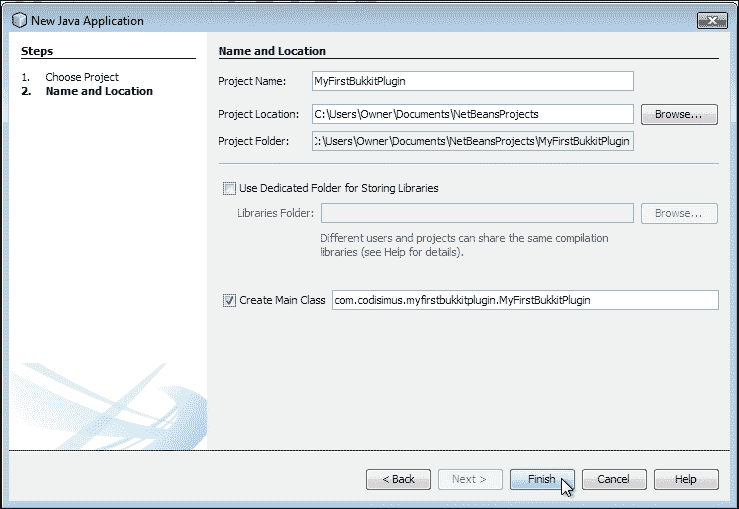
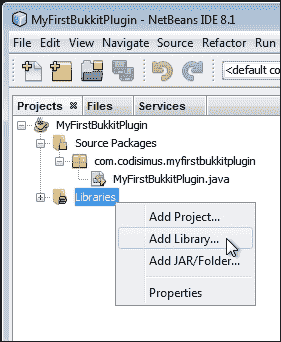
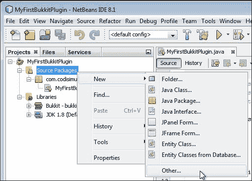
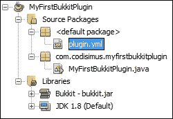
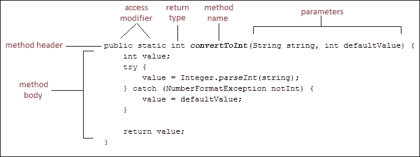
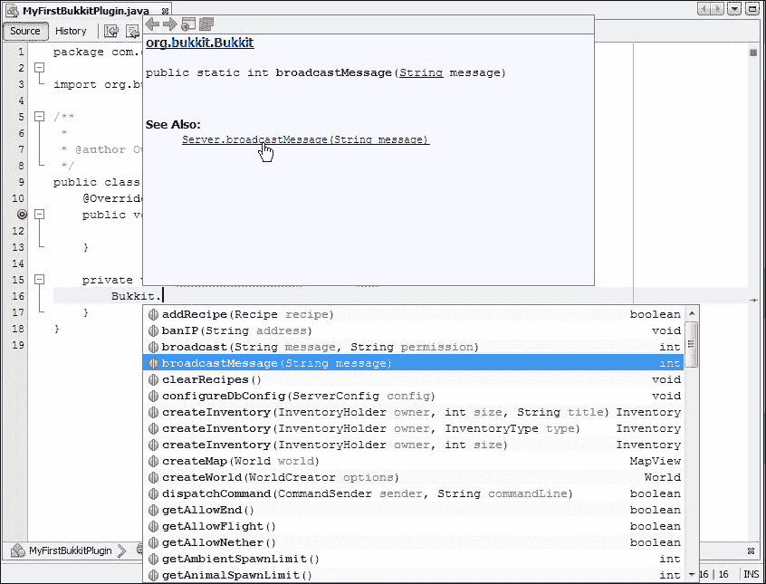

# 第三章：创建您的第一个 Bukkit 插件

我们将要编写的 Bukkit 插件将使用 Java 编程语言编写。我们将使用**IDE**（集成开发环境的缩写）来编写插件。IDE 是一种软件，它将帮助我们编写 Java 代码。它有许多工具和功能，使编程变得更容易。例如，它自动检测代码中的错误，它经常告诉我们如何修复这些错误，有时甚至为我们修复，它还提供了许多快捷方式，例如编译代码和构建 JAR 文件的按键，以便代码可以执行。在本章中，我们将下载和安装 IDE，并准备创建一个新的 Bukkit 插件。我们将涵盖以下主题，并在本章结束时，我们将编写我们的第一个插件，它将准备好在我们的服务器上进行测试：

+   安装 IDE

+   创建新项目

+   将 Bukkit 添加为库

+   `plugin.yml` 文件

+   插件的`main`类

+   创建和调用新方法

+   扩展代码

# 安装 IDE

在这本书中，我们将使用 NetBeans 作为我们的 IDE。还有其他流行的 IDE，例如 Eclipse 和 IntelliJ IDEA。如果您愿意，可以使用不同的 IDE。然而，在本章中，我们将假设您正在使用 NetBeans。无论您选择哪个 IDE，Java 代码都将相同。因此，只要您正确设置代码，您就可以在剩余的章节中使用任何 IDE。如果您对编程相当新手，那么我建议您现在使用 NetBeans，在您对编程更加熟悉之后，尝试其他 IDE，并选择您喜欢的 IDE。

NetBeans IDE 可以从[`www.oracle.com/technetwork/java/javase/downloads/`](http://www.oracle.com/technetwork/java/javase/downloads/)下载。从 Oracle 下载程序也将允许我们同时下载所需的**Java 开发工具包**（**JDK**）。您将看到几个下载链接。点击 NetBeans 链接访问**JDK 8 with NetBeans**下载页面。一旦您选择**接受许可协议**，您就可以下载软件。下载链接位于一个类似于以下截图所示的表格中：


如果您的 PC 运行的是 64 位 Windows 操作系统，那么您将想要使用对应于**Windows x64**的链接。如果您的 PC 运行的是 32 位 Windows 操作系统，或者您不确定是否是 64 位或 32 位 Windows 操作系统，那么请下载**Windows x86**版本。

### 小贴士

如果您想检查您是否正在运行 64 位版本的 Windows，您可以通过查看**控制面板**中的**系统**窗口来检查。

下载完成后，安装软件。在安装过程中，你可能会被问及是否想要安装**JUnit**。我们不会使用**JUnit**。因此，你应该选择**不安装 JUnit**。在安装程序的下一几个屏幕中，你将被询问希望安装两种类型软件的位置。默认设置是合适的。你可以简单地点击**下一步**。

# 创建新项目

安装完成后，打开 NetBeans 开始创建第一个项目。你可以通过以下步骤创建一个新项目：

1.  打开**文件**菜单并点击**新建项目...**。

1.  我们想要创建一个新的**Java 应用程序**。默认情况下已经选中了**Java Application**。因此，只需点击**下一步**。

1.  我们现在需要命名第一个项目。避免在名称中使用空格是一个好主意。让我们将这个项目命名为`MyFirstBukkitPlugin`。

1.  除非你想要将你的项目存储在另一个位置，否则你可以保留**项目位置**的默认值。

1.  确保已勾选**创建主类**。

`main`类是我们将放置所需代码以启用我们想要创建的插件的地方。对于这个字段，你必须确定你的项目包。这通常涉及到你的网站域名以相反的顺序。例如，Bukkit 使用`org.bukkit`，而我使用`com.codisimus`。假设你没有自己的域名，你可以使用你的电子邮件地址，例如`com.gmail.username`。你需要使用一些独特的东西。如果两个插件有相同的包，可能会导致类名冲突，Java 将无法知道你指的是哪个类。使用你拥有的电子邮件地址或域名是一个确保其他开发者不使用相同包的好方法。出于同样的原因，你应该将`bukkit`或`minecraft`排除在你的包名称之外。包名称也应该像前面的例子一样全部小写。

一旦有了包，你需要给你的主类命名。为了避免混淆，大多数 Bukkit 插件开发者使用项目名称作为主类名称。主类的名称应该以大写字母开头。

以下截图展示了点击**完成**之前你的表单应该呈现的样子：



# 将 Bukkit 作为库添加

现在我们已经创建了主类，我们需要将 Bukkit API 作为项目的库添加。你可能还记得，在上一章讨论过，API 包括我们可以访问以修改 Spigot 服务器的代码。你在第一章中构建 Spigot jar 时构建了 API JAR 文件，*部署 Spigot 服务器*。如果需要，请参考此章节以检索`Bukkit.jar`文件。你可能希望将其移动到更永久的位置。我建议你创建一个名为`Libraries`的文件夹并将 JAR 文件放在这个文件夹中。文件名可能附加了一个版本号。我们将重命名此文件，这与我们对`spigot.jar`所做的一样。这将帮助我们将来更容易地更新它。因此，`bukkit.jar`文件的新位置将类似于`C:\Users\Owner\Documents\NetBeansProjects\Libraries\bukkit.jar`。请记住你的文件位置，因为我们现在有了 Bukkit API，我们可以在 NetBeans 中为其创建一个库。

在 NetBeans 中，在**项目**选项卡内，你会看到一个**库**文件夹。当你右键单击它时，你会看到一个**添加库...**选项。点击它以显示当前库的列表，如下面的截图所示：



对于第一个项目，我们需要通过以下步骤创建 Bukkit 库。对于未来的项目，它将已经存在，我们只需选择它即可：

1.  点击**创建...**并输入**Bukkit**作为**库名称**。

1.  在下一个窗口中，有一个**添加 JAR/Folder...**按钮。点击它以定位并添加`bukkit.jar`文件。

1.  保持**源**选项卡为空，然后点击**Javadoc**选项卡。

1.  在此选项卡中添加[`hub.spigotmc.org/javadocs/spigot/`](https://hub.spigotmc.org/javadocs/spigot/)并点击**确定**。这允许我们直接在 IDE 中阅读 API 文档的一些部分。

现在，你将能够选择**Bukkit**作为库并将其添加到项目中。

### 注意

注意，为了更新到 Bukkit 的新版本，你只需用新版本替换当前的`bukkit.jar`文件，就像你更新服务器上的`spigot.jar`文件一样。不需要对你的现有项目进行任何额外的修改。然而，你必须编译这些项目中的代码以检查是否有任何新的错误出现。

# Bukkit 插件的基本要素

每个 Bukkit 插件都需要两个特定的文件。这些文件是`plugin.yml`和插件的主类。我们将从创建这些文件的最低版本开始。你未来的所有项目都将从创建这两个文件开始。

## plugin.yml 文件

我们已经准备好开始编写 Bukkit 插件了。我们将创建的第一个文件是`plugin.yml`。这是 Spigot 服务器读取以确定如何加载插件的文件。在**源包**上右键单击，然后点击**新建 | 其他...**，如下面的截图所示：



在出现的窗口中，在**类别**下选择**其他**。然后，在**文件类型**下选择**YAML 文件**，如下面的截图所示，然后点击**下一步**：


将**文件名**设置为`plugin`，让文件夹的名称为`src`，然后点击**完成**。现在，你的项目结构应该如下面的截图所示：



`plugin.yml`文件是在默认包中创建的。这就是它需要的位置，以便 Spigot 可以找到它。现在，我们将用最基本的设置填充`plugin.yml`文件。`plugin.yml`文件必须包含你插件的名称、版本和主类。我们已经确定了名称和主类，我们将给它一个`版本号 0.1`。

### 小贴士

如果你想要了解更多关于版本号的信息，维基百科上有一篇关于这个主题的优秀文章，链接为[`en.wikipedia.org/wiki/Software_versioning`](http://en.wikipedia.org/wiki/Software_versioning)。

`plugin.yml`的最简单形式如下：

```java
name: MyFirstBukkitPlugin
version: 0.1
main: com.codisimus.myfirstbukkitplugin.MyFirstBukkitPlugin
```

这就是在这个文件中你需要的所有内容，但你可以添加一些其他字段，比如`author`、`description`和`website`。我们已经完成了这个文件。你可以保存并关闭`plugin.yml`。

## 插件的主类

我们需要修改主类。如果`MyFirstBukkitPlugin.java`文件还没有打开，请打开它。在插件中我们不使用`main`方法。因此，我们将删除该代码段。现在，你将拥有一个空白的 Java 类，如下面的代码所示：

```java
package com.codisimus.myfirstbukkitplugin;

/**
 *
 * @author Owner
 */
public class MyFirstBukkitPlugin {

}
```

### 小贴士

你可能会看到一些额外的注释，但它们不会影响程序的执行。它们的存在是为了帮助任何可能阅读代码的人理解它。总是对所写的代码进行注释是一个好主意。如果有人最终阅读了你的代码，无论是其他开发者还是一周后的你自己，他们都会感谢你添加了注释。

我们需要做的第一件事是告诉 IDE 这个类是一个 Bukkit 插件。要做到这一点，我们将在类名后立即添加`extends JavaPlugin`来扩展`JavaPlugin`类。修改后的行将如下所示：

```java
public class MyFirstBukkitPlugin extends JavaPlugin {
```

你将看到一条波浪线和一个小灯泡出现。这经常会发生，通常意味着你需要从 Bukkit API 中导入一些内容。如果你要求 IDE 这样做，它会为你完成。点击小灯泡并从 Bukkit 库中导入`JavaPlugin`，如下面的截图所示：


这将自动在类顶部附近添加一行代码。目前，你可以在服务器上安装此插件，但它当然不会做任何事情。让我们编程插件，使其在启用后向服务器广播一条消息。当我们在测试时启用插件时，这条消息将显示出来。为此，我们将重写`onEnable`方法。此方法在插件启用时执行。模仿以下代码以添加方法：

```java
public class MyFirstBukkitPlugin extends JavaPlugin {
  public void onEnable() {

  }
}
```

你将看到另一个灯泡，它会要求你添加`@Override`注解。点击它以自动添加代码行。如果你没有被提示添加重写注解，那么你可能在该方法标题中拼写错误了。

我们现在有了你未来所有插件的基石。

# 创建和调用新方法

让我们创建一个新的方法，该方法将向服务器广播一条消息。以下图表标注了方法的各个部分，以防你不熟悉它们：



创建一个名为`broadcastToServer`的新方法。我们将将其放置在`MyFirstBukkitPlugin`类中的`onEnable`方法下。我们只想在`MyFirstBukkitPlugin`类内部调用此方法，因此访问修饰符将是`private`。如果你想从插件中的其他类调用此方法，你可以移除修饰符或将其更改为`public`。该方法将不返回任何内容，因此将具有`void`返回类型。最后，该方法将有一个名为`msg`的字符串参数。创建此第二个方法后，你的类将看起来像以下代码：

```java
public class MyFirstBukkitPlugin extends JavaPlugin {
  @Override
  public void onEnable() {

  }

  private void broadcastToServer(String msg) {

  }
}
```

### 提示

**下载示例代码**

你可以从你购买的所有 Packt Publishing 书籍的账户中下载示例代码文件。[`www.packtpub.com`](http://www.packtpub.com)。如果你在其他地方购买了这本书，你可以访问[`www.packtpub.com/support`](http://www.packtpub.com/support)并注册，以便将文件直接通过电子邮件发送给你。

我们将在新方法的主体中编写代码以完成其任务。我们想要向服务器广播一条消息。我们可以调用插件的`getServer`方法。然而，为了方便，`Bukkit`类在静态上下文中包含了许多服务器方法。当你翻阅上一章中的`Bukkit`类 API 时，你可能已经遇到了这些方法；如果你没有遇到，请在[`hub.spigotmc.org/javadocs/spigot/index.html?org/bukkit/Bukkit.html`](https://hub.spigotmc.org/javadocs/spigot/index.html?org/bukkit/Bukkit.html)中浏览`Bukkit`类的所有方法，直到找到`broadcastMessage(String message)`方法。我们将从自己的`broadcastToServer`方法中调用`broadcastMessage`方法。在 IDE 中，输入`Bukkit`，这是类的名称，以表示你将从静态上下文中访问`Bukkit`类。继续输入一个点(*)以调用该类的方法。你会看到将出现一个可用方法的列表，我们可以简单地滚动它们并选择我们想要的。这将在以下屏幕截图中显示：



点击选择`broadcastMessage`方法。该方法的 API 文档将会显示。注意，在方法右侧，它写着**int**。这告诉我们该方法返回一个`整数`类型的数据。当你点击**查看更多**链接，如前一张截图所示，文档会告诉我们返回的数字是消息发送到的玩家数量。我们并不关心这个数字。因此，我们不会将其分配给任何变量。

从列表中选择方法后，IDE 会填充它认为我们将使用的变量。在这种情况下，它应该使用`msg`作为参数。如果不是，只需在`broadcastMessage 方法`中输入`msg`作为参数即可。这完成了广播方法。现在，我们可以从`onEnable`方法中调用它。我们将传递`Hello World!`字符串作为参数。

添加这一行代码将导致包含以下代码的类：

```java
public class MyFirstBukkitPlugin extends JavaPlugin {
  @Override
  public void onEnable() {
    broadcastToServer("Hello World!");
  }

    /**
    * Sends a message to everyone on the server
    *
    * @param msg the message to send
    */
  private void broadcastToServer(String msg) {
    Bukkit.broadcastMessage(msg);
  }
}
```

如果我们测试这个插件，那么一旦启用，它将打印一次`Hello World!`。

# 扩展你的代码

在测试代码之前，让我们通过实现一个`if`语句来改进`onEnable`方法。如果只有一个玩家在线，为什么不向那个特定的玩家打招呼呢？我们可以通过调用`Bukkit.getOnlinePlayers`来获取所有在线玩家的集合。如果我们想检查集合的大小是否等于 1，我们可以通过使用`if`/`else`语句来完成。这在前面的代码中得到了演示：

```java
if (Bukkit.getOnlinePlayers().size() == 1) {//Only 1 player online
  //Say 'Hello' to the specific player
} else {
  //Say 'Hello' to the Minecraft World
  broadcastToServer("Hello World!");
}
```

在`if`语句中，我们现在将获取玩家集合中的第一个也是唯一的一个对象。一旦我们得到它，我们就可以通过广播`Hello`以及玩家的名字来继续操作。完成`if`语句后，整个类将看起来像以下代码：

```java
package com.codisimus.myfirstbukkitplugin;

 importorg.bukkit.Bukkit;
 importorg.bukkit.entity.Player;
 importorg.bukkit.plugin.java.JavaPlugin;

    /**
    * Broadcasts a hello message to the server
    */
public class MyFirstBukkitPlugin extends JavaPlugin {
  @Override
  public void onEnable() {
    if (Bukkit.getOnlinePlayers().size() == 1) {

      //Loop through the collection to access the single player
      for (Player player : Bukkit.getOnlinePlayers()) {
        //Say 'Hello' to the specific player
        broadcastToServer("Hello " + player.getName());
      }
    } else {
        //Say 'Hello' to the Minecraft World
        broadcastToServer("Hello World!");
      }
    }

    /**
    * Sends a message to everyone on the server
    *
    * @param msg the message to send
    */
    private void broadcastToServer(String msg) {
      Bukkit.broadcastMessage(msg);
    }
  }
```

### 小贴士

如果您不完全理解`if`语句或提供的代码，那么我建议您访问我的网站学习 Java 的基础知识，这是本书前言中提到的先决条件。

# 摘要

您的第一个插件已经完成，并准备好在您的服务器上进行测试。在下一章中，我们将安装您的新插件，学习如何测试它，并了解服务器何时执行`onEnable`方法。现在您已经熟悉了编写和调用方法，您现在可以创建基本的插件。从现在开始，您创建的每个插件都将以类似于这个插件启动的方式开始，也就是说，首先创建一个新的项目，将 Bukkit 作为库添加，然后填写`plugin.yml`文件，最后将您的主体类设置为具有`onEnable`方法的`JavaPlugin`类。
