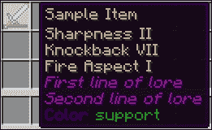

# 第八章. 使你的插件可配置

一个可配置的插件可以非常强大。一个插件将能够根据用户偏好以不同的方式运行。本质上，你的插件配置文件将类似于你的服务器的 `bukkit.yml` 文件。它将允许你更改插件设置而不修改 Java 代码。这意味着你不需要每次想要更改细节时都重新构建插件 JAR 文件。如果你的插件是公开的或被其他人使用，添加一个 `config` 文件可能会减少未来修改代码所需的时间。你的插件用户可以自己更改 `config` 文件中的设置，而无需开发者提供任何额外帮助。

为了完全理解我们为什么想要一个变量可配置，让我们看看我们之前讨论过的插件之一。在 `MobEnhancer` 中，我们将僵尸的生命值设置为 `40` 而不是 `20`。其他人可能希望使用你的插件，但他们希望将僵尸的生命值设置为 `60`。你可以创建两个版本的插件，这可能会变得非常混乱，或者你可以有一个可配置的版本。在你的服务器上的 `config` 文件中，僵尸的生命值将被设置为 `40`。但在另一个服务器上，生命值将被设置为 `60`。即使你的插件只在一个服务器上使用，配置也将允许快速轻松地更改生命值。

使你的插件可配置有五个步骤，如下所示：

1.  决定你的插件哪些方面将是可配置的

1.  创建一个包含每个设置及其默认值的 `config.yml` 文件

1.  添加代码以保存默认的 `config` 文件以及加载/重新加载文件

1.  读取配置的值并将它们存储在你的插件中的类变量中

1.  确保你的代码引用了配置设置加载到的类变量

步骤不需要按此顺序执行，但我们将按以下顺序在本章中讨论：

+   可配置数据类型

+   编写 `config.yml` 文件

+   保存、加载和重新加载你的插件配置

+   从配置中读取值

+   在你的插件中使用配置设置

+   在 YAML 格式中写入 `ItemStack` 值

+   理解 YAML 结构和层次结构

+   本地存储配置值

+   将一个类拆分为多个类并从另一个类访问变量和方法

# 可配置数据类型

你可以轻松地将插件中的大多数变量设置为可配置。以下表格包含了各种数据类型及其可配置的原因示例：

| 数据类型 | 它如何被使用 |
| --- | --- |
| `int` | 用于定义事件应发生的次数 |
| `double` | 用于设置怪物出生时的生命值 |
| `boolean` | 用于开启或关闭特定功能 |
| `String` | 用于更改发送给玩家的消息 |
| `ItemStack` | 使自定义物品出现 |

### 小贴士

将 `ItemStack` 值添加到配置文件中比较复杂，但这将在本章的末尾进行解释。

我们将使 `MobEnhancer` 可配置。我们希望玩家可以选择设置僵尸的生命值。这只是一个 `double` 类型的值。让我们扩展插件以支持额外的生物类型。我们首先创建 `config` 文件，然后调整程序以能够修改不同类型的怪物。因此，我们决定 `config` 文件将为每种怪物类型包含一个 `double` 数据类型的值。这个 `double` 值将是怪物的生命值。

# 编写 `config.yml` 文件

现在，是时候开始编写 `config.yml` 文件了。在 `MobEnhancer` 的默认包中创建一个新的 `YAML` 文件。为了使 Spigot 正确加载，此文件的名称必须是 `config.yml`。以下是一个 `MobEnhancer` 的配置文件示例。注意示例中由 `#` 字符表示的注释。请记住，始终包含注释，以便用户确切知道每个设置的用途：

```java
#MobEnhancer Config
#Set the health of each Mob below 
#1.0 is equal to half a heart so a Player has 20.0 health
#A value of -1.0 will disable modifying the mob's health
#Hostile
ZOMBIE: 20.0
SKELETON: 20.0

#Passive
COW: 10.0
PIG: 10.0
```

### 小贴士

在这个 `config` 文件中只包含了一些怪物，但所有怪物类型的名称都可以在 `EntityType` 类的 API 文档中找到，网址为 [`hub.spigotmc.org/javadocs/spigot/org/bukkit/entity/EntityType.html`](https://hub.spigotmc.org/javadocs/spigot/org/bukkit/entity/EntityType.html)。

这是一个简单的 `YAML` 文件，因为它不包含嵌套键。大多数配置都将像这样简单，但我们将在本章的后面讨论一些复杂的配置。

# 保存、加载和重新加载配置文件

现在我们有了 `config.yml` 文件，并且它位于插件的默认包中，我们需要能够将其保存到用户的服务器上。一旦文件保存，用户就可以随意编辑它。保存 `config` 文件就像在 `onEnable` 方法中添加以下方法调用一样简单，如下所示：

```java
saveDefaultConfig();
```

这将把 `config.yml` 复制到 `plugins/MobEnhancer/config.yml`。如果文件已经存在，则此行代码将不会执行任何操作。

Spigot 会自动加载 `config` 文件，因此除了在需要实际访问配置文件时使用 `getConfig` 之外，你不需要在插件中做任何额外的事情。

重新加载 `config.yml` 相对简单，我们将以命令的形式添加，如下所示：

```java
@Override
public boolean onCommand(CommandSender sender, Command command, String alias, String[] args) {
    reloadConfig();
    sender.sendMessage("MobEnhancer config has been reloaded");
    return true; //The command was executed successfully
}
```

我们现在将此方法放在 `main` 类中。确保该类也实现了 `CommandExecutor` 接口。不要忘记使用以下行注册命令：

```java
getCommand("mobenhancerreload").setExecutor(this);
```

命令也应该添加到 `plugin.yml` 中，就像往常一样。现在添加一个权限节点也是一个好主意。新的 `plugin.yml` 文件如下所示：

```java
name: MobEnhancer
main: com.codisimus.mobenhancer.MobEnhancer
version: 0.2
description: Modifies Mobs as they spawn
commands:
  mobenhancerreload:
    description: Reloads the config.yml file of the plugin
    aliases: [mereload, merl]
    usage: /<command>
    permission: mobenhancer.rl
    permission-message: You do not have permission to do that
permissions:
  mobenhancer.rl:
    default: op
```

现在，你的插件将有一个`reload`命令。这意味着当你编辑`config.yml`时，你可以重新加载插件而不是重启整个服务器。

# 读取和存储配置的值

一旦加载了配置文件，你必须能够访问该文件并读取已设置的值。扩展主类的`JavaPlugin`类有一个`getConfig`方法，它返回`FileConfiguration`。这个`FileConfiguration`类就是我们用来获取我们正在寻找的值的。你会看到`FileConfiguration`类有`getInt`、`getDouble`、`getString`和`getBoolean`等方法；所有这些方法都接受一个字符串作为参数。`string`参数是值的路径。为了完全理解路径，我们需要查看一个包含嵌套键的 YAML 配置。一个例子是我们刚刚工作的`plugin.yml`文件。如果我们想从配置中获取`MobEnhancer`字符串，那么路径将是`name`。如果我们想检索`mobenhancerreload`命令的描述，那么路径将是`commands.mobenhancerreload.description`。因此，检索此值的 Java 代码将是`getString("commands.mobenhancerreload.description");`。`MobEnhancer`的`config.yml`文件相当简单。为了获取一个双精度值，我们可以使用`getDouble()`方法，路径为生物的名字。例如，要获取为`ZOMBIE`实体设置的值，我们将使用以下代码：

```java
double health = this.getConfig().getDouble("ZOMBIE");
```

这将从以下三个来源之一返回一个`double`值：

+   从`plugins/MobEnhance/config.yml`加载的`FileConfiguration`

+   默认的`FileConfiguration`，这是位于`MobEnhancer` JAR 文件默认包中的`config.yml`文件

+   数据类型的默认值（对于`double/integer`数据类型为`0`，对于布尔值为`false`，对于字符串/`ItemStack`为`null`）

将返回第一个未失败的结果。一个结果会因路径无效或值无效而失败。在前面的声明中，如果`ZOMBIE`路径不在`config.yml`中，则会出现无效路径。无效值意味着给定路径的值不是`double`数据类型。

现在我们已经了解了如何读取配置的数据，让我们修改插件以使用这些自定义值。

# 在你的插件中使用配置设置

`MobEnhancer`插件的当前`EventHandler`方法将僵尸的生命值设置为`40`，其中数字 40 是**硬编码**的。这意味着`40`的值是代码本身的一部分，并且在代码编译后无法更改。我们希望将此值**软编码**，也就是说，我们希望从外部源获取该值，在我们的例子中是`config.yml`：

目前，`onMobSpawn`方法如下：

```java
@EventHandler
public void onMobSpawn(CreatureSpawnEvent event) {
    if (event.getEntityType() == EntityType.ZOMBIE) {
        int health = 40;
        event.getEntity().setMaxHealth(health);
        event.getEntity().setHealth(health);
    }
}
```

我们将从这个现有代码开始工作。不再需要`if`语句，因为我们不想将插件限制为仅适用于僵尸。如前所述，我们还想将硬编码的`40 值`替换为`double`值，该值将从`config`文件中读取。因此，`40`应替换为`getConfig().getDouble(type)`。您还必须将变量类型从`int`更改为`double`。此语句中的`Type`将是`Entity`类型的字符串。以下是一些示例，如`ZOMBIE`、`SKELETON`或`config.yml`中列出的任何其他实体类型。我们已经知道，我们可以使用`event.getEntityType()`获取由事件生成的实体的类型。然而，这给我们的是`enum`形式的`EntityType`，而我们需要的却是字符串形式。Bukkit API 文档的`EntityType`页面告诉我们，我们可以调用`getName`方法来返回我们想要的字符串。新的`onMobSpawn`方法如下：

```java
@EventHandler
public void onMobSpawn(CreatureSpawnEvent event) {
    //Find the type of the Entity that spawned
    String type = event.getEntityType().name();

    //Retrieve the custom health amount for the EntityType
    //This will be 0 if the EntityType is not included in the config
    double health = getConfig().getDouble(type);
    event.getEntity().setMaxHealth(health);
    event.getEntity().setHealth(health);
}
```

这个`EventHandler 方法`几乎完成了。我们允许其他人设置`health`值。我们想确保他们输入的是有效数字。我们不希望插件因为误用而崩溃。我们知道我们接收的是一个`double`值，因为即使用户设置了一个非数字值，我们也会得到默认值`0`。然而，并非每个有效的双精度值都适用于我们的情况。例如，我们不能将实体的健康值设置为负数。我们也不希望将健康值设置为`0`，因为这会立即杀死实体。因此，我们只应在新的健康值设置为正数时修改健康值。这可以通过一个简单的`if`语句来完成，如下所示：

```java
if (health > 0)
```

`MobEnhancer`插件现在可配置并支持任何类型的生物。它不再仅限于僵尸。完成的代码将类似于以下内容：

```java
package com.codisimus.mobenhancer;

import org.bukkit.command.Command;
import org.bukkit.command.CommandExecutor;
import org.bukkit.command.CommandSender;
import org.bukkit.event.EventHandler;
import org.bukkit.event.Listener;
import org.bukkit.event.entity.CreatureSpawnEvent;
import org.bukkit.plugin.java.JavaPlugin;

public class MobEnhancer extends JavaPlugin implements Listener, CommandExecutor {
    @Override
    public void onEnable() {
        //Save the default config file if it does not already exist
        saveDefaultConfig();

        //Register all of the EventHandlers within this class
        getServer().getPluginManager().registerEvents(this, this);

        //Register this class as the Executor of the /merl command
        getCommand("mobenhancerreload").setExecutor(this);
    }

    @EventHandler
    public void onMobSpawn(CreatureSpawnEvent event) {
        //Find the type of the Entity that spawned
        String type = event.getEntityType().name();

        //Retrieve the custom health amount for the EntityType
        //This will be 0 if the EntityType is not in the config
        double health = getConfig().getDouble(type);

        //Mobs cannot have negative health
        if (health > 0) {
            event.getEntity().setMaxHealth(health);
            event.getEntity().setHealth(health);
        }
    }

    @Override
    public boolean onCommand(CommandSender sender, Command command,String alias, String[] args) {
        reloadConfig();
        sender.sendMessage("MobEnhancer config has been reloaded");
        return true; //The command was executed successfully
    }
}
```

# 配置中的物品堆叠

接下来，我们将通过允许给僵尸和骷髅提供盔甲和武器的选项来进一步扩展`MobEnhancer`插件。为了做到这一点，我们首先必须学习如何在配置文件中将`ItemStack`对象作为选项添加。`ItemStack`方法比简单的整数或双精度值更复杂。它是一个具有许多嵌套值的对象。它也可能包括一个**元数据**值，该值将具有更多嵌套值。**元数据**包含关于物品的附加信息，例如自定义显示名称或构成物品附文的文本行。以下是一个`YAML`文件中的`ItemStack`方法示例：

```java
SampleItem:
  ==: org.bukkit.inventory.ItemStack
  type: DIAMOND_SWORD
  damage: 1500
  amount: 1
  meta:
    ==: ItemMeta
    meta-type: UNSPECIFIC
    display-name: §6Sample Item
    lore:
    - First line of lore
    - Second line of lore
    - §1Color §2support
    enchants:
      DAMAGE_ALL: 2
      KNOCKBACK: 7
      FIRE_ASPECT: 1
```

一旦加载，结果中的项目将在以下屏幕截图显示：



只需要**类型**字段。你可以省略任何其他部分。**类型**指的是材料的类型。这些材料可以在 API 文档的`org.bukkit.Material`下找到，可以通过访问[`hub.spigotmc.org/javadocs/spigot/org/bukkit/Material.html`](https://hub.spigotmc.org/javadocs/spigot/org/bukkit/Material.html)来查看。**损坏程度**用于表示物品受到了多少损坏。对于像羊毛这样的物品，这将设置羊毛的颜色。**数量**将设置堆叠大小。例如，我可能有一把剑或二十根木头。**元数据**包括额外的信息，如旗帜的颜色和图案，或书籍的作者和页数。给定路径`getConfig().getItemStack("SampleItem");`将检索该物品。

# YAML 配置层次结构

在使用 YAML 中的`ItemStack`时，请注意层次结构。这与`plugin.yml`文件中命令和权限的嵌套值类似。我们可以在`config`文件中使用层次结构，使其更容易使用和理解。

我们希望给两种类型的怪物分配物品，即`Zombie`和`Skeleton`。每种类型将有一个独特的盔甲和武器。这意味着我们需要 10 个不同的`ItemStack`类。我们可以将它们命名为`ZombieHolding`、`SkeletonHolding`、`ZombieHelmet`、`SkeletonHelmet`等等。然而，层次结构将更加高效。我们将有一个`Zombie`键和一个`Skeleton`键。在每个僵尸和骷髅内部，我们将为每个物品有一个键。以下是一个`config`文件中怪物盔甲段落的层次结构示例：

```java
Zombie:
  holding:
    ==: org.bukkit.inventory.ItemStack
    type: STONE_SWORD
  helmet:
    ==: org.bukkit.inventory.ItemStack
    type: CHAINMAIL_HELMET

Skeleton:
  holding:
    ==: org.bukkit.inventory.ItemStack
    type: BOW
  helmet:
    ==: org.bukkit.inventory.ItemStack
    type: LEATHER_HELMET
```

### 小贴士

其余的盔甲部件可以以相同的方式添加。

如果我们想获取骷髅靴子的`ItemStack`方法，我们将使用`getConfig().getItemStack("Skeleton.boots");`。记住，层次结构是通过点来表示的。以下是一个将要附加到`config.yml`的段落，其中包含怪物盔甲，如前所述。我们还有一个`GiveArmorToMobs`布尔值，它将被包含以方便地禁用怪物盔甲功能：

```java
### MOB ARMOR ###
GiveArmorToMobs: true

Zombie:
  holding:
    ==: org.bukkit.inventory.ItemStack
    type: STONE_SWORD
  helmet:
    ==: org.bukkit.inventory.ItemStack
    type: CHAINMAIL_HELMET

Skeleton:
  holding:
    ==: org.bukkit.inventory.ItemStack
    type: BOW
    meta:
      ==: ItemMeta
      meta-type: UNSPECIFIC
      enchants:
        ARROW_FIRE: 1
  helmet:
    ==: org.bukkit.inventory.ItemStack
    type: LEATHER_HELMET
    color:
      ==: Color
      RED: 102
      BLUE: 51
      GREEN: 127
```

# 将配置值存储为变量

从你的插件`config`文件中检索值比访问本地变量所需的时间和资源更多。因此，如果你将非常频繁地访问特定的值，最好将其存储为变量。我们希望用`GiveArmorToMobs`布尔值做这件事。将`ItemStack`盔甲本地存储也是一个好主意，以防止每次使用时都创建一个新的盔甲。让我们在主类的方法上方添加以下变量：

```java
private boolean giveArmorToMobs;
private ItemStack zombieHolding;
private ItemStack skeletonHolding;
```

我们将只编写代码来设置僵尸或骷髅所持有的物品。其余的盔甲你可以自己添加，因为它们将以相同的方式进行。

我们希望这些值在`config`文件重新加载时自动存储。请注意，当`config`文件最初加载时，它实际上正在被重新加载。为了确保我们的数据在每次`config`文件重新加载时都得到保存，我们将在插件的`reloadConfig`方法中添加额外的代码。这是我们调用以执行`/merl`命令的方法。`reloadConfig`方法已经包含在每一个 Java 插件中，但我们将通过重写它来修改它。这就像我们重写`onEnable`方法一样。重写一个方法将阻止现有代码的执行。对于`onEnable`来说这不是问题，因为该方法没有先前的现有代码。然而，`reloadConfig`有我们仍然希望执行的代码。因此，我们将使用以下代码行来执行我们正在重写的现有代码：

```java
super.reloadConfig();
```

这行代码非常重要。一旦我们有了它，我们就可以在它之前或之后添加自己的代码。在我们的例子中，我们希望在`config`文件重新加载后存储这些值。因此，额外的代码应该放在前面代码的后面。修改后的`reloadConfig`方法看起来是这样的：

```java
/**
 * Reloads the config from the config.yml file
 * Loads values from the newly loaded config
 * This method is automatically called when the plugin is enabled
 */
@Override
public void reloadConfig() {
    //Reload the config as this method would normally do
    super.reloadConfig();

    //Load values from the config now that it has been reloaded
    giveArmorToMobs = getConfig().getBoolean("GiveArmorToMobs");
    zombieHolding = getConfig().getItemStack("Zombie.holding");
    skeletonHolding = getConfig().getItemStack("Skeleton.holding");
}
```

我们必须编写的最后一行代码是为特定的怪物提供护甲。我们将把这个添加到`onMobSpawn`方法的末尾。我们只想在`giveArmorToMobs`设置为`true`时这样做。因此，代码块将被放置在一个`if`语句中，如下所示：

```java
if (giveArmorToMobs) {

}
```

我们可以使用以下代码检索实体的护甲：

```java
EntityEquipment equipment = event.getEntity().getEquipment();
```

这即使它们目前可能没有任何东西，也能给我们它们的装备槽位。要了解更多关于这个对象以及你可以用它做什么的信息，请访问其 API 文档[`hub.spigotmc.org/javadocs/spigot/org/bukkit/inventory/EntityEquipment.html`](https://hub.spigotmc.org/javadocs/spigot/org/bukkit/inventory/EntityEquipment.html)。现在我们有了`EntityEquipment`，设置护甲件就简单了。

我们有两种不同的护甲集合。因此，我们首先需要检查实体是否是僵尸或骷髅。我们可以通过使用一个`if/else`语句来完成这个操作：

```java
if (event.getEntityType() == EntityType.ZOMBIE) {
    //TODO - Give Zombie armor
} else if (event.getEntityType() == EntityType.SKELETON) {
    //TODO – Give Skeleton armor
}
```

然而，使用`switch/case`块将更有效率。在这种情况下使用`switch/case`将看起来像这样：

```java
switch (event.getEntityType()) {
case ZOMBIE:
    //TODO - Give Zombie armor
    break;
case SKELETON: 
    //TODO - Give Skeleton armor
    break;
default: //Any other EntityType
    //Do nothing
    break;
}
```

`If/else`语句用于检查多个条件（*实体是僵尸吗？* 或 *实体是骨架吗？*）。`switch/case`语句通过询问单个问题（*以下哪个是实体的类型？*）来节省时间。然后，将执行正确的`case`条件内的代码。当满足`break`条件时，`switch`语句将退出。如果你不在`case`结束时使用`break`，那么你将进入下一个`case`并开始执行那段代码。在某些情况下，这是好事，但我们不希望在这里发生这种情况。默认情况，即如果没有其他情况匹配，不需要包含它，因为没有代码在其中。然而，它确实使语句更加明确，并且 Oracle 发布的 Java 编码标准指出，默认情况应该始终包含。

在这些情况中的每一个，我们都希望装备正确的盔甲套装。

在应用以下代码之前，我们应该检查每一件盔甲以确保它不是`null`。这将防止插件由于无效配置而崩溃：

```java
if (zombieHolding != null) {
    equipment.setItemInHand(zombieHolding.clone());
}
```

### 小贴士

我们在这里使用了`ItemStack`上的`clone`方法。我们不想给每个怪物分发单个`ItemStack`类。相反，我们将创建它的副本，以便每个怪物都可以有自己的副本。

装备剩余的盔甲和将盔甲装备到骨架上非常相似。整体代码块将看起来像这样：

```java
if (giveArmorToMobs) {
    //Retrieve the equipment object of the Entity
    EntityEquipment equipment = event.getEntity().getEquipment();

    switch (event.getEntityType()) {
    case ZOMBIE: 
        //Set each piece of equipment if they are not null
        if (zombieHolding != null) {
            equipment.setItemInHand(zombieHolding.clone());
        }
        //TODO – Add rest of armor
        break;

    case SKELETON: 
        //Set each piece of equipment if they are not null 
        if (skeletonHolding != null) {
            equipment.setItemInHand(skeletonHolding.clone());
        }
        //TODO – Add rest of armor
        break;

    default: //Any other EntityType
        //Do nothing
        break;
    }
}
```

应该在每个`ItemStack`类上调用`clone`方法，以确保原始物品不受损坏。

通过这种方式，`MobEnhancer`插件现在支持给怪物装备盔甲。在你的服务器上试用一下，看看它是如何工作的。我们只讨论了给僵尸和骨架装备盔甲，因为大多数怪物，包括爬行者、蜘蛛和牛，都不能穿盔甲。如果你想，尝试给其他怪物添加盔甲和物品，看看会发生什么。还可以尝试给怪物提供独特的物品。例如，骨架可以给一把剑，僵尸可以给一把弓。还有一个外观不同的头骨物品；你可以让怪物戴上它作为面具。

你甚至可以创建代表特定玩家（如 Notch）的头骨，如下面的截图所示：


`NotchSkull`物品的元数据如下：

```java
NotchSkull:
  ==: org.bukkit.inventory.ItemStack
  type: SKULL_ITEM
  damage: 3
  meta:
    ==: ItemMeta
    meta-type: SKULL
    skull-owner: Notch
```

在你的新插件上玩玩，看看你可以给僵尸和其他怪物提供什么疯狂物品。以下截图展示了通过修改配置可以实现的一个例子：


# 从另一个类访问变量

`MobEnhancer` 类正在不断增长。没有必要将所有代码都放在一个类中。这个类目前正扩展 `JavaPlugin` 类，同时实现 `Listener` 和 `CommandExecutor` 接口。如果我们将这些功能拆分为三个独特的类，程序将更容易理解。这个过程被称为 **重构**。在整个软件开发过程中，你可能会遇到可能过时或低效的代码，需要更新。以这种方式更改代码被称为 **重构**。如果你未来需要重构代码，不要气馁；这在软件开发中是常见现象，并且有许多原因会导致这种情况发生。

+   你学会了如何编写更高效的代码

+   API 变更或新功能需要/允许代码更改

+   现有的代码难以阅读或调试

+   一个方法/类变得太大，难以管理

+   代码的目的已经改变，现在它应该执行它最初并未打算执行的任务

我们将重构 `MobEnhancer`，将代码拆分为三个更易于管理的类。

创建两个新的类，分别命名为 `MobSpawnListener` 和 `MobEnhancerReloadCommand`。`MobEnhancer` 仍然是你的主类。因此，它仍然会扩展 `JavaPlugin` 类。然而，这两个新类将分别实现 `Listener` 和 `CommandExecutor` 接口。将适当的方法移动到它们的新类中，也就是说，`onMobSpawn` 是一个事件处理器，因此它属于 `Listener` 类，而 `onCommand` 属于 `CommandExecutor` 类。在移动方法时，你会看到引入了几个错误。这是因为你的方法不再能够访问必要的方法和变量。让我们首先解决 `MobEnhancerReloadCommand` 类，因为它只有一个错误。这个错误发生在以下行：

```java
reloadConfig();
```

`reloadConfig` 方法位于 `JavaPlugin` 类中，它不再与 `CommandExecutor` 类合并。我们需要从这个独立的类中访问 `JavaPlugin` 对象。最简单的方法是使用静态变量。如果一个变量或方法是静态的，那么它不会在不同类的实例之间改变。这允许我们从静态上下文中引用变量。你之前在使用 `Bukkit` 类时已经这样做过了。你调用的方法是静态的。因此，你可以使用 `Bukkit` 类而不是一个独特的 `Bukkit` 对象来访问它们。

为了更好地解释这一点，让我们想象你有一个插件，它为 Minecraft 玩家提供银行账户。因此，你将有一个类来表示玩家的银行账户。这个类可以称为 `PlayerAccount`。你将有许多 `PlayerAccount` 对象，每个服务器上的玩家一个。在这个类中，你可能有一个变量定义了账户可以持有的金额上限。让我们称这个变量为 `accountLimit`。如果我们想每个账户的最大金额为 `1000`，那么 `accountLimit` 应该是静态的。如果我们想将限制提高到 `2000`，那么我们可以通过 `PlayerAccount.accountLimit = 2000;` 将 `accountLimit` 设置为 `2000`。然后，所有玩家现在都有 `2000` 的账户限制。如果我们想让一些玩家的限制为 `1000`，而其他玩家的限制为 `2000`，那么我们不应该使用静态变量。如果没有将 `accountLimit` 设置为静态，那么如果我们为 `PlayerAccount` 的实例 A 设置 `accountLimit` 为 `2000`，实例 B 的 `accountLimit` 仍然是 `1000`。

在主类中将插件存储为静态变量将对我们有益。在你的当前变量上方，添加一个名为 `plugin` 的 `static` `JavaPlugin` 变量，如下所示：

```java
public class MobEnhancer extends JavaPlugin {
    //Static plugin reference to allow access from other classes.
    static JavaPlugin plugin;
```

我们还必须在 `onEnable` 方法中实例化这个变量。这可以通过 `plugin = this;` 简单完成。现在，我们可以通过使用 `MobEnhancer.plugin` 来访问插件实例。因此，我们之前有 `reloadConfig();`，现在我们将有 `MobEnhancer.plugin.reloadConfig()`。这将修复 `MobEnhancerReloadCommand` 中的错误：

```java
package com.codisimus.mobenhancer;

import org.bukkit.command.Command;
import org.bukkit.command.CommandExecutor;
import org.bukkit.command.CommandSender;

public class MobEnhancerReloadCommand implements CommandExecutor {
    @Override
    public boolean onCommand(CommandSender sender, Command command, String alias, String[] args) {
        MobEnhancer.plugin.reloadConfig();
        sender.sendMessage("MobEnhancer config has been reloaded");
        return true; //The command executed successfully
    }
}
```

`MobSpawnListener` 需要进行类似的修改，因为需要插件对象来调用 `getConfig` 方法。

你将继续在 `MobSpawnListener` 中看到错误。它正在尝试访问仍然在主类中的变量。让我们将怪物护甲变量移动到 `Listener` 类中，如下所示：

```java
public class MobSpawnListener implements Listener {
    private boolean giveArmorToMobs;
    private ItemStack zombieHolding;
    private ItemStack skeletonHolding;
```

我们还必须修改 `MobEnhancer.java` 中的 `reload` 方法，以匹配变量的新位置。例如，我们不应该使用 `giveArmorToMobs`，而应该使用 `MobSpawnListener.giveArmorToMobs`：

```java
public void reloadConfig() {
    //Reload the config as this method would normally do
    super.reloadConfig();

    //Load values from the config now that it has been reloaded
    MobSpawnListener.giveArmorToMobs = getConfig().getBoolean("GiveArmorToMobs");
    MobSpawnListener.zombieHolding = getConfig().getItemStack("Zombie.   holding");
    MobSpawnListener.skeletonHolding = getConfig(). getItemStack("Skeleton.holding");
}
```

即使有了这个更改，我们仍然会收到一个错误，错误信息为 `giveArmorToMobs` 在 `MobSpawnListener` 中**具有私有访问权限**。每个变量都是 `private` 的，这意味着它们不能从另一个类中访问。我们希望能够从其他类中访问它们。因此，我们将移除私有修饰符。这样做之后，我们还会收到另一个错误。这个新的错误信息为 **非静态变量** `giveArmorToMobs` **不能从静态上下文中引用**。这是因为变量没有被定义为静态变量。在你简单地将这些变量改为静态变量之前，请确保这样做是有意义的。参考之前关于何时应该使用静态变量的讨论。在这种情况下，我们只想为每个变量设置一个值。因此，我们确实希望将它们设置为静态，如下面的代码所示：

```java
public class MobSpawnListener implements Listener {
    static boolean giveArmorToMobs;
    static ItemStack zombieHolding;
    static ItemStack skeletonHolding;
```

剩下的代码中只有两行需要我们注意。这两行用于注册事件监听器和命令执行器。在调用`registerEvents`方法时，需要两个参数。第一个参数是`Listener`，第二个参数是`Plugin`。`this`关键字引用插件。因此，作为第二个参数是合适的。然而，对于第一个参数，你必须传递`Listener`类的实例。我们在第七章中这样做过，即创建`NoRain`插件时，*Bukkit 事件系统*。同样适用于命令执行器。我们必须传递`MobEnhancerReloadCommand`类的实例：

```java
//Register all of the EventHandlers
getServer().getPluginManager().registerEvents(new MobSpawnListener(), this);

//Register the Executor of the /mobenhancerreload command
getCommand("mobenhancerreload").setExecutor(new MobEnhancerReloadCommand());
```

这消除了由于将项目拆分为多个类而产生的所有错误。

# 摘要

你现在已经熟悉了如何使用`YAML`配置文件。你可以从`config.yml`文件中加载自定义值并在插件中使用它们。这样做将大大扩展你创建对多个服务器管理员有益的独特项目的能力。尝试将可配置选项添加到你的某些先前项目中。例如，如果你创建了一个当爬行者即将爆炸时发送消息的插件，添加一个配置文件来设置玩家必须位于其中的区域，以便看到消息。现在你已经了解了可以与 Bukkit API 一起使用的`FileConfiguration`，在下一章中，我们将使用相同的`FileConfiguration`方法保存插件的数据，以便我们可以在插件下次启用时加载它。
