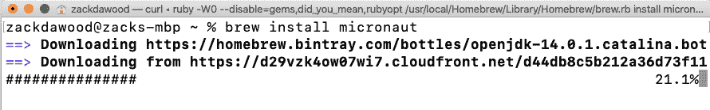

# 第一章：使用 Micronaut 框架开始微服务之旅

近年来，关于**微服务**及其如何使**微服务架构**在开发快速、敏捷和面向企业的网络服务中发挥变革性作用的话题引起了广泛关注。微服务架构推动了这些网络服务开发标准的规范化。在本章中，我们将探讨网络服务向微服务的演变。我们将快速深入了解一些有用的微服务设计模式。我们将关注大多数传统 Java 开发框架中的关键陷阱，以及它们对微服务架构的表面级采用如何提高了性能和优化问题。然后，我们将探讨 Micronaut 框架如何通过彻底的、从头开始的方法解决微服务中的性能和优化问题。最后，为了开始使用 Micronaut 框架，我们将设置 Micronaut CLI 并完成一个小型的 hello world 项目。

本章中，我们将特别关注以下主题：

+   介绍微服务及其演变

+   理解微服务设计模式

+   为什么 Micronaut 是开发微服务的最佳选择

+   开始使用 Micronaut 框架

+   在 Micronaut 框架中完成 hello world 项目

在本章结束时，您将了解网络服务如何演变为微服务，以及为什么与 Micronaut 框架相比，传统的 Java 框架在开发微服务方面效率低下。此外，我们还将通过在 Micronaut 框架中完成一个小项目来获得使用 Micronaut 框架的实际知识。

# 技术要求

本章中所有命令和技术说明均在 Windows 10 和 mac OS X 上运行。本章涵盖的代码示例可在本书的 GitHub 存储库中找到，网址为[`github.com/PacktPublishing/Building-Microservices-with-Micronaut/tree/master/Chapter01`](https://github.com/PacktPublishing/Building-Microservices-with-Micronaut/tree/master/Chapter01)。

在开发环境中需要安装和设置以下工具：

+   **Java SDK**：版本 13 或更高（我们使用了 Java 14）。

+   **Maven**：这是可选的，仅当您想使用 Maven 作为构建系统时才需要。然而，我们建议在任何开发机器上设置 Maven。有关下载和安装 Maven 的说明，请参阅[`maven.apache.org/download.cgi`](https://maven.apache.org/download.cgi)。

+   **开发 IDE**：根据您的偏好，可以使用任何基于 Java 的 IDE，但为了编写本章，使用了 IntelliJ。

+   **Git**：有关下载和安装 Git 的说明，请参阅[`git-scm.com/downloads`](https://git-scm.com/downloads)。

# 介绍微服务及其演变

在我们深入介绍和定义微服务之前，了解微服务的演变过程将非常有帮助。在 20 世纪 60 年代末，艾伦·凯提出了**面向对象编程**这一术语。虽然这是一个明确的概念，但后来它孕育了使用面向对象编程构建软件解决方案的四个支柱：

+   封装

+   继承

+   多态

+   抽象

用简短的助记符，它被称为 EIPA。自从这四个支柱诞生以来，软件行业见证了众多编程语言、框架、设计模式等的兴衰。随着每一次这样的适应和理念，思想家和发明家们试图通过保持模块化设计和松散耦合但紧密封装的应用程序组件，来更接近 EIPA。在过去的几十年里，软件团队通过系统地采用这些关键支柱，从面向对象编程的艺术转向面向对象编程的科学。这一迭代之旅是微服务的演变。

在 20 世纪 80 年代末和 90 年代初，几乎每个企业应用程序都以命令行或本地桌面软件的形式暴露出来。应用程序与数据库紧密相连，几乎就像最终用户直接与数据库交互，而应用程序作为一个薄薄的门面介于两者之间。这是单体应用程序或客户端/服务器架构的时代。

在接下来的图中，我们可以看到用户如何与单体应用程序交互：


图 1.1 – 单体客户端/服务器架构

如*图 1.1*所示，在单体客户端/服务器架构中，应用程序与数据库紧密耦合，用户通过终端门面或桌面应用程序进行交互。在这个架构中，维护良好的**服务级别协议**（**SLA**）非常痛苦。几乎所有关键的非功能性因素，如可伸缩性、高可用性、容错性和灵活性，都表现不佳或失败。

为了解决这些问题，**面向服务的架构**（**SOA**）应运而生。在 21 世纪初，SOA 在行业中得到了正式化，定义了一些标准协议，如**简单对象访问协议（SOAP**）。**Web 服务描述语言**（**WSDL**）也在此期间被创建。Web 2.0 应用程序因**异步 JavaScript 和 XML（AJAX**）而流行。企业服务总线和信息传递系统在企业应用程序中得到广泛使用。SOA 的进步催化了向最终用户提供软件解决方案的新范式：**软件即服务**（**SaaS**）。软件解决方案不再通过桌面应用程序和终端客户端提供，而是作为托管在线服务通过 HTTP 提供给最终用户。在接下来的图中，我们可以看到用户如何与基于 SOA 的应用程序交互：


图 1.2 – SOA

如上图所示，SOA 通过在 Web 应用程序、Web 服务器和应用程序服务器之间分离关注点引入了一些解耦。应用程序服务器或**企业服务总线（ESB**）通常与数据库交互，用户通过在 Web 浏览器上访问应用程序与它交互（SaaS 解决方案）。尽管 SOA 带来了一些缓解，但 SaaS 的采用留下了可扩展性和灵活性作为关键未解之谜。

2010 年之后，技术世界开始比前二十年移动得更快。随着容器、云、大数据和机器学习的引入，架构设计开始迅速发展。这是优步、爱彼迎、Netflix 和免费/付费应用的时代。应用程序是为分布式计算和可扩展性而设计的。在微服务架构中，应用程序被分解为松散耦合的微服务，每个微服务拥有自己的数据库。在下面的图中，我们可以看到用户如何与基于微服务的应用程序交互：


图 1.3 – 微服务架构

在前面的图中，我们可以看到一个完全实现的微服务应用程序，其中每个微服务都与自己的数据库交互。用户通过现代浏览器与单页应用程序交互。来自网络服务器的任何传入请求都会被路由到相应的微服务。微服务架构的完全实现是为了解决可扩展性、容错性、高可用性和灵活性等关键因素。

简单来说，微服务或微服务架构将应用程序分解为一系列相互交互的服务。每个服务都可以独立地进行开发、测试、部署和维护。因此，每个较小的（微）服务都有自己的独特生命周期。此外，由于每个服务都是松散耦合的（使用 HTTP/HTTPS 与其他服务交互），我们可以做以下事情：

+   扩大或缩小（根据服务流量）。

+   解决任何运行时故障（启动服务备份）。

+   进行新的更改（更改影响仅限于服务）。

因此，通过在微服务中完全实现解耦架构，我们解决了可扩展性、容错性、高可用性和灵活性等关键问题。

到目前为止，我们已经了解了微服务及其演变，以及它们是如何在解决当今世界独特、快速和敏捷需求方面产生变革性的影响的。这种理解是实现微服务潜力的良好前言。在下一节中，我们将深入探讨微服务设计模式。

# 理解微服务设计模式

为了充分实现任何架构（包括微服务架构）的好处，通常需要一个架构方法来支持设计模式。理解这些设计模式对于理想地采用架构至关重要。在接下来的章节中，我们将介绍一些实用且常用的微服务设计模式。每个模式都针对应用程序开发生命周期的不同方面，我们的重点是查看这些设计模式的实际使用角度。我们将从分解设计模式开始。

## 分解设计模式

分解设计模式规定了我们可以如何将大型/单体应用程序组件化或分解成更小的（微）服务。这些模式在为任何遗留单体应用程序设计转型架构时非常有用。以下是在分解中常用的设计模式。

### 按业务能力分解

任何业务能力都是一种盈利工具。如果我们能将应用程序列出来并分类成一系列业务能力，如库存管理、客户订单或运营，那么应用程序就可以分解成基于这些业务能力的微服务。这个过程对于中小型应用程序来说是有效且推荐的。

### 按领域/子领域分解

如果应用程序是一个企业级和重量级的应用程序，那么先前的做法可能会导致应用程序分解成更小的单体。这些单体虽然更小，但仍然是单体。在这种情况下，业务建模可以帮助将应用程序功能分类并映射到领域和子领域。领域/子领域内的功能相似，但与其他领域/子领域的功能非常不同。然后，可以围绕领域或子领域（如果有许多功能映射到领域）设计和构建微服务。

## 集成设计模式

一旦应用程序被分解成更小的（微）服务，我们就需要在这些服务之间建立内聚。集成设计模式解决了这样的协作需求。以下是在集成中常用的设计模式。

### API 网关模式

通常上游前端消费者需要通过一个外观访问微服务。这个外观被称为 API 网关。API 网关设计模式为前端客户端保持简单提供了一个重要的目的：

+   前端客户端不会向微服务发送过多的请求。

+   前端客户端不会处理/聚合过多的响应（来自微服务）。

+   在服务器端，网关将请求路由到多个微服务，这些微服务可以并行运行。

+   在发送最终响应之前，我们可以聚合来自不同微服务的单个响应。

### 聚合器模式

这种模式与上述 API 网关模式非常相似。然而，复合微服务是关键区别。复合微服务的使命是将传入的请求卸载到多个微服务，然后协作创建统一的响应。当用户请求从业务逻辑的角度来看是原子的，但它由多个微服务处理时，使用此模式。

### 链式微服务模式

在某些场景中，一个传入的请求会通过一系列步骤执行，每个步骤都可能产生对微服务的调用。例如，在在线市场中订购商品可能需要以下步骤：

1.  搜索商品（库存管理服务）

1.  将商品添加到购物车（购物车服务）

1.  检查添加的商品（支付服务、邮件服务、库存管理服务）

所有这些服务调用将是同步的。满足用户请求将是所有这些链式微服务调用的组合。

## 数据管理模式

将持久层集成是任何基于微服务应用程序的重要方面。绿色田野（全新）和棕色田野（遗留转型）应用程序可能规定了它们在如何选择数据管理模式方面的要求。以下是在微服务中数据管理最常用的设计模式。

### 每个服务一个数据库

在绿色田野（全新）应用程序中，每个服务拥有一个数据库是最理想的。每个服务是独立数据库（关系型或非关系型）的所有者，任何数据操作都必须通过微服务执行。此外，即使任何其他微服务需要执行数据库操作，也应该通过所有者微服务路由。

### 共享数据库

在棕色田野（转型）应用程序中，将数据库分解为每个服务一个数据库可能不切实际。在这种情况下，可以通过共享一个公共单体数据库来启动微服务架构的实现。

### 命令查询责任分离（CQRS）

在绿色田野或完全转型的应用程序中，每个微服务都是独立的数据库所有者，可能需要从多个数据库查询数据。CQRS 模式规定将应用程序分解为命令和查询：

+   **命令**：这部分将管理任何创建、更新和删除请求。

+   **查询**：这部分将使用数据库视图来管理查询请求，其中数据库视图可以统一来自多个模式或数据源的数据。

## 跨切面模式

一些关注点跨越了微服务的所有不同方面/层。在以下子节中，我们将讨论一些这些关注点和模式。

### 服务发现模式

在基于微服务的应用程序中，每个微服务在运行时可能拥有多个实例。此外，这些服务实例可以根据流量在运行时添加或删除。这种运行时的灵活性可能会成为上游消费者如何与服务连接的问题。

服务发现模式通过实现服务注册数据库来解决此问题。服务注册是一个元数据存储库，包含诸如服务名称、服务运行位置以及服务当前状态等信息。任何对服务运行时信息的更改都将更新到服务注册中，例如，当服务添加新实例或服务出现故障时。这简化了上游消费者连接到应用程序中不同微服务的痛苦。

### 断路器模式

在基于微服务的应用程序中，通常服务通过调用端点相互交互。可能会出现一种情况，即一个服务正在调用下游服务，但下游服务出现故障。如果没有断路器，上游服务将在下游服务处于故障状态时持续调用它，这将持续影响用户与应用程序的交互。

在断路器模式中，下游服务调用将通过代理进行路由。如果下游服务出现故障，该代理将在固定的时间间隔后超时。在超时到期后，代理将再次尝试连接。如果连接成功，它将与下游服务连接；否则，它将更新超时周期。因此，断路器不会对下游服务进行不必要的调用，也不会影响用户与应用程序的交互。

### 日志聚合模式

在微服务领域中，通常一个入站请求会被多个服务处理。每个服务都可能创建并记录其条目。为了追踪任何问题，访问这些零散的日志可能会显得反直觉。通过实现日志聚合模式，日志可以在一个中心位置进行索引，从而使得访问所有应用程序日志变得容易。可以使用**Elasticsearch、Logstash、Kibana**（**ELK**）来实现日志聚合。

在本节中，我们介绍了应用生命周期不同阶段中常用的一些设计模式。理解这些设计模式是充分利用微服务架构优势的必要条件。在下一节中，我们将深入探讨用于开发微服务的 Micronaut 框架。

# 为什么 Micronaut 是开发微服务的最佳选择

在前面的章节中，我们学习了微服务架构在架构方面的成熟度。不幸的是，在实施方面，向构建/开发微服务的全面转变并不像微服务架构那样成熟。为了解决这些实施挑战，许多传统的 Java 框架已经添加了小的、迭代的变更，但人们迫切需要的颠覆性和全面性的变更却缺失。从根本上讲，这些传统的 Java 框架自单体服务时代以来几乎保持不变。反射、运行时代理和庞大的配置管理一直困扰着所有传统框架，导致它们启动时间较慢和内存占用更大，这使得它们不适合微服务开发。

Micronaut 是从底层开发的，考虑到这些重要的挑战，以有机地支持微服务开发：

+   `@Inject`用于依赖注入。它将*Java 注入*模块添加到编译器中，并且所有注解都在编译时进行处理。编译器根据源代码中使用的注解生成所有类的字节码。所有这些都是在编译时完成的。在运行时，Micronaut 可以实例化 bean 并从生成的字节码中读取它们的元数据，而不需要使用缓慢的反射 API。

+   **编译时编译**：正如之前讨论的那样，一个关键的区别是 Micronaut 在编译时执行依赖注入、配置管理和面向方面的编程代理。Micronaut 依赖于一个或多个注解处理器来将注解元数据处理成由**ASM**生成的（**汇编**）字节码。此外，这种提前生成的字节码还通过 Java 的**即时**（**JIT**）编译器进一步优化。其他框架使用反射，并在应用程序启动时生成注解元数据。这些元数据被加载到运行时内存中，因此增加了内存占用。Micronaut 不是使用 Java 反射 API，而是使用 Java 注解处理器 API、Kotlin 编译器插件和 Groovy AST 转换来进行元编程。

+   **更快的启动时间和更低的内存消耗**：其他框架使用 Java 反射，并在应用程序启动时扫描所有类路径以生成每个字段、方法和构造函数的反射元数据。然后，这些元数据被用来确定并注入所需的对象到应用程序运行时。这显著增加了启动时间和运行时内存。正如之前讨论的那样，Micronaut 使用编译时编译和 Java 注解处理器 API 来将这项工作从运行时卸载，并通过不将不必要的反射元数据推送到运行时内存来降低内存需求。

+   **无服务器应用程序支持**：无服务器应用程序中的一个关键问题是启动时间。由于内存占用大且启动时间慢，传统框架不是开发无服务器应用程序的明智选择。Micronaut 通过保持最小的运行时内存占用和亚秒级启动时间，自然支持无服务器应用程序的开发。此外，Micronaut 原生支持常用的云平台用于无服务器函数开发。

+   **语言无关的框架**：Micronaut 框架支持 Java、Kotlin 和 Groovy 编程语言。由于对主要编程语言的广泛支持，开发者在考虑云需求时可以选择他们偏好的语言选项。例如，对于物联网需求，Groovy 可能是一个不错的选择。这种语言无关的启用使其灵活且适用于移动/网络/云解决方案的多种需求。

+   **对 GraalVM 的支持**：由于 Micronaut 不使用反射，任何基于 Micronaut 的应用都可以编译成 GraalVM 原生镜像。GraalVM 是 Oracle 提供的一个通用虚拟机，可以运行 Java 应用程序到机器码。这显著提高了应用程序的性能。任何编译成 GraalVM 原生镜像的 Micronaut 应用程序都可以在毫秒内启动。

基于前面的关键点，Micronaut 作为一个首选框架，在开发云原生、超轻量级和快速微服务方面脱颖而出。此外，我们进行了一个快速基准实验，比较了 Micronaut 与另一个流行的传统框架的应用程序启动时间。在下面的图表中，显示了 Micronaut 和传统框架的启动时间：

![图 1.4 – 传统框架与 Micronaut 的启动时间![图 1.4 – 传统框架与 Micronaut 的启动时间图 1.4 – 传统框架与 Micronaut 的启动时间如前图所示，传统框架启动需要 6,156 毫秒，而 Micronaut 只需 3,750 毫秒。这种启动时间的差异是显著的，使 Micronaut 成为开发云原生和快速微服务的首选框架。在接下来的部分，我们将开始使用 Micronaut 框架在 Windows 和 mac OS 上。# 开始使用 Micronaut 框架为了开始使用 Micronaut 框架，我们将从在 Mac 和 Windows OS 上安装 Micronaut CLI 开始。## 在 mac OS 上安装 Micronaut CLI 在 mac OS 上，我们可以通过几种方式安装 Micronaut CLI – 使用 SDKMAN!、Homebrew 或 MacPorts。在接下来的章节中，我们将逐步介绍安装 Micronaut CLI 的步骤。### 使用 SDKMAN!安装 Micronaut 请按照以下步骤使用 SDKMAN!安装 Micronaut CLI：1.  打开终端。1.  如果您尚未安装 SDKMAN!，请执行以下步骤：    a. 输入或粘贴以下命令：    ```java    curl -s https://get.sdkman.io | bash    ```    b. 接下来，输入或粘贴以下命令：    ```java    source "$HOME/.sdkman/bin/sdkman-init.sh"    ```1.  要安装 Micronaut CLI，请输入或粘贴以下命令：    ```java    source sdk install micronaut    ```    在安装 Micronaut CLI 时，你将在终端观察到以下交互：    

    Figure 1.5 – 使用 SDKMAN! 在 macOS 上安装 Micronaut CLI

1.  如果所有前面的步骤都执行成功，你可以通过在终端中运行以下命令来验证 Micronaut CLI 的安装：

    ```java
    mn -version
    ```

### 使用 Homebrew 安装 Micronaut

请按照以下步骤使用 MacPorts 安装 Micronaut CLI：

1.  打开终端。

1.  如果你还没有安装 Homebrew，请执行以下步骤：

    a. 输入或粘贴以下命令：

    ```java
    /bin/bash -c "$(curl -fsSL https://raw.githubusercontent.com/Homebrew/install/master/install.sh)"
    ```

    b. 接下来，输入或粘贴以下命令：

    ```java
    brew update 
    ```

1.  输入或粘贴以下命令：

    ```java
     brew install micronaut
    ```

    在安装 Micronaut CLI 时，你将在终端观察到以下交互：

    

    Figure 1.6 – 使用 HomeBrew 在 macOS 上安装 Micronaut CLI

1.  如果所有前面的步骤都执行成功，你可以通过在终端中执行以下命令来验证 Micronaut CLI 的安装：

    ```java
    mn -version
    ```

### 使用 MacPorts 安装 Micronaut

请按照以下步骤使用 Homebrew 安装 Micronaut CLI：

1.  如果你还没有安装 MacPorts，请按照 [`www.macports.org/install.php`](https://www.macports.org/install.php) 中的说明进行操作。

1.  打开终端。

1.  输入或粘贴以下命令：

    ```java
    sudo port sync
    ```

1.  输入或粘贴以下命令：

    ```java
    sudo port install micronaut
    ```

    在安装 Micronaut CLI 时，你将在终端观察到以下交互：

    

    Figure 1.7 – 使用 MacPorts 在 macOS 上安装 Micronaut CLI

1.  如果所有前面的步骤都执行成功，你可以通过在终端中执行以下命令来验证 Micronaut CLI 的安装：

    ```java
    mn -version
    ```

## 在 Windows 上安装 Micronaut CLI

请按照以下步骤在 Windows 上安装 Micronaut CLI：

1.  从 Micronaut 下载页面下载 Micronaut CLI 二进制文件：[`micronaut.io/download.html`](https://micronaut.io/download.html)。

1.  将下载的二进制文件解压到系统上的一个文件夹中。最好将其保存在根目录下的单独文件夹中，例如 `C:\Program Files\Micronaut`。

1.  创建一个名为 `MICRONAUT_HOME` 的新系统变量，并使用前面的目录路径。请注意，要将此变量添加到系统变量（而不是用户变量）中。

1.  然后，更新你的 Windows `PATH` 环境变量。你可以添加一个路径，例如 `%MICRONAUT_HOME%\bin`。

1.  打开命令提示符或任何终端，并输入以下命令：

    ```java
    mn
    ```

    这将启动 CLI 并解决任何依赖项。

1.  要测试 CLI 是否正确安装，请输入以下命令：

    ```java
    mn – h
    ```

    这是命令输出的内容：

    

    图 1.8 – 在 Windows OS 上安装 Micronaut CLI

1.  在执行前面的命令后，您应该会看到所有 **CLI** 选项。

在本节中，我们探讨了在 Windows 和 macOS 上安装 Micronaut CLI 的不同方法。为了亲身体验 Micronaut 框架，我们将在下一节中开始在一个 hello world 项目上工作。

# 在 Micronaut 框架中工作于 hello world 项目

为了理解使用 Micronaut 框架开发微服务的实际方面，我们将通过一个 hello world 项目进行操作。这将帮助您快速开始使用 Micronaut 框架，并让您亲身体验微服务开发是多么简单。

Micronaut 与 Maven 和 Gradle 打包管理器无缝协作。我们将使用 Micronaut CLI 以及 Micronaut Launch（网页界面）各举一个例子来生成基础项目。

## 使用 Micronaut CLI 创建 hello world 项目

请按照以下步骤使用 Micronaut CLI 创建 hello world 应用程序：

1.  打开终端（或命令提示符）。

1.  将目录更改为您想要创建 hello world 项目的目标目录。

1.  输入以下命令：

    ```java
    mn create-app hello-world-maven --build maven
    ```

1.  等待 Micronaut CLI 完成，它将创建一个 `hello-world-maven` 项目。`create-app` 命令将为您创建一个带有 Maven 构建和系统安装的 Java 版本的样板项目。它将创建 `Application.java` 以及一个名为 `ApplicationTest.java` 的示例测试类。

1.  要探索您刚刚创建的 `hello-world-maven` 项目，请使用您首选的 IDE 打开此项目。

1.  要运行您的项目，请在 Bash 终端中运行以下命令：

    ```java
    mvnw by typing the following command:

    ```

    mvn -N io.takari:maven:wrapper

    ```java

    ```

1.  Maven 包装器默认会在 `http://localhost:8080` 上构建和运行您的项目。

### 添加 HelloWorldController

要创建一个简单的端点，让我们向 `hello-world-maven` 项目添加一个简单的控制器：

1.  将一个网络包添加到我们的 `hello-world-maven` 项目中。

1.  添加一个 `HelloWorldController` Java 类。它将包含一个简单的 `hello` 端点：

    ```java
    @Controller("/hello")
    public class HelloController {
        @Get("/")
        @Produces(MediaType.TEXT_PLAIN)
        public String helloMicronaut() {
            return "Hello, Micronaut!";
        }
    }
    ```

    `HelloController` 可在 `…/hello` 路径上访问。`helloMicronaut()` 将生成一个纯文本 `"Hello, Micronaut!"` 消息。

1.  重新运行您的应用程序，并在浏览器窗口中点击 [`localhost:8080/hello/`](http://localhost:8080/hello/)。服务器将返回以下响应：


图 1.9 – 你好，Micronaut！

默认情况下，应用程序将在端口 `8080` 上可用，并且可以在应用程序属性中更改此端口。

到目前为止，我们已经使用 Micronaut CLI 创建了一个 hello world 项目。接下来，我们将探索 Micronaut Launch，这是一个网页界面，用于生成样板项目。

## 使用 Micronaut Launch 创建 hello world 项目

**Micronaut Launch** ([`micronaut.io/launch/`](https://micronaut.io/launch/)) 是一个直观的 Web 界面，随着 Micronaut 2.0.1 的发布而出现。我们可以使用此界面快速为不同类型的 Micronaut 应用程序（如服务器应用程序、CLI、无服务器函数、消息应用程序等）生成模板。让我们快速使用它为我们生成一个 hello world 应用程序。

请按照以下说明使用 Micronaut Launch Web 界面生成 hello world 项目：

1.  在浏览器窗口中打开 Micronaut Launch：[`micronaut.io/launch/`](https://micronaut.io/launch/)。

1.  在 **应用程序类型** 下，选择 **应用程序**。

1.  在 **Micronaut 版本** 下，选择 **2.0.1**。

1.  对于 Java 版本，选择 **Java 14**。

1.  对于 **语言**，选择 **Java**。

1.  给一个基本包名，例如 `com.packtpub.micronaut`。

1.  选择 **Gradle** 作为构建选项。

1.  给应用程序命名，例如 `hello-world-gradle`。

1.  选择 **JUnit** 作为测试框架

1.  在完成所有选项的选择后，点击 **生成项目**。

在选择前面的选项并输入各种输入后，Micronaut Launch 界面应如下所示：


图 1.10 – 使用 Micronaut Launch 生成模板项目

您的项目模板源代码将被生成到一个压缩文件中。您可以将此压缩文件解压到您想要的目录中，并在您首选的 IDE 中打开它。就像之前的例子 (`hello-world-maven`) 一样，我们可以添加一个基本的 `HelloWorldController` 实例。

要运行您的项目，请在 Bash 终端中运行以下命令：

```java
gradlew.bat run
```

当项目运行时，请访问 `http://localhost:8080/hello`，你应该在浏览器标签页中看到 **Hello, Micronaut!** 消息。

在本节中，我们探讨了如何通过使用 Micronaut CLI 以及 Micronaut Launch 用户界面开发小型的 hello world 项目来开始使用 Micronaut 框架。这个小练习将为我们下一章将要介绍的内容做一个良好的铺垫。

# 摘要

在本章中，我们通过探索其演变和一些有用的设计模式，开始了我们的微服务之旅。我们对比了 Micronaut 框架与传统基于反射的 Java 框架。本质上，Micronaut 利用编译时编译（而不是反射）的方法，使其成为开发微服务的理想框架。为了亲身体验，我们介绍了在 mac OS 和 Windows OS 上设置 Micronaut CLI 的方法。最后，我们在 `hello-world-maven` 和 `hello-world-gradle` 项目上进行了工作。在这两个项目中，我们添加了 `hello` 端点。

在涵盖了微服务的基本原理以及实际的“Hello World”项目之后，本章增强了你对微服务演变、设计模式以及为什么应该选择 Micronaut 来开发微服务的了解。这种基础理解是开始在 Micronaut 框架中开发微服务冒险的基石。

在本章末尾，我们启动了一段使用 Micronaut CLI 和 Micronaut Launch 开发微服务的激动人心的旅程。在下一章中，我们将探讨如何在 Micronaut 框架中集成不同类型的持久存储和数据库。

# 问题

1.  网络服务是如何演变成微服务的？

1.  什么是微服务？

1.  什么是微服务架构？

1.  微服务设计模式有哪些？

1.  什么是 Micronaut？

1.  为什么应该优先选择 Micronaut 来开发微服务？

1.  开发微服务应该使用哪个框架？

1.  你如何在 macOS 上安装 Micronaut CLI？

1.  你如何在 Windows OS 上安装 Micronaut CLI？

1.  你如何使用 Micronaut CLI 创建一个项目？

1.  你如何使用 Micronaut Launch 创建一个项目？
