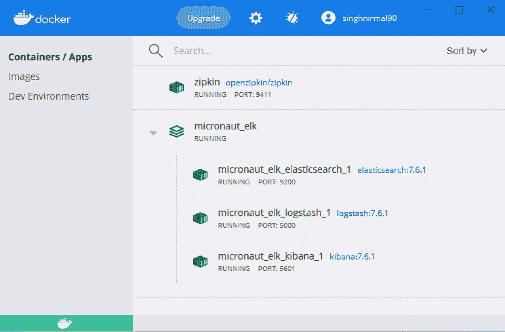
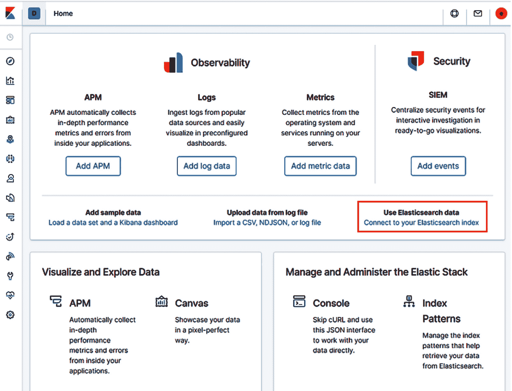
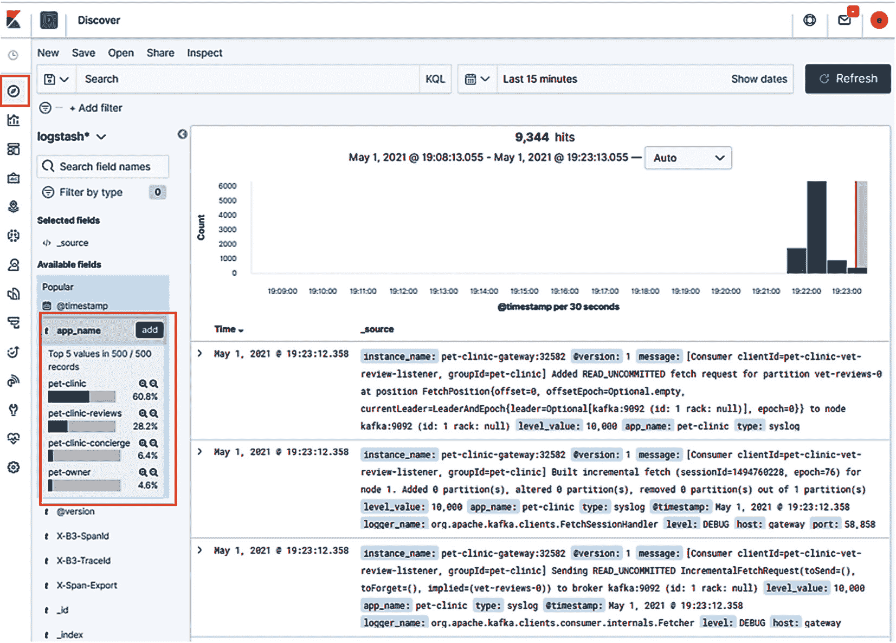
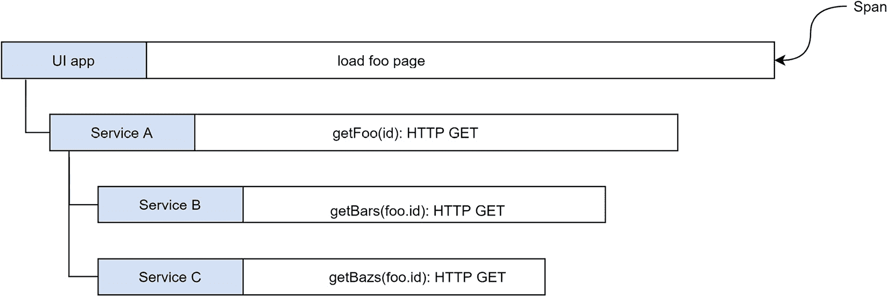
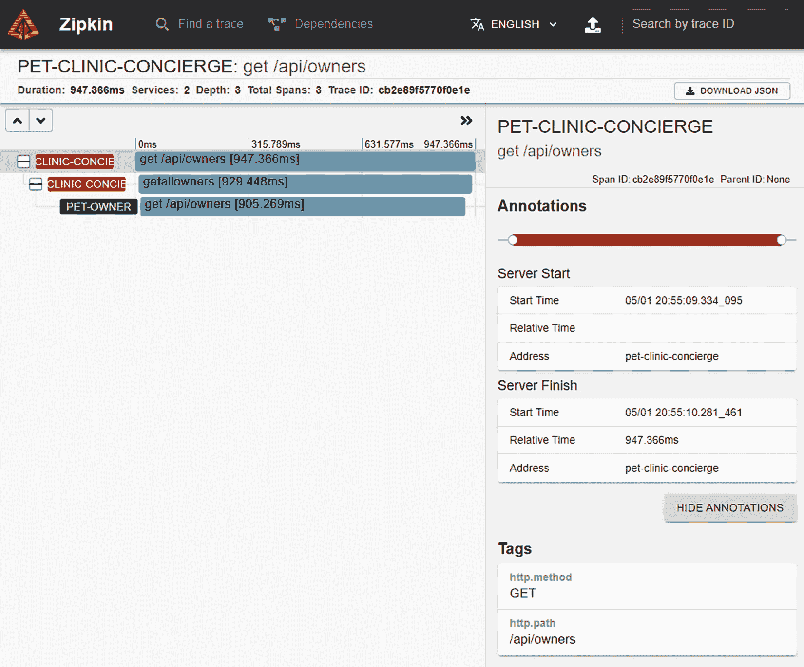
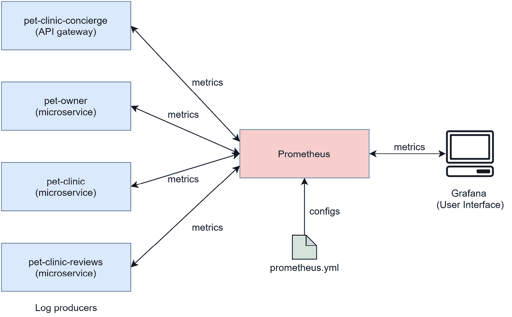
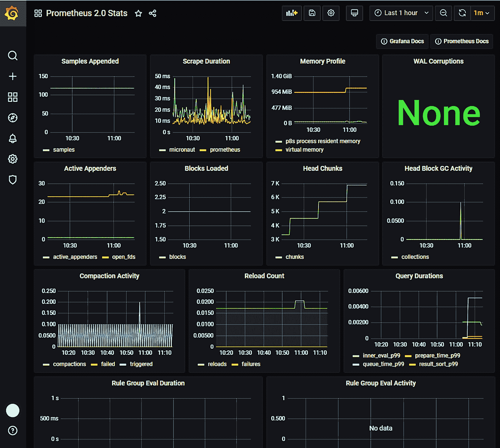

# 第九章: 分布式日志记录、跟踪和监控

微服务应用程序通常在多个主机上运行多个微服务。对于上游消费者，API 网关提供了一个一站式商店接口，用于访问所有应用程序端点。对 API 网关的任何请求都会分散到一个或多个微服务。这种分布式扩散的请求处理增加了维护基于微服务的应用程序的挑战。如果发生任何异常或错误，很难确定哪个微服务或分布式组件有故障。此外，任何有效的微服务实现都必须积极处理维护挑战。

在本章中，我们将探讨以下主题：

+   **分布式日志记录**: 我们如何实现分布式微服务的日志聚合，以便可以在一个地方访问和索引应用程序日志？

+   **分布式跟踪**: 我们如何跟踪可能分散到多个主机环境上运行的多个微服务的用户请求的执行？

+   **分布式监控**: 我们如何持续监控所有服务组件的关键性能指标，以获得系统健康状况的整体视图？

通过收集这三种不同类型的数据——日志记录、跟踪和监控——我们增强了系统的可观察性。在任何时间点访问这些遥测数据，我们可以直观且精确地获得请求在系统中执行的整体上下文。要了解更多关于可观察性的信息，我们将通过实际的 `pet-clinic` 应用程序探索分布式日志记录、跟踪和监控的微服务模式。

到本章结束时，你将具备在 Micronaut 框架中实现这些可观察性模式的良好知识。

# 技术要求

本章中的所有命令和技术说明都是在 Windows 10 和 macOS 上运行的。本章涵盖的代码示例可在本书的 GitHub 仓库中找到，网址为 [`github.com/PacktPublishing/Building-Microservices-with-Micronaut/tree/master/Chapter09`](https://github.com/PacktPublishing/Building-Microservices-with-Micronaut/tree/master/Chapter09)。

以下工具需要在开发环境中安装和设置：

+   **Java SDK**: 版本 13 或以上（我们使用了 Java 14）。

+   **Maven**: 这不是必需的，只有当您想使用 Maven 作为构建系统时才需要。然而，我们建议在任何开发机器上设置 Maven。有关下载和安装 Maven 的说明，请参阅 [`maven.apache.org/download.cgi`](https://maven.apache.org/download.cgi)。

+   **开发 IDE**: 根据您的偏好，可以使用任何基于 Java 的 IDE，但为了编写本章，我们使用了 IntelliJ。

+   **Git**: 有关下载和安装 Git 的说明，请参阅 [`git-scm.com/downloads`](https://git-scm.com/downloads)。

+   **PostgreSQL**：有关下载和安装 PostgreSQL 的说明，请参阅 [`www.postgresql.org/download/`](https://www.postgresql.org/download/)。

+   **MongoDB**：MongoDB Atlas 提供了一个免费的在线数据库即服务，存储空间高达 512 MB。然而，如果更喜欢本地数据库，则有关下载和安装的说明，请参阅 [`docs.mongodb.com/manual/administration/install-community/`](https://docs.mongodb.com/manual/administration/install-community/)。我们为本章使用了本地安装。

+   **REST 客户端**：可以使用任何 HTTP REST 客户端。我们使用了 Advanced REST Client Chrome 插件。

+   **Docker**：有关下载和安装 Docker 的说明，请参阅 https://docs.docker.com/get-docker/。

# 分布式日志记录在 Micronaut 微服务中

正如我们在章节引言中讨论的，在基于微服务的应用程序中，用户请求在运行在不同主机环境上的多个微服务上执行。因此，日志消息会分散在多个主机机器上。这对维护应用程序的开发者或管理员来说是一个独特的挑战。如果出现故障，那么确定问题将变得很困难，因为你必须登录到多个主机机器/环境，grep 日志，并将它们组合起来以便理解。

在本节中，我们将深入了解微服务中分布式日志记录的日志聚合。

如其名所示，日志聚合是将各种微服务和应用程序组件产生的日志组合在一起。日志聚合通常涉及以下组件：

+   **日志生产者**：这是在执行控制流时产生日志的任何微服务或分布式组件。

+   **日志分发器**：日志分发器负责收集日志生产者产生的日志并将它们分发到集中存储。

+   **日志存储**：日志存储持久化和索引所有应用程序组件和微服务产生的日志。

+   **日志可视化器**：日志可视化器提供了一个用户界面，用于访问、搜索和过滤存储在日志存储中的日志。

在 `pet-clinic` 应用程序上下文中，我们将实现 **ELK** Stack（即 **Elasticsearch**、**Logstash**、**Kibana**）以实现分布式日志记录。请参考以下图示：

 检出 `docker-elk`。

1.  打开任何 Bash 终端（我们使用了 Git Bash）。

1.  将目录切换到您已检出 `docker-elk` 的位置。

1.  运行 `docker compose up –d` 命令。

1.  等待 Docker 下载镜像并实例化 ELK 容器。

上述指令将在 Docker 中启动一个 ELK 应用程序。您可以通过转到 Docker 仪表板 | **容器 / 应用** 来验证安装，如图所示：



Figure 9.2 – 在 Docker 仪表板中验证 ELK

在这里，您可以验证 ELK 实例化。默认情况下，Elasticsearch 在端口 `9200` 上运行，Logstash 在 `5000`，Kibana 在端口 `5601`。

在下一节中，我们将修改我们的 `pet-clinic` 微服务，以便将日志发送到 Logstash 实例。

## 将 Logstash 与 Micronaut 微服务集成

要将 Logstash 集成到 `pet-clinic` 微服务中，我们将利用 Logback。我们将向 Logback 引入一个新的追加器，可以将日志发送到之前创建的 Logstash 实例。

在本地检出的 `docker-elk` 目录中，您可以验证 Logstash 已配置以下设置：

```java
input {
    tcp {
        port => 5000
        type => syslog
        codec => json_lines
    }
}
filter {
    grok {
        match => [ "message", "%{GREEDYDATA}" ]
    }
    mutate {
        add_field => { "instance_name" => "%{app_name}-
         %{host}:%{app_port}" }
    }
}
output {
    stdout { # This will log all messages so that we can 
     confirm that Logstash is receiving them
        codec => rubydebug
    }
    elasticsearch {
        hosts => [
         "${XPACK_MONITORING_ELASTICSEARCH_HOSTS}" ]
        user => 
         "${XPACK_MONITORING_ELASTICSEARCH_USERNAME}"
        password => 
          "${XPACK_MONITORING_ELASTICSEARCH_PASSWORD}"
        index => "logstash-%{+YYYY.MM.dd}"
    }
}
```

在 `logstash.config` 中，我们有以下三个部分：

+   `input`：Logstash 有能力聚合超过 50 种不同的日志源。`input` 配置 Logstash 以配置一个或多个输入源。在我们的配置中，我们正在启用端口 `5000` 上的 `tcp` 输入。

+   `filter`：Logstash 的 `filter` 提供了一种简单的方法将传入的日志转换为过滤器定义的日志事件。然后，这些事件被推送到日志存储。在上述配置中，我们使用 `grok` 过滤器与 `mutate` 一起添加额外的信息（`app_name` 和 `app_port`）到日志事件中。

+   `output`：`output` 部分配置接收源，以便 Logstash 可以将日志事件推送到配置的输出源。在上述配置中，我们正在配置标准输出和 Elasticsearch 以接收生成的日志事件。

到目前为止，我们已经启动了一个带有 Logstash 配置为接收、转换并将日志事件发送到 Elasticsearch 的 ELK Docker 实例。接下来，我们将对 `pet-clinic` 微服务进行必要的修改，以便日志可以发送到 Logstash。

### 配置微服务以进行分布式日志记录

为了使 `pet-clinic` 微服务能够聚合并将日志发送到 Logstash，我们需要将以下 `logstash-logback-encoder` 依赖项添加到所有微服务的 `pom.xml` 文件中：

```java
<dependency>
  <groupId>net.logstash.logback</groupId>
  <artifactId>logstash-logback-encoder</artifactId>
  <version>6.3</version>
</dependency>
```

通过导入 `logstash-logback-encoder`，我们可以在 `logback.xml` 中利用 `net.logstash.logback.appender.LogstashTcpSocketAppender` 类。此类提供了 `logstash` 追加器，可以将微服务的日志发送到 Logstash 服务器。

通过以下方式修改所有微服务的`logback.xml`，添加 Logstash appender：

```java
<appender name="logstash" class="net.logstash.logback.appender.LogstashTcpSocketAppender">
    <param name="Encoding" value="UTF-8"/>
    <remoteHost>host.docker.internal</remoteHost>
    <port>5000</port>
    <encoder 
     class=»net.logstash.logback.encoder.LogstashEncoder»/>
</appender>
…
<root level="debug">
    <appender-ref ref="logstash"/>
    <appender-ref ref="stdout"/>
</root>
```

Logstash appender 将帮助将日志发送到`localhost:5000`，因为我们正在 Docker 容器中运行 Logstash，所以我们提供地址为`host.docker.internal`。

此外，我们还需要通过使用`appender-ref`将 appender 添加到根级别。

此外，我们还需要为`app_name`和`app_port`定义两个属性。这些是 Logstash 将用于创建带有应用程序信息的所需日志事件的过滤器配置。这是我们的做法：

```java
<property scope="context" name="app_name" value="pet-owner "/>
<property scope="context" name="app_port" value="32581"/>
```

在前面的代码片段中，我们为`pet-owner`微服务添加了所需的属性。我们需要在所有服务中添加类似的属性，以便 Logstash 可以生成特定于服务的日志事件。

## 验证`pet-clinic`应用程序中的分布式日志

为了验证 Logstash 是否正在从`pet-clinic`应用程序中的所有微服务接收日志，我们需要重新构建 Docker 镜像并重新部署`pet-clinic`应用程序。执行以下步骤：

1.  在`pet-owner`微服务根目录中打开终端：

    a. 运行`jib`命令构建 Docker 镜像`mvn compile jib:dockerBuild`。

    b. 等待`jib`构建并将 Docker 镜像上传到本地 Docker 镜像仓库。

1.  在`pet-clinic`微服务根目录中打开终端：

    a. 运行`jib`命令构建 Docker 镜像`mvn compile jib:dockerBuild`。

    b. 等待`jib`构建并将 Docker 镜像上传到本地 Docker 镜像仓库。

1.  在`pet-clinic-reviews`微服务根目录中打开终端：

    a. 运行`jib`命令构建 Docker 镜像`mvn compile jib:dockerBuild`。

    b. 等待`jib`构建并将 Docker 镜像上传到本地 Docker 镜像仓库。

1.  在`pet-clinic-concierge`微服务根目录中打开终端：

    a. 运行`jib`命令构建 Docker 镜像`mvn compile jib:dockerBuild`。

    b. 等待`jib`构建并将 Docker 镜像上传到本地 Docker 镜像仓库。

1.  打开任何 Bash 终端并将目录更改为您已检出`pet-clinic` `docker-compose.yml`文件的位置：

    a. 运行`docker compose up –d`。

    b. 等待 Docker 完成启动`pet-clinic`堆栈。

一旦`pet-clinic`应用程序在 Docker 中实例化并运行，我们需要配置 Kibana 以索引和显示日志。要在 Kibana 中索引日志，执行以下步骤：

1.  导航到`http://localhost:5601`上的 Kibana 并使用`docker-elk`目录中`.env`文件中提到的 Elasticsearch 凭据登录。

1.  打开主页并点击**连接到您的 Elasticsearch 索引**超链接。点击**连接到您的 Elasticsearch 索引**后，Kibana 将提供一个设置页面来连接您的索引（见以下截图）：

    图 9.3 – 在 Kibana 中连接 Elasticsearch 索引

    Kibana 提供了一个直观的用户界面来连接到你的 Elasticsearch 索引。点击截图中的高亮部分，并按照 Kibana 展示的步骤进行操作。

1.  当设置页面加载时，在**索引模式**文本框中输入`logstash`。

1.  点击**下一步**按钮，并在配置设置中选择**@timestamp**。

1.  然后，点击**创建索引模式**。

在成功建立索引连接后，你可以转到**Discover**页面，并按以下方式查看应用程序日志：



图 9.4 – 在 Discover 中查看应用程序日志

在`app_name`和`app_port`上，我们可以深入查看这两个参数，以查看特定微服务的日志。

因此，现在我们已经实现了提供直观访问微服务日志的 ELK Stack 分布式日志记录。如果任何微服务出现故障，你可以直接访问 Kibana 并查看/搜索日志。随着你向运行时拓扑中添加更多的微服务实例和组件，ELK 将简化日志管理。

在下一节中，我们将深入了解分布式追踪以及如何在`pet-clinic`应用程序中实现分布式追踪。

# Micronaut 微服务中的分布式追踪

分布式追踪是系统追踪和观察分布式系统中请求执行流程的能力，通过收集数据来追踪请求从一个服务组件到另一个服务组件的过程。这些追踪数据会编译出每个服务所花费的时间以及端到端的执行流程。时间指标可以帮助定位性能问题，例如哪个服务组件是执行流程的瓶颈以及原因。

追踪是一种类似于甘特图的数据结构，它将追踪信息存储在跨度中。每个跨度将保持特定服务组件中的执行流程的追踪。此外，跨度可以引用父跨度以及子跨度。参考以下图示：



图 9.5 – 分布式追踪

在前面的图中，我们可以看到用户界面应用程序加载`foo`页面时的追踪/跨度。它首先调用`foo`对象，然后分别调用`Bars`和`Bazs`来处理`foo`。整个执行所花费的时间将是各个服务组件执行时间的累积总和。

在下一节中，我们将实现`pet-clinic`应用程序中的分布式追踪解决方案。

## 在 Micronaut 中实现分布式追踪

为了在 Micronaut 中实际操作分布式追踪，我们将在`pet-clinic`应用程序中实现基于 Zipkin 的追踪。

我们将在 Docker 中运行 Zipkin 实例。要在 Docker 中运行 Zipkin，请执行以下步骤：

1.  打开任何 Bash 终端。

1.  运行`docker run -d -p 9411:9411 openzipkin/zipkin`命令。

    等待 Docker 在端口`9411`下载并实例化 Zipkin。实例化成功后，您可以通过访问`http://localhost:9411/zipkin`来验证 Zipkin。

1.  接下来，我们将从`pet-clinic-concierge`服务开始，这是 API 网关。向`pet-clinic-concierge` POM 添加以下依赖项：

    ```java
    <!-- Distributed tracing -->
    <dependency>
      <groupId>io.micronaut</groupId>
      <artifactId>micronaut-tracing</artifactId>
      <version>${micronaut.version}</version>
      <scope>compile</scope>
    </dependency>
    <dependency>
      <groupId>io.zipkin.brave</groupId>
      <artifactId>brave-instrumentation-http</artifactId>
      <version>5.12.3</version>
      <scope>runtime</scope>
    </dependency>
    <dependency>
      <groupId>io.zipkin.reporter2</groupId>
      <artifactId>zipkin-reporter</artifactId>
      <version>2.15.0</version>
      <scope>runtime</scope>
    </dependency>
    <dependency>
      <groupId>io.opentracing.brave</groupId>
      <artifactId>brave-opentracing</artifactId>
      <version>0.37.2</version>
      <scope>compile</scope>
    </dependency>
    ```

    通过导入前面的依赖项，我们可以利用 Micronaut 以及第三方代码工件进行分布式追踪。

1.  要启用分布式追踪，我们还需要修改`application.properties`文件。添加以下与 Zipkin 相关的属性：

    ```java
    tracing:
      zipkin:
        http:
          url: http://host.docker.internal:9411
        enabled: true
        sampler:
          probability: 1
    ```

    上述 Zipkin 应用程序属性添加在根级别。在`url`中，我们指定了一个运行在本地的 Docker 实例的 Zipkin。此外，在`sampler.probability`中，我们指定值为`1`，这将启用对所有用户请求的追踪。此概率可以降低到 0 到 1 之间的任何值，其中 0 表示从不采样，1 表示对每个请求进行采样。

1.  接下来，我们需要为控制器方法标记标签。对于管理跨度，Micronaut 中有以下两个标签：

    a. `@NewSpan`：这将从它标记的方法开始创建一个新的跨度。

    b. `@ContinueSpan`：这将继续前一个跨度。

由于`pet-clinic-concierge`中的所有客户端控制器都是任何上游消费者的接口点，因此我们将在这类方法上使用`@NewSpan`，以便开始新的追踪。以下是在`OwnerResourceClientController`中的跨度相关更改：

```java
@Controller("/api")
public class OwnerResourceClientController {
    @Inject
    OwnerResourceClient;
    @NewSpan
    @Post("/owners")
    public HttpResponse<OwnerDTO> 
     createOwner(@SpanTag("owner.dto") OwnerDTO ownerDTO) {
        return ownerResourceClient.createOwner(ownerDTO);
    }
    @NewSpan
    @Put("/owners")
    HttpResponse<OwnerDTO> updateOwner
     (@SpanTag("owner.dto") @Body OwnerDTO ownerDTO) {
        return ownerResourceClient.updateOwner(ownerDTO);
    }
    ...
}
```

应该在所有其他客户端的`pet-owner`、`pet-clinic`和`pet-clinic-reviews`微服务中对注释客户端控制器方法进行类似更改。

接下来，我们需要修改`pet-clinic`微服务以支持分布式追踪。

### 修改`pet-clinic`微服务以支持分布式追踪

继续分布式追踪的更改，我们需要在`pet-owner`、`pet-clinic`和`pet-clinic-reviews`微服务项目 POM 和应用程序属性中进行必要的修改，如前所述。

此外，为了继续追踪，我们需要使用`@ContinueSpan`标签注释控制器方法。参考以下代码块：

```java
@Post("/owners")
@ExecuteOn(TaskExecutors.IO)
@ContinueSpan
public HttpResponse<OwnerDTO> createOwner(@Body OwnerDTO ownerDTO) throws URISyntaxException {
    ...
}
```

`@ContinueSpan`必须注释在所有微服务中的所有控制器方法上（不包括作为 API 网关的`pet-clinic-concierge`）。`@ContinueSpan`将从前一个跨度/追踪中继续跨度/追踪。在`pet-clinic-concierge`中，我们使用`@NewSpan`注释`createOwner()`方法，在`pet-owner`微服务中，我们使用`@ContinueSpan`。使用这些标签可以一起追踪端到端的执行流程。

在下一节中，我们将验证`pet-clinic`应用程序中 HTTP 请求的端到端追踪。

## 验证`pet-clinic`应用程序中的分布式追踪

要验证 `pet-clinic` 应用程序中的分布式跟踪，您必须确保 `pet-clinic` 微服务正在运行。我们将通过 API 网关获取所有者列表。为此，请执行以下步骤：

1.  在任何浏览器标签或 REST 客户端中转到 `http://localhost:32584/api/owners`。

1.  导航到 Zipkin，以验证在 `http://localhost:9411/zipkin` 的先前的 HTTP `GET` 调用的跟踪。

1.  点击 **运行查询** 按钮。

1.  在返回的结果中转到 `get /api/owners` 请求并点击 **显示**。

在成功执行这些步骤后，您将看到以下屏幕：



图 9.6 – Zipkin 中的 GET owners 分布式跟踪

Zipkin 提供了一个直观的用户界面来访问请求执行跟踪。您可以看到请求首先到达 `pet-clinic-concierge`，然后进一步传递给 `pet-owner` 微服务。总共花费了大约 948 毫秒来完成请求，其中大部分时间花在 `pet-owner` 微服务上。

在下一节中，我们将重点关注分布式监控以及如何在 Micronaut 框架中实现分布式监控。

# Micronaut 微服务的分布式监控

监控简单来说就是记录关键性能指标，以增强对应用程序状态的可见性。通过记录和展示所有分布式组件的系统性能指标，如 CPU 使用率、线程池、内存使用率和数据库连接，它可以提供一个全面的画面，说明在特定时间点微服务系统是如何运行的。微服务的分布式特性要求在监控系统方面进行转变。我们不再依赖于主机环境监控工具，我们需要一个统一的监控解决方案，能够结合来自各种服务的性能指标，并呈现一个一站式界面。在本节中，我们将探讨如何为 `pet-clinic` 应用程序实现这样的分布式监控解决方案。

要实现分布式监控，我们将使用非常流行的 Prometheus 和 Grafana 堆栈。让我们看看我们用于分布式监控的系统组件：



图 9.7 – 使用 Prometheus 和 Grafana 进行分布式监控

如前图所示，`pet-clinic` 微服务将向 **Prometheus** 服务器发送指标，而 **Grafana** 将获取指标以展示用户界面。Prometheus 配置将存储在 YAML 文件中。

在下一节中，我们将从在 Docker 中设置 Prometheus 和 Grafana 开始。

## 在 Docker 中设置 Prometheus 和 Grafana

在我们实例化 Docker 中的 Prometheus 和 Grafana 之前，我们需要为 Prometheus 定义配置，以便它可以从`pet-clinic`微服务中拉取所需的指标。您可以查看`docker-prometheus docker-compose`和`prometheus.yml`，链接为[`github.com/PacktPublishing/Building-Microservices-with-Micronaut/tree/master/Chapter09/micronaut-petclinic/docker-prometheus`](https://github.com/PacktPublishing/Building-Microservices-with-Micronaut/tree/master/Chapter09/micro)。

一旦在本地检出，您可以查看`prometheus.yml`文件，如下所示：

```java
global:
  scrape_interval:     15s
  evaluation_interval: 15s
  external_labels:
      monitor: 'pet-clinic-monitor'
scrape_configs:
  - job_name: 'prometheus'
    scrape_interval: 10s
    static_configs:
         - targets: ['host.docker.internal:9090','node-
            exporter:9110']
  - job_name: 'micronaut'
    metrics_path: '/metrics'
    scrape_interval: 10s
    static_configs:
         - targets: ['host.docker.internal:32581', 'host.docker.internal:32582', 'host.docker.internal:32583', 'host.docker.internal:32584']
```

在`prometheus.yml`中，我们主要需要配置`scrape_configs`。这将负责调用微服务端点以获取指标。我们可以在目标中指定`pet-clinic`微服务。此外，请注意抓取间隔为`10`秒。这将配置 Prometheus 每 10 秒获取一次指标。

接下来，让我们在 Docker 中设置我们的分布式监控堆栈。

要在 Docker 中设置 Prometheus 和 Grafana，请按照以下说明操作：

1.  从[`github.com/PacktPublishing/Building-Microservices-with-Micronaut/tree/master/Chapter09/micronaut-petclinic/docker-prometheus`](https://github.com/PacktPublishing/Building-Microservices-with-Micronaut/tree/master/Chapter09/micro)检出`docker-prometheus`。

1.  打开任何 Bash 终端（我们使用了 Git Bash）。

1.  将目录切换到您检出`docker-prometheus`的位置。

1.  运行`docker compose up –d`。

1.  等待 Docker 下载镜像并实例化 Prometheus 应用程序容器。

这些说明将在 Docker 中启动监控应用程序。您可以通过访问 Docker 仪表板并进入**容器/应用程序**来验证安装。

在下一节中，我们将探讨如何将`pet-clinic`微服务集成到 Prometheus 中。

## 配置微服务进行分布式监控

为了配置`pet-clinic`微服务进行分布式监控，我们需要使用`Micrometer`依赖项更新`project` POM。

将以下依赖项添加到`pet-owner`项目的 POM 中：

```java
<!-- Micrometer -->
<dependency>
  <groupId>io.micronaut.micrometer</groupId>
  <artifactId>micronaut-micrometer-core</artifactId>
</dependency>
<dependency>
  <groupId>io.micronaut.micrometer</groupId>
  <artifactId>micronaut-micrometer-registry-
   prometheus</artifactId>
</dependency>
<dependency>
  <groupId>io.micronaut</groupId>
  <artifactId>micronaut-management</artifactId>
</dependency>
```

通过导入`micronaut-micrometer`依赖项，我们可以在`pet-owner`微服务中利用分布式监控工具包。

为了向 Prometheus 公开服务指标，我们需要在所有`pet-clinic`微服务中公开`metrics`端点。我们将在`com.packtpub.micronaut.web.rest.commons`包中添加一个新的控制器，称为`PrometheusController`，如下所示：

```java
@RequiresMetrics
@Controller("/metrics")
public class PrometheusController {
    private final PrometheusMeterRegistry;
    @Inject
    public PrometheusController(PrometheusMeterRegistry 
     prometheusMeterRegistry) {
        this.prometheusMeterRegistry = 
         prometheusMeterRegistry;
    }
    @Get
    @Produces("text/plain")
    public String metrics() {
        return prometheusMeterRegistry.scrape();
    }
}
```

`PrometheusController`将在`/metrics`端点上公开`prometheusMeterRegistry.scrape()`。

`prometheusMeterRegistry.scrape()`将提供服务性能指标，这些指标已在`application.properties`文件中配置。

我们需要按照以下方式配置`application.properties`文件：

```java
micronaut:
  ...
  metrics:
    enabled: true
    export:
      prometheus:
        enabled: true
        step: PT1M
        descriptions: true
endpoints:
  metrics:
    enabled: false
  prometheus:
    enabled: false
```

在`application.properties`中，我们正在启用指标并将指标以 Prometheus 格式导出。此外，由于我们提供了自定义的`/metrics`端点，我们在应用程序属性中禁用了`metrics`和`prometheus`端点。

同样，我们需要修改项目 POM，添加`PrometheusController`，并更新`pet-clinic`、`pet-clinic-reviews`和`pet-clinic-concierge`微服务的应用程序属性。之后，我们需要在终端中运行`mvn compile jib:dockerBuild`命令来重新构建所有运行的服务项目的 Docker 镜像。一旦 Docker 镜像构建并上传到本地 Docker 仓库，我们需要退役旧的`pet-clinic`应用程序在 Docker 中，并重新运行`docker compose up –d`来重新实例化修改后的`pet-clinic`应用程序。

在下一节中，我们将验证`pet-clinic`应用程序中的分布式监控实现。

## 验证 pet-clinic 应用程序的分布式监控

要验证`pet-clinic`应用程序的分布式监控，你必须让`pet-clinic`和 Prometheus 应用程序在 Docker 中运行。你需要遵循以下说明来验证 Prometheus 和`pet-clinic`应用程序之间的集成：

1.  访问所有微服务的`/metrics`端点以验证服务是否向 Prometheus 暴露指标。

1.  通过访问`http://localhost:32581/metrics`来验证`pet-owner`指标。

1.  通过访问`http://localhost:32582/metrics`来验证`pet-clinic`指标。

1.  通过访问`http://localhost:32583/metrics`来验证`pet-clinic-reviews`指标。

1.  通过访问`http://localhost:32584/metrics`来验证`pet-clinic-concierge`指标。

1.  导航到`http://localhost:9090/graph`并检查是否可以看到`system_cpu_usage`指标。

    在完成前面的步骤后，你将看到以下屏幕：

![Figure 9.8 – 在 Prometheus 中访问 pet-clinic 应用程序的系统 CPU 使用率图表]

![img/Figure_9.8_B16585_Fixed.jpg]

图 9.8 – 在 Prometheus 中访问 pet-clinic 应用程序的系统 CPU 使用率图表

在前面的屏幕截图中，我们可以验证`pet-clinic`微服务能够在其端点上暴露性能指标，Prometheus 可以调用`/metrics`端点。我们可以在 Prometheus 图表中看到系统 CPU 使用率图表，但作为系统管理员或开发者，你可能需要一个包含所有指标图表的系统仪表板。

在以下说明中，我们将集成 Grafana 与 Prometheus 服务器：

1.  导航到`http://localhost:3000/`并使用用户名`admin`和密码`pass`登录。

1.  登录后，导航到`http://localhost:3000/datasources`。

1.  点击**添加数据源**按钮。

1.  在**时间序列数据库**列表下，选择**Prometheus**。

1.  在`http://prometheus:9090`。

    保持其余值保持默认设置。

1.  点击 **保存并测试** 按钮。你应该会收到一条成功消息。

1.  转到相邻的 **仪表板** 选项卡，并点击 **Prometheus 2.0 统计**。

在成功完成这些步骤后，你应该会看到以下仪表板：



图 9.9 – Grafana 中的 Prometheus 仪表板

如前一个屏幕截图所示，Grafana 为访问 `pet-clinic` 应用程序中所有服务组件的关键系统指标提供了一个非常直观、统一的仪表板。在解决生产环境中任何性能问题和系统故障时，一次性访问这些遥测数据非常方便。

在本节中，我们探讨了分布式监控是什么以及我们如何在 Micronaut 框架中使用 Prometheus 和 Grafana 实现分布式监控。

# 摘要

在本章中，我们首先介绍了分布式日志以及为什么它在任何微服务实现中都很重要。我们在 `pet-clinic` 应用程序中实现了 ELK Stack 用于分布式日志记录。此外，我们还深入探讨了如何使用 Kibana 用户界面连接到 Elasticsearch 应用程序日志索引。

之后，我们探讨了分布式追踪是什么以及如何在 Micronaut 框架中使用 Zipkin 实现分布式追踪。我们还验证了在 Zipkin 用户界面中的 HTTP 调用追踪。

最后，我们深入分布式监控的世界，并使用 Prometheus 和 Grafana 栈为 `pet-clinic` 应用程序实现了一个分布式监控解决方案。

本章通过使你具备如何在 Micronaut 框架中实现这些模式的手动知识，增强了你的 Micronaut 微服务之旅，这些模式包括分布式日志记录、分布式追踪和分布式监控。

在下一章中，我们将探讨如何在 Micronaut 框架中实现 IoT 解决方案。

# 问题

1.  微服务中的分布式日志是什么？

1.  你如何在 Docker 中运行 ELK 栈？

1.  你如何在 Micronaut 框架中实现分布式日志记录？

1.  你如何从 Micronaut 微服务连接到 Docker Logstash？

1.  微服务中的分布式追踪是什么？

1.  你如何在 Micronaut 框架中实现分布式追踪？

1.  微服务中的分布式监控是什么？

1.  你如何在 Docker 中运行 Prometheus 和 Grafana 栈？

1.  你如何在 Micronaut 框架中实现分布式监控？
