# 第二章：使用 Maven 在 Spring 5 中构建 RESTful Web 服务

在本章中，我们将构建一个简单的 REST Web 服务，返回`Aloha`。在进行实现之前，我们将专注于创建 RESTful Web 服务所涉及的组件。在本章中，我们将涵盖以下主题：

+   使用 Apache Maven 构建 RESTful Web 服务

+   使用 Eclipse IDE 或 STS 进行 Spring REST 项目

+   在 Eclipse/STS 中创建一个新项目

+   运行和测试我们的 REST API

# Apache Maven

在构建 Jakarta Turbine 项目时，工程师们发现管理 Ant 构建工具很困难。他们需要一个简单的工具来构建具有清晰定义且易于理解的项目。他们的尝试塑造了 Apache Maven，并且 JAR 可以在中心位置跨多个项目共享。

有关 Maven 的更多信息可以在[`maven.apache.org`](https://maven.apache.org)找到。

Apache Maven 是为了支持 Java 项目和构建管理而创建的。此外，它的简化定义使 Java 开发人员在构建和部署 Java 项目时更加轻松。

在撰写本书时，Apache Maven 的最新版本是 3.5.0，可以从他们的网站下载：[`maven.apache.org/download.cgi`](https://maven.apache.org/download.cgi)。

Maven 3.3+需要 JDK 1.7 或更高版本。因此，请确保在使用 Maven 3.3 时检查您的 Java 版本。

您可以从上述链接获取二进制或源 ZIP 文件（或者您的操作系统所需的任何格式），并将 Maven 安装到您的计算机上。

可以通过在控制台/命令提示符中输入`mvn --version`命令来验证 Maven 的安装。如果安装成功，它将显示以下细节（仅适用于 Windows 操作系统）：

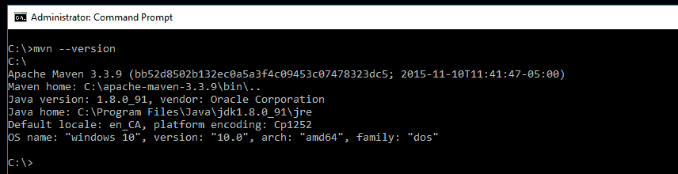

为了清晰起见，以下图片显示了在 Ubuntu 上执行的 Maven 版本检查：

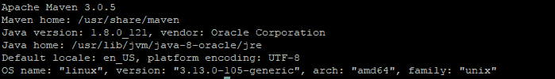

# 使用 Maven 创建项目

安装和验证 Maven 后，您将需要使用 Maven 创建一个项目。这可以在命令提示符中完成。只需在所需位置运行以下命令，然后项目将自动创建：

```java
mvn archetype:generate -DgroupId=com.packtpub.restapp -DartifactId=ticket-management -DarchetypeArtifactId=maven-archetype-quickstart -DinteractiveMode=false -Dversion=1.0.0-SNAPSHOT
```

如果在创建项目时遇到任何问题，请在 Maven 中使用`-X`选项，如下所示。它将指出发生错误的位置：

```java
mvn –X archetype:generate -DgroupId=com.packtpub.restapp -DartifactId=ticket-management -DarchetypeArtifactId=maven-archetype-quickstart -DinteractiveMode=false -Dversion=1.0.0-SNAPSHOT
```

在以下几点中，我们将逐个讨论用于创建 Maven 项目的命令的每个部分：

+   `archetype:generate`：如果目标是在指定的原型上创建一个新项目，可以使用这个命令，例如`maven-archetype-quickstart`。

+   `-Dgroupid=com.packtpub.restapp`：这部分定义了一个带有组标识符的项目，例如一个包。

+   `-DartifcatId=ticket-management`：这部分定义了我们的项目名称（文件夹）。

+   `-DarchetypeArtifactId=maven-archetype-quickstart`：这部分将用于在`archetype:generate`目标上选择原型。

+   `-Dversion=1.0.0-SNAPSHOT`：项目版本可以在这部分中提及。在部署和分发项目时会很有帮助。

# 在创建项目后查看 POM 文件

创建项目后，我们可以在项目文件夹中看到`pom.xml`文件。它将包含所有基本细节，例如`groupId`，`name`等。此外，您可以在`dependencies`配置部分下看到默认的`Junit`依赖项：

```java
<project  
xsi:schemaLocation="http://maven.apache.org/POM/4.0.0 http://maven.apache.org/maven-v4_0_0.xsd">
  <modelVersion>4.0.0</modelVersion>
  <groupId>com.packtpub.restapp</groupId>
  <artifactId>ticket-management</artifactId>
  <packaging>jar</packaging>
  <version>1.0-SNAPSHOT</version>
  <name>ticket-management</name>
  <url>http://maven.apache.org</url>
  <dependencies>
    <dependency>
      <groupId>junit</groupId>
      <artifactId>junit</artifactId>
      <version>3.8.1</version>
      <scope>test</scope>
    </dependency>
  </dependencies> 
</project>
```

Maven 构件属于一个组（通常是`com.organization.product`），必须有一个唯一的标识符。

在上述 POM 文件中，`version`中的`SNAPSHOT`后缀告诉 Maven 这个项目仍在开发中。

# POM 文件结构

在这里，我们将检查**项目对象模型**（**POM**）文件结构，看看它是如何组织的，`pom.xml`文件中有哪些部分可用。POM 文件可以有`properties`，`dependencies`，`build`和`profiles`。然而，这些部分对于不同的项目会有所不同。在其他项目中，我们可能不需要其中的一些部分：

```java
<project>
  // basic project info comes here  
  <properties>
    // local project based properties can be stored here 
  <properties>  
  <dependencies>
    // all third party dependencies come here
  </dependencies>
  <build>
    <plugins>
      // build plugin and compiler arguments come here
    </plugins>
  </build>
  <profiles>
    All profiles like staging, production come here
  </profiles> 
</project>
```

# 理解 POM 依赖关系

Maven 帮助管理你操作系统中的第三方库。在过去，你可能不得不手动将每个第三方库复制到你的项目中。当你有多个项目时，这可能是一个大问题。Maven 通过将所有库保存在每个操作系统的一个中央位置来避免这种第三方库管理混乱。无论你的项目数量如何，第三方库都只会下载到系统一次。

Maven 仓库可以在[`mvnrepository.com/`](https://mvnrepository.com/)找到。

每个操作系统都有自己的本地 Maven 仓库位置：

+   Windows Maven 中央仓库位置：

`C:\Users\<username>\.m2\repository\`

+   Linux Maven 中央仓库位置：

`/home/<username>/.m2/repository`

+   MAC Maven 中央仓库位置：

`/Users/<username>/.m2/repository`

每当你向你的 POM 依赖项中添加第三方库时，指定的 JAR 和相关文件将被复制到`\.m2\repository`的位置。

我们将通过查看一个示例来了解 Maven 依赖结构。假设我们需要在我们的应用程序中使用 Log4j 版本 2.9.1。为了使用它，我们需要将依赖项添加到我们的项目中。我们可以从[`mvnrepository.com`](https://mvnrepository.com)搜索`log4j-core`依赖项，并将依赖项复制到我们的 POM 下的`dependencies`中。

一个示例的 Maven 依赖如下：

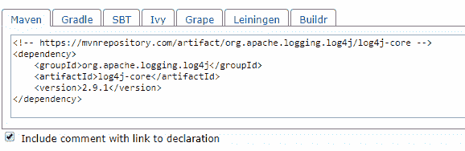

# 将 Log4j 2.9.1 添加到 POM 依赖项

一旦依赖项被添加并且项目在你的 IDE 上更新，相应的库将被复制到`\.m2\repository`中：

```java
<dependency>
    <groupId>org.apache.logging.log4j</groupId>
    <artifactId>log4j-core</artifactId>
    <version>2.9.1</version>
</dependency>
```

前面的依赖项`log4j-core`将被添加到 POM 下。在这个依赖项中，你可以看到`groupId`，`artifactId`和`version`的解释如下：

+   `groupId`用于使 JAR/WAR 文件在所有项目中保持唯一。由于它将被全局使用，Maven 建议包名遵循与域名和子组相同的规则。一个示例`groupId`是`com.google.appengine`。然而，一些第三方依赖项不遵循`groupId`包命名策略。检查以下示例：

```java
<dependency>
    <groupId>joda-time</groupId>
    <artifactId>joda-time</artifactId>
    <version>2.9.9</version>
</dependency>
```

+   `artifactId`只是 JAR/WAR 文件的名称，不带扩展名。

+   `version`带有数字来显示 JAR 文件的版本。一些 JAR 文件带有额外的信息，比如`RELEASE`，例如`3.1.4.RELEASE`。

以下代码将下载`spring-security-web`库`3.1.4`的 JAR 文件到仓库位置：

```java
<dependency>
  <groupId>org.springframework.security</groupId>
  <artifactId>spring-security-web</artifactId>
  <version>3.1.4.RELEASE</version>
</dependency>
```

`Log4j-core`文件（在 Windows 中）将显示如下：

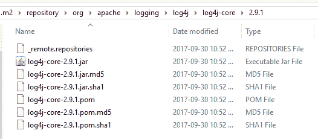

有时，当你在 IDE 上更新项目时，你可能会看到`.jar`文件丢失。在这种情况下，删除整个文件夹（在我们的例子中是`log4j-core`文件夹），然后再次更新它们。为了更新丢失的 JAR 文件，在你删除文件夹后，只需更新你的 IDE（在我们的例子中是 STS/Eclipse），右键单击项目，然后选择 Maven | 更新项目。最后，确保你在文件夹下有`.jar`文件可用。

`.m2\repository`中的示例仓库应该如下所示：

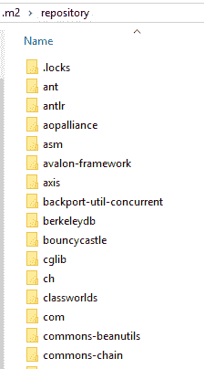

当你更新一个项目（在 Eclipse 或任何其他 IDE 中），它将从远程 Maven 仓库获取 JAR 和相关文件到你系统的中央仓库。

# 依赖树

依赖树可以用于项目中定位特定的依赖项。如果你想了解任何特定的库，比如为什么使用它，你可以通过执行依赖树来检查。此外，依赖树可以展开以显示依赖冲突。

以下代码显示了依赖库以及它们的组织方式：

```java
mvn dependency:tree
```

通过在项目文件夹（或者`pom.xml`文件可用的任何地方）上执行命令，你可以查看依赖树，其结构如下：

```java
[INFO] --- maven-dependency-plugin:2.8:tree (default-cli) @ ticket-management ---
[INFO] com.packtpub.restapp:ticket-management:jar:0.0.1-SNAPSHOT
[INFO] +- org.springframework:spring-web:jar:5.0.0.RELEASE:compile
[INFO] | +- org.springframework:spring-beans:jar:5.0.0.RELEASE:compile
[INFO] | \- org.springframework:spring-core:jar:5.0.0.RELEASE:compile
[INFO] | \- org.springframework:spring-jcl:jar:5.0.0.RELEASE:compile
[INFO] +- org.springframework.boot:spring-boot-starter-tomcat:jar:1.5.7.RELEASE:compile
[INFO] | +- org.apache.tomcat.embed:tomcat-embed-core:jar:8.5.20:compile
[INFO] | +- org.apache.tomcat.embed:tomcat-embed-el:jar:8.5.20:compile
[INFO] | \- org.apache.tomcat.embed:tomcat-embed-websocket:jar:8.5.20:compile
[INFO] +- org.springframework.boot:spring-boot-starter:jar:1.5.7.RELEASE:compile
[INFO] | +- org.springframework.boot:spring-boot:jar:1.5.7.RELEASE:compile
[INFO] | +- org.springframework.boot:spring-boot-autoconfigure:jar:1.5.7.RELEASE:compile
[INFO] | +- org.springframework.boot:spring-boot-starter-logging:jar:1.5.7.RELEASE:compile
[INFO] | | +- ch.qos.logback:logback-classic:jar:1.1.11:compile
[INFO] | | | \- ch.qos.logback:logback-core:jar:1.1.11:compile
[INFO] | | +- org.slf4j:jcl-over-slf4j:jar:1.7.25:compile
[INFO] | | +- org.slf4j:jul-to-slf4j:jar:1.7.25:compile
[INFO] | | \- org.slf4j:log4j-over-slf4j:jar:1.7.25:compile
[INFO] | \- org.yaml:snakeyaml:jar:1.17:runtime
[INFO] +- com.fasterxml.jackson.core:jackson-databind:jar:2.9.2:compile
[INFO] | +- com.fasterxml.jackson.core:jackson-annotations:jar:2.9.0:compile
[INFO] | \- com.fasterxml.jackson.core:jackson-core:jar:2.9.2:compile
[INFO] +- org.springframework:spring-webmvc:jar:5.0.1.RELEASE:compile
[INFO] | +- org.springframework:spring-aop:jar:5.0.1.RELEASE:compile
[INFO] | +- org.springframework:spring-context:jar:5.0.1.RELEASE:compile
[INFO] | \- org.springframework:spring-expression:jar:5.0.1.RELEASE:compile
[INFO] +- org.springframework.boot:spring-boot-starter-test:jar:1.5.7.RELEASE:test
[INFO] | +- org.springframework.boot:spring-boot-test:jar:1.5.7.RELEASE:test
[INFO] | +- org.springframework.boot:spring-boot-test-autoconfigure:jar:1.5.7.RELEASE:test
[INFO] | +- com.jayway.jsonpath:json-path:jar:2.2.0:test
[INFO] | | +- net.minidev:json-smart:jar:2.2.1:test
[INFO] | | | \- net.minidev:accessors-smart:jar:1.1:test
[INFO] | | | \- org.ow2.asm:asm:jar:5.0.3:test
[INFO] | | \- org.slf4j:slf4j-api:jar:1.7.16:compile
[INFO] | +- junit:junit:jar:4.12:test
[INFO] | +- org.assertj:assertj-core:jar:2.6.0:test
[INFO] | +- org.mockito:mockito-core:jar:1.10.19:test
[INFO] | | \- org.objenesis:objenesis:jar:2.1:test
[INFO] | +- org.hamcrest:hamcrest-core:jar:1.3:test
[INFO] | +- org.hamcrest:hamcrest-library:jar:1.3:test
[INFO] | +- org.skyscreamer:jsonassert:jar:1.4.0:test
[INFO] | | \- com.vaadin.external.google:android-json:jar:0.0.20131108.vaadin1:test
[INFO] | \- org.springframework:spring-test:jar:4.3.11.RELEASE:test
[INFO] +- io.jsonwebtoken:jjwt:jar:0.6.0:compile
[INFO] \- org.springframework.boot:spring-boot-starter-aop:jar:1.5.7.RELEASE:compile
[INFO] \- org.aspectj:aspectjweaver:jar:1.8.10:compile
```

# Spring Boot

Spring Boot 是一个快速且易于配置的 Spring 应用程序。与其他 Spring 应用程序不同，我们不需要太多的配置来构建 Spring Boot 应用程序，因此您可以非常快速和轻松地开始构建它。

Spring Boot 帮助我们创建一个独立的应用程序，可以快速嵌入 Tomcat 或其他容器。

# 开发 RESTful Web 服务

要创建新项目，我们可以使用 Maven 命令提示符或在线工具，如 Spring Initializr（[`start.spring.io`](http://start.spring.io)），生成项目基础。这个网站对于创建一个简单的基于 Spring Boot 的 Web 项目非常有用，可以让项目快速启动。

# 创建项目基础

让我们在浏览器中转到[`start.spring.io`](http://start.spring.io)并通过填写以下参数来配置我们的项目以创建项目基础：

+   组：`com.packtpub.restapp`

+   Artifact：`ticket-management`

+   搜索依赖项：`Web`（使用 Tomcat 和 Spring MVC 进行全栈 Web 开发）

配置完我们的项目后，它将如下截图所示：

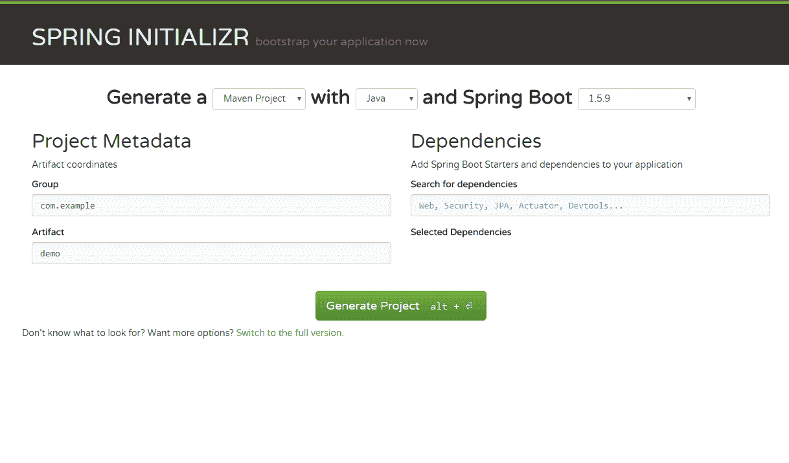

现在，您可以通过单击“生成项目”来生成项目。项目（ZIP 文件）应下载到您的系统。解压缩`.zip`文件，您应该看到以下截图中显示的文件： 

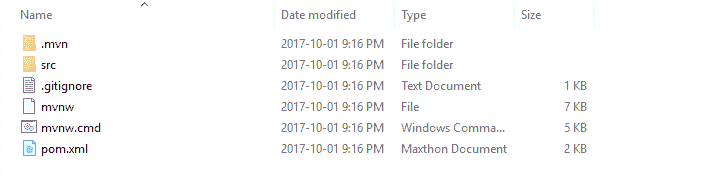

复制整个文件夹（`ticket-management`）并将其保存在所需的位置。

# 使用您喜欢的 IDE

现在是选择 IDE 的时候了。虽然有许多 IDE 用于 Spring Boot 项目，但我建议使用**Spring Tool Suite**（**STS**），因为它是开源的，易于管理项目。在我的情况下，我使用`sts-3.8.2.RELEASE`。您可以从此链接下载最新的 STS：[`spring.io/tools/sts/all`](https://spring.io/tools/sts/all)。在大多数情况下，您可能不需要安装；只需解压文件并开始使用：

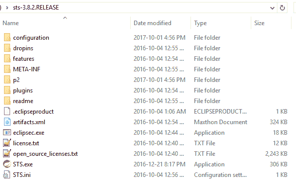

解压 STS 后，您可以通过运行`STS.exe`（如上截图所示）开始使用该工具。

在 STS 中，您可以通过选择现有的 Maven 项目导入项目，如下所示：

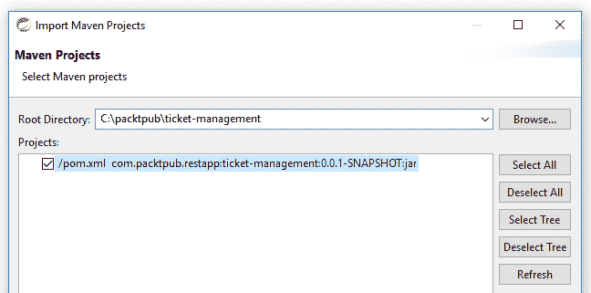

导入项目后，您可以在包资源管理器中看到项目，如下截图所示：

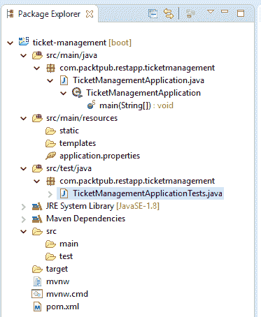

您可以默认查看主 Java 文件（`TicketManagementApplication`）：

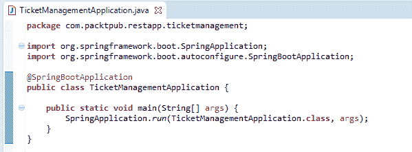

为了简化项目，我们将清理现有的 POM 文件并更新所需的依赖项。将此文件配置添加到`pom.xml`：

```java
<?xml version="1.0" encoding="UTF-8"?>
<project  
  xsi:schemaLocation="http://maven.apache.org/POM/4.0.0 http://maven.apache.org/xsd/maven-4.0.0.xsd">
  <modelVersion>4.0.0</modelVersion>
  <groupId>com.packtpub.restapp</groupId>
  <artifactId>ticket-management</artifactId>
  <version>0.0.1-SNAPSHOT</version>
  <packaging>jar</packaging>
  <name>ticket-management</name>
  <description>Demo project for Spring Boot</description>
  <properties>
    <project.build.sourceEncoding>UTF-8</project.build.sourceEncoding>
    <project.reporting.outputEncoding>UTF-8</project.reporting.outputEncoding>
  </properties>
  <dependencies>
      <dependency>
      <groupId>org.springframework</groupId>
      <artifactId>spring-web</artifactId>
      <version>5.0.1.RELEASE</version>
    </dependency>  
    <dependency>
      <groupId>org.springframework.boot</groupId>
      <artifactId>spring-boot-starter</artifactId>
      <version>1.5.7.RELEASE</version>
    </dependency>
    <dependency>
      <groupId>org.springframework.boot</groupId>
      <artifactId>spring-boot-starter-tomcat</artifactId>
      <version>1.5.7.RELEASE</version>
    </dependency>    
    <dependency>
      <groupId>com.fasterxml.jackson.core</groupId>
      <artifactId>jackson-databind</artifactId>
      <version>2.9.2</version>
    </dependency>
    <dependency>
      <groupId>org.springframework</groupId>
      <artifactId>spring-web</artifactId>
      <version>5.0.0.RELEASE</version>
    </dependency>
    <dependency>
      <groupId>org.springframework</groupId>
      <artifactId>spring-webmvc</artifactId>
      <version>5.0.1.RELEASE</version>
    </dependency>
    <dependency>
      <groupId>org.springframework.boot</groupId>
      <artifactId>spring-boot-starter-test</artifactId>
      <scope>test</scope>
      <version>1.5.7.RELEASE</version> 
    </dependency> 
  </dependencies>
  <build>
    <plugins>
      <plugin>
        <groupId>org.springframework.boot</groupId>
        <artifactId>spring-boot-maven-plugin</artifactId>
      </plugin>
    </plugins>
  </build>
</project>
```

在上述配置中，您可以检查我们使用了以下库：

+   `spring-web`

+   `spring-boot-starter`

+   `spring-boot-starter-tomcat`

+   `spring-bind`

+   `jackson-databind`

由于项目需要上述依赖项才能运行，因此我们已将它们添加到我们的`pom.xml`文件中。

到目前为止，我们已经为 Spring Web 服务准备好了基本项目。让我们向应用程序添加基本的 REST 代码。首先，从`TicketManagementApplication`类中删除`@SpringBootApplication`注释，并添加以下注释：

```java
@Configuration
@EnableAutoConfiguration
@ComponentScan
@Controller
```

这些注释将帮助该类充当 Web 服务类。在本章中，我不打算详细讨论这些配置将做什么。添加注释后，请添加一个简单的方法来返回一个字符串作为我们的基本 Web 服务方法：

```java
@ResponseBody
@RequestMapping("/")
public String sayAloha(){
  return "Aloha";
}
```

最后，您的代码将如下所示：

```java
package com.packtpub.restapp.ticketmanagement;
import org.springframework.boot.SpringApplication;
import org.springframework.boot.autoconfigure.EnableAutoConfiguration;
import org.springframework.context.annotation.ComponentScan;
import org.springframework.context.annotation.Configuration;
import org.springframework.stereotype.Controller;
import org.springframework.web.bind.annotation.RequestMapping;
import org.springframework.web.bind.annotation.ResponseBody;
@Configuration
@EnableAutoConfiguration
@ComponentScan
@Controller
public class TicketManagementApplication { 
  @ResponseBody
  @RequestMapping("/")
  public String sayAloha(){
    return "Aloha";
  }
  public static void main(String[] args) {
    SpringApplication.run(TicketManagementApplication.class, args);
  }
}
```

一旦所有编码更改完成，只需在 Spring Boot 应用程序上运行项目（Run As | Spring Boot App）。您可以通过在控制台中检查此消息来验证应用程序是否已加载：

```java
Tomcat started on port(s): 8080 (http)
```

验证后，您可以通过在浏览器中简单地输入`localhost:8080`来检查 API。请查看下面的截图：

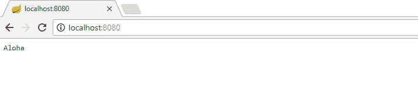

如果您想要更改端口号，可以在`application.properties`中配置不同的端口号，该文件位于`src/main/resources/application.properties`中。查看以下截图：

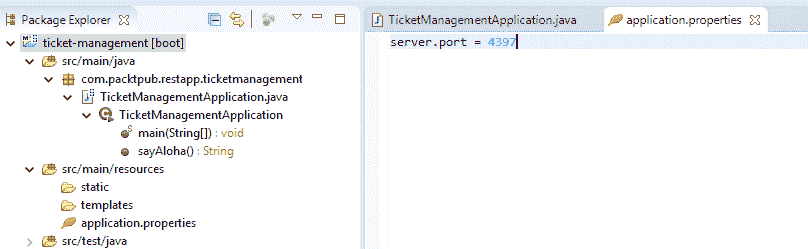

# 总结

在本章中，我们已经看到如何设置 Maven 构建以支持 Web 服务的基本实现。此外，我们还学习了 Maven 在第三方库管理以及 Spring Boot 和基本 Spring REST 项目中的帮助。在接下来的章节中，我们将更多地讨论 Spring REST 端点和 Reactor 支持。
