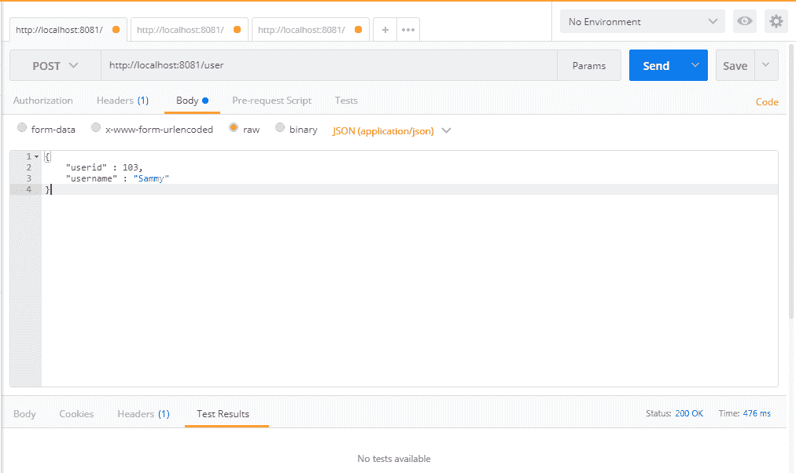
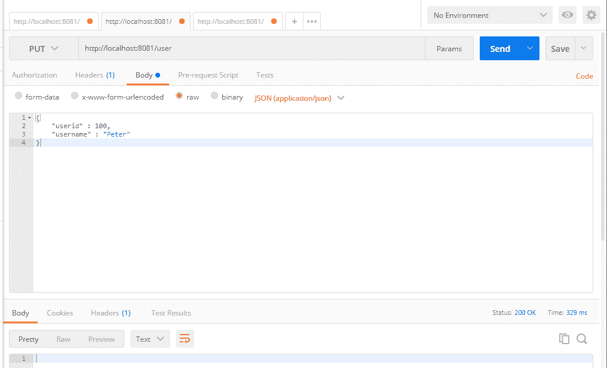
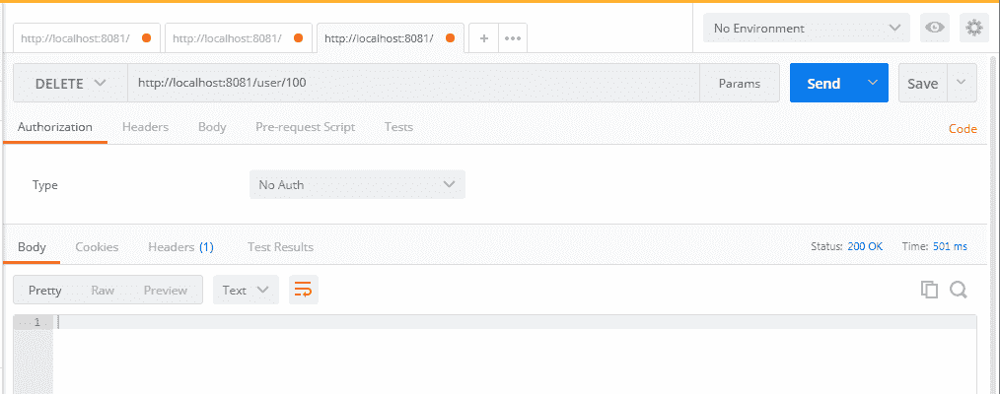

# 第四章：Spring REST 中的 CRUD 操作

在本章中，我们将介绍 Spring 5 Reactive REST 中的基本**创建**，**读取**，**更新**和**删除**（**CRUD**）API。在本章之后，您将能够在具有 Reactor 支持的 Spring 5 中执行简单的 CRUD 操作。

在本章中，我们将介绍以下方法：

+   将 CRUD 操作映射到 HTTP 方法

+   创建用户

+   更新用户

+   删除用户

+   阅读（选择）用户

# Spring REST 中的 CRUD 操作

在本章中，我们将介绍 Spring 5 中的用户管理（带有 Reactive 支持）。我们将在用户管理中实现 CRUD 操作。

# HTTP 方法

根据 HTTP 1.1 规范，以下是方法定义：

+   `GET`：此方法获取 URI 中提到的信息。`GET`方法可用于单个或多个项目。

+   `POST`：此方法创建 URI 中提到的项目。通常，`POST`方法将用于项目创建和更安全的选项。由于参数在`POST`中是隐藏的，因此与`GET`方法相比，它将更安全。

+   `DELETE`：此方法删除请求的 URI 中的项目。

+   `PUT`：此方法更新请求的 URI 中的项目。根据 HTTP 规范，如果项目不可用，服务器可以创建项目。但是，这将由设计应用程序的开发人员决定。

+   **高级 HTTP 方法**：虽然我们可能不会始终使用高级方法，但了解这些方法将是有益的：

+   `HEAD`：此方法获取有关资源的元信息，而不是资源本身作为响应。它将用于缓存目的。

+   `TRACE`：此方法主要用于调试目的，其中 HTTP 请求的内容将被发送回请求者。

+   `CONNECT`：这用于打开隧道，可用于代理目的。

+   `OPTIONS`：此方法用于描述目标资源的通信选项。

以下是我们 CRUD 操作的 HTTP 方法建议：

| **操作** | **HTTP 方法** |
| --- | --- |
| 创建 | `POST` |
| 读取 | `GET` |
| 更新 | `PUT` |
| 删除 | `DELETE` |

在本章的其余部分，我们将展示如何构建 CRUD 操作。

# 响应式服务器初始化

在进入端点之前，我们将探索我们的文件结构，包括初始化程序、处理程序和存储库。

用于初始化我们的端口`8081`的`Server`类如下：

```java
public class Server { 
  public static final String HOST = "localhost";
  public static final int PORT = 8081;
  public static void main(String[] args) throws InterruptedException, IOException{
    Server server = new Server(); 
    server.startReactorServer(); 
    System.out.println("Press ENTER to exit.");
    System.in.read();
  }
  public void startReactorServer() throws InterruptedException {
    RouterFunction<ServerResponse> route = routingFunction();
    HttpHandler httpHandler = toHttpHandler(route);
    ReactorHttpHandlerAdapter adapter = new ReactorHttpHandlerAdapter(httpHandler);
    HttpServer server = HttpServer.create(HOST, PORT);
    server.newHandler(adapter).block();
  }
  public RouterFunction<ServerResponse> routingFunction() {
    // our Endpoints will be coming here
  }
} 
```

在上述方法中，我们创建了一个`main`类。在`main`方法中，我们将使用以下代码初始化服务器并启动服务器：

```java
Server server = new Server(); 
server.startReactorServer(); 
```

上述方法将启动 Reactor 服务器。 Reactor 服务器的实现如下：

```java
RouterFunction<ServerResponse> route = routingFunction();
HttpHandler httpHandler = toHttpHandler(route);
ReactorHttpHandlerAdapter adapter = new ReactorHttpHandlerAdapter(httpHandler);
HttpServer server = HttpServer.create(HOST, PORT);
server.newHandler(adapter).block();
```

让我们稍后再看这段代码，因为这个概念是基于 Reactive 的。假设这段代码运行良好，我们将继续前进，重点放在端点上。

以下是映射我们所有 CRUD 操作的 REST 端点的方法：

```java
public RouterFunction<ServerResponse> routingFunction() {
    // our Endpoints will be coming here
}
```

您可能会在`UserRepository`和`UserHandler`上遇到错误。现在让我们填写这些：

```java
package com.packtpub.reactive;
public interface UserRepository {
    // repository functions will be coming here
}
```

在上述代码中，我们刚刚在现有包`com.packtpub.reactive`中添加了`UserRepository`接口。稍后，我们将为我们的业务需求引入抽象方法。

现在，我们可以添加一个`UserHandler`类，并添加必要的内容：

```java
package com.packtpub.reactive;
// import statements
public class UserHandler {    
    private final UserRepository userRepository;  
    public UserHandler(UserRepository userRepository){
        this.userRepository = userRepository;
    }
}
```

在上面的代码中，`UserHandler`在其构造函数中初始化了`UserRepository`实例。如果有人获得了`UserHandler`的实例，他们将不得不将`UserRepository`类型传递给`UserHandler`的构造函数。通过这样做，`UserRepository`将始终被转发到`UserHandler`以满足业务需求。

# 存储库中的示例值

为了使用存储库，我们将不得不创建一个具体的类并填写一些值来测试`GET`操作。在下面的方法中，我们可以这样做：

```java
package com.packtpub.reactive;
// import statements
public class UserRepositorySample implements UserRepository {    
  // initiate Users
  private final Map<Integer, User> users = new HashMap<>();
  // fill dummy values for testing
  public UserRepositorySample() {
    this.users.put(100, new User(100, "David"));
    this.users.put(101, new User(101, "John"));
    this.users.put(102, new User(102, "Kevin"));
  }
} 
```

在上述类中，我们刚刚实现了`UserRepository`并填写了一些示例值。

为了简化我们的代码，我们只使用基于应用程序的数据存储，这意味着一旦应用程序重新启动，我们的数据将被重新初始化。在这种情况下，我们无法在我们的应用程序中存储任何新数据。但是，这将帮助我们专注于我们的主题，比如与持久性无关的 Reactive 和 Spring 5。

我们可以在`routing`方法中使用这个示例存储库：

```java
public RouterFunction<ServerResponse> routingFunction() {
    UserRepository repository = new UserRepositorySample();
    UserHandler handler = new UserHandler(repository);
}
```

上述行将在我们的存储库中插入虚拟值。这足以测试`GET`操作。

# 获取所有用户-映射

在`routingFunction`中，我们将为`getAllUsers`添加我们的第一个端点。起初，我们将在处理程序中保留`null`值，以避免代码中的错误：

```java
    return nest (
        path("/user"),
        nest(
          accept(MediaType.ALL),
          route(GET("/"), null)
        )    
    );
```

上述的`nest`方法将用于路由到正确的函数，并且还将用于分组其他路由器。在上述方法中，我们在我们的路径中使用`/user`，并使用`GET("/")`方法作为路由器。此外，我们使用`MediaType.ALL`来接受所有媒体范围，以简化代码。

# 获取所有用户-处理程序和存储库中的实现

在这里，我们将在我们的存储库中定义和实现`getAllUsers`方法。此外，我们将通过`UserHandler`在`main`类中调用`getAllUsers`方法。

我们将在`UserRepository`类中添加一个`getAllUsers`方法的抽象方法：

```java
Flux<User> getAllUsers();
```

与任何其他接口和具体类实现一样，我们必须在我们的接口中添加抽象方法，在我们的情况下是`UserRespository`。上述代码只是在`UserRepository`类中添加了`getAllUsers`。

在`UserRepositorySample`（`UserRepository`的具体类）中，我们将实现抽象方法`getAllUsers`：

```java
// this method will return all users
@Override
public Flux<User> getAllUsers() {
    return Flux.fromIterable(this.users.values());
}
```

在上面的代码中，我们已经添加了`getAllUsers`方法并实现了业务逻辑。由于我们已经在`UserRepositorySample`构造函数中定义了用户，我们只需要返回用户。`Flux`类有一个叫做`fromIterable`的方法，用于从我们的`UserRepositorySample`中获取所有用户。

`fromIterable`方法将返回一个发出 Java 集合接口中包含的项目的 Flux。由于 Collection 实现了 iterable 接口，`fromIterable`将是在我们的情况下返回`Flux`的完美方法。

在`UserHandler.java`文件中，我们将添加以 Reactive 方式获取所有用户的代码。以下代码将为我们提供必要的细节：

```java
public Mono<ServerResponse> getAllUsers(ServerRequest request){
  Flux<User> users = this.userRepository.getAllUsers();
  return ServerResponse.ok().contentType(APPLICATION_JSON).body(users, User.class); 
}
```

在上面的代码中，我们将从`Flux`中获取所有用户，并以 JSON 类型发送响应。服务器响应内容类型已更新为`APPLICATION_JSON`。

现在是时候在我们的路由方法中添加我们的第一个方法`getAllUsers`了。在这里，我们将只使用一个路由方法来映射所有的 REST API。

最后，在`Server.java`中，我们的路由函数将如下所示：

```java
public class Server {    
    // existing code is hidden
    public RouterFunction<ServerResponse> routingFunction() {
        UserRepository repository = new UserRepositorySample();
        UserHandler handler = new UserHandler(repository);
        return nest (
            path("/user"),
            nest(
              accept(MediaType.ALL),
              route(GET("/"), handler::getAllUsers)
        ) 
    );
}
```

在上面的代码中，我们创建了一个`UserRepository`并将其转发给我们的`UserHandler`。`UserHandler`将自动调用`UserSampleRepository`中的`getAllUsers`方法。通过调用`UserHandler`的`getAllUsers`方法，我们将从我们之前实现的示例存储库类中获取所有用户。

在这里，我们使用`nest`方法并提供参数，比如 API 路径`GET("/")`和媒体类型。由于`nest`方法接受`RoutingFunction`作为第二个参数，我们可以在基本的`nest`方法中使用更多的`nest`方法。通过使用内部嵌套方法，我们已经实现了业务需求：我们的基本 REST API 从`"/user"`开始，并通过`"/"`基本获取用户 API 路由。

因此，基本的 API 路径`/user`将自动调用上面代码中实现的`getAllUsers`方法。

# 测试端点-获取所有用户

由于我们已经完成了第一个 API 的实现，现在我们可以通过在浏览器中调用以下 URI 来测试它：

```java
http://localhost:8081/user
```

您应该得到以下结果： 

```java
[
  {
    userid: 100,
    username: "David"
  },
  {
    userid: 101,
    username: "John"
  },
  {
    userid: 102,
    username: "Kevin"
  }
]
```

您还可以在任何 REST 客户端中检查 API，比如 Postman/SoapUI 或其他任何 REST 客户端。

# getUser-处理程序和存储库中的实现

在这里，我们将在存储库中定义和实现`getUser`方法。此外，我们将通过`UserHandler`在`main`类中调用`getUser`方法。

我们将在`UserRepository`类中为`getUser`方法添加一个抽象方法：

```java
Mono<User> getUser(Integer id);
```

在这里，我们将添加`getUser`方法的代码。您可以看到我们使用了`Mono`返回类型来访问单个资源。

在`UserRepositorySample`类（`UserRepository`的具体类）中，我们将实现抽象方法`getUser`：

```java
@Override
public Mono<User> getUser(Integer id){
    return Mono.justOrEmpty(this.users.get(id)); 
}
```

在上述代码中，我们通过`id`检索了特定用户。此外，我们已经提到，如果用户不可用，应该要求该方法返回一个空的 Mono。

在`UserHandler`方法中，我们将讨论如何处理请求并应用我们的业务逻辑来获得响应：

```java
public Mono<ServerResponse> getUser(ServerRequest request){
    int userId = Integer.valueOf(request.pathVariable("id"));
    Mono<ServerResponse> notFound = ServerResponse.notFound().build();
    Mono<User> userMono = this.userRepository.getUser(userId);
    return userMono
        .flatMap(user -> ServerResponse.ok().contentType(APPLICATION_JSON).body(fromObject(user)))
        .switchIfEmpty(notFound); 
}
```

在上述代码中，我们刚刚将字符串`id`转换为整数，以便将其提供给我们的`Repository`方法（`getUser`）。一旦我们从`Repository`接收到结果，我们只需将其映射到带有`JSON`内容类型的`Mono<ServerResponse>`中。此外，我们使用`switchIfEmpty`来在没有项目可用时发送适当的响应。如果搜索项目不可用，它将简单地返回空的`Mono`对象作为响应。

最后，我们将在`Server.java`中的路由路径中添加`getUser`：

```java
public RouterFunction<ServerResponse> routingFunction() {
    UserRepository repository = new UserRepositorySample();
    UserHandler handler = new UserHandler(repository);    
    return nest (
      path("/user"),
      nest(
        accept(MediaType.ALL),
        route(GET("/"), handler::getAllUsers)
      )
      .andRoute(GET("/{id}"), handler::getUser)      
    );
}
```

在上述代码中，我们刚刚在现有路由路径中添加了一个新条目`.andRoute(GET("/{id}"), handler::getUser)`。通过这样做，我们已经添加了`getUser`方法和相应的 REST API 部分来访问单个用户。重新启动服务器后，我们应该能够使用 REST API。

# 测试端点-获取用户

由于我们已经完成了第一个 API 实现，现在可以通过在浏览器中使用`GET`方法调用以下 URI 来测试它：

```java
http://localhost:8081/user/100
```

您应该会得到以下结果：

```java
{
    userid: 100,
    username: "David"
}
```

# 创建用户-在处理程序和存储库中的实现

在这里，我们将在存储库中定义和实现`createUser`方法。此外，我们将通过`UserHandler`在`main`类中调用`createUser`方法。

我们将在`UserRepository`类中为`createUser`方法添加一个抽象方法：

```java
Mono<Void> saveUser(Mono<User> userMono);
```

在这里，我们将讨论如何使用示例存储库方法保存用户。

在`UserRepositorySample`（`UserRepository`的具体类）中，我们将实现抽象方法`createUser`：

```java
@Override
public Mono<Void> saveUser(Mono<User> userMono) {
    return userMono.doOnNext(user -> { 
      users.put(user.getUserid(), user);
      System.out.format("Saved %s with id %d%n", user, user.getUserid());
    }).thenEmpty(Mono.empty());
}
```

在上述代码中，我们使用`doOnNext`来保存用户在存储库中。此外，如果失败，该方法将返回空的`Mono`。

由于我们已经在存储库中添加了`createUser`方法，因此我们将在处理程序中进行后续操作：

```java
public Mono<ServerResponse> createUser(ServerRequest request) {
    Mono<User> user = request.bodyToMono(User.class);
    return ServerResponse.ok().build(this.userRepository.saveUser(user));
}
```

在`UserHandler`类中，我们创建了`createUser`方法，通过处理程序添加用户。在该方法中，我们通过`bodyToMono`方法将请求提取为`Mono`。一旦创建了`用户`，它将被转发到`UserRepository`以保存该方法。

最后，我们将在`Server.java`的现有路由函数中添加 REST API 路径以保存`用户`：

```java
public RouterFunction<ServerResponse> routingFunction() {
    UserRepository repository = new UserRepositorySample();
    UserHandler handler = new UserHandler(repository);
    return nest (
      path("/user"),
      nest(
        accept(MediaType.ALL),
        route(GET("/"), handler::getAllUsers)
      )
      .andRoute(GET("/{id}"), handler::getUser)
      .andRoute(POST("/").and(contentType(APPLICATION_JSON)), handler::createUser) 
    );
}
```

# 测试端点-创建用户

由于我们已经完成了第一个 API 实现，现在可以通过在浏览器中调用以下 URI 来测试它：

```java
http://localhost:8081/user
```

由于我们无法在浏览器中使用`POST`方法，因此我们将在名为 Postman 的 REST API 客户端中进行测试：



添加新用户后，您可以通过调用`getAllUsers` URI（`http://localhost:8081/user`）来检查结果。

**Postman**是一个 REST 客户端，可用于构建，测试和共享 REST API 调用。在测试 REST API 时，这样的工具将非常有帮助，而无需编写测试代码。

**SoapUI**是另一个 REST 客户端，可以作为 Postman 的替代品使用。

# 更新用户-在处理程序和存储库中的实现

在这里，我们将在存储库中定义和实现`updateUser`方法。此外，我们将通过`UserHandler`在`main`类中调用`updateUser`方法。

我们将在`UserRepository`类中为`updateUser`方法添加一个抽象方法：

```java
Mono<Void> updateUser(Mono<User> userMono);
```

在`UserRepositorySample`类中，我们将添加更新代码的逻辑。在这里，我们将使用`userid`作为键，并将`User`对象作为值存储在我们的映射中：

```java
@;Override
public Mono<Void> updateUser(Mono<User> userMono) {
    return userMono.doOnNext(user -> { 
      users.put(user.getUserid(), user);
      System.out.format("Saved %s with id %d%n", user, user.getUserid());
    }).thenEmpty(Mono.empty());
}
```

在上面的代码中，我们通过添加指定的用户（来自请求）来更新用户。一旦用户添加到列表中，该方法将返回`Mono<Void>`；否则，它将返回`Mono.empty`对象。

由于我们已经在存储库中添加了`updateUser`方法，现在我们将跟进我们的处理程序：

```java
public Mono<ServerResponse> updateUser(ServerRequest request) {
    Mono<User> user = request.bodyToMono(User.class);
    return ServerResponse.ok().build(this.userRepository.saveUser(user));
}
```

在上述代码中，我们通过调用`bodyToMono`方法将用户请求转换为`Mono<User>`。`bodyToMono`方法将提取主体并转换为`Mono`对象，以便用于保存选项。

与其他 API 路径一样，我们在`Server.java`中添加了`updateUser` API：

```java
public RouterFunction<ServerResponse> routingFunction() {
    UserRepository repository = new UserRepositorySample();
    UserHandler handler = new UserHandler(repository);
    return nest (
      path("/user"),
      nest(
        accept(MediaType.ALL),
        route(GET("/"), handler::getAllUsers)
      )
      .andRoute(GET("/{id}"), handler::getUser)
      .andRoute(POST("/").and(contentType(APPLICATION_JSON)), handler::createUser)
      .andRoute(PUT("/").and(contentType(APPLICATION_JSON)), handler::updateUser) 
    );
}
```

# 测试端点 - updateUser

由于我们已经添加了`deleteUser`方法，现在我们将通过在 Postman 或 SoapUI 中使用`PUT`方法调用 URI `http://localhost:8081/user` 来测试它：



更新新用户后，您可以通过调用`getAllUsers` URI (`http://localhost:8081/user`) 来检查结果。

# deleteUser - 处理程序和存储库中的实现

在这里，我们将在存储库中定义和实现`deleteUser`方法。此外，我们将通过`UserHandler`在`main`类中调用`deleteUser`方法。

像往常一样，我们将在`UserRepository`类中为`deleteUser`方法添加一个抽象方法：

```java
Mono<Void> deleteUser(Integer id);
```

在`UserRepositorySample.java`文件中，我们将添加`deleteUser`方法来从列表中删除指定的用户：

```java
@Override
public Mono<Void> deleteUser(Integer id) {
    users.remove(id); 
    System.out.println("user : "+users);   
    return Mono.empty();
}
```

在上述方法中，我们只是从用户中删除元素并返回一个空的`Mono`对象。

由于我们已经在存储库中添加了`deleteUser`方法，现在我们将跟进我们的处理程序：

```java
public Mono<ServerResponse> deleteUser(ServerRequest request) { 
    int userId = Integer.valueOf(request.pathVariable("id"));
    return ServerResponse.ok().build(this.userRepository.deleteUser(userId));
}
```

最后，我们将在`Server.java`中的现有路由函数中添加 REST API 路径以保存`user`：

```java
public RouterFunction<ServerResponse> routingFunction() {
    UserRepository repository = new UserRepositorySample();
    UserHandler handler = new UserHandler(repository);
    return nest (
      path("/user"),
      nest(
        accept(MediaType.ALL),
        route(GET("/"), handler::getAllUsers)
      )
      .andRoute(GET("/{id}"), handler::getUser)
      .andRoute(POST("/").and(contentType(APPLICATION_JSON)), handler::createUser)
      .andRoute(PUT("/").and(contentType(APPLICATION_JSON)), handler::updateUser)
      .andRoute(DELETE("/{id}"), handler::deleteUser)
    );
}
```

# 测试端点 - deleteUser

由于我们已经完成了第一个 API 的实现，现在我们可以通过在客户端（Postman 或 SoapUI）中使用`DELETE`方法调用 URI `http://localhost:8081/user/100` 来测试它：



删除新用户后，您可以通过调用`getAllUsers` URI (`http://localhost:8081/user`) 来检查结果。

# 总结

在本章中，我们学习了如何使用 Reactive 支持（Flux 和 Mono）以及如何将我们的 API 与 Reactive 组件集成。我们已经学习了如何使用 Reactor 服务器对基于 Reactive 的 REST API 进行基本的 CRUD 操作。此外，我们还介绍了如何为我们的 CRUD 操作添加路由选项，并简要讨论了在 CRUD 操作中 Flux 和 Mono 的实现。

在接下来的章节中，我们将专注于 Spring 5 REST（不带 Reactor 支持），因为 Spring Reactive 库/ API 仍处于不稳定状态，并且在主流应用程序中并没有被广泛使用。尽管 Spring 团队正式发布了对 Reactive 的支持，但大多数业务需求并没有得到清晰的实现和文档化。考虑到这种情况，在接下来的章节中，我们将讨论不涉及 Reactive 相关主题的 Spring 5。
