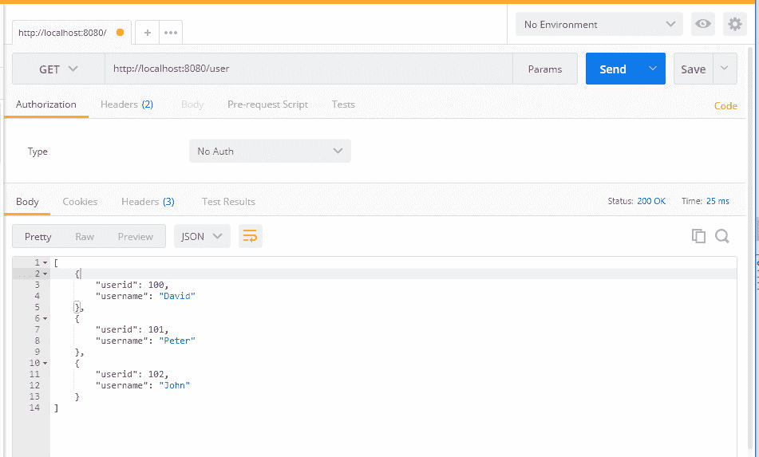
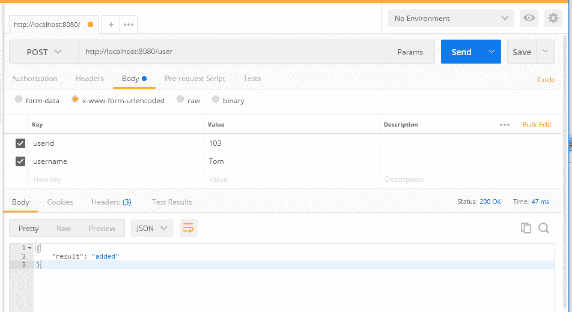
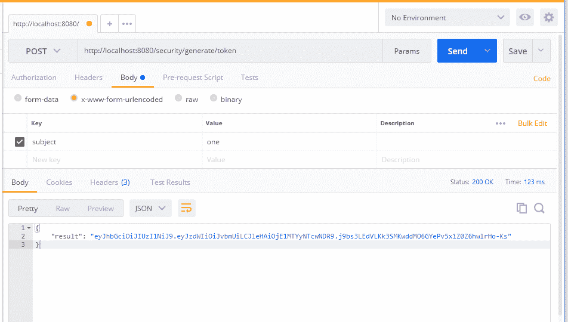
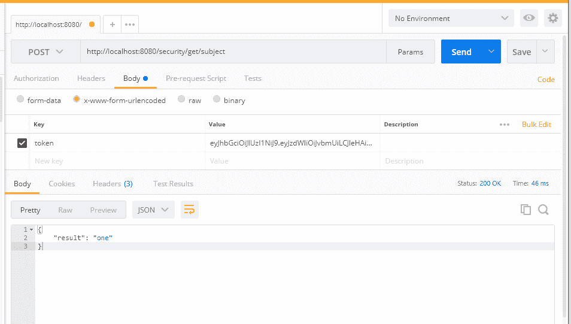
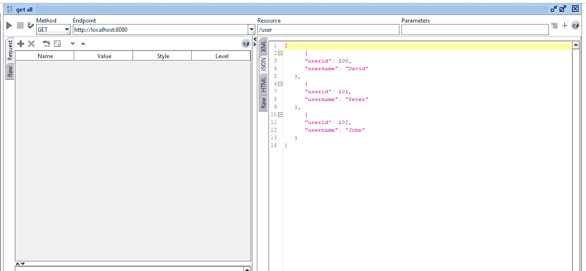
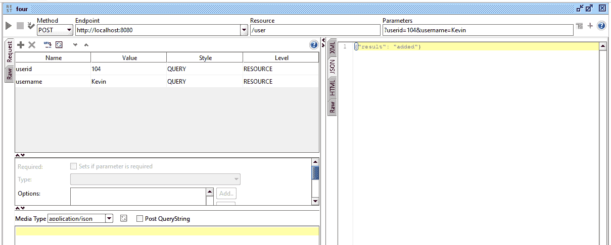
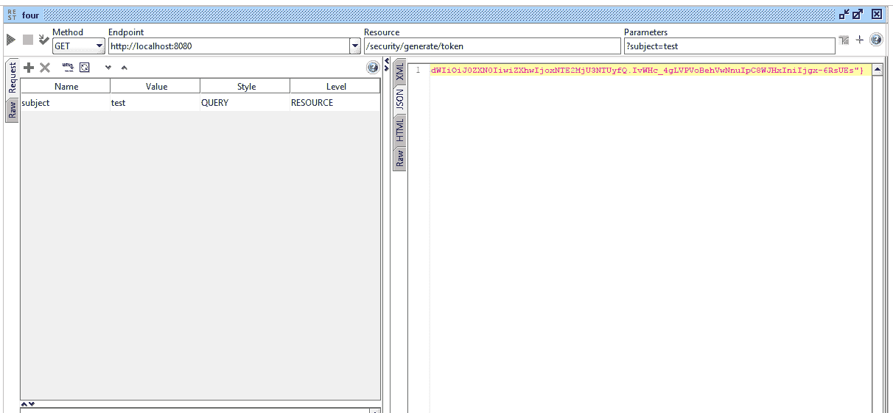
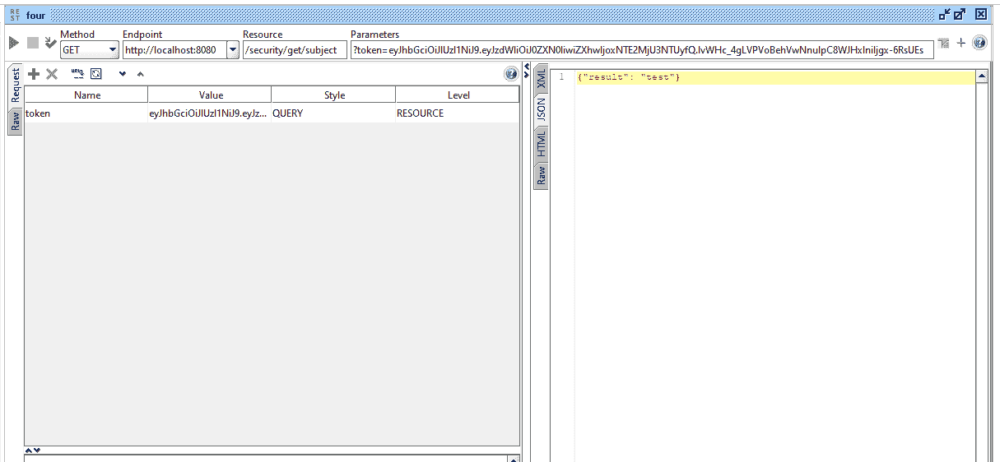

# 第七章：测试 RESTful Web 服务

在之前的章节中，我们已经讨论了如何创建 REST API 并在我们的 REST API 和服务方法中应用业务逻辑。然而，为了确保我们的业务逻辑，我们可能需要编写适当的测试用例并使用其他测试方法。测试我们的 REST API 将帮助我们在部署到生产环境时保持应用程序的清洁和功能。我们编写单元测试用例或其他测试方法越多，对于将来维护我们的应用程序来说就越好。

在本章中，我们将讨论以下用于我们示例 RESTful web 服务的测试策略：

+   在 Spring 控制器上进行 JUnit 测试

+   MockMvc（对控制器进行模拟）

+   Postman REST 客户端

+   SoapUI REST 客户端

+   jsoup 读取器作为客户端

# JUnit

JUnit 是 Java 和 Spring 应用程序最简单和最受欢迎的测试框架。通过为我们的应用程序编写 JUnit 测试用例，我们可以提高应用程序的质量，避免出现错误的情况。

在这里，我们将讨论一个简单的 JUnit 测试用例，它调用`userService`中的`getAllUsers`方法。我们可以检查以下代码：

```java
@RunWith(SpringRunner.class)
@SpringBootTest
public class UserTests {  
  @Autowired
  UserService userSevice;
  @Test
  public void testAllUsers(){
    List<User> users = userSevice.getAllUsers(); 
    assertEquals(3, users.size());
  }
}
```

在前面的代码中，我们调用了`getAllUsers`并验证了总数。让我们在另一个测试用例中测试单用户方法：

```java
// other methods
@Test
public void testSingleUser(){
    User user = userSevice.getUser(100); 
    assertTrue(user.getUsername().contains("David"));
}
```

在前面的代码片段中，我们只是测试了我们的服务层并验证了业务逻辑。然而，我们可以通过使用模拟方法直接测试控制器，这将在本章后面讨论。

# MockMvc

MockMvc 主要用于通过控制器测试代码。通过直接调用控制器（REST 端点），我们可以在 MockMvc 测试中覆盖整个应用程序。此外，如果我们在控制器上保留任何身份验证或限制，它也将在 MockMvc 测试用例中得到覆盖。

以下代码将使用 MockMvc 标准测试我们的基本 API（`localhost:8080/`）：

```java
import static org.hamcrest.Matchers.is;
import static org.springframework.test.web.servlet.result.MockMvcResultMatchers.jsonPath;
import static org.springframework.test.web.servlet.result.MockMvcResultMatchers.status;
import org.junit.Before;
import org.junit.Test;
import org.junit.runner.RunWith;
import org.springframework.beans.factory.annotation.Autowired;
import org.springframework.boot.test.context.SpringBootTest;
import org.springframework.test.context.junit4.SpringJUnit4ClassRunner;
import org.springframework.test.web.servlet.MockMvc;
import org.springframework.test.web.servlet.MvcResult;
import org.springframework.test.web.servlet.request.MockMvcRequestBuilders;
import org.springframework.test.web.servlet.setup.MockMvcBuilders;
import org.springframework.web.context.WebApplicationContext;
@SpringBootTest
@RunWith(SpringJUnit4ClassRunner.class)
public class UserMockMVCTests {  
  @Autowired
  private WebApplicationContext ctx;  
  private MockMvc mockMvc;  
  @Before
  public void setUp() {
    this.mockMvc = MockMvcBuilders.webAppContextSetup(this.ctx).build();
  }  
  @Test
  public void testBasicMVC() throws Exception {
    MvcResult result = mockMvc
        .perform(MockMvcRequestBuilders.get("/"))
        .andExpect(status().isOk())
        .andExpect(jsonPath("result", is("Aloha")))         
        .andReturn();    
    String content = result.getResponse().getContentAsString();
     System.out.println("{testBasicMVC} response : " + content);
  }
}
```

在前面的代码中，我们只是在`setUp()`方法中初始化了 Web 应用程序。此外，我们使用`@Autowired`注解绑定了`WebApplicationContext`。设置准备好后，我们创建一个名为`testBasicMVC`的方法来测试我们的普通 API（`localhost:8080`），它将返回`"result: Aloha"`。

当我们完成代码后，如果在 Eclipse 上选择 Run As | JUnit test 来运行它，前面的方法将被执行并显示结果。我们可以在 Eclipse 的 JUnit 窗口中查看成功的测试用例结果。

# 测试单个用户

到目前为止，我们只测试了一个普通的 REST API。在这里，我们可以再进一步，通过从`userid`获取单个用户来测试我们的用户 API。以下代码将带领我们实现获取单个用户：

```java
import static org.hamcrest.Matchers.is;
import static org.springframework.test.web.servlet.result.MockMvcResultMatchers.jsonPath;
import static org.springframework.test.web.servlet.result.MockMvcResultMatchers.status;
import org.junit.Before;
import org.junit.Test;
import org.junit.runner.RunWith;
import org.springframework.beans.factory.annotation.Autowired;
import org.springframework.boot.test.context.SpringBootTest;
import org.springframework.test.context.junit4.SpringJUnit4ClassRunner;
import org.springframework.test.web.servlet.MockMvc;
import org.springframework.test.web.servlet.MvcResult;
import org.springframework.test.web.servlet.request.MockMvcRequestBuilders;
import org.springframework.test.web.servlet.setup.MockMvcBuilders;
import org.springframework.web.context.WebApplicationContext;
@SpringBootTest
@RunWith(SpringJUnit4ClassRunner.class)
public class UserMockMVCTests {  
  @Autowired
  private WebApplicationContext ctx;  
  private MockMvc mockMvc;  
  @Before
  public void setUp() {
    this.mockMvc = MockMvcBuilders.webAppContextSetup(this.ctx).build();
  }    
  @Test
  public void testBasicMVC() throws Exception {
    MvcResult result = mockMvc
        .perform(MockMvcRequestBuilders.get("/"))        
        .andExpect(status().isOk())
        .andExpect(jsonPath("result", is("Aloha")))        
        .andReturn();    
    String content = result.getResponse().getContentAsString();
     System.out.println("{testBasicMVC} response : " + content);
  }    
  @Test
  public void testSingleUser() throws Exception {
    MvcResult result = mockMvc
        .perform(MockMvcRequestBuilders.get("/user/100")) 
        .andExpect(status().isOk())
        .andExpect(jsonPath("userid", is(100)))
        .andExpect(jsonPath("username", is("David")))
        .andReturn();    
    String content = result.getResponse().getContentAsString();
    System.out.println("{testSingleUser} response : " + content);
  }
}
```

在前面的代码（`testSingleUser`）中，我们可以看到我们期望`status`、`userid`和`username`分别为`Ok`、`100`和`David`。此外，我们打印从 REST API 获取的结果。

# Postman

在之前的章节中，我们已经使用 Postman 来测试我们的 REST API。当我们需要完全测试应用程序时，Postman 会很有帮助。在 Postman 中，我们可以编写测试套件来验证我们的 REST API 端点。

# 获取所有用户 - Postman

首先，我们将从一个简单的 API 开始，用于获取所有用户：

```java
http://localhost:8080/user
```

之前的方法将获取所有用户。获取所有用户的 Postman 截图如下：



在前面的截图中，我们可以看到我们之前添加的所有用户。我们使用了`GET`方法来调用这个 API。

# 添加用户 - Postman

让我们尝试使用`POST`方法在`user`中添加一个新用户：

```java
http://localhost:8080/user
```

按照以下截图所示添加用户：



在前面的结果中，我们可以看到 JSON 输出：

```java
{
     "result" : "added"
}
```

# 生成 JWT - Postman

让我们尝试通过调用 Postman 中的生成令牌 API 来生成令牌（JWT）：

```java
http://localhost:8080/security/generate/token
```

我们可以清楚地看到我们在 Body 中使用`subject`来生成令牌。一旦我们调用 API，我们将获得令牌。我们可以在下面的截图中检查令牌：



# 从令牌中获取主题

通过使用我们之前创建的现有令牌，我们将通过调用获取主题 API 来获取主题：

```java
http://localhost:8080/security/get/subject
```

结果将如下截图所示：



在前面的 API 调用中，我们在 API 中发送了令牌以获取主题。我们可以在生成的 JSON 中看到主题。

# SoapUI

与 Postman 一样，SoapUI 是另一个用于测试 Web 服务的开源工具。SoapUI 帮助进行 Web 服务调用、模拟、仿真、负载测试和功能测试。SoapUI 在负载测试中被广泛使用，并且具有许多控件，使负载测试变得容易。

SoapUI 在 Windows 和 Linux 等操作系统中非常容易安装。其用户界面为我们提供了很大的灵活性，可以构建复杂的测试场景。此外，SoapUI 支持第三方插件，如`TestMaker`和`Agiletestware`，并且很容易与 NetBeans 和 Eclipse 等 IDE 集成。

# 获取所有用户 - SoapUI

我们将使用 SoapUI 测试我们的基本 API(`/user`)。当我们在 SoapUI 中使用`GET`方法时，以下方法将获取所有用户：

```java
http://localhost:8080/user
```

获取所有用户的 SoapUI 截图如下：



我们将尝试使用`POST`方法添加用户：

```java
http://localhost:8080/user
```

添加用户的截图如下：



在这个结果中，我们可以看到 JSON 输出：

```java
{"result" : "added"}
```

# 生成 JWT SoapUI

我们将使用`GET`方法生成令牌如下：

```java
http://localhost:8080/security/generate/token
```

在 SoapUI 中，我们使用`subject`作为参数。我们可以在下面的截图中看到这一点：



我们可以清楚地看到我们在 Body 中使用`subject`来生成令牌。此外，我们可以在 SoapUI 中看到 Style 为 QUERY。这将使我们的 Value(`test`)成为 API 的参数。

一旦我们调用 API，我们将获得令牌。我们可以在前面的截图中检查令牌。

# 从令牌中获取主题 - SoapUI

现在我们可以从之前生成的令牌中获取主题。我们可能需要将令牌作为参数传递以获取主题。

当我们在 SoapUI 中使用`GET`方法调用 API 时，以下 API 将从令牌中获取主题：

```java
http://localhost:8080/security/get/subject
```

尽管我们可以在前面的 API 调用中使用`POST`方法，但我们只使用`GET`方法来简化流程，如下面的截图所示：



在前面的 API 调用中，我们在 API 中发送了令牌以获取主题。我们可以在生成的 JSON 中看到主题。

到目前为止，我们已经通过 SoapUI 测试了我们的 API。尽管 SoapUI 似乎比 Postman 更难一些，但在企业级负载测试和安全测试时可能非常有帮助。

# jsoup

jsoup 是一个用于提取 HTML 文档并从 HTML DOM 获取详细信息的 Java 库。jsoup 使用 DOM、CSS 和类似 jQuery 的方法从任何网页中检索信息。尽管 jsoup 主要用于 HTML 文档解析，但在我们的应用程序中，我们将用它进行 API 测试。

首先，我们将在 jsoup 中调用 REST API 并将结果转换为 JSON。为了将字符串转换为 JSON，我们将使用 Gson 库。

对于 jsoup 和 Gson 库，我们可能需要在`pom.xml`中添加依赖项。以下是 jsoup 和 Gson 依赖项的代码：

```java
    <dependency>
      <groupId>org.jsoup</groupId>
      <artifactId>jsoup</artifactId>
      <version>1.8.2</version>
    </dependency> 
    <dependency>
        <groupId>com.google.code.gson</groupId>
        <artifactId>gson</artifactId>
        <version>2.8.2</version>
    </dependency>
```

我们将在测试资源中使用 jsoup REST 消费者，这样测试将更容易：

```java
String doc = Jsoup.connect("http://localhost:8080/user").ignoreContentType(true).get().body().text();
```

以下代码将以 HTML 形式调用 REST API 并将主体作为文本获取。通过这样做，我们将只获取 REST API 结果作为 JSON 文本。JSON 文本如下：

```java
[{"userid":100,"username":"David"},{"userid":101,"username":"Peter"},{"userid":102,"username":"John"}]
```

一旦我们获得 JSON 文本，我们可以使用`JsonParser`类将其转换为 JSON 数组。以下代码将解析 JSON 文本并将其转换为`JsonArray`类：

```java
JsonParser parser = new JsonParser();
JsonElement userElement = parser.parse(doc);
JsonArray userArray = userElement.getAsJsonArray();
```

一旦我们获得了 JSON 数组，我们可以简单地检查数组大小来验证我们的 REST API。以下代码将测试我们的 REST API 的大小：

```java
assertEquals(3, userArray.size());
```

以下是完整的类和前面提到的代码：

```java
import static org.junit.Assert.assertEquals;
import java.io.IOException;
import org.jsoup.Jsoup;
import org.junit.Test;
import org.junit.runner.RunWith;
import org.slf4j.Logger;
import org.slf4j.LoggerFactory;
import org.springframework.boot.test.context.SpringBootTest;
import org.springframework.test.context.junit4.SpringRunner;
import com.google.gson.Gson;
import com.google.gson.JsonArray;
import com.google.gson.JsonElement;
import com.google.gson.JsonParser;
import com.packtpub.model.User;
@RunWith(SpringRunner.class)
@SpringBootTest
public class JsoupUserTest {  
  private final Logger _log = LoggerFactory.getLogger(this.getClass());  
  @Test
  public void testUsersJsoup() throws IOException{    
    String doc = Jsoup.connect("http://localhost:8080/user").ignoreContentType(true).get().body().text();    
    _log.info("{test} doc : "+doc);    
    JsonParser parser = new JsonParser();
    JsonElement userElement = parser.parse(doc);
    JsonArray userArray = userElement.getAsJsonArray();    
    _log.info("{test} size : "+userArray.size());        
    assertEquals(3, userArray.size());
  }
}
```

在前面的方法中，我们使用记录器打印大小。此外，我们使用`assertEquals`方法来检查用户数组大小。

由于这类似于 JUnit 测试，我们可能需要在 Eclipse 中使用 JUnit 测试选项进行测试。我们可以简单地右键单击文件，然后单击运行为| JUnit 测试。

# 获取用户 - jsoup

在之前的方法中，我们已经测试了 REST API 中的所有用户。现在，我们可以检查单个用户和详细信息。以下代码将测试单个用户 REST API：

```java
  @Test
  public void testUserJsoup() throws IOException{   
    String doc = Jsoup.connect("http://localhost:8080/user/100").ignoreContentType(true).get().body().text();    
    Gson g = new Gson(); 
    User user = g.fromJson(doc, User.class);        
    assertEquals("David", user.getUsername());
  }
```

前面的代码将调用 REST API，以文本格式获取 JSON，然后将其转换为`User`类。一旦我们将它们转换为`User`类，我们可以通过`assertEquals`检查用户名。

# 添加用户 - jsoup

让我们尝试使用`jsoup`中的`POST`方法添加新用户。在这个 REST API（添加用户）中，我们可能需要向 REST API 传递一些参数。以下代码将调用添加用户 API 并获取结果：

```java
@Autowired
UserService userSevice;
@Test
public void testUserAdditionJsoup() throws IOException{    
    String doc = Jsoup.connect("http://localhost:8080/user/") 
        .data("userid", "103")
        .data("username", "kevin")
        .ignoreContentType(true)
        .post().body().text();    
    Gson g = new Gson(); 
    Map<String, Object> result = g.fromJson(doc, Map.class);    
    _log.info("{test} result : "+result);        
    assertEquals("added", result.get("result"));
    // user should be deleted as we tested the case already 
    userSevice.deleteUser(103);
}
```

在前面的代码中，我们使用了`.post()`方法来调用 API。此外，我们使用了`.data()`方法来传递参数。通过添加`.ignoreContentType()`，我们告诉`Jsoup`库我们不关心 API 返回的内容类型。此外，`body().text()`将以文本形式获取主体。

通过在`assertEquals`中检查结果，我们确保 API 正常工作。

要测试 jsoup，服务器需要运行，所以我们需要先运行服务器。然后我们可以运行我们的测试用例。要运行其他测试用例，如 JUnit 和 MockMvc，我们不需要服务器。

# 运行测试用例

首先，我们运行服务器并确保可以访问服务器。如果我们不运行服务器，我们将无法测试 jsoup，因此保持服务器运行。一旦服务器启动，右键单击项目运行为| JUnit 测试。我们可以在 JUnit 窗口中看到结果，如下图所示：

！[](img/5f56729a-5618-42ec-adc1-59613d2de0cd.png)

在前面的截图中，我们可以清楚地看到我们所有的测试用例都通过了。

# 摘要

在本章中，我们讨论了 RESTful Web 服务的各种测试方法。我们已经应用了 JUnit 测试，MockMvc，Postman 和 SoapUI。这些测试方法对于测试应用程序中的业务逻辑将非常有帮助。在下一章中，我们将讨论 REST 客户端和在 REST 客户端中消耗 RESTful 服务。
