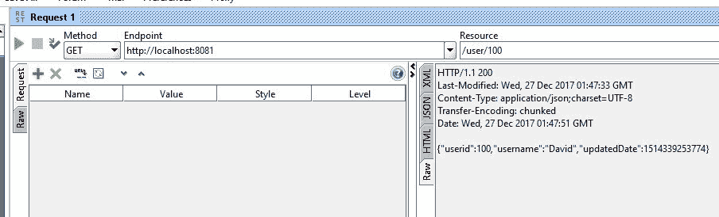
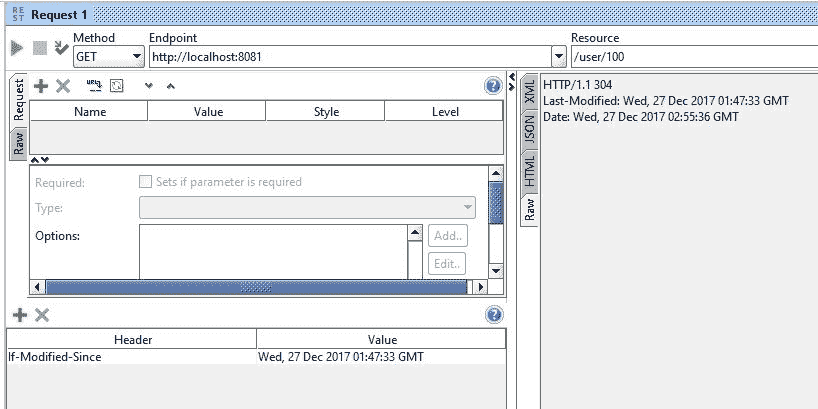
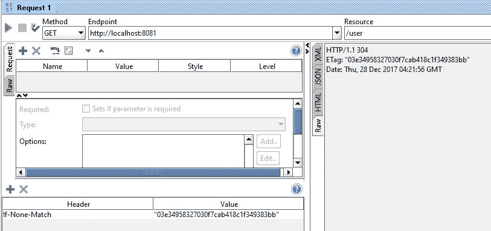

# 第八章：性能

在应用程序中，性能被认为是 RESTful Web 服务的主要标准。本章将主要关注如何改善应用程序的性能并减少响应时间。尽管性能优化技术可以应用在 Web 应用程序的不同层，我们将讨论 RESTful（Web）层。其余的性能优化技术将在[第十一章]（c3ef97e3-fbad-4b9e-b7f8-91c6d3d6c6f0.xhtml）*扩展*中讨论。

本章将讨论以下主题：

+   HTTP 压缩

+   HTTP 缓存和 HTTP 缓存控制

+   在 REST API 中的缓存实现

+   使用 HTTP If-Modified-Since 标头和 ETags

# HTTP 压缩

为了从 REST 服务中快速获取内容，数据可以被压缩并通过 HTTP 等协议发送。在压缩数据时，我们必须遵循一些编码格式，因此接收方将应用相同的格式。

# 内容协商

在请求服务器的资源时，客户端将有许多选项来接收各种表示的内容。例如，DOC/PDF 是数据类型表示。土耳其语或英语是语言表示，服务器可以以特定语言发送资源。服务器和客户端之间必须就资源将以哪种格式访问达成一致，例如语言、数据类型等。这个过程称为**内容协商**。

在这里，我们将讨论两种不同的内容协商机制：服务器驱动和代理驱动机制。在继续讨论这些机制之前，我们将讨论 Accept-Encoding 和 Content-Encoding，因为它们很重要。

# 接受编码

客户端将告诉服务器它可以接收哪种压缩算法。最常见的编码类型是`gzip`和`deflate`。在请求服务器时，客户端将在请求标头中共享编码类型。接受编码将用于此类目的。简而言之，客户端会告诉服务器，“我只接受提到的压缩格式”。

我们将看到以下示例`Accept-Encoding`：

```java
Accept-Encoding: gzip, deflate
```

在前面的标头中，客户端表示它只能接受响应中的`gzip`或`deflate`。

其他可能的选项如下所述：

```java
Accept-Encoding: compress, gzip
Accept-Encoding: 
Accept-Encoding: *
Accept-Encoding: compress;q=0.5, gzip;q=1.0
Accept-Encoding: gzip;q=1.0, identity; q=0.5, *;q=0
```

我们可以看到`compress`值后面跟着`q=0.5`，这意味着质量评级只有`0.5`，与`gzip`评级的`q=1.0`相比，后者非常高。在这种情况下，客户端建议服务器可以使用`gzip`而不是`compress`。但是，如果`gzip`不可行，`compress`对于客户端来说也是可以接受的。

如果服务器不支持客户端请求的压缩算法，服务器应该发送一个带有`406（不可接受）`状态码的错误响应。

# 内容编码

Content-Encoding 是一个实体标头，用于将要从服务器发送到客户端的数据类型进行压缩。Content-Encoding 值告诉客户端在实体主体中使用了哪些编码。它将告诉客户端如何解码数据以检索值。

让我们来看看单个和多个编码选项：

```java
// Single Encoding option
Content-Encoding: gzip
Content-Encoding: compress

// Multiple Encoding options
Content-Encoding: gzip, identity
Content-Encoding: deflate, gzip
```

在前面的配置中，Content-Encoding 提供了单个和多个选项。在这里，服务器告诉客户端它可以提供基于`gzip`和`compress`算法的编码。如果服务器提到了多个编码，这些编码将按照提到的顺序应用。

尽可能压缩数据是非常推荐的。

不建议在运行时更改内容编码。因为这将破坏未来的请求（例如在`GET`上进行`PUT`），在运行时更改内容编码根本不是一个好主意。

# 服务器驱动的内容协商

服务器驱动的内容协商是由服务器端算法执行的，以决定服务器必须发送给客户端的最佳表示。这也被称为主动内容协商。在服务器驱动的协商中，客户端（用户代理）将提供具有质量评级的各种表示选项。服务器中的算法将不得不决定哪种表示对客户端提供的标准最有效。

例如，客户端通过共享媒体类型标准请求资源，带有诸如哪种媒体类型对客户端更好的评级。服务器将完成其余工作并提供最适合客户需求的资源表示。

# 代理驱动的内容协商

代理驱动的内容协商是由客户端算法执行的。当客户端请求特定资源时，服务器将告知客户端有关资源的各种表示，包括内容类型、质量等元数据。然后客户端算法将决定哪种表示最佳，并再次从服务器请求。这也被称为被动内容协商。

# HTTP 缓存

当客户端多次请求相同的资源表示时，从服务器端提供它将是浪费时间并且在 Web 应用程序中会耗时。如果资源被重复使用，而不是与服务器通信，它肯定会提高 Web 应用程序的性能。

缓存将被视为提高我们的 Web 应用性能的主要选项。Web 缓存避免了多次与服务器联系并减少了延迟；因此，应用程序将更快。缓存可以应用在应用程序的不同层面。在本章中，我们将只讨论 HTTP 缓存，这被认为是中间层。我们将在第十一章《扩展》中更深入地讨论其他形式的缓存。

# HTTP 缓存控制

缓存控制是一个指定 Web 缓存操作指令的头字段。这些指令给出了缓存授权，定义了缓存的持续时间等。这些指令定义了行为，通常旨在防止缓存响应。

在这里，我们将讨论 HTTP 缓存指令：`public`，`private`，`no-cache`和`only-if-cached`指令。

# 公共缓存

如果缓存控制允许公共缓存，则资源可以被多个用户缓存。我们可以通过在`Cache-Control`标头中设置`public`选项来实现这一点。在公共缓存中，响应可能会被多个用户缓存，即使是不可缓存或可缓存的，也仅限于非共享缓存：

```java
Cache-Control: public
```

在前面的设置中，`public`表示响应可以被任何缓存缓存。

# 私有缓存

与公共缓存不同，私有响应适用于单个用户缓存，而不适用于共享缓存。在私有缓存中，中间件无法缓存内容：

```java
Cache-Control: private
```

前面的设置表明响应仅适用于单个用户，并且不应被任何其他缓存访问。

此外，我们可以在我们的标题设置中指定内容应该缓存多长时间。这可以通过`max-age`指令选项来实现。

检查以下设置：

```java
Cache-Control: private, max-age=600
```

在前面的设置中，我们提到响应可以以私有模式（仅限单个用户）进行缓存，并且资源被视为新鲜的最长时间。

# 无缓存

对于访问动态资源可能不需要缓存。在这种情况下，我们可以在我们的缓存控制中使用`no-cache`设置来避免客户端缓存：

```java
Cache-Control: no-cache
```

前面的设置将告诉客户端在请求资源时始终检查服务器。

此外，在某些情况下，我们可能需要禁用缓存机制本身。这可以通过在我们的设置中使用`no-store`来实现：

```java
Cache-Control: no-store
```

前面的设置将告诉客户端避免资源缓存，并始终从服务器获取资源。

HTTP/1.0 缓存不会遵循 no-cache 指令，因为它是在 HTTP/1.1 中引入的。

缓存控制只在 HTTP/1.1 中引入。在 HTTP/1.0 中，只使用**Pragma: no-cache**来防止响应被缓存。

# 只有在缓存中有时效的资源时，客户端才会返回缓存的资源，而不是与服务器重新加载或重新验证。

在某些情况下，比如网络连接不佳，客户端可能希望返回缓存的资源，而不是与服务器重新加载或重新验证。为了实现这一点，客户端可以在请求中包含`only-if-cached`指令。如果收到，客户端将获得缓存的条目，否则将以`504`（网关超时）状态响应。

这些缓存控制指令可以覆盖默认的缓存算法。

到目前为止，我们已经讨论了各种缓存控制指令及其解释。以下是缓存请求和缓存响应指令的示例设置。

请求缓存控制指令（标准的`Cache-Control`指令，可以由客户端在 HTTP 请求中使用）如下：

```java
Cache-Control: max-age=<seconds>
Cache-Control: max-stale[=<seconds>]
Cache-Control: min-fresh=<seconds>
Cache-Control: no-cache 
Cache-Control: no-store
Cache-Control: no-transform
Cache-Control: only-if-cached
```

响应缓存控制指令（标准的`Cache-Control`指令，可以由服务器在 HTTP 响应中使用）如下：

```java
Cache-Control: must-revalidate
Cache-Control: no-cache
Cache-Control: no-store
Cache-Control: no-transform
Cache-Control: public
Cache-Control: private
Cache-Control: proxy-revalidate
Cache-Control: max-age=<seconds>
Cache-Control: s-maxage=<seconds>
```

不可能为特定的缓存指定缓存指令。

# 缓存验证

当缓存中有一个新条目可以作为客户端请求时的响应时，它将与原始服务器进行检查，以查看缓存的条目是否仍然可用。这个过程称为**缓存验证**。此外，当用户按下重新加载按钮时，也会触发重新验证。如果缓存的响应包括`Cache-Control: must revalidate`头，则在正常浏览时会触发它。

当资源的时间过期时，它将被验证或重新获取。只有在服务器提供了强验证器或弱验证器时，才会触发缓存验证。

# ETags

ETags 提供了验证缓存响应的机制。ETag 响应头可以用作强验证器。在这种情况下，客户端既不能理解该值，也无法预测其值。当服务器发出响应时，它生成一个隐藏资源状态的令牌：

```java
ETag : ijk564
```

如果响应中包含`ETag`，客户端可以在未来请求的头部中发出`If-None-Match`来验证缓存的资源：

```java
If-None-Match: ijk564
```

服务器将请求头与资源的当前状态进行比较。如果资源状态已更改，服务器将以新资源响应。否则，服务器将返回`304 Not Modified`响应。

# Last-Modified/If-Modified-Since 头

到目前为止，我们已经看到了一个强验证器（ETags）。在这里，我们将讨论一个可以在头部中使用的弱验证器。`Last-Modified`响应头可以用作弱验证器。与生成资源的哈希不同，时间戳将用于检查缓存的响应是否有效。

由于此验证器具有 1 秒的分辨率，与 ETags 相比被认为是弱的。如果响应中存在`Last-Modified`头，则客户端可以发送一个`If-Modified-Since`请求头来验证缓存的资源。

当客户端请求资源时，会提供`If-Modified-Since`头。为了在一个真实的例子中简化机制，客户端请求将类似于这样：“我已经在上午 10 点缓存了资源 XYZ；但是如果自上午 10 点以来它已经改变了，那么获取更新的 XYZ，否则只返回`304`。然后我将使用之前缓存的 XYZ。”

# 缓存实现

到目前为止，我们在本章中已经看到了理论部分。让我们尝试在我们的应用程序中实现这个概念。为了简化缓存实现，我们将只使用用户管理。我们将使用`getUser`（单个用户）REST API 来应用我们的缓存概念。

# REST 资源

在`getUser`方法中，我们将正确的`userid`传递给路径变量，假设客户端将传递`userid`并获取资源。有许多可用的缓存选项可供实现。在这里，我们将仅使用`If-Modified-Since`缓存机制。由于此机制将在标头中传递`If-Modified-Since`值，因此它将被转发到服务器，表示，如果资源在指定时间之后发生更改，请获取新资源，否则返回 null。

有许多实现缓存的方法。由于我们的目标是简化并清晰地传达信息，我们将保持代码简单，而不是在代码中添加复杂性。为了实现这种缓存，我们可能需要在我们的`User`类中添加一个名为`updatedDate`的新变量。让我们在我们的类中添加这个变量。

`updatedDate`变量将用作`If-Modified-Since`缓存的检查变量，因为我们将依赖于用户更新的日期。

客户端将询问服务器用户数据自上次缓存时间以来是否发生了更改。服务器将根据用户的`updatedDate`进行检查，如果未更新则返回 null；否则，它将返回新数据：

```java
  private Date updatedDate;
  public Date getUpdatedDate() {
    return updatedDate;
  }
  public void setUpdatedDate(Date updatedDate) {
    this.updatedDate = updatedDate;
  }
```

在前面的代码中，我们刚刚添加了一个新变量`updatedDate`，并为其添加了适当的 getter 和 setter 方法。稍后我们可能会通过添加 Lombok 库来简化这些 getter 和 setter 方法。我们将在接下来的章节中应用 Lombok。

此外，当我们获取类的实例时，我们需要添加另一个构造函数来初始化`updatedDate`变量。让我们在这里添加构造函数：

```java
public User(Integer userid, String username, Date updatedDate){
    this.userid = userid;
    this.username = username;
    this.updatedDate = updatedDate;
  }
```

如果可能的话，我们可以将`toString`方法更改如下：

```java
  @Override
  public String toString() {
    return "User [userid=" + userid + ", username=" + username + ", updatedDate=" + updatedDate + "]";
  }
```

在添加了所有上述提到的细节之后，我们的类将如下所示：

```java
package com.packtpub.model;
import java.io.Serializable;
import java.util.Date;
public class User implements Serializable {  
  private static final long serialVersionUID = 1L;
  public User() {
  }
  private Integer userid;
  private String username;
  private Date updatedDate;
  public User(Integer userid, String username) {
    this.userid = userid;
    this.username = username;
  }
  public User(Integer userid, String username, Date updatedDate) {
    this.userid = userid;
    this.username = username;
    this.updatedDate = updatedDate;
  }
  public Date getUpdatedDate() {
    return updatedDate;
  }
  public void setUpdatedDate(Date updatedDate) {
    this.updatedDate = updatedDate;
  }
  public Integer getUserid() {
    return userid;
  }
  public void setUserid(Integer userid) {
    this.userid = userid;
  }
  public String getUsername() {
    return username;
  }
  public void setUsername(String username) {
    this.username = username;
  }
  @Override
  public String toString() {
    return "User [userid=" + userid + ", username=" + username + ", updatedDate=" + updatedDate + "]";
  }
}
```

现在，我们将回到之前章节中介绍的`UserController`，并更改`getUser`方法：

```java
@RestController
@RequestMapping("/user")
public class UserController {
    // other methods and variables (hidden)  
    @ResponseBody
    @RequestMapping("/{id}")
    public User getUser(@PathVariable("id") Integer id, WebRequest webRequest){    
        User user = userSevice.getUser(id);
        long updated = user.getUpdatedDate().getTime();    
        boolean isNotModified = webRequest.checkNotModified(updated);    
        logger.info("{getUser} isNotModified : "+isNotModified);    
        if(isNotModified){
          logger.info("{getUser} resource not modified since last call, so exiting");
          return null;
        }    
        logger.info("{getUser} resource modified since last call, so get the updated content");    
        return userSevice.getUser(id);
   }
}
```

在前面的代码中，我们在现有方法中使用了`WebRequest`参数。`WebRequest`对象将用于调用`checkNotModified`方法。首先，我们通过`id`获取用户详细信息，并以毫秒为单位获取`updatedDate`。我们将用户更新日期与客户端标头信息进行比较（我们假设客户端将在标头中传递`If-Not-Modified-Since`）。如果用户更新日期比缓存日期更新，我们假设用户已更新，因此我们将不得不发送新资源。

由于我们在`UserController`中添加了记录器，因此我们可能需要导入`org.apache.log4j.Logger`。否则在编译时会显示错误。

如果用户在客户端缓存日期之后没有更新，它将简单地返回 null。此外，我们已经提供了足够的记录器来打印我们想要的语句。

让我们在 SoapUI 或 Postman 客户端中测试 REST API。当我们第一次调用 API 时，它将返回带有标头信息的数据，如下所示：



SoapUI 客户端

我们可以看到我们正在使用`GET`方法来调用此 API，并且右侧是响应标头。

在我们之前的屏幕截图中，我们使用了端口`8081`。默认情况下，Spring Boot 在端口`8080`上运行。如果要将其更改为`8081`，请在`/src/main/resources/``application.properties`中配置端口如下：

`server.port = 8081`

如果在指定位置下没有`application.properties`，则可以创建一个。

响应（JSON）如下所示：

```java
{
   "userid": 100,
   "username": "David",
   "updatedDate": 1516201175654
}
```

在前面的 JSON 响应中，我们可以看到用户详细信息，包括`updatedDate`。

响应（标头）如下所示：

```java
HTTP/1.1 200 
Last-Modified: Wed, 17 Jan 2018 14:59:35 GMT
ETag: "06acb280fd1c0435ac4ddcc6de0aeeee7"
Content-Type: application/json;charset=UTF-8
Content-Length: 61
Date: Wed, 17 Jan 2018 14:59:59 GMT

{"userid":100,"username":"David","updatedDate":1516201175654}
```

在前面的响应标头中，我们可以看到 HTTP 结果`200`（表示 OK）和`Last-Modified`日期。

现在，我们将在标头中添加`If-Modified-Since`，并更新我们从先前响应中获取的最新日期。我们可以在以下屏幕截图中检查`If-Modified-Since`参数：



在上述配置中，我们在标头部分添加了`If-Modified-Since`参数，并再次调用相同的 REST API。代码将检查资源是否自上次缓存日期以来已更新。在我们的情况下，资源没有更新，因此响应中将简单返回`304`。我们可以看到响应如下：

```java
HTTP/1.1 304 
Last-Modified: Wed, 17 Jan 2018 14:59:35 GMT
Date: Wed, 17 Jan 2018 15:05:29 GMT
```

HTTP `304`（未修改）响应只是向客户端传达资源未修改，因此客户端可以使用现有缓存。

如果我们通过调用更新 REST API（使用`PUT`的`http://localhost:8081/user/100`）更新指定的用户，然后再次调用先前的 API（使用`GET`的`http://localhost:8081/user/100`），我们将获得新的资源，因为用户在客户端缓存之后已更新。

# 使用 ETags 进行缓存

在上一节中，我们探讨了基于更新日期的缓存。然而，当我们需要检查更新的资源时，我们可能并不总是需要依赖更新日期。还有另一种机制，称为 ETag 缓存，它提供了一个强验证器，用于检查资源是否已更新。ETag 缓存将是检查更新日期的常规缓存的完美替代品。

在 ETag 缓存中，响应标头将为主体提供哈希 ID（MD5）。如果资源已更新，标头将在 REST API 调用时生成新的哈希 ID。因此，我们无需像在上一节中那样显式检查信息。

Spring 提供了一个名为`ShallowEtagHeaderFilter`的过滤器来支持 ETag 缓存。让我们尝试在我们现有的应用程序中添加`ShallowEtagHeaderFilter`。我们将在我们的主应用程序文件（`TicketManagementApplication`）中添加代码：

```java
  @Bean
  public Filter shallowEtagHeaderFilter() {
    return new ShallowEtagHeaderFilter();
  }
  @Bean
  public FilterRegistrationBean shallowEtagHeaderFilterRegistration() {
    FilterRegistrationBean result = new FilterRegistrationBean();
    result.setFilter(this.shallowEtagHeaderFilter());
    result.addUrlPatterns("/user/*");
    result.setName("shallowEtagHeaderFilter");
    result.setOrder(1);
    return result;
  }
```

在上述代码中，我们将`ShallowEtagHeaderFilter`作为一个 bean 添加，并通过提供我们的 URL 模式和名称进行注册。因为我们目前只测试用户资源，所以我们将在我们的模式中添加`/user/*`。最后，我们的主应用程序类将如下所示：

```java
package com.packtpub.restapp.ticketmanagement;
import javax.servlet.Filter;
import org.springframework.boot.SpringApplication;
import org.springframework.boot.autoconfigure.SpringBootApplication;
import org.springframework.boot.web.servlet.FilterRegistrationBean;
import org.springframework.context.annotation.Bean;
import org.springframework.context.annotation.ComponentScan;
import org.springframework.context.annotation.ImportResource;
import org.springframework.web.filter.ShallowEtagHeaderFilter;
@ComponentScan("com.packtpub")
@SpringBootApplication
public class TicketManagementApplication {
  public static void main(String[] args) {
    SpringApplication.run(TicketManagementApplication.class, args);
  }
  @Bean
  public Filter shallowEtagHeaderFilter() {
    return new ShallowEtagHeaderFilter();
  }
  @Bean
  public FilterRegistrationBean shallowEtagHeaderFilterRegistration() {
    FilterRegistrationBean result = new FilterRegistrationBean();
    result.setFilter(this.shallowEtagHeaderFilter());
    result.addUrlPatterns("/user/*");
    result.setName("shallowEtagHeaderFilter");
    result.setOrder(1);
    return result;
  }
}
```

我们可以通过调用用户 API（`http://localhost:8081/user`）来测试这种 ETag 机制。当我们调用此 API 时，服务器将返回以下标头：

```java
HTTP/1.1 200 
ETag: "02a4bc8613aefc333de37c72bfd5e392a"
Content-Type: application/json;charset=UTF-8
Content-Length: 186
Date: Wed, 17 Jan 2018 15:11:45 GMT 
```

我们可以看到`ETag`已添加到我们的标头中，带有哈希 ID。现在我们将使用`If-None-Match`标头和哈希值调用相同的 API。我们将在以下截图中看到标头：



当我们再次使用`If-None-Match`标头和先前哈希 ID 的值调用相同的 API 时，服务器将返回`304`状态，我们可以如下所示地看到：

```java
HTTP/1.1 304 
ETag: "02a4bc8613aefc333de37c72bfd5e392a"
Date: Wed, 17 Jan 2018 15:12:24 GMT 
```

在这种机制中，实际的响应主体将不会被发送到客户端。相反，它会告诉客户端资源未被修改，因此客户端可以使用先前缓存的内容。`304`状态表示资源未被缓存。

# 总结

在这一章中，我们已经学习了 HTTP 优化方法，以提高应用程序的性能。通过减少客户端和服务器之间的交互以及通过 HTTP 传输的数据大小，我们将在 REST API 服务中实现最大性能。在第十一章中，我们将探讨其他优化、缓存和扩展技术，*扩展*，因为我们将讨论与 Web 服务性能相关的更高级的主题。
