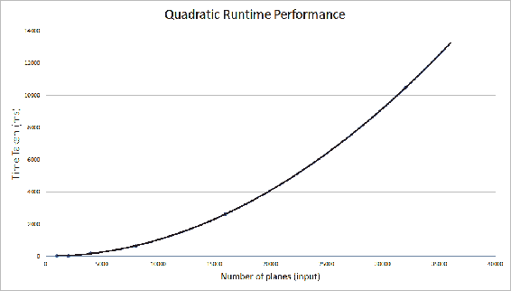
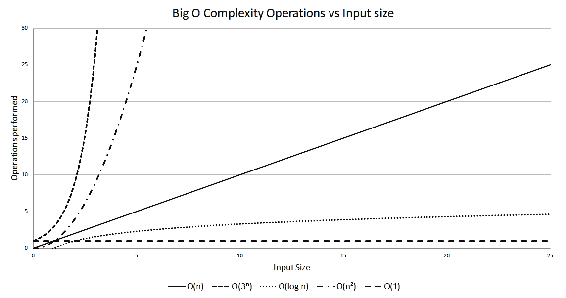
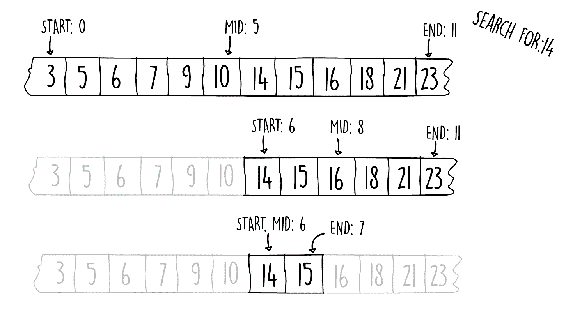

# 第一章：算法和复杂度

算法是一组执行特定任务的逻辑指令。如今，算法无处不在。作为一名软件开发者，理解算法和数据结构的核心原则将使你能够在如何解决特定问题方面做出明智的决定。这无论你是在银行编写会计软件还是在进行医学研究数据挖掘、遗传编码都是适用的。当存在多个问题的解决方案时，我们如何确定使用哪种算法？在本章中，我们将探讨不同类型的算法，并讨论每种算法的性能差异。我们将讨论什么使一个算法比另一个更高效，以及如何表达每个算法的复杂性。

算法的常见例子包括调节街道拥堵的交通信号灯、智能手机上的面部识别软件、推荐技术等等。

你需要理解的是，算法只是用于解决定义良好问题的应用程序的一个小部分。例如，对数字列表进行排序、找到最短路径或单词预测都是正确的。大型软件应用程序，如电子邮件客户端或操作系统，是不恰当的例子。

到本章结束时，你将能够：

+   用示例定义一个算法

+   测量算法复杂度

+   识别具有不同复杂度的算法

+   评估具有不同运行时复杂度的各种示例

# 开发我们的第一个算法

算法可以被视为一个路线图或一组完成定义良好任务的指令。在本节中，我们将构建一个这样的算法的简单示例，以帮助我们开始。

# 将二进制数转换为十进制的算法

数制有不同的基数。十进制数是我们大多数人熟悉的。然而，计算机只使用一和零（二进制）。让我们尝试编写一些将二进制数转换为十进制的代码。

具体来说，我们想要开发一个算法，该算法接受包含一和零的字符串，并返回一个整数。

我们可以通过以下步骤转换二进制字符串：

1.  从字符串的末尾开始，一次处理一个字符。二进制字符串中每个数字的位置对应于序列中的一个十进制数。

1.  要生成这个序列，你从一开始，每次乘以二，所以一、二、四、八，以此类推（参见*表 1.1*的*转换序列*行）。更正式地说，这个序列是一个以一为起点，以二为公比的几何级数。

1.  然后，我们将二进制字符串作为掩码应用于这个序列（参见*表 1.1*的*二进制字符串（掩码）*行）。

1.  结果是一个新序列，其中只保留二进制字符串中相应位置值为一的值（参见*表 1.1*的*结果*行）。

1.  应用掩码后，我们只需将得到的数字相加。

| **转换序列** | 16 | 8 | 4 | 2 | 1 |
| --- | --- | --- | --- | --- | --- |
| **二进制字符串（掩码）** | 1 | 0 | 1 | 1 | 0 |
| **结果** | 16 | 0 | 4 | 2 | 0 |

表 1.1：二进制到十进制的掩码

在前面的例子（*表 1.1*）中，得到的总数是**22**。这是我们对应于二进制数 10110 的十进制数。

为了设计我们的算法，重要的是要意识到我们不需要存储整个转换序列。由于我们一次处理一个二进制位（从后向前），我们只需要使用我们正在处理的二进制位置的转换数字。

*片段 1.1* 展示了我们可以如何做到这一点。我们使用一个单一的转换变量而不是一个序列，并将此变量初始化为 1。然后我们使用一个循环从二进制字符串的末尾开始迭代其长度。在迭代过程中，如果当前位置的数字是 1，我们将当前的转换变量添加到最终结果中。然后我们简单地双倍当前的转换变量并重复。代码片段如下：

```java
public int convertToDecimal(String binary) {
  int conversion = 1;
  int result = 0;
  for (int i = 1; i <= binary.length(); i++) {
    if (binary.charAt(binary.length() - i) == '1')
      result += conversion;
    conversion *= 2;
  }
  return result;
} 
```

片段 1.1：二进制到十进制。源类名：BinaryToDecimal。

前往 [`goo.gl/rETLfq`](https://goo.gl/rETLfq) 访问代码。

# 活动：编写将八进制数转换为十进制数的算法

**场景**

在航空领域，飞机的应答器会发送一个代码，以便它们可以相互识别。这个代码使用八进制系统，这是一种基数为 8 的数制。我们被要求编写一个将八进制数字转换为十进制的方法。例如，八进制数字 17 在十进制系统中表示为 15。

**目标**

能够将上一节中显示的算法修改为用于不同的场景。

**先决条件**

+   确保您在以下路径上有可用的类：

[`github.com/TrainingByPackt/Data-Structures-and-Algorithms-in-Java/blob/master/src/main/java/com/packt/datastructuresandalg/lesson1/activity/octaltodecimal/OctalToDecimal.java`](https://github.com/TrainingByPackt/Data-Structures-and-Algorithms-in-Java/blob/master/src/main/java/com/packt/datastructuresandalg/lesson1/activity/octaltodecimal/OctalToDecimal.java)

+   您将找到以下需要实现的方法：

```java
 public int convertToDecimal (String octal) 
```

+   如果您已经设置了项目，您可以通过运行以下命令来运行此活动的单元测试：

```java
gradlew test --tests com.packt.datastructuresandalg.
lesson1.activity.octaltodecimal* 
```

**完成步骤**

1.  在前面的片段 1.1 中显示的算法可以修改为与八进制数而不是二进制数一起工作。

1.  将基数从二改为八。这可以通过更改片段 1.1 中的转换乘数变量来实现。

1.  将正在处理的数字解析为整数。然后，这个整数可以乘以转换变量或幂函数的结果。

在本节中，我们通过一个简单的示例介绍了算法的概念。需要注意的是，对于每个问题，都存在多种解决方案。选择正确的算法来解决你的问题将取决于几个指标，例如性能和内存需求。

# 使用大 O 符号衡量算法复杂度

算法复杂度是一种描述算法效率的方式，它是其输入的关系。它可以用来描述我们代码的各种属性，如运行速度或内存需求。它也是程序员应该理解以编写高效软件的重要工具。在本节中，我们将首先描述一个场景，介绍本节，然后深入探讨各种复杂类型及其不同测量技术的细节。

# 复杂度示例

假设我们被分配了一个编写用于空中交通控制的软件的任务。具体来说，我们被要求编写一个算法，在预定义的空间和高度内，如果任何两架飞机彼此过于接近，则发出警报。

在我们的实现中，我们通过计算我们空域中每一对之间的所有可能距离，并仅保留最小距离来解决该问题。如果这个最小距离小于某个特定阈值，我们的软件将发出警报。以下代码片段展示了这个解决方案：

```java
public double minimumDistance(List<Point> allPlanes) {
  double minDistance = Double.MAX_VALUE;
  for (Point p1 : allPlanes) {
    for (Point p2 : allPlanes) {
      double d = p1.distanceTo(p2);
      if (d != 0 && d < minDistance) minDistance = d;
    }
  }
  return minDistance;
} 
```

代码片段 1.2：最小距离。源类名：ClosestPlane 和 Point。

注意，前一段代码中的`Point`类没有显示。请访问[`goo.gl/iDHD5J`](https://goo.gl/iDHD5J)以获取代码。

我们的小算法在几年内运行良好，控制器们对这种有用的警报功能感到满意。然而，随着时间的推移，空中交通量以很快的速度增长，我们不再需要监控几百架飞机，我们的算法必须处理成千上万的点。在繁忙时段，软件难以跟上增加的负载。

我们被召集来调查，并开始编写一些基准测试来测试算法的性能。我们获得了*表 1.2*中所示的计时结果。正如你所见，我们在每次运行中都加倍了负载；然而，我们的算法并没有以同样的方式扩展。我们的算法没有以与输入相同的速率减慢。

直观地讲，你可能期望如果你加倍飞机的数量，算法的工作量也将加倍，因此它应该需要两倍的时间。然而，情况并非如此。

当我们将飞机数量加倍时，所需的时间不仅仅是加倍，而是急剧上升。

例如，当我们的算法处理 16,000 架飞机时，它需要 2.6 秒（2,647 毫秒）来完成。然而，如果我们把飞机的数量加倍到 32,000，所需的时间增加到 10.4 秒（10,488 毫秒），增加了四倍！

| **飞机数量** | **耗时（毫秒）** |
| --- | --- |
| 1000 | 27 |
| 2000 | 48 |
| 4000 | 190 |
| 8000 | 664 |
| 16000 | 2647 |
| 32000 | 10488 |

在下面的图表中，我们以图表的形式展示了基准测试结果。这里发生了什么？由于嵌套循环，我们的算法做了大量工作。对于输入中的每一个平面点，它都会计算到其他每个平面的距离。这导致了 *n²* 次计算，其中 *n* 是我们监控的平面数量。我们可以说，我们的算法具有 *O(n²)* 的运行性能，读作 <q class="pcalibre5 pcalibre4 calibre33">大 O 的平方</q>。或者，我们也可以称之为二次运行性能。看看这个图表：



图 1.1：算法基准测试结果图

列在 *片段 1.2* 中的算法是解决最近对问题的一个慢速解决方案。存在一个更高效的解决方案，它涉及分而治之的技术。

本书第二部分详细探讨了这类算法，在 第四章，*算法设计范式* 中，我们提出了一个解决最近对问题的更快解决方案。

增加代码的输入负载并不总是意味着资源消耗会以直接成比例的方式增加。本节讨论的是问题的输入大小与资源使用（CPU 时间、内存等）之间的关系。

在下一节中，我们将看到不同类型的问题、输入大小和资源使用之间的关系。

# 理解复杂性

为了更好地理解算法复杂度，我们可以使用一个类比。想象一下，我们将不同类型的算法设置在赛道上相互竞争，但是有一个小小的转折：赛道上没有终点线。

由于比赛是无限的，比赛的目标是在一段时间内超越其他较慢的对手，而不是首先完成。在这个类比中，赛道距离是我们的算法输入。经过一段时间后，我们从起点出发的距离代表了我们的代码完成的工作量。

回想一下上一节中测量最近一对平面的二次方法。在我们的虚构比赛中，二次算法开始时相当快，能够在开始减速之前移动相当的距离，类似于一个开始感到疲劳并减速的跑步者。它离起跑线越远，速度越慢，尽管它从未停止移动。

不仅算法在比赛中以不同的速度前进，它们的移动方式也各不相同。我们已经提到，*O(n²)* 解决方案在比赛中会减速。这与其他算法相比如何？

在我们想象的比赛中，还有另一种类型的参赛者，那就是线性算法。线性算法用 *O(n)* 的符号来描述。它们在赛道上的速度是恒定的。把它们想象成一辆老而可靠的汽车，以固定的速度行驶。

在现实生活中，具有 *O(n)* 运行时间复杂度的解决方案，其运行性能与输入大小成正比。

这意味着，例如，如果你将线性算法的输入规模加倍，该算法完成所需的时间也会大约加倍。

每个算法的效率总是从长远来看进行评估的。给定足够大的输入，线性算法总是会比二次算法表现得更好。

我们可以比 *O(n)* 快得多。想象一下，我们的算法在轨道上不断加速，而不是持续移动。这与二次运行时间相反。给定足够的距离，这些解决方案可以变得非常快。我们说这类算法具有对数复杂度，表示为 *O(log n)*。

在现实生活中，这意味着算法在输入规模增加时不会慢很多。同样，如果算法在开始时对于小输入比线性算法慢，那也没有关系，因为对于足够大的输入，对数解决方案总是会优于线性解决方案。

我们能更快吗？结果证明，还有一种算法的复杂度类别表现得更好。

想象一下，在我们的比赛中有一个跑者，他有能力在恒定的时间内将任何位置传送到我们无限长的轨道上。即使传感能够花费很长时间，只要它是恒定的，并且不依赖于行进距离，这种类型的跑者总是会击败其他任何跑者。无论传感能够花费多长时间，只要给定足够的距离，算法总是会第一个到达那里。这就是所谓的常数运行时间复杂度，表示为 *O(1)*。属于这个复杂度类别的解决方案将具有与输入大小无关的运行时间。

在另一端，我们可以找到比二次算法慢得多的算法。例如，立方复杂度 *O(n³)* 或四次复杂度 *O(n⁴)*。到目前为止提到的所有这些复杂度都被认为是多项式复杂度。

多项式是一个用于表达式的数学术语。例如，*3x⁵ + 2x³ + 6*、*2x – 3*，甚至仅仅是 5，都是很好的例子。关键在于多项式的复杂度形式为 *O(n^k)*，其中 *k* 是一个正的、非分数的常数。

并非所有解决方案都具有多项式时间行为。一类特定的算法在输入规模与运行时间性能成比例增长时表现非常糟糕，其运行时间为 *O(k^n)*。在这个类别中，效率随着输入规模的增加呈指数级下降。所有其他类型的多项式算法将很快超越任何指数算法。*图 1.2* 展示了这种类型的行为与之前提到的多项式算法的比较。

下面的图表也显示了指数算法随着输入规模的增加而退化的速度：



图 1.2：不同算法的运算次数与输入大小的关系

对数算法相对于二次算法快多少？让我们尝试选择一个特定的例子。一个特定的算法大约执行两次操作来解决一个问题；然而，它与输入的关系是 *O(n²)*。

假设每个操作都是一个慢操作（例如文件访问），并且具有大约 0.25 毫秒的恒定时间，执行这些操作所需的时间将如 *表 1.3* 所示。我们通过 *时间 = 0.25 * 操作数 * n²* 来计算时间，其中操作数是执行的操作次数（在这个例子中等于 2），*n* 是输入大小，*0.25* 是每次操作的时间：

| **输入大小 (n)** | **时间：2 次操作 O(n²)** | **时间：400 次操作 O(log n)** |
| --- | --- | --- |
| 10 | 50 毫秒 | 100 毫秒 |
| 100 | 5 秒 | 200 毫秒 |
| 1000 | 8.3 分钟 | 300 毫秒 |
| 10000 | 13.8 小时 | 400 毫秒 |

表 1.3：运行速度有多快？

我们的对数算法大约执行 400 次操作；然而，它与输入大小的关系是对数级的。尽管这个算法在较小的输入上较慢，但它很快就会超过二次算法。你可以注意到，对于足够大的输入，性能差异是巨大的。在这种情况下，我们使用 *时间 = 0.25 * 操作数 * log n* 来计算时间，其中 *操作数 = 400*。

# 活动内容：使用指数算法开发时间表

**场景**

我们被要求使用输入大小为 2、10、30 和 50 的指数算法开发一个时间表。假设操作时间为 0.5 毫秒，并且算法只执行一个操作。

**目标**

为了发现指数算法的规模如何变得糟糕。

**完成步骤**

1.  0.5 x 2² = 2 毫秒

1.  0.5 x 2¹⁰ = 512 毫秒

1.  0.5 x 2³⁰ = 0.536 亿毫秒 = 6.2 天

1.  0.5 x 2⁵⁰ = 5.629 和 10¹⁴毫秒 = 17838 年

**输出**

结果可能如下：

| **输入大小 (n)** | **时间：1 次操作 O(2^n)** |
| --- | --- |
| 2 | 2 毫秒 |
| 10 | 512 毫秒 |
| 30 | 6.2 天 |
| 50 | 17838 年 |

表 1.4：O(2^n)算法的时间表

在本节中，我们比较了不同类型的算法运行时间复杂度。我们看到了每种算法是如何与其他算法相比的，从理论上的最快*O(1)*到一些最慢的*O(k^n)*。理解理论与实践之间的差异也很重要。例如，在现实生活中，如果执行的操作较少，输入是固定大小且较小，二次算法可能比线性算法表现更好。

# 复杂度符号

在上一节中，我们看到了如何使用大 O 符号来衡量算法的运行性能，与输入大小的比例。我们既没有详细检查*O(n)*究竟意味着什么，也没有考虑算法相对于给定输入类型的性能。

考虑以下代码片段。该方法接受一个包含字符串的数组并搜索匹配项。如果找到匹配项，则返回数组的索引。我们将使用这个例子来尝试测量运行时间复杂度。代码如下：

```java
public int search(String strToMatch, String[] strArray) {
  for (int i = 0; i < strArray.length; i++) {
    if (strArray[i].equals(strToMatch)) {
      return i;
    }
  }
  return -1;
} 
```

Snippet 1.3：数组搜索。源类名：ArraySearch。

前往[`goo.gl/egw1Sn`](https://goo.gl/egw1Sn)访问代码。

在循环内部发生了很多操作。最明显的操作是在`i`位置访问数组和字符串`equals`。然而，我们还有`i`的递增、将新的递增值赋给`i`以及比较`i`是否小于数组长度的操作。但是，这并不是故事的结束。`equals()`方法还在将字符串的每个字符与数组中`i`位置的元素进行匹配。

下表列出了所有这些操作：

| **操作名称** | **代码** | **计数** |
| --- | --- | --- |
| 数组访问 | `strArray[i]` | 1 |
| 字符串相等 | `.equals(strToMatch)` | 字符串长度 |
| 数组指针递增和赋值 | `i = i + 1` | 2 |
| 读取数组长度并与指针比较 | `i < strArray.length` | 2 |

表 1.5：ArraySearch 方法对每个项执行的操作

我们看到，对于搜索数组中每个处理的项，我们执行*5 + m*次操作，其中*m*是搜索字符串的长度。接下来要考虑的方面是如何确定我们执行这些操作的频率。执行*表 1.5*中提到的操作次数不仅依赖于输入的长度，还取决于我们在输入数组中找到匹配项的速度，也就是说，它取决于实际数组的实际内容。

算法最好的情况是输入导致算法以尽可能高效的方式进行操作。最坏的情况则相反，即特定输入使它以尽可能低效的方式进行操作。

如果我们很幸运，要搜索的项位于搜索数组的第一个元素，我们只需执行*5 + m*次操作。这是最佳情况，也是搜索可以计算的最快方式。

这个算法的最坏情况是当我们的项目在数组的末尾，或者当项目根本找不到。这两种情况都会让我们检查数组的全部内容。在最坏的情况下，我们最终执行 *n(5 + m)* 次操作，其中 *n* 是数组大小。

在这个例子中，我们可以说，我们算法的最坏情况运行时间复杂度是 *O(mn)*，而我们的最佳情况，当我们的算法立即找到匹配项时，是 *O(m)*。我们将在以下子节中看到，我们是如何从 *5 + m* 和 *n(5 + m)* 得到这个结果的。

另一种常用的算法分析是平均情况性能。平均情况复杂度可以通过对所有可能的输入的平均性能来找到。这在某些情况下是有用的，因为最坏情况发生的可能性很低。

虽然我们有最佳、平均和最坏情况复杂度，但在测量和比较不同算法时，通常最常用的是最坏情况。除了运行时性能外，大 O 符号的最常见用途是测量内存需求。然而，它可以用于任何资源，例如磁盘空间或网络使用。

# 在检查数组中的重复项时，识别算法的最佳和最坏性能

我们希望通过考虑最佳和最坏情况性能来确定检查数组中重复项的算法的复杂度。找出 *Snippet 1.4* 中最坏和最佳情况下的操作次数。不需要计算出大 O 符号中的算法复杂度。假设内部循环每次执行都会产生八次操作。

对于外部循环，假设四个操作：

```java
public boolean containsDuplicates(int[] numbers) {
  for (int i=0; i<numbers.length; i++) {
    for (int j=0; j<numbers.length; j++) {
      if (i != j && numbers[i] == numbers[j]) return true;
    }
  }
  return false;
}  
```

Snippet 1.4：检查重复项。源类名：Duplicates。

前往 [`goo.gl/wEUqYk`](https://goo.gl/wEUqYk) 访问代码。

要做到这一点，我们应该执行以下步骤：

1.  在最坏的情况下，我们执行内部循环 *n* 次（数组长度）。

1.  在最佳情况下，我们只执行内部循环两次。

1.  最佳情况是重复数字在输入数组的开头。最坏的情况是数组不包含任何重复项。

1.  最坏的情况是数组不包含重复项且大小为 *n*：

    +   对于外部循环，我们有 *4*n* 次操作

    +   对于内部循环，我们有 *n*(n*8)* 次操作

    +   总共，我们有 *4n + 8n²* 次操作

1.  在最佳情况下，重复项是数组的头两个项目：

    +   对于外部循环，我们有 *4* 次操作

    +   对于内部循环，我们有 *2*8* 次操作，因为内部循环执行两次才能到达数组中的第二个项目，即重复项所在的位置

    +   总共，我们有 20 次操作

我们已经看到了如何分析算法中执行的操作的数量，以及如何使用大 O 符号来描述最佳和最坏情况。我们还讨论了如何使用该符号来描述任何资源的使用。在下一节中，我们将描述在使用符号时使用的一些基本规则。

**符号规则**

当我们想要用大 O 符号表示一个算法时，有两个简单的规则需要遵循。在本节中，我们将了解如何将表达式从 *4n + 8n²* 转换为大 O 符号的等价形式。

遵循的第一个规则是丢弃任何常数。

例如，*3n + 4* 变为 *n*，单个常数如 *5* 变为 *1*。如果一个算法只有 *4* 个不依赖于输入的常数指令，我们说该算法是 *O(1)*，也称为**常数时间复杂度**。

第二个规则是丢弃除了最高阶之外的所有内容。

要理解我们为什么采用第二个规则，重要的是要意识到对于足够大的 *n*，除了最高阶之外的所有内容都变得无关紧要。当我们有足够大的输入时，性能差异是可以忽略不计的。

考虑一个执行 *n + n² + n³* 的算法。这个算法的最高阶变量是 *n³* 部分。如果我们保留最高阶，我们最终得到的大 O 运行时复杂度为 *O(n³)*。

# 活动：将表达式转换为大 O 符号

**场景**

要将表达式 *3mn + 5mn⁴ + 2n² + 6* 转换为大 O 符号，首先我们从表达式中删除任何常数，留下 *mn + mn⁴ + n²*。然后，我们只需保留最高阶部分，这导致结果为 *O(mn⁴)*。

对于在 *表 1.6* 中找到的每个表达式，找到其大 O 符号的等价形式：

| **表达式** | *3mn* | *5n + 44n² + 4* | *4 + 5 log n* | *3^n + 5n² + 8* |
| --- | --- | --- | --- | --- |

表 1.6：找到大 O 等价

**目标**

应用符号规则将表达式转换为大 O 符号。

**完成步骤**

1.  识别并删除表达式中的常数：

    +   *3mn → 无常数 → 3mn*

    +   *5n + 44n² + 4 → 4 → 5n + 44n²*

    +   *4 + 5 log n → 4 → 5 log n*

    +   *3^n + 5n² + 8 → 8 → 3^n + 5n²*

1.  丢弃除了最高阶部分之外的所有内容：

    +   *3mn → O(mn)*

    +   *5n + 44n² → O(n²)*

    +   *5 log n → O(log n)*

    +   *3^n + 5n² → O(3^n)*

**输出**

结果可能如下：

| **表达式** | *3mn* | *5n + 44n² + 4* | *4 + 5 log n* | *3^n + 5n² + 8* |
| --- | --- | --- | --- | --- |
| **解决方案** | *O(mn)* | *O(n²)* | *O(log n)* | *O(3^n)* |

表 1.7：找到大 O 等价活动的解决方案

在本节中，我们探讨了用于将表达式转换为大 O 符号的两个简单规则。我们还学习了为什么我们只保留表达式的最高阶。在下一节中，我们将看到一些具有不同复杂度的算法的示例。

# 识别具有不同复杂度的算法

在本节中，我们将探讨不同复杂度的示例。这很重要，这样我们就可以学会识别属于不同复杂度类的算法，并可能尝试提高每个算法的性能。

确定某些算法的最坏情况复杂度可能相当困难。有时，这需要一些经验，并且最好是通过查看许多示例并熟悉不同类型的算法来学习。

# 线性复杂度

线性算法是那些工作量与输入大小成正比的算法，也就是说，如果你加倍输入大小，你也会加倍工作量。这些通常涉及对输入的单次遍历。

本例中提出的问题是计算字符串中特定字符的出现次数。想象一下，我们被给出了字符串“Sally sells sea shells on the seashore”，我们想找出字母*a*出现的次数。

*片段 1.5*中的以下代码遍历输入字符串中的每个字符，如果当前位置的字符与搜索字母匹配，则计数器增加。循环结束时，返回最终计数。代码如下：

```java
public int countChars(char c, String str) {
  int count = 0;
  for (int i = 0; i < str.length(); i++) {
    if (str.charAt(i) == c) count++;
  }
  return count;
} 
```

片段 1.5：计算字符串中的字符数。源类名：CountChars。

访问[`goo.gl/M4Vy7Y`](https://goo.gl/M4Vy7Y)以获取代码。

线性复杂度算法是最常见的算法类型。这些通常对输入进行单次遍历，因此与输入大小成比例。在本节中，我们已经看到了这样一个例子。

该算法是线性的，因为其运行时间与字符串长度成正比。如果我们取字符串长度为*n*，则此 Java 方法的运行时间复杂度为*O(n)*。注意，根据输入大小变化的单个循环。这非常典型于线性运行时间复杂度算法，其中对每个输入单元执行固定数量的操作。在这个例子中，输入单元是字符串中的每个字符。

# 二次复杂度

二次复杂度算法对于大输入大小来说性能不佳。随着我们增加输入大小，工作量按照二次比例增加。我们在*片段 1.2*中的最小距离解决方案中已经看到了一个*O(n²)*的例子。还有很多其他例子，比如冒泡排序和选择排序。本例中提出的问题是找出包含在两个数组中的公共元素（假设每个数组中都不存在重复值），产生两个输入的交集。这导致运行时间复杂度为*O(mn)*，其中*m*和*n*是第一个和第二个输入数组的大小。如果输入数组的大小与*n*个元素相同，这将导致运行时间为*O(n²)*。这可以通过以下代码来证明：

```java
public List<Integer> intersection(int[] a, int[] b) {
  List<Integer> result = new ArrayList<>(a.length);
  for (int x : a) {
    for (int y : b) {
      if (x == y) result.add(x);
    }
  }
  return result;
} 
```

片段 1.6：两个数组之间的交集。源类名：SimpleIntersection。

前往 [`goo.gl/uHuP5B`](https://goo.gl/uHuP5B) 访问代码。存在一个更有效的交集问题实现。这涉及到首先对数组进行排序，从而实现总体运行时间为 *O(n log n)*。

在计算空间复杂度时，应该忽略输入参数所占用的内存。只有算法内部分配的内存才需要考虑。

我们使用的内存量由我们方法中列出的结果大小决定。这个列表越大，我们使用的内存就越多。

最佳情况是我们使用最少的内存。这是当列表为空时，即当我们两个数组之间没有共同元素时。因此，当没有交集时，这种方法的空间复杂度最佳情况为 *O(1)*。

最坏情况正好相反，当我们两个数组中都有所有元素时。当数组相等时，这种情况可能发生，尽管数字可能顺序不同。在这种情况下，内存大小等于我们输入数组的大小。简而言之，该方法的最坏空间复杂度为 *O(n)*。

在本节中，我们展示了二次算法的示例。还有许多其他示例。在下一章中，我们还将描述一个性能较差的排序算法，其复杂度为 *O(n²)*，称为 **冒泡排序**。

# 对数复杂度

对数复杂度算法非常快，并且随着问题规模的增加，它们的性能几乎不会下降。这些类型的算法扩展性非常好。具有 *O(log n)* 时间复杂度的代码通常很容易识别，因为它会系统地分几个步骤来划分输入。在对数时间内运行的常见示例包括数据库索引和二叉树。如果我们想在列表中查找一个项目，如果输入列表按某种特定顺序排序，我们可以更有效地完成这项任务。然后我们可以通过跳到列表的特定位置并跳过一定数量的元素来使用这种排序。

*片段 1.7* 展示了 Java 中二分搜索的实现。该方法使用三个数组指针——开始、结束和中点。算法首先检查数组中的中间元素。如果元素未找到且小于中间的值，我们选择在下半部分进行搜索；否则，我们选择上半部分。*图 1.3* 展示了进行二分搜索时涉及的步骤。代码片段如下：

```java
public boolean binarySearch(int x, int[] sortedNumbers) {
  int end = sortedNumbers.length - 1; 
  int start = 0;
  while (start <= end) {
    int mid = (end - start) / 2 + start;
    if (sortedNumbers[mid] == x) return true;
    else if (sortedNumbers[mid] > x) end = mid - 1;
    else start = mid + 1;
  }
  return false;
} 
```

片段 1.7：二分搜索。源类名：BinarySearch。

前往 [`goo.gl/R9e31d`](https://goo.gl/R9e31d) 访问代码。

看一下以下图表：



图 1.3：二分搜索步骤

假设最坏情况，如果我们的二分搜索算法需要 95 次数组跳跃（如 *图 1.3* 所示），输入大小需要有多大？由于这是一个二分搜索，我们正在将搜索空间分成两半，因此我们应该使用以 2 为底的对数。

此外，对数的倒数是指数。因此，我们可以得出以下结论：

+   *log[2] n = 95*

+   *2⁹⁵ = n*

+   *39614081257132168796771975168 = n*

记录在案，*2⁹⁵*远远大于宇宙中的秒数。这个例子展示了这类算法的扩展性有多好。即使对于巨大的输入，执行步骤的数量仍然非常小。

对数算法与指数算法相反。随着输入值的增大，性能退化的速率会减小。这是一个非常理想化的特性，因为它意味着我们的问题可以扩展到非常大的规模，而几乎不会影响我们的性能。在本节中，我们给出了这类复杂度的一个例子。

# 指数复杂度

如我们之前所见，具有指数运行时间复杂度的算法扩展性非常差。对于许多问题，只知道*O(k^n)*的解决方案。在计算机科学中，改进这些算法是一个非常活跃的研究领域。这些例子包括旅行商问题和使用暴力破解方法破解密码。现在，让我们来看一个这样的问题示例。

一个质数只能被自身和 1 整除。我们在这里提出的例子问题被称为**质因数分解问题**。结果是，如果你有一组正确的质数，你可以通过将它们全部相乘来创建任何其他可能的数字。问题是要找出这些质数。更具体地说，给定一个整数输入，找出所有是输入的因数的质数（这些质数相乘给出输入）。

许多当前的加密技术依赖于这样一个事实：对于质因数分解，没有已知的多项式时间算法。然而，没有人证明过不存在这样的算法。因此，如果发现一种快速找到质因数的方法，许多当前的加密策略将需要重新设计。

*Snippet 1.8*展示了该问题的一个实现，称为**试除法**。如果我们取一个有*n*位数字的输入十进制数，这个算法在最坏情况下会以*O(10^n)*的复杂度运行。该算法通过使用一个计数器（在*Snippet 1.8*中称为**factor**）从 2 开始，检查它是否是输入的因数。这个检查是通过使用取模运算符来完成的。如果取模运算没有余数，则计数器的值是一个因数，并将其添加到因数列表中。然后，输入被除以这个因数。如果计数器不是因数（取模运算留下余数），则计数器增加 1。这个过程一直持续到`x`减少到 1。这可以通过以下代码片段来演示：

```java
public List<Long> primeFactors(long x) {
  ArrayList<Long> result = new ArrayList<>();
  long factor = 2;
  while (x > 1) {
    if (x % factor == 0) {
      result.add(factor);
      x /= factor;
    } else {
      factor += 1;
    }
  }
  return result;
}  
```

Snippet 1.8：质因数。源类名：FindPrimeFactors。

访问[`goo.gl/xU4HBV`](https://goo.gl/xU4HBV)以获取代码。

尝试执行以下两个数字的先前代码：

+   *2100078578*

+   *2100078577*

为什么当你尝试第二个数字时花费这么长时间？什么类型的输入会触发此代码的最坏情况运行时间？

算法的最坏情况发生在输入是质数时，此时它需要依次计数直到质数。这就是第二个输入发生的情况。

另一方面，第一个输入的最大质数因子仅为 10,973，因此算法只需要计数到这个数，它可以快速完成。

指数复杂度算法通常最好避免，应该调查其他解决方案。这是由于其与输入大小的糟糕扩展性。这并不是说这些类型的算法没有用。如果输入大小足够小或者保证不会触发最坏情况，它们可能是合适的。

# 常数复杂度

随着输入大小的增加，常数运行时间算法的效率保持不变。这些例子有很多。例如，考虑访问数组中的一个元素。访问性能不依赖于数组的大小，因此当我们增加数组大小时，访问速度保持不变。

考虑*片段 1.9*中的代码。执行的操作数量保持不变，无论输入半径的大小如何。这样的算法被称为具有*O(1)*的运行时间复杂度。代码片段如下：

```java
private double circleCircumference(int radius) {
  return 2.0 * Math.PI * radius;
}  
```

片段 1.9：圆周长。源类名：CircleOperations。

前往[`goo.gl/Rp57PB`](https://goo.gl/Rp57PB)访问代码。

常数复杂度算法是所有复杂度类别中最理想的，因为它们具有最佳的扩展性。许多简单的数学函数，例如找到两点之间的距离和将三维坐标映射到二维坐标，都属于这一类别。

# 活动：开发更快的交集算法

**场景**

我们已经在*片段 1.6*中看到了一个产生两个输入数组交集的算法。

我们已经展示了这个算法的运行时间复杂度是*O(n²)*。我们能写一个具有更快运行时间复杂度的算法吗？

要找到这个问题的解决方案，考虑你如何手动在两副扑克牌中找到交集。想象你从每副洗好的牌中取一个子集；你会使用什么技术来找到第一副和第二副牌中的共同牌？

**目标**

为了提高数组交集算法的性能并降低其运行时间复杂度。

**先决条件**

+   确保你有一个类可用：

    [`github.com/TrainingByPackt/Data-Structures-and-Algorithms-in-Java/blob/master/src/main/java/com/packt/datastructuresandalg/lesson1/activity/improveintersection/Intersection.java`](https://github.com/TrainingByPackt/Data-Structures-and-Algorithms-in-Java/blob/master/src/main/java/com/packt/datastructuresandalg/lesson1/activity/improveintersection/Intersection.java)

+   你将找到两种改进交集的方法：

    +   慢速交集：

```java
public List<Integer> intersection(int[] a, int[] b)  
```

+   +   空存根，返回 null：

```java
public List<Integer> intersectionFast(int[] a, int[] b)  
```

+   使用第二个、空的存根方法，为交集算法实现一个更快的替代方案。

+   假设每个数组都没有重复值。如果你已经设置了项目，可以通过运行以下命令来运行此活动的单元测试：

```java
gradlew test --tests com.packt.datastructuresandalg.lesson1.activity.improveintersection* 
```

**完成步骤**

1.  假设我们有一种在 *O(n log n)* 时间内对输入进行排序的方法。以下方法提供了这种排序：

```java
public void mergeSort(int[] input) {
  Arrays.sort(input);
}  
```

我们可以使用这种方法对一个或两个输入数组进行排序，使交集更容易。

1.  要对一个输入数组进行排序，我们可以使用二分搜索。运行时间复杂度是归并排序的 *O(n log n)* 加上二分搜索的 *O(n log n)*。

    每一项都在第一个列表中。这是 *nlog+ nlog n*，最终结果是 *O(n log n)*。

1.  对两个数组进行排序，并有两个指针，每个数组一个。

1.  以线性方式遍历输入数组。

1.  如果另一个指针指向的值更大，则递增一个指针。

1.  如果两个指针指向的值相等，则两个指针都递增。此算法的运行时间复杂度是 *2 * (n log n)*，包括两个归并排序以及排序后的线性遍历的 *n*。这导致 *2 * (n log n) + n*，最终结果是 *O(n log n)*。

# 摘要

在本章中，我们介绍了算法复杂性和描述它的符号。我们向您展示了如何使用大 O 符号来描述算法在输入变大时的扩展情况。我们还看到了各种复杂性的例子，并向您展示了如何直观地区分它们。理解大 O 符号在您需要设计和实现新解决方案或诊断性能问题时非常有用。
