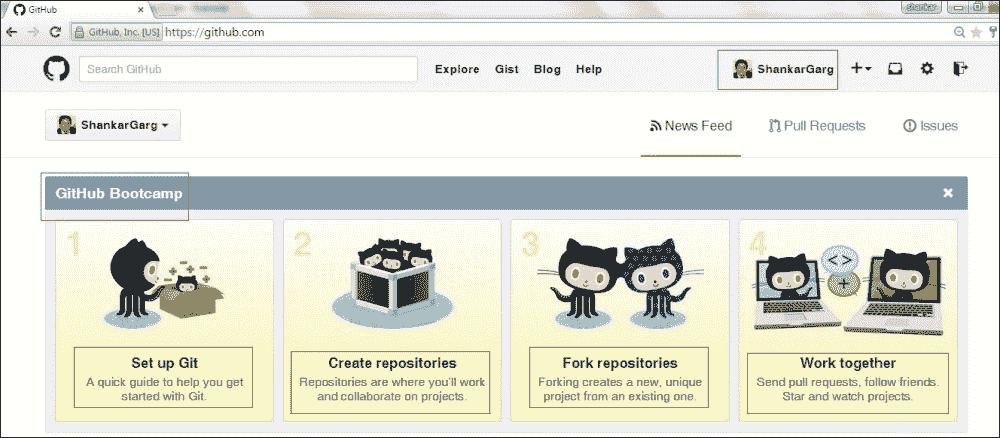
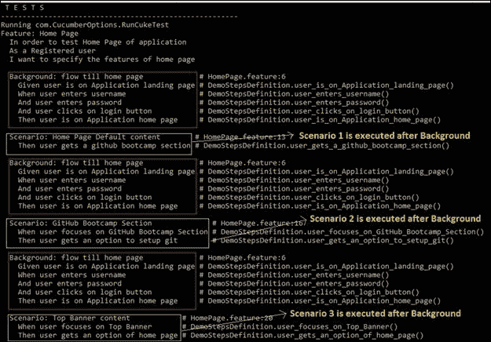

# 第一章.编写特性文件

在本章中，我们将涵盖以下主题：

+   使用一个场景编写你的第一个特性文件

+   使用不同步骤创建场景

+   使用 And 和 But 关键字创建场景

+   使用多个场景编写特性文件

+   向特性文件添加背景

+   在步骤中发送多个参数

+   使用复杂的数据类型来存储数据

+   实现场景概述

+   使用非英语语言创建特性文件

+   结合场景、背景和场景概述

# 简介

在 Cucumber 框架中，业务需求在特性文件中指定，这些文件是用 Gherkin 语言编写的。因此，了解 Gherkin 语言的力量和用法，以便创建高效和优化的特性文件对我们来说非常重要。

本章将涵盖使用 Gherkin 语言编写有意义的和智能特性文件的使用方法。我们将从一些简单的菜谱开始，创建一个只有一个场景的特性文件，然后逐渐过渡到更复杂的菜谱，其中创建具有多个场景、背景和场景概述的特性文件。我们还将涵盖概念和关键字，如特性、场景、步骤、背景、场景概述和数据表。

### 注意

在本章中，我们只关注特性文件。步骤定义和自动化库将在后面的章节中介绍。最初，你可能无法完全理解本章中的所有概念，但随着你的阅读，一切都会变得清晰起来。

# 使用一个场景编写你的第一个特性文件

假设你是**产品所有者**（**PO**）或**业务分析师**（**BA**）。你的团队正在创建一个网络应用程序，你需要为该应用程序编写规范。该网络应用程序的一个非常简单和基本的规范是，当我们在一个浏览器中输入该应用程序的 URL 时，该应用程序应该加载。那么我们如何在 Cucumber 中编写这个规范？我们将在这个菜谱中介绍。

## 如何做到这一点…

在这个菜谱中，我们将创建一个简单的特性文件，其中只有一个场景来测试网页是否已加载。

让我们创建一个`page_load.feature`文件：

```java
 Feature: Test Git web Application
  In order to Test Git web Application
  As a user
  I want to specify the application flow

  Scenario: Web Site loads
  application page load should be quick

  Given application URL is ready with the user
  When user enters the URL in browser
  Then application page loads
```

## 它是如何工作的…

在 Cucumber 中，我们用纯英文编写我们的需求，就像语言、**Gherkin**。Gherkin 是一种具有非常明确语法的特定领域语言。它基于一些预定义的**关键字**。在先前的例子中，文本中突出显示的部分是 Gherkin 的关键字，其余部分则依赖于正在测试的应用程序。

让我们更详细地理解每个关键字。

### 特性

在 Cucumber 中，特性文件包含业务需求。特性关键词之后立即跟随的文本，并且位于同一行，是特性文件的标题。特性关键词行之后跟随的三个（可选）文本行是特性文件的意图。意图文本是我们想写的任何内容，直到第一个场景。特性文件应包含场景或场景轮廓。特性文件的命名约定应该是小写并带有下划线，例如，`login.feature` 和 `home_page.feature`。场景和特性文件的名称必须是唯一的。

### 场景

场景类似于测试用例，并以新行中的场景关键词开始（不同于特性意图）。场景关键词之后立即跟随的文本，并且位于同一行，是**场景标题**。在场景关键词行之后跟随的三个（可选）文本行是场景的**意图**。所有场景都执行以下操作：

+   将系统置于特定状态

+   摇晃它（执行某些操作）

+   检查新状态

### 步骤

场景包含步骤，这些步骤相当于测试步骤，并使用以下关键词来表示：Given、When、Then、But 和 And（区分大小写）。

### 注意

当你保存本章中提到的特性文件并运行它们时，在第一次运行中，Cucumber 将会因缺少步骤定义文件而给出错误，并附带步骤定义的建议。为了解决这些错误，复制 Cucumber 提供的建议，并将它们粘贴到默认的步骤定义文件中。

# 使用不同步骤创建场景

当我们指定业务需求时，我们需要指定先决条件、用户操作和预期输出。让我们首先了解这些分别代表什么：

+   **先决条件**: 这将**应用程序**（**AUT**）置于测试用例可以执行的状态，或建立应用程序上下文。

+   **用户操作**: 这指的是用户执行的动作，该动作与场景目标一致。

+   **预期输出**: 这指的是用户操作后应用程序的响应。

因此，让我们在这个菜谱中将这个规范写成 Cucumber 格式。

## 如何操作…

在这个菜谱中，我们将通过使用关键词 `Given`、`When` 和 `Then` 更新我们在前一个菜谱中创建的特性文件。

```java
Feature: login Page
  In order to test login page
  As a Registered user
  I want to specify the login conditions

  Scenario: checking pre-condition, action and results
    Given user is on Application landing page
    When user clicks Sign in button
    Then user is on login screen
```

## 它是如何工作的…

Cucumber 场景由以下关键词（如 Given, When, Then, And, But 等）标识的步骤组成。这些步骤的定义如下：

+   **Given**: 先决条件在 `Given` 关键词中提及。`Given` 关键词的步骤将系统置于已知状态，这对于用户操作是必要的。避免在 `Given` 步骤中谈论用户交互。

+   **何时**: `When` 步骤的目的在于描述用户操作。

+   **Then**: `Then` 步骤的目的是观察预期输出。观察结果应与特性描述的业务价值/好处相关。

# 使用 And 和 But 关键词创建场景

当我们指定业务需求时，有时会有多个先决条件、用户操作和预期结果。那么我们如何在 Cucumber 中编写这些规范？

## 准备工作…

根据我们迄今为止所学的内容，我们知道如何使用一个 Given、When 和 Then 关键字来创建场景。现在，如果我们需要添加多个**步骤**，那么我们可以像这样更新我们的特性文件：

```java
Feature: login Page
  In order to test login page
  As a Registered user
  I want to specify the login conditions

  Scenario: without and & but
    Given user is on Application landing page
    Given Sign in button is present on screen
    When user clicks on Sign in button
    Then user can see login screen
    When user enters "ShankarGarg" in username field
    When user enters "123456" in password field
    When user clicks Sign in button
    Then user is on home page
    Then title of home page is "GitHub"
```

这里的问题是关键字`Given`、`When`和`Then`被重复使用，因此可读性受到影响。保持特性文件的可读性是 Cucumber 最大的优势之一。那么我们如何保持特性文件的可读性？让我们在这个菜谱中找出答案。

## 如何做到这一点…

在这个菜谱中，我们将添加一个额外的场景，并使用`And`和`But`关键字：

```java
Feature: login Page
  In order to test login page
  As a Registered user
  I want to specify the login conditions

  Scenario: with and & but
    Given user is on Application landing page
    And Sign in button is present on screen
    When user clicks on Sign in button
    Then user is displayed login screen
    When user enters "ShankarGarg" in username field
    And user enters "123456" in password field
    And user clicks Sign in button
    Then user is on home page
    And title of home page is "GitHub"
    But Sign in button is not present
```

## 它是如何工作的…

`And`和`But`关键字在这里很有用。这些关键字有助于提高特性文件的表达性和可读性：

+   **并且**：这用于对先前步骤的补充性陈述，表示肯定陈述。

+   **但是**：这用于对先前步骤的补充性陈述，表示否定陈述。

### 注意

在步骤定义文件中，`And`和`But`被列为 Given/When/Then，即它们出现的关键字之后。步骤定义中没有`And`和`But`关键字。

# 编写包含多个场景的特性文件

特性文件包含特定功能可能的场景。这就像编写所有可能的需求，当特性实现时，它应该满足这些需求。所以让我们在以下部分用 Cucumber 编写这些规范。

## 如何做到这一点...

我们将创建一个新的特性文件，名为`home_page.feature`，它将涵盖[`github.com/`](https://github.com/)的默认内容、**训练营**部分和顶部横幅内容的功能。我们将为每个功能创建不同的场景。查看以下截图以获得更多清晰度：



```java
Feature: Home Page
  In order to test Home Page of application
  As a Registered user
  I want to specify the features of home page

  Scenario: Home Page Default content
    Given user is on Github home page
    Then user gets a GitHub bootcamp section
    And username is also displayed on right corner

  Scenario: GitHub Bootcamp Section
    Given user is on GitHub home page
    When user focuses on GitHub Bootcamp Section
    Then user gets an option to setup git
    And user gets an option to create repository
    And user gets an option to Fork Repository
    And user gets an option to work together

  Scenario: Top Banner content
    Given user is on GitHub home page
    When user focuses on Top Banner
    Then user gets an option of home page
    And user gets an option to search
    And user gets settings options
    And user gets an option to logout
```

## 它是如何工作的…

一个黄瓜特性文件可以根据需要包含任意数量的场景。以下是一些需要注意的点：

+   一个特性文件通常关注应用程序的一个功能，例如登录页面、主页等。

+   一个场景指的是该功能的一个子特性，例如新客户页面、删除客户页面等。

当我们在特性文件中有多个场景时，我们应该始终遵循无状态场景指南。让我们更好地理解这个指南——每个场景都必须有意义，并且应该独立于任何其他场景执行。一个场景/特性的结果不应影响其他场景。

这些是独立场景的好处：

+   特性文件更容易理解且有趣

+   你只能运行场景的一个子集，因为场景本身提到了所有必需的步骤

+   与依赖场景相比，独立场景将更有资格成为*并行执行*的候选人

    ### 小贴士

    **下载示例代码**

    您可以从您在[`www.packtpub.com`](http://www.packtpub.com)的账户下载所有已购买 Packt 出版物的示例代码文件。如果您在其他地方购买了这本书，您可以访问[`www.packtpub.com/support`](http://www.packtpub.com/support)并注册，以便将文件直接通过电子邮件发送给您。

# 将背景添加到特性文件中

当我们编写特性文件时，我们会编写多个场景。现在所有这些场景都从一个特定的点开始。如果我正在编写主页场景，那么我需要从登录功能开始流程。因此，最好将重复的步骤放在一个地方，而不是在所有场景中。让我们在下一节中了解如何做到这一点。

## 准备工作

根据我们迄今为止所学的内容，我们的特性文件将看起来像这样：

```java
Feature: Home Page
  In order to test Home Page of application
  As a Registered user
  I want to specify the features of home page

  Scenario: Home Page Default content
    Given a registered user exists
    Given user is on GitHub login page
    When user enters username
    And user enters password
    And user clicks on login button
    Then user is on Application home page
    And user gets a GitHub bootcamp section

  Scenario: GitHub Bootcamp Section
    Given user is on GitHub loginpage
    When user enters username
    And user enters password
    And user clicks on login button
    Then user is on Application home page
    When user focuses on GitHub Bootcamp Section
    Then user gets an option to setup git

  Scenario: Top Banner content
    Given user is on GitHub login page
    When user enters username
    And user enters password
    And user clicks on login button
    Then user is on Application home page
    When user focuses on Top Banner
    Then user gets a logout option
```

这里的问题是前五个语句在所有场景中都是重复的。这影响了特性文件的可读性，并且有很多重复的工作。

这种编写特性文件的方式存在以下问题：

+   **重复**：许多语句在所有场景中都是重复的

+   **可读性**：特性文件的可读性受到影响。

+   **重复**：将这些步骤复制到所有场景中是多余的。

+   **可维护性**：即使单个步骤发生变化，我们也必须更改所有出现的地方。

## 如何做到这一点…

我们将更新`home_page.feature`文件，并使用`Background`关键字将所有场景中的公共步骤放在一个地方：

```java
Feature: Home Page
  In order to test Home Page of application
  As a Registered user
  I want to specify the features of home page

 Background: flow till home page
 Given user is on Application home page
 When user enters username
 And user enters password
 And user clicks on login button
 Then user is on Application home page

  Scenario: Home Page Default content
    Then user gets a GitHub bootcamp section

  Scenario: GitHub Bootcamp Section
    When user focuses on GitHub Bootcamp Section
    Then user gets an option to setup git

  Scenario: Top Banner content
    When user focuses on Top Banner
    Then user gets an option of home page
```

## 它是如何工作的…

在这里，我们使用了背景关键字。在特性文件中的每个场景或场景轮廓之前，都会执行背景关键字中提到的所有步骤。让我们更详细地了解这个关键字：

+   在一个特性文件中只能有一个背景，它允许我们为特性文件中的所有场景设置一个前提条件。

+   背景就像一个场景，包含多个步骤。

+   背景在每次场景之前运行，但在`BeforeScenario`钩子之后。（我们将在第三章中阅读关于钩子的内容，*启用固定装置*）。

+   背景的标题和多行描述/意图是可选的。

+   由于背景中提到的步骤将在特性文件中的所有场景中运行，因此我们在将步骤添加到背景时需要小心。例如，我们不应该添加一个不是所有场景都共有的步骤。

这就是前面文件输出的样子：



不要使用`Background`来设置复杂的状态，除非这个状态实际上是客户端需要知道的东西。

+   请保持您的“背景”部分简短，因为当您添加新场景时，您希望人们能够记住这些步骤

+   让你的`背景`部分生动有趣，因为这样人们更容易记住它

# 在步骤中发送多个参数

当我们谈论测试时，数据驱动测试是一个非常著名的方法。到目前为止，我们一直专注于我们的步骤想要做什么。现在浮现出来的问题是以下这些：

+   我们的步骤也可以发送测试数据吗？

+   我们的步骤可以发送什么样的测试数据？

+   我们能否在单个步骤中发送混合数据类型？

穿上业务分析师的鞋子，让我们为 GitHub 用户注册页面和登录功能编写一些场景。

## 如何做到这一点...

我们将更新`login.feature`文件，并添加两个场景，我们将通过步骤传递参数：

```java
Feature: login Page
  In order to test login page
  As a Registered user
  I want to specify the login conditions

  Scenario: New User Registration
    Given user is on Application landing page
    When user enters "ShankarGarg" in username field
    And user enters "sgarg@gmail.com" in password field
    And user enters "123456" in password field
    And user clicks on Signup for GitHub button
    Then user is successfully registered

  Scenario: login
    Given user is on Application landing page
    And Sign in button is present on screen
    When user clicks on Sign in button
    Then user is displayed login screen
    When user enters "ShankarGarg" in username field
    And user enters "123456" in password field
    And user clicks Sign in button
    Then user is on home page
    And title of home page is "GitHub"
```

## 它是如何工作的...

在前面的特性文件中，关注用双引号`"`括起来的文本。这是我们测试数据。步骤中提到的双引号`"`之间的文本与步骤定义文件中的捕获组相关联。

一个步骤定义的示例是：

```java
@When("^user enters \"(.*?)\" in username field$")
  public void user_enters_in_username_field(String userName) {
      //print the value of data passed from Feature file
      System.out.println(userName);
  }
```

前面的`System.out.println`的输出将是`ShankarGarg`（我们在特性文件中传递的测试数据）。

### 注意

现在，既然你已经学会了如何在步骤中传递测试数据，那么尝试以下操作：

+   在同一个步骤中发送字符串和整数数据。

+   在步骤中发送一个列表；例如：“星期一，星期二，星期三”。

# 使用复杂的数据类型来存储数据

在前面的食谱中，我们学习了如何在步骤中发送数据，这些数据可以被应用程序用于处理。我们到目前为止发送的数据要么是字符串，要么是整数。但如果我们想发送更复杂的数据结构，并且跨越多行呢？

## 准备工作

让我们为这个功能编写一个场景——我们想要验证是否存在各种用户：

```java
Scenario: Existing user Verification
    Given user is on Application landing page
    Then we verify user "Shankar" with password "P@ssword123", phone "999" exists
    Then we verify user "Ram" with password "P@ssword456", phone " 888" exists
    Then we verify user "Sham" with password "P@ssword789", phone "666" exists
```

这种编写特性文件的方法的问题是特性文件不够表达，有很多重复。

## 如何做到这一点...

我们将向`login.feature`文件添加一个额外的场景，并使用数据表通过步骤发送大量测试数据：

```java
Scenario: Existing user Verification

Given user is on Application landing page
 Then we verify following user exists
 | name    | email           | phone |
 | Shankar | sgarg@email.com | 999   |
 | Ram     | ram@email.com   | 888   |
 | Sham    | sham@email.org  | 666   |

```

## 它是如何工作的…

这里我们使用了数据表。将表格作为步骤的参数对于指定较大的数据集来说非常方便。让我们更详细地了解数据表：

+   将表格作为步骤的参数非常方便，可以指定更大的数据集。

+   数据表的第一行总是标题行，我们在这里指定每列的标题。数据表中的所有其他行都是数据行，它们包含应用程序将使用的实际数据。

+   数据表将作为最后一个参数传递给步骤定义。

+   不要混淆数据表与场景概述表。

+   在步骤定义文件中处理数据表也非常容易。这是一个示例步骤定义代码：

    ```java
    @Then("^we verify following user exists$")
    public void we_verify_following_user_exists(DataTable userDetails){
      //Write the code to handle Data Table
      List<List<String>> data = userdetails.raw();
      System.out.println(data.get(1).get(1));
    }
    ```

在前面的代码示例中，数据表已经被转换成字符串列表，并且之后可以很容易地处理。

### 注意

数据表转换已在第二章中详细解释，即转换数据表以解析测试数据配方。

# 实现场景轮廓

在上一个配方中，我们学习了如何在步骤本身中发送测试数据，这些数据可以被应用程序用于处理。到目前为止，数据与一个特定的步骤相关联（由数据表实现）；但如果我们想发送与整个场景相关的数据，或者我们想为不同的数据集重复执行场景的所有步骤，这将是数据驱动测试的一个典型例子。这将通过使用场景轮廓来实现。

## 准备工作

让我们创建一个用于登录功能的场景，我们想要测试所有可能导致登录失败的场景。根据我们迄今为止所学的内容，我们的场景将看起来像这样：

```java
  Scenario: login fail - wrong username
    Given user is on Application landing page
    When user clicks on Sign in button
    Then user is displayed login screen
    When user enters "wrongusername" in username field
    And user enters "123456" in password field
    And user clicks Sign in button
    Then user gets login failed error message

  Scenario: login fail - wrong password
    Given user is on Application landing page
    When user clicks on Sign in button
    Then user is displayed login screen
    When user enters "ShankarGarg" in username field
    And user enters "wrongpassword" in password field
    And user clicks Sign in button
    Then user gets login failed error message
```

从语法角度来看，这段代码没有问题。Cucumber 会像对待任何其他代码一样处理它，但问题是对于编写特性文件的人来说。如果你仔细看，只有数据集在变化，所有其他步骤都是相同的。这是创建特性文件方法中存在以下问题的原因：

+   复制和粘贴场景以使用不同的值可能会很快变得繁琐和重复。

+   如果明天只有一个步骤发生变化，它必须在所有场景中更改。因此，可维护性和可重用性是重要的问题。

为了避免这些问题，让我们看看下一节，了解我们如何解决这些问题。

## 如何做到这一点...

在这里，我们将使用`Scenario Outline`关键字并添加一个场景轮廓来测试可能的登录场景：

```java
Scenario Outline: Login fail - possible combinations
    Given user is on Application landing page
    When user clicks on Sign in button
    Then user is displayed login screen
    When user enters "<UserName>" in username field
    And user enters "<Password>" in password field
    And user clicks Sign in button
 Then user gets login failed error message

 Examples: 
 | UserName      | Password      |
 | wrongusername | 123456        |
 | ShankarGarg   | wrongpassword |
 | wrongusername | wrongpassword |

```

## 它是如何工作的...

在这里，我们使用了`Scenario Outline`关键字，并将所有三个场景合并为一个场景轮廓。场景轮廓的一个优点是，我们的特性文件现在更加紧凑和表达性强。让我们更详细地了解场景轮廓：

+   场景轮廓允许我们通过使用带有占位符的模板来向场景发送测试数据。

+   对于场景轮廓下面的示例部分中的每一行（不包括列标题的第一行），都会运行一次场景轮廓。

+   场景轮廓是一个模板，它永远不会直接运行。它使用占位符，这些占位符位于场景轮廓步骤中的`< >`内。

+   将占位符想象成一个变量。它会被`Examples`表行中的实际值所替换，其中占位符尖括号内的文本与表列标题相匹配。

    +   在第一次执行中，当 Cucumber 遇到第一个带有占位符的步骤时，在我们的例子中是`当用户在用户名字段中输入<UserName>`，Cucumber 会在`Examples`表中寻找标题为`UserName`的列。

    +   如果在`Examples`表中没有带有`UserName`列，那么 Cucumber 不会报错，而是将`<UserName>`视为一个字符串，并原样将其传递给步骤定义。

    +   如果 Cucumber 找到一个带有`UserName`标题的列，那么它会从这个列中选取第一行数据，并用这个值替换`UserName`，在我们的例子中是`wrongusername`，然后将这个值发送到步骤定义。

    +   Cucumber 会为执行中的一轮中的所有`< >`重复此过程。

    +   因此，对于第一次执行，我们的情景概述将看起来是这样的：

        ```java
        Given user is on Application landing page
        When user clicks on Sign in button
        Then user is displayed login screen
        When user enters "wrongusername" in username field
        And user enters "123456" in password field
        And user clicks Sign in button
        Then user gets login failed error message
        ```

+   用于占位符的值在每个情景概述的后续运行中都会改变。第二行的值用于第二次执行，依此类推，直到达到`Examples`表的末尾。

+   情景概述本身如果没有`Examples`表就毫无用处，该表列出了要替换每个占位符的值行。

    ### 注意

    现在你已经了解了情景概述的概念，尝试实现以下内容：

    +   在一个步骤中写一个带有多个参数的情景概述。

    +   你能创建一个带有多个示例的情景概述吗？你可以将正测试和负测试的示例分组在不同的表中。

# 在非英语语言中创建特性文件

我们中的大多数人都在跨地理的团队中工作过，我们都会同意，与我们相比，有些人更习惯于母语而不是英语。我们能够更好地表达自己，也能够表达一切。那么，如果我们的业务分析师或产品所有者比英语更习惯于丹麦语呢？让我们在 Cucumber 中以非英语语言编写规范。

## 如何做到这一点...

这是一个示例英文特性文件，我们将将其转换为不同的语言。

```java
Feature: sample application
  In order to test login page
  As a Registered user
  I want to specify the login conditions

  Scenario: sample scenario
    Given user is on application page
    When user clicks login button
    Then user is on home page
```

要创建丹麦语（`Danish.feature`）的特性文件：

```java
# language: da
Egenskab: prøve ansøgning
     For at teste login side
     Som registreret bruger
     Jeg ønsker at angive login betingelser

  Scenarie: prøve scenario
    Givet brugeren er på ansøgning side
    Når brugeren klikker login knap
    Så Derefter bruger er på hjemmesiden
```

## 它是如何工作的...

Cucumber 允许我们用大约 40 种口语化的语言编写特性文件，从而赋予那些母语不是英语的团队编写与英语特性文件一样健壮的特性文件的能力。特性文件第一行的`# language: da`标题告诉 Cucumber 特性文件中将使用哪种语言。默认情况下，语言是英语。如果我们想用其他语言编写特性文件，特性文件必须以`"UTF-8"编码`保存。

在一个项目中，我们可以有多个语言的特性文件；但对于一个特性文件，只能使用一种语言。

### 注意

对于所有语言，步骤定义的生成没有区别。

# 结合情景、背景和情景概述

到目前为止，我们已经单独学习了情景、步骤、背景和情景概述。但是当一个业务分析师或产品所有者必须编写特性文件时，他们必须结合所有这些关键字来编写一个非常高效和表达性的特性文件。

考虑编写一个登录功能的特性文件，其中后者满足以下标准：

+   用户应有一个选项从应用程序的主页登录

+   要登录，用户应有一个用户名和密码

+   登录成功后，用户应被重定向到主页

+   如果登录失败，用户应收到适当的消息

+   用户还应该有一个选项在主页上注册新用户

+   用户还应该能够验证应用程序中存在哪些用户（这个功能不在 GitHub 着陆页上，但已添加以阐明概念）

    ### 注意

    所有这些要求都是针对应用程序的行为的，并且它们都不涉及您如何实现这些要求。

## 如何做到这一点…

现在我们将使用我们迄今为止探索的所有关键词，并创建一个`login.feature`文件，该文件指定了上述所有要求：

```java
Feature: login Page
  In order to test login page
  As a Registered user
  I want to specify the login conditions

  Scenario: login flow
    Given user is on Application landing page
    And Sign in button is present on screen
    When user clicks on Sign in button
    Then user is displayed login screen
    When user enters "ShankarGarg" in username field
    And user enters "123456" in password field
    And user clicks Sign in button
    Then user is on home page
    And title of home page is "GitHub"

  Scenario Outline: Login fail - possible combinations
    Given user is on Application landing page
    When user clicks on Sign in button
    Then user is displayed login screen
    When user enters "<UserName>" in username field
    And user enters "<Password>" in password field
    And user clicks Sign in button
    Then user gets login failed error message

    Examples: 
      | UserName      | Password      |
      | wrongusername | 123456        |
      | ShankarGarg   | wrongpassword |
      | wrongusername | wrongpassword |

  Scenario: Existing user Verification
    Given user is on Application landing page
    Then we verify following user exists
      | Name    | Email           | Phone |
      | Shankar | sgarg@email.com | 999   |
      | Ram     | ram@email.com   | 888   |
      | Sham    | sham@email.org  | 666   |

  Scenario: New User Registration
    Given user is on Application landing page
    When user enters "ShankarGarg" in username field
    And user enters "sgarg@gmail.com" in password field
    And user enters "123456" in password field
    And user clicks on Signup for GitHub button
    Then user is successfully registered
```

## 它是如何工作的…

在这里，我们已将本章中讨论的所有关键词和概念合并在一起。让我们逐个分析每个要求，并分析我们是如何以及使用哪个关键词来指定这些要求的：

+   用户应有一个选项从应用程序主页登录—场景

+   对于登录，用户应有一个用户名和密码—场景

+   登录成功后，用户应被重定向到主页—场景

+   如果登录失败，用户应收到适当的消息—场景概述

+   用户还应该有一个选项在主页上注册新用户—场景

+   用户还应该能够验证应用程序中存在哪些用户—数据表
