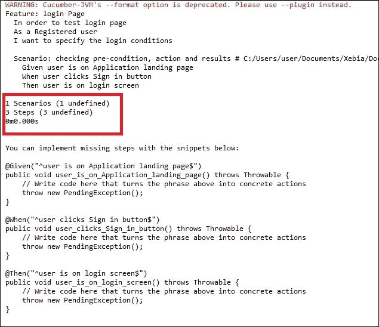
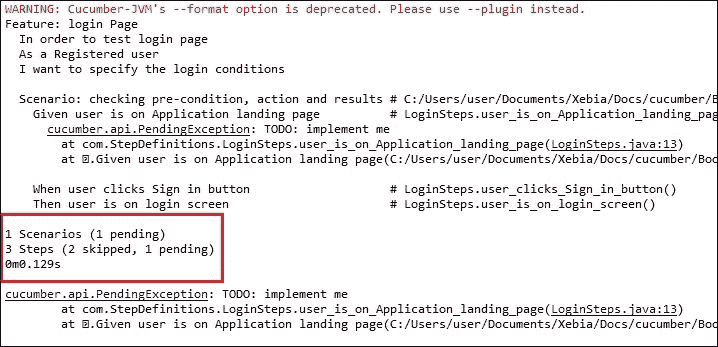
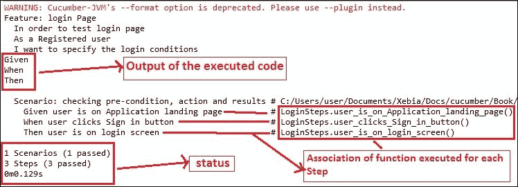
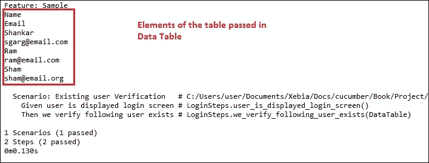
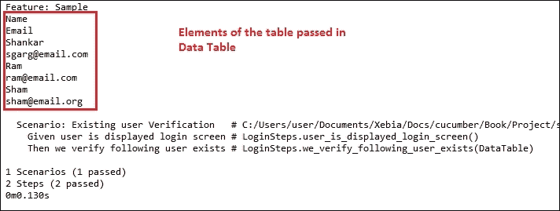
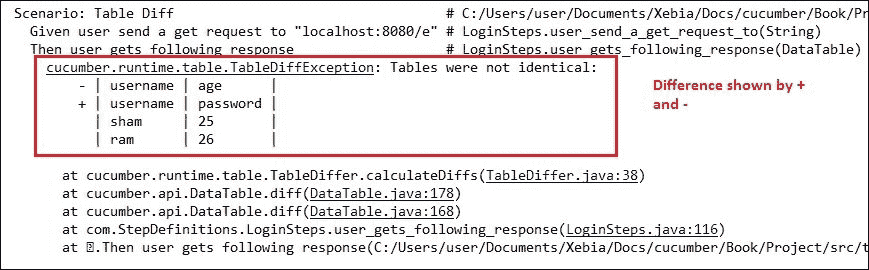
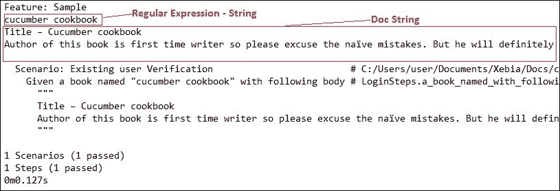
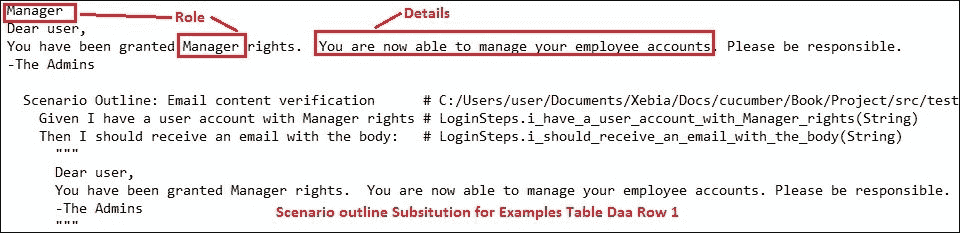
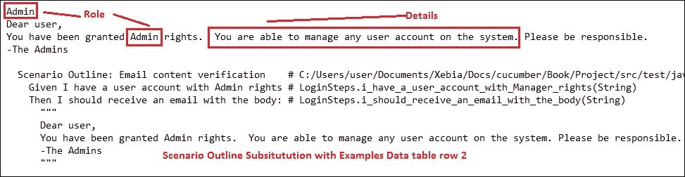
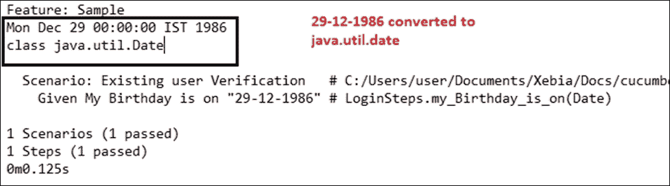

# 第二章：创建步骤定义

在本章中，我们将涵盖以下主题：

+   创建你的第一个步骤定义文件

+   识别重复和模糊的步骤定义

+   使用正则表达式优化步骤定义

+   使用可选捕获/非捕获组

+   将数据表转换为解析测试数据

+   实现数据表差异以比较表格

+   使用文档字符串将大数据解析为一个块

+   结合文档字符串和场景概述

+   定义字符串转换以实现更好的转换

# 简介

有时候，那些不太熟悉 Cucumber 的人可能会争论说，与没有 Cucumber 的框架相比，创建步骤定义文件是一个额外的负担。但他们没有意识到的是，Cucumber 会自动生成这些步骤定义，所以它并不是一个负担。通过了解本章中涵盖的概念，你将能够编写非常有效和高效的步骤定义。

在本章中，我们将通过涵盖不同类型的步骤定义、正则表达式的使用等详细地介绍粘合代码/步骤定义的基本概念。为了提出优化和高效的步骤定义，我们还将详细阐述文档字符串、数据表转换和捕获组的先进概念。

# 创建你的第一个步骤定义文件

现在假设你是一名自动化开发者，你必须为特性文件实现自动化测试用例。在这个方向上的下一步将是编写这个特性文件的步骤定义。那么，我们如何在 Cucumber 项目中编写步骤定义呢？让我们看看这个配方中是如何做到这一点的。

## 如何做到这一点…

创建步骤定义最简单的方法是让 Cucumber 来处理。步骤如下：

1.  这是我们在上一章中使用的特性文件。让我们使用这个特性文件来创建我们的第一个步骤定义：

    ```java
    Feature: login Page
      In order to test login page
      As a Registered user
      I want to specify the login conditions

      Scenario: checking pre-condition, action and results
        Given user is on Application landing page
        When user clicks Sign in button
        Then user is on login screen
    ```

1.  当你保存特性文件并运行（无论是通过 Eclipse 还是通过终端）时，Cucumber 将为缺失的步骤定义文件提供错误以及步骤定义的建议。以下是在 Eclipse 中显示的错误示例

1.  注意 Cucumber 给出的建议（在前面的截图中被突出显示）。根据 Cucumber，所有步骤目前都处于**未定义**状态。

1.  复制 Cucumber 给出的建议，并将其粘贴到默认的步骤定义文件中。

    ### 注意

    记得将步骤定义文件的路径提供给 Cucumber 选项类。

1.  这就是我们的`LoginSteps.java`类将看起来：

    ```java
    package com.StepDefinitions;

    import cucumber.api.PendingException;
    import cucumber.api.java.en.Given;
    import cucumber.api.java.en.Then;
    import cucumber.api.java.en.When;

    public class LoginSteps {

      @Given("^user is on Application landing page$")
      public void user_is_on_Application_landing_page() throws Throwable {
            /* Write code here that turns the phrase above into 
               concrete actions*/
        throw new PendingException();
      }

      @When("^user clicks Sign in button$")
      public void user_clicks_Sign_in_button() throws Throwable {
            /*Write code here that turns the phrase above into 
                concrete actions */
        throw new PendingException();
      }

      @Then("^user is on login screen$")
      public void user_is_on_login_screen() throws Throwable {
            /* Write code here that turns the phrase above into 
                concrete actions */
        throw new PendingException();
      }
    }
    ```

1.  现在，再次运行特性文件并查看 Cucumber 输出：

1.  现在我们的场景状态已从**未定义**变为**挂起**。参看前一个截图中被突出显示的区域。Cucumber 建议我们为挂起的步骤添加实现。

1.  我们将删除类中的 throw 语句，并用一些虚拟代码替换它们。您可以调用实际的自动化代码（无论是网站上的 Selenium 函数还是面向服务的架构（SOA）自动化中的 HTTPClient 函数）。以下是我们的`LoginSteps.java`类看起来像：

    ```java
    package com.StepDefinitions;

    import cucumber.api.java.en.Given;
    import cucumber.api.java.en.Then;
    import cucumber.api.java.en.When;

    public class LoginSteps {

      @Given("^user is on Application landing page$")
      public void user_is_on_Application_landing_page() throws Throwable {
        //sample code goes here
        System.out.println("Given");
      }

      @When("^user clicks Sign in button$")
      public void user_clicks_Sign_in_button() throws Throwable {
        //sample Code goes here
        System.out.println("When");
      }

      @Then("^user is on login screen$")
      public void user_is_on_login_screen() throws Throwable {
        //sample Code goes here
        System.out.println("Then");
      }
    }
    ```

1.  现在，再次执行特性文件并观察 Cucumber 的输出：

1.  现在，Cucumber 的输出已经改变，我们步骤的状态已从**挂起**变为**通过**；此外，每个步骤中调用的每个函数的输出也已打印出来。

    ### 注意

    不论是使用`@Given`、`@When`还是`@Then`注解创建的步骤定义，只要正则表达式与步骤的主要文本匹配，步骤定义就会匹配任何 Gherkin 步骤。例如，`Given I have 100 in my account`和`When I have 100 in my account`将会匹配到`@Given("^I have (.*?) in my account$")`。

## 它是如何工作的…

现在，让我们更详细地了解上一节中执行的每个步骤，以更好地理解步骤定义的概念：

### 步骤定义

+   当 Cucumber 开始执行时，它会查找类路径上所有位于指定粘合包（或其子包）中的类。

+   步骤定义是一小段代码，其中附加了一个模式。该模式用于将步骤定义链接到所有匹配的步骤，而代码是 Cucumber 在看到 Gherkin 步骤时将执行的内容。

+   我们使用 Cucumber 注解，如`@Given`、`@When`和`@Then`来创建步骤定义。

+   在步骤`Given user is on Application landing page`中，`Given`关键字之后的文本（`user is on Application landing page`）是 Cucumber 在步骤定义文件中匹配的内容（**@Given("^user is on Application landing page$")**）。当 Cucumber 找到匹配项时，它将执行该步骤中提到的函数。

### 未定义步骤

+   当我们首次执行特性文件时，Cucumber 没有找到任何匹配的步骤定义，这就是为什么 Cucumber 给出了**未定义步骤错误**。

+   Cucumber 还会给出自己的建议来消除未定义步骤。在场景中未定义步骤之后的后续步骤都将被跳过，场景将被标记为失败。

### 挂起步骤

+   当我们在步骤定义文件中使用 Cucumber 建议的代码，并运行特性文件时，我们会得到挂起步骤异常。

+   挂起步骤异常是因为以下代码：

    ```java
    throw new PendingException();
    ```

+   当 Cucumber 遇到这个语句时，它理解这些步骤仍然处于进行中。

+   场景的状态是挂起，第一个有`PendingException()`的步骤将被标记为挂起，该场景中的其他所有步骤都将被跳过。

### 实现步骤

+   当我们用功能代码替换 throw 命令时，挂起异常错误就会消失。

+   现在，步骤的状态将取决于该步骤中执行的内容。

# 识别重复和模糊的步骤定义

有时候当我们编写 Cucumber 步骤定义文件时，我们会遇到重复步骤定义错误或模糊步骤定义错误。让我们尝试理解这些错误产生的原因，以及我们如何通过本食谱来消除它们。

## 如何操作...

我们将使用之前食谱中相同的特征文件。执行以下步骤：

1.  让我们在`StepDefinitions`包中创建另一个名为`DuplicateAmbiguous.java`的类，内容如下：

    ```java
    package com.StepDefinitions;

    import cucumber.api.java.en.Given;

    public class DuplicateAmbiguous {

      //Duplicate Steps
      @Given("^user is on Application landing page$")
      public void user_is_on_Application_landing_page_duplicate() throws Throwable {
        //sample code goes here
        System.out.println("Duplicate");
      }

    }
    ```

    当你尝试运行特征文件时，观察 Cucumber 输出：

    ```java
    Exception in thread "main" cucumber.runtime.DuplicateStepDefinitionException: Duplicate Step Definitions in com.StepDefinitions.DuplicateAmbiguous.user_is_on_Application_landing_page_duplicate() in file:/C:/Users/user/Documents/Xebia/Docs/cucumber/Book/Project/target/test-classes/ and com.StepDefinitions.LoginSteps.user_is_on_Application_landing_page() in file:/C:/Users/user/Documents/Xebia/Docs/cucumber/Book/Project/target/test-classes/
     at cucumber.runtime.RuntimeGlue.addStepDefinition(RuntimeGlue.java:33)
     at cucumber.runtime.java.JavaBackend.addStepDefinition(JavaBackend.java:153)
     at cucumber.runtime.java.MethodScanner.scan(MethodScanner.java:68)
     at cucumber.runtime.java.MethodScanner.scan(MethodScanner.java:41)
     at cucumber.runtime.java.JavaBackend.loadGlue(JavaBackend.java:89)
     at cucumber.runtime.Runtime.<init>(Runtime.java:90)
     at cucumber.runtime.Runtime.<init>(Runtime.java:68)
     at cucumber.runtime.Runtime.<init>(Runtime.java:64)
     at cucumber.api.cli.Main.run(Main.java:35)
     at cucumber.api.cli.Main.main(Main.java:18)

    ```

1.  Cucumber 显示一个重复步骤定义错误，指出有两个步骤定义是完全匹配的。

1.  让我们将`DuplicateAmbiguous.java`的内容更改为以下代码：

    ```java
    package com.StepDefinitions;

    import cucumber.api.java.en.Given;

    public class DuplicateAmbiguous {

      //Ambiguous Steps
      @Given("^user is on (.*?) page$")
      public void user_is_on_Application_landing_page_ambiguous() throws Throwable {
          //sample code goes here
        System.out.println("Duplicate");
      }

    }
    ```

1.  现在运行特征文件并观察 Cucumber 输出：

    ```java
      Scenario: checking pre-condition, action and results # C:/Users/user/Documents/Xebia/Docs/cucumber/Book/Project/src/test/java/com/features/login.feature:6
        Given user is on Application landing page          # DuplicateAmbiguous.user_is_on_Application_landing_page_ambiguous()
     cucumber.runtime.AmbiguousStepDefinitionsException: ✽.Given user is on Application landing page(C:/Users/user/Documents/Xebia/Docs/cucumber/Book/Project/src/test/java/com/features/login.feature:7) matches more than one Step Definition:
     ^user is on (.*?) page$ in DuplicateAmbiguous.user_is_on_Application_landing_page_ambiguous()
     ^user is on Application landing page$ in LoginSteps.user_is_on_Application_landing_page()

     at cucumber.runtime.RuntimeGlue.stepDefinitionMatch(RuntimeGlue.java:71)
     at cucumber.runtime.Runtime.runStep(Runtime.java:265)
     at cucumber.runtime.model.StepContainer.runStep(StepContainer.java:44)
     at cucumber.runtime.model.StepContainer.runSteps(StepContainer.java:39)
     at cucumber.runtime.model.CucumberScenario.run(CucumberScenario.java:48)
     at cucumber.runtime.model.CucumberFeature.run(CucumberFeature.java:163)
     at cucumber.runtime.Runtime.run(Runtime.java:120)
     at cucumber.api.cli.Main.run(Main.java:36)
     at cucumber.api.cli.Main.main(Main.java:18)

        When user clicks Sign in button                    # LoginSteps.user_clicks_Sign_in_button()
        Then user is on login screen                       # LoginSteps.user_is_on_login_screen()

    1 Scenarios (1 failed)
    3 Steps (1 failed, 2 skipped)
    0m0.000s
    ```

1.  在这里，Cucumber 抛出模糊步骤错误，无法决定使用哪个步骤定义，因为两个步骤定义是部分匹配的。

## 它是如何工作的...

由于 Cucumber-JVM 在指定的粘合包（或其子包）中查找所有类，因此我们可能会在步骤定义中存在一些重复（部分/完全）。让我们更详细地了解这一点：

+   **重复步骤**：当 Cucumber 遇到多个完全相同的步骤定义时，它会抛出重复步骤定义异常。

+   **模糊步骤**：当 Cucumber 遇到多个部分匹配的步骤定义时，它会抛出模糊步骤定义异常。

如果 Cucumber 遇到重复/模糊的步骤，则此类场景的所有其他步骤都将跳过，并且这些场景将被标记为失败。

Cucumber 甚至指定了导致错误的两个实例（参考本食谱第 4 步中显示的 Cucumber 输出中突出显示的代码）。

在一次执行中，只有错误步骤的前两个出现被识别；如果有更多相同步骤的重复出现，则将在下一次执行中识别。

### 小贴士

要检查步骤定义中没有错误或异常，请在 Cucumber 选项类中使用`dryRun = true`和`strict=true`运行特征文件。这将仅检查步骤定义的有效性，而不会执行其内的代码。我们将在后面的章节中详细阅读这些选项。

# 使用正则表达式优化步骤定义

到目前为止，我们已创建了与步骤一对一关系的步骤定义。但随着我们编写越来越多的特征文件，这种方式编写步骤定义可能会变得繁琐。因此，我们将编写通用的步骤定义，这些定义将适用于遵循特定模式的所有后续步骤，从而减少所需的步骤定义数量。让我们看看在本食谱中如何实现这一点。

## 如何操作...

1.  假设我们正在编写以下场景的步骤定义。

    ```java
    Scenario: login fail - wrong username
        Given user is displayed login screen
        When user enters "wrongusername" in username field
        And user enters "123456" in password field
        And user clicks Sign in button
    ```

1.  现在运行特性文件，并将 Cucumber 步骤定义建议复制粘贴到`LoginSteps.java`类中。这就是`LoginSteps.java`的样子：

    ```java
    package com.StepDefinitions;

    import cucumber.api.java.en.Given;
    import cucumber.api.java.en.When;

    public class LoginSteps {

      @Given("^user is displayed login screen$")
      public void user_is_displayed_login_screen()  {
      }

     @When("^user enters \"(.*?)\" in username field$")
     public void user_enters_in_username_field(String username) {
     System.out.println(username);
     }

     @When("^user enters \"(.*?)\" in password field$")
     public void user_enters_in_password_field(String password)  {
     System.out.println(password);
     }
      @When("^user clicks Sign in button$")
      public void user_clicks_Sign_in_button() {
      }
    }
    ```

1.  专注于前面代码示例中提到的粗体步骤定义。我们使用了正则表达式并启用单个步骤定义来匹配多个步骤，这与提到的通配符模式相匹配。

## 它是如何工作的…

Cucumber 允许我们使用正则表达式来增强步骤定义以匹配多个步骤。让我们了解它是如何工作的：

+   **捕获组：**

    当您将正则表达式的一部分用括号括起来时，它就变成了一个捕获组。在 Cucumber 步骤定义中，每个捕获组中匹配的文本被作为参数传递给代码块。

    例如，在第二个步骤定义中，捕获组是`wrongusername`，它将被传递给变量`username`。同样，在第三个步骤定义中，捕获组是`password`，它将被传递给变量`password`。

    对于静态类型语言，Cucumber 会自动将这些字符串转换为适当类型。对于动态类型语言，默认情况下不会进行转换，因为没有类型信息。

+   Cucumber 还允许将整数传递到捕获组中。

    例如，考虑以下步骤：

    ```java
    Given I have 58 Dollars in my account
    ```

    对于这个步骤，步骤定义将看起来像这样（请关注高亮代码）：

    ```java
    @Given("I have (\\d+) Dollars in my account")
      public void I_have_dollar_acnt(int dollar) {
        // Do something with the dollars
      }
    ```

+   Cucumber 还允许将列表传递到捕获组中。

    例如，考虑以下步骤：

    ```java
    Given I am available on "Tuesday,Friday,Sunday"
    ```

    步骤定义将看起来像这样，请关注高亮代码：

    ```java
    @Given("^I am available on \"(.+)\"$")
    public void i_am_available_on(List<String> days)  {
    System.out.println(days.size());
    }
    ```

以下是在 Cucumber 中可用的正则表达式类型：

+   **点号**意味着匹配任何单个字符。

+   ***星号***，一个重复修饰符，告诉我们可以重复多少次。

+   **加号**，一个重复修饰符，告诉我们可以至少重复一次。

+   **\d** 代表数字 GitHub，或 [0-9]。

+   **\w** 代表单词字符，具体为 [A-Za-z0-9_]。

+   **\s** 代表空白字符，包括制表符或换行符。

    ### 注意

    您也可以通过大写来否定简写字符类；例如，`\D` 指的是除了数字 GitHub 之外的任何字符。

# 使用可选捕获和非捕获组

到目前为止，我们已经介绍了如何在特性文件中为各种关键字编写步骤定义。现在让我们谈谈如何有效地使用步骤定义来处理多个步骤。

考虑一种情况，我们在一个步骤中测试一个积极的情况，而在另一个步骤中测试一个消极的情况——这两个步骤之间的唯一区别只是“No”这个词，而其余句子是相同的。根据我们迄今为止所学的知识，我们将为这两个步骤编写两个步骤定义。但有没有更好的方法来做这件事？让我们看看在这个配方中我们如何做得更好。

## 如何做到这一点…

1.  对于这个配方，考虑以下场景并关注高亮文本：

    ```java
    Scenario: Optional Capture Groups/Alternation
        #positive
        Then I see following dollars in my account
        #negative
        Then I do not see following dollars in my account

        Scenario: Optional Non capture Groups
        Given I have following dollars in my account
        Given He has following dollars in my account
        Given User has following dollars in my account
    ```

    使用以下步骤定义来处理两个场景，并关注突出显示的代码：

    ```java
    @Then("^I( do not see| see) following dollars in my account$")
    public void I_see_or_do_not_see_following_dollars_in_my_account(String seeOrDoNotSee) {
        //print the value of capture group
    System.out.println(seeOrDoNotSee);
    }

    @Given("^(?:I have|He has|User has) following dollars in my account$")
    public void have_following_dollars_in_my_account() {

        // Non Capture groups are not captured in Step
    }
    ```

1.  现在运行场景；你会看到以下输出：

## 它是如何工作的…

可选捕获组消除了步骤定义的重复，并且肯定可以改善特性文件的可读性。使用可选组，相同的步骤定义可以用于肯定和否定断言。让我们更详细地讨论这个问题：

+   可选捕获组/交替：

    在括号中使用管道创建了一个可选组（`Text1|Text 2`）。在这里，也可以将多个选项分组。在这个例子中，这个步骤定义将接受`Text1`或`Text2`，相应地，`Text1`或`Text2`将被作为捕获值传递。

+   可选非捕获组：

    在可选捕获组的开头添加`?:`创建可选非捕获组。有`?:`会将该组视为可选的，但它不会被捕获。因此，你不需要像之前描述的可选捕获组那样传递一个参数。

# 将数据表转换为解析测试数据

在上一章中，我们介绍了如何使用数据表将大量数据发送到单个步骤。现在让我们了解如何在步骤定义中处理数据表。

## 如何做…

1.  假设我们正在编写以下场景的步骤定义：

    ```java
    Scenario: Existing user Verification
        Given user is displayed login screen
        Then we verify following user exists
          | Name    | Email           |
          | Shankar | sgarg@email.com |
          | Ram     | ram@email.com   |
          | Sham    | sham@email.org  |
    ```

1.  现在运行特性文件，并将 Cucumber 步骤定义建议复制粘贴到`LoginSteps.java`类中。这些是`LoginSteps.java`中的附加步骤：

    ```java
    @Then("^we verify following user exists$")
    public void we_verify_following_user_exists(DataTable arg1) throws Throwable {
        /* Write code here that turns the phrase above into 
        concrete actions
        For automatic transformation, change DataTable to 
        one of List<YourType>, List<List<E>>, 
        List<Map<K,V>> or Map<K,V>.
        E,K,V must be a scalar (String, Integer, Date, 
        enum etc) */
        throw new PendingException();
      }
    ```

1.  在这里，Cucumber 将表格作为`DataTable`传递给步骤参数。关注 Cucumber 给出的将表格转换为列表或列表的列表的建议。

1.  现在，用以下代码替换 Cucumber 给出的代码建议：

    ```java
    @Then("^we verify following user exists$")
    public void we_verify_following_user_exists(DataTable userDetails) {

      List<List<String>> details = userDetails.raw();

      for (int i = 0; i < details.size(); i++) {
        for (int j = 0; j < details.get(i).size(); j++) {
        System.out.println(details.get(i).get(j));
        }
      }
    }
    ```

    在这里，我们使用了 Cucumber DataTable API 的`raw()`方法将数据表转换为字符串的列表的列表。之后，我们使用了两个`for`循环来遍历列表的列表的所有元素。这就是 Cucumber 输出的样子：

    

## 它是如何工作的…

数据表作为最后一个参数传递给步骤定义。我们需要将`cucumber.api.DataTable`导入 Java 代码中。DataTable API 的`raw()`方法用于将数据表转换为字符串的列表的列表。

我们还可以将数据表转换为各种类型的列表。让我们看看我们能做什么：

+   **用户定义变量的列表**：

    让我们定义一个名为`User`的自定义类，它具有名称和电子邮件作为数据成员。标题行用于在通用列表类型中命名字段：

    ```java
    public class User {
        public String name;
        public String email;
      }
    ```

    现在，它的步骤定义可以是这样的：

    ```java
    @Then("^we verify following user exists$")
    public void we_verify_following_user_exists(List<User> userList) {
        for (User u : userList) {
          System.out.println(u.name);
        }
      }
    ```

    这些步骤定义将接受一个包含用户对象（这是我们自定义的）的列表，并将打印出用户的名字。

+   **映射的列表**：

    使用在上一步骤中定义的`User`类，步骤定义可以是这样的：

    ```java
    @Then("^we verify following user exists$")
    public void we_verify_following_user_exists(List<Map<String, String>> userList) {
        for (Map<String, String> u : userList) {
          System.out.println(u.get("Name"));
        }
      }
    ```

    数据表被转换为以下地图列表：

    ```java
    {Name=Shankar, Email=sgarg@email.com}
    {Name=Ram, Email=ram@email.com}
    {Name=Sham, Email=sham@email.org}
    ```

    ### 小贴士

    如果你将数据表转换为地图，通常建议不要在 Gherkin 表中有一个顶部行来命名列。

+   **标量列表** **列表：**

    使用在前面步骤中定义的`User`类，步骤定义可以表示如下：

    ```java
    @Then("^we verify following user exists$")
    public void we_verify_following_user_exists(List<List<String>> userList) {
        for (List<String> u : userList) {
          System.out.println(u);
        }
      }
    ```

    数据表被转换为以下列表：

    ```java
    [Name, Email]
    [Shankar, sgarg@email.com]
    [Ram, ram@email.com]
    [Sham, sham@email.org]
    ```

# 实现数据表差异以比较表格

考虑一种情况，你需要验证一个以表格形式存在的应用程序响应，这与我们在特征文件中发送的另一个数据表进行比较。当我们测试 REST 服务时，这种验证非常常见。

根据我们迄今为止所学的内容，我们将特征文件中的数据表分解为列表的列表，然后我们将验证这些列表的每个元素与预期的列表（在分解表后获得）进行验证。让我们了解我们如何以更简单的方式做到这一点。

## 如何做到这一点…

1.  对于这个食谱，考虑以下场景：

    ```java
      Scenario: Table Diff
        Given user send a get request to "localhost:8080/e"
        Then user gets following response
          | username | age |
          | sham     | 25  |
          | ram      | 26  |
    ```

1.  现在保存特征文件。在添加以下代码到建议后，我们的步骤定义将看起来像这样：

    ```java
    @Given("^user send a get request to \"(.*?)\"$")
    public void user_send_a_get_request_to(String arg1) {
        // lets assume user sends a get request
      }

    @Then("^user gets following response$")
    public void user_gets_following_response(DataTable expectedUsers) {

        /* lets create a table for system response 
        (actualUsers) */
        List<List<String>> actualUsers = new ArrayList<List<String>>();
        actualUsers.add( Arrays.asList("username", "age"));
        actualUsers.add( Arrays.asList("sham", "25"));
        actualUsers.add( Arrays.asList("ram", "26"));

        /* Use the diff method to differentiate two data 
        tables */
     expectedUsers.diff(actualUsers);
      }
    ```

## 如何工作…

我们可以将表参数（实际结果）与我们提供的另一个表（预期结果）进行比较。

为了正常工作，两个表都应该以某种格式存在。两个表都应该以列为导向，两个表的第一行应该表示列名。列名必须对每个列是唯一的，并且它们必须匹配。

如果表不同，将抛出异常，并在执行报告中报告两个表之间的差异。其输出将如下所示：



与预期不同的行将被打印两次——第一个（由一个"`-`"前缀）是预期的，后面跟着另一个（由一个"`+`"前缀），这是实际返回的。

# 使用文档字符串将大数据解析为一个块

现在让我们考虑一种情况，其中我们需要在多行中指定大量文本（不是表格形状）——类似于博客或书籍的几行。那么，我们在步骤定义中如何处理这种情况？这被称为在测试步骤中传递文档字符串。根据我们迄今为止所涵盖的内容，我们可以使用正则表达式；但这仅对第一行有帮助，而其他所有行的文本都将被忽略。在这个食谱中，让我们看看如何处理这种情况。

## 如何做到这一点…

1.  让我们考虑以下用于此练习的特征文件中的步骤：

    ```java
    Given a book named "cucumber cookbook" with following body
     """
     Title – Cucumber cookbook
     Author of this book is first time writer so please excuse the naïve mistakes. But he will definitely improve with chapters he writes.
     """

    ```

    在这里，高亮显示的文本是我们将传递给步骤定义的文档字符串。

1.  保存并运行特征文件，然后复制并粘贴缺失步骤定义的 Cucumber 建议。在添加打印语句后，我们的代码将看起来像这样：

    ```java
    @Given("^a book named \"(.*?)\" with following body$")
    public void a_book_named_with_following_body(String arg1, String arg2) {
        //prints the regular expression
        System.out.println(arg1);

     //prints the Doc String
     System.out.println(arg2);
     }

    ```

1.  这是前面代码的输出：

## 它是如何工作的…

在编写特性文件时，文档字符串应位于开头和结尾的三相邻引号 `"""` 内。

在步骤定义中，你不需要对文档字符串做任何特殊处理，因为三引号内的文本将作为步骤定义的最后一个参数传递。在我们的代码中，我们也使用了一个正则表达式来处理文本 `Cucumber Cookbook`，但没有对文档字符串进行处理，因为文档字符串已经传递给了步骤的最后一个参数。

### 小贴士

开头 """ 的缩进不重要，尽管常见的做法是将它缩进两个空格从封装步骤。传递给文档字符串的字符串的每一行都将重新对齐到开头 """ 的缩进。

# 结合文档字符串和场景概述

现在考虑一个情况，当你传递一个文档字符串时，但你必须将其与场景概述结合起来。在这种情况下，Cucumber 的行为是怎样的？

让我们考虑一个情况，我们正在指定电子邮件内容的规范，但内容基于发送电子邮件的角色。那么我们如何在特性文件中指定这样的要求，以及我们如何为它编写步骤定义？让我们在这个食谱中找出答案。

## 如何做…

1.  对于这个食谱，让我们考虑这个场景：

    ```java
    Scenario Outline: E-mail content verification
     Given I have a user account with <Role> rights
     Then I should receive an email with the body:
     """
     Dear user,
     You have been granted <Role> rights.  You are <details>. Please be 
     responsible.
     -The Admins
     """

     Examples:
     | Role    | details                                       |
     | Manager | now able to manage your employee accounts     |
     | Admin   | able to manage any user account on system |

    ```

1.  现在运行特性文件；复制 Cucumber 提供的步骤定义建议，并将其替换为以下步骤定义：

    ```java
    @Given("^I have a user account with (.*?) rights$")
    public void i_have_a_user_account_with_Manager_rights(String role) {

       //prints the role
      System.out.println(role);

    }

    @Then("^I should receive an email with the body:$")
    public void i_should_receive_an_email_with_the_body(String docString) {

     /* prints the content of Doc String with Scenario 
     outlineSubstitution */
     System.out.println(docString);
    }

    ```

1.  当你运行场景时，这是第 1 行数据替换的输出：

    这是第 2 行数据替换的输出：

    

## 它是如何工作的…

在前面的章节中，你学习了如何将两个基本概念结合起来，以解决复杂问题的解决方案。我们在这里使用的两个概念是文档字符串和场景概述。让我们看看它们是如何工作的：

如果你仔细看，在步骤 1 的场景概述的`Then`步骤中用 `<>` 高亮的文本与示例表标题行的文本相同。（文本已在步骤 1 中高亮）。因此，我们正在告诉 Cucumber，这个文本只是一个占位符，在执行过程中，它的值将来自示例表。

如前一个食谱所示，在步骤定义中我们不需要对文档字符串做任何特殊处理——它们将自动作为最后一个参数传递。因此，在步骤 2 中我们不需要做任何特殊处理。

现在在步骤 3 中，你可以在第一次执行的输出中看到：`<Role>` 和 `<details>` 的值被替换为示例表数据行 1 的数据，在第二次执行中，值被替换为示例表数据行 2 的数据。

# 定义字符串转换以实现更好的转换

想象一个场景，你希望在测试步骤中将一些字符串转换为代码中的特定字符串。例如，产品负责人在一个步骤中提到了 "29-12-1986"，而你希望 Cucumber 将这段文本识别为日期。此外，在一些国家，这可能采用 DD-MM-YYYY 格式，而在其他国家，它可能采用 MM-DD-YYYY 格式。那么我们如何标准化这种转换呢？让我们看看如何在 Cucumber 中实现这一点。

## 准备工作

考虑以下测试步骤来解决这个问题：

```java
Given My Birthday is on "29-12-1986"
```

现在，我们可以使用 `@Format` 字符串转换器将文本转换为日期。

## 如何做…

将 `java.util.Date` 导入到你的步骤定义文件中。这样我们的步骤定义将看起来像这样：

```java
@Given("^My Birthday is on \"(.*?)\"$")
  public void my_Birthday_is_on(@Format("dd-MM-yyyy") Date bday) {
    //prints the text converted to Java.util.Date
    System.out.println(bday);

    //prints the class of bday to confirm it's a Date
    System.out.println(bday.getClass());
  }
```

这是运行前面的步骤后出现的输出：



## 它是如何工作的…

Cucumber-JVM 允许将字符串转换为各种标量类型。标量类型是从单个字符串值派生出来的类型。Cucumber-JVM 的一些内置标量类型包括 `numbers`、`enums`、`java.util.Date`、`java.util.Calendar` 等。只要字符串值与 `java.util.DateFormat` 定义的 Short、Medium、Full 或 Long 格式之一匹配，转换为 `java.util.Date` 和 `java.util.Calendar` 将会自动完成。

我们示例中的 "29-12-1986" 与这些格式中的任何一个都不匹配，因此我们必须通过使用 `@Format` 给 Cucumber 一个提示。我们需要指定两件事：首先是格式，其次是数据类型。

如果 Cucumber-JVM 默认没有提供格式化，我们也可以编写自定义格式化程序。此外，我们甚至可以使用字符串转换来处理日期转换以外的其他情况。
