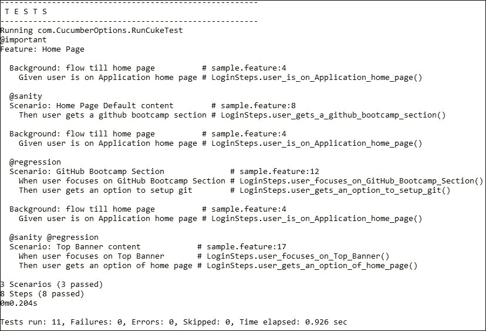
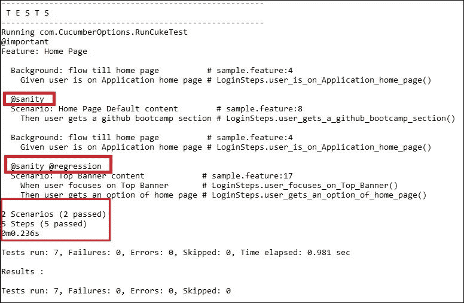
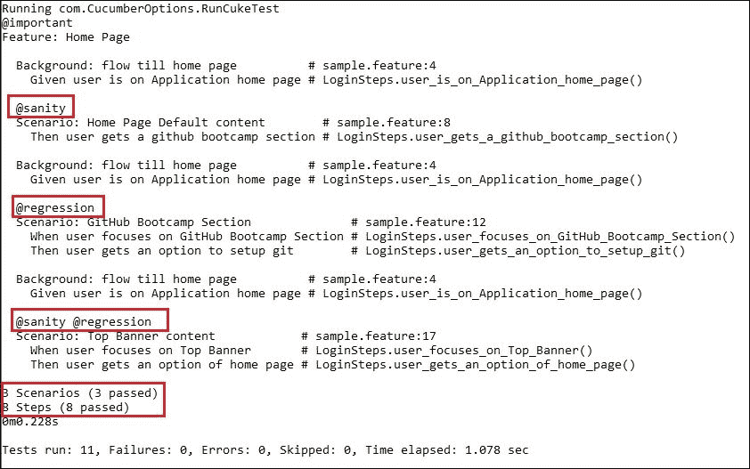
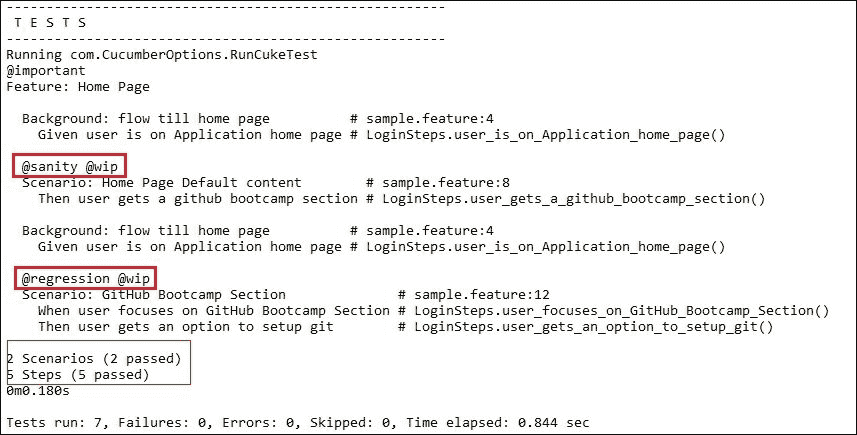
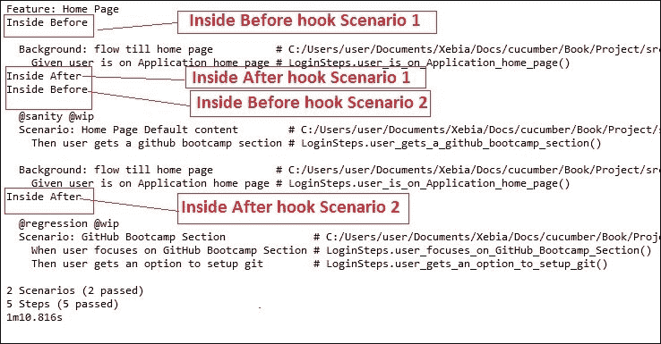
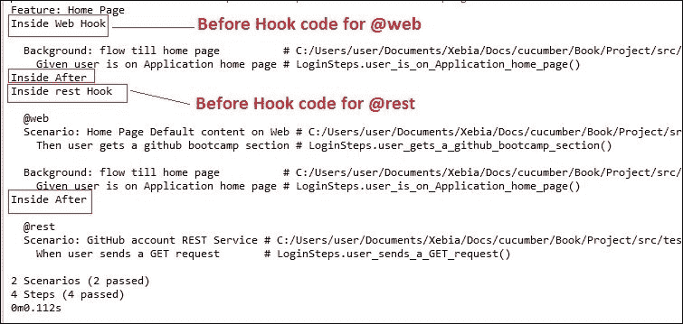
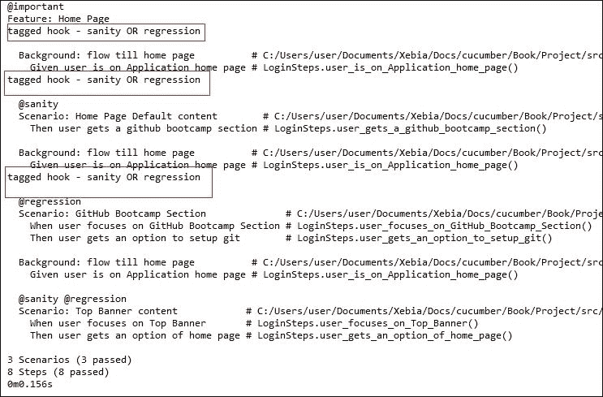
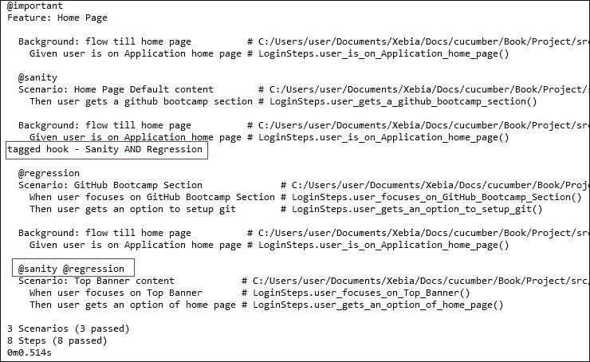
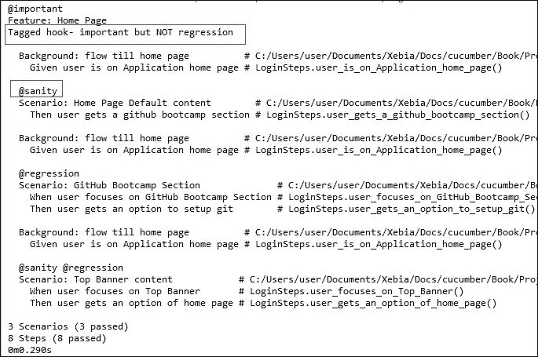
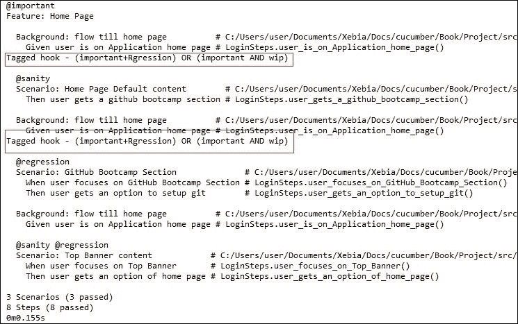

# 第三章。启用固定装置

在本章中，我们将涵盖以下主题：

+   标记

+   AND 和 OR 标记

+   将钩子添加到 Cucumber 代码中

+   标记钩子

+   使用 AND 和 OR 操作符对标记钩子进行操作

# 简介

在本章中，我们将讨论如何控制运行哪些特性，以及何时运行它们；例如，我们可能只想运行一组特性文件，比如 Sanity，或者我们可能想在每个场景之后截图。这种类型的控制称为**固定装置**。Cucumber 允许我们通过标记和钩子的概念启用固定装置。通过了解本章中介绍的概念，你将能够编写非常有效和高效的固定装置。

在本章中，我们将从标记和钩子的基本概念开始，然后是 AND 和 OR 操作，接着我们将介绍标记和钩子组合的强大功能。

# 标记

假设你是一名自动化架构师，你必须运行一组特定的场景或特性文件。这种情况可能经常发生：比如说我们对一个功能进行了更改，现在我们只想运行该功能的特性/场景。

现在，让我们了解如何将一些场景标记为 Sanity，一些标记为 Regression，一些两者都标记。让我们在下一节中看看。

现在，有`home_page.feature`文件，我们想将其标记为重要。我们还想将一些场景标记为`sanity`，一些标记为`regression`，或者一些两者都标记。那么，在 Cucumber 项目中我们该如何做呢？让我们在下一节中看看。

## 准备工作

让我们使用以下特性文件来完成这个菜谱：

```java
Feature: Home Page

  Background: flow till home page
    Given user is on Application home page

  Scenario: Home Page Default content
    Then user gets a GitHub Bootcamp section

  Scenario: GitHub Bootcamp Section
    When user focuses on GitHub Bootcamp Section
    Then user gets an option to setup git

  Scenario: Top Banner content
    When user focuses on Top Banner
    Then user gets an option of home page
```

## 如何做…

1.  我们只需要在场景之前简单地写上`@sanity`或`@regression`，在特性文件之前写上`@important`。参考代码中的高亮文本。这就是我们的更新后的`home_page.feature`文件应该看起来像的：

    ```java
    @important
    Feature: Home Page

      Background: flow till home page
        Given user is on Application home page

     @sanity
      Scenario: Home Page Default content
        Then user gets a GitHub Bootcamp section

     @regression
      Scenario: GitHub Bootcamp Section
        When user focuses on GitHub Bootcamp Section
        Then user gets an option to setup git

     @sanity @regression
      Scenario: Top Banner content
        When user focuses on Top Banner
        Then user gets an option of home page
    ```

1.  打开命令提示符并转到`project`目录。

1.  使用以下命令运行标记为`important`的特性文件：

    ```java
    mvn test -Dcucumber.options="--tags @important"

    ```

    我们将在下一章中详细探讨这个命令——暂时按原样使用它。

    我们将得到以下输出：

    

    虽然我们的项目中有很多特性文件，但只有标记为重要的特性文件会被运行，这就是为什么所有场景也被运行的原因。

1.  现在，在命令提示符中运行以下命令：

    ```java
    mvn test -Dcucumber.options="--tags @sanity"

    ```

    这是输出结果：

    

现在，只有两个场景被执行，并且执行的两个场景都被标记为`@sanity`。所以很明显，在运行 Cucumber 时提到的任何场景，只有那些场景会被运行。

## 它是如何工作的…

标记用于组织特性文件和场景。你通过在`Scenario`关键字之前的行上放置一个以`@`字符为前缀的单词来标记场景。

### 注意

一个特性/场景可以拥有多个标记；只需用空格分隔它们，或者将它们放在不同的行上。

继承是指标签被继承。如果一个特性文件有一个标签，那么 Cucumber 将会将该标签分配给该特性文件中的所有场景和所有场景轮廓。

您可以通过在终端运行 Cucumber 测试用例时使用`--tags`来自定义运行。以下是一些示例：

+   `mvn test -Dcucumber.options="--tags @important"`将会运行所有场景（因为我们正在运行与特性关联的标签）。

+   `mvn test -Dcucumber.options="--tags @sanity"`将会运行与`@sanity`标签关联的场景。

    ### 注意

    在任何标签前方的特殊字符`~`告诉 Cucumber 忽略所有与该标签关联的场景。

+   `mvn test -Dcucumber.options="--tags ~@important"`将会运行没有与`@important`标签关联的测试用例。

# AND 和 OR 操作符的标签

大多数时候，我们会同时修改许多功能；因此，测试人员测试所有这些功能变得至关重要。有时我们必须运行所有标记为`@sanity`和`@regression`的场景，有时我们想要运行`feature1`或`feature2`的所有场景。那么在 Cucumber 中我们该如何做呢？让我们在本节中看看。

## 准备工作

这是我们将用于本菜谱的`Feature`文件：

```java
@important
Feature: Home Page

  Background: flow till home page
    Given user is on Application home page

  @sanity
  Scenario: Home Page Default content
    Then user gets a GitHub Bootcamp section

  @regression
  Scenario: GitHub Bootcamp Section
    When user focuses on GitHub Bootcamp Section
    Then user gets an option to setup git

  @sanity @regression
  Scenario: Top Banner content
    When user focuses on Top Banner
    Then user gets an option of home page
```

## 如何操作…

1.  如果我们想要运行被标记为`sanity`和`regression`的场景，请在命令提示符中运行以下命令：

    ```java
    mvn test -Dcucumber.options="--tags @sanity --tags @regression"

    ```

    这就是输出结果：

    

    只运行被标记为同时具有`@sanity`和`@regression`标签的一个场景。

1.  如果我们想要运行被标记为`sanity`或`regression`的场景，请在命令提示符中运行以下命令：

    ```java
    mvn test -Dcucumber.options="--tags @regression,@sanity"

    ```

    这就是输出结果：

    

    运行被标记为`@sanity`或`@regression`的场景

1.  将`home_page.feature`文件更新为以下内容：

    ```java
    @important
    Feature: Home Page

      Background: flow till home page
        Given user is on Application home page

      @sanity @wip
      Scenario: Home Page Default content
        Then user gets a GitHub Bootcamp section

      @regression @wip
      Scenario: GitHub Bootcamp Section
        When user focuses on GitHub Bootcamp Section
        Then user gets an option to setup git

      @sanity @regression
      Scenario: Top Banner content
        When user focuses on Top Banner
    Then user gets an option of home page
    ```

1.  如果我们想要运行被标记为`@sanity AND @wip`或`@regression AND @wip`的场景，请运行以下命令：

    ```java
    mvn test -Dcucumber.options="--tags @sanity,@regression --tags @wip"

    ```

    这就是输出结果：

    

## 它是如何工作的…

现在我们来理解为什么在前一节中我们使用了 AND 和 OR 操作符来处理标签：

+   **AND 操作**：当我们想要运行所有提到的标签的场景时。标签必须在单独的`--tags`选项中提及；例如，`mvn test -Dcucumber.options="--tags @sanity --tags @Regression"`。

+   **OR 操作**：当我们想要运行具有所提及标签之一的场景时。标签必须在单个`–tags`选项中提及，但应以逗号分隔；例如，`mvn test -Dcucumber.options="--tags @wip,@sanity"`。

    ### 注意

    AND 和 OR 操作可以组合起来以实现更大的灵活性，以确定要运行的内容。

# 将钩子添加到 Cucumber 代码中

在找出如何运行一些选择性的功能之后，下一件大事是在测试场景之前或之后运行一些代码。这些是测试自动化框架的基本和期望的功能。这种功能的例子包括在执行开始前初始化浏览器和在执行完成后关闭浏览器。那么在 Cucumber 中我们该如何做呢？让我们在这个菜谱中看看。

## 准备工作

对于这个菜谱，我们将更新 `home_page.feature` 文件，如下所示：

```java
Feature: Home Page

  Background: flow till home page
    Given user is on Application home page

  @sanity @wip
  Scenario: Home Page Default content
    Then user gets a GitHub Bootcamp section

  @regression @wip
  Scenario: GitHub Bootcamp Section
    When user focuses on GitHub Bootcamp Section
    Then user gets an option to setup git
```

## 如何操作…

1.  在 `automation` 包中创建一个名为 `Hooks.java` 的 Java 类，并将以下代码放入其中（注意粗体和突出显示的文本）：

    ```java
    package com.automation;

    import org.openqa.selenium.WebDriver;
    import org.openqa.selenium.firefox.FirefoxDriver;

    import cucumber.api.java.After;
    import cucumber.api.java.Before;

    public class Hooks {

      public static WebDriver driver = null;

      public static String browser = "firefox";
      public static String baseURL = "https://GitHub.com/";

      @Before
      public static void createDriver() {

        System.out.println("Inside Before");
        createDriver(browser);
        OpenURL(baseURL);
      }

      public static void createDriver(final String browserId) {
        if (browserId.equalsIgnoreCase("firefox")) {
          driver = new FirefoxDriver();
        }
      }

      public static void OpenURL(String baseURL) {
        //Maximize window
        driver.manage().window().maximize();

        // Open URL on window
        driver.get(baseURL);
      }

      @After
      public void tearDown() {

        System.out.println("Inside After");
        driver.quit();
      }

    }
    ```

1.  现在，从 Eclipse 本身运行 `home_page.feature` 文件并注意输出：

## 它是如何工作的…

+   **钩子**：Cucumber 允许我们在测试用例执行过程中的特定点运行一段代码。这是通过钩子实现的。这种钩子的实际应用包括在执行前初始化浏览器和在执行后关闭浏览器。钩子代码通常保存在一个名为 `Hooks.java` 的文件中，但这不是强制性的。

+   **@Before**：在 `feature` 文件的所有场景之前，包括背景场景，都会运行 Before 钩子。如果有多个 `Before` 钩子，则它们将按照编写的顺序运行。

+   **@After**：After 钩子在 `feature` 文件的所有场景之后运行。如果有多个 `After` 钩子，则它们将按照编写的顺序运行。

    以下为执行顺序：

    1.  Before 钩子

    1.  背景

    1.  场景

    1.  After 钩子

## 更多内容…

虽然钩子是按照编写的顺序运行的，但可以使用 `order` 参数来定义自定义执行。默认值是 `10000`，Cucumber 从低到高运行 `@Before` 钩子。一个 `@Before` 钩子的 `order` 为 `100` 将在 `order` 为 `20` 的钩子之前运行。`@After` 钩子从高到低运行——因此一个 `order` 为 `200` 的 `@After` 钩子将在 `order` 为 `100` 的钩子之前运行。

示例：`@Before( order=5 )` 和 `@After( order =20)`

# 标记钩子

如果我们只想在特定场景之前执行某些代码，而不是在所有场景之前执行呢？考虑一种情况，我们想在浏览器自动化相关的场景中调用 Selenium Webdriver，在 `REST` 服务自动化相关的场景中使用 `REST` 客户端代码。在 Cucumber 中我们该如何做呢？让我们在下一节中看看。

## 准备工作

对于这个菜谱，我们将使用以下方式更新 `home_page.feature`：

```java
Feature: Home Page

  Background: flow till home page
    Given user is on Application home page

  @web
  Scenario: Home Page Default content on Web
    Then user gets a GitHub Bootcamp section

  @rest
  Scenario: GitHub account REST Service
    When user sends a GET request
```

## 如何操作…

1.  使用以下代码更新 `Hooks.java` 类的代码：

    ```java
    package com.automation;

    import org.openqa.selenium.WebDriver;

    import cucumber.api.java.After;
    import cucumber.api.java.Before;

    public class Hooks {

      public static WebDriver driver = null;

      public static String browser = "firefox";
      public static String baseURL = "https://GitHub.com/";

      @Before("@web")
      public static void createDriver() {

        System.out.println("Inside Web Hook");
        //sample code
      }

      @Before("@rest")
      public static void createrestBuilder() {

        System.out.println("Inside REST Hook");
        //sample code
      }

      @After
      public void tearDown() {

        System.out.println("Inside After");
        //Sample Code  }

    }
    ```

1.  从 Eclipse 运行 `home_page.feature` 文件并将 Cucumber 异常保存在 `Step Definitions` 文件中。

1.  再次从 Eclipse 运行 `home_page.feature` 文件；这是您将看到的输出：

## 它是如何工作的…

标记钩子是钩子和标签的组合。当只想为特定场景而不是所有场景执行某些操作时，使用标记钩子。我们必须在钩子后面添加括号中的标签，将其转换为标记钩子。

# 标记钩子的 AND 和 OR 操作

正如我们可以 AND 和 OR 标签一样，我们也可以 AND 和 OR 标签和钩子的组合。考虑一种情况，我们需要为某些功能执行特定的步骤，例如为 `feature1` 和 `feature2`，但不为其他功能执行。在 Cucumber 中我们如何做？让我们在这个菜谱中看看。

## 准备工作

我们将按照以下方式更新此菜谱的 `home_page.feature` 文件：

```java
@important
Feature: Home Page

  Background: flow till home page
    Given user is on Application home page

  @sanity
  Scenario: Home Page Default content
    Then user gets a GitHub Bootcamp section

  @regression
  Scenario: GitHub Bootcamp Section
    When user focuses on GitHub Bootcamp Section
    Then user gets an option to setup git

  @sanity @regression
  Scenario: Top Banner content
    When user focuses on Top Banner
    Then user gets an option of home page
```

## 如何操作

1.  要在标记为 `@sanity` 或 `@regression` 的场景之前运行钩子代码，将以下代码添加到 `hooks.java` 文件中：

    ```java
    @Before("@sanity,@regression")
    public void taggedHookMethod1() {

    System.out.println("tagged hook - sanity OR regression");
    }  
    ```

1.  从 Eclipse 运行 `feature` 文件并观察输出：

    代码将在所有场景之前运行，因为所有场景要么被标记为 `@sanity`，要么被标记为 `@regression`。

1.  要为同时标记为 `@sanity` 和 `@regression` 的场景运行钩子代码，在 `Hooks.java` 文件中注释掉之前的代码，并添加以下代码：

    ```java
    @Before({"@sanity","@regression"})
      public void taggedHookMethod2() {

        System.out.println("tagged hook - Sanity AND Regression");

    }
    ```

1.  从 Eclipse 运行 `feature` 文件并观察输出：

    代码将在具有两个标签 `@sanity` 和 `@regression` 的 Scenario 3 之前运行。

1.  要为标记为 `@important` 但 NOT `@regression` 的场景运行钩子代码，在 `Hooks.java` 文件中注释掉之前的代码，并添加以下代码：

    ```java
    @Before({"@important","~@regression"})
      public void taggedHookMethod3() {

        System.out.println("Tagged hook- important but NOT regression");
      }
    ```

1.  从 Eclipse 运行 `feature` 文件并观察输出：

    代码将在具有 `@important`（通过继承）且 NOT `@regression` 标签的 Scenario 1 之前运行。

1.  要为标记为 `(important AND regression` 或 `(important AND wip)` 的场景运行钩子代码，在 `Hooks.java` 文件中注释掉之前的代码，并添加以下代码：

    ```java
    @Before({"@important","@regression,@wip"})
    public void taggedHookMethod4() {

        System.out.println("Tagged hook - (important+regression) OR (important AND wip)");
    }
    ```

1.  从 Eclipse 运行 `feature` 文件并观察输出：

代码将在具有 `@important`（通过继承）和 `@regression` 标签的 Scenario 2 和 3 之前运行。

## 它是如何工作的…

现在我们来理解 ANDing、ORing 和 NOTing 钩子的概念。

+   **OR**：当提到的任何一个标签与场景相关联时，将运行钩子代码。标签以字符串形式传递，并以逗号分隔。例如：

    ```java
    @Before("@sanity,@wip")
    ```

+   **AND**：当提到的所有标签都与场景相关联时，将运行钩子代码。标签作为单独的标签字符串传递。例如：

    ```java
    @Before({"@sanity","@regression"})
    ```

+   **NOT**：当提到的所有标签都没有与场景相关联时，将运行钩子代码。标签作为单独的标签字符串传递。例如：

    ```java
    @Before({"@important","~@regression"})
    ```
