# 第六章：构建 Cucumber 框架

在本章中，我们将介绍以下食谱：

+   构建 Web 自动化框架

+   构建 Mobile 自动化框架

+   构建 REST 自动化框架

# 简介

Cucumber 是一个实现 BDD 的平台，而不是自动化应用程序。对于自动化应用程序，有各种 API 可用，如用于 Web 的 Selenium Webdriver、用于移动的 Appium 和用于 REST 服务的 HTTP Client。到目前为止，我们已经学习了各种 Cucumber 功能，以便我们可以构建一个健壮的自动化框架，但我们还需要将 Cucumber 与前面提到的 API 集成，以便我们可以拥有自动化实时应用程序的框架。

在本章中，我们将学习如何构建自动化 Web、REST 和移动应用程序的框架。

# 构建 Web 自动化框架

**Selenium** 是一个 Web 自动化工具，由于其功能和力量，它让测试人员的生活变得更加容易，并且是测试人员自动化网站的首选。这就是我们为什么也选择了 Selenium 作为我们的框架。

当我们创建一个框架时，我们应该记住添加新的测试用例和修改现有测试用例应该是相对简单和容易的。

让我们学习如何使用 Cucumber 和 Selenium 创建一个健壮的 Web 自动化框架，同时考虑到可维护性和可扩展性。

## 准备工作

根据最新 Selenium 版本支持的版本，在您的系统上安装 Firefox。有关 Selenium 和浏览器支持的更多信息，请访问 [`docs.seleniumhq.org/about/platforms.jsp`](http://docs.seleniumhq.org/about/platforms.jsp) 的网页。

## 如何操作…

让我们先了解在这个框架中我们将使用的测试用例。我们将测试 [`github.com/`](https://github.com/) 的登录功能。以下是测试用例流程：

1.  我们打开 [`github.com/`](https://github.com/) 并点击 **登录**。

1.  我们没有输入用户名和密码，然后点击 **登录**：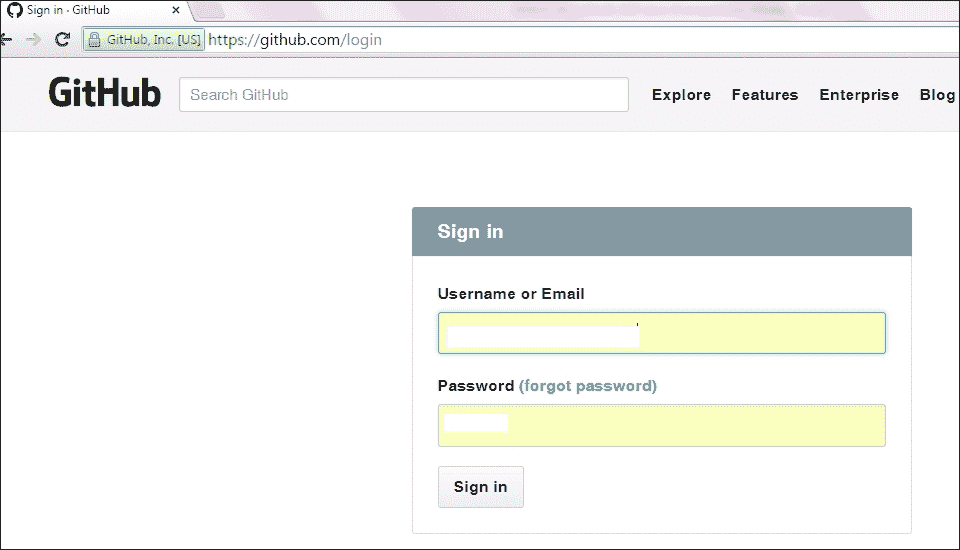

1.  我们验证我们得到的错误信息：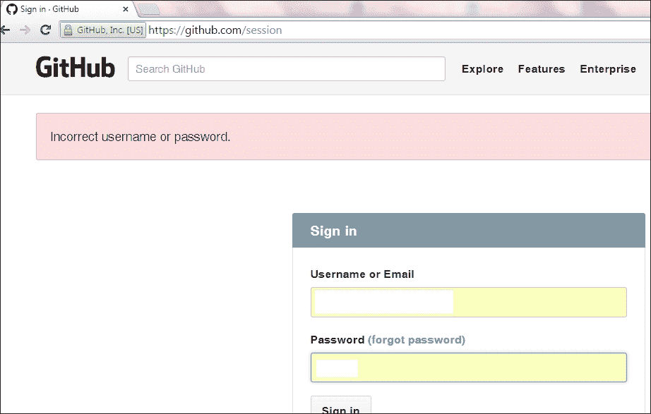

1.  我们将使用 Eclipse Maven 插件创建一个简单的 Maven 项目。在 Eclipse 菜单中点击 **新建**，然后按照截图创建名为 `CucumberWebAutomation` 的 Maven 项目：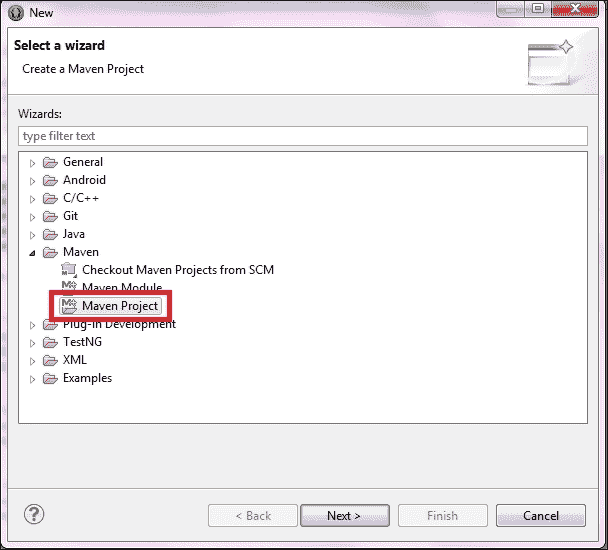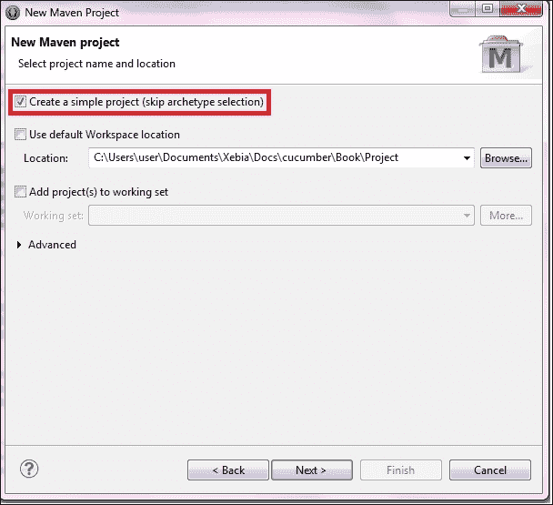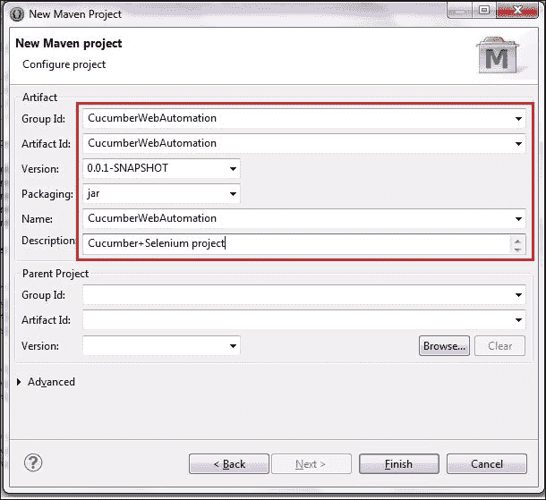

1.  由于这是一个 Maven 项目，我们将更新 `pom.xml` 文件以添加 Cucumber 和 Selenium 的依赖项。目前，`pom.xml` 的样子如下：

    ```java
    <project   
        xsi:schemaLocation="http://maven.apache.org/POM/4.0.0 http://maven.apache.org/xsd/maven-4.0.0.xsd">
      <modelVersion>4.0.0</modelVersion>
      <groupId>CucumberWebAutomation</groupId>
      <artifactId>CucumberWebAutomation</artifactId>
      <version>0.0.1-SNAPSHOT</version>
      <name>CucumberWebAutomation</name>
      <description>Cucumber+Selenium project</description>
    </project>
    ```

1.  我们将添加 `properties` 标签并定义 Cucumber 和 Selenium 的版本属性，这样当我们需要更新依赖项版本时，我们只需在一个地方进行操作。将以下代码添加到 `<project>` 标签内的 `pom.xml` 中：

    ```java
    <properties>
      <selenium.version>2.45.0</selenium.version>
      <cucumber.version>1.2.2</cucumber.version>
    </properties>
    ```

    ### 注意

    要检查 Maven 中央仓库上的最新依赖项版本，请参阅 [`search.maven.org/`](http://search.maven.org/)。

1.  我们将为 Cucumber-JVM（BDD）和 Selenium-JVM（网络自动化）添加依赖。请在`pom.xml`文件中的`</properties>`标签之后添加以下代码：

    ```java
    <dependencies>
      <!-- cucumber -->
      <dependency>
        <groupId>info.cukes</groupId>
        <artifactId>cucumber-java</artifactId>
        <version>${cucumber.version}</version>
        <scope>test</scope>
      </dependency>
      <dependency>
        <groupId>info.cukes</groupId>
        <artifactId>cucumber-junit</artifactId>
        <version>${cucumber.version}</version>
        <scope>test</scope>
      </dependency>

      <!-- Selenium -->
      <dependency>
        <groupId>org.seleniumhq.selenium</groupId>
        <artifactId>selenium-java</artifactId>
        <version>${selenium.version}</version>
      </dependency>
    </dependencies>
    ```

1.  我们将创建项目结构，并将相似的文件保存在同一个包中。按照此截图所示的步骤创建所需的包：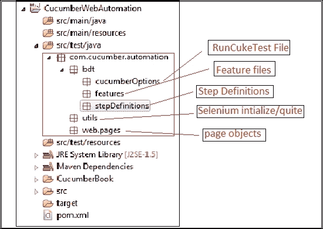

1.  由于这是一个 Cucumber 项目，我们将添加`RunCukeTest.java`文件来指定配置，例如特性文件的位置、步骤定义的位置、输出位置等。将以下类添加到`CucumberOptions`包中：

    ```java
    package com.cucumber.automation.bdt.cucumberOptions;

    import org.junit.runner.RunWith;

    import cucumber.api.CucumberOptions;
    import cucumber.api.junit.Cucumber;

    @RunWith(Cucumber.class)
    @CucumberOptions(

      features = "src/test/java/com/cucumber/automation/bdt/features",
        glue = "com.cucumber.automation.bdt.stepDefinitions",
          plugin = { 
            "pretty",
              "html:target/cucumber",
      }
    )
    public class RunCukeTest {
    }
    ```

1.  现在是时候添加一个特性文件来指定需求了。我们将把`github_login.feature`文件添加到`features`包中。这是我们的特性文件的样子：

    ```java
    Feature: login Page
      In order to test login page
      As a Registered user
      I want to specify the login conditions

      Scenario: login without username and password
        Given user is on github homepage
        When user clicks on Sign in button
        Then user is displayed login screen
        When user clicks Sign in button
        Then user gets an error message "Incorrect username or password."
    ```

1.  下一步是添加步骤定义。最简单的方法是运行一次项目，并使用 Cucumber 给出的建议。在`stepDefinitions`包中添加一个名为`GithubLoginSD.java`的文件，并包含以下代码：

    ```java
    package com.cucumber.automation.bdt.stepDefinitions;

    import cucumber.api.java.en.Given;
    import cucumber.api.java.en.Then;
    import cucumber.api.java.en.When;

    public class GithubLoginSD {

      @Given("^user is on github homepage$")
      public void user_is_on_github_homepage()  {  

      }

      @When("^user clicks on Sign in button$")
      public void user_clicks_on_Sign_in_button()  {  

      }

      @Then("^user is displayed login screen$")
      public void user_is_displayed_login_screen()  {

      }

      @When("^user clicks Sign in button$")
      public void user_clicks_Sign_in_button()  {  

      }

      @Then("^user gets an error message \"(.*?)\"$")
      public void user_gets_an_error_message(String arg1)  {

      }

    }
    ```

1.  现在我们需要添加 Selenium 函数，这些函数可以在执行完成后调用 Firefox 浏览器并关闭浏览器。出于简单起见，我将保持此文件非常基础。在`utils`包中创建`DriverFactory.java`类，代码应该如下所示：

    ```java
    package com.cucumber.automation.utils;

    import java.net.MalformedURLException;
    import java.util.concurrent.TimeUnit;

    import org.openqa.selenium.WebDriver;
    import org.openqa.selenium.firefox.FirefoxDriver;
    import org.openqa.selenium.support.ui.WebDriverWait;

    public class DriverFactory {

      public static WebDriver driver = null;
      public static WebDriverWait waitVar = null;

      public static String baseURL = "https://github.com/";

      /**
       *  This function is to invoke Selenium Webdriver
       * 
       * @throws MalformedURLException
       * @throws InterruptedException
       */
      public void createDriver() throws MalformedURLException,
      InterruptedException {

        driver = new FirefoxDriver();

        driver.manage().window().maximize();
        driver.manage().timeouts().implicitlyWait(15, TimeUnit.SECONDS);

        driver.get(baseURL);

        waitVar = new WebDriverWait(driver, 15);
      }

      /**
       * This function is to close driver instance
       */
      public void teardown() {
        driver.quit();
      }
    }
    ```

1.  现在我们需要挂钩此代码，以便在每个场景之前启动浏览器，在每个场景之后关闭浏览器。在`stepdefinitions`包中创建一个名为`Hooks.java`的文件，并包含以下代码：

    ```java
    package com.cucumber.automation.bdt.stepDefinitions;

    import java.net.MalformedURLException;

    import com.cucumber.automation.utils.DriverFactory;

    import cucumber.api.java.After;
    import cucumber.api.java.Before;

    public class Hooks {

      DriverFactory df = new DriverFactory();

    @Before
      public void beforeScenario() throws MalformedURLException, InterruptedException{

      df.createDriver();
      }

    @After
      public void afterScenario(){
      df.teardown();
      }
    }
    ```

1.  现在我们将实现**页面对象模型**（**POM**），这样维护和扩展 Selenium 代码将会相对简单。我也将 POM 保持得相对简单；你可以在你的项目中自由扩展它。

    我们将在`web.pages`包中添加 GitHub 登录页面的`page`对象，代码将如下所示：

    ```java
    package com.cucumber.automation.web.pages;

    import static org.junit.Assert.assertEquals;

    import org.openqa.selenium.By;
    import org.openqa.selenium.support.ui.ExpectedConditions;

    import com.cucumber.automation.utils.DriverFactory;

    public class LoginPage extends DriverFactory {

      /**
       * All locators will be mentioned here
       * 
       * For this example i am not using properties file for reading locators
       */

      By SigninLink = By.linkText("Sign in");
      By marketingSection = By.className("marketing-section-signup");
      By loginSection = By.className("auth-form-body");
      By SigninButton = By.name("commit");
      By errorMessage = By.xpath("//div[@id='site-container']/div/div");

      /**
       * All functions related to behavior will follow now
       */
    public void ishomepageDisplayed() {
      waitVar.until(ExpectedConditions.presenceOfElementLocated(SigninLink));

      driver.findElement(SigninLink).isDisplayed();
      driver.findElement(marketingSection).isDisplayed();
    }

    public void clickSigninLink() {
      driver.findElement(SigninLink).click();
    }

    public void isloginsectionDisplayed() {
      waitVar.until(ExpectedConditions.presenceOfElementLocated(loginSection));
      waitVar.until(ExpectedConditions.presenceOfElementLocated(SigninButton));
    }

    public void clickSigninButton() {
      driver.findElement(SigninButton).click();
    }

    public void verifyErrorMessage(String msg) {
      waitVar.until(ExpectedConditions.presenceOfElementLocated(errorMessage));

      assertEquals(msg, driver.findElement(errorMessage).getText());
    }
    }
    ```

1.  我们将不得不更新我们刚刚编写的 Selenium 函数的步骤定义文件。添加所有函数后，代码应该看起来像这样：

    ```java
    package com.cucumber.automation.bdt.stepDefinitions;

    import com.cucumber.automation.web.pages.LoginPage;

    import cucumber.api.java.en.Given;
    import cucumber.api.java.en.Then;
    import cucumber.api.java.en.When;

    public class GithubLoginSD {

      LoginPage lp = new LoginPage();

      @Given("^user is on github homepage$")
      public void user_is_on_github_homepage()  {  
        lp.ishomepageDisplayed();
      }

      @When("^user clicks on Sign in button$")
      public void user_clicks_on_Sign_in_button()  {  
        lp.clickSigninLink();
      }

      @Then("^user is displayed login screen$")
      public void user_is_displayed_login_screen()  {
        lp.isloginsectionDisplayed();
      }

      @When("^user clicks Sign in button$")
      public void user_clicks_Sign_in_button()  {  
        lp.clickSigninButton();
      }

      @Then("^user gets an error message \"(.*?)\"$")
      public void user_gets_an_error_message(String arg1)  {
        lp.verifyErrorMessage(arg1);
      }

    }
    ```

1.  我们的框架已经准备好执行。我们可以从 Eclipse 或命令行运行此框架。让我们使用`mvn test`从命令行运行它。以下是将显示的输出：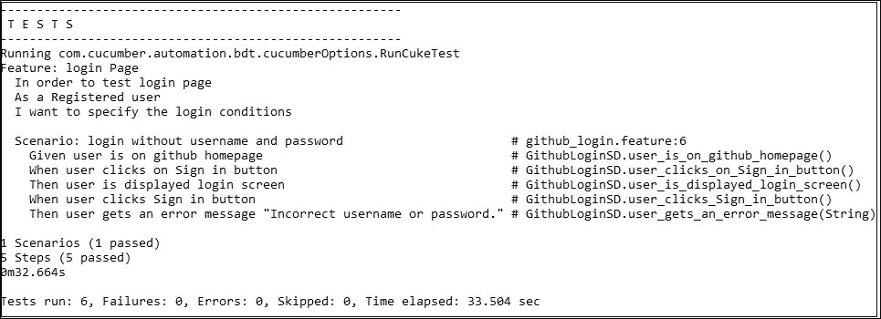

## 它是如何工作的…

我们已经将 Cucumber、Selenium、Maven、Java 和页面对象集成到我们的 Web 自动化框架设计中。Cucumber 用于实现 BDD，这样非技术人员也可以直接参与到开发中来——Selenium 用于网络自动化，Java 作为编程语言，Maven 作为构建工具。

页面对象是一种框架设计方法，用于维护和访问分散在测试场景中的组件和控制。页面对象为我们的测试创建了一个领域特定语言（DSL），这样如果页面上有东西发生变化，我们不需要更改测试；我们只需要更新代表页面的对象。

# 构建移动自动化框架

**Appium** 是一个开源的移动自动化工具，它使测试人员的生活变得更加容易，因为它支持 Android 和 iOS。它扩展了 Selenium API，因此所有 Selenium 的优势加上在多个平台上运行测试用例的优势，使其成为移动自动化的明显选择。

让我们学习如何使用 Cucumber 和 Appium 创建一个健壮的移动自动化框架，同时考虑到使用页面对象模型来保持可维护性和可扩展性。

我只是演示 Android 应用程序自动化；相同的项目和框架也可以用于 iOS 自动化。如果需要，我还会为 iOS 包创建占位符供您参考，以便您可以使用单个框架同时为 Android 和 iOS 应用程序进行自动化。

## 准备工作

1.  在您的系统上下载并安装 Appium，更多信息请参阅 [`appium.io/downloads.html`](http://appium.io/downloads.html)。

1.  从 [`developer.android.com/tools/help/sdk-manager.html`](http://developer.android.com/tools/help/sdk-manager.html) 下载并安装 Android SDK Manager。

1.  从 [`developer.android.com/tools/help/avd-manager.html`](http://developer.android.com/tools/help/avd-manager.html) 下载并安装 Android AVD Manager。

1.  创建一个 Android 虚拟设备来运行应用程序。更多信息请参阅 [`developer.android.com/tools/devices/managing-avds.html`](http://developer.android.com/tools/devices/managing-avds.html)。

    ### 注意

    在 Windows 上运行 Android 或在 Appium 上运行测试用例超出了本书的范围。我们期望读者具备基本的移动自动化知识。我们将专注于创建 Cucumber Appium 框架。

## 如何操作…

让我们首先了解在这个框架中我们将使用的测试用例。我们将使用 Android 的 Agile NCR 应用程序来完成这个菜谱。让我一步步说明测试步骤：

1.  我们打开 **Agile NCR** 应用程序并验证主页：

1.  我们点击 **议程** 选项并验证 **议程** 屏幕：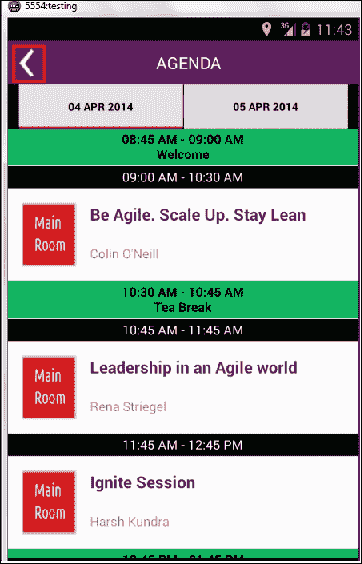

1.  我们点击后退按钮并验证主页。

    ### 注意

    我已经将此应用程序包含在可在 GitHub 上找到的项目中。

1.  我们将使用 Eclipse Maven 插件创建一个简单的 Maven 项目。使用第一道菜中提到的相同步骤创建项目，并将其命名为 `CucumberMobileAutomation`。

1.  由于这是一个 Maven 项目，我们将更新 `pom.xml` 文件以添加 Cucumber 和 Appium 的依赖项。到目前为止，`pom.xml` 文件看起来是这样的：

    ```java
    <project   
        xsi:schemaLocation="http://maven.apache.org/POM/4.0.0 http://maven.apache.org/xsd/maven-4.0.0.xsd">
      <modelVersion>4.0.0</modelVersion>
      <groupId>CucumberMobileAutomation</groupId>
      <artifactId>CucumberMobileAutomation</artifactId>
      <version>0.0.1-SNAPSHOT</version>
      <name>CucumberMobileAutomation</name>
      <description>Cucumber+Appium project</description>

    </project>
    ```

1.  我们将添加 `properties` 标签并定义 Cucumber 和 Appium 的版本属性，这样当我们需要更新依赖项版本时，我们只需在一个地方进行操作。将以下代码添加到 `pom.xml` 文件中：

    ```java
    <properties>
      <appium.version>2.2.0</appium.version>
      <cucumber.version>1.2.2</cucumber.version>
    </properties>
    ```

    ### 注意

    要检查 Maven 中央仓库上的最新依赖版本，请参阅 [`search.maven.org/`](http://search.maven.org/)。

1.  我们将为 Cucumber-JVM 添加依赖以实现 BDD，并为移动自动化添加 Appium-Java。将以下代码添加到 `pom.xml` 中：

    ```java
    <dependencies>
      <!-- cucumber -->
      <dependency>
        <groupId>info.cukes</groupId>
        <artifactId>cucumber-java</artifactId>
        <version>${cucumber.version}</version>
        <scope>test</scope>
      </dependency>
      <dependency>
        <groupId>info.cukes</groupId>
        <artifactId>cucumber-junit</artifactId>
        <version>${cucumber.version}</version>
        <scope>test</scope>
      </dependency>

      <!--  Appium -->
      <dependency>
          <groupId>io.appium</groupId>
          <artifactId>java-client</artifactId>
          <version>${appium.version}</version>
      </dependency>
    </dependencies>
    ```

1.  我们将创建项目结构，并将类似文件保存在相同的包中。我将使用为 Android 添加的包，并将为 iOS 添加的包作为参考。按照此截图所示的步骤操作，创建以下包：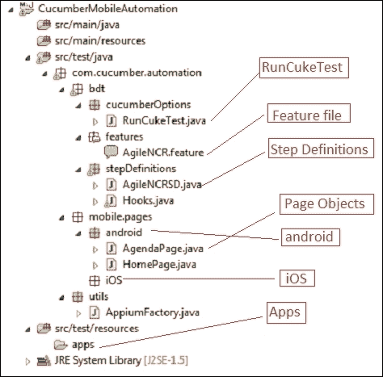

1.  由于这是一个 Cucumber 项目，我们将添加 `RunCukeTest.java` 文件来指定配置，例如 Feature 文件的位置、步骤定义的位置和输出位置等。将以下类添加到 `CucumberOptions` 包中：

    ```java
    package com.cucumber.automation.bdt.cucumberOptions;

    import org.junit.runner.RunWith;

    import cucumber.api.CucumberOptions;
    import cucumber.api.junit.Cucumber;

    @RunWith(Cucumber.class)
    @CucumberOptions(

      features = "src/test/java/com/cucumber/automation/bdt/features",
          glue = "com.cucumber.automation.bdt.stepDefinitions",
            plugin = { 
              "pretty",
                "html:target/cucumber",
            }
    )
    public class RunCukeTest {
    }
    ```

1.  现在是时候添加一个特性文件来指定需求了。我们将添加 `agile_ncr.feature` 文件到 `features` 包中。这是我们的特性文件的样子：

    ```java
    Feature: Agile NCR App
      In order to look at Agile NCR Conference
      As a Registered user
      I want to specify the flow to Agenda and Speakers

    Scenario: Agenda
      Given user is on AgileNCR Home Page
      Then user gets an option Agenda
      When user selects Agenda
      Then user is on Agenda Screen
      When user chooses to go back
      Then user is on AgileNCR Home Page
    ```

1.  下一步是添加步骤定义。最简单的方法是运行一次项目并使用 Cucumber 提供的建议。将文件 `AgileNCRSD.java` 添加到 `stepDefinitions` 包中，它应该包含以下代码：

    ```java
    package com.cucumber.automation.bdt.stepDefinitions;

    import cucumber.api.java.en.Given;
    import cucumber.api.java.en.Then;
    import cucumber.api.java.en.When;

    public class AgileNCRSD {

      @Given("^user is on AgileNCR Home Page$")
      public void user_is_on_AgileNCR_Home_Page()  {

      }

      @Then("^user gets an option Agenda$")
      public void user_gets_an_option_Agenda()  {

      }

      @When("^user selects Agenda$")
      public void user_selects_Agenda()  {

      }

      @Then("^user is on Agenda Screen$")
      public void user_is_on_Agenda_Screen()  {

      }

      @When("^user chooses to go back$")
      public void user_chooses_to_go_back()  {

      }

    }
    ```

1.  现在，将运行 `app` 所需的 `.apk` 文件添加到 `src/test/resources` 中的 apps 文件夹。

1.  然后，我们需要添加 Appium 功能，这些功能可以用来调用 Android 应用并在执行完成后关闭应用。为了简化，我保持这个文件非常基础。在 `utils` 包中创建 `AppiumFactory.java` 类，代码应该如下所示：

    ```java
    package com.cucumber.automation.utils;

    import io.appium.java_client.android.AndroidDriver;

    import java.io.File;
    import java.net.MalformedURLException;
    import java.net.URL;

    import org.openqa.selenium.remote.DesiredCapabilities;
    import org.openqa.selenium.support.ui.WebDriverWait;

    public class AppiumFactory {

      public static AndroidDriver driver = null;
      public static WebDriverWait waitVar = null;

      /**
       * This function is to invoke Appium
       * 
       * @throws MalformedURLException
       * @throws InterruptedException
       */
      public void createDriver() throws MalformedURLException {

        // set up appium
        final File classpathRoot = new File(System.getProperty("user.dir"));
        final File appDir = new File(classpathRoot, "src/test/resources/apps");
        final File app = new File(appDir, "com.xebia.eventsapp_2.1.apk");

        final DesiredCapabilities capabilities = new DesiredCapabilities();
        capabilities.setCapability("platformName", "Android");
        capabilities.setCapability("deviceName", "Android Emulator");
        capabilities.setCapability("platformVersion", "4.4");
        capabilities.setCapability("app", app.getAbsolutePath());

        driver = new AndroidDriver(new URL("http://127.0.0.1:4723/wd/hub"),
        capabilities);

        waitVar = new WebDriverWait(driver, 90);

      }

      /**
       * This function is to close driver instance
       */
      public void teardown() {
        driver.quit();
      }
    }
    ```

1.  现在，我们需要挂钩此代码，以便在每个场景之前启动浏览器，在每个场景之后关闭浏览器。在 `stepdefinitions` 包中创建一个 `Hooks.java` 文件，包含以下代码：

    ```java
    package com.cucumber.automation.bdt.stepDefinitions;

    import java.net.MalformedURLException;
    import com.cucumber.automation.utils.AppiumFactory;
    import cucumber.api.java.After;
    import cucumber.api.java.Before;

    public class Hooks {

      AppiumFactory df = new AppiumFactory();

    @Before
      public void beforeScenario() throws MalformedURLException, InterruptedException{
        df.createDriver();
      }

    @After
      public void afterScenario(){
        df.teardown();
      }
    }
    ```

1.  现在，我们将实现 POM，这样维护和扩展 Appium 代码将会相对简单。我也将 POM 保持得相对简单；你可以在你的项目中自由扩展它。

    我们将添加两个页面对象，一个用于 `HomePage`，另一个用于 `AgendaPage`。`HomePage.java` 的代码如下所示：

    ```java
    package com.cucumber.automation.mobile.pages.android;

    import static org.junit.Assert.assertTrue;
    import org.openqa.selenium.By;
    import org.openqa.selenium.support.ui.ExpectedConditions;
    import com.cucumber.automation.utils.AppiumFactory;

    public class HomePage extends AppiumFactory {

      /**
       * All locators will be mentioned here
       * 
       * For this example i am not using properties file for reading locators
       */
        By homePageImage = By.id("com.xebia.eventsapp:id/home_banner_imageView");
        By agendaButton = By.id("com.xebia.eventsapp:id/home_agenda_title");

        By backButton = By.id("android:id/home");

      /**
       * All functions related to behavior will follow now
       */
      public void verifyHomePage(){
        waitVar.until(ExpectedConditions.presenceOfElementLocated(homePageImage));
        assertTrue(driver.findElement(homePageImage).isDisplayed());
      }

      public void verifyHomePageOptions(){
        waitVar.until(ExpectedConditions.presenceOfElementLocated(homePageImage));
        waitVar.until(ExpectedConditions.elementToBeClickable(agendaButton));

        assertTrue(driver.findElement(agendaButton).isDisplayed());
      }

      public void clickAgenda(){
        driver.findElement(agendaButton).click();
      }
    }
    ```

    `AgendaPage.java` 的代码如下所示：

    ```java
    package com.cucumber.automation.mobile.pages.android;

    import static org.junit.Assert.*;
    import org.openqa.selenium.By;
    import org.openqa.selenium.support.ui.ExpectedConditions;
    import com.cucumber.automation.utils.AppiumFactory;

    public class AgendaPage extends AppiumFactory {

      // All the locators for Agenda page will be defined here
      By title = By.id("com.xebia.eventsapp:id/action_bar_custom_title");
      By AgendaList = By.className("android.widget.LinearLayout");

      By backButton = By.id("android:id/home");

      // All the behavior of Agenda page will be defined here in functions
      public void verifyAgendaPage() {

        waitVar.until(ExpectedConditions.presenceOfElementLocated(title));

        assertEquals("Agenda", driver.findElement(title).getText());
        assertTrue(driver.findElements(AgendaList).size() >= 0);
      }

      public void clickBack() {
        driver.findElement(backButton).click();
      }

    }
    ```

1.  我们将不得不更新我们刚刚编写的 Selenium 函数的步骤定义文件。添加所有函数后，代码应该如下所示：

    ```java
    package com.cucumber.automation.bdt.stepDefinitions;

    import com.cucumber.automation.mobile.pages.android.AgendaPage;
    import com.cucumber.automation.mobile.pages.android.HomePage;

    import cucumber.api.java.en.Given;
    import cucumber.api.java.en.Then;
    import cucumber.api.java.en.When;

    public class AgileNCRSD {

      HomePage hp = new HomePage();
      AgendaPage ap = new AgendaPage();

      @Given("^user is on AgileNCR Home Page$")
      public void user_is_on_AgileNCR_Home_Page() {
        hp.verifyHomePage();
      }

      @Then("^user gets an option Agenda$")
      public void user_gets_an_option_Agenda() {
        hp.verifyHomePageOptions();
      }

      @When("^user selects Agenda$")
      public void user_selects_Agenda() {
        hp.clickAgenda();
      }

      @Then("^user is on Agenda Screen$")
      public void user_is_on_Agenda_Screen() {
        ap.verifyAgendaPage();
      }

      @When("^user chooses to go back$")
      public void user_chooses_to_go_back() {
        ap.clickBack();
      }

    }
    ```

1.  我们的框架已经准备好了。在我们开始执行之前，我们需要启动 Appium 服务器。使用默认设置启动 Appium 服务器，如下截图所示：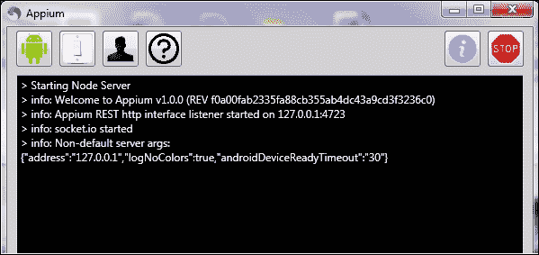

1.  我们可以从 Eclipse 或命令行运行此框架。让我们使用 `mvn test` 从命令行运行它。以下是输出：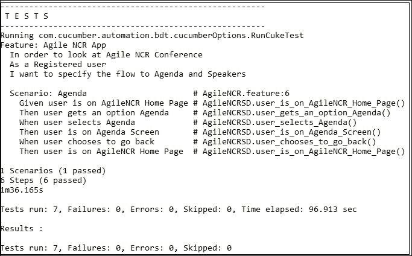

## 它是如何工作的…

我们已经集成了 Cucumber、Appium、Maven、Java 和页面对象来设计我们的移动自动化框架。Cucumber 用于实现 BDD，这样非技术人员也可以直接参与到开发中——Appium 用于网页自动化，Java 作为编程语言，Maven 作为构建工具。

Page Objects 是一种用于维护和访问分散在测试场景中的组件和控制的框架设计方法。Page Object 为我们的测试创建了一个 DSL；因此，如果页面上有东西发生变化，我们不需要更改测试；我们只需要更新代表页面的对象。

# 构建 REST 自动化框架

HTTP 客户端是由 Apache 开发的开源 REST 服务库。我使用 HTTP 客户端来构建这个框架，因为它是一个纯 Java 实现，非常易于使用。我们需要创建一个 HTTP 客户端实例，然后只需使用已定义的其中一个函数即可。

由于没有涉及 UI，并且我们对需要使用的功能有限制，因此在这个框架中不需要 POM。让我们学习如何使用 Cucumber 和 HTTP 客户端创建一个健壮的 REST 自动化框架。

### 注意

我只是演示 REST 服务自动化，同样的项目和框架也可以用于 SOAP 自动化。

## 如何操作…

让我们先了解在这个框架中我们将使用的测试用例。我将测试 `GET` 和 `POST` 方法。让我一步步说明测试步骤。

1.  向 GitHub URL [`api.github.com/users/ShankarGarg`](https://api.github.com/users/ShankarGarg) 发送 `GET` 请求以验证用户详情。

1.  向 Apple 服务中心 [`selfsolve.apple.com/wcResults.do`](https://selfsolve.apple.com/wcResults.do) 发送 `POST` 请求以注册您的设备。

1.  我们将使用 Eclipse Maven 插件创建一个简单的 Maven 项目。按照第一道菜谱中提到的步骤创建项目，并将其命名为 `CucumberRESTAutomation`。

1.  由于这是一个 Maven 项目，我们将更新 `pom.xml` 文件以添加 Cucumber 和 Appium 的依赖项。到目前为止，`pom.xml` 文件看起来是这样的：

    ```java
    <project  
        xsi:schemaLocation="http://maven.apache.org/POM/4.0.0 http://maven.apache.org/xsd/maven-4.0.0.xsd">
      <modelVersion>4.0.0</modelVersion>
      <groupId>CucumberRESTAutomation</groupId>
      <artifactId>CucumberRESTAutomation</artifactId>
      <version>0.0.1-SNAPSHOT</version>
      <name>CucumberRESTAutomation</name>
      <description>Cucumber+HTTP Client project</description>
    </project>
    ```

1.  我们将添加 `properties` 标签并定义 Cucumber 和 Appium 版本的属性，这样当我们需要更新依赖项版本时，我们只需在一个地方进行更新。将以下代码添加到 `pom.xml` 中：

    ```java
    <properties>
      <http.version>4.4.1</http.version>
      <cucumber.version>1.2.2</cucumber.version>
    </properties>
    ```

    ### 注意

    要检查 Maven 中央仓库上的最新依赖项版本，请参阅 [`search.maven.org/`](http://search.maven.org/)。

1.  我们将为 Cucumber-JVM 添加依赖项以支持 BDD，为 Appium-java 添加依赖项以支持移动自动化。将以下代码添加到 `pom.xml` 中：

    ```java
    <dependencies>
      <!-- cucumber -->
      <dependency>
        <groupId>info.cukes</groupId>
        <artifactId>cucumber-java</artifactId>
        <version>${cucumber.version}</version>
        <scope>test</scope>
      </dependency>
      <dependency>
        <groupId>info.cukes</groupId>
        <artifactId>cucumber-junit</artifactId>
        <version>${cucumber.version}</version>
        <scope>test</scope>
      </dependency>

      <!-- HTTPClient -->
      <dependency>
        <groupId>org.apache.httpcomponents</groupId>
        <artifactId>httpclient</artifactId>
        <version>${http.version}</version>
      </dependency>
    </dependencies>
    ```

1.  我们将创建项目结构，并将类似文件放在同一个包中。按照此截图中的步骤创建以下包：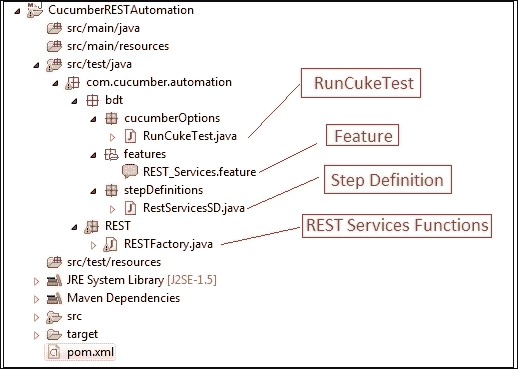

1.  由于这是一个 Cucumber 项目，我们将向 `CucumberOptions` 包添加 `RunCukeTest.java` 文件以指定配置，例如特征文件的位置、步骤定义的位置、输出位置等。将以下类添加到 `CucumberOptions` 包中：

    ```java
    package com.cucumber.automation.bdt.cucumberOptions;

    import org.junit.runner.RunWith;

    import cucumber.api.CucumberOptions;
    import cucumber.api.junit.Cucumber;

    @RunWith(Cucumber.class)
    @CucumberOptions(

      features = "src/test/java/com/cucumber/automation/bdt/features",
      glue = "com.cucumber.automation.bdt.stepDefinitions",
      plugin = { 
        "pretty",
          "html:target/cucumber",
      } 
    )
    public class RunCukeTest {
    }
    ```

1.  现在是时候添加特征文件以指定需求了。我们将添加 `REST_Services.feature` 文件到 `features` 包中。这是我们的特征文件看起来是这样的：

    ```java
    Feature: SOA Test
      In order to test rest services
      As a Registered user
      I want to specify the rest services test conditions

      Scenario: GET Request - GIT Hub User details
        When user sends a GET request with "https://api.github.com/users/ShankarGarg"
        Then status code should be 200
        And response type should be "json"
        And response contains user name "Shankar Garg"

      Scenario: POST Request - Register a user
        When user sends a POST request to "https://selfsolve.apple.com/wcResults.do" with following details
          | key    | value        |
          | sn     | C2WGC14ADRJ7 |
          | cn     |              |
          | locale |              |
          | caller |              |
          | num    | 12345        |
        Then status code should be 200
        And response type should be "html"
        And response contains user name "C2WGC14ADRJ7"
    ```

1.  下一步是添加步骤定义。最简单的方法是运行一次项目，并使用 Cucumber 提供的建议。在 `stepDefinitions` 包中添加一个 `RESTServicesSD.java` 文件，并应包含以下代码：

    ```java
    package com.cucumber.automation.bdt.stepDefinitions;

    import cucumber.api.DataTable;
    import cucumber.api.java.en.Then;
    import cucumber.api.java.en.When;

    public class RestServicesSD {

      @When("^user sends a GET request with \"(.*?)\"$")
      public void user_sends_a_GET_request_with(String arg1) {
      }

      @Then("^status code should be (\\d+)$")
      public void status_code_should_be(int arg1) {
      }

      @Then("^response type should be \"(.*?)\"$")
      public void response_type_should_be(String arg1) {
      }

      @Then("^response contains user name \"(.*?)\"$")
      public void response_contains_user_name(String arg1) {
      }

      @When("^user sends a POST request to \"(.*?)\" with follwoing details$")
      public void user_sends_a_POST_request_to_with_follwoing_details(
          String arg1, DataTable arg2) {
        }

    }
    ```

1.  现在，我们需要添加 HTTP 客户端函数，这些函数可以用来发送 `GET` 和 `POST` 方法。为了演示目的，我在文件中保留了所需的最小函数。

    ```java
    package com.cucumber.automation.REST;

    import static org.junit.Assert.*;

    import java.io.IOException;
    import java.util.ArrayList;
    import java.util.List;

    import org.apache.http.HttpEntity;
    import org.apache.http.HttpResponse;
    import org.apache.http.NameValuePair;
    import org.apache.http.ParseException;
    import org.apache.http.client.ClientProtocolException;
    import org.apache.http.client.HttpClient;
    import org.apache.http.client.config.RequestConfig;
    import org.apache.http.client.entity.UrlEncodedFormEntity;
    import org.apache.http.client.methods.HttpGet;
    import org.apache.http.client.methods.HttpPost;
    import org.apache.http.client.methods.HttpUriRequest;
    import org.apache.http.entity.ContentType;
    import org.apache.http.impl.client.DefaultHttpClient;
    import org.apache.http.impl.client.HttpClientBuilder;
    import org.apache.http.message.BasicNameValuePair;
    import org.apache.http.util.EntityUtils;

    import cucumber.api.DataTable;

    public class RESTFactory {

      @SuppressWarnings("deprecation")
      HttpClient client = new DefaultHttpClient();
      static HttpResponse httpResponse = null;
      static String responseString = null;
      String getURL = "";

      public void getRequest(String url) throws ClientProtocolException, IOException{
        RequestConfig requestConfig = RequestConfig.custom().setConnectionRequestTimeout(20000).setConnectTimeout(20000).setSocketTimeout(20000).build();
        HttpClientBuilder builder = HttpClientBuilder.create().setDefaultRequestConfig(requestConfig);
        getURL = url;
        HttpUriRequest request = new HttpGet( url );

        httpResponse = builder.build().execute( request );

      }

      public void verifyStatusCode(int statusCode) throws ClientProtocolException, IOException {
        assertEquals(statusCode, httpResponse.getStatusLine().getStatusCode());
      }

      public void verifyResponseType(String type){
        String mimeType = ContentType.getOrDefault(httpResponse.getEntity()).getMimeType();
        assertTrue( mimeType.contains(type) );
      }

      public void verifyResponseData(String responseData) throws ParseException, IOException{
        HttpEntity entity = httpResponse.getEntity();
        responseString = EntityUtils.toString(entity, "UTF-8");

        assertTrue(responseString.contains(responseData));
      }

      public void postRequest(String url, DataTable payloadTable) throws ClientProtocolException, IOException{
        List<List<String>> payload = payloadTable.raw();

        HttpPost post = new HttpPost(url);
        List<NameValuePair> urlParameters = new ArrayList<NameValuePair>(1);

        for (int i=1; i<payload.size();i++){
          urlParameters.add(new BasicNameValuePair(payload.get(i).get(0), payload.get(i).get(1)));
        }

        post.setEntity(new UrlEncodedFormEntity(urlParameters));

        httpResponse = client.execute(post);
      }
    }
    ```

    ### 注意

    预期读者了解关于 REST 服务的基础知识——例如 `GET` 和 `POST` 方法等不同功能。

1.  我们在这里不需要任何钩子文件，因为我们不需要在测试用例之前或之后调用任何浏览器/应用程序。如果需要，我们总是可以稍后添加该文件。

1.  我们在这里不需要页面对象模型，因为没有需要维护的 UI 页面。

1.  我们需要更新我们刚刚编写的 HTTP 函数的步骤定义文件。在添加所有函数后，代码应如下所示：

    ```java
    package com.cucumber.automation.bdt.stepDefinitions;

    import java.io.IOException;

    import org.apache.http.ParseException;
    import org.apache.http.client.ClientProtocolException;

    import com.cucumber.automation.REST.RESTFactory;

    import cucumber.api.DataTable;
    import cucumber.api.java.en.Then;
    import cucumber.api.java.en.When;

    public class RestServicesSD {

      RESTFactory rt = new RESTFactory();

      @When("^user sends a GET request with \"(.*?)\"$")
      public void user_sends_a_GET_request_with(String url) throws ClientProtocolException, IOException {rt.getRequest(url);
    }

      @Then("^status code should be (\\d+)$")
      public void status_code_should_be(int statuscode) throws ClientProtocolException, IOException {
        rt.verifyStatusCode(statuscode);
      }

      @Then("^response type should be \"(.*?)\"$")
      public void response_type_should_be(String type) {
        rt.verifyResponseType(type);
      }

      @Then("^response contains user name \"(.*?)\"$")
      public void response_contains_user_name(String userName) throws ParseException, IOException {
        rt.verifyResponseData(userName);
      }

      @When("^user sends a POST request to \"(.*?)\" with follwoing details$")
      public void user_sends_a_POST_request_to_with_follwoing_details(String url, DataTable payload) throws ClientProtocolException, IOException {
        rt.postRequest(url, payload);
      }
    }
    ```

1.  我们的框架已经准备就绪，我们可以从 Eclipse 或终端运行此框架。让我们使用 `mvn test` 命令行来运行它。以下是将显示的输出：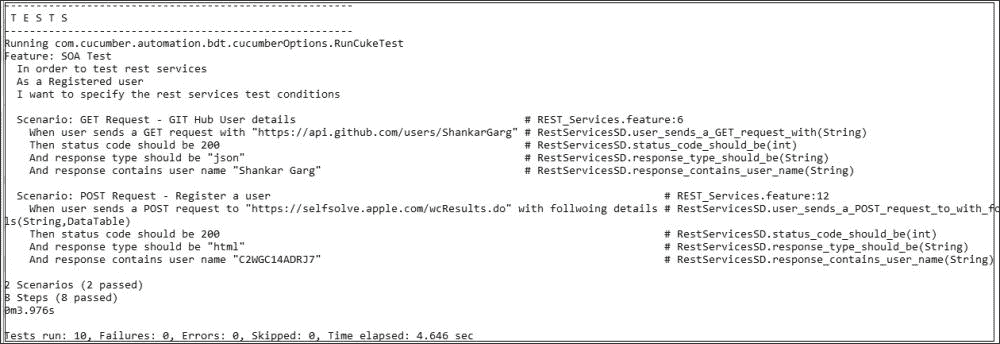

## 它是如何工作的…

我们已经集成了 Cucumber、HTTP 客户端、Maven、Java 和页面对象来设计我们的 REST 服务自动化框架。Cucumber 用于实现行为驱动开发（BDD），以便非技术人员也可以直接参与开发——HTTP 客户端用于 REST 自动化，Java 作为编程语言，Maven 作为构建工具。
