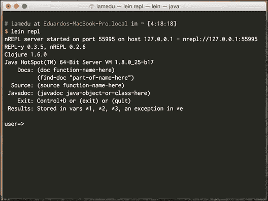
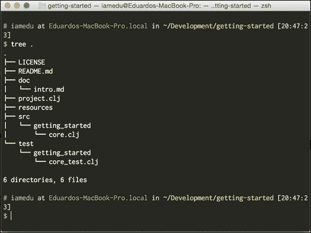

# 第一章. Clojure 入门

欢迎来到 Clojure 的世界！如果你在这里，你可能对 Lisp 或 Clojure 有一点了解，但你实际上并没有真正了解这个世界的运作方式。

我们将通过将每个功能与您从 Java 中已知的进行比较来了解 Clojure。你会发现有列表、映射和集合，就像在 Java 中一样，但它们是不可变的。要处理这些类型的集合，你需要不同的方法；不同的范式。

这就是我们在这本书中试图达成的目标，给你提供一种不同的解决问题的方法。我们希望你在日常生活中使用 Clojure，但如果你不这样做，我们希望你在解决问题时采用一种新的方法。

在本章中，我们将涵盖以下主题：

+   了解 Clojure

+   安装 Leiningen

+   使用 **读取-评估-打印循环**（**REPL**）

+   安装和使用 Cursive Clojure

+   Clojure 的简单语法

+   Clojure 的数据类型及其与 JVM 数据类型的关系

+   函数的特殊语法

# 了解 Clojure

在开始使用 Clojure 之前，你应该了解一些它的特性以及它与 Java 的相似之处。

Clojure 是一种从 Lisp 继承了许多特性的编程语言。你可能会把 Lisp 视为那种充满括号的奇怪编程语言。你需要记住的是，Clojure 选择拥抱函数式编程。这使得它与当前的主流编程语言非常不同。你将了解不可变数据结构以及如何编写不改变变量值的程序。

你还会发现 Clojure 是一种动态编程语言，这使得编写程序比使用静态类型语言更容易、更快。还有使用 REPL 的概念，这是一个允许你连接到正在运行的环境并动态更改代码的工具。这是一个非常强大的工具。

最后，你会发现你可以将 Clojure 转换为你喜欢的东西。你可以创建或使用静态类型系统，并使语言适应你的喜好。一个很好的例子是 `core.typed` 库，它允许你指定类型信息，而无需向编译器添加支持。

# 安装 Leiningen

我们习惯于拥有某些工具来帮助我们构建代码，例如 Ant、Maven 和 Gradle。

在 Clojure 生态系统里，依赖和构建管理的默认标准是 Leiningen（亲切地以短篇小说《莱宁根对抗蚂蚁》命名，我推荐阅读[`en.wikipedia.org/wiki/Leiningen_Versus_the_Ants`](http://en.wikipedia.org/wiki/Leiningen_Versus_the_Ants)）；Leiningen 努力成为对 Java 开发者来说熟悉的工具，它从 Maven 中汲取了最佳想法，比如：约定优于配置。它也从 Ant 中获得了灵感，比如自定义脚本和插件。

安装非常简单，让我们看看如何在 Mac OS X 上使用 bash 作为默认 shell 来完成它（在 Linux 上的安装应该相同）。

你也应该已经安装并配置了 Java 7 或 8 在你的路径中。

你可以在 Leiningen 项目页面上查看详细说明[`leiningen.org/`](http://leiningen.org/)。如果你想安装并运行 Leiningen，你需要做以下事情：

```java
curl -O https://raw.githubusercontent.com/technomancy/leiningen/stable/bin/lein
# The next step just set up the lein script in your path, you can do it any way you wish
mv lein ~/bin
echo "export PATH=$PATH:~/bin/">> ~/.bashrc
source ~/.bashrc
# Everything should be running now, let's test it
lein help

```

第一次运行`lein`命令时，它会从互联网下载所有需要的文件。这使得分发你的代码变得非常容易，你甚至可以将`lein`脚本包含在你的项目中，使其他开发者更容易启动和运行，唯一真正的要求是 JDK。

# 使用 REPL

Clojure（以及 Lisp）的主要优势之一是交互式开发，REPL 是交互式编程可以实现的基石，它允许你连接到一个正在运行的 Clojure VM，并实时执行或修改代码。

有一个关于 NASA 如何能够在 100 亿英里外的 1000 万美元的硬件上调试和纠正错误的故事([`www.flownet.com/gat/jpl-lisp.html`](http://www.flownet.com/gat/jpl-lisp.html))。

我们在 Clojure 和 Leiningen 中也有同样的能力，调用它非常简单，你只需要一个命令：

```java
lein repl

```

运行前面的命令后，你会得到以下内容：



让我们更详细地了解一下，正如我们所看到的，我们正在运行以下程序：

+   Java 8

+   Clojure 1.6.0

我们还可以获得一些关于如何查看文档、`source`、`Javadoc`和以前错误的良好建议。

## nREPL 协议

有一个特别需要注意的事情是 nREPL 协议；有一天它可能会赋予我们进入运行在 100 亿英里外的机器的能力。

当你启动你的 REPL 时，你首先看到的是：

```java
nREPL server started on port 55995 on host 127.0.0.1 - nrepl://127.0.0.1:55995
REPL-y 0.3.5, nREPL 0.2.6

```

它所表达的意思是，有一个 Clojure 进程在端口`55995`上运行 nREPL 服务器。我们已经通过一个非常简单的客户端连接到它，这个客户端允许我们与 Clojure 进程交互。

真正有趣的是，你可以像连接到远程主机一样轻松地连接；让我们尝试通过简单地输入以下命令将 REPL 附加到同一个进程：

```java
lein repl :connect localhost:55995

```

大多数 IDE 都与 Clojure 有很好的集成，它们中的大多数都使用这个机制，作为稍微智能一点的客户端。

## Hello world

现在我们已经进入了 REPL 内部（任意一个），让我们尝试编写我们的第一个表达式，继续并输入：

```java
"Hello world"
```

你应该从 REPL 得到一个返回值，显示`Hello world`，这实际上不是一个程序，而是 REPL 打印阶段的`Hello world`值。

让我们现在尝试编写我们的第一个 Lisp 形式：

```java
(println "Hello world")
```

这个第一个表达式与我们习惯的不同，它被称为 S 表达式，这是 Lisp 的标准方式。

在 S 表达式中，有几件事情需要记住：

+   它们是列表（因此，得名，Lisp）

+   列表的第一元素是我们想要执行的操作，其余的是该操作的参数（一个、两个、三个）。

因此，我们要求打印字符串 `Hello world`，但如果我们仔细观察输出，如图下所示，会出现一个我们未预期的 `nil`：


原因是 `println` 函数在打印 `Hello world` 后返回值 `nil`（Clojure 的 null 等价物）。

### 注意

在 Clojure 中，一切都有值，REPL 会始终为您打印它。

## REPL 实用工具和约定

正如我们所见，Leiningen nREPL 客户端打印帮助文本；但它是如何工作的？让我们探索一些其他我们拥有的实用工具。

尝试以下表格中的每一个，以了解它们的功能：

| 函数 | 描述 | 示例 |
| --- | --- | --- |
| `doc` | 打印出函数的 `docstring` | (`doc println`) |
| `source` | 打印函数的源代码，它必须用 Clojure 编写 | (`source println`) |
| `javadoc` | 在浏览器中打开类的 `javadoc` | (`javadoc java.lang.Integer`) |

让我们检查这些函数是如何工作的：

```java
user=> (javadoc java.util.List)
;; Should open the javadoc for java.util.List

user=> (doc doc)
-------------------------
clojure.repl/doc
([name])
Macro
  Prints documentation for a var or special form given its name
nil

user=> (source doc)
(defmacro doc
"Prints documentation for a var or special form given its name"
  {:added "1.0"}
  [name]
  (if-let [special-name ('{& fn catch try finally try} name)]
    (#'print-doc (#'special-doc special-name))
    (cond
      (special-doc-map name) `(#'print-doc (#'special-doc '~name))
      (find-ns name) `(#'print-doc (#'namespace-doc (find-ns '~name)))
      (resolve name) `(#'print-doc (meta (var ~name))))))
nil
```

### 小贴士

**下载示例代码**

您可以从您在 [`www.packtpub.com`](http://www.packtpub.com) 的账户下载示例代码文件，以获取您购买的所有 Packt Publishing 书籍。如果您在其他地方购买了这本书，您可以访问 [`www.packtpub.com/support`](http://www.packtpub.com/support) 并注册，以便将文件直接通过电子邮件发送给您。

您在这里看到的是与 `doc` 函数相关的元数据；Clojure 具有存储您使用的每个函数或 `var` 的元数据的能力。大多数 Clojure 核心函数都包含一个 doc 字符串和函数的源代码，这在您日常工作中将非常有用。

除了这些函数外，我们还可以轻松访问 REPL 中最近的三条值和最近发生的异常，让我们来看看：

```java
user=> 2
2
user=> 3
3
user=> 4
4
user=> (* *1 *2 *3) ;; We are multiplying over here the last three values
24 ;;We get 24!
user=> (/ 1 0) ;; Let's try dividing by zero
ArithmeticException Divide by zero clojure.lang.Numbers.divide (Numbers.java:156)
user=> *e
#<ArithmeticException java.lang.ArithmeticException: Divide by zero>

user=> (.getMessage *e)
"Divide by zero"
```

### 注意

`*e` 使您能够访问实际的 Java 异常对象，因此您可以在运行时分析和检查它。

您可以想象使用这种方式执行和检查代码的可能性，但关于我们已经习惯使用的工具呢？我们如何使用 IDE 来使用它？

现在我们来看看如何创建一个新的 Clojure 项目，我们将使用命令行中的 Leiningen 来理解发生了什么。

# 创建新项目

Leiningen 可以帮助我们使用模板创建新项目，有各种各样的模板可供选择，您可以在 Maven 中构建和分发自己的模板。

最常见的模板类型包括：

+   创建 `jar` 库（默认模板）

+   创建命令行应用程序

+   创建 Clojure 网络应用程序

让我们创建一个新的 Clojure 命令行应用程序并运行它：

```java
lein new app getting-started
cd getting-started
lein run
# Hello, world!

```

## 项目结构

Leiningen 类似于其他 Java 开发工具；它使用类似的约定，并允许在 `project.clj` 文件中进行大量自定义。

如果您熟悉 Maven 或 Gradle，您可以将其分别视为 `pom.xml` 或 `build.gradle`。

下面的截图是项目结构：



如前一个截图所示，有四个主要文件夹：

+   `resources`: 它包含应在类路径中的所有内容，例如文件、图像、配置文件、属性文件和其他在运行时需要的资源。

+   `src`: 您的 Clojure 源文件；它们的排列方式与 `classpath` 非常相似。

+   `dev-resources`: 在开发中应位于 `classpath` 中的所有内容（当您运行 Leiningen 时）。您可以在此处覆盖您的“生产”文件，并添加运行测试所需的文件。

+   `test`: 您的测试；此代码不会被打包，但每次您执行 Leiningen 测试时都会运行。

## 创建独立应用程序

一旦创建项目，您就可以非常容易地构建和运行 Java 独立命令行应用程序，现在让我们试试：

```java
lein uberjar
java -jar target/uberjar/getting-started-0.1.0-SNAPSHOT-standalone.jar
# Hello, World!

```

如您所见，创建独立应用程序非常简单，并且与使用 Maven 或 Gradle 非常相似。

# 使用 Cursive Clojure

Java 已经有一些优秀的工具可以帮助我们提高生产力和编写更高质量的代码，我们不应该忘记这些工具。根据您的 IDE，有几个 Clojure 插件。请从以下表格中查看：

| IDE | 插件 |
| --- | --- |
| IntelliJ | Cursive Clojure, La Clojure |
| NetBeans | NetBeans Clojure (与 NetBeans 7.4 兼容) |
| Eclipse | CounterClockwise |
| Emacs | Cider |
| VIM | vim-fireplace, vim-leiningen |

许多编写真实 Clojure 代码的人使用 Emacs，我实际上喜欢使用 vim 作为我的主要开发工具，但不用担心，本书中我们将主要使用 IntelliJ + Cursive Clojure。

## 安装 Cursive Clojure

您可以在他们的网站上查看 Cursive 的完整文档（[`cursiveclojure.com/`](https://cursiveclojure.com/)），它仍在开发中，但相当稳定，在编写 Clojure 代码时非常有帮助。

我们将使用最新的 IntelliJ Community Edition 版本，在撰写本文时是版本 14。

您可以从这里下载 IntelliJ：[`www.jetbrains.com/idea/download/`](https://www.jetbrains.com/idea/download/)。

安装 Cursive Clojure 非常简单，您需要为 IntelliJ 添加一个仓库。您可以在以下位置找到您特定 IntelliJ 版本的说明：[`cursiveclojure.com/userguide/`](https://cursiveclojure.com/userguide/)。

安装 Cursive Clojure 后，我们就可以开始了。

现在，我们准备将入门项目导入到 Cursive Clojure 中。

### 注意

Cursive Clojure 目前不支持在 IDE 内创建 Leiningen 项目；然而，导入它们的支持非常好。

这里是如何操作的：

1.  点击 **文件**。

1.  导入项目。

1.  查找您的项目。

1.  打开文件夹或 `project.clj` 文件。

1.  在 IDE 中遵循 **下一步** 指令。

现在，我们已经准备好了，你可以使用 Cursive Clojure 作为你的主要开发工具。在你的 IDE 中还有更多的事情要做，但我建议你自己去寻找它们；它们很重要，并且会很有用：

+   了解如何执行项目

+   了解如何执行测试

+   打开一个连接到某个项目的 REPL。

+   执行一些给定代码片段的关键绑定（在 REPL 中运行光标前的形式）

+   执行指定文件的关键绑定（在 REPL 中加载文件）

Clojure 编程的一个重要部分是它可以在运行时修改和重新评估代码。检查你当前版本的 Clojure 手册，并查看结构编辑部分([`cursiveclojure.com/userguide/paredit.html`](https://cursiveclojure.com/userguide/paredit.html))。这是 Clojure IDEs 中最有用的功能之一，并且是 Clojure 语法的直接后果。

我建议你查看手册中的其他功能。我真心建议查看 Cursive Clojure 手册，它包括每个功能如何工作的动画。

你将非常频繁地使用最后两个键绑定，因此正确设置它们非常重要。有关键绑定的更多信息，请参阅[`cursiveclojure.com/userguide/keybindings.html`](https://cursiveclojure.com/userguide/keybindings.html)。

# 开始使用 Clojure 代码和数据

让我们深入了解 Clojure 的语法，它与其他语言非常不同，但实际上要简单得多。Lisp 有非常规则的语法，只有很少的特殊规则。正如我们之前所说的，Clojure 代码由 S 表达式组成，而 S 表达式只是列表。让我们看看一些列表的例子，以便熟悉 Lisp 中的列表。

```java
(1 2 3 4)
(println "Hello world")
(one two three)
("one" two three)
```

上述所有都是列表，但并非所有都是有效的代码。记住，只有第一个元素是函数的列表才能被认为是有效的表达式。所以，这里只有以下可以是有效的表达式：

```java
(println "Hello world")
(one two three)
```

如果`println`和`one`被定义为函数。

让我们看看一段 Clojure 代码，最终解释一切是如何工作的。

```java
(defn some-function [times parameter]
"Prints a string certain number of times"
  (dotimes [x times]
    (println parameter)))
```

## Clojure 中的列表

Clojure 基于“形式”或列表。在 Clojure 中，与每个 Lisp 一样，表示列表的方式是用括号，所以这里有一些最后代码中的列表示例：

```java
(println parameter)
(dotimes [x times] (println parameter))
(defn some-function [times parameter] (dotimes [x times] (println parameter)))
```

列表是 Clojure 中的一种数据类型，也是表达代码的方式；你将在以后了解将代码表达为数据的所有好处。第一个好处是它真的很简单，你可以做的任何事都必须以列表的形式表达出来！让我们看看其他一些可执行代码的例子：

```java
(* 1 2 3)
(+ 5 9 7)
(/ 4 5)
(- 2 3 4)
(map inc [1 2 3 4 5 6])
```

我鼓励你将所有内容都写入 REPL，这样你就能很好地理解正在发生的事情。

## Clojure 中的操作

在 Clojure 中，`MOST`的可执行形式都具有这种结构：

```java
(op parameter-1parameter-2 ….)
```

`op`是要执行的操作，后面跟着它需要的所有参数，让我们用新的眼光分析我们之前的每个形式：

```java
(+ 1 2 3)
```

我们要求执行`+`（加法）操作，参数为`1`、`2`和`3`。预期的结果是`6`。

让我们分析一些更复杂的东西：

```java
(map inc [1 2 3 4 5 6])
```

在这里，我们请求使用两个参数执行 `clojure.core/map` 函数：

+   `inc` 是一个函数名，它接受一个数字并将其增加

+   `[1 2 3 4 5 6]` 是一组数字

Map 将 `inc` 函数应用于传递的集合中的每个成员，并返回一个新的集合，我们期望的是一个包含 `[2 3 4 5 6 7]` 的集合。

## Clojure 中的函数

现在让我们检查一个函数定义本质上与前面两个形式相同：

```java
(defn some-function [times parameter]
"Prints a string certain number of times"
  (dotimes [x times]
    (println parameter)))
```

`defn` 是我们请求的操作。它有几个参数，例如：

+   `some-function` 是我们定义的函数的名称

+   `[times 参数]` 是一组参数

+   `"打印字符串特定次数"` 是文档字符串，它实际上是一个可选参数

+   `(dotimes [x times] (println parameter))` 是在调用 `some-function` 时执行的函数体

`defn` 调用函数以使其存在。在这段代码执行之后，`some-function` 就存在于当前命名空间中，你可以使用它并传入定义好的参数。

`defn` 实际上是用 Clojure 编写的，并支持一些不错的东西。现在让我们定义一个 `multi-arity` 函数：

```java
(defn hello
  ([] (hello "Clojure"))
  ([name] (str "Hello " name)))
```

在这里，我们定义了一个具有两个主体的函数，其中一个没有参数，另一个有一个参数。实际上，理解所发生的事情相当简单。

尝试更改你项目 `core.clj` 文件中的源代码，类似于以下示例：

```java
(ns getting-started.core
  (:gen-class))

(defn hello
  ([] (hello "Clojure"))
  ([name] (str "Hello " name)))

(defn -main
"I don't do a whole lot ... yet."
  [& args]
  (println "Hello, World!")
  (println (hello))
  (println (hello "Edu")))
```

现在运行它，你会得到三个不同的 Hello 输出。

正如你所见，Clojure 有着非常规范的语法，即使对于新手来说可能有些奇怪，但实际上它相当简单。

这里，我们使用了几个尚未适当介绍的数据类型；在下一节中，我们将查看它们。

# Clojure 的数据类型

现在是你所知道的关于 Java 的所有知识都能派上用场的时候了；甚至你之前看到的列表形式也实现了 `java.util.List` 接口。Clojure 被设计成可嵌入的，并且与宿主平台有很好的集成，因此你可以使用你已知的所有关于 Java 类型和对象的知识。

Clojure 中有两种数据类型：标量和集合。

## 标量

在每种语言中，你都需要原始类型；你在日常生活中使用它们，因为它们代表数字、字符串和布尔值。在 Clojure 世界中，这些原始类型被称为标量。

Clojure 有一些非常有趣的类型，如比例和关键字。在下面的表中，你可以了解不同的标量类型，它们与 Java 的比较以及如何使用它们的简单示例。

| Clojure 数据类型 | Java 数据类型 | 示例 | 描述 |
| --- | --- | --- | --- |
| 字符串 | 字符串 | "这是一个字符串""这是一个多行字符串" | 字符串字符；在 Clojure 中，你可以无问题使用多行字符串 |
| 布尔值 | 布尔值 | truefalse | 文字布尔值 |
| 字符 | 字符 | `\c``\u0045 ;; Unicode char 45 E` | 字符值，它们是 `java.lang.Character` 实例，你可以定义 Unicode 字符 |
| 关键字 | Java 中不存在 | `:key``:sample``:some-keyword` | 它们会自我评估，并且经常用作键。它们也是查找自己在映射中的函数。 |
| 数字 | 数字会自动处理为 `BigDecimal`、`BigInteger` 或根据需要使用较低精度 | `42N ;;大整数``42 ;;long``0.1M ;;BigDecimal` | 记住 Java 数字的权衡很重要，如果精度很重要，你应该始终使用大数和 `bigintegers`。 |
| 比率 | 不存在 | `22/7` | Clojure 提供了出色的数值精度；如果需要，它可以保留比率并执行精确操作。使用比率时的权衡是速度。 |
| 符号 | 不存在 | some-name | 符号是 Clojure 中的标识符，与 Java 中的变量名非常相似。 |
| nil | null | nil | 空值 |
| 正则表达式 | `java.util.regex.Pattern` | `#"\d"` | 正则表达式，在 Clojure 中你可以免费使用语法来定义正则表达式，但最终它是一个普通的 Java 正则表达式模式 |

## 集合数据类型

在 Clojure 中有两种类型的集合：顺序集合和关联集合。顺序集合是可以迭代的，例如列表。关联集合是映射、集合以及你可以通过某个索引访问的东西。Clojure 的集合与 Java 完全兼容，甚至可以实现 `java.util` 接口，如 `java.util.List` 和 `java.util.Map`。

Clojure 中集合的一个主要特征是它们是不可变的；它有很多好处，我们稍后会看到。

让我们看看 Clojure 中可用的每种集合数据类型的特征，并使用示例（在 Clojure 中）及其描述与 Java 进行比较。

| Clojure 数据类型 | Java 数据类型 | 示例 | 描述 |
| --- | --- | --- | --- |
| `List` | `List` | `(1 2 3 4 5)` | 一个简单的列表，注意列表前的引号字符，如果你没有指定它，Clojure 会尝试将形式评估为指令 |
| `Vector` | `Array` | `[1 2 3 4 5]` | 它是 Clojure 中的主要工作马，它类似于数组，因为你可以以随机顺序访问元素 |
| `Set` | `HashSet` | `#{1 2 3 4}` | 一个普通的 Java 哈希集合 |
| `Map` | `HashMap` | `{:key 5 :key-2 "red"}` | 一个 Clojure 映射 |

# 摘要

如您所见，Clojure 拥有一个成熟且不断发展的开发环境。您可以以非常类似的方式设置命令行工具和您的 IDE，就像在正常的 Java 开发中做的那样。

我们还了解了一些关于 Clojure 的常规语法、其数据类型以及它们与 Java 自身数据类型之间关系的内容。

总体来说，你现在应该对以下内容感到舒适：

+   Lisp 语法

+   从零开始创建 Leiningen 项目

+   运行和打包你的代码

+   将 Leiningen 项目导入 IntelliJ

+   使用 REPL

+   了解 Clojure 类型与 Java 类型之间的关系

在下一章中，我们将了解如何组织我们的代码，以及这种组织如何利用 Java 包的优势。
