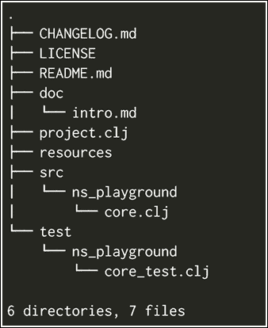
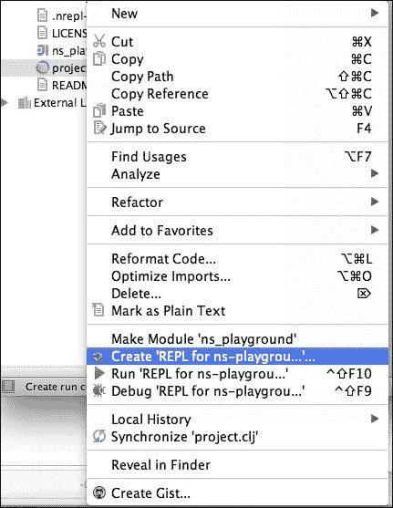
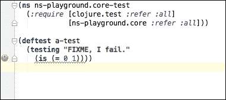

# 第二章：命名空间、包和测试

我们现在已经安装了 Clojure 和 IntelliJ 的有效版本。

作为 Java 开发者，你习惯于以类作为组织的最小单元进行工作。Clojure 有一个非常不同的感觉，并为你提供了不同的工具来组织你的代码。

首先，你应该记住代码和数据是分开的；你没有具有属性和函数的最小单元，这些函数在这些属性上工作。你的函数可以作用于你希望的所有数据结构，只要你遵循函数的工作规则。

在本章中，我们将编写一些简单的函数来展示函数和数据分离的工作方式，并查看 Clojure 提供的工具来实现这种分离。

在本章中，我们将涵盖以下主题：

+   命名空间与类路径和 Java 包相比是如何工作的

+   单元测试

+   更多 Clojure 示例和语法

# Clojure 中的命名空间

对于 Java 开发者来说，Clojure 的命名空间可能很熟悉，原因很好，它们与 Java 的包和类路径有着非常深的关系。

首先，让我们回顾一下我们从 Java 中已经了解到的内容。

## Clojure 中的包

Java 代码是有组织的包，Java 中的包是一个命名空间，允许你将一组相似的类和接口分组在一起。

你可以将包想象成你电脑中的一个文件夹。

以下是在 Java 编程中经常使用的常见包：

+   `java.lang`：Java 的所有本地内容，包括基本类型（整数、长整型、字节、布尔型、字符、字符串、数字、短整型、浮点型、void、类）、基本线程原语（可运行、线程）、异常的基本原语（可抛出、错误、异常）、基本异常和错误（`NoSuchMethodError`、`OutOfMemoryError`、`StackOverflowError` 等）以及运行时访问类（运行时和系统）。

+   `java.io`：这个包包括输入和输出的基本原语，例如控制台、文件、读取器、输入流和写入器。

+   `java.util`：这是除了 `java.lang` 之外最常使用的包之一。这个包包括经典的数据结构（映射、集合、列表）以及这些数据结构的常见实现。此包还包括属性工具、从各种输入资源读取的扫描器、`ServiceLoader` 从 `classloader` 加载自定义服务、UUID 生成器、计时器等等。

+   `java.util.logging`：日志实用工具，你通常使用它们来提供不同级别的警报，从调试到严重情况。

+   `java.text`：这些是管理文本、日期和数字的语言无关的实用工具。

+   `javax.servlet`：这包括创建网络应用和在标准网络容器中部署的基本原语。

这些包中的每一个都包含几个相关的功能，特别是`java.lang`包尤为重要，因为它包含了所有的 Java 核心类型，如字符串、长整型和整型。`java.lang`包中的所有内容都可以在所有地方自动使用。

`java.lang`包不仅提供了代码组织，还提供了访问安全。如果你还记得 Java，有三个安全访问级别：

+   私有

+   公共

+   受保护

在包的情况下，我们关注的是受保护的访问级别。同一包中的类允许同一包中的其他类访问其受保护的属性和方法。

在运行时分析包也有方法，但它们很复杂，并且允许做的很少。

包是在 Java 的类路径和类加载器顶部实现的。

# 类路径和类加载器

Java 被设计成模块化的，为此它需要一种轻松加载你的代码的方法。这个答案就是类加载器，类加载器允许你从类路径的每个条目中读取资源；你可以将类路径资源视为类似于文件系统的一个分层结构。

类加载器只是一个条目列表；每个条目可以是文件系统中的一个目录或一个 JAR 文件。此时，你应该也知道 JAR 文件只是 ZIP 文件。

类加载器会将每个条目视为一个目录（JAR 文件只是压缩的目录），并且它会在每个目录中查找文件。

这里有很多概念需要记住，让我们尝试总结一下：

+   JAR 文件是 ZIP 文件；它们可能包含多个类、属性、文件等。

+   类路径是一个条目列表；每个条目是一个 JAR 文件或系统目录。

+   类加载器会在类路径的每个条目中查找资源，所以你可以将类路径资源视为类路径中所有目录的组合（重复的资源不会被覆盖）

如果你还不熟悉类加载器如何在类路径条目中查找资源，这是一个通用过程；让我们想象一下，你想加载一个类：`test.Test`，接下来会发生什么？

1.  你告诉 JVM 你想加载`test.Test`。

1.  JVM 知道要查找`test`/`Test.class`文件。

1.  它从类路径的每个条目开始查找。

1.  如果资源是一个 ZIP 文件，它“解压”目录。

1.  它会在表示条目的目录中查找资源。

如果你看到默认的类路径资源，你可能会看到一些东西，例如：

```java
java:
    lang:
        String.class
        ….
    io:
        IOException.class
        …
    util:
        List.class
```

重要的是要注意，类路径中的每个条目不仅仅存储类文件，实际上可以存储任何类型的资源，存储配置文件，如`.properties`或`.xml`是很常见的。

没有任何规定你不能在 classpath 资源中存储其他任何东西，比如图片、mp3 甚至代码！你可以像在运行时从文件系统读取一样，从 classpath 的资源中读取和访问任何东西。唯一你不能做的是修改 classpath 资源的内容（至少不是没有一些神秘的魔法）。

## 回到 Clojure 的 namespaces

现在我们已经简要回顾了 Java 中包和 classpath 的工作方式，是时候回到 Clojure 了。你应该明白 Clojure 试图使托管平台透明；这意味着几件非常重要的事情：

+   你可以用 Java 的 classpath 做任何事情，你也可以用 Clojure 做（你可以读取配置文件、图片等）。

+   Namespaces 使用 classpath 的方式与 Java 使用 packages 的方式相同，这使得它们很容易理解。尽管如此，不要低估它们，Clojure 的 namespace 声明可能更复杂。

让我们实际操作一下，稍微玩一下 namespaces。

### 玩 namespaces

让我们创建一个新的 Playground，为了创建它，请使用以下命令：

```java
lein new app ns-playground

```

你可以用 IntelliJ 打开这个项目，就像我们在第一章中做的那样，*Clojure 入门*。

让我们详细看看为我们创建的内容：



这个项目结构看起来与 Java 项目相似，我们有：

+   `resources`: 这些是非源文件，它们会被添加到 classpath 中

+   `src`: 我们的源代码

+   `test`: 我们的测试代码

`src`和`test`内部的代码已经结构化为 namespaces：通过快速查看，我们可以说 namespaces 的名称是`ns_playground`。让我们检查源代码：

```java
(ns ns-playground.core
  (:gen-class))

(defn -main
"I don't do a whole lot ... yet."
  [& args]
  (println "Hello, World!"))
;; Code for src/ns_playground/core.clj
```

### 小贴士

`:gen-class`在这里被添加是为了创建一个 Java 类，并允许 Java 解释器启动静态 main 方法。如果你不打算创建一个独立程序，则不需要它。

我们可以看到，在顶部使用了`ns ns-playground.core`形式，正如你可能猜到的，这就是我们在 Clojure 中声明 namespace 的方式。

如果你足够细心，你会注意到一些奇怪的地方；namespace 有一个破折号而不是文件夹中的下划线。

有一些原因导致这种情况：

+   Clojure 像大多数 Lisp 变量名可以包含破折号（实际上，这是命名变量的首选风格，与 Java 中的驼峰命名法相反）。

+   Clojure 中的每个 namespace 都表示为一个包含多个 Java 类的包。namespace 用作 Java 包的名称，正如你所知，破折号在类或包名称中是不被接受的；因此，每个文件名和文件夹名都必须使用低破折号。

### 小贴士

由于 Lisp 的特性，你可以在变量名中使用破折号（它们将在编译时转换为下划线）。实际上，这是命名变量的推荐方式。在 Clojure 中（以及大多数 Lisps），`some-variable-name`比`someVariableName`更符合习惯用法。

## 创建一个新的命名空间

让我们创建一个新的命名空间；在 Cursive Clojure 中，这样做很容易，只需右键单击 `ns_playground` 包，然后转到 **新建** | **Clojure 命名空间**，它会要求你输入一个名称，我们可以将其命名为 `hello`。

这将创建一个包含以下内容的 `hello.clj` 文件：

```java
(ns ns-playground.hello)
```

如你所见，命名空间创建相当简单；你可以通过两个简单的步骤手动完成：

1.  创建一个新文件；它不必遵循包命名规范，但这有助于保持你的代码顺序，并且是一种事实上的做法。

1.  添加你的命名空间声明。

就这样！诚然，命名空间定义可能会变得相当复杂，因为它是你定义你希望导入的 Java 包、命名空间或你打算使用的那些命名空间中的函数的地方。但通常你只会使用这些功能的一个子集。

### 小贴士

请记住，Clojure 中的命名空间通常由一个单独的文件表示。

对于你的初始命名空间，我建议你考虑以下两种能力：

| `:import` | 允许你从你希望使用的包中导入 Java 类 |
| --- | --- |
| `:require` | 允许你引入你希望使用的任何 Clojure 命名空间 |

`require` 和 `import` 的语法都很简单，在我们实际使用之前，让我们看看几个例子。

让我们从 `import` 选项开始：

```java
(:import java.util.List)
```

你会注意到这与你在 Java 中能做的事情很相似，我们在这里导入的是 `List` 接口。

Clojure 的好处在于它允许你做一些更具体的事情。让我们看看如何一次性导入两个类：

```java
(:import [java.util ArrayList HashMap])
```

你可以将这个扩展到你想使用的类数量。

`require` 选项使用类似的语法，并在其基础上构建更多。让我们看看如何从一个命名空间中引入单个函数：

```java
(:require [some.package :refer [a-function another-function]])
```

如你所见，这是熟悉的，有趣的部分在于当你开始导入所有内容时：

```java
(:require [some.package :refer [:all]])
```

你也可以为你的包中的所有内容使用自定义名称：

```java
(:require [some.package :as s])

;; And then use everything in the package like this:

(s/a-function 5)
```

或者，你甚至可以组合不同的关键字：

```java
(:require [some.package :as s :refer [a-function]])
```

让我们尝试一下我们刚刚学到的知识，使用以下代码：

```java
(ns ns-playground.hello
  (:import [java.util Date]))

(def addition +)

(defn current-date []
"Returns the current date"
  (new Date))

(defn <3 [love & loved-ones]
"Creates a sequence of all the {loved-ones} {loved} loves"
  (for [loved-one loved-ones]
    (str love " love " loved-one)))

(defn sum-something [something & nums]
"Adds something to all the remaining parameters"
  (apply addition something nums))

(def sum-one (partial sum-something 1))
```

### 注意

你一定注意到了 `<3` 和 `sum-something` 函数的参数中的 `&` 操作符；这允许这些函数接收任意数量的参数，我们可以像这样调用它们：（`sum-something 1 2 3 4 5 6 7 8`）或（`sum-something`）。它们被称为**可变参数**函数。在 Java 中，你会把这个特性称为**可变参数**。

一切看起来都很不错，但我们还没有看到如何从其他包中引入和使用这些函数。让我们写一个测试来看看这是如何完成的。

## 在 REPL 上使用命名空间

通过使用 REPL 来玩转命名空间是一个很好的方法，我们也将从中获得更好地了解它的好处。

由于我们将要玩转命名空间，我们需要了解一些函数，这些函数将帮助我们在不同命名空间之间移动并引入其他命名空间。这些函数如下列出：

| 函数 | 描述 | 示例用法 |
| --- | --- | --- |
| `in-ns` | 将`*ns*`设置为名为符号的命名空间，如果需要则创建它。 | (`in-ns 'ns-playground.core`) |
| `require` | 加载`libs`，跳过任何已加载的库。 | (`require '[clojure.java.io :as io]') |
| `import` | 对于`class-name-symbols`中的每个名称，将名称到由`package.name`命名的类的映射添加到当前命名空间。 | (`import java.util.Date`) |
| `refer` | 引用`ns`的所有公共`vars`，受过滤器约束。 | (`refer 'clojure.string :only '[capitalize trim]`) |

让我们进入我们的 IntelliJ 的 REPL 窗口。我们可以使用`*ns*`指令来检查我们处于哪个命名空间。现在让我们试试：

```java
*ns*
=> #<Namespace ns-playground.core>
```

假设我们需要在`ns-playground.hello`命名空间内执行代码并测试代码，我们可以使用`in-ns`函数来完成：

```java
(in-ns 'ns-playground.hello)
=> #<Namespace ns-playground.hello>
```

我们想知道`str`函数的作用，它似乎接收三个字符串：

```java
(str "Hello""""world")
=>"Hello world"
```

现在我们来尝试`for`形式：

```java
(for [el ["element1""element2""element3"]] el)
=> ("element1""element2""element3")

(for [el ["element1""element2""element3"]]
  (str "Hello " el))
=> ("Hello element1""Hello element2""Hello element3")
```

`for`宏接受一个项目集合，并返回一个新的惰性序列，将`for`的主体应用于每个元素。

了解这一点后，理解`<3`函数就很容易了，让我们试试：

```java
(<3 "They""tea")
=> ("They love tea")

(clojure.repl/doc <3)
ns-playground.hello/<3
([& loved-ones])
  Creates a sequence of all the {loved-ones} {loved} loves
```

我们已经使用 REPL 测试了一些简单的函数，但现在让我们尝试测试其他一些内容，比如从类路径中读取属性文件。

我们可以在资源文件夹中添加一个`test.properties`文件，内容如下：

```java
user=user
test=password
sample=5
```

记得重新启动 REPL，因为对某些类路径中指向的内容的更改对正在运行的 REPL 是不可见的。

让我们尝试将属性文件作为输入流读取，我们可以使用`clojure.java.io`命名空间来完成，我们可以像下面这样检查它：

```java
(require '[clojure.java.io :as io])
(io/resource "test.properties")
=> #<URL file:/Users/iamedu/Clojure4Java/ns-playground/resources/test.properties>
(io/input-stream (io/resource "test.properties"))
=> #<BufferedInputStream java.io.BufferedInputStream@2f584e71>
;; Let's now load it into a properties object
(import [java.util Properties])
=> java.util.Properties
(def props (Properties.)) ;; Don't worry about the weird syntax, we will look it soon.
=> #'ns-playground.core/props
(.load props (io/input-stream (io/resource "test.properties")))
props
=> {"user""user", "sample""5", "test""password"}
```

现在，我们可以定义我们的读取属性函数，我们可以将其输入到 REPL 中：

```java
(defn read-properties [path]
  (let [resource (io/resource path)
        is (io/input-stream resource)
        props (Properties.)]
    (.load props is)
    (.close is)
    props))
=> #'ns-playground.core/read-properties
(read-properties "test.properties")
=> {"user""user", "sample""5", "test""password"}
```

### 注意

`let`形式允许我们创建局部'变量'，而不是直接在代码中使用(`io/resource path`)。我们可以创建一个引用一次并在代码中使用它。它允许我们使用更简单的代码，并有一个指向对象的单一引用。

最后，我们可以重新定义`hello`命名空间以包含我们检查的所有内容，例如：

```java
(ns ns-playground.hello
  (:require [clojure.java.io :as io])
  (:import [java.util Date Properties]))

(def addition +)

(defn current-date []
"Returns the current date"
  (new Date))

(defn <3 [love & loved-ones]
"Creates a sequence of all the {loved-ones} {loved} loves"
  (for [loved-one loved-ones]
    (str love " love " loved-one)))

(defn sum-something [something & nums]
"Adds something to all the remaining parameters"
  (apply addition something nums))

(defn read-properties [path]
  (let [resource (io/resource path)
        is (io/input-stream resource)
        props (Properties.)]
    (.load props is)
    props))

(def sum-one (partial sum-something 1))
```

记得在`import`中包含`Properties`类，并为`clojure.java.io`定义`:require`关键字。

# Clojure 中的测试

事实上，Clojure 已经内置了单元测试支持，Leiningen 已经为我们创建了一个测试；现在让我们看看它。

打开`test/ns_playground/core_test.clj`文件，你应该能看到以下代码：

```java
(ns ns-playground.core-test
  (:require [clojure.test :refer :all]
            [ns-playground.core :refer :all]))
(deftest a-test
  (testing "FIXME, I fail."
(is (= 0 1))))
```

再次，正如你所见，我们正在使用`:require`来包含`clojure.test`和`ns-playground.core`包中的函数。

### 注意

记住，`:refer :all`的作用类似于 Java 中的`char import static clojure.test.*`。

## 命令行测试

让我们首先学习如何运行这些测试。从命令行，你可以运行：

```java
lein test

```

你应该得到以下输出：

```java
lein test ns-playground.core-test

lein test :only ns-playground.core-test/a-test

FAIL in (a-test) (core_test.clj:7)
FIXME, I fail.
expected: (= 0 1)
  actual: (not (= 0 1))

Ran 1 tests containing 1 assertions.
1 failures, 0 errors.
Tests failed.
```

我们看到有一个测试失败，我们稍后会回到这个问题；现在，让我们看看如何在 IntelliJ 中测试。

## IntelliJ 中的测试

首先，我们需要一个新的 REPL 配置。你可以像上一章中学到的那样做。你只需要遵循以下步骤：

1.  右键点击`project.clj`文件，并选择**为 ns-playground 创建 REPL**，如图所示：

1.  然后在下一个对话框中点击**确定**。

1.  之后，你应该通过右键点击`project.clj`文件并选择**运行 ns-playground 的 REPL**来再次运行 REPL。

1.  之后你可以运行任何测试，只需打开你的测试文件，并在 REPL 中的当前 NS 中转到**工具** | **运行测试**。你应该会看到以下类似的截图：

1.  如你所见，它表明你的测试目前正在失败。让我们修复它并再次运行我们的测试。将`(is (= 0 1))`行更改为`(is (= 1 1))`。

1.  现在，让我们尝试对我们之前定义的函数进行一些实际的测试；如果你现在不能理解所有的代码，不要担心，你不需要这样做：

    ```java
    (ns ns-playground.hello-test
      (:import [java.util Date])
      (:require [clojure.test :refer :all]
                [ns-playground.hello :as hello :refer [<3]]
                [ns-playground.core :refer :all]))

    (defn- lazy-contains? [col element]
      (not (empty? (filter #(= element %) col))))

    (deftest a-test
      (testing "DONT FIXME, I don't fail."
        (is (= 42 42))))

    (deftest current-date-is-date
      (testing "Test that the current date is a date"
        (is (instance? Date (hello/current-date)))))

    (deftest check-loving-collection
      (testing "Check that I love clojure and you"
        (let [loving-seq (<3 "I""Clojure""you""doggies""chocolate")]
          (is (not (lazy-contains? loving-seq "I love Vogons")))
          (is (lazy-contains? loving-seq "I love Clojure"))
          (is (lazy-contains? loving-seq "I love doggies"))
          (is (lazy-contains? loving-seq "I love chocolate"))
          (is (lazy-contains? loving-seq "I love you")))))
    ```

### 注意

我们不能在这里使用 Clojure 的内容函数，因为它有一个不同的函数。它会在映射中查找键。

运行测试，你会看到所有内容都正确通过，但这里发生了很多事情，让我们一点一点地来看：

```java
(ns ns-playground.core-test
  (:import [java.util Date])
  (:require [clojure.test :refer :all]
            [ns-playground.hello :as hello :refer [<3]]
            [ns-playground.core :refer :all]))
```

这是命名空间声明，让我们列出它所做的一切：

+   它声明了`ns-playground.core-test`包。

+   它导入了`java.util.Date`类。

+   它使得`clojure.test`命名空间中的所有内容在当前命名空间中可用，如果我们处于 Java 中，我们可能会使用`import static clojure.test.*`来获得类似的效果。我们可以通过使用`:refer :all`关键字来实现这一点。

+   它使得`ns-playground.hello`命名空间中的所有内容都可以通过 hello 快捷键访问，但我们需要在`ns-playground.hello`中定义的每个函数或值前加上 hello 前缀，并且它还使得`<3`函数可以无前缀访问。为了生成别名并使所有内容都可以通过`hello`别名访问，我们使用`:as`关键字，然后传递一个向量给`:refer`以包含某些元素。

+   它使得`ns-playground.core`命名空间中的所有内容在当前命名空间中可用。我们通过使用`:refer :all`关键字来实现这一点。

    ```java
    (defn- lazy-contains? [col element]
      (not (empty? (filter #(= element %) col))))
    ```

这是名为`lazy-contains?`的函数的声明，它是一个`boolean`函数，在 Clojure 中通常将其称为谓词。

### 注意

包含问号的函数名称可能对你来说看起来有些不自然。在 Clojure 和 Lisp 中，你可以在函数名称中使用问号，并且对于返回布尔值的函数来说，这样做是很常见的。

它接收两个参数：`col`和`element`。

函数的实际主体看起来有点复杂，但实际上非常简单。每次你遇到一个看起来与上一节中提到的函数相似时，试着从内向外阅读。最内层部分如下：

```java
#(= element %)
```

这是一个编写只有一个参数的匿名函数的简短方式。如果我们想编写另一个函数，该函数将其参数与`element`进行比较，没有使用语法糖，我们可以用以下方法实现：

```java
(fn [e1]
  (= element e1))
```

这是一个匿名函数，换句话说，它是一个没有名字的函数，但它像其他任何函数一样工作；当我们回到函数式编程时，我们将了解更多关于匿名函数的内容。

我们的匿名函数是以下形式的参数：

```java
(filter #(= element %) col)
```

这个新形式过滤集合`col`，并返回一个只包含通过测试的元素的新集合。让我们看看一个例子，其中我们使用了预定义的 Clojure 函数`even?`：

```java
;; This returns only the even numbers in the collection
(filter even? [1 2 3 4])
;;=> (2 4)
```

我们现在的过滤器函数返回集合中通过`#(= element %)`测试的每个元素。因此，我们得到与传递给`lazy-contains?`的元素相等的每个元素。

然后我们用以下形式询问`col`中是否有任何元素等于`element`：

```java
(empty? (filter #(= element %) col))
```

但我们想知道是否有某个元素等于元素，所以最后我们否定前面的形式：

```java
(not (empty? (filter #(= element %) col)))
```

想象一下，如果你必须用 Java 编写这个（并且我要求将匹配元素的每个元素添加到列表中），你将得到类似的东西：

```java
List<T> filteredElements = new ArrayList<T>();
for(T e1 : col) {
    if(e1 == element) {
        filteredElements.add(e1);
    }
}
return !filteredElements.isEmpty();
```

有一个很大的区别，它更冗长，要理解它我们需要“运行”算法在我们的脑海中。这被称为命令式编程，Clojure 允许我们进行命令式编程以及函数式编程，这是一种声明式编程。当你习惯了，你会发现它比循环更容易推理。

### 注意

交互式编程意味着，向计算机说明如何完成的每一步。声明式编程只是要求一个结果，而不提供如何实现它的细节。

实际测试很容易理解：

```java
(deftest current-date-is-date
  (testing "Test that the current date is a date"
    (is (instance? Date (hello/current-date)))))
```

这个测试检查当前日期返回一个`java.util.Date`实例，`is`形式与 Java 断言指令类似：

```java
(deftest check-loving-collection
  (testing "Check that I love clojure and you"
    (let [loving-seq (<3 "I""Clojure""you""doggies""chocolate")]
      (is (not (lazy-contains? loving-seq "I love Vogons")))
      (is (lazy-contains? loving-seq "I love Clojure"))
      (is (lazy-contains? loving-seq "I love doggies"))
      (is (lazy-contains? loving-seq "I love chocolate"))
      (is (lazy-contains? loving-seq "I love you")))))
```

这个测试检查`<3`函数，它检查返回的集合包含`I love Clojure`、`I love doggies`、`I love chocolate`和`I love you`，并且不应包含`I love Vogons`。

这个测试很容易理解。可能不太容易理解的是`<3`函数，我们将使用 REPL 来探讨它。

# 概述

在本章中，我们了解了一些可以用于更好地管理我们代码的实用工具，并且有一些 Clojure 日常代码的更多示例。特别是：

+   Clojure 中的命名空间的工作原理及其与 Java 包的关系

+   编写创新单元测试，并使用 Leiningen 和 Cursive Clojure 执行它们

+   深入了解 Clojure 交互式开发工作流程以及 Clojure 思维模式

+   编写非常简单的函数并测试它们

在下一章中，我们将学习 Java 互操作，这样我们就可以开始在 Clojure 代码中使用我们已知的熟悉类和库。

我们还将学习如何从 Java 使用 Clojure，这样你就可以开始在日常 Java 项目中使用它了。
