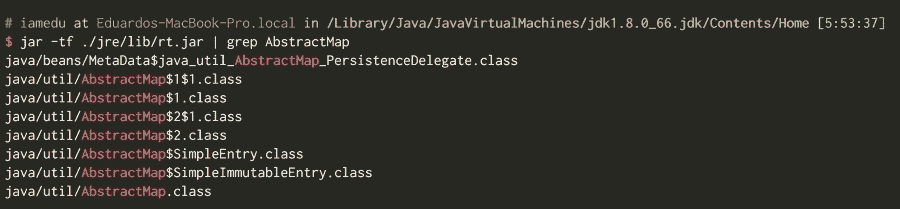
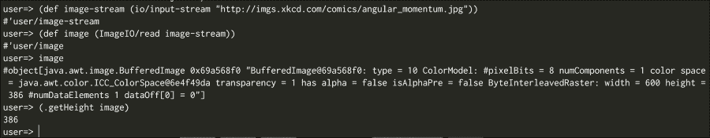
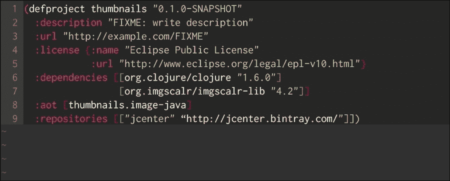
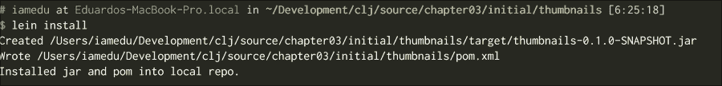
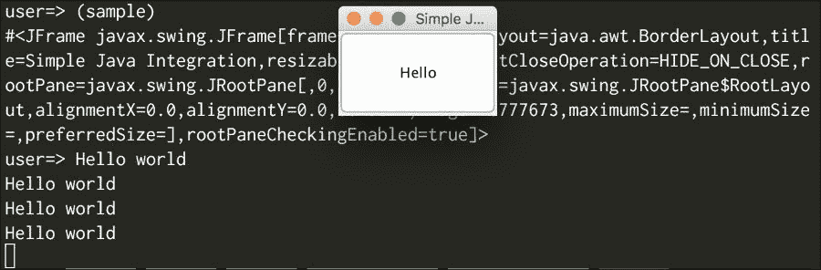

# 第三章。与 Java 交互

我们对如何组织代码以及它与 Java 中的包的关系有一些了解。现在，你当然需要使用你旧的 Java 代码和所有你已知的库；Clojure 鼓励一种新的编程思考方式，同时也允许你使用所有已经生成的依赖和代码。

Clojure 是一种**Java 虚拟机**（**JVM**）语言，因此它与大多数 Java 依赖项和库兼容；你应该能够使用所有这些工具。你也应该能够使用 Java-only 程序与 Clojure 程序一起使用，这需要一些自定义编码，但最终你可以在项目的正确位置使用 Clojure。

为了能够做到这一点，我们得学习：

+   使用 Maven 依赖项

+   在 Clojure 代码库中使用普通的 Java 类

+   关于 Clojure 语言的一些更多信息，特别是`let`语句和结构化

+   为你的 Clojure 代码创建 Java 接口

+   从其他 Java 项目中使用 Java 接口

# 使用 Maven 依赖项

假设我们想要编写一个图像处理程序；这是一个非常简单的程序，应该能够创建缩略图。我们的代码库大部分是 Clojure 编写的，所以我们也想用 Clojure 来编写这个程序。

有许多 Java 库旨在处理图像，我们决定使用 imgscalr，它非常简单易用，看起来它在 Maven Central 中可用（[`search.maven.org/`](http://search.maven.org/)）。

让我们创建一个新的 Leiningen 项目，如下所示：

```java
lein new thumbnails

```

现在，我们需要编辑缩略图项目的`project.clj`文件：

```java
(defproject thumbnails "0.1.0-SNAPSHOT"
  :description "FIXME: write description"
  :url "http://example.com/FIXME"
  :license {:name "Eclipse Public License"
            :url "http://www.eclipse.org/legal/epl-v10.html"}
  :dependencies [[org.clojure/clojure "1.6.0"]])
```

你可以像以下代码一样添加`imgscalr`依赖项：

```java
(defproject thumbnails "0.1.0-SNAPSHOT"
  :description "FIXME: write description"
  :url "http://example.com/FIXME"
  :license {:name "Eclipse Public License"
            :url "http://www.eclipse.org/legal/epl-v10.html"}
  :dependencies [[org.clojure/clojure "1.6.0"]
                 [org.imgscalr/imgscalr-lib "4.2"]])
```

如你所见，你只需要将依赖项添加到`:dependencies`向量中，依赖项会自动从以下位置解析：

+   Maven 本地仓库

+   Maven Central

+   Clojars

### 注意

Maven 本地仓库指向你的本地 Maven 仓库，该仓库位于`~/.m2`文件夹中。如果你愿意，你可以使用 Leiningen 的`:local-repo`键来更改它。

你可以添加自己的仓库，比如说你需要添加**jcenter**（Bintray 的 Java 仓库），你可以这样做，如下所示：

```java
(defproject thumbnails "0.1.0-SNAPSHOT"
  :description "FIXME: write description"
  :url "http://example.com/FIXME"
  :license {:name "Eclipse Public License"
            :url "http://www.eclipse.org/legal/epl-v10.html"}
  :dependencies [[org.clojure/clojure "1.6.0"]
                 [org.imgscalr/imgscalr-lib "4.2"]]
  :repositories [["jcenter" "http://jcenter.bintray.com/"]])
```

### 注意

Leiningen 支持广泛的选项来配置你的项目，更多详细信息，你可以查看 Leiningen 官方仓库中的示例：[`github.com/technomancy/leiningen/blob/master/sample.project.clj`](https://github.com/technomancy/leiningen/blob/master/sample.project.clj)。

为了下载依赖项，你必须执行以下代码：

```java
lein deps

```

### 小贴士

你不需要每次想要下载依赖项时都执行`lein deps`，你可以这样做来强制下载，但 Leiningen 会在需要时自动下载它们。

你可以通过运行以下命令来检查当前依赖项：

```java
lein deps :tree

```

你将得到类似以下的内容：

```java
 [clojure-complete "0.2.3" :scope "test" :exclusions [[org.clojure/clojure]]]
 [org.clojure/clojure "1.6.0"]
 [org.clojure/tools.nrepl "0.2.6" :scope "test" :exclusions [[org.clojure/clojure]]]
 [org.imgscalr/imgscalr-lib "4.2"]
```

这列出了你的当前依赖项树。

# Clojure 互操作语法

Clojure 被设计成一种托管语言，这意味着它可以在不同的环境或运行时中运行。一个重要的哲学方面是 Clojure 不会试图阻碍你的原始宿主；这允许你利用你对底层平台的了解来获得优势。

在这种情况下，我们使用的是 Java 平台。让我们看看我们需要了解的基本中断语法。

## 创建对象

在 Clojure 中创建对象有两种方式；例如，让我们看看如何创建`java.util.ArrayList`的实例。

```java
(def a (new java.util.ArrayList 20))
```

这里，我们使用的是`new`特殊形式，正如你所见，它接收一个符号（类的名称`java.util.ArrayList`）并且在这种情况下它是一个整数。

符号`java.util.ArrayList`代表`classname`，任何 Java 类名都可以在这里使用。

接下来，你可以实际传递任意数量的参数（包括`0`个参数）。下一个参数是构造函数的参数。

让我们看看可用于创建对象的另一种特殊语法：

```java
(def a (ArrayList.))
```

这里的不同之处在于我们有一个尾随的点；我们更喜欢看到这种语法，因为它更短。

## 调用实例方法

一旦我们创建了我们的对象，我们就可以调用实例方法。这和调用 Clojure 函数的方式类似，使用特殊的点形式。

如果我们想向新创建的列表中添加一个元素，我们必须按照以下方式操作：

```java
(. add a 5)
```

这种语法可能看起来有点奇怪；以下是这种语法是如何形成的：

```java
(. instance method-name args*)
```

类似于创建对象时我们有的两种不同选项，我们还有另一种方法来做这件事：

```java
(.method-name instance args*)
```

你可能会认为这更熟悉，因为以点开头的命名方法类似于我们写 Java 方法调用的方式。

## 调用静态方法或函数

能够调用方法和创建对象给了我们很大的权力，通过这个简单的结构，我们获得了许多权力；现在我们可以使用大多数 Java 标准库以及自定义库。

然而，我们仍然需要一些其他的东西；其中最重要的一项是调用静态方法。静态方法的感觉类似于 Clojure 函数，没有`this`实例，你可以像调用正常的 Clojure 函数一样简单地调用它们。

例如，如果我们想从`Collections`类中获取一个`emptyMap`，我们可以按照以下方式操作：

```java
(java.util.Collections/emptyMap)
```

你可以把静态方法看作是函数，把类看作是一个命名空间。这并不完全正确，但这个心理模型将帮助你更容易地理解它。

## 访问内部类

使用 Java-Clojure 互操作时，另一个常见的疑问是如何访问内部类。

假设你想使用`java.util.AbstractMap.SimpleEntry`类来表示一个来自映射的单个条目。

你可能会认为我们必须做类似这样的事情：

```java
(java.util.AbstractMap.SimpleEntry. "key" "value")
```

这是你写 Java 时通常会做的事情，但在 Clojure 中你可能需要做类似这样的事情：

```java
(java.util.AbstractMap$SimpleEntry. "key" "value")
```

我们在这里看到的是实际上是一个暴露的实现细节；如果你查看 JAR 文件中的类或你的类路径中的类，你会看到精确的文件名`AbstractMap$SimpleEntry`，如下面的截图所示：



这是你需要记住的，总是用父类（或更准确地说，包含类）和美元符号作为内部类的开头（在这种情况下是`java.util.AbstractMap`）。

# 编写简单的图像命名空间

让我们现在编写一些 Clojure 代码，并在`src/thumbnails/image.clj`中创建一个文件。

让我们尝试用 Clojure 的方式来做这件事。首先，编写命名空间声明并评估它：

```java
(ns thumbnails.image
  (:require [clojure.java.io :as io])
  (:import [javax.imageio ImageIO]
           [java.awt.image BufferedImageOp]
           [org.imgscalr Scalr Scalr$Mode]))
```

现在打开 REPL 并编写以下代码：

```java
(def image-stream (io/input-stream "http://imgs.xkcd.com/comics/angular_momentum.jpg"))(def image (ImageIO/read image-stream))
image
(.getWidth image)
```

现在我们有一个图像实例，你可以在 REPL 中调用所有的 Java 方法。这是 Clojure 的核心概念之一，你可以与 REPL 互动并检查你的代码，在真正编写它之前，你可以以交互式的方式进行，如下所示：



最后，我们希望坚持以下内容：

```java
(ns thumbnails.image
  (:require [clojure.java.io :as io])
  (:import [javax.imageio ImageIO]
           [java.awt.image BufferedImageOp]
           [org.imgscalr Scalr Scalr$Mode]))

(defn load-image [image-stream]
  (ImageIO/read image-stream))

(defn save-image [image path]
  (ImageIO/write image "PNG" (io/output-stream path)))

(defn image-size [image]
  [(.getWidth image) (.getHeight image)])

(defn generate-thumbnail [image size]
  (Scalr/resize image Scalr$Mode/FIT_TO_WIDTH size (into-array BufferedImageOp [])))

(defn get-image-width [image-path]
  (let [image (load-image image-path)
        [w _] (image-size image)]
    w))
```

### 小贴士

你可以看到，在这段代码中我们使用了内部类语法，`Scalr$Mode`。模式实际上不是一个类，而是一个`enum`，你可以用相同的语法为所有其他内部类型使用。

代码相当简单，它与你已经看到的内容非常相似；我们将通过两种方式来探讨这些差异。

你可以导入以下类：

+   `javax.imageio.ImageIO`

+   `java.awt.image.BufferedImageOp`

+   `org.imgscalr.Scalr`

+   `org.imgscalr.Scalr.Mode`

你必须小心处理`Mode`类，因为它是一个内部类（它位于另一个类中），Clojure 使用特殊的名称`Scalr$Mode`。

### 小贴士

当导入内部类时，你必须小心命名过程，在 Java 中你将使用名称：`org.imgscalr.Scalr.Mode`；在 Clojure 中你使用名称：`org.imgscalr.Scalr$Mode`。`load-image`、`save-image`和`image-size`函数是自我解释的，而`generate-thumbnail`函数也很简单；然而，它有一个特殊细节，它将以下内容作为最后一个参数调用：

```java
(into-array BufferedImageOp [])
```

如果你查看 ImageScalr javadoc（[`javadox.com/org.imgscalr/imgscalr-lib/4.2/org/imgscalr/Scalr.Mode.html`](http://javadox.com/org.imgscalr/imgscalr-lib/4.2/org/imgscalr/Scalr.Mode.html)），你可以看到`resize`方法有几个重载实现；其中大多数都有`varargs`参数作为它们的最后一个参数。在 Clojure 中，你必须将这些`varargs`参数声明为数组。

# 编写测试

现在你已经编写了图像处理代码，现在是编写测试的好时机。

让我们检查一下是否可以生成缩略图。在测试中创建一个新的`thumbnails.thumbnail-test`命名空间。

记住，如果你创建了文件，它必须命名为`test/thumbnails/thumbnail_test.clj`。

将以下内容添加到其中：

```java
(ns thumbnails.thumbnail-test
  (:require [clojure.test :refer :all]
            [clojure.java.io :as io]
            [thumbnails.image :refer :all]))

(deftest test-image-width
  (testing "We should be able to get the image with"
    (let [image-stream (io/input-stream "http://imgs.xkcd.com/comics/angular_momentum.jpg")
          image (load-image image-stream)]
      (save-image image "xkcd-width.png")
      (is (= 600 (get-image-width (io/input-stream "xkcd-width.png")))))))

(deftest test-load-image
  (testing "We should be able to generate thumbnails"
    (let [image-stream (io/input-stream "http://imgs.xkcd.com/comics/angular_momentum.jpg")
          image (load-image image-stream)
          thumbnail-image (generate-thumbnail image 50)]
      (save-image thumbnail-image "xkcd.png")
      (is (= 50 (get-image-width (io/input-stream "xkcd.png")))))))
```

在这里我们使用了一些未知的功能，例如`let`形式和结构化。我们将在下一节中更详细地探讨这些内容。

## 令语句

Clojure 提供了一个`let`语句来命名事物；它允许我们做类似于其他语言中变量声明的类似操作。

请记住，我们实际上并没有以 Java 中相同的方式创建变量。在 Java 中，每当声明一个变量时，我们声明我们想要为后续阶段保留一定量的内存来存储某些东西；它可以是一个原始值的值或对象的内存位置。我们在这里所做的只是命名一个值。这是一个有用的局部作用域，可以编写更干净、更容易理解的代码。让我们看看它是如何工作的：

```java
(let [x 42] x)
```

这是我们可以写的最简单的`let`语句，它和直接写`42`完全一样。然而，我们可以写一些更复杂的，比如这个：

```java
(let [x 42
      y (* x x)]
  (println "x is " x " and y " y))
```

这看起来很直观；将值`42`赋给`x`和`y`，我们实际上是将`42`乘以`42`的值赋给它们。最后，我们打印`x is 42 and y 1764`。这里有两个重要的事情需要注意：

+   我们可以在`let`语句中使用之前定义的值；例如，我们在定义`y`时使用`x`。

+   `let`语句创建了一个作用域，我们无法在`let`语句之外使用`x`或`y`。

`let`语句甚至可以嵌套，我们可以做类似以下示例的事情：

```java
(let [x 42]
  (let [y (* x x)]
    (println "x is " x " and y " y)))
```

它稍微复杂一些，因为我们打开了一组不必要的括号，并且写了更多的代码；然而，它允许我们看到词法作用域是如何工作的。

让我们看看另一个有趣的例子：

```java
(let [x 42]
  (let [y (* x x)]
    (let [x 41]
      (println "x is " x " and y " y))))
```

在这里，我们用`41`来遮蔽`x`的值，并且这些不是变量。我们并没有改变内存区域，我们只是在创建一个新的作用域，并赋予一个新的*X*值。

回到我们的测试，`let`语句以以下代码开始：

```java
image (load-image image-path)
```

它很容易理解，但下一行可能有点困难：

```java
[w _] (image-size image)
```

它看起来相当奇怪；我们将(`image-size image`)的值赋给`[w _]`，但`[w _]`不是一个符号名！

这里发生的事情是，我们正在使用一种称为解构的机制来分解(`image-size image`)的结果，并仅使用我们感兴趣的信息片段，在这种情况下是图像的宽度。

解构是 Clojure 的一个关键特性，它几乎可以在符号绑定发生的任何地方使用，例如：

+   令表达式

+   函数参数列表

解构有助于编写更简洁的代码，但如果你不习惯它，可能会觉得有些奇怪。让我们在下一节深入讨论它。

# Clojure 中的解构

解构是 Clojure 中一个在其他 Lisp 中不常见的特性；其想法是允许你在代码实际上没有增加价值的情况下编写更简洁的代码（例如，从列表中获取第一个元素或从函数中获取第二个参数），并只关注对你重要的事情。

为了更好地理解这一点，让我们看看解构如何帮助你的一个例子：

```java
(let [v [1 2 3]] [(first v) (nth v 2)]) ;; [1 3]
```

前面的代码有什么问题？实际上没有什么问题，但你需要开始思考`v`是什么，`v`的第一个值是什么，`nth`函数做什么，以及`v`从哪个索引开始。

我们可以这样做：

```java
(let [[f s t] [1 2 3]] [f t]) ;; [1 3]
```

一旦你习惯了解构，你就会发现你不需要考虑如何获取你需要的元素。在这种情况下，我们直接从我们的向量中访问第一个、第二个和第三个元素，并使用这三个元素中的第一个和第三个。有了好的命名，这可以变得更加简单。

现在我们深入探讨一下解构是什么。

解构有两种类型：

+   **顺序解构**：它允许我们将顺序数据结构拆分，并将你感兴趣的值直接绑定到符号

+   **关联解构**：它允许我们将映射拆分，并将你感兴趣的键引用值直接绑定到符号

## 顺序解构

通过一些示例，顺序解构应该很容易理解；让我们看看：

```java
(let [[f s] [1 2]] f) ;; 1
(let [[f s t] [1 2 3]] [f t]) ;; [1 3]
(let [[f] [1 2]] f);; 1
(let [[f s t] [1 2]] t);; nil
(let [[f & t [1 2]] t);; (2)
(let [[f & t [1 2 3]] t);; (2 3)
(let [[f & t [1 2 3]] t);; (2 3)
(let [[f & [_ t]] [1 2 3]] [f t])
```

在这些示例中，按照惯例，我们用`f`表示第一个，`s`表示第二个，`t`表示第三个，而`a`表示其他所有元素。

同样的解构思想和语法也可以用于函数参数，如下一个示例所示：

```java
(defn func [[f _ t]]
  (+ f t))
(func [1 2 3]) ;; 4
```

### 注意

在这里我们使用符号`_`，Clojure 中有一个惯例，即当你对某个值不感兴趣且将来不需要使用它时，使用`_`符号。在上一个示例中，我们对`func`函数的第二个参数不感兴趣。

如您所见，它让我们能够编写更简洁的代码，只关注重要的部分，即算法或业务。

## 关联解构

我们已经看到了顺序解构，它允许通过索引获取序列的某些元素。在 Clojure 中，还有关联解构，它允许你只获取你感兴趣的映射中的键。

再次，一个例子胜过千言万语：

```java
(let [{a-value a} {: a-value  5}] a-value) ;; 5
(let [{a-value :a c-value :c} {:a 5 :b 6 :c 7}] c-value) ;; 7
(let [{:keys [a c]} {:a 5 :b 6 :c 7}] c) ;; 7
(let [{:syms [a c]} {'a 5 :b 6 'c 7}] c) ;; 7
(let [{:strs [a c]} {:a 5 :b 6 :c 7 "a" 9}] [a c]) ;; [9 nil]
(let [{:strs [a c] :or {c 42}} {:a 5 :b 6 :c 7 "a" 9}] [a c]) ;; [9 42]
```

### 小贴士

将符号视为映射的键可能感觉有些奇怪，但重要的是要记住这个功能；它可能在某个时候派上用场。

如您所见，这也很简单，但我们有更多选项：

+   我们可以引用一些键并给它们命名，如第一个和第二个示例所示

+   我们可以引用关键字键，如第三个示例所示

+   我们可以引用字符串键，如第四个示例所示

+   我们可以使用`:or`关键字定义默认值！

解构是 Clojure 最常用的功能之一，它允许你编写非常简洁的代码。

回到我们的测试代码，现在应该很容易理解`get-image-width`函数：

```java
(defn get-image-width [image-path]
  (let [image (load-image image-path)
        [w _] (image-size image)]
    w))
```

如您所见，它将图像值设置为加载的图像，然后计算宽度，只获取宽度并返回该值。

我们现在可以理解`test-load-image`测试：

```java
 (deftest test-load-image
  (testing "We should be able to generate thumbnails"
    (let [image-stream    (io/input-stream "http://imgs.xkcd.com/comics/angular_momentum.jpg")
          image           (load-image image-stream)
          thumbnail-image (generate-thumbnail image 50)]
      (save-image thumbnail-image "xkcd.png")
      (is (= 50 (get-image-width (io/input-stream "xkcd.png")))))))
```

它只是初始化了一个 `image-stream` 值，然后从这个流中加载一个图像并生成缩略图。最后，它加载生成的缩略图并检查图像宽度是否为 50px。

现在我们已经编写了测试，并且我们确信一切正常，我们可以从 Clojure 项目中使用我们的小型库，但如果我们想从纯 Java（或 groovy，或 scala）项目中使用它会发生什么呢？

# 将你的代码暴露给 Java

如果你希望能够从其他 JVM 语言中使用 Clojure 代码，在 Clojure 中，有几种方法可以实现：

+   你可以生成新的 Java 类，并像通常一样使用它们；它可以实现某些接口或从某些其他类扩展。

+   你可以即时生成代理，这样你就可以用很少的代码和努力实现一些框架所需的合约（以类或接口的形式）。

+   你可以使用 `clojure.java.api` 包直接从 Java 调用 Clojure 函数。

### 注意

你可以在以下位置找到更多关于如何实现的信息：[`www.falkoriemenschneider.de/a__2014-03-22__Add-Awesomeness-to-your-Legacy-Java.html`](http://www.falkoriemenschneider.de/a__2014-03-22__Add-Awesomeness-to-your-Legacy-Java.html)。

让我们看看我们如何定义一个 Java 类。

创建一个名为 `thumbnails.image-java` 的新命名空间，并编写以下代码：

```java
(ns thumbnails.image-java
  (:require [thumbnails.image :as img])
  (:gen-class
    :methods [[loadImage [java.io.InputStream] java.awt.image.BufferedImage]
              [saveImage [java.awt.image.BufferedImage String] void]
              [generateThumbnail [java.awt.image.BufferedImage int] java.awt.image.BufferedImage]]
    :main false
    :name thumbnails.ImageProcessor))

(defn -loadImage [this image-stream]
  (img/load-image image-stream))

(defn -saveImage [this image path]
  (img/save-image image path))

(defn -generateThumbnail [this image size]
  (img/generate-thumbnail image size))
```

这段代码与我们已经见过的 Clojure 代码非常相似，只是多了 `gen-class` 指令和以破折号开头的函数名。

让我们更详细地回顾一下 `gen-class`：

```java
(:gen-class
    :methods [[loadImage [java.io.InputStream] java.awt.image.BufferedImage]
              [saveImage [java.awt.image.BufferedImage String] void]
              [generateThumbnail [java.awt.image.BufferedImage int] java.awt.image.BufferedImage]]
    :main false
    :name thumbnails.ImageProcessor)
```

当 Clojure 编译器看到这个时，它会生成类的字节码，但它需要一点关键词的帮助来知道如何生成类。

+   名称键定义了类的名称，它是一个符号。

+   主键定义了这个类是否应该有一个主方法。

+   方法键定义了所有方法和它们的签名，它是一个包含三个部分的向量：`[methodName [parameterTypes] returnType]`

然后方法作为以 (`-`) 字符开头的函数实现，前缀可以通过前缀键更改。

你还需要告诉 Clojure 提前编译这个类，在 Leiningen 中，可以通过 `:aot` 实现，转到你的 `project.clj` 文件，并添加一个 `:aot` 键，指定要编译的命名空间或命名空间列表；如果你希望所有内容都提前编译，可以使用特殊的 `:all` 值。

最后，你应该会有类似以下内容：



### 小贴士

如果你希望所有代码都提前编译，你可以在 `project.clj` 中使用 `:aot :all`。

现在，我们可以将我们的库安装到我们的 Maven 本地仓库中。转到命令行并运行：

```java
$ lein install

```

你会得到类似于以下截图的输出：



现在，你已经准备好了；你应该在你的 Maven 本地仓库中有 `thumbnails:thumbnails:0.1.0-SNAPSHOT` 依赖项。

## 从 Groovy 进行测试

为了看到这如何与多种 JVM 语言一起工作，我们将使用 Groovy 和 Gradle 进行测试。我们同样可以轻松地使用 Java 和 Maven。记住，你可以从代码包中获取源代码，这样你就不需要了解这里发生的一切。

这里有两个文件；在 `build.gradle` 文件中，我们指定我们想要使用我们的本地 Maven 仓库，并指定我们的依赖项，如下所示：

```java
apply plugin: 'java'
apply plugin: 'groovy'

repositories {
  jcenter()
  mavenLocal()
}

dependencies {
  compile "thumbnails:thumbnails:0.1.0-SNAPSHOT"
  testCompile "org.spockframework:spock-core:0.7-groovy-2.0"
}
```

然后，我们可以编写我们的测试，如下面的代码所示：

```java
package imaging.java

import thumbnails.ImageProcessor
import spock.lang.*

class ImageSpec extends Specification {
  def "Test we can use imaging tools"() {
    setup:
      def processor = new ImageProcessor()
      def imageStream = getClass().getResourceAsStream("/test.png")

    when:
      def image = processor.loadImage(imageStream)
      def thumbnail = processor.generateThumbnail(image, 100)

    then:
      thumbnail.getWidth() == 100
  }
}
```

然后，你可以运行测试：

```java
gradle test
```

如你所见，从 Java、Groovy 或甚至 Scala 运行你的代码非常简单。还有其他方法可以将 Clojure 与 Java 结合使用，特别是如果你想要实现一个接口或动态生成一个类。

# 代理和具体化

在与 Java 库交互的情况下，有时你必须向某个方法发送一个特定 Java 类的实例；编写一个类并不是最佳选择，你更应该创建一个即时符合某些框架预期契约的实例。我们有两个选项来完成这个任务：

+   **代理**：它允许你实现 Java 接口或从某个超类扩展。实际上，它创建了一个新对象，当需要时调用你的 Clojure 函数。

+   **具体化**：具体化允许你实现接口和 Clojure 协议（我们稍后会看到）。它不能扩展类。它的性能比代理更好，应该尽可能使用。

让我们看看一个最小示例：

```java
(import '(javax.swing JFrame JLabel JTextField JButton)
        '(java.awt.event ActionListener)
        '(java.awt GridLayout))
(defn sample []
  (let [frame (JFrame. "Simple Java Integration")
        sample-button (JButton. "Hello")]
    (.addActionListener
     sample-button
     (reify ActionListener
            (actionPerformed
             [_ evt]
             (println "Hello world"))))
    (doto frame
      (.add sample-button)
      (.setSize 100 40)
      (.setVisible true))))
(sample)
```

### 小贴士

`doto` 是一个宏，允许我们在一个实例上调用多个方法；你可以将其视为分别调用所有方法的一种方式。它与 Java Beans 结合得很好！

打开一个 REPL 并编写代码；它应该显示一个包含按钮的窗口，当点击按钮时（在终端中）会打印 `Hello world`：



如果你熟悉 Swing，那么你知道 `JButton` 的 `addActionListener` 需要一个回调，即 `ActionListener` 的实例，而我们正是通过 `reify` 函数创建这个实例的。

在 Java 代码中，你可能会做类似以下代码的事情：

```java
button.addActionListener(new ActionListener() {
  public void actionPerformed(ActionEvent e) {
    System.out.println("Hello world")'
  }
})
```

我们称之为匿名类，它本质上与函数式语言中的闭包相同。在上一个例子中，代码被具体化所取代：

```java
  (reify ActionListener
            (actionPerformed
             [_ evt]
             (println "Hello world")))
```

`reify` 语句接收你要实现的接口以及你按列表实现的所有方法。在这种情况下，我们只实现了 `actionPerformed` 来接收动作事件。

这是结构：

```java
(reify InterfaceOrProtocol
  (method [self parameter-list]
    method-body)
  (method2 [self parameter-list]
    method-body))
```

这将创建一个 `ActionListener` 的实例，你可以用相同的方式处理 servlets、线程、集合、列表或任何其他人定义的 Java 接口。

在这里，你需要记住的一件特别的事情是，你需要在方法实现中始终将 `self` 作为第一个参数添加；它取代了在 Java 中工作的 `this` 关键字。

# 摘要

在这一章中，你通过一些新的基本操作获得了 Clojure 的很多力量。

正如你所见，与你的现有代码库交互的方式有很多；具体来说，你现在可以：

+   使用 Clojure 代码中的 Java 代码

+   使用 Java 代码中的 Clojure 代码

+   通过创建遵守其契约的对象来重用 Java 框架

考虑到我们所有的全新工具，我们现在准备处理更多概念以及稍微多一点的数据集合和数据结构复杂性。
