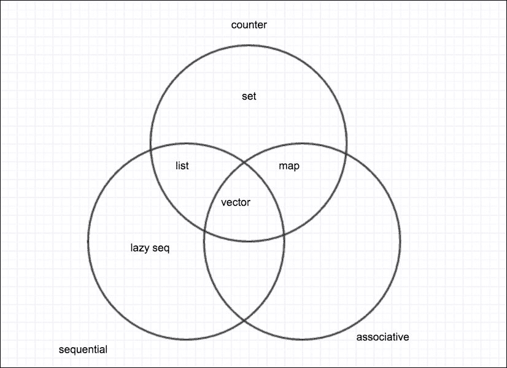

# 第四章：集合和函数式编程

我们现在使用 Java 代码从 Clojure 程序中感到很舒适，我们也知道如何通过 Java API 公开我们的 Clojure 程序。然而，我们需要更深入地了解 Clojure 及其真正的本质，即函数式编程。

在本章中，我们将涵盖以下主题：

+   函数式编程的基础

+   持久化集合

+   顺序和关联集合

+   序列抽象

+   集合类型

+   将函数式编程应用于集合

# 函数式编程的基础

这是一个你可以在很多不同地方阅读的主题，似乎每个人都有自己关于函数式编程的看法。然而，在几乎每个定义中，你都会找到一个共同点，这与你从函数式编程中获得的好处相关，例如：

+   更容易的代码重用

+   函数更容易测试

+   函数更容易推理

为了获得这些好处，你需要考虑以下事项：

+   你应该将函数视为一等公民

+   函数应该最小化副作用（它们不应该改变任何状态）

+   函数应该只依赖于它们的参数（这被称为引用透明性）

让我们看看 Java 中函数（或方法）的两个例子，以说明即使在 Java 中，你也可以从编写无副作用和上下文依赖的函数中获得好处。

```java
public void payRent(BigDecimal amount) {
  User user = getCurrentUser();
  if(user.payAmount != amount) {
    System.out.println("Cannot pay");
  } else {
    user.money -= amount;
  }
}
```

假设你必须测试上述函数；你可能会遇到一些问题：

1.  你需要知道如何获取当前用户；你可能需要模拟数据库或会话存储。或者在最坏的情况下，你可能需要一个真实的会话存储服务。

1.  你如何知道某物是否已付费？

现在，看看这个其他例子：

```java
public boolean payRent(User user, BigDecimal amount, ValidateStrategy strategy) {
  if(strategy.validatePayment(user, amount)) {
    user.money -= amount;
    return true;
  } else {
    return false;
  }
}
```

上述代码更容易测试；你可以以任何方式创建用户实例，并且使用`ValidateStrategy`类（或接口），你可以做你需要做的任何事情。

最后，你得到一个返回值，表明操作是否可行，而不是副作用。这样你就不需要模拟，并且可以在不同的上下文中重用它。

现在我们已经看到了函数式编程的一些共同点，让我们看看 Clojure 为函数式编程提供的价值主张：

+   函数是一等公民或值。就像整数或字符串一样，你可以在运行时创建它们，传递它们，并在其他函数中接收它们。

+   与函数是值一样，数据结构也是值；它们不能像 Java 中那样被修改，但它们是一个固定值，就像整数是一个固定值一样。

+   不变的数据结构非常重要，它们允许编写安全且简单的多线程代码。

+   惰性（数据结构）允许延迟评估直到需要时，只执行你必须执行的操作。

# 持久化集合

Clojure 中最重要的一项特性是集合的持久性。这并不意味着它们对磁盘是持久的，这意味着您可以有多个集合的历史版本，并保证更新或在这些版本中查找任何内容都将具有相同的努力（复杂度）。您只需很少的额外内存就能获得所有这些。

如何实现？实际上非常简单。Clojure 在几个不同的数据结构之间共享一个公共结构。如果您向一个数据结构添加单个元素，Clojure 会在两个结构之间共享公共部分，并跟踪差异。

让我们用一个例子来看看我们的意思：

```java
(def sample-coll [:one :two :three])
(def second-sample-coll (conj sample-coll :four))
(def third-sample-coll (replace {:one 1} sample-coll))

sample-coll ;; [:one :two :three]
second-sample-coll ;; [:one :two :three :four]
third-sample-coll ;; [1 :two :three :four]
```

如您所见，当您将一个新项目`conj`到一个集合中，或者甚至替换其中的某些元素时，您并没有改变原始集合，您只是生成了一个新的版本。

### 注意

在 Clojure 中，您可以使用`conj(conjoin)`作为一个动词。这意味着以高效的方式将新元素添加到集合中。

这个新版本不会以任何方式修改您之前拥有的任何集合。

这与常见的命令式语言的工作方式有很大不同，乍一看可能像是一个坏主意，但 Clojure 使用高效的算法，给我们带来了一些优势，特别是：

+   同一集合的不同版本共享公共部分，使我们能够使用很少的内存。

+   当集合的某部分不可见时，它会被垃圾回收。

您从这得到的是与可变集合相似的内存使用量。记住，在空间和时间上都有成本，但对于大多数用例来说可以忽略不计。

您为什么想要有一个不可变的数据集合？主要优势是它们很容易理解；将它们传递给函数不会改变它们，当您编写并发代码时，没有其他线程会修改您的集合，您也不需要担心显式处理锁。

# Clojure 中集合的类型

Clojure 中有三种类型的集合：计数、顺序和关联。它们不是互斥的，这意味着一个集合可能是任何一种。

让我们看看每种类型：

+   **计数集合**：计数集合是一个知道其大小在常数时间内的集合。它不需要遍历其元素来获取计数。

+   **顺序集合**：顺序集合可以顺序遍历；这是您在列表中使用最常见的方法。最容易想到的是类似于 Java 的列表，您可以使用 for 循环或迭代器遍历它。在 Clojure 中，向量、列表和惰性序列都是顺序集合。

+   **关联集合**：关联集合可以通过键来访问；映射是这里的首选。我们说过一个集合可以是任何类型；Clojure 的向量也可以用作关联集合，每个元素索引可以用作键。你可以将其视为一个映射，其键为 0、1、2、3 等。

Clojure 有一些函数可以告诉我们给定的集合是否属于每种类型，顺序的还是关联的。正如你所猜测的，向量对两者都返回 true。以下就是那些函数：

| 函数名称 | 列表 | 向量 | 映射 | 惰性序列 | 集合 |
| --- | --- | --- | --- | --- | --- |
| counted? | true | true | true | false | true |
| sequential? | true | true | false | true | false |
| associative? | false | true | true | false | false |



在之前的表格和图中，你可以看到我们考虑了**集合**，并且正如你所见，它既不是顺序的也不是关联的。

我们应该看看另一个属性；集合是否计数。这意味着集合知道它有多少个元素。列表、向量、映射和集合都是计数的；惰性序列不是计数的，因为它们是即时生成的，甚至可能是无限序列。

我们将在本章后面的部分中学习更多关于所有这些序列的内容。

# 序列抽象

Clojure 有一些独特的特性使其与其他 Lisp 不同；其中之一就是序列抽象。你可以将其视为集合遵守的接口。Clojure 有一个标准的函数 API，你可以与序列一起使用。以下是一些这些函数的示例：

+   `distinct`函数：这个函数返回一个序列，包含原始序列中的每个元素，但每个元素只出现一次：

    ```java
    (def c [1 1 2 2 3 3 4 4 1 1])
    (distinct c) ;; (1 2 3 4)
    ```

+   `take`函数：这个函数从原始序列中取出一定数量的元素：

    ```java
    (take 5 c) ;; (1 1 2 2 3)
    ```

+   `map`函数：这个函数将一个函数应用于序列中的每个元素，并创建一个包含这些元素的新序列：

    ```java
    (map #(+ % 1) c) ;; (2 2 3 3 4 4 5 5 2 2)
    ```

这里有趣的部分是这些函数接收并返回序列，并且你可以将它们组合在一起。以下代码中可以看得到：

```java
 (->> c
  (distinct)
  (take 5)
  (reverse)) ;; (4 3 2 1)

;; This is known as a threading macro, it applies distinct, then take 5 then reverse to the
;; collection c so this is the same as writing:
;; (reverse (take 5 (distinct c))) but much more readable
```

这些只是接受和返回序列的一些函数，但还有很多其他你可以直接使用的函数。唯一的假设是你的序列参数可以响应三个函数：

+   `first`: 这个函数返回序列的第一个元素

+   `rest`: 这个函数返回另一个序列，包含除了第一个元素之外的所有元素

+   `cons`: 这个函数接收两个参数，一个项和另一个`seq`，然后返回一个新的`seq`，包含该项以及第二个参数中的所有项

### 注意

你会发现使用频率较高的一个函数是`seq`函数，它可以转换任何集合为序列，甚至 Java 原生的数组和实现了`java.util.Iterable`接口的对象。其主要用途之一是测试集合是否为空。

# Clojure 中的特定集合类型

现在你已经了解了 Clojure 的一般集合属性和序列抽象，现在是时候了解 Clojure 的具体集合实现了。

## 向量

向量是 Clojure 的工作马；与 map 一起，它是使用最多的集合。不要害怕它们；它们与 Java 的`java.util.Vector`无关。它们只是一系列有序值，如列表或数组。

它们有以下属性：

+   它们是不可变的

+   它们可以按顺序访问

+   它们是关联的（它们是它们索引的映射，这意味着它们的键是 0、1、2 等等）

+   它们是计数的，这意味着它们有有限的大小

+   它们有随机访问，因此你可以几乎以常数时间访问任何元素（使用 nth 函数）

+   `conj`函数将给定的元素追加到它们中

### 小贴士

nth 函数允许我们获取任何`seq`的第 n 个元素，但你不应不加考虑地使用它。它没有问题处理向量，并且以常数时间返回，但与列表一起使用时，它需要线性时间，因为它必须遍历所有集合以找到你请求的元素。尽量只与向量一起使用它。

它们有字面语法；你可以用方括号定义一个向量，如下所示：

```java
[42 4 2 3 4 4 5 5]
```

除了字面语法之外，还有一个你可以用来构建向量的函数。`vec`函数可以从传递给它的任何序列中构建一个向量：

```java
(vec (range 4)) ;; [0 1 2 3]
```

向量的另一个重要好处是，它们用于函数参数的声明和`let`绑定。

看一下以下示例：

```java
(def f [some-param & some-other-params] …)

(let [one 1 two (f p p-2 p-3)] …)
```

如你所见，函数中的参数被定义为向量，这与`let`绑定相同。

关于 Lisp 的主要抱怨之一是它们使用太多的括号，Clojure 在这些结构中使用向量而不是括号的决策受到欢迎，这使得代码更容易阅读。

有几种方法可以访问向量的某个元素：

+   **使用向量作为函数**：向量可以用作其键的函数；我们还没有讨论映射，但你很快就会看到这是因为它们是关联的：

    ```java
    (def v [42 24 13 2 11 "a"])
    (v 0) ;; 42
    (v 99) ;; java.lang.IndexOutOfBoundsException
    ```

+   **nth 函数**：`nth`函数可以接收一个额外的参数来指示当索引未找到时，它可以被这样使用：

    ```java
    (nth v 0) ;; 42
    (nth v 99 :not-found) ;; :not-found
    (nth v 99) ;; java.lang.IndexOutOfBoundsException
    ```

+   **get 函数**：`get`函数可以接收一个额外的参数来指示当索引未找到时，它被这样使用。需要记住的一个重要的事情是，与 nth 不同，`get`不能用于序列：

    ```java
    (get v 0) ;; 42
    (get v 99 :not-found) ;; :not-found
    (get v 99) ;; nil
    ```

你几乎应该总是使用向量；特别是，如果你想做以下任何一项，没有其他方法可行：

+   你需要随机访问集合（无论是修改还是访问它）

+   你需要在集合的尾部添加元素

## 列表

列表是其他 Lisp 中最重要的集合类型。在 Clojure 中，它们用于表示代码，但它们的函数性几乎仅限于这一点。

Clojure 中的列表是单链表；正如你可以想象的那样，这意味着它们不适合随机访问（你需要遍历列表直到到达想要的索引）。尽管如此，你仍然可以使用列表作为具有 API 中每个功能的序列。

让我们列出它们的属性：

+   它们是不可变的

+   它们可以按顺序访问

+   它们不是关联的

+   它们是计数的，这意味着它们有有限的大小

+   它们不应该以随机顺序访问。如果你想要第 99 个元素，那么 Clojure 将不得不访问前 98 个元素才能得到第 99 个。

+   `conj`函数将给定元素添加到其前面

你可以使用解构，就像在前一章中看到的那样。你不应该害怕使用第一个函数（甚至可以使用带有小索引的 nth）。

### 小贴士

列表有其用例，随着你学习的深入，你可能会在某些地方（如宏）中感到舒适地使用它们，但作为一个经验法则，尽量使用向量。

## 地图

映射可能是所有语言中最重要的集合类型。在 Clojure 中，它们也非常重要。

映射是键值对的集合，这意味着你可以通过键来访问或存储一个元素。我们一直称这种类型的集合为关联集合。在 Clojure 中，键可以是任何类型的值，甚至是函数、列表、集合、向量或其他映射。

### 有序映射和哈希映射

Clojure 中有两种类型的映射，每种类型都有其自身的优势。

+   **哈希映射**：它们是 Clojure 中最常用的映射形式；映射的文本语法创建了这种类型的映射。它们具有几乎恒定的查找时间，这使得它们在大多数场景中都非常快且可用。它们的缺点是你不能按顺序访问它们。你可以创建它们，如下所示：

    ```java
    {:one 1 :two 2}
    (hash-map :one 1 :two 2)
    ```

+   **有序映射**：如果你需要能够以特定顺序访问映射的键值对，那么你必须使用有序映射。有序映射的缺点是查找时间**不是**常数，这意味着它们通过键访问会稍微慢一些。然而，当你需要按键的顺序遍历映射时，这是唯一的方法。这里的一个强约束是键之间必须是可比较的。有序映射可以创建，如下所示：

    ```java
    (sorted-map :sample 5 :map :6) ;; {:sample 5, :map 6}
    (sorted-map-by > 1 :one 5 :five 3 :three) ;; {5 :five, 3 :three, 1 :one}
    ```

### 小贴士

可比较的对象是实现了`compareTo`接口的对象。

### 常见属性

关联对象，包括映射，具有以下属性：

+   它们是它们键的函数：

    ```java
    (def m #{:one 1 :two 2 :three 3})
    (m :one) ;; 1
    (m 1) ;; nil
    ```

+   它们可以用关联解构来使用：

    ```java
    (let [{:keys [a b c d]} #{:a 5}]
      [a b]) ;
    ; [:a nil]
    ```

+   你可以使用`get`函数来访问它们：

    ```java
    (get m :one) ;; 1
    (get m 1) ;; nil
    (get m 1 :not-found) ;; :not-found
    ```

你可以使用`seq`函数将映射转换为`seq`；你将得到一个序列，其中每个元素都是一个表示映射中键值对的向量：

```java
(seq {:one 1 42 :forty-two :6 6}) ;; ([:one 1] [:6 6] [42 :forty-two])
(doseq [[k v] (seq {:one 1 42 :forty-two :6 6})]
  (println k v))
;; :one 1
;; :6 6
;; 42 :forty-two
```

`Doseq`类似于 Java 的 for-each 循环。它对序列中的每个元素执行主体。

它的工作方式如下：`(doseq [x sequence] ;;`。这与 let 语句的工作方式相同，如果需要，你可以使用解构：

```java
    (body-that-uses x))
```

## 集合

Clojure 集合是一组唯一的元素。你可以把它们看作是数学集合，因此 Clojure 有并集、交集和差集等操作。

让我们看看集合的性质：

+   它们是不可变的

+   它们是关联的（它们的键是它们的元素）

+   它们是有计数的，这意味着它们有有限的大小

+   它们的元素是唯一的（最多包含一次）

### 有序集合和无序集合

有两种集合：哈希集合和有序集合。

+   **哈希集合**：除了我们已经看到的属性外，哈希集合是无序的。它们使用哈希表作为后端实现。

+   **有序集合**：除了我们已经看到的属性外，有序集合是有序的。它们可以用作所有期望有序`seq`的函数的参数。它们可以按顺序访问：

    ```java
    (doseq [x (->> (sorted-set :b :c :d)
                            (map name))]
        (println x))
    ;; b
    ;; c
    ;; d
    ```

你也可以无问题地反转它们，过滤它们，或者像向量或列表一样映射它们。

### 常见属性

集合是关联的，这赋予它们一些映射的性质：

+   它们是它们元素的函数：

    ```java
    (#{:a :b :c :d} :a);; :a
    (#{:a :b :c :d} :e);; nil
    ```

+   它们可以与映射解构一起使用：

    ```java
    (let [{:keys [b]} #{:b}] b);; :b
    (let [{:keys [c]} #{:b}] b);; nil
    (let [{:keys [c]} (sorted-set :b)] c);; nil
    (let [{:keys [b]} (sorted-set :b)] b);; :b
    ```

+   可以使用`get`函数来访问它们的元素：

    ```java
    (get #{:a :b :c :d} :e :not-found) ;; :not-found
    (get #{:a :b :c :d} :a) ;; :a
    (get #{:a :b :c :d} :e) ;; nil
    ```

### 并集、差集和交集

如果你记得数学集合，你会知道你可以对它们执行以下三个主要操作：

+   **并集** (`union a b`): 并集包含`a`和`b`中的所有元素

+   **差集** (`difference a b`): 差集是`a`中所有不在`b`中的元素

+   **交集** (`intersection a b`): 它只包含`a`和`b`中都有的元素

这里有一些例子：

```java
(def a #{:a :b :c :d :e})
(def b #{:a :d :h :i :j :k})

(require '[clojure.set :as s])

(s/union a b) ;; #{:e :k :c :j :h :b :d :i :a}
(s/difference a b) ;; #{:e :c :b}
(s/intersection a b) ;; #{:d :a}
```

## 将函数式编程应用于集合

现在我们对集合的工作方式有了更好的理解，我们就有了更好的基础来理解函数式编程以及如何充分利用它。

这需要以不同的方式思考如何解决问题，你应该保持开放的心态。

你可能会发现所有这些集合中有一个非常奇怪的特性：*它们是不可变的*。

这确实是一件相当奇怪的事情；如果你习惯了 Java，你怎么可能编写不添加或删除列表或集合元素的程序呢？

这怎么可能呢？在 Java 中，我们习惯于编写`for`和`while`循环。我们习惯于每一步都修改变量。

我们如何应对不可变的数据结构？让我们在接下来的章节中一探究竟。

### 命令式编程模型

软件行业长期以来一直使用单一的软件范式；这个范式是命令式编程模型。

在命令式范式下，你必须告诉计算机在每一步要做什么。你负责内存的工作方式，是单核运行还是多核运行，如果你想使用多核，你需要确保正确地改变程序状态并避免并发问题。

让我们看看你将如何以命令式风格计算阶乘：

```java
int factorial(int n) {
    int result = 1;
    for (int i = 1; i <= n; i++) {
        result *= i;
    }
    return result;
}
```

你正在创建一个变量`result`和一个变量`i`。你每次通过将其值赋为`i + 1`来改变变量`i`。你可以通过乘以`i`来改变结果。计算机只是执行你的命令，比较、加法和乘法。这就是我们所说的命令式编程模型，因为你需要告诉计算机它需要执行的精确命令。

这在过去由于各种原因一直工作得很好，例如：

+   紧张的内存大小限制迫使程序员尽可能高效地使用内存

+   考虑到单个执行线程以及计算机如何逐步执行它，这更容易思考

当然，有一些缺点。代码可以很容易地变得复杂，世界已经改变；多年前存在的约束已经消失。此外，今天的大多数计算机都有多个 CPU。使用共享可变状态的多线程是负担。

这使得思考变得复杂。即使在单线程程序中我们也会遇到麻烦；想想看，以下代码的结果会是什么？

```java
List l = new ArrayList();
doSomething(l);
System.out.println(l.size());
```

它是`0`吗？你不可能知道，因为`doSomething`方法通过引用获取列表，并且可以在你不知道的情况下添加或删除东西。

现在，想象一下你有一个多线程程序和一个可以被任何线程修改的单个`List`。在 Java 世界中，你必须了解`java.util.concurrent.CopyOnWriteArrayList`，并且你需要了解其实现细节，以便知道何时使用它以及何时不使用它。

即使有这些结构，思考多线程代码也很困难。你仍然需要考虑信号量、锁、同步器等等。

命令式世界可能对简单情况来说很容易，但它并不简单。整个行业已经意识到这一点，有许多新的语言和技术从其他地方汲取了灵感。Java 8 有流式 API，它包括 lambda 块，本质上就是函数。所有这些想法都是从函数式世界借鉴的。

### 函数式范式

有其他思考解决问题的方法；特别是，函数式范式最近变得很重要。这并不是什么新鲜事；Lisp 自从 1958 年构想以来就支持这种编程。它可能直到最近才变得强大，因为它需要一种更抽象的思维方式。

为了让你更好地理解，让我们看看几个函数式编程看起来与以下代码相似示例：

```java
(map str [1 2 3 4 5 6]) ;; ("1" "2" "3" "4" "5" "6")

(defn factorial [n]
  (reduce * (range 1 (inc n))))

(factorial 5) ;; 120
```

如你所见，它看起来相当不同；在第一种情况下，我们将`str`函数传递给另一个名为`map`的函数。

在第二种情况下，我们将`*`函数传递给另一个名为`reduce`的函数。在这两种情况下，我们都是以传递列表或数字的方式使用函数，它们是**第一级公民**。

函数式编程中的一个重要区别是你不需要告诉机器如何做事情。在第一种情况下，map 遍历向量并将 `str` 函数应用于每个元素，将其转换为字符串的 `seq`。你不需要递增索引，你只需要告诉 map 你想要应用于每个元素的函数。

在阶乘情况下，有一个接收 `*` 和从 `1` 到 `n` 的 `seq` 的 `reduce` 函数。

它只需工作，你不需要告诉它如何做任何事情，只需告诉它你想做什么。

`map` 和 `reduce` 都是 **高阶函数**，因为它们接受函数作为参数；它们也是高级抽象。

### 注意

高阶函数是那些接受函数作为参数、返回函数作为结果，或者两者都接受的函数。

你需要在一个更高级的抽象层面上思考，你不在乎事情是如何真正完成的，只在乎它完成了工作。

这带来了一些好处，如果某天映射的实现变成了多线程，你只需更新版本，就可以准备出发了！

### 函数式编程和不可变性

你可能也注意到，函数式编程使得使用不可变结构成为必要，因为你不能在每一步中改变某些或所有状态；你只能描述你想要基于其他集合创建新集合的方式，然后获取它。Clojure 的有效集合使得在最小内存使用的情况下共享集合的片段成为可能。

不可变性还有一些其他的好处：

+   你可以与任何你想分享的人分享你的数据结构，因为你确信没有人会更改你的副本。

+   调试更简单，因为你可以用一些不可变值来测试程序，而不是一些可变状态。当你得到一个值时，你可以找出哪个函数返回了你得到的值；没有多个地方会修改集合供你检查。

+   并发编程更简单；再次确定没有人可以更改你的副本，即使在其他并发运行的线程中，这也使得对程序的推理更简单。

### 懒惰性

Clojure 也支持序列转换的惰性评估。让我们看看 `range` 函数：

```java
(def r (range))
```

当运行此函数而不带参数时，你正在创建一个从 `0` 开始的无限序列。

它是一个无限序列；那么为什么 Clojure REPL 会自动返回？

Clojure 不会在需要之前计算集合值，所以为了获取一个值，你必须做些什么，比如这样：

```java
(take 1 r);; (0)
(take 5 r);; (0 1 2 3 4)
```

### 小贴士

如果你尝试在 REPL 中打印一个无限序列，它将会冻结。

在这里，Clojure 首先解析一个元素，然后解析集合 `r` 中的五个元素，因为它需要在 REPL 中打印它们。

### 小贴士

惰性评估对集合和序列处理都适用。其他操作（如加法、方法调用等）都是立即执行的。

有趣的是，你可以通过将 filter 和 map 等函数应用于某个集合来定义一个新的惰性集合。

例如，让我们获取一个包含所有奇数的新的集合：

```java
(def odd-numbers (filter odd? r))
(take 1 odd-numbers)  ;; (1)
(take 2 odd-numbers)  ;; (1 3)
(take 3 odd-numbers)  ;; (1 3 5)
```

现在，`odd-numbers`是一个包含奇数的无限序列，我们刚刚请求了其中的三个。每当一个数字已经被计算，它就不会再次被计算。让我们稍微改变一下我们的集合，以便理解它是如何工作的：

```java
(defn logging-odd? [number]
    (println number) ;; This is terrible, it is a side effect and a source for problems
                     ;; Clojure encourages you to avoid side effects, but it is pragmatic
                     ;; and relies on you knowing what you are doing
    (odd? number))

(def odd-numbers (filter logging-odd? r))

(take 1 odd-numbers)
;; 0
;; 1
;; 2
;; 3
;; 4
;; 5
;; 6
;; 7
;; 8
;; 9
;; 10
;; 11
;; 12
;; 13
;; 14
;; 15
;; 16
;; 17
;; 18
;; 19
;; 20
;; 21
;; 22
;; 23
;; 24
;; 25
;; 26
;; 27
;; 28
;; 29
;; 30
;; 31
;; => (1)

(take 1 odd-numbers)
;; => (1)

(take 2 odd-numbers)
;; => (1 3)

(take 3 odd-numbers)
;; => (1 3 5)

(take 4 odd-numbers)
;; => (1 3 5 7)

(take 10 odd-numbers)
;; => (1 3 5 7 9 11 13 15 17 19)
```

正如你所见，一些数字首先被计算；你不应该期望或依赖于在特定时间预先计算特定数量的元素。

此外，请注意，当我们请求相同数量的元素时，计算不会再次执行，因为它已经被缓存了。

# 概述

Clojure 中的集合和函数式编程是极其强大的工具，使我们能够使用完全不同的编程范式。

到目前为止，我们已经学到了以下内容：

+   不可变集合的机制以及 Clojure 中每种集合类型最适合做什么

+   序列抽象以及许多 Clojure 函数如何利用这种抽象在集合上工作

+   函数式编程如何使我们能够编写更简单的程序，这些程序在并行环境中表现更好，并帮助我们通过惰性节省资源

在随后的章节中，我们将学习其他新的 Clojure 特性，这些特性为我们提供了比 Java 更强大和新的实现多态性的方法。
