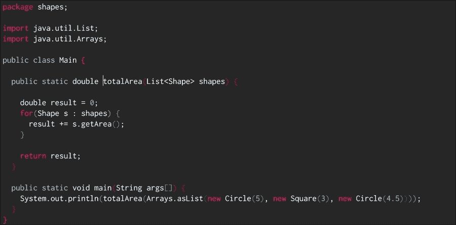
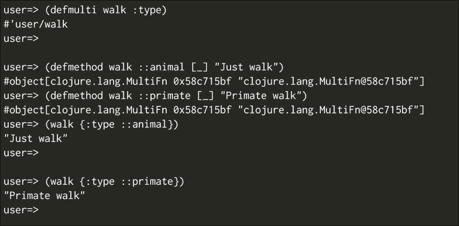
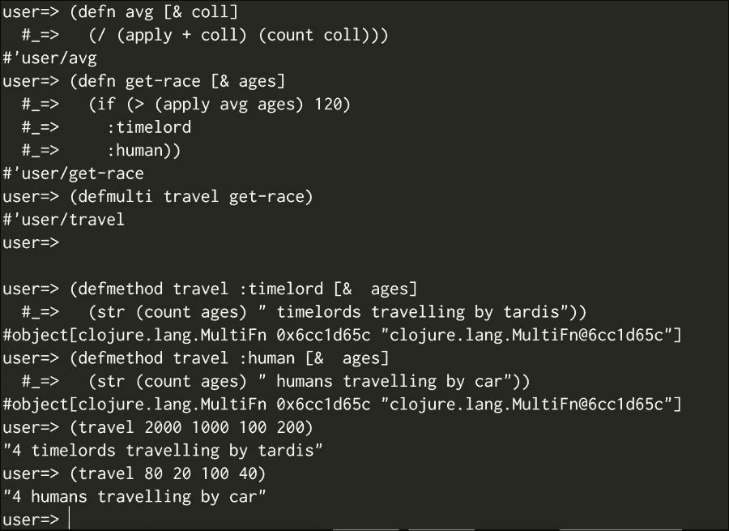

# 第五章. 多态方法和协议

现在我们对 Clojure 的工作原理有了更好的理解；我们了解了如何使用不可变数据结构执行简单操作，但我们缺少一些可以使我们的生活更加容易的功能。

如果你已经是一名 Java 程序员一段时间了，你可能会在思考多态及其在 Java 中的特定风味。

多态是我们能够重用代码的概念之一。它赋予我们使用相同 API 与不同对象交互的能力。

Clojure 有一个强大的多态范式，允许我们编写简单的代码，创建与尚未存在的类型交互的代码，并在程序员编写它时以它未设计的方式扩展代码。

为了帮助我们理解 Clojure 中的多态，我们有两个重要的概念，我们将在本章中介绍：

+   多态方法

+   协议

每一个都有其自己的用例和最擅长的事情；我们将在下一节中探讨它们。

我们将通过回顾我们从 Java 中已经知道的内容来学习这些不同的概念，然后我们将从 Clojure 中学习类似的概念，这些概念给我们带来了更多的能力。

# Java 中的多态

Java 大量使用多态，其集合 API 基于它。Java 中多态的最好例子可能是以下类：

+   `java.util.List`

+   `java.util.Map`

+   `java.util.Set`

我们知道，根据我们的用例，我们应该使用这些数据结构的一个特定实现。

如果我们更喜欢使用有序的 Set，我们可能会使用 TreeSet。

如果我们需要在并发环境中使用 Map，我们将使用`java.util.concurrent.ConcurrentHashMap`。

美妙的是，你可以使用`java.util.Map`和`java.util.Set`接口来编写你的代码，如果你需要更改到另一种类型的 Set 或 Map，因为条件已经改变或有人为你创建了一个更好的集合版本，你不需要更改任何代码！

让我们看看 Java 中多态的一个非常简单的例子。

想象一下你有一个形状层次结构；它可能看起来像以下代码：

```java
package shapes;

public interface Shape {
  public double getArea();
}

public class Square implements Shape {
  private double side;
  public Square(double side) {
this.side = side;
  }

  public double getArea() {
    return side * side;
  }

}

public class Circle implements Shape {
  private double radius;
  public Circle(double radius) {
this.radius = radius;
  }

  public double getArea() {
    return Math.PI * radius * radius;
  }

}
```

你肯定已经意识到了这个概念的力量，你现在可以计算一组图形的所有面积的总和，如下所示：



`totalArea`方法不关心你传递给它的具体形状类型，你可以添加新的形状类型，例如矩形或梯形。现在，你的相同代码将适用于新的数据类型。

现在，使用相同的 Java 代码库，想象一下你想要向你的形状接口添加一个新功能，比如一个简单的`getPerimeter`方法。

这看起来相当简单；你将不得不修改实现 Shape 接口的每个类。我确信你很多次都遇到过这个问题，当你无法访问基源代码时。解决方案是在你的 Shape 对象周围编写一个包装器，但这引入了更多的类和偶然的复杂性。

Clojure 有自己的多态概念，它更简单但也很强大；实际上，你可以用它以非常简单的方式解决周长问题。

解决这个问题的一种方法是多方法；让我们看看它们是如何工作的。

# Clojure 中的多方法

多方法与接口类似，它们允许你编写一个公共契约，然后一组函数可以用特定的实现来满足该接口。

它们非常灵活，正如你将看到的，它们让你能够非常精细地控制对特定数据对象调用哪个函数。

多方法由三个部分组成：

+   函数（或方法）声明

+   调度函数

+   函数的每个可能的实现

多方法最有趣的特点之一是，你可以在不围绕现有对象编写包装器的情况下为已存在的类型实现新的函数。

多方法声明与接口的工作方式相同；你为多态函数定义一个公共契约，如下所示：

```java
(defmulti name docstring? attr-map? dispatch-fn& options)
```

`defmulti` 宏定义了你的多方法的契约，它由以下部分组成：

+   多方法的名称

+   可选的 `doctstring`（这是文档字符串）

+   属性映射

+   `dispatch-fn` 函数

### 注意

`dispatch` 函数会对每块内容进行调用；它生成一个调度键，稍后与函数实现中的键进行比对。当调度键与函数实现中的键匹配时，函数就会被调用。

`dispatch` 函数接收与你要调用的函数相同的参数，并返回一个调度键，用于确定应该调度请求的函数。

每个实现函数都必须定义一个调度键，如果它与 `dispatch` 函数的结果匹配，则执行此函数。

一个例子应该可以澄清：

```java
(defmultiarea :shape)

(defmethodarea :square [{:keys [side]}] (* side side))

(area {:shape :square :side 5})
;;=> 25
```

在这里，我们正在定义一个名为 `area` 的多方法；`defmulti` 语句具有以下结构：

```java
(defmultifunction-name dispatch-function)
```

在这种情况下，多方法被命名为 `area`，而 `dispatch` 函数是 `:shape` 关键字。

### 注意

记住，关键字可以用作函数，在映射中查找自身。所以，例如，(`:shape {:shape :square}`) 的结果是 `:square`。

之后，我们定义一个方法，如下所示：

```java
(defmethodfunction-name dispatch-key [params] function-body)
```

注意，`dispatch-key` 总是调用 `dispatch-function` 并以 `params` 作为参数的结果。

最后，让我们看看调用 `(area {:shape :square :side 5})`，这是在调用一个多方法。首先发生的事情是我们调用调度函数 `:shape`，如下所示：

```java
(:shape {:shape :square :side 5})
;; :square
```

`:square` 函数现在是调度键，我们需要寻找具有该调度键的方法；在这种情况下，我们定义的唯一方法有效。因此，函数被执行，我们得到 `25` 的结果。

添加正方形和圆形的面积和周长非常简单，让我们检查实现：

```java
(defmethodarea :circle [{:keys [radius]}]
(* Math/PI radius radius))

(defmultiperimeter :shape)

(defmethodperimeter :square [{:keys [side]}] (* side 4))

(defmethodperimeter :circle [{:keys [radius]}] (* 2 Math/PI radius))
```

现在，我们已经定义了如何用很少的努力计算圆和正方形的周长和面积，而且不需要定义一个非常严格的对象层次结构。然而，我们只是刚开始揭示多方法的力量。

### 注意

关键字可以是命名空间的，这有助于你更好地组织代码。定义命名空间关键字有两种方式，例如 `:namespace/keyword` 和 `::keyword`。当使用 `::` 符号时，使用的命名空间是当前命名空间。所以如果你在 REPL 中写 `::test`，你将定义 `:user/test`。

让我们再试一个例子，将以下代码复制到你的 REPL 中：



如你所见，它的工作方式正如你预期的那样。然而，让我们看看如何创建一个关键字层次结构，使其比这更灵活一些。

## 关键字层次结构

你可以声明一个关键字从另一个关键字派生出来，然后响应其他分发键，为此你可以使用 `derive` 函数：

```java
(derive ::hominid ::primate)
```

### 小贴士

在定义关键字层次结构时，你必须使用命名空间关键字。

这里，你声明 `::hominid` 关键字是从 `::animal` 关键字派生出来的，你现在可以使用 `::hominid` 作为 `::animal`；让我们看看现在的情况：

```java
(walk {:type ::hominid})
;; Primate Walk
```

我们在定义层次结构时确实会遇到一些问题，例如，如果相同的关键字从两个冲突的关键字派生出来会发生什么？让我们试一试：

```java
(derive ::hominid ::animal)

(walk {:type ::hominid})
;;java.lang.IllegalArgumentException: Multiple methods in multimethod 'walk' match dispatch value: :boot.user/hominid -> :boot.user/animal and :boot.user/primate, and neither is preferred
```

我们得到一个错误，说有两个方法匹配分发值。由于我们的 hominid 同时从动物和灵长类派生，它不知道该解决哪个。

我们可以用以下方式明确地解决这个问题：

```java
(prefer-method walk ::hominid ::primate)
(walk {:type ::hominid})
; Primate walk
```

现在，一切工作正常。我们知道，在调用带有 hominid 关键字的多方法 `walk` 时，我们更喜欢解析为灵长类。

你也可以定义一个更具体的方法，专门用于 `hominid` 关键字：

```java
(defmethodwalk ::hominid [_] "Walk in two legs")

(walk {:type ::hominid})
;; Walk in two legs
```

推导层次结构可能会变得有些复杂，我们可能需要一些函数来检查关系。Clojure 有以下函数来处理类型层次结构。

+   `isa?`

+   `parents`

+   `descendants`

+   `underive`

### isa?

`isa` 函数检查一个类型是否派生自其他类型，它既适用于 Java 类也适用于 Clojure 关键字。

用例子来说明很简单：

```java
(isa? java.util.ArrayListjava.util.List)
;;=> true

(isa? ::hominid ::animal)
;;=> true

(isa? ::animal ::primate)
;;=> false
```

### 父亲

`parent` 函数返回一个类型的父集，它们可能是 Java 或 Clojure 关键字：

```java
(parents java.util.ArrayList)
;;=> #{java.io.Serializablejava.util.Listjava.lang.Cloneablejava.util.RandomAccessjava.util.AbstractList}

(parents ::hominid)
#{:user/primate :user/animal}
```

### descendants

`descendants` 函数，正如你可以想象的，返回 `passd` 关键字的子集；重要的是要记住，在这种情况下只允许 Clojure 关键字：

```java
(descendants ::animal)
;;=> #{:boot.user/hominid}
```

### underive

`underive` 函数断开两个类型之间的关系，正如你可以想象的，它只适用于 Clojure 关键字：

```java
(underive ::hominid ::animal)
;;=> (isa? ::hominid ::animal)
```

这个函数通常在开发时使用，并且允许你以非常简单和动态的方式玩转你的类型层次结构。

## 按需分发函数

到目前为止，我们一直使用关键字作为分发函数，但你可以使用任何你喜欢的函数，并且可以传递任意数量的参数。让我们看看一些例子：

```java
(defn dispatch-func [arg1 arg2]
  [arg2 arg1])
```

这是一个简单的函数，但它展示了两个重要的事实：

+   `dispatch` 函数可以接收多个参数

+   `dispatch` 键可以是任何东西，而不仅仅是关键字

让我们看看我们如何使用这个 `dispatch` 函数：

```java
(defmulti sample-multimethod dispatch-func)
;; Here we are saying that we want to use dispatch-func to calculate the dispatch-key

(defmethod sample-multimethod [:second :first] [first second] [:normal-params first second])
(defmethod sample-multimethod [:first :second] [first second] [:switch-params second first])

(sample-multimethod :first :second)
;;=> [:normal-params :first: second]

(sample-multimethod :second :first)
;; =>[:switch-params :first: second]
```

我们对 `dispatch` 函数的了解更深入了；现在你知道你可以实现任何 `dispatch` 函数，你就有非常细粒度的控制权，知道哪个函数会被调用以及何时调用。

让我们再看一个例子，这样我们就可以最终掌握完整的想法：



现在，多方法的力量真正显现出来。你现在有一种定义多态函数的临时方法，它有定义类型层次结构甚至执行自己的逻辑以确定最终要调用的函数的可能性。

# Clojure 中的协议

多态是你在 Clojure 中有的一种选项之一，还有其他方法可以实现多态函数。

协议更容易理解，它们可能感觉更类似于 Java 接口。

让我们尝试使用协议定义我们的形状程序：

```java
(defprotocol Shape
  "This is a protocol for shapes"
  (perimeter [this] "Calculates the perimeter of this shape")
  (area [this] "Calculates the area of this shape"))
```

在这里，我们定义了一个协议，它被称为 shaped，并且实现这个协议的所有东西都必须实现以下两个函数：`perimeter` 和 `area`。

实现协议有多种方法；一个有趣的特点是，你甚至可以在没有访问 Java 源代码的情况下扩展 Java 类以实现协议，而且无需重新编译任何东西。

让我们从创建一个实现该类型的记录开始。

## Clojure 中的记录

记录的工作方式与映射完全一样，但如果你坚持使用预定义的键，它们会更快。定义记录类似于定义类，Clojure 在事先就知道记录将有哪些字段，因此它可以即时生成字节码，使用记录的代码会更快。

让我们定义一个 `Square` 记录，如下所示：

```java
(defrecord Square [side]
  Shape
  (perimeter [{:keys [side]}] (* 4 side))
  (area [{:keys [side]}] (* side side)))
```

在这里，我们定义了 `Square` 记录，并具有以下属性：

+   它只有一个字段，`size`；这将作为一个只有边键的映射来工作

+   它实现了 `Shape` 协议

让我们看看记录是如何实例化的，以及我们如何使用它：

```java
(Square. 5)
;;=> #user/Square{:size 5}

(def square (Square. 5))

(let [{side :side} square] side)
;;=> 5

(let [{:keys [side]} square] side)
;;=> 5

(doseq [[k v] (Square. 5)] (println k v))
;; :side 5
```

正如你所见，它的工作方式与映射完全一样，你甚至可以将其与事物关联：

```java
(assoc (Square. 5) :hello :world)
```

做这件事的缺点是，我们不再有定义记录字段时拥有的性能保证；尽管如此，这仍然是一种给我们的代码提供一些结构的好方法。

我们仍然需要检查我们如何使用我们的周长和面积函数，这很简单。让我们看看：

```java
(perimeter square)
;;=> 20

(area square)
;;=> 25
```

只是为了继续这个例子，让我们定义 `Circle` 记录：

```java
(defrecord Circle [radius]
  Shape
  (perimeter [{:keys [radius]}] (* Math/PI 2 radius))
  (area [{:keys [radius]}] (* Math/PI radius radius)))

(def circle (Circle. 5))

(perimeter circle)
;;=> 31.41592653589793

(area circle)
;;=> 78.53981633974483
```

其中一个承诺是我们将能够扩展现有的记录和类型，而无需触及当前代码。好吧，让我们遵守这个承诺，并检查如何在不触及现有代码的情况下扩展我们的记录。

想象一下，我们需要添加一个谓词来告诉我们一个形状是否有面积；然后我们可以定义下一个协议，如下所示：

```java
(defprotocolShapeProperties
  (num-sides [this] "How many sides a shape has"))
```

让我们直接进入扩展类型，这将帮助我们为我们的旧协议定义 `num-sides` 函数。注意，使用 `extend-type`，我们甚至可以为现有的 Java 类型定义函数：

```java
(extend-type Square
ShapeProperties
  (num-sides [this] 4))

(extend-type Circle
ShapeProperties
  (num-sides [this] Double/POSITIVE_INFINITY))

(num-sides square)
;;=> 4

(num-sides circle)
;;=> Infinity
```

当你为 Java 类型扩展协议时，协议变得更有趣。让我们创建一个包括一些列表结构函数的协议：

```java
(defprotocolListOps
  (positive-values [list])
  (negative-values [list])
  (non-zero-values [list]))

(extend-type java.util.List
ListOps
  (positive-values [list]
    (filter #(> % 0) list))
  (negative-values [list]
    (filter #(< % 0) list))
  (non-zero-values [list]
    (filter #(not= % 0) list)))
```

现在你可以使用正数、负数和 `non-zero-values` 与从 `java.util.List` 扩展的任何东西一起使用，包括 Clojure 的向量：

```java
(positive-values [-1 0 1])
;;=> (1)

(negative-values [-1 0 1])
;;=> (-1)

(no-zero-values [-1 0 1])
;;=> (-1 1)
```

扩展 `java.util.List` 可能不会很有趣，因为你可以将这三个定义为函数，并且它们以相同的方式工作，但你可以用这种机制扩展任何自定义的 Java 类型。

# 摘要

现在我们对 Clojure 的方式有了更好的理解，并且我们对在需要多态时应该寻找什么有了更好的把握。我们了解到，当需要多态函数时，我们有几种选择：

+   如果我们需要一个高度定制的调度机制，我们可以实现多方法。

+   如果我们需要定义一个复杂的继承结构，我们可以实现多方法。

+   我们可以实现一个协议并定义一个实现该协议的自定义类型

+   我们可以定义一个协议，并使用我们为每个类型定义的自定义函数扩展现有的 Java 或 Clojure 类型。

Clojure 中的多态非常强大。它允许你扩展已经存在的 Clojure 或 Java 类型的功能；感觉就像向接口添加方法一样。最好的是，你不需要重新定义或重新编译任何东西。

在下一章中，我们将讨论并发——Clojure 的关键特性之一。我们将了解身份和值的概念以及这些关键概念如何使编写并发程序变得更加容易。
