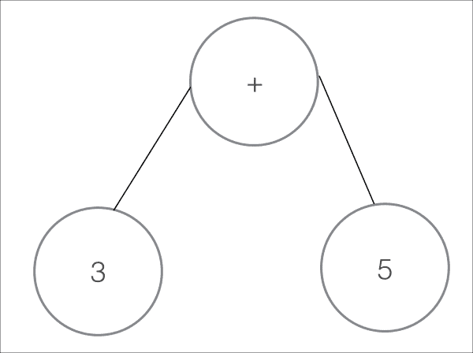
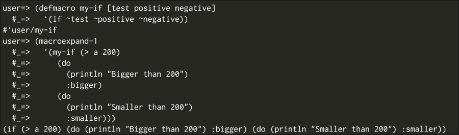
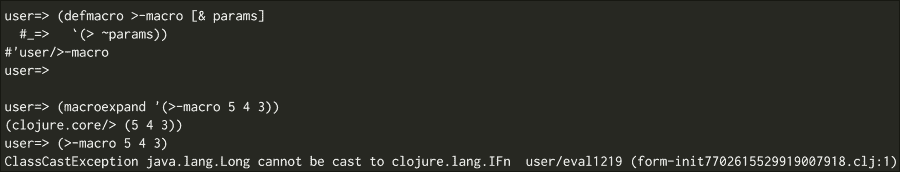
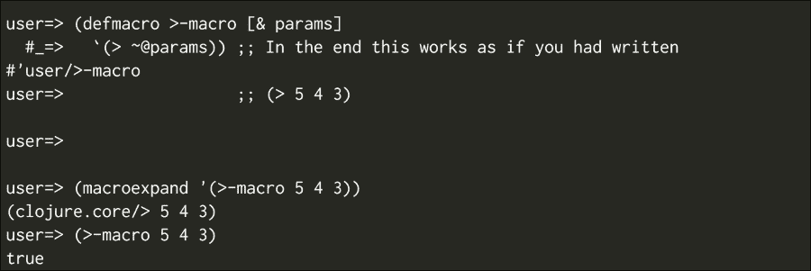
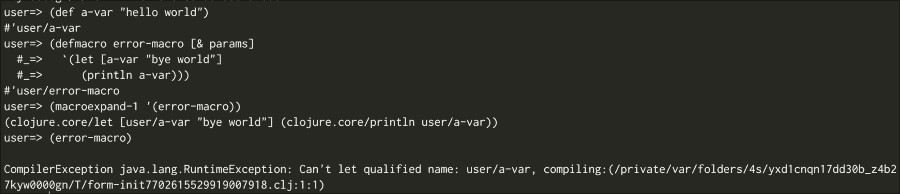
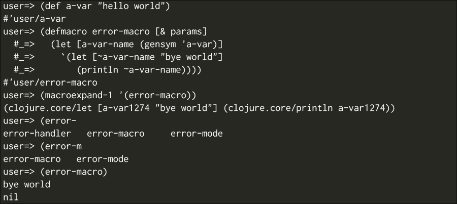

# 第七章。Clojure 中的宏

在本章中，我们将了解 Clojure 最复杂的设施之一：宏。我们将学习它们的作用、如何编写它们以及如何使用它们。这可能会有些挑战，但也有一些好消息。你应该意识到一些来自你对 Java 语言知识的工具，这些工具可以帮助你更好地理解宏。我们将通过与其他 JVM 语言的比较逐步进行，最终，我们将编写一些宏并理解我们已经使用它们一段时间了。

我们将学习以下主题：

+   理解 Lisp 的基础理念

+   宏作为代码修改工具

+   在 Groovy 中修改代码

+   编写你的第一个宏

+   调试你的第一个宏

+   宏在现实世界中的应用

# Lisp 的基础理念

Lisp 与你以前所知的东西非常不同。根据 Paul Graham 的说法，有九个想法使 Lisp 与众不同（这些想法自 1950 年代末以来一直存在），它们是：

1.  条件语句（记住，我们谈论的是 1950 年代至 1960 年代）

1.  函数作为一等公民

1.  递归

1.  动态类型

1.  垃圾回收

1.  程序作为表达式序列

1.  符号类型

1.  Lisp 的语法

1.  整个语言始终都在那里：在编译时，在运行时——始终如此！

### 注意

如果可能的话，阅读 Paul Graham 的论文《Geeks 的复仇》(*Revenge of the Nerds*) ([`www.paulgraham.com/icad.html`](http://www.paulgraham.com/icad.html))，其中他谈论了 Lisp，它有什么不同之处，以及为什么这种语言很重要。

这些想法甚至在 Lisp 时代之后仍然繁荣发展；其中大多数现在都很常见（你能想象一个没有条件语句的语言吗？）。但最后几个想法正是我们 Lisp 爱好者喜欢语法的原因（我们将在本章中完全理解它们的含义）。

常见语言现在正试图以略有不同的方式实现相同的目标，而你作为一个 Java 开发者，可能已经见过这种情况。

# 宏作为代码修改工具

宏的第一个和最常见的用途之一是能够修改代码；它们在代码级别上工作，正如你将看到的。我们为什么要这样做呢？让我们通过一些你更熟悉的东西来理解这个问题——Java。

## 在 Java 中修改代码

你曾经使用过 AspectJ 或 Spring AOP 吗？你曾经遇到过像 ASM 或 Javassist 这样的工具的问题吗？

你可能已经在 Java 中使用了代码修改。这在 Java EE 应用程序中很常见，只是不是显式的。（你有没有想过`@Transactional`注解在 Java EE 或 Spring 应用程序中做什么？）

作为开发者，我们试图自动化我们能做的一切，所以我们怎么能忽略我们自己的开发工具呢？

我们尝试创建在运行时修改字节码的方法，这样我们就不必记得打开和关闭资源，或者我们可以解耦依赖关系并获得依赖注入。

如果你使用 Spring，你可能知道以下用例：

+   `@Transactional`注解修改了被注解的方法，以确保你的代码被数据库事务包裹。

+   `@Autowired`注解查找所需的 bean 并将其注入到被注解的属性或方法中

+   `@Value`注解查找配置值并将其注入

你可能会想到其他几个修改类工作方式的注解。

这里重要的是你要理解我们为什么要修改代码，你可能已经知道一些修改代码的机制，包括 AspectJ 和 Spring AOP。

让我们看看在 Java 世界中是如何做到的；这是一个 Java 中方面（aspect）的样子：

```java
package macros.java;

public aspect SampleJavaAspect {
pointcutanyOperation() : execution(public * *.*(..));

    Object around() : anyOperation() {
System.out.println("We are about to execute this " + thisJoinPointStaticPart.getSignature());
       Object ret = proceed();
       return ret;
    }
}
```

面积（aspect）的优点是你可以修改任何你喜欢的代码，而不必触及它。这也存在一些缺点，因为你可以以原始作者没有预料到的方式修改代码，从而引发错误。

另一个缺点是你有一个极其有限的行动范围；你可以在某些代码周围包装你的修改或在之前或之后执行某些操作。

生成这种代码的库非常复杂，它们可以在运行时或编译时创建围绕你的对象的代理或修改字节码。

正如你所想象的那样，有许多你必须注意的事情，任何事都可能出错。因此，调试可能会变得复杂。

## 在 Groovy 中修改代码

Groovy 已经走得更远，它为我们提供了更多解决方案和更多宏（macro）功能。

自从 Groovy 1.8 以来，我们得到了很多 AST 转换。AST 代表什么？它代表**抽象语法树**——听起来很复杂，对吧？

在解释这一切之前，让我们看看它们中的一些功能。

### @ToString 注解

`@ToString`注解生成一个简单的`toString`方法，其中包含关于对象类及其属性值的信息。

### @TupleConstructor 注解

`@TupleConstructor`创建了一个构造函数，能够一次性接受你类中的所有值。以下是一个示例：

```java
@TupleConstructor
class SampleData {
int size
  String color
boolean big
}

new SampleData(5, "red", false") // We didn't write this constructor
```

### @Slf4j 注解

`@Slf4j`注解将一个名为 log 的 logger 实例添加到你的类中，因此你可以这样做：

```java
log.info'hello world'
```

这可以做到而不需要手动声明日志实例、类名等。你可以用这种类型的注解做很多事情，但它们是如何工作的呢？

现在，什么是 AST，它与 Clojure 宏有什么关系？想想看，它实际上与它们有很大关系。

要回答最后一个问题，你必须稍微了解一些编译器的工作原理。

我们都知道机器（你的机器、JVM、Erlang BEAM 机器）无法理解人类代码，因此我们需要一个过程将开发者编写的内容转换为机器能理解的内容。

过程中最重要的步骤之一是创建一个语法树，类似于以下图示：



这是一个以下表达式的非常简单的例子：

```java
3 + 5
```

这棵树就是我们所说的抽象语法树。让我们看看比这更复杂的代码片段的树，如下所示：

```java
if(a > 120) {
  a = a / 5
} else {
  a = 1200 
}
```

因此，树将看起来如下所示：


如您所见，这个图示仍然相当直观，您可能已经理解了如何从这样的结构中执行代码。

Groovy 的 AST 转换是一种干预这种生成代码的方法。

如您所想象，这是一个更强大的方法，但现在您正在干预编译器生成的代码；这种方法的可能缺点是代码的复杂性。

例如，让我们检查`@Slf4j` AST 的代码。它应该相当简单，对吧？它只是添加了一个日志属性：

```java
            private Expression transformMethodCallExpression(Expression exp) {
MethodCallExpressionmce = (MethodCallExpression) exp;
                if (!(mce.getObjectExpression() instanceofVariableExpression)) {
                    return exp;
                }
VariableExpressionvariableExpression = (VariableExpression) mce.getObjectExpression();
                if (!variableExpression.getName().equals(logFieldName)
                        || !(variableExpression.getAccessedVariable() instanceofDynamicVariable)) {
                    return exp;
                }
                String methodName = mce.getMethodAsString();
                if (methodName == null) return exp;
                if (usesSimpleMethodArgumentsOnly(mce)) return exp;

variableExpression.setAccessedVariable(logNode);

                if (!loggingStrategy.isLoggingMethod(methodName)) return exp;

                return loggingStrategy.wrapLoggingMethodCall(variableExpression, methodName, exp);
            }
```

### 注意

您可以在[`github.com/groovy/groovy-core/blob/master/src/main/org/codehaus/groovy/transform/LogASTTransformation.java`](https://github.com/groovy/groovy-core/blob/master/src/main/org/codehaus/groovy/transform/LogASTTransformation.java)查看完整的代码，它也包含在本章的代码包中。

这看起来一点也不简单。它只是一个片段，看起来仍然非常复杂。这里发生的事情是，您必须处理 Java 字节码格式和编译器复杂性。

这里，我们应该记住保罗·格雷厄姆关于 Lisp 语法的第 8 点。

让我们在 Clojure 中编写最后一个代码示例：

```java
(if (> a 120)
  (/ a 5)
  1200)
```

这段代码有点特别：它感觉非常类似于 AST！这不是巧合。实际上，在 Clojure 和 Lisp 中，您直接编写 AST。这是使 Lisp 成为非常简单语言的一个特性；您直接编写计算机能理解的内容。这可能会帮助您更好地理解为什么代码是数据，数据是代码。

假设您能够像修改程序中的任何其他数据结构一样修改 AST。但是您可以，这正是宏的作用！

# 编写您的第一个宏

现在您已经清楚地理解了宏的工作原理及其用途，让我们开始使用 Clojure。

让我给您出一个挑战：在 Clojure 中编写一个`unless`函数，它的工作方式如下：

```java
(def a 150)

(my-if (> a 200)
  (println"Bigger than 200")
  (println"Smaller than 200"))
```

让我们试一试；也许可以用以下语法：

```java
(defn my-if [cond positive negative]
  (if cond
    positive
    negative))
```

您知道如果您编写了这段代码然后运行它会发生什么吗？如果您测试它，您将得到以下结果：

```java
Bigger than 200
Smaller than 200
Nil
```

这里发生了什么？让我们稍作修改，以便我们得到一个值并理解正在发生的事情。让我们以不同的方式定义它，并让它返回一个值，以便我们看到一些不同：

```java
      (def a 500)
(my-if (> a 200)
  (do
    (println"Bigger than 200")
    :bigger)
  (do
    (println"Smaller than 200")
    :smaller))
```

我们将得到以下输出：

```java
Bigger than 200
Smaller than 200
:bigger
```

这里发生了什么？

当你向函数传递参数时，在函数的实际代码运行之前，所有内容都会被评估，所以在这里，在你函数的主体运行之前，你执行了两个`println`方法。之后，`if`运行正确，你得到了`:bigger`，但我们仍然得到了`if`的正负情况输出。看起来我们的代码没有工作！

我们如何解决这个问题？用我们当前的工具，我们可能需要编写闭包并将`my-if`代码更改为接受函数作为参数：

```java
(defn my-if [cond positive negative]
  (if cond
    (positive)
    (negative)))

      (def a 500)
(my-if (> a 200)
  #(do
    (println"Bigger than 200")
    :bigger)
  #(do
    (println"Smaller than 200")
    :smaller))
```

这有效，但有几个缺点：

+   现在代码有很多限制（两个子句现在都应该作为函数）

+   这并不适用于每个单独的情况

+   这非常复杂

为了解决这个问题，Clojure 给了我们宏。让我们看看它们是如何工作的：

```java
(defmacro my-if [test positive negative]
  (list 'if test positive negative))

(my-if (> a 200)
  (do
    (println"Bigger than 200")
    :bigger)
  (do
    (println"Smaller than 200")
    :smaller))
```

输出将是这样的：

```java
;; Bigger than 200
;; :bigger
```

这太棒了！它有效，但发生了什么？为什么我们使用了宏，为什么它有效？

### 注意

宏不是正常的 Clojure 函数；它们应该生成代码，并应该返回一个 Clojure 形式。这意味着它们应该返回一个我们可以用作正常 Clojure 代码的列表。

宏返回将在以后执行的代码。这就是保罗·格雷厄姆列表中的第九点发挥作用的地方：你始终拥有整个语言。

在 C++中，你有一个称为宏的机制；当你使用它时，与实际的 C++代码相比，你可以做的操作非常有限。

在 Clojure 中，你可以按任何你想要的方式操作 Clojure 代码，你在这里也可以使用完整的语言！由于 Clojure 代码是数据，操作代码就像操作任何其他数据结构一样简单。

### 注意

宏在编译时运行，这意味着在运行代码时，宏的痕迹已经消失；每个宏调用都被替换为生成的代码。

# 调试你的第一个宏

现在，正如你可以想象的那样，由于使用宏时事情可能会变得复杂，应该有一种方法可以调试它们。我们有两个函数来完成这个任务：

+   `macroexpand`

+   `macroexpand-1`

它们之间的区别与递归宏有关。没有规则告诉你你不能在宏中使用宏（整个语言始终都在那里，记得？）。如果你想完全遍历任何宏，你可以使用`macroexpand`；如果你想向前迈出一小步，你可以使用`macroexpand-1`。

它们都显示了宏调用生成的代码；这就是当你编译 Clojure 代码时发生的事情。

尝试这个：

```java
(macroexpand-1
'(my-if (> a 200)
    (do
      (println"Bigger than 200")
      :bigger)
    (do
      (println"Smaller than 200")
      :smaller)))

;; (if (> a 200) (do (println"Bigger than 200") :bigger) (do (println"Smaller than 200") :smaller))
```

宏没有比这更多的内容；你现在对它们有了很好的理解。

然而，你将遇到许多常见问题，以及解决这些问题的工具，你应该了解。让我们看看。

## 引用、语法引用和非引用

如你所见，`my-if`宏中使用了引用：

```java
(defmacro my-if [test positive negative]
  (list 'if test positive negative))
```

这是因为你需要`if`符号作为结果形式的第一个元素。

引号在宏中非常常见，因为我们需要构建代码而不是即时评估它。

在宏中非常常见的一种引号类型——语法引号——使得编写与最终生成的代码类似的代码变得更加容易。让我们将我们的宏实现改为如下：

```java
(defmacro my-if [test positive negative]
  '(if test positive negative))

(macroexpand-1
'(my-if (> a 200)
    (do
      (println"Bigger than 200")
      :bigger)
    (do
      (println"Smaller than 200")
      :smaller)))

;; (if clojure.core/test user/positive user/negative)
```

让我们看看这里会发生什么。首先，`(if test positive negative)`看起来比我们之前的`list`函数更美观，但使用`macroexpand-1`生成的代码看起来相当奇怪。发生了什么？

我们刚刚使用了一种不同的引号形式，允许我们引用完整的表达式。它做了一些有趣的事情。正如你所见，它将参数更改为完全限定的`var`名称（`clojure.core/test`，`user/positive`，`user/negative`）。这是你将来会感激的事情，但现在你不需要它。

你需要的是 test、positive 和 negative 的值。你如何在宏中获取它们？

使用语法引号，你可以使用 unquote 操作符来请求对某些内容进行内联评估，如下所示：

```java
(defmacro my-if [test positive negative]
(if ~test ~positive ~negative))
```

让我们再次尝试宏展开，看看我们会得到什么：



## Unquote splicing

在宏中还有一些其他情况变得很常见。让我们想象一下，我们想要重新实现`>`函数作为宏，并保留比较多个数字的能力；那会是什么样子？

可能的第一次尝试可能是这样的：

```java
(defmacro>-macro [&params]
  '(> ~params))

(macroexpand'(>-macro 5 4 3))
```

前面代码的输出如下：



你在这里看到问题了吗？

问题在于我们试图将一个值列表传递给`clojure.core/>`，而不是传递这些值本身。

这可以通过一种叫做**unquote splicing**的方法轻松解决。Unquote splicing 接受一个向量或参数列表，并像使用函数或宏上的`as`参数一样展开它。

它是这样工作的：

```java
(defmacro>-macro [&params]
  '(> ~@params)) ;; In the end this works as if you had written
                 ;; (> 5 4 3)

(macroexpand'(>-macro 5 4 3))
```

前面代码的输出如下：



你几乎每次在宏的参数数量可变时都会使用 unquote splicing。

## gensym

生成代码可能会有麻烦，我们最终会发现一些常见问题。

看看你是否能在以下代码中找到问题：

```java
(def a-var"hello world")

(defmacro error-macro [&params]
  '(let [a-var"bye world"]
     (println a-var)))

;; (macroexpand-1 '(error-macro))
;; (clojure.core/let [user/a-var user/"bye user/world"] (clojure.core/println user/a-var))
```

这是在生成代码时常见的问题。你覆盖了另一个值，Clojure 甚至不允许你运行这个，并显示如下截图：



但别担心；还有另一种确保你没有破坏你的环境的方法，那就是`gensym`函数：

```java
(defmacro error-macro [&params]
  (let [a-var-name (gensym'a-var)]
    `(let [~a-var-name "bye world"]
       (println ~a-var-name))))
```

`gensym`函数在宏每次运行时都会创建一个新的`var-name`，这保证了没有其他`var-name`会被它遮蔽。如果你现在尝试宏展开，你会得到如下结果：

```java
(clojure.core/let [a-var922"bye world"] (clojure.core/println a-var922))
```

以下截图是前面代码的结果：



# 实际世界的宏

你想知道宏被广泛使用的时候吗？想想`defn`；更重要的是，这样做：

```java
(macroexpand-1 '(defn sample [a] (println a)))

;; (def sample (clojure.core/fn ([a] (println a))))
```

你知道吗，`defn` 是 `clojure.core` 中的一个宏，它创建一个函数并将其绑定到当前命名空间中的 `var` 吗？

Clojure 中充满了宏；如果你想看看一些示例，你可以查看 Clojure 核心库，但宏还能做什么呢？

让我们来看看一些有趣的库：

+   `yesql`：`yesql` 库是代码生成的一个非常有趣的示例。它从 SQL 文件中读取 SQL 代码并相应地生成 Clojure 函数。在 GitHub 上的 `yesql` 项目中寻找 `defquery` 和 `defqueries` 宏；这可能会非常有启发性。

+   `core.async`：如果你熟悉 `go` 语言和 `goroutines`，你可能希望在 Clojure 语言中也有相同的功能。这并不是必要的，因为你完全可以自己提供它们！`core.async` 库就是 Clojure 中的 `goroutines`，它作为一个库提供（不需要进行神秘的语言更改）。这是一个宏强大功能的绝佳示例。

+   `core.typed`：使用宏，你甚至可以改变 Lisp 的动态特性。`core.typed` 库是一个允许你为 Clojure 代码定义类型约束的努力；在这里宏被广泛使用以生成样板代码和检查。这可能是更复杂的。

# 参考资料

如果你需要进一步参考，你可以查看以下列表。有整本书致力于宏这个主题。我特别推荐两本：

+   掌握 Clojure 宏 ([`pragprog.com/book/cjclojure/`](https://pragprog.com/book/cjclojure/))。

+   Let over Lambda ([`letoverlambda.com/`](http://letoverlambda.com/)). 它讨论了 Common Lisp，但知识非常宝贵。

# 摘要

你现在已经理解了宏的强大功能，并且对它们的工作方式有了非常强的掌握，但当我们谈到宏时，我们只是触及了冰山一角。

在本章中，我们学习了以下内容：

+   宏的工作原理基础

+   在 Groovy 中修改你的代码

+   宏与 Java 世界中其他工具的关系

+   编写自己的宏

我相信你到目前为止已经享受了与 Clojure 一起工作的过程，并且向前看，我建议你继续阅读和探索这个令人惊叹的语言。
