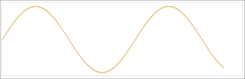
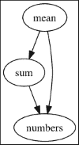
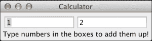

# 第一章：什么是响应式编程？

响应式编程是一个既复杂又广泛的话题。因此，这本书将专注于响应式编程的一个特定公式，称为**组合事件系统**（**CES**）。

在介绍响应式编程和 CES 的历史和背景之前，我想从一个实际且希望引人入胜的例子开始：一个在网页上绘制正弦波的动画示例。

正弦波是正弦函数的图形表示。它是一种平滑、重复的振荡，在动画结束时，它将看起来像以下截图：



这个示例将突出 CES：

+   强调我们应该思考*我们想要做什么*，而不是*如何做*

+   鼓励构建小的、具体的抽象，这些抽象可以组合在一起

+   生成简洁且易于维护的代码，易于更改

这个程序的核心归结为四行 ClojureScript 代码：

```java
(-> sine-wave
    (.take 600)
    (.subscribe (fn [{:keys [x y]}]
                  (fill-rect x y "orange"))))
```

仅通过查看这段代码，我们无法确切地知道它做什么。然而，请花时间阅读并想象它*可能*做什么。

首先，我们有一个名为`sine-wave`的变量，它代表我们将绘制到网页上的 2D 坐标。下一行给出了`sine-wave`是一种类似集合的抽象的直观感觉：我们使用`.take`从其中检索 600 个坐标。

最后，我们通过传递一个回调函数来`.subscribe`到这个“集合”。这个回调函数将为正弦波中的每个项目被调用，最终使用`fill-rect`函数在给定的*x*和*y*坐标处绘制。

目前来说，这需要我们吸收很多信息，因为我们还没有看到其他代码——但这就是这个小练习的目的：尽管我们对这个示例的具体细节一无所知，但我们仍然能够发展出对它可能如何工作的直觉。

让我们看看还需要什么来使这个片段在我们的屏幕上动画化正弦波。

# 响应式编程的初体验

这个示例是用 ClojureScript 构建的，并使用 HTML 5 Canvas 进行渲染，以及 RxJS（见[`github.com/Reactive-Extensions/RxJS`](https://github.com/Reactive-Extensions/RxJS)）——一个 JavaScript 中的响应式编程框架。

在我们开始之前，请记住我们不会深入探讨这些框架的细节——这些将在本书的后面部分进行。这意味着我会要求你们接受相当多的事情，所以如果你没有立即理解事物是如何工作的，请不要担心。这个示例的目的是让我们简单地开始了解响应式编程的世界。

对于这个项目，我们将使用 Chestnut（见[`github.com/plexus/chestnut`](https://github.com/plexus/chestnut)）——一个 ClojureScript 的 leiningen 模板，它提供了一个我们可以用作框架的示例工作应用程序。

要创建我们的新项目，请转到命令行并按照以下方式调用 leiningen：

```java
lein new chestnut sin-wave
cd sin-wave

```

接下来，我们需要修改生成项目中的几个地方。打开`sin-wave/resources/index.html`并将其更新如下：

```java
<!DOCTYPE html>
<html>
  <head>
    <link href="css/style.css" rel="stylesheet" type="text/css">
  </head>
  <body>
    <div id="app"></div>
    <script src="img/rx.all.js" type="text/javascript"></script>
    <script src="img/app.js" type="text/javascript"></script>
    <canvas id="myCanvas" width="650" height="200" style="border:1px solid #d3d3d3;">
  </body>
</html>
```

这只是确保我们导入了我们的应用程序代码和 RxJS。我们还没有下载 RxJS，所以让我们现在就做。浏览到[`github.com/Reactive-Extensions/RxJS/blob/master/dist/rx.all.js`](https://github.com/Reactive-Extensions/RxJS/blob/master/dist/rx.all.js)并将此文件保存到`sin-wave/resources/public`。前面的代码片段还添加了一个 HTML 5 Canvas 元素，我们将在此元素上绘制。

现在，打开`/src/cljs/sin_wave/core.cljs`。我们的应用程序代码将在这里。您可以忽略当前的内容。确保您有一个像以下这样的干净画布：

```java
(ns sin-wave.core)

(defn main [])
```

最后，回到命令行——在`sin-wave`文件夹下——启动以下应用程序：

```java
lein run -m sin-wave.server
2015-01-02 19:52:34.116:INFO:oejs.Server:jetty-7.6.13.v20130916
2015-01-02 19:52:34.158:INFO:oejs.AbstractConnector:Started SelectChannelConnector@0.0.0.0:10555
Starting figwheel.
Starting web server on port 10555 .
Compiling ClojureScript.
Figwheel: Starting server at http://localhost:3449
Figwheel: Serving files from '(dev-resources|resources)/public'

```

一旦之前的命令完成，应用程序将在`http://localhost:10555`上可用，在那里您将找到一个空白的长方形画布。我们现在可以开始了。

我们使用 Chestnut 模板的主要原因是为了这个示例，它通过 websockets 执行我们的应用程序代码的热重载。这意味着我们可以将浏览器和编辑器并排放置，并且在我们更新代码时，我们将在浏览器中立即看到结果，而无需重新加载页面。

为了验证这是否正常工作，请打开您的网页浏览器的控制台，以便您可以看到页面中脚本的输出。然后按照以下方式将以下内容添加到`/src/cljs/sin_wave/core.cljs`中：

```java
(.log js/console "hello clojurescript")
```

您应该已经看到了打印到浏览器控制台的`hello clojurescript`消息。请确保您的工作环境正常，因为我们将会依赖这个工作流程来交互式地构建我们的应用程序。

同样，确保每次 Chestnut 重新加载我们的文件时清除画布也是个好主意。通过将以下代码片段添加到我们的核心命名空间中，这很简单：

```java
(def canvas (.getElementById js/document "myCanvas"))
(def ctx    (.getContext canvas "2d"))

;; Clear canvas before doing anything else
(.clearRect ctx 0 0 (.-width canvas) (.-height canvas))
```

## 创建时间

现在我们有了正常的工作环境，我们可以继续我们的动画。指定我们希望多久创建一个新动画帧可能是个好主意。

这实际上意味着将*时间*的概念添加到我们的应用程序中。您可以自由地尝试不同的值，但让我们从每 10 毫秒创建一个新帧开始：

```java
(def interval   js/Rx.Observable.interval)
(def time       (interval 10))
```

由于 RxJS 是一个 JavaScript 库，我们需要使用 ClojureScript 的互操作性来调用其函数。为了方便，我们将 RxJS 的`interval`函数绑定到一个局部变量。在本书中，当适用时，我们将使用这种方法。

接下来，我们创建一个无限数字流——从 0 开始，每 10 毫秒有一个新元素。让我们确保这是按预期工作的：

```java
(-> time
    (.take 5)
    (.subscribe (fn [n]
                  (.log js/console n))))

;; 0
;; 1
;; 2
;; 3
;; 4
```

### 小贴士

我在这里非常宽松地使用*流*这个术语。稍后在本书中将更精确地定义它。

记住时间是无限的，所以我们使用`.take`来避免无限期地向控制台打印数字。

我们下一步是计算代表正弦波一段的 2D 坐标，我们可以用以下函数来完成：

```java
(defn deg-to-rad [n]
  (* (/ Math/PI 180) n))

(defn sine-coord [x]
  (let [sin (Math/sin (deg-to-rad x))
        y   (- 100 (* sin 90))]
    {:x   x
     :y   y
     :sin sin}))
```

`sine-coord` 函数接受我们 2D 画布上的一个 `x` 点，并根据 `x` 的正弦值计算 `y` 点。常数 `100` 和 `90` 简单地控制斜率的高度和尖锐程度。例如，尝试计算当 `x` 为 50 时的正弦坐标：

```java
(.log js/console (str (sine-coord 50)))
;;{:x 50, :y 31.05600011929198, :sin 0.766044443118978}
```

我们将使用 `time` 作为 `x` 值的来源。现在创建正弦波只是将 `time` 和 `sine-coord` 结合起来：

```java
(def sine-wave
  (.map time sine-coord))
```

就像 `time` 一样，`sine-wave` 是一个无限流。不同的是，我们现在将拥有正弦波的 `x` 和 `y` 坐标，如下所示：

```java
(-> sine-wave
    (.take 5)
    (.subscribe (fn [xysin]
                  (.log js/console (str xysin)))))

 ;; {:x 0, :y 100, :sin 0} 
 ;; {:x 1, :y 98.42928342064448, :sin 0.01745240643728351} 
 ;; {:x 2, :y 96.85904529677491, :sin 0.03489949670250097} 
 ;; {:x 3, :y 95.28976393813505, :sin 0.052335956242943835} 
 ;; {:x 4, :y 93.72191736302872, :sin 0.0697564737441253} 
```

这就带我们回到了最初引起我们兴趣的代码片段，以及一个执行实际绘制的函数：

```java
(defn fill-rect [x y colour]
  (set! (.-fillStyle ctx) colour)
  (.fillRect ctx x y 2 2))

(-> sine-wave
    (.take 600)
    (.subscribe (fn [{:keys [x y]}]
                  (fill-rect x y "orange"))))
```

到目前为止，我们可以再次保存文件，并观察我们刚刚创建的正弦波优雅地出现在屏幕上。

## 更多颜色

这个例子旨在说明，以非常简单的抽象方式思考，然后在它们之上构建更复杂的抽象，可以使代码更容易维护和修改。

因此，我们现在将更新我们的动画，以不同颜色绘制正弦波。在这种情况下，我们希望当 `x` 的正弦值为负时绘制红色，否则为蓝色。

我们已经有了通过 `sine-wave` 流传递的正弦值，所以我们只需要将这个流转换成一个会根据先前标准给出颜色的流：

```java
(def colour (.map sine-wave
                  (fn [{:keys [sin]}]
                    (if (< sin 0)
                      "red"
                      "blue"))))
```

下一步是将新的流添加到主绘制循环中——记得注释掉之前的代码，以免同时绘制多个波：

```java
(-> (.zip sine-wave colour #(vector % %2))
    (.take 600)
    (.subscribe (fn [[{:keys [x y]} colour]]
                  (fill-rect x y colour))))
```

保存文件后，我们应该看到一个新正弦波在红色和蓝色之间交替，因为 `x` 的正弦值在 -1 到 1 之间振荡。

## 使其变得反应式

虽然到目前为止这很有趣，但我们创建的动画实际上并不是反应式的。当然，它确实对时间本身做出了反应，但这正是动画的本质。正如我们稍后将会看到的，响应式编程之所以被称为响应式编程，是因为程序对外部输入（如鼠标或网络事件）做出反应。

因此，我们将更新动画，让用户控制颜色切换的时间：波将开始为红色，当用户在画布区域内点击时切换到蓝色。进一步的点击将简单地交替在红色和蓝色之间。

我们首先创建无限流——根据 `time` 的定义——为我们的颜色原语，如下所示：

```java
(def red  (.map time (fn [_] "red")))
(def blue (.map time (fn [_] "blue")))
```

单独来看，`red` 和 `blue` 并不有趣，因为它们的值没有变化。我们可以把它们看作是 *常数* 流。当与另一个无限流结合，该流根据用户输入在它们之间循环时，它们就变得更有趣了：

```java
(def concat     js/Rx.Observable.concat)
(def defer      js/Rx.Observable.defer)
(def from-event js/Rx.Observable.fromEvent)

(def mouse-click (from-event canvas "click"))

(def cycle-colour
  (concat (.takeUntil red mouse-click)
          (defer #(concat (.takeUntil blue mouse-click)
                          cycle-colour))))
```

这是我们迄今为止最复杂的更新。如果你仔细观察，你也会注意到`cycle-colour`是一个递归流；也就是说，它是根据自身定义的。

当我们第一次看到这种代码时，我们尝试理解它所做的事情时，我们做出了一个大胆的假设。然而，在快速阅读之后，我们意识到`cycle-colour`紧密遵循我们可能如何*讨论*问题的方法：我们将使用红色，直到鼠标点击发生，然后我们将使用蓝色，直到另一个鼠标点击发生。然后，我们开始递归。

我们对动画循环的更改很小：

```java
(-> (.zip sine-wave cycle-colour #(vector % %2))
    (.take 600)
    (.subscribe (fn [[{:keys [x y]} colour]]
                  (fill-rect x y colour))))
```

这本书的目的是帮助你培养出以这种方式建模问题的本能。在每一章之后，越来越多的示例将变得有意义。此外，我们将在 ClojureScript 和 Clojure 中使用多个框架，为你提供广泛的选择工具。

在我们继续之前，我们必须稍微绕个弯，理解我们是如何到达这里的。

## 练习 1.1

修改之前的示例，以便使用所有彩虹颜色绘制正弦波。绘图循环应如下所示：

```java
(-> (.zip sine-wave rainbow-colours #(vector % %2))
    (.take 600)
    (.subscribe (fn [[{:keys [x y]} colour]]
                  (fill-rect x y colour))))
```

你的任务是实现`rainbow-colours`流。由于到目前为止的解释非常少，你可能选择在覆盖更多关于 CES 的内容之后再回来做这个练习。

`repeat`、`scan`和`flatMap`函数可能有助于解决这个练习。请务必查阅 RxJs 的 API：[`github.com/Reactive-Extensions/RxJS/blob/master/doc/libraries/rx.complete.md`](https://github.com/Reactive-Extensions/RxJS/blob/master/doc/libraries/rx.complete.md)。

# 一点历史

在我们谈论响应式编程之前，了解其他相关编程范式如何影响我们开发软件的方式非常重要。这也有助于我们理解响应式编程背后的动机。

除了少数例外，我们大多数人要么自学，要么在学校/大学里被教授了诸如 C 和 Pascal 之类的命令式编程语言，或者诸如 Java 和 C++之类的面向对象语言。

在这两种情况下，命令式编程范式——其中面向对象语言是其中一部分——规定我们编写程序作为一系列修改程序状态的语句。

为了理解这意味着什么，让我们看看一个用伪代码编写的简短程序，该程序计算数字列表的总和和平均值：

```java
numbers := [1, 2, 3, 4, 5, 6]
sum := 0
for each number in numbers
  sum := sum + number
end
mean := sum / count(numbers)
```

### 小贴士

平均值是列表中数字的平均值，通过将总和除以元素数量得到。

首先，我们创建一个新的整数数组，称为`numbers`，包含从 1 到 6 的数字，包括 6。然后，我们将`sum`初始化为零。接下来，我们逐个遍历整数数组，将每个数字的值加到`sum`上。

最后，我们计算并将列表中数字的平均值赋给局部变量`mean`。这完成了程序逻辑。

如果执行此程序，它将打印总和为 21，平均值为 3。

尽管这是一个简单的例子，但它突出了其命令式风格：我们设置一个应用程序状态——`sum`——然后明确告诉计算机如何修改该状态以计算结果。

## 数据流编程

之前的例子有一个有趣的特性：`mean` 的值明显依赖于 `sum` 的内容。

数据流编程使这种关系明确。它将应用程序建模为一个依赖图，数据通过该图从操作到操作流动——并且当值发生变化时，这些变化会传播到其依赖项。

从历史上看，数据流编程由 Lucid 和 BLODI 等定制构建的语言支持，因此，其他通用编程语言被排除在外。

让我们看看这种新的见解将如何影响我们之前的例子。我们知道一旦执行了最后一行，`mean` 的值就会被赋值，并且除非我们显式地重新赋值变量，否则它不会改变。

然而，让我们想象一下，我们之前使用的伪语言确实支持数据流编程。在这种情况下，将 `mean` 赋值给一个同时引用 `sum` 和 `count` 的表达式，例如 `sum / count(numbers)`，就足以在以下图中创建有向依赖图：



注意，这种关系的直接副作用是创建了一个从 `sum` 到 `numbers` 的隐式依赖。这意味着如果 `numbers` 发生变化，变化会通过图传播，首先更新 `sum`，然后最终更新 `mean`。

这就是响应式编程发挥作用的地方。这种范式建立在数据流编程和变化传播的基础上，将这种编程风格带到那些没有原生支持的编程语言中。

对于命令式编程语言，响应式编程可以通过库或语言扩展来提供。本书不涉及这种方法，但如果读者想了解更多关于这个主题的信息，请参考 *dc-lib*（见 [`code.google.com/p/dc-lib/`](https://code.google.com/p/dc-lib/)）的示例。这是一个通过数据流约束为 C++ 添加响应式编程支持的框架。

## 面向对象响应式编程

当设计桌面 **图形用户界面（GUIs**）等交互式应用程序时，我们本质上是在使用面向对象的方法来进行响应式编程。我们将构建一个简单的计算器应用程序来展示这种风格。

### 小贴士

Clojure 不是一个面向对象的语言，但我们将与 Java API 的部分进行交互，以构建在面向对象范式下开发的用户界面，因此本节的标题是“面向对象响应式编程”。

让我们从命令行创建一个新的 leiningen 项目开始：

```java
lein new calculator

```

这将在当前文件夹中创建一个名为 `calculator` 的目录。接下来，使用您最喜欢的文本编辑器打开 `project.clj` 文件，并添加对 Seesaw 的依赖，Seesaw 是一个用于处理 Java Swing 的 Clojure 库：

```java
(defproject calculator "0.1.0-SNAPSHOT"
  :description "FIXME: write description"
  :url "http://example.com/FIXME"
  :license {:name "Eclipse Public License"
            :url "http://www.eclipse.org/legal/epl-v10.html"}
  :dependencies [[org.clojure/clojure "1.5.1"]
 [seesaw "1.4.4"]]) 
```

在撰写本文时，可用的最新 Seesaw 版本是 1.4.4。

接下来，在`src/calculator/core.clj`文件中，我们将首先导入 Seesaw 库并创建我们将要使用的视觉组件：

```java
(ns calculator.core
  (:require [seesaw.core :refer :all]))

(native!)

(def main-frame (frame :title "Calculator" :on-close :exit))

(def field-x (text "1"))
(def field-y (text "2"))

(def result-label (label "Type numbers in the boxes to add them up!"))
```

```java
Calculator that ends the program when closed. We also create two text input fields, field-x and field-y, as well as a label that will be used to display the results, aptly named result-label.
```

我们希望标签能够自动更新，一旦用户在任一输入字段中输入一个新的数字。以下代码正是这样做的：

```java
(defn update-sum [e]
  (try
    (text! result-label
         (str "Sum is " (+ (Integer/parseInt (text field-x))
                           (Integer/parseInt (text field-y)))))
    (catch Exception e
      (println "Error parsing input."))))

(listen field-x :key-released update-sum)
(listen field-y :key-released update-sum)
```

第一个函数`update-sum`是我们的事件处理程序。它将`result-label`的文本设置为`field-x`和`field-y`中值的总和。我们在这里使用 try/catch 作为一个非常基本的错误处理方式，因为按下的键可能不是一个数字。然后我们将事件处理程序添加到两个输入字段的`:key-released`事件中。

### 小贴士

在实际应用程序中，我们永远不希望有一个像之前的那样的 catch 块。这被认为是不良风格，catch 块应该执行一些更有用的操作，例如记录异常、触发通知或在可能的情况下恢复应用程序。

我们几乎完成了。我们现在需要做的只是将我们迄今为止创建的组件添加到`main-frame`中，并最终按以下方式显示它：

```java
(config! main-frame :content
         (border-panel
          :north (horizontal-panel :items [field-x field-y])
          :center result-label
          :border 5))

(defn -main [& args]
  (-> main-frame pack! show!))
```

现在我们可以保存文件，并在项目的根目录下通过命令行运行程序：

```java
lein run -m calculator.core

```

你应该会看到以下截图：



通过在任一或两个文本输入字段中输入一些数字进行实验，并观察标签的值如何自动更改，显示两个数字的和。

恭喜！你刚刚创建了你第一个响应式应用程序！

如前所述，这个应用程序是响应式的，因为结果标签的值会根据用户输入而*响应*并自动更新。然而，这并不是全部的故事——它缺乏可组合性，需要我们指定我们试图实现的*如何*，而不是*什么*。

尽管这种编程风格可能很熟悉，但以这种方式使应用程序响应式并不总是理想的。

根据之前的讨论，我们注意到我们仍然需要相当明确地设置各个组件之间的关系，正如需要编写一个自定义处理程序并将其绑定到两个输入字段所证明的那样。

正如我们将在本书的其余部分看到的那样，处理类似场景有更好的方法。

## 最广泛使用的响应式程序

上一节中的两个示例对一些读者来说可能很熟悉。如果我们把输入文本字段称为“单元格”，把结果标签的处理程序称为“公式”，我们现在就有了现代电子表格应用程序（如 Microsoft Excel）中使用的术语。

术语响应式编程仅在近年来开始使用，但响应式应用程序的概念并不新鲜。第一个电子表格可以追溯到 1969 年，当时哈佛大学的毕业生 Rene Pardo 和 Remy Landau 创建了**LANPAR**（**用于随机编程数组的语言**）[1]。

它是为了解决 Bell Canada 和 AT&T 在当时遇到的问题而发明的：他们的预算表有 2000 个单元格，当修改时，迫使软件重写，耗时从六个月到两年不等。

迄今为止，电子表格仍然是各个领域专业人士的强大且有用的工具。

## 观察者设计模式

留意细节的读者可能会注意到与观察者设计模式的相似之处。它主要在面向对象的应用程序中使用，作为对象之间通信的方式，而无需知道谁依赖于其变化。

在 Clojure 中，可以使用 *watches* 实现观察者模式的简单版本：

```java
(def numbers (atom []))

(defn adder [key ref old-state new-state]
  (print "Current sum is " (reduce + new-state)))

(add-watch numbers :adder adder)
```

我们首先创建我们的程序状态，在这种情况下是一个包含空向量的原子。接下来，我们创建一个知道如何求和 `numbers` 中所有数字的监视函数。最后，我们将监视函数添加到 `numbers` 原子下的 `:adder` 键（用于移除监视）。

`adder` 键符合 `add-watch` 所需的 API 合同，并接收四个参数。在这个例子中，我们只关心 `new-state`。

现在，每当更新 `numbers` 的值时，其监视都会被执行，如下所示：

```java
(swap! numbers conj 1)
;; Current sum is  1

(swap! numbers conj 2)
;; Current sum is  3

(swap! numbers conj 7)
;; Current sum is  10

```

上面的高亮行表示每次我们更新原子时打印在屏幕上的结果。

虽然有用，但观察者模式仍然需要在设置依赖关系和所需的程序状态上做一些工作，而且难以组合。

话虽如此，这个模式已经被扩展，并成为我们将在本书后面部分探讨的其中一个反应式编程框架的核心，即微软的 **Reactive Extensions**（**Rx**）。

## 函数式反应式编程

就像反应式编程一样，**函数式反应式编程**（简称 **FRP**）不幸地成为了一个多义词。

例如，RxJava（见 [`github.com/ReactiveX/RxJava`](https://github.com/ReactiveX/RxJava)）、ReactiveCocoa（见 [`github.com/ReactiveCocoa/ReactiveCocoa`](https://github.com/ReactiveCocoa/ReactiveCocoa)）和 Bacon.js（见 [`baconjs.github.io/`](https://baconjs.github.io/)）等框架在近年来变得极为流行，并错误地将自己定位为 FRP 库。这导致了围绕术语的混淆。

正如我们将看到的，这些框架并没有实现 FRP，而是受到了它的启发。

为了使用正确的术语以及理解“受 FRP 启发”的含义，我们将简要地看看 FRP 的不同表述。

## 高阶 FRP

高阶 FRP 指的是 Conal Elliott 和 Paul Hudak 在他们 1997 年的论文 *Functional Reactive Animation* [2] 中开发的 FRP 的原始研究。这篇论文介绍了 *Fran*，这是一个嵌入 Haskell 中的特定领域语言，用于创建反应式动画。它后来被作为库以及专门构建的反应式语言实现。

如果你回忆一下我们之前几页创建的计算器示例，我们可以看到这种响应式编程风格要求我们通过直接从输入字段读取和写入来显式地管理状态。作为 Clojure 开发者，我们知道在构建软件时避免状态和可变数据是一个值得记住的好原则。这个原则是函数式编程的核心：

```java
(->> [1 2 3 4 5 6]
     (map inc)
     (filter even?)
     (reduce +))
;; 12
```

这个简短的程序通过`reduce`将原始列表中的所有元素加一，过滤掉所有偶数，并将它们相加。

注意我们不需要在计算的每一步显式地管理局部状态。

与命令式编程不同，我们关注我们想要做什么，例如迭代，而不是我们想要如何做，例如使用`for`循环。这就是为什么实现与我们的程序描述非常接近。这被称为声明式编程。

FRP 将相同的哲学带到了响应式编程中。正如关于该主题的 Haskell 编程语言维基百科明智地指出：

*FRP 是关于处理随时间变化的价值，就像它们是常规价值一样。*

换句话说，FRP 是一种声明式的方法，用于建模随时间输入做出响应的系统。

这两个语句都触及了时间这一概念。我们将在下一节中探讨这一点，届时我们将介绍 FRP 提供的关键抽象：信号（或行为）和事件。

# 信号和事件

到目前为止，我们一直在处理程序对用户输入做出反应的想法。这当然只是响应式系统的一小部分，但对于这次讨论来说已经足够了。

用户输入在程序执行过程中多次发生：按键、鼠标拖动和点击只是用户可能与我们系统交互的几个例子。所有这些交互都在一段时间内发生。FRP 认识到时间是响应式程序的一个重要方面，并通过其抽象将其作为一等公民。

信号（也称为行为）和事件都与时间相关。信号表示连续、随时间变化的价值。另一方面，事件代表在特定时间点的离散发生。

例如，时间本身就是一个信号。它连续且无限地变化。另一方面，用户的按键是一个事件，一个离散的发生。

然而，需要注意的是，信号如何变化的语义不必是连续的。想象一下代表你的鼠标指针当前（x,y）坐标的信号。

这个信号被称为离散变化，因为它依赖于用户移动鼠标指针——一个事件，这不是一个连续的动作。

# 实现挑战

经典 FRP 最定义性的特征可能是对连续时间的使用。

这意味着 FRP 假设信号始终在变化，即使它们的值仍然是相同的，这会导致不必要的重新计算。例如，鼠标位置信号将触发应用程序依赖图的更新——就像我们之前看到的平均程序依赖图——即使鼠标是静止的。

另一个问题在于，经典 FRP 默认是同步的：事件按顺序逐个处理。起初可能无害，但这可能导致延迟，如果某个事件处理时间显著较长，则会使应用程序无响应。

Paul Hudak 和其他人进一步研究了高阶 FRP[7][8]，以解决这些问题，但这是以牺牲可表达性为代价的。

FRP 的其他公式旨在克服这些实现挑战。

在本章的其余部分，我将交替使用信号和行为。

## 一阶 FRP

在这个类别中，最著名的响应式语言是 Elm（见[`elm-lang.org/`](http://elm-lang.org/)），这是一种编译为 JavaScript 的 FRP 语言。它由 Evan Czaplicki 创建，并在他的论文《Elm：用于功能 GUI 的并发 FRP》[3]中提出。

Elm 对高阶 FRP 进行了一些重大改进。

它放弃了连续时间这一概念，完全采用事件驱动。因此，它解决了之前提到的无谓重新计算问题。一阶 FRP 将行为和事件结合到信号中，与高阶 FRP 不同，这些信号是离散的。

此外，一阶 FRP 允许程序员指定何时同步处理事件不是必要的，从而防止不必要的处理延迟。

最后，Elm 是一种严格的编程语言——这意味着函数的参数会被积极评估——这是一个有意识的决策，因为它可以防止在像 Haskell 这样的惰性语言中可能出现的空间和时间泄漏。

### 小贴士

在像 Fran 这样的 FRP 库中，由于在惰性语言中计算被推迟到绝对最后时刻，内存使用可能会变得难以控制，因此导致空间泄漏。这些较大的计算，由于惰性而随着时间的推移积累，最终执行时可能会造成意外的延迟，导致时间泄漏。

## 异步数据流

异步数据流通常指的是如**Reactive Extensions**（**Rx**）、**ReactiveCocoa**和**Bacon.js**等框架。之所以称为异步数据流，是因为它完全消除了同步更新。

这些框架引入了**可观察序列**的概念[4]，有时也称为事件流。

这种 FRP 公式的优点是不局限于函数式语言。因此，即使是像 Java 这样的命令式语言也可以利用这种编程风格。

有人说，这些框架导致了 FRP 术语的混淆。Conal Elliott 在某个时候提出了 CES 这个术语（见[`twitter.com/conal/status/468875014461468677`](https://twitter.com/conal/status/468875014461468677))）。

我已经采用了这个术语（见[`vimeo.com/100688924`](http://vimeo.com/100688924)），因为我相信它突出了两个重要因素：

+   CES 和 FRP 之间的基本区别：CES 完全是事件驱动的

+   CES 通过组合子高度可组合，并从 FRP 中汲取灵感

CES 是本书的主要内容。

## 箭头化 FRP

这是我们将要查看的最后一个公式。箭头化的 FRP [5] 在高于阶 FRP 上引入了两个主要区别：它使用信号函数而不是信号，并且建立在 John Hughes 的 Arrow 组合子 [6] 之上。

这主要是一种不同的代码结构方式，可以作为库实现。例如，Elm 通过其 Automaton（见[`github.com/evancz/automaton`](https://github.com/evancz/automaton)）库支持箭头化的 FRP。

### 提示

本章的第一个草稿将 FRP 的不同公式归类为广泛的*连续和离散*FRP 类别。多亏了 Evan Czaplicki 出色的演讲*控制时间和空间：理解 FRP 的多种公式*（见[`www.youtube.com/watch?v=Agu6jipKfYw`](https://www.youtube.com/watch?v=Agu6jipKfYw)），我能够借用这里使用的更具体的类别。这些在讨论 FRP 的不同方法时非常有用。

# FRP 的应用

不同的 FRP 公式今天被专业人士和大型组织在几个问题空间中使用。在这本书中，我们将查看几个 CES 如何应用的例子。其中一些是相互关联的，因为大多数现代程序都有几个横切关注点，但我们将突出两个主要领域。

## 异步编程和网络

GUI 是异步编程的一个很好的例子。一旦你打开一个网页或桌面应用程序，它就简单地坐在那里，空闲，等待用户输入。

这种状态通常被称为事件或主事件循环。它只是简单地等待外部刺激，例如按键、鼠标按钮点击、来自网络的新数据，甚至一个简单的计时器。

每个这些刺激都与一个事件处理器相关联，当这些事件发生时，会调用该事件处理器，因此 GUI 系统的异步特性。

这是我们多年来习惯的编程风格，但随着商业和用户需求的增长，这些应用程序的复杂性也在增加，因此需要更好的抽象来处理应用程序所有组件之间的依赖关系。

另一个处理网络流量周围复杂性的优秀例子是 Netflix，它使用 CES 为后端服务提供反应式 API。

## 复杂的 GUI 和动画

游戏可能是复杂用户界面的最佳例子，因为它们在用户输入和动画方面有复杂的要求。

我们之前提到的 Elm 语言是构建复杂 GUI（图形用户界面）中最激动人心的努力之一。另一个例子是 Flapjax，它也针对 Web 应用程序，但提供的是一个可以与现有 JavaScript 代码库集成的 JavaScript 库。

# 摘要

响应式编程的核心在于构建响应式应用程序。我们可以通过多种方式使我们的应用程序变得响应式。其中一些是旧有的理念：数据流编程、电子表格和观察者模式都是例子。但 CES 在近年来尤其受到欢迎。

CES 旨在将函数式编程核心中的声明式问题建模方式引入响应式编程。我们应该关注“什么”，而不是“如何”。

在接下来的章节中，我们将学习如何将 CES 应用到我们自己的程序中。
