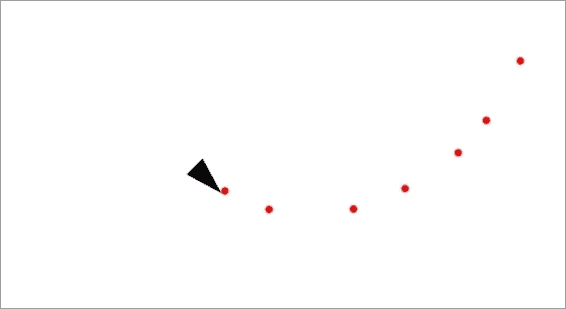
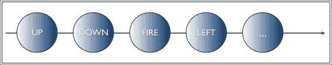
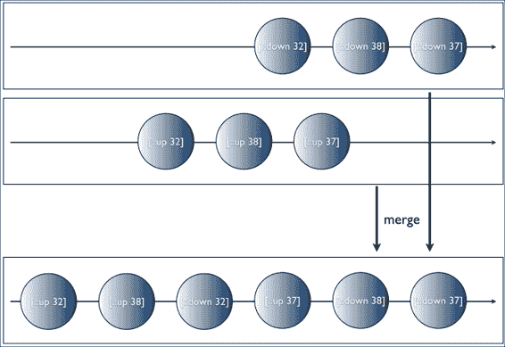
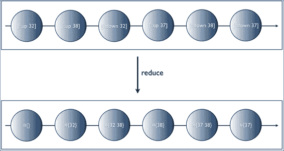

# 第六章：使用 Reagi 构建简单的 ClojureScript 游戏

在上一章中，我们通过构建自己的框架，将其命名为 *respondent*，学习了**组合事件系统**（**CES**）的工作原理。这使我们深刻理解了此类软件中涉及的主要抽象，并对 `core.async`、Clojure 的异步编程库以及我们框架的基础有了良好的概述。

Respondent 只是一个玩具框架。我们没有过多关注诸如内存效率和异常处理等横切关注点。这没关系，因为我们使用它作为学习如何使用 `core.async` 处理和组合事件系统的工具。此外，其设计有意与 Reagi 的设计相似。

在本章中，我们将：

+   了解 Reagi，这是一个建立在 `core.async` 之上的 CES 框架

+   使用 Reagi 构建 ClojureScript 游戏的基础，这将教会我们如何以干净和可维护的方式处理用户输入

+   简要比较 Reagi 与其他 CES 框架，并了解何时使用每个框架

# 设置项目

你玩过 Asteroids 吗？如果你没有，Asteroids 是一款 1979 年由 Atari 首次发布的街机太空射击游戏。在 Asteroids 中，你是飞船的飞行员，在太空中飞行。在这个过程中，你会被围绕的陨石和外星飞碟所包围，你必须射击并摧毁它们。

在一章中开发整个游戏过于雄心勃勃，会分散我们对本书主题的注意力。我们将限制自己确保屏幕上有一个我们可以飞行的飞船，并且可以向虚空射击太空子弹。到本章结束时，我们将拥有以下截图所示的内容：



要开始，我们将使用与上一章相同的 leiningen 模板 `cljs-start`（见[`github.com/magomimmo/cljs-start`](https://github.com/magomimmo/cljs-start)）创建一个 `newClojureScript` 项目：

```java
lein new cljs-start reagi-game

```

接下来，将以下依赖项添加到你的项目文件中：

```java
   [org.clojure/clojurescript "0.0-2138"]
   [reagi "0.10.0"]
   [rm-hull/monet "0.1.12"]
```

最后一个依赖项是 monet（见[`github.com/rm-hull/monet`](https://github.com/rm-hull/monet)），这是一个 ClojureScript 库，你可以用它来处理 HTML 5 Canvas。它是 Canvas API 的高级包装器，使得与之交互变得更加简单。

在我们继续之前，确保我们的设置正常工作可能是个好主意。切换到项目目录，启动 Clojure REPL，然后启动嵌入式 Web 服务器：

```java
cd reagi-game/
lein repl
Compiling ClojureScript.
Compiling "dev-resources/public/js/reagi_game.js" from ("src/cljs" "test/cljs" "dev-resources/tools/repl")...
user=> (run)
2014-06-14 19:21:40.381:INFO:oejs.Server:jetty-7.6.8.v20121106
2014-06-14 19:21:40.403:INFO:oejs.AbstractConnector:Started SelectChannelConnector@0.0.0.0:3000
#<Server org.eclipse.jetty.server.Server@51f6292b>

```

这将编译 ClojureScript 源文件到 JavaScript 并启动示例 Web 服务器。在你的浏览器中，导航到 `http://localhost:3000/`。如果你看到以下内容，我们就准备好了：


由于我们将使用 HTML 5 Canvas，我们需要一个实际的画布来渲染。让我们更新我们的 HTML 文档以包含它。它位于 `dev-resources/public/index.html` 下：

```java
<!doctype html>
<html lang="en">
  <head>
    <meta charset="utf-8">
    <title>bREPL Connection</title>
    <!--[if lt IE 9]>
        <script src="img/html5.js"></script>
        <![endif]-->
  </head>

  <body>
 <canvas id="canvas" width="800" height="600"></canvas>
    <script src="img/reagi_game.js"></script>
  </body>
</html>
```

我们在我们的文档中添加了一个`canvas`DOM 元素。所有渲染都将在这个上下文中发生。

## 游戏实体

我们的游戏将只有两个实体：一个代表飞船，另一个代表子弹。为了更好地组织代码，我们将所有与实体相关的代码放在自己的文件中，即`src/cljs/reagi_game/entities.cljs`。此文件还将包含一些渲染逻辑，因此我们需要引入`monet`：

```java
(ns reagi-game.entities
  (:require [monet.canvas :as canvas]
            [monet.geometry :as geom]))
```

接下来，我们将添加一些辅助函数以避免过多重复：

```java
(defn shape-x [shape]
  (-> shape :pos deref :x))

(defn shape-y [shape]
  (-> shape :pos deref :y))

(defn shape-angle [shape]
  @(:angle shape))

(defn shape-data [x y angle]
  {:pos   (atom {:x x :y y})
   :angle (atom angle)})
```

前三个函数只是从我们的形状数据结构中获取数据的一种更简短的方式。`shape-data`函数创建一个结构。请注意，我们正在使用 Clojure 的引用类型之一`atoms`来表示形状的位置和角度。

这样，我们就可以安全地将我们的形状数据传递给 monet 的渲染函数，并且仍然能够以一致的方式更新它。

接下来是我们的飞船构造函数。这是与 monet 交互最频繁的地方：

```java
(defn ship-entity [ship]
  (canvas/entity {:x (shape-x ship) 
                  :y (shape-y ship) 
                  :angle (shape-angle ship)}
                 (fn [value]
                   (-> value
                       (assoc :x     (shape-x ship))
                       (assoc :y     (shape-y ship))
                       (assoc :angle (shape-angle ship))))
                 (fn [ctx val]
                   (-> ctx
                       canvas/save
                       (canvas/translate (:x val) (:y val))
                       (canvas/rotate (:angle val))
                       (canvas/begin-path)
                       (canvas/move-to 50 0)
                       (canvas/line-to 0 -15)
                       (canvas/line-to 0 15)
                       (canvas/fill)
                       canvas/restore))))
```

这里发生了很多事情，所以让我们分解一下。

`canvas/entity`是一个 monet 构造函数，并期望你提供三个描述我们的飞船的参数：其初始 x、y 坐标和角度，一个在绘制循环中被调用的更新函数，以及一个负责在每次更新后将形状绘制到屏幕上的绘制函数。

更新函数相当直接：

```java
(fn [value]
  (-> value
      (assoc :x     (shape-x ship))
      (assoc :y     (shape-y ship))
      (assoc :angle (shape-angle ship))))
```

我们只是将其属性更新为飞船的原子中的当前值。

下一个函数，负责绘制，与 monet 的 API 交互更为频繁：

```java
(fn [ctx val]
   (-> ctx
       canvas/save
       (canvas/translate (:x val) (:y val))
       (canvas/rotate (:angle val))
       (canvas/begin-path)
       (canvas/move-to 50 0)
       (canvas/line-to 0 -15)
       (canvas/line-to 0 15)
       (canvas/fill)
       canvas/restore))
```

我们首先保存当前上下文，以便稍后可以恢复诸如绘图样式和画布定位之类的设置。接下来，我们将画布平移到飞船的 x、y 坐标，并根据其角度旋转。然后我们开始绘制我们的形状，一个三角形，最后通过恢复我们保存的上下文来完成。

下一个函数也创建了一个实体，我们的子弹：

```java
(declare move-forward!)

(defn make-bullet-entity [monet-canvas key shape]
  (canvas/entity {:x (shape-x shape) 
                  :y (shape-y shape) 
                  :angle (shape-angle shape)}
                 (fn [value]
                   (when (not 
                           (geom/contained? 
                             {:x 0 :y 0
                              :w (.-width (:canvas monet-canvas))
                              :h (.-height (:canvas monet-canvas))}
                             {:x (shape-x shape) 
                              :y (shape-y shape) 
                              :r 5}))
                     (canvas/remove-entity monet-canvas key))
                   (move-forward! shape)
                   (-> value
                       (assoc :x     (shape-x shape))
                       (assoc :y     (shape-y shape))
                       (assoc :angle (shape-angle shape))))
                 (fn [ctx val]
                   (-> ctx
                       canvas/save
                       (canvas/translate (:x val) (:y val))
                       (canvas/rotate (:angle val))
                       (canvas/fill-style "red")
                       (canvas/circle {:x 10 :y 0 :r 5})
                       canvas/restore))))
```

如前所述，让我们检查`update`和`drawing`函数。我们首先从`update`开始：

```java
(fn [value]
  (when (not 
         (geom/contained? 
          {:x 0 :y 0
           :w (.-width (:canvas monet-canvas))
           :h (.-height (:canvas monet-canvas))}
          {:x (shape-x shape) 
           :y (shape-y shape) 
           :r 5}))
    (canvas/remove-entity monet-canvas key))
  (move-forward! shape)
  (-> value
      (assoc :x     (shape-x shape))
      (assoc :y     (shape-y shape))
      (assoc :angle (shape-angle shape))))
```

子弹在其更新函数中包含更多的逻辑。当你从飞船发射它们时，我们可能会创建数百个这样的实体，因此，一旦它们离开可见画布区域，立即将它们销毁是一个好习惯。这是函数做的第一件事：它使用`geom/contained?`来检查实体是否在画布的尺寸内，不在时将其移除。

然而，与飞船不同的是，子弹不需要用户输入来移动。一旦发射，它们就会自行移动。这就是为什么我们接下来要做的是调用`move-forward!`。我们还没有实现这个函数，所以我们必须提前声明它。我们将稍后处理它。

一旦子弹的坐标和角度被更新，我们就简单地返回新的实体。

绘制函数比飞船版本简单一些，主要是因为其形状更简单；它只是一个红色的圆圈：

```java
(fn [ctx val]
                   (-> ctx
                       canvas/save
                       (canvas/translate (:x val) (:y val))
                       (canvas/rotate (:angle val))
                       (canvas/fill-style "red")
                       (canvas/circle {:x 10 :y 0 :r 5})
                       canvas/restore))
```

现在，我们将继续编写负责更新我们的形状坐标和角度的函数，从 `move!` 开始：

```java
(def speed 200)

(defn calculate-x [angle]
  (* speed (/ (* (Math/cos angle)
                 Math/PI)
              180)))

(defn calculate-y [angle]
  (* speed (/ (* (Math/sin angle)
                 Math/PI)
              180)))

(defn move! [shape f]
  (let [pos (:pos shape)]
    (swap! pos (fn [xy]
                 (-> xy
                     (update-in [:x]
                                #(f % (calculate-x
                                       (shape-angle shape))))
                     (update-in [:y]
                                #(f % (calculate-y
                                       (shape-angle shape)))))))))
```

为了保持简单，船和子弹都使用相同的速度值来计算它们的位置，这里定义为 `200`。

`move!` 接受两个参数：形状映射和一个函数 `f`。这个函数将是 `+`（加）或 `-`（减）函数，具体取决于我们是向前还是向后移动。接下来，它使用一些基本的三角学来更新形状的 x,y 坐标。

如果你想知道为什么我们传递加法和减法函数作为参数，这完全是为了避免重复，如以下两个函数所示：

```java
(defn move-forward! [shape]
  (move! shape +))

(defn move-backward! [shape]
  (move! shape -))
```

在处理了移动之后，下一步是编写旋转函数：

```java
(defn rotate! [shape f]
  (swap! (:angle shape) #(f % (/ (/ Math/PI 3) 20))))

(defn rotate-right! [shape]
  (rotate! shape +))

(defn rotate-left! [shape]
  (rotate! shape -))
```

到目前为止，我们已经涵盖了船的移动！但如果我们不能发射子弹，我们的船又有什么用呢？让我们确保我们也覆盖了这一点：

```java
(defn fire! [monet-canvas ship]
  (let [entity-key (keyword (gensym "bullet"))
        data (shape-data (shape-x ship)
                         (shape-y ship)
                         (shape-angle ship))
        bullet (make-bullet-entity monet-canvas
                                   entity-key
                                   data)]
    (canvas/add-entity monet-canvas entity-key bullet)))
```

`fire!` 函数接受两个参数：游戏画布的引用和船。然后它通过调用 `make-bullet-entity` 创建一个新的子弹并将其添加到画布上。

注意我们如何使用 Clojure 的 `gensym` 函数为新的实体创建一个唯一的键。我们使用这个键从游戏中删除一个实体。

这完成了 `entities` 命名空间的代码。

### 小贴士

在编写卫生宏时，`gensym` 被广泛使用，因为你可以确信生成的符号不会与使用宏的代码的任何局部绑定冲突。宏超出了本书的范围，但你可能会在以下宏练习系列中找到有用的学习过程，请访问 [`github.com/leonardoborges/clojure-macros-workshop`](https://github.com/leonardoborges/clojure-macros-workshop)。

## 整合所有内容

我们现在准备好组装我们的游戏了。请打开核心命名空间文件 `src/cljs/reagi_game/core.cljs`，并添加以下内容：

```java
(ns reagi-game.core
  (:require [monet.canvas :as canvas]
            [reagi.core :as r]
            [clojure.set :as set]
            [reagi-game.entities :as entities
             :refer [move-forward! move-backward! rotate-left! rotate-right! fire!]]))
```

我们首先从我们的 `canvas` DOM 元素的引用创建 `monet-canvas`。然后我们创建我们的船数据，将其放置在画布的中心，并将实体添加到 `monet-canvas`。最后，我们启动一个绘制循环，它将使用浏览器的本地功能来处理我们的动画——内部它调用 `window.requestAnimationFrame()`，如果可用，否则回退到 `window.setTimemout()`。

如果你现在尝试应用程序，这将足以在屏幕中间绘制船，但除了我们没有开始处理用户输入之外，不会发生任何事情。

就用户输入而言，我们关注以下几个动作：

+   船的移动：旋转、前进和后退

+   发射船的炮

+   暂停游戏

为了应对这些动作，我们将定义一些代表相关键的 ASCII 码的常量：

```java
(def UP    38)
(def RIGHT 39)
(def DOWN  40)
(def LEFT  37)
(def FIRE  32) ;; space
(def PAUSE 80) ;; lower-case P
```

这应该看起来是有意义的，因为我们使用的是传统上用于这些动作的键。

## 将用户输入建模为事件流

在前面的章节中讨论的一个问题是，如果你可以将事件视为尚未发生的一系列事物，那么你很可能可以将它建模为事件流。在我们的情况下，这个列表由玩家在游戏中按下的键组成，可以像这样可视化：



但是有一个问题。大多数游戏需要同时处理按下的键。

假设你正在向前飞行太空船。你不想停下来旋转它向左，然后再继续向前移动。你想要的是在按下向上键的同时按下左键，让飞船相应地做出反应。

这暗示我们需要能够判断玩家是否正在同时按下多个键。传统上，在 JavaScript 中通过跟踪在类似映射的对象中按下的键来做到这一点，使用标志。类似于以下片段：

```java
var keysPressed = {};

document.addEventListener('keydown', function(e) {
   keysPressed[e.keyCode] = true;
}, false);
document.addEventListener('keyup', function(e) {
   keysPressed[e.keyCode] = false;
}, false);
```

然后，在游戏循环的稍后阶段，你会检查是否有多个键被按下：

```java
function gameLoop() {
   if (keyPressed[UP] && keyPressed[LEFT]) {
      // update ship position
   }
   // ...
}
```

虽然这段代码可以工作，但它依赖于修改`keysPressed`对象，这不是理想的做法。

此外，与前面的设置类似，`keysPressed`对象对应用程序是全局的，因为它既需要在`keyup`/`keydown`事件处理程序中，也需要在游戏循环本身中。

在函数式编程中，我们努力消除或减少全局可变状态的数量，以编写可读性、可维护性高且错误率低的代码。我们将在这里应用这些原则。

如前述 JavaScript 示例所示，我们可以注册回调，以便在`keyup`或`keydown`事件发生时得到通知。这很有用，因为我们可以轻松地将它们转换为事件流：

```java
(defn keydown-stream []
  (let [out (r/events)]
    (set! (.-onkeydown js/document) 
          #(r/deliver out [::down (.-keyCode %)]))
    out))

(defn keyup-stream []
  (let [out (r/events)]
    (set! (.-onkeyup   js/document) 
          #(r/deliver out [::up (.-keyCode %)]))
    out))
```

`keydown-stream`和`keyup-stream`都返回一个新的流，它们在事件发生时将事件传递到该流。每个事件都带有关键字标记，这样我们就可以轻松地识别其类型。

我们希望同时处理这两种类型的事件，因此我们需要一种方法将这两个流合并为一个单一的流。

我们可以通过多种方式组合流，例如使用`zip`和`flatmap`等操作符。然而，在这个例子中，我们对`merge`操作符感兴趣。`merge`创建一个新的流，它会随着流的到达从两个流中发出值：



这为我们提供了足够的资源来开始创建我们的活动键流。根据我们迄今为止所讨论的内容，我们的流目前看起来如下所示：

```java
(def active-keys-stream
  (->> (r/merge (keydown-stream) (keyup-stream))
       ...
       ))
```

为了跟踪当前按下的键，我们将使用 ClojureScript 集合。这样我们就不必担心设置标志为真或假——我们可以简单地执行标准的集合操作，并从数据结构中添加/删除键。

接下来，我们需要一种方法，将按下的键累积到这个集合中，因为合并流会发出新的事件。

在函数式编程中，每当我们要在一系列值上累积或聚合某种类型的数据时，我们使用`reduce`。

大多数——如果不是所有——CES 框架都有这个内置函数。RxJava 称之为`scan`。另一方面，Reagi 称之为`reduce`，这使得它对一般函数式程序员来说很直观。

那是我们将用来完成`active-keys-stream`实现的函数：

```java
(def active-keys-stream
  (->> (r/merge (keydown-stream) (keyup-stream))
      (r/reduce (fn [acc [event-type key-code]]
          (condp = event-type
              ::down (conj acc key-code)
              ::up (disj acc key-code)
              acc))
          #{})
      (r/sample 25)))
```

`r/reduce`接受三个参数：一个减少函数、一个可选的初始/种子值，以及要减少的流。

我们的种子值是一个空集，因为最初用户还没有按下任何键。然后，我们的减少函数检查事件类型，根据需要从集合中删除或添加键。

因此，我们得到的是一个类似于以下表示的流：



## 处理活动键流

我们迄今为止所做的基础工作将确保我们可以轻松地以干净和可维护的方式处理游戏事件。拥有表示游戏键的流背后的主要思想是，现在我们可以像处理正常列表一样对其进行分区。

例如，如果我们对所有按键为`UP`的事件感兴趣，我们会运行以下代码：

```java
(->> active-keys-stream
     (r/filter (partial some #{UP}))
     (r/map (fn [_] (.log js/console "Pressed up..."))))
```

类似地，对于涉及`FIRE`键的事件，我们可以做以下操作：

```java
(->> active-keys-stream
     (r/filter (partial some #{FIRE}))
     (r/map (fn [_] (.log js/console "Pressed fire..."))))
```

这之所以有效，是因为在 Clojure 中，集合可以用作谓词。我们可以在 REPL 中快速验证这一点：

```java
user> (def numbers #{12 13 14})
#'user/numbers
user> (some #{12} numbers)
12
user> (some #{15} numbers)
nil
```

通过将事件表示为流，我们可以轻松地使用熟悉的序列函数，如`map`和`filter`，来操作它们。

然而，编写这样的代码有点重复。前两个例子基本上是在说类似的话：过滤所有匹配给定谓词`pred`的事件，然后对它们应用`f`函数。我们可以在一个我们称之为`filter-map`的函数中抽象这个模式：

```java
(defn filter-map [pred f & args]
  (->> active-keys-stream
       (r/filter (partial some pred))
       (r/map (fn [_] (apply f args)))))
```

在有了这个辅助函数之后，处理我们的游戏动作变得容易：

```java
(filter-map #{FIRE}  fire! monet-canvas ship)
(filter-map #{UP}    move-forward!  ship)
(filter-map #{DOWN}  move-backward! ship)
(filter-map #{RIGHT} rotate-right!  ship)
(filter-map #{LEFT}  rotate-left!   ship)
```

现在唯一缺少的是在玩家按下`PAUSE`键时暂停动画。我们遵循与上面相同的逻辑，但略有变化：

```java
(defn pause! [_]
  (if @(:updating? monet-canvas)
    (canvas/stop-updating monet-canvas)
    (canvas/start-updating monet-canvas)))

(->> active-keys-stream
     (r/filter (partial some #{PAUSE}))
 (r/throttle 100)
     (r/map pause!))
```

Monet 提供了一个标志，告诉我们是否正在更新动画状态。我们使用这个标志作为一个便宜的机制来“暂停”游戏。

注意，`active-keys-stream`会在事件发生时推送事件，因此，如果用户按住按钮任何时间长度，我们都会为该键获得多个事件。因此，我们可能会在非常短的时间内多次遇到`PAUSE`键。这会导致游戏疯狂地停止/开始。为了防止这种情况发生，我们限制过滤流的速率，并忽略所有在 100 毫秒窗口内发生的`PAUSE`事件。

为了确保我们没有遗漏任何东西，这是我们的`src/cljs/reagi_game/core.cljs`文件应该看起来像的，完整版：

```java
(ns reagi-game.core
  (:require [monet.canvas :as canvas]
            [reagi.core :as r]
            [clojure.set :as set]
            [reagi-game.entities :as entities
             :refer [move-forward! move-backward! rotate-left! rotate-right! fire!]]))

(def canvas-dom (.getElementById js/document "canvas"))

(def monet-canvas (canvas/init canvas-dom "2d"))

(def ship (entities/shape-data (/ (.-width (:canvas monet-canvas)) 2)
                               (/ (.-height (:canvas monet-canvas)) 2)
                               0))

(def ship-entity (entities/ship-entity ship))

(canvas/add-entity monet-canvas :ship-entity ship-entity)
(canvas/draw-loop monet-canvas)

(def UP    38)
(def RIGHT 39)
(def DOWN  40)
(def LEFT  37)
(def FIRE  32) ;; space
(def PAUSE 80) ;; lower-case P

(defn keydown-stream []
  (let [out (r/events)]
    (set! (.-onkeydown js/document) #(r/deliver out [::down (.-keyCode %)]))
    out))

(defn keyup-stream []
  (let [out (r/events)]
    (set! (.-onkeyup   js/document) #(r/deliver out [::up (.-keyCode %)]))
    out))

(def active-keys-stream
  (->> (r/merge (keydown-stream) (keyup-stream))
      (r/reduce (fn [acc [event-type key-code]]
          (condp = event-type
              ::down (conj acc key-code)
              ::up (disj acc key-code)
              acc))
          #{})
      (r/sample 25)))

(defn filter-map [pred f & args]
  (->> active-keys-stream
       (r/filter (partial some pred))
       (r/map (fn [_] (apply f args)))))

(filter-map #{FIRE}  fire! monet-canvas ship)
(filter-map #{UP}    move-forward!  ship)
(filter-map #{DOWN}  move-backward! ship)
(filter-map #{RIGHT} rotate-right!  ship)
(filter-map #{LEFT}  rotate-left!   ship)

(defn pause! [_]
  (if @(:updating? monet-canvas)
    (canvas/stop-updating monet-canvas)
    (canvas/start-updating monet-canvas)))

(->> active-keys-stream
     (r/filter (partial some #{PAUSE}))
     (r/throttle 100)
     (r/map pause!))
```

这完成了代码，我们现在可以查看结果。

如果你在本章的早期部分仍然运行着服务器，只需退出 REPL，再次启动它，并启动嵌入的 Web 服务器：

```java
lein repl
Compiling ClojureScript.
Compiling "dev-resources/public/js/reagi_game.js" from ("src/cljs" "test/cljs" "dev-resources/tools/repl")...
user=> (run)
2014-06-14 19:21:40.381:INFO:oejs.Server:jetty-7.6.8.v20121106
2014-06-14 19:21:40.403:INFO:oejs.AbstractConnector:Started SelectChannelConnector@0.0.0.0:3000
#<Server org.eclipse.jetty.server.Server@51f6292b>

```

这将编译我们 ClojureScript 源代码的最新版本到 JavaScript。

或者，你可以让 REPL 保持运行状态，并在另一个终端窗口中简单地要求 `cljsbuild` 自动编译源代码：

```java
lein cljsbuild auto
Compiling "dev-resources/public/js/reagi_game.js" from ("src/cljs" "test/cljs" "dev-resources/tools/repl")...
Successfully compiled "dev-resources/public/js/reagi_game.js" in 13.23869 seconds.

```

现在，你可以将你的浏览器指向 `http://localhost:3000/` 并在你的宇宙飞船周围飞翔！别忘了射击一些子弹哦！

# Reagi 和其他 CES 框架

回到第四章，*核心异步简介*，我们概述了 `core.async` 和 CES 之间的主要区别。在这一章中可能出现的另一个问题是：我们如何决定使用哪个 CES 框架？

答案没有以前那么明确，通常取决于正在查看的工具的具体情况。到目前为止，我们已经了解了两种这样的工具：响应式扩展（包括 RxJS、RxJava 和 RxClojure）和 Reagi。

**响应式扩展**（**Rx**）是一个更加成熟的框架。它的第一个 .NET 平台版本于 2011 年发布，其中的理念自那时起已经得到了显著的发展。

此外，像 Netflix 这样的知名公司正在生产中大量使用其他平台如 RxJava 的端口。

Rx 的一个缺点是，如果你想在浏览器和服务器上同时使用它，你必须分别使用两个不同的框架，即 RxJS 和 RxJava。虽然它们确实共享相同的 API，但它们是不同的代码库，这可能导致一个端口中已经解决的错误在另一个端口中尚未解决。

对于 Clojure 开发者来说，这也意味着更多地依赖互操作性来与 Rx 的完整 API 进行交互。

另一方面，Reagi 是这个领域的新参与者，但它建立在 `core.async` 的坚实基础之上。它是完全在 Clojure 中开发的，并通过编译为 Clojure 和 ClojureScript 解决了在浏览器/服务器上的问题。

Reagi 还允许通过 `port` 和 `subscribe` 等函数无缝集成 `core.async`，这些函数允许从事件流中创建通道。

此外，`core.async` 在 ClojureScript 应用程序中的使用正在变得无处不在，所以你很可能已经将其作为依赖项。这使得 Reagi 在我们需要比 `core.async` 提供的更高层次抽象时成为一个有吸引力的选择。

# 摘要

在本章中，我们学习了如何使用我们迄今为止学到的反应式编程技术来编写更干净、更容易维护的代码。为此，我们坚持将异步事件简单地视为列表，并看到这种思维方式如何很容易地被建模为事件流。然后，我们的游戏只需要使用熟悉的序列处理函数对这些流进行操作。

我们还学习了 Reagi 的基础知识，这是一个类似于我们在第四章中创建的 CES 框架，即*核心.async 简介*，但它功能更丰富且更健壮。

在下一章中，我们将暂时放下 CES，看看基于数据流的传统反应式方法如何有用。
