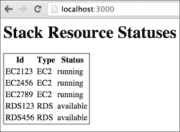
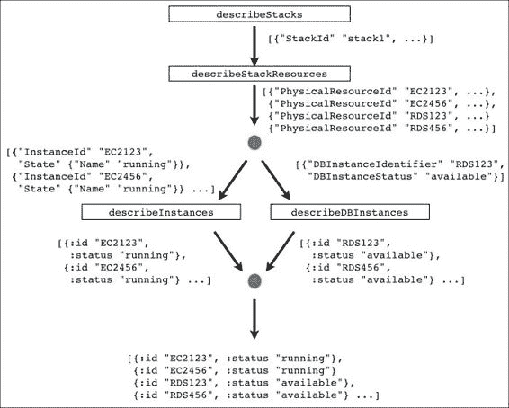

# 第九章。亚马逊网络服务的响应式 API

在整本书中，我们学习了许多工具和技术，以帮助我们构建响应式应用程序——使用即将到来的未来、使用 RxClojure/RxJava 的 Observables、使用`core.async`的通道——甚至使用 Om 和 React 构建响应式用户界面。

在这个过程中，我们还了解了**函数式响应式编程**和**组合事件系统**的概念，以及它们之间的区别。

在最后一章中，我们将通过开发一个基于我在澳大利亚悉尼的客户的一个真实世界用例的应用程序，将一些不同的工具和概念结合起来。我们将：

+   描述我们试图解决的自动化基础设施问题

+   简要了解一下亚马逊的一些 AWS 服务

+   使用我们迄今为止学到的概念构建一个 AWS 仪表板

# 问题

这个客户——从现在起我们将称之为 BubbleCorp——有一个非常普遍且众所周知的大企业问题：一个庞大的单体应用程序。

除了使它们变得缓慢外，由于各个组件不能独立演进，这个应用程序由于其环境限制而使得部署变得极其困难：所有基础设施都必须可用，应用程序才能正常运行。

因此，开发新功能和修复错误仅涉及少数几个由数十名开发者共享的开发环境。这需要在团队之间进行大量的协调，以免他们相互干扰，从而进一步减缓整个生命周期。

解决这个问题的长期方案是将这个大应用程序分解成更小的组件，这些组件可以独立部署和开发，但尽管这个方案听起来很好，但它是一个既费时又漫长的过程。

作为第一步，BubbleCorp 决定他们短期内能改进的最佳方法是让开发者能够独立工作，这意味着能够创建一个新环境。

考虑到基础设施的限制，在单个开发者的机器上运行应用程序是不切实际的。

相反，他们转向了基础设施自动化：他们想要一个工具，只需按一下按钮，就能启动一个全新的环境。

这个新环境将预先配置好适当的应用服务器、数据库实例、DNS 条目以及运行应用程序所需的一切。

这样，开发者只需部署他们的代码并测试他们的更改，无需担心应用程序的设置。

# 基础设施自动化

**亚马逊网络服务**（**AWS**）是目前最成熟和最全面的云计算平台，因此对 BubbleCorp 来说，将其基础设施托管在这里是顺理成章的选择。

如果你之前没有使用过 AWS，不要担心，我们只会关注其服务中的几个：

+   **弹性计算云**（**EC2**）：一项为用户提供租用虚拟计算机以运行其应用程序的服务。

+   **关系数据库服务**（**RDS**）：这可以被视为 EC2 的一个特殊版本，提供托管数据库服务。

+   **CloudFormation**：使用 CloudFormation，用户可以指定多个不同 AWS 资源的基础设施模板，称为堆栈，例如 EC2、AWS 以及许多其他资源，以及它们如何相互交互。一旦编写完成，基础设施模板可以发送到 AWS 执行。

对于**BubbleCorp**，想法是编写这些基础设施模板，一旦提交，就会产生一个完全新的、隔离的环境，其中包含运行其应用程序所需的所有数据和组件。在任何给定时间，都会有数十个这样的环境在运行，开发者正在对它们进行工作。

尽管这个计划听起来不错，但大公司通常还有一个额外的负担：成本中心。不幸的是，BubbleCorp 不能简单地允许开发者登录 AWS 控制台——在那里我们可以管理 AWS 资源——并且随意启动环境。他们需要一种方法，在众多其他事情中，向环境添加成本中心元数据以处理他们的内部计费流程。

这将带我们到本章剩余部分我们将要关注的应用程序。

# AWS 资源仪表板

我的团队和我被分配了一个任务，即构建一个基于 Web 的 AWS 仪表板。这个仪表板将允许开发者使用他们的 BubbleCorp 凭证登录，一旦认证通过，就可以创建新的 CloudFormation 环境以及可视化 CloudFormation 堆栈中每个单独资源的状态。

应用程序本身相当复杂，因此我们将关注其子集：与必要的 AWS 服务接口，以收集有关给定 CloudFormation 堆栈中每个单独资源状态的信息。

完成后，我们的简化仪表板将看起来像这样：



它将显示每个资源的 ID、类型和当前状态。现在这看起来可能不多，但考虑到所有这些信息都来自不同的、独立的网络服务，最终得到不必要的复杂代码的情况是非常容易发生的。

我们将使用 ClojureScript 来完成这项工作，因此我们将使用 AWS SDK 的 JavaScript 版本，其文档可以在[`aws.amazon.com/sdk-for-node-js/`](http://aws.amazon.com/sdk-for-node-js/)找到。

在我们开始之前，让我们看看我们将与之交互的每个 AWS 服务 API。

### 小贴士

实际上，我们不会与真实的 AWS 服务交互，而是与从本书的 GitHub 存储库提供的占位符服务器交互。

这样做的理由是为了使跟随本章内容更加容易，因为你不需要创建账户以及生成 API 访问密钥来与 AWS 交互。

此外，创建资源会产生成本，我当然不希望你在月底因为有人不小心让资源运行时间过长而被收取数百美元——相信我，这种情况以前发生过。

# CloudFormation

我们将要查看的第一个服务是 CloudFormation。这是有道理的，因为这里找到的 API 将为我们找到给定堆栈中资源的信息提供一个起点。

## describeStacks 端点

这个端点是负责列出与特定 AWS 账户关联的所有堆栈。对于给定的堆栈，其响应如下所示：

```java
{"Stacks"
   [{"StackId"
     "arn:aws:cloudformation:ap-southeast-2:337944750480:stack/DevStack-62031/1",
     "StackStatus" "CREATE_IN_PROGRESS",
     "StackName" "DevStack-62031",
     "Parameters" [{"ParameterKey" "DevDB", "ParameterValue" nil}]}]}
```

不幸的是，它没有说明哪些资源属于这个堆栈。然而，它确实给了我们堆栈名称，我们可以使用它来在下一个服务中查找资源。

## describeStackResources 端点

这个端点接收许多参数，但我们感兴趣的是堆栈名称，一旦提供，就会返回以下内容：

```java
{"StackResources"
   [{"PhysicalResourceId" "EC2123",
     "ResourceType" "AWS::EC2::Instance"},
    {"PhysicalResourceId" "EC2456",
     "ResourceType" "AWS::EC2::Instance"}
    {"PhysicalResourceId" "EC2789",
     "ResourceType" "AWS::EC2::Instance"}
    {"PhysicalResourceId" "RDS123",
     "ResourceType" "AWS::RDS::DBInstance"}
    {"PhysicalResourceId" "RDS456",
     "ResourceType" "AWS::RDS::DBInstance"}]}
```

现在我们似乎有所进展。这个堆栈有几个资源：三个 EC2 实例和两个 RDS 实例——对于仅两次 API 调用来说并不算太坏。

然而，正如我们之前提到的，我们的仪表板需要显示每个资源的状态。有了资源 ID 列表在手，我们需要查看其他可能提供每个资源详细信息的服务的端点。

# EC2

我们接下来要查看的服务是针对 EC2 的。正如我们将看到的，不同服务的响应并不像我们希望的那样一致。

## describeInstances 端点

这个端点听起来很有希望。根据文档，我们可以给它一个实例 ID 列表，它将返回以下响应：

```java
{"Reservations"
   [{"Instances"
     [{"InstanceId" "EC2123",
       "Tags"
       [{"Key" "StackType", "Value" "Dev"}
        {"Key" "junkTag", "Value" "should not be included"}
        {"Key" "aws:cloudformation:logical-id", "Value" "theDude"}],
       "State" {"Name" "running"}}
      {"InstanceId" "EC2456",
       "Tags"
       [{"Key" "StackType", "Value" "Dev"}
        {"Key" "junkTag", "Value" "should not be included"}
        {"Key" "aws:cloudformation:logical-id", "Value" "theDude"}],
       "State" {"Name" "running"}}
      {"InstanceId" "EC2789",
       "Tags"
       [{"Key" "StackType", "Value" "Dev"}
        {"Key" "junkTag", "Value" "should not be included"}
        {"Key" "aws:cloudformation:logical-id", "Value" "theDude"}],
       "State" {"Name" "running"}}]}]}
```

在这个响应中，我们可以看到`State`键，它告诉我们特定 EC2 实例的状态。就 EC2 而言，这就是我们所需要的。这让我们剩下 RDS 要处理。

# RDS

有些人可能会想，获取 RDS 实例的状态应该和 EC2 一样简单。让我们看看这是否属实。

## describeDBInstances 端点

这个端点在目的上与刚才我们查看的类似 EC2 端点相同。然而，它的输入略有不同：它接受单个实例 ID 作为输入，并且截至本文撰写时，不支持过滤器。

这意味着如果我们的堆栈有多个 RDS 实例——比如说，在主/副本设置中——我们需要对每个实例进行多次 API 调用以收集信息。当然，这不是什么大问题，但这是一个需要注意的限制。

一旦给出了特定的数据库实例 ID，这个服务会返回以下代码：

```java
{"DBInstances"
   [{"DBInstanceIdentifier" "RDS123", "DBInstanceStatus" "available"}]}
```

单个实例包含在向量中这一事实暗示了将来将支持过滤。但这还没有发生。

# 设计解决方案

现在我们已经有了开始设计我们应用程序所需的所有信息。我们需要为每个 CloudFormation 堆栈协调四次不同的 API 调用：

+   `describeStacks`：用于列出所有可用的堆栈

+   `describeStackResources`：用于检索堆栈中包含的所有资源的详细信息

+   `describeInstances`：用于检索堆栈中所有 EC2 实例的详细信息

+   `describeDBInstances`：用于检索堆栈中所有 DB2 实例的详细信息

接下来，我希望你能暂时退后一步，思考你将如何设计这样的代码。请继续，我会等待。

现在您回来了，让我们看看一种可能的方法。

如果我们回想一下仪表板的外观截图，我们会意识到，对于我们的应用程序来说，只要每个资源都有 ID、类型和状态属性，EC2 和 RDS 资源之间的区别就可以完全忽略。

这意味着无论我们的解决方案可能是什么，它都必须以某种方式提供一种统一的方式来抽象不同的资源类型。

此外，除了需要按顺序调用的`describeStacks`和`describeStackResources`之外，`describeInstances`和`describeDBInstances`可以并发执行，之后我们需要一种方法来合并结果。

由于一张图片胜过千言万语，以下是我们希望工作流程看起来是这样的图片：



上一张图片突出了我们解决方案的几个关键方面：

+   我们首先通过调用`describeStacks`来检索堆栈

+   接下来，对于每个堆栈，我们调用`describeStackResources`来检索每个堆栈的资源列表

+   然后，我们按类型拆分列表，最后得到一个包含 EC2 和包含 RDS 资源的列表

+   我们通过并发调用`describeInstances`和`describeDBInstances`，得到两个结果列表，每个资源类型一个

+   由于响应格式不同，我们将每个资源转换为统一的表现形式

+   最后，我们将所有结果合并到一个列表中，以便渲染

这需要吸收很多信息，但正如您很快就会意识到的那样，我们的解决方案并不偏离这个高级描述太远。

我们可以很容易地将这个问题想象成有关几种不同类型的实例的信息通过这个 API 调用图流动——在需要时进行转换——直到我们到达我们想要的信息，以我们想要工作的格式。

事实上，一个很好的方法来建模这个问题是使用我们在本书早期学习到的 Reactive 抽象之一：Observables。

## 运行 AWS 占位符服务器

在我们开始编写仪表板之前，我们应该确保我们的 AWS 占位符服务器已经正确设置。占位符服务器是一个 Clojure 网络应用程序，它模拟了真实 AWS API 的行为，并且是仪表板将要与之通信的后端。

让我们先进入我们的终端，使用 Git 克隆书籍仓库，然后启动占位符服务器：

```java
$ git clone https://github.com/leonardoborges/ClojureReactiveProgramming
$ cd ClojureReactiveProgramming/code/chapter09/aws-api-stub
$ lein ring server-headless 3001
2014-11-23 17:33:37.766:INFO:oejs.Server:jetty-7.6.8.v20121106
2014-11-23 17:33:37.812:INFO:oejs.AbstractConnector:Started SelectChannelConnector@0.0.0.0:3001
Started server on port 3001

```

这将启动服务器在端口 3001 上。为了验证它是否按预期工作，请将您的浏览器指向`http://localhost:3001/cloudFormation/describeStacks`。您应该看到以下 JSON 响应：

```java
{
    "Stacks": [
        {
            "Parameters": [
                {
                    "ParameterKey": "DevDB",
                    "ParameterValue": null
                }
            ],
            "StackStatus": "CREATE_IN_PROGRESS",
            "StackId": "arn:aws:cloudformation:ap-southeast-2:337944750480:stack/DevStack-62031/1",
            "StackName": "DevStack-62031"
        }
    ]
}
```

## 设置仪表板项目

正如我们之前提到的，我们将使用 ClojureScript 开发仪表板，并通过 Om 渲染 UI。此外，由于我们选择了 Observables 作为我们的主要响应式抽象，我们需要 RxJS，这是 Microsoft 响应式扩展的许多实现之一。我们将很快将这些依赖项拉入我们的项目。

让我们使用`om-start` leiningen 模板创建一个名为`aws-dash`的新 ClojureScript 项目：

```java
$ lein new om-start aws-dash

```

这为我们提供了一个起点，但我们应该确保我们的所有版本都匹配。打开新项目根目录中的`project.clj`文件，并确保依赖项部分看起来如下：

```java
...
  :dependencies [[org.clojure/clojure "1.6.0"]
                 [org.clojure/clojurescript "0.0-2371"]
                 [org.clojure/core.async "0.1.346.0-17112a-alpha"]
                 [om "0.5.0"]
                 [com.facebook/react "0.9.0"]
                 [cljs-http "0.1.20"]
                 [com.cognitect/transit-cljs "0.8.192"]]
   :plugins [[lein-cljsbuild "1.0.3"]]
...
```

这是我们第一次看到最后两个依赖项。`cljs-http`是一个简单的 HTTP 库，我们将用它来向我们的 AWS 模拟服务器发送 AJAX 请求。`transit-cljs`允许我们做许多事情，例如将 JSON 响应解析为 ClojureScript 数据结构。

### 小贴士

Transit 本身是一种格式和一系列库，通过这些库，使用不同技术开发的程序可以相互通信。在这种情况下，我们正在使用 Clojurescript 库来解析 JSON，但如果你有兴趣了解更多，我建议阅读 Rich Hickey 在[`blog.cognitect.com/blog/2014/7/22/transit`](http://blog.cognitect.com/blog/2014/7/22/transit)发布的官方博客文章。

接下来，我们需要 RxJS，作为一个 JavaScript 依赖项，它不能通过 leiningen 获得。没关系。我们将简单地将其下载到应用程序输出目录`aws-dash/dev-resources/public/js/`：

```java
$ cd aws-dash/dev-resources/public/js/
$ wget https://raw.githubusercontent.com/Reactive-Extensions/RxJS/master/dist/rx.all.js
--2014-11-23 18:00:21--  https://raw.githubusercontent.com/Reactive-Extensions/RxJS/master/dist/rx.all.js
Resolving raw.githubusercontent.com... 103.245.222.133
Connecting to raw.githubusercontent.com|103.245.222.133|:443... connected.
HTTP request sent, awaiting response... 200 OK
Length: 355622 (347K) [text/plain]
Saving to: 'rx.all.js'

100%[========================>] 355,622      966KB/s   in 0.4s

2014-11-23 18:00:24 (966 KB/s) - 'rx.all.js' saved [355622/355622]

```

接下来，我们需要让我们的应用程序意识到我们对 RxJS 的新依赖。打开`aws-dash/dev-resources/public/index.html`文件，并添加一个 script 标签来引入 RxJS：

```java
<html>
  <body>
    <div id="app"></div>
    <script src="img/react-0.9.0.js"></script>
    <script src="img/rx.all.js"></script>
    <script src="img/aws_dash.js"></script>
  </body>
</html>
```

在所有依赖项就绪后，让我们开始自动编译我们的 ClojureScript 源文件，如下所示：

```java
$ cd aws-dash/
$ lein cljsbuild auto
Compiling ClojureScript.
Compiling "dev-resources/public/js/aws_dash.js" from ("src/cljs" "dev-resources/tools/repl")...
Successfully compiled "dev-resources/public/js/aws_dash.js" in 0.981 seconds.

```

## 创建 AWS Observables

我们现在可以开始实现我们的解决方案了。如果你还记得反应式扩展章节，`RxJava/RxJS/RxClojure`提供了几个有用的 Observables。然而，当内置的 Observables 不足以满足需求时，它为我们提供了构建自己的工具。

由于 RxJS 很可能已经为亚马逊的 AWS API 提供了 Observables，我们将首先实现我们自己的原始 Observables。

为了保持整洁，我们将在一个新文件中这样做，位于`aws-dash/src/cljs/aws_dash/observables.cljs`：

```java
(ns aws-dash.observables
  (:require-macros [cljs.core.async.macros :refer [go]])
  (:require [cljs-http.client :as http]
            [cljs.core.async :refer [<!]]
            [cognitect.transit :as t]))

(def r (t/reader :json))

(def  aws-endpoint "http://localhost:3001")
(defn aws-uri [path]
  (str aws-endpoint path))
```

命名空间声明需要我们在文件中需要的必要依赖项。注意，这里没有对 RxJS 的显式依赖。由于它是一个我们手动拉入的 JavaScript 依赖项，它通过 JavaScript 互操作性对我们来说是全局可用的。

下一行设置了一个`transit`读取器用于 JSON，我们将用它来解析模拟服务器响应。

然后，我们定义我们将与之通信的端点以及一个辅助函数来构建正确的 URI。确保变量 `aws-endpoint` 与上一节中启动的占位符服务器的宿主和端口匹配。

我们即将创建的所有 Observables 都遵循一个共同的结构：它们向占位符服务器发送请求，从响应中提取一些信息，可选地进行转换，然后将转换后的序列中的每个项目发射到新的 Observable 序列中。

为了避免重复，这个模式被以下函数捕获：

```java
(defn observable-seq [uri transform]
  (.create js/Rx.Observable
           (fn [observer]
             (go (let [response      (<! (http/get uri {:with-credentials? false}))
                       data          (t/read r (:body response))
                       transformed   (transform data)]
                   (doseq [x transformed]
                     (.onNext observer x))
                   (.onCompleted observer)))
             (fn [] (.log js/console "Disposed")))))
```

让我们分解这个函数：

+   `observable-seq` 接收两个参数：我们将向其发出 GET 请求的后端 URI，以及一个 `transform` 函数，该函数接受原始解析的 JSON 响应并返回一个转换项的序列。

+   然后，它调用 RxJS 对象 `Rx.Observable` 的 `create` 函数。注意我们如何利用 JavaScript 互操作性：我们通过在前面加上一个点来访问 create 函数，就像在 Java 互操作性中一样。由于 `Rx.Observable` 是一个全局对象，我们通过在前面加上 ClojureScript 为我们的程序提供的全局 JavaScript 命名空间 `js/Rx.Observable` 来访问它。

+   Observable 的 create 函数接收两个参数。一个是带有观察者的函数，我们可以向其中推送要发布在 Observable 序列中的项目。第二个函数是每当这个 Observable 被处置时调用的函数。这是我们可以执行任何清理所需的函数。在我们的情况下，这个函数只是将调用的事实记录到控制台。

虽然第一个函数是我们感兴趣的：

```java
(fn [observer]
  (go (let [response      (<! (http/get uri 
                                        {:with-credentials? 
                                         false}))
            data          (t/read r (:body response))
            transformed   (transform data)]
        (doseq [x transformed]
          (.onNext observer x))
        (.onCompleted observer))))
```

一旦被调用，它就会使用 cljs-http 的 `get` 函数对提供的 URI 发出请求，该函数返回一个 `core.async` 通道。这就是为什么整个逻辑都在 `go` 块中的原因。

接下来，我们使用之前配置的 transit JSON 读取器来解析响应体，并将结果输入到 `transform` 函数中。记住这个函数，根据我们的设计，它返回一个序列。因此，我们唯一要做的就是依次将每个项目推送到观察者。

一旦完成，我们通过调用 `observer` 对象的 `.onCompleted` 函数来指示这个 Observable 序列不会发射任何新的项目。

现在，我们可以使用这个辅助函数继续创建我们的 Observables，从负责检索 CloudFormation 服务的那个开始：

```java
(defn describe-stacks []
  (observable-seq (aws-uri "/cloudFormation/describeStacks")
                  (fn [data]
                    (map (fn [stack] {:stack-id   (stack "StackId")
                                     :stack-name (stack "StackName")})
                         (data "Stacks")))))
```

这创建了一个 Observable，它将为每个堆栈发射一个项目，格式如下：

```java
({:stack-id "arn:aws:cloudformation:ap-southeast-2:337944750480:stack/DevStack-62031/1", :stack-name "DevStack-62031"})
```

现在我们有了堆栈，我们需要一个 Observable 来描述其资源：

```java
(defn describe-stack-resources [stack-name]
  (observable-seq (aws-uri "/cloudFormation/describeStackResources")
                  (fn [data]
                    (map (fn [resource]
                           {:resource-id (resource "PhysicalResourceId")
                            :resource-type (resource "ResourceType")} )
                         (data "StackResources")))))
```

它具有类似的目的，并以以下格式发射资源项：

```java
({:resource-id "EC2123", :resource-type "AWS::EC2::Instance"}
 {:resource-id "EC2456", :resource-type "AWS::EC2::Instance"}
 {:resource-id "EC2789", :resource-type "AWS::EC2::Instance"}
 {:resource-id "RDS123", :resource-type "AWS::RDS::DBInstance"}
 {:resource-id "RDS456", :resource-type "AWS::RDS::DBInstance"})
```

由于我们几乎字面地遵循我们的策略，我们还需要两个更多的 observables，每个实例类型一个：

```java
(defn describe-instances [instance-ids]
  (observable-seq (aws-uri "/ec2/describeInstances")
                  (fn [data]
                    (let [instances (mapcat (fn [reservation]
                                              (reservation "Instances"))
                                            (data "Reservations"))]
                      (map (fn [instance]
                             {:instance-id  (instance "InstanceId")
                              :type        "EC2"
                              :status      (get-in instance ["State" "Name"])})
                           instances)))))

(defn describe-db-instances [instance-id]
  (observable-seq (aws-uri (str "/rds/describeDBInstances/" instance-id))
                  (fn [data]
                    (map (fn [instance]
                           {:instance-id (instance "DBInstanceIdentifier")
                            :type        "RDS"
                            :status      (instance "DBInstanceStatus")})
                         (data "DBInstances")))))
```

其中每个都会以以下格式为 EC2 和 RDS 分别发射资源项：

```java
({:instance-id "EC2123", :type "EC2", :status "running"} ...)
({:instance-id "RDS123", :type "RDS", :status "available"} ...)
```

## 结合 AWS Observables

看起来我们现在已经拥有了所有主要部件。剩下要做的就是将我们刚刚创建的更原始、基本的 Observables 组合成更复杂、更有用的 Observables，通过组合它们来聚合我们渲染仪表板所需的所有数据。

我们将首先创建一个函数，它结合了`describe-stacks`和`describe-stack-resources`Observables：

```java
(defn stack-resources []
  (-> (describe-stacks)
      (.map #(:stack-name %))
      (.flatMap describe-stack-resources)))
```

从上一个示例开始，我们开始看到如何用 Observable 序列来定义我们的 API 调用是如何带来好处的：几乎是以声明式的方式简单地将这两个 Observable 结合起来。

记住`flatMap`的作用：由于`describe-stack-resources`本身返回一个 Observable，我们使用`flatMap`来扁平化这两个 Observables，就像我们在各种不同的抽象中之前所做的那样。

`stack-resources`Observable 将为所有堆栈发出资源项。根据我们的计划，我们希望在这里分叉处理，以并发检索 EC2 和 RDS 实例数据。

通过遵循这个思路，我们得到了两个更多函数，它们结合并转换了之前的 Observables：

```java
(defn ec2-instance-status [resources]
  (-> resources
      (.filter #(= (:resource-type %) "AWS::EC2::Instance"))
      (.map #(:resource-id %))
      (.reduce conj [])
      (.flatMap describe-instances)))

(defn rds-instance-status [resources]
  (-> resources
      (.filter #(= (:resource-type %) "AWS::RDS::DBInstance"))
      (.map #(:resource-id %))
      (.flatMap describe-db-instances)))
```

这两个函数都接收一个参数，resources，它是调用`stack-resources`Observable 的结果。这样，我们只需要调用一次。

再次强调，按照我们之前描述的高级想法，以有意义的方式结合 Observables 相当简单。

从`resources`开始，我们过滤掉我们不感兴趣的类型，检索其 ID，并通过 flatmapping `describe-instances`和`describe-db-instances`Observables 来请求其详细信息。

然而，请注意，由于前面描述的 RDS API 的限制，我们必须多次调用它来检索所有 RDS 实例的信息。

这种看似基本的使用 API 的差异在我们的 EC2 observable 中变成了一个小的转换，它只是将所有 ID 累积到一个向量中，这样我们就可以一次性检索它们。

我们简单的 Reactive API 到 Amazon AWS 现在已经完成，剩下的是创建 UI。

## 将所有这些整合在一起

现在我们转向构建我们的用户界面。这是一个简单的界面，所以我们直接进入。打开`aws-dash/src/cljs/aws_dash/core.cljs`并添加以下内容：

```java
(ns aws-dash.core
  (:require [aws-dash.observables :as obs]
            [om.core :as om :include-macros true]
            [om.dom :as dom :include-macros true]))

(enable-console-print!)

(def app-state (atom {:instances []}))

(defn instance-view [{:keys [instance-id type status]} owner]
  (reify
    om/IRender
    (render [this]
      (dom/tr nil
              (dom/td nil instance-id)
              (dom/td nil type)
              (dom/td nil status)))))

(defn instances-view [instances owner]
  (reify
    om/IRender
    (render [this]
      (apply dom/table #js {:style #js {:border "1px solid black;"}}
             (dom/tr nil
                     (dom/th nil "Id")
                     (dom/th nil "Type")
                     (dom/th nil "Status"))
             (om/build-all instance-view instances)))))

(om/root
 (fn [app owner]
   (dom/div nil
            (dom/h1 nil "Stack Resource Statuses")
            (om/build instances-view (:instances app))))
 app-state
 {:target (. js/document (getElementById "app"))})
```

我们的应用状态包含一个单一的关键字，`:instances`，它最初是一个空向量。正如我们可以从每个 Om 组件中看到的那样，实例将以 HTML 表格中的行形式渲染。

保存文件后，确保通过从 REPL 启动它来运行 Web 服务器：

```java
lein repl
Compiling ClojureScript.
nREPL server started on port 58209 on host 127.0.0.1 - nrepl://127.0.0.1:58209
REPL-y 0.3.5, nREPL 0.2.6
Clojure 1.6.0
Java HotSpot(TM) 64-Bit Server VM 1.8.0_25-b17
 Docs: (doc function-name-here)
 (find-doc "part-of-name-here")
 Source: (source function-name-here)
 Javadoc: (javadoc java-object-or-class-here)
 Exit: Control+D or (exit) or (quit)
 Results: Stored in vars *1, *2, *3, an exception in *e

user=> (run)
2015-02-08 21:02:34.503:INFO:oejs.Server:jetty-7.6.8.v20121106
2015-02-08 21:02:34.545:INFO:oejs.AbstractConnector:Started SelectChannelConnector@0.0.0.0:3000
#<Server org.eclipse.jetty.server.Server@35bc3669>

```

你现在应该能够将你的浏览器指向`http://localhost:3000/`，但是，正如你可能已经猜到的，你将看到的是一个空表。

这是因为我们还没有使用我们的 Reactive AWS API。

让我们修复它，并在`core.cljs`的底部将其全部整合在一起：

```java
(def resources (obs/stack-resources))

(.subscribe (-> (.merge  (obs/rds-instance-status resources)
                         (obs/ec2-instance-status resources))
                (.reduce conj []))
            #(swap! app-state assoc :instances %))
```

是的，这就是我们所需要的！我们创建一个 `stack-resources` 可观察对象，并将其作为参数传递给 `rds-instance-status` 和 `ec2-instance-status`，这将并发检索所有实例的状态信息。

接下来，我们通过合并前两个可观察对象并调用 `.reduce` 方法创建一个新的可观察对象，这将把所有信息累积到一个向量中，这对于渲染来说很方便。

最后，我们简单地订阅这个可观察对象，当它发出结果时，我们简单地更新我们的应用程序状态，让 Om 为我们做所有的渲染。

保存文件并确保 ClojureScript 已成功编译。然后，回到你的浏览器 `http://localhost:3000/`，你应该能看到所有实例的状态，就像本章开头所展示的那样。

# 练习

使用我们之前的方法，查看 AWS 资源的新信息的唯一方法是刷新整个页面。修改我们的实现，使其每隔一段时间查询占位符服务——比如说，每 500 毫秒查询一次。

### 小贴士

RxJS 中的 `interval` 函数可以帮助解决这个练习。想想你如何结合我们现有的流使用它，通过回顾 `flatMap` 的工作原理。

# 摘要

在本章中，我们探讨了反应式应用程序的一个实际用例：为 AWS CloudFormation 堆栈构建仪表板。

我们已经看到，将所有需要的信息视为通过图流动的资源/项目，这与创建可观察对象的方式非常契合。

此外，通过创建只做一件事的原始可观察对象，我们得到了一个很好的声明式方法来将它们组合成更复杂可观察对象，这为我们提供了一种通常在常见技术中找不到的复用程度。

最后，我们将它包装在一个简单的基于 Om 的界面中，以展示在同一个应用程序中使用不同的抽象不会增加复杂性，只要这些抽象被仔细地选择来处理当前的问题。

这使我们到达了希望是一个愉快且富有信息性的旅程的终点，通过不同的反应式编程方式。

这本书远非一个完整的参考手册，它的目的是为你，读者，提供足够的信息，以及你可以今天就能应用的切实工具和示例。

我也希望这本书中包含的参考和练习能够证明它们是有用的，如果你希望扩展你的知识并寻找更多细节的话。

最后，我强烈建议你翻到下一页阅读附录，即《库设计代数》，因为我真心相信，至少它会使你深入思考编程中组合的重要性。

我真诚地希望这本书的阅读体验像写作一样有趣和有教育意义。

感谢阅读。我期待看到你构建的伟大事物。

# 附录 A. 库设计代数

你可能已经注意到，我们在这本书中遇到的所有的反应式抽象都有一些共同点。首先，它们作为“容器式”抽象工作：

+   期货封装了一个最终会产生单个值的计算。

+   可观察封装了可以在一段时间内以流的形式产生多个值的计算。

+   通道封装了推送到它们的值，并且可以从它们中弹出值，作为一个并发队列，通过这个队列并发进程进行通信。

然后，一旦我们有了这个“容器”，我们就可以以多种方式对其进行操作，这些方式在不同抽象和框架之间非常相似：我们可以使用 `filter` 过滤它们包含的值，使用 `map` 对其进行转换，使用 `bind`/`flatMap`/`selectMany` 组合相同类型的抽象，并行执行多个计算，使用 `sequence` 聚合结果，等等。

因此，尽管抽象及其底层工作原理在本质上不同，但它们仍然感觉属于某种类型的高级抽象。

在这个附录中，我们将探索这些高级抽象是什么，它们之间的关系，以及我们如何在项目中利用它们。

# `map` 的语义

我们将首先查看这些抽象中最常用的一个操作：`map`。

我们已经长时间使用 `map` 来转换序列。因此，为了避免为每个新的抽象创建一个新的函数名，库设计者只是简单地在其自己的容器类型上抽象 `map` 操作。

想象一下，如果我们有 `transform-observable`、`transform-channel`、`combine-futures` 等函数，我们会陷入多么混乱的局面。

幸运的是，情况并非如此。`map` 的语义已经被充分理解，以至于即使开发者之前没有使用过特定的库，他也会几乎总是假设 `map` 会将函数应用于库提供的任何抽象中的值（或值）。

让我们看看在这本书中遇到的三个例子。我们将创建一个新的 leiningen 项目，以便在这个附录的内容上进行实验：

```java
$ lein new library-design

```

接下来，让我们向我们的 `project.clj` 文件添加一些依赖项：

```java
...
:dependencies [[org.clojure/clojure "1.6.0"]
               [com.leonardoborges/imminent "0.1.0"]
               [com.netflix.rxjava/rxjava-clojure "0.20.7"]
               [org.clojure/core.async "0.1.346.0-17112a-alpha"]
               [uncomplicate/fluokitten "0.3.0"]]
...
```

不要担心最后一个依赖项——我们稍后会处理它。

现在，启动一个 REPL 会话，这样我们就可以跟随操作：

```java
$ lein repl

```

然后，将以下内容输入到你的 REPL 中：

```java
(require '[imminent.core :as i]
 '[rx.lang.clojure.core :as rx]
 '[clojure.core.async :as async])

(def  repl-out *out*)
(defn prn-to-repl [& args]
 (binding [*out* repl-out]
 (apply prn args)))
(-> (i/const-future 31)
 (i/map #(* % 2))
 (i/on-success #(prn-to-repl (str "Value: " %))))

(as-> (rx/return 31) obs
 (rx/map #(* % 2) obs)
 (rx/subscribe obs #(prn-to-repl (str "Value: " %))))

(def c        (chan))
(def mapped-c (async/map< #(* % 2) c))

(async/go (async/>! c 31))
(async/go (prn-to-repl (str "Value: " (async/<! mapped-c))))

"Value: 62"
"Value: 62"
"Value: 62"

```

这三个例子——分别使用 imminent、RxClojure 和 core.async——看起来非常相似。它们都遵循一个简单的配方：

1.  将数字 31 放入它们各自的抽象中。

1.  通过在抽象上映射一个函数来将这个数字翻倍。

1.  将其结果打印到 REPL。

如预期的那样，它将值 `62` 输出到屏幕上三次。

看起来`map`在所有三种情况下都执行相同的抽象步骤：它应用提供的函数，将结果值放入一个全新的容器中，并返回它。我们可以继续进行泛化，但这样我们只是在重新发现已经存在的抽象：函子。

## 函子

函子是我们将要研究的第一个抽象，它们相当简单：它们定义了一个名为`fmap`的单一操作。在 Clojure 中，可以使用协议来表示函子，并且它们用于可以映射的容器。这些容器包括但不限于列表、Future、Observables 和通道。

### 小贴士

本附录标题中的*代数*指的是**抽象代数**，这是研究代数结构的数学的一个分支。简单来说，代数结构是在其上定义了一个或多个运算的集合。

例如，考虑**半群**，这是一种这样的代数结构。它被定义为包含一组元素以及一个将这个集合中的任意两个元素结合起来的运算。因此，正整数集合加上加法运算构成一个半群。

另一个用于研究代数结构的工具被称为范畴论，函子是范畴论的一部分。

我们不会深入探讨所有这些理论背后的细节，因为关于这个主题有大量的书籍[9][10]可供参考。然而，解释这个附录中使用的标题却是必要的。

这是否意味着所有这些抽象都实现了函子协议？不幸的是，并非如此。由于 Clojure 是一种动态语言，它没有内置协议——这些协议是在语言的 1.2 版本中添加的——这些框架倾向于实现自己的`map`函数版本，而这个版本不属于任何特定的协议。

唯一的例外是即将到来的，它实现了`fluokitten`库中包含的协议，这是一个提供范畴论概念（如函子）的 Clojure 库。

这是`fluokitten`中找到的函子协议的简化版本：

```java
(defprotocol Functor
  (fmap [fv g]))
```

如前所述，函子定义了一个单一的操作。`fmap`将函数`g`应用于容器`Functor``fv`内部的任何值。

然而，实现这个协议并不能保证我们实际上已经实现了函子。这是因为，除了实现协议之外，函子还必须遵守一些定律，我们将简要地考察这些定律。

恒等律如下：

```java
(= (fmap a-functor identity)
   (identity a-functor))
```

上述代码就是我们验证这个定律所需的所有内容。它只是简单地说明，在`a-functor`上映射`identity`函数与直接将`identity`函数应用于函子本身是相同的。

组合律如下：

```java
(= (fmap a-functor (comp f g))
   (fmap (fmap a-functor g) f))
```

组合律反过来表明，如果我们组合两个任意函数`f`和`g`，将得到的结果函数应用于`a-functor`，这与先映射`g`到函子，然后映射`f`到结果函子是相同的。

无论文本有多少，都无法取代实际示例，因此我们将实现自己的 Functor，我们将其称为 `Option`。然后我们将重新审视这些定律，以确保我们已经遵守了它们。

## 选项 Functor

正如托尼·霍尔（Tony Hoare）曾经说过的，空引用是他价值十亿美元的失误（[`www.infoq.com/presentations/Null-References-The-Billion-Dollar-Mistake-Tony-Hoare`](http://www.infoq.com/presentations/Null-References-The-Billion-Dollar-Mistake-Tony-Hoare)）。无论背景如何，你无疑都会遇到可怕的 `NullPointerException`。这通常发生在我们尝试在 `null` 对象引用上调用方法时。

由于 Clojure 与其宿主语言 Java 的互操作性，Clojure 接受了空值，但它提供了更好的支持来处理它们。

核心库包含了许多函数，如果传递 `nil` 值，它们会执行正确操作——这是 Clojure 对 Java 的 `null` 的版本。例如，一个 `nil` 序列中有多少个元素？

```java
(count nil) ;; 0
```

由于对 `nil` 的有意识设计决策，我们大部分情况下可以不必担心它。对于所有其他情况，`Option` Functor 可能会有些帮助。

本附录中剩余的示例应在 `library-design/src/library_design/` 目录下的 `option.clj` 文件中。欢迎你在 REPL 中尝试这个示例。

让我们从添加命名空间声明以及我们将要使用的数据开始我们的下一个示例：

```java
(ns library-design.option
  (:require [uncomplicate.fluokitten.protocols :as fkp]
            [uncomplicate.fluokitten.core :as fkc]
            [uncomplicate.fluokitten.jvm :as fkj]
            [imminent.core :as I]))

(def pirates [{:name "Jack Sparrow"    :born 1700 :died 1740 :ship "Black Pearl"}
              {:name "Blackbeard"      :born 1680 :died 1750 :ship "Queen Anne's Revenge"}
              {:name "Hector Barbossa" :born 1680 :died 1740 :ship nil}])

(defn pirate-by-name [name]
  (->> pirates
       (filter #(= name (:name %)))
       first))

(defn age [{:keys [born died]}]
  (- died born))
```

作为加勒比海盗的粉丝，我认为在这个例子中玩海盗很有趣。假设我们想要计算杰克·斯派洛的年龄。根据我们刚刚覆盖的数据和函数，这是一个简单的任务：

```java
  (-> (pirate-by-name "Jack Sparrow")
      age) ;; 40
```

然而，如果我们想知道戴维·琼斯（Davy Jones）的年龄怎么办？实际上我们没有这个海盗的数据，所以如果我们再次运行我们的程序，我们会得到以下结果：

```java
(-> (pirate-by-name "Davy Jones")
      age) ;; NullPointerException   clojure.lang.Numbers.ops (Numbers.java:961)
```

就这样。可怕的 `NullPointerException`。这是因为在我们年龄函数的实现中，我们最终尝试从两个 `nil` 值中减去，这是不正确的。正如你可能已经猜到的，我们将尝试通过使用 `Option` Functor 来修复这个问题。

传统上，`Option` 是作为代数数据类型实现的，更具体地说，是一个具有两种变体的求和类型：`Some` 和 `None`。这些变体用于确定值是否存在，而不使用 `nils`。你可以将 `Some` 和 `None` 都视为 `Option` 的子类型。

在 Clojure 中，我们将使用记录来表示它们：

```java
(defrecord Some [v])

(defrecord None [])

(defn option [v]
  (if v
    (Some. v)
    (None.)))
```

如我们所见，`Some` 可以包含单个值，而 `None` 则不包含任何内容。它只是一个表示内容缺失的标记。我们还创建了一个名为 `option` 的辅助函数，该函数根据其参数是否为 `nil` 创建适当的记录。

下一步是将 `Functor` 协议扩展到两个记录：

```java
(extend-protocol fkp/Functor
  Some
  (fmap [f g]
    (Some. (g (:v f))))
  None
  (fmap [_ _]
    (None.)))
```

这就是`Option` Functor 的语义意义变得明显的地方：因为`Some`包含一个值，它的`fmap`实现只是将函数`g`应用到 Functor `f`内部的值上，该值是`Some`类型。最后，我们将结果放入一个新的`Some`记录中。

现在映射一个函数到`None`意味着什么呢？你可能已经猜到了，这实际上没有太多意义——`None`记录不包含任何值。我们能做的唯一一件事就是返回另一个`None`。正如我们很快就会看到的，这给了`Option` Functor 短路语义。

### 小贴士

在`None`的`fmap`实现中，我们可以返回对`this`的引用而不是一个新的记录实例。我没有这样做只是为了清楚地表明我们需要返回`None`的一个实例。

现在我们已经实现了 Functor 协议，我们可以尝试一下：

```java
(->> (option (pirate-by-name "Jack Sparrow"))
     (fkc/fmap age)) ;; #library_design.option.Some{:v 40}

(->> (option (pirate-by-name "Davy Jones"))
     (fkc/fmap age)) ;; #library_design.option.None{}
```

第一个例子不应该有任何惊喜。我们将从调用`pirate-by-name`得到的海盗地图转换成一个选项，然后对它应用年龄函数。

第二个例子更有趣。正如之前所述，我们没有关于 Davy Jones 的数据。然而，对它映射`age`不再抛出异常，而是返回`None`。

这可能看起来是一个小小的好处，但关键是`Option` Functor 使得链式操作变得安全：

```java
(->> (option (pirate-by-name "Jack Sparrow"))
     (fkc/fmap age)
     (fkc/fmap inc)
     (fkc/fmap #(* 2 %))) ;; #library_design.option.Some{:v 82}

(->> (option (pirate-by-name "Davy Jones"))
     (fkc/fmap age)
     (fkc/fmap inc)
     (fkc/fmap #(* 2 %))) ;; #library_design.option.None{}
```

到目前为止，一些读者可能已经在思考`some->`宏——在 Clojure 1.5 中引入——以及它如何有效地实现与`Option` Functor 相同的结果。这种直觉是正确的，如下所示：

```java
(some-> (pirate-by-name "Davy Jones")
        age
        inc
        (* 2)) ;; nil
```

`some->`宏会将第一个表达式的结果通过第一个形式传递，如果它不是`nil`。然后，如果那个表达式的结果不是`nil`，它会通过下一个形式传递，依此类推。一旦任何表达式评估为`nil`，`some->`就会短路并立即返回`nil`。

话虽如此，Functor 是一个更为通用的概念，因此只要我们在这个概念下工作，我们的代码就不需要随着我们在更高层次的抽象操作而改变：

```java
(->> (i/future (pirate-by-name "Jack Sparrow"))
     (fkc/fmap age)
     (fkc/fmap inc)
     (fkc/fmap #(* 2 %))) ;; #<Future@30518bfc: #<Success@39bd662c: 82>>
```

在前面的例子中，尽管我们使用的是一个本质上不同的工具——未来（futures），但使用结果的代码并不需要改变。这之所以可能，仅仅是因为 Options 和 futures 都是 Functors，并且实现了 fluokitten 提供的相同协议。我们获得了可组合性和简单性，因为我们可以使用相同的 API 来处理各种不同的抽象。

说到可组合性，这个特性由 Functors 的第二定律保证。让我们看看我们的 Option Functor 是否遵守这个以及第一定律——恒等定律：

```java
;; Identity
(= (fkc/fmap identity (option 1))
   (identity (option 1))) ;; true

;; Composition
(= (fkc/fmap (comp identity inc) (option 1))
   (fkc/fmap identity (fkc/fmap inc (option 1)))) ;; true
```

我们就完成了，我们的 `Option` 函子现在是一个合法的公民。剩下的两个抽象也各自配对了自己的法则。我们不会在本节中介绍这些法则，但我鼓励读者去了解它们（[`www.leonardoborges.com/writings/2012/11/30/monads-in-small-bites-part-i-functors/`](http://www.leonardoborges.com/writings/2012/11/30/monads-in-small-bites-part-i-functors/))。

# 计算年龄的平均值

在本节中，我们将探索 `Option` 函子的不同用法。我们希望，给定一定数量的海盗，计算他们的平均年龄。这很简单：

```java
(defn avg [& xs]
  (float (/ (apply + xs) (count xs))))

(let [a (some-> (pirate-by-name "Jack Sparrow") age)
      b (some-> (pirate-by-name "Blackbeard") age)
      c (some-> (pirate-by-name "Hector Barbossa") age)]
  (avg a b c)) ;; 56.666668
```

注意我们在这里是如何使用 `some->` 来保护我们免受 `nil` 值的影响。现在，如果我们对某个海盗没有信息怎么办？

```java
(let [a (some-> (pirate-by-name "Jack Sparrow") age)
      b (some-> (pirate-by-name "Davy Jones") age)
      c (some-> (pirate-by-name "Hector Barbossa") age)]
  (avg a b c)) ;; NullPointerException   clojure.lang.Numbers.ops (Numbers.java:961)
```

看起来我们又回到了起点！现在更糟，因为如果我们需要一次性使用所有值，而不是通过一系列函数调用传递它们，使用 `some->` 就没有帮助了。

当然，并没有失去所有东西。我们只需要在计算平均值之前检查所有值是否都存在：

```java
(let [a (some-> (pirate-by-name "Jack Sparrow") age)
      b (some-> (pirate-by-name "Davy Jones") age)
      c (some-> (pirate-by-name "Hector Barbossa") age)]
  (when (and a b c)
    (avg a b c))) ;; nil
```

虽然这工作得很好，但我们的实现突然必须意识到 `a`、`b` 和 `c` 中的任何一个或所有值都可能是 `nil`。我们将要查看的下一个抽象，应用函子，解决了这个问题。

# 应用函子

与函子类似，**应用函子**是一种容器，并定义了两个操作：

```java
(defprotocol Applicative
  (pure [av v])
  (fapply [ag av]))
```

`pure` 函数是一种将值放入应用函子的通用方式。到目前为止，我们一直使用 `option` 辅助函数来完成这个目的。我们稍后会用到它。

`fapply` 函数将展开应用函子 `ag` 中包含的函数，并将其应用于应用函子 `av` 中包含的值。

通过示例，这两个函数的目的将变得清晰，但首先，我们需要将我们的 `Option` 函子提升为应用函子：

```java
(extend-protocol fkp/Applicative
  Some
  (pure [_ v]
    (Some. v))

  (fapply [ag av]
    (if-let [v (:v av)]
      (Some. ((:v ag) v))
      (None.)))

  None
  (pure [_ v]
    (Some. v))

  (fapply [ag av]
    (None.)))
```

`pure` 的实现是最简单的。它所做的只是将值 `v` 包装成 `Some` 的一个实例。对于 `None` 的 `fapply` 实现来说，同样简单。因为没有值，所以我们再次简单地返回 `None`。

`Some` 的 `fapply` 实现确保两个参数都为 `:v` 关键字提供了值——严格来说，它们都必须是 `Some` 的实例。如果 `:v` 不是 `nil`，它将 `ag` 中包含的函数应用于 `v`，最后将结果包装起来。否则，它返回 `None`。

这应该足以尝试使用应用函子 API 的第一个示例：

```java
(fkc/fapply (option inc) (option 2))
;; #library_design.option.Some{:v 3}

(fkc/fapply (option nil) (option 2))
;; #library_design.option.None{}
```

现在，我们能够处理包含函数的函子。此外，我们还保留了当任何函子没有值时应发生的行为的语义。

我们现在可以回顾之前提到的年龄平均值示例：

```java
(def age-option (comp (partial fkc/fmap age) option pirate-by-name))

(let [a (age-option "Jack Sparrow")
      b (age-option "Blackbeard")
      c (age-option "Hector Barbossa")]
  (fkc/<*> (option (fkj/curry avg 3))
           a b c))
;; #library_design.option.Some{:v 56.666668}
```

### 小贴士

由 fluokitten 定义的 `vararg` 函数 `<*>` 对其参数执行左结合的 `fapply`。本质上，它是一个便利函数，使得 `(fapply f g h)` 等价于 `(fapply (fapply f g) h)`。

我们首先定义一个辅助函数来避免重复。`age-option` 函数为我们检索海盗的年龄作为一个选项。

接下来，我们将 `avg` 函数 Currying 到 `3` 个参数并将它放入一个选项中。然后，我们使用 `<*>` 函数将其应用于选项 a、b 和 c。我们得到了相同的结果，但是让 Applicative Functor 为我们处理 `nil` 值。

### 小贴士

**函数 Currying**

Currying 是将多个参数的函数转换为一个更高阶的函数的技术，该函数返回更多的单参数函数，直到所有参数都已提供。

大致来说，Currying 使得以下代码片段等价：

```java
(def curried-1 (fkj/curry + 2))
(def curried-2 (fn [a]
                 (fn [b]
                   (+ a b))))

((curried-1 10) 20) ;; 30
((curried-2 10) 20) ;; 30
```

以这种方式使用 Applicative Functors 是如此常见，以至于这种模式已经被捕获为函数 `alift`，如下所示：

```java
 (defn alift
  "Lifts a n-ary function `f` into a applicative context"
  [f]
  (fn [& as]
    {:pre  [(seq as)]}
    (let [curried (fkj/curry f (count as))]
      (apply fkc/<*>
             (fkc/fmap curried (first as))
             (rest as)))))
```

`alift` 函数负责以这种方式提升一个函数，使其可以在无需太多仪式的情况下与 Applicative Functors 一起使用。由于我们能够对 Applicative Functors 做出的假设——例如，它也是一个 Functor——我们可以编写通用的代码，该代码可以在任何 Applicatives 中重用。

在 `alift` 就位后，我们的年龄平均值示例变成了以下内容：

```java
(let [a (age-option "Jack Sparrow")
      b (age-option "Blackbeard")
      c (age-option "Hector Barbossa")]
  ((alift avg) a b c))
;; #library_design.option.Some{:v 56.666668}
```

我们将 `avg` 提升为与 Applicative 兼容的版本，使代码看起来非常像简单的函数应用。由于我们不对 let 绑定执行任何有趣的操作，我们可以进一步简化如下：

```java
((alift avg) (age-option "Jack Sparrow")
             (age-option "Blackbeard")
             (age-option "Hector Barbossa"))
;; #library_design.option.Some{:v 56.666668}

((alift avg) (age-option "Jack Sparrow")
             (age-option "Davy Jones")
             (age-option "Hector Barbossa"))
;; #library_design.option.None{}
```

与 Functors 一样，我们可以直接使用代码，并简单地替换底层的抽象，从而再次防止重复：

```java
((alift avg) (i/future (some-> (pirate-by-name "Jack Sparrow") age))
             (i/future (some-> (pirate-by-name "Blackbeard") age))
             (i/future (some-> (pirate-by-name "Hector Barbossa") age)))
;; #<Future@17b1be96: #<Success@16577601: 56.666668>>
```

# 收集年龄统计数据

现在我们已经可以安全地计算多个海盗的平均年龄，也许我们可以进一步计算海盗年龄的中位数和标准差，除了他们的平均年龄。

我们已经有一个计算平均值的函数，所以让我们创建计算数字列表的中位数和标准差的函数：

```java
(defn median [& ns]
  (let [ns (sort ns)
        cnt (count ns)
        mid (bit-shift-right cnt 1)]
    (if (odd? cnt)
      (nth ns mid)
      (/ (+ (nth ns mid) (nth ns (dec mid))) 2))))

(defn std-dev [& samples]
  (let [n (count samples)
	mean (/ (reduce + samples) n)
	intermediate (map #(Math/pow (- %1 mean) 2) samples)]
    (Math/sqrt
     (/ (reduce + intermediate) n))))
```

在这些函数就位后，我们可以编写将为我们收集所有统计数据的代码：

```java
  (let  [a       (some-> (pirate-by-name "Jack Sparrow")    age)
         b       (some-> (pirate-by-name "Blackbeard")      age)
         c       (some-> (pirate-by-name "Hector Barbossa") age)
         avg     (avg a b c)
         median  (median a b c)
         std-dev (std-dev a b c)]
    {:avg avg
     :median median
     :std-dev std-dev})

  ;; {:avg 56.666668,
  ;;  :median 60,
  ;;  :std-dev 12.472191289246473}
```

这个实现相当直接。我们首先检索所有感兴趣的年龄并将它们绑定到局部变量 `a`、`b` 和 `c`。然后我们在计算剩余的统计数据时重用这些值。最后，我们将所有结果收集到一个映射中以便于访问。

到现在，读者可能已经知道我们的方向：如果这些值中的任何一个是 `nil` 会怎样？

```java
  (let  [a       (some-> (pirate-by-name "Jack Sparrow")    age)
         b       (some-> (pirate-by-name "Davy Jones")      age)
         c       (some-> (pirate-by-name "Hector Barbossa") age)
         avg     (avg a b c)
         median  (median a b c)
         std-dev (std-dev a b c)]
    {:avg avg
     :median median
     :std-dev std-dev})
  ;; NullPointerException   clojure.lang.Numbers.ops (Numbers.java:961)
```

第二个绑定 `b` 返回 `nil`，因为我们没有关于戴维·琼斯的信息。因此，它导致计算失败。像之前一样，我们可以更改我们的实现以保护我们免受此类失败的影响：

```java
  (let  [a       (some-> (pirate-by-name "Jack Sparrow")    age)
         b       (some-> (pirate-by-name "Davy Jones")      age)
         c       (some-> (pirate-by-name "Hector Barbossa") age)
         avg     (when (and a b c) (avg a b c))
         median  (when (and a b c) (median a b c))
         std-dev (when (and a b c) (std-dev a b c))]
    (when (and a b c)
      {:avg avg
       :median median
       :std-dev std-dev}))
  ;; nil
```

这次甚至比我们只需要计算平均值时还要糟糕；代码正在检查四个额外的`nil`值：在调用三个统计函数之前和将统计结果收集到结果映射之前。

我们能做得更好吗？

# Monads

我们最后的抽象将解决上一节中提出的问题：如何通过保留我们正在工作的抽象的语义来安全地进行中间计算——在这个例子中，是选项。

现在应该不会感到惊讶，fluokitten 也提供了一个用于 Monads 的协议，简化并如下所示：

```java
(defprotocol Monad
  (bind [mv g]))
```

如果你从类层次结构的角度思考，Monads 将位于底部，继承自 Applicative Functors，而 Applicative Functors 又继承自 Functors。也就是说，如果你正在使用 Monad，你可以假设它也是一个 Applicative 和一个 Functor。

Monads 的 `bind` 函数将其第二个参数作为函数 `g`。这个函数接收 `mv` 中包含的值作为输入，并返回另一个包含其结果的 Monad。这是合同的关键部分：`g` 必须返回一个 Monad。

原因将在一些例子之后变得更加清晰。但首先，让我们将我们的 Option 抽象提升为 Monad——在这个时候，Option 已经是一个 Applicative Functor 和一个 Functor。

```java
(extend-protocol fkp/Monad
  Some
  (bind [mv g]
    (g (:v mv)))

  None
  (bind [_ _]
    (None.)))
```

实现相当简单。在 `None` 版本中，我们实际上无法做任何事情，所以我们就像到目前为止所做的那样，返回一个 `None` 的实例。

`Some` 实现从 Monad `mv` 中提取值，并将其应用于函数 `g`。注意这次我们不需要将结果包装起来，因为函数 `g` 已经返回了一个 Monad 实例。

使用 Monad API，我们可以这样计算海盗的年龄总和：

```java
(def opt-ctx (None.))

(fkc/bind (age-option "Jack Sparrow")
          (fn [a]
            (fkc/bind (age-option "Blackbeard")
                      (fn [b]
                        (fkc/bind (age-option "Hector Barbossa")
                                  (fn [c]
                                    (fkc/pure opt-ctx 
                                              (+ a b c))))))))
;; #library_design.option.Some{:v 170.0}
```

首先，我们在最内层的函数中使用了 Applicative 的 `pure` 函数。记住 `pure` 的作用是提供一个将值放入 Applicative Functor 中的通用方式。由于 Monads 也是 Applicative，所以我们在这里使用它们。

然而，由于 Clojure 是一种动态类型语言，我们需要通过上下文——容器类型来提示我们希望使用的纯函数。这个上下文简单地是 `Some` 或 `None` 的一个实例。它们都有相同的纯实现。

虽然我们得到了正确的结果，但前面的例子离我们想要写的代码还远，因为它有太多的嵌套。它也难以阅读。

幸运的是，fluokitten 提供了一种更好的方式来编写 monadic 代码，称为 do-notation：

```java
(fkc/mdo [a (age-option "Jack Sparrow")
          b (age-option "Blackbeard")
          c (age-option "Hector Barbossa")]
         (fkc/pure opt-ctx  (+ a b c)))
;; #library_design.option.Some{:v 170.0}
```

突然之间，相同的代码变得更加干净和易于阅读，而没有丢失 Option Monad 的任何语义。这是因为 `mdo` 是一个宏，它扩展为嵌套版本的代码等效，我们可以通过以下方式展开宏来验证：

```java
(require '[clojure.walk :as w])

(w/macroexpand-all '(fkc/mdo [a (age-option "Jack Sparrow")
                              b (age-option "Blackbeard")
                              c (age-option "Hector Barbossa")]
                             (option  (+ a b c))))
;; (uncomplicate.fluokitten.core/bind
;;  (age-option "Jack Sparrow")
;;  (fn*
;;   ([a]
;;    (uncomplicate.fluokitten.core/bind
;;     (age-option "Blackbeard")
;;     (fn*
;;      ([b]
;;       (uncomplicate.fluokitten.core/bind
;;        (age-option "Hector Barbossa")
;;        (fn* ([c] (fkc/pure opt-ctx (+ a b c)))))))))))
```

### 小贴士

在这里停下来，花一点时间来欣赏 Clojure（以及 Lisp 的一般）的力量是很重要的。

像 Haskell 和 Scala 这样的语言，它们大量使用 Functors、Applicative 和 Monads 这样的抽象，也有它们自己的 do-notation 版本。然而，这种支持已经内置到编译器本身中。

以 Haskell 向语言添加 do-notation 为例，一个新版本的编译器被发布，希望使用新功能的开发者必须升级。

相反，在 Clojure 中，由于宏的强大和灵活性，这个新特性可以作为一个库发布。这正是 fluokitten 所做的事情。

现在，我们准备回到我们的原始问题，收集海盗的年龄统计数据。

首先，我们将定义几个辅助函数，将我们的统计函数的结果转换为 Option Monad：

```java
(def avg-opt     (comp option avg))
(def median-opt  (comp option median))
(def std-dev-opt (comp option std-dev))
```

在这里，我们利用函数组合来创建现有函数的 monadic 版本。

接下来，我们将使用我们之前学到的 monadic do-notation 重写我们的解决方案：

```java
(fkc/mdo [a       (age-option "Jack Sparrow")
          b       (age-option "Blackbeard")
          c       (age-option "Hector Barbossa")
          avg     (avg-opt a b c)
          median  (median-opt a b c)
          std-dev (std-dev-opt a b c)]
         (option {:avg avg
                  :median median
                  :std-dev std-dev}))
;; #library_design.option.Some{:v {:avg 56.666668,
;;                                 :median 60,
;;                                 :std-dev 12.472191289246473}}
```

这次我们能够像平时一样编写函数，无需担心中间计算中的任何值是否为空。这种语义正是 Option Monad 的精髓所在，如下所示：

```java
(fkc/mdo [a       (age-option "Jack Sparrow")
          b       (age-option "Blackbeard")
          c       (age-option "Hector Barbossa")
          avg     (avg-opt a b c)
          median  (median-opt a b c)
          std-dev (std-dev-opt a b c)]
         (fkc/pure opt-ctx {:avg avg
                  :median median
                  :std-dev std-dev}))
;; #library_design.option.None{}
```

为了完整性，我们将使用 futures 来演示 do-notation 对于任何 Monad 的工作方式：

```java
(def avg-fut     (comp i/future-call avg))
(def median-fut  (comp i/future-call median))
(def std-dev-fut (comp i/future-call std-dev))

(fkc/mdo [a       (i/future (some-> (pirate-by-name "Jack Sparrow") age))
          b       (i/future (some-> (pirate-by-name "Blackbeard") age))
          c       (i/future (some-> (pirate-by-name "Hector Barbossa") age))
          avg     (avg-fut a b c)
          median  (median-fut a b c)
          std-dev (std-dev-fut a b c)]
         (i/const-future {:avg avg
                          :median median
                          :std-dev std-dev}))
;; #<Future@3fd0b0d0: #<Success@1e08486b: {:avg 56.666668,
;;                                         :median 60,
;;                                         :std-dev 12.472191289246473}>>
```

# 摘要

本附录带我们简要游览了范畴论的世界。我们学习了其三个抽象：Functors、Applicative Functors 和 Monads。它们是 imminent API 背后的指导原则。

为了深化我们的知识和理解，我们实现了自己的 Option Monad，这是一种常用的抽象，用于安全地处理值的缺失。

我们还看到，使用这些抽象可以使我们对代码做出一些假设，如`alift`函数所示。还有很多其他函数，我们通常需要为不同的目的反复重写，但如果我们认识到我们的代码符合学到的某个抽象，则可以重用。

最后，我希望这能鼓励读者进一步探索范畴论，因为它无疑会改变你的思维方式。而且，如果我可以如此大胆地说，我希望这也能改变你未来设计库的方式。

# 附录 B. 参考文献列表

[1] Rene Pardo 和 Remy Landau，《世界上的第一张电子表格》：[`www.renepardo.com/articles/spreadsheet.pdf`](http://www.renepardo.com/articles/spreadsheet.pdf)

[2] Conal Elliott 和 Paul Hudak，《函数式响应式动画》：[`conal.net/papers/icfp97/icfp97.pdf`](http://conal.net/papers/icfp97/icfp97.pdf)

[3] Evan Czaplicki，《Elm：用于功能 GUI 的并发 FRP》：[`elm-lang.org/papers/concurrent-frp.pdf`](http://elm-lang.org/papers/concurrent-frp.pdf)

[4] Erik Meijer，《Subject/Observer 是 Iterator 的对偶》：[`csl.stanford.edu/~christos/pldi2010.fit/meijer.duality.pdf`](http://csl.stanford.edu/~christos/pldi2010.fit/meijer.duality.pdf)

[5] Henrik Nilsson、Antony Courtney 和 John Peterson，《函数式响应式编程，续》：[`haskell.cs.yale.edu/wp-content/uploads/2011/02/workshop-02.pdf`](http://haskell.cs.yale.edu/wp-content/uploads/2011/02/workshop-02.pdf)

[6] John Hughes，《将 Monads 推广到 Arrows》：[`www.cse.chalmers.se/~rjmh/Papers/arrows.pdf`](http://www.cse.chalmers.se/~rjmh/Papers/arrows.pdf)

[7] 万占勇，瓦利德·塔哈和保罗·胡达克，*实时反应式编程*：[`haskell.cs.yale.edu/wp-content/uploads/2011/02/rt-frp.pdf`](http://haskell.cs.yale.edu/wp-content/uploads/2011/02/rt-frp.pdf)

[8] 瓦利德·塔哈，万占勇和保罗·胡达克，*事件驱动反应式编程*：[`www.cs.yale.edu/homes/zwan/papers/mcu/efrp.pdf`](http://www.cs.yale.edu/homes/zwan/papers/mcu/efrp.pdf)

[9] 本杰明·C·皮尔斯，*计算机科学家基础范畴论*：[`www.amazon.com/Category-Computer-Scientists-Foundations-Computing-ebook/dp/B00MG7E5WE/ref=sr_1_7?ie=UTF8&qid=1423484917&sr=8-7&keywords=category+theory`](http://www.amazon.com/Category-Computer-Scientists-Foundations-Computing-ebook/dp/B00MG7E5WE/ref=sr_1_7?ie=UTF8&qid=1423484917&sr=8-7&keywords=category+theory)

[10] 史蒂夫·奥沃迪，*范畴论（牛津逻辑指南）*：[`www.amazon.com/Category-Theory-Oxford-Logic-Guides/dp/0199237182/ref=sr_1_2?ie=UTF8&qid=1423484917&sr=8-2&keywords=category+theory`](http://www.amazon.com/Category-Theory-Oxford-Logic-Guides/dp/0199237182/ref=sr_1_2?ie=UTF8&qid=1423484917&sr=8-2&keywords=category+theory)

[11] 丹肯·科茨，罗马·莱斯钦斯基和唐·斯图尔特，*流融合*：[`code.haskell.org/~dons/papers/icfp088-coutts.pdf`](http://code.haskell.org/~dons/papers/icfp088-coutts.pdf)

[12] 菲利普·瓦德勒，*将程序转换为消除树*：[`homepages.inf.ed.ac.uk/wadler/papers/deforest/deforest.ps`](http://homepages.inf.ed.ac.uk/wadler/papers/deforest/deforest.ps)
