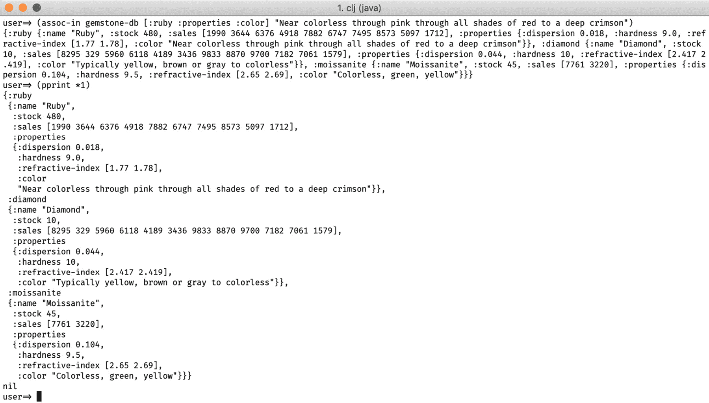

# 第二章：2. 数据类型和不可变性

概述

在本章中，我们首先探讨不可变性的概念及其在现代程序中的相关性。然后我们检查简单的数据类型，如字符串、数字和布尔值，强调在不同环境（如 Clojure 和 ClojureScript）中的细微差异。在完成第一个练习后，我们继续探讨更复杂的数据类型，如列表、向量、映射和集合，并在不同情况下学习如何使用它们。在触及集合和序列抽象之后，我们学习处理嵌套数据结构的新技术，最后转向最终活动：实现我们自己的内存数据库。

到本章结束时，你将能够使用 Clojure 中常用的数据类型。

# 简介

在过去的几十年里，计算机硬件发生了巨大的变化。在典型的计算机上，存储和内存容量与 20 世纪 80 年代初相比都增加了百万倍。然而，软件开发中的标准行业实践和主流编程方式并没有太大的不同。像 C++、Java、Python 和 Ruby 这样的编程语言仍然通常鼓励你就地更改事物，并使用变量来修改程序的状态，也就是说，就像我们在内存最少的计算机上编程一样。然而，在我们追求效率、更好的语言和更好的工具的过程中，我们转向了高级语言。我们希望离机器代码更远。我们希望编写更少的代码，让计算机做繁琐的工作。

我们不再需要考虑计算机的内存，比如信息存储在哪里，它是否安全且可共享，就像我们不想知道 CPU 中指令的顺序一样。这会分散我们试图解决的问题的注意力，这些问题已经足够复杂。如果你曾经尝试在之前提到的语言中做一些多线程操作，你就会知道线程间共享数据的痛苦。尽管如此，利用多核 CPU 和多线程应用程序是优化现代程序性能的一个关键部分。

在 Clojure 中，我们几乎完全使用不可变数据类型。它们可以安全地共享，易于制造，并提高我们源代码的可读性。Clojure 提供了编写函数式编程范式程序的必要工具：一等公民函数，我们将在下一章中了解到，以及避免使用不可变数据类型来修改和共享应用程序的状态。

让我们翻阅一下词典，查找“不可变”的定义，“*不可变：不能改变；永远不会改变*”。这并不意味着信息不能随时间改变，但我们把这些修改记录为一系列新的值。“更新”不可变数据结构提供了一个从原始值派生的新值。然而，原始值保持不变——那些保留自身先前版本的数据结构被称为持久数据结构。

直觉上，我们可能会认为这样的持久数据结构会对性能产生负面影响，但事实并非如此。它们针对性能进行了优化，并且像结构共享这样的技术将所有操作的时间复杂度接近于经典的、可变的实现。

从另一个角度来看，除非你正在编写一个需要非凡高性能的应用程序，例如视频游戏，否则使用不可变数据结构的优势远远超过性能上的小损失。

# 简单数据类型

数据类型指定了数据块所持有的值的类型；它是分类数据的基本方式。不同的类型允许不同的操作：我们可以连接字符串，乘以数字，以及使用布尔值进行逻辑代数运算。由于 Clojure 非常注重实用性，我们在 Clojure 中并不显式地为值分配类型，但这些值仍然有类型。

Clojure 是一种托管语言，在 Java、JavaScript 和.NET 中有三个显著的、主要的实现。作为一个托管语言，这是一个有用的特性，它允许 Clojure 程序在不同的环境中运行并利用其宿主环境的生态系统。关于数据类型，这意味着每个实现都有不同的底层数据类型，但不用担心，这些只是实现细节。作为一个 Clojure 程序员，这并没有太大的区别，如果你知道如何在 Clojure 中做某事，你很可能也知道如何在，比如说，ClojureScript 中做同样的事情。

在这个主题中，我们将介绍 Clojure 的简单数据类型。以下是本节中查看的数据类型列表。请注意，以下类型都是不可变的：

+   字符串

+   数字

+   布尔值

+   关键字

+   空值（nil）

## 字符串

字符串是表示文本的字符序列。我们从*第一章*，*Hello REPL*的第一个练习开始就一直在使用和处理字符串。

你可以通过简单地用双引号（`"`）包裹字符来创建字符串：

```java
user=> "I am a String"
"I am a String"
user=> "I am immutable"
"I am immutable"
```

字符串字面量只能用双引号创建，如果你需要在字符串中使用双引号，你可以用反斜杠字符（`\`）来转义它们：

```java
user=> (println "\"The measure of intelligence is the ability to change\" - Albert Einstein")
"The measure of intelligence is the ability to change" - Albert Einstein
nil
```

字符串不能被改变；它们是不可变的。任何声称可以转换字符串的函数都会产生一个新的值：

```java
user=> (def silly-string "I am Immutable. I am a silly String")
#'user/silly-string
user=> (clojure.string/replace silly-string "silly" "clever")
"I am Immutable. I am a clever String"
user=> silly-string
"I am Immutable. I am a silly String"
```

在前面的例子中，对 `silly-string` 调用 `clojure.string/replace` 返回了一个新的字符串，其中 "silly" 被替换为 "clever"。然而，当再次评估 `silly-string` 时，我们可以看到值没有改变。函数返回了一个不同的值，并且没有改变原始字符串。

虽然字符串通常是一个表示文本的单个数据单元，但字符串也是字符的集合。在 Clojure 的 JVM 实现中，字符串是 `java.lang.String` Java 类型，它们被实现为 `java.lang.Character` Java 类型的集合，如下面的命令所示，它返回一个字符：

```java
user=> (first "a collection of characters")
\a
user=> (type *1)
java.lang.Character
```

`first` 返回集合的第一个元素。在这里，字符的文表示法是`\a`。`type` 函数返回给定值的类型字符串表示。记住，我们可以使用 `*1` 来检索 REPL 中最后返回的值，所以 `*1` 的结果是 `\a`。

有趣的是，在 ClojureScript 中，字符串是一组单字符字符串的集合，因为 JavaScript 中没有字符类型。以下是一个类似的 ClojureScript REPL 中的例子：

```java
cljs.user=> (last "a collection of 1 character strings")
"s"
cljs.user=> (type *1)
#object[String]
```

与 Clojure REPL 一样，`type` 返回数据类型的字符串表示。这次，在 ClojureScript 中，`last` 函数（返回字符串的最后一个字符）返回的是 `#object[String]` 类型，这意味着一个 JavaScript 字符串。

您可以在核心命名空间中找到一些用于操作字符串的常见函数，例如 `str`，我们在 *第一章*，*Hello REPL!* 中使用它来连接（将多个字符串组合成一个字符串）：

```java
user=> (str "That's the way you " "con" "ca" "te" "nate")
"That's the way you concatenate"
user=> (str *1 " - " silly-string)
"That's the way you concatenate - I am Immutable. I am a silly String"
```

大多数字符串操作函数都可以在 `clojure.string` 命名空间中找到。以下是使用 REPL `dir` 函数列出的一些函数：

```java
user=> (dir clojure.string)
blank?
capitalize
ends-with?
escape
includes?
index-of
join
last-index-of
lower-case
re-quote-replacement
replace
replace-first
reverse
split
split-lines
starts-with?
trim
trim-newline
triml
trimr
upper-case
```

作为提醒，这是您如何使用特定命名空间中的函数：

```java
user=> (clojure.string/includes? "potatoes" "toes")
true
```

我们不会涵盖所有的字符串函数，但现在您可以随意尝试它们。您始终可以使用 `doc` 函数查找前面列表中字符串函数的文档。

## 数字

Clojure 对数字有很好的支持，您很可能不需要担心底层类型，因为 Clojure 将处理几乎所有事情。然而，重要的是要注意，在 Clojure 和 ClojureScript 之间，在这方面有一些差异。

在 Clojure 中，默认情况下，自然数以 `java.lang.Long` Java 类型实现，除非数字太大而无法适合 `Long`。在这种情况下，它被类型化为 `clojure.lang.BigInt`：

```java
user=> (type 1)
java.lang.Long
user=> (type 1000000000000000000)
java.lang.Long
user=> (type 10000000000000000000)
clojure.lang.BigInt
```

注意，在前面的例子中，数字太大，无法适合 `java.lang.Long` Java 类型，因此被隐式地类型化为 `clojure.lang.BigInt`。

精确比例在 Clojure 中表示为 "Ratio" 类型，它有文表示法。5/4 不是一个精确比例，所以输出是比例本身：

```java
user=> 5/4
5/4
```

将 `3` 除以 `4` 的结果可以用比例 3/4 来表示：

```java
user=> (/ 3 4)
3/4
user=> (type 3/4)
clojure.lang.Ratio
```

`4/4` 等于 `1`，其计算如下：

```java
user=> 4/4
1
```

小数是“双精度”浮点数：

```java
user=> 1.2
1.2
```

如果我们再次进行 3 除以 4 的除法，但这次混合使用“Double”类型，我们将不会得到一个比率作为结果：

```java
user=> (/ 3 4.0)
0.75
```

这是因为在 Clojure 中，浮点数是“传染性”的。任何涉及浮点数的操作都会导致得到一个浮点数或双精度浮点数：

```java
user=> (* 1.0 2)
2.0
user=> (type (* 1.0 2))
java.lang.Double
```

然而，在 ClojureScript 中，数字只是“JavaScript 数字”，它们都是双精度浮点数。JavaScript 没有定义像 Java 和一些其他编程语言那样的不同数字类型（例如，`long`、`integer`和`short`）：

```java
cljs.user=> 1
1
cljs.user=> 1.2
1.2
cljs.user=> (/ 3 4)
0.75
cljs.user=> 3/4
0.75
cljs.user=> (* 1.0 2)
2
```

注意，这次，任何操作都会返回一个浮点数。`1`或`2`没有小数分隔只是格式上的便利。

我们可以通过使用`type`函数来确保所有这些数字都是 JavaScript 数字（双精度，浮点数）：

```java
cljs.user=> (type 1)
#object[Number]
cljs.user=> (type 1.2)
#object[Number]
cljs.user=> (type 3/4)
#object[Number]
```

如果你需要做比简单算术更复杂的事情，你可以使用 Java 或 JavaScript 的`math`库，它们非常相似，除了少数例外。

你将在第九章*主机平台互操作性*（如何与主机平台及其生态系统交互）中了解更多关于主机平台互操作性的内容，但该章节中的示例将帮助你开始做一些更复杂的数学运算，以及使用`math`库：

从一个常量中读取值可以这样操作：

```java
user=> Math/PI
3.141592653589793
```

调用一个函数，就像通常的 Clojure 函数一样，可以这样操作：

```java
user=> (Math/random)
0.25127992428738254
user=> (Math/sqrt 9)
3.0
user=> (Math/round 0.7)
1
```

## 练习 2.01：混淆机

你被一个秘密政府机构联系，要求开发一个算法，将文本编码成一个只有算法所有者才能解码的秘密字符串。显然，他们不相信其他安全机制，如 SSL，而只愿意用他们自己的专有技术来传输敏感信息。

你需要开发一个`encode`函数和一个`decode`函数。`encode`函数应该用不易猜测的数字替换字母。为此，每个字母将取其在 ASCII 表中的字符数值，然后加上另一个数字（要编码的句子中的单词数），最后计算该数字的平方值。`decode`函数应该允许用户恢复到原始字符串。一个高级别的机构成员提出了这个算法，所以他们相信它非常安全。

在这个练习中，我们将通过构建一个混淆机来实践我们关于字符串和数字学到的一些知识：

1.  启动你的 REPL 并查找`clojure.string/replace`函数的文档：

    ```java
    user=> (doc clojure.string/replace)
    -------------------------
    clojure.string/replace
    ([s match replacement])
      Replaces all instance of match with replacement in s.
       match/replacement can be:
       string / string
       char / char
       pattern / (string or function of match).
       See also replace-first.
       The replacement is literal (i.e. none of its characters are treated
       specially) for all cases above except pattern / string.
       For pattern / string, $1, $2, etc. in the replacement string are
       substituted with the string that matched the corresponding
       parenthesized group in the pattern.  If you wish your replacement
       string r to be used literally, use (re-quote-replacement r) as the
       replacement argument.  See also documentation for
       java.util.regex.Matcher's appendReplacement method.
       Example:
       (clojure.string/replace "Almost Pig Latin" #"\b(\w)(\w+)\b" "$2$1ay")
       -> "lmostAay igPay atinLay"
    ```

    注意，`replace`函数可以接受一个模式和匹配结果的函数作为参数。我们目前还不知道如何遍历集合，但使用带有模式和“替换函数”的`replace`函数应该可以完成任务。

1.  尝试使用`#"\w"`模式（表示单词字符）的`replace`函数，将其替换为`!`字符，并观察结果：

    ```java
    user=> (clojure.string/replace "Hello World" #"\w" "!")
    ```

    输出如下：

    ```java
    "!!!!! !!!!!"
    ```

1.  尝试使用相同的模式使用`replace`函数，但这次传递一个匿名函数，该函数接受匹配的字母作为参数：

    ```java
    user=> (clojure.string/replace "Hello World" #"\w" (fn [letter] (do (println letter) "!")))
    ```

    输出如下：

    ```java
    H
    e
    l
    l
    o
    W
    o
    r
    l
    d
    "!!!!! !!!!!"
    ```

    观察到函数为每个字母调用了，将匹配打印到控制台，并最终返回用`!`字符替换的字符串。看起来我们应该能够在那个替换函数中编写我们的编码逻辑。

1.  现在我们来看看如何将一个字符转换为数字。我们可以使用`int`函数，它将它的参数强制转换为整数。它可以这样使用：

    ```java
    user=> (int \a)
    97
    ```

1.  “替换函数”似乎将接受一个字符串作为参数，所以让我们将我们的字符串转换为字符。使用`char-array`函数结合`first`将我们的字符串转换为字符，如下所示：

    ```java
    user=> (first (char-array "a"))
    \a
    ```

1.  现在，如果我们结合之前的步骤，并计算字符的数字的平方值，我们应该接近我们的混淆目标。将之前编写的代码组合起来，从字符串中获取字符代码并使用`Math/pow`函数计算其平方值，如下所示：

    ```java
    user=> (Math/pow (int (first (char-array "a"))) 2)
    9409.0
    ```

1.  现在我们将这个结果转换成`replace`函数将返回的字符串。首先，通过将结果强制转换为`int`来删除小数部分，并在`encode-letter`函数中将这些内容组合起来，如下所示：

    ```java
    user=>
    (defn encode-letter
      [s]
      (let [code (Math/pow (int (first (char-array s))) 2)]
        (str (int code))))
    #'user/encode-letter
    user=> (encode-letter "a")
    "9409"
    ```

    太好了！它似乎可以工作。现在让我们测试我们的函数作为`replace`函数的一部分。

1.  创建`encode`函数，它使用`clojure.string/replace`以及我们的`encode-letter`函数：

    ```java
    user=>
    (defn encode
      [s]
      (clojure.string/replace s #"\w" encode-letter))
    #'user/encode
    user=> (encode "Hello World")
    "518410201116641166412321 756912321129961166410000"
    ```

    它似乎可以工作，但如果没有能够单独识别每个字母，生成的字符串将很难解码。

    我们还有另一件事没有考虑到：`encode`函数应该在计算平方值之前添加一个任意数到代码中。

1.  首先，在`encode-letter`函数中添加一个分隔符作为部分，例如`#`字符，这样我们就可以单独识别每个字母。其次，给`encode-letter`函数添加一个额外的参数，这个参数需要在计算平方值之前添加：

    ```java
    user=>
    (defn encode-letter
      [s x]
      (let [code (Math/pow (+ x (int (first (char-array s)))) 2)]
        (str "#" (int code))))
    #'user/encode-letter
    ```

1.  现在，再次测试`encode`函数：

    ```java
    user=> (encode "Hello World")
    Execution error (ArityException) at user/encode (REPL:3).
    Wrong number of args (1) passed to: user/encode-letter
    ```

    我们的`encode`函数现在失败了，因为它期望一个额外的参数。

1.  修改`encode`函数以计算要混淆的文本中的单词数量，并将其传递给`encode-letter`函数。你可以使用`clojure.string/split`函数和空格，如下所示，来计算单词数量：

    ```java
    user=>
    (defn encode
      [s]
      (let [number-of-words (count (clojure.string/split s #" "))]
        (clojure.string/replace s #"\w" (fn [s] (encode-letter s number-of-words)))))
    #'user/encode
    ```

1.  用几个例子尝试你新创建的函数，并确保它正确地混淆字符串：

    ```java
    user=> (encode "Super secret")
    "#7225#14161#12996#10609#13456 #13689#10609#10201#13456#10609#13924"
    user=> (encode "Super secret message")
    "#7396#14400#13225#10816#13689 #13924#10816#10404#13689#10816#14161 #12544#10816#13924#13924#10000#11236#10816"
    ```

    这是一个多么美丽、难以理解、混淆的字符串——做得好！注意，对于相同的字母，根据要编码的短语中的单词数量，数字是不同的。它似乎按照规范工作！

    我们现在可以开始编写 `decode` 函数，我们将需要使用以下函数：

    `Math/sqrt` 用于获取一个数字的平方根值。

    `char` 用于从字符代码（一个数字）中检索一个字母。

    `subs` 作为子字符串，用于获取字符串的一部分（并去除我们的 `#` 分隔符）。

    `Integer/parseInt` 用于将字符串转换为整数。

1.  使用前面提到的函数的组合编写 `decode` 函数，以解码一个加密字符：

    ```java
    user=>
    (defn decode-letter
      [x y]
      (let [number (Integer/parseInt (subs x 1))
            letter (char (- (Math/sqrt number) y))]
      (str letter)))
    #'user/decode-letter
    ```

1.  最后，编写 `decode` 函数，它与 `encode` 函数类似，但应该使用 `decode-letter` 而不是 `encode-letter`：

    ```java
    user=>
    (defn decode [s]
      (let [number-of-words (count (clojure.string/split s #" "))]
        (clojure.string/replace s #"\#\d+" (fn [s] (decode-letter s number-of-words)))))
    #'user/decode
    ```

1.  测试你的函数，确保它们都能正常工作：

    ```java
    user=> (encode "If you want to keep a secret, you must also hide it from yourself.")
    ```

    输出如下：

    ```java
    "#7569#13456 #18225#15625#17161 #17689#12321#15376#16900 #16900#15625 #14641#13225#13225#15876 #12321 #16641#13225#12769#16384#13225#16900, #18225#15625#17161 #15129#17161#16641#16900 #12321#14884#16641#15625 #13924#14161#12996#13225 #14161#16900 #13456#16384#15625#15129 #18225#15625#17161#16384#16641#13225#14884#13456."
    user=> (decode *1)
    "If you want to keep a secret, you must also hide it from yourself."
    ```

在这个练习中，我们通过创建一个编码系统来实践了处理数字和字符串。现在我们可以继续学习其他数据类型，从布尔值开始。

## 布尔值

在 Clojure 中，布尔值以 Java 的 `java.lang.Boolean` 实现，在 ClojureScript 中以 JavaScript 的 "Boolean" 实现。它们的值可以是 `true` 或 `false`，它们的字面表示法仅仅是小写的 `true` 和 `false`。

## 符号

符号是标识符，它们指向其他东西。我们已经在使用符号创建绑定或调用函数时使用过符号。例如，当使用 `def` 时，第一个参数是一个将指向一个值的符号，当调用像 `+` 这样的函数时，`+` 是一个指向实现加法的函数的符号。考虑以下示例：

```java
user=> (def foo "bar")
#'user/foo
user=> foo
"bar"
user=> (defn add-2 [x] (+ x 2))
#'user/add-2
user=> add-2
#object[user$add_2 0x4e858e0a "user$add_2@4e858e0a"]
```

在这里，我们创建了 `user/foo` 符号，它指向 `"bar"` 字符串，以及 `add-2` 符号，它指向将 2 加到其参数上的函数。我们是在用户命名空间中创建这些符号的，因此有 `/` 的表示法：`user/foo`。

如果我们尝试评估一个未定义的符号，我们会得到一个错误：

```java
user=> marmalade
Syntax error compiling at (REPL:0:0).
Unable to resolve symbol: marmalade in this context
```

在 *第一章* 的 *REPL 基础* 主题 *Hello REPL!* 中，我们能够使用以下函数，因为它们绑定到特定的符号：

```java
user=> str
#object[clojure.core$str 0x7bb6ab3a "clojure.core$str@7bb6ab3a"]
user=> +
#object[clojure.core$_PLUS_ 0x1c3146bc "clojure.core$_PLUS_@1c3146bc"]
user=> clojure.string/replace
#object[clojure.string$replace 0xf478a81 "clojure.string$replace@f478a81"]
```

这些类似乱码的值是函数的字符串表示，因为我们要求的是符号绑定的值，而不是调用函数（用括号包裹它们）。

## 关键字

你可以将关键字视为某种特殊的常量字符串。关键字是 Clojure 的一个很好的补充，因为它们轻量级且易于使用和创建。你只需要在单词的开头使用冒号字符 `:` 来创建一个关键字：

```java
user=> :foo
:foo
user=> :another_keyword
:another_keyword
```

它们不像符号那样指向其他东西；正如前一个示例所示，当被评估时，它们只是返回自身。关键字通常用作键值关联映射中的键，正如我们将在关于集合的下一个主题中看到的那样。

在本节中，我们介绍了简单的数据类型，如字符串、数字、布尔值、符号和关键字。我们强调了它们的底层实现依赖于宿主平台，因为 Clojure 是一种托管语言。在下一节中，我们将看到这些值如何聚合成为集合。

# 集合

Clojure 是一种函数式编程语言，我们专注于以函数评估的方式来构建程序的计算，而不是构建自定义数据类型及其相关行为。在另一种主导的编程范式，面向对象编程中，程序员定义数据类型及其上的操作。对象应该封装数据并通过传递消息进行交互。但不幸的是，有一种趋势是创建类和新类型的对象来定制数据形状，而不是使用更通用的数据结构，这导致需要创建特定的方法来访问和修改数据。我们必须想出合适的名字，这很困难，然后我们在程序中传递对象的实例。我们不断创建新的类，但更多的代码意味着更多的错误。这是一场灾难；它是一场代码爆炸，代码非常具体且很少重用。

当然，并非所有地方都是这样，你也可以编写干净的面向对象代码，其中对象是它们设计用于的功能的小黑盒。然而，作为程序员，无论是通过使用其他库还是维护遗留代码库，我们大部分时间都在处理他人的代码。

在函数式编程中，特别是在 Clojure 中，我们倾向于只使用少数几种数据类型。这些类型是通用的且功能强大，是每个其他“Clojurian”（Clojure 程序员）都已经了解并掌握的类型。

集合是能够包含多个元素并描述这些元素之间相互关系的数据类型。你应该了解的四个主要集合数据结构是**映射（Maps**）、**集合（Sets**）、**向量（Vectors**）和**列表（Lists**）。还有更多可供选择的数据结构，包括由你的宿主平台（例如 Java 或 JavaScript）或其他库提供的数据结构，但那四个是你在 Clojure 中做事的基础。

*"数据为王。如果你选择了正确的数据结构并且组织得当，算法几乎总是显而易见的。数据结构，而非算法，是编程的核心。" - Rob Pike 的编程规则第 5 条。*

## 映射（Maps）

映射（Map）是一组键值对。Clojure 以持久和不可变的方式提供了常规的 HashMap，同时也提供了 SortedMap。

HashMap 被称为“Hash”，因为它们会对键创建哈希并映射到给定的值。查找以及其他常见操作（如`insert`和`delete`）都很快。

HashMap 在 Clojure 中用得很多，特别是在需要将一些属性关联到一些值来表示实体时。SortedMap 与 HashMap 不同，因为它们保留了键的顺序；否则，它们具有相同的接口，并且以相同的方式使用。SortedMap 并不常见，所以让我们专注于 HashMap。

你可以使用花括号字面量语法来创建 HashMap。以下是一个包含三个键值对的映射，键是`:artist`、`:song`和`:year`关键字：

```java
user=> {:artist "David Bowtie" :song "The Man Who Mapped the World" :year 1970}
{:artist "David Bowtie", :song "The Man Who Mapped the World", :year 1970}
```

你可能已经注意到在前面的例子中，映射中的键值对是通过空格分隔的，但 Clojure 会对其进行评估，并返回一个用逗号分隔键值对的映射。与其他集合一样，你可以选择使用空格或逗号来分隔每个条目。对于映射，没有最佳实践，如果你认为使用逗号可以提高映射的可读性，那么就使用逗号；否则，简单地省略它们。你也可以使用换行符来分隔条目。

这里还有一个用逗号分隔的条目编写的映射：

```java
user=> {:artist "David Bowtie", :song "Comma Oddity", :year 1969}
{:artist "David Bowtie", :song "Comma Oddity", :year 1969}
```

注意，值可以是任何类型，而不仅仅是简单的字符串和数字，还可以是向量甚至是其他映射，允许你创建嵌套数据结构并按如下方式组织信息：

```java
user=>
  {
  "David Bowtie" {
    "The Man Who Mapped the World" {:year 1970, :duration "4:01"}
    "Comma Oddity" {:year 1969, :duration "5:19"}
  }
  "Crosby Stills Hash" {
    "Helplessly Mapping" {:year 1969, :duration "2:38"}
    "Almost Cut My Hair" {:year 1970, :duration "4:29", :featuring ["Neil Young", "Rich Hickey"]}
  }
}
{"David Bowtie" {"The Man Who Mapped the World" {:year 1970, :duration "4:01"}, "Comma Oddity" {:year 1969, :duration "5:19"}}, "Crosby Stills Hash" {"Helplessly Mapping" {:year 1969, :duration "2:38"}, "Almost Cut My Hair" {:year 1970, :duration "4:29", :featuring ["Neil Young" "Rich Hickey"]}}}
```

键也可以是不同类型，所以你可以有字符串、数字，甚至是其他类型的键；然而，我们通常使用关键字。

创建映射的另一种方式是使用`hash-map`函数，如下传递参数对：

```java
user=> (hash-map :a 1 :b 2 :c 3)
{:c 3, :b 2, :a 1}
```

当可能时，选择使用花括号字面量语法，但当 HashMap 是程序生成时，`hash-map`函数会很有用。

映射键是唯一的：

```java
user=> {:name "Lucy" :age 32 :name "Jon"}
Syntax error reading source at (REPL:6:35).
Duplicate key: :name
```

由于前一个字面量映射中`:name`键出现了两次，因此抛出了一个异常。

然而，不同的键可以有相同的值：

```java
user=> {:name "Lucy" :age 32 :number-of-teeth 32}
{:name "Lucy", :age 32, :number-of-teeth 32}
```

注意到`age`和`number-of-teeth`的值相同，这至少是有效且方便的。

既然你已经知道了如何创建映射，那么是时候进行一些实践了。

## 练习 2.02：使用映射

在这个练习中，我们将学习如何访问和修改简单的映射：

1.  启动你的 REPL 并创建一个映射：

    ```java
    user=> (def favorite-fruit {:name "Kiwi", :color "Green", :kcal_per_100g 61 :distinguish_mark "Hairy"})
    #'user/favorite-fruit
    ```

1.  你可以使用`get`函数从映射中读取条目。尝试查找一个或两个键，如下所示：

    ```java
    user=> (get favorite-fruit :name)
    "Kiwi"
    user=> (get favorite-fruit :color)
    "Green"
    ```

1.  如果找不到给定键的值，`get`会返回`nil`，但你可以在`get`的第三个参数中指定一个回退值：

    ```java
    user=> (get favorite-fruit :taste)
    nil
    user=> (get favorite-fruit :taste "Very good 8/10")
    "Very good 8/10"
    user=> (get favorite-fruit :kcal_per_100g 0)
    61
    ```

1.  映射和关键字有特殊的能力可以作为函数使用。当它们位于“操作位置”（列表的第一个项目）时，它们会被调用为一个函数，可以用来在映射中查找值。现在尝试使用`favorite-fruit`映射作为函数来试试看：

    ```java
    user=> (favorite-fruit :color)
    "Green"
    ```

1.  尝试使用关键字作为函数在映射中查找值：

    ```java
    user=> (:color favorite-fruit)
    "Green"
    ```

    与`get`函数一样，当找不到键时，这些获取值的方式会返回`nil`，并且你可以传递一个额外的参数来提供一个回退值。

1.  为`favorite-fruit`映射中不存在的键提供一个回退值：

    ```java
    user=> (:shape favorite-fruit "egg-like")
    "egg-like"
    ```

1.  我们希望将这个值存储在映射中。使用`assoc`将新的键`:shape`与新的值`"egg-like"`关联到我们的映射中：

    ```java
    user=> (assoc favorite-fruit :shape "egg-like")
    {:name "Kiwi", :color "Green", :kcal_per_100g 61, :distinguish_mark "Hairy", :shape "egg-like"}
    ```

    `assoc`操作返回一个新的映射，包含我们之前的关键值对以及我们刚刚添加的新关联。

1.  评估`favorite-fruit`并注意它保持不变：

    ```java
    user=> favorite-fruit
    {:name "Kiwi", :color "Green", :kcal_per_100g 61, :distinguish_mark "Hairy"}
    ```

    由于映射是不可变的，绑定到`favorite-fruit`符号的值没有改变。通过使用`assoc`，我们创建了一个新的映射版本。

    现在，F3C（“Funny Fruity Fruits Consortium”）已经撤销了之前的裁决，并在他们对水果规格的季度审查中确定，奇异果的颜色应该是棕色而不是绿色。为了确保您的应用程序符合 F3C 标准，您决定使用新值更新您的系统。

1.  通过将新的值关联到`:color`键来改变`favorite-fruit`的颜色：

    ```java
    user=> (assoc favorite-fruit :color "Brown")
    {:name "Kiwi", :color "Brown", :kcal_per_100g 61, :distinguish_mark "Hairy"}
    ```

    当一个键已经存在时，`assoc`会替换现有的值，因为 HashMaps 不能有重复的键。

1.  如果我们想要添加更多结构化信息，我们可以添加一个映射作为值。在我们的`Kiwi`映射中添加生产信息作为嵌套映射：

    ```java
    user=> (assoc favorite-fruit :yearly_production_in_tonnes {:china 2025000 :italy 541000 :new_zealand 412000 :iran 311000 :chile 225000})
    {:name "Kiwi", :color "Green", :kcal_per_100g 61, :distinguish_mark "Hairy", :yearly_production_in_tonnes {:china 2025000, :italy 541000, :new_zealand 412000, :iran 311000, :chile 225000}}
    ```

    使用嵌套映射或其他数据类型来表示结构化信息是常见的做法。

    *新的研究发现，奇异果所含的卡路里比之前认为的要少，为了保持合规，F3C 要求组织将每 100 克卡路里的当前值减少 1。*

1.  使用`assoc`函数按如下方式递减`kcal_per_100g`：

    ```java
    user=> (assoc favorite-fruit :kcal_per_100g (- (:kcal_per_100g favorite-fruit) 1))
    {:name "Kiwi", :color "Green", :kcal_per_100g 60, :distinguish_mark "Hairy"}
    ```

    太棒了！它工作了，但还有更优雅的方式来处理这类操作。当你需要根据之前的值在映射中更改一个值时，你可以使用`update`函数。虽然`assoc`函数允许你将一个全新的值关联到一个键上，但`update`允许你根据键的先前值计算一个新的值。`update`函数接受一个函数作为其第三个参数。

1.  使用`update`函数和`dec`递减`kcal_per_100g`，如下所示：

    ```java
    user=> (update favorite-fruit :kcal_per_100g dec)
    {:name "Kiwi", :color "Green", :kcal_per_100g 60, :distinguish_mark "Hairy"}
    ```

    注意`:kcal_per_100g`的值是如何从`61`变为`60`的。

1.  你也可以向提供的更新函数传递参数；例如，如果我们想将`:kcal_per_100g`降低 10 而不是 1，我们可以使用减法函数`-`，并编写以下内容：

    ```java
    user=> (update favorite-fruit :kcal_per_100g - 10)
    {:name "Kiwi", :color "Green", :kcal_per_100g 51, :distinguish_mark "Hairy"}
    ```

    与`assoc`类似，`update`不会改变不可变的映射；它返回一个新的映射。

    这个例子说明了函数作为“一等公民”的强大功能：我们像对待典型值一样对待它们；在这种情况下，一个函数被作为参数传递给另一个函数。我们将在下一章中详细介绍这个概念，同时更深入地探讨函数。

1.  最后，使用`dissoc`（意为“分离”）从映射中删除一个或多个元素：

    ```java
    user=> (dissoc favorite-fruit :distinguish_mark)
    {:name "Kiwi", :color "Green", :kcal_per_100g 61}
    user=> (dissoc favorite-fruit :kcal_per_100g :color)
    {:name "Kiwi", :distinguish_mark "Hairy"}
    ```

干得好！现在我们知道了如何使用映射，是时候转向下一个数据结构：集合。

## 集合

集合是一组唯一的值。Clojure 提供了 HashSet 和 SortedSet。HashSet 的实现是作为 HashMap，其中每个条目的键和值是相同的。

哈希集合在 Clojure 中相当常见，有花括号表示的哈希字面表示法，例如：

```java
user=> #{1 2 3 4 5}
#{1 4 3 2 5}
```

在前面的表达式中，注意当集合被评估时，它不会以在字面表达式中定义的顺序返回集合的元素。这是因为 HashSet 的内部结构。值被转换为一个唯一的哈希，这允许快速访问但不保留插入顺序。如果您关心元素添加的顺序，则需要使用不同的数据结构，例如，一个向量（我们很快就会了解到）。使用 HashSet 来表示逻辑上属于一起的元素，例如，唯一值的枚举。

与映射一样，集合不能有重复条目：

```java
user=> #{:a :a :b :c}
Syntax error reading source at (REPL:135:15).
Duplicate key: :a
```

可以通过将值传递给 `hash-set` 函数从值列表创建哈希集合：

```java
user=> (hash-set :a :b :c :d)
#{:c :b :d :a}
```

哈希集合也可以通过 `set` 函数从另一个集合创建。让我们从一个向量创建一个 HashSet：

```java
user=> (set [:a :b :c])
#{:c :b :a}
```

注意向量中定义的顺序丢失了。

`set` 函数在将一组非唯一值转换为使用 `set` 函数创建的集合时不会抛出错误，这对于去重值很有用：

```java
user=> (set ["No" "Copy" "Cats" "Cats" "Please"])
#{"Copy" "Please" "Cats" "No"}
```

注意其中一个重复的字符串 `"Cats"` 是如何被静默移除以创建集合的。

可以使用 `sorted-set` 函数创建有序集合，并且没有像哈希集合那样的字面语法：

```java
user=> (sorted-set "No" "Copy" "Cats" "Cats" "Please")
#{"Cats" "Copy" "No" "Please"}
```

注意它们是以与哈希集合相同的方式打印的，只是顺序看起来不同。有序集合是根据它们包含的元素的自然顺序而不是创建时提供的参数顺序进行排序的。您也可以提供自己的排序函数，但我们将专注于哈希集合，因为它们更常见且更有用。

## 练习 2.03：使用集合

在这个练习中，我们将使用哈希集合来表示支持的货币集合：

注意

对于货币列表，哈希集合是一个很好的数据结构选择，因为我们通常希望存储一个唯一值的集合并高效地检查包含。此外，货币的顺序可能并不重要。如果您想将更多数据与货币关联（例如 ISO 代码和国家），那么您更有可能使用嵌套映射来表示每个货币作为一个实体，以唯一的 ISO 代码作为键。最终，数据结构的选择取决于您计划如何使用数据。在这个练习中，我们只想读取它，检查包含，并向我们的集合添加项目。

1.  启动一个 REPL。创建一个集合并将其绑定到 `supported-currencies` 符号：

    ```java
    user=> (def supported-currencies #{"Dollar" "Japanese yen" "Euro" "Indian rupee" "British pound"})
    #'user/supported-currencies
    ```

1.  与映射一样，您可以使用 `get` 从集合中检索条目，当条目存在于集合中时返回作为参数传递的条目。使用 `get` 来检索现有条目以及缺失条目：

    ```java
    user=> (get supported-currencies "Dollar")
    "Dollar"
    user=> (get supported-currencies "Swiss franc")
    nil
    ```

1.  很可能您只想检查包含，因此 `contains?` 在语义上更好。使用 `contains?` 而不是 `get` 来检查包含：

    ```java
    user=> (contains? supported-currencies "Dollar")
    true
    user=> (contains? supported-currencies "Swiss franc")
    false
    ```

    注意到 `contains?` 返回一个布尔值，而 `get` 返回查找值或 `nil`（当未找到时）。在集合中查找 `nil` 的边缘情况将返回 `nil`，无论是找到还是未找到。在这种情况下，`contains?` 自然更合适。

1.  与映射、集合和关键字一样，可以使用它们作为函数来检查包含。使用 `supported-currencies` 集合作为函数在集合中查找值：

    ```java
    user=> (supported-currencies "Swiss franc")
    nil
    ```

    `"瑞士法郎"` 不在 `supported-currencies` 集合中；因此，前面的返回值是 `nil`。

1.  如果你尝试使用 `"Dollar"` 字符串作为一个函数在集合中查找自身，你会得到以下错误：

    ```java
    user=> ("Dollar" supported-currencies)
    Execution error (ClassCastException) at user/eval7 (REPL:1).
    java.lang.String cannot be cast to clojure.lang.IFn
    ```

    我们不能使用字符串作为函数在集合或映射中查找值。这是为什么在可能的情况下，关键字在集合和映射中是一个更好的选择之一。

1.  要向集合中添加一个条目，请使用 `conj` 函数，就像 "conjoin" 一样：

    ```java
    user=> (conj supported-currencies "Monopoly Money")
    #{"Japanese yen" "Euro" "Dollar" "Monopoly Money" "Indian rupee" "British pound"}
    ```

1.  你可以向 `conj` 函数传递多个项目。尝试向我们的哈希集合添加多个货币：

    ```java
    user=> (conj supported-currencies "Monopoly Money" "Gold dragon" "Gil")
    #{"Japanese yen" "Euro" "Dollar" "Monopoly Money" "Indian rupee" "Gold dragon" "British pound" "Gil"}
    ```

1.  最后，你可以使用 `disj` 函数移除一个或多个项目，就像 "disjoin" 一样：

    ```java
    user=> (disj supported-currencies "Dollar" "British pound")
    #{"Japanese yen" "Euro" "Indian rupee"}
    ```

集合的部分就到这里！如果你需要，你可以在 `clojure.set` 命名空间中找到更多用于处理集合的函数（例如并集和交集），但这是一种更高级的使用方式，所以让我们继续到下一个集合：向量。

## 向量

向量是 Clojure 中广泛使用的一种集合类型。你可以将向量视为功能强大的不可变数组。它们是可以通过它们的整数索引（从 0 开始）高效访问的值集合，并且它们保持项目插入的顺序以及重复项。

当你需要按顺序存储和读取元素，并且不介意重复元素时，请使用向量。例如，网页浏览器的历史记录可能是一个不错的选择，因为你可能希望轻松地返回到最近的页面，但也可以使用向量的索引删除较旧的元素，并且其中可能存在重复的元素。在这种情况下，映射或集合不会有很大帮助，因为你没有特定的键来通过它查找值。

向量有方括号（`[]`）的文本表示法：

```java
user=> [1 2 3]
[1 2 3]
```

向量也可以通过 `vector` 函数后跟一个项目列表作为参数来创建：

```java
user=> (vector 10 15 2 15 0)
[10 15 2 15 0]
```

你可以使用 `vec` 函数从另一个集合创建一个向量；例如，以下表达式将哈希集合转换为向量：

```java
user=> (vec #{1 2 3})
[1 3 2]
```

与其他集合一样，向量也可以包含不同类型的值：

```java
user=> [nil :keyword "String" {:answers [:yep :nope]}]
[nil :keyword "String" {:answers [:yep :nope]}]
```

我们现在可以开始练习了。

## 练习 2.04：使用向量

在这个练习中，我们将发现访问和交互向量的不同方式：

1.  启动一个 REPL。你可以使用 `get` 函数通过它们的索引（即它们在集合中的位置）在向量中查找值。尝试使用 `get` 函数与一个字面量向量一起使用：

    ```java
    user=> (get [:a :b :c] 0)
    :a
    user=> (get [:a :b :c] 2)
    :c
    user=> (get [:a :b :c] 10)
    nil
    ```

    因为向量从 0 索引开始，`:a` 在索引 0，`:c` 在索引 2。当查找失败时，`get` 返回 `nil`。

1.  让我们将一个向量绑定到一个符号上，使练习更加方便：

    ```java
    user=> (def fibonacci [0 1 1 2 3 5 8])
    #'user/fibonacci
    user=> (get fibonacci 6)
    8
    ```

1.  与映射和集合一样，你可以将向量用作函数来查找项，但对于向量，参数是向量中值的索引：

    ```java
    user=> (fibonacci 6)
    8
    ```

1.  使用 `conj` 函数将斐波那契序列的下一个两个值添加到你的向量中：

    ```java
    user=> (conj fibonacci 13 21)
    [0 1 1 2 3 5 8 13 21]
    ```

    注意，项被添加到向量的末尾，序列的顺序保持不变。

1.  斐波那契序列中的每个项都对应于前两个项的和。让我们动态地计算序列的下一个项：

    ```java
    user=>
    (let [size (count fibonacci)
           last-number (last fibonacci)
           second-to-last-number (fibonacci (- size 2))]
        (conj fibonacci (+ last-number second-to-last-number)))
    [0 1 1 2 3 5 8 13]
    ```

    在前面的例子中，我们使用 `let` 创建了三个局部绑定并提高了可读性。我们使用 `count` 来计算向量的大小，`last` 来检索其最后一个元素 `8`，最后，我们使用 `fibonacci` 向量作为函数来检索索引 "size - 2" 处的元素（这是索引 `5` 处的值 `5`）。

在 `let` 块的主体中，我们使用局部绑定通过 `conj` 将斐波那契序列的最后两个项添加到末尾，它返回 `13`（实际上，这是 5 + 8）。

## 列表

列表是顺序集合，类似于向量，但项被添加到前面（在开始处）。此外，它们没有相同的性能属性，并且通过索引的随机访问比向量慢。我们主要使用列表来编写代码和宏，或者在需要**后进先出（LIFO**）类型的数据结构（例如，栈）的情况下，这也可以用向量实现。

我们使用字面语法 `()` 创建列表，但为了区分代表代码的列表和代表数据的列表，我们需要使用单引号 `'`：

```java
user=> (1 2 3)
Execution error (ClassCastException) at user/eval211 (REPL:1).
java.lang.Long cannot be cast to clojure.lang.IFn
user=> '(1 2 3)
(1 2 3)
user=> (+ 1 2 3)
6
user=> '(+ 1 2 3)
(+ 1 2 3)
```

在前面的例子中，我们可以看到，没有用 `'` 引用的列表会抛出错误，除非列表的第一个项可以被调用为一个函数。

列表也可以通过 `list` 函数来创建：

```java
user=> (list :a :b :c)
(:a :b :c)
```

要读取列表的第一个元素，请使用 `first`：

```java
user=> (first '(:a :b :c :d))
:a
```

`rest` 函数返回不包含第一个元素的列表：

```java
user=> (rest '(:a :b :c :d))
(:b :c :d)
```

我们现在还不讨论迭代和递归，但你可以想象，`first` 和 `rest` 的组合就是你所需要的“遍历”或通过整个列表的方法：只需反复对列表的其余部分调用 `first`，直到没有剩余部分。

你不能使用 `get` 函数与列表一起通过索引检索。你可以使用 `nth`，但它效率不高，因为列表会被迭代或“遍历”直到达到所需的位置：

```java
user=> (nth '(:a :b :c :d) 2)
:c
```

## 练习 2.05：使用列表

在这个练习中，我们将通过读取和添加元素到待办事项列表来练习使用列表。

1.  启动一个交互式解释器（REPL），并使用 `list` 函数创建一个待办事项列表，列出你需要执行的操作，如下所示：

    ```java
    user=> (def my-todo (list  "Feed the cat" "Clean the bathroom" "Save the world"))
    #'user/my-todo
    ```

1.  你可以通过使用 `cons` 函数向你的列表中添加项，该函数作用于序列：

    ```java
    user=> (cons "Go to work" my-todo)
    ("Go to work" "Feed the cat" "Clean the bathroom" "Save the world")
    ```

1.  类似地，你可以使用 `conj` 函数，因为它用于列表，这是一个集合：

    ```java
    user=> (conj my-todo "Go to work")
    ("Go to work" "Feed the cat" "Clean the bathroom" "Save the world")
    ```

    注意参数的顺序是如何不同的。`cons` 在列表上是可用的，因为列表是一个序列，`conj` 在列表上也是可用的，因为列表是一个集合。因此，`conj` 稍微更“通用”，并且也有接受多个参数作为论据的优势。

1.  通过使用 `conj` 函数一次添加多个元素到你的列表中：

    ```java
    user=> (conj my-todo "Go to work" "Wash my socks")
    ("Wash my socks" "Go to work" "Feed the cat" "Clean the bathroom" "Save the world")
    ```

1.  现在是时候赶上你的任务了。使用 `first` 函数检索你的待办列表中的第一个元素：

    ```java
    user=> (first my-todo)
    "Feed the cat"
    ```

1.  完成后，你可以使用 `rest` 函数检索你剩余的任务：

    ```java
    user=> (rest my-todo)
    ("Clean the bathroom" "Save the world")
    ```

    你可以想象，如果你需要调用 `first` 来获取列表的其余部分（如果你需要开发一个完整的待办事项列表应用）。因为列表是不可变的，如果你一直对同一个 `my-todo` 列表调用 `first`，你将反复得到相同的元素，即 `"Feed the cat"`，并且还会得到一只快乐但非常胖的猫。

1.  最后，你也可以使用 `nth` 函数从列表中检索特定元素：

    ```java
    user=> (nth my-todo 2)
    "Save the world"
    ```

    然而，记住，在列表中检索特定位置的元素比在向量中慢，因为列表必须“遍历”直到 `nth` 元素。在这种情况下，你可能更愿意使用向量。关于 `nth` 的最后一个注意事项是，当在位置 n 处找不到元素时，它会抛出一个异常。

目前你只需要了解这么多关于列表的知识，我们可以继续到下一节，关于集合和序列抽象。

## 集合和序列抽象

Clojure 的数据结构是用强大的抽象实现的。你可能已经注意到，我们在集合上使用的操作通常是相似的，但根据集合的类型表现不同。例如，`get` 使用键从映射中检索项目，但从向量中使用索引；`conj` 在向量的末尾添加元素，但在列表的开头添加。

序列是元素按特定顺序排列的集合，其中每个项目都跟随另一个项目。映射、集合、向量和列表都是集合，但只有向量和列表是序列，尽管我们可以轻松地从映射或集合中获得序列。

让我们来看一些与集合一起使用的有用函数的例子。考虑以下映射：

```java
user=> (def language {:name "Clojure" :creator "Rich Hickey" :platforms ["Java" "JavaScript" ".NET"]})
#'user/language
```

使用 `count` 来获取集合中的元素数量。这个映射的每个元素都是一个键值对；因此，它包含三个元素：

```java
user=> (count language)
3
```

更明显的是，以下集合不包含任何元素：

```java
user=> (count #{})
0
```

我们可以使用 `empty?` 函数来测试集合是否为空：

```java
user=> (empty? language)
false
user=> (empty? [])
true
```

映射不是顺序的，因为其元素之间没有逻辑顺序。然而，我们可以使用 `seq` 函数将映射转换为序列：

```java
user=> (seq language)
([:name "Clojure"] [:creator "Rich Hickey"] [:platforms ["Java" "JavaScript" ".NET"]])
```

它生成了一个向量或 *元组* 的列表，这意味着现在有一个逻辑顺序，我们可以在这个数据结构上使用序列函数：

```java
user=> (nth (seq language) 1)
[:creator "Rich Hickey"]
```

许多函数直接在集合上工作，因为它们可以被转换成序列，所以你可以省略 `seq` 步骤，例如，直接在映射或集合上调用 `first`、`rest` 或 `last`：

```java
user=> (first #{:a :b :c})
:c
user=> (rest #{:a :b :c})
(:b :a)
user=> (last language)
[:platforms ["Java" "JavaScript" ".NET"]]
```

在映射和集合上使用序列函数，如 `first` 或 `rest` 的价值似乎值得怀疑，但将这些集合视为序列意味着它们可以被迭代。还有更多用于处理序列每个项目的函数可用，例如 `map`、`reduce`、`filter` 等。我们在书的第二部分中专门用整个章节来学习这些内容，这样我们就可以现在专注于其他核心函数。

`into` 是另一个有用的操作符，它将一个集合的元素放入另一个集合中。`into` 的第一个参数是目标集合：

```java
user=> (into [1 2 3 4] #{5 6 7 8})
[1 2 3 4 7 6 5 8]
```

在前面的例子中，`#{5 6 7 8}` 集合的每个元素都被添加到了 `[1 2 3 4]` 向量中。由于哈希集合未排序，因此得到的向量不是升序的：

```java
user=> (into #{1 2 3 4} [5 6 7 8])
#{7 1 4 6 3 2 5 8}
```

在前面的例子中，`[5 6 7 8]` 向量被添加到了 `#{1 2 3 4}` 集合中。再次强调，哈希集合不保持插入顺序，因此得到的集合仅仅是唯一值的逻辑集合。

一个使用示例，例如，要去除向量的重复项，只需将其放入一个集合中：

```java
user=> (into #{} [1 2 3 3 3 4])
#{1 4 3 2}
```

要将项目放入映射中，你需要传递一个表示键值对的元组的集合：

```java
user=> (into {} [[:a 1] [:b 2] [:c 3]])
{:a 1, :b 2, :c 3}
```

每个项目都在集合中“连接”起来，因此它遵循目标集合的语义，使用 `conj` 插入项目。元素被添加到列表的前端：

```java
user=> (into '() [1 2 3 4])
(4 3 2 1)
```

为了帮助你理解 `(into '() [1 2 3 4])`，这里是一个逐步表示发生了什么的示例：

```java
user=> (conj '() 1)
(1)
user=> (conj '(1) 2)
(2 1)
user=> (conj '(2 1) 3)
(3 2 1)
user=> (conj '(3 2 1) 4)
(4 3 2 1)
```

如果你想要连接集合，`concat` 可能比 `into` 更合适。看看它们在这里是如何表现不同的：

```java
user=> (concat '(1 2) '(3 4))
(1 2 3 4)
user=> (into '(1 2) '(3 4))
(4 3 1 2)
```

许多 Clojure 函数在处理序列时，无论输入类型如何，都会返回序列。`concat` 是一个例子：

```java
user=> (concat #{1 2 3} #{1 2 3 4})
(1 3 2 1 4 3 2)
user=> (concat {:a 1} ["Hello"])
([:a 1] "Hello")
```

`sort` 是另一个例子。`sort` 可以重新排列一个集合以对元素进行排序。它有一个好处，就是为什么你想要一个序列作为结果的原因稍微明显一些：

```java
user=> (def alphabet #{:a :b :c :d :e :f})
#'user/alphabet
user=> alphabet
#{:e :c :b :d :f :a}
user=> (sort alphabet)
(:a :b :c :d :e :f)
user=> (sort [3 7 5 1 9])
(1 3 5 7 9)
```

但如果你想要一个向量作为结果呢？嗯，现在你知道你可以使用 `into` 函数：

```java
user=> (sort [3 7 5 1 9])
(1 3 5 7 9)
user=> (into [] *1)
[1 3 5 7 9]
```

值得注意的是，`conj` 也可以用于映射。为了使其参数与其他类型的集合保持一致，新条目由一个元组表示：

```java
user=> (conj language [:created 2007])
{:name "Clojure", :creator "Rich Hickey", :platforms ["Java" "JavaScript" ".NET"], :created 2007}
```

同样，向量是一个关联的键值对集合，其中键是值的索引：

```java
user=> (assoc [:a :b :c :d] 2 :z)
[:a :b :z :d]
```

## 练习 2.06：处理嵌套数据结构

为了这个练习的目的，想象你正在一家名为“Sparkling”的小店里工作，这家店的业务是交易宝石。结果，店主对 Clojure 有点了解，并且一直在使用 Clojure REPL 和一些自制的数据库来管理库存。然而，店主在与嵌套数据结构打交道时一直很吃力，他们需要专业人士的帮助：你。商店不会分享他们的数据库，因为它包含敏感数据——他们只给你提供了一个样本数据集，这样你就知道数据的形状了。

店主在网上读了一篇关于纯函数很棒并且能写出高质量代码的博客文章。因此，他们要求你开发一些纯函数，这些函数将宝石数据库作为每个函数的第一个参数。店主说，只有当你提供纯函数时，你才会得到报酬。在这个练习中，我们将开发几个函数，帮助我们理解和操作嵌套数据结构。

注意

纯函数是一个函数，其返回值仅由其输入值决定。纯函数没有副作用，这意味着它不会改变程序的状态，也不会生成任何类型的 I/O。

1.  打开一个 REPL 并创建以下代表样本宝石数据库的哈希表：

    ```java
    repl.clj
    1  (def gemstone-db {
    2      :ruby {
    3        :name "Ruby"
    4        :stock 480
    5        :sales [1990 3644 6376 4918 7882 6747 7495 8573 5097 1712]
    6        :properties {
    7          :dispersion 0.018
    8          :hardness 9.0
    9          :refractive-index [1.77 1.78]
    10         :color "Red"
    11       }
    12     }
    The complete code for this snippet can be found at https://packt.live/3aD8MgL
    ```

    店铺最常收到顾客询问的问题之一是关于宝石的耐久性。这可以在宝石的属性中找到，在`:hardness`键中。我们需要开发的第一个函数是`durability`，它检索给定宝石的硬度。

1.  让我们从使用我们已知的函数`get`，以`:ruby`宝石为例开始：

    ```java
    user=> (get (get (get gemstone-db :ruby) :properties) :hardness)
    9.0
    ```

    它可以工作，但是嵌套`get`并不优雅。我们可以使用 map 或关键字作为函数，看看它如何提高可读性。

1.  使用关键字作为函数来查看它如何提高我们代码的可读性：

    ```java
    user=> (:hardness (:properties (:ruby gemstone-db)))
    9.0
    ```

    这稍微好一些。但仍然有很多嵌套调用和括号。肯定还有更好的方法！

    当你需要从像这样深层嵌套的映射中获取数据时，请使用`get-in`函数。它接受一个键的向量作为参数，并通过一个函数调用在映射中挖掘。

1.  使用`get-in`函数和`[:ruby :properties :hardness]`参数向量来检索深层嵌套的`:hardness`键：

    ```java
    user=> (get-in gemstone-db [:ruby :properties :hardness])
    9.0
    ```

    太棒了！键的向量是从左到右读取的，并且没有嵌套表达式。这将使我们的函数更加易于阅读。

1.  创建一个`durability`函数，它接受数据库和`gem`关键字作为参数，并返回`hardness`属性的值：

    ```java
    user=>
    (defn durability
      [db gemstone]
      (get-in db [gemstone :properties :hardness]))
    #'user/durability
    ```

1.  测试你新创建的函数以确保它按预期工作：

    ```java
    user=> (durability gemstone-db :ruby)
    9.0
    user=> (durability gemstone-db :moissanite)
    9.5
    ```

    太棒了！让我们继续下一个函数。

    显然，红宝石不仅仅是“红色”，而是从“几乎无色到粉红色，再到所有深浅不一的红色，直至深红。”谁能想到呢？现在，宝石的主人要求你创建一个函数来更新宝石的颜色，因为他们可能还想改变其他颜色，以用于市场营销。这个函数需要返回更新后的数据库。

1.  让我们尝试编写代码来更改宝石的颜色属性。我们可以尝试使用 `assoc`：

    ```java
    user=> (assoc (:ruby gemstone-db) :properties {:color "Near colorless through pink through all shades of red to a deep crimson"})
    {:name "Ruby", :stock 120, :sales [1990 3644 6376 4918 7882 6747 7495 8573 5097 1712], :properties {:color "Near colorless through pink through all shades of red to a deep crimson"}}
    ```

    它似乎工作得很好，但所有其他属性都消失了！我们用只包含一个条目（颜色）的新哈希表替换了现有的键属性哈希表。

1.  我们可以采用一个技巧。你还记得 `into` 函数吗？它接受一个集合，并将它的值放入另一个集合中，如下所示：

    ```java
    user=> (into {:a 1 :b 2} {:c 3})
    {:a 1, :b 2, :c 3}
    ```

    如果我们使用 `update` 函数与 `into` 结合，我们可以得到期望的结果。

1.  尝试使用 `update` 与 `into` 结合来更改红宝石的 `:color` 属性：

    ```java
    user=> (update (:ruby gemstone-db) :properties into {:color "Near colorless through pink through all shades of red to a deep crimson"})
    {:name "Ruby", :stock 120, :sales [1990 3644 6376 4918 7882 6747 7495 8573 5097 1712], :properties {:dispersion 0.018, :hardness 9.0, :refractive-index [1.77 1.78], :color "Near colorless through pink through all shades of red to a deep crimson"}}
    ```

    这很好，但这种方法有两个问题。首先，`update` 和 `into` 的组合不太易于阅读或理解。其次，我们原本想要返回整个数据库，但我们只返回了 `"Ruby"` 条目。我们可能需要添加另一个操作来更新主数据库中的这个条目，可能通过嵌套另一个 `into`，这会进一步降低可读性。

    与 `get-in` 类似，Clojure 提供了一种更简单的方式来处理嵌套映射：`assoc-in` 和 `update-in`。它们的工作方式类似于 `assoc` 和 `update`，但它们接受一个键的向量（如 `get-in`）作为参数，而不是单个键。

    当你想使用一个函数来更新深层嵌套的值时，你会使用 `update-in`（例如，用前一个值来计算新值）。在这里，我们只是想用完全新的值替换颜色，所以我们应该使用 `assoc-in`。

1.  使用 `assoc-in` 来更改红宝石宝石的 `color` 属性：

    ```java
    user=> (assoc-in gemstone-db [:ruby :properties :color] "Near colorless through pink through all shades of red to a deep crimson")
    {:ruby {:name "Ruby", :stock 120, :sales [1990 3644 6376 4918 7882 6747 7495 8573 5097 1712], :properties {:dispersion 0.018, :hardness 9.0, :refractive-index [1.77 1.78], :color "Near colorless through pink through all shades of red to a deep crimson"}}, :emerald {:name "Emerald", :stock 85, :sales [6605 2373 104 4764 9023], :properties {:dispersion 0.014, :hardness 7.5, :refractive-index [1.57 1.58], :color "Green shades to colorless"}}, :diamond {:name "Diamond", :stock 10, :sales [8295 329 5960 6118 4189 3436 9833 8870 9700 7182 7061 1579], :properties {:dispersion 0.044, :hardness 10, :refractive-index [2.417 2.419], :color "Typically yellow, brown or gray to colorless"}}, :moissanite {:name "Moissanite", :stock 45, :sales [7761 3220], :properties {:dispersion 0.104, :hardness 9.5, :refractive-index [2.65 2.69], :color "Colorless, green, yellow"}}}
    ```

    注意 `gemstone-db` 是如何完全返回的。你能注意到变化了哪个值吗？因为有大量数据，所以这并不明显。你可以使用 `pprint` 函数来“美化打印”这个值。

    使用 `pprint` 对最后一个返回值进行格式化，以提高可读性并确保我们的 `assoc-in` 表达式按预期工作。在 REPL 中，可以使用 `*1` 获取最后一个返回值：

    

    图 2.1：将输出打印到 REPL

    这样就更加易于阅读。我们不会在所有地方都使用 `pprint`，因为它会占用很多额外的空间，但你应该使用它。

1.  创建一个 `change-color` 纯函数，它接受三个参数：数据库、宝石关键字和新的颜色。这个函数更新给定数据库中的颜色并返回数据库的新值：

    ```java
    user=>
    (defn change-color
      [db gemstone new-color]
      (assoc-in gemstone-db [gemstone :properties :color] new-color))
    #'user/change-color
    ```

1.  测试你新创建的函数是否按预期工作：

    ```java
    user=> (change-color gemstone-db :ruby "Some kind of red")
    {:ruby {:name "Ruby", :stock 120, :sales [1990 3644 6376 4918 7882 6747 7495 8573 5097 1712], :properties {:dispersion 0.018, :hardness 9.0, :refractive-index [1.77 1.78], :color "Some kind of red"}}, :emerald {:name "Emerald", :stock 85, :sales [6605 2373 104 4764 9023], :properties {:dispersion 0.014, :hardness 7.5, :refractive-index [1.57 1.58], :color "Green shades to colorless"}}, :diamond {:name "Diamond", :stock 10, :sales [8295 329 5960 6118 4189 3436 9833 8870 9700 7182 7061 1579], :properties {:dispersion 0.044, :hardness 10, :refractive-index [2.417 2.419], :color "Typically yellow, brown or gray to colorless"}}, :moissanite {:name "Moissanite", :stock 45, :sales [7761 3220], :properties {:dispersion 0.104, :hardness 9.5, :refractive-index [2.65 2.69], :color "Colorless, green, yellow"}}}
    ```

    宝石的主人希望添加一个最后的函数来记录宝石的销售并相应地更新库存。

    当发生销售时，店主会希望用以下参数调用 `sell` 函数：数据库、宝石关键字和客户 ID。`client-id` 将被插入到 `sales` 向量中，并且该宝石的 `stock` 值将减少一个。与其他函数一样，数据库的新值将被返回，以便客户可以自己处理更新。

1.  我们可以使用 `update-in` 函数结合 `dec` 来减少（减少一个）库存。让我们用钻石宝石试试：

    ```java
    user=> (update-in gemstone-db [:diamond :stock] dec)
    {:ruby {:name "Ruby", :stock 120, :sales [1990 3644 6376 4918 7882 6747 7495 8573 5097 1712], :properties {:dispersion 0.018, :hardness 9.0, :refractive-index [1.77 1.78], :color "Near colorless through pink through all shades of red to a deep crimson"}}, :emerald {:name "Emerald", :stock 85, :sales [6605 2373 104 4764 9023], :properties {:dispersion 0.014, :hardness 7.5, :refractive-index [1.57 1.58], :color "Green shades to colorless"}}, :diamond {:name "Diamond", :stock 9, :sales [8295 329 5960 6118 4189 3436 9833 8870 9700 7182 7061 1579], :properties {:dispersion 0.044, :hardness 10, :refractive-index [2.417 2.419], :color "Typically yellow, brown or gray to colorless"}}, :moissanite {:name "Moissanite", :stock 45, :sales [7761 3220], :properties {:dispersion 0.104, :hardness 9.5, :refractive-index [2.65 2.69], :color "Colorless, green, yellow"}}}
    ```

    输出不太易读，很难验证值是否已正确更新。另一个在 REPL 中提高可读性的有用命令是 `*print-level*` 选项，它可以限制打印到终端的数据结构的深度。

1.  使用 `*print-level*` 选项将深度级别设置为 `2`，并观察结果是如何打印的：

    ```java
    user=> (set! *print-level* 2)
    2
    user=> (update-in gemstone-db [:diamond :stock] dec)
    {:ruby {:name "Ruby", :stock 120, :sales #, :properties #}, :emerald {:name "Emerald", :stock 85, :sales #, :properties #}, :diamond {:name "Diamond", :stock 9, :sales #, :properties #}, :moissanite {:name "Moissanite", :stock 45, :sales #, :properties #}} 
    ```

    钻石的库存确实减少了 1，从 10 减少到 9。

1.  我们可以再次使用 `update-in` 函数，这次结合 `conj` 和 `client-id` 来向 `sales` 向量中添加内容。让我们用一个例子来试试，使用钻石宝石和 `client-id 999`：

    ```java
    user=> (update-in gemstone-db [:diamond :sales] conj 999)
    {:ruby {:name "Ruby", :stock 120, :sales #, :properties #}, :emerald {:name "Emerald", :stock 85, :sales #, :properties #}, :diamond {:name "Diamond", :stock 10, :sales #, :properties #}, :moissanite {:name "Moissanite", :stock 45, :sales #, :properties #}}
    ```

    可能已经成功了，但我们无法看到 `sales` 向量，因为数据已被 `*print-level*` 选项截断。

1.  将 `*print-level*` 设置为 `nil` 以重置选项，并重新评估之前的表达式：

    ```java
    user=> (set! *print-level* nil)
    nil
    user=> (update-in gemstone-db [:diamond :sales] conj 999)
    {:ruby {:name "Ruby", :stock 120, :sales [1990 3644 6376 4918 7882 6747 7495 8573 5097 1712], :properties {:dispersion 0.018, :hardness 9.0, :refractive-index [1.77 1.78], :color "Near colorless through pink through all shades of red to a deep crimson"}}, :emerald {:name "Emerald", :stock 85, :sales [6605 2373 104 4764 9023], :properties {:dispersion 0.014, :hardness 7.5, :refractive-index [1.57 1.58], :color "Green shades to colorless"}}, :diamond {:name "Diamond", :stock 10, :sales [8295 329 5960 6118 4189 3436 9833 8870 9700 7182 7061 1579 999], :properties {:dispersion 0.044, :hardness 10, :refractive-index [2.417 2.419], :color "Typically yellow, brown or gray to colorless"}}, :moissanite {:name "Moissanite", :stock 45, :sales [7761 3220], :properties {:dispersion 0.104, :hardness 9.5, :refractive-index [2.65 2.69], :color "Colorless, green, yellow"}}}
    ```

    注意，我们的钻石 `sales` 向量现在包含了值 `999`。

1.  现在让我们编写我们的纯函数，它结合了两个操作（更新库存和客户）：

    ```java
    (defn sell
      [db gemstone client-id]
      (let [clients-updated-db (update-in db [gemstone :sales] conj client-id)]
        (update-in clients-updated-db [gemstone :stock] dec)))
    ```

1.  通过将 `:moissanite` 卖给 `client-id` `123` 来测试你新创建的函数：

    ```java
    user=> (sell gemstone-db :moissanite 123)
    {:ruby {:name "Ruby", :stock 120, :sales [1990 3644 6376 4918 7882 6747 7495 8573 5097 1712], :properties {:dispersion 0.018, :hardness 9.0, :refractive-index [1.77 1.78], :color "Near colorless through pink through all shades of red to a deep crimson"}}, :emerald {:name "Emerald", :stock 85, :sales [6605 2373 104 4764 9023], :properties {:dispersion 0.014, :hardness 7.5, :refractive-index [1.57 1.58], :color "Green shades to colorless"}}, :diamond {:name "Diamond", :stock 10, :sales [8295 329 5960 6118 4189 3436 9833 8870 9700 7182 7061 1579], :properties {:dispersion 0.044, :hardness 10, :refractive-index [2.417 2.419], :color "Typically yellow, brown or gray to colorless"}}, :moissanite {:name "Moissanite", :stock 44, :sales [7761 3220 123], :properties {:dispersion 0.104, :hardness 9.5, :refractive-index [2.65 2.69], :color "Colorless, green, yellow"}}}
    ```

注意到钻石实体的 `sales` 向量现在包含了值 `123`。

在这个练习中，我们并没有真正“更新”数据，而是由于不可变性从其他数据结构中推导出新的数据结构。即使我们主要使用不可变数据类型，Clojure 也提供了简单的机制，允许你持久化信息。在接下来的活动中，你将创建一个可以使用本章获得的技术读取和更新的数据库，我们甚至会提供一个辅助函数来使数据库持久化。

## 活动 2.01：创建一个简单的内存数据库

在这个活动中，我们将创建我们自己的内存数据库实现。毕竟，如果“Sparkling”商店的老板能够做到，那么这对我们来说就不应该是一个问题！

我们的数据库接口将存在于 Clojure REPL 中。我们将实现创建和删除表，以及插入和读取记录的函数。

在这个活动中，我们将提供一些辅助函数来帮助你在内存中维护数据库的状态：

```java
(def memory-db (atom {}))
(defn read-db [] @memory-db)
(defn write-db [new-db] (reset! memory-db new-db))
```

我们使用了一个 `atom`，但你现在不需要理解原子是如何工作的，因为它们将在本书的后面详细解释。你只需要知道它将保留对内存中数据库的引用，并使用两个辅助函数 `read-db` 和 `write-db` 来读取和持久化内存中的哈希表。

作为指导，我们希望数据结构具有以下形状：

```java
{:table-1 {:data [] :indexes {}} :table-2 {:data [] :indexes {}}
```

例如，如果我们在一个杂货店中使用我们的数据库来保存客户、水果和购买信息，我们可以想象它将以这种方式包含数据：

```java
{
  :clients {
    :data [{:id 1 :name "Bob" :age 30} {:id 2 :name "Alice" :age 24}]
    :indexes {:id {1 0, 2 1}}
    },
  :fruits {
    :data [{:name "Lemon" :stock 10} {:name "Coconut" :stock 3}]
    :indexes {:name {"Lemon" 0, "Coconut" 1}}
  },
  :purchases {
    :data [{:id 1 :user-id 1 :item "Coconut"} {:id 1 :user-id 2 :item "Lemon"}]
    :indexes {:id {1 0, 2 1}}
  }
}
```

将数据和索引分开存储允许在不复制实际数据的情况下创建多个索引。

`indexes` 映射存储了每个索引键与其在 `data` 向量中的位置的关联。在水果表中，“Lemon”是 `data` 向量的第一个记录，所以 `:name` 索引中的值是 0。

这些步骤将帮助你执行以下活动：

1.  创建辅助函数。你可以通过不带参数执行 `read-db` 函数来获取哈希表，并通过带哈希表作为参数执行 `write-db` 函数来写入数据库。

1.  首先创建 `create-table` 函数。此函数应接受一个参数：表名。它应在我们的哈希表数据库的根处添加一个新的键（表名），其值应是一个包含两个条目的另一个哈希表：`data` 键处的空向量和 `indexes` 键处的空哈希表。

1.  测试你的 `create-table` 函数是否正常工作。

1.  创建一个 `drop-table` 函数，它接受一个参数——表名。它应该从我们的数据库中删除一个表，包括其所有数据和索引。

1.  测试你的 `drop-table` 函数是否正常工作。

1.  创建一个 `insert` 函数。此函数应接受三个参数：`table`、`record` 和 `id-key`。`record` 参数是一个哈希表，`id-key` 对应于记录映射中的一个键，该键将用作唯一索引。目前，我们不会处理当表不存在或索引键已经在给定表中存在的情况。

    尝试使用 `let` 块将 `insert` 函数的工作分成多个步骤：

    在一个 `let` 语句中，为使用 `read-db` 获取的数据库值创建一个绑定。

    在同一个 `let` 语句中，为数据库的新值（在向 `data` 向量中添加记录后）创建第二个绑定。

    在同一个 `let` 语句中，通过计算 `data` 向量中的元素数量来检索记录插入的索引。

    在 `let` 语句的主体中，更新 `id-key` 的索引，并使用 `write-db` 将结果映射写入数据库。

1.  为了验证你的 `insert` 函数是否正常工作，尝试多次使用它来插入新记录。

1.  创建一个 `select-*` 函数，该函数将返回作为参数传递的表的全部记录。

1.  创建一个 `select-*-where` 函数，该函数接受三个参数：`table-name`、`field` 和 `field-value`。该函数应使用索引映射来检索数据向量中记录的索引，并返回该元素。

1.  修改 `insert` 函数以拒绝任何索引重复。当 `id-key` 记录已经在 `indexes` 映射中存在时，我们不应修改数据库，并向用户打印错误信息。

    在完成活动后，输出应该类似于这个：

    ```java
    user=> (create-table :fruits)
    {:clients {:data [], :indexes {}}, :fruits {:data [], :indexes {}}}
    user=> (insert :fruits {:name "Pear" :stock 3} :name)
    Record with :name Pear already exists. Aborting
    user=> (select-* :fruits)
    [{:name "Pear", :stock 3} {:name "Apricot", :stock 30} {:name "Grapefruit", :stock 6}]
    user=> (select-*-where :fruits :name "Apricot")
    {:name "Apricot", :stock 30}
    ```

在这个活动中，我们运用了关于读取和更新简单和深度嵌套数据结构的新知识，实现了一个简单的内存数据库。这并非易事——做得好！

注意

这个活动的解决方案可以在第 682 页找到。

# 摘要

在本章中，我们发现了不可变性的概念。我们学习了 Clojure 的简单数据类型，以及它们在不同宿主平台上的实现。我们发现了最常见的集合和序列类型：映射、集合、向量和列表。我们看到了如何使用它们进行通用的集合和序列操作。我们学习了如何读取和更新嵌套集合的复杂结构。我们还学习了使用集合数据结构的标准函数，以及深度嵌套数据结构的更高级用法。在下一章中，我们将学习处理函数的高级技术。
