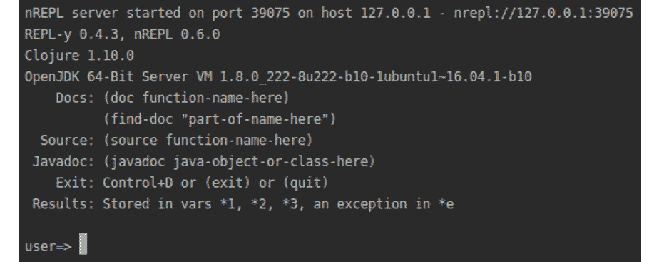
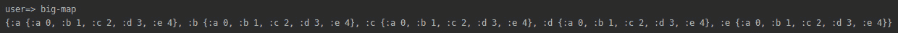
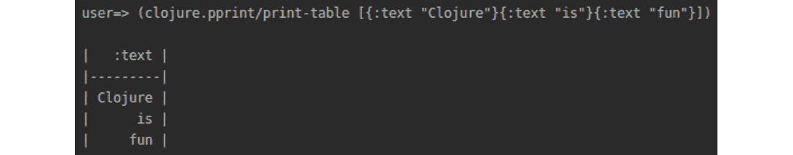
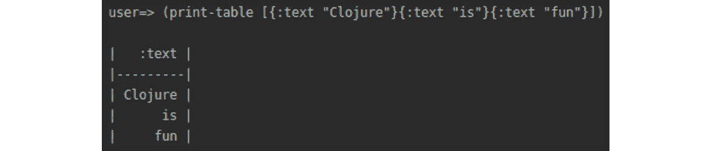
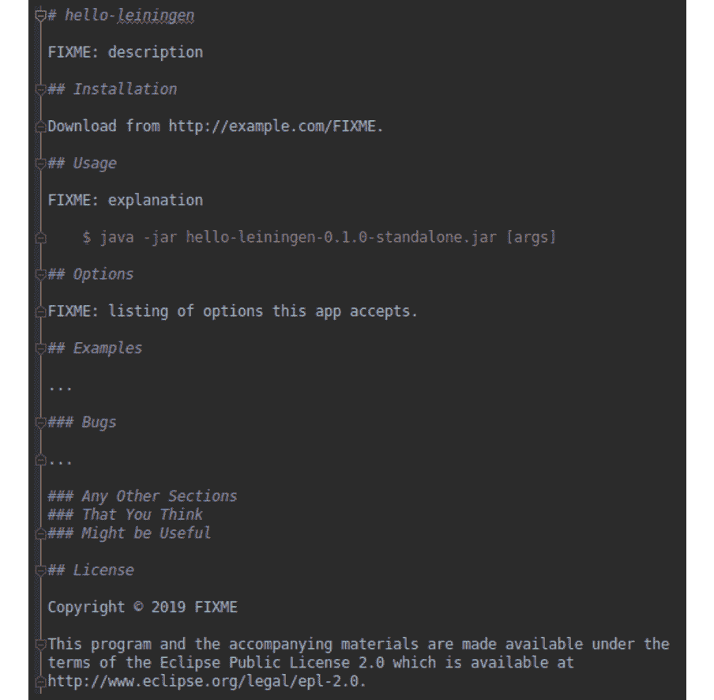
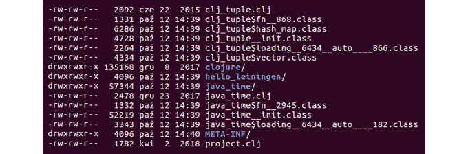
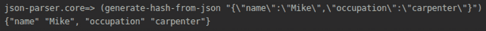
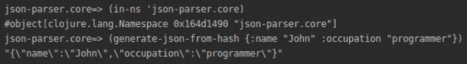
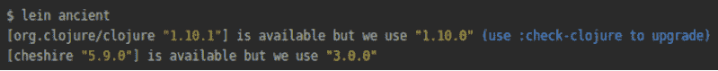

# 第八章：8. 命名空间、库和 Leiningen

概述

在本章中，我们将学习如何组织 Clojure 代码。我们首先来看命名空间——一种将 Clojure 函数分组的方法。我们将了解如何创建自己的命名空间以及如何导入他人编写的命名空间。命名空间是 Clojure 库的构建块。我们将学习如何导入和使用 Clojure 库。在了解命名空间和库之后，我们将研究如何构建 Clojure 项目。然后，我们将查看 Leiningen 项目模板以及它是如何帮助开发者创建应用程序的。

到本章结束时，你将能够使用 Leiningen 组织和运行你的项目。

# 简介

在上一章中，我们学习了 Clojure 中的序列以及如何使用它们来构建 Clojure 程序。现在你已经熟悉了如何使用 Clojure 实现各种功能，是时候更熟悉在 Clojure 和 ClojureScript 中创建、构建、测试、部署和运行项目的基本任务了。

Clojure 从一开始就被设计成一种非常实用的语言。完成任务意味着与外部世界互动、构建项目、使用库以及部署你的工作。作为一名开发者，你需要以结构化的方式组织编写的代码。在本章中，你将看到命名空间如何帮助你组织代码，以及构建工具如 Leiningen 如何帮助你构建整个应用程序。

在现实世界的项目中，你不会编写所有的代码。外部依赖是任何项目的关键部分，我们将在这里学习如何将它们引入你的项目和代码中。

第一步是了解 Clojure 命名空间的一般工作原理。然后，我们将查看项目级别，使用 Leiningen 和你的 `project.clj` 文件将所有内容整合成一个 Java 可执行文件。最后，我们将看看 Leiningen 在项目生命周期中提供的便利之处。

# 命名空间

命名空间是一种组织 Clojure 函数的方式；你可以将命名空间想象成一个目录（或文件），它存储了一组特定的函数。每个目录都是独立的，这有助于保持不同组函数的分离，并为你的代码提供清晰的架构。它还有助于避免命名冲突可能带来的混淆。

考虑这样一个情况，你已经编写了一个名为`calculate-total`的函数，作为你的项目的一部分，你正在使用一个库（关于库的更多内容将在本章后面介绍），该库也包含一个名为`calculate-total`的函数。尽管这两个函数具有相同的名称，但它们的工作方式不同，输出略有不同，并且旨在不同的场景中使用。当你开始在代码中使用`calculate-total`时，系统如何知道你实际上想要哪个`calculate-function`？这就是命名空间发挥作用的地方。这两个函数将存在于不同的命名空间中，因此当你调用函数时，你可以声明适当的命名空间来指定你想要使用的是哪一个。

从更技术性的角度来说，命名空间在符号（对人类读者有意义）和 var 或类之间提供了一个映射。命名空间可以与 Java 中的包或 Ruby 和 Python 中的模块相比较。我们将首先使用 REPL 来探索 Clojure 中命名空间的概念。

## 练习 8.01：调查 REPL 中默认启动的命名空间

在这个练习中，我们将研究 REPL 中命名空间是如何处理的：

1.  打开终端或命令提示符，并添加以下命令以使用 Leiningen 启动 REPL：

    ```java
    lein repl
    ```

    这将使用 Leiningen 启动 REPL。启动 REPL 可能需要几秒钟。一旦 REPL 启动，你应该看到以下类似的内容：

    

    图 8.1：启动 REPL

    最后的行，`user=>`，告诉我们我们处于默认的`user`命名空间。在这个命名空间中，`clojure.core`命名空间中的函数对我们可用。让我们探索几个函数。

1.  在 REPL 中，输入以下代码来计算两个数字的和：

    ```java
    (+ 1 2)
    ```

    这段简单的代码应该返回：

    ```java
    3
    ```

1.  让我们尝试使用 Clojure 的`filter odd`函数来返回奇数：

    ```java
    (filter odd? [1 2 3 4 5 6])
    ```

    这将返回以下内容：

    ```java
    (1 3 5)
    ```

我们看到在默认用户命名空间中，我们可以访问核心 Clojure 函数。但如果我们想访问定义在其他命名空间中的函数怎么办？Clojure 为我们提供了`in-ns`函数，该函数切换到请求的命名空间。如果请求的命名空间不存在，此函数还会创建一个新的命名空间。在下一个练习中，我们将使用`in-ns`函数来访问当前正在使用的不同命名空间中的数据。

## 练习 8.02：在命名空间中导航

在上一个练习中，我们使用了默认用户命名空间中的函数。在这个练习中，我们将查看如何访问其他命名空间中的数据：

1.  在终端中，调用`in-ns`函数来创建一个新的命名空间：

    ```java
    (in-ns 'new-namespace)
    ```

    在 REPL 中，我们将看到已经创建了一个新的命名空间：

    

    图 8.2：创建的新命名空间

    你应该注意到 REPL 提示已经更改为`new-namespace=>`。

    这个视觉提示告诉我们我们已经成功切换到了一个新的命名空间。在这个命名空间内部声明的任何内容都将在此可用。

1.  我们将在新的命名空间中声明一个变量。输入以下声明：

    ```java
    (def fruits ["orange" "apple" "melon"])
    ```

    REPL 告诉我们已创建了一个新变量：

    ```java
    #'new-namespace/fruits
    ```

1.  为了检查其内容，我们将从 REPL 按如下方式访问它：

    ```java
    fruits
    ```

    如预期，REPL 返回给我们向量：

    ```java
    ["orange" "apple" "melon"]
    ```

1.  现在我们将使用 `in-ns` 函数切换命名空间：

    ```java
    (in-ns 'other-namespace)
    ```

    REPL 告诉我们知道发生了变化：

    ```java
    #object[clojure.lang.Namespace 0x2f2b1d3c "other-namespace"]
    ```

    REPL 的提示符也发生了变化：

    ```java
    other-namespace=>
    ```

1.  现在按如下方式访问 `fruits` 向量：

    ```java
    fruits
    ```

    我们将看到不愉快的结果：

    ```java
    CompilerException java.lang.RuntimeException: Unable to resolve symbol: fruits in this context, compiling:(null:0:0)
    ```

    我们在 `new-namespace` 中声明了 `fruits` 向量，但我们尝试从另一个命名空间访问它。要从另一个命名空间访问变量，我们需要明确指出变量来自哪个命名空间。

1.  在 REPL 中输入完全限定名称以按如下方式访问数据：

    ```java
    new-namespace/fruits
    ```

    这次，我们得到了 `fruits` 向量：

    ```java
    ["orange" "apple" "melon"]
    ```

使用完全限定名称可能会变得繁琐。在下一个练习中，我们将看到 Clojure 如何帮助我们管理多个命名空间。

## 使用 `refer` 函数导入 Clojure 命名空间

Clojure 提供了 `refer` 函数，旨在帮助开发者编写紧凑的代码。这是通过将特定命名空间的内容导入当前命名空间来实现的，从而使得这些内容可以轻松访问。在之前的例子中，我们使用了 `new-namespace/fruits` 从 `new-namespace` 外部的不同命名空间访问 `fruits` 向量。`refer` 允许我们一次性引用 `new-namespace`，然后根据需要多次使用 `fruits`，而不必每次都指定完整的命名空间。

在上一节中，我们使用了 `in-ns` 函数。在本节中，我们将使用 `refer` 函数。虽然这两个函数都帮助我们处理命名空间，但我们使用它们的目的不同。`in-ns` 函数为我们的代码创建一个作用域。我们在命名空间内放置数据和函数。当我们想要创建一个新的命名空间以及相应的代码作用域时，我们使用 `in-ns`。现在，另一方面，`refer` 将允许我们在当前命名空间的作用域内工作，并从不同的命名空间导入数据。我们可以导入一个或多个命名空间，同时仍然在一个命名空间的作用域内工作。

## 练习 8.03：使用 `refer` 函数导入命名空间

在这个练习中，我们将使用 `refer` 函数导入 Clojure 命名空间。这将帮助我们理解 `refer` 函数的使用方法。

使用 `refer` 允许我们引用来自其他命名空间的功能或对象：

1.  在 REPL 中，输入以下命令以使用 `refer` 函数导入新的命名空间：

    ```java
    (clojure.core/refer 'new-namespace)
    ```

    我们在这里使用 `refer` 导入 `new-namespace` 的数据。如果我们使用了 `in-ns` 函数，我们就会改变代码的作用域。我们将能够访问 `new-namespace` 的数据，但由于作用域发生了变化，我们将失去对之前切换到 `new-namespace` 之前工作的 `other-namespace` 的访问权限。我们的目标是编写在 `other-namespace` 作用域内的代码，并且只访问 `new-namespace` 的功能。

1.  之后，我们可以直接在 REPL 中调用 `fruits` 向量来使用它：

    ```java
    fruits
    ```

    输出如下：

    ```java
    ["orange" "apple" "melon"]
    ```

使用 `refer` 允许我们将指定命名空间中的所有对象包含到当前命名空间中。`refer` 函数允许我们使用可选关键字来控制导入命名空间。我们现在将看到它们的作用。

## `refer` 函数的高级使用

在 *第二章*，*数据类型和不可变性* 中，我们学习了 Clojure 中的关键字。我们之前章节中学到的 `refer` 函数的基本用法可以通过关键字进行修改或扩展。它们是可选的，因为我们可以使用它们，但不必使用。

我们可以与 `refer` 一起使用的关键字是：

+   `:only`：`:only` 关键字允许我们只导入我们指定的函数。这意味着任何未指定的函数都不会被导入。

+   `:exclude`：`:exclude` 关键字允许我们排除某些函数的导入。我们将导入除了我们想要排除的函数之外的所有函数。

+   `:rename`：`:rename` 关键字允许我们重命名导入的函数。这设置了一个别名——一个函数的新名称——我们将使用这个新名称来引用该函数。

我们现在知道了三个可以修改使用 `refer` 函数导入命名空间的 `refer` 关键字。在接下来的三个练习中，我们将使用每个关键字导入命名空间并使用它们的数据。

## 练习 8.04：使用 :only 关键字

本练习的目的是展示我们如何通过使用 `:only` 关键字来扩展 `refer` 函数的基本用法。我们将使用带有 `:only` 关键字的 `refer` 函数导入命名空间。然后，我们将从导入的命名空间中访问数据：

1.  在 REPL 中，输入以下命令以使用 `in-ns` 函数创建 `garden` 命名空间：

    ```java
    (in-ns 'garden)
    ```

    REPL 为我们创建了一个新的命名空间：

    ```java
    #object[clojure.lang.Namespace 0x6436be0 "garden"]
    ```

1.  我们可以在该命名空间中定义两个变量：

    ```java
    (def vegetables ["cucumber" "carrot"])
    (def fruits ["orange" "apple" "melon"])
    ```

    REPL 通知我们已创建变量：

    ```java
    #'garden/vegetables
    #'garden/fruits
    ```

1.  然后，我们使用 `in-ns` 函数切换到新的命名空间：

    ```java
    (in-ns 'shop)
    ```

    注意

    使用 `:only` 关键字，我们可以引用另一个命名空间，但只导入选定的部分。

1.  使用 `refer` 函数和 `:only` 关键字导入 `garden` 命名空间：

    ```java
    (clojure.core/refer 'garden :only '(vegetables))
    ```

    这将返回以下内容：

    ```java
    nil
    ```

    我们可以直接在新 `shop` 命名空间中访问 `vegetables` 变量。

1.  调用 `vegetables` 变量以访问其内容：

    ```java
    vegetables
    ```

    REPL 返回预期的向量如下：

    ```java
    ["cucumber" "carrot"]
    ```

1.  然而，如果我们想访问另一个变量 `fruits`，可以这样调用 `fruits` 向量：

    ```java
    fruits
    ```

    在 REPL 中，我们遇到了异常：

    ```java
    CompilerException java.lang.RuntimeException: Unable to resolve symbol: fruits in this context, compiling:(null:0:0)
    ```

    因为当我们导入命名空间时，我们使用了 `:only` 关键字来导入 `vegetables` 变量。如果我们想使用其他变量，则需要使用完整的命名空间名称。

1.  使用完全限定名称调用 `fruits` 向量：

    ```java
    garden/fruits
    ```

    这次，我们得到了预期的向量如下：

    ```java
    ["orange" "apple" "melon"]
    ```

在这个练习中，我们在一个命名空间中创建了变量，然后使用 `refer` 函数导入这个命名空间。在导入过程中，我们使用了 `:only` 关键字，这允许我们只导入选定的数据。

在下一个练习中，我们将使用`refer`函数和`:exclude`关键字导入一个命名空间。

## 练习 8.05：使用`:exclude`关键字

在上一个练习中，我们使用`refer`函数从一个命名空间导入到另一个命名空间的内容。我们使用`:only`关键字限制了导入，只导入所需的数据。现在我们将使用第二个关键字，它允许我们使用`refer`函数控制命名空间的导入。

使用`:exclude`关键字允许我们从命名空间中导入部分内容，但排除我们不需要的部分：

1.  首先，我们将使用`in-ns`函数切换到新的命名空间：

    ```java
    (in-ns 'market)
    ```

    REPL 告诉我们我们成功切换到了新的命名空间：

    ```java
    #object[clojure.lang.Namespace 0x177c36c4 "market"]
    ```

1.  下一步是导入`garden`命名空间，但排除`vegetables`变量。我们使用带有`:exclude`关键字的`refer`函数：

    ```java
    (clojure.core/refer 'garden :exclude '(vegetables))
    ```

    这将返回以下内容：

    ```java
    nil
    ```

1.  我们通过尝试访问`fruits`变量来测试导入：

    ```java
    fruits
    ```

    到目前为止，一切顺利，因为 REPL 返回了向量：

    ```java
    ["orange" "apple" "melon"]
    ```

1.  我们将尝试访问被排除的变量`vegetables`：

    ```java
    vegetables
    ```

    我们立即在 REPL 中看到了一个异常消息：

    ```java
    CompilerException java.lang.RuntimeException: Unable to resolve symbol: vegetables in this context, compiling:(null:0:0)
    ```

1.  我们需要使用完全限定名来访问`vegetables`变量：

    ```java
    garden/vegetables
    ```

    这次，REPL 显示了预期的向量：

    ```java
    ["cucumber" "carrot"]
    ```

在这个练习中，我们使用`refer`函数导入了一个命名空间。在导入过程中，我们使用了`:exclude`关键字，这允许我们限制要导入的数据。

在下一个练习中，我们将使用`refer`函数和`:rename`关键字导入一个命名空间。

## 练习 8.06：使用`:rename`关键字

在上一个练习中，我们使用`refer`函数从一个命名空间导入到另一个命名空间的内容。我们使用`:exclude`关键字限制了导入，只导入我们想要的数据。现在我们将使用第三个关键字，它允许我们使用`refer`函数控制命名空间的导入。

我们将看到`:rename`关键字的用法。它允许我们从另一个命名空间导入并重命名某些符号：

1.  我们将使用`in-ns`函数切换到新的命名空间：

    ```java
    (in-ns 'shops)
    ```

1.  当我们导入`garden`命名空间时，我们希望将`fruits`变量重命名为`owoce`（波兰语中的水果）。我们将使用带有`:rename`关键字的`refer`函数：

    ```java
    (clojure.core/refer 'garden :rename '{fruits owoce})
    ```

1.  我们在 REPL 中访问`vegetables`变量：

    ```java
    vegetables
    ```

    这在 REPL 中返回了向量：

    ```java
    ["cucumber" "carrot"]
    ```

1.  尝试访问`fruits`变量：

    ```java
    fruits
    ```

    它告诉我们它不可访问：

    ```java
    CompilerException java.lang.RuntimeException: Unable to resolve symbol: fruits in this context, compiling:(null:0:0)
    ```

    因为我们将`fruits`变量重命名了，所以我们需要使用我们使用`refer`函数时定义的新名称来访问`fruits`。

1.  现在在 REPL 中输入`owoce`：

    ```java
    owoce
    ```

    这次，我们得到了预期的向量：

    ```java
    ["orange" "apple" "melon"]
    ```

在这个练习中，我们使用`refer`函数导入了一个命名空间。在导入过程中，我们使用了`:rename`关键字，这允许我们限制应该导入的数据。

现在我们知道如何使用`refer`。首先，我们使用`refer`函数导入了一个命名空间。然后我们看到了如何使用三个关键字（`:only`、`:exclude`和`:rename`）来修改使用`refer`函数时的导入。

当我们想要从一个命名空间导入到另一个命名空间的某些函数时，我们使用 `:only` 关键字。`:only` 关键字允许我们限制导入的函数。

当我们想要从一个命名空间导入到另一个命名空间，但不导入某些函数时，我们使用 `:exclude` 关键字。`:only` 关键字允许我们排除我们不想导入的函数。

当我们想要从一个命名空间导入到另一个命名空间并更改导入过程中某些函数的名称时，我们使用 `:rename` 关键字。

在下一节中，我们将学习 `require` 和 `use` 如何帮助我们管理命名空间。

# 使用 `require` 和 `use` 导入 Clojure 函数

在上一节中，我们学习了如何使用 `refer` 导入 Clojure 函数。在本节中，我们将学习如何使用 `require` 和 `use` 导入 Clojure 函数。

虽然 `refer` 允许我们直接引用其他命名空间的变量而不需要完全限定它们，但通常我们需要的不仅仅是这样。在之前的练习中，我们导入了一个命名空间，并从中访问了如 `fruits` 这样的变量，而没有使用命名空间名称作为 `garden`/`fruits` 变量的前缀。通常，我们想要从一个命名空间加载函数并使用这些函数。如果我们想读取文件，我们需要从 Clojure I/O 库（用于输入输出操作，如读取和写入文件的库）导入代码。

使用 `require` 函数，我们将加载一个我们将指定的命名空间。这样，加载命名空间中的函数就可用在我们的命名空间中使用了。这是一种编写 Clojure 代码、重用现有函数并在我们的代码中使它们可用的好方法。尽管我们使用 `require` 加载了新函数，但我们仍然需要在使用时完全限定它们。

虽然 `require` 函数允许我们加载指定的命名空间，但 `use` 函数更进一步，隐式地使用 `refer` 允许代码引用其他命名空间的变量，而无需完全限定它们。

`refer`、`require` 和 `use` 都有不同的用途：

+   `refer` 允许我们从不同的命名空间调用函数（函数不是导入的）。

+   `require` 从不同的命名空间导入函数，但在使用时我们必须对它们进行限定。

+   `use` 加载来自不同命名空间的函数，我们不需要对它们进行限定。

## 练习 8.07：使用 `require` 和 `use` 导入 Clojure 函数

在这个练习中，我们将学习 `require` 和 `use` 函数如何帮助我们导入 Clojure 命名空间。我们将使用这两种方法导入 Clojure 命名空间。这将帮助我们理解两种方法之间的区别。

通过使用 `require`，我们确保在需要使用时，提供的命名空间总是完全加载的。

Clojure 提供了一系列命名空间，例如`clojure.edn`或`clojure.pprint`，这些命名空间帮助开发者创建程序。EDN 代表可扩展数据表示法。它是一个表示对象的系统。它提供了一系列丰富的功能，例如指定日期和时间的功能。`clojure.edn`命名空间允许我们使用`edn`格式。想象一下，你想要将一个日期从一个程序发送到另一个程序。如果你将日期作为字符串发送，例如“Monday 7.10.2019”，那么没有关于时区的信息。接收这个日期字符串的程序不知道这个时间是在伦敦还是纽约。使用`edn`，我们可以发送包含时区信息的日期对象。

`clojure.print`命名空间包含一些实用函数，这些函数有助于以易于理解和阅读的格式从程序中打印数据。

考虑打印如图所示的哈希：



图 8.3：打印哈希

与*图 8.3*中显示的打印哈希不同，`clojure.pprint`命名空间中的函数允许我们以这种方式打印哈希：


图 8.4：使用命名空间中的函数打印哈希

默认情况下，当我们启动一个新的会话时，只有`clojure.core`可用。`clojure.core`命名空间包含主要的 Clojure 函数，如`filter`、`map`、`reduce`和`count`。这些是在 Clojure 中工作时经常使用的核心函数。这就是为什么它们在 Clojure 中默认可用。其他命名空间需要我们添加：

1.  我们将在 REPL 会话中导入一个新的命名空间，这将帮助我们美化打印一些内容：

    ```java
    (require 'clojure.pprint)
    ```

1.  我们现在可以使用这个命名空间中的函数。我们调用`print-table`函数在 REPL 中打印表格：

    ```java
    (clojure.pprint/print-table [{:text "Clojure"}{:text "is"}{:text "fun"}])
    ```

    这将在 REPL 中打印一个表格：

    

    图 8.5：在 REPL 中打印表格

    使用完全限定名称可能会变得繁琐，因为每次我们想要调用任何函数时，我们都必须提供其完整名称，包括命名空间。这导致代码冗长，并且命名空间名称重复很多。幸运的是，Clojure 允许我们为命名空间设置别名。为了设置别名，我们使用`:as`关键字。使用`:as`关键字，我们可以缩短调用函数的方式。我们不需要写出完整的命名空间，只需简单地使用我们选择的别名。

1.  使用`:as`关键字调用`require`函数以简化导入函数：

    ```java
    (require '[clojure.pprint :as pprint])
    ```

1.  现在我们可以使用别名来调用`print-table`函数：

    ```java
    (pprint/print-table [{:text "Clojure"}{:text "is"}{:text "fun"}])
    ```

    我们刚刚看到了`require`函数的使用方法。接下来，我们将看到`use`函数如何帮助我们导入命名空间。

1.  我们调用`use`函数在 REPL 中导入命名空间：

    ```java
    (use 'clojure.pprint)
    ```

    前面的语句将加载`clojure.pprint`命名空间并引用该命名空间。

    我们可以不使用完全限定名称来使用这个命名空间中的函数。

1.  在没有命名空间名称的情况下调用 `print-table` 函数以打印表格：

    ```java
    (print-table [{:text "Clojure"}{:text "is"}{:text "fun"}])
    ```

    这将为我们打印一个表格：

    

    ](img/B14502_08_07.jpg)

    图 8.6：调用 print-table 函数

    我们刚刚看到了 `use` 的工作方式。接下来，我们将探讨使用 `use` 中的关键字，如 `:only` 和 `:rename`。

1.  从 `clojure.string` 命名空间导入一个函数：

    ```java
    (use '[clojure.string :only [split]])
    ```

    这将导入 `string` 命名空间中的 `split` 函数并返回以下内容：

    ```java
    nil
    ```

    我们可以在没有命名空间名称的情况下使用 `split` 函数：

    

    ](img/B14502_08_07.jpg)

    图 8.7：使用 split 函数

1.  当使用 `use` 导入时，重命名 `clojure.edn` 命名空间中的函数：

    ```java
    (use '[clojure.edn :rename {read-string string-read}])
    ```

    这将返回以下内容：

    ```java
    nil
    ```

1.  我们已将 `clojure.end` 命名空间中的 `read-string` 函数重命名为 `string-read`。现在我们可以没有命名空间名称地调用 `string-read` 函数：

    ```java
    (class (string-read "#inst \"1989-02-06T13:20:50.52Z\""))
    ```

    输出如下：

    ```java
    java.util.Date
    ```

    我们有一个表示 1989 年的日期的字符串。我们将这个字符串传递给 `edn` 函数，该函数将字符串转换为 `Date` 对象。当我们调用 `class` 函数时，它告诉我们我们有一个 `Date` 对象。

我们已经看到了如何使用 `refer` 和 `use` 导入命名空间。在接下来的活动中，我们将将这些知识付诸实践。

## 活动 8.01：在应用程序中更改用户列表

在这个活动中，我们将应用关于导入命名空间的知识来解决一个实际问题。想象一下，我们在一家 IT 公司工作，我们负责设计后端应用程序。我们后端中的一个函数返回一个用户列表。新的前端功能需要以不同的格式获取这个列表。这个活动的目的是更改用户列表。

需要进行的两个更改是：

+   大写用户名

+   检查 John、Paul 和 Katie 是否属于管理员组

应用程序当前显示用户列表、他们的头衔、他们的名字和姓氏。头衔和名字之间用下划线（_）分隔。在这个活动中，我们将在头衔和名字之间添加一个空格。然后，我们将名字和姓氏的首字母大写。最后，我们将检查我们的用户是否属于管理员组。

这些步骤将帮助您完成活动：

1.  使用 `use` 和 `:rename` 关键字导入 `clojure.string` 命名空间，并为 `replace` 和 `reverse` 函数指定。

1.  创建一组用户。

1.  替换头衔和名字之间的下划线。

1.  使用 `capitalize` 函数将用户组中每个人的首字母大写。

1.  使用字符串的 `replace` 和 `capitalize` 函数更新用户列表。

1.  仅从 `clojure.pprint` 命名空间导入 `print-table` 函数。

1.  打印包含用户的表格。

1.  导入 `clojure.set` 命名空间，但不包括 `join` 函数。

1.  创建一组管理员。

1.  在两个用户和管理员集合上调用 `subset?` 函数。

初始的用户和管理员列表将如下所示：

```java
#{"mr_john blake" "miss_paul smith" "dr_katie hudson"}
```

管理员列表将如下所示：

```java
#{"Mr Paul Smith" "Dr Mike Rose" "Miss Katie Hudson" "Mrs Tracy Ford"}
```

最终的用户列表将如下所示：


图 8.8：预期结果

注意

此活动的解决方案可以在第 706 页找到。

## 当你想使用（use）时与当你需要（require）时

虽然乍一看`use`和`require`可能非常相似，但通过一些实践，你将理解何时使用哪一个。

如果我们想使用`require`导入命名空间，我们将如下调用：

```java
(require 'clojure.pprint)
```

使用`use`导入命名空间的方式如下：

```java
(use 'clojure.pprint)
```

如果我们比较这两个语句，我们会看到唯一的区别是导入函数，要么是`require`要么是`use`。它们的语法是相同的。我们调用一个函数然后是我们要导入的命名空间。尽管如此，使用这两个导入函数的原因是不同的，正如我们将在本主题中看到的那样。

当有疑问时，选择`require`。它允许你为命名空间添加别名，使代码比使用完全限定名称更易于阅读：

```java
(require '[clojure.string :as str])
```

这样，我们可以非常容易地调用函数。考虑以下示例：

```java
(str/reverse "palindrome")
```

当选择`use`时，建议添加别名并只导入所需的函数：

```java
(use '[clojure.string :as str :only (split)])
```

当你只导入所需的函数时，你可以很容易地稍后添加更多。只导入我们目前所需的函数有助于我们维护代码。处理代码的开发者不会花费时间搜索我们导入的函数的使用情况。

在不使用`:only`关键字的情况下使用`use`可能存在两个潜在问题：

+   检查代码并不能快速告诉我们某个函数来自哪个命名空间。通过使用别名的命名空间，我们可以更容易地建立这一点。

+   如果我们添加一个新的库或者现有的库引入了一个我们已经在使用的同名新函数，我们避免未来出现任何名称冲突。

现在我们已经了解了命名空间，我们将提升一个层次，研究如何使用 Leiningen 来构建项目。

# Leiningen——Clojure 中的构建工具

使用命名空间，我们将函数放入文件并将相关函数分组在一起。这有助于将代码分离成单元。考虑一种情况，其中实用函数与前端函数分离。这有助于我们导航代码并找到函数。我们知道负责创建 HTML 的前端函数不会在负责连接数据库的后端命名空间中。构建工具服务于不同的目的。正如其名所示，这些是帮助我们构建的工具。使用它们，我们可以自动化可执行应用程序的创建。另一种选择是自行编译所有代码并将其放在服务器上。即使在只有少量功能的程序中，我们也存在忘记编译命名空间的风险。命名空间越多，应用程序越复杂，手动代码编译出错的风险就越大。构建工具编译我们的代码并将其打包成可用的形式。开发者指定需要编译的应用程序部分，构建工具会自动为他们编译这些部分。这有助于最小化编译错误。一些构建工具有 Maven、Gradle、Webpack 和 Grunt。

Leiningen 是 Clojure 社区中非常流行的构建工具。其流行度来自于它丰富的功能集。它提供了许多模板，允许开发者在不进行太多项目设置的情况下开始编写代码。通常，开发者想要创建的应用程序类型可能已经被其他人创建。这样，我们可以重用我们之前开发者的成果，而不是自己编写大量代码。我们有一个提供网页常见结构的 Web 应用程序模板。有一个为后端服务器提供的模板，其文件结构和配置在后端服务器中很常见。在下一个练习中，我们将创建一个新的项目。

## 练习 8.08：创建 Leiningen 项目

本练习的目的是了解 Leiningen 项目的标准结构。我们将基于 Leiningen 的模板创建一个示例项目。这将使我们能够探索 Leiningen 创建的文件以及每个文件的目的。

为了创建一个新的 Leiningen 项目，我们将使用命令行：

1.  使用`app`模板调用一个新的`lein`任务。要创建一个新项目，执行以下命令：

    ```java
    lein new app hello-leiningen
    ```

    在上述命令中，`lein`命令接受三个参数：

    `new`：一个`lein`任务，告诉 Leiningen 要执行哪种类型的任务。任务`new`将基于模板创建项目。

    `app`：创建项目时使用的模板名称。Leiningen 将使用指定的模板创建项目。

    `hello-leiningen`：项目的名称。

    我们应该看到我们的新项目已经创建：

    ```java
    Generating a project called hello-leiningen based on the 'app' template.
    ```

1.  创建项目后，我们将导航到项目的目录：

    ```java
    cd hello-leiningen
    ```

1.  现在，按照以下方式检查项目：

    ```java
    find .
    ```

    我们将看到 Leiningen 已经为我们创建了一些文件：

    

图 8.9：检查项目

这里有一些需要注意的重要事项：

+   我们有一个源目录，`src`，我们将在这里放置我们的代码。

+   `project.clj`文件包含我们项目的描述。

+   `README.md`是一个入口点，其中包含有关我们应用程序的信息。

+   我们有一个用于测试的`test`目录。

我们将在以下章节中更详细地探讨这些点。测试将在*第十章*，*测试*中介绍。在下一节中，我们将查看`project.clj`文件。

## 调查`project.clj`

你创建的`project.clj`文件将看起来类似于这个：


图 8.10：`project.clj`文件

让我们看看每个参数：

+   `hello-leiningen`项目有一个快照版本。这意味着它还不是经过稳定生产测试的版本，而是一个开发版本。当你准备好发布你的项目时，请确保添加一个适当的版本。一个好的指南是使用语义版本控制。有时使用快照版本是必要的，比如在修复被包含在下一个版本之前进行错误修复。一般规则是除非需要错误修复，否则使用稳定版本。

+   **描述**：添加描述是让想要了解项目目的的人的好起点。此外，当项目在 Maven 或 Clojars 等项目仓库中发布时，更容易搜索到项目。

+   `url`参数允许我们为项目放置一个网页 URL。在我们的网页上，我们可以添加更多关于我们项目的信息。大多数项目网站都会有：

    理由：为什么创建项目

    文档：对其用法的描述

    指南：使用项目的示例

+   **许可证**：许可证的使用方式可能正如你所预期的那样。它是一种规范软件使用的法律工具。本质上，它是在软件所有者和用户之间的一项协议，允许用户在特定条件下使用软件。

    软件许可证有很多种类型。许可证的例子包括：

    MIT 许可证：这允许分发和修改源代码。

    Apache 许可证 2.0：与 MIT 许可证类似，这允许分发和修改代码，但要求保留版权声明。

    GNU AGPLv3：与 MIT 许可证类似，这允许分发和修改代码，但要求说明与软件原始版本相比的更改。

+   `jar`文件。它们基本上是带有一些项目元数据的`zip`文件（压缩文件）。当我们指定`project.clj`中的依赖项时，Leiningen 将在本地仓库中搜索。如果依赖项尚未存储在本地，那么它将在 Maven 和 Clojars 网站上搜索并下载依赖项。这些依赖项随后将可用于我们的项目。

+   使用 `:main` 关键字，我们指定了项目和应用入口点的命名空间。当我们运行项目时，它会被调用。

+   使用 `:profiles` 关键字，我们有一个 `uberjar` 配置文件，我们希望在 AOT 编译。另一方面，我们希望 `:main` 命名空间不进行 AOT 编译。我们创建一个带有 AOT 的 uberjar，因为我们希望在运行之前编译代码。我们不希望 `:main` 进行 AOT 编译，因为我们希望在启动应用程序时再进行编译。例如，`:main` 可以使用环境设置、在 AOT 编译时不可用的参数等符号。它们只有在启动应用程序时才可用。如果我们编译得太快，应用程序将无法访问我们在启动应用程序时传递的参数。

+   **配置文件**：Leiningen 允许我们在项目中设置各种配置文件。多亏了配置文件，我们可以根据我们的需求定制项目。

    例如，开发版本可能需要测试套件，我们可能需要测试依赖项。另一方面，在创建生产 jar 时，我们不需要测试依赖项。

    我们将在本章的结尾查看 Leiningen 的配置文件。

现在我们已经查看了 `project.clj`，我们将看看 `README.md` 文件能为我们提供什么。

README 文件是一个 Markdown 文件，它提供了我们认为用户需要了解的关于我们项目的相关信息。Markdown 是一种标记语言，允许我们格式化文档。

通常，README 文件将包含以下部分：

+   **项目名称**：在这里我们放置一个关于项目做什么的简短描述

+   **安装**：在这里我们告知用户安装应用程序所需的步骤

+   **用法**：在这里我们告知用户如何使用我们的项目

+   **示例**：一个包含代码示例的部分，展示如何使用我们的项目

+   **错误**：任何已知的错误

+   **变更日志**：在这里我们记录版本之间的任何更改

+   **许可证**：在这里我们告知用户我们项目的许可证类型

下面是一个示例 README 文件：



图 8.11：示例 README 文件

您可以添加更多部分。这完全取决于您认为用户需要了解哪些重要信息。在下一个主题中，我们将修改源文件并运行我们的应用程序。

## 练习 8.09：在命令行上执行应用程序

本练习的目的是创建一个 Leiningen 应用程序并探索应用程序的运行方式。

这将帮助我们理解 Leiningen 在 `project.clj` 文件中提供的不同选项。

正如我们在本练习的结尾将要看到的，为了从命令行运行我们的应用程序，我们需要调用 Leiningen 的 `run` 任务。Leiningen 的 `run` 任务将会在 `project.clj` 文件中搜索 `:main` 关键字及其对应的命名空间。

在我们的例子中，`project.clj` 中的 `:main` 关键字将看起来像这样：

```java
:main ^:skip-aot hello-leiningen.core
```

`^:skip-aot` 指示 Leiningen 跳过我们指定的命名空间的 AOT。在这里，命名空间是 `hello-leiningen.core`。当我们探索 `project.clj` 文件时，我们讨论了为什么我们想要跳过 `:main` 命名空间的 AOT。

默认情况下，Leiningen 将搜索我们在 `:main` 关键字中指定的命名空间。在我们的例子中，它将搜索 `hello-leiningen.core` 命名空间。在这个命名空间中，如果我们有 `-main` 函数，它将被调用：

1.  创建新项目后，`hello-leiningen.core` 命名空间的内容如下：

    ```java
    (ns hello-leiningen.core
      (:gen-class))
    (defn -main
      "I don't do a whole lot ... yet."
      [& args]
      (println "Hello, World!"))
    ```

    当我们使用 Leiningen 创建应用程序时，它将在 `core` 命名空间中自动生成代码。`(:gen-class)` 指示 Leiningen 从命名空间生成一个 Java 类。构建工具（如 Leiningen）执行 Java 字节码，因此我们需要将 Clojure 编译成字节码才能运行 `core` 命名空间。

    接下来，我们有 `-main` 函数。默认情况下，当应用程序启动时，Leiningen 将搜索具有该名称的方法并执行它。因此，`-main` 是我们应用程序的入口点。

    与 Clojure 中的所有函数一样，`-main` 可以提供一个可选的文档字符串。在这里，它告诉我们该函数目前还没有做很多事情。此函数接受可选参数。我们可以在启动应用程序时传递参数。通常，通过传递环境类型（如测试或生产）作为命令行参数来启动各种环境的应用程序。

    当 Leiningen 调用 `-main` 函数时，它将执行该函数的主体。在这种情况下，该函数将字符串 `Hello World!` 打印到控制台。

1.  要从命令行运行应用程序，我们使用 Leiningen 的 `run` 任务：

    ```java
    lein run
    ```

    这将在控制台打印以下内容：

    ```java
    Hello, World!
    ```

这个练习展示了如何运行在 `project.clj` 文件中定义的 Leiningen 应用程序。

在下一个练习中，我们将扩展应用程序以从命令行获取参数。

## 练习 8.10：使用参数在命令行上执行应用程序

在这个练习中，我们将编写一个小型的命令行应用程序，该程序接受一个字符串作为输入，解析该输入并替换该字符串的内容。

1.  创建新项目后，`hello-leiningen.core` 命名空间的内容如下：

    ```java
    (ns hello-leiningen.core
      (:gen-class))
    (defn -main
      "I don't do a whole lot ... yet."
      [& args]
      (println "Hello, World!"))
    ```

1.  当我们使用 Leiningen 创建应用程序时，它将在 `core` 命名空间中自动生成代码。（`:gen-class`）指示 Leiningen 从命名空间生成一个 Java 类。构建工具（如 Leiningen）执行 Java 字节码，因此我们需要将 Clojure 编译成字节码才能运行 `core` 命名空间。

1.  接下来，我们有 `-main` 函数。默认情况下，当应用程序启动时，Leiningen 将搜索具有该名称的方法并执行它。因此，`-main` 是我们应用程序的入口点。

1.  与 Clojure 中的所有函数一样，`-main` 可以提供一个可选的文档字符串。在这里，它告诉我们该函数目前还没有做很多……。此函数接受可选参数。我们可以在启动应用程序时传递参数。通常，应用程序通过传递环境类型（如测试或生产）作为命令行参数来为各种环境启动。

1.  当 Leiningen 调用 `-main` 函数时，它将执行此函数的主体。在这种情况下，该函数将打印字符串 "Hello World!" 到控制台。

1.  要从命令行运行应用程序，我们使用 Leiningen 的运行任务：

    ```java
    lein run
    ```

1.  这将在控制台打印以下内容：

    ```java
    Hello, World!
    ```

1.  导入 `clojure.string`。我们想在 `-main` 函数中操作字符串。为了做到这一点，我们需要导入字符串命名空间。

    ```java
    (ns hello-leiningen.core
      (:require [clojure.string :as str]))
    ```

    在导入 `clojure.string` 命名空间后，我们可以使用该命名空间中的函数。

1.  更新 `-main` 函数以在运行 `-main` 函数时替换某些单词：

    ```java
    (defn -main 
      "I don't do a whole lot ... yet."
      [& args]
        (-> (str/join " " args)
            (str/replace "melon" "banana")
            (str/replace "apple" "orange")
            println))
    ```

    此代码将用其他水果替换单词 "melon" 和 "apple"。

1.  我们按照以下方式运行应用程序：

    ```java
    lein run "apple" "melon" "grapes"
    ```

1.  这将在 REPL 中打印以下内容：

    ```java
    orange banana grapes
    ```

我们现在知道如何从命令行运行应用程序并传递参数。在以下活动中，你将使用这些知识来创建一个新的应用程序。

## 活动 8.02：求和数字

通常，开发者创建的应用程序需要在不同的环境和业务场景中运行。这要求应用程序具有灵活性。实现这一目标的一种方法是通过使用命令行参数来改变应用程序的行为。

在这个活动中，你将创建一个应用程序，该应用程序从命令行接收整数作为输入参数，并将它们相加以将结果打印到控制台。根据传递的整数，结果将不同。这显示了应用程序的灵活性。

这些步骤将帮助你完成活动：

1.  创建一个 Leiningen 应用程序。

1.  修改 `-main` 函数以将字符串参数转换为整数，相加并打印结果。

输出将如下所示：


图 8.12：预期输出

注意

本活动的解决方案可以在第 708 页找到。

# 与外部库一起工作

库是打包好的程序，可以用于其他项目。外部库是从其他开发者那里来的库。在 Clojure 中，此类库的例子包括 Ring，一个 HTTP 库；`clojure.java-time`，一个用于时间和日期操作的库；以及 `hiccup`，一个用于使用 Clojure 风格语法编写 HTML 代码的库。

大多数项目都需要开发者使用现有代码打包成的库。这是好事。我们不希望重复编写代码，如果问题已经解决，并且有人为它创建了一个我们可以使用的库。

在本节中，我们将使用 `clojure.java-time` 库来显示当前时间。

## 练习 8.11：在 Leiningen 项目中使用外部库

本练习的目的是向你展示如何向 Leiningen 项目添加库，并演示如何在代码中使用这个库：

1.  首先要做的事情是在 `project.clj` 文件中添加对 `time` 库的依赖。`dependencies` 部分应该看起来像这样：

    ```java
    :dependencies [[org.clojure/clojure "1.9.0"]
                             [clojure.java-time "0.3.2"]]
    ```

1.  下一步是将库导入到我们的 `core` 命名空间。将 `hello-leiningen.core` 修改如下：

    ```java
    (ns hello-leiningen.core
        (:require [java-time :as time]))
    ```

1.  最后，我们将把 `-main` 函数改为使用 `clojure.java-time` 库中的函数来打印本地时间：

    ```java
    (defn -main
      "Display current local time"
      [& args]
      (println (time/local-time)))
    ```

1.  我们使用 `run` 任务从命令行运行应用程序：

    ```java
    lein run
    ```

    这将给出类似于以下输出的结果：

    ```java
    #object[java.time.LocalTime 0x2fa47368 23:37:55.623]
    ```

我们现在已经知道如何添加和使用外部库。我们现在可以打包我们的应用程序到一个 jar 文件中并运行它。

## 使用 Leiningen 创建和执行 jar 文件

当我们讨论 Clojure 的项目结构时，我们提到项目被打包成 jar 文件。为了提醒你，jar 文件是一个压缩（打包）的文件，是一个可执行的应用程序。Leiningen 有创建 jar 文件的任务。

Leiningen 提供了两个可以创建 jar 文件的任务：

+   jar

+   uberjar

这两个都会创建一个包含我们代码的压缩文件。区别在于，jar 任务只会打包我们的代码，而 uberjar 任务还会打包依赖项。如果你想在服务器上运行一个应用程序并且想要一个独立的文件，那么 uberjar 是你的首选选项。如果你在服务器上有多个应用程序并且它们共享库，那么将每个应用程序打包成 jar 文件在总体上比打包成 uberjars 占用更少的空间。这是因为库在服务器上被你的应用程序共享。

如果我们想运行一个 jar，我们需要从我们的核心命名空间生成一个命名的类。

## 练习 8.12：创建 Jar 文件

在这个练习中，我们将展示如何使用 Leiningen 任务创建 jar 文件：

1.  将 `hello-leiningen.core` 命名空间声明修改为包含一个 `(:gen-class)` 函数调用：

    ```java
    (ns hello-leiningen.core
      (:require [java-time :as time])
      (:gen-class))
    ```

    `:gen-class` 指令是 Clojure 中的一个重要概念。这个指令将生成一个与目标命名空间对应的 Java 类。生成 Java 类的结果是一个 `.class` 文件。Java `.class` 文件包含可以在 JVM 上执行的 Java 字节码。这样的文件可以通过 Leiningen 等构建工具执行。

    运行 jar 和 uberjar 的 Leiningen 任务是相同的。在我们的情况下，我们将创建一个 uberjar。

1.  在命令行中调用 Leiningen 的 `uberjar` 任务：

    ```java
    lein uberjar
    ```

    这个任务将在目标目录内创建 `hello-leiningen-0.1.0-SNAPSHOT.jar` 和 `hello-leiningen-0.1.0-SNAPSHOT-standalone.jar` jar 文件。

    当我们比较文件时，我们会看到它们的尺寸差异很大：

    

    ](img/B14502_08_13.jpg)

    ```java
    jar -tvf target/uberjar/hello-leiningen-0.1.0-SNAPSHOT-standalone.jar
    ```

    运行这个命令将给出类似于以下输出的结果：

    

    ](img/B14502_08_14.jpg)

    图 8.14：检查文件的独立版本

    我们会注意到一个`clojure`目录。然而，当我们检查第一个文件时，却找不到 Clojure 目录：

    ![图 8.15：检查 Clojure 目录]

    ![图片 B14502_08_15.jpg]

    图 8.15：检查 Clojure 目录

    第一个 jar 文件（`hello-leiningen-0.1.0-SNAPSHOT.jar`）仅包含应用程序代码，而第二个文件（`hello-leiningen-0.1.0-SNAPSHOT-standalone.jar`）还包含核心 Clojure 代码。独立文件旨在在我们只有一个 Clojure 应用程序时使用。在这种情况下，我们希望所有依赖项都在一个地方。当我们在一个服务器上运行多个 Clojure 应用程序时，每个应用程序都包含核心 Clojure 函数会占用比所需更多的空间。在这种情况下，将核心 Clojure 代码只保留一次，并允许所有应用程序访问它，可以节省磁盘空间。

1.  为了运行一个 jar 文件，我们将调用以下命令：

    ```java
    java -jar target/uberjar/hello-leiningen-0.1.0-SNAPSHOT-standalone.jar
    ```

    这将显示当前的本地时间，如下所示：

    ![图 8.16：打印本地时间]

    ![图片 B14502_08_16.jpg]

图 8.16：打印本地时间

在下一节中，我们将探讨 Leiningen 配置文件——这是一个强大的功能，允许我们自定义我们的项目。

# Leiningen 配置文件

配置文件是 Leiningen 的一个工具，允许我们更改项目的配置。配置文件是一个影响项目行为的规范。例如，在开发或测试期间，如果我们希望在构建中包含测试框架，但生产构建不需要测试依赖项，使用配置文件是分离不同开发设置并针对同一代码库运行的一个很好的方法。

Leiningen 允许我们在需要的地方定义配置文件：

+   在`project.clj`文件中

+   在`profiles.clj`文件中

+   在`~/.lein/profiles.clj`文件中

在`project.clj`中定义的 Leiningen 配置文件仅针对该特定项目。这些配置文件不会影响其他项目。这允许项目之间分离，并能够独立地自定义它们。我们可能有一个使用 Clojure 最新版本并需要不同库的应用程序，而另一个应用程序则依赖于较旧的 Clojure 版本。

在`profiles.clj`中定义的 Leiningen 配置文件也仅针对特定项目。这些配置文件不会影响其他项目。将配置文件放在`project.clj`和`profiles.clj`中的区别在于，`project.clj`中的配置文件会被提交到版本控制中。在`profiles.clj`中定义的配置文件独立于`project.clj`中的项目配置，并且不需要提交到版本控制。来自两个文件的相同名称的配置文件，`profiles.clj`中的配置文件将优先于`project.clj`中的配置文件。

现在我们已经了解了 Leiningen 配置文件是什么以及它们可以定义的位置，我们将探讨创建配置文件的语法。首先，我们将在`project.clj`文件中定义一个配置文件。

## 练习 8.13：将 Leiningen 配置文件添加到项目中

本练习的目的是在 `project.clj` 文件中添加一个新的开发配置文件。这将允许我们为软件开发生命周期的开发阶段定制项目。

如果我们想要添加对测试框架（如 `expectations`）的依赖项，我们将修改 `project.clj` 文件，使其看起来像这样：

```java
(defproject hello-leiningen "0.1.0-SNAPSHOT"
 ;;; skipped irrelevant content
  :profiles {:uberjar {:aot :all}
                 :dev {:dependencies [[expectations "2.1.10"]]}})
```

在 `:profiles` 哈希中，我们有一个 `:dev` 哈希，它依赖于 `expectations` 框架。通过此更改，`dev` 配置文件对我们可用。我们可以通过列出可用的配置文件来检查这一点：

1.  调用 Leiningen 的 `show-profiles` 任务将显示可用的配置文件：

    ```java
    lein show-profiles
    ```

    输出如下：

    

    图 8.17：打印可用的配置文件

    本例中可用的配置文件有：

    `base`: 提供基本 REPL 功能的配置文件。

    `debug`: 当使用此配置文件运行 Leiningen 任务时，它们会在控制台打印更多信息，例如使用的依赖项名称。

    `default`: 当未选择任何配置文件时运行的默认配置文件。除非被覆盖，否则配置文件默认为 `leiningen/default` 配置文件。

    `dev`: 在 `project.clj` 文件中由开发者设置的开发配置文件。

    `leiningen/default`: 当未选择任何配置文件时运行的默认配置文件。

    `leiningen/test`: 运行测试文件的测试配置文件。

    `offline`: 使用离线存储的依赖项，而不下载新的依赖项的配置文件。

    `uberjar`: 创建 uberjar 文件的配置文件。

    `update`: 更新依赖项的配置文件。

    `user`: 为 Linux 用户定义的配置文件。

    `whidbey/repl`: 一个配置文件，其中在 REPL 中的结果以格式化的方式打印。

    如您所见，`dev` 配置文件列在其他配置文件中。

1.  如果我们想要运行此配置文件，我们将调用 `with-profiles` 任务：

    ```java
    lein with-profile dev test
    ```

    调用此任务将使用 `dev` 配置文件运行测试。在 *第十章*，*测试* 中，我们将探讨 Clojure 的测试，此任务将被经常使用。

在这个练习中，我们在 `project.clj` 文件中添加了一个新的 Leiningen 配置文件。这允许我们为特定项目设置配置。此配置独立于其他项目的配置。

在下一个练习中，我们将添加用户范围的配置文件。

## 用户范围配置文件

Leiningen 允许我们定义影响所有 Leiningen 项目的用户范围配置文件。这是一个放置我们希望所有项目都有的通用代码的好地方。最常见的情况包括包含用于测试或美化打印输出的库。一旦我们在用户范围配置文件中包含了一个测试库，该库就可以用于为所有项目编写测试。这也使我们升级库时受益。我们只需要在一个地方升级其版本。

用户级别的配置文件允许我们添加希望在所有项目中包含的依赖项。其中一个这样的依赖项是 Ultra，它为在 REPL 中工作的开发者提供了诸如着色和格式化打印等功能。

## 练习 8.14：使用用户级配置文件

本练习的目的是向 `profiles.clj` 文件中添加一个新的库。这将使我们能够在所有 Leiningen 项目中访问添加的库，减少每次创建新项目时手动添加依赖项的需求。此外，如果库的新版本可用，我们只需要更新一个 `profiles.clj` 文件，更新将在所有我们的 Leiningen 项目中可用。

如果我们经常需要以用户可访问的方式显示输入，我们可以使用 `humanize` 库。这个库可以将名词复数化，以友好的方式显示日期，并将数字转换为字符串。

为了在所有项目中使用 humanize 库，我们在 `~/.lein/profiles.clj` 文件中将它添加到 `:user` 关键字中：

```java
{:user {:dependencies [[clojure-humanize "0.2.2"]]}}
```

很常见，你会在 `profiles.clj` 文件中定义更多的库和插件。它可能看起来像这样，包括 humanize 库和两个插件 `ultra` 和 `localrepo`：

```java
{:user {:plugins [[lein-localrepo "0.5.4"]
                         [venantius/ultra "0.6.0"]]
          :dependencies [[clojure-humanize "0.2.2"]]}}
```

1.  使用 Leiningen 启动 REPL：

    ```java
    lein repl
    ```

1.  导入 humanize 库：

    ```java
    (require 'clojure.contrib.humanize)
    ```

    虽然我们在 `project.clj` 文件中没有 humanize 库，但我们仍然可以导入这个库：

    

    图 8.18：导入 humanize 库

1.  将数字转换为字符串的方法如下：

    ```java
    (clojure.contrib.humanize/numberword 4589)
    ```

    humanize 将传入的数字转换为字符串，如下所示：

    ```java
    "four thousand five hundred and eighty-nine"
    ```

1.  将毫秒数转换为时间值：

    ```java
    (clojure.contrib.humanize/duration 500)
    ```

    500 毫秒甚至不是一秒，因此输出将如下所示：

    ```java
    "less than a second"
    ```

    这就结束了我们对 Clojure 和 Leiningen 项目结构中命名空间的探索。在接下来的活动中，我们将使用我们在 Leiningen 中关于库和配置文件的新知识。

## 有用的 Clojure 库

Clojure 生态系统拥有许多优秀的库。正如我们在本章所学，使用库可以帮助我们创建 Clojure 应用程序。库提供了我们可以在代码中使用的功能。我们不需要自己编写代码，因为我们可以重用其他人编写的代码。这节省了我们的时间，并意味着我们可以专注于开发特定于我们应用程序的功能。Clojure 有许多库。Clojure 提供了一个中心位置来搜索 [`clojars.org`](https://clojars.org) 上可用的库。我们将了解两个有用的 Clojure 库，`cheshire` 和 `lein-ancient`。`cheshire` 库允许我们处理 JSON 格式。通过 `cheshire` 库，我们可以将 Clojure 数据转换为 JSON 格式，反之亦然。这是一个非常强大的功能。想象一下，我们有一个假日预订应用程序。在该应用程序中，我们希望显示当前的天气信息。有国家服务提供此类信息。天气服务允许以通用的 JSON 格式下载数据。当我们下载天气数据时，我们需要将 JSON 转换为 Clojure 数据。`cheshire` 库帮助我们进行数据转换。`lein-ancient` 是一个有用的 Leiningen 插件。此插件允许我们检查我们的 Leiningen 项目中的过时依赖项。通常，我们使用的库的新版本会被发布。新版本引入了错误或安全修复。使用更新的库有助于我们的应用程序保持安全。在以下活动中，我们将创建一个使用有用的 Clojure 库的 Leiningen 项目。

## 活动编号 8.03：构建格式转换应用程序

本活动的目的是创建一个 Leiningen 项目，该项目可以在 JSON 格式和 Clojure 数据之间进行转换。JSON 是一种流行的传输格式，常用于在各个后端应用程序之间发送数据。使用通用格式可以增加不同应用程序之间的互操作性，并降低构建和维护应用程序的开发成本。

与大多数用于生产的应用程序一样，我们的应用程序将具有开发和默认生产配置文件。我们将使用 Leiningen 配置文件来创建一个测试配置文件，该配置文件将使用测试库来确保我们的应用程序运行正确。

随着我们的应用程序成熟，所使用的库的新版本将被发布。我们将使用一个插件来通知我们是否我们使用的任何库已经过时。

完成此活动后，应用程序将具有以下功能：

+   在 JSON 和 Clojure 数据之间进行转换

+   用于在生产发布前检查代码的测试配置文件

+   检查过时库

这些步骤将帮助您完成活动：

1.  将 `cheshire` "3.0.0" 库作为依赖项包含进来。

1.  创建一个将哈希表转换为 JSON 的功能。

1.  创建一个将 JSON 转换为哈希表的功能。

1.  将 `expectations` 库添加到为项目定义的测试配置文件中。

1.  将 `lein-expectations` 插件添加到项目中。

1.  编写 JSON 函数的测试。

1.  将`lein-ancient`添加到用户全局配置文件中。

库的最新版本可以在[`clojars.org`](https://clojars.org)网站上找到。

创建应用程序并运行后，你应该会有以下类似的输出。

从哈希转换为 JSON 格式应返回以下内容：



图 8.19：从哈希转换为 JSON

从哈希生成 JSON 应返回以下内容：



图 8.20：从哈希生成 JSON

运行测试配置文件应返回以下内容：


图 8.21：执行测试配置文件

检查过时依赖项应返回以下内容：



图 8.22：检查过时的依赖项

注意

本活动的解决方案可以在第 709 页找到。

# 摘要

在本章中，我们学习了 Clojure 中的命名空间。命名空间是 Clojure 的关键概念。我们将代码组织到命名空间中。我们研究了使用`refer`、`require`和`use`导入命名空间的多种方法。对于每种导入选项，我们学习了导入函数的语法以及何时使用每种类型的函数。我们深入研究了`:only`、`:exclude`和`:rename`关键字，这些关键字帮助我们精细调整导入。

然后，我们学习了 Leiningen——一个流行的 Clojure 构建工具。我们创建了一个 Leiningen 应用程序，并探讨了 Clojure 项目的结构。我们添加了库依赖项。最后，我们看到了如何使用配置文件来自定义 Leiningen 项目。我们创建了一个应用程序，该应用程序接受命令行参数，这些参数被应用程序用来自定义输出。

在下一章中，我们将研究主机平台互操作性——从 Clojure 访问 Java 和 JavaScript。
