# 第十章：10. 测试

概述

在本章中，我们将探讨 Clojure 中的测试。我们首先了解不同类型的测试。然后，我们探索最常用的单元测试库，以便测试我们的 Clojure 函数。我们学习如何进行测试驱动开发。我们深入研究基于属性的测试，这有助于我们生成大量的测试数据。然后，我们学习如何将测试集成到 Clojure 和 ClojureScript 项目中。

到本章结束时，你将能够使用各自的标准化测试库在 Clojure 和 ClojureScript 中测试程序。

# 简介

在上一章中，我们学习了 Clojure 中的宿主平台互操作性（inter-op）。我们探讨了如何在 Clojure 中使用 Java 代码和在 ClojureScript 中使用 JavaScript。在我们的互操作性冒险中，我们创建了一个咖啡订购应用程序。该应用程序具有各种功能，例如显示带有咖啡选择的菜单和订购咖啡。我们运行了代码，并看到了应用程序正在运行。现在是学习 Clojure 中测试的时候了。

Clojure 从一开始就被设计成一个非常实用的语言。完成任务意味着与外部世界互动，构建项目，使用库，并部署你的工作。我们需要确信我们编写的代码确实做了它应该做的事情。作为一名开发者，你需要测试你的应用程序。在本章中，我们将了解可以使用哪些类型的测试。我们将查看单元测试，因为它们是开发者编写的最常见类型的测试。

考虑这样一个情况，我们有一个机票订购应用程序。这个应用程序允许用户搜索航班并预订航班。其一个功能是搜索航班。用户应该能够输入搜索日期。结束日期应该在开始日期之后——在我们飞出之前就返回是没有太多意义的。测试使我们能够确保处理开始和结束日期的代码是有序的。

同样，我们希望确保当许多客户进入我们的网站时，它不会变慢。用户体验元素，如网站速度，在软件中也会进行测试。

第一步是了解为什么测试很重要，以及 Clojure 和 ClojureScript 中可以执行哪些类型的测试。然后，我们将探讨 Clojure 和 ClojureScript 中的测试库。最后，我们将探讨一种特殊的测试类型，称为**生成测试**，以及它是如何帮助开发者编写测试的。

# 为什么测试很重要

在本章的开头，我们看到了软件测试的重要性。为什么？为了回答这个问题，我们需要了解什么是软件测试。它可以定义为确保特定软件无错误的过程。软件错误是导致程序崩溃或产生无效输出的问题。在*第九章*，*Java 和 JavaScript 与宿主平台互操作性*中，我们学习了 Clojure 和 ClojureScript 中的错误。测试是一个逐步的过程，确保软件通过客户或行业设定的预期性能标准。这些步骤还可以帮助识别错误、差距或缺失的需求。错误、错误和缺陷是同义词。它们都意味着我们的软件存在问题。

软件测试的好处如下：

+   提供具有低维护成本的高质量产品

+   确保产品的准确性和一致性

+   发现开发阶段未被识别的错误

+   检查应用程序是否产生预期的输出

+   帮助我们了解客户对产品的满意度

根据我们观察软件的角度，存在许多软件测试方法。最常见的区别是功能测试和非功能性测试。现在我们将讨论什么使测试成为功能性的或非功能性的，以及何时使用一种类型或另一种类型是合适的。

## 功能性测试

**功能性测试**试图捕捉正在测试的软件的功能性需求。需求来自软件的规范。

以机票订购应用程序为例，它允许用户购买航班。如前所述，其功能之一是搜索航班。用户可能会使用不同的标准进行搜索。一个标准可能是搜索直飞航班。功能性测试将确保当用户搜索直飞航班时，他们不会看到转机航班。

通常，功能性测试包括以下步骤：

1.  根据需求规范文档确定软件组件具有哪些功能和特性

1.  根据需求创建输入数据

1.  确定预期的输出

1.  执行测试

1.  将预期结果与实际输出进行比较

虽然功能性测试有优势，但有些测试领域并未被功能性测试覆盖。在这种情况下，将执行所谓的非功能性测试。

## 非功能性测试

**非功能性测试**检查与功能性需求不直接相关的事项。换句话说，非功能性测试关注的是软件作为一个整体的操作方式，而不是软件或其组件的具体行为。

在非功能性测试中，我们关注的是诸如安全性、系统在各种负载条件下的行为、是否用户友好以及是否提供本地化以在不同国家运行等问题。

再次考虑机票订购应用程序。此应用程序允许用户购买机票。用户应该能够使用信用卡支付。应用程序应该安全地处理支付。这意味着交易应该被加密。加密是将消息或信息编码成只有授权方才能访问，而未授权方无法访问的过程。未授权的人不应该能够看到交易详情。

对于机票订购应用程序的另一个非功能性测试将是负载测试。通过负载测试，我们将测试我们的应用程序能否处理非常高的页面负载。在节日期间，许多客户将访问我们的网站。我们需要确保数千名用户可以同时使用该应用程序。应用程序应该响应迅速，当许多客户使用时不会变慢。

功能性测试确保我们的应用程序是安全的。虽然我们已经分别讨论了功能性和非功能性测试，但它们不应被视为对立的测试方法，而应被视为互补的方法。它们通常一起执行，以确保软件具有高标准的质量并能在各种条件下运行。

在软件中进行测试和捕捉错误并非免费。这需要开发人员和测试人员的时间和资源。话虽如此，在开发后期修复错误比在开发早期捕捉它们要昂贵得多。单元测试使我们能够早期捕捉许多错误，同时不会从开发人员那里消耗太多资源。

在下一个主题中，我们将探讨单元测试是什么，以及 Clojure 中最受欢迎的单元测试框架。

## Clojure 单元测试

**单元测试**是对单个软件组件或模块的测试。在 Clojure 中，一个函数是单元测试的良好候选者。函数旨在一次执行一个任务。否则，一个任务中的逻辑变化会影响第二个任务。当一个函数只有一个责任时，我们比它执行多个任务时更容易对函数进行推理。Clojure 为单元测试提供了一系列测试框架。当我们使用测试库时，我们通常称它们为框架。框架是一个支持和包围测试的结构。使用测试框架，我们支持对代码进行测试。我们的代码被为我们的代码编写的多个测试所包围。

测试中有许多概念，以下是其中两个：

+   **断言**：一个布尔（true 或 false）表达式。断言是对我们程序特定部分的一个声明，它将是 true 或 false。例如，我们可以声明，当我们用一个字符串而不是一个数字作为参数传递给函数时，我们的程序中的函数将抛出一个错误。断言将是：这个函数会抛出错误吗？答案是是（true）或否（false）。

+   **存根**：代码或概念的一部分的临时替换。存根模拟被替换的软件组件的行为。在航班票订购应用程序中，我们可能有一个支付组件，它接受卡详情并与银行联系以提取机票费用。在通过银行完成支付后，我们会显示票务详情。存根将模拟与银行联系，但实际上并不与银行联系。当我们使用存根时，我们可以专注于测试显示票务详情，而不需要处理与银行联系和所有卡交易。这使测试专注于单一任务，在本例中，是通过银行支付后显示票务。

`clojure.test`框架是 Clojure 标准库中提供的默认 Clojure 单元测试框架。`clojure.test`的目的是为开发者提供一系列测试函数。在我们的第一个练习中，我们将使用 clojure.test 库为前一章中的咖啡应用程序编写单元测试。

## 练习 10.01：使用 clojure.test 库进行单元测试

本练习的目的是学习如何使用`clojure.test`库进行单元测试。这是 Clojure 的默认测试库。由于 Clojure 已经包含了这个库，因此我们不需要将其作为外部依赖项导入。在前一章中，我们创建了一个允许我们显示咖啡菜单和订购咖啡的咖啡订购应用程序。在本练习中，我们将为咖啡订购应用程序中创建的函数编写单元测试。

首先，我们将创建应用程序，然后我们将编写测试：

1.  创建咖啡订购应用程序：

    ```java
    lein new app coffee-app
    ```

    Leiningen 为我们创建了项目。默认情况下，我们有一个名为`core.clj`的源文件。在这个文件中，我们将添加负责显示菜单选项和处理它们的代码。

1.  在`core`命名空间中导入`java.util.Scanner`类：

    ```java
    (ns coffee-app.core
        (:require [coffee-app.utils :as utils])
        (:import [java.util Scanner])
        (:gen-class))
    ```

    我们已经导入了`Scanner`类。这个类允许我们从键盘获取输入。为了使用`Scanner`类的方法，我们需要创建这个类的一个实例。

1.  创建`Scanner`类的一个实例。

    当我们想要从用户那里获取输入时，我们将在这个类实例上调用方法。`Scanner`类需要知道输入的来源。在我们的情况下，我们使用`System`类的默认`in`源——键盘。

    ```java
    (def input (Scanner. System/in))
    ```

    当用户运行应用程序时，他们应该看到一个带有选项的菜单。这些选项包括显示和订购咖啡、列出订单以及退出应用程序。

    

    图 10.1：显示所有选项的应用菜单

1.  添加显示菜单和处理用户选择的代码：

    ```java
    (defn- start-app []
           "Displaying main menu and processing user choices."
           (let [run-application (ref true)]
                (while (deref run-application)
                       (println "\n|     Coffee app |")
                       (println "| 1-Menu 2-Orders 3-Exit |\n")
                       (let [choice (.nextInt input)]
                            (case choice
                                  1 (show-menu)
                                  2 (show-orders)
                                  3 (dosync (ref-set run-application false)))))))
    ```

1.  在`start-app`函数中，我们将应用设置为默认运行状态：

    ```java
    run-application (ref true)
    (while (deref run-application)
    ```

    为了获取`run-application`中存储的值，我们使用`deref`函数。

1.  在`while`块内部，应用将一直运行，直到用户选择退出选项。在这种情况下，我们将更新`ref`的值：

    ```java
    (dosync (ref-set run-application false))
    ```

1.  更新后，`ref`不再为真，而是为假。当`ref`的值为假时，`while`块将停止，我们的应用将退出。当我们的应用运行时，用户可以从菜单中选择选项：

    ```java
    (println "| 1-Menu 2-Orders 3-Exit |\n")
    ```

    这将显示以下菜单：

    

    图 10.2：咖啡订购应用的菜单

    我们能够显示初始菜单。我们可以着手处理用户从菜单中的选择。

1.  为了获取用户响应，我们调用`Scanner`实例的`nextInt`方法：

    ```java
    choice (.nextInt input)
    ```

    最后，一旦我们获取了用户输入，我们就检查菜单中的哪个选项应该被执行：

    ```java
    (case choice
      1 (show-menu)
        2 (show-orders))
    ```

    当我们启动应用时，我们就知道了主应用菜单中的逻辑。现在是时候深入挖掘并查看`show-menu`函数的代码了。

1.  显示可用的咖啡菜单：

    ```java
    (defn- show-menu []
           (println "| Available coffees |")
           (println "|1\. Latte   2.Mocha |")
           (let [choice (.nextInt input)]
                (case choice
                      1 (buy-coffee :latte)
                      2 (buy-coffee :mocha))))
    ```

    在`show-menu`函数中，我们让用户了解两种可用的咖啡——`Latte`和`Mocha`：

    ```java
    (println "| Available coffees |")
    (println "|1\. Latte   2.Mocha |")
    ```

    这将显示咖啡菜单：

    

    图 10.3：咖啡菜单显示

    用户可以选择数字`1`或`2`。我们现在需要响应用户的咖啡选择。

1.  我们使用`Scanner`实例来获取用户输入：

    ```java
    choice (.nextInt input)
    ```

1.  最后，我们继续购买用户选择的咖啡：

    ```java
    (case choice
           1 (buy-coffee :latte)
           2 (buy-coffee :mocha))
    ```

    `show-menu`函数并不长。它的目的是显示可用的咖啡并获取用户输入。一旦用户选择了他们的咖啡，我们就调用`buy-coffee`函数来处理所选咖啡的购买。

1.  询问用户他们想要购买多少杯咖啡：

    ```java
    (defn- buy-coffee [type]
           (println "How many coffees do you want to buy?")
           (let [choice (.nextInt input)
                 price (utils/calculate-coffee-price price-menu type choice)]
                (utils/display-bought-coffee-message type choice price)))
    ```

    `buy-coffee`函数询问用户想要购买多少杯咖啡。同样，我们使用`Scanner`类的实例`input`来获取用户的选择。接下来，函数调用两个实用函数来处理购买。这些函数负责计算咖啡价格并向用户显示反馈信息。

    所有函数都将放置在`utils.clj`文件中。将所有函数放在一个大的文件中不是好习惯，将函数拆分到各种命名空间中是更好的做法。一个常见的命名空间名称是`utils`。我们可以将任何有用的操作数据的函数保存在那里。

1.  创建一个`utils`命名空间：

    ```java
    (ns coffee-app.utils
    ```

1.  计算咖啡价格：

    ```java
    (defn calculate-coffee-price [coffees coffee-type number]
          (->
            (get coffees coffee-type)
            (* number)
            float))
    ```

    我们的第一个实用函数计算咖啡价格。它使用`get`函数来检查传入的咖啡类型在`coffees`哈希中。该哈希定义在核心命名空间中：

    ```java
    (ns coffee-app.core
        (:require [coffee-app.utils :as utils])
        (:import [java.util Scanner])
        (:gen-class))
    (def ^:const price-menu {:latte 0.5 :mocha 0.4})
    ```

    从哈希中获得的值然后乘以用户订购的咖啡杯数。最后，我们将数字强制转换为浮点数。这允许我们将 1.2000000000000002 这样的数字转换为 1.2。

    当我们处理购买咖啡时使用的最后一个实用函数是`display-bought-coffee-message`函数。

1.  在购买咖啡后向用户显示消息：

    ```java
    (ns coffee-app.utils)
    (defn display-bought-coffee-message [type number total]
          (println "Buying" number (name type) "coffees for total:€" total))
    ```

    `display-bought-coffee-message`函数接收订单映射并基于映射中的数据为用户构建一个字符串消息。用户被告知他们以指定价格购买了特定数量的咖啡杯。

    使用此函数，我们可以在用户完成订单后控制传递给用户的信息：

    

    图 10.4：显示购买咖啡的消息

    主菜单中的第二个选项允许我们查看已放置的订单：

    

    图 10.5：订单允许用户查看他们的订单

    负责显示订单的函数是来自`coffee-app.core`命名空间的`show-orders`函数。

1.  显示已放置的订单：

    ```java
    (ns coffee-app.core)
    (defn- show-orders []
           (println "\n")
           (println "Display orders here"))
    ```

    此函数将显示所下的咖啡订单。在这个练习中，我们通知用户订单将在这里显示。在接下来的练习中，我们将实现保存和显示订单：

    ```java
    Display orders here
    ```

    当我们运行应用程序并购买两杯拿铁时，我们将看到以下输出：

    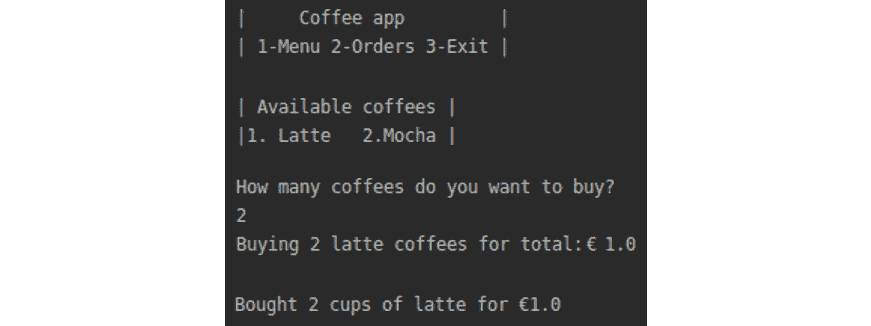

    图 10.6：用户购买两杯咖啡时的输出

1.  添加主函数如下：

    ```java
    (defn -main
          "Main function calling app."
          [& args]
          (start-app))
    ```

1.  为了运行应用程序，我们将使用以下命令：

    ```java
    lein run
    ```

    一旦运行应用程序，我们就可以看到可用的咖啡并下订单，就像我们在*图 10.6*中看到的那样。

    我们的应用程序已成功运行。我们现在将为我们的应用程序创建测试。

1.  检查测试目录。我们使用`tree`命令显示测试目录中的文件夹和文件列表：

    ```java
    tree test
    ```

    当我们创建应用程序时，Leiningen 为我们创建了`test`目录。有几种方法可以检查项目结构。我们使用前面的`tree`命令来检查项目结构。

    

    ```java
    (ns coffee-app.core-test
      (:require [clojure.test :refer :all]
                    [coffee-app.core :refer :all]))
    ```

    此文件导入了 Clojure 测试命名空间，以及源目录中的核心文件。该文件包含一个测试方法。此方法称为`a-test`。因为我们已自动生成了`a-test`测试函数，所以我们可以在创建 Leiningen 项目后运行测试：

    ```java
    (deftest a-test
      (testing "FIXME, I fail."
        (is (= 0 1))))
    ```

    当我们使用 Leiningen 创建新项目时，它将创建一个测试函数。此函数称为`a-test`，位于`core_test.clj`文件中。

1.  为了运行测试，我们需要调用 Leiningen 的`test`任务。`test`任务是一个将在测试目录中运行测试的任务：

    ```java
    lein test
    ```

    输出如下：

    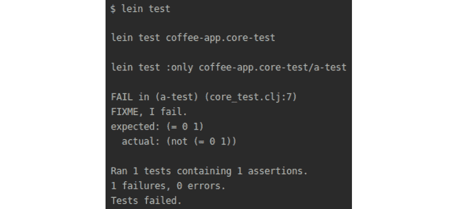

    图 10.8：运行测试任务

    `a-test`测试失败，因为我们还没有在`core_test.clj`文件中实现`a-test`测试。Leiningen 通知我们它测试了`coffee-app.core-test`命名空间。我们有信息表明测试失败，包括测试文件中的哪一行（第 7 行）导致了测试失败。

    Leiningen 甚至提供了关于测试期望的结果和实际结果的信息。在这种情况下，默认测试尝试比较数字一和零。为了使测试通过，让我们更改`a-test`函数。

1.  为了修复 Leiningen 项目的默认`test`函数，我们将更改我们刚刚看到的默认`a-test`函数的实现：

    ```java
    (deftest a-test
      (testing "FIXME, I fail."
        (is (= 1 1))))
    ```

    我们更改了测试，使其表明 1 等于 1。这将使我们的`a-test`通过。

1.  我们使用以下方式运行测试：

    ```java
    lein test
    ```

    我们可以再次运行测试：

    

    图 10.9：修复默认的 a-test 函数后的测试运行

    这次，Leiningen 通知我们它运行了一个测试，包含一个断言（测试条件）。没有失败和错误。我们现在知道如何运行测试。是时候为`utils`命名空间编写测试了。我们将为`utils`命名空间创建一个测试文件。

1.  为`utils`命名空间创建一个测试文件。在文件中，我们将编写代码来测试`utils`命名空间中的函数：

    ```java
    touch test/coffee_app/utils_test.clj
    ```

    在创建`utils_test.clj`之后，我们将有两个测试文件：

    

    图 10.10：创建 utils_test.clj 后，我们现在有两个测试文件

    在`utils_test.clj`中，我们想要测试`utils`命名空间中的函数。我们将向测试命名空间添加必要的依赖。在`core_test.clj`中，我们将保留在`core.clj`文件中定义的函数的测试。`utils_test.clj`文件将包含在`utils.clj`文件中定义的函数的测试。

1.  我们将从源目录中导入我们将要测试的`clojure.test`库和命名空间：

    ```java
    (ns coffee-app.utils-test
        (:require [clojure.test :refer [are is deftest testing]]
                       [coffee-app.core :refer [price-menu]]
                       [coffee-app.utils :refer :all]))
    ```

    `clojure.test`命名空间有几个测试函数。我们使用`:refer`关键字导入它们，我们在第八章“命名空间、库和 Leiningen”中学习了它。我们导入了四个函数：

    `are`: 允许您测试多个测试场景

    `is`: 允许您测试单个测试场景

    `deftest`: 定义 Clojure 测试

    `testing`: 定义一个将被测试的表达式

    我们从源目录中导入`coffee-app.core`和`coffee-app.utils`命名空间。从`core`命名空间中，我们导入`price-menu`，其中包含可用的咖啡列表以及每款咖啡的价格。最后，我们导入`utils`命名空间，其中包含我们想要测试的函数。

1.  `clojure.test` 对象提供了用于测试的 `is` 宏。我们将在第十一章 *宏* 中学习关于宏的内容。为了这个练习，你可以将宏视为特殊函数。宏的使用方式与函数相同。

    `is` 宏接受一个测试和一个可选的断言消息。将以下代码添加到 `utils_test.clj`：

    ```java
    (deftest calculate-coffee-price-test-with-single-is
      (testing "Single test with is macro."
        (is (= (calculate-coffee-price price-menu :latte 1)
                 0.5))))
    ```

    `deftest` 宏允许我们定义测试。每个测试都是使用 `testing` 宏定义的。`testing` 宏可以提供一个字符串来提供测试上下文。在这里，我们通知你这是一个使用 `is` 宏的单个测试。在这个测试中，我们调用 `calculate-coffee-price` 函数，传递 `price-menu`，它包含有关可用咖啡的信息。

    我们传递的第二个参数是我们想要购买咖啡杯数。在我们的例子中，我们想要购买一杯。对于测试，调用 `calculate-coffee-price` 函数得到一杯拿铁的结果应该是 0.5。

    我们现在将运行测试：

    ```java
    lein test
    ```

    输出如下：

    

    图 10.11：使用 is 宏运行测试后的结果

    我们可以看到新添加的测试通过了。

1.  虽然我们可以使用 `is` 宏编写测试，但使用 `is` 宏多次测试会导致代码的不必要重复。考虑下一个测试，其中我们运行了三个场景：

    购买一杯咖啡——用户决定购买一杯咖啡

    购买两杯咖啡——用户决定购买两杯咖啡

    购买三杯咖啡——用户决定购买三杯咖啡

    ```java
    (deftest calculate-coffee-price-test-with-multiple-is
      (testing "Multiple tests with is macro."
        (is (= (calculate-coffee-price price-menu :latte 1) 0.5))
        (is (= (calculate-coffee-price price-menu :latte 2) 1.0))
        (is (= (calculate-coffee-price price-menu :latte 3) 1.5))))
    ```

    在 `calculate-coffee-price-test-with-multiple-is` 测试内部，我们使用了三个使用 `is` 宏的单个测试。我们测试了三种不同的场景：购买一杯咖啡、购买两杯咖啡和购买三杯咖啡。

1.  运行多个 `is` 测试。我们运行 `calculate-coffee-price-test-with-multiple-is` 测试：

    ```java
    lein test
    ```

    输出如下：

    

    图 10.12：运行多个 is 测试

    新测试已运行并通过。在先前的代码中，我们可以看到我们重复调用了多次 `calculate-coffee-price` 函数。应该有更高效的方式来编写针对多个场景的测试。

1.  当我们计划使用 `is` 宏编写多个测试时，`are` 宏是一个便利的宏。`are` 宏是一个用于测试多个测试场景的测试宏。它在许多测试场景中与 `is` 宏不同。

    `is` 宏允许我们测试一个场景。它是单数的。`are` 宏允许我们测试多个场景。它是复数的。当我们想要测试单个场景时，我们使用 `is` 宏；当我们想要测试多个场景时，我们使用 `are` 宏。之前的多个 `is` 宏调用测试可以重写为：

    ```java
    (deftest calculate-coffee-price-test-with-are
      (testing "Multiple tests with are macro"
        (are [coffees-hash coffee-type number-of-cups result]
                (= (calculate-coffee-price coffees-hash coffee-type number-of-cups) result)
                price-menu :latte 1 0.5
                price-menu :latte 2 1.0
                price-menu :latte 3 1.5)))
    ```

    `are` 宏会对我们编写的断言进行多个测试。

    在先前的测试中，我们编写了一个断言：

    ```java
    (= (calculate-coffee-price coffees-hash coffee-type number-of-cups) result)
    ```

    使用`coffees-hash coffee-type number-of-cups`调用`calculate-coffee-price`的结果应该等于预期结果。

    在向量中，我们指定了四个我们需要运行测试的参数：

    ```java
    price-menu :latte 1 0.5
    ```

    参数包括关于咖啡的信息、咖啡类型、杯数和结果——计算咖啡价格的结果。

    再次，我们使用`equals`（`=`）函数来检查调用`calculate-coffee-price`函数的结果与预期结果是否一致。

1.  当我们再次运行测试时，我们得到以下结果：

    ```java
    lein test
    ```

    输出如下：

    

图 10.13：使用 are 宏后的测试输出

我们的新测试通过了。我们使用了`are`宏来简化多个测试断言的编写。每次我们需要使用`is`宏编写多个测试时，使用`are`宏将使我们的代码更短、更易读。

在这个练习中，我们看到了如何使用`clojure.test`库编写测试。在下一个练习中，我们将查看另一个用于测试的 Clojure 库。

# 使用 Expectations 测试库

`Expectations`库中的主要哲学是围绕一个预期。`expectation`对象是基于单元测试应该包含一个断言每个测试的想法构建的。这种设计选择的结果是，预期具有非常简洁的语法，并减少了执行测试所需的代码量。

最简语法有助于保持代码，因为它更容易阅读和推理简短且专注于测试一个功能的代码。另一个好处与测试失败的代码相关。当测试失败时，很容易检查哪个测试失败了以及为什么，因为测试专注于一个功能而不是多个功能。

`Expectations`库允许我们测试以下内容：

+   代码抛出的错误：我们可以测试我们的代码的一部分是否抛出错误。想象一个计算折扣的函数。这个函数接受数字作为输入并相乘。如果我们传递一个如"`text`"的字符串和一个数字`5`，我们将得到一个错误，因为 Clojure 不能将数字和字符串相乘。我们可以编写测试来检查在这种情况下是否抛出错误。

+   函数的返回值：我们可以测试函数是否返回预期的值。想象一个计算折扣的函数。这个函数接受数字作为输入并相乘。在乘法之后，它应该返回一个数字。我们可以编写测试来检查我们的函数是否返回一个数字而不是集合或字符串。

+   集合中的元素：我们可以编写测试来检查集合是否包含预期的元素。想象一个检查用户列表中是否有儿童的函数。这个函数接受用户列表作为输入。我们可以编写测试来检查用户的年龄。

为了使用`Expectations`，我们需要将其导入 Leiningen 项目：

+   我们添加了对`expectations`库的依赖项`[`expectations "2.1.10"`]。

+   `lein-expectations`是一个 Leiningen 插件，它从命令行运行 expectations 测试`[lein-expectations "0.0.8"]`。

我们将为`calculate-coffee-price`函数编写测试。这将使我们能够比较在`Expectations`库中编写的测试与使用`clojure.test`库编写的测试。

## 练习 10.02：使用 Expectations 测试咖啡应用程序

本练习的目的是学习如何使用`Expectations`库在 Clojure 中编写单元测试。我们将为`calculate-coffee-price`函数编写测试：

1.  将`expectations`添加到`project.clj`文件中。在将`Expectations`库添加到`project.clj`后，文件应如下所示：

    ```java
    (defproject coffee-app "0.1.0-SNAPSHOT"
      ;;; code omitted
      :dependencies [[org.clojure/clojure "1.10.0"]
                               [expectations "2.1.10"]]
      :plugins [[lein-expectations "0.0.8"]]
      ;;; code omitted
    )
    ```

1.  为`utils`测试创建一个文件。

    为了使用 Expectations 库，我们首先需要导入函数。`utils`命名空间应如下所示：

    ```java
    (ns coffee-app.utils-test
        (:require [coffee-app.core :refer [price-menu]]
                      [coffee-app.utils :refer :all]
                      [expectations :refer [expect in]]))
    ```

1.  测试`calculate-coffee-price`函数。购买三杯拿铁应该花费我们 1.5 元。以下测试将检查这个条件：

    ```java
    (expect 1.5 (calculate-coffee-price price-menu :latte 3))
    ```

    我们已经准备好运行测试。

1.  使用 Leiningen 任务运行`expectations`测试。为了在命令行上运行测试，我们需要使用来自`lein-expectations`插件的 Leiningen 任务：

    ```java
    lein expectations
    ```

    此任务将执行`expectations`测试。

    

    图 10.14：运行 expectations 测试后的输出

    如我们所料，对于三杯拿铁，我们需要支付 1.5 元。如果我们传递一个字符串而不是数字作为杯数会发生什么？我们预计会出错。使用`expectations`，我们可以测试错误。

1.  `expectations`库允许我们测试函数是否抛出错误。`calculate-coffee-price`函数需要一个数字。传递一个字符串应该导致错误：

    ```java
    (expect ClassCastException (calculate-coffee-price price-menu :latte "1"))
    ```

    输出如下：

    

    图 10.15：使用 Expectations 库测试 calculate-coffee-price 函数

    运行测试后，我们看到所有测试都通过了。测试并不总是通过。使用`expectations`，当测试失败时，我们会得到通知。

1.  当我们运行一个失败的测试时，`Expectations`会通知我们。当错误未抛出时测试错误将失败：

    ```java
    (expect ClassCastException (calculate-coffee-price price-menu :latte 2))
    ```

    输出如下：

    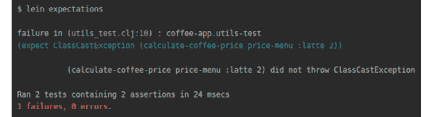

    图 10.16：使用 Expectations 库运行失败的测试

    `Expectations`库通知我们有一个测试失败了。我们还知道在哪个命名空间有一个失败的测试以及哪一行代码导致了测试失败。这使我们能够快速找到失败的测试。

    我们知道将字符串传递给`calculate-coffee-price`将导致错误。使用 Expectations，我们还可以检查函数的返回类型。

1.  在 Clojure 代码中，我们经常组合函数。一个函数作用于其他函数运行的结果。检查我们调用的函数返回我们期望的类型值是很常见的。使用`Expectations`，我们可以检查函数的返回类型：

    ```java
    (expect Number (calculate-coffee-price price-menu :latte 2))
    ```

    我们期望`calculate-coffee-price`将返回一个数字：

    ![图 10.17：使用 Expectations]

    ](img/B14502_10_17.jpg)

    图 10.17：使用 Expectations

    运行测试确认，该数字是`calculate-coffee-price`函数正确的返回类型。使用`Expectations`，我们还可以测试一个集合是否包含请求的元素。

1.  `price-menu`哈希表包含有关可用咖啡的信息，例如类型和价格。使用`Expectations`，我们可以测试元素是否属于一个集合：

    ```java
    (expect {:latte 0.5} (in price-menu))
    ```

    我们期望在菜单上我们有拿铁，并且它的价格是`0.5`。

    ![图 10.18：测试拿铁是否属于菜单]

    ](img/B14502_10_18.jpg)

图 10.18：测试拿铁是否属于菜单

如预期的那样，在我们的菜单上，我们有拿铁。我们现在知道了 Clojure 中的两个测试库：`clojure.test`和 Expectations。我们将要学习的第三个测试库是`Midje`。

## 使用 Midje 库进行单元测试

`Midje`是 Clojure 中的一个测试库，它鼓励编写可读的测试。`Midje`建立在`clojure.test`提供的自底向上测试之上，并增加了对自顶向下测试的支持。自底向上测试意味着我们首先为单个函数编写测试。如果这个函数被其他函数使用，我们将在完成其他函数的实现后编写测试。

在咖啡订购应用程序中，我们有`load-orders`函数：

```java
(defn load-orders
      "Reads a sequence of orders in file at path."
      [file]
      (if (file-exists? file)
        (with-open [r (PushbackReader. (io/reader file))]
                   (binding [*read-eval* false]
                            (doall (take-while #(not= ::EOF %) (repeatedly #(read-one-order r))))))
        []))
```

`load-orders`函数使用了`file-exists?`函数。Clojure 中的函数不应执行许多操作。良好的实践是编写专注于单个任务的短小函数。`file-exist`函数检查文件。`load-orders`函数加载订单。因为我们不能从不存在的文件中加载订单，所以我们需要使用`file-exist`函数来检查保存订单的文件：

```java
(defn file-exists? [location]
      (.exists (io/as-file location)))
```

在自底向上的测试中，我们首先需要编写`file-exists`的实现。在我们有了`file-exist`的工作实现之后，然后我们可以编写`load-orders`的实现。这种编写测试的方式迫使我们思考所有函数的实现细节，而不是专注于我们想要实现的功能。我们的原始目标是加载文件中的数据，但现在我们专注于检查文件是否存在。

使用自上而下的方法，我们可以在不实现被测试函数使用的函数的情况下编写针对主测试函数的工作测试。我们声明我们想要测试`load-orders`函数，并且它使用`file-exist`函数，但我们不需要有一个完整的`file-exist`实现。我们只需要声明我们将使用此函数。这允许我们专注于我们想要测试的功能，而不用担心实现所有子步骤。

为了使用`Midje`，将其作为依赖项（`[midje "1.9.4"]`）添加到`project.clj`文件中。

## 练习 10.03：使用 Midje 测试咖啡应用

本练习的目的是学习如何使用`Midje`库并编写自上而下的测试。我们将为`calculate-coffee-price`编写测试。我们将使用自上而下的方法为`load-orders`函数编写测试：

1.  我们将导入`Midje`命名空间到`utils`命名空间：

    ```java
    (ns coffee-app.utils-test
        (:require [coffee-app.core :refer [price-menu]]
                  [coffee-app.utils :refer :all]
                  [midje.sweet :refer [=> fact provided unfinished]]))
    ```

    在导入`Midje`命名空间后，我们就可以使用`Midje`命名空间中的`fact`宏了。

1.  `Midje`使用`fact`宏，该宏声明了关于我们测试未来版本的某些事实。宏在`=>`符号的两侧都接受一个参数。`fact`宏声明左侧的结果应该在符号的右侧预期：

    ```java
    (fact (calculate-coffee-price price-menu :latte 3) => 3)
    ```

    我们编写了一个测试，预期三杯拿铁的价格是`3`。

    `Midje`支持在 REPL 中进行自动测试。

1.  使用自动测试，我们不需要每次更改时都运行测试。当自动测试器检测到更改时，它会自动运行测试。为了在`Midje`中使用自动测试，我们在 REPL 中启用自动测试：

    ```java
    lein repl
    ```

1.  在启动 REPL 后，我们导入`Midje`命名空间并启用自动测试器：

    ```java
    user=> (use 'midje.repl)
    user=> (autotest)
    ```

    在启动 REPL 后，我们导入了`Midje`命名空间。

    第二步是调用`autotest`函数。当我们的代码发生变化时，此函数将自动运行测试。

    启用自动测试后，我们的测试是通过我们在 REPL 中使用的`autotest`函数运行的：

    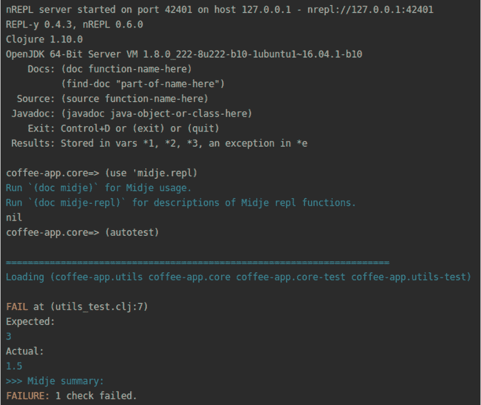

    图 10.19：执行测试

1.  `Midje`告诉我们测试失败了。三杯拿铁的价格不是`3`，而是`1.5`。当我们更改测试的实现时，自动测试再次运行：

    ```java
    (fact (calculate-coffee-price price-menu :latte 3) => 1.5)
    ```

    自动测试的运行方式如下：

    

    图 10.20：更改实现后运行自动测试

    这次，我们被告知测试通过。现在我们知道了如何运行自动测试以及如何使用`Midje`编写测试。现在是时候探索`Midje`中的自上而下测试了。

1.  在`utils`命名空间中，我们有一个`display-bought-coffee-message`函数，该函数显示购买咖啡类型的数量信息。此函数有一个硬编码的货币符号：

    ```java
    (defn display-bought-coffee-message [type number total]
          (str "Buying" number (name type) "coffees for total:€" total))
    ```

    从实用函数中获取货币代码而不是硬编码它将是一个不错的选择。正如欧元在许多欧洲国家使用一样，一些国家使用相同的货币，将获取货币的逻辑封装到函数中是一个好主意。

1.  我们将把有关货币的信息保存在一个哈希表中。记得从 *第一章*，*Hello REPL!*，哈希是一个 Clojure 集合，我们使用键和值来存储数据：

    ```java
    (def ^:const currencies {:euro {:countries #{"France" "Spain"} :symbol "€"}
                                            :dollar {:countries #{"USA"} :symbol "$"}})
    ```

    这允许我们检查不同国家使用的货币和货币符号。

1.  由于我们不打算编写货币函数的实现，我们将为此提供一个存根（替代）。

    我们在本章开头看到了存根的解释：

    ```java
    (unfinished get-currency)
    ```

1.  这告诉 `Midje` 我们计划使用 `get-currency` 函数，但我们还没有实现它。我们将针对欧元进行测试，因此我们将添加 `helper` 变量：

    ```java
    (def test-currency :euro)
    ```

1.  显示购买咖啡信息的函数最初看起来像这样：

    ```java
    (defn get-bought-coffee-message-with-currency [type number total currency]
          (format "Buying %d %s coffees for total: %s%s" number (name type) "€" total))
    ```

1.  `get-bought-coffee-message-with-currency` 函数的测试如下所示：

    ```java
    (fact "Message about number of bought coffees should include currency symbol"
          (get-bought-coffee-message-with-currency :latte 3 1.5 :euro) => "Buying 3 latte coffees for total: €1.5"
          (provided
            (get-currency test-currency) => "€"))
    ```

    在测试中，我们使用 `Midje =>` 符号。我们期望调用 `get-bought-coffee-message-with-currency` 的结果等于字符串消息。

    我们使用 `Midje` 提供的函数来存根对 `get-currency` 函数的调用。当 `Midje` 测试调用此函数时，它应该返回欧元符号，€。

    如果我们在 REPL 中检查自动运行，我们将看到以下内容：

    ![图 10.21：使用 Midje 测试 get-bought-coffee-message-with-currency 函数]

    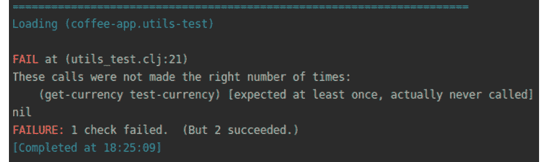

    ![图 10.21：使用 Midje 测试 get-bought-coffee-message-with-currency 函数]

1.  `Midje` 通知我们有一个测试失败了。`get-currency` 函数应该被调用，但实际上并没有被调用。我们只是编写了一个编译并运行的测试。我们没有得到编译错误。我们专注于显示消息的逻辑，这部分是成功的。一旦我们有 `get-bought-coffee-message-with-currency` 的测试，现在就是考虑使用 `get-currency` 来显示消息的时候了：

    ```java
    (defn get-bought-coffee-message-with-currency [type number total currency]
          (format "Buying %d %s coffees for total: %s%s" number (name type) (get-currency test-currency) total))
    ```

    这个 `get-bought-coffee-message-with-currency` 函数的实现使用了 `get-currency` 函数：

    ![图 10.22：使用 get-currency 函数后的再次测试]

    

![图 10.22：使用 get-currency 函数后的再次测试]

当我们在 REPL 中检查自动测试时，我们看到现在所有测试都通过了。

在这个练习中，我们能够使用 `Midje` 库编写测试。这个库允许我们使用自顶向下的方法编写测试，我们首先考虑测试主函数，然后是它调用的任何其他函数都是存根。这有助于我们专注于测试的主函数的行为，而不必担心实现所有使用的函数。

虽然我们使用了各种库来编写测试，但所有测试都是有限的。当我们测试 `calculate-coffee-price` 时，我们只测试了几次。如果我们能测试更多次，我们就可以更有信心地认为 `calculate-coffee-price` 函数按预期执行。编写几个测试可能很快，但编写 100 或 200 个测试则需要时间。幸运的是，使用属性测试，我们可以非常快速地生成大量的测试场景。

# 属性测试

**属性测试**，也称为生成式测试，描述了对于所有有效测试场景都应成立的属性。属性测试由一个生成有效输入的方法（也称为生成器）和一个接收生成输入的函数组成。此函数将生成器与被测试的函数结合起来，以决定该特定输入的属性是否成立。使用属性测试，我们可以在广泛的搜索空间内自动生成数据以查找意外问题。

想象一个房间预订应用程序。我们应该允许用户搜索适合家庭的房间。这样的房间至少应该有两张床。我们可以有一个函数，它只返回至少有两张床的房间。使用单元测试，我们需要编写以下场景：

+   零张床

+   一张床

+   两张床

+   三张床

+   四张床

+   五张床

+   以及其他场景

如果我们想要测试有 20 张床的房间，那就意味着要创建超过 20 个非常相似的测试。我们只需更改床的数量。我们可以通过一般性地描述家庭房间的特性来概括此类测试。正如我们所说，家庭房间至少有两张床。属性测试允许我们概括输入并为我们生成它们。因为输入是自动生成的，所以我们不受手动输入测试的限制，可以轻松地创建 1,000 个测试场景。在我们的家庭房间示例中，输入是房间数量。测试将涉及指定房间号是一个数字。使用属性测试，整数输入将自动为我们生成。

Clojure 提供了 `test.check` 库用于属性测试。属性测试有两个关键概念：

+   `test.check.generators` 命名空间包含许多内置生成器，以及组合函数，用于从内置生成器创建您自己的新生成器。

+   **属性**：属性是输入的特性。任何函数的输入都可以用一般术语来描述。在我们的家庭房间示例中，输入是房间数量。因此，属性是一个数字。

在下一个练习中，我们将为咖啡订购应用程序编写属性测试。

## 练习 10.04：在咖啡订购应用程序中使用属性测试

本练习的目的是学习如何使用属性测试创建测试。我们将描述 `calculate-coffee-price` 函数的输入，这将允许我们自动生成测试。

为了使用`test.check`库，我们需要在`project.clj`文件中将`[org.clojure/test.check "0.10.0"]`添加为依赖项：

1.  在我们可以在 utils 命名空间中使用`test.check`之前，我们需要导入必要的命名空间：

    ```java
    (ns coffee-app.utils-test
        (:require     [clojure.test.check :as tc]
                      [clojure.test.check.generators :as gen]
                      [clojure.test.check.properties :as prop]
                      [clojure.test.check.clojure-test :refer [defspec]]
                      [coffee-app.core :refer [price-menu]]
                      [coffee-app.utils :refer :all]))
    ```

    我们导入三个`test.check`命名空间：

    `clojure.test.check.generators`：将生成输入

    `clojure.test.check.properties`：将允许我们以通用形式描述输入

    `clojure.test.check.clojure-test`：将允许我们与 clojure.test 集成

    如果我们想在 REPL 中导入这些命名空间，我们会这样做：

    ```java
    (require '[clojure.test.check :as tc]
                  '[clojure.test.check.generators :as gen]
                  '[clojure.test.check.properties :as prop])
    ```

    一旦我们导入了必要的命名空间，我们就可以看看如何生成输入。

1.  为了生成测试输入，我们将使用生成器。`calculate-coffee-price`函数接受一个杯数作为参数。我们需要一个创建类似`small-integer`这样的数字的生成器：

    ```java
    (gen/sample gen/small-integer)
    ```

    生成器命名空间中的`small-integer`函数返回介于`-32768`和`32767`之间的整数。`sample`函数返回指定类型的样本集合。在上面的例子中，我们有一个小整数的样本集合：

    

    图 10.23：创建小整数的样本

1.  使用生成器组合子，我们可以获得新的生成器。`fmap`生成器允许我们通过将函数应用于另一个生成器创建的值来创建一个新的生成器。`fmap`生成器的工作方式类似于我们第一章节中了解到的`map`函数。它允许我们将函数映射到由以下生成器创建的值。在这个例子中，`small-integer`生成器创建的每个整数都通过`inc`函数进行增加：

    ```java
    (gen/sample (gen/fmap inc gen/small-integer))
    ```

    这将返回以下内容：

    ```java
    (1 2 1 -1 -3 4 -5 -1 7 -6)
    ```

    我们能够通过使用`fmap`组合子应用`inc`函数来增加`small-integer`生成器生成的数字数量。

    我们现在知道了如何使用生成器创建输入。现在是学习如何描述输入属性的时候了。

1.  属性是一个实际的测试——它结合了一个生成器和你想要测试的函数，并检查在给定的生成值下函数是否按预期行为。

    属性是通过`clojure.test.check.properties`命名空间中的`for-all`宏创建的：

    ```java
    (defspec coffee-price-test-check 1000
             (prop/for-all [int gen/small-integer]
                           (= (float (* int (:latte price-menu))) (calculate-coffee-price price-menu :latte int))))
    ```

    `defspec`宏允许你像标准`clojure.test`测试一样运行`test.check`测试。这允许我们将基于属性的测试与标准单元测试一起扩展到测试套件中。在`for-all`宏中，我们使用小整数生成器创建一系列小整数。当生成器创建的咖啡杯数乘以咖啡的价格时，我们的测试通过。这个计算的结果应该等于运行`calculate-coffee-price`函数的结果。我们打算运行这个测试 1,000 次。这真是太神奇了，我们只用了三行代码就能创建 1,000 个测试。

1.  我们可以使用 Leiningen 运行`test.check`测试：

    ```java
    lein test
    ```

    输出如下：

    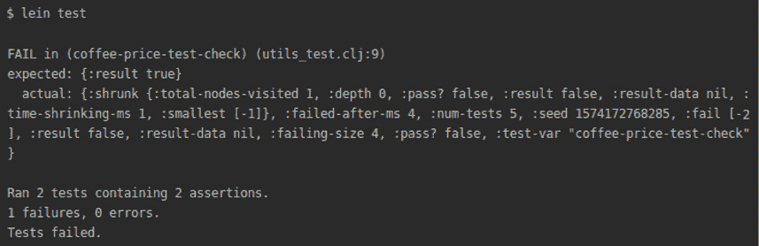

    ```java
    {:num-tests 5,
     :seed 1528580863556,
     :fail [[-2]],
     :failed-after-ms 1,
     :result false,
     :result-data nil,
     :failing-size 4,
     :pass? false,
     :shrunk
     {:total-nodes-visited 5,
      :depth 1,
      :pass? false,
      :result false,
      :result-data nil,
      :time-shrinking-ms 1,
      :smallest [[-1]]}}
    ```

    我们的测试失败了。原始失败的例子`[-2]`（在`:fail`键中给出）已经被缩减到`[-1]`（在`[:shrunk :smallest]`下）。测试失败是因为在`calculate-coffee-price`的实现中，我们只返回绝对的非负值。当前`calculate-coffee-price`的实现如下：

    ```java
    (defn calculate-coffee-price [coffees coffee-type number]
          (->
            (get coffees coffee-type)
            (* number)
            float
            Math/abs))
    ```

    在最后一行，我们有`Math/abs`函数调用。`calculate-coffee-price`应该只返回绝对数值。然而，在我们的测试中，我们允许生成负数。我们需要使用不同的生成器来匹配`calculate-coffee-price`函数的预期结果。

1.  `test.check`提供了一个`nat`生成器，可以创建自然数（非负整数）。

    `calculate-coffee-price`的测试应该更新为以下内容：

    ```java
    (defspec coffee-price-test-check 1000
             (prop/for-all [int gen/nat]
                           (= (float (* int (:latte price-menu))) (calculate-coffee-price price-menu :latte int))))
    ```

    当我们使用这个生成器运行测试时，测试通过了：

    ```java
    lein test
    ```

    输出如下：

    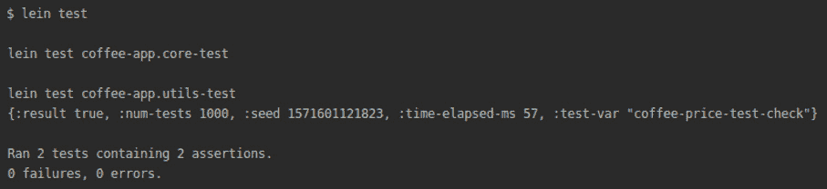

    图 10.25：使用 nat 创建非负整数并运行测试

    我们能够测试`calculate-coffee-price`函数 1,000 次。每次我们生成一个整数，并将其作为杯数。使用`test.check`，我们可以真正地检查参数与生成的输入是否匹配。我们只测试了杯数参数。现在是时候编写生成器并测试所有参数了。

1.  为了生成`calculate-coffee-price`函数的所有剩余参数，我们将使用一些新的生成器。创建所有参数的代码如下：

    ```java
    (defspec coffee-price-test-check-all-params 1000
      (prop/for-all [int (gen/fmap inc gen/nat)
                          price-hash (gen/map gen/keyword 
                                                    (gen/double* {:min 0.1 :max 999 :infinite? false :NaN? false}) 
                                           {:min-elements 2})]  
                           (let [coffee-tuple (first price-hash)]
                                (= (float (* int (second coffee-tuple)))
                                     (calculate-coffee-price price-hash (first coffee-tuple) int)))))
    ```

    存储咖啡菜单信息的咖啡哈希表包含有关咖啡类型的键和其值的双精度数：

    ```java
    {:latte 0.5 :mocha 0.4}
    ```

    `gen/map`生成器允许我们创建一个哈希表。在哈希表中，我们想要生成一个关键字作为键和一个双精度数作为值。我们将值限制在 0.1 到 999 之间。我们只对数字感兴趣。我们不想得到无限值。使用生成器，如果我们想的话，可以创建一个无限值。我们也不想生成 NaN（不是一个数字）。最后，我们的哈希表应该至少有两个元素——确切地说，是两个元组。每个元组是一对键和值。

    在`let`块中，我们取第一个元组并将其分配给`coffee-tuple`。这将帮助我们测试并传递适当的参数给`calculate-coffee-price`函数。

    我们将再次运行测试：

    ```java
    lein test
    ```

    输出如下：

    

图 10.26：生成`calculate-coffee-price`函数的所有参数后运行测试

我们看到`test.check`测试都通过了。用几行代码，我们就能够测试 2,000 种场景。这真是太神奇了。

到目前为止，我们已经测试了 `calculate-coffee-price` 函数。在接下来的活动中，你将编写来自咖啡订购应用程序的其他函数的测试。

## 活动 10.01：为咖啡订购应用程序编写测试

在这个活动中，我们将应用关于单元测试的知识来编写测试套件。许多在生产中运行的应用程序非常复杂。它们有很多功能。开发者编写单元测试是为了增加他们对应用程序的信任。编写的代码应该满足业务需求。一个编写良好且维护良好的测试套件会给开发者和使用此类应用程序的人带来信心，即应用程序的功能按预期执行。

在上一章中，我们编写的咖啡订购应用程序使我们能够显示咖啡菜单并订购一些咖啡。在本章中，我们通过测试 `calculate-coffee-price` 函数学习了 Clojure 中的单元测试库。在咖啡订购应用程序中，还有一些尚未测试的函数。

在这个活动中，我们将为以下函数编写单元测试：

+   `display-order`: 显示关于顺序的信息

+   `file-exist`: 检查指定的文件是否存在

+   `save-coffee-order`: 将咖啡订单保存到文件

+   `load-orders`: 从文件中加载咖啡订单

这些步骤将帮助您完成活动：

1.  导入测试命名空间。

1.  使用 `clojure.test` 库创建测试以显示订单消息：

    使用 `is` 宏的测试

    使用 `are` 宏的测试

1.  使用 `clojure.test` 库创建测试以检查文件是否存在或文件不存在

1.  使用 `clojure.test` 库创建测试以保存订单、加载空订单、加载咖啡订单。

1.  使用 `expectations` 库创建测试以将数据保存到文件、保存咖啡订单、保存咖啡数据以及加载订单

1.  使用 `expectations` 库创建测试以检查文件是否存在。

1.  使用 `expectations` 库创建测试以保存和加载订单。

1.  使用 `Midje` 库创建测试以显示订单消息。

1.  使用 `Midje` 库创建测试以检查文件是否存在。

1.  使用 `Midje` 库创建测试以加载订单。

1.  使用 `test.check` 创建测试以显示订单消息：

    导入 `test.check` 命名空间

    测试显示的订单

1.  使用 `test.check` 创建测试来检查文件是否存在。

1.  使用 `test.check` 创建测试以加载订单。

`clojure.test` 和 `test.check` 测试的输出将如下所示：

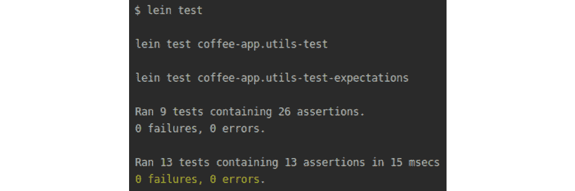

图 10.27：clojure.test 和 test.check 测试的预期输出

`expectations` 测试的输出将如下所示：


图 10.28：expectations 测试的预期输出

`Midje` 测试的输出将如下所示：

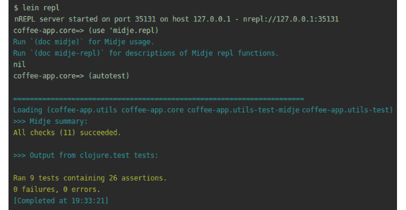

图 10.29：Midje 测试的输出

`test.check` 测试的输出将如下所示：


图 10.30：`test.check` 测试的输出

注意

该活动的解决方案可以在第 723 页找到。

我们现在知道如何使用四个库在 Clojure 中编写单元测试。在下一节中，我们将探讨 ClojureScript 中的测试。

# ClojureScript 中的测试

在 Clojure 中，我们使用`clojure.test`库进行测试。在 ClojureScript 中，我们有`clojure.test`的端口，形式为`cljs.test`。在`cljs.test`中，我们具有使用`clojure.test`库编写测试时使用的功能。我们可以使用`is`和`are`宏来编写我们的测试。`cljs.test`提供了异步测试的设施。异步测试是一种测试异步代码的类型。我们将很快看到为什么`cljs.test`允许我们测试异步代码是如此重要。

同步代码是开发者大多数时候编写的内容，即使没有意识到这一点。在同步代码中，代码是逐行执行的。例如，第 10 行定义的代码需要完成执行，第 11 行的代码才能开始执行。这是逐步执行。异步编程是一个更高级的概念。

在异步编程中，执行代码和完成代码的执行不能按行进行。例如，我们可以在第 10 行安排下载一首歌曲，然后在第 11 行我们可以有代码让用户知道下载已完成。在同步代码中，我们必须等待下载完成，然后才能向用户显示信息或执行其他操作。这并不是我们真正想要的。我们希望在下载歌曲时通知用户进度。在异步代码中，我们会在歌曲下载之前安排下载歌曲并开始显示进度条。

在 Java 和 Clojure 中，我们会使用线程来编写异步代码。线程是在 JVM 上消耗少量计算机资源的进程。一个线程会处理下载歌曲，另一个线程会显示进度条。

如我们在*第一章*，*Hello REPL*中学到的，ClojureScript 在 JavaScript 之上运行。JavaScript 提供了一个单线程环境。这与允许创建许多线程的 Java 形成对比。为单个线程编写代码更简单，因为我们不需要在许多线程之间协调资源共享。需要异步代码的 ClojureScript 应用程序需要使用一些其他设施而不是线程。

JavaScript 提供了回调来管理异步代码的编写。回调是我们定义的，在满足某些条件时运行的函数。在我们的下载示例中，回调会让我们知道下载何时完成，这样我们就可以通知用户。

ClojureScript 提供了 `core.async` 库来处理异步代码。`core.async` 库有许多函数和宏：

+   `go`：创建一个标记代码为异步的块。块的结果被放置在通道上。

+   `<!`：从一个通道中获取一个值。

我们为什么需要一个 go 块和通道？

异步代码按定义是异步的。我们不知道何时会从异步调用中获得返回值。当我们使用通道进行异步调用时，我们的代码变得更简单。这是因为返回值被放置在通道上。我们不需要管理这个通道。`core.async` 为我们管理这个通道。当我们准备好时，我们只需从这个通道中获取值。没有显式的通道管理，我们的代码更短，因为代码可以专注于更简单的任务，这些任务是我们编写的。

在以下练习中，我们将看到如何在 ClojureScript 中设置和使用测试库。

## 练习 10.05：在 ClojureScript 中设置测试

这个练习的目的是学习如何在 ClojureScript 中设置测试库以及如何使用这些库。我们将使用 `cljs.test` 进行测试。

在这个练习中，我们将创建多个文件夹和文件。有许多创建文件夹和文件的方法。读者可以自由选择他们最舒适的方法。以下步骤将使用命令行。


图 10.31：命令及其描述

1.  创建一个名为 `hello-test` 的项目，如下所示：

    ```java
    mkdir hello-test
    ```

    这将创建一个项目，我们将在此项目中保存我们的代码。一旦我们完成设置，项目结构应如下所示。我们可以使用 `tree` 命令或您喜欢的任何方式来检查目录：

    ```java
    tree
    ```

    输出如下：

    

    

    图 10.32：项目结构

1.  在源文件夹中，我们将保存我们的代码：

    ```java
    mkdir -p src/hello_test
    ```

    执行此命令将创建 `src` 和 `hello_test` 文件夹。

1.  创建一个源文件。在源文件中，我们将保存我们的代码：

    ```java
    touch src/hello_test/core.cljs
    ```

    此命令创建一个空的核心文件。

1.  创建一个核心命名空间。在 `core.cljs` 文件中，添加一个命名空间：

    ```java
    (ns hello-test.core)
    ```

1.  在 `core.cljs` 文件中，放置一个用于加法运算的函数：

    ```java
    (defn adder [x y ]
          (+ x y))
    ```

1.  创建一个测试文件夹。

    我们将为我们的测试文件创建一个文件夹：

    ```java
    mkdir -p test/hello_test
    ```

    此命令将创建 `test` 和 `hello_test` 文件夹。

1.  创建配置。

    我们将在 `project.clj` 文件中保存项目配置。该文件应如下所示：

    ```java
    (defproject hello-test "0.1.0-SNAPSHOT"
                :description "Testing in ClojureScript"
                :dependencies [[org.clojure/clojure "1.10.0"]
                               [org.clojure/clojurescript "1.10.520"]
                               [cljs-http "0.1.46"]
                               [org.clojure/test.check "0.10.0"]
                               [funcool/cuerdas "2.2.0"]])
    ```

    这是一个标准的 `project.clj` 文件，就像我们在 *第八章*，*命名空间、库和 Leiningen* 中创建的那样。在 `project.clj` 文件中，我们有 `:dependencies` 键，我们将在此键中放置我们需要的用于测试的库。

    `cljs-http` 库将允许我们进行 HTTP 调用。我们将使用 `GET` 请求来执行将被测试的异步调用。

    `cuerdas` 库有许多字符串实用函数。以下是一些函数：

    `capital`：将字符串的第一个字符转换为大写。字符串"john"变为"John"。

    `Clean`：删除并替换多个空格为单个空格。字符串" a b "变为"a b"。

    `Human`：将字符串或关键字转换为人类友好的字符串（小写和空格）。字符串"DifficultToRead"变为"difficult to read"。

    `Reverse`：返回一个反转的字符串。字符串"`john`"变为"`nhoj`"。

    我们将编写操作字符串的单元测试。

1.  添加测试插件依赖。我们将使用`lein-doo`插件来运行 ClojureScript 测试。在`project.clj`文件中添加以下行：

    ```java
    :plugins [[lein-doo "0.1.11"]]
    ```

    `lein-doo`插件将被用来运行 ClojureScript 测试。这个插件将自动运行测试并显示测试结果。我们将对 Web 浏览器环境运行`lein-doo`。`lein-doo`依赖于 JavaScript 的`Karma`库在 JavaScript 环境中运行测试。Karma 是一个帮助运行 JavaScript 测试的 JavaScript 工具。我们需要安装`Karma`的必要依赖。

1.  安装 Karma。Karma 使用`npm`相当于我们在第八章中学习的 Maven。基本上，它是一个项目仓库。虽然 Maven 托管 Java 项目，但 npm 托管 JavaScript 项目。

    我们将使用 npm 来安装 Karma：

    ```java
    npm install karma karma-cljs-test –save-dev
    ```

    使用`-save-dev`标志，我们在当前目录中安装`karma`包。使用`-save-dev`标志的目的是允许我们在项目之间分离不同的测试配置。一个遗留项目可能仍然依赖于 Karma 的旧版本，而新项目可以使用 Karma 的新版本。

1.  我们将安装 Chrome Karama 启动器。我们的测试将在 Chrome 浏览器中运行（启动）：

    ```java
    npm install karma-chrome-launcher –save-dev
    ```

    前面的命令在`npm`中搜索`karma-chrome-launcher`项目。当`npm`找到这个项目时，它将下载 Chrome 启动器并安装它。使用`-save-dev`标志，我们在当前目录中安装`karma-chrome-launcher`。

1.  安装 Karma 命令行工具。

    安装 Karma 库的最终步骤是安装允许执行 Karma 命令的命令行工具：

    ```java
    npm install -g karma-cli
    ```

    我们将全局安装 Karma 命令行工具，因为运行测试的 ClojureScript 插件需要访问 Karma 命令。

1.  我们需要在`project.clj`文件中设置测试任务的构建配置：

    ```java
    :cljsbuild {:builds
                        {:test {:source-paths ["src" "test"]
                                                 :compiler {:output-to "out/tests.js"
                                                                  :output-dir "out"
                                                                  :main hello-test.runner
                                                                  :optimizations :none}}}}
    ```

    ClojureScript 构建配置在`project.clj`文件中的`:cljsbuild`键下设置。我们指定一个`:browser-test`构建。此构建将访问`src`和`test`目录中的文件。代码将被编译到`out`目录下的`tests.js`文件。测试的`:main`入口点是`hello-test.runner`命名空间。对于测试，我们不需要任何编译优化，因此我们将优化参数设置为`:none`。

1.  创建核心测试文件：

    ```java
    touch test/hello_test/core_test.cljs
    ```

    此命令创建`core_test.cljs`文件。

1.  导入测试命名空间。

    `core_test.cljs`文件将包含测试。我们需要导入必要的命名空间：

    ```java
    (ns hello-test.core-test
      (:require [cljs.test :refer-macros [are async deftest is testing]]
                    [clojure.test.check.generators :as gen]
                    [clojure.test.check.properties :refer-macros [for-all]]
                    [clojure.test.check.clojure-test :refer-macros [defspec]]
                    [cuerdas.core :as str]
                    [hello-test.core :refer [adder]]))
    ```

    我们从 `cljs.test` 命名空间导入测试宏。我们将使用它们来测试我们的代码。我们还从 `test.check` 命名空间导入命名空间。我们将为我们的函数编写基于属性的测试。`cuerdas` 命名空间将用于操作字符串。最后，我们从 `hello-test.core` 命名空间导入测试函数。

1.  创建一个测试运行器。

    测试运行器是一个运行所有测试的文件。我们将使用 Karma 的浏览器引擎来测试我们的代码：

    ```java
    touch test/hello_test/runner.cljs
    ```

1.  导入测试运行器的命名空间。

    在 `hello_test.runnerfile` 中，我们导入核心测试命名空间和 `lein-doo` 命名空间：

    ```java
    (ns hello-test.runner
      (:require [doo.runner :refer-macros [doo-tests]]
                    [hello-test.core-test]))
    (doo-tests 'hello-test.core-test)
    ```

    我们让 `lein-doo` 知道它需要从 `hello-test.core-test` 命名空间运行测试。

1.  一旦安装 Karma 并创建所有文件，项目结构应该如下所示：

    ```java
    tree
    ```

    输出如下：

    ![图 10.33：安装 Karma 并创建所有文件后的项目结构]

    ![图片 B14502_10_33.jpg]

    图 10.33：安装 Karma 并创建所有文件后的项目结构

    我们准备好启动测试运行器。

1.  启动测试运行器：

    ```java
    lein doo chrome test
    ```

    我们调用 `lein doo` 插件，使用 Chrome 浏览器运行测试。请记住，JavaScript 是一种在浏览器中运行的编程语言。

    ![图 10.34：启动测试运行器]

    ![图片 B14502_10_34.jpg]

图 10.34：启动测试运行器

`lein doo` 插件为我们启动了一个 Karma 服务器。服务器正在监视源代码和测试目录。当我们对 ClojureScript 文件进行更改时，测试将针对我们的代码运行。

在这个练习中，我们学习了如何在 ClojureScript 中设置测试。在下一个练习中，我们将学习如何编写 ClojureScript 测试。

## 练习 10.06：测试 ClojureScript 代码

在上一个练习中，我们为 ClojureScript 测试配置了一个项目。在这个练习中，我们将编写 ClojureScript 测试。我们将使用来自 `cuerdas` 库的函数来操作字符串。我们还将测试异步的 ClojureScript 代码。

我们将实现并测试三个函数：

+   `profanity-filter`：在聊天应用或网络论坛中过滤某些单词是很常见的。粗口过滤器将移除我们认为不恰当的单词。

+   `prefix-remover`：这个函数将使用字符串函数并从单词中移除前缀。

+   `http-caller`：这个函数将对一个网址进行 HTTP 调用。这将帮助我们测试异步代码。

1.  导入核心文件的命名空间。

    在 `core.cljs` 文件中，添加必要的命名空间：

    ```java
    (ns hello-test.core
      (:require [cuerdas.core :as str]))
    ```

    我们导入用于字符串操作的 `cuerdas` 命名空间。

1.  创建一个粗口过滤器。在 `hello_test.core.cljs` 文件中，我们将编写的第一个函数是一个粗口过滤器：

    ```java
    (defn profanity-filter [string]
          (if (str/includes? string "bad")
            (str/replace string "bad" "great")
            string))
    ```

    在这个函数中，我们测试传入的字符串是否包含单词 `bad`。如果包含，我们将它替换为单词 `great`。

1.  导入测试命名空间。

    在 `hello_test.core_test.cljs` 文件中，导入必要的测试命名空间：

    ```java
    (ns hello-test.core-test
      (:require [cljs.test :refer-macros [are async deftest is testing]]
                [cuerdas.core :as str]
                [hello-test.core :refer [profanity-filter]]))
    ```

1.  编写 `profanity-filter` 函数的测试。

    在`hello_test.core_test.cljs`文件中，为粗口过滤器函数添加一个测试：

    ```java
    (deftest profanity-filter-test
             (testing "Filter replaced bad word"
                      (is (= "Clojure is great" (profanity-filter "Clojure is bad"))))
             (testing "Filter does not replace good words"
                      (are [string result] (= result (profanity-filter string))
                           "Clojure is great" "Clojure is great"
                           "Clojure is brilliant" "Clojure is brilliant")))
    ```

    测试看起来与我们使用`clojure.test`库编写的测试类似。我们使用`is`和`are`宏来设置测试场景。我们已经准备好运行测试。

1.  为了运行测试，我们从命令行调用`lein doo`任务。如果你在之前的练习中有一个正在运行的`lein doo`，它将监视文件变化并为我们运行测试：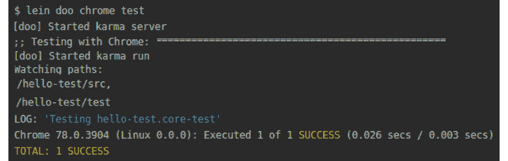

    图 10.35：从命令行调用 lein doo 任务

    粗口过滤器测试已运行。输出告诉我们有一个测试成功执行。

1.  如果你没有运行`lein doo`，你需要启动`lein doo`：

    ```java
    lein doo chrome test
    ```

    启动`lein doo`任务将开始监视我们的 ClojureScript 文件变化：

    

    图 10.36：启动 lein doo 任务

    一旦`lein doo`开始监视我们的文件变化，我们就可以开始了。我们被告知`karma`服务器已经启动。自动运行器正在监视`src`和`test`目录中的变化。这些目录中的任何变化都将导致`lein doo`再次运行测试。

    前往`hello_test.core_test.cljs`文件，保存文件，并观察测试的执行过程：

    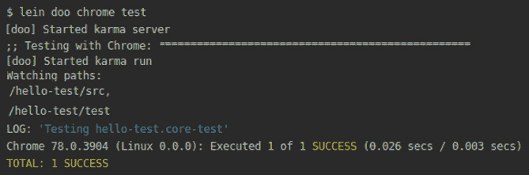

    图 10.37：执行测试

    我们被告知有一个测试已成功执行。

1.  自动运行器会告诉我们测试是否失败。如果我们添加以下测试，自动运行器会告诉我们有一个测试失败了：

    ```java
    (deftest capitalize-test-is
             (testing "Test capitalize? function using is macro"
                      (is (= "katy" (str/capitalize "katy")))
                      (is (= "John" (str/capital "john")))
                      (is (= "Mike" (str/capitalize "mike")))))
    ```

    测试失败如下：

    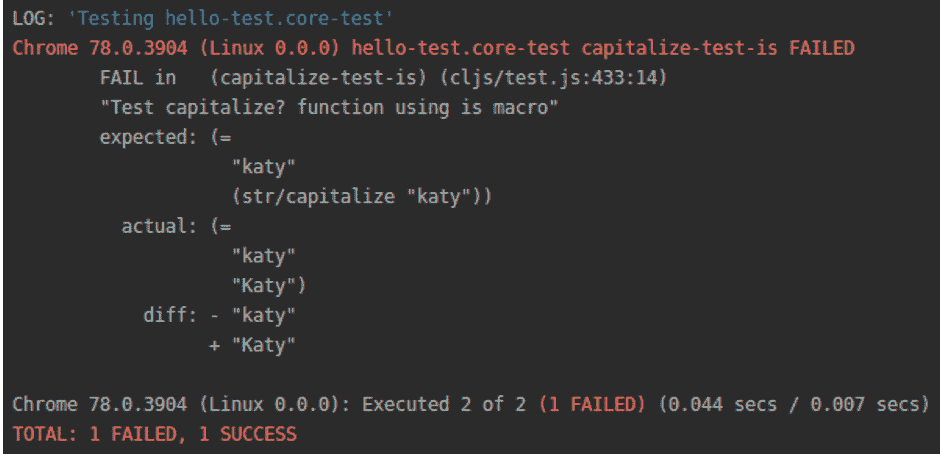

    ```java
    (is (= "Katy" (str/capitalize "katy")))
    ```

    在测试中，我们将小写字符串"`katy`"传递给`cuerdas`库中的`capitalize`函数。`capitalize`函数将首字母大写，"k"，并返回一个新的字符串，"`Katy`"。这个新字符串与测试中的字符串`Katy`进行比较。

    由于两个字符串`Katy`和`Katy`相等，测试将通过。

    自动运行器告诉我们现在所有的测试都通过了：

    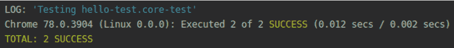

    图 10.39：修复字符串大小写后所有测试通过

1.  我们可以检查我们的代码抛出的错误：

    ```java
    (deftest error-thrown-test
             (testing "Catching errors in ClojureScript"
                      (is (thrown? js/Error (assoc ["dog" "cat" "parrot"] 4 "apple")))))
    ```

    在前面的代码中，我们想要在第四个索引处插入一个苹果，但因为我们只有三个元素，所以这个索引不存在。记住，在 Clojure 中，第一个索引是 0，所以列表中的第三个元素的索引是 2。尝试在索引 4 处添加一个元素会在 ClojureScript 中生成一个错误。在我们的测试中，我们捕获了这个错误：

    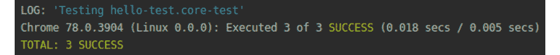

    图 10.40：第三次测试通过，因为我们捕获了代码中的错误

    自动运行测试测试我们的代码，第三次测试通过。

1.  在 ClojureScript 中，我们可以向网站发起请求。这些请求是异步的。我们将导入帮助我们进行异步调用的 ClojureScript 命名空间：

    ```java
    (ns hello-test.core
      (:require-macros [cljs.core.async.macros :refer [go]])
      (:require [cljs.core.async :refer [<!]]
                [cljs-http.client :as http]))
    ```

    `cljs-http.client`命名空间将允许我们进行 HTTP 调用。来自`core.async`命名空间的函数将为我们管理异步调用。

1.  我们的 HTTP 函数将接受三个参数，一个网站地址、HTTP 参数以及一个在向网站地址发送请求后调用的回调函数：

    ```java
    (defn http-get [url params callback]
          (go (let [response (<! (http/get url params))]
                   (callback response))))
    ```

1.  我们有进行异步调用的函数。我们需要导入这个函数：

    ```java
    (ns hello-test.core-test
      (:require [hello-test.core :refer [http-get]))
    ```

1.  在 ClojureScript 中，HTTP 调用是异步发生的。一个`GET`请求会在请求完成后运行回调函数。这对于测试异步代码来说是非常理想的：

    ```java
    (deftest http-get-test
             (async done
                    (http-get "https://api.github.com/users" {:with-credentials? false
                                                              :query-params      {"since" 135}}
                              (fn [response]
                                  (is (= 200 (:status response)))
                                  (done)))))
    ```

    `async`宏允许我们为测试编写异步代码块。在我们的代码块中，我们向 GitHub API 发起 GET 请求以访问当前公开用户列表。`http-get`函数将回调函数作为最后一个参数。在回调中，我们检查响应。成功的响应将具有状态`200`。

    回调中的最后一个函数调用是`done`。`done`是一个在我们准备好放弃控制并允许下一个测试运行时被调用的函数：

    ![图 10.41：第四次测试通过]

    ![图片 B14502_10_41.jpg]

    图 10.41：第四次测试通过

    我们的请求成功了，第四次测试通过了。

1.  导入用于基于属性的测试的命名空间。ClojureScript 允许我们使用基于属性的测试来检查我们的函数：

    ```java
    (ns hello-test.core-test
      (:require [clojure.test.check.generators :as gen]
                    [clojure.test.check.properties :refer-macros [for-all]]
                    [clojure.test.check.clojure-test :refer-macros [defspec]]))
    ```

    我们已经了解了生成器和用于基于属性的测试的属性。使用生成器，我们可以创建各种类型的函数输入，如数字或字符串。属性允许我们描述输入的特性。

    `defspec`宏允许我们编写可以用`clsj.test`库运行的测试。

1.  使用基于属性的测试，我们可以检查 1,000 种场景与我们的粗话过滤器。在 ClojureScript 中，基于属性的测试结构与 Clojure 中的结构相同：

    ```java
    (defspec simple-test-check 1000
             (for-all [some-string gen/string-ascii]
                       (= (str/replace some-string "bad" "great") (profanity-filter some-string))))
    ```

    使用`for-all`宏，我们指定函数参数应该具有哪些属性。对于粗话过滤器，我们生成 ASCII 字符串。ASCII 是从美国信息交换标准代码（American Standard Code for Information Interchange）缩写而来，是一种电子通信的字符编码标准：

    ![图 10.42：第五次测试通过]

    ![图片 B14502_10_42.jpg]

图 10.42：第五次测试通过

我们的第五次测试通过了。此外，`test.check`告诉我们执行了 1,000 个测试场景。

在这个练习中，我们看到了如何在 ClojureScript 中设置测试。我们编写了函数，并使用`cljs.test`和`test.check`库来测试它们。在下一节中，我们将看到如何将测试集成到现有项目中。

## 使用 Figwheel 测试 ClojureScript 应用程序

在 *第九章*，*Java 和 JavaScript 与宿主平台互操作性* 中，我们学习了 Figwheel。Figwheel 允许我们创建 ClojureScript 应用程序。大多数开发者使用 Figwheel，因为它提供了热代码重新加载功能。这意味着我们代码中的任何更改都会被重新编译，并且运行在网页浏览器中的应用程序会得到更新。

在上一个练习中，我们学习了如何向 ClojureScript 项目添加测试。Figwheel 内置了测试配置。创建应用程序后，任何 Figwheel 应用程序都可以添加测试。因为测试配置包含在每个项目中，开发者可以节省时间。开发者不需要安装外部工具或创建配置；他们可以直接开始编写测试。

在 *第九章*，*Java 和 JavaScript 与宿主平台互操作性* 中，我们详细讨论了 Figwheel 项目。作为提醒，在 Figwheel 中，我们使用两个概念：

+   响应式组件

+   应用状态管理

对于响应式组件——对用户操作做出反应的 HTML 元素——我们将使用 Rum 库。应用程序的状态将保存在一个原子中。并发是 *第十二章*，*并发* 中讨论的主题。就我们的目的而言，原子是一种类似于集合的数据结构。我们在 *第一章*，*Hello REPL!* 中学习了集合。集合和原子之间的主要区别是我们可以更改原子的值，而集合是不可变的。

## 练习 10.07：Figwheel 应用程序中的测试

在上一个部分，我们学习了 Figwheel 支持测试 ClojureScript 应用程序。我们回顾了使用 Figwheel 创建 ClojureScript 应用程序的好处。我们还提醒了自己在 Figwheel 应用程序中的重要概念，例如响应式组件和应用状态管理。

在这个练习中，我们将调查 Figwheel 如何配置项目以支持 ClojureScript 中的测试。Figwheel 旨在支持开发者创建应用程序。Figwheel 为我们设置了默认的测试配置。在 *练习 10.5*，*在 ClojureScript 中设置测试* 中，我们看到了配置 ClojureScript 中的测试需要多少设置。使用 Figwheel，我们不需要编写此配置；我们可以专注于编写我们的代码。

为了在 Figwheel 中编写测试，我们需要了解 Figwheel 如何设置默认的测试配置：

1.  创建一个 Figwheel 应用程序：

    ```java
    lein new figwheel-main test-app -- --rum
    ```

    我们使用 Rum 创建了一个新的 Figwheel 项目。

1.  测试 `project.clj` 文件中的配置。

    Figwheel 在 `project.clj` 文件中放置了一些测试配置：

    ```java
    :aliases {"fig:test"  ["run" "-m" "figwheel.main" "-co" "test.cljs.edn" "-m" "test-app.test-runner"]}
    ```

    在 `project.clj` 文件中，Figwheel 定义了别名以帮助在命令行上运行任务。别名是我们经常使用的命令的快捷方式。使用别名可以节省开发者输入。Figwheel 定义了 `fig:test` 任务。

    此任务在命令行上运行，并带有多个参数：

    `-m`：在文件中搜索主函数。记得在 *第八章*，*命名空间、库和 Leiningen* 中，Leiningen 项目的 `main` 函数是应用程序的入口点。我们在 `main` 函数中启动应用程序。

    `-co`：从给定的文件中加载选项。

1.  测试 `test.cljs.edn` 文件中的配置。在 `test.cljs.edn` 文件中，我们有测试配置：

    ```java
    {
      ;; use an alternative landing page for the tests so that we don't launch the application
      :open-url "http://[[server-hostname]]:[[server-port]]/test.html"
      }
    {:main test-app.test-runner}
    ```

    当 Figwheel 应用程序运行时，它会启动一个网页。Figwheel 提供了两个网页。有一个网页用于我们正在开发的实际应用程序。还有一个不同的网页用于测试。

    Figwheel 还在 `test-app.test-runner` 命名空间中提供了一个主方法。

1.  测试运行器命名空间。在 `test/test_app/test_runner.cljs` 文件中，我们有运行 ClojureScript 测试的代码：

    ```java
    (ns test-app.test-runner
      (:require
        ;; require all the namespaces that you want to test
        [test-app.core-test]
        [figwheel.main.testing :refer [run-tests-async]]))
    (defn -main [& args]
      (run-tests-async 5000))
    ```

    首先，在文件中，我们引入了我们想要测试的命名空间。最初，要测试的唯一命名空间是由 Leiningen 默认创建的 `test-app.core-test` 命名空间。如果我们为测试添加更多文件，我们需要在这些文件中导入命名空间。第二个需要的命名空间是一个包含实用函数的 Figwheel 命名空间。

    第二，我们有 `-main` 函数。这个函数由 Leiningen 调用来运行测试。Figwheel 提供了一个 `run-tests-async` 函数。这意味着测试以异步方式运行。这意味着测试可以比同步方式运行得更快。它们运行得更快，因为测试不需要等待其他测试完成才能开始。

1.  在 `test/test_app/core_test.cljs` 文件中，我们有 Figwheel 自动生成的测试：

    ```java
    (ns test-app.core-test
        (:require
         [cljs.test :refer-macros [deftest is testing]]
         [test-app.core :refer [multiply]]))
    ```

    Figwheel 首先需要我们熟悉的 `cljs.test` 命名空间及其宏。测试将使用 `deftest`、`is` 和 `testing` 等宏。

    需要的第二个命名空间是 `test-app.core` 命名空间。这个命名空间，从源目录开始，包含了 `multiply` 函数的实现。

1.  在 `core_test.cljs` 文件中，我们有两组自动生成的测试：

    ```java
    (deftest multiply-test
      (is (= (* 1 2) (multiply 1 2))))
    (deftest multiply-test-2
      (is (= (* 75 10) (multiply 10 75))))
    ```

    两个测试都使用了熟悉的 `is` 宏。使用 `is` 宏，我们测试调用 `multiply` 函数是否等于预期的输出。将 1 乘以 2 应该等于调用带有两个参数的 `multiply` 函数：1 和 2。

1.  运行默认测试。当我们基于 Figwheel 创建一个新应用程序时，该应用程序有一些默认测试。在创建应用程序后，我们可以立即运行默认测试：

    ```java
    lein fig:test
    ```

    输出如下：

    ![图 10.43 使用 fig:test 命令运行测试

    ![图片 B14502_10_43.jpg]

    图 10.43 使用 fig:test 命令运行测试

    我们使用 Leiningen 来启动 Figwheel。为了运行测试，我们使用 `fig:test` 命令行任务。这个任务将从 `project.clj` 文件中读取 Figwheel 配置并按照配置运行测试。

    在前面的步骤中，我们看到了两个默认测试。两个测试都通过了，并且我们被告知测试通过了。

1.  Figwheel 的卖点在于热代码重载。为了获得一个交互式开发环境，请运行以下命令：

    ```java
    lein fig:build
    ```

    这将启动 Figwheel，它会自动编译我们的代码：

    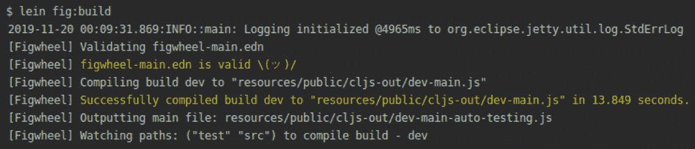

    图 10.44：Figwheel 验证 figwheel-main.edn 文件上的配置

    Figwheel 读取并验证`figwheel-main.edn`文件上的配置。然后，`if`编译我们的源代码到`dev-main.js`文件。测试代码编译到`dev-auto-testing.js`文件。

1.  使用 Figwheel，我们可以在浏览器中看到测试的摘要。访问`http://localhost:9500/figwheel-extra-main/auto-testing`：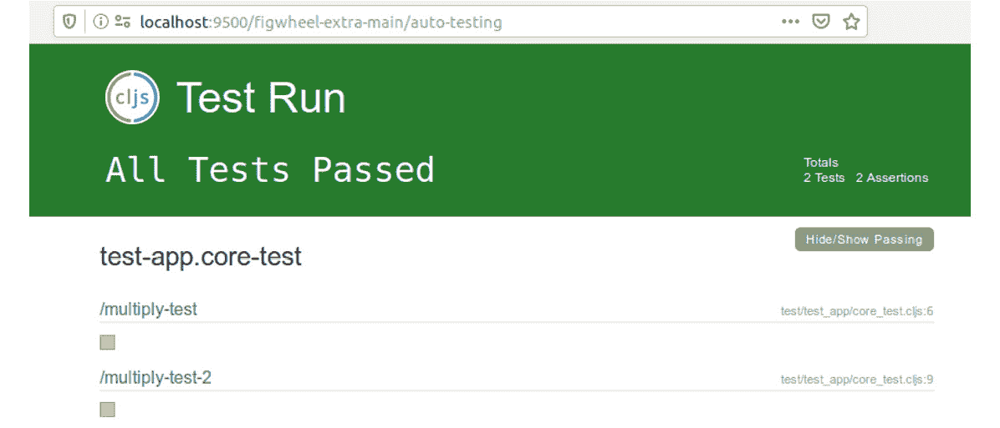

图 10.45：所有测试通过

Figwheel 通知我们所有测试都已通过。显示了一个摘要，说明了哪些测试被执行。

在这个练习中，我们学习了 Figwheel 如何在 ClojureScript 中支持测试。我们看到了 Figwheel 提供的默认测试配置。在下一个练习中，我们将看到如何向 Figwheel 应用添加测试。

## 练习 10.08：测试 ClojureScript 应用

这个练习的目的是学习如何测试 ClojureScript 应用。通常，前端代码很复杂。浏览器中应用的状态会改变。用户交互会导致许多不可预测的场景。为前端应用编写 ClojureScript 测试可以帮助我们及早捕捉到错误。

在上一章中，我们学习了关于 Figwheel 应用模板的内容。它是用 ClojureScript 编写前端应用的非常常见的模板。我们将创建一个能够响应用户操作的应用。当用户点击操作按钮时，我们将增加计数器。

初始时，计数将为零：

图 10.46：初始点击次数为零

](img/B14502_10_46.jpg)

图 10.46：初始点击次数为零

在六次点击后，计数将改变：


图 10.47：计数变为六

我们知道我们的应用将做什么。我们现在可以实施这个功能了。

1.  创建一个 Figwheel 应用：

    ```java
    lein new figwheel-main test-app -- --rum
    ```

    我们使用 Rum 创建了一个新的 Figwheel 项目。

1.  在上一节中，我们了解到 Figwheel 支持测试。在创建项目后，我们已经准备好运行测试：

    ```java
    lein fig:test
    ```

    输出如下：

    图 10.48：包含两个断言的两个测试通过

    ](img/B14502_10_48.jpg)

    图 10.48：包含两个断言的两个测试通过

    Figwheel 编译我们的代码并运行测试。我们测试了 tet-app.core-test 命名空间。两个测试都通过了。

1.  我们将在`src/test_app/core.cljs`文件中实现一个处理用户点击的函数：

    ```java
    (ns test-app.core)
    (defn handle-click [state]
          (swap! state update-in [:counter] inc))
    ```

    `handle-click`函数有一个参数。该参数是当前应用状态。我们在`:counter`键下增加 atom 中存储的值。

1.  我们将在`core.cljs`文件中的 atom 中存储状态应用：

    ```java
    (ns test-app.core)
    (defonce state (atom {:counter 0}))
    ```

    原子是一个带有`:counter`键的哈希表。键的初始值是零。

1.  创建计数器组件。

    我们创建一个 Rum 组件，该组件将显示鼠标点击次数：

    ```java
    (rum/defc counter [number]
              [:div {:on-click #(handle-click state)}
               (str "Click times: " number)])
    ```

    组件显示点击次数，该次数作为参数传递。在组件内部，我们使用`handle-click`函数来响应`:on-click`动作。每当用户点击组件时，`handle-click`函数就会被调用。

1.  创建页面组件。我们将把`counter`组件放在`page-content`组件内部。在页面上有一个主要组件，我们将把所有组件放在那里是一个好的做法。在我们的例子中，我们有一个组件：

    ```java
    (rum/defc page-content < rum/reactive []
              [:div {}
               (counter (:counter (rum/react state)))])
    ```

    容器使用 Rum 的`reactive`指令。此指令指示 Rum 以特殊方式处理组件。响应式组件将对应用程序状态的变化做出响应。每当应用程序状态发生变化时，组件将更新，并使用新的应用程序状态在浏览器中重新显示。我们在*第九章*，*Java 和 JavaScript 与宿主平台互操作性*中学习了响应式组件，并在本练习之前的章节中复习了相关知识。

1.  最后，我们需要将我们的`page-component`附加到网页上。正如我们在*第九章*，*Java 和 JavaScript 与宿主平台互操作性*中所做的那样，我们使用 Rum 的`mount`方法：

    ```java
    (defn mount [el]
      (rum/mount (page-content) el))
    ```

    `page-content`组件被挂载到网页上。

1.  运行应用程序。

    我们将运行我们的 Figwheel 应用程序：

    ```java
    lein fig:build
    ```

    此命令将为我们启动 Figwheel：

    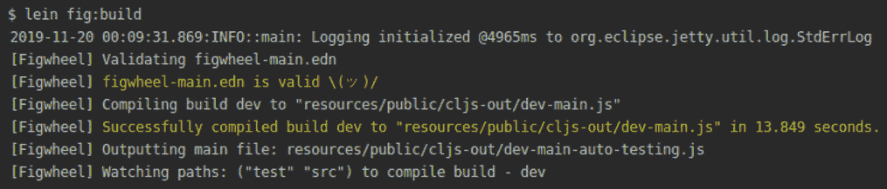

    ](img/B14502_10_50.jpg)

    图 10.49：启动 Figwheel

    Figwheel 成功启动了我们的应用程序。我们可以在浏览器中看到页面。它将如下所示：

    

    ](img/B14502_10_51.jpg)

    图 10.50：应用程序开始时的点击次数

    当应用程序启动时，点击次数为零。经过六次点击后，状态更新，并在页面上显示新的值：

    

    ](img/B14502_10_51.jpg)

    图 10.51：更新后的点击次数

    我们可以看到页面上的组件对我们的操作做出反应。现在是时候为`handle-click`函数编写测试了。

1.  我们将为我们的测试创建固定数据。测试固定数据是一组对象的固定状态，用作运行测试的基线。测试固定数据的目的确保测试在一个已知且固定的环境中运行，以便结果可重复。

    由于我们将操作应用程序的状态，我们希望每次运行测试时状态都相同。我们不希望之前的测试影响后续的测试。

    `handle-click` 函数接受一个状态原子作为参数。为了测试 `handle-click` 函数，我们需要一个状态原子。`cljs.test` 提供了 `use-fixtures` 宏，它允许我们在测试运行之前预设测试到所需的状态。这是一个创建状态原子以进行进一步操作的好地方。

    我们将把我们的测试放在 `core_test.cljs` 文件中：

    ```java
    (ns test-app.core-test
        (:require
         [cljs.test :refer-macros [are deftest is testing use-fixtures]]
         [test-app.core :refer [handle-click multiply]]))
    (use-fixtures :each {:before (fn [] (def app-state (atom {:counter 0})))
                                     :after (fn [] (reset! app-state nil))})
    ```

    使用 `:each` 关键字，我们指定我们想要为每个测试运行设置。这样，我们可以为每个测试设置状态。另一种选择是使用 `:only` 关键字，它将只在每个测试中设置一次设置。

    在设置中，我们有两个键：

    `:before`：在测试执行之前运行一个函数

    `:after`：在测试执行之后运行一个函数

    在 `:before` 和 `:after` 中，我们设置应用程序原子的状态。在每个测试之前，我们将 `:counter` 设置为零。在每个测试之后，我们将应用程序状态重置为 `nil`。将计数器设置为零将其重置。这样，每次我们运行新的测试时，计数器都是从零开始的。之前的测试不会影响后续的测试。

    在设置好设置之后，我们准备启动测试运行器。

1.  测试 `handle-click` 函数。

    我们将测试处理多个点击：

    ```java
    (deftest handle-click-test-multiple
             (testing "Handle multiple clicks"
                      (are [result] (= result (handle-click app-state))
                           {:counter 1}
                           {:counter 2}
                           {:counter 3})))
    ```

    我们使用 `are` 宏来简化测试。我们比较预期结果与调用 `handle-click` 函数的返回值。调用 `handle-click` 三次应该将计数器增加到三。

1.  我们现在将运行测试：

    ```java
     lein fig:test
    ```

    输出如下：

    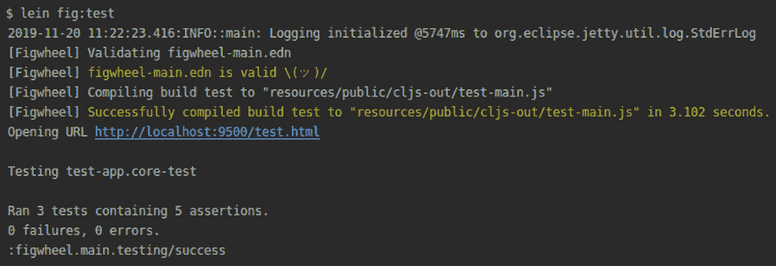

    图 10.52：运行测试

    如我们在摘要中看到的，测试通过了。`handle-click` 测试使用了 `app-state`，这是我们使用 `use-fixtures` 宏设置的。在每个测试之前，设置创建了一个应用程序状态。在每个测试之后，设置应该将状态重置为零。我们将编写一个新的测试来检查应用程序状态是否已重置。

1.  在以下测试中，我们将测试单个点击：

    ```java
    (deftest handle-click-test-one
             (testing "Handle one click"
                      (is (= {:counter 1} (handle-click app-state)))))
    ```

    在这个测试中，我们使用 `is` 宏来测试单个点击。

1.  我们将再次运行测试：

    ```java
    lein fig:test
    ```

    输出如下：

    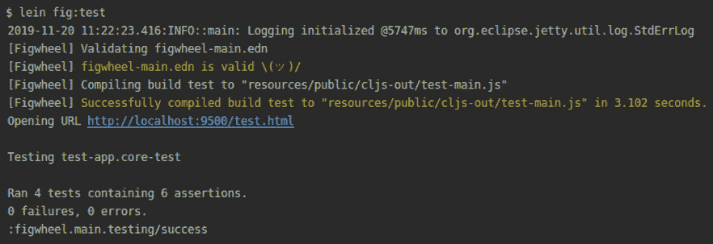

图 10.53：再次运行测试

运行新的测试告诉我们状态已经被重置。我们看到我们的测试通过了，因为应用程序状态已经成功重置。

在这个练习中，我们学习了如何将测试集成到 ClojureScript 应用程序中。我们使用 Figwheel 模板创建了一个项目。这个模板允许我们创建一个网络应用程序。在应用程序中，我们添加了用户交互。应用程序计算点击次数。我们编写了测试来确保我们的函数按预期执行。

你现在可以开始编写网络应用程序并将测试添加到其中。在接下来的活动中，你将应用你的新知识。

## 活动 10.02：带有测试的支持台应用程序

本活动的目的是向网络应用程序添加测试套件。许多应用程序需要复杂的功能和许多特性。虽然手动测试可以捕捉到许多错误，但它耗时且需要许多测试人员。使用自动化测试，检查应用程序更快，并且可以测试更多功能。ClojureScript 提供了帮助进行单元测试的工具。

在上一章中，我们编写了一个支持台应用程序，该应用程序允许我们通过帮助台管理提出的问题（[`packt.live/2NTTJpn`](https://packt.live/2NTTJpn)）。该应用程序允许您对问题进行排序并在完成后解决它们。通过排序问题，我们可以提高问题的优先级。在这个活动中，我们将使用 `clsj.test` 和 `test.check` 为属性测试添加单元测试。

您将编写以下测试：

+   一个显示排序消息状态的函数

+   一个按优先级过滤问题列表的函数

+   一个对问题列表进行排序的函数

+   一个从问题列表中删除项的函数

这些步骤将帮助您完成活动：

1.  将测试依赖项添加到 `project.clj` 文件中。

1.  将命名空间导入到 `core_test.cljs` 文件中。

1.  在应用程序状态中创建带有问题的固定装置。

1.  为排序消息函数编写 `cljs.test` 测试。

1.  使用 `test.check` 为排序消息函数编写测试。

1.  使用 `cljs.test` 编写按优先级过滤问题的测试。

1.  使用 `cljs.test` 编写排序问题列表的测试。

1.  使用 `cljs.test` 编写从列表中删除问题的测试。

1.  使用 `cljs.test` 编写测试来处理排序函数。

初始问题列表将如下所示：

![图 10.54：初始问题列表]

![img/B14502_10_54.jpg]

图 10.54：初始问题列表

排序后的问题列表将如下所示：

![图 10.55：排序后的列表]

![img/B14502_10_55.jpg]

图 10.55：排序后的列表

当运行测试时，输出应如下所示：

![图 10.56：运行测试后的输出]

![img/B14502_10_56.jpg]

图 10.56：运行测试后的输出

注意

本活动的解决方案可以在第 730 页找到

# 概述

在本章中，我们学习了 Clojure 中的测试。首先，我们探讨了为什么测试很重要。我们查看了一些好处，例如降低维护成本和错误修复。我们还学习了可用的测试方法。我们专注于单元测试，因为这是开发者编写的最常见类型的测试。

接下来，我们探讨了 Clojure 中可用的四个测试库。我们首先了解了标准的 clojure.test 库，它提供了一套丰富的测试功能。我们学习的第二个库是 Expectations。它允许我们编写简洁的测试，因为它侧重于可读性。

`Midje`库使我们能够探索自顶向下的测试驱动开发（TDD）。我们为主要的函数创建了一个测试，并为将来要实现的函数创建了存根。TDD 允许我们专注于测试函数的特性，而不必担心实现所有使用的子函数。

最后使用的库是`test.check`，它向我们介绍了基于属性的测试。使用基于属性的测试，我们以一般形式描述函数参数的性质。这使得测试可以根据这些属性生成输入。使用这种类型的测试，我们可以用几行代码运行成千上万的测试场景。无需枚举每一个单独的测试用例。

在本章的第二部分，我们学习了 ClojureScript 中的测试。我们了解到`cljs.test`库为我们提供了与`clojure.test`库相当的功能。使用`clsj.test`，我们能够测试 ClojureScript 代码。我们还研究了宏，使我们能够测试异步的 ClojureScript 代码。我们还设置了一个自动运行器，当我们的代码发生变化时，它会自动运行 ClojureScript 测试。

最后，我们完成了两个活动，这些活动使我们能够在项目中应用我们的测试知识。我们使用了在前几章中学习到的库来编写测试，用于开发前几章中的应用程序。

在下一章中，我们将学习宏的概念。宏是一种强大的功能，它允许我们影响 Clojure 语言。
