# 第一章。让我们直接进入…

|    | *"无论你走得有多慢，只要你不停止。" |    |
| --- | --- | --- |
|    | --*孔子* |

在本章中，你将构建一个简单的游戏，玩家通过鼠标控制角色，尝试躲避迎面而来的敌人。随着游戏的进行，敌人变得越来越难以躲避。这个游戏包含了创建交互式 Greenfoot 应用程序所需的基本元素。具体来说，在本章中，你将学习如何：

+   创建介绍和游戏结束屏幕

+   显示用户得分

+   使用鼠标控制角色的移动

+   播放背景音乐

+   动态生成敌人并在适当的时候移除它们

+   创建游戏关卡

在本章中，我们将学习基本的编程概念，并熟悉 Greenfoot 开发环境。随着你的学习，思考所提出的概念以及你如何在你的项目中使用它们。如果你是 Java 的新手，或者有一段时间没有编写 Java 程序了，请确保花时间查阅可能让你感到困惑的内容。Java 是一种成熟的编程语言，有无数的在线资源可以查阅。同样，本书假设对 Greenfoot 有最低限度的了解。在需要时，请务必查看[www.greenfoot.org](http://www.greenfoot.org)上的简单教程和文档。*尝试代码并尝试新事物——你会很高兴你这么做的*。换句话说，遵循本章第一行引用的孔子的建议。

本书中的许多章节都是独立的；然而，大多数章节都依赖于本章。本章提供了创建我们将继续使用并在后续章节中参考的 Greenfoot 应用程序的框架。

# Avoider 游戏教程

这个教程主要基于 Michael James Williams 的*AS3 Avoider 游戏教程*。在那个教程中，你将构建一个游戏，游戏会从屏幕顶部生成笑脸敌人。玩家的目标是避开这些敌人。你避开它们的时间越长，你的得分就越高。我们将使用 Greenfoot 构建相同的游戏，而不是 Flash 和 ActionScript。与 Michael James Williams 的教程一样，我们将从小处着手，逐渐添加功能。我们将经常暂停以考虑最佳实践和良好的编程实践。享受这些学习机会！

我们将首先构建 Avoider 游戏的基本组件，包括初始场景、游戏环境、敌人和英雄。然后，我们将添加额外的功能，例如得分、介绍和游戏结束屏幕以及关卡的概念。

如前言所述，我们假设你已经下载了 Greenfoot 并已安装。如果你还没有，请现在就做。前往[www.greenfoot.org](http://www.greenfoot.org)获取下载和安装 Greenfoot 的简单说明。当你在那里时，确保你至少熟悉[`www.greenfoot.org/doc`](http://www.greenfoot.org/doc)上提供的所有教程。

# 基本游戏元素

所有游戏都有一个游戏发生的环境，其中对象进行交互。在 Greenfoot 中，环境由`World`类表示，而在环境中交互的对象由`Actor`类表示。在本章的这一部分，我们将创建一个世界，向世界添加敌人，并添加一个将由玩家控制的英雄。

## 创建场景

启动 Greenfoot，通过点击 Greenfoot 菜单栏中的**场景**然后点击**新建…**来创建一个新的场景。你会看到*图 1*中显示的窗口。将文件名输入为`AvoiderGame`，然后点击**创建**按钮。

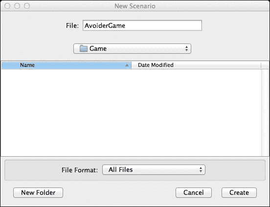

图 1：这是 Greenfoot 的新场景窗口

### 创建我们的世界

接下来，我们需要为我们的游戏创建一个世界。我们通过在场景窗口中右键单击（或在 Mac 上按 ctrl 键单击）**世界**类，并在出现的弹出菜单中选择**新建子类...**来完成此操作（参见*图 2*）。

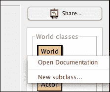

图 2：这是关于在**世界类**上右键单击以创建子类

在**新建类**弹出窗口中，将类命名为`AvoiderWorld`，选择**背景**图像类别，然后选择`space1.jpg`库图像作为新类的图像。完成这些操作后，弹出窗口应类似于*图 3*。

### 小贴士

一旦你将一个图像与新的`World`类或`Actor`类关联，该图像将被复制到 Greenfoot 项目的`images`目录中。我们将在后面的章节中依赖这一点。

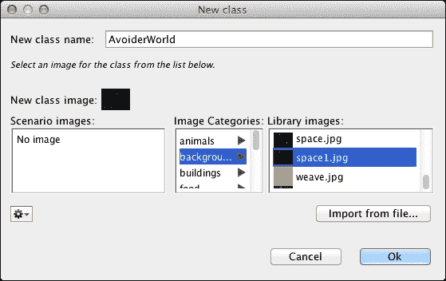

图 3：这显示了新建类弹出窗口

在**新建类**弹出窗口中点击**确定**按钮，然后在主场景窗口中点击**编译**按钮。现在你应该有一个看起来像*图 4*中所示的场景。

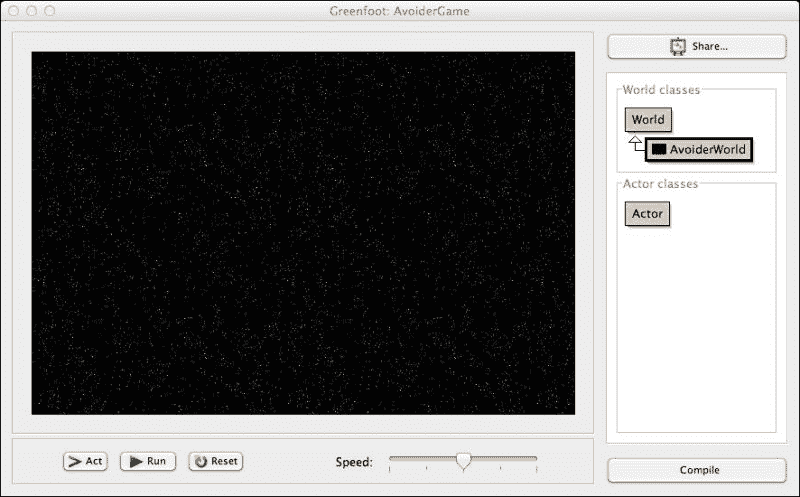

图 4：这显示了编译了 AvoiderWorld 类的 AvoiderGame 场景

现在我们有了自己的世界，名为`AvoiderWorld`，我们将很快在其中添加演员。

### 小贴士

在本章的后面部分，我们将向我们的游戏添加两个`World`类的子类——一个用于我们的介绍屏幕，另一个用于我们的游戏结束屏幕。那些说明将被简略。如果你需要关于子类化`World`类的详细说明，请务必参考本节。

### 创建我们的英雄

让我们创建玩家在玩游戏时将控制的角色。Greenfoot 使这变得非常简单。我们将遵循之前创建`World`类时使用的相同步骤。首先，在场景窗口中右键单击`Actor`类（见*图 5*），然后选择**新建子类...**菜单项。

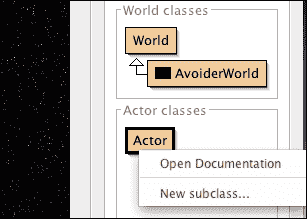

图 5：此图显示了在 Actor 类上右键单击以继承它

在**新类**弹出窗口中，将类命名为`Avatar`，并选择`symbols->skull.png`作为新的类图像。在主场景窗口中，点击**编译**按钮。

现在，要创建一个敌人，您只需执行与英雄相同的步骤，只是选择`symbols->Smiley1.png`作为图像，并将类名选择为`Enemy`。同样，完成此操作后，再次点击**编译**按钮。

现在，您应该有一个看起来像*图 6*所示的场景。

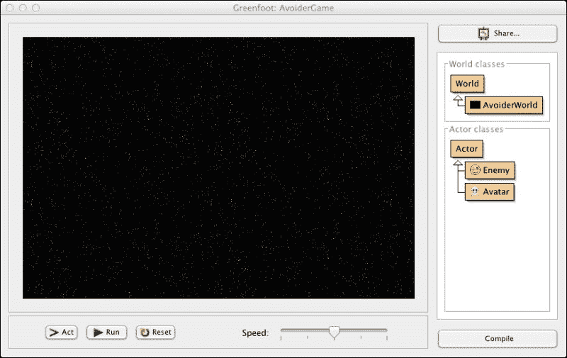

图 6：此图显示了创建世界并添加两个演员后的 Avoider Game 场景

### 我们刚才做了什么？

Greenfoot 将场景视为包含`Actor`的`World`。`World`的主要职责是从屏幕上添加和删除`每个 Actor`，并定期调用每个`Actor`的`act()`方法。每个`Actor`的职责是实现它们的`act()`方法来描述它们的行为。Greenfoot 为您提供了实现通用`World`和`Actor`行为的代码。（您之前已经右键点击过这些实现。）作为一名游戏程序员，您必须为`World`和`Actor`编写特定的行为代码。您通过继承提供的`World`和`Actor`类来创建新类，并在其中编写代码。您已经完成了继承，现在是时候添加代码了。

### 小贴士

查看[`www.greenfoot.org/files/javadoc/`](http://www.greenfoot.org/files/javadoc/)以了解更多关于`World`和`Actor`类的信息。

Oracle 在[`docs.oracle.com/javase/tutorial/java/concepts/`](http://docs.oracle.com/javase/tutorial/java/concepts/)提供了关于面向对象编程概念的优秀概述。如果您认真学习 Java 并编写好的 Greenfoot 场景，您应该阅读这些材料。

### 添加我们的英雄

最后，我们需要将我们的英雄添加到游戏中。为此，右键单击`Avatar`类，从弹出菜单中选择`new Avatar()`，将鼠标指针旁边出现的头骨图片拖到屏幕中央，然后点击鼠标左键。现在，在任何黑色背景上右键单击（不要在头骨上右键单击）并选择弹出菜单中的**保存世界**。

执行此操作将永久将我们的英雄添加到游戏中。如果您在 Greenfoot 的场景窗口中点击**重置**按钮，您应该仍然看到您放置在屏幕中间的头骨。

### 使用鼠标作为游戏控制器

让我们在`Avatar`类中添加一些代码，这样我们就可以使用鼠标来控制它的移动。双击`Avatar`以打开代码编辑器（你也可以右键单击类并选择**打开编辑器**）。

你将看到一个代码编辑窗口出现，其外观如图 7 所示。

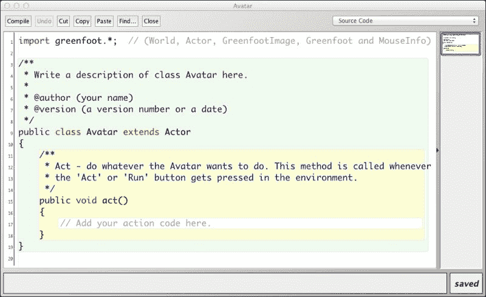

图 7：这是我们 Avatar 类的代码

你可以看到我们之前讨论过的`act()`方法。因为里面没有代码，所以当我们运行场景时，`Avatar`不会移动或显示任何其他行为。我们希望的是让`Avatar`跟随鼠标。如果有一个我们可以使用的`followMouse()`方法会怎么样？*让我们假装有！* 在`act()`方法中，输入`followMouse();`。你的`act()`方法应该看起来像图 8。

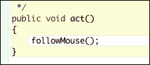

图 8：显示了添加了 followMouse()函数的 act()方法

为了好玩，让我们编译一下看看会发生什么。你认为会发生什么？点击**编译**按钮来找出答案。你看到了像图 9 中显示的那样的事情吗？

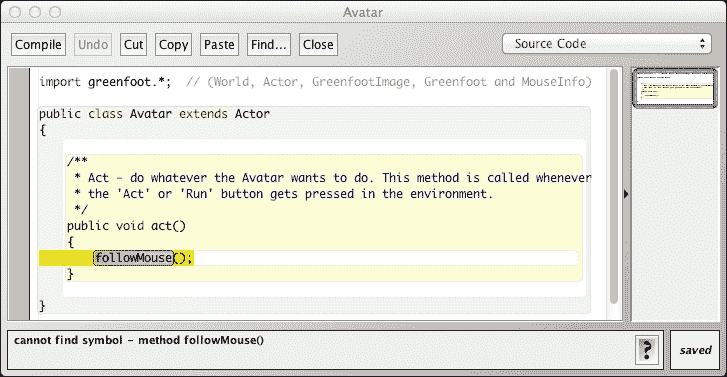

图 9：这是关于在 Greenfoot 中查看编译错误

如果你查看图 9 的底部，你会看到 Greenfoot 为我们提供了一个有用的错误信息，甚至突出显示了有问题的代码。正如我们所知，我们假装方法`followMouse()`存在。当然，它不存在。然而，我们很快就会编写它。在整个手册的编写过程中（以及任何 Java 编码过程中），你都会犯错误。有时，你会犯一个“打字错误”，有时，你会使用一个不存在的符号（就像我们之前做的那样）。你还会犯其他一些常见的错误。

### 注意

**帮助！我刚刚犯了一个编程错误！**

不要慌张！你可以做很多事情来解决这个问题。我会在这里列出一些。首先，你使用的编码过程可以大大帮助你调试代码（查找错误）。你应该遵循的过程被称为**增量开发**。只需遵循以下步骤：

+   编写几行代码。（真的！！不要编写更多代码！）

+   保存并编译。

+   运行并测试你的代码。（真的！！试试看！）

+   重复。

现在，如果你遇到错误，*它一定是由于你刚刚编写的最后 2-5 行代码造成的*。你知道确切的位置在哪里。将此与编写 30 行代码然后测试它们进行比较。你将会有累积的难以找到的错误。以下是一些其他调试技巧：

+   非常仔细地阅读你得到的错误信息。虽然它们可能很晦涩，但它们确实会指向错误的位置（有时甚至给出行号）。

+   有时，你会得到多个、长篇的错误信息。不用担心。只需从顶部开始阅读并处理第一个。通常，通过修复第一个，许多其他问题也会得到解决。

+   如果你实在找不到，让其他人帮你阅读代码。别人能多快地发现你的错误真是令人惊讶。

+   打印一些信息。你可以使用`System.out.println()`来打印变量，并检查你正在查看的代码是否实际在运行。

+   学习如何使用调试器。这是一个非常有用的工具，但超出了本书的范围。了解调试器是什么，并使用它。\*Greenfoot 有一个内置的调试器，你可以使用它\*。

在极其罕见的情况下，如果 Greenfoot 程序中存在错误，请按照[`www.greenfoot.org/support`](http://www.greenfoot.org/support)中找到的说明进行报告。

#### 创建`followMouse`函数

好的，让我们回到我们的英雄。我们上一次离开我们的英雄（Avatar 类）时，有一个错误，因为实际上没有`followMouse()`方法。让我们来修复它。在`Avatar`类的`act()`方法之后添加以下代码中的方法：

```java
private void followMouse() {
  MouseInfo mi = Greenfoot.getMouseInfo();
  if( mi != null ) {
    setLocation(mi.getX(), mi.getY());
  }
}
```

我们现在有了`followMouse()`方法的实现。保存文件，编译 Greenfoot 场景，并尝试运行代码。头骨的图片应该会跟随你的鼠标。如果出了问题，仔细查看调试窗口（如图 9 所示）以查看 Java 给你提供的关于错误的线索。你是不是打错了什么？验证一下你的`Avatar`类中的代码是否与图 10 中的代码完全一致。\*遵循之前提供的调试提示\*。


图 10：此图显示了完成`followMouse()`方法的 Avatar 类

嘿，等等！我是怎么想出`followMouse()`方法的代码的？我是带着这些信息出生的吗？不，我实际上只是查阅了 Greenfoot 文档（[`www.greenfoot.org/files/javadoc/`](http://www.greenfoot.org/files/javadoc/))，并看到有一个名为`MouseInfo`的类。我点击了它，并阅读了它所有的方法。

### 小贴士

现在去阅读 Greenfoot 文档。实际上它相当简短。只有七个类，每个类大约有 20 个或更少的方法。

#### 代码分解

让我们分解这段代码。首先，我们通过`Greenfoot.getMouseInfo()`获取一个表示鼠标数据的对象。然后，我们使用该对象通过`getX()`和`getY()`获取鼠标的位置，然后使用`setLocation(x,y)`设置我们的英雄的*x*和*y*位置。我是怎么知道要使用`setLocation()`的？再次，它是在`Actor`类的 Greenfoot 文档中。这是 Greenfoot 为所有演员提供的一个方法。最后，我们必须包含`if(mi != null)`部分，因为如果你不小心将鼠标移动到 Greenfoot 窗口之外，将没有鼠标信息，尝试访问它将导致错误（查看*图 10*中的代码注释，*第 22 行*）。

由于`followMouse()`方法在`act()`方法中被调用，我们的英雄（Avatar 类）将持续移动到鼠标的位置。

### 小贴士

当在 Greenfoot 中输入方法时，你可以按*Ctrl* + 空格键，Greenfoot 将显示一个可能尝试编写的潜在方法的列表。从列表中选择一个方法，Greenfoot 将为你自动完成该方法，包括方法参数的占位符。

### 添加敌人

我们将分两步向我们的游戏添加敌人。首先，我们需要编写`Enemy`类的代码，然后我们将向我们的世界`AvoiderWorld`添加代码来创建一支永无止境的敌人军队。这两个步骤都非常简单。

#### 敌人代码

双击`Enemy`类并更改其`act()`方法，使其看起来像以下代码片段：

```java
public void act() {
  setLocation(getX(), getY() + 1);
}
```

记得在`Avatar`类中使用过`setLocation()`吗？我们在这里再次使用它，每次调用`act()`方法时将敌人向下移动一个像素。在 Greenfoot 中，屏幕的左上角是坐标(0,0)。*x*坐标随着向右移动而增加，*y*坐标随着向下移动而增加。这就是为什么我们将敌人的*x*位置设置为当前的*x*坐标值（我们不会向左或向右移动）以及其*y*位置设置为当前的*y*坐标加一（我们向下移动一个像素。）

保存你的`Enemy`类，然后编译你的场景。运行场景，右键单击`Enemy`类，并在弹出菜单中选择`new Enemy()`。将这个敌人添加到屏幕上，并观察它向下移动。

#### 创建一支军队

现在我们已经完成了`Enemy`类的编写，我们可以用它来创建一支军队。为此，我们将向`AvoiderWorld`类的`act()`方法中添加代码。通过双击`AvoiderWorld`或右键单击它并在弹出菜单中选择**打开编辑器**来打开`AvoiderWorld`的编辑器。如果你查看`AvoiderWorld`的代码，你会注意到 Greenfoot 不会自动为你创建`act()`方法。没问题，我们只需添加它。在`AvoiderWorld`中放入以下代码：

```java
public void act() {
  // Randomly add enemies to the world
  if( Greenfoot.getRandomNumber(1000) < 20 ) {
    Enemy e = new Enemy();
    addObject(e, Greenfoot.getRandomNumber(getWidth()-20)+10, -30);
  }
}
```

`act()`方法首先检查一个在 0 到 1000 之间（包括 0 但不包括 1000）随机生成的数字是否小于 20。从长远来看，这段代码将在`act()`方法被调用的 2%的时间内运行。这足够了吗？嗯，`act()`方法通常每秒调用 50 次（范围从 1 到 100，取决于速度滑块的位置），所以 2%的 50 次是 1。因此，平均每秒将创建一个敌人。这对于我们游戏的起始级别来说感觉是合适的。

在`if`语句内部，我们创建一个敌人并将其放置在世界的特定位置，使用`addObject()`方法。`addObject()`方法接受三个参数：要添加的对象、对象的*x*坐标和对象的*y*坐标。*y*坐标是恒定的，选择它使得新创建的敌人从屏幕顶部开始，并随着它缓慢向下移动而出现。*x*坐标更复杂。它是动态生成的，以便敌人可以出现在屏幕上的任何有效的*x*坐标。以下是我们正在讨论的代码：

```java
Greenfoot.getRandomNumber( (getWidth() – 20) + 10, -30);
```

*图 11*展示了生成的*x*坐标值的范围。在这个图中，矩形代表给定代码的*x*坐标可能值的集合。在 Greenfoot 中，为屏幕坐标生成值范围的这种方法是常见的。

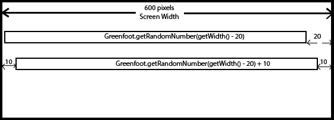

图 11：这是代码生成的 x 坐标值的范围

编译并运行场景；你应该会看到一个连续的敌人洪流沿着屏幕向下移动。

### 无界世界

运行场景后，你会注意到敌人最终会堆积在屏幕底部。在 Greenfoot 中，你可以创建有界（演员不允许穿过屏幕边界）和无界（演员允许退出屏幕）的世界。默认情况下，Greenfoot 创建的是有界世界。然而，将世界改为无界非常容易。双击`AvoiderWorld`以打开代码编辑器。找到以下代码行：

```java
super(600, 400, 1);
```

将前面的代码更改为以下代码行：

```java
super(600, 400, 1, false);
```

查看 Greenfoot 文档中的`World`类，我们会注意到有两个构造函数（有关这些构造函数的详细信息，请参阅[`www.greenfoot.org/files/javadoc/greenfoot/World.html`](http://www.greenfoot.org/files/javadoc/greenfoot/World.html)）：一个接受三个参数，另一个接受四个。具有四个参数的构造函数与接受三个参数的构造函数具有相同的参数，再加上一个额外的`boolean`参数，表示世界是有界还是无界。我们的代码更改添加了第四个布尔参数并将其设置为`false`（世界中没有边界。）

现在，编译并运行场景。敌人会按照要求从屏幕底部掉落。

所有这些敌人都去哪里了？我们将在下一节中处理这个问题。

### 内存管理

在 Greenfoot 应用程序中，你会创建成百上千的演员。当我们完成一个演员，比如当它被杀死或离开屏幕时，我们希望移除该对象，并且它不再消耗任何系统资源。Java 通过一个称为**垃圾回收**的方法来管理内存资源。使用此方法，Java 试图自动确定你是否不再需要演员，如果你不需要，它将删除该演员并释放与其相关的所有资源。在 Greenfoot 中，你可以通过使用`removeObject()`方法从`World`中移除演员来让 Java 知道你已经完成了演员。这就是我们在成功避开它并且它已经离开屏幕后想要对`Enemy`演员做的事情。

在敌人离开屏幕后，移除`Enemy`的最方便的地方是在`Enemy`类本身中。将以下代码作为`Enemy`类中`act()`方法内的最后一行代码添加：

```java
checkRemove();
```

现在，我们需要添加`checkRemove()`方法。将此方法的定义放在`act()`方法下方。以下是定义：

```java
private void checkRemove() {
  World w = getWorld();
  if( getY() > w.getHeight() + 30 ) {
    w.removeObject(this);
  }
}
```

你的`Enemy`类的代码应该看起来像*图 12*中所示的那样。

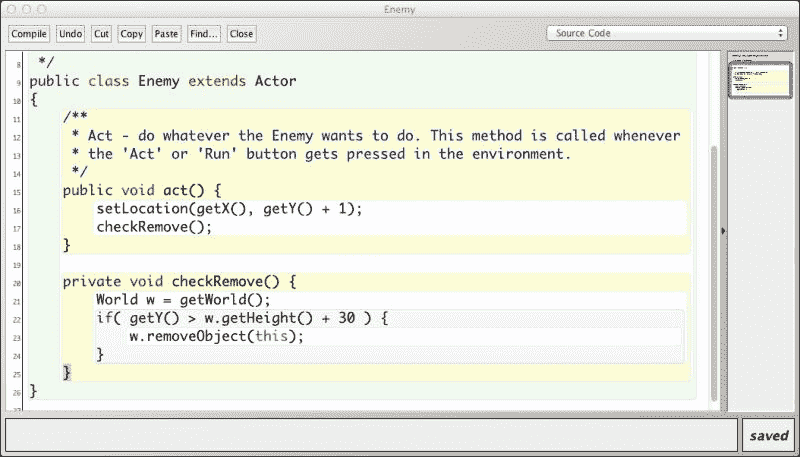

图 12：这显示了如何添加代码以移除如果敌人从屏幕底部移出

现在，编译并运行场景。敌人像以前一样从屏幕底部落下，但你可以放心，它们很快就会从世界中移除，垃圾回收也会进行。

### 你的作业

学习不是被动的，你真的需要参与这个过程。在继续本章的下一部分之前，你应该：

1.  确保你的 Avoider Game 版本可以正常工作，在 Greenfoot 的主应用程序菜单中点击**场景**，然后选择**另存为…**来创建 Avoider Game 的实验副本。让我们把这个实验副本命名为`AvoiderGameIExperimentation`。

1.  在你的实验副本上玩玩。改变敌人的出生率。改变敌人下降的速度。

1.  将`turn(5);`添加到`Enemy`类的`act()`方法中。编译并运行。发生了什么？尝试用不同的值代替`5`作为`turn()`的输入参数。

如果事情变得太疯狂，删除你的实验副本，并从我们的原始 Avoider Game 创建一个新的副本来玩耍。没有造成伤害，也没有任何不当行为。

### 小贴士

在整本书中，采取这种通过实验代码的方法。在玩耍的过程中会发生很多学习。思考如何更改代码的行为本身就会给你的大脑提供一种新的处理和理解它的方式。在受控环境中犯错误将更好地为你准备以后处理错误。你将开始熟悉 Greenfoot 的错误信息。

#### 接下来...

到目前为止做得很好！我们已经建立了游戏的基础，接下来我们将添加一些东西，比如介绍屏幕、游戏结束屏幕和分数，使它看起来和感觉更像一个游戏。

## 使其成为一个游戏

在本节中，我们将添加一个游戏结束屏幕、一个介绍屏幕和一些背景音乐。但在我们做所有这些之前，我们需要知道我们的英雄何时接触到敌人。这将是我们结束游戏的提示。确定两个角色何时接触的行为称为**碰撞检测**。碰撞检测用于判断子弹是否击中敌人，玩家在跳跃后是否落在平台上，或者判断一片落叶是否落在地面上。我们将在下一节讨论这个重要话题，并在接下来的章节中花费大量时间讨论。

### 检测碰撞

Greenfoot 提供了几个`Actor`方法，您可以使用它们来确定您是否接触到了另一个`Actor`。这些方法没有特定的顺序，包括：`getIntersectingObjects()`、`getNeighbors()`、`getObjectsAtOffset()`、`getObjectsInRange()`、`getOneIntersectingObject()`和`getOneObjectAtOffset()`。它们都提供了确定碰撞的不同方法。对于我们的游戏，我们将使用`getOneIntersectingObject()`。此方法的原型如下：

```java
protected Actor getOneIntersectingObject(java.lang.Class cls)
```

此方法接受一个参数，即您想要检查碰撞的对象类别。此方法将碰撞定义为**边界框**；边界框是能够包围图形中所有像素的最小矩形。此方法既高效又快速，但不是最精确的。在*图 12*中，我们可以看到一幅头骨的图片和一幅笑脸的图片。尽管这两幅图片的像素没有重叠，但我们可以看到它们的边界框是重叠的；因此，`getOneIntersectingObject()`会报告这两个角色正在接触。在第三章*碰撞检测*中，我们将探讨更高级的碰撞检测方法。

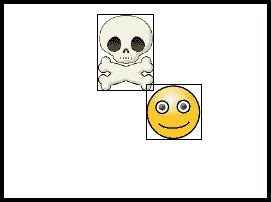

图 13：此图显示了两个角色的边界框

带着这些新信息，我们将向我们的`Avatar`类添加碰撞检测。如果我们的英雄接触到敌人之一，我们将将其从游戏中移除。（在本章的后面部分，我们将在移除我们的英雄后显示游戏结束屏幕。）双击`Avatar`类以打开其编辑窗口。将其`act()`方法更改为以下内容：

```java
public void act() {
 followMouse();
 checkForCollisions();
}
```

然后，在`act()`方法下添加此`checkForCollisions()`方法的定义：

```java
private void checkForCollisions() {
  Actor enemy = getOneIntersectingObject(Enemy.class);
  if( enemy != null ) {
    getWorld().removeObject(this);
    Greenfoot.stop();
  }
}
```

`Avatar`类应该看起来像图 14 中所示的那样。

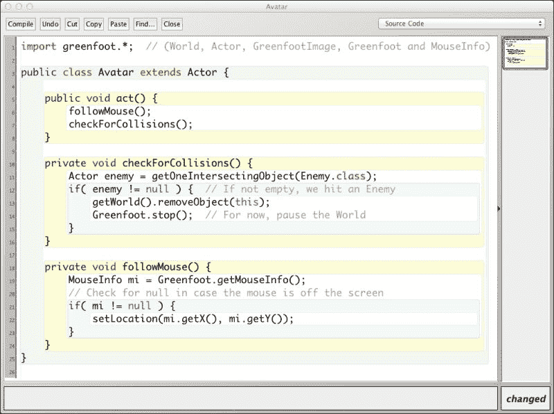

图 14：添加了碰撞检测的`Avatar`类。

让我们仔细检查`checkForCollisions()`方法中正在发生的事情。我们首先调用`getOneIntersectionObject()`并将它的返回值保存在变量`enemy`中。如果这个对象没有接触到任何敌人，这个变量将是`null`，在这种情况下，`if`语句中的表达式将评估为`false`，我们不会执行其内部的语句。否则，我们接触到了一个类型为`Enemy`的对象，并将执行`if`语句的内容。

`if`语句中只有两行代码。在第一行中，我们使用`getWorld()`方法，该方法在`Actor`类中实现，来获取我们所在世界的`World`实例的引用。我们不是将引用保存在一个变量中，而是立即调用`World`的`removeObject()`方法，将关键字`this`作为参数传递以移除我们的英雄。最后，我们使用`Greenfoot`实用类中的`stop()`方法暂停我们的游戏。

现在，编译并运行这个场景。敌人应该从屏幕顶部流下来并在底部退出。你应该能够通过移动鼠标来控制英雄，它是`Avatar`类的一个实例。如果我们的英雄接触到任何一个敌人，游戏应该停止。

### 添加游戏结束屏幕

首先，你需要使用你喜欢的图形设计/绘图程序，比如 GIMP、CorelDRAW、Inkscape、Greenfoot 内置的图形编辑器，甚至是 Windows Paint，绘制整个游戏结束屏幕。我使用 Adobe Illustrator 创建了*图 15*中显示的屏幕。

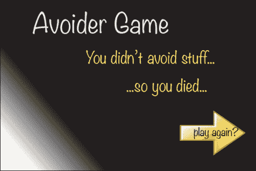

图 15：我的 AvoiderGame 游戏结束屏幕；尝试设计你自己的。

无论你使用什么来绘制你的图像，确保你可以以`PNG`或`JPG`格式保存它。其大小应该是 600 x 400（与你的世界大小相同）。将此图像保存在你的`AvoiderGame`场景的`images`文件夹中。

使用与创建`AvoiderWorld`相同的步骤（*避免者游戏教程*部分），创建另一个世界；命名为`AvoiderGameOverWorld`，并将你之前创建的图像与之关联。在你的场景的**世界类**区域，你应该看到*图 16*中所示的内容。

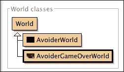

图 16：添加 AvoiderGameOverWorld 后的世界类区域

#### 场景切换

现在，我们想要显示游戏结束屏幕，如果我们的英雄接触到敌人。为此，我们需要执行以下三个步骤：

1.  检测我们与敌人发生碰撞，然后通过调用一个方法通知我们的世界，`AvoiderWorld`，游戏已经结束。

1.  在我们的`AvoiderWorld`类中，我们需要实现`Avatar`将用来信号世界末日结束的游戏结束方法。

1.  在我们的游戏结束方法中，将世界设置为`AvoiderGameOverWorld`，而不是`AvoiderWorld`。

让我们从第一步开始。之前，在本节的*检测碰撞*子节中，你编写了代码，如果英雄接触到敌人，就会从游戏中移除英雄。这段代码包含在`checkForCollisions()`方法中。为了实现第一步，我们需要将该方法更改为以下方法：

```java
private void checkForCollisions() {
  Actor enemy = getOneIntersectingObject(Enemy.class);
  if( enemy != null ) {
    AvoiderWorld world = (AvoiderWorld) getWorld();
    world.endGame();
  }
}
```

唯一的区别是`if`语句内的代码。我希望你能理解我们现在要求世界结束游戏，而不是移除英雄对象。可能让人困惑的部分是将`AvoiderWorld`替换为`World`以及添加`(AvoiderWorld)`部分。问题是，我们将在`AvoiderWorld`中实现`endGame()`，而不是`World`。因此，我们需要一种方法来指定`getWorld()`的返回值将被视为`AvoiderWorld`，而不仅仅是普通的`World`。用 Java 术语来说，这被称为**类型转换**。

现在，让我们看看第二步和第三步。这是你需要添加到`AvoiderWorld`中的代码。

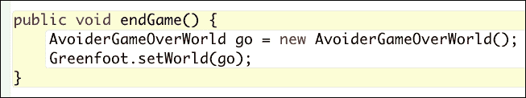

图 17：这显示了添加到 AvoiderWorld 中的 endGame()方法

我们已经更改并添加了最小量的代码，但如果你仔细跟随着，你应该能够保存、编译并运行代码。看到我们的英雄接触到敌人时出现的游戏结束界面吗？（如果没有，请回过头来重新追踪你的步骤。你可能输入了错误的内容。）

### 注意

**三个 P：计划，计划，再计划**

编程是复杂的事情。当你有一个问题要解决时，你不想只是坐下来，对着电脑开始乱敲，直到你敲出一个解决方案。你想要坐下来，用笔和 ePad（在我那个时代是笔和纸）来规划。我在编写显示游戏结束界面的三个步骤时给你提供了一个小的例子。帮助你设计解决方案的最佳方法之一是**自顶向下的设计**（也称为分而治之）。

在自顶向下的设计中，你从非常高的层面开始思考问题的解决方案，然后反复将这个解决方案分解成子解决方案，直到子解决方案变得小且易于管理。

#### 添加“再玩一次”按钮

游戏结束界面很棒，但我们不想整天都盯着它看。好吧，那么让我们设置一下，点击游戏结束界面就可以重新开始游戏。`AvoiderGameOverWorld`需要持续检查鼠标是否被点击，然后将世界状态重置为`AvoiderWorld`，这样我们就可以再次玩游戏了。查看 Greenfoot 文档，我们可以看到`mouseClicked()`函数。让我们在`AvoiderGameOverWorld`的`act()`方法中使用这个方法，以及更改世界状态的代码。将以下代码添加到`AvoiderGameOverWorld`中：

```java
public void act() {
  // Restart the game if the user clicks the mouse anywhere
  if( Greenfoot.mouseClicked(this) ) {
    AvoiderWorld world = new AvoiderWorld();
    Greenfoot.setWorld(world);
  }
}
```

这段代码应该对你来说非常熟悉。`if`语句内的代码几乎与我们添加到`AvoiderWorld`类中的`endGame()`方法中的代码相同，只是这次我们创建并切换到`AvoiderWorld`。

新的部分是检查用户是否点击了屏幕上的任何位置。如果用户刚刚点击了其参数中提供的对象，`Greenfoot.mouseClicked()` 方法返回 true。我们提供了 `this` 变量，它代表 `AvoiderGameOverWorld` 实例的整体。

编译并运行。做得好！我们的游戏进展得很顺利！

### 添加一个介绍屏幕

添加一个介绍屏幕非常简单，我们只需要执行我们在创建游戏结束屏幕时所做的许多相同步骤。首先，我们需要使用你想要的任何图形编辑器程序创建一个介绍屏幕图像。我创建的图像显示在*图 18*中。

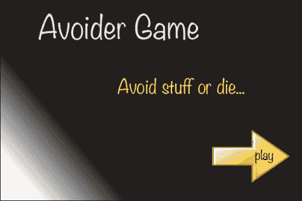

图 18：我们游戏的介绍屏幕图像。

确保图像是 PNG 或 JPG 格式，并且像素大小为 600 x 400。将此图像保存在你的 `AvoiderGame` 场景的 `images` 文件夹中。

创建一个新的世界（通过继承 `World`），命名为 `AvoiderGameIntroScreen`，并将其与刚刚创建的图像关联起来。当你完成这个步骤后，你的场景的**世界类**区域应该看起来像*图 19*中所示的截图。

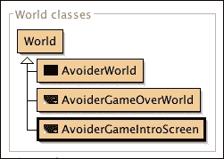

图 19：这些都是你在 AvoiderGame 中创建的所有世界。

#### 设置初始屏幕

我们显然希望我们的新介绍屏幕在玩家第一次开始游戏时首先显示。要选择 `AvoiderGameIntroScreen` 世界作为我们的起始 `World`，我们需要在**世界类**区域中右键单击它，并在出现的弹出窗口中选择 `new AvoiderGameIntroScreen()` 菜单选项（见*图 20*）。

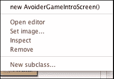

图 20：这是关于选择我们的起始世界

让我们确保一切连接正确。编译并运行你的 Greenfoot 应用程序。你应该从你刚刚创建的介绍屏幕开始，但无法做太多其他事情。我们现在将解决这个问题。

#### 添加“播放”按钮

我们将重复我们在从游戏结束屏幕实现游戏重启时所做的完全相同的步骤。

将以下代码添加到 `AvoiderGameIntroScreen`：

```java
public void act() {
  // Start the game if the user clicks the mouse anywhere 
  if( Greenfoot.mouseClicked(this) ) {
    AvoiderWorld world = new AvoiderWorld();
    Greenfoot.setWorld(world);
  }
}
```

这段代码应该对你来说非常熟悉。这正是我们添加到 `AvoiderGameOverWorld` 类中的代码。

编译并运行。享受乐趣。看看你能坚持多久！

到目前为止一切顺利，但确实缺少一些关键的游戏元素。

### 添加背景音乐

在本教程的这一部分，你需要在网上搜索一首你希望在游戏中播放的歌曲（`.mp3`）。

### 注意

**获取音乐**

每次你在游戏中添加资源（音乐或图形）时，确保你这样做是合法的。互联网上有许多网站提供免费使用提供的音乐或图片。永远不要使用专有音乐，并且始终引用你获取资源的来源。我从 [newgrounds.com](http://newgrounds.com) 获取了添加到游戏中的音乐，并在我的代码中为作者提供了信用。

我们只希望在开始玩游戏时播放音乐，而不是在介绍或游戏结束屏幕上播放。因此，我们在显示 `AvoiderWorld` 时开始播放音乐，在显示 `AvoiderGameOverWorld` 之前关闭它。我们只想播放一次音乐，所以不想在 `act()` 方法中添加播放音乐的代码——想象一下那样做的噪音！我们需要的是一个在对象创建时只被调用一次的方法。这正是类的**构造函数**所提供的。（如果你需要回顾类和对象是什么，请参阅 *What have we just done?* 部分的资料框）

### 注意

**构造函数是什么？**

在 Java 编程（以及其他面向对象的语言）中，我们在类中编写代码。一个**类**描述了我们想要在程序中创建的对象的方法和属性。你可以把类看作是构建对象的蓝图。例如，我们的 `Enemy` 类描述了出现在我们的 Avoider 游戏中的每个敌人对象的行为和属性。每个 *类* 都有一个 *构造函数*，它执行每个创建的对象所需的全部初始化。你可以很容易地识别类的构造函数。构造函数的名称与它们所在的类完全相同，并且没有返回类型。作为一个快速测试，找到我们的 `AvoiderWorld` 类中的构造函数。找到了吗？

我们每次创建新对象时都会调用构造函数。在 Greenfoot 中，右键单击 `Enemy` 类，你会看到顶部的菜单选项是 `new Enemy()`。`Enemy()` 部分是构造函数。`new` 关键字创建新对象，而 `Enemy()` 初始化该新对象。明白了吗？

以下是一些你应该阅读的好资源，以了解更多关于构造函数函数的信息：

[`docs.oracle.com/javase/tutorial/java/javaOO/constructors.html`](http://docs.oracle.com/javase/tutorial/java/javaOO/constructors.html)

[`java.about.com/od/workingwithobjects/a/constructor.htm`](http://java.about.com/od/workingwithobjects/a/constructor.htm)

#### 编写音乐代码

现在我们知道了代码应该放在哪里（大家说 `constructor`），我们需要知道要写什么代码。Greenfoot 提供了一个用于播放和管理音乐的类，称为 `GreenfootSound`。这个类使得播放音乐变得非常简单。在我向你展示要放入构造函数中的代码之前，你应该查看 `GreenfootSound` 的文档，看看你是否能弄清楚要写什么。

### 小贴士

不，真的！去阅读文档！自己尝试去做真的会对你有帮助。

这里是你需要添加到 `AvoiderWorld` 构造函数中的代码。

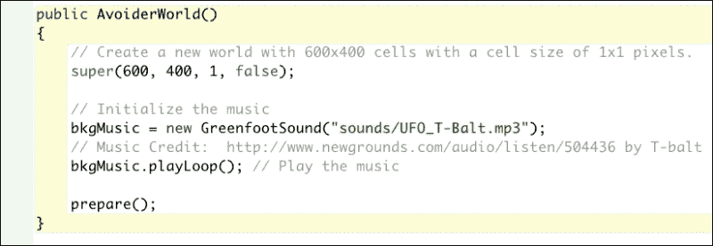

图 21：这是 AvoiderWorld 的构造函数

#### 分析音乐代码

让我们看看`AvoiderWorld`构造函数中的每一行代码。首先，你有调用超类构造函数的调用，正如之前所述，这是为了正确初始化你的游戏世界。接下来，我们有这一行：

```java
bkgMusic = new GreenfootSound("sounds/UFO_T-Balt.mp3");
```

这创建了一个新的`GreenfootSound`对象，并将对它的引用保存在`bkgMusic`变量中。你需要更改前面的代码，而不是使用`sounds/UFO_T-Balt.mp3`，你需要使用一个字符串来给出你下载以播放的音乐文件名（你需要将音乐保存在你的 Greenfoot 项目文件夹中的`sounds`文件夹中）。我们还需要声明在构造函数中使用的`bkgMusic`变量。为此，你需要在类的顶部添加一个变量声明，如图 22 所示。通过在类的顶部声明变量，它将可以访问你的类中的所有方法。这将在我们添加停止播放音乐的代码时变得很重要。

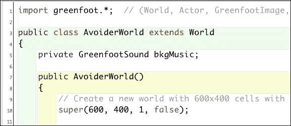

图 22：这显示了 AvoiderWorld 类中 bkgMusic 变量的声明

我们接下来要讨论的代码行是这一行：

```java
bkgMusic.playLoop();
```

这行代码开始播放音乐，并在结束时重新开始播放。如果我们只做了`bkgMusic.play()`，那么这首歌只会播放一次。

构造函数中的最后一行是非常重要的一行，它是 Greenfoot 自动添加的。记得在本书的*添加我们的英雄*部分，我指导你将`Avatar`类（我们的英雄）的实例放置在屏幕中央，右键点击，并选择**保存世界**菜单选项吗？当你这样做时，Greenfoot 创建了这个`prepare()`方法。如果你查看这个方法的内容，你会看到其中包含了创建`Avatar`对象并将其添加到**屏幕**的代码。然后，它在构造函数中添加了对`prepare()`的调用。如果你再次选择**保存世界**菜单选项，这个`prepare()`方法将会更新。

好的，保存、编译并运行。它工作了吗？如果没有，回去找到错误。

#### 停止音乐

如果你运行了你的代码，你在游戏中会有音乐，但是当你死亡并进入游戏结束屏幕时，音乐并没有关闭。我们必须在显示`AvoiderGameOverWorld`之前显式地关闭音乐。这很简单！我们只需要在之前添加到`AvoiderWorld`中的`endGame()`方法的开头添加以下代码行：

```java
bkgMusic.stop();
```

现在，保存、编译并运行。它应该按照计划工作。

### 注意

**私有、受保护和公共**

Java 关键字`private`、`protected`和`public`修改了 Java 中变量、方法或类的访问方式。良好的编程实践规定，你应该将所有类的实例变量设置为`private`，并且只通过方法访问该变量。对于方法，你希望只在你自己的`private`类中访问它们；否则，将其设置为`public`。关键字`protected`用于使方法对类的子类可用，但对外部类不可用。有关更多信息，请参阅以下链接：

+   [`docs.oracle.com/javase/tutorial/java/javaOO/accesscontrol.html`](http://docs.oracle.com/javase/tutorial/java/javaOO/accesscontrol.html)

+   [`www.tutorialspoint.com/java/java_access_modifiers.htm`](http://www.tutorialspoint.com/java/java_access_modifiers.htm)

### 你的任务

在继续之前执行以下操作：

+   一旦显示游戏结束屏幕，播放音乐。你打算播放欢快的音乐来提振玩家的精神，还是播放悲伤和忧郁的音乐来真正打击他们？确保在切换到`AvoiderWorld`之前将其关闭。

+   我们敌人的动作相当平淡。你能让它变得更有趣吗？一些想法是让敌人角色具有可变速度，左右漂移，或从顶部或底部进入。你将想出什么？

在尝试这些挑战之前，请记住创建`AvoiderGame`的备份副本。

### 接下来...

几乎完成了！我们已经构建了游戏的基础，接下来将添加一些内容使其更具挑战性。

## 提高可玩性

在本章的最后部分，我们将添加代码来提高游戏的可玩性。首先，我们将添加一个分数。接下来，我们需要随着时间的推移增加游戏的挑战性。随着玩家在游戏中的进步，我们希望提高挑战性；我们将添加一个等级系统来实现这一点。

### 游戏评分

我们的游戏正在发展；然而，我们需要一种方法来判断我们在游戏中的表现如何。有许多方法可以判断游戏表现，例如，完成的关卡、时间、进度等——但最常见的方法是为玩家分配分数。我们将在游戏中添加一个评分系统，奖励玩家避免的敌人数量。

#### 添加 Counter 类

在游戏中计数并在屏幕上显示计数是如此常见，以至于 Greenfoot 为你提供了一个**Counter**类。要访问此类，你需要将其导入到你的场景中。为此，在 Greenfoot 的主菜单中选择**编辑**，然后选择**导入类…**子菜单选项。你将看到一个窗口，就像图 23 中显示的那样。确保在左侧选中**Counter**框，然后点击**导入**按钮。

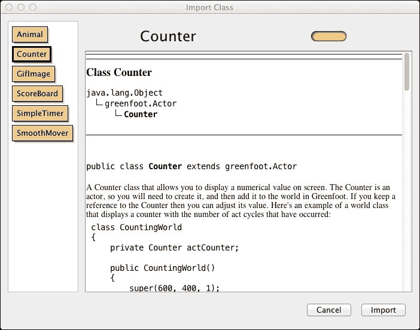

图 23：这是 Greenfoot 的导入类窗口

这将把`Counter`类添加到你的**演员类**列表中，以便在我们的游戏中使用，如图 24 所示。

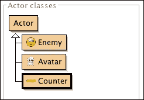

图 24：你的场景窗口中的 Actor 类部分现在包括 Counter 类

我们希望分数能立即在游戏中显示。在 Greenfoot 网站上的教程 4 ([`www.greenfoot.org/doc/tut-4`](http://www.greenfoot.org/doc/tut-4)) 中，你被介绍了“拯救世界”，以便自动将`Actor`放置在你的世界中。我将描述如何手动将`Actor`放置在你的世界中；具体来说，你将向你的`AvoiderWorld`世界添加一个`Counter`类的实例。

我们讨论了 Greenfoot 已经在你的`AvoiderWorld()`构造函数中添加了对`prepare()`方法的调用。在`AvoiderWorld`类中找到这个方法的定义。将其更改为以下代码：

```java
private void prepare() {
  Avatar avatar = new Avatar();
  addObject(avatar, 287, 232);
  scoreBoard = new Counter("Score: ");
  addObject(scoreBoard, 70, 20);
}
```

这个方法的前两行已经存在。最后两行在游戏屏幕上放置了一个分数显示。`scoreBoard = new Counter("Score: ");` 这段代码创建了一个带有标签`Score:`的新`Counter`对象，并将其引用存储在`scoreBoard`变量中（我们尚未声明这个变量，但很快就会声明。）下一行代码将我们的`Counter`添加到游戏屏幕的左上角。

最后，我们需要在类的顶部声明`scoreBoard`变量。在构造函数上方添加`private Counter scoreBoard;`，如图*图 25*所示。

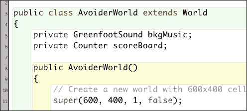

图 25：在 AvoiderWorld 类中声明 scoreBoard 变量。

编译、运行并测试你的场景。

#### 随着时间的推移提高分数

我们需要做最后一件事。我们需要在`scoreBoard`变量上调用`setValue()`来随时间增加我们的分数。一个我们可以这样做的地方是在`AvoiderWorld`中创建敌人时。思考一下，对于每个创建的敌人，你将得到一些分数，因为你最终需要避开它。以下是你在`AvoiderWorld`中的`act()`方法应该如何更改：

```java
public void act() {
  // Randomly add enemies to the world
  if( Greenfoot.getRandomNumber(1000) < 20) {
    Enemy e = new Enemy();
    addObject( e, Greenfoot.getRandomNumber(getWidth()-20)+10, -30);
    // Give us some points for facing yet another enemy
    scoreBoard.setValue(scoreBoard.getValue() + 1);
  }
}
```

我所做的唯一改变是添加了关于分数的注释，并在`scoreBoard`上添加了对`setValue()`的调用。这段代码使用`getValue()`获取当前分数，将其加 1，然后使用`setValue()`设置新值。`Counter`类的典型用法也在`Counter`类的顶部注释中提供。查看它！

编译你的`AvoiderGame`场景并尝试运行。你是否得到了增加的分数？

### 添加等级

到目前为止，我们的游戏并不具有很大的挑战性。我们可以做的一件事是，让游戏随着时间的推移变得更加具有挑战性。为此，我们将在 Avoider 游戏中加入等级的概念。我们将通过定期增加敌人生成的速率和敌人移动的速度来增加游戏的挑战性。

#### 增加生成速率和敌人速度

在`AvoiderWorld`中添加两个变量，`enemySpawnRate`和`enemySpeed`，并给它们设置初始值；我们将使用这两个变量来增加难度。你的`AvoiderWorld`类的顶部应该看起来像*图 26*。

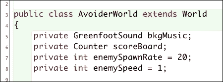

图 26：这显示了 AvoiderWorld 中的变量

#### 根据得分增加难度

接下来，我们需要添加一个方法，根据玩家的得分增加游戏的难度。为此，我们需要将以下方法添加到`AvoiderWorld`中：

```java
private void increaseLevel() {
  int score = scoreBoard.getValue();

  if( score > nextLevel ) {
    enemySpawnRate += 2;
    enemySpeed++;
    nextLevel += 100;
  }
}
```

在`increaseLevel()`中，我们引入了一个新的变量`nextLevel`，我们需要在`AvoiderWorld`类的顶部添加其声明。以下是您需要添加到`enemySpawnRate`和`enemySpeed`变量声明旁边的声明：

```java
private int nextLevel = 100;
```

从`increaseLevel()`函数中的代码可以看出，随着玩家得分的增加，我们同时增加了`enemySpawnRate`和`enemySpeed`。我们需要做的最后一件事是在`AvoiderWorld`的`act()`方法中使用`enemySpawnRate`和`enemySpeed`变量来创建敌人，并从`AvoiderWorld`的`act()`方法中调用`increaseLevel()`。以下是新的`act()`方法：

```java
public void act() {
  // Randomly add enemies to the world
  if( Greenfoot.getRandomNumber(1000) < enemySpawnRate) {
    Enemy e = new Enemy();
    e.setSpeed(enemySpeed);
    addObject( e, Greenfoot.getRandomNumber(getWidth()-20)+10, -30);
    // Give us some points for facing yet another enemy
    scoreBoard.setValue(scoreBoard.getValue() + 1);
  }
  increaseLevel();
}
```

#### 实现敌人速度增加

我现在很想大声喊出*编译并运行!*，但还有一个细节。在`act()`方法中，我们使用`e.setSpeed(enemySpeed);`这一行来改变敌人的速度；然而，我们从未在`Enemy`类中实现过该方法。此外，我们还需要对`Enemy`类进行一些修改，以便使用新设置的速度。

*图 27*给出了`Enemy`类的完整代码。

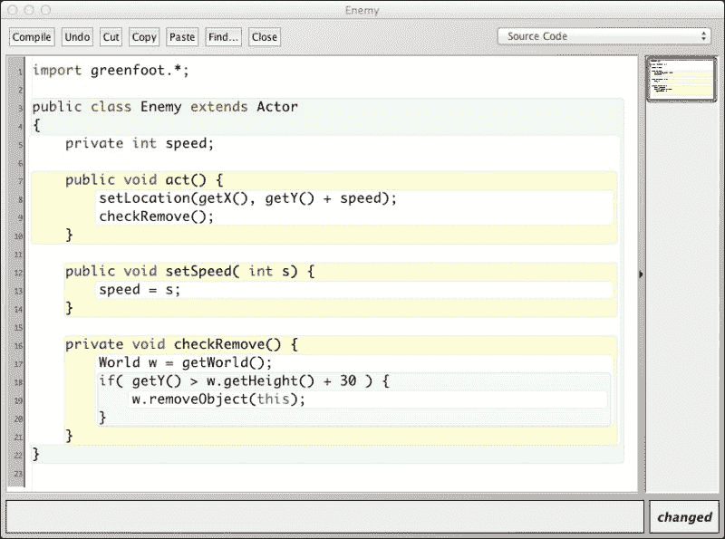

图 27：这显示了完成的 Enemy 类

如您所见，我们对`Enemy`类进行了一些非常简单的修改。我们添加了`setSpeed()`方法，该方法简单地接受一个整数参数，并使用该值来设置在类顶部声明的`speed`变量。在`act()`方法中，我们使用`speed`变量的值在`setLocation()`调用中；我们不断地将`speed`添加到当前的*y*坐标。

*编译并运行，享受你的新游戏！*

### 你的任务

由于这是 Avoider 游戏的结束说明。我将给你一些挑战性任务。祝你好运！尝试实现以下内容：

+   一旦玩家的得分超过 600，除了我们现在拥有的敌人外，还需要添加一个新敌人。新敌人应该在外观上与我们的现有敌人非常不同。如果你觉得可以，让新敌人的移动方式也与现有敌人不同。

+   定期生成一个提供英雄特殊能力的道具。例如，这个道具可以使英雄暂时无敌，允许英雄杀死三个敌人，或者缩小英雄的大小，使其更容易躲避敌人。

+   在游戏结束屏幕上显示玩家的最终得分。

这些挑战肯定需要一些时间，你不应该感到必须尝试它们。我只是想给那些真正感兴趣的人提供一个继续在 Avoider 游戏上工作的方法。你不需要完成这些挑战就可以进入下一章。

### 接下来…

恭喜！你做到了！祝你好玩。玩你的新游戏。

# 摘要

本章展示了如何制作一个有趣且引人入胜的游戏。我们包含了鼠标控制、一个英雄角色、敌人、得分以及介绍和游戏结束屏幕。

由于本书假设您在 Greenfoot 中已有一些工作经验，因此本章也起到了刷新您对如何在 Greenfoot 中编程的记忆的作用。

在接下来的章节中，我们将探讨 Greenfoot 中的高级编程概念，这些概念将使您能够创建有趣、创新且引人入胜的应用程序。这些章节将假设您已经掌握了本章中的内容。
