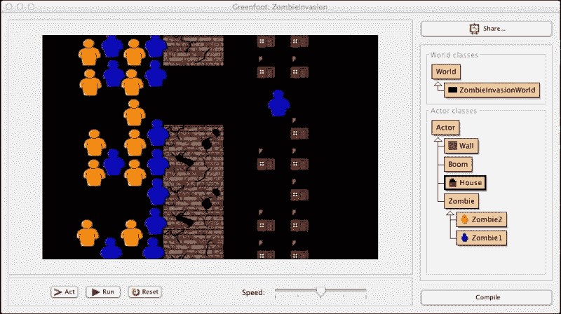
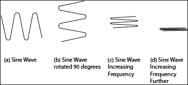
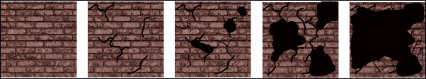
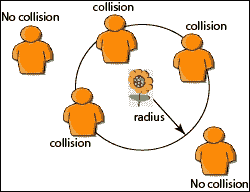
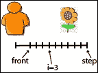
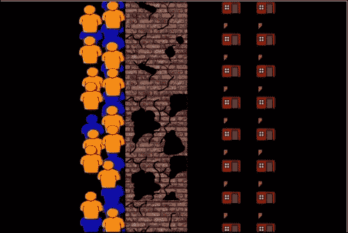
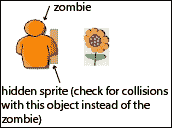

# 第三章。碰撞检测

|    | *"像明天就要死去一样生活。像永远都要活着一样学习。" |    |
| --- | --- | --- |
|    | --*圣雄甘地* |

通常，在 Greenfoot 中，你需要确定两个或多个对象是否接触。这被称为*碰撞检测*，对于大多数模拟和游戏都是必要的。检测算法范围从简单的边界框方法到非常复杂的像素颜色分析。Greenfoot 提供了一系列简单的方法来实现碰撞检测；在第一章，“让我们直接进入…”，和第二章，“动画”中，你已经接触到了其中的一些。在本章中，你将学习如何使用 Greenfoot 的其他内置碰撞检测机制，然后学习更精确的方法来使用它们进行碰撞检测。虽然像素完美的碰撞检测超出了本书的范围，但基于边界的和隐藏精灵的碰撞检测方法对于大多数 Greenfoot 应用来说已经足够了。本章将涵盖以下主题：

+   Greenfoot 内置方法

+   基于边界的检测方法

+   隐藏精灵方法

我们将暂时放下 Avoider Game 的开发，使用一个简单的僵尸入侵模拟来展示我们的碰撞检测方法。僵尸似乎很适合这一章。从他的引言中判断，我认为甘地希望你像僵尸一样学习。

# ZombieInvasion 交互式模拟

在第一章，“让我们直接进入…”和第二章，“动画”中，我们一步一步地构建 Avoider Game，并在每个章节结束时得到可玩的游戏版本。在僵尸模拟中，我们将看到一群僵尸突破墙壁，向另一边的家园前进。用户可以通过在模拟中放置爆炸来与模拟互动，这将摧毁两种类型的僵尸和墙壁。对于我们的僵尸模拟，我将在一开始就提供大部分代码，我们将集中精力实现碰撞检测。所有提供的代码都使用了我们在前两章中介绍的概念和技术，应该看起来非常熟悉。我们在这里将只提供一个代码的概述讨论。*图 1*提供了我们场景的图片。



图 1：这是 ZombieInvasion 的屏幕截图

让我们创建一个新的场景，称为`ZombieInvasion`，然后逐步添加并讨论`World`子类和`Actor`子类。或者，你也可以在[`www.packtpub.com/support`](http://www.packtpub.com/support)下载**ZombieInvasion**的初始版本。

## 在 ZombieInvasionWorld 中动态创建演员

这个类有两个主要职责：将世界中的所有演员放置好，并在鼠标点击时创建爆炸。大部分情况下，用户只能观察场景，并且只能通过创建爆炸与之互动。`ZombieInvasionWorld` 类相当简单，因为我们正在创建一个交互式模拟而不是游戏。以下是完成此任务的代码：

```java
import greenfoot.*;

public class ZombieInvasionWorld extends World {
  private static final int DELAY = 200;
  int bombDelayCounter = 0; // Controls the rate of bombs

  public ZombieInvasionWorld() {  
   super(600, 400, 1); 
   prepare();
  }

  public void act() {
   if( bombDelayCounter > 0 ) bombDelayCounter--;
   if( Greenfoot.mouseClicked(null) && (bombDelayCounter == 0) ) {
     MouseInfo mi = Greenfoot.getMouseInfo();
     Boom pow = new Boom();
     addObject(pow, mi.getX(), mi.getY());
     bombDelayCounter = DELAY;
   }
  }

  private void prepare() {
   int i,j;
   for( i=0; i<5; i++) {
     Wall w = new Wall();
     addObject(w, 270, w.getImage().getHeight() * i);
   }
   for( i=0; i<2; i++) {
     for( j=0; j<8; j++) {
      House h = new House();
      addObject(h, 400 + i*60, (12 +h.getImage().getHeight()) * j);
     }
   }
   for( i=0; i<2; i++) {
     for( j=0; j<8; j++) {
      Zombie1 z = new Zombie1();
      addObject(z, 80 + i*60, 15 + (2 +z.getImage().getHeight()) * j);
     }
   }
   for( i=0; i<2; i++) {
     for( j=0; j<7; j++) {
      Zombie2 z = new Zombie2();
      addObject(z, 50 + i*60, 30 + (3 +z.getImage().getHeight()) * j);
     }
   }
  }
}
```

当你在场景屏幕上右键单击并从弹出菜单中选择 **保存世界** 时，Greenfoot 将自动为你创建 `prepare()` 方法，并供应适当的代码以添加屏幕上的每个 `Actor`。这创建了你的场景的初始状态（用户首次运行你的场景时看到的那个）。在 `ZombieInvasionWorld` 中，我们手动实现 `prepare()` 方法，并且可以比 Greenfoot 以更紧凑的方式实现。我们使用循环来添加我们的演员。通过这种方法，我们添加了 `Wall`、`House`、`Zombie1` 和 `Zombie2`。我们将在本章后面实现这些类。

`act()` 方法负责监听鼠标点击事件。如果鼠标被点击，我们将在鼠标的当前位置添加一个 `Boom` 对象。Boom 是我们创建的用于显示爆炸的演员，我们希望它正好放置在鼠标点击的位置。我们使用延迟变量 `boomDelayCounter` 来防止用户快速创建过多的爆炸。记住，我们在上一章（第二章，*动画*）中详细解释了延迟变量。如果你想让用户能够快速创建爆炸，那么只需简单地移除延迟变量。

## 创建障碍物

我们将为我们的僵尸群创建两个障碍：房屋和墙壁。在模拟中，`House` 对象没有任何功能。它只是为僵尸演员提供一个障碍：

```java
import greenfoot.*;

public class House extends Actor {
}
```

`House` 类的代码非常简单。它的唯一目的是将房屋图像（`buildings/house-8.png`）添加到 `Actor` 中。它没有其他功能。

墙壁比房屋更复杂。随着僵尸敲打墙壁，墙壁会慢慢破碎。`Wall` 类的大多数代码都实现了这种动画，如下面的代码所示：

```java
import greenfoot.*; 
import java.util.List;

public class Wall extends Actor {
  int wallStrength = 2000;
  int wallStage = 0;

  public void act() {
   crumble();
  } 

  private void crumble() {
   // We will implement this in the next section…
  }

}
```

`Wall` 类的破碎动画实现与我们在上一章（第二章，*动画*）中看到的 `Avatar` 类受到伤害的实现非常相似。有趣的代码都包含在 `crumble()` 方法中，该方法从 `act()` 方法中反复调用。*图 1* 展示了墙壁在不同程度的衰变状态。我们将在 *检测与多个对象的碰撞* 部分详细实现并解释 `crumble()` 方法。

## 创建我们的主要演员框架

`Zombie`类包含了描述我们模拟中僵尸行为的所有代码。僵尸不断地笨拙地向前移动，试图到达房子里的人类。他们会敲打并最终摧毁任何挡道的墙壁，如下面的代码所示：

```java
import greenfoot.*; 
import java.util.*;

public class Zombie extends Actor {
  int counter, stationaryX, amplitude;

  protected void addedToWorld(World w) {
   stationaryX = getX();
   amplitude = Greenfoot.getRandomNumber(6) + 2;
  }

  public void act() {
   shake();
   if( canMarch() ) {
     stationaryX = stationaryX + 2;
   }
  } 

  public void shake() {
   counter++;
   setLocation((int)(stationaryX + amplitude*Math.sin(counter/2)), getY());
  }

  private boolean canMarch() {
   // We will implement this in the next section… 
   return false; // Temporary return value 
  }
}
```

这个类中的两个重要方法是`shake()`和`canMarch()`。`shake()`方法实现了僵尸的来回笨拙移动。它调用`setLocation()`并保持`y`坐标不变。它将`x`坐标改为正弦运动（来回）。它来回移动的距离由`amplitude`变量定义。这种运动也被用于第二章中描述的一种电源关闭，*动画*，并在*图 2*中显示。



图 2：这是使用正弦波在僵尸对象中产生来回运动的插图。我们从一个标准的正弦波（a）开始，将其旋转 90 度（b），并减少在 y 方向上的移动量，直到达到期望的效果（在 y 方向上不移动）。呼叫（c）和（d）显示了减少 y 方向移动的效果。

我们将在*检测与多个对象的碰撞*部分中完全实现并解释`canMarch()`。`canMarch()`方法检查周围的演员（房子、墙壁或其他僵尸），以查看是否有任何阻碍僵尸向前移动。作为一个临时措施，我们在`canMarch()`的末尾插入以下行：

```java
return false;
```

这允许我们编译和测试代码。通过始终返回`false`，`Zombie`对象将永远不会向前移动。这是一个简单的占位符，我们将在本章后面实现真正的响应。

我们有两个`Zombie`类的子类：`Zombie1`和`Zombie2`：

```java
public class Zombie1 extends Zombie {
}
public class Zombie2 extends Zombie {
}
```

这使得我们能够拥有两种不同外观的僵尸，但只需编写一次僵尸行为的代码。我选择了一个蓝色（`people/ppl1.png`）僵尸和一个黄色橙色（`people/ppl3.png`）僵尸。如果你有任何艺术技巧，你可能想创建自己的`PNG`图像来使用。否则，你可以继续使用 Greenfoot 提供的图像，就像我这样做。

## 创建爆炸

这里是我们在`ZombieInvasionWorld`类描述中之前讨论过的`Boom`类的实现。`Boom`类将立即绘制一个爆炸，这将清除爆炸范围内的所有内容，然后短暂停留，之后消失。我们使用以下代码创建爆炸：

```java
import greenfoot.*;
import java.awt.Color;
import java.util.List;

public class Boom extends Actor {
  private static final int BOOMLIFE = 50;
  private static final int BOOMRADIUS = 50;
  int boomCounter = BOOMLIFE;

  public Boom() {
    GreenfootImage me = new GreenfootImage
    (BOOMRADIUS*2,BOOMRADIUS*2);
    me.setColor(Color.RED);
    me.setTransparency(125);
    me.fillOval(0 , 0, BOOMRADIUS * 2, BOOMRADIUS*2);
    setImage(me);
  }

  public void act() {
    if( boomCounter == BOOMLIFE)
    destroyEverything(BOOMRADIUS);
    if( boomCounter-- == 0 ) {
      World w = getWorld();
      w.removeObject(this);
    }
  }

  private void destroyEverything(int x) {
    // We will implement this in the next section…
  }
}
```

让我们讨论构造函数（`Boom()`）和`act()`方法。`Boom()`方法使用`GreenfootImage`的绘图方法手动创建一个图像。我们就是这样使用这些绘图方法在上一章中展示的`AvoiderGame`中绘制星星和眼睛，我们在上一章中介绍了它，第一章, *让我们直接进入…*，和第二章, *动画*。构造函数通过使用`setImage()`将这个新图像设置为演员的图像来结束。

`act()`方法使用了延迟变量的有趣用法。不是等待一定的时间（以`act()`方法的调用次数来衡量）后才允许事件发生，而是使用`boomCounter`延迟变量来控制这个`Boom`对象存活的时间。经过短暂的延迟后，对象将从场景中移除。

我们将在后面的部分讨论`destroyEverything()`方法的实现。

## 测试一下

你现在应该有一个几乎完整的僵尸入侵模拟。让我们编译我们的场景，确保在添加代码时消除任何引入的错别字或错误。这个场景不会做很多事情。僵尸会来回移动，但不会取得任何进展。你可以在运行中的场景的任何地方点击，看到`Boom`爆炸；然而，它现在还不会摧毁任何东西。

让我们使用 Greenfoot 的碰撞检测方法使这个场景更有趣。

# 内置的碰撞检测方法

我们将遍历 Greenfoot 提供的所有碰撞检测方法。首先，我们将回顾一些方法并讨论它们的预期用途。然后，我们将基于更高级的碰撞检测方法（基于边界的和隐藏精灵）讨论剩余的方法。我们已经在 Avoider Game 的实现中使用了几个碰撞检测方法。我们在这里将简要描述这些特定方法。最后，我们不会讨论`getNeighbors()`和`intersects()`，因为这些方法仅适用于包含使用大于一个单元格大小创建的世界 Greenfoot 场景。

### 注意

**单元格大小和 Greenfoot 世界**

到目前为止，我们只创建了设置了`World`构造函数的`cellSize`参数为`1`的世界（`AvoiderWorld`和`ZombieInvasionWorld`）。以下是从 Greenfoot 关于`World`类的文档中摘录的内容：

```java
public World(int worldWidth, int worldHeight, int cellSize)

Construct a new world. The size of the world (in number of cells) and the size of each cell (in pixels) must be specified.

Parameters:
worldWidth - The width of the world (in cells).
worldHeight - The height of the world (in cells).
cellSize - Size of a cell in pixels.
```

Greenfoot 网站上提供的简单教程主要使用大单元格大小。这使得游戏移动、轨迹和碰撞检测非常简单。另一方面，我们希望创建更灵活的游戏，允许平滑的运动和更逼真的动画。因此，我们将我们的游戏单元格定义为 1 x 1 像素（一个像素），相应地，我们将不会讨论针对具有大单元格大小的世界的方法，例如`getNeighbors()`和`intersects()`。

在我们讨论的过程中，请记住，我们有时会向我们的 `ZombieInvasion` 场景添加代码。

## 检测单个对象的碰撞

`getOneIntersectingObject()` 方法非常适合简单的碰撞检测，通常用于检查子弹或其他类型的敌人是否击中了游戏的主要主角，以便减去健康值、减去生命值或结束游戏。这是我们使用并在 第一章 中解释的方法，即 *Let's Dive Right in…*，来构建 Avoider Game 的第一个工作版本。我们在此处不再讨论它，只会在下一节中提及它，作为说明 `isTouching()` 和 `removeTouching()` 的使用方法。

### isTouching() 和 removeTouching()

以下是一个使用 `getOneIntersectingObject()` 的常见模式：

```java
private void checkForCollisions() {
  Actor enemy = getOneIntersectingObject(Enemy.class);
  if( enemy != null ) { // If not empty, we hit an Enemy
    AvoiderWorld world = (AvoiderWorld) getWorld();
    world.removeObject(this);
  }
}
```

我们在 Avoider Game 中多次使用了这个基本模式。`isTouching()` 和 `removeTouching()` 方法提供了一种更紧凑的方式来实现前面的模式。以下是一个使用 `isTouching()` 和 `removeTouching()` 而不是 `getOneIntersectingObject()` 的等效函数：

```java
private void checkForCollisions() {
  if( isTouching(Enemy.class) ) { 
    removeTouching(Enemy.class);
  }
}
```

如果你只是要移除与对象相交的对象，那么你只需要 `isTouching()` 和 `removeTouching()` 方法。然而，如果你想要对相交的对象执行某些操作，这需要调用对象的类方法，那么你需要将相交的对象存储在命名变量中，这需要使用 `getOneIntersectingObject()` 方法。

### 小贴士

通常，始终使用 `getOneIntersectingObject()` 而不是 `isTouching()` 和 `removeTouching()`。它更灵活，并且提供的代码更容易在未来扩展。

## 检测多个对象的碰撞

碰撞检测方法 `getIntersectingObjects()` 返回一个列表，包含所有被调用演员接触到的给定类别的演员。当需要针对接触特定演员的每个对象采取行动，或者需要根据接触该演员的对象数量来改变演员的状态时，需要使用此方法。当使用 `getOneIntersectingObject()` 时，你只关心至少被一个指定类型的对象接触。例如，在游戏 *PacMan* 中，每次你接触到幽灵时都会失去一条生命。无论你撞到的是一个、两个还是三个，最终结果都会相同——你会失去一条生命。然而，在我们的僵尸模拟中，`Wall` 演员根据当前敲打它的僵尸数量受到伤害。这是 `getIntersectingObjects()` 的完美应用。

在上面提供的 `Wall` 代码中，我们省略了 `crumble()` 方法的实现。以下是该代码：

```java
private void crumble() {
  List<Zombie> army = getIntersectingObjects(Zombie.class);
  wallStrength = wallStrength - army.size();
  if( wallStrength < 0 ) {
    wallStage++;
    if( wallStage > 4 ) {
      World w = getWorld();
      w.removeObject(this);
    }
    else {
      changeImage();
      wallStrength = 2000;
    }
  }
}

private void changeImage() {
  setImage("brick"+wallStage+".png");
}
```

让我们快速回顾一下之前看到的内容。在第二章 动画 的 *伤害角色* 部分，我们每次角色被敌人触摸时都会改变角色的图像，使其看起来受损。我们在这里使用相同的动画技术来使其看起来像墙壁正在受损。然而，在这段代码中，我们给墙壁赋予了一个由 `wallStrength` 变量定义的耐久性属性。`wallStrength` 的值决定了墙壁在明显看起来更加破碎和裂缝之前可以承受多少次僵尸的撞击。

`wallStrength` 变量实际上是我们在上一章 第二章. 动画 中讨论的延迟变量的一个例子。这个变量不是延迟一定的时间，而是延迟一定数量的僵尸撞击。当 `wallStrength` 小于 0 时，我们会使用 `changeImage()` 方法更改图像，除非这是我们第四次破碎，这将导致我们完全移除墙壁。*图 3* 展示了我为这个动画创建并使用的墙壁图像。



图 3：这些是用于动画墙壁破碎的四个图像

现在，让我们讨论碰撞检测方法 `getIntersectingObjects()`。当被调用时，此方法将返回所有与调用对象相交的给定类的对象。您可以通过将类作为此方法的参数提供来指定您感兴趣的类。在我们的代码中，我提供了参数 `Zombie.class`，因此该方法只会返回所有接触墙壁的僵尸。由于继承，我们将得到所有 `Zombie1` 对象和所有 `Zombie2` 对象，它们都与对象相交。您可以使用在 `List` 接口中定义的方法访问、操作或遍历返回的对象。对于我们来说，我们只想计算我们碰撞了多少个僵尸。我们通过在从 `getIntersectingObjects()` 返回的 `List` 对象上调用 `size()` 方法来获取这个数字。

### 注意

**Java 接口和 List**

碰撞检测方法 `getIntersectingObjects()` 第一次让我们了解了 `List` 接口。在 Java 中，接口用于定义两个或多个类将共有的方法集。当 Java 类实现接口时，该类承诺它实现了该接口中定义的所有方法。因此，由 `getIntersectingObjects()` 返回的 `Actor` 对象集合可以存储在数组、链表、队列、树或其他任何数据结构中。无论用于存储这些对象的数据结构是什么，我们知道我们可以通过 `List` 接口中定义的方法访问这些对象，例如 `get()` 或 `size()`。

更多信息，请参阅以下链接：[`docs.oracle.com/javase/tutorial/java/IandI/createinterface.html`](http://docs.oracle.com/javase/tutorial/java/IandI/createinterface.html)。

在我们的`ZombieInvasion`模拟中，我们需要再次使用`getIntersectingObjects()`。在我们查看`Zombie`类的代码时，我们留下了`canMarch()`方法的实现未完成。现在让我们使用`getIntersectingObjects()`来实现该方法。以下是代码：

```java
private boolean canMarch() {
  List<Actor> things = getIntersectingObjects(Actor.class);
  for( int i = 0; i < things.size(); i++ ) {
    if( things.get(i).getX() > getX() + 20 ) {
      return false;
    }
  }
  return true;
}
```

此方法检查是否有任何演员阻碍了该对象向前移动。它通过首先获取所有接触该对象的`Actor`类的对象，然后检查每个对象是否位于该对象的前面来完成此操作。我们不关心`Actor`是否在顶部、底部或后面接触调用对象，因为这些演员不会阻止该对象向前移动。`canMarch()`中的这一行代码为我们提供了所有相交演员的列表：

```java
List<Actor> things = getIntersectingObjects(Actor.class);
```

然后，我们使用`for`循环遍历演员列表。要访问列表中的项目，您使用`get()`方法。`get()`方法有一个形式参数，指定了列表中您想要的对象的索引。对于列表中的每个演员，我们检查其*x*坐标是否在我们前面。如果是，我们返回`false`（我们不能移动）；否则，我们返回`true`（我们可以移动）。

我们已经将`crumble()`方法的实现添加到了`Wall`类中（别忘了还要添加`changeImage()`），并将`canMarch()`方法的实现添加到了`Zombie`类中。让我们编译我们的场景并观察发生了什么。我们的模拟几乎完成了。唯一缺少的是`Boom`类中`destroyEverything()`方法的实现。我们将在下一节中查看该实现。

## 检测范围内的多个对象

我们需要实现的最后一个方法来完成我们的模拟是`destroyEverything()`。在这个方法中，我们将使用 Greenfoot 碰撞检测方法`getObjectsInRange()`。此方法接受两个参数。我们在所有其他碰撞检测方法中都已经看到了第二个参数，它指定了我们正在测试碰撞的演员的类。第一个参数提供了一个围绕演员绘制的圆的半径，该半径定义了搜索碰撞的位置。*图 4*显示了`radius`参数与搜索区域之间的关系。与`getIntersectingObjects()`不同，`getObjectsInRange()`返回一个列表，其中包含调用对象指定的范围内的演员。



图 4：这显示了`getObjectsInRange()`方法中半径参数的作用

现在我们已经了解了`getObjectsInRange()`方法，让我们看看`destroyEverything()`方法的实现：

```java
private void destroyEverything(int x) {
  List<Actor> objs = getObjectsInRange(x, Actor.class);
  World w = getWorld();
  w.removeObjects(objs);
}
```

这种方法简短而强大。它调用`getObjectsInRange()`，带有半径`x`，这是在调用`destroyEverything()`时传递给它的值，以及`Actor.class`，在 Greenfoot 术语中意味着一切。所有在半径定义的圆内的对象都将由`getObjectsInRange()`返回并存储在`objs`变量中。现在，我们可以遍历`objs`中包含的所有对象，并逐个删除它们。幸运的是，Greenfoot 提供了一个可以在一次调用中删除一组对象的函数。以下是它在 Greenfoot 文档中的定义：

```java
public void removeObjects(java.util.Collection objects)
Remove a list of objects from the world.

Parameters:
objects - A list of Actors to remove.
```

## 是时候测试一下了

模拟完成。编译并运行它，确保一切按预期工作。记住，你可以点击任何地方来炸毁建筑、墙壁和僵尸。重置场景并移动事物。添加墙壁和僵尸，看看会发生什么。做得不错！

# 基于边界的碰撞检测方法

基于边界的碰撞检测涉及从`Actor`开始向外逐步搜索，直到检测到碰撞，或者确定没有障碍物为止。该方法找到与之碰撞的项目的边缘（或边界）。这种方法在物体需要相互弹跳，或者一个物体落在另一个物体上并需要在该物体上停留一段时间时特别有用，例如，当用户控制的`Actor`跳到平台上时。我们将在本章介绍这种碰撞检测方法，并在接下来的章节中使用它。

## 检测偏移量下的单物体碰撞

Greenfoot 的碰撞检测方法的*偏移量*版本非常适合基于边界的碰撞检测。它们允许我们在调用`Actor`的中心的某个距离或偏移量处检查碰撞。为了演示这个方法的使用，我们将修改`Zombie`类中`canMarch()`方法的实现。以下是我们的修改版本：

```java
private boolean canMarch() {
  int i=0;
  while(i<=step) {
    int front = getImage().getWidth()/2;
    Actor a = getOneObjectAtOffset(i+front, 0, Actor.class);
    if( a != null ) {
      return false;
    }
    i++;
  }
  return true;
}
```

通常，当一个演员移动时，它将通过一定数量的像素改变其位置。在`Zombie`类中，如果僵尸可以移动，它们将移动多远被存储在`step`变量中。我们需要通过在`Zombie`类的顶部插入以下代码行来声明和初始化这个实例变量，如下所示：

```java
private int step = 4;
```

使用`step`变量来存储演员的移动长度是一种常见的做法。在上面的`canMarch()`实现中，我们检查僵尸前方直到包括完整一步的每个像素。这由`while`循环处理。我们将变量`i`从`0`增加到`step`，每次在位置`i + front`处检查碰撞。由于一个物体的原始位置是其中心，我们将`front`设置为表示该演员的图像宽度的一半。*图 5*说明了这个搜索过程。



图 5：使用基于边界的检测，一个对象逐像素搜索碰撞。它从其前端开始，然后从前端+0 开始搜索对象，一直到前端+步长。

如果在我们的`while`循环中的任何时间检测到碰撞，我们返回`false`，表示演员不能向前移动；否则，我们返回`true`。测试这个新的`canMarch()`版本。

## 在偏移量处检测多对象碰撞

碰撞检测方法`getObjectsAtOffset()`与`getOneObjectAtOffset()`非常相似。正如其名所示，它只是返回给定偏移量处所有碰撞的演员。为了演示其用法，我们将像对`getOneObjectAtOffset()`所做的那样重新实现`canMarch()`。为了利用获取碰撞演员列表的优势，我们将在`canMarch()`中添加一些额外的功能。对于每个阻挡僵尸前进运动的演员，我们将稍微推挤他们。

这是`canMarch()`的实现：

```java
private boolean canMarch() {
  int front = getImage().getWidth()/2;
  int i = 1;
  while(i<=step) {
    List<Actor> a = getObjectsAtOffset(front+i,0,Actor.class);
    if( a.size() > 0 ) {
      for(int j=0;j<a.size()&&a.get(j) instanceof Zombie;j++){
        int toss = Greenfoot.getRandomNumber(100)<50 ? 1 : -1;
        Zombie z = (Zombie) a.get(j);
        z.setLocation(z.getX(),z.getY()+toss);
      }
      return false;
    }
    i++;
  }
  return true;
}
```

在这个版本中，我们使用`while`循环和`step`变量，与之前`canMarch()`的`getOneObjectAtOffset()`版本所做的方式几乎相同。在`while`循环内部，我们添加了新的“推挤”功能。当我们检测到列表中至少有一个`Actor`时，我们使用`for`循环遍历列表，轻微地推动我们与之碰撞的每个演员。在`for`循环中，我们首先使用`instanceof`运算符检查`Actor`类是否是`Zombie`类。如果不是，我们跳过它。我们不希望有推挤`Wall`或`House`的能力。对于每个我们与之碰撞的僵尸，我们以相等的概率将`toss`变量设置为`1`或`-1`。然后我们使用`setLocation()`移动那个僵尸。这种效果很有趣，给人一种僵尸试图推挤和冲到前面的错觉。编译并运行带有`canMarch()`更改的场景，看看结果如何。*图 6*展示了僵尸如何在前面的更改下聚集在一起。

### 注意

**`instanceof`运算符**

Java 的`instanceof`运算符检查左侧参数是否是从右侧指定的类（或其任何子类）创建的对象。如果是，它将返回`true`；否则返回`false`。如果左侧对象实现了右侧指定的接口，它也将返回`true`。



图 6：这是僵尸推挤和冲向房屋中的人类的一个视图

# 隐藏精灵碰撞检测方法

`getOneObjectAtOffets()` 和 `getObjectsAtOffset()` 方法的缺点之一是它们只检查单个像素的粒度。如果一个感兴趣的对象位于提供给这些方法的偏移量上方或下方一个像素，那么将不会检测到碰撞。实际上，在这个实现中，如果你允许模拟运行直到僵尸到达房屋，你会注意到一些僵尸可以穿过房屋。这是因为像素检查在房屋之间失败。处理这种不足的一种方法是用隐藏精灵碰撞检测。*图 7*展示了这种方法。



图 7：这显示了使用隐藏精灵来检查碰撞。

在隐藏精灵方法中，你使用另一个`Actor`类来测试碰撞。*图 7*显示了一个`Zombie`对象使用一个较小的、辅助的`Actor`类来确定是否与花朵发生了碰撞。虽然隐藏精灵显示为半透明的红色矩形，但在实际应用中，我们会设置透明度（使用`setTransparency()`）为`0`，使其不可见。隐藏精灵方法非常灵活，因为你可以为你的隐藏精灵创建任何形状或大小，并且它没有像前两种碰撞检测方法那样只关注单个像素的问题。接下来，我们再次修改`Zombie`类中的`canMarch()`方法，这次使用隐藏精灵碰撞检测。

我们需要做的第一件事是创建一个新的`Actor`，它将作为隐藏精灵使用。因为我们打算为僵尸使用这个隐藏精灵，所以让我们称它为`ZombieHitBox`。现在创建这个`Actor`的子类，并且不要将它与任何图像关联。我们将在构造函数中绘制图像。以下是`ZombieHitBox`的实现：

```java
import greenfoot.*;
import java.awt.Color;
import java.util.*;

public class ZombieHitBox extends Actor {
  GreenfootImage body;
  int offsetX;
  int offsetY;
  Actor host;

  public ZombieHitBox(Actor a, int w, int h, int dx, int dy, boolean visible) {
    host = a;
    offsetX = dx;
    offsetY = dy;
    body = new GreenfootImage(w, h);
    if( visible ) {
      body.setColor(Color.red);
      // Transparency values range from 0 (invisible)
      // to 255 (opaque)
      body.setTransparency(100);
      body.fill();
    }
    setImage(body);
  }

  public void act() {
    if( host.getWorld() != null ) {
      setLocation(host.getX()+offsetX, host.getY()+offsetY);
    } else {
      getWorld().removeObject(this);
    }
  }

  public List getHitBoxIntersections() {
    return getIntersectingObjects(Actor.class);
  }
}
```

`ZombieHitBox`的构造函数接受六个参数。它之所以需要这么多参数，是因为我们需要提供它附加到的`Actor`类（`a`参数），定义要绘制的矩形的尺寸（`w`和`h`参数），提供矩形相对于提供的`Actor`的偏移量（`dx`和`dy`参数），并检查隐藏精灵是否可见（`visible`参数）。在构造函数中，我们使用`GreenfootImage()`、`setColor()`、`setTransparency()`、`fill()`和`setImage()`来绘制隐藏精灵。我们之前在第二章 *动画*中讨论了这些方法。

我们使用`act()`方法来确保这个隐藏精灵与它附加的`Actor`类（我们将称之为`host`精灵）一起移动。为此，我们只需调用`setLocation()`，提供`host`精灵当前的*x*和*y*位置，并根据构造函数中提供的偏移值进行微调。然而，在这样做之前，我们检查`host`是否已被删除。如果已被删除，我们就删除碰撞框，因为它只与`host`有关。这处理了爆炸摧毁`host`但并未完全达到碰撞框的情况。

最后，我们提供一个公共方法，`host`精灵将使用它来获取所有与隐藏精灵发生碰撞的精灵。我们把这个方法命名为`getHitBoxIntersections()`。

接下来，我们需要增强`Zombie`类以使用这个新的隐藏精灵。我们需要对这个隐藏精灵有一个引用，因此我们需要在`Zombie`类的声明下添加一个新的属性。在`step`变量的声明下插入此行代码：

```java
private ZombieHitBox zbh;
```

接下来，我们需要增强`addedToWorld()`方法来创建并将`ZombieHitBox`连接到`Zombie`。以下是该方法的实现：

```java
protected void addedToWorld(World w) {
  stationaryX = getX();
  amplitude = Greenfoot.getRandomNumber(6) + 2;
  zbh = new ZombieHitBox(this, 10, 25, 10, 5, true);
  getWorld().addObject(zbh, getX(), getY());
}
```

我们为我们的隐藏精灵创建一个 10 x 25 的矩形，并最初使其可见，这样我们就可以在我们的场景中测试它。一旦你对隐藏精灵的位置和大小满意，你应该将`ZombieHitBox`的`visible`参数从`true`更改为`false`。

现在我们已经创建、初始化并放置了`ZombieHitBox`，我们可以对`canMarch()`进行修改，以展示隐藏精灵方法的使用：

```java
private boolean canMarch() {
  if( zbh.getWorld() != null ) {
    List<Actor> things = zbh.getHitBoxIntersections();
    if( things.size() > 1 ) {
      int infront = 0;
      for(int i=0; i < things.size(); i++ ) {
        Actor a = things.get(i);
        if( a == this || a instanceof ZombieHitBox)
        continue;
        if( a instanceof Zombie) {
          int toss =
          Greenfoot.getRandomNumber(100)<50 ? 1:-1;
          infront += (a.getX() > getX()) ? 1 : 0;
          if( a.getX() >= getX() )
          a.setLocation(a.getX(),a.getY()+toss);
        } else {
          return false;
        }
      }
      if( infront > 0 ) {
        return false;
      } else {
        return true;
      }
    }
    return true;
  } else {
    getWorld().removeObject(this);
  }
  return false;
}
```

与之前的`canMarch()`实现不同，我们首先需要询问隐藏精灵获取与这个僵尸碰撞的演员列表。一旦我们得到这个列表，我们检查它的大小是否大于一个。它需要大于一个的原因是`ZombieHitBox`将包括它所附着的僵尸。如果我们没有与其他僵尸或演员发生碰撞，我们返回`true`。如果我们与多个演员发生碰撞，那么我们将遍历它们所有，并根据`Actor`的类型做出一些决定。如果`Actor`是这个僵尸或`ZombieHitBox`的实例，我们跳过它并且不采取任何行动。下一个检查是`Actor`是否是`Zombie`类的实例。如果不是，那么它是一些其他对象，比如`House`或`Wall`，我们返回`false`，这样我们就不会向前移动。如果是`Zombie`类的实例，我们检查它是否在这个僵尸的前面。如果是，我们稍微推它一下（就像我们在之前的`canMarch()`实现中做的那样）并增加`infront`变量。遍历演员列表结束后，我们检查`infront`变量。如果有僵尸在这个僵尸的前面，我们返回`false`以防止它向前移动。否则，我们返回`true`。最外层的`if`语句简单地检查与这个对象关联的击中框（`zbh`）是否已经被`Boom`对象之前销毁。如果是，那么我们需要移除这个对象。

编译并运行这个场景版本。你应该观察到僵尸们很好地聚集在一起，互相推搡，但它们无法越过房屋。使用隐藏精灵的碰撞检测方法比其他方法复杂一些，但提供了很好的精度。

# 挑战

好的，我们在僵尸模拟中实现了多种形式的碰撞检测。你更喜欢哪种碰撞检测方法用于这个模拟？

作为挑战，创建一个`Actor`球，它偶尔从左侧滚动过来，并将僵尸推开。如果球击中`Wall`，让它对它造成 1,000 点伤害。你将使用哪种形式的碰撞检测来检测球与僵尸以及球与墙壁之间的碰撞？

# 概述

碰撞检测是任何游戏、模拟或交互式应用的关键组成部分。Greenfoot 提供了检测碰撞的内置方法。在本章中，我们详细解释了这些方法，并展示了如何使用它们进行更高级的碰撞检测。具体来说，我们讨论了基于边界的和隐藏精灵技术。向前推进，我们将经常使用碰撞检测，并选择适合我们示例的方法。在下一章中，我们将探讨投射物，并将有充足的机会将本章学到的知识付诸实践。
