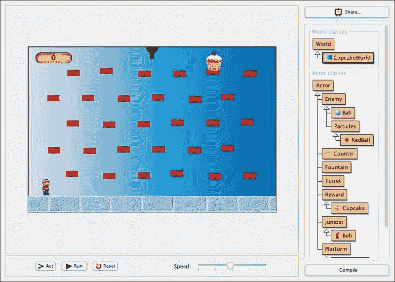
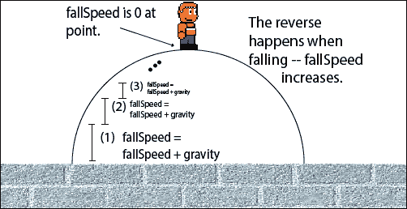
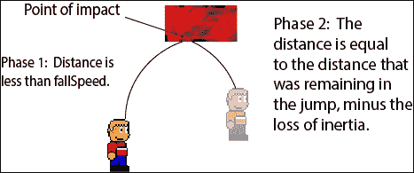
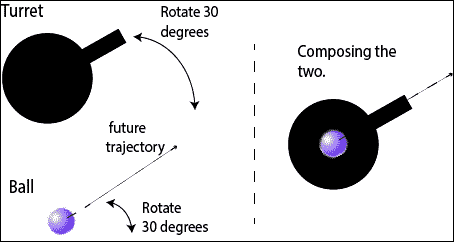

# 第四章。投射物

|   | *"飞行就是学会将自己扔向地面并错过。" |   |
| --- | --- | --- |
|   | --*道格拉斯·亚当斯* |

在创意 Greenfoot 应用中，如游戏和动画，演员通常具有最佳描述为**发射**的运动。例如，足球、子弹、激光、光束、棒球和烟花都是这类物体的例子。实现这种运动的一种常见方法是为一组模拟现实世界物理属性（质量、速度、加速度、摩擦等）的类创建一个集合，并让游戏或模拟演员从这些类中继承。有些人把这称为为你的游戏或模拟创建一个**物理引擎**。然而，这种方法复杂且往往过度。正如你在第二章中学习的，*动画*，我们通常可以使用一些简单的启发式方法来近似现实运动。这就是我们将采取的方法。

在本章中，你将了解投射物的基础知识，如何使物体弹跳，以及一些关于粒子效果的知识。我们将把所学知识应用到我们将在本章中构建的小型平台游戏中。在本章中，我们将涵盖以下主题：

+   重力和跳跃

+   弹跳

+   粒子效果

+   子弹和炮塔

创建逼真的飞行物体并不简单，但我们将以系统、分步骤的方法来介绍这个主题，当我们完成时，你将能够用各种飞行、跳跃和发射物体来丰富你的创意场景。这并不像道格拉斯·亚当斯在他的引语中所说的那么简单，但任何值得学习的东西都不简单。

# 蛋糕计数器

在完整场景的背景下讨论主题对学习过程有益。这样做迫使我们处理在较小、一次性示例中可能被省略的问题。在本章中，我们将构建一个简单的平台游戏，称为**蛋糕计数器**（如图 1 所示）。我们将首先查看游戏中**世界**和**演员**类的大多数代码，而不展示实现本章主题的代码，即基于投射物的不同形式。然后，在随后的章节中，我们将展示并解释缺失的代码。这与前一章中我们采取的方法相同，以便研究碰撞检测。



图 1：这是蛋糕计数器的截图

## 如何玩

**Cupcake Counter** 的目标是收集尽可能多的纸杯蛋糕，在被球或喷泉击中之前。左右箭头键控制角色左右移动，上箭头键使角色跳跃。您还可以使用空格键跳跃。触摸纸杯蛋糕后，它将消失并随机出现在另一个平台上。球将从屏幕顶部的炮塔发射出来，喷泉会定期出现。随着纸杯蛋糕数量的增加，游戏难度将增加。游戏需要良好的跳跃和躲避技巧。

## 实现纸杯蛋糕计数器

创建一个名为 `Cupcake Counter` 的场景，并将每个类按讨论的顺序添加到其中。如果您愿意，您可以从以下链接下载纸杯蛋糕计数器的初始版本：[`www.packtpub.com/support`](http://www.packtpub.com/support)

## CupcakeWorld 类

这个 `World` 子类设置了与场景相关的所有演员，包括得分。它还负责生成周期性敌人，生成奖励，并随着时间的推移增加游戏的难度。以下是这个类的代码：

```java
import greenfoot.*;
import java.util.List;

public class CupcakeWorld extends World {
  private Counter score;
  private Turret turret;
  public int BCOUNT = 200;
  private int ballCounter = BCOUNT;
  public int FCOUNT = 400;
  private int fountainCounter = FCOUNT;
  private int level = 0;

  public CupcakeWorld() {
    super(600, 400, 1, false);
    setPaintOrder(Counter.class, Turret.class, Fountain.class,
    Jumper.class, Enemy.class, Reward.class, Platform.class);
    prepare();
  }

  public void act() {
    checkLevel();
  }

  private void checkLevel() {
    if( level > 1 ) generateBalls();
    if( level > 4 ) generateFountains();
    if( level % 3 == 0 ) {
      FCOUNT--;
      BCOUNT--;
      level++;
    }
  }

  private void generateFountains() {
    fountainCounter--;
    if( fountainCounter < 0 ) {
      List<Brick> bricks = getObjects(Brick.class);
      int idx = Greenfoot.getRandomNumber(bricks.size());
      Fountain f = new Fountain();
      int top = f.getImage().getHeight()/2 + bricks.get(idx).getImage().getHeight()/2;
      addObject(f, bricks.get(idx).getX(),
      bricks.get(idx).getY()-top);
      fountainCounter = FCOUNT;
    }
  }

  private void generateBalls() {
    ballCounter--;
    if( ballCounter < 0 ) {
      Ball b = new Ball();
      turret.setRotation(15 * -b.getXVelocity());
      addObject(b, getWidth()/2, 0);
      ballCounter = BCOUNT;
    }
  }

  public void addCupcakeCount(int num) {
    score.setValue(score.getValue() + num);
    generateNewCupcake();
  }

  private void generateNewCupcake() {
    List<Brick> bricks = getObjects(Brick.class);
    int idx = Greenfoot.getRandomNumber(bricks.size());
    Cupcake cake = new Cupcake();
    int top = cake.getImage().getHeight()/2 +
    bricks.get(idx).getImage().getHeight()/2;
    addObject(cake, bricks.get(idx).getX(),
    bricks.get(idx).getY()-top);
  }

  public void addObjectNudge(Actor a, int x, int y) {
    int nudge = Greenfoot.getRandomNumber(8) - 4;
    super.addObject(a, x + nudge, y + nudge);
  }

  private void prepare(){
    // Add Bob
    Bob bob = new Bob();
    addObject(bob, 43, 340);
    // Add floor
    BrickWall brickwall = new BrickWall();
    addObject(brickwall, 184, 400);
    BrickWall brickwall2 = new BrickWall();
    addObject(brickwall2, 567, 400);
    // Add Score
    score = new Counter();
    addObject(score, 62, 27);
    // Add turret
    turret = new Turret();
    addObject(turret, getWidth()/2, 0);
    // Add cupcake
    Cupcake cupcake = new Cupcake();
    addObject(cupcake, 450, 30);
    // Add platforms
    for(int i=0; i<5; i++) {
      for(int j=0; j<6; j++) {
        int stagger = (i % 2 == 0 ) ? 24 : -24;
        Brick brick = new Brick();
        addObjectNudge(brick, stagger + (j+1)*85, (i+1)*62);
      }
    }
  }
}
```

让我们按顺序讨论这个类中的方法。首先，我们有类构造函数 `CupcakeWorld()`。在调用超类构造函数之后，它调用 `setPaintOrder()` 来设置在屏幕上显示时将出现在其他演员前面的演员。您在 第二章 *动画* 中介绍了 `setPaintOrder()`。我们在这里使用它的主要原因是为了确保没有任何演员会覆盖用于显示得分的 `Counter` 类。接下来，构造函数方法调用 `prepare()` 来添加并将初始演员放置到场景中。我们将在本节后面讨论 `prepare()` 方法。

在 `act()` 方法内部，我们只会调用 `checkLevel()` 函数。随着玩家在游戏中获得分数，游戏的 `level` 变量也会增加。`checkLevel()` 函数将根据其 `level` 变量稍微改变游戏。当我们的游戏第一次开始时，不会生成敌人，玩家可以轻松地得到纸杯蛋糕（奖励）。这给了玩家一个熟悉在平台上跳跃的机会。随着纸杯蛋糕数量的增加，球和喷泉将被添加。随着级别的持续上升，`checkLevel()` 减少了创建球 (`BCOUNT`) 和喷泉 (`FCOUNT`) 之间的延迟。游戏 `level` 变量在 `addCupcakeCount()` 方法中增加，我们将在下面详细讨论。

`generateFountains()`方法向场景中添加一个`Fountain`演员。我们创建喷泉的速度由延迟变量（参考，第二章，“动画”）`fountainContainer`控制。延迟后，我们在随机选择的`Brick`（我们游戏中的平台）上创建一个喷泉。`getObjects()`方法返回场景中给定类的所有演员。然后我们使用`getRandomNumber()`随机选择一个介于 1 和`Brick`演员数量之间的数字。接下来，我们使用`addObject()`将新的`Fountain`对象放置在随机选择的`Brick`对象上。

使用`generateBalls()`方法生成球体比生成喷泉要简单一些。所有球体都是在屏幕顶部的`turret`所在位置创建的，并从那里以随机选择的轨迹发送出去。我们生成新的`Ball`演员的速度由延迟变量`ballCounter`定义。一旦我们创建了一个`Ball`演员，我们就根据其*x*速度旋转`turret`。通过这样做，我们创造了一种错觉，即`turret`正在瞄准然后发射`Ball Actor`。最后，我们使用`addObject()`方法将新创建的`Ball`演员放入场景中。

当玩家（鲍勃）每次与`Cupcake`碰撞时，都会调用代表玩家的演员的`addCupcakeCount()`方法。在这个方法中，我们增加`scores`然后调用`generateNewCupcake()`来向场景中添加一个新的`Cupcake`演员。`generateNewCupcake()`方法与`generateFountains()`方法非常相似，只是没有延迟变量，并且它随机将`Cupcake`放置在一块砖上而不是`Fountain`演员上。在第一章，“让我们直接进入…”，我们展示了如何使用`Counter`类创建游戏分数，这是一个你可以导入到你的场景中的类。请参阅该章节以获取更多详细信息。

在我们所有的先前场景中，我们使用`prepare()`方法向场景中添加演员。这个`prepare()`方法和之前的方法的主要区别在于，我们使用`addObjectNudge()`方法而不是`addObject()`来放置我们的平台。`addObjectNudge()`方法只是给平台的放置增加了一点随机性，使得每次新游戏都略有不同。平台中的随机变化会导致`Ball`演员具有不同的弹跳模式，并要求玩家更加小心地跳跃和移动。在调用`addObjectNudge()`时，你会注意到我们使用了数字`85`和`62`。这些数字只是适当分散平台的数字，它们是通过试错发现的。

我为`CupcakeWorld`的图片创建了一个蓝色渐变背景，你可以随意使用这个背景，从你可以下载的示例代码中，创建你自己的背景图片，或者使用 Greenfoot 附带提供的背景图片之一。

## 敌人

在 Cupcake Counter 中，所有可以与游戏结束相关的演员都是`Enemy`类的子类。使用继承是共享代码并减少一组类似演员冗余的好方法。然而，我们通常会在 Greenfoot 中仅为了*多态性*创建类层次结构。多态性指的是面向对象语言中一个类能够*采取多种形式*的能力。我们将使用它，这样我们的玩家演员只需要检查与`Enemy`类的碰撞，而不需要检查每个具体的`Enemy`类型，例如`Ball`或`RedBall`。此外，通过这种方式编码，我们使添加额外敌人的代码变得非常容易，如果我们发现我们的敌人有冗余代码，我们可以轻松地将该代码移动到我们的`Enemy`类中。换句话说，我们正在使我们的代码可扩展和可维护。

这里是`Enemy`类的代码：

```java
import greenfoot.*;

public abstract class Enemy extends Actor {
}
```

`Ball`类扩展了`Enemy`类。由于`Enemy`仅用于多态性，`Ball`类包含实现弹跳和初始轨迹所需的所有代码。以下是这个类的代码：

```java
import greenfoot.*;

public class Ball extends Enemy {
  protected int actorHeight;
  private int speedX = 0;

  public Ball() {
    actorHeight = getImage().getHeight();
    speedX = Greenfoot.getRandomNumber(8) - 4;
    if( speedX == 0 ) {
      speedX = Greenfoot.getRandomNumber(100) < 50 ? -1 : 1;
    }
  }

  public void act() {
    checkOffScreen();
  }

  public int getXVelocity() {
    return speedX;
  }

  private void checkOffScreen() {
    if( getX() < -20 || getX() > getWorld().getWidth() + 20 ) {
      getWorld().removeObject(this);
    } else if( getY() > getWorld().getHeight() + 20 ) {
      getWorld().removeObject(this);
    }
  }
}
```

`Ball`类的实现缺少处理移动和弹跳的代码。正如我们之前所述，在提供作为本游戏起点使用的代码之后，我们将回顾所有基于投射物的代码。在`Ball`构造函数中，我们在*x*方向随机选择一个速度并将其保存在`speedX`实例变量中。我们包含了一个辅助方法来返回`speedX`的值（`getXVelocity()`）。最后，我们包括`checkOffScreen()`来移除屏幕外的`Ball`。如果我们不这样做，我们的应用程序将会有一种内存泄漏的形式，因为 Greenfoot 将继续分配资源并管理任何演员，直到它们从场景中移除。对于`Ball`类，我选择使用随 Greenfoot 标准安装提供的`ball.png`图像。

在本章中，我们将学习如何创建一个简单的粒子效果。创建效果更多的是关于粒子使用而非其实施。在下面的代码中，我们创建了一个通用的粒子类，`Particles`，我们将扩展它来创建一个`RedBall`粒子。我们以这种方式组织代码，以便于将来轻松添加粒子。以下是代码：

```java
import greenfoot.*;

public class Particles extends Enemy {
  private int turnRate = 2;
  private int speed = 5;
  private int lifeSpan = 50;

  public Particles(int tr, int s, int l) {
    turnRate = tr;
    speed = s;
    lifeSpan = l;
    setRotation(-90);
  }

  public void act() {
    move();
    remove();
  }

  private void move() {
    move(speed);
    turn(turnRate);
  }

  private void remove() {
    lifeSpan--;
    if( lifeSpan < 0 ) {
      getWorld().removeObject(this);
    }
  }
}
```

我们的粒子被实现为向上移动并在每次调用`act()`方法时稍微转向。一个粒子将移动`lifeSpan`次然后移除自己。正如你可能猜到的，`lifeSpan`是延迟变量的另一种使用。`turnRate`属性可以是正的（稍微向右转）或负的（稍微向左转）。

我们只有一个`Particles`的子类，`RedBall`。这个类提供了`RedBall`的正确图像，提供了`Particles`构造函数所需的要求，并根据`scaleX`和`scaleY`参数缩放图像。以下是其实施：

```java
import greenfoot.*;

public class RedBall extends Particles {
  public RedBall(int tr, int s, int l, int scaleX, int scaleY) {
    super(tr, s, l);
    getImage().scale(scaleX, scaleY);
  }
}
```

对于`RedBall`，我使用了 Greenfoot 提供的图像`red-draught.png`。

## 喷泉

在这个游戏中，喷泉增加了独特的挑战。在达到五级（见`World`类`CupcakeWorld`）后，`Fountain`对象将被生成并在游戏中随机放置。*图 2*显示了喷泉在动作中的样子。一个`Fountain`对象会不断地将`RedBall`对象喷向空中，就像喷泉喷水一样。


图 2：这是游戏 Cupcake Counter 中喷泉对象的特写

让我们看看实现`Fountain`类的代码：

```java
import greenfoot.*;
import java.awt.Color;

public class Fountain extends Actor {
  private int lifespan = 75;
  private int startDelay = 100;
  private GreenfootImage img;

  public Fountain() {
    img = new GreenfootImage(20,20);
    img.setColor(Color.blue);
    img.setTransparency(100);
    img.fill();
    setImage(img);
  }

  public void act() {
    if( --startDelay == 0 ) wipeView();
    if( startDelay < 0 ) createRedBallShower();
  }

  private void wipeView() {
    img.clear();
  }

  private void createRedBallShower() {
  }
}
```

`Fountain`的构造函数创建一个新的蓝色半透明正方形，并将其设置为它的图像。我们从一个蓝色正方形开始，给游戏玩家一个警告，喷泉即将爆发。由于喷泉被随机放置在任何位置，如果直接在我们的玩家身上放下一个喷泉并立即结束游戏，那就太不公平了。这也是为什么`RedBall`是`Enemy`的子类，而`Fountain`不是。玩家触摸蓝色正方形是安全的。`startDelay`延迟变量用于暂停一段时间，然后使用`wipeView()`函数移除蓝色正方形，然后开始`RedBall`淋浴（使用`createRedBallShower()`函数）。我们可以在`act()`方法中看到这一点。`createRedBallShower()`的实现和解释将在本章后面的*粒子效果*部分给出。

## 炮塔

在游戏中，屏幕顶部中间有一个炮塔，它会向玩家发射紫色弹跳球。它在*图 1*中显示。我们为什么使用弹跳球发射炮塔？*因为这是我们自己的游戏，我们可以!* `Turret`类的实现非常简单。炮塔旋转和创建要发射的`Ball`的大部分功能由前面讨论过的`CupcakeWorld`中的`generateBalls()`方法处理。这个类的主要目的是只绘制炮塔的初始图像，它由炮塔底座的黑色圆圈和一个作为炮管的黑色矩形组成。以下是代码：

```java
import greenfoot.*;
import java.awt.Color;

public class Turret extends Actor {
  private GreenfootImage turret;
  private GreenfootImage gun;
  private GreenfootImage img;

  public Turret() {
    turret = new GreenfootImage(30,30);
    turret.setColor(Color.black);
    turret.fillOval(0,0,30,30);

    gun = new GreenfootImage(40,40);
    gun.setColor(Color.black);
    gun.fillRect(0,0,10,35);

    img = new GreenfootImage(60,60);
    img.drawImage(turret, 15, 15);
    img.drawImage(gun, 25, 30);
    img.rotate(0);

    setImage(img);
  }
}
```

我们之前讨论了`GreenfootImage`类以及如何使用其一些方法进行自定义绘图。我们介绍的一个新功能是`drawImage()`。此方法允许你在另一个`GreenfootImage`中绘制一个`GreenfootImage`。这就是你组合图像的方式，我们用它从矩形图像和圆形图像创建我们的炮塔。

## 奖励

我们创建一个`Reward`类，原因和创建`Enemy`类一样。我们是为了方便将来轻松添加新的奖励而做的准备。（在章节的后面，我们将将其作为练习）。以下是代码：

```java
import greenfoot.*; 

public abstract class Reward extends Actor {
}
```

`Cupcake`类是`Reward`类的子类，代表玩家不断试图收集的屏幕上的对象。然而，纸杯蛋糕没有要执行的动作或需要跟踪的状态；因此，其实现很简单：

```java
import greenfoot.*;

public class Cupcake extends Reward {
}
```

在创建这个类时，我将它的图像设置为`muffin.png`。这是一张随 Greenfoot 一起提供的图片。尽管图片的名称是松饼，但它对我来说看起来更像纸杯蛋糕。

## 跳跃者

`Jumper`类是一个允许其所有子类在按下上箭头键或空格键时跳跃的类。这个类的大部分内容将在本章后面的*重力和跳跃*部分实现。在此阶段，我们只提供一个占位符实现：

```java
import greenfoot.*;

public abstract class Jumper extends Actor
{
  protected int actorHeight;

  public Jumper() {
    actorHeight = getImage().getHeight();
  }

  public void act() {
    handleKeyPresses();
  }

  protected void handleKeyPresses() {
  }
}
```

我们接下来要介绍的是`Bob`类。`Bob`类扩展了`Jumper`类，并添加了让玩家左右移动的功能。它还使用了在第二章*动画*中讨论的动画技术，使其看起来像是在实际行走。以下是代码：

```java
import greenfoot.*;

public class Bob extends Jumper {
  private int speed = 3;
  private int animationDelay = 0;
  private int frame = 0;
  private GreenfootImage[] leftImages;
  private GreenfootImage[] rightImages;
  private int actorWidth;

  private static final int DELAY = 3;

  public Bob() {
    super();

    rightImages = new GreenfootImage[5];
    leftImages = new GreenfootImage[5];

    for( int i=0; i<5; i++ ) {
      rightImages[i] = new GreenfootImage("images/Dawson_Sprite_Sheet_0" + Integer.toString(3+i) + ".png");
      leftImages[i] = new GreenfootImage(rightImages[i]);
      leftImages[i].mirrorHorizontally();
    }

    actorWidth = getImage().getWidth();
  }

  public void act() {
    super.act();
    checkDead();
    eatReward();
  }

  private void checkDead() {
    Actor enemy = getOneIntersectingObject(Enemy.class);
    if( enemy != null ) {
      endGame();
    }
  }

  private void endGame() {
    Greenfoot.stop();
  }

  private void eatReward() {
    Cupcake c = (Cupcake) getOneIntersectingObject(Cupcake.class);
    if( c != null ) {
      CupcakeWorld rw = (CupcakeWorld) getWorld();
      rw.removeObject(c);
      rw.addCupcakeCount(1);
    }
  }

  // Called by superclass
  protected void handleKeyPresses() {
    super.handleKeyPresses();

    if( Greenfoot.isKeyDown("left") ) {
      if( canMoveLeft() ) {moveLeft();}
    }
    if( Greenfoot.isKeyDown("right") ) {
      if( canMoveRight() ) {moveRight();}
    }
  }

  private boolean canMoveLeft() {
    if( getX() < 5 ) return false;
    return true;
  }

  private void moveLeft() {
    setLocation(getX() - speed, getY());
    if( animationDelay % DELAY == 0 ) {
      animateLeft();
      animationDelay = 0;
    }
    animationDelay++;
  }

  private void animateLeft() {
    setImage( leftImages[frame++]);
    frame = frame % 5;
    actorWidth = getImage().getWidth();
  }

  private boolean canMoveRight() {
    if( getX() > getWorld().getWidth() - 5) return false;
    return true;
  }

  private void moveRight() {
    setLocation(getX() + speed, getY());
    if( animationDelay % DELAY == 0 ) {
      animateRight();
      animationDelay = 0;
    }
    animationDelay++;
  }

  private void animateRight() {
    setImage( rightImages[frame++]);
    frame = frame % 5;
    actorWidth = getImage().getWidth();
  }
}
```

与`CupcakeWorld`类一样，这个类相当复杂。我们将按顺序讨论它包含的每个方法。首先，构造函数的主要任务是设置行走动画的图像。这种类型的动画在第二章*动画*的*伤害角色*部分和第三章*碰撞检测*的*检测与多个对象的碰撞*部分中都有讨论。这些图像来自[www.wikia.com](http://www.wikia.com)，由用户 Mecha Mario 以精灵图集的形式提供。精灵图集的直接链接是[`smbz.wikia.com/wiki/File:Dawson_Sprite_Sheet.PNG`](http://smbz.wikia.com/wiki/File:Dawson_Sprite_Sheet.PNG)。请注意，我手动使用我最喜欢的图像编辑器从这张精灵图集中复制并粘贴了我使用的图像。

### 注意

**免费互联网资源**

除非你除了是程序员之外还是一名艺术家或音乐家，否则你将很难为你的 Greenfoot 场景创建所有需要的资源。如果你查看 AAA 级视频游戏的致谢部分，你会发现艺术家和音乐家的数量实际上等于甚至超过了程序员。

幸运的是，互联网伸出援手。有许多网站提供合法的免费资源，你可以使用。例如，我用来获取`Bob`类图片的网站在 Creative Commons Attribution-Share Alike License 3.0 (Unported) (CC-BY-SA)许可下提供免费内容。检查你从互联网下载的任何资源的许可使用情况并仔细遵守那些用户协议非常重要。此外，确保你完全注明了资源的来源。对于游戏，你应该包含一个*致谢*屏幕，列出你使用的所有资源的来源。

以下是一些提供免费在线资源的优秀网站：

+   [www.wikia.com](http://www.wikia.com)

+   [newgrounds.com](http://newgrounds.com)

+   [`incompetech.com`](http://incompetech.com)

+   [opengameart.org](http://opengameart.org)

+   [untamed.wild-refuge.net/rpgxp.php](http://untamed.wild-refuge.net/rpgxp.php)

接下来，我们有`act()`方法。它首先调用其超类的`act()`方法。它需要这样做，以便我们获得由`Jumper`类提供的跳跃功能。然后，我们调用`checkDead()`和`eatReward()`。`checkDead()`方法如果`Bob`类的实例接触到敌人，则结束游戏，而`eatReward()`方法通过调用`CupcakeWorld`方法的`addCupcakeCount()`，每次接触到`Cupcake`类的实例时，将我们的分数加一。

类的其余部分实现了左右移动。主要方法是`handleKeyPresses()`。像在`act()`中一样，我们首先做的事情是调用`Jumper`超类中的`handleKeyPresses()`。这运行了`Jumper`中的代码，处理空格键和上箭头键的按下。处理按键的关键是 Greenfoot 方法`isKeyDown()`（见以下信息框）。我们使用这个方法来检查是否按下了左箭头键或右箭头键。如果是这样，我们分别使用`canMoveLeft()`和`canMoveRight()`方法检查演员是否可以向左或向右移动。如果演员可以移动，我们就调用`moveLeft()`或`moveRight()`。

### 注意

**Greenfoot 中的按键处理**

在本书的序言中，我们解释说，我们假设您对 Greenfoot 有一些经验，并且至少完成了位于页面上的教程：[`www.greenfoot.org/doc`](http://www.greenfoot.org/doc)

第二个教程解释了如何使用键盘控制演员。为了刷新您的记忆，我们将在下面提供一些关于键盘控制的信息。

我们在实现键盘控制时主要使用的方法是`isKeyDown()`。这个方法提供了一种简单的方式来检查是否按下了某个键。以下是 Greenfoot 文档中的一段摘录：

```java
public static boolean isKeyDown(java.lang.String keyName)
Check whether a given key is currently pressed down.

Parameters:
keyName:This is the name of the key to check.

This returns : true if the key is down.

Using isKeyDown() is easy. The ease of capturing and using input is one of the major strengths of Greenfoot. Here is example code that will pause the execution of the game if the "p" key is pressed:

if( Greenfoot.isKeyDown("p") {
  Greenfoot.stop();
}
```

接下来，我们将讨论`canMoveLeft()`、`moveLeft()`和`animateLeft()`。`canMoveRight()`、`moveRight()`和`animateRight()`方法的功能与之类似，将不会进行讨论。`canMoveLeft()`的唯一目的是防止演员走出屏幕的左侧。`moveLeft()`方法使用`setLocation()`移动演员，然后使演员看起来像是在向左侧移动。它使用一个延迟变量来使行走速度看起来更自然（不要太快）。`animateLeft()`方法依次显示行走左侧的图像。这与我们在第二章中看到的动画策略相同，*动画*。

## 平台

游戏包含几个玩家可以跳跃或站立的平台。平台不执行任何操作，仅作为图像的占位符。我们使用继承来简化碰撞检测。以下是`Platform`的实现：

```java
import greenfoot.*; 

public class Platform extends Actor {
}
```

这里是`BrickWall`的实现：

```java
import greenfoot.*; 

public class BrickWall extends Platform {
}
```

这里是`Brick`的实现：

```java
import greenfoot.*; 

public class Brick extends Platform {
}
```

## 测试一下

你现在应该能够编译和测试 Cupcake Counter。确保你处理了在输入代码时引入的任何错误，如拼写错误或其他错误。目前，你只能左右移动。看看 `Bob` 正在行走。*非常酷!* 其他一切取决于我们之前实现中省略的一些代码。我们将在下一部分补全这些缺失的代码。让我们启动一些演员。

## 你的作业

考虑我们之前代码中省略的一个位置。尝试自己提供代码。你将如何开始？我的建议是先从铅笔和纸开始。画一些图形，想象你需要执行哪些步骤来实现功能。将这些步骤转换为 Java 代码并尝试运行。这样做将帮助你更好地理解和处理即将到来的解决方案，即使你的解决方案是错误的。

# 启动演员

我们将把之前的不完整实现转变为一个游戏，通过添加跳跃、弹跳、粒子效果和从炮塔发射的子弹。

## 重力和跳跃

目前，我们的玩家角色被卡在屏幕底部。我们将补全 `Jumper` 类和 `Bob` 类中的缺失代码，使我们的角色能够跳跃，并最终有办法到达屏幕顶部的蛋糕奖励。跳跃是施加向上的力以移动一个物体。我们还需要一个作用于物体的向下力，以便它能够落回地面。就像现实生活中一样，我们将这个力称为 *重力*。`Jumper` 类的更改非常广泛，因此我们将首先查看完整的实现，然后进行讨论。以下是代码：

```java
import greenfoot.*;

public abstract class Jumper extends Actor
{
  protected int actorHeight;
  private int fallSpeed = 0;
  private boolean jumping = false;

  // Class Constants
  protected static final int GRAVITY = 1;
  protected static final int JUMPSTRENGTH = 12;

  public Jumper() {
    actorHeight = getImage().getHeight();
  }

  public void act() {
    handleKeyPresses();
    standOrFall();
  }

  protected void handleKeyPresses() {
    if( (Greenfoot.isKeyDown("space") ||
    Greenfoot.isKeyDown("up")) && !jumping) {
      jump();
    }
  }

  private void jump() {
    fallSpeed = -JUMPSTRENGTH;
    jumping = true;
    fall();
  }

  private void standOrFall() {
    if( inAir() ) {
      checkHead();
      fall();
      checkLanding();
    } else {
      fallSpeed = 0;
      jumping = false;
    }
  }

  private void checkHead() {
    int actorHead = -actorHeight/2;
    int step = 0;
    while( fallSpeed < 0 && step > fallSpeed
    && getOneObjectAtOffset(0, actorHead + step,
    Platform.class) == null ) {
      step--;
    }
    if( fallSpeed < 0 ) {
      fallSpeed = step;
    }
  }

  private void checkLanding() {
    int actorFeet = actorHeight/2;
    int step = 0;
    while( fallSpeed > 0 && step < fallSpeed
    && getOneObjectAtOffset(0, actorFeet + step,
    Platform.class) == null ) {
      step++;
    }
    if( fallSpeed > 0 ) {
      fallSpeed = step;
    }
  }

  private boolean inAir() {
    Actor platform = getOneObjectAtOffset(0,
    getImage().getHeight()/2, Platform.class);
    return platform == null;
  }

  private void fall() {
    setLocation(getX(), getY() + fallSpeed);
    fallSpeed = fallSpeed + GRAVITY;
  }
}
```

请注意，我们添加了两个新的实例变量（`fallSpeed` 和 `jumping`）和两个静态常量（`GRAVITY` 和 `JUMPSTRENGTH`）。这些新变量将贯穿我们的代码。在我们的 `act()` 方法中，我们添加了 `standOrFall()` 方法。这个方法负责应用重力和检测碰撞（对于演员的头和脚）。在进一步查看该方法之前，让我们看看 `handleKeyPresses()` 方法的完整实现。在这个方法中，我们检测是否按下了空格键或上箭头键，如果是，则调用 `jump()`。你会注意到 `if` 语句还包含一个检查 `Boolean` 变量 `jumping` 是否为 `false` 的条件。我们需要这个检查来防止双重跳跃（在跳跃过程中再次跳跃）。`jump()` 方法将 `fallSpeed` 改为负值。这会在演员上施加向上的力。我们将 `jumping` 设置为 `true`（因为我们现在处于跳跃状态），然后调用 `fall()`。`fall()` 方法将重力应用于演员。在这个方法中，我们可以看到负值的 `fallSpeed` 将推动演员向上移动。

`fallSpeed` 的值会持续加上 `GRAVITY`，直到它变为正值。这将产生类似抛物线的运动，如图 *图 3* 所示。



图 3：这是坠落实现的示例

让我们来看看`standOrFall()`函数的实现。首先我们需要检查我们是否目前正站在一个`Platform`对象上。我们使用`inAir()`方法来进行这个检查。这个方法使用`getOneObjectAtOffset()`（见第三章, *碰撞检测*)来检查角色的底部是否接触到了`Platform`对象，如果接触到了则返回`false`。在`standOrFall()`中，如果我们确定自己在空中，我们会做三件事情。我们会检查角色的顶部或底部是否与`Platform`发生碰撞，如果发生碰撞则调用`fall()`方法。`checkHead()`和`checkLanding()`方法类似。它们都用于基于边界的碰撞检测，如第三章, *碰撞检测*中所述，以检测碰撞发生的确切像素位置。然后它们会改变`fallSpeed`的值，使角色在碰撞点停止。如果我们检测到在`standOrFall()`中我们不在空中，那么我们就站在平台上，可以将`fallSpeed`设置为`0`（不坠落）并将`jumping`设置为`false`（不跳跃）。

## 弹跳

弹跳角色看起来很棒，并且真的为任何游戏增添了很好的维度。在玩家的心中，它们将你的游戏从像素的平面排列推进到一个丰富的世界，在这个世界中，物体遵循物理的自然法则。在 Cupcake Counter 中，从炮塔射出的球会弹跳。弹跳在`Ball`类中实现。首先，将以下实例变量添加到现有的`Ball`类中：

```java
private int fallSpeed = 0;
protected static final int GRAVITY = 1; 
```

接下来，我们需要向`act()`方法中添加代码，使类的实例在撞击到对象时能够坠落或弹跳。将你的`act()`方法更改为以下内容：

```java
public void act() {
  fallOrBounce();
  checkOffScreen();
}
```

`fallOrBounce()`方法将会很复杂，但我们将使用功能分解（将其分解成更小的方法）来管理复杂性，并使我们的代码更易于阅读。以下是它的实现：

```java
private void fallOrBounce() {
  if( fallSpeed <= 0) {
    checkHead();
  } else {
    checkLanding();
  }
}
```

我们已经将`fallOrBounce()`的实现简化为检查我们是否即将撞头或即将落在平台上。我们根据`fallSpeed`的值在这两个检查之间进行选择。如果`fallSpeed`是负数，那么我们正在向上移动，此时不需要检查是否即将着陆。以下是`checkHead()`的实现：

```java
private void fallOrBounce() {
  if( fallSpeed <= 0) {
    checkHead();
  } else {
    checkLanding();
  }
}
private void checkHead() {
  int actorHead = -actorHeight/2;
  int step = 0;
  int oldFallSpeed;
  while( fallSpeed < 0 && step > fallSpeed &&
  getOneObjectAtOffset( 0, actorHead + step,
  Platform.class) == null ) {
    step--;
  }
  if( step > fallSpeed ) {
    if( fallSpeed < 0 ) {
      handleBounce(step);
    }
  } else {
    fall(speedX);
  }
}
```

`checkHead()` 方法使用基于边界的碰撞检测（在第三章碰撞检测中讨论），来检测物体的顶部何时接触到平台。如果 `step` 最终大于 `fallSpeed`，则没有发生碰撞，我们可以继续通过调用 `fall()` 让重力影响我们的轨迹。如果 `step` 小于 `fallSpeed`，则我们的头部撞到了平台，我们需要通过调用 `handleBounce()` 来处理从这个平台上弹跳的情况。以下是 `handleBounce()` 的实现。

```java
private void handleBounce(int step) {
  int oldFallSpeed = fallSpeed;
  fallSpeed = step; 
  fall(0);
  oldFallSpeed = (int)(oldFallSpeed * 0.7);
  fallSpeed = step - oldFallSpeed;
  fall(0);
  fallSpeed = -oldFallSpeed;
}
```

此方法通过将其分为两个主要阶段来处理弹跳。第一阶段处理角色与平台之间的运动。第二阶段处理从平台到最终位置的运动。阶段在 *图 4* 中显示。



图 4：这显示了处理弹跳的两个主要阶段。阶段 1 是碰撞前的运动，阶段 2 是碰撞后的运动

在第一阶段，我们将球移动到碰撞点，通过将 `fallSpeed` 设置为 `step` 并调用 `fall(0)` 来实现。我们很快就会看到 `fall()` 的实现。现在，只需知道 `fall(0)` 调用 `setLocation()` 来移动球，并通过应用重力的效果来更新 `fallSpeed` 就足够了。在 `handleBounce()` 的第二阶段，我们乘以 `0.7` 以模拟碰撞中发生的能量损失。`0.7` 没有什么神奇或科学的地方。它只是在测试时看起来合适。然后我们通过再次调用 `fall(0)` 来移动剩余的惯性距离（`step` – `oldFallSpeed`）。弹跳改变了我们的下落方向，所以我们最后要做的就是更新 `fallSpeed` 以反映这种变化。

由于我们刚刚使用了 `fall()` 方法，让我们来看看它：

```java
private void fall(int dx) {
  setLocation(getX() + dx, getY() + fallSpeed);
  fallSpeed = fallSpeed + GRAVITY;
}
```

如前所述，`fall()` 方法使用 `setLocation()` 根据其在 *x* 方向上的速度和下落速度来移动角色。实例变量 `fallSpeed` 被更新以考虑重力（减速或加速）的影响。

剩下要完成 `Ball` 类实现的唯一方法是 `checkLanding()`。下面是它的实现：

```java
private void checkLanding() {
  int actorFeet = actorHeight/2;
  int step = 0;
  int oldFallSpeed;
  while( fallSpeed > 0 && step < fallSpeed &&
  getOneObjectAtOffset(0, actorFeet + step,
  Platform.class) == null ) {
    step++;
  }
  if( step < fallSpeed ) {
    if( fallSpeed > 0 ) {
      handleBounce(step);
    }
  } else {
    fall(speedX);
  }
}
```

`checkLanding()` 函数的实现与 `checkHead()` 函数的实现完全相同，只是它处理的是向下移动而不是向上移动。

弹跳是一个很好的效果，可以应用于各种角色。你可以将弹跳的实现与我们在上一节中讨论的跳跃实现结合起来，为你的游戏制作一个会弹跳、会跳跃的英雄。

## 粒子效果

粒子效果是通过创建许多小演员来制作动画的。之前，您学习了主要通过快速图像交换来制作动画。您可以想象通过创建 4-6 个向上喷射的喷泉图像并在这之间切换来创建一个喷泉。而不用这样做，我们将使用粒子效果来创建喷泉。方便的是，您已经拥有了创建粒子效果所需的所有信息。粒子只是您分配了运动模式的小演员。然后，您创建很多它们来提供所需的效果。我们将这样做来完成`Fountain`类的实现。我们唯一没有实现的部分是`createRedBallShower()`方法的代码。以下是缺失的代码：

```java
private void createRedBallShower() {
  lifespan--;
  if( lifespan < 0) {
    getWorld().removeObject(this);
  } else {
    int tr = Greenfoot.getRandomNumber(30) - 15;
    int s = Greenfoot.getRandomNumber(4) + 6;
    int l = Greenfoot.getRandomNumber(15) + 5;
    getWorld().addObject(new RedBall(tr, s, l, 10, 10), getX(), getY());
  }
}
```

实例变量`lifespan`是一个延迟变量，我们用它来确定喷泉存在的时间。一旦`lifespan`小于零，我们就从场景中移除这个喷泉。否则，我们用随机的生命周期和转向速度重新创建`RedBall`。这些参数在*敌人*部分讨论过。

在每次调用`act()`方法时重新创建`RedBall`，并赋予其略微不同的属性，可以创建一个非常有趣的喷泉效果，如*图 2*所示。

## 子弹和炮塔

我们已经完全实现了子弹和炮塔。`Turret`类已经完成，我们在*弹跳*部分完成了`Ball`类（我们的子弹）。在这里，我们将讨论创建炮塔和子弹的基本步骤，并解释我们之前所做的工作如何为您提供创建机枪、大炮、坦克或其他类型炮塔所需的信息。

首先，您需要一个带有图像的炮塔。您可以像我们在`Turret`类中做的那样动态创建图像，或者使用`setImage()`来设置它。然后，炮塔只需要旋转到它们射击的方向。这就是我们在`CupcakeWorld`中的`generateBalls()`方法中所做的。子弹只是旋转到某个方向并不断调用`move()`以在该方向移动的演员。如果您将炮塔和子弹旋转相同的角，将子弹放置在炮塔相同的起始位置，并让子弹向前移动，那么它就会看起来像炮塔发射了子弹。这说得通吗？*图 5*总结了这一策略。



图 5：创建发射子弹的炮塔所需的步骤

## 您的作业

现在，编译我们刚刚给您的所有代码，并玩一会儿蛋糕计数器。您可能会开始注意到为什么我们一开始让平台的位置具有一些随机性。如果我们没有这样做，玩家会很快适应球体的下落模式。

本节的任务是为游戏编写另一个随机变体。你可以进一步随机化平台，玩弄球的速度或大小，或者改变玩家跳跃的力量。

# 挑战

我们已经创建了一个相当功能齐全的游戏。我们的游戏中有一个得分、酷炫的动画、碰撞检测和关卡。在玩过它之后，你会首先想改进什么？让你的朋友也来玩。他/她觉得怎么样？尝试根据你玩游戏的经验提出一些改进游戏的改变。

此外，我们设计游戏使其易于添加新的奖励、敌人和平台。为游戏添加每种各一个，并给它们添加你自己的特色。例如，你可以创建一个价值五分的超级纸杯蛋糕，但它只持续很短的时间。这将要求玩家在游戏中做出一些快速而有意义的决策。

# 摘要

虽然我们没有创建一个完整的物理引擎，但我们确实介绍了一些简单的技术来为演员提供有趣的动作。我们的讨论集中在基于抛射物的动作上，包括弹跳、跳跃、射击和粒子效果。到目前为止，我们已经掌握了一系列创造性的编程技术，使我们能够创建各种动画、模拟和游戏。然而，创建一个有趣的交互式体验并非易事。在下一章中，我们将学习游戏设计和游戏开发的过程，这将帮助我们创建令人惊叹的交互式体验。
