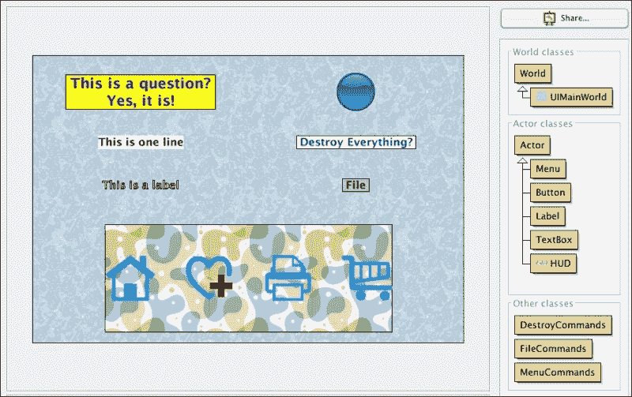
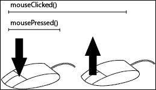
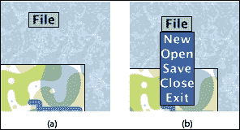
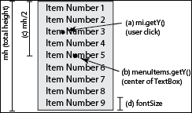
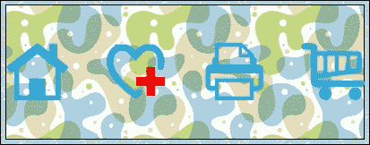
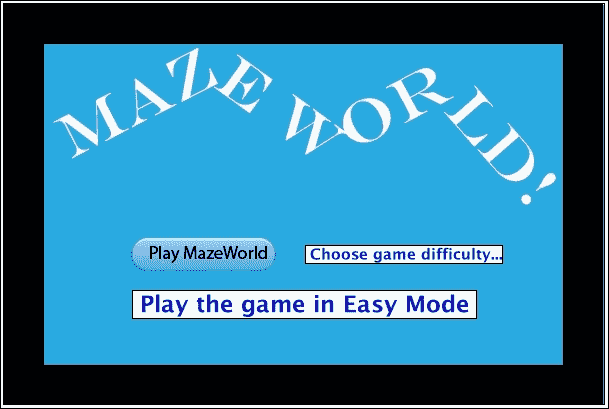
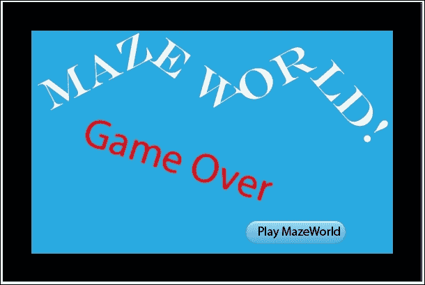
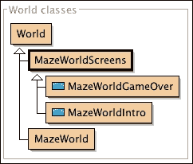
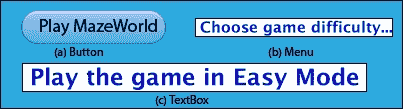
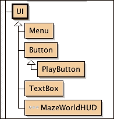

# 第八章。用户界面

|   | *"如果你能梦想它，你就能做到。" |   |
| --- | --- | --- |
|   | --*沃尔特·迪士尼* |

除了游戏和模拟的用户控制之外，有时你可能希望用户点击按钮、查看文本和从菜单中选择项目。想象一下，你正在创建一个物理模拟，并希望用户设置某些模拟参数，或者你在游戏中有一个商店，玩家可以在那里购买升级。或者，也许你想要在你的场景中创建两个演员之间的对话。在本章中，我们将探讨提供各种类型 **用户界面**（**UIs**）的技术。具体来说，我们将探讨以下主题：

+   按钮和标签

+   菜单

+   头戴式显示器 (HUD)

Greenfoot 在创建用户界面方面提供的直接支持很少。只有几个类，如 `Label` 和 `Counter`，被打包在 Greenfoot 中以帮助这方面。因此，我们将不得不自己构建支持。我们将使用 Greenfoot 的 `Actors` 和 `GreenfootImage` 类来创建用户界面和将支持创建用户界面的类。幸运的是，Greenfoot 允许我们构建我们所能梦想的几乎所有东西，包括用户界面。

# UIWorld

在本节中，我们将解释如何编写以下用户界面元素：按钮、文本框、菜单和 **头戴式显示器**（**HUDs**）。我们将通过一个 Greenfoot 场景（如图 1 所示）来操作，该场景只包含用户界面元素，这样我们就可以独立讨论每个元素。

我们编写的某些代码将是通用的，可以应用于许多不同的场景。在其他情况下，我们将编写需要稍作修改才能跨场景使用的用户界面代码。在下一节中，我们将把这些元素添加到我们在上一章中编写的 `MazeWorld` 场景中，使其成为一个更加精致和可玩的游戏。



图 1：这显示了 UI MainWorld

要处理这个场景，从一个名为 `UIMainWorld` 的新 Greenfoot 场景开始，创建一个名为 `UIMainWorld` 的 `World` 子类，并将其与一个纯背景关联。我选择的背景是 `bluerock.jpg`。以下是 `UIMainWorld` 的代码：

```java
import greenfoot.*;
import java.awt.Color;

public class UIMainWorld extends World {

  public UIMainWorld() {
    super(600, 400, 1);
    testActors();
  }

  private void testActors() {
    /*   Begin comment
    TextBox t1 = new TextBox(
    " This is a question?\n Yes, it is! ",
    24, true, Color.BLUE, Color.YELLOW);
    addObject(t1, 150, 50);
    TextBox t2 = new TextBox("This is one line",
    18, false, Color.BLACK, Color.WHITE);
    addObject(t2, 150, 120);
    Button b1 = new Button("button-blue.png",
    "button-green.png");
    addObject(b1, 450, 50);
    Menu m1 = new Menu(" Destroy Everything? ",
    "Are you sure?", 18,
    Color.BLUE, Color.WHITE
    Color.BLACK, Color.WHITE,
    new DestroyCommands());
    addObject(m1, 450, 120);
    Menu m2 = new Menu(" File ",
    "New\nOpen\nSave\nClose\nExit", 18,
    Color.BLACK, Color.lightGray,
    Color.WHITE, Color.BLUE,
    new FileCommands());
    addObject(m2, 450, 180);
    HUD h = new HUD();
    addObject(h, 300, 310);
    Label l = new Label("This is a label", 18);
    addObject(l, 150, 180);
    End Comment  */
  }
}
```

目前，`testActors()` 方法中的代码已被注释。在我们实现相关演员时取消注释它们，这样你就可以逐一测试和玩每个演员。如果你愿意，你可以从 [`www.packtpub.com/support`](http://www.packtpub.com/support) 下载完整的 UI 场景。

## 按钮类

有没有比谦逊的按钮更丰富的 UI 元素？很难想象任何界面不包含几个这样的按钮。幸运的是，在 Greenfoot 中实现它们非常简单。在你的 UI 场景中，从 `Actor` 类派生出一个新子类，并将其命名为 `Button`。为 `Button` 的图像选择 **无图像**。我们将动态添加此演员所需的图像。以下是 `Actor` 类的代码：

```java
import greenfoot.*;

public class Button extends Actor {
  protected String first;
  protected String second;

  public Button(String f, String s) {
    first = f;
    second = s;
    setImage(f);
  }

  public void act() {
    handleMouseClicks();
  }

  private void handleMouseClicks() {
    if( Greenfoot.mousePressed(this) ) {
      setImage(second);
    } else if( Greenfoot.mouseClicked(this) ) {
      setImage(first);
      clickedAction();
    }
  }

  protected void clickedAction() {
    // Can either fill this in or have subclasses override.
  }
}
```

对于按钮，您需要一个用于正常状态的图像和一个用于按下状态的图像。`first`和`second`实例变量存储这些图像的名称。它们的值作为输入参数提供给类的构造函数。构造函数将初始图像设置为`first`图像。

`act()`方法只包含一个方法调用，用于处理此演员的鼠标事件——`handleMouseClicks()`。当鼠标按下时，此方法显示`second`图像，然后在点击完成后返回显示`first`图像。在 Greenfoot 中，`Greenfoot.mousePressed()`方法在给定对象上按下左鼠标按钮时返回`true`。`Greenfoot.mouseClicked()`方法在给定对象上按下并释放左鼠标按钮时返回`true`。*图 2*演示了这两个鼠标事件。当我们检测到鼠标按下时，我们只需将图像更改为`second`图像。当鼠标释放时，发生了一次完整的点击，我们做两件事。首先，我们将图像恢复到正常状态，然后通过调用`clickedAction()`方法执行一个动作。此方法目前为空，用作可以放置您自己的自定义动作代码的占位符。另一种选择是创建此类的子类，并在您的新子类中重写`clickedAction()`方法。



图 2：在 Greenfoot 中，当左鼠标按钮同时按下和释放时，认为鼠标被点击

按钮是通过在`World`子类`UIMainWorld`中以下两行代码添加到屏幕上的：

```java
Button b1 = new Button("button-blue.png", "button-green.png");
addObject(b1, 450, 50);
```

`button-blue.png`和`button-green.png`图像是 Greenfoot 默认安装提供的图像（在版本 2.2 中不可用）。您可以通过创建具有这些图像作为默认图像的临时演员或将它们从 Greenfoot 的安装中复制来快速将这些图像添加到您的项目中。取消注释`UIMainWorld`中的`testActors()`方法中显示的两行代码，编译您的场景，并测试您的新按钮。

## TextBox 类

`TextBox`的功能在功能上与 Greenfoot 提供的`Label`类非常相似。请注意，在`UIMainWorld`中，我们添加了一个`Label`类的实例到我们的场景中，用于演示和比较目的。要将`Label`类添加到您的 UI 场景中，请点击 Greenfoot 主菜单中的**编辑**，然后点击**导入类…**。在出现的弹出窗口的左侧点击**Label**，阅读关于`Label`类的文档（如果您感兴趣），然后点击**导入**按钮。我们将实现我们自己的`Label`版本，并将其称为`TextBox`。我们将编写的`Textbox`类更加简洁，这为我们提供了一个讨论如何在 Greenfoot 中处理文本的理由。

在 *图 1* 中，我们可以看到 `TextBox` 类的两个示例。此类允许我们在屏幕上使用自定义字体、颜色、背景颜色和可选边框显示文本。以下是 `TextBox` 的代码：

```java
import greenfoot.*;
import java.awt.Color;

public class TextBox extends Actor {
  private GreenfootImage img;
  private boolean border = false;
  private int fontSize;
  private Color foreground;
  private Color background;

  public TextBox(String s, int fs, boolean b,
  Color fg, java.awt.Color bg) {
    super();
    fontSize = fs;
    foreground = fg;
    background = bg;
    img = new GreenfootImage(s, fontSize,
    foreground, background);
    border = b;
    display();
  }

  public void setText(String s) {
    img = new GreenfootImage(s, fontSize,
    foreground, background);
    display();
  }

  private void display() {
    setImage(img);
    if( border ) {
      img.setColor(Color.BLACK);
      img.drawRect(0, 0, img.getWidth()-1,
      img.getHeight()-1);
      setImage(img);
    }
  }
}
```

在 `TextBox` 中，我们可以配置前景色、背景色、字体大小以及是否在文本框周围绘制边框。除了要显示的实际文本外，构造函数还接受并存储这些值。`display()` 方法负责实际创建我们的新文本框。首先，它使用 Greenfoot 的 `GreenfootImage()` 方法根据之前的配置信息创建一个新的图像。

当你将文本作为第一个参数传递给 `GreenfootImage()` 时，它将创建一个该文本的图像。然后，我们只需使用 `setImage()` 来显示该文本。`display()` 方法检查 `border` 实例变量，并在需要时在新创建的图像上绘制一个边框。我们还提供了一个 `setText()` 方法，以防我们需要动态更改文本。此方法基于新文本创建一个新的 `GreenfootImage`，然后使用 `display()` 方法正确设置文本框的图像为新创建的图像。

要测试我们的新 `TextBox` 类，请取消注释 `UIMainWorld` 中 `testActors()` 的所有行，这些行涉及添加 `TextBox` 实例，编译场景，并运行它。

## `Menu` 类

菜单在接收用户命令方面非常出色。我相信你有很多使用它们的经验，并理解它们的实用性。我们实现的菜单涉及使用我们刚刚创建的 `TextBox` 类和一个名为 `MenuCommands` 的新 Java 接口，我们很快将实现它。`TextBox` 实例显示文本，而菜单选择的动作由实现 `MenuCommands` 接口的类执行。我们很快会详细解释这一点。

*图 3* 提供了我们的 `Menu` 类的功能概述。我们的菜单最初看起来像 `TextBox`，如图 3(a) 所示。当用户点击菜单时，会出现一个弹出菜单，用户可以选择一系列操作。弹出菜单如图 3(b) 所示。菜单标题和命令集都是可配置的。



图 3：最初，菜单对象看起来像 TextBox（见图 (a)）。当用户点击文本时，会出现一个下拉菜单，用户可以选择多个项目（见图 (b)）

这是 `Menu` 的代码：

```java
import greenfoot.*;
import java.awt.Color;

public class Menu extends Actor
{
  private TextBox titleBar;
  private TextBox menuItems;
  private MenuCommands menuCommands;
  private int fontSize = 24;
  private boolean visible = false;
  private Color mainFG;
  private Color mainBG;
  private Color secondFG;
  private Color secondBG;
  int th, mh;  /* title and menu height */

  public Menu(String tb, String i, int fs,
  Color fg1, Color bg1, Color fg2, Color bg2,
  MenuCommands mc) {
    mainFG = fg1;
    mainBG = bg1;
    secondFG = fg2;
    secondBG = bg2;
    titleBar = new TextBox(tb, fs, true, mainFG, mainBG);
    menuItems = new TextBox(i, fs, true, secondFG, secondBG);
    menuCommands = mc;
    fontSize = fs;
  }

  public Menu() {
    this("not initialized", "none", 24,
    Color.BLACK, Color.lightGray, Color.BLACK,
    Color.WHITE, null);
  }

  protected void addedToWorld(World w) {
    w.addObject(titleBar, getX(), getY());
    th = titleBar.getImage().getHeight();
    mh = menuItems.getImage().getHeight();
  }

  public void act() {
    handleMouse();
  }

  private void handleMouse() {
    if( Greenfoot.mouseClicked(titleBar) ) {
      if( !visible ) {
        getWorld().addObject(menuItems,
        getX(), getY()+(th+mh)/2);
      } else {
        getWorld().removeObject(menuItems);
      }
      visible = !visible;
    }

    if( Greenfoot.mouseClicked(menuItems)) {
      MouseInfo mi = Greenfoot.getMouseInfo();
      int menuIndex =
      ((mi.getY()-menuItems.getY()+mh/2)-1)/fontSize;
      menuCommands.execute(menuIndex, getWorld());
      visible = !visible;
      getWorld().removeObject(menuItems);
    }
  }
}
```

`Menu` 实例由两个 `TextBox` 实例和一个 `MenuCommands` 接口的实现组成。第一个 `TextBox` 实例表示菜单标题（如图 3(a) 所示），第二个 `TextBox` 实例表示命令集合（如图 3(b) 所示）。`Menu` 构造函数创建了这两个 `TextBox` 实例，并存储提供的 `MenuCommands` 对象以供以后使用。

当`Menu`被添加到`World`中时，我们使用`addedToWorld()`方法将菜单标题栏放置在场景中，并收集稍后正确放置弹出窗口所需的高度信息。

`act()`方法调用一个方法`handleMouse()`，当点击标题文本时放置菜单项弹出。对于菜单项弹出，`handleMouse()`方法确定是否被点击以及点击的位置，然后调用适当的命令。以下代码确定了点击位置：

```java
((mi.getY()-menuItems.getY()+mh/2)-1)/fontSize
```

这基于当前的字体大小和`TextBox`菜单项的高度。*图 4*以图解的形式展示了计算过程。



图 4：为了确定哪个菜单项被点击，使用以下公式：((a)-(b)+(c))/(d)。这个公式确定了图像中心（b）和点击位置（a）之间的距离，通过添加一半的高度（c）来调整值，使其相对于图顶部的位置，然后除以字体大小（d）以获得实际的项目索引

现在我们知道了用户点击的菜单项的索引，我们需要运行与其关联的命令。为此，我们只需在通过构造函数传递给我们的`MenuCommands`对象上调用`execute()`方法。`MenuCommands`是一个 Java 接口，它保证任何实现此接口的 Java 类都将具有`execute()`方法。

### 提示

我们在第三章中首次遇到了 Java 接口，*碰撞检测*。请记住，实现 Java 接口的类承诺提供该接口中定义的每个方法的实现。有关更多信息，请参阅第三章，*碰撞检测*。

以下是`MenuCommands`类的代码：

```java
import greenfoot.*;

public interface MenuCommands {
  public void execute(int idx, World w);
}
```

如我们所见，此接口只定义了一个方法，`execute()`，它必须接受一个整数参数（表示菜单项的索引）和当前`World`实例的引用。

在我们的 UI 场景中，我们提供了两个使用`Menu`类的示例。第一个是带有菜单标题栏文本的示例，**销毁一切？**。弹出的菜单只有一个选项，**你确定吗？**。以下是`DestroyCommands`类的代码，它实现了`MenuCommands`接口：

```java
import greenfoot.*;

public class DestroyCommands implements MenuCommands {
  public void execute(int idx, World w) {
    System.out.println("Boooom!!!!");
  }
}
```

因为弹出菜单只有一个选项，所以我们不需要使用提供的`idx`值。我们通过简单地向控制台窗口打印**Boooom!!!!**来实现`execute()`方法。

第二个`Menu`类示例模仿了在处理文件的应用程序中会看到的命令类型。此示例在*图 3*中展示。以下是实现`MenuCommands`接口的`FileCommands`类的代码：

```java
import greenfoot.*;

public class FileCommands implements MenuCommands {
  public void execute(int idx, World w) {
    switch(idx) {
      case 0:
      System.out.println("Running New command");
      break;
      case 1:
      System.out.println("Running Open command");
      break;
      case 2:
      System.out.println("Running Save command");
      break;
      case 3:
      System.out.println("Running Close command");
      break;
      case 4:
      System.out.println("Running Exit command");
      break;
    }
  }
}
```

此代码使用`idx`值运行几个可用选项之一。为了简单起见，我们只是向控制台窗口打印消息来演示代码正在正常工作。在你的应用程序中，你会用实际的有关代码替换打印消息。

在第三章中，我们使用接口，因为我们需要遵守 Greenfoot API。在这种情况下，我们选择使用接口，因为它们提供了一种干净简单的方式，可以提供许多不同类型的菜单操作，而无需更改`Menu`类。我们有效地抽象了了解自定义菜单内容的需求，并使我们的`Menu`类适用于广泛的用途。

现在，在`UIMainWorld`中的`testActors()`方法中取消注释`Menu`演员，并测试我们之前创建的菜单。

### 小贴士

`Menu`类相当复杂，因为它涉及管理两个`TextBox`类并实现`MenuCommands`接口。为了更好地理解它，现在尝试创建自己的菜单并将其添加到 UI 场景中。

## 抬头显示

通常，你想要创建一个完全自定义的 UI，它涉及各种形状和图形。在本节中，我们将学习如何做到这一点。本节的标题是抬头显示（HUD），因为游戏通常有自定义界面（称为 HUD），为玩家提供关键信息和控制。然而，这里讨论的方法适用于任何自定义 UI。在我们的例子中，我们将创建图 5 中显示的自定义用户界面元素。在我们的 HUD 中，用户将能够点击主页、收藏、打印和购物车图标来执行我们选择的操作。



图 5：这显示了自定义用户界面元素

图 5 中显示的图形是在 Adobe Illustrator 中创建的。使用任何图形编辑器创建类似的东西。在 UI 场景中，创建一个新的`HUD`演员，并将你创建的图像与之关联。一般来说，你可以在任何编辑器中创建任何你想要的图形。我们创建自定义界面的方法涉及我们在自定义图形上叠加不可见的 Greenfoot 演员，并且图形不需要是任何特定的形状或大小。

这里是我们 UI 场景中`HUD`类的代码：

```java
import greenfoot.*;

public class HUD extends Actor {
  private TransparentRectangle home;
  private TransparentRectangle favorite;
  private TransparentRectangle print;
  private TransparentRectangle cart;
  private static final int W = 70;
  private static final int H = 70;

  protected void addedToWorld(World w) {
    home = new TransparentRectangle(W,H);
    w.addObject(home,
    getX()-getImage().getWidth()/2+W/2,
    getY());
    favorite = new TransparentRectangle(W,H);
    w.addObject(favorite, getX()-W+20, getY());
    print = new TransparentRectangle(W,H);
    w.addObject(print, getX()+W-10, getY());
    cart = new TransparentRectangle(W,H);
    w.addObject(cart,
    getX()+getImage().getWidth()/2-W/2,
    getY());
  }

  private class TransparentRectangle extends Actor {
    public TransparentRectangle(int w, int h) {
      GreenfootImage img = new GreenfootImage(w,h);
      setImage(img);
    }
  }

  public void act() {
    handleMouseClicks();
  }

  private void handleMouseClicks() {
    if( Greenfoot.mouseClicked(home) ) {
      System.out.println("Clicked Home");
    }
    if( Greenfoot.mouseClicked(favorite) ) {
      System.out.println("Clicked Favorite");
    }
    if( Greenfoot.mouseClicked(print) ) {
      System.out.println("Clicked Print");
    }
    if( Greenfoot.mouseClicked(cart) ) {
      System.out.println("Clicked Cart");
    }
  }
}
```

如前文片段所示，与这个类相关的代码并不多。代码创建了四个新的无形演员，并将它们放置在我们希望用户能够点击的我们的自定义 UI 中的对象上。在 `addedToWorld()` 方法中，我们创建了家、收藏、打印和购物车演员来覆盖 *图 5* 中显示的家、收藏、打印和购物车图标。这个方法中特定于 *图 5* 中图形的部分是放置无形演员的位置。如果你创建了一个与我展示不同的图形，那么你需要自己确定放置新演员的正确位置。

你可能已经注意到我们创建的无形演员是名为 `TransparentRectangle` 的内部类的实例。这是我们在这本书中第一次使用内部类，它们值得一些讨论。在最简单的层面上，内部类只是定义在另一个类内部的类，因此通常无法被项目中其他类访问。以下信息框包含有关内部类的更多信息。

### 注意

**关于内部类的更多内容**

在面向对象的设计中，你通过将问题分解成更小的对象，然后仔细构建这些对象如何通信或协作来解决一个问题。这是一个自上而下的设计示例（在第一章中讨论，*Let's Dive Right in…*），我们将问题分解成越来越小的子问题。有时，一个类的内部状态可能非常复杂，使用内部类可能有助于管理这种内部复杂性。本质上，这是一种层次化的面向对象设计。

内部类的另一个用途是封装只对项目中一个类有非常特定用途的类。例如，我们的 `HUD` 类是我们场景中唯一使用 `TransparentRectangle` 类的类。通过在 `HUD` 中隐藏 `TransparentRectangle`，没有其他类会暴露给 `TransparentRectangle`。你将注意到在 Greenfoot 中，`TransparentRectangle` 并未出现在主场景窗口的 **Actor 类…** 部分中。

关于内部类（以及嵌套类）的更多信息，请参阅以下文章：[`www.javaworld.com/article/2077411/core-java/inner-classes.html`](http://www.javaworld.com/article/2077411/core-java/inner-classes.html)

最后两个方法，`act()` 和 `handleMouseClicks()`，遵循处理演员上鼠标点击的常见模式，我们在本书中已经多次看到，并在此再次讨论。与我们在本场景中创建的 `Menu` 演员一样，当用户点击其中一个图标时，我们会向控制台打印一条消息。

让我们现在测试整个场景。记住在 `UIMainWorld` 中的 `testActors()` 方法中取消注释创建并添加到场景中的 `HUD` 演员记得编译并确保当你点击各种图标时，控制台会收到消息。

# 向 MazeWorld 添加 UI

现在我们已经有一些创建各种 UI 元素的经验，我们将增强上一章的 MazeWorld 场景。这将给我们一个机会在一个更真实的环境中练习我们所学到的知识。

具体来说，我们将添加：

+   一个带有开始游戏按钮和玩家可以使用以指示游戏难度模式的菜单的起始界面

+   一个游戏结束界面，玩家可以使用按钮重新开始游戏

+   一个玩家可以使用它来暂时击昏敌人、减慢他们的速度或让蛇形敌人说，“sssssssss”

从上一章结束的 MazeWorld 代码开始，或者从[`www.packtpub.com/support`](http://www.packtpub.com/support)下载。

# 添加菜单和按钮

在本节中，我们将向`MazeWorld`添加一个介绍界面和游戏结束界面。我们将向介绍界面（如图*图 6*所示）添加一个按钮、文本框和菜单，而游戏结束界面（如图*图 7*所示）只添加一个按钮。



图 6：这是我们添加到 MazeWorld 的新介绍界面

这就是游戏结束界面的样子。



图 7：这是我们添加到 MazeWorld 的新游戏结束界面

我们在第一章中创建了一个介绍界面和游戏结束界面，*让我们直接深入…*，并在第五章中增强了游戏结束界面，*交互式应用程序设计和理论*，以避免游戏，所以这些屏幕添加到 MazeWorld 中只会简要介绍。

首先，我们将创建一个新的类，这两个屏幕都将继承它。创建一个新的`World`类的子类，命名为`MazeWorldScreens`；不要将图像与此类关联，并添加以下代码到它中：

```java
import greenfoot.*;

public class MazeWorldScreens extends World
{
  int playMode = 0;

  public MazeWorldScreens() {
    super(600, 400, 1);
  }

  public void startGame() {
    MazeWorld mw = new MazeWorld(playMode);
    Greenfoot.setWorld(mw);
  }

}
```

介绍界面和游戏结束界面都需要存储用户选择的难度级别（在`playMode`实例变量中）并实现一个启动游戏的方法，因为它们都有一个**Play MazeWorld**按钮。这种共性被`MazeWorldScreens`类捕捉。`startGame()`方法将游戏模式传递给一个新的 MazeWorld 实例，然后切换场景到那个世界。

将`MazeWorldIntro`和`MazeWorldGameOver`类作为`MazeWorldScreens`的子类创建。确保创建一个看起来像*图 6*的介绍界面图像（不包含 UI 元素）和一个看起来像*图 7*的游戏结束界面图像（不包含 UI 元素），并将它们作为新类的图像选择。我们的图像不需要包含 UI 元素，因为我们将在这些屏幕上动态添加它们。

一旦创建了这些`World`类，你应该能在你的主要 Greenfoot 场景屏幕的**World 类**区域看到*图 8*所示的内容。



图 8：这显示了 MazeWorld 中 World 类的类层次结构

这是你需要添加到`MazeWorldIntro`类的代码：

```java
import greenfoot.*;
import java.awt.Color;

public class MazeWorldIntro extends MazeWorldScreens {
  TextBox mode;

  public MazeWorldIntro() {
    super();
    prepare();
  }

  public void setMode(String s, int i) {
    mode.setText(s);
    playMode = i;
  }

  private void prepare() {
    PlayButton pb = new PlayButton(
    "playButton1.png", "playButton2.png");
    addObject(pb, 200, 250);
    Menu m = new Menu(" Choose game difficulty...",
    "Easy\nMedium\nHard ", 18,
    Color.BLUE, Color.WHITE,
    Color.BLACK, Color.WHITE,
    new GameDifficultyCommands());
    addObject(m, 400, 250);
    mode = new TextBox(" Play the game in Easy Mode ",
    28, true, Color.BLUE, Color.WHITE);
    addObject(mode, 300, 300);
  }

}
```

`prepare()`方法将 UI 元素添加到介绍屏幕。为了清晰起见，*图 9*显示了添加的具体元素的特写视图。播放按钮使用我创建的两个图像（一个用于按钮按下状态，另一个用于按钮的正常状态）。你需要创建自己的图像或使用 Greenfoot 提供的两个默认图像之一。`Menu`类的一个实例放置在按钮旁边。此菜单将允许用户指定他们想要在简单、中等或困难模式中玩游戏（稍后，我们将更改`MazeWorld`类以尊重这些选择）。为了完成菜单的功能，我们需要提供一个实现`MenuCommands`接口的类。在这种情况下，我们传递一个`GameDifficultyCommands`对象。最后，我们添加一个`TextBox`实例以显示游戏的当前难度级别。如果用户选择不同的难度级别，消息将更改。



图 9：这是 MazeWorld 介绍屏幕上 UI 元素的特写视图。

与 UI 示例场景一样，你需要在你的场景中添加`MenuCommands`接口。为了方便，我在这里复制了`MenuCommands`接口的代码：

```java
import greenfoot.*;

public interface MenuCommands {
  public void execute(int idx, World w);
}
```

`GameDifficultyCommands`类实现了`MenuCommands`接口，并为弹出菜单中提供的菜单选项提供了适当的命令。以下是`GameDifficultyCommands`的代码：

```java
import greenfoot.*;

public class GameDifficultyCommands implements MenuCommands {
  public void execute(int idx, World w) {
    MazeWorldIntro mwi = (MazeWorldIntro) w;
    switch(idx) {
      case 0:
      mwi.setMode(" Play the game in Easy Mode ", idx);
      break;
      case 1:
      mwi.setMode(" Play the game in Medium Mode ",
      idx);
      break;
      case 2:
      mwi.setMode(" Play the game in Hard Mode ", idx);
      break;
    }
  }
}
```

对于每个菜单选项，`GameDifficultyCommands`类中的`execute()`方法调用我们在`MazeWorldIntro`类中定义的`setMode()`方法。此方法更改介绍屏幕上`TextBox`的消息，并存储用于后续使用的难度模式。

`MazeWorldGameOver`类更简单，因为它只需要添加一个播放按钮。以下是`MazeWorldGameOver`类的代码：

```java
import greenfoot.*;
public class MazeWorldGameOver extends MazeWorldScreens {

  public MazeWorldGameOver(int pm) {
    super();
    prepare();
    playMode = pm;
  }

  private void prepare() {
    PlayButton pb = new PlayButton("playButton1.png",
    "playButton2.png");
    addObject(pb, 420, 330);
  }
}
```

游戏结束屏幕需要通过构造函数中的`pm`参数变量传递难度级别，以便在玩家点击**Play MazeWorld**按钮再次游戏时将其传递给`MazeWorld`。

当然，这不会工作，因为我们还没有添加在`UIWorldScenario`中创建的`Menu`、`TextBox`和`Button`类。这些类将与我们在本章前面讨论过的类相同或非常相似。我们现在将查看代码，并只讨论差异。

首先，为了方便地将 UI 类分组在一起，让我们创建一个空类，命名为`UI`，它们都可以继承。这是 Greenfoot 中的一种有用的组织技术，其中你可能有一个包含数百个演员的项目。随着我们通过本节和下一节，我们将创建*图 10*中显示的类层次结构。



图 10：这显示了 MazeWorld 中 UI 元素的类结构

这是`UI`的代码：

```java
import greenfoot.*; 

public class UI extends Actor {  
}
```

`TextBox`、`Button`和`Menu`的代码与我们在本章开头的工作场景中的 UI 示例场景中的代码完全相同。现在以完全相同的方式将它们添加到`MazeWorld`场景中，除了一个小变化。这些类将继承自`UI`而不是`Actor`。

最后，我们需要创建`PlayButton`类。这个类扩展了`Button`类（如图 9 所示）并包含以下代码：

```java
import greenfoot.*;

public class PlayButton extends Button {

  public PlayButton(String f, String s) {
    super(f,s);
  }

  protected void clickedAction() {
    MazeWorldScreens mws = (MazeWorldScreens) getWorld();
    mws.startGame();
  }
}
```

这个类覆盖了在`Button`类中找到的空`clickedAction()`方法。当用户点击`PlayButton`实例时，会调用`startGame()`方法。这是我们之前在`MazeWorldScreens`中实现的方法。

我们刚刚添加了大量代码。我们处理得相当快，因为大部分我们添加的代码都在本章的第一部分和前面的章节中解释过了。我们还需要添加一些内容来完成这个 MazeWorld 的新版本。我们需要添加一个抬头显示，然后增强`MazeWorld`类，以便游戏可以根据用户选择的难度模式进行游戏。

### 提示

您应该尽可能频繁地测试您的代码。有时，您可能需要对代码进行一些小的、简单的/临时更改，以便能够测试它。例如，如果我们更改`MazeWorld`类的构造函数以接受一个整数参数，那么我们就可以在此时编译并运行代码。

# 添加 HUD

我们将为游戏中的主要角色添加一组简单的动作。*图 11*显示了我们要添加的三个控制器。如果用户点击第一个图标，敌人将暂时昏迷。如果用户点击第二个图标，敌人将暂时移动得更慢。如果用户点击最后一个图标，蛇形敌人会说，“sssssssss”。让蛇嘶嘶叫并不能真正帮助玩家赢得游戏。我只是觉得我们可以添加一些有趣的东西。


图 11：这显示了我们要添加到 MazeWorld 的一组控制器

*图 12*是放置在游戏中的控制器的特写视图；我们将它们添加到屏幕的底部中间。


图 12：这显示了游戏中的抬头显示

使用您喜欢的图形编辑器，创建与*图 12*中显示的图片类似的东西。我使我的图形相当小，以便它完全包含在游戏的底部黑色边框中。

一旦您有了合适的图形，创建`MazeWorldHUD`类作为`UI`的子类。将您刚刚创建的图形与之关联，并添加以下代码：

```java
import greenfoot.*;

public class MazeWorldHUD extends UI {
  private TransparentRectangle stun;
  private TransparentRectangle slow;
  private TransparentRectangle talk;
  private static final int W = 29;
  private static final int H = 22;

  protected void addedToWorld(World w) {
    stun = new TransparentRectangle(W,H);
    w.addObject(stun, getX()-W, getY());
    slow = new TransparentRectangle(W,H);
    w.addObject(slow, getX(), getY());
    talk = new TransparentRectangle(W,H);
    w.addObject(talk, getX()+W, getY());

  }

  private class TransparentRectangle extends Actor {
    public TransparentRectangle(int w, int h) {
      GreenfootImage img = new GreenfootImage(w,h);
      setImage(img);
    }
  }

  public void act() {
    handleMouseClicks();
  }

  private void handleMouseClicks() {
    MazeWorld mw = (MazeWorld) getWorld();
    if( Greenfoot.mouseClicked(stun) ) {
      mw.stunAllEnemies();
    }
    if( Greenfoot.mouseClicked(slow) ) {
      mw.slowAllEnemies();
    }
    if( Greenfoot.mouseClicked(talk) ) {
      mw.makeSnakesTalk();
    }
  }
}
```

代码与我们在 UI 示例场景中添加的 HUD 不同，我们现在有三个控制按钮而不是四个，并且`handleMouseClicks()`方法执行此场景的适当操作。在`addedToWorlds()`中，我们创建三个`TransparentRectangle`对象，并将它们放置在我们图像中的三个图标（stun、slow 和 talk）上。在`handleMouseClicks()`中，我们获取当前`World`对象的引用，并对其调用以下三个方法之一：`stunAllEnemies()`、`slowAllEnemies()`和`makeSnakesTalk()`。

这就完成了向`MazeWorld`添加 HUD。接下来，我们需要修改`MazeWorld`类，根据玩家选择的播放模式更改游戏，并实现`stunAllEnemies()`、`slowAllEnemies()`和`makeSnakesTalk()`方法。

# 实现游戏难度设置和 HUD 控制

在我们的新版本`MazeWorld`准备好之前，我们有一些事情要处理。首先，我们需要将玩家在介绍屏幕上选择的难度级别整合到游戏中，并且我们需要实现我们添加到游戏中的 HUD 的功能。这些更改涉及三个类：`MazeWorld`、`ScrollingEnemy`和`Snake`。

这里是带有所需更改高亮的`MazeWorld`代码：

```java
import greenfoot.*;
import java.util.List;
import java.util.ListIterator;
import java.util.Stack;

public class MazeWorld extends World {
  private int xOffset = 0;
  private Hiker hiker;
  private final static int SWIDTH = 600;
  private final static int SHEIGHT = 400;
  private final static int WWIDTH = 1200;
  private final static int TWIDTH = 25;
  private final static int THEIGHT = TWIDTH;
  private final static int TILEOFFSET = TWIDTH/2;
  private final static String validSpaces = "WG";
  private int playMode = 0;

  private final static String[] WORLD = {
    "BBBBBBBBBBBBBBBBBBBBBBBBBBBBBBBBBBBBBBBBBBBBBBBB",
    "BWWWWWWWWWWWWWWWWWWWWWWWWWWWWWWWWWWWWWWWWWUWWWWB",
    "BWWWWWWWWWWWWWUUWWWWWWWWUUUUUUUWWWWWWWWWWWUWWWWB",
    "BWWWWWUUUUUWWWUUUWWWWWWWWWWWWWWWWWWWWWWWWWUWWWWB",
    "BWWWWWUUUUUWWWWWWWWWWWWWWWWWWWWWWWWWUWWWWUUUWWWB",
    "BWWWWWWWWWWWWWWWWWUUUUUWWWWWWWWUUUUUUWWWWWWWWWWB",
    "BWWWWWWWWWWWWWWWWWUUUUWWWWWWWWWUUUUUUUUWWWWWWWWB",
    "BWWWWUUUUUUUWWWUWWWWWWWWWWWWWWWUWWWWWWWWWWWWWWWB",
    "BWWWWWWWUUUWWWWUWWWWWWWWWWUWWWWUWWWWWWWWWWWWWWWB",
    "BWWWWWWWWWWWWWWWWWWWWWWWWWUWWWWWWWWWWWWWWWWWUWWB",
    "BWWWWWWWWWWWWWWWWWWWUUUUUUUWWWWWWWWWUUUUWWWWUWWB",
    "BWWWWWWWWWWWWWUUWWWWUWWWWWWWWWWWWWWWUUUUWWWWUWWB",
    "BWWWWWWWUUUUUUUUUWWWWWWWWWWWWWWWWWWWUUUUUUWWUWWB",
    "BWWWWWWWUUUUUUUUUWWWWWWWWWUUWWWWWWWWWWWWWWWWUWWB",
    "BWWWWWWWUWWWWWWWWWWWWWWWWWUUWWWWWWWWWWWWWWWWUWGB",
    "BBBBBBBBBBBBBBBBBBBBBBBBBBBBBBBBBBBBBBBBBBBBBBBB"
  };

  /* constructors */
 public MazeWorld() {
 this(0);
 }

 public MazeWorld(int pm) {
 super(SWIDTH, SHEIGHT, 1, false);
 playMode = pm;
 createWorldFromTiles();
 shiftWorld(0);
 prepare();
 }

  /* ability methods */
  public void shiftWorld(int dx) {
    if( (xOffset + dx) <= 0
    && (xOffset + dx) >= SWIDTH - WWIDTH) {
      xOffset = xOffset+dx;
      shiftWorldActors(dx);
    }
  }

  /* accessor methods */
  public int getTileWidth() {
    return TWIDTH;
  }

  public int getTileHeight() {
    return THEIGHT;
  }

  public int getTileOffset() {
    return TILEOFFSET;
  }

  public String[] getStringWorld() {
    return WORLD;
  }

  public int getXHiker() {
    return hiker.getX()-xOffset;
  }

  public int getYHiker() {
    return hiker.getY();
  }

  public String getValidSpaces() {
    return validSpaces;
  }

  public void stunAllEnemies() {
 List<ScrollingEnemy> le =
 getObjects(ScrollingEnemy.class);
 ListIterator<ScrollingEnemy> listItr = le.listIterator();
 while( listItr.hasNext() ) {
 ScrollingEnemy se = listItr.next();
 se.stun();
 }
 }

 public void slowAllEnemies() {
 List<ScrollingEnemy> le =
 getObjects(ScrollingEnemy.class);
 ListIterator<ScrollingEnemy> listItr = le.listIterator();
 while( listItr.hasNext() ) {
 ScrollingEnemy se = listItr.next();
 se.slow();
 }
 }

 public void makeSnakesTalk() {
 List<Snake> le = getObjects(Snake.class);
 ListIterator<Snake> listItr = le.listIterator();
 while( listItr.hasNext() ) {
 Snake s = listItr.next();
 s.talk();
 }
 }

 public void gameOver() {
 MazeWorldGameOver mwgo = new MazeWorldGameOver(playMode);
 Greenfoot.setWorld(mwgo);
 }

  /* private methods */
  private void shiftWorldActors(int dx) {
    List<ScrollingActor> saList =
    getObjects(ScrollingActor.class);
    for( ScrollingActor a : saList ) {
      a.setAbsoluteLocation(dx);
    }
  }

  private void createWorldFromTiles() {
    for( int i=0; i < WORLD.length; i++ ) {
      for( int j=0; j < WORLD[i].length(); j++ ) {
        addActorAtTileLocation(WORLD[i].charAt(j), j, i);
      }
    }
  }

  private void addActorAtTileLocation(char c, int x, int y) {
    Actor tile = null;
    switch(c) {
      case 'W':
      tile = new WhiteBlock();
      break;
      case 'B':
      tile = new BlackBlock();
      break;
      case 'U':
      tile = new BlueBlock();
      break;
      case 'G':
      tile = new GoldBlock();
      break;
    }
    if( tile != null) addObject(tile, TILEOFFSET+x*TWIDTH,
    TILEOFFSET+y*THEIGHT);

  }

  private void prepare()
  {
    hiker = new Hiker();
    addObject(hiker, 80, 200);
    addObject(new MazeWorldHUD(), 300, 387);
    addObject(new Mouse(), 60,40);
    addObject(new Spider(), 1000,40);
    addObject(new Spider(), 120,340);
    addObject(new Spider(), 1050,250);
    addObject(new Snake(), 1050,250);
    addObject(new Mouse(), 1000,200);
    addObject(new Snake(), 400,260);
    if( playMode >= 1 ) {
 addObject(new Snake(), 80,40);
 if( playMode == 2 ) {
 addObject(new Mouse(), 50,350);
 }
 }
  }
}
```

我们将通过改变迷宫中需要避免的敌人数量来实现不同的难度级别。首先，我们创建`playMode`实例变量来存储难度级别。接下来，我们需要添加另一个接受整数参数的构造函数。为此，我们需要将没有参数的老构造函数改为有一个参数，并添加一行代码将`playMode`实例变量设置为该参数——其余保持不变。然后我们可以添加一个新的构造函数，它没有参数，并简单地调用其他构造函数方法，传入值为`0`（这对应于简单模式）。最后，在`prepare()`方法中，我们在方法末尾添加代码来检查是否根据`playMode`的值添加更多演员到游戏中。如果`playMode`是`1`，则添加一个额外的蛇。如果是`2`，则添加一个额外的蛇和老鼠到游戏中。

接下来，我们需要将`stunAllEnemies()`、`slowAllEnemies()`和`makeSnakesTalk()`方法添加到`MazeWorld`中。每个方法都使用 Greenfoot 的`World`方法`getObjects()`来获取所有指定类型的对象列表。当将`ScrollingEnemy.class`传递给`getObjects()`时，我们得到所有当前敌人的列表。当将`Snake.class`作为参数传递给`getObjects()`方法时，我们得到当前场景中所有`Snake`对象的列表。然后我们遍历对象列表，分别对对象调用`stun()`、`slow()`和`talk()`。

由于所有敌人都是从`ScrollingEnemy`继承的，因此我们可以在该类中实现`stun()`和`slow()`。

这里是带有所需更改高亮的`ScrollingEnemy`代码：

```java
import greenfoot.*;

abstract public class ScrollingEnemy extends ScrollingActor {
  protected static final int SPEED = 1;
  private static final int BOUNDARY = 40;
  protected int speedX = SPEED;
  protected int speedY = SPEED;
  private int stunTime = 0;
 private int slowTime = 0;
 private boolean stunned = false;
 private boolean slowed = false;

  /* initialization */
  protected void addedToWorld(World w) {
    MazeWorld mw = (MazeWorld) w;
    GreenfootImage img = getImage();
    img.scale(mw.getTileWidth(),mw.getTileHeight());
    setImage(img);
  }

  public void stun() {
 if( stunned == false ) {
 stunned = true;
 stunTime = 100;
 }
 }

 public void slow() {
 if( slowed == false ) {
 slowed = true;
 slowTime = 400;
 }
 }

  /* ability methods */
  public void act() {
    if( !stunned ) {
 if( slowTime > 0 ) {
 slowed = (slowTime-- % 2) == 0;
 }
 if( !slowed ) {
        sense();
        reaction();
        boundedMove();
      }
 } else {
 if( stunTime-- < 0 ) {
 stunTime = 0;
 stunned = false;
 }
 }
  }

  protected void sense() {
    // No smarts
  }

  protected void reaction() {
    // No reaction
  }

  protected void boundedMove() {
    setLocation(getX()+speedX, getY()+speedY);
    if( isTouching(ScrollingObstacle.class) ) {
      setLocation(getX()-speedX, getY()-speedY);
    }
  }
}
```

在`Snake`类的开始部分，我们添加了四个实例变量。其中两个变量存储有关敌人被击晕（`stunTime`）和减速（`slowTime`）的信息，另外两个变量跟踪我们是否处于被击晕（`stunned`）或减速（`slowed`）的状态。

当玩家击晕`ScrollingEnemy`对象时，将对该对象调用`stun()`方法（正如我们在关于`MazeWorld`的讨论中所见）。如果对象当前处于击晕状态，则`stun()`方法将不执行任何操作。如果不是，该方法将`stunned`设置为`true`并将`stunTime`设置为`100`。这些值在`act()`方法中用于实现击晕对象。`slow()`方法与`stun()`方法几乎相同，只是将`slowTime`设置为`400`。这意味着减速对象的持续时间比击晕时间长。

在`act()`中，我们检查`stunned`布尔变量的值，如果`stunned`为`true`，则跳过调用`sense()`、`reaction()`和`boundedMove()`方法。`stunTime`变量作为延迟变量（在第二章中介绍，*动画*）。如果我们没有被击晕，则`act()`方法将继续检查`slowed`变量。如果没有减速，我们按正常进行。`slowTime`变量作为延迟变量；然而，由于它正在倒计时，它会切换`slowed`的值。这种切换将`sense()`、`reaction()`和`boundedMove()`方法约束为仅在`act()`方法的每次调用中执行一次。这使得减速时敌人移动速度减半。

由于蛇是唯一需要说话的，我们将`talk()`方法的实现直接放入`Snake`类中。

下面是带有所需更改高亮的`Snake`代码：

```java
import greenfoot.*;
import java.util.List;
import java.awt.Color;

public class Snake extends ScrollingEnemy {
  private static final int PATHLENGTH = 200;
  private static final int INRANGE = 100;
  private int pathCounter = PATHLENGTH;
  private boolean pathing = false;
  private int rememberSpeedX = 0;
  private List<Hiker> lse;
  private boolean talking = false;
 private int talkTime = 0;
 private TextBox sss;

  /* constructors */
  public Snake() {
    speedX = rememberSpeedX = SPEED;
    speedY = 0;
  }

  public void talk() {
 if( talking == false ) {
 talking = true;
 talkTime = 100;
 sss = new TextBox(" sssssss ", 14, true,
 Color.BLACK, Color.WHITE);
 getWorld().addObject(sss, getX()-20, getY()-20);
 }
 }

  /* ability methods */
  protected void sense() {
    // If near, move towards enemy
    lse = getObjectsInRange(INRANGE,Hiker.class);
    pathing = lse.isEmpty();
  }

  protected void reaction() {
    if( pathing ) {
      speedX = rememberSpeedX;
      speedY = 0;
      if( --pathCounter == 0 ) {
        pathCounter = PATHLENGTH;
        speedX = rememberSpeedX = -speedX;
      }
    } else {
      speedX = lse.get(0).getX() > getX() ? 1 : -1;
      speedY = lse.get(0).getY() > getY() ? 1 : -1;
    }

    if( talking ) {
 sss.setLocation(getX()-20, getY()-20);
 if( talkTime-- < 0 ) {
 talking = false;
 talkTime = 0;
 getWorld().removeObject(sss);

 }
    }
  }
}
```

与`ScrollingEnemy`类中`stun()`和`slow()`的实现类似，我们需要一个延迟变量（`talkTime`）和一个布尔值（`talking`）来实现`talk()`方法。此外，我们还需要一个变量来存储`TextBox`（`sss`），它将包含`sssssss`文本。`talk()`方法的结构与`stun()`和`slow()`相同。然而，`talk()`方法还必须创建`TextBox`并将其添加到世界中。

在`reaction()`方法中，我们可以看到如果`Snake`对象处于说话状态，则`sss TextBox`将在对象位置偏移一段时间后显示，这段时间由`talkTime`实例变量指定。一旦`talkTime`到期，它还必须从世界中移除`sss TextBox`变量。

恭喜！你已经完成了我们新的 MazeWorld 版本。编译并尝试运行它。点击游戏中的击晕、减速和说话动作。如果你在游戏中遇到任何问题或错误，并且难以解决，请将你的版本与完成的版本在[`www.packtpub.com/support`](http://www.packtpub.com/support)进行比较。

### 小贴士

MazeWorld 场景仅是为了帮助展示第七章中涵盖的概念，即*人工智能*和当前章节。因此，它实际上并不好玩，但它确实有很大的潜力。利用你在第五章，*交互式应用程序设计和理论*中获得的游戏设计知识，尝试对 MazeWorld 进行修改，以增强其可玩性。

# 摘要

你现在正式成为了一名 Greenfoot 编程忍者。你懂得如何创建包含生动智能演员的 Greenfoot 游戏和模拟，这些演员拥有各种方法，允许用户/玩家进行交互。你可以实现键盘/鼠标控制、按钮、菜单和自定义界面。

在下一章中，我们将为我们的 Greenfoot 场景添加游戏手柄控制器支持。游戏手柄是捕捉用户输入的绝佳方式，尤其是对于游戏来说。
