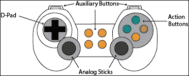
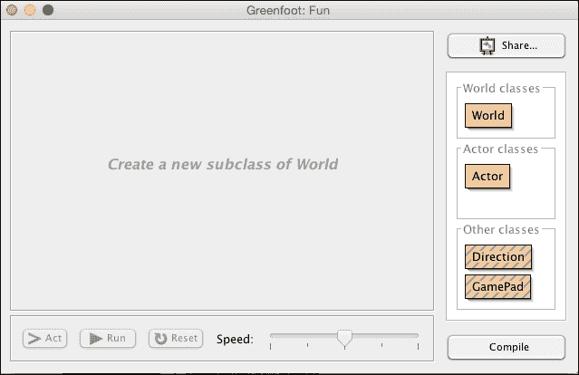

# 第九章。Greenfoot 中的游戏手柄

|   | *"只有你能掌控你的未来。" |   |
| --- | --- | --- |
|   | --*苏斯博士* |

在本章中，我们将介绍如何在 Greenfoot 场景中连接和使用游戏手柄控制器。您提供给用户的控制方案对其体验有着真正的影响。想象一下，如果您必须按*U*向上移动，*D*向下移动，*L*向左移动，*R*向右移动，您将如何玩我们在这本书的前两章中创建的 Avoider 游戏版本。就像一个糟糕的布局会令用户沮丧一样，一个好的布局会感觉非常自然。

游戏手柄旨在提升游戏体验。它们为玩家提供了一种自然且便捷的方式，来表达他们的决策给游戏，而不会影响游戏本身。在游戏历史的早期，游戏手柄以简单的摇杆形式出现，只有一个按钮用于射击。如今，典型的控制器拥有超过 10 个按钮、模拟摇杆、模拟扳机和数字 D-pad。许多控制器还允许用户构建自定义宏。

在本章中，您将学习如何：

+   将游戏手柄连接到您的 Greenfoot 场景

+   使用 Greenfoot GamePad API 监听和响应各种游戏手柄事件

+   使用控制器映射软件将不兼容的游戏手柄连接到 OS X

将游戏手柄支持添加到您的场景中是增加您创建的游戏可玩性的好方法。它还为您的工作增添了一种专业性。在了解如何连接游戏手柄之后，我们将增强我们在第一章，“让我们直接进入…”，和第二章，“动画”中创建的 Avoider 游戏，使用户能够在使用鼠标或游戏手柄控制游戏之间进行选择。

# 游戏手柄概述

目前市场上针对 PC 和 Mac 都有许多种类的游戏手柄。有些类似于为流行的游戏机系统（如 Xbox、PlayStation 和 Nintendo）制作的控制器，而有些则拥有自己独特的设计和能力。*图 1* 展示了一个典型的游戏手柄。这些游戏手柄的设计是为了将许多控制选项置于触手可及之处。

*图 1* 识别了游戏手柄控制器的几个常见分组。D-pad 是一种常用于允许玩家指示方向的控件（因此，名字中的 **D**）。它相当平坦，专为拇指使用设计。模拟摇杆作为控制器上的小型摇杆，允许快速和精确的位置控制。例如，一些游戏可能使用它们允许玩家在 3D 世界中环顾四周或瞄准武器。在为 Xbox（以及其他流行游戏机）设计的控制器中，模拟摇杆也可以按下，提供两个额外的动作按钮。动作按钮为用户提供了一种在游戏中指定动作的方法（见 *图 1*）。这些按钮通常控制跳跃、射击、蹲下和阻挡等动作。最后，我们有辅助按钮，可能用于启动游戏、暂停游戏、重置游戏或简单地提供更多动作按钮。



图 1：这是游戏手柄控制器的典型布局

对于许多游戏来说，游戏手柄将为玩家提供最佳的用户界面（和用户体验）。在本章中，我们将讨论如何将如图 1 所示的控制器连接到您的 Greenfoot 场景。您将能够将 D-Pad、模拟摇杆和动作按钮分配给您选择的用户允许的能力。

# Windows 设置

您可以选择数百种游戏手柄，用于购买您的 PC 或 Mac。在本节中，我们将介绍如何设置 Windows 的 *Xbox 360 控制器*。如果您购买了不同的控制器，请确保根据游戏手柄提供的说明安装相应的驱动程序。如果您有 Mac 并且拥有官方支持 OS X 的游戏手柄，那么这里的说明也应该适用于您。在本章末尾，我们将探讨您如何在 Mac 上使用支持不佳的游戏手柄。

## 连接您的控制器

在开始 Greenfoot 之前，将您的 Windows Xbox 360 控制器连接到您的 PC，并允许微软更新搜索、下载和安装游戏手柄所需的驱动程序。这需要 5-15 分钟，具体取决于您的网络连接速度。如果您有任何问题，请尝试遵循 [`support.xbox.com/en-US/xbox-on-other-devices/windows/xbox-controller-for-windows-setup`](http://support.xbox.com/en-US/xbox-on-other-devices/windows/xbox-controller-for-windows-setup) 提供的说明。

## Greenfoot 游戏手柄软件

从 Greenfoot 网站上，您可以下载一个模板来构建带有游戏手柄支持的 Greenfoot 场景。这个模板基本上是一个空白 Greenfoot 场景，其中包含了您可以用来访问和控制游戏手柄的附加库。您可以在 [`www.greenfoot.org/doc/gamepad`](http://www.greenfoot.org/doc/gamepad) 下载游戏手柄项目模板。

当您希望创建一个带有游戏手柄支持的场景时，您需要执行以下步骤：

1.  将从上一个 URL 下载的`GamePadTemplate.zip`文件移动到您选择的目录。

1.  解压`GamePadTemplate.zip`。

1.  将之前步骤中创建的`GamePadTemplate`文件夹重命名为您希望新场景拥有的名称。

1.  打开场景并添加您的更改。

*图 2*显示了完成前面的步骤后您的新 Greenfoot 场景将看起来是什么样子。正如您所看到的，您将像通常一样子类化`World`和`Actor`类以向场景添加内容。您还提供了两个额外的类，在**其他类**部分中可以看到，您将使用这些类来连接和管理游戏手柄。



图 2：这是一个由游戏手柄模板构建的新 Greenfoot 场景。图中所示的场景被重命名为"Fun"

我们将在下一节讨论`GamePad`和`Direction`类。

# Greenfoot 游戏手柄 API

Greenfoot 游戏手柄 API 支持*图 1*中显示的所有控制，除了顶部只有两个辅助按钮（橙色）。首先，我们将从概念层面讨论 API，然后查看实现 API 的具体类。

## 概述

理论上，从游戏手柄接收用户输入与从键盘接收输入非常相似。我们将轮询游戏手柄上的按钮和模拟摇杆，以查看它们是否当前被按下。模拟摇杆稍微复杂一些，因为它们的状态不仅限于被按下或未被按下。对于它们，你需要知道它们被推的方向和推力的大小。

由于可能有多个游戏手柄连接到您的计算机，因此 API 还提供了访问所有游戏手柄以及仅连接到您指定的游戏手柄的方法。

正如我们在游戏手柄模板场景中看到的，游戏手柄 API 在两个类中实现。第一个是`GamePad`类，第二个是`Direction`类。

### 注意

**静态关键字**

在 Java 中，你可以使用一个关键字来改变变量和方法如何被访问以及如何管理它们的内存。这个关键字被称为`static`。将此关键字添加到类变量或方法的声明中，确保无论创建了该类的多少个对象，该变量或方法都只存储一次。例如，如果你声明了一个名为`counter`的变量并将其初始值设置为`1`，那么类的所有对象都会看到该变量的值为`1`。如果一个对象增加了`counter`，那么所有创建的对象现在都会看到该变量的值为`2`。

当用于方法时，可以在不创建该类实例的情况下调用这些方法。例如，Greenfoot 类中包含的许多方法都是`static`的，例如`getRandomNumber()`和`setWorld()`。请注意，当我们调用这些方法时，我们并没有创建类的实例。我们只需添加以下代码：

```java
int randomNumber = Greenfoot.getRandomNumber(10);
```

## 游戏手柄和方向类

`GamePad` 类是一种称为 *单例* 的特殊类型的类。对于单例类，构造函数被声明为 `private`；因此，类外部的代码不能创建该类的新实例。所有其他尝试创建新对象的尝试都将失败，并显示一个错误信息，指出构造函数具有私有访问权限。这是一个单例类，因为你想要确保只有一个对象代表游戏手柄控制器。

你将从这个类中常用到的几个方法是 `getGamePad()`、`isDown()`、`getAxis()` 和 `runConfigurePad()`。要在你的场景中使用游戏手柄，你需要首先调用 `getGamePad()` 方法。此方法将返回一个 `GamePad` 对象，它代表连接到你的计算机的游戏手柄控制器。以下是其使用示例：

```java
GamePad pad = GamePad.getGamePad();
```

一旦你有了控制器的 `GamePad` 对象，你可以通过调用 `isDown()` 方法来检查用户是否按下了动作按钮（如图 *1* 所示）。`isDown()` 方法的使用方式与我们在检测键盘输入时使用的 `isKeyDown()` Greenfoot 方法完全相同。为了检测键盘输入，我们提供我们感兴趣的键的名称。对于游戏手柄，你使用 `GamePad.Button` 枚举来指定你感兴趣的按钮，该枚举提供了以下与游戏手柄按钮对应的标签：`ACTION_DOWN`、`ACTION_LEFT`、`ACTION_RIGHT`、`ACTION_UP`、`L1`、`L2`、`L3`、`R1`、`R2`、`R3`、`SELECT` 和 `START`。因此，为了确定用户是否按下了图 *1* 中显示的蓝色动作按钮，你会使用以下代码行：

```java
if( pad.isDown(GamePad.Button.ACTION_UP) ) {
  System.out.println("The ACTION_UP key is being pressed.");
}
```

从模拟摇杆获取用户输入是一个两步的过程。首先，你以以下方式从模拟摇杆获取方向信息：

```java
Direction direction = getGamePad().getAxis(GamePad.Axis.LEFT );
```

`Axis` 枚举提供了你可以用来指定方向键、左模拟摇杆或右模拟摇杆的标签。标签分别是 `DPAD`、`LEFT` 和 `RIGHT`。其次，一旦你有了 `Direction` 对象，你可以确定模拟摇杆被推的方向和推的程度。以下两行代码演示了如何提取这些信息：

```java
int angle = direction.getAngle();
float strength = direction.getStrength();
```

你将经常使用的最后一个方法是 `runConfigurePad()` 方法。此方法将提供一个用户界面，用户可以使用它来指定他们的游戏手柄上的控制如何映射到 `GamePad.Button` 枚举和 `GamePad.Axis` 枚举中提供的标签。这是必需的，因为并非所有游戏手柄都有相同的布局。

更多信息，请参阅此类的官方文档：[`www.greenfoot.org/files/gamepad/GamePad.html`](http://www.greenfoot.org/files/gamepad/GamePad.html)。

### 注意

**单例类**

设计模式是针对已知或常见问题的解决方案。它们提供了一个程序员可以轻松遵循的蓝图。Java 中最常用的设计模式之一是单例模式。当您想要确保一个类只有一个实例时，您会使用这个设计模式。这有什么用呢？好吧，想象一下，您想在应用程序中管理和共享资源，比如打印机或网络连接。只允许创建一个代表该单一资源的对象要简单得多，也高效得多。遵循单例设计模式的类强制执行此行为。

# 使用游戏手柄的避免者游戏

我们已经讲解了如何将游戏手柄连接到 Greenfoot 场景以及如何使用 Gamepad API。现在，是时候编写代码了。我们将为我们在第二章中创建的避免者游戏版本添加游戏手柄支持，该版本在*动画*中完成。您可以在[`www.packtpub.com/support`](http://www.packtpub.com/support)获取该场景的副本。

我们需要对避免者游戏进行两项主要更改。首先，我们需要添加一个与我们的控制器关联的`GamePad`对象的引用，并在该场景中的三个世界之间传递该引用：`AvoiderGameIntroScreen`、`AvoiderWorld`和`AvoiderGameOverWorld`。其次，如果存在，我们需要将`Avatar`类更改为由游戏手柄控制；否则，我们默认使用鼠标控制。

以下代码中没有显示整个`AvoiderWorld`类；只显示了需要更改的方法。以下是`AvoiderWorld`的更改：

```java
private GamePad pad;

public AvoiderWorld(GamePad p) {
  super(600, 400, 1, false);

  bkgMusic = new GreenfootSound("sounds/UFO_T-Balt.mp3");
  // Music Credit: T-Balt at
  // http://www.newgrounds.com/audio/listen/504436
  bkgMusic.playLoop();

  // set gamepad
 pad = p;

  setPaintOrder(Eye.class, Avatar.class,
  Enemy.class, PowerItems.class,
  Counter.class);
  prepare();
  generateInitialStarField();
}
```

首先，我们需要一个名为`pad`的实例变量来保存对游戏手柄的引用。将构造函数更改为接受一个`GamePad`对象的引用，然后使用该值初始化我们的`pad`变量。此值将从`AvoiderGameIntroScreen`传递给我们。我们还需要将`pad`的值传递给`AvoiderGameOverWorld`，因此我们需要修改以下代码中的`endgame()`方法：

```java
public void endGame() {
  bkgMusic.stop();
 AvoiderGameOverWorld go = new AvoiderGameOverWorld(pad);
  Greenfoot.setWorld(go);
}
```

我们在`AvoiderWorld`中需要更改的最后一件事是将`pad`实例变量传递到我们在游戏中创建的单个`Avatar`对象。因此，我们需要在`prepare()`方法中更改一行代码，如下所示：

```java
private void prepare()
{
 Avatar avatar = new Avatar(pad);
  addObject(avatar, 287, 232);
  scoreBoard = new Counter("Score: ");
  addObject(scoreBoard, 70, 20);
}
```

`AvoiderGameIntroScreen`负责检测和配置游戏手柄。以下是实现此功能的更改：

```java
import greenfoot.*; 
import java.lang.IllegalArgumentException;

public class AvoiderGameIntroScreen extends World
{
 private GamePad pad;

  public AvoiderGameIntroScreen() {
    super(600, 400, 1); 

 try {
 pad = GamePad.getGamePad();
 pad.runConfigurePad();
 } catch(IllegalArgumentException e) {
 System.out.println( "Exception caught: " + e.getMessage() );
 pad = null;
 }
  }

  public void act() {
    if( Greenfoot.mouseClicked(this) ) {
 AvoiderWorld world = new AvoiderWorld(pad);
      Greenfoot.setWorld(world);
    }
  }
}
```

首先，我们在类中添加一个实例变量`pad`，然后使用游戏手柄 API 的`GamePad.getGamePad()`方法初始化该变量。我们必须在`GamePad.getGamePad()`调用周围使用 try-catch 块，因为如果没有将游戏手柄插入到计算机中，`getGamePad()`方法将抛出异常。抛出的异常类型是`IllegalArgumentException`，因此我们必须捕获它。您会注意到我们在顶部添加了另一个导入语句来定义`IllegalArgumentException`类。如果没有游戏手柄，我们将`pad`设置为`null`。我们还在 try 块中调用了`runConfigurePad()`方法。这将弹出一个对话框，提示用户是否想要重新定义控制器的按钮。最后，我们在`act()`方法中将`pad`传递给`AvoiderWorld`。

### 注意

**异常**

Java 异常提供了一种有组织和灵活的方式来处理运行时错误。它们允许您将代码从错误检测代码中解耦，使代码更易于阅读和维护。与 Java 中的异常处理相关的主要关键字是`throw`、`try`和`catch`。要了解更多关于 Java 异常的信息，请参阅[`docs.oracle.com/javase/tutorial/essential/exceptions/`](http://docs.oracle.com/javase/tutorial/essential/exceptions/).

对`AvoiderGameOverScreen`类所需的更改很简单。它只需要传递从先前的`AvoiderWorld`实例获得的游戏手柄引用，并在玩家点击屏幕再次玩游戏时将其传递给新的`AvoiderWorld`实例。以下是更改内容：

```java
import greenfoot.*; 

public class AvoiderGameOverWorld extends World
{
  private GamePad pad;

  public AvoiderGameOverWorld(GamePad p) {  
    super(600, 400, 1); 
    pad = p;
  }

  public void act() {
    if( Greenfoot.mouseClicked(this) ) {
      AvoiderWorld world = new AvoiderWorld(pad);
      Greenfoot.setWorld(world);
    }
  }
}
```

直接处理从游戏手柄接收事件的类是`Avatar`类。我们需要修改这个类，以便使用游戏手柄来接受用户输入，如果没有游戏手柄，则默认使用鼠标。

这里是`Avatar`类的更改：

```java
import greenfoot.*;

public class Avatar extends Actor {
  private static final float MIN_STRENGTH = 0.5F;
  private int health = 3;
  private int hitDelay = 0;
  private int stunDelay = -1;
  private int lagDelay = -1;
  private int nextImage = 0;
  private Eye leftEye;
  private Eye rightEye;
 private GamePad pad;
 private boolean useGamepad = true;
 private int gpStepX = 3;
 private int gpStepY = 3;
 private int gpLagStepX = 1;
 private int gpLagStepY = 1;

 public Avatar( GamePad p ) {
 pad = p;
 if( pad == null ) {
 useGamepad = false;
 }
 }
  protected void addedToWorld(World w) {
    leftEye = new Eye();
    rightEye = new Eye();
    w.addObject(leftEye, getX()-10, getY()-8);
    w.addObject(rightEye, getX()+10, getY()-8);
  }

  public void act() {
    userControls();
    checkForCollisions();
  }

  public void addHealth() {
    if( health < 3 ) {
      health++;
      if( --nextImage == 0 ) {
        setImage("skull.png");
      } else {
        setImage("skull" + nextImage + ".png");
      }
    }
  }

  public void lagControls() {
    lagDelay = 150;
  }

  public void stun() {
    stunDelay = 50;
  }

  private void checkForCollisions() {
    Actor enemy = getOneIntersectingObject(Enemy.class);
    if( hitDelay == 0 && enemy != null ) {
      if( health == 0 ) {
        AvoiderWorld world = (AvoiderWorld) getWorld();
        world.endGame();
      }
      else {
        health--;
        setImage("skull" + ++nextImage + ".png");
        hitDelay = 50;
      }
    }
    if( hitDelay > 0 ) hitDelay--;
  }

  private void userControls() {
    if( stunDelay < 0 ) {
      if( lagDelay > 0 ) {
        if( useGamepad ) {
          moveViaGamepad(true);
        } else {
          moveViaMouse(true);
        }
        --lagDelay;
      } else {
        if( useGamepad ) {
          moveViaGamepad(false);
        } else {
          moveViaMouse(false);
        }
      }

      leftEye.setLocation(getX()-10, getY()-8);
      rightEye.setLocation(getX()+10, getY()-8);
    } else {
      stunDelay--;
    }
  }

  private void moveViaGamepad(boolean lag) {
    int stepX = lag ? gpLagStepX : gpStepX;
    int stepY = lag ? gpLagStepY : gpStepY;

    Direction dir = pad.getAxis( GamePad.Axis.DPAD );
    if ( dir.getStrength() == 0 ) {
      dir = pad.getAxis( GamePad.Axis.LEFT );
    }

    if ( dir.getStrength() > MIN_STRENGTH ) {
      final int angle = dir.getAngle();

      if ( angle > 315 || angle <= 45 ) {
        setLocation(getX()+stepX, getY());
      } else if ( angle > 45 && angle <= 135 ) {
        setLocation(getX(), getY()+stepY);
      } else if ( angle > 135 && angle <= 225 ) {
        setLocation(getX()-stepX, getY());
      } else {
        setLocation(getX(), getY()-stepY);
      }
    }
  }

  private void moveViaMouse(boolean lag) {
    MouseInfo mi = Greenfoot.getMouseInfo();

    if( mi != null ) {
      if( lag ) {
        int stepX = (mi.getX() - getX())/40;
        int stepY = (mi.getY() - getY())/40;
        setLocation(stepX + getX(), stepY + getY());
      } else {
        setLocation(mi.getX(), mi.getY());
      }
    }
  }
}
```

在`Avatar`类的开头，我们定义了一些额外的变量，这些变量将允许类的实例通过游戏手柄进行控制。我们声明`pad`来保存游戏手柄的引用和一些整数来指定如何快速移动`Avatar`对象。我们还声明了将在类方法中稍后检查的布尔变量`useGamePad`。

在构造函数中，我们初始化`pad`并设置`useGamePad`。您会记得，如果没有检测到游戏手柄，我们在`AvoiderGameIntroScreen`中将`pad`设置为`null`。

我们重构了`userControls()`方法。延迟和眩晕延迟的工作方式相同，但现在我们调用一个方法来实际移动对象。如果`useGamePad`为`true`，则调用`moveViaGamepad()`；否则，调用`moveViaMouse()`。`moveViaMouse()`方法包含我们之前用来移动对象的相同逻辑。`moveViaGamepad()`方法完全是新的，并包含通过检测用户游戏手柄的输入来移动`Avatar`对象的逻辑。

在`moveViaGamepad()`函数中，我们首先设置移动速度。如果我们有延迟，我们会走得更慢。游戏手柄的延迟实现与使用鼠标的延迟实现略有不同。然而，在两种情况下，效果都是减缓用户移动。接下来，我们检查用户是否正在按下 D-pad，通过检查推力的强度。如果等于 0，那么我们假设用户正在使用左侧模拟摇杆。然后我们检测用户推 D-pad（或模拟摇杆）的角度，并将该角度转换为方向——上、下、左或右。

## 尝试一下

我们已经添加了所有必要的代码，以便使用我们的 Avoider Game 版本与游戏手柄控制器。编译你之前输入的所有更改，修复任何错误，然后玩游戏。我真的觉得用游戏手柄玩游戏更自然、更令人满意。

你会注意到游戏手柄上还有很多未使用的按钮。你能为游戏添加什么功能来利用这些按钮呢？

# OS X 设置/解决方案

OS X 不直接支持许多游戏手柄。如果你的游戏手柄不支持，你仍然可以使用该游戏手柄来控制你的 Greenfoot 游戏。

## 游戏手柄映射软件

有几个 OS X 应用程序可以将游戏手柄控制器映射到键盘键和鼠标动作。例如，你可以将 D-pad 的上、下、左、右动作映射到*W*、*S*、*A*和*D*键。通常，这些应用程序比 Greenfoot 游戏手柄支持核心的`JInput`有更好的游戏手柄支持。因此，它将允许更广泛的控制器连接到你的游戏。另一个优点是，你可以无需考虑游戏手柄支持来编程你的场景。你假设标准键盘和鼠标控制，游戏手柄映射软件处理其余部分。以下是一些执行此映射的流行程序：

+   Joystick Mapper: [`joystickmapper.com`](http://joystickmapper.com)

+   Enjoy: [`yukkurigames.com/enjoyable/`](https://yukkurigames.com/enjoyable/)

+   ControllerMate for Mac: [`www.macupdate.com/app/mac/17779/controllermate`](http://www.macupdate.com/app/mac/17779/controllermate)

# 使用游戏手柄导出游戏

当你将游戏手柄支持添加到你的 Greenfoot 场景时，你需要记住一件事。如果你有它，那么你的游戏将无法在 Greenfoot 网站上玩。这是因为没有 Java 支持通过 Web 应用程序连接到游戏手柄。然而，如果你遵循[`www.greenfoot.org/doc/gamepad_export`](http://www.greenfoot.org/doc/gamepad_export)中的简单步骤，你仍然可以将你的场景导出为桌面应用程序。

# 摘要

Greenfoot 游戏手柄 API 设置和使用简单，并允许您为用户提供一个精心设计的控制界面。通过为用户提供使用鼠标、键盘或游戏手柄控制的选择，您让他们能够以对他们来说自然和舒适的方式与您的 Greenfoot 创作互动。在前几章中，您学习了如何使用键盘和鼠标，而在本章中，您学习了如何使用游戏手柄。
