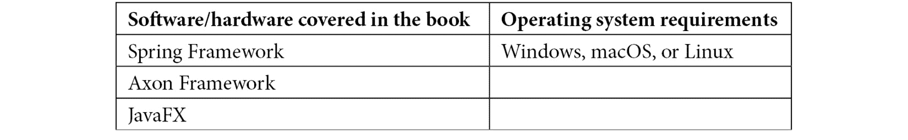
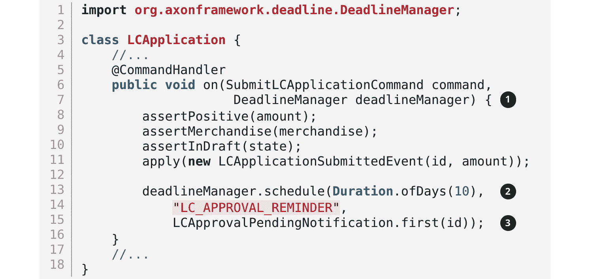

# 前言

**领域驱动设计**（DDD）提供了一套原则、模式和技巧，让领域专家、架构师、开发人员和其他团队成员可以采用这些原则共同工作，并将复杂系统分解成结构良好、协作和松散耦合的子系统。当埃里克·埃文斯在 21 世纪初引入这些概念时，从很多方面来看，这些原则远远超出了它们的时代。我们正处于单体架构的时代，**面向服务的架构**（SOA）作为一个概念刚开始生根发芽，而云、微服务、持续交付等甚至还未出现！虽然采用其战术方面相对容易，但 DDD 的战略方面在很大程度上仍被视为不必要的额外开销。

快进到今天，我们正在构建我们迄今为止最复杂的软件解决方案，同时需要应对更加复杂的组织和团队结构。此外，公共云的使用几乎成为必然。这导致了一种情况，即分布式团队和应用程序几乎成为常态。同时，我们也处于一个需要将上一代应用程序现代化的时代。所有这些都使得领域驱动设计（DDD）的原则，特别是战略元素，获得了很高的关注度。

我们一直是这些概念的实践者，并从我们的经验中获得了宝贵的见解。多年来，我们看到了许多进步，使得在更大范围内采用 DDD 成为可行的选择。本书是我们所有集体经验的结晶。虽然我们从该主题的早期作品中汲取了许多灵感，但我们非常注重以实践者的心态来应用这些概念，以便降低那些希望在其构建复杂、分布式软件的旅程中持续发展和繁荣的团队所面临的门槛。

# 本书面向的对象

本书是为具有多种角色和技能的读者群体所撰写的。虽然 DDD 的概念已经存在很长时间，但实际应用和扩展一直是一个挑战，这在很大程度上是由于缺乏将所有这些概念作为一个整体结合起来的实用技术、工具和真实世界案例。成功应用这些原则需要组织内部不同角色和学科之间的紧密合作，包括高管、业务专家、产品负责人、业务分析师、架构师、开发人员、测试人员和运维人员。

这里是对读者角色和他们在阅读本书中将获得的内容的简要总结：

**高管和业务专家**应该阅读本书，以便他们能够清晰地表达自己的愿景和证明解决方案必要性的核心概念。技术将使他们能够迅速地做到这一点，并增进对快速可靠地实施变革所需付出的努力的同情。

**产品负责人**应该阅读这本书，以便在沟通业务和技术团队成员时能够作为有效的促进者，确保没有翻译上的损失。

**架构师**应该阅读这本书，以便他们能够理解在思考解决方案之前理解问题的重要性。他们还将欣赏到各种架构模式以及它们如何与 DDD 原则协同作用。 

**开发人员和测试人员**将能够利用这本实用指南将他们的知识付诸实践，创建出既易于使用又令人愉悦的优雅软件设计，并便于推理。

本书提供了一种动手方法来有效地收集需求，促进团队成员之间的共同理解，以便实施能够经受动态演变商业生态系统考验的解决方案。

# 本书涵盖的内容

*第一章*，*领域驱动设计（DDD）的原理*，探讨了 DDD 实践提供了一套指南和技术，以提高我们成功的概率。我们将探讨埃里克·埃文斯（Eric Evans）在 2003 年出版的关于该主题的经典书籍至今仍极具相关性。我们还将介绍战略和战术 DDD 的要素。

*第二章*，*领域驱动设计（DDD）的适用位置和方式*，探讨了 DDD 与几种架构风格相比的情况，以及它在构建软件解决方案的整体方案中的适用位置和方式。

*第三章*，*理解领域*，在虚构的 KP 银行中介绍了示例领域（国际贸易）。我们还探讨了如何使用商业模式画布、影响图和沃德利图等技术开始战略设计。

*第四章*，*领域分析和建模*，继续使用领域叙事和事件风暴等技术对示例问题领域——信用证（LC）应用进行分析和建模，以达成对问题的共同理解，并激发想法以找到解决方案。

*第五章*，*实现领域逻辑*，实现了示例应用的命令端 API。我们将探讨如何采用事件驱动架构来构建松散耦合的组件。我们还将探讨如何通过对比状态存储和事件源聚合来实现结构和业务验证以及持久化选项。

*第六章*，*实现用户界面——基于任务的*，为示例应用设计了**用户界面**（**UI**）。我们还将向服务实现表达对 UI 的期望。

*第七章*，*实现查询*，深入探讨了如何通过监听领域事件来构建数据读取优化的表示。我们还将探讨这些读取模型的持久化选项。

*第八章*，*实现长时间运行的工作流程*，探讨了实现长时间运行的用户操作（叙事）和截止日期。我们还将探讨如何通过日志聚合和分布式跟踪来跟踪整体流程。最后，我们将讨论何时/是否选择显式编排组件或隐式编排。

*第九章*，*与外部系统集成*，探讨了与其他系统和边界上下文集成的各种风格及其选择每种风格的影响。

*第十章*，*开始分解之旅*，将示例边界上下文的命令和查询方面分解为不同的组件。我们将探讨在这些选择中涉及的权衡。

*第十一章*，*分解为更细粒度的组件*，探讨了细粒度分解及其涉及的技术影响之外的权衡。我们将把我们的应用程序分解为不同的功能，并讨论在哪里划线可能更合适。

*第十二章*，*超越功能需求*，探讨了在应用程序分解中起重要作用的业务需求之外的因素。具体来说，我们将研究在应用领域驱动设计（DDD）时，跨职能需求产生的影响。

# 为了充分利用本书

本书面向广泛的软件开发团队成员角色。假设读者有一定的软件开发解决方案构建经验。本书中的代码示例使用 Java 编程语言。熟悉面向对象和 Spring 等框架将非常有帮助。

**如果您正在使用本书的数字版，我们建议您亲自输入代码或从本书的 GitHub 仓库（下一节中提供链接）获取代码。这样做将帮助您避免与代码复制粘贴相关的任何潜在错误。**

# 下载示例代码文件

您可以从 GitHub 下载本书的示例代码文件：[`github.com/PacktPublishing/Domain-Driven-Design-with-Java-A-Practitioner-s-Guide`](https://github.com/PacktPublishing/Domain-Driven-Design-with-Java-A-Practitioner-s-Guide)。如果代码有更新，它将在 GitHub 仓库中更新。

我们还有其他来自我们丰富的书籍和视频目录的代码包，可在[`github.com/PacktPublishing/`](https://github.com/PacktPublishing/)找到。查看它们！

# 下载彩色图像

我们还提供了一份包含本书中使用的截图和图表彩色图像的 PDF 文件。你可以从这里下载：

[`packt.link/TwzEB`](https://packt.link/TwzEB)。

# 使用的约定

本书使用了多种文本约定。

`文本中的代码`：表示文本中的代码单词、数据库表名、文件夹名、文件名、文件扩展名、路径名、虚拟 URL、用户输入和 Twitter 昵称。以下是一个示例：“如图所示的事件风暴工件中，LC 应用程序聚合器能够处理 ApproveLCApplicationCommand，这导致 LCApplicationApprovedEvent。”

代码块设置如下：

小贴士或重要提示

看起来像这样。

# 联系我们

我们始终欢迎读者的反馈。

**一般反馈**: 如果你对此书的任何方面有疑问，请通过 customercare@packtpub.com 给我们发邮件，并在邮件主题中提及书名。

**勘误**: 尽管我们已经尽最大努力确保内容的准确性，但错误仍然可能发生。如果你在这本书中发现了错误，我们将不胜感激，如果你能向我们报告这一点。请访问[www.packtpub.com/support/errata](http://www.packtpub.com/support/errata)并填写表格。

**盗版**: 如果你在互联网上以任何形式遇到我们作品的非法副本，如果你能提供位置地址或网站名称，我们将不胜感激。请通过版权@packt.com 与我们联系，并提供材料的链接。

**如果你有兴趣成为作者**：如果你在某个领域有专业知识，并且你感兴趣的是撰写或为书籍做出贡献，请访问[authors.packtpub.com](http://authors.packtpub.com)。

# 分享你的想法

一旦你阅读了《使用 Java 的领域驱动设计 - 实践者指南》，我们很乐意听听你的想法！请[点击此处直接进入此书的亚马逊评论页面](https://packt.link/r/1800560737)并分享你的反馈。

你的评论对我们和科技社区都很重要，并将帮助我们确保我们提供高质量的内容。
