# 第五章：实现领域逻辑

为了有效地沟通，代码必须基于编写需求所使用的相同语言——开发人员彼此之间以及与领域专家交流的语言。

– 埃里克·埃文斯

在本书的*命令查询责任分离（CQRS）*部分，我们描述了领域驱动设计（DDD）和 CQRS 如何相互补充，以及命令端（写请求）是业务逻辑的家园。在本章中，我们将使用 Spring Boot、Axon Framework、JSR-303 Bean 验证和持久化选项，通过对比状态存储和事件源聚合来实现**信用证**（**LC**）应用的命令端 API。以下是将要涵盖的主题列表：

+   识别聚合

+   处理命令和发布事件

+   测试驱动应用程序

+   持续聚合

+   执行验证

到本章结束时，您将学会如何以稳健、封装良好的方式实现系统的核心（领域逻辑）。您还将学会如何将领域模型从持久化关注点中解耦。最后，您将能够欣赏如何使用服务、存储库、聚合、实体和值对象执行 DDD 的战略设计。

# 技术要求

要跟随本章的示例，您需要访问以下内容：

+   JDK 1.8+（我们使用 Java 16 编译示例源代码）

+   Maven 3.x

+   Spring Boot 2.4.x

+   JUnit 5.7.x（包含在 Spring Boot 中）

+   Axon Framework 4.4.7（DDD 和 CQRS 框架）

+   Project Lombok（用于减少冗余）

+   Moneta 1.4.x（货币和货币参考实现——JSR 354）

# 继续我们的设计之旅

在上一章中，我们讨论了事件风暴作为一种轻量级的方法来阐明业务流程。作为提醒，这是我们的事件风暴会议产生的输出：

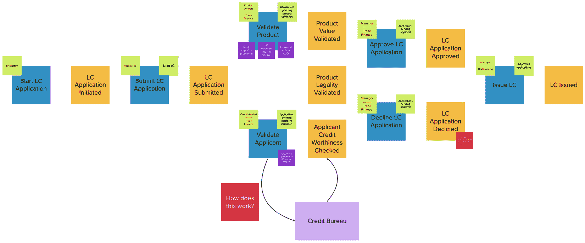

图 5.1 – 事件风暴会议回顾

如前所述，此图中的*蓝色*便签代表*命令*。我们将使用**命令查询责任分离**（**CQRS**）模式作为高级架构方法来实现我们的 LC 发行应用的领域逻辑。让我们来探讨使用 CQRS 的机制以及它如何导致优雅的解决方案。有关 CQRS 是什么以及何时适用此模式的概述，请参阅*第二章*中的*何时使用 CQRS*部分，“DDD 如何适应？*”。

重要提示

CQRS 绝对不是万能的银弹。尽管它足够通用，可以在各种场景中使用，但它对主流软件问题来说是一种范式转变。像任何其他架构决策一样，在决定采用 CQRS 时，您应该进行适当的尽职调查。

让我们通过使用 Spring 和 Axon 框架实现 LC 应用程序命令侧的一个代表性片段来实际看看它是如何工作的。

# 实现命令侧

在本节中，我们将专注于实现应用程序的命令侧。这是我们预期应用程序的所有业务逻辑都将得到实现的地方。从逻辑上看，它看起来像以下图示：

![图 5.2 – 传统与 CQRS 架构对比

![img/B16716_05_01.jpg]

图 5.2 – 传统与 CQRS 架构对比

命令侧的高级序列在此描述：

1.  接收到一个请求来修改状态（命令）。

1.  在事件源系统中，通过回放该实例已发生的事件来构建命令模型。在状态存储系统中，我们只需从持久化存储中读取状态来恢复状态。

1.  如果业务不变量（验证）得到满足，一个或多个领域事件将被准备好以供发布。

1.  在事件源系统中，领域事件在命令侧被持久化。在状态存储系统中，我们会在持久化存储中更新实例的状态。

1.  通过将这些领域事件发布到事件总线上来通知外部世界。事件总线是一个基础设施组件，事件被发布到该组件上。

让我们看看我们如何在 LC 发行应用程序的上下文中实现这一点。

重要提示

我们描绘了多个读取模型，因为根据需要支持的查询用例类型，可能（但不一定）需要创建多个读取模型。

为了使这个过程能够可预测地工作，读取模型（们）需要与写入模型保持同步（我们将在稍后详细探讨一些实现这一点的技术）。

## 工具选择

实现 CQRS 不需要使用任何框架。被认为是 CQRS 模式之父的 Greg Young 在[`ordina-jworks.github.io/domain-driven%20design/2016/02/02/A-Decade-Of-DDD-CQRS-And-Event-Sourcing.html`](https://ordina-jworks.github.io/domain-driven%20design/2016/02/02/A-Decade-Of-DDD-CQRS-And-Event-Sourcing.html)这篇论文中建议不要自己构建 CQRS 框架，这篇论文值得一读。使用一个好的框架可以帮助提高开发者的效率并加速业务功能的交付，同时抽象出底层管道和非功能性需求，而不限制灵活性。在本书中，我们将使用 Axon 框架([`axonframework.org/`](http://axonframework.org/))来实现应用程序功能，因为我们有在大型企业开发中使用它的实际经验。还有其他一些工作得相当好的框架，如 Lagom 框架([`www.lagomframework.com/`](https://www.lagomframework.com/))和 Eventuate([`eventuate.io/`](https://eventuate.io/))，也值得探索。

# 启动应用程序

要开始，让我们创建一个简单的 Spring Boot 应用程序。有几种方法可以做到这一点。您始终可以使用[`start.spring.io`](https://start.spring.io)上的 Spring 启动应用程序来创建此应用程序。在这里，我们将使用 Spring CLI 来启动应用程序。

重要提示

要为您的平台安装 Spring CLI，请参阅[`docs.spring.io/spring-boot/docs/current/reference/html/getting-started.html#getting-started.installing`](https://docs.spring.io/spring-boot/docs/current/reference/html/getting-started.html#getting-started.installing)中的详细说明。

要启动应用程序，请使用以下命令：

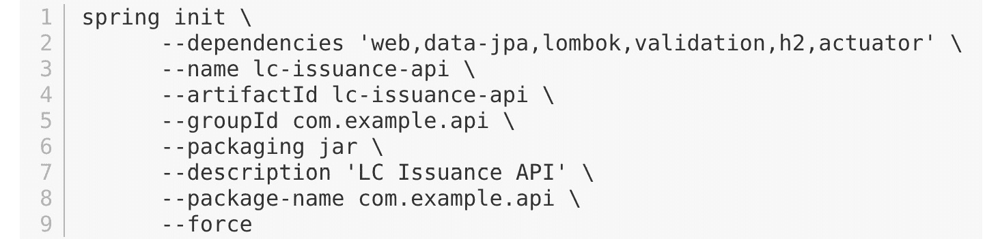

这应该在当前目录中创建一个名为`lc-issuance-api.zip`的文件。将此文件解压缩到您选择的位置，并在`pom.xml`文件的`dependencies`部分添加 Axon 框架的依赖项：

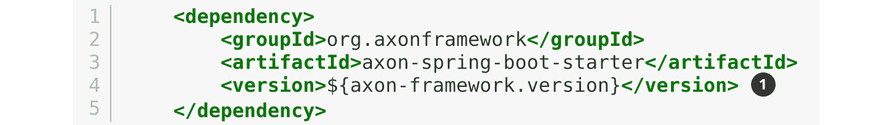

1.  您可能需要更改版本。本书编写时，我们处于 4.5.3 版本。

此外，添加以下对`axon-test`库的依赖项以启用聚合的单元测试：

使用前面的设置，您应该能够运行应用程序并开始实现 LC 发行功能。

让我们看看如何使用 Axon 框架实现这些命令。

## 识别命令

从上一章的事件风暴会话中，我们有以下命令作为起点：

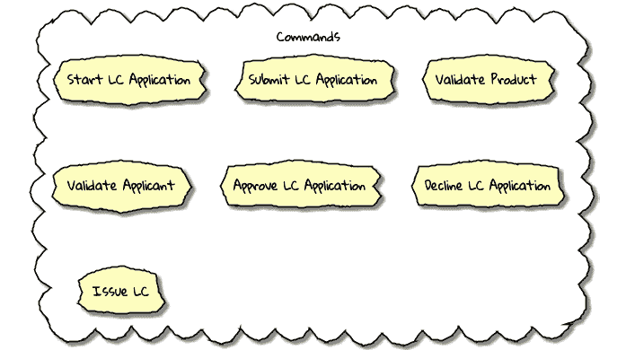

图 5.3 – 识别出的命令

命令总是针对聚合（根实体）进行处理（处理）。这意味着我们需要解决这些命令，以便由聚合处理。虽然命令的发送者不关心系统中的哪个组件处理它，但我们需要决定哪个聚合将处理每个命令。还应注意，任何给定的命令只能由系统中的单个聚合处理。让我们看看如何对这些命令进行分组并将它们分配给聚合。为了能够做到这一点，我们首先需要识别系统中的聚合。

## 识别聚合

查看我们 LC 应用的 eventstorming 会话的输出，一个潜在的分组可以如下所示：

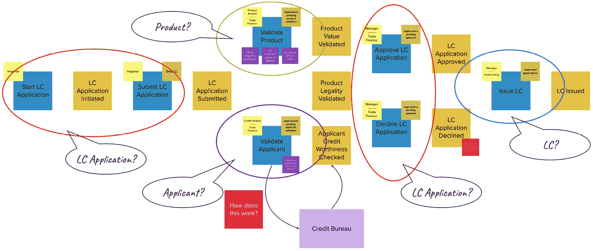

图 5.4 – 对聚合设计的第一次尝试

这些实体中的某些或所有可能是聚合（有关聚合和实体的区别的更详细解释，请参阅*第一章*，*领域驱动设计的原理*）。乍一看，我们似乎有四个潜在的实体来处理这些命令：

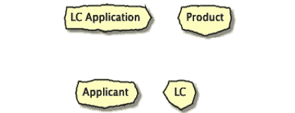

图 5.5 – 初次观察到的潜在聚合

初看起来，这些实体中的每一个都可能被分类为我们解决方案中的聚合。在这里，鉴于我们正在构建一个用于管理 LC 应用的解决方案，`LC 应用程序` 似乎是一个相当合适的聚合选择。然而，其他实体是否也适合被分类为聚合呢？`产品` 和 `申请人` 看起来像潜在的实体，但我们需要问自己是否需要在 `LC 应用程序` 的范围之外对这些实体进行操作。如果答案是 *是*，那么 `产品` 和 `申请人` *可能* 被分类为聚合。但 `产品` 和 `申请人` 似乎不需要在没有包含在边界上下文中的 `LC 应用程序` 聚合的情况下进行操作。感觉是这样，因为产品和申请人的详细信息都需要作为 LC 申请过程的一部分提供。至少从我们目前所了解的过程来看，这似乎是正确的。这意味着我们剩下两个潜在的聚合 – `LC` 和 `LC 应用程序`：

![图 5.6 – 边界上下文之间的关系]

![图片 B16716_05_06.jpg]

![图 5.6 – 边界上下文之间的关系]

当我们查看我们的事件风暴会议输出时，`LC 应用程序` 聚合在生命周期中较晚转变为 `LC` 聚合。现在让我们专注于 `LC 应用程序`，并将对 `LC` 聚合需求的进一步分析推迟到以后。

重要提示

通俗地说，术语聚合和聚合根有时可以互换使用，意思相同。聚合可以是分层的，并且聚合可以包含子聚合。虽然聚合和聚合根都处理命令，但在给定上下文中只能有一个聚合作为根，它封装了对其子聚合、实体和值对象的访问。

需要注意的是，实体可能需要在不同的边界上下文中被视为聚合，这种处理完全取决于上下文。

当我们查看我们的事件风暴会议输出时，LC 应用程序在发行上下文中在生命周期中较晚转变为 LC。我们现在的重点是优化和自动化整个发行流程的 LC 应用程序流程。既然我们已经决定与 LC 应用程序聚合（根）合作，让我们开始编写我们的第一个命令，看看它在代码中是如何体现的。

## 测试驱动系统

尽管我们对系统有一个相当好的概念性理解，但我们仍在不断细化这种理解。通过测试驱动系统，我们可以通过充当我们正在生产的解决方案的第一个客户来锻炼我们的理解。

重要提示

测试驱动系统的实践在畅销书《由测试引导的面向对象软件开发》中得到了很好的阐述，作者是 Nat Price 和 Steve Freeman。阅读这本书以深入了解这一实践是值得的。

因此，让我们从第一个测试开始。对于外部世界来说，一个事件驱动系统通常以以下图示的方式进行工作：

图 5.7 – 事件驱动系统

这个图示可以这样解释：

1.  可能已经发生了一组可选的领域事件。

1.  系统接收到一个命令（由用户手动发起或由系统的一部分自动发起），它充当刺激。

1.  命令由一个聚合体处理，然后继续验证接收到的命令以强制执行不变性（结构性和领域验证）。

1.  系统随后以两种方式之一做出反应：

    1.  发射一个或多个事件。

    1.  抛出异常。

重要提示

本章中展示的代码片段是为了突出显著的概念和技术。对于完整的示例，请参阅本章附带源代码（包含在 `ch05` 目录中）。

Axon 框架允许我们以下形式表达测试：

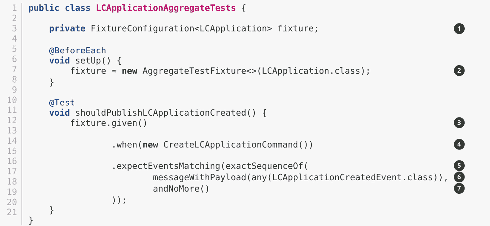

1.  `FixtureConfiguration` 是 Axon 框架的一个实用工具，用于帮助使用 BDD 风格的给定-当-然后语法测试聚合行为。

1.  `AggregateTestFixture` 是 `FixtureConfiguration` 的具体实现，其中您需要注册您的聚合类 – 在我们的情况下，`LCApplication` 是处理指向我们解决方案的命令的候选者。

1.  由于这是业务流程的开始，到目前为止还没有发生任何事件。这一点通过我们没有向给定方法传递任何参数来表示。在稍后讨论的示例中，可能会在接收到此命令之前已经发生了一些事件。

1.  这是我们实例化命令对象的新实例的地方。命令对象通常类似于数据传输对象，携带一组信息。这个命令将被路由到我们的聚合体进行处理。我们将在稍后详细查看这是如何工作的。

1.  在这里，我们声明我们期望匹配确切序列的事件。

1.  在这里，我们期望在成功处理命令后发射一个 `LCApplicationCreated` 类型的事件。

1.  我们最终表示我们不期望有更多的事件，这意味着我们期望恰好发射一个事件。

## 实现命令

在前面的简单示例中，`CreateLCApplicationCommand` 不携带任何状态。现实中，命令可能看起来像以下所示：

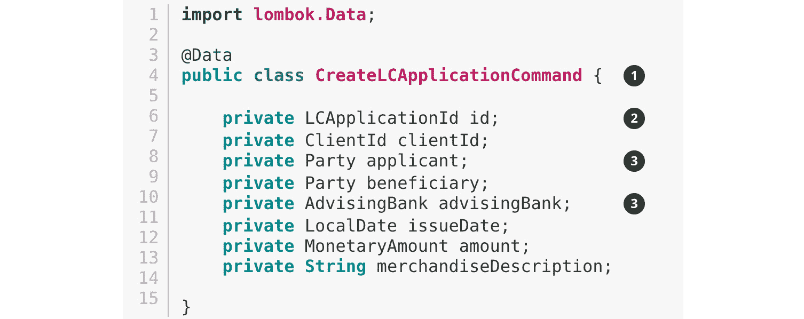

1.  这是命令类。在命名命令时，我们通常使用祈使句风格；也就是说，它们通常以一个表示所需动作的动词开头。请注意，这是一个数据传输对象。换句话说，它只是一个数据属性袋。同时请注意，它没有任何逻辑（至少目前是这样）。

1.  这是 LC 应用程序的标识符。在这种情况下，我们假设使用客户端生成的标识符。关于使用服务器生成标识符与客户端生成标识符的主题超出了本书的范围。你可以根据你的上下文优势选择使用其中之一。此外，请注意，我们使用强类型`LCApplicationId`标识符，而不是原始类型，如数值或字符串值。在某些情况下，使用 UUID 作为标识符也很常见。然而，我们更喜欢使用强类型来区分标识符类型。注意我们是如何使用`ClientId`类型来表示应用程序的创建者的。

1.  `Party`和`AdvisingBank`类型是我们解决方案中代表这些概念的复杂类型。应小心使用与问题（业务）领域相关的名称，而不是使用仅在解决方案（技术）领域有意义的名称。注意在两种情况下都尝试使用领域专家的通用语言。这是我们命名系统中的事物时应该始终意识到的实践。

值得注意的是，`merchandiseDescription`被保留为原始的`String`类型。这可能与之前我们提出的评论相矛盾。我们将在接下来的*结构验证*部分解决这个问题。

现在，让我们看看成功处理命令后我们将发出的事件将是什么样子。

## 实现事件

在事件驱动系统中，通过成功处理命令来改变系统状态通常会导致域事件被发出，以向系统的其余部分信号状态的变化。这里展示了现实世界中的`LCApplicationCreatedEvent`事件的简化表示：

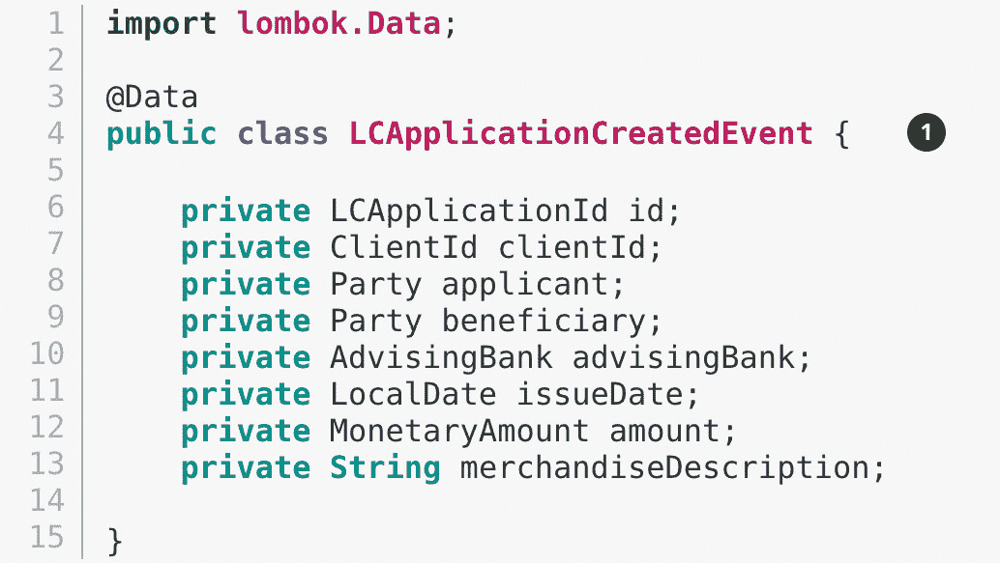

1.  当命名事件时，我们通常使用过去时态的名称来表示已经发生并且无条件接受为无法改变的经验事实。

你可能会注意到，事件的结构目前与命令的结构完全相同。虽然在这个案例中这是正确的，但并不总是这样。我们在事件中选择的披露信息量是上下文相关的。在将信息作为事件的一部分发布时，与领域专家进行咨询非常重要。你可能会选择在事件有效负载中保留某些信息。例如，考虑`ChangePasswordCommand`，它包含新更改的密码。可能明智的做法是不在结果`PasswordChangedEvent`中包含更改后的密码。

在之前的测试中，我们已经看到了命令和结果事件。让我们通过查看聚合实现来了解这是如何实现的。

## 设计聚合

聚合是处理命令和发出事件的场所。我们编写的测试的好处是它以一种隐藏实现细节的方式表达。但让我们看看实现，以便能够欣赏我们如何让测试通过并满足业务需求：

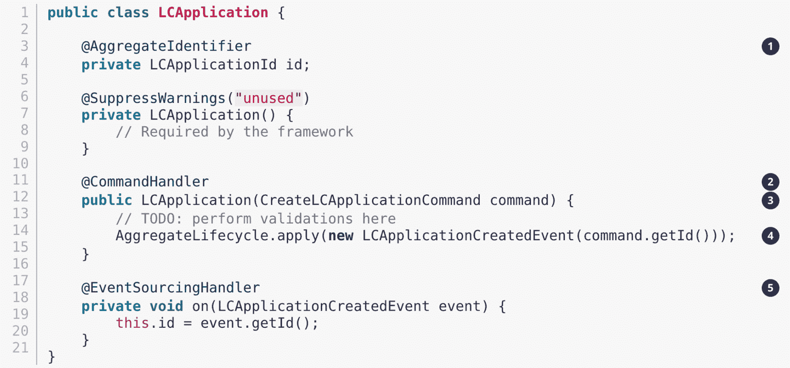

1.  这是`LCApplication`聚合体的聚合标识符。对于聚合体，标识符唯一地标识了一个实例与另一个实例的不同。因此，所有聚合体都需要声明一个标识符，并使用框架提供的`@AggregateIdentifier`注解将其标记为使用。

1.  处理命令的方法需要使用`@CommandHandler`注解进行标注。在这种情况下，命令处理器恰好是这个类的构造函数，因为这是这个聚合体可以接收的第一个命令。我们将在本章后面看到后续命令由其他方法处理的示例。

1.  `@CommandHandler`注解将一个方法标记为命令处理器。这个方法可以处理的确切命令需要作为参数传递给方法。请注意，对于任何给定的命令，整个系统中只能有一个命令处理器。

1.  在这里，我们使用框架提供的`AggregateLifecycle`实用工具发出`LCApplicationCreatedEvent`。在这个非常简单的例子中，我们在收到命令后无条件地发出一个事件。在现实世界的场景中，在决定发出一个或多个事件或用异常失败命令之前，可能需要执行一系列验证。我们将在本章后面查看更实际的示例。

1.  在这个阶段，`@EventSourcingHandler`的需求及其作用可能非常不清楚。我们将在本章的后续部分详细解释这一需求。

这是对一个简单事件驱动系统的快速介绍。我们仍然需要理解`@EventSourcingHandler`的作用。为了理解这一点，我们需要欣赏聚合持久化的工作方式及其对我们整体设计的影响。

# 聚合持久化

当与任何具有适度复杂性的系统一起工作时，我们需要确保交互持久化；也就是说，交互需要超越系统重启、崩溃等情况。因此，持久化的需求是既定的。虽然我们应该始终努力将持久化关注点从系统的其余部分抽象出来，但我们的持久化技术选择可能会对我们整体解决方案的架构产生重大影响。在如何选择持久化聚合状态方面，我们有几个选择值得提及：

+   状态存储

+   事件源

让我们在接下来的几节中更详细地检查这些技术。

## 状态存储聚合

保存实体的当前值到目前为止仍然是持久化状态的最流行方式——得益于关系数据库和 `LCApplication` 的巨大普及，我们可以设想使用一个结构类似于以下的关系数据库：

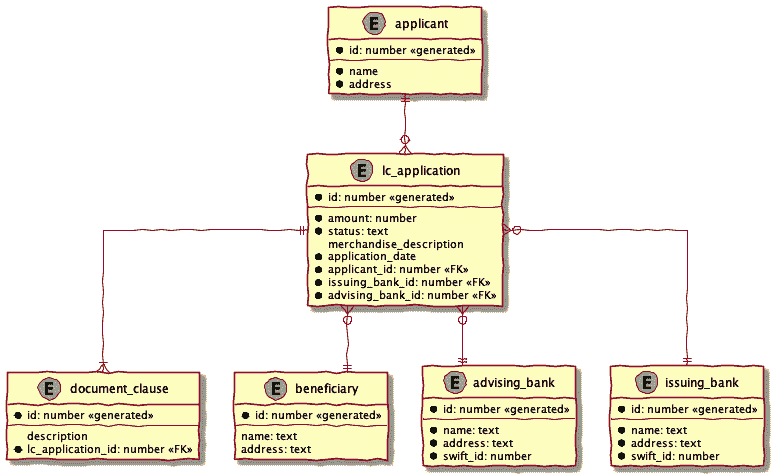

图 5.8 – 典型的实体关系模型

无论我们选择使用关系数据库还是更现代的 NoSQL 存储——例如，文档存储、键值存储、列族存储等等——我们用来持久化信息的风格基本上保持不变，即存储该聚合/实体的属性当前值。当属性值发生变化时，我们只需用新的值覆盖旧值；也就是说，我们存储聚合和实体的当前状态——因此得名 *状态存储*。这种技术在过去的几年里一直为我们服务得很好，但至少还有另一种机制我们可以用来持久化信息。我们将在下一节更详细地探讨这一点。

## 事件源聚合

开发者已经非常长时间以来一直在依赖日志来完成各种诊断目的。同样，关系数据库几乎从诞生之初就开始使用提交日志来持久化存储信息。然而，在主流系统中，开发者将日志作为结构化信息的首选持久化解决方案的使用仍然极为罕见。

日志是一个极其简单、只追加且不可变的按时间顺序排列的记录序列。这里的图展示了记录按顺序写入的日志结构。本质上，日志是一个只追加的数据结构，如图所示：

图 5.9 – 日志数据结构

与比表等更复杂的数据结构相比，写入日志是一个相对简单且快速的操作，并且可以处理极大量的数据，同时提供可预测的性能。确实，现代事件流平台如 Apache Kafka 就利用这种模式来扩展以支持极大量的数据。我们确实觉得这可以应用于在主流系统中处理命令时作为持久化存储，因为这具有超出之前列出的技术优势。考虑以下这里展示的在线订单流程示例：

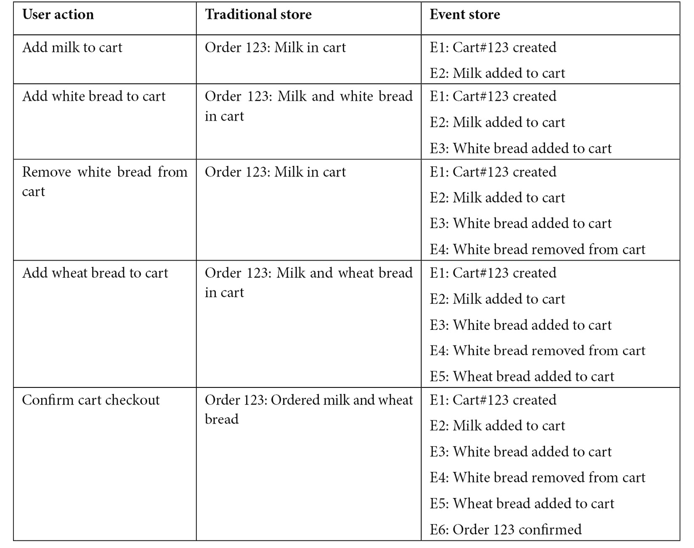

如您所见，在事件存储中，我们继续对所有用户执行的操作保持全面可见。这使我们能够更全面地推理这些行为。在传统存储中，我们失去了用户将白面包替换为小麦面包的信息。虽然这本身不影响订单，但我们失去了从这一用户行为中获取洞察的机会。我们认识到，这种信息可以通过其他方式使用专门的分析解决方案来捕获；然而，事件日志机制提供了一种无需额外努力的自然方式来完成这项工作。它还充当审计日志，提供迄今为止发生的所有事件的完整历史。这与领域驱动设计的本质非常吻合，我们不断探索减少复杂性的方法。

然而，以简单事件日志的形式持久化数据有一些影响。在处理任何命令之前，我们需要按照发生顺序恢复过去的事件，并重建聚合状态，以便我们能够执行验证。例如，在确认结账时，仅仅有已过期的事件集合是不够的。我们仍然需要在允许下单之前计算出购物车中确切的商品。在处理该命令之前，这种*事件回放*以恢复聚合状态（至少是那些需要验证该命令的属性）是必要的。例如，在处理`RemoveItemFromCartCommand`之前，我们需要知道当前购物车中包含哪些商品。这在下表中得到了说明：

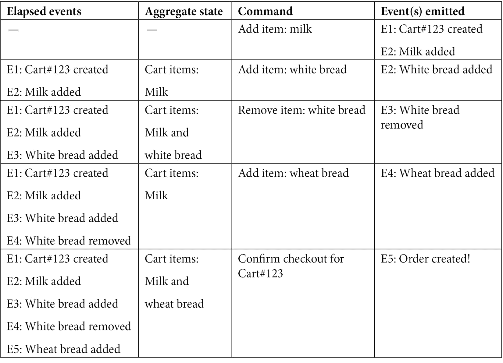

整个场景的对应源代码在以下代码片段中展示：

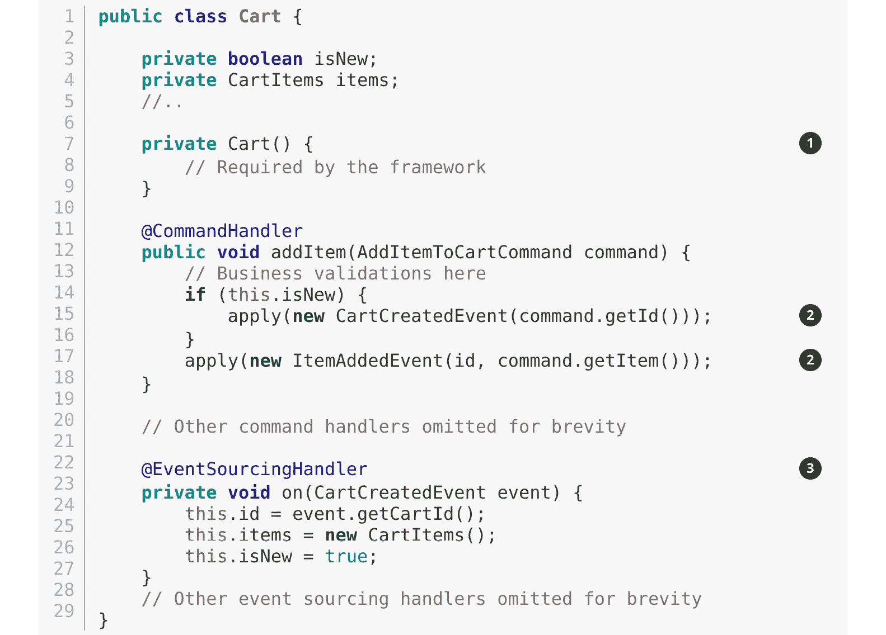

1.  在处理任何命令之前，聚合加载过程首先通过调用无参构造函数开始。因此，我们需要无参构造函数是`状态`。`状态`的恢复*必须*只发生在触发事件回放的那些方法中。在 Axon 框架的情况下，这相当于带有`@EventSourcingHandler`注解的方法。

1.  重要的是要注意，在之前的代码中，在发出`CartCreatedEvent`和`ItemAddedEvent`的地方发出`AddItemCommand`是可能的（但不是必需的）。命令处理器不会改变聚合的状态。它们只利用现有的聚合状态来强制执行不变性（验证）并在这些不变性为`true`时发出事件。

1.  加载过程通过调用事件源处理器方法按发生顺序继续进行，这些方法针对该聚合实例。事件源处理器仅需要根据过去的事件来恢复聚合状态。这意味着它们通常不包含任何业务（条件）逻辑。不言而喻，这些方法不会发出任何事件。事件发射仅限于在强制执行不变性成功时在命令处理器中发生。

当与事件源聚合一起工作时，非常重要的一点是要对可以编写的代码类型保持纪律性：

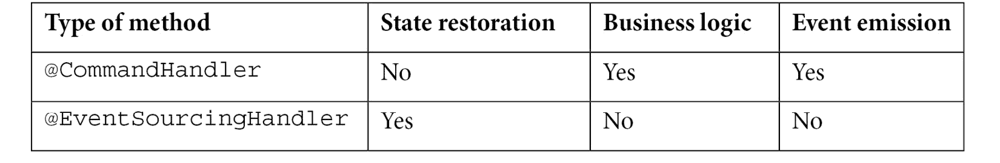

如果有大量历史事件需要恢复状态，聚合加载过程可能会变得耗时——直接与该聚合已过事件的数量成正比。我们可以采用一些技术（如事件快照）来克服这一点。

# 持久化技术选择

如果你使用状态存储来持久化你的聚合，使用你通常的评估过程来选择你的持久化技术应该足够。然而，如果你正在查看事件源聚合，决策可能会更加微妙。根据我们的经验，即使是简单的关系型数据库也能做到这一点。事实上，我们曾经使用关系型数据库作为具有数十亿事件的超大规模事务性应用的事件存储。这种设置对我们来说效果很好。值得注意的是，我们只使用了事件存储来插入新事件和按顺序加载给定聚合的事件。然而，有许多专门构建来作为事件存储的技术，它们支持其他增值功能，如时间旅行、完整事件回放、事件负载内省等。如果你有这样的需求，考虑其他选项可能值得，例如 NoSQL 数据库（如 MongoDB 这样的文档存储或如 Cassandra 这样的列族存储）或专门构建的商业产品，如 EventStoreDB 和 Axon Server，以评估在你的环境中是否可行。

## 我们应该选择哪种持久化机制？

现在我们对两种聚合持久化机制（状态存储和事件源）有了相当好的理解，这就引出了我们应该选择哪一种的问题。我们在此列出使用事件源的一些好处：

+   我们可以在高合规性场景中将事件用作**自然审计日志**。

+   它提供了在细粒度事件数据的基础上执行**更深入的分析**的能力。

+   当我们与基于**不可变事件**的系统一起工作时，这可能会产生更灵活的设计，因为持久化模型的复杂性受到限制。此外，我们无需处理复杂的 ORM 阻抗不匹配问题。

+   领域模型与持久化模型之间的耦合更加**松散**，使其能够主要独立于持久化模型而演进。

+   它使得能够回到过去，以便能够创建**临时视图和报告**，而无需处理前置复杂性。

反过来，在实施基于事件源解决方案时，你可能需要考虑以下一些挑战：

+   事件源需要**范式转变**，这意味着开发和业务团队将不得不花费时间和精力去理解它是如何工作的。

+   持久化模型不直接存储状态。这意味着在持久化模型上直接进行**临时查询**可能会更加**具有挑战性**。这可以通过实现新的视图来缓解；然而，这样做会增加复杂性。

+   事件源通常在结合 CQRS 实现时工作得非常好，这可能会给应用程序增加更多的复杂性。它还要求应用程序更加关注**强一致性 versus 最终一致性**的问题。

我们的经验表明，事件源系统在现代事件驱动系统中带来了许多好处。然而，在做出持久化选择时，你需要意识到在你自己的生态系统中所提出的先前考虑。

## 强制执行策略

在处理命令时，我们需要强制执行策略或规则。策略分为两大类：

+   结构性规则 – 那些强制执行已发送命令的语法有效性的规则

+   领域规则 – 那些强制执行业务规则得到遵守的规则

在系统的不同层执行这些验证也可能是明智的。而且，在系统的多个层中重复执行这些策略强制也是常见的。然而，重要的是要注意，在命令成功处理之前，所有这些策略强制都是统一应用的。让我们在接下来的部分中看看这些示例。

### 结构性验证

目前，要创建 LC 应用程序，你需要发送`CreateLCApplicationCommand`。虽然命令规定了结构，但目前没有任何强制执行。让我们纠正这一点。

为了能够声明式地启用验证，我们将使用 JSR-303 Bean 验证库。我们可以通过在`pom.xml`文件中使用`spring-boot-starter-validation`依赖轻松地添加它，如图所示：

现在，我们可以使用 JSR-303 注解向命令对象添加验证，如图所示：

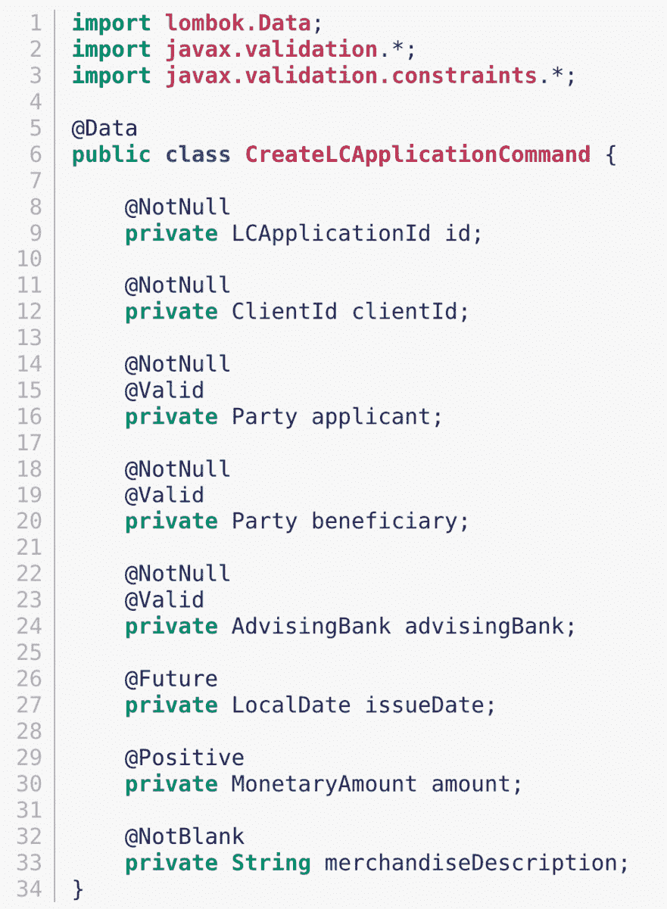

大多数结构性验证可以使用内置的验证注解来完成。也有可能为单个字段创建自定义验证器，或者验证整个对象（例如，验证相互依赖的属性）。有关如何操作的更多详细信息，请参阅[`beanvalidation.org/2.0/`](https://beanvalidation.org/2.0/)的 Bean 验证规范和[`hibernate.org/validator/`](http://hibernate.org/validator/)的参考实现。

### 业务规则强制

结构性验证可以使用命令中已经存在的信息来完成。然而，还有另一类验证需要的信息并不在传入的命令本身中。这类信息可能存在于两个地方之一 – 在我们正在操作的聚合内，或者不在聚合本身内，但可以在有限范围内提供。

让我们看看一个需要聚合内存在状态验证的验证示例。考虑提交 LC 的例子。当 LC 处于草稿状态时，我们可以对其进行多次编辑，但在提交后就不能再进行任何更改。这意味着我们只能提交一次 LC。通过发出`SubmitLCApplicationCommand`来实现提交 LC 的行为，如事件风暴会议中的工件所示：

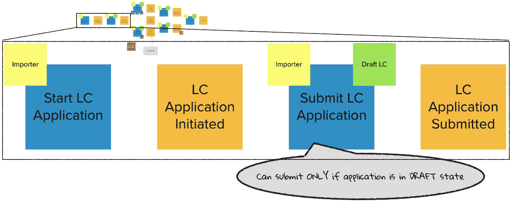

图 5.10 – 提交 LC 应用程序过程中的验证

让我们从编写一个测试来表示我们的意图开始：

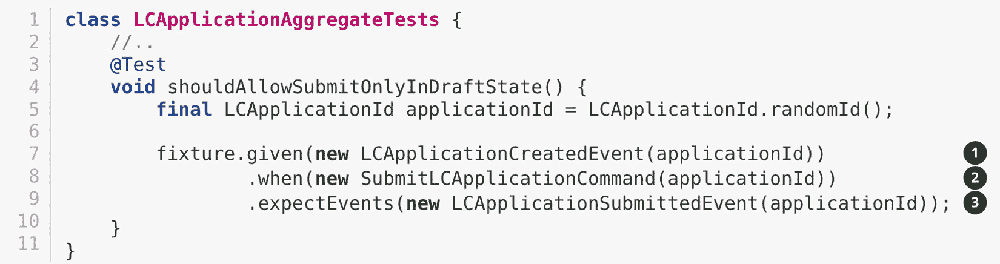

1.  已知`LCApplicationCreatedEvent`已经发生 – 换句话说，LC 申请已经创建。

1.  这是我们尝试通过发出针对同一应用的`SubmitLCApplicationCommand`来提交应用程序的时候。

1.  我们期望会发出`LCApplicationSubmittedEvent`事件。

相应的实现将类似于以下内容：

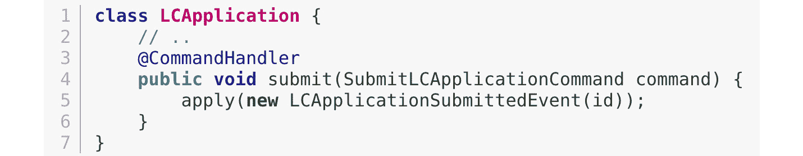

上述实现允许我们无条件地提交 LC 应用程序 – 超过一次。然而，我们希望限制用户只能提交一次。为了能够做到这一点，我们需要记住 LC 应用程序已经被提交。我们可以在相应事件的`@EventSourcingHandler`处理程序中做到这一点，如下所示：

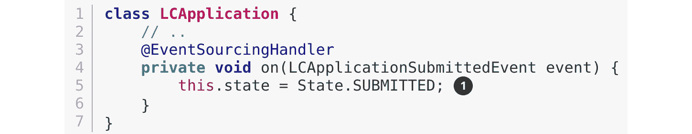

1.  当`LCApplicationSubmittedEvent`被重放时，我们将 LC 应用程序的状态设置为`SUBMITTED`。

虽然我们已经记住应用程序已变为`SUBMITTED`状态，但我们仍然没有阻止多次提交尝试。我们可以通过编写一个测试来修复这个问题，如下所示：

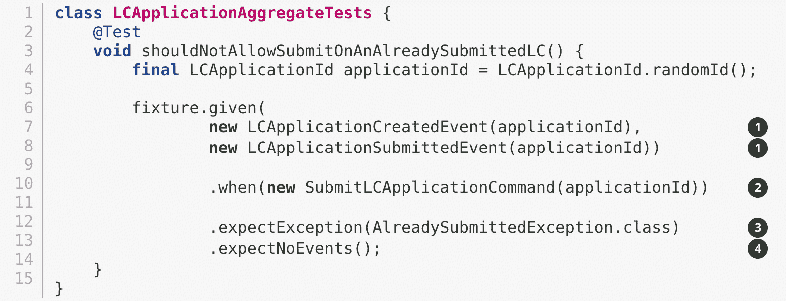

1.  `LCApplicationCreatedEvent`和`LCApplicationSubmittedEvent`已经发生，这意味着`LCApplication`已经被提交过一次。

1.  我们现在向系统发送另一个`SubmitLCApplicationCommand`命令。

1.  我们期望会抛出`AlreadySubmittedException`异常。

1.  我们也期望不会发出任何事件。

使其工作的命令处理程序的实现如下所示：

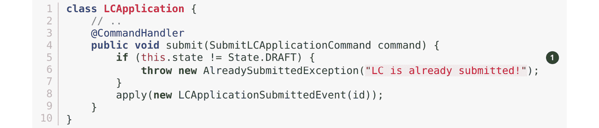

1.  注意我们是如何使用`LCApplication`聚合的状态属性来执行验证的。如果应用程序不在`DRAFT`状态，我们将通过`AlreadySubmittedException`域异常失败。

让我们再看看一个例子，其中执行验证所需的信息既不是命令的一部分，也不是聚合的一部分。让我们考虑这样一个场景，即国家法规禁止与所谓的*受制裁*国家进行交易。这个国家列表的变化可能受到外部因素的影响。因此，将这个受制裁国家的列表作为命令有效负载的一部分是没有意义的。同样，将其作为每个单个聚合状态的一部分来维护也没有意义——鉴于它可以改变（尽管非常不频繁）。在这种情况下，我们可能想要考虑使用一个位于聚合类之外的命令处理器。到目前为止，我们只看到了聚合内部`@CommandHandler`方法的示例。但是，`@CommandHandler`注解可以出现在任何其他外部于聚合的类上。然而，在这种情况下，我们需要自己加载聚合。Axon 框架提供了一个`org.axonframework.modelling.command.Repository`接口，允许我们这样做。重要的是要注意，这个仓库与 Spring 数据库中作为其一部分的 Spring 框架接口是不同的。这里展示了如何工作的一个示例：

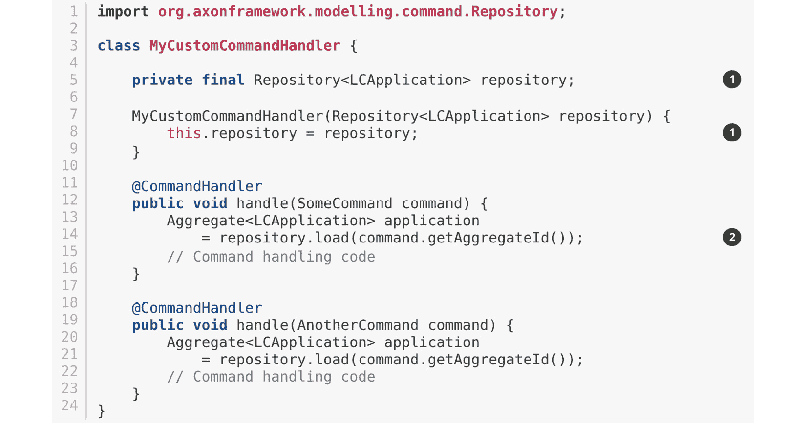

1.  我们正在注入 Axon `Repository`接口以允许我们加载聚合。之前这并不是必需的，因为`@CommandHandler`注解直接出现在聚合方法上。

1.  我们正在使用`Repository`接口来加载聚合并与之交互。`Repository`接口支持其他方便的方法来处理聚合。请参阅 Axon 框架文档以获取更多使用示例。

回到受制裁国家的例子，让我们看看我们需要如何稍微不同地设置测试：

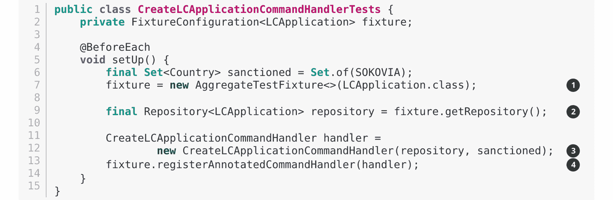

1.  我们像往常一样创建一个新的聚合夹具。

1.  我们正在使用夹具来获取 Axon `Repository`接口的一个实例。

1.  我们实例化了一个自定义命令处理器，传递了`Repository`实例。同时，请注意我们如何通过简单的依赖注入将受制裁国家的集合注入到处理器中。在现实生活中，这组受制裁国家很可能会从外部配置中获得。

1.  我们最终需要将命令处理器注册到夹具中，以便它可以路由命令到这个处理器。

对于这个测试，看起来相当直接：

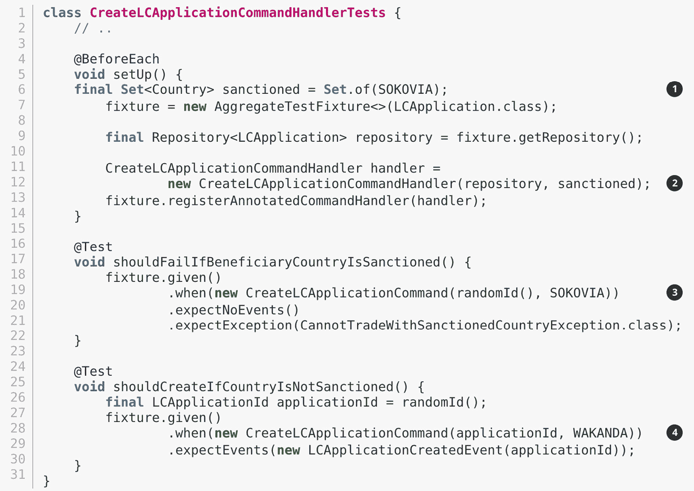

1.  为了测试的目的，我们将国家`SOKOVIA`标记为受制裁国家。在更现实的场景中，这很可能是来自某种形式的外部配置（例如，查找表或某种形式的外部配置）。然而，这对于我们的单元测试是合适的。

1.  然后将这组受制裁国家注入到命令处理器中。

1.  当为受制裁国家创建 LC 应用程序时，我们预计不会发出任何事件，并且还会抛出`CannotTradeWithSanctionedCountryException`异常。

1.  最后，当受益人属于非制裁国家时，我们发出`LCApplicationCreatedEvent`事件。

命令处理器的实现如下所示：

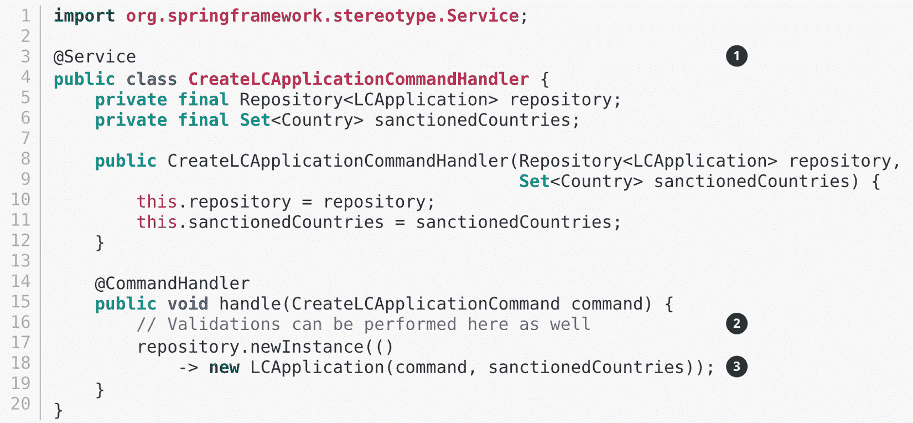

1.  我们将类标记为`@Service`以标记它为一个没有封装状态的组件，并在使用基于注解的配置或类路径扫描时启用自动发现。因此，它可以用于执行任何“管道”活动。

1.  请注意，受益人所在国家是否被制裁的验证也可以在行 18 进行。有些人可能会认为这是理想的，因为我们如果那样做可以避免调用 Axon `Repository`方法的潜在不必要的调用。然而，我们更喜欢尽可能地将业务验证封装在聚合的范围内，这样我们就不会遭受创建贫血领域模型的问题。

1.  我们使用聚合存储库作为工厂来创建`LCApplication`领域对象的新的实例。

最后，这里展示了聚合实现以及验证：

1.  验证本身相当直接。当验证失败时，我们抛出`CannotTradeWithSanctionedCountryException`异常。

通过这些示例，我们探讨了在聚合边界内实现策略执行的不同方法。

# 摘要

在本章中，我们使用了事件风暴会议的输出，并将其用作创建我们边界上下文领域模型的主要辅助工具。我们探讨了如何使用 CQRS 架构模式来实现这一点。我们探讨了持久化选项以及使用基于事件的聚合与存储状态的聚合的后果。最后，我们通过一系列代码示例来查看执行业务验证的多种方式。我们通过 Spring Boot 和 Axon 框架的代码示例来查看所有这些。有了这些知识，我们应该能够实现健壮、封装良好、事件驱动的领域模型。

在下一章中，我们将探讨实现这些领域能力的用户界面，并考察一些选项，例如基于 CRUD 的 UI 与基于任务的 UI。

# 进一步阅读

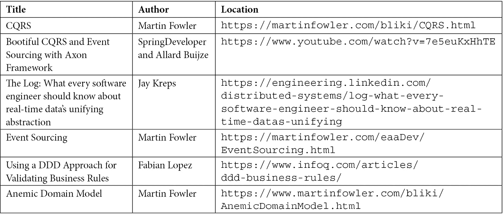
