# 第七章：实现查询

最美的风景总是在最艰难的攀登之后。

– 匿名

在*第三章*“理解领域”的*命令查询责任分离（CQRS）*部分，我们描述了领域驱动设计（DDD）和 CQRS 如何相互补充，以及查询端（读取模型）如何用于创建底层数据的单一或多个表示。在本章中，我们将深入探讨如何通过监听领域事件来构建数据的高效读取表示。我们还将探讨这些读取模型的持久化选项。

当与查询模型一起工作时，我们通过监听事件的发生来构建模型。我们将探讨如何处理以下情况：

+   随着时间的推移，新需求不断演变，需要我们构建新的查询模型。

+   我们在我们的查询模型中发现了一个需要我们从零开始重新创建模型的 bug。

为了做到这一点，本章的议程包括以下主题：

+   继续我们的设计之旅

+   实现查询端

+   历史事件回放

到本章结束时，你将学会欣赏如何通过监听领域事件来构建查询模型。你还将学会如何专门构建新的查询模型以满足特定的读取需求，而不是受限于为服务命令而选择的数据库模型。你最终将了解历史事件回放的工作原理以及如何使用它们来创建新的查询模型以满足新的需求。

# 技术要求

要跟随本章的示例，你需要访问以下内容：

+   JDK 1.8+（我们使用 Java 17 编译示例源代码）

+   Spring Boot 2.4.x

+   Axon Framework 4.5.3

+   JUnit 5.7.x（包含在 Spring Boot 中）

+   OpenJFX Monocle（用于无头 UI 测试）

+   Project Lombok（用于减少冗余）

+   Maven 3.x

请参考书籍配套源代码仓库中的`Chapter07`目录，以获取完整的示例代码。[`github.com/PacktPublishing/Domain-Driven-Design-with-Java-A-Practitioner-s-Guide/tree/master/Chapter07`](https://github.com/PacktPublishing/Domain-Driven-Design-with-Java-A-Practitioner-s-Guide/tree/master/Chapter07)

# 继续我们的设计之旅

在*第四章*“领域分析和建模”中，我们讨论了事件风暴作为一种轻量级方法来阐明业务流程。作为提醒，这是我们事件风暴会议的输出：

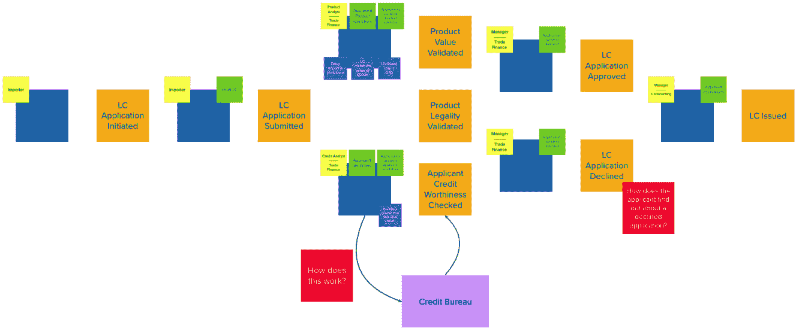

图 7.1 – 事件风暴会议回顾

如前所述，我们正在使用 CQRS 架构模式来创建解决方案。关于为什么这是一个值得采用的方法的详细解释，您可以回顾*第三章*中的*何时使用 CQRS*部分，*理解领域*，我们已经对此进行了讨论。在前面的图中，绿色的便利贴代表读取/查询模型。当验证一个命令（例如，处理`ValidateProduct`命令时的有效产品标识符列表）或信息需要简单地展示给用户时（例如，申请人创建的 LC 列表），这些查询模型是必需的。让我们看看在实际应用中如何将 CQRS 应用于查询端。

# 实现查询端

在*第五章*中，*实现领域逻辑*，我们探讨了在命令成功处理时如何发布事件。现在，让我们看看我们如何通过监听这些领域事件来构建查询模型。从逻辑上讲，这看起来像以下图示：

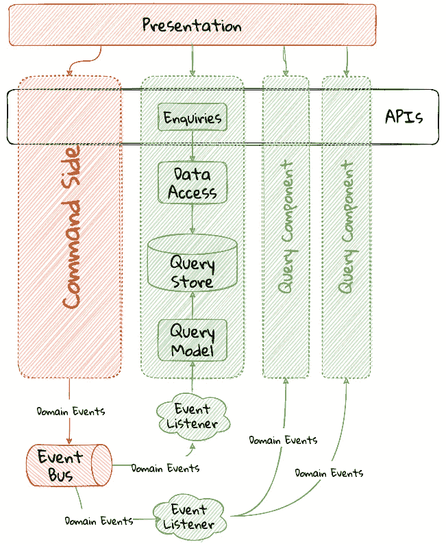

图 7.2 – CQRS 应用 – 查询端

关于命令端是如何实现的详细解释，请参阅*第五章*中的*实现领域逻辑*部分。

查询端的高级序列在此描述：

1.  一个事件监听组件监听在事件总线上发布的这些领域事件。

1.  它构建一个专门用于满足特定查询用例的查询模型。

1.  此查询模型持久化在针对读取操作优化的数据存储中。

1.  然后将此查询模型以 API 的形式公开。

注意，可以存在多个查询端组件来处理相应的场景。

让我们逐一实施这些步骤，看看这对我们的 LC 发行申请是如何工作的。

## 工具选择

在 CQRS 应用中，命令端和查询端之间存在分离。目前，这种分离在我们的应用中是逻辑上的，因为命令端和查询端都在同一个应用进程中作为组件运行。为了说明这些概念，我们将使用 Axon 框架提供的便利性来实现本章的查询端。在*第十章*中，*开始分解之旅*，我们将探讨是否有必要使用专门的框架（如 Axon）来实现查询端。

当实现查询端时，我们有两个关注点需要解决，如下面的图示所示：

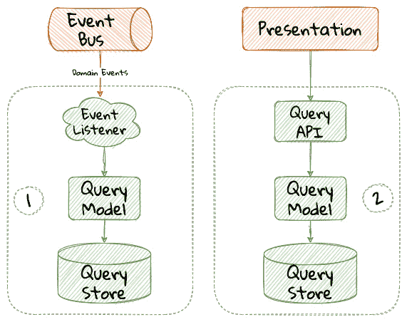

图 7.3 – 查询端剖析

这些关注点如下：

+   消费领域事件和持久化一个或多个查询模型

+   将查询模型公开为 API

在我们开始实现这些关注点之前，让我们确定我们需要为我们的 LC 发放应用程序实现的查询。

## 识别查询

从事件风暴会议中，我们开始有以下查询：

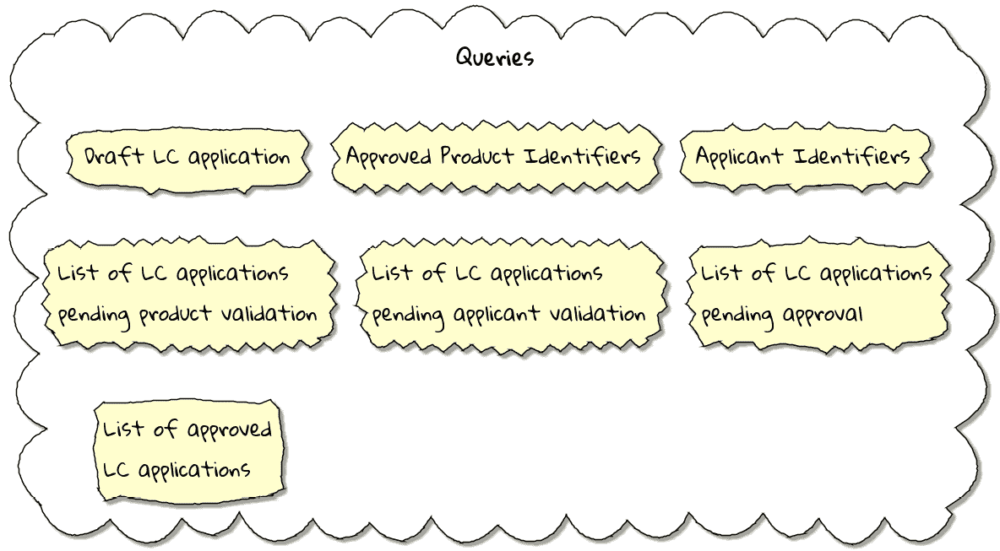

图 7.4 – 识别到的查询

在事件风暴会议的输出（如图 7.1 所示）中用绿色标记的查询都需要我们暴露各种状态的 LC 集合。为了表示这一点，我们可以创建一个 `LCView` 类，这是一个没有任何逻辑的极其简单的对象，如下所示：

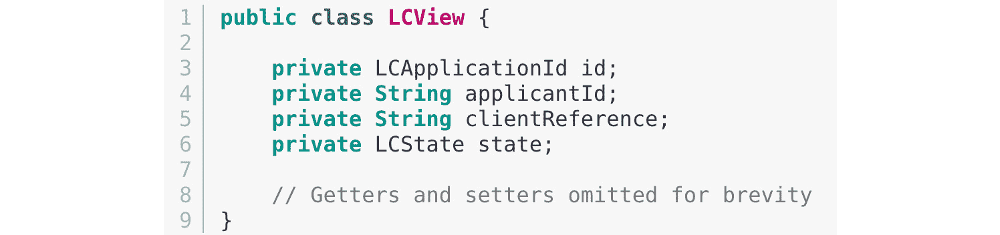

这些查询模型是实现由业务需求决定的基本功能的绝对必要条件。但是，随着系统需求的发展，我们很可能还需要额外的查询模型。我们将根据需要增强我们的应用程序以支持这些查询。

## 创建查询模型

如*第五章*中所述，*实现领域逻辑*，当启动一个新的 LC 应用程序时，导入器发送 `StartNewLCApplicationCommand`，这将导致 `LCApplicationStartedEvent` 被触发，如下所示：

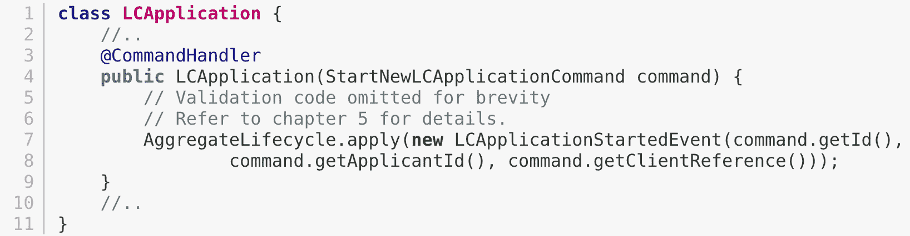

让我们编写一个事件处理组件，它将监听此事件并构建查询模型。在处理 Axon 框架时，我们可以通过用 `@EventHandler` 注解标注事件监听方法来方便地完成这项工作。

要使任何方法成为事件监听器，我们需要用 `@EventHandler` 注解来标注它：

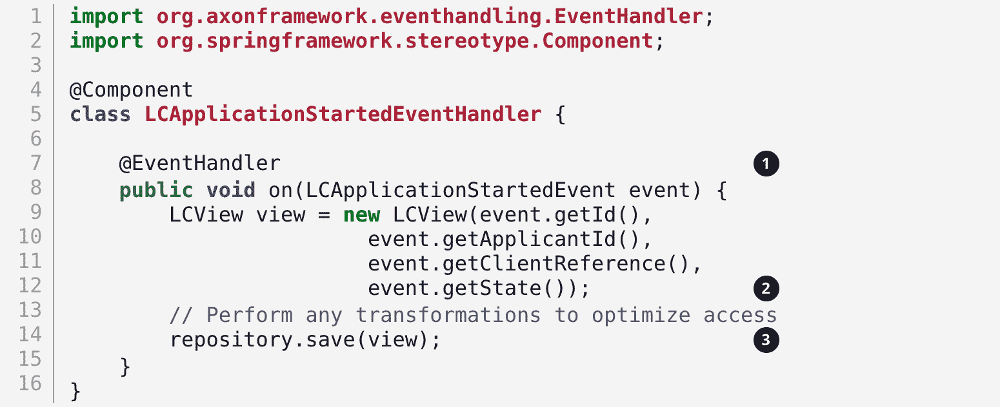

1.  要使任何方法成为事件监听器，我们需要用 `@EventHandler` 注解来标注它。

1.  处理方法需要指定我们打算监听的事件。事件处理器还支持其他一些参数。请参阅 Axon 框架文档以获取更多信息。

1.  我们最终将查询模型保存在合适的查询存储中。在持久化这些数据时，我们应该考虑以优化数据访问的形式存储。换句话说，我们希望在查询这些数据时尽可能减少复杂性和认知负荷。

`@EventHandler` 注解不应与我们在*第五章*中查看的 `@EventSourcingHandler` 注解混淆，*实现领域逻辑*。`@EventSourcingHandler` 注解用于在命令端加载事件源聚合时重放事件并恢复聚合状态，而 `@EventHandler` 注解用于在聚合上下文之外监听事件。换句话说，`@EventSourcingHandler` 注解仅用于聚合内部，而 `@EventHandler` 注解可以在需要消费领域事件的地方使用。在这种情况下，我们正在使用它来构建查询模型。

## 查询端持久化选择

以这种方式隔离查询端使我们能够选择最适合在查询端解决问题的持久化技术。例如，如果极端性能和简单的过滤标准很重要，那么选择一个内存存储如 Redis 或 Memcached 可能是明智的。如果需要支持复杂的搜索/分析要求和大数据集，那么我们可能想考虑像 Elasticsearch 这样的东西。或者，我们甚至可以简单地选择坚持使用关系数据库。我们想强调的是，采用 CQRS 提供了一种以前我们没有的灵活性级别。

## 暴露查询 API

申请者喜欢查看他们创建的 LC，特别是处于草稿状态的 LC。让我们看看我们如何实现此功能。让我们首先定义一个简单的对象来捕获查询标准：

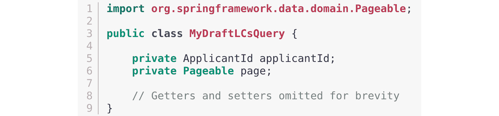

让我们使用 Spring 的仓库模式来实现查询，以检索这些标准的结果：

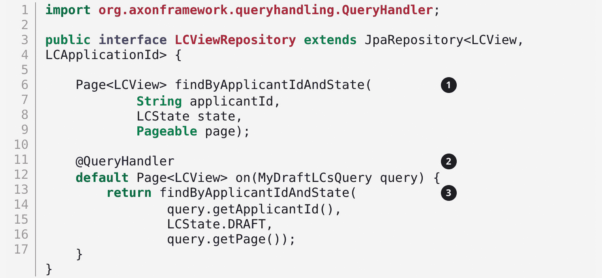

1.  这是我们将用于查询数据库的动态 Spring 数据查找方法。

1.  Axon 框架提供的`@QueryHandler`注解将查询请求路由到相应的处理器。

1.  最后，我们调用查找方法以返回结果。

在前面的示例中，为了简洁起见，我们在仓库本身中实现了`QueryHandler`方法。`QueryHandler`也可以放在其他地方。

为了将此与 UI 连接，我们在`BackendService`中添加了一个新方法（最初在*第六章*，*实现用户界面 - 基于任务的实现）中介绍）来调用查询，如下所示：

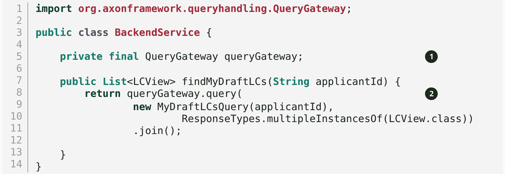

1.  Axon 框架提供了`QueryGateway`便利性，允许我们调用查询。有关如何使用`QueryGateway`的更多详细信息，请参阅 Axon 框架文档。

1.  我们使用`MyDraftLCsQuery`对象执行查询以返回结果。

我们之前查看的是一个非常简单的查询实现示例，其中我们有一个单个`@QueryHandler`注解来服务查询结果。此实现作为一次性检索返回结果。让我们看看更复杂的查询场景。

## 高级查询场景

我们目前关注的重点是活跃的 LC 应用。已签发的 LC 维护发生在系统的不同边界上下文中。考虑一个场景，我们需要提供当前活跃的 LC 应用和已签发的 LC 的统一视图。在这种情况下，有必要通过查询两个不同的来源（理想情况下并行）来获取这些信息，通常称为*散点-聚合*模式。请参阅 Axon 框架文档中关于散点-聚合查询的部分以获取更多详细信息。

在其他情况下，我们可能希望保持对动态变化数据的最新状态。例如，考虑一个实时股票行情应用跟踪价格变化。实现这一点的 一种方式是通过轮询价格变化。一个更有效的方法是在价格变化发生时推送价格变化——通常被称为*发布-订阅*模式。有关详细信息，请参阅 Axon 框架文档中的订阅查询部分。

# 历史事件重放

我们迄今为止看到的示例使我们能够监听事件的发生。考虑一个场景，我们需要从历史事件中构建一个新的查询来满足一个未预料到的新需求。这个新需求可能需要创建一个新的查询模型，或者在更极端的情况下，一个全新的边界上下文。另一种情况可能是当我们可能需要纠正我们构建现有查询模型的方式中的错误，现在需要从头开始重新创建它。鉴于我们在事件存储中记录了所有发生的事件，我们可以使用重放事件来使我们能够相对容易地构建新的和/或纠正现有的查询模型。

重要提示

我们在重新构建事件源聚合实例的状态的上下文中使用了术语*事件重放*（在*第五章*的*事件源聚合*部分讨论，*实现领域逻辑*）。这里提到的事件重放，尽管在概念上相似，但仍然非常不同。在领域对象事件重放的情况下，我们与单个聚合根实例一起工作，并且只为该实例加载事件。然而，在这种情况下，我们可能会处理跨越多个聚合的事件。

让我们看看不同类型的事件重放以及我们如何使用每种类型。

## 重放类型

在重放事件时，根据我们需要满足的要求，至少有两种类型的事件重放。让我们依次查看每种类型：

+   **完整事件重放**：这是指我们在事件存储中重放所有事件。这可以在我们需要支持一个完全新的、依赖于此子域的边界上下文的情况下使用。这也可以用于我们需要支持一个全新的查询模型或重建一个现有、错误构建的查询模型的情况。根据事件存储中的事件数量，这可能是一个相当长且复杂的过程。

+   **部分/临时事件回放**：这是我们需要在聚合实例的子集或所有聚合实例的事件子集上回放所有事件，或者两者的组合。当处理部分事件回放时，我们需要指定过滤标准来选择聚合实例和事件的子集。这意味着事件存储需要具有灵活性来支持这些用例。使用专业的事件存储解决方案（例如 Axon Server 和 EventStoreDB，仅举两例）可以非常有益。

## 事件回放考虑事项

能够回放事件和创建新的查询模型可能非常有价值。然而，就像其他所有事情一样，在处理回放时，我们需要注意一些考虑因素。让我们更详细地探讨其中的一些。

### 事件存储设计

如*第五章*中所述，*实现领域逻辑*，当与事件源聚合一起工作时，我们在持久化存储中持久化不可变事件。我们需要支持的主要用例如下：

+   当作为只读存储时，提供一致且可预测的**写入**性能。

+   当使用聚合标识符查询事件时，提供一致且可预测的**读取**性能。

然而，回放（尤其是部分/临时）需要事件存储支持更丰富的查询能力。考虑这样一个场景，我们发现了一个问题，即在某些时间段内仅对某些货币的已批准 LC 报告了错误的金额。为了修复这个问题，我们需要做以下几步：

1.  从事件存储中识别受影响的 LC（逻辑组件）。

1.  修复应用程序中的问题。

1.  重置受影响聚合的查询存储。

1.  对受影响聚合的子集事件进行回放并重建查询模型。

如果我们不支持允许我们内省事件负载的查询能力，从事件存储中识别受影响的聚合可能会很棘手。即使这种临时的查询能力得到支持，这些查询也可能对事件存储的命令处理性能产生不利影响。采用 CQRS 的主要原因之一就是利用查询端存储来解决这种复杂的读取场景。

事件回放似乎引入了一个“先有鸡还是先有蛋”的问题，即查询存储有一个问题，只能通过查询事件存储来纠正。这里讨论了一些缓解此问题的选项：

+   **通用存储**：选择一个提供两种场景（命令处理和回放查询）可预测性能的事件存储。

+   **内置数据存储复制**：利用读取副本进行事件回放查询。

+   **不同的数据存储**：使用两个不同的数据存储来解决每个问题（例如，使用关系数据库/键值存储来处理命令，以及用于事件回放查询的搜索优化文档存储）。

重要提示

请注意，用于回放的独立数据存储方法是为了满足操作问题，而不是本章前面讨论的查询端业务用例。可以说，它更复杂，因为命令端的技术团队必须配备维护多个数据库技术的能力。

## 事件设计

事件回放是必需的，以便从事件流中重建状态。在这篇文章《什么是事件驱动》（[`martinfowler.com/articles/201701-event-driven.html`](https://martinfowler.com/articles/201701-event-driven.html)）中，马丁·福勒讨论了三种不同的事件风格。如果我们采用马丁文章中提到的事件携带状态转移方法来重建状态，那么可能只需要回放给定聚合的最新事件，而不是按发生顺序回放该聚合的所有事件。虽然这看起来很方便，但它也有其缺点：

+   所有事件现在可能都需要携带大量可能对该事件不相关的附加信息。在发布事件时组装所有这些信息可能会增加命令端的认知复杂性。

+   需要存储和通过网络传输的数据量可能会急剧增加。

+   在查询方面，当理解事件结构和处理它时，可能会增加认知复杂性。

在很多方面，这回到了在第 *5 章* 《实现领域逻辑》中讨论的基于 CRUD 与基于任务的 API 接口方法。我们的总体偏好是尽可能设计出负载最轻的事件。然而，你的经验可能因具体问题或情况而异。

### 应用程序可用性

在事件驱动系统中，随着时间的推移，即使在相对简单的应用程序中，也可能会积累大量的事件。回放大量事件可能会很耗时。让我们看看回放通常是如何工作的机制：

1.  我们暂停收听新事件，为回放做准备。

1.  清除受影响聚合的查询存储。

1.  为受影响聚合启动事件回放。

1.  在回放完成后，继续收听新事件。

根据上述列表，在回放运行时（*步骤 3*），我们可能无法提供受回放影响查询的可靠答案。这显然会影响应用程序的可用性。在使用事件回放时，需要小心确保**服务级别目标**（**SLOs**）继续得到满足。

## 具有副作用的事件处理器

在回放事件时，我们重新触发事件处理器，要么是为了修复之前错误的逻辑，要么是为了支持新的功能。调用大多数（如果不是所有）事件处理器通常会导致某种副作用（例如，更新查询存储）。这意味着某些事件处理器可能不是第一次运行。为了防止不希望的副作用，重要的是要撤销之前调用这些事件处理器的效果，或者以幂等的方式编写事件处理器（例如，使用`upsert`命令而不是简单的`insert`命令或`update`命令）。某些事件处理器的效果可能难以（如果不可能）撤销（例如，调用命令、发送电子邮件或短信）。在这种情况下，可能需要将这些事件处理器标记为在回放期间不可运行。在使用 Axon 框架时，这相当简单：

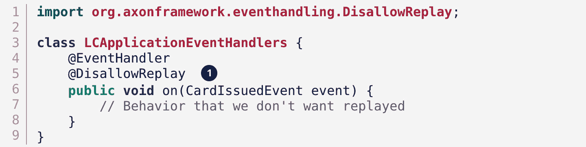

可以使用`@DisallowReplay`（或其对应项`@AllowReplay`）来明确标记事件处理器在回放期间不可运行。

### 事件作为 API

在一个事件源系统中，事件被持久化而不是领域状态，事件结构随时间演变是很自然的。考虑一个`BeneficiaryInformationChangedEvent`的例子，它在一段时间内发生了演变，如下所示：

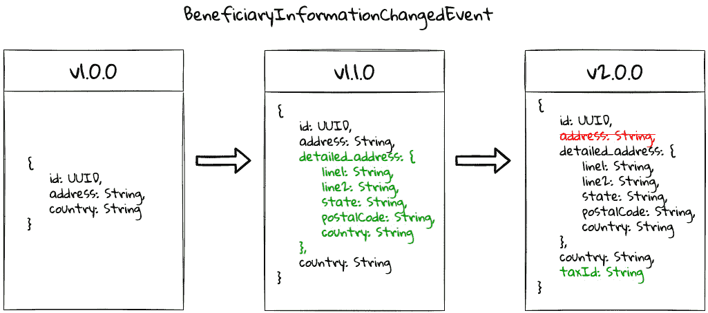

图 7.5 – 事件演变

由于事件存储是不可变的，我们可以设想对于给定的 LC，我们可能有一组或多个这些事件版本。这可能会在我们执行事件回放时带来一系列需要做出的决策：

+   生产者可以简单地提供事件存储中存在的历史事件，并允许消费者处理事件的旧版本。

+   生产者可以在将事件暴露给消费者之前将旧版本的事件升级到最新版本。

+   允许消费者指定他们能够处理的事件的显式版本，并在将其暴露给消费者之前将其升级到该版本。

+   随着演变的进行，将事件存储中的事件迁移到最新版本。考虑到事件存储中事件的不可变性承诺，这可能不可行。

你选择哪种方法完全取决于你的具体环境和生产者/消费者生态系统的成熟度。Axon 框架为它们称为事件上溯的过程提供了规定，允许事件在消费前即时升级。请参阅 Axon 框架文档以获取更多详细信息。

在事件驱动系统中，事件是你的 API。这意味着在做出生命周期管理决策（例如，版本控制、弃用和向后兼容性）时，你需要应用与 API 相同的严谨性。

# 摘要

在本章中，我们研究了如何实现基于 CQRS 的系统的查询端。我们探讨了如何实时消费领域事件来构建可用来服务查询 API 的物化视图。我们研究了可以用来高效访问底层查询模型的不同查询类型。最后，我们探讨了查询端的持久化选项。

最后，我们探讨了历史事件回放及其如何被用于在事件驱动系统中纠正错误或引入新功能。

本章应使您对如何构建和演进基于 CQRS 的系统查询端以满足不断变化的企业需求，同时保留命令端的所有业务逻辑有一个良好的理解。

在本章中，我们探讨了如何以无状态的方式消费事件（即没有两个事件处理器知道彼此的存在）。在下一章中，我们将继续探讨如何消费事件，但这次是以有状态的方式进行，即通过长时间运行的用户事务（也称为叙事）。

# 进一步阅读

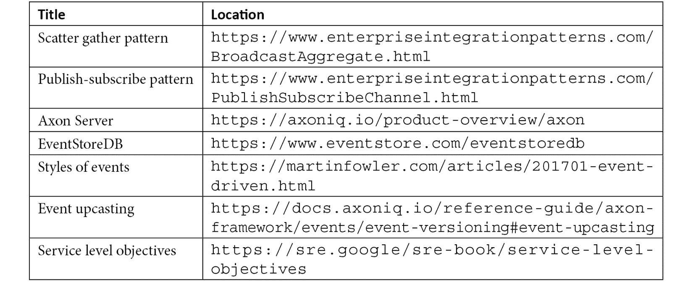
