# 第八章：实现长期运行的工作流程

从长远来看，悲观者可能会被证明是对的，但乐观者在旅途中会有更好的时光。

— 丹尼尔·雷诺德

在前面的章节中，我们探讨了在单个聚合体上下文中处理命令和查询。迄今为止，我们所考虑的所有场景都局限于单一交互。然而，并非所有功能都可以以简单的请求-响应交互的形式实现，需要跨多个外部系统或以人为中心的操作进行协调，或者两者都需要。在其他情况下，可能需要响应非确定性的触发器（条件发生或不发生）和/或时间限制的触发器（基于截止日期）。这可能需要管理跨越多个边界上下文的业务事务，这些事务可能需要很长时间才能运行，同时继续维护一致性（**叙事**）。

至少有两种常见的模式来实现叙事模式：

+   **显式编排**：一个指定的组件作为中央协调器——系统依赖于协调器对领域事件做出反应以管理流程。

+   **隐式协奏**：不需要单个组件作为中央协调器——组件简单地对其他组件中的领域事件做出反应以管理流程。

本章我们将涵盖以下主要内容：

+   实现叙事

+   在编排和协奏之间做出决定

+   处理截止日期

到本章结束时，你将学会如何使用这两种技术实现叙事。你还将学会在没有系统内发生明确事件时如何处理截止日期。你最终将能够理解何时/是否选择显式编排器，或者简单地坚持隐式协奏，而不必求助于可能昂贵的分布式事务。

# 技术要求

要遵循本章的示例，你需要访问以下内容：

+   JDK 1.8+（我们使用 Java 17 编译示例源代码）

+   Spring Boot 2.4.x

+   Axon Framework 4.5.3

+   JUnit 5.7.x（包含在 Spring Boot 中）

+   项目 Lombok（以减少冗余）

+   Maven 3.x

请参阅本书配套源代码仓库中的 `Chapter08` 目录，GitHub 上的完整工作示例位于 [`github.com/PacktPublishing/Domain-Driven-Design-with-Java-A-Practitioner-s-Guide/tree/master/Chapter08`](https://github.com/PacktPublishing/Domain-Driven-Design-with-Java-A-Practitioner-s-Guide/tree/master/Chapter08)。

# 继续我们的设计之旅

在 *第四章* *领域分析和建模* 中，我们讨论了事件风暴作为一种轻量级方法来阐明业务流程。作为提醒，这是我们事件风暴会议的输出：

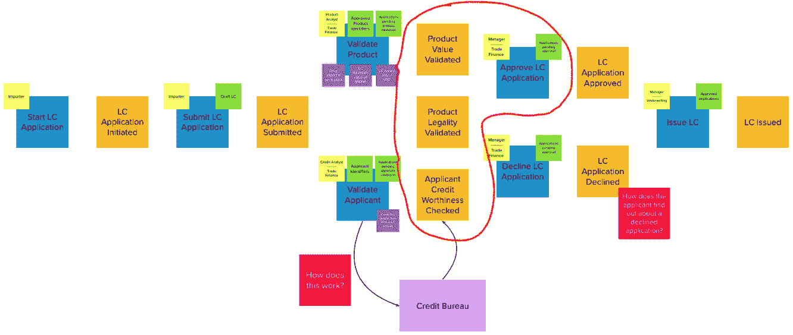

图 8.1 – 事件风暴会议回顾

如前图所示，**信用证**（**LC**）申请处理的一些方面发生在我们的当前边界上下文之外，在贸易融资经理决定批准或拒绝申请之前，如下列所示：

+   产品价值得到验证。

+   产品合法性得到验证。

+   申请人的信用度得到验证。

目前，最终批准是一个手动过程。值得注意的是，产品价值和合法性检查是产品分析部门工作的一部分，而申请人信用度检查发生在信贷分析部门。这两个部门都使用自己的系统来执行这些功能，并通过相应的事件通知我们。只有当**每个**这些检查都完成时，LC 申请才**不准备**被批准或拒绝。这些过程中的每一个主要都是独立于其他过程的，可能需要非确定性的时间（通常在几天左右）。在这些检查发生后，贸易融资经理手动审查申请并做出最终决定。

鉴于收到的 LC 申请数量不断增加，银行正在寻求引入一个流程优化，以自动批准金额低于一定阈值（目前为*USD 10,000*）的申请。业务认为前三个检查是足够的，并且在批准此类申请时不需要进一步的人工干预。

从整体系统角度来看，值得注意的是，产品分析师系统通过`ProductValueValidatedEvent`和`ProductLegalityValidatedEvent`事件通知我们，而信贷分析师系统则通过`ApplicantCreditValidatedEvent`事件进行同样的操作。这些事件中的每一个都可以，实际上也确实可以独立于其他事件发生。为了能够自动批准申请，我们的解决方案需要等待所有这些事件的发生。一旦这些事件发生，我们需要检查每个事件的输出结果，最终做出决定。

注意

在此上下文中，我们使用“长运行”一词来表示需要多个步骤才能完成的复杂业务流程。随着这些步骤的发生，流程从一个状态转换到另一个状态。换句话说，我们指的是一个状态机。这不应与计算密集型的长运行软件过程（例如，复杂的 SQL 查询或图像处理例程）混淆。

如前图所示，LC 自动批准功能是一个长运行业务流程的例子，其中我们的系统中需要跟踪这些独立事件发生的事实才能继续进行。这种功能可以使用 saga 模式实现。让我们看看我们如何做到这一点。

# 实现 sagas

在我们深入探讨如何实现此自动审批功能之前，让我们看看从逻辑角度来看它是如何工作的，如图所示：

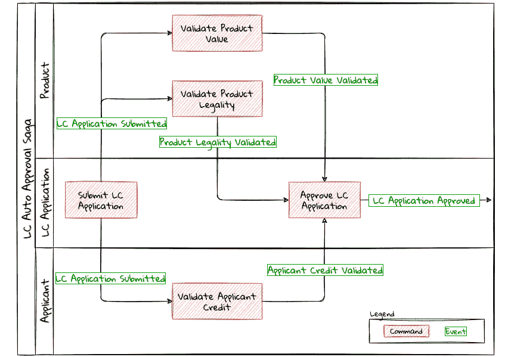

图 8.2 – 自动审批流程—逻辑视图

如前图所示，有三个有界上下文在起作用：

+   **LC 应用**（我们迄今为止一直在实施的有界上下文）

+   **申请人**有界上下文

+   **产品**有界上下文

当 LC 申请提交时，流程被触发。这反过来又启动了三个独立的功能，以建立以下内容：

+   交易产品的价值

+   交易产品的合法性

+   申请人的信用度

只有在**所有**这些功能都完成后，LC 批准才能进行。此外，为了**自动批准**，所有这些检查都必须**顺利通过**，并且如前所述，LC 金额必须低于 *USD 10,000* 阈值。

如事件风暴工件所示，`LC Application` 聚合能够处理 `ApproveLCApplicationCommand`，这导致 `LCApplicationApprovedEvent`。为了自动批准，当所有提到的条件都满足时，此命令需要自动调用。我们正在构建一个事件驱动系统，我们可以看到，每当相应的动作完成时，这些验证都会产生事件。实现此功能至少有两种方法：

+   **编排**：在系统中，单个组件协调流程的状态并在必要时触发后续操作

+   **舞蹈编排**：在流程中，动作被触发，而不需要显式的协调组件

让我们更详细地检查这些方法。

## 编排

当使用编排组件实现 sagas 时，系统看起来类似于以下图所示：

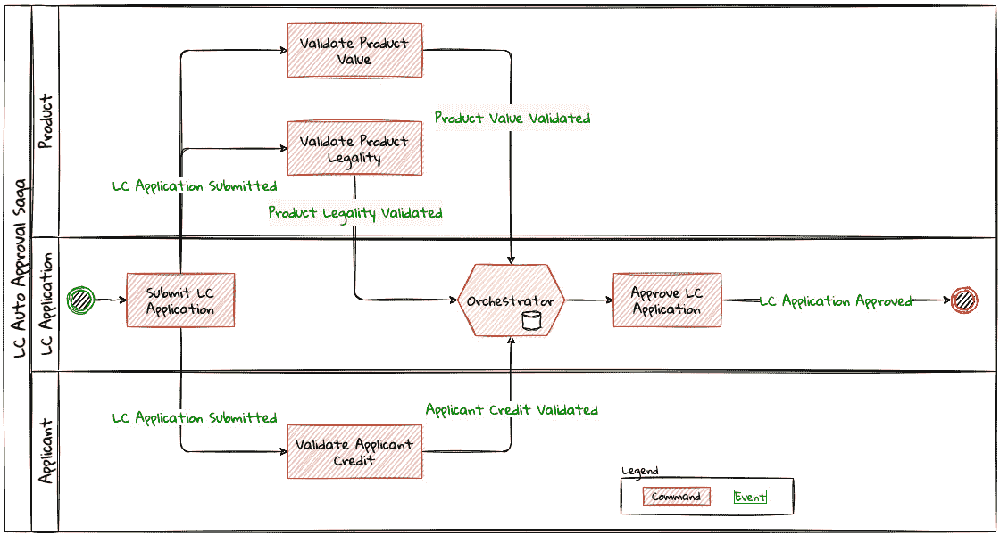

图 8.3 – 使用编排器的 saga 实现

当 LC 申请提交时，编排器开始跟踪流程。然后它需要等待每个 `ProductValueValidatedEvent`、`ProductLegalityValidatedEvent` 和 `ApplicantCreditValidatedEvent` 事件发生，并决定是否触发 `ApproveLCApplicationCommand`。最后，当 LC 申请被批准时，saga 生命周期无条件结束。还有其他可能导致 saga 突然结束的条件。我们将在稍后详细检查这些场景。值得注意的是，对于每个提交的 LC 申请，将有一个**独立的**自动审批 saga 实例。让我们看看如何使用 Axon 框架实现此功能。像往常一样，让我们通过测试驱动来验证当 LC 申请提交时，会创建一个新的自动审批 saga 实例：

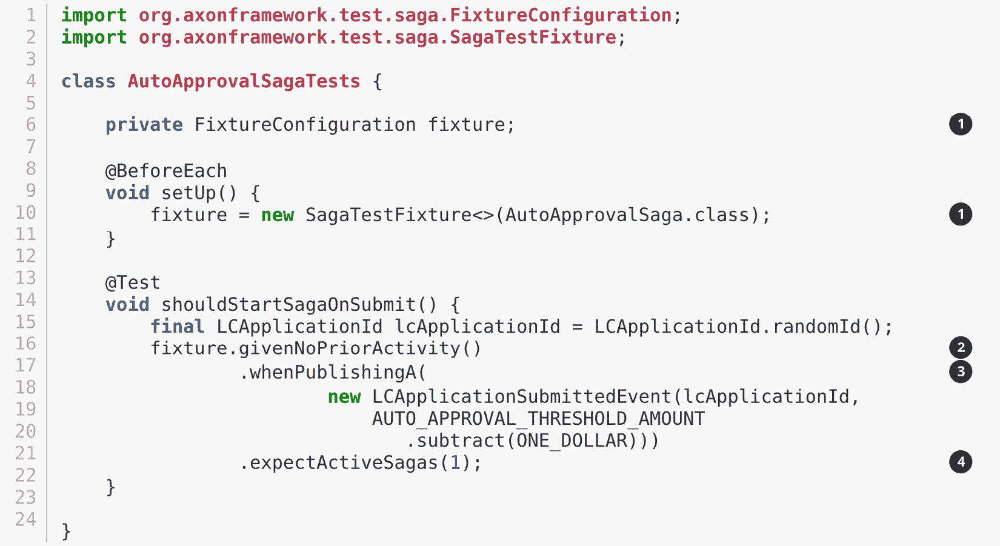

1.  我们使用 Axon 提供的`FixtureConfiguration`和`SagaTestFixture`，这允许我们测试编排功能。

1.  假定在此之前没有发生任何活动（从编排的角度来看）。

1.  当发布`LCApplicationSubmittedEvent`时。

1.  我们期望存在一个活动编排。

使此测试通过的实现如下：

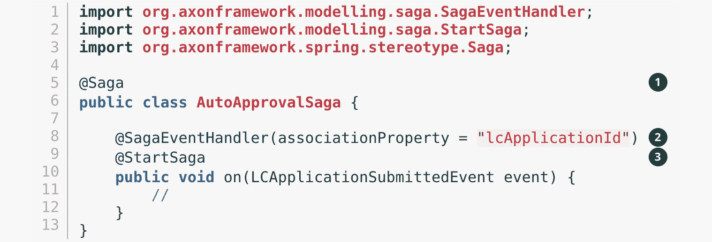

1.  当与 Axon 和 Spring 一起工作时，编排器被`@Saga`注解标记为 Spring bean。为了跟踪每个提交的 LC 申请，`@Saga`注解是原型作用域的（与单例作用域相对），以允许创建多个编排实例。请参阅 Axon 和 Spring 文档以获取更多信息。

1.  编排监听`LCApplicationSubmittedEvent`以跟踪流程（如`@SagaEventHandler`注解所示）。从概念上讲，`@SagaEventHandler`注解与我们之前章节中讨论的`@EventHandler`注解非常相似。然而，`@SagaEventHandler`注解专门用于编排内部的事件监听器。`@SagaEventHandler`注解上的`associationProperty`属性使得此事件处理方法仅在事件负载中`lcApplicationId`属性具有匹配值的编排上被调用。此外，`@SagaEventHandler`是一个事务边界。每次此类方法成功完成时，Axon 框架都会提交一个事务，从而允许它跟踪存储在编排中的状态。我们将在稍后更详细地探讨这一点。

1.  每个编排至少需要有一个同时被`@StartSaga`注解标注的`@SagaEventHandler`方法，以表示编排的开始。

我们有一个要求，如果信用证的金额超过阈值（在我们的情况下为*USD 10,000*），则不能自动批准信用证。对此场景的测试看起来是这样的：

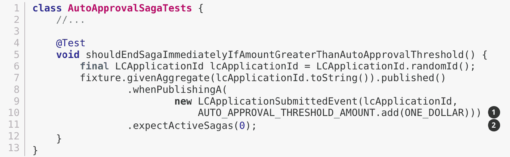

1.  当信用证（LC）金额超过自动批准阈值时。

1.  我们期望该 LC 不存在任何活动编排。

满足此条件实现的代码如下：

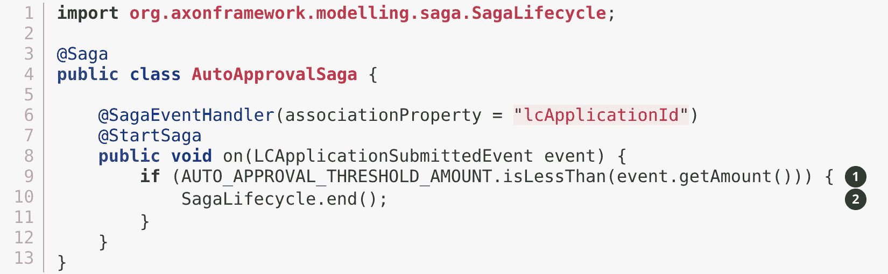

1.  我们检查 LC 金额是否大于阈值金额的条件。

1.  如果是这样，我们将使用框架提供的`SagaLifecycle.end()`方法结束编排。在这里，我们以编程方式结束编排。当`LCApplicationApprovedEvent`发生时，也可以使用`@EndSaga`注解声明性地结束编排。有关更多信息，请参阅本章存储库中包含的完整代码示例。

如果`ApplicantCreditValidatedEvent`、`ProductLegalityValidatedEvent`和`ProductValueValidatedEvent`都成功发生，我们需要自动批准编排。验证此功能的测试如下所示：

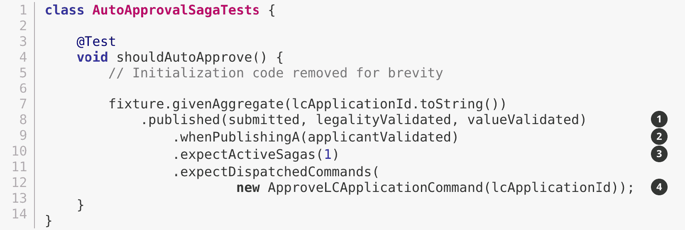

1.  假定 LC 申请已经提交，并且`ProductValueValidatedEvent`和`ProductLegalityValidatedEvent`已经成功发生。

1.  当发布`ApplicantCreditValidatedEvent`时。

1.  我们期望有一个活跃的 saga 实例和以下内容。

1.  我们期望为该 LC 派发`ApproveLCApplicationCommand`。

这个实现的看起来如下：

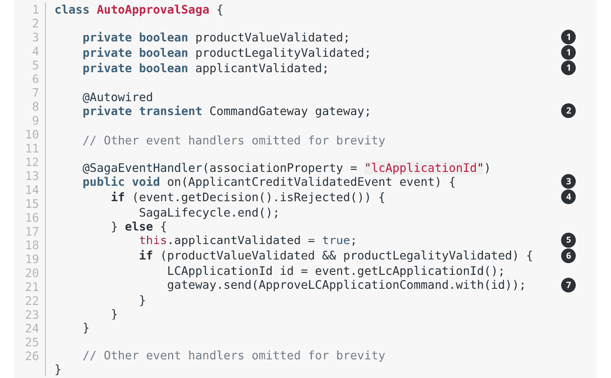

1.  如前所述，sagas 可以维护状态。在这种情况下，我们维护了三个布尔变量，每个变量表示相应事件的触发。

1.  我们已将 Axon 的`CommandGateway`声明为瞬态成员，因为我们需要用它来派发命令，但不需要与其他 saga 状态一起持久化。

1.  此事件处理器拦截特定 LC 申请的`ApplicantCreditValidatedEvent`（如`@SagaEventHandler`注解中的`associationProperty`所示）。

1.  如果`ApplicantCreditValidatedEvent`的决策被拒绝，我们将立即结束 saga。

1.  否则，我们记住申请人的信用已经得到验证。

1.  我们接着检查产品的价值和合法性是否已经被验证。

1.  如果是这样，我们将发布自动批准 LC 的命令。

注意

`ProductValueValidatedEvent`和`ProductLegalityValidatedEvent`中的逻辑与`saga`事件处理器中的`ApplicantCreditValidatedEvent`非常相似。为了简洁，这里省略了它。请参阅本章源代码以获取完整的示例以及测试。

最后，当我们收到此应用的`LCApplicationApprovedEvent`时，我们可以结束 saga：

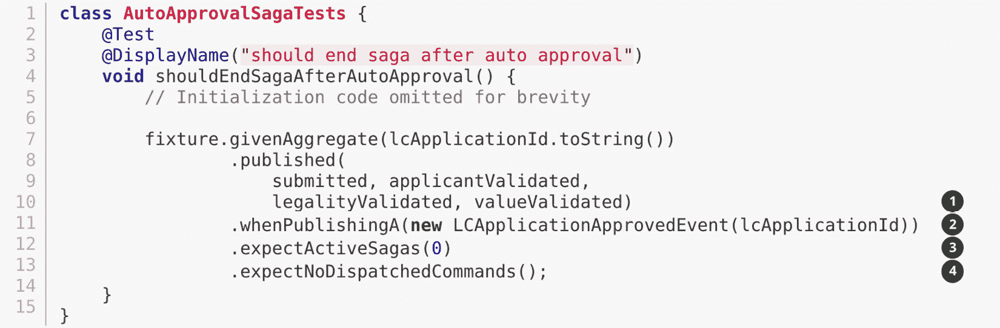

1.  由于 LC 已经提交并且所有验证都已完成成功。

1.  当发布`LCApplicationApprovedEvent`时。

1.  我们期望没有活跃的 saga 正在运行。

1.  我们也期望不会派发任何命令。

现在我们已经了解了如何使用协调器实现 sagas，让我们来探讨一些在设计时可能需要考虑的设计决策。

这里是编排的优点：

+   **复杂的工作流**：在处理涉及多个参与者和许多条件的工作流时，拥有一个显式的协调器非常有帮助，因为协调器可以以细粒度的方式跟踪整体进度。

+   **测试**：正如我们在前面的实现中看到的，在隔离状态下测试流程逻辑相对简单。

+   **调试**：鉴于我们有一个单一的协调器，调试流程的当前状态可以相对容易。

+   **处理异常**：鉴于协调器对流程有细粒度的控制，从异常中优雅地恢复可以更容易。

+   **系统知识**：不同边界上下文中的组件不需要了解彼此的内部（例如，命令和事件）以推进流程。

+   **循环依赖**：拥有一个中央协调器可以避免组件之间意外产生循环依赖。

这里是编排的缺点：

+   **单点故障**：从操作角度来看，编排器可能成为单点故障，因为它们是唯一了解流程的组件。这意味着与其他组件相比，这些组件需要表现出更高的弹性特征。

+   **领域逻辑泄露**：在一个理想的世界里，聚合将始终是所有领域逻辑的保管者。鉴于编排器也是有状态的，业务逻辑可能会无意中转移到编排器。应小心确保编排器只具有流程控制逻辑，而业务不变量仍然保持在聚合的范围内。

上述实现应该能让你对如何实现 Saga 编排器有一个很好的了解。现在让我们看看在不使用显式编排器的情况下如何实现这一点。

## 编排

Saga 编排器跟踪流程的当前状态，通常使用某种类型的数据存储。实现此功能的另一种方式是不使用任何有状态的组件。从逻辑上看，这就像这里图中所示的设置：

![Figure 8.4 – Saga implementation using choreography

![img/B16716_Figure_8.4.jpg]

图 8.4 – 使用编排的 Saga 实现

如您所见，没有单个组件跟踪 Saga 的生命周期。然而，为了做出自动批准的决定，每个这些无状态的事件处理器都需要了解相同的三种事件发生：

+   验证产品价值。

+   验证产品合法性。

+   验证申请人的信用度。

由于事件监听器本身是无状态的，至少有三种方式可以向它们提供此信息：

+   每个事件都在它们各自的负载中携带这些信息。

+   事件监听器查询源系统（在这种情况下，分别是产品和申请人边界上下文）。

+   LC 应用边界上下文维护一个查询模型以跟踪这些事件的发生。

就像在编排器示例中一样，当所有事件都已发生且 LC 金额低于指定阈值时，这些事件监听器可以发出`ApproveLCApplicationCommand`。

注意

我们将跳过介绍编排实现中的代码示例，因为这与我们在本章和前几章中介绍的内容没有不同。

现在我们已经了解了如何实现两种风格的 Saga，让我们来探讨一些在设计时可能需要考虑的设计决策。

编排实现的优点如下：

+   **简单的流程**：对于简单的流程，编排方法可以相对直接，因为它不需要额外协调组件的开销。

+   **无单点故障**：从操作角度来看，不再需要担心一个高弹性组件。

这些是编排实现的缺点：

+   **工作流程跟踪**：特别是对于涉及许多步骤和条件的复杂工作流程，跟踪和调试流程的当前状态可能变得具有挑战性。

+   **循环依赖**：当工作流程变得复杂时，可能会意外地在组件之间引入循环依赖。

Sagas 允许应用程序在需要多个有界上下文来完成业务功能而不必求助于使用*分布式事务*的情况下维护数据和事务一致性。然而，它确实给编程模型引入了一定的复杂性，尤其是在处理失败时。当我们在即将到来的章节中讨论与分布式系统一起工作时，我们将更详细地探讨异常处理。让我们通过查看截止日期的工作方式来了解在没有明确刺激的情况下如何推进流程。

# 处理截止日期

到目前为止，我们已经探讨了由人类（例如，申请人提交 LC 申请）或系统（例如，LC 申请的自动批准）行为引起的事件。然而，在事件驱动系统中，并非所有事件都是由于明确的人类或系统刺激而发生的。事件可能需要根据一段时间内的不活动或基于现有条件的重复调度来发出。

例如，让我们考察银行需要尽快决定*已提交的 LC 申请*的情况。当贸易融资经理在 10 个日历日内未对申请采取行动时，系统应发送提醒。

为了处理这种不活动，我们需要一种方法来触发基于时间流逝的系统行为（即：在截止日期到期时执行操作）。在理想情况下，我们期望用户或系统采取某些行动。在这种情况下，我们还需要考虑在截止日期到期时需要取消已安排触发的情况。让我们看看如何测试驱动这个功能：

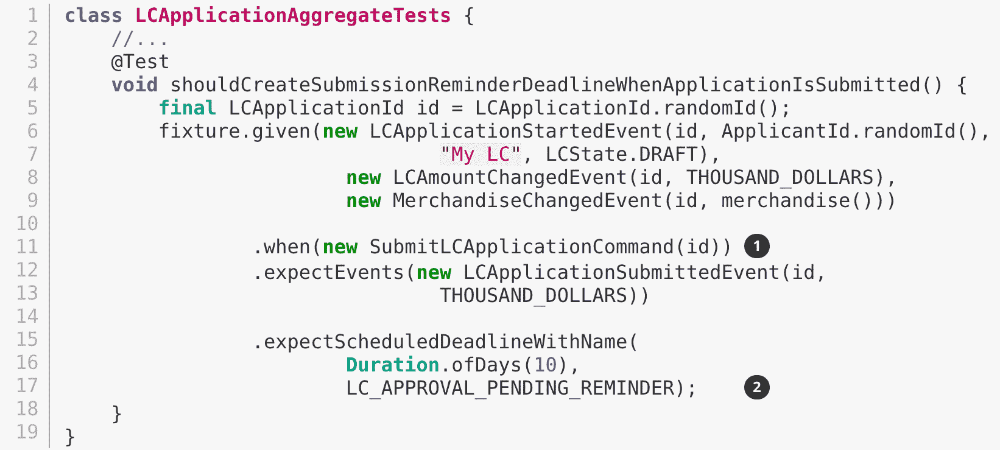

1.  当 LC 申请提交时。

1.  我们期望安排一个提醒的截止日期。

这个实现的步骤相当直接：

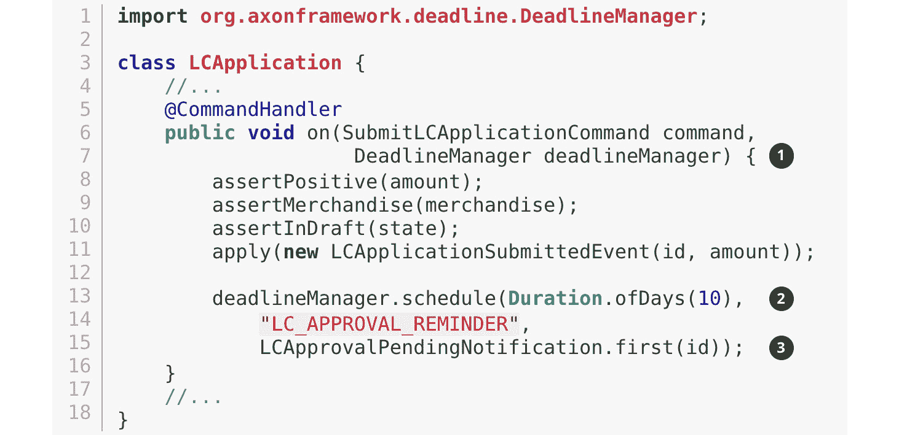

1.  为了允许与截止日期一起工作，Axon 框架提供了一个`DeadlineManager`，允许与截止日期一起工作。这个管理器被注入到命令处理方法中。

1.  我们使用`deadlineManager`来安排一个名为的截止日期（在这种情况下为`"LC_APPROVAL_REMINDER"`），它将在 10 天后到期。

1.  当截止日期满足时，它将导致`LCApprovalPendingNotification`，这可以像命令一样处理。但是，在这种情况下，行为是由时间的流逝触发的。

如果 10 天内没有采取任何行动，这是我们期望的情况：

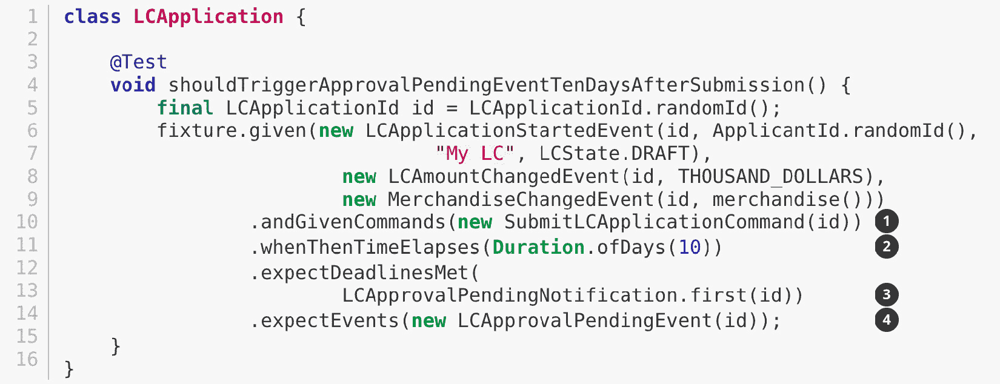

1.  假设 LC 申请已经提交。

1.  当 10 天的周期结束时。

1.  应该满足截止日期。

1.  应该发出`LCApprovalPendingEvent`。

让我们看看如何实现这一点：

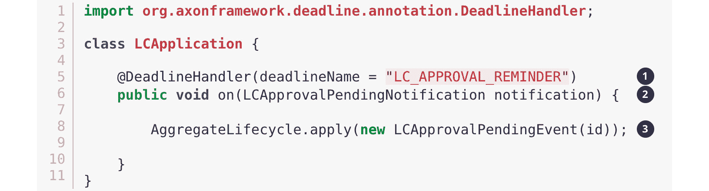

1.  截止日期通过使用`@DeadlineHandler`注解来处理。请注意，这里引用的是之前使用的相同截止日期名称。

1.  这是截止日期处理方法，并使用在调度时传递的相同有效载荷。

1.  当截止日期到期时，我们发出`LCApprovalPendingEvent`。

截止日期处理逻辑只有在没有采取任何行动的情况下才会被触发。然而，如果在 10 天的时间内 LC（贷款承诺）被批准或拒绝，则不应触发以下任何行为：

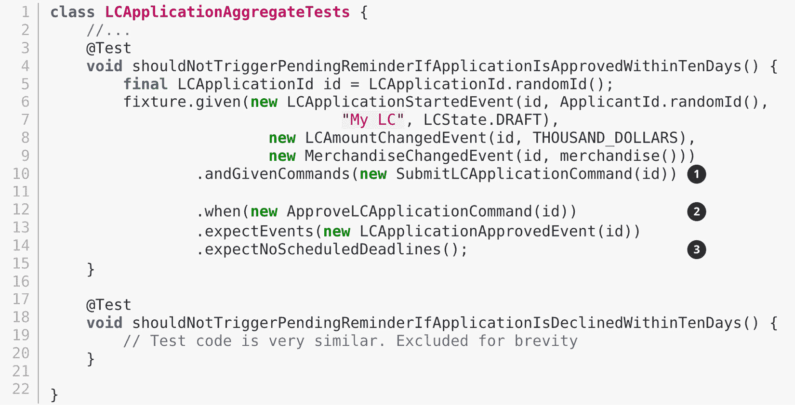

1.  假设 LC 申请已提交。

1.  当它在 10 天（在这种情况下，几乎是立即）内被批准。

1.  我们预期没有计划中的截止日期。

该实现的示例如下：

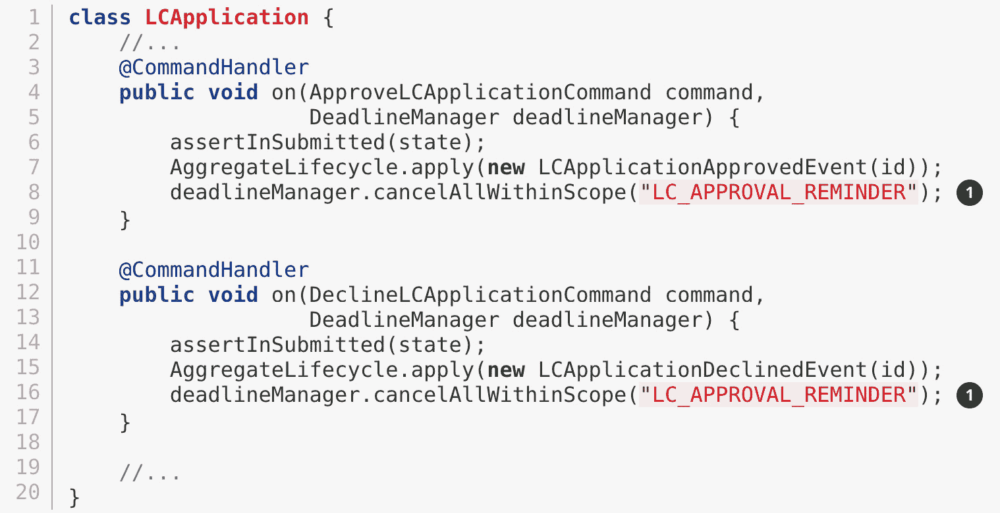

1.  在此聚合的作用域内，我们取消所有名为`LC_APPROVAL_REMINDER`（在这种情况下，我们只有一个具有该名称的截止日期）的截止日期。

# 摘要

在本章中，我们探讨了如何使用 sagas 和不同的实现风格来处理长时间运行的流程。我们还探讨了使用显式编排与隐式编舞的后果。最后，我们探讨了在没有用户发起的操作时如何处理截止日期。

你已经学会了如何在设计利用领域驱动设计原则的系统时，sagas 可以作为除了聚合之外的一等公民。

在下一章中，我们将探讨如何在尊重核心系统和外围系统之间的边界上下文中与外部系统进行交互。

# 进一步阅读

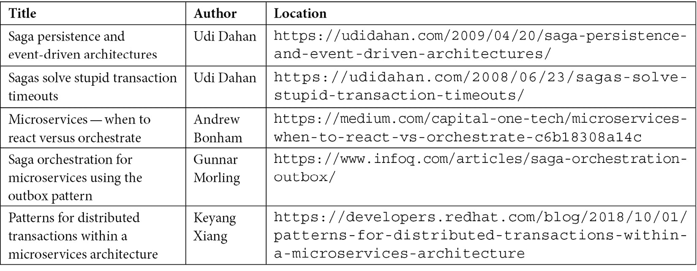
