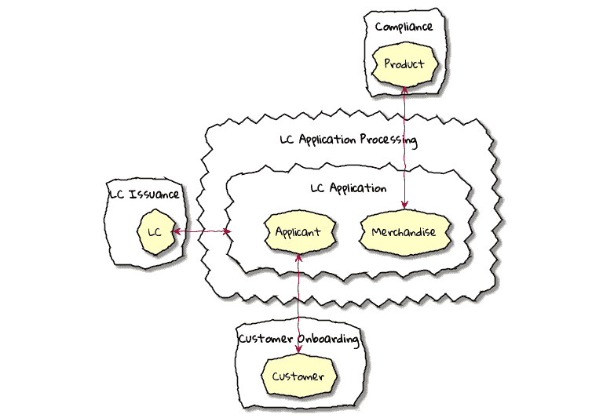
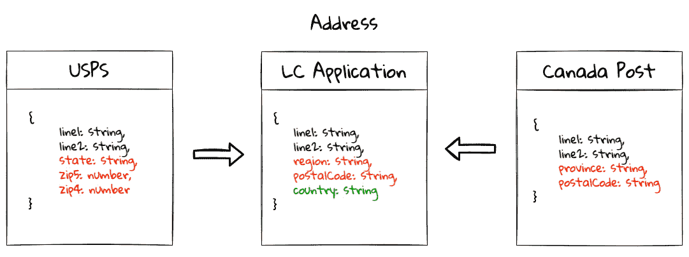
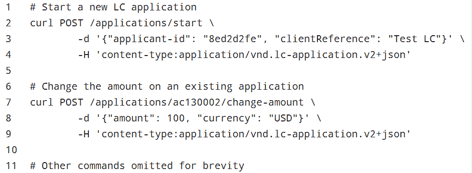
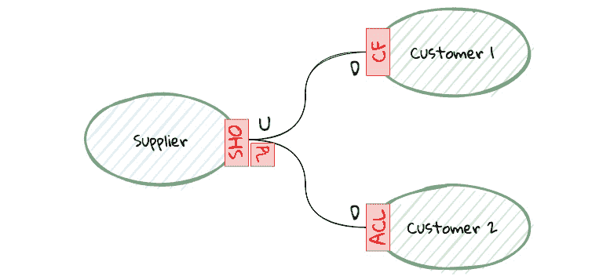
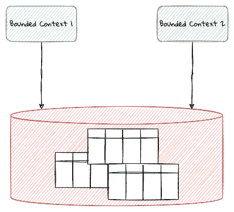
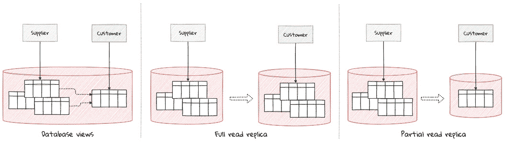
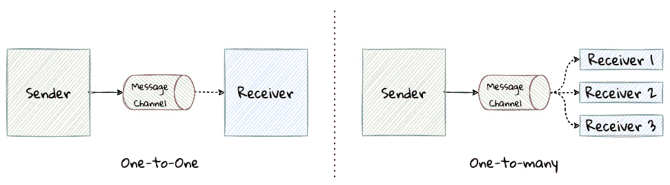
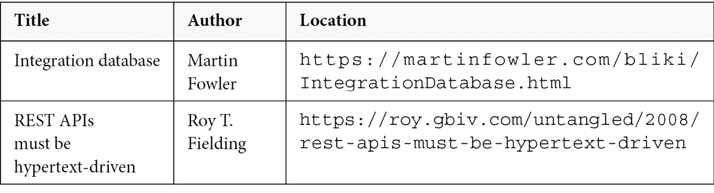

# 第九章：与外部系统集成

完整性并非通过割裂自己的某一部分来实现，而是通过整合对立面来达到。

– 卡尔·荣格

到目前为止，我们已经使用 DDD 为我们应用程序实现了一个健壮的核心。然而，大多数解决方案（通过扩展有限上下文）通常既有上游也有下游依赖，这些依赖通常以不同的速度变化，这与这些核心组件不同。为了保持敏捷性和可靠性，并实现松散耦合，重要的是以一种保护核心免受周围一切影响的方式来与外围系统集成。

在本章中，我们将探讨 LC 应用处理解决方案，并检查我们如何与其他生态系统中的组件进行集成的手段。你将学习如何识别组件之间的关系模式。

本章涵盖了以下主要内容：

+   继续我们的设计之旅

+   有限上下文关系

+   实现模式

在本章结束时，我们将通过查看与遗留应用集成的常见模式来结束讨论。让我们直接进入正题！

# 继续我们的设计之旅

从我们之前章节中的领域分析中，我们已经为我们的应用程序确定了四个有限上下文，如图所示：

图 9.1 – 有限上下文之间的关系

到目前为止，我们的关注点一直集中在实现**LC 应用**有限上下文的内部。虽然 LC 应用有限上下文与其他有限上下文是独立的，但它并不是完全与它们隔离。例如，在处理 LC 应用时，我们需要执行商品和申请人检查，这需要与**合规性**和**客户入职**有限上下文进行交互。这意味着这些有限上下文之间存在关系。这些关系是由在各自有限上下文上工作的团队之间的协作性质所驱动的。让我们考察这些团队动态如何影响有限上下文之间的集成机制，同时继续保持它们的个体完整性。

# 有限上下文关系

我们需要边界上下文尽可能独立。然而，这并不意味着边界上下文完全相互隔离。边界上下文需要与其他上下文协作以提供业务价值。每当需要两个边界上下文之间协作时，它们关系的性质不仅受它们各自的目标和优先级的影响，还受组织现实情况的影响。在一个高绩效的环境中，一个团队承担一个边界上下文的拥有权是相当常见的。拥有这些边界上下文的团队之间的关系在影响采用以到达解决方案的集成模式中起着重要作用。从高层次来看，有两种关系类型：

+   对称

+   非对称

让我们更详细地看看这些关系类型。

## 对称关系模式

当两个团队，比如团队 A 和团队 B，在决定解决方案的过程中拥有相等的影响力时，可以说它们之间存在对称关系。两个团队都处于能够，并且实际上确实，以几乎相等的方式对结果做出贡献的位置。以下是一个图示表示： 

图 9.2 – 两个团队在影响解决方案方面拥有平等的话语权

对称关系有三种变体，我们将在接下来的小节中更详细地概述。

### 伙伴关系

在伙伴关系中，两个团队以临时方式集成。在需要完全集成工作时，没有分配固定的责任。每个团队根据需要随时接手工作，无需任何特定的仪式或喧哗。集成的性质通常是双向的，两个团队根据需要交换解决方案工件。这种关系需要极高程度的协作和对两个团队所做工作的理解。查看以下图示：

图 9.3 – 伙伴关系中的团队之间存在临时的相互依赖

#### 示例

让我们以一个与构建前端 BFFs（[`philcalcado.com/2015/09/18/the_back_end_for_front_end_pattern_bff.html`](https://philcalcado.com/2015/09/18/the_back_end_for_front_end_pattern_bff.html)）的前端团队合作紧密的 Web 前端团队为例。BFF 团队创建的经验 API 旨在仅由前端使用。为了实现任何功能，前端团队需要 API 团队暴露的能力。另一方面，API 团队依赖于前端团队提供有关要构建哪些能力和按何种顺序构建它们的建议。两个团队都可以自由地使用对方的领域模型（例如，定义 API 的相同请求和响应对象集合）来实现功能。这种重用主要发生得任意，当 API 发生变化时，两个团队协调更改以保持一切正常工作。

#### 何时使用

团队之间的合作关系需要高度的协作、信任和理解。当团队界限不正式时，团队往往会使用这种合作关系。如果这些团队是集中办公并且/或者有显著的工作时间重叠，这也会有所帮助。

#### 可能的陷阱

团队之间的合作关系可能导致个人团队责任变得非常不明确，导致解决方案走向令人恐惧的*大泥球*。

### 共享内核

与合作关系不同，当使用共享内核时，团队对自己之间选择共享的解决方案工件和模型有清晰的理解。两个团队都承担着维护这些共享工件的责任。

#### 示例

在我们的 LC 应用中，*LC 应用程序处理*和*客户入职*团队可能会选择使用一个共同模型来表示`CustomerCreditValidatedEvent`。对事件架构的任何增强或更改都可能影响两个团队。做出任何更改的责任由两个团队共同承担。有意地，这些团队除了这些共同同意的模型和工件之外，不共享任何其他内容。以下是团队之间共享内核关系的表示：

![img/B16716_Figure_9.04.jpg]

图 9.4 – 团队对共享模型有明确的理解

#### 何时使用

如果在两个上下文中都需要以相同的方式消费共享工件，那么共享内核形式的协作效果很好。此外，对于多个团队来说，协调并继续共享，而不是在两个上下文中复制相同的模型，这很有吸引力。

#### 可能的陷阱

对共享内核所做的更改会影响所有边界上下文。这意味着对共享内核所做的任何更改都需要与两个团队保持兼容。不用说，随着使用共享内核的团队数量的增加，协调的成本会成倍增加。

### 分离的方式

当两个团队选择不共享任何工件或模型时，他们会各自为政：

![图 9.5 – 团队分道扬镳，彼此之间不共享任何内容

![img/B16716_Figure_9.05.jpg]

图 9.5 – 团队分道扬镳，彼此之间不共享任何内容

#### 示例

*LC 应用程序处理*和*客户入职*团队可能最初会共享他们服务的相同构建/部署脚本。随着时间的推移，部署需求可能会分歧到共享维护这些脚本的代价变得过高，导致这些团队分叉他们的部署以恢复对其他团队的独立性。

#### 何时使用

在某些情况下，由于各种原因，两个团队可能无法合作，这些原因可能从个人团队需求的变化到组织政治。无论情况如何，这些团队可能会决定合作的成本太高，从而导致他们各自为政。

#### 可能的陷阱

选择分道扬镳可能会导致受影响的边界上下文中出现重复工作。当在映射到核心子域的边界上下文中工作时，这可能会证明是适得其反的，因为它可能导致无意中产生不一致的行为。

在一段时间内，从一种关系类型过渡到另一种关系类型是可能的。根据我们的经验，从任何一种关系过渡可能并不简单。在需求一开始相对清晰的情况下，可能更容易从*共享内核*开始。相反，如果需求不明确，可能明智地开始以松散的*伙伴关系*或*分道扬镳*，直到需求变得明确。在任何这些场景中，重要的是要持续评估关系的性质，并根据我们对需求及其本身的更深入了解，过渡到更合适的关系类型。

在前面描述的每一种关系中，涉及的团队在关系演变和最终结果方面都有或多或少的发言权。然而，这并不总是如此。让我们看看一些案例，在这些案例中，一个团队可能在关系演变方面具有明显的优势。

## 非对称关系模式

当一个团队在决策过程中对解决方案有更强的影响力时，可以说两个团队之间存在非对称关系。换句话说，存在一个明确的客户-供应商（或上游-下游）关系，其中客户或供应商在影响解决方案设计方法方面扮演着主导角色。客户和供应商可能没有共同的目标。以下是客户和供应商之间非对称关系的表示：

![图 9.6 – 一个团队在影响解决方案方面具有主导权

![img/B16716_Figure_9.06.jpg]

图 9.6 – 其中一个团队在影响解决方案方面具有主导权

当团队处于非对称关系时，至少存在三种解决方案模式，我们将在以下小节中更详细地概述。

### **顺从者（CF**）

供应商角色的一方在如何实施与一个或多个客户的关系方面拥有主导权并不罕见。此外，客户可能简单地选择接受供应商提供的解决方案，将其作为他们自己解决方案的一个组成部分。换句话说，供应商提供一系列模型，客户使用这些相同的模型来构建他们的解决方案。在这种情况下，客户被认为是**顺从者**：

图 9.7 – 客户接受对供应商模型的依赖

#### 示例

当构建一个解决方案以验证 LC 申请者的美国邮政地址时，我们选择遵循 USPS Web Tools 地址验证 API 模式（[`www.usps.com/business/web-tools-apis/`](https://www.usps.com/business/web-tools-apis/)）。鉴于业务最初仅限于美国申请者，这样做是有意义的。这意味着我们边界上下文中对地址模型的任何引用都模仿了 USPS 规定的模式。此外，这也意味着我们需要随时关注 USPS API 发生的任何变化（无论这些变化是否需要用于我们自己的功能）。

#### 何时使用

成为顺从者并不一定是件坏事。供应商的模型可能是被广泛接受的行业标准，或者它们可能只是满足我们需求的好方法。也可能是因为团队可能没有必要的技能、动机或立即的需求去做与供应商提供的内容不同的事情。这种方法还使团队能够快速取得进展，利用其他专家大部分已完成的工作。

#### 潜在陷阱

过度使用顺从者模式可能会稀释我们自身边界上下文中的通用语言，导致供应商和客户概念之间没有明确的分离。也可能出现这样的情况，即对供应商上下文核心的概念泄漏到我们自己的上下文中，尽管这些概念在我们自己的上下文中几乎没有任何意义。这可能导致这些边界上下文之间非常紧密地耦合在一起。如果需要切换到另一个供应商或支持多个供应商，变更的成本可能会非常高昂。

### 反腐败层

可能存在客户需要与供应商合作但可能希望保护自己免受供应商通用语言和模型影响的场景。在这种情况下，在集成时重新定义这些冲突模型，使用翻译层，也称为**反腐败层（ACL**），可能是明智的。参见以下图示：

图 9.8 – 客户希望保护自己免受供应商模型的影响

#### 示例

在*一致者（CF）*部分引用的地址验证示例中，*LC 应用程序处理*团队可能还需要支持加拿大申请人。在这种情况下，成为一个仅支持美国地址的系统的一致者可能会显得限制性甚至令人困惑。例如，美国的*州*相当于加拿大的*省*。同样，美国的*ZIP 代码*在加拿大被称为*邮政编码*。此外，美国的 ZIP 代码是数字的，而加拿大的邮政编码是字母数字的。最重要的是，我们目前在我们的地址模型中没有*国家代码*的概念，但现在我们需要引入这个概念来区分各自国家内的地址。以下是我们分别国家的地址模型：

图 9.9 – 不同国家的地址模型

虽然我们最初遵循了 USPS 模型，但我们现在已经发展到支持更多国家。例如，*地区*用于表示*州/省*的概念。此外，我们引入了*国家*值对象，这是之前缺失的。

#### 何时使用

当客户模型是核心领域的一部分时，ACL 非常有用。ACL 可以保护客户免受供应商模型的变化，并有助于产生更松散耦合的集成。在试图从多个供应商整合类似概念时，这也可能是必要的。

#### 可能的陷阱

在很多情况下，使用 ACL 可能很有吸引力。然而，当被整合的概念不经常变化或由一个众所周知的权威机构定义时，使用 ACL 可能不太有益。使用带有自定义语言的 ACL 可能会造成更多的混淆。创建 ACL 通常需要额外的翻译，从而可能增加客户边界上下文的总体复杂性，并且可能被认为是过早的优化。

### 开放主机服务

与一致者和 ACL 不同，在这些情况下，客户没有正式的方式与供应商接口，而在**开放主机服务**（**OHS**）中，供应商定义了一个清晰的接口来与其客户交互。这个接口可能以众所周知的发布语言的形式提供（例如，REST 接口或客户端 SDK）：

图 9.10 – 使用已发布语言（PL）的 OHS

#### 示例

LC 应用程序处理边界上下文可以为每个命令公开一个 HTTP 接口，如下所示：

作为此处所示 HTTP 接口的补充，我们甚至可以为客户使用的某些更流行的语言提供客户端 SDK。这有助于隐藏更多实现细节，例如 MIME 类型和版本，从而保护客户。

#### 何时使用

当供应商想要隐藏其内部模型（通用语言）时，创建一个 OHS 使得供应商在提供稳定接口给客户的同时能够进行演变。从某种意义上说，OHS 模式是 ACL 模式的反转——不是客户，而是供应商实现了其内部模型的翻译。此外，当供应商希望为其客户提供更丰富的用户体验时，它也可以考虑提供 OHS。

#### 潜在陷阱

虽然供应商通过为顾客提供 OHS 可能有良好的意图，但它可能会导致实现复杂性的增加（例如，可能需要支持 API 的多个版本，或者多种语言的客户端 SDK）。如果 OHS 没有考虑到客户的常见使用模式，它可能会导致客户可用性差，同时也可能降低供应商的性能。

重要的一点是，守成者和 ACL 是客户实施的模式，而 OHS 是供应商端的模式。例如，以下场景中供应商为一位是守成者的客户和另一位有 ACL 的客户提供*OHS*，如图所示：

图 9.11 – 与多个客户的非对称关系

现在我们已经看到了有界上下文如何相互集成的各种方式，以下是我们 LC 应用程序的一个可能的实现方案，以上下文图的形式展示：

图 9.12 – LC 应用程序的简化上下文图

到目前为止，我们已经探讨了团队动态影响集成机制的各种方式。虽然概念层面的清晰度有帮助，但让我们看看这些关系在实现层面是如何体现的。

# 实现模式

我们在设计层面上探讨了有界上下文之间的集成，但需要将这些概念转化为代码。在集成两个有界上下文时，可以采用三个广泛的类别：

+   基于数据

+   基于代码

+   基于 API

让我们更详细地看看每种方法。

## 基于数据

在这种集成风格中，相关有界上下文之间共享数据。如果关系是对称的，拥有这些有界上下文的团队可以选择共享整个数据库，允许自由地读取、写入和更改底层结构。相反，在不对称的关系中，供应商可能会根据关系的类型限制访问范围。

### 共享数据库

数据集成最简单的形式是使用共享数据库。在这种集成风格中，所有参与的有界上下文都可以无限制地访问模式和底层数据，如图所示：

图 9.13 – 使用共享数据库的集成

#### 何时使用

共享数据库为希望快速启用新功能或增强现有功能的团队提供了非常低的进入门槛，通过提供对读取和/或写入用例数据的即时访问。更重要的是，它还允许使用本地数据库事务，这通常提供强一致性、较低复杂性和更好的性能（尤其是在与关系数据库一起工作时）。

#### 潜在陷阱

然而，这种多个团队共享所有权的对称集成风格通常是不受欢迎的，因为它往往导致没有明确所有权的局面。此外，共享数据库可能成为紧密耦合的来源，加速走向令人恐惧的*一团糟*的道路。此外，共享数据库的用户可能会遭受*嘈杂邻居*效应，其中一个共同租户垄断资源会不利地影响所有其他租户。因此，团队最好谨慎选择这种集成风格。

### 复制数据

在非对称关系中，供应商可能不愿意直接提供其数据的访问权限。然而，他们可以选择使用基于数据共享的机制与客户集成。另一种集成形式是提供消费者所需数据的副本。这种实现方式有很多变体；我们在此展示更常见的方法：

图 9.14 – 使用数据复制的集成

+   **数据库视图**：在这种形式中，消费者通过查询或物化视图获取或被提供对数据子集的访问权限。在任一情况下，客户通常只有对数据的只读访问权限，供应商和客户继续共享相同的物理资源（通常是数据库引擎）。

+   **完整读取副本**：在这种形式中，客户可以访问供应商整个数据库的读取副本，通常在物理上分散的基础设施上。

+   **部分读取副本**：在这种形式中，客户可以访问供应商数据库子集的读取副本，再次在物理上分散的基础设施上。

#### 何时使用

当供应商和客户之间存在非对称关系时，可能需要这种集成风格。与共享数据库类似，这种集成风格通常需要较少的前期努力来集成。这也适用于供应商打算只提供其数据子集的只读访问权限。当客户只需要读取供应商数据的一个子集时，使用数据复制也可能足够。 

#### 潜在的陷阱

如果我们选择使用数据库视图，我们可能会继续遭受嘈杂邻居效应。另一方面，如果我们选择创建物理上不同的副本，我们可能需要承担额外的操作复杂性成本。更重要的是，消费者仍然紧密耦合到供应商的领域模型和通用语言。

接下来，让我们看看一些充分利用基于数据集成的途径。

#### 提高效率

当共享数据时，模式（数据库的结构）充当强制执行合同的手段，尤其是在使用需要指定正式结构的数据库时（例如，关系型数据库）。当涉及多方时，管理模式可能成为一个挑战。

为了减轻不希望的变化，共享数据的团队可能需要考虑使用模式迁移工具。关系型数据库与 Liquibase ([`www.liquibase.org/`](https://www.liquibase.org/)) 或 Flyway ([`flywaydb.org/`](https://flywaydb.org/)) 等工具配合良好。当与不正式强制执行模式的数据库一起工作时，最好避免采用这种集成方式，尤其是在所有权不明确的对称关系中。

在任何情况下，如果使用共享数据集成风格之一是不可避免的，团队可能需要强烈考虑在重构数据库时采用上述一项或多项技术，以使其更易于管理。

## 基于代码

在这种集成方式中，团队通过共享代码工件进行协调，这些工件可以是源代码和/或二进制文件的形式。从高层次来看，有两种形式：

+   分享源代码

+   分享二进制文件

我们将在这里描述每个方面。

### 分享源代码

在组织内部，共享源代码以促进重用和标准化是一种相当常见的做法。这可能包括实用程序（如日志记录和身份验证）、构建/部署脚本和数据传输对象——换句话说，任何成本高于重用的源代码片段。

#### 何时使用

根据关系类型（对称/非对称），共享代码的团队对共享工件演变的影响程度可能不同。在对称关系中，这种做法效果良好，因为两个团队都有权进行相互兼容的更改。同样，在非对称关系中，供应商可能接受来自客户的更改，同时保留对共享工件的所有权和控制权。这通常也适用于非核心、不经常更改的代码工件。共享源代码也使得共享工件内部具有更高的透明度和可见性（开源软件就是一个例子）。

#### 潜在的陷阱

分享代码工件意味着各个团队需要承担确保将源代码转换为二进制可执行文件的过程统一且符合各方要求的责任。这可能包括代码约定、静态质量检查、测试（是否存在测试）、编译/构建标志和版本控制。当涉及相对大量的团队时，维护这种兼容性可能会变得繁重。

### 分享二进制工件

另一种相对常见的做法是在二进制级别共享工件。在这种情况下，消费者可能或可能没有直接访问源代码工件。例如，第三方库、客户端 SDK 和 API 文档。当协调各方的关系不对称时，这种集成形式相当常见。库的供应商对维护共享工件的生命周期有明确的拥有权。

#### 何时使用

当供应商无法或不愿意共享源代码时，仅分享二进制工件可能是必要的，这可能是由于它们可能是专有的，也可能是供应商的知识产权的一部分。由于供应商负责**构建**过程，因此供应商有责任生产与大多数潜在消费者兼容的工件。因此，当供应商愿意这样做时，这种方法效果很好。另一方面，这也意味着在生成这些工件时，客户对供应商的软件供应链（[`www.thoughtworks.com/en-us/insights/podcasts/technology-podcasts/securing-software-supply-chain`](https://www.thoughtworks.com/en-us/insights/podcasts/technology-podcasts/securing-software-supply-chain)）和[`blog.sonatype.com/software-supply-chain-a-definition-and-introductory-guide`](https://blog.sonatype.com/software-supply-chain-a-definition-and-introductory-guide)）有很高的信任度。

#### 可能的陷阱

通过使用二进制工件共享进行集成，减少了消费者对共享工件构建过程的可见性。如果消费者依赖于缓慢移动的供应商，这可能会变得不可行。例如，如果在共享的二进制文件中发现一个关键的安全漏洞，消费者将完全依赖于供应商来修复它。如果这种依赖性在解决方案的关键、业务区分性方面（特别是在核心子域中），这可能会带来巨大的风险。如果没有使用适当的 ACLs 和/或**服务级别协议**（**SLAs**），这种风险可能会加剧。

### 提高效率

当分享代码工件时，明确如何进行更改并继续保持高质量变得尤为重要——尤其是在涉及多个团队时。让我们更详细地考察一些这些技术：

+   **静态分析**：这可以简单到使用 Checkstyle 等工具遵循一组编码标准。更重要的是，这些工具可以用来遵循一组命名约定，以便在整个代码库中更坚定地使用通用语言。此外，SpotBugs 和 PMD/CPD 等工具可以用来静态分析代码，以检查是否存在错误和重复代码。

+   **代码架构测试**：虽然静态检查工具在操作单个编译单元的层面上非常有效，但运行时检查可以将这一层次提升一级，以识别包循环、依赖检查、继承树等，从而应用轻量级架构治理。使用 JDepend 和 ArchUnit 等工具可以在这方面提供帮助。

+   **单元测试**：当与共享代码库一起工作时，团队成员寻求安全可靠地进行更改。存在一套全面的快速运行的单元测试可以大大提高信心。我们强烈建议采用测试驱动设计，以进一步最大化创建一个设计良好且易于重构的代码库。

+   **代码审查**：虽然自动化可以走很长的路，但增加人工审查变更的过程可以因多种原因而非常有效。这可以采取离线审查（使用拉取请求）或主动的同行审查（使用结对编程）的形式。所有这些技术都有助于增强集体理解，从而在做出变更时降低风险。

+   **文档**：不用说，良好的结构化文档在做出贡献和消费二进制代码工件时非常有价值。团队将明智地通过努力在整个过程中编写自文档化的代码来推广使用通用语言，以最大化衍生出的好处。

+   **依赖管理**：在共享二进制代码工件时，由于存在过多的依赖项、长的依赖链、冲突/循环依赖等问题，管理依赖项可能会变得相当复杂。团队应努力尽可能减少输入（进入）耦合，以减轻之前描述的问题。

+   **版本控制**：除了最小化输入耦合的数量外，采用显式的版本控制策略可以在很大程度上简化依赖管理。我们强烈建议考虑使用诸如语义版本控制等技术来处理共享代码工件。

## 基于 IPC

在这种集成风格中，边界上下文通过某种形式的**进程间通信**（**IPC**）交换消息以相互交互。这可以是同步或异步通信。

### 同步消息

同步消息是一种通信风格，其中请求的发送者等待接收者的响应，这意味着发送者和接收者都需要处于活动状态才能使这种风格生效。通常，这种通信形式是点对点的。HTTP 是这种通信风格常用的协议之一。这种通信形式的视觉表示如下所示：

图 9.15 – 同步消息

注意

请查看 HTTP API，了解 LC 应用处理过程中使用的命令，这些命令包含在本章的代码示例中。

#### 使用时机

当客户对供应商对请求的响应感兴趣时，使用这种集成形式。然后使用响应来确定请求是否成功。鉴于客户需要等待响应，建议在低延迟操作中使用这种消息风格。这种集成形式在通过互联网公开 API（例如，GitHub 的 REST API，您可以在 [`docs.github.com/en/rest`](https://docs.github.com/en/rest) 上了解更多信息）时很受欢迎。

#### 可能的陷阱

在使用同步消息时，客户的扩展能力高度依赖于供应商来满足客户的需求。另一方面，请求频率过高的客户可能会损害供应商以可预测的方式服务客户的能力。如果有同步消息的链式，级联失败的概率会大大增加。

### 异步消息

异步消息是一种通信风格，其中发送者不等待接收者的明确响应。

注意

我们使用术语 *发送者* 和 *接收者* 而不是 *客户* 和 *供应商*，因为它们都可以扮演发送者或接收者的角色。

这通常是通过引入中间件（以消息通道的形式）来实现的。中间件的存在使得一对一和一对多通信模式成为可能。通常，中间件可以采用共享文件系统、数据库或队列系统的形式：

图 9.16 – 异步消息

注意

请查看 LC 应用处理过程中使用的命令的事件 API，这些命令包含在本章的代码示例中。

#### 使用时机

当发送者不关心是否收到来自 *合规性* 和 *客户注册* 系统的 `LCApplicationSubmittedEvent` 时，使用这种集成形式。

#### 可能的陷阱

介绍中间件组件会增加整体解决方案的复杂性。中间件的非功能性特性可能会对整个系统的弹性特性产生深远的影响。也可能会有诱惑在中间件中添加处理逻辑，从而将整个系统与该组件紧密耦合。为了确保发送者和接收者之间的可靠通信，中间件可能必须支持各种增强功能（如排序、生产者流控制、持久性和事务）。

### 提高有效性

当使用某种形式的 IPC 实现集成时，代码实现模式部分讨论的许多技术仍然适用。如前所述，API 文档在减少客户摩擦方面发挥着重要作用。此外，以下是一些在基于 IPC 的集成中特别适用的技术：

+   **类型化协议**：在与这种形式的集成工作时，最小化用于收集结构验证反馈所需的时间是非常重要的。考虑到供应商和客户可能处于持续独立的演变状态，这一点尤为重要。使用类型化协议，如 Protocol Buffers、Avro、Netflix 的 Falcor 和 GraphQL，可以使客户在与供应商互动的同时，保持一个轻量级的机制来验证请求是否正确。

注意

关键词是**轻量级**。值得注意的是，我们并不是反对使用基于 JSON 的 HTTP API（通常宣传为 RESTful），这些 API 不强制使用显式模式。我们也不是在推广使用（有争议的）传统协议，如 SOAP、WSDL 和 CORBA。尽管这些协议都是出于好意，但它们都存在相对较重的缺点。

+   **自我发现**：如前所述，当使用基于 IPC 的集成机制时，我们应该努力降低入门门槛。当使用 RESTful API 时，虽然对供应商来说实施 HATEOAS ([`restfulapi.net/hateoas`](https://restfulapi.net/hateoas))可能比较困难，但它可以使客户更容易理解和消费 API。此外，利用服务注册表和/或模式注册表可以进一步减少消费摩擦。

+   **契约测试**：在快速失败和左移的精神下，契约测试和消费者驱动的契约的实践可以进一步提高集成的质量和速度。例如，Pact (https://pact.io/) 和 Spring Cloud Contract ([`spring.io/projects/spring-cloud-contract`](https://spring.io/projects/spring-cloud-contract)) 等工具使得这些实践的采用相对简单。

到目前为止，我们已经讨论了实现模式，这些模式大致分为基于数据、基于代码和基于 IPC 的集成。希望这能帮助你通过考虑它们带来的好处和注意事项，有意识地选择适当的方法。

# 摘要

在本章中，我们探讨了不同类型的边界上下文关系。我们还检查了在实现这些边界上下文关系时可以使用的常见集成模式。

你已经学会了何时可以使用特定技术，了解了潜在的风险，以及在使用这些方法时如何提高效率的想法。

在下一章中，我们将探讨将这些边界上下文分配到独立可部署的组件中的方法（换句话说，采用基于微服务的架构）。

# 进一步阅读

