# 第十章：开始分解之旅

一个分布式系统是这样的，一个你甚至不知道存在的计算机的故障可以使你的计算机无法使用。

—— 莱斯利·兰波特

到目前为止，我们已经有一个用于**信用证**（**LC**）应用处理的运行中的应用程序，它与其他组件捆绑在一起作为一个单一包。尽管我们已经讨论了子域和边界上下文的概念，但这些组件之间的分离是逻辑上的，而不是物理上的。此外，我们主要关注整体解决方案的**LC 应用处理**方面。

在本章中，我们将探讨如何将 LC 应用处理的边界上下文提取到一个物理上分离的组件中，从而使我们能够独立于整个解决方案进行部署。我们将讨论我们可用的各种选项，选择给定选项的理由，以及我们需要意识到的含义。

在本章中，我们将涵盖以下主题：

+   继续我们的设计之旅

+   分解我们的单体

+   前端交互的变化

+   数据库交互的变化

到本章结束时，你将了解到设计良好设计的 API 所需的因素——无论是远程过程调用还是基于事件的。对于基于事件的 API，你将了解可能需要创建健壮解决方案的各种保证。最后，你还将学习如何在使用多个数据存储时管理一致性。

# 继续我们的设计之旅

在前面的章节中，我们有一个 LC 应用处理的解决方案，它作为整体应用程序的进程内组件工作。从逻辑角度来看，我们对 LC 应用的实现类似于以下图表：

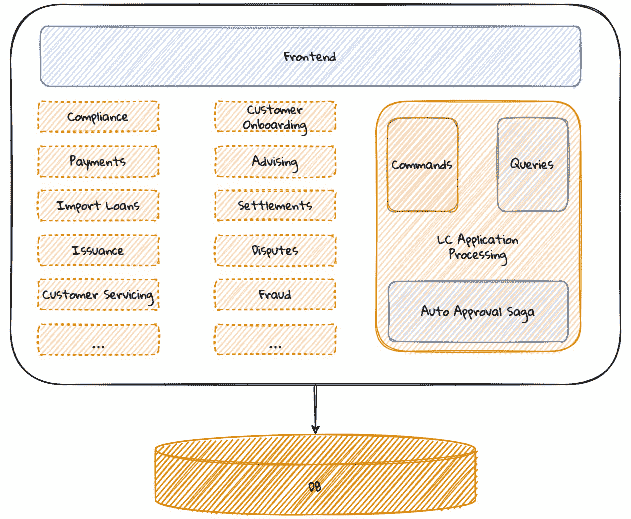

图 10.1 – LC 应用单体当前视图

尽管**LC 应用处理**组件与整个应用程序松散耦合，但我们仍然需要与其他几个团队协调以实现业务价值。这可能会阻碍我们以比生态系统中最慢的贡献者更快的速度进行创新。这是因为所有团队都需要准备好生产环境，才能进行部署。此外，由于各个团队可能在工程成熟度方面处于不同的水平，这可能会进一步加剧。让我们看看一些关于我们如何通过将我们的组件物理分解成明显可部署的工件来实现一定程度的独立性的选项。

# 分解我们的单体

首先也是最重要的，**LC 应用处理**组件在与其他组件交互时仅暴露进程内 API。这包括以下交互：

+   前端

+   发布/消费的事件

+   数据库

为了将 LC 应用程序处理功能提取为其自己的、独立可部署的组件，我们需要支持远程调用接口，而不是我们目前拥有的进程内接口。因此，让我们逐一考察每个远程 API 选项。

# 前端交互的变更

目前，如这里所示，`CommandGateway`用于命令和`QueryGateway`用于查询：

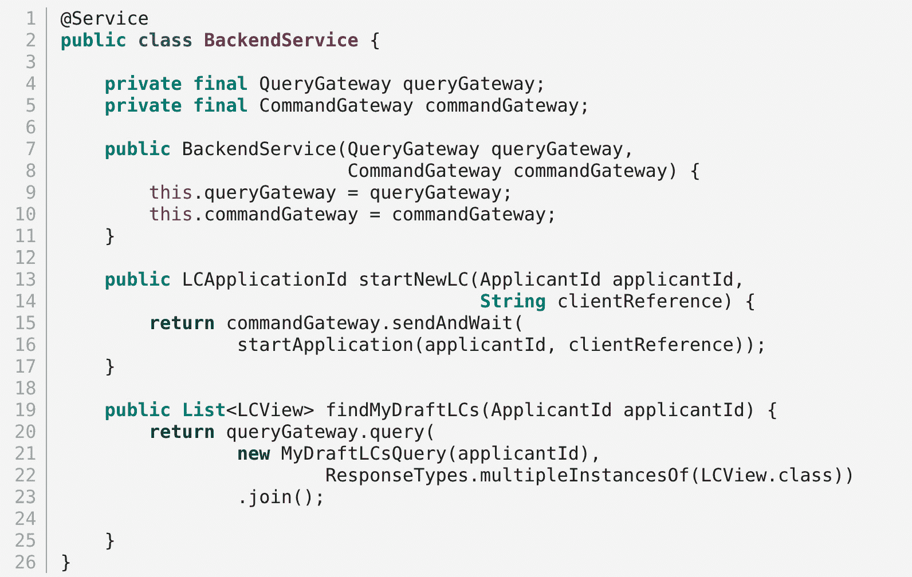

替换这些进程内调用的一个非常简单的方法是引入某种形式的**远程过程调用（RPC**）。现在我们的应用程序看起来类似于以下这样：

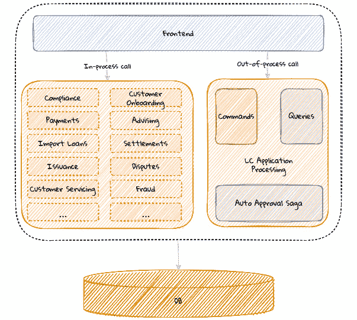

图 10.2 – 向前端引入远程交互

当处理进程内交互时，我们只是在同一进程的范围内调用对象的方法。然而，当我们切换到使用进程外调用时，需要考虑很多因素。如今，在处理远程 API 时，我们有几种流行的选择，包括基于**JSON**的 Web 服务、**GraphQL**、**gRPC**等。虽然可以使用完全定制的格式来促进通信，但领域驱动设计（DDD）倡导者推荐使用**开放主机服务模式**（[`ddd-book.karthiks.in/10-distributing-into-multiple-components.html#_open_host_service_ohs`](https://ddd-book.karthiks.in/10-distributing-into-multiple-components.html#_open_host_service_ohs)），使用我们在*第九章*中介绍发布的语言，即*与外部系统集成*。即使使用开放主机服务风格的通信，也有一些考虑因素，其中一些我们在以下小节中讨论。

## 协议选项

当暴露远程 API 时，我们有几种选择。如今，使用基于 JSON 的 API（通常标记为**表示状态转移**或**REST**）似乎相当流行。然而，这并不是我们唯一的选择。在基于资源的方案中，第一步是确定一个资源（名词），然后作为下一步映射与资源相关的交互（动词）。在基于动作的方案中，重点是执行的动作。可以说，REST 采用基于资源的方案，而**GraphQL**、**gRPC**、**SOAP**等似乎基于动作。让我们以一个 API 为例，我们想要启动一个新的 LC 应用程序。在 RESTful 世界中，这可能看起来像这样：

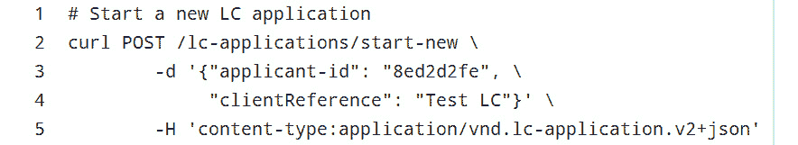

相比之下，使用 GraphQL 实现，这可能看起来像以下这样：

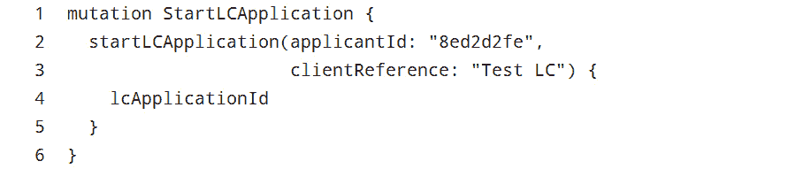

在我们的经验中，使用 REST 设计 API 在尝试映射领域语言时确实会导致一定程度上的稀释——因为首要关注的是资源。纯粹主义者会迅速指出，前面的例子并不符合 REST 原则，因为没有名为`start-new`的资源，我们应该让 URL 仅包含资源的名称（使用`/lc-applications`而不是`/lc-applications/start-new`）。我们的方法是将保持通用语言的准确性置于对技术纯度的教条式遵循之上。

## 传输格式

在这里，我们有两种广泛的选择：**基于文本的**（例如，**JSON**或**XML**）与**二进制**（例如，协议缓冲区，[`developers.google.com/protocol-buffers`](https://developers.google.com/protocol-buffers)，或 Avro，[`avro.apache.org/`](https://avro.apache.org/)))。如果满足了非功能性需求（如性能），我们的首选是使用基于文本的协议作为起点。这是因为它提供了灵活性，不需要任何额外的工具来直观地解释数据（当调试时）。

当设计远程 API 时，我们有选择一个强制执行模式（例如，协议缓冲区或 Avro）或更非正式的格式（例如，纯 JSON）的选项。在这种情况下，为了保持通用语言的准确性，可能需要在更正式的设计和代码审查、文档等方面进行额外的治理。

## 兼容性和版本控制

随着需求的演变，将需要增强接口以反映这些变化。这意味着我们的通用语言也将随着时间的推移而改变，使旧概念变得过时。一般原则是尽可能长时间地保持与消费者的向后兼容性。但这确实意味着必须同时维护旧的和新的概念——导致难以区分哪些是相关的，哪些不是。使用显式的版本控制策略可以在一定程度上帮助管理这种复杂性——新版本可能能够与旧版本断开向后兼容。然而，继续无限期地支持大量不兼容的版本也是不可行的。因此，确保版本控制策略明确地制定弃用和退役协议是很重要的。

## REST API

我们认识到在公开基于 Web 的 API 时，有几种选择，而声称使用 REST 方法似乎在当今相当普遍。REST 是由 Roy Fielding 在其博士论文中提出的。关于构成 REST 的想法一直是争论的焦点，并且可以说，即使在今天，它仍然模糊不清。Leonard Richardson 引入了基于 HTTP 的 REST API 成熟度模型的概念，这在一定程度上有助于提供一些清晰性。该模型描述了 REST 的广泛一致性，分为四个级别，每个级别都比前一个级别更成熟：

0. **Adhoc**：API 设计时没有使用任何可感知的结构。

1.  **Resources**：API 设计围绕一个**事物**进行，这个事物本身就有意义（通常是一个名词）。在这里，可以使用非常小的动词子集（要么是 GET，要么是 POST）来模拟所有操作。

1.  **HTTP 动词**：API 设计时利用一组标准操作来对资源进行操作（例如，GET 用于读取，POST 用于创建，PUT 用于更新，DELETE 用于删除等）。

1.  **HATEOAS**：API 包括超媒体链接，以帮助客户端以自助方式发现我们的 API。

在我们的经验中，大多数声称是 RESTful 的基于 Web 服务的解决方案似乎只停留在第 2 级。REST 的发明者 Roy Fielding 似乎声称**REST API 必须是超文本驱动的**([`roy.gbiv.com/untangled/2008/rest-apis-must-be-hypertext-driven`](https://roy.gbiv.com/untangled/2008/rest-apis-must-be-hypertext-driven))。在我们看来，在 API 中使用超文本控制可以使它们变得自我文档化，从而更明确地促进通用语言的运用。更重要的是，它还指出了在资源生命周期中，在特定时刻可以应用哪些操作。例如，让我们看看一个示例响应，其中列出了所有待处理的 LC 申请：

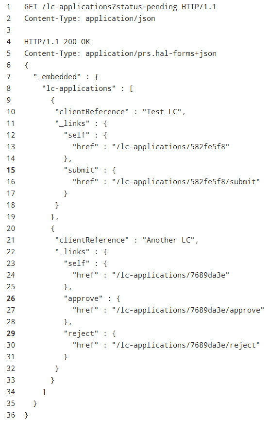

在前面的示例中，列出了两个`lc-applications`。根据 LC 的当前状态，链接提供了一种适当处理 LC 的手段。除了**self**链接外，第一个 LC 申请显示了提交链接，表示它可以被提交，而第二个申请显示了批准和拒绝链接，但没有提交链接。这可能是由于它已经被提交。此外，请注意，响应不需要包含状态属性，这样它们就可以使用这个属性来推断在当前时刻与 LC 申请相关的操作（这是一个**告诉**，**不要询问**原则的例子，[`martinfowler.com/bliki/TellDontAsk.html`](https://martinfowler.com/bliki/TellDontAsk.html))。虽然这可能是一个细微的差别，但我们认为在 DDD 旅程的背景下指出这一点是有价值的。

因此，我们已经讨论了从进程内 API 迁移到进程外 API 时的一些考虑因素。还有许多其他考虑因素，特别是关于非功能性需求（如性能、弹性、错误处理等）。我们将在*第十一章*“分解为更细粒度的组件”中更详细地探讨这些内容。

现在我们已经了解了如何与与前端交互的 API 一起工作，让我们看看我们如何远程处理事件发布和消费*。

## 事件交互的更改

目前，我们的应用程序通过**Axon**框架提供的进程内总线发布和消费领域事件。

我们在处理命令时发布事件：

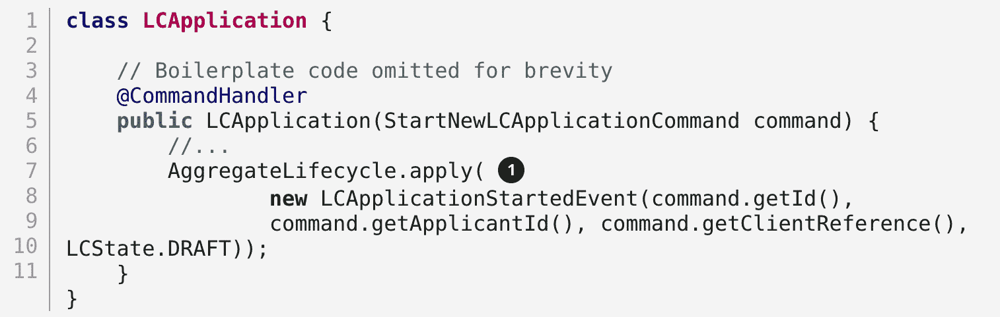

1.  在成功处理命令时发布事件，并消费事件以公开查询 API：

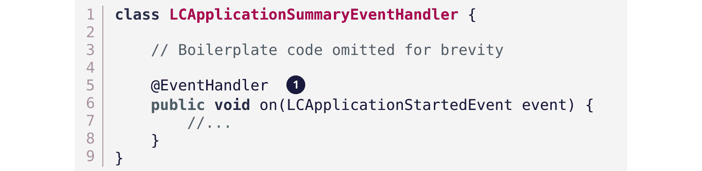

1.  我们使用 Axon 提供的`@EventHandler`注解订阅事件。

为了远程处理事件，我们需要引入一个显式的基础设施组件，即事件总线。常见选项包括消息代理，如**ActiveMQ**和**RabbitMQ**，或者分布式事件流平台，如**Apache Kafka**。应用程序组件可以继续像以前一样发布和消费事件——只是现在，它们将使用进程外调用风格。从逻辑上讲，这使我们的应用程序看起来类似于以下内容：

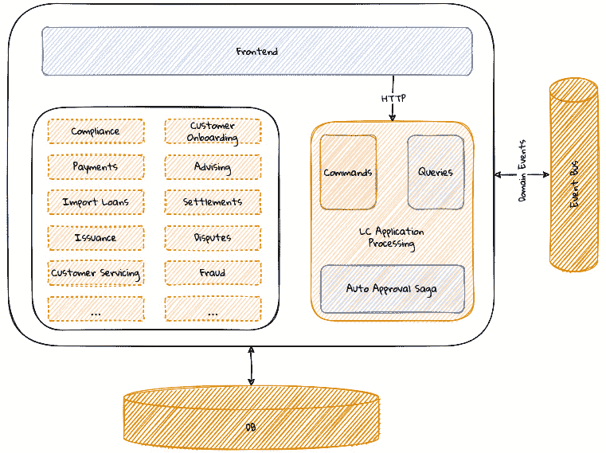

图 10.3 – 引入进程外事件总线

当在单个进程的范围内处理事件时，假设同步处理（在相同线程上事件发布和消费），我们不会遇到当发布者和消费者分布在多个进程之间时才显现的大多数问题。让我们更详细地检查其中的一些。

### 原子性保证

在以前，当发布者通过发布事件处理命令，并且消费者处理它时，事务处理作为一个单一的原子单元发生，如下所示：

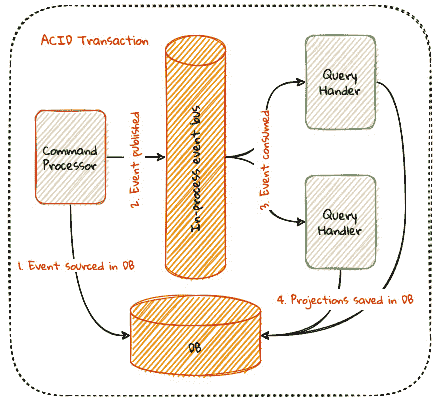

图 10.4 – 单体中的 ACID 事务处理

注意，前面图中所有高亮显示的操作都是作为单个数据库事务的一部分发生的。这使系统能够从端到端保持强一致性。当事件总线分布到其自身进程内工作时，原子性无法得到保证，就像之前那样。前面编号的每个操作都作为一个独立的交易进行。这意味着它们可以独立失败，这可能导致数据不一致。

为了解决这个问题，让我们更详细地查看处理过程的每个步骤，从命令处理开始：

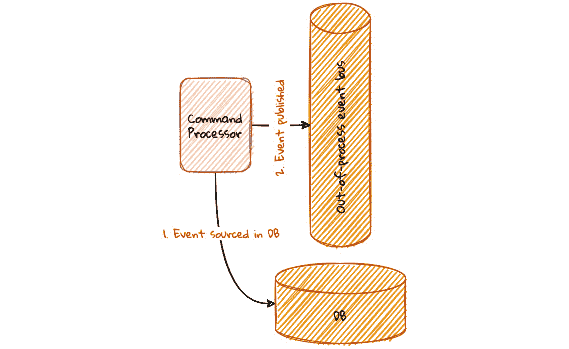

图 10.5 – 命令处理事务语义

让我们考虑这样一种情况：我们成功保存到数据库，但未能发布事件。消费者将不会意识到正在发生的事件，从而导致不一致。另一方面，如果我们发布了事件，但未能将其保存到数据库中，那么命令处理本身就会变得不一致——更不用说查询方现在认为发生了领域事件，而实际上并没有。再次，这导致了不一致。这种**双重写入**问题在分布式事件驱动应用程序中相当常见。如果命令处理必须以万无一失的方式进行，那么保存到数据库和发布到事件总线必须原子性地发生——这两个操作应该同时成功或失败。以下是我们用来解决这个问题的几个解决方案（按复杂度递增）：

+   **不采取行动**：可以说，这种方法实际上并不是一个解决方案；然而，它可能是唯一的一个占位符，直到有更稳健的解决方案。虽然看到这个选项可能会让人困惑，但我们确实看到过事件驱动系统就是这样实现的。我们将其留在这里作为警告，以便团队意识到潜在的风险。

+   **事务同步**：在这种方法中，多个资源管理器以这种方式同步，即任何一个系统的失败都会触发其他系统中已提交事务的清理。值得注意的是，这可能不是万无一失的，因为它可能导致级联故障。

信息

Spring 框架通过`TransactionSynchronization`接口和已弃用的`ChainedTransactionManager`接口提供了对这种行为风格的支持。请参阅框架文档以获取更多详细信息。不言而喻，在没有仔细考虑业务需求的情况下不应使用此接口。

+   **分布式事务**：另一种方法是利用分布式事务。分布式事务是在两个或更多资源管理器（通常，这些是数据库）上执行的一系列数据操作，使用诸如**两阶段提交**（[`martinfowler.com/articles/patterns-of-distributed-systems/two-phase-commit.html`](https://martinfowler.com/articles/patterns-of-distributed-systems/two-phase-commit.html)）等技术。通常，这种功能是通过在底层资源管理器（数据库）上使用悲观锁来实现的，并且在高度并发的环境中可能会带来扩展性的挑战。

+   **事务性输出箱**：前面提到的方法都不是完全万无一失的，因为在数据库和事件总线之间仍然存在一个机会窗口，它们可能会变得不一致（即使在两阶段提交的情况下也是如此）。绕过这个问题的方法之一是完全消除双重写入问题。

在这个解决方案中，命令处理器在本地事务中将其数据库写入，并将预期的事件写入一个*输出队列*表。一个单独的轮询组件轮询输出队列表并将写入事件总线。轮询可能计算密集，并可能导致再次出现双重写入问题，因为轮询器必须跟踪最后写入的事件。这可以通过在消费者端使事件处理幂等来避免，这样处理重复事件就不会引起问题，尤其是在极端高并发和大量场景中。另一种缓解此问题的方法是使用**变更数据捕获**（**CDC**）工具（如**Debezium**，[`debezium.io/`](https://debezium.io/))和 Oracle LogMiner ([`en.wikipedia.org/wiki/OracleLogMiner`](https://en.wikipedia.org/wiki/OracleLogMiner))。大多数现代数据库都附带了一些工具来简化这一过程，它们可能值得探索。一种实现方式是使用**事务性输出队列模式**，如下面的图所示：

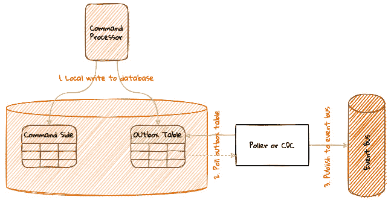

图 10.6 – 事务性输出队列模式

事务性输出队列模式是处理双重写入问题的稳健方法。然而，它也引入了相当多的操作复杂性。在我们之前的一个实现中，我们利用事务同步来确保我们永远不会错过对数据库的写入。此外，我们还确保事件总线通过计算和存储层的冗余以及最重要的是，通过避免在事件总线上的任何业务逻辑来保持高可用性。

### 投递保证

之前，由于所有组件都在单个进程中工作，只要进程保持活跃，向消费者投递事件就有保证。即使事件处理在消费者端失败，检测失败也相对简单，因为异常处理相对直接。

此外，回滚也很简单，因为事件的生产和消费是作为单个数据库事务的一部分发生的。随着 LC 处理应用现在成为一个远程组件，事件投递变得更加具有挑战性。当涉及到消息投递语义时，有三个基本类别：

+   **最多一次投递**：这意味着每条消息可能只投递一次，或者根本不投递。可以说，这种投递方式最容易实现，因为生产者以“发射并遗忘”的方式创建消息。在可以容忍某些消息丢失的环境中，这可能没问题。例如，点击流分析或日志数据可能属于这一类。

+   **至少一次投递**：这意味着每条消息将被投递多次，且不会丢失任何消息。未投递的消息会重试投递——可能无限次。这种投递方式可能在无法容忍丢失消息的情况下是必要的，但可以容忍处理相同消息多次。例如，分析环境可以容忍重复的消息投递或具有重复检测逻辑以丢弃已处理的消息。

+   **恰好一次投递**：这意味着每条消息恰好投递一次，既不会丢失也不会重复。这种消息投递方式非常难以实现，许多解决方案可以通过从消费者那里获得一些帮助来实现“恰好一次”语义，即检测并丢弃重复消息，而生产者坚持至少一次投递语义。

对于领域事件处理，当然，大多数团队都会更喜欢具有“恰好一次”处理语义，因为他们不希望丢失任何这些事件。然而，鉴于保证“恰好一次”语义的实际困难，通过让消费者以幂等的方式处理事件或设计事件以使其更容易检测错误，以实现“恰好一次”处理并不罕见。

例如，考虑一个`MonetaryAmountWithdrawn`事件，它包括`accountId`和`withdrawalAmount`。此事件可以携带一个额外的`currentBalance`属性，以便消费者在处理提款时知道他们是否与生产者不同步。另一种方法是消费者跟踪最后处理的*n*个事件。在处理事件时，消费者可以检查此事件是否已被处理。如果是，他们可以将其检测为重复并简单地丢弃它。再次强调，所有上述方法都会给整个系统增加一层复杂性。尽管有所有这些安全措施，消费者仍然可能发现自己与记录系统（产生事件的命令端）不同步。如果是这样，作为最后的手段，可能有必要使用部分或全部事件重放（[`ddd-book.karthiks.in/10-distributing-into-multiple-components.html#_historic_event_replays`](https://ddd-book.karthiks.in/10-distributing-into-multiple-components.html#_historic_event_replays)），这在*第七章* *实现查询*中已有讨论。

### 排序保证

在我们正在构建的事件驱动系统中，消费者以确定性的顺序接收事件是理想的。不知道顺序或以错误的顺序接收可能会导致结果不准确。让我们考虑一个例子，即`LCApplicationAddressChangedEvent`在*很短的时间内*发生两次。如果这些更改以错误的顺序处理，我们可能会显示错误的地址作为它们的当前地址。这并不一定意味着所有用例都需要对事件进行排序。让我们考虑另一个例子，即当不可能提交给定的 LC 应用程序超过一次时，我们错误地多次收到`LCApplicationSubmittedEvent`。第一次之后的所有此类通知都可以忽略。

作为消费者，了解事件是否有序是很重要的，这样我们才能为乱序事件做出设计考虑。一个默认的做法可能是将乱序事件作为默认选项。根据我们的经验，这往往会使最终的设计更加复杂，尤其是在顺序很重要的情况下。在这里，我们将讨论三种事件排序策略及其对生产者和消费者的含义：

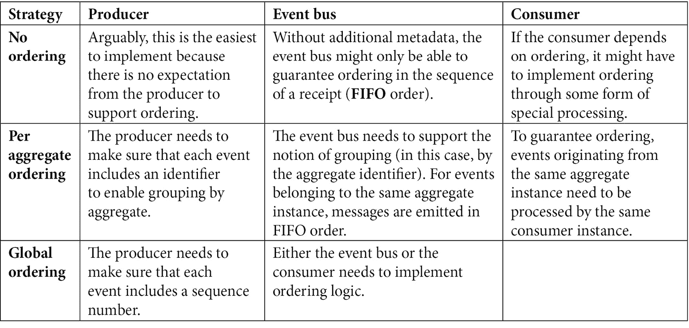

在大多数应用程序中，按聚合排序可能是一个好的起点，并满足大多数业务场景。

### 持久性和持久性保证

当事件发布到事件总线时，理想的情况是目标消费者可以成功处理它。然而，有一些场景可能会对消息处理产生不利影响。让我们检查这些场景中的每一个：

+   **慢速消费者**：消费者无法像生产者发布它们那样快速处理事件。

+   **离线消费者**：在事件发布时，消费者不可用（已关闭）。

+   **失败的消费者**：当消费者尝试处理事件时，会经历错误。

在这些情况中，我们可能会积累未处理的事件积压。因为这些是领域事件，我们需要防止在消费者成功处理之前丢失这些事件。为了成功工作，需要满足以下两个通信特性：

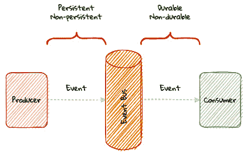

图 10.7 – 持久性与持久性

+   **持久性**：这是**生产者**实例和**事件总线**实例之间的通信风格。

+   **持久性**：这是**事件总线**实例和**消费者**实例之间的通信风格。

首先，消息需要是持久的（即存储在磁盘上），其次，消息订阅（消费者与事件总线之间的关系）需要是持久的（在**事件总线**重启时保持持久）。需要注意的是，事件必须由生产者持久化，以便消费者能够持久地消费它们。

### 处理保证

当查询端组件处理事件时，如上图所示，以下步骤会发生：

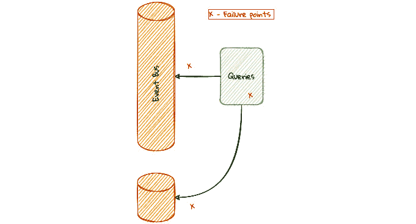

图 10.8 – 事件处理失败场景

1.  事件从**事件总线**实例中被消费（无论是通过推送还是拉取）。

1.  变换逻辑应用于事件的负载。

1.  转换后的负载保存在查询端存储中。

每个这些步骤都可能遇到失败。无论失败的原因是什么，事件应该是持久的（如前所述），以便在问题解决后可以稍后处理。这些错误可以大致分为四个类别：

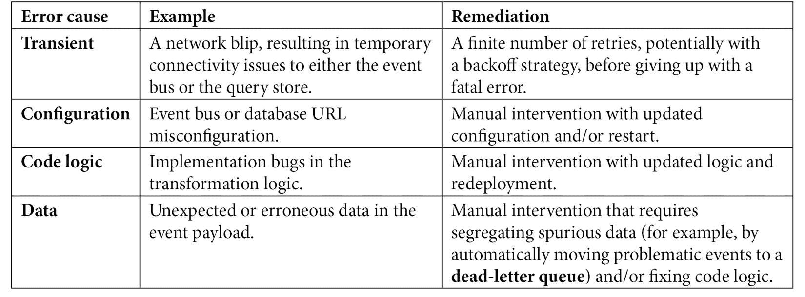

现在我们已经看到了由于引入进程外事件总线而需要做出的变更。完成这些变更后，我们可以实际上将**LC 应用处理**组件提取成其自己的独立部署单元，这将在以下图中类似：

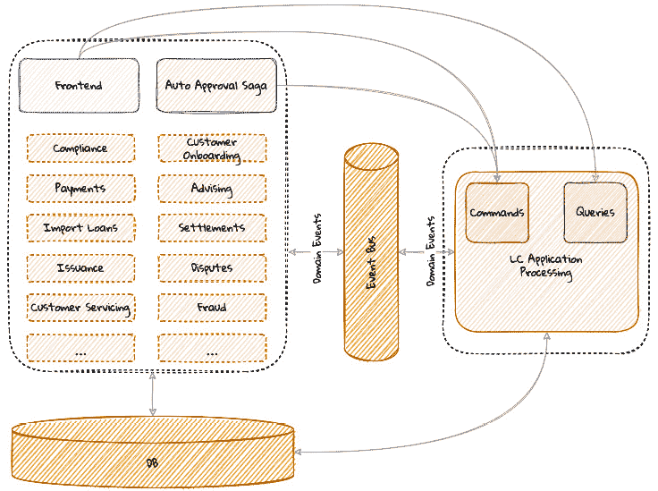

图 10.9 – 独立部署的 LC 应用处理

然而，我们仍在使用公共数据存储来为**LC 应用处理**组件服务。让我们看看将此隔离到其自己的存储中涉及的内容。

# 数据库交互的变更

虽然我们已经将我们的应用程序组件提取到其自己的单元中，但我们仍然在数据库层耦合。如果我们想要真正从单体中实现独立，我们需要打破这种数据库依赖。让我们看看实现这一目标所需的变化。

## 数据迁移

作为开始使用我们自己的数据库的第一步，我们需要开始从命令端事件存储和查询存储（如上图所示）迁移数据：

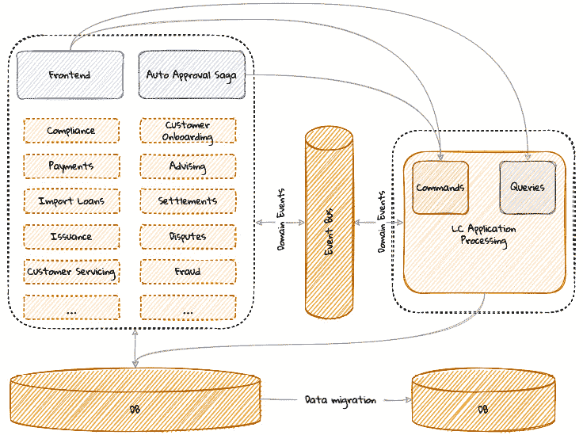

图 10.10 – 数据迁移

在我们的案例中，我们有一个需要迁移出去的命令端事件存储和查询存储（s）。为了从一开始就最小化工作量，可能明智的做法是进行简单的同构迁移，保持源和目标数据库技术相同。在切换之前，其他事项中，以下事项将是至关重要的：

+   **配置**以确保延迟数字在可容忍的范围内

+   **测试**以确保数据已正确迁移

+   通过理解和同意**服务等级协议**（SLA），如**恢复时间目标**（RTO）和**恢复点目标**（RPO）来**最小化停机时间**

## 切换

如果我们已经走到这一步，我们就准备好完成 LC 应用处理从单体剩余部分的迁移。我们解决方案的逻辑架构现在看起来类似于以下图：

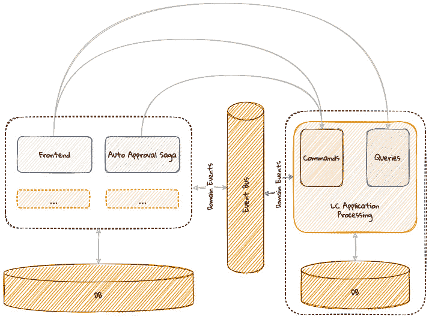

图 10.11 – 独立数据持久化

通过这一步，我们已经成功完成了第一个组件的迁移。还有很多工作要做。可以说，我们的组件已经结构良好，并且与应用程序的其他部分松散耦合。尽管如此，从进程内模型到有界上下文之间的进程外模型转换是一个相当复杂的过程——这一点应该从我们本章所做的工作中显而易见。

# 摘要

在本章中，我们学习了如何从一个现有的单一应用程序中提取一个有界上下文，尽管你可以争论这来自于一个结构相当合理的单一应用程序。我们探讨了从前端、事件交换和数据库等不同交互点分解单一应用程序所涉及到的挑战。你应该了解从进程内事件驱动应用程序到进程外应用程序需要具备的条件。

在下一章中，我们将探讨如何从可能结构不佳的单一应用程序中提取部分内容，可能非常接近令人讨厌的大泥球。

# 参考文献

如需更多信息，请参阅以下资源：

+   [`roy.gbiv.com/untangled/2008/rest-apis-must-be-hypertext-driven`](https://roy.gbiv.com/untangled/2008/rest-apis-must-be-hypertext-driven)

+   [`martinfowler.com/articles/patterns-of-distributed-systems/two-phase-commit.html`](https://martinfowler.com/articles/patterns-of-distributed-systems/two-phase-commit.html)

+   [`debezium.io/`](https://debezium.io/)
