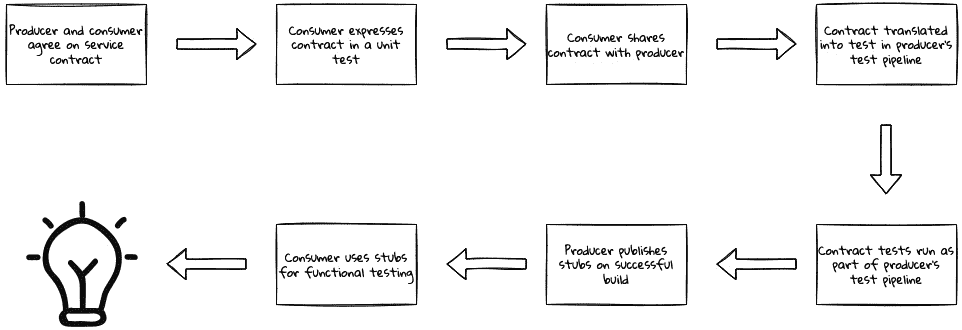
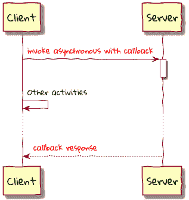
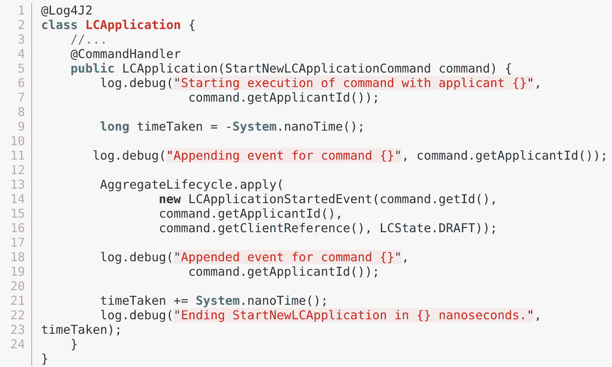
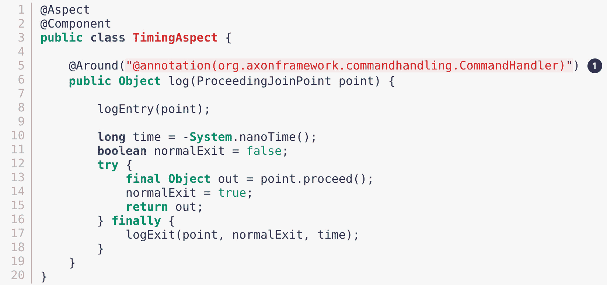
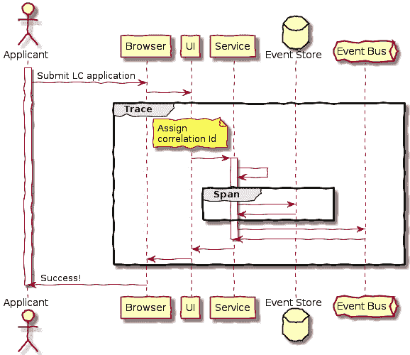

# 第十二章：超越功能需求

有时候我感觉自己被遗忘了。

—— 匿名

虽然系统核心的功能需求可能得到充分满足，但同样重要的是关注系统的操作特性。在本章中，我们将探讨常见的陷阱以及如何克服它们。

在本章中，我们将涵盖以下主题：

+   可观察性

+   一致性

+   性能和规模

+   基于主干线的开发

+   持续测试

+   部署自动化

+   重构

+   调用风格

+   日志记录

+   版本控制

到本章结束时，我们将了解软件生命周期各个方面的各种方面，从跨职能的角度创建一个健壮的解决方案。我们还将讨论需要添加的额外功能，以使我们的解决方案具有性能、可扩展性、容错性，并能够可靠、重复和快速地进行更改。此外，我们还将检查这些更改的影响，以及这些更改可能对我们边界上下文及其边界产生的潜在影响。

让我们开始吧！

# 可观察性

在前面的章节中，我们看到了如何根据边界上下文来分解现有应用程序，以及如何将边界上下文分割成非常细粒度的部分，通常作为物理上不同的组件。任何这些组件的故障都可能导致依赖它们的其他组件出现中断。显然，通过主动和被动监控的组合，及早检测并归因于特定组件，可以理想地防止或至少最小化业务中断。

当谈到监控时，大多数团队似乎会想到与组件相关的**技术运行时指标**（如 CPU 利用率、内存消耗、队列深度、异常计数等）。

为指标提供客观性

为了使其更加正式，我们使用**服务级别目标**（**SLOs**）、**服务级别指标**（**SLIs**）和**服务级别协议**（**SLA**）中的术语来表示以下内容：

+   **SLO**：供应商和客户之间关于特定可衡量指标的协议。例如，99.99%的可用性，对于 99 百分位数的请求，1000 个并发用户的响应时间为 100 毫秒等。

+   **SLA**：一组 SLOs（服务级别目标）。

+   **SLI**：实际数字与 SLO 的对比。例如，您的系统可能有一个 99.95%的可用性 SLI。

## 技术指标

当谈到监控时，大多数团队似乎会想到与组件（如 CPU 利用率、内存消耗、队列深度、异常计数等）相关的技术运行时指标。

然而，能够将一组与业务相关的指标（如过去一小时提交的 LC 申请数量、被拒绝的 LC 申请数量等）和 DevOps 指标（如领先时间、平均恢复时间等）关联起来，同样重要，甚至可能更重要。

## 业务指标

无法将业务服务级别指标（SLIs）与组件关联和监控可能表明该组件过于细粒度。另一方面，如果与单个组件关联的业务 SLIs 太多，而这个组件对众多业务利益相关者群体都感兴趣，那么这可能表明进行更细粒度的分解是合理的。最终，我们设置的监控设备应该能够告诉我们是否违反/满足/超出服务级别目标（SLOs）。

## DevOps 指标

**DevOps 研究和评估**（**DORA**）研究基金会发布了一个在线快速检查工具（[`www.devops-research.com/quickcheck.html`](https://www.devops-research.com/quickcheck.html)）和报告（[`www.devops-research.com/research.html`](https://www.devops-research.com/research.html)），以快速提供有关组织与行业同行相比的情况以及如何向精英地位迈进的信息。虽然讨论建立长期持续改进文化的全部细微差别超出了本书的范围，但我们引用了研究论文中突出的四个关键指标，作为软件交付性能的指标：

+   **领先时间**：从代码提交到代码成功运行在生产环境中的时间有多长？

+   **部署频率**：您的组织多久将代码部署到生产环境或发布给最终用户？

+   **恢复时间**：当发生影响用户的服务事件或缺陷时，通常需要多长时间来恢复服务？

+   **变更失败率**：有多少比例的生产或用户发布变更导致服务降级？

在可观察性方面，存在专注于特定指标而忽略整体森林的风险。为了避免指标被误用，更重要的是，避免得出错误结论的风险，我们建议以下做法：

+   **采取全面视角**：相对于只关注特定区域，在交付生命周期的各个方面投入更多或更少的关注可以大有裨益。如果您能够包括规划、需求收集、开发、构建、测试、部署以及运行生产系统的反馈信息，那么您可能可以合理地得出结论，您有一个表现优异的团队。

+   **采用阶梯式方法**：在识别出改进区域后，你如何为自己设定改进的基础？设定明确、客观、可衡量且可追踪的改进目标对于随后实现它们至关重要（无意中用了双关语）。为了确保持续进行增量改进，阶梯式方法是一种可以采用的技术。阶梯是一种类似于扳手的装置，但它的独特之处在于它只能朝一个方向转动。在此背景下，阶梯式方法包括以下步骤：

    1.  将当前级别设置为最小起始点。

    1.  在相对较短的时间内进行小的增量改进。

    1.  将基线调整到步骤 2 中达到的新水平。

    1.  如果水平下降到基线以下，则采取停止生产线措施，直到基线恢复。

    1.  从步骤 1 重新开始。

逐步改进允许团队在接近一个更好的地方的同时，设定增量里程碑作为中间目标。

采用持续学习和通过逐步改进来代替试图监督和惩罚的态度，可以大大有助于建立一个有效的系统。

# 一致性

在前面的章节中，我们投入了大量精力将我们的系统分解成多个细粒度的独立组件。例如，LC 应用程序是针对命令端组件提交的，而 LC 应用程序的状态则由查询端提供服务。因为这些是不同的组件，所以在两个系统不一致的这段时间内会有时间延迟。因此，在提交 LC 应用程序后立即查询其状态可能会产生过时的响应，直到查询端处理提交事件并更新其内部状态。换句话说，命令端和查询端被认为是*最终一致*的。这是我们与分布式系统合作时需要接受的权衡之一。

埃里克·布赖尔（加州大学伯克利分校计算机科学名誉教授）在所谓的*CAP 定理*中正式化了构建分布式系统所涉及的权衡。该定理假设在发生网络分区的情况下，分布式系统要么高度可用，要么一致，但不能同时两者都是。考虑到三个特性，**一致性**、**可用性**和**分区容错性**，该定理假设在发生网络分区的情况下，分布式系统要么高度可用，要么一致，但不能同时两者都是。这意味着预期高度可用的分布式应用程序将不得不放弃强一致性。

这可能让人看起来这是一个决定性的因素，但事实上，大多数现实世界的业务问题最终都是可以容忍不一致性的。例如，可能存在一个要求订单一旦发货就不能取消的要求。在一个最终一致性的系统中，可能存在一个时间窗口（尽管很小），我们可以允许已发货的订单被取消。为了处理这种场景，我们可能需要增强业务流程来考虑这些不一致性。例如，在发出取消订单的退款之前，我们可能需要验证订单尚未实际发货或已退货。即使在极端情况下，我们可能错误地发放了已发货订单的退款，我们也可以要求客户在到期前退货以避免被收费。如果客户未能退货，我们可能向客户收费或将其作为损失的业务冲销。显然，所有这些都增加了解决方案的复杂性，因为我们可能需要通过一系列补偿行动来考虑边缘情况。如果所有这些复杂性都不被接受，并且强一致性是不可或缺的，那么发货和订单取消功能将必须属于同一个边界上下文。

# 性能和规模

在前面的章节中，我们看到了将功能分解成彼此物理上分离的细粒度组件是如何成为可能，有时甚至是必要的——这需要网络进行协作。让我们假设这种协作是以松散耦合的方式实现的——从逻辑角度来看，这为不同边界上下文的存在提供了合理性。

性能是一个非常重要的 SLO，通常与大多数应用程序相关联。当谈到性能时，理解基本术语至关重要。这最好通过以下示例来说明：

![Figure 12.1 – The elements of network performance]

![img/B16716_Figure_12.1.jpg]

图 12.1 – 网络性能的要素

如此所示，以下术语在性能的背景下是相关的：

+   **延迟**：网络引入的延迟（A + B）

+   **响应时间**：系统响应用户所需的总时间（A + B + C）

+   **带宽**：网络的最高容量（D）

+   **吞吐量**：在给定时间内处理的数据量

在两个组件之间引入网络会在网络延迟和带宽方面引入约束。即使服务器上的处理时间理论上减少到零，延迟和带宽约束也无法避免。随着网络跳数的增加，这个问题只会变得更糟。这意味着网络应用程序无法提供与未联网的同类应用程序相同的性能水平。

需要扩展以支持更多的请求可能会使问题更加复杂。鉴于过去十年左右摩尔定律的显著放缓，继续通过使用越来越强大的机器来扩展规模变得越来越不可行。这意味着超过某个点，通过使用多个实例进行扩展，从而（重新）引入对网络的依赖，是不可避免的。

这使得很明显，性能和扩展要求可以对我们选择如何分配我们的组件产生重大影响。在尝试分配不同的组件之前，对性能和扩展 SLO 有清晰的理解是一个必要的先决条件。另一方面，如果你已经处于这样一种情况，即你已经有分布式组件，但它们没有达到性能和扩展 SLO，一个选择是将它们重新聚合在一起。如果这不可行，那么值得接受替代的客户体验，以及非阻塞的事件驱动架构风格，以创造更好的性能感知。

# 基于主干线的开发

DDD 的发明者埃里克·埃文斯（Eric Evans）讨论了如何**持续集成**（**CI**）帮助在有限范围内保持领域模型的神圣性。当多个人在同一个有限范围内工作时，它往往会变得碎片化。显然，团队越大，这种问题发生的可能性就越高。即使是三四个人的小团队也可能遇到严重的问题。我们也看到，超过某个点，如果我们试图将系统分解成极其细粒度的有限范围，可能会出现收益递减的情况。

这使得定期合并/集成所有代码和其他实现工件的过程变得非常重要，借助**自动化测试**来标记这种碎片化。此外，这还允许团队不懈地应用通用语言，每次都进一步细化领域模型以更准确地表示问题。换句话说，实践持续集成是至关重要的。许多团队使用 CI 服务器来运行测试，但往往推迟集成，直到非常晚才使用过多的长期分支（Gitflow 推广；[`www.atlassian.com/git/tutorials/comparing-workflows/gitflow-workflow`](https://www.atlassian.com/git/tutorials/comparing-workflows/gitflow-workflow)和合并请求——实践一种被称为 CI 剧院的反模式[`www.gocd.org/2017/05/16/its-not-CI-its-CI-theatre.html`](https://www.gocd.org/2017/05/16/its-not-CI-its-CI-theatre.html))。

基于分支的开发的一个替代方案是*基于主干分支的开发*，其中每个开发者以增量批次工作，并将这些工作至少每天（有时是几次）合并到主分支（也称为主干分支）。DORA 团队发布了一项研究([`services.google.com/fh/files/misc/state-of-devops-2021.pdf#page=27`](https://services.google.com/fh/files/misc/state-of-devops-2021.pdf#page=27))，该研究显示，精英团队通过实践基于主干分支的开发来最大化他们 CI 实践的有效性，进而扩展到他们持续增强领域模型和满足不断变化业务需求的能力。

在一个理想的世界里，对主干分支的每一次提交都应构成已完成、可用于生产的作品。但某些工作需要更长的时间来完成也是相当正常的。这可能会让人觉得有必要放弃基于主干分支的开发，转而采用基于分支的开发。然而，没有必要为了应对这种可能性而妥协持续集成的流程。保罗·汉曼特([`paulhammant.com/`](https://paulhammant.com/))讨论了这种称为*抽象分支*的技术，其中未完成的工作的影响被隐藏在一个抽象层之后。这个抽象层通常是通过使新的功能对最终用户不可见来实现的，或者在更复杂的情况下，使用功能标志([`martinfowler.com/articles/feature-toggles.html`](https://martinfowler.com/articles/feature-toggles.html))。

# 持续测试

在一个理想的世界里，持续集成将使我们能够采用持续测试，这为我们提供了持续和早期的反馈。这是至关重要的，因为我们的边界上下文和由此产生的领域模型处于不断演化的状态。如果没有稳定测试套件的基础，维持可靠的过程会变得非常困难。测试金字塔、测试奖杯、蜂巢等方法被认为是实施合理的持续测试策略的合理方式。所有这些方法都是基于这样一个前提：大量的低成本（计算和认知）单元测试构成了策略的基础，随着我们沿着链条前进，其他类别（服务、UI、手动等）的测试数量逐渐减少。

然而，我们处在一个由相互通信的细粒度组件组成的新世界中。因此，有必要以稳健的方式验证外围的交互。仅仅依赖于模拟和存根的单元测试可能不足以满足需求，因为合作者的行为可能会意外地改变。这可能导致单元测试运行成功，但整体功能可能已损坏。这可能导致团队对单元测试的整体实践失去信心，并转而使用更多端到端的功能测试。然而，这些测试风格可能极其昂贵([`www.youtube.com/watch?v=VDfX44fZoMc`](https://www.youtube.com/watch?v=VDfX44fZoMc))，尤其是在我们试图自动化它们的时候。因此，大多数团队忽略了大多数自动化测试方法的结果，几乎完全依赖于手动测试来验证除最简单功能之外的所有内容。

任何手动测试都需要在有意义测试开始之前，大多数情况下是所有功能都准备好。此外，它耗时、易出错，通常不可重复。因此，几乎所有测试只能在非常接近结束时进行，使得持续测试的想法成为空想。尽管存在所有这些局限性，团队仍然依赖于手动测试，因为它似乎比其自动化的对应物提供了更多的心理安全感。

在一个理想的世界里，我们需要的是单元测试的速度和手动测试提供的信心。我们将探讨几种具体的测试形式，这些形式可以帮助恢复平衡。

## 合同测试

单元测试的局限性在于，模拟/存根中做出的假设可能无效或随着生产者对合同的更改而变得过时。另一方面，手动测试由于速度慢和浪费而受到困扰。合同测试可以通过提供一个双方都可以依赖的、可执行的合同来提供一种快乐的中庸之道，从而弥合这一差距，该合同在功能变化/发展时双方都可以依赖。从高层次来看，这就像下面描述的那样工作：

图 12.2 – 合同测试：高级流程

这使得消费者和生产者能够协作工作，并在周期早期就获得反馈。对于消费者来说，他们有机会参与与生产者分享他们的期望，并使用经过版本控制的生产者批准的存根进行自己的测试，而无需依赖于生产者的真实系统。同样，生产者也能更深入地了解他们的服务是如何被消费的，这使他们能够自由地做出更大胆的更改，只要它们保持兼容。

测试驱动设计

领域驱动设计的本质在于尽可能彻底地理解问题，以便正确地解决问题。测试优先设计通过减少我们构建的解决方案导致的偏差风险，使得更好地理解问题成为可能。此外，它还促进了这些要求的自动化验证，这使得它们可以作为回归测试的有效辅助工具。正因为如此，我们强烈支持这一实践，并鼓励您考虑采用 TDD 作为核心实践，以增强您在 DDD 中的有效性。

## 突变测试

许多团队编写各种测试以确保他们构建的是高质量的解决方案。测试覆盖率通常用作评估测试质量的定量指标。然而，测试覆盖率是建立测试质量的一个必要但不充分的条件。低测试覆盖率几乎肯定意味着存在测试质量问题，而高覆盖率并不一定意味着更好的测试。在一个理想的世界里，即使是在生产代码中（由于业务需求的变化）的单行更改，如果没有更改测试代码，也会导致测试失败。如果可以保证代码库中的每个更改都能保证这一点，那么可能可以安全地依赖这样的测试套件。

突变测试是一种实践，它会自动在生产代码中插入小的错误（称为*突变*），然后重新运行现有的测试套件以确定测试的质量。如果你的测试失败了，突变就会被杀死。而如果你的测试通过了，突变就会存活。被杀死的突变越多，你的测试就越有效。

例如，它可能应用诸如反转条件、替换关系运算符、从方法返回 null 等突变，然后你可以检查这些突变对现有测试的影响。如果尽管这些突变没有测试失败，这些测试可能没有你希望的那样有帮助。这使我们能够更客观地得出关于测试质量的结论。鉴于它是通过突变代码来工作的，因此计算密集，可能需要很长时间才能运行。如果你采用测试优先设计并且有一套快速的单元测试，突变测试可以是一个很好的补充，有助于在开发周期早期发现遗漏的需求和/或测试用例。从这个角度来看，我们认为它是增强团队中 DDD 采用的一个无价工具。例如，PITest ([`pitest.org/`](https://pitest.org/)) 是在 Java 应用程序中执行突变测试的一个很好的工具。

## 混沌测试

如我们之前所见，突变测试可以帮助指出应用程序功能方面的漏洞。混沌测试在帮助识别由对网络和基础设施的依赖引起的非功能性要求不足方面发挥着类似的作用。它通过使用由亚马逊、Netflix 等公司开创的大规模分布式、基于云的架构而开始流行。Netflix 最初发布了一个名为 Chaos Monkey 的工具([`netflix.github.io/chaosmonkey/`](https://netflix.github.io/chaosmonkey/))，该工具在生产环境中随机终止实例(!)以确保工程师实现能够抵御失败的服务。随后，他们发布了一系列相关的工具，统称为 Simian Army（现已停用），以测试各种非功能性方面，如延迟、安全合规性、未使用资源等。

当 Netflix 在生产环境中执行这种测试风格时，如果我们一开始就在较低的环境中采用这些实践，我们所有人都能从中受益匪浅。从战略角度来看，混沌测试可以提供关于组件之间耦合程度的反馈，以及这些组件的边界是否适当。例如，如果你依赖的组件出现故障或遇到问题，这也会让你受到影响吗？如果是这样，有没有缓解这种影响的方法？它还可以提供关于你的监控和警报系统的反馈。从战术角度来看，它可以提供关于正在使用的组件间通信调用风格的不足之处。

在本节中，我们选择突出显示契约测试、突变测试和混沌测试，因为我们认为它们是领域驱动设计应用中的颠覆性变革。当团队在制定全面的测试策略时，将这些方法视为其他测试方法的补充将受益匪浅。

# 部署自动化

应用领域驱动设计的目的是创建一个松散耦合的组件生态系统——这样每个组件都可以独立于彼此进化。这包括这些组件如何部署到生产环境中。在较高层次上，我们至少有三种部署风格：

+   **单进程单体**：应用的大部分内容作为一个单一单元部署，其中包含在部署中包含的所有组件都在单个进程中运行

+   **分布式单体**：应用被分割成多个组件，每个组件在自己的进程和/或主机上运行，但作为一个单一单元部署，或需要组件及其所有者之间的大量协调和紧密耦合

+   **独立组件**：应用被分割成多个组件，每个组件在自己的进程和/或主机上运行，独立于彼此部署，并且组件所有者之间需要最小化到没有协调

我们还有许多可以采用的部署策略。我们按复杂性和丰富程度递增的顺序列出了一些更受欢迎的：

+   **基本**: 这可能是最古老的部署方式，其中新版本的应用程序替换旧版本，通常伴随着一定程度的停机时间。回滚通常意味着重新部署之前运行版本，这同样会带来一定程度的停机时间。这种部署策略对于可以接受一定停机时间的应用程序来说相当常见。这可能包括非业务关键应用程序和/或第三方包，在这些情况下，我们没有发言权来决定这些应用程序如何管理它们的部署。在某些单体架构的情况下，这可能是唯一可行的选项，因为整个系统的复杂性很高。这种部署方式通常开始时相当简单且易于理解，可能适用于非关键应用程序。另一方面，它要求部署和发布在一个紧密耦合的步骤中完成，可能涉及一定程度的停机时间。

+   **蓝绿部署**: 一种利用两个相同环境（“蓝”环境和“绿”环境）的部署策略，一个代表当前生产环境，另一个代表新版本。当前版本继续服务流量，而测试和验收在新版本上进行，不会向最终用户暴露。一旦测试活动被认为成功完成，用户流量就会切换到新版本。值得注意的是，在任何给定时间，实时用户流量只会被导向一个环境。这种部署方式可以实现（几乎）零停机时间的部署，并允许部署和发布过程解耦。回滚更容易，因为它仅仅意味着将流量重定向到旧版本。另一方面，它至少在部署期间需要双倍容量。这可能会使单体应用程序的成本变得过高。

+   **滚动部署**: 一种策略，其中当前版本实例的小部分逐渐被新版本实例替换。旧版本和新版本软件将继续并行运行，直到所有旧实例都被新实例替换。在简单情况下，回滚通常意味着用旧版本实例替换新版本实例。这种部署方式也实现了零停机时间的部署，同时允许与真实用户并行测试新旧版本。滚动部署可以通过中止新版本实例的引入并重新引入旧版本来使回滚相对容易，从而可以减少不良发布的“影响范围”。与蓝绿部署不同，这里的部署和发布不能解耦。部署意味着系统被发布（至少对于用户子集）。

+   **金丝雀部署**：这是一种滚动部署的变体，流量以受控和分阶段的方式路由到新实例，通常是一个递增的比例的请求量（例如，2% → 25% → 75% → 100%的用户）。这种部署风格与滚动部署相比，能够更精细地控制发布范围。

+   **A/B 部署**：这是一种金丝雀部署的变体，其中多个版本（带有一个或多个变体）的新功能可以与当前版本同时作为“实验”运行。此外，这些变体可以针对特定的用户组。这允许同时测试超过两个组合，并使用真实用户进行测试。

当与单体应用一起工作时，团队通常被迫限制自己仅使用基本部署或最多蓝绿部署，因为采用更复杂的部署策略的成本和复杂性要高得多。另一方面，分布式单体使这个问题变得更加复杂，因为它现在需要协调物理上分散的组件和团队。只要我们能够在组件粒度和耦合之间保持平衡，我们就应该能够支持各种高级部署策略。

在今天这个现代生态系统中，为了在竞争中提供新功能和更快地创新，我们需要以最小的风险和业务中断来支持更复杂的部署形式。如果支持灵活的部署策略证明过于困难，那么很可能需要重新审视你的上下文边界。

# 重构

在一段时间内，将需要重新调整上下文边界、领域事件、API 等等。通常，与第一次不完美工作相关的事情和需要在组件间规模上进行重构的需要会带来一种耻辱感。然而，这可能是由于我们无法控制的多重原因所必需的，包括竞争对手生态系统变化、不断演变/误解的需求、无法满足非功能性要求、组织和个人责任的变化等等。因此，重构是软件团队需要接受的核心学科，作为一项一级实践。

注意

我们在本章中仅涵盖重构的战略（组件间）方面。关于重构的战术（组件内）方面有许多优秀的作品，例如马丁·福勒的《重构》（[`refactoring.com/`](https://refactoring.com/)）一书和迈克尔·费瑟斯的《与遗留代码高效工作》，以及其他作品。

从战略角度来看，这可能意味着必须将现有的单体分解成更细粒度的边界上下文，或者将细粒度的边界上下文合并成更粗粒度的上下文。让我们逐一探讨这些内容。

## 打破现有的单体

在前面的章节（第十章和第十一章）中，我们探讨了如何将现有的单体拆分成更细粒度的组件。然而，可以说单体一开始的结构相对较好。许多团队可能没有这么幸运。在这种情况下，以下是一些可能需要满足的先决条件：

+   **执行战术重构**：这将帮助你更好地理解现有系统。为此，从一个健身函数集([`en.wikipedia.org/wiki/Fitness_function`](https://en.wikipedia.org/wiki/Fitness_function))和一个黑盒功能测试集开始，执行重构，然后用运行速度更快的单元测试替换功能测试。最后，使用健身函数来评估这项工作的成功程度。重复此过程，直到达到尝试更复杂重构的舒适度。

图 12.3 – 持续改进循环

+   **引入领域事件**：识别软件缝隙([`wiki.c2.com/?SoftwareSeam`](http://wiki.c2.com/?SoftwareSeam))并沿着这些缝隙发布领域事件。使用领域事件来开始解耦生产者和消费者。

+   **选择低垂的组件**：如果可能的话，一开始选择具有低输入耦合和低到中等复杂性的区域。这将使你在尝试更复杂的组件之前，对这些技术的应用有更牢固的把握。请参阅*第十章*《开始分解之旅》和*第十一章*《分解为更细粒度的组件》以了解如何进行下一步。

## 合并到粗粒度边界上下文

将两个不同的边界上下文合并可能比拆解现有的一个要简单一些。然而，有几个细微之处值得注意，顺序如下：

+   **通用语言的统一**：在*第九章*《与外部系统集成》中，我们探讨了各种边界上下文之间相互集成的多种方式。如果这些边界上下文之间的关系是对称的，那么可能需要做的工作会少一些。这是因为，在对称关系中，一开始很可能存在很多协同效应。然而，如果关系是不对称的，例如，通过生产侧的开放主机服务和消费侧的反腐败层，这意味着可能存在两种不同的通用语言和可能不同的领域模型。为了达到适用于新合并的边界上下文的通用语言，需要仔细思考。

+   **调整内部领域模型**：采用通用通用语言的主要意义在于，在刚刚合并的边界上下文中使用一个通用的领域模型。这意味着聚合、实体和值对象需要统一，这可能会要求在持久化层进行更改。如果存在仅在组件之间发布和消费的领域事件，那么这些领域事件可能是退休的候选者。在这个阶段，对任何公共接口进行更改可能并不明智——特别是那些使用开放主机服务（例如，公共 HTTP API 和其他领域事件）公开的接口。

+   **调整公共 API 设计**：作为最后一步，重构冗余和/或低效的公共接口，以完成练习并获得预期的收益。

有必要指出，没有一套坚实的工程实践作为坚实基础，这种持续改进的风格可能极具挑战性，特别是我们在本节中讨论的测试和部署自动化实践。

# 调用风格

当将运行在不同进程中的两个边界上下文集成时，有两种方式来完成交互：同步和异步。

## 同步调用

客户端会阻塞，直到服务器提供响应。实现可以选择等待一定时间，以便在超时之前完成被调用的操作。这种交互的一个例子是，像这样对一个启动新 LC 应用的 HTTP 调用进行阻塞：

图 12.4 – 同步调用

当调用成功返回时，客户端可以确信他们创建新 LC 应用的请求已经成功。如果服务器响应缓慢，可能会导致性能瓶颈，尤其是在高规模场景中。为了应对这种情况，客户端和服务器可以就那个交互的响应时间 SLO 达成一致。客户端可以选择等待服务器响应，等待约定的时间后，客户端超时请求并认为它失败。鉴于客户端在服务器响应上阻塞，它在等待期间无法做其他任何事情，尽管它可能拥有做其他事情的资源。为了处理这种情况，客户端可以采用异步调用。

## 异步调用

在异步调用风格中，客户端以使其能够执行其他活动的方式与服务器交互。有几种方法可以做到这一点：

+   **触发并忘记**：客户端向服务器发起请求，但不等待服务器的响应，也不关心结果。这种交互风格可能适用于*低优先级*活动，如向远程服务器记录日志、推送通知等。

图 12.5 – 火速遗忘

+   **延迟响应**：在某些（很多？）情况下，客户端可能需要知道他们之前发出的请求的结果。如果服务器支持，客户端可以提交一个请求，只需等待确认请求已被接收，并附带要跟踪的资源标识符，然后轮询服务器以跟踪其原始请求的状态，如下所示：

图 12.6 – 使用轮询的延迟响应

+   **带有回调的请求**：当客户端轮询响应时，服务器可能还没有完成对原始请求的处理。这意味着客户端可能需要多次轮询服务器才能了解请求的状态，这可能是浪费的。一种替代方案是，当服务器完成处理时，通过调用客户端在发出请求时提供的回调函数，将响应推回客户端。

图 12.7 – 使用回调的延迟响应

由于这些交互发生在可能不可靠的网络中，客户端和服务器需要采用各种技术来实现某种程度的可靠性。例如，客户端可能需要实现超时、重试、补偿事务、客户端负载均衡等功能的支持。同样，服务器可能需要通过使用速率限制器、断路器、防护舱、回退、健康端点等技术来保护自己免受错误客户端的影响。

注意

对这里提到的具体技术进行详细阐述超出了本书的范围。像《Release It》和《Mastering Non-Functional Requirements》这样的书籍对这些模式进行了更深入的探讨。

在很多情况下，通常需要结合使用前面提到的几种技术来提供一种弹性解决方案。正如我们在日志记录部分讨论的那样，将这些关注点与核心业务逻辑混合可能会模糊问题的原始意图。为了避免这种情况，建议将这些模式应用于核心业务逻辑之外。也可能明智地考虑使用 Resilience4j ([`resilience4j.readme.io/`](https://resilience4j.readme.io/)) 或 Sentinel ([`github.com/alibaba/Sentinel`](https://github.com/alibaba/Sentinel)) 等库。

# 日志记录

应用日志记录是诊断运行代码问题时最基本的支持之一。在许多代码库中，日志记录往往是在遇到问题后才被考虑的，开发者只在遇到问题时才添加日志语句。这导致日志语句几乎随机地散布在整个代码库中。以下是一个简单的示例，展示了命令处理器中的代码，用于记录其执行时间等：

毫无疑问，这段日志代码在调试问题时非常有价值。然而，当我们查看前面的代码时，日志代码似乎占据了整个方法，掩盖了领域逻辑。这可能会感觉无害，但当这种做法在多个地方进行时，它可能会变得相当重复、繁琐且容易出错——影响可读性。实际上，我们见过看似无害的日志语句引入了性能问题（例如，在具有昂贵参数评估的循环中）或甚至错误（例如，在尝试评估参数时可怕的`NullPointerException`）。在我们看来，将日志视为一等公民，并给予它与核心领域逻辑相同的严谨性非常重要。这意味着它需要遵守我们与良好设计的生产代码相关联的所有良好实践。

## 分离日志代码

理想情况下，我们将能够在可读性和可调试性之间保持平衡。如果我们能够分离这两个关注点，就可以实现这一点。分离这种横切逻辑的一种方法是通过使用面向切面编程（了解更多关于 AOP 的信息，请参阅[`www.eclipse.org/aspectj/`](https://www.eclipse.org/aspectj/)和[`docs.spring.io/spring-framework/docs/current/reference/html/core.html#aop`](https://docs.spring.io/spring-framework/docs/current/reference/html/core.html#aop)）如下所示：

注意

一个切入点定义了所有使用`@CommandHandler`注解的方法的`around`方面。在这个例子中，我们使用编译时织入，而不是通过 Spring 框架提供的运行时织入，来使用 AspectJ 注入执行时间逻辑。你可以在本文中找到更多关于使用特定织入技术的优缺点的详细信息（[`www.baeldung.com/spring-aop-vs-aspectj`](https://www.baeldung.com/spring-aop-vs-aspectj)）。

在这里所示的风格中，我们通过使用面向切面编程将日志代码与应用程序代码分离。在示例中，日志代码适用于所有使用`@CommandHandler`注解的方法。这有一个优点，即所有这样的方法现在都将产生一致的进入/退出日志语句。另一方面，如果需要对特定命令处理器进行额外的日志记录，仍然需要在那个方法的主体内完成。如果你发现自己需要大量临时的日志语句，除了简单的进入/退出日志之外，这可能是一个信号，表明你的方法可能需要重构。

## 处理敏感数据

通常情况下，在添加日志代码时，包括尽可能多的上下文信息是有帮助的。在某些领域，如医疗保健或金融，可能存在法律/监管要求限制对敏感信息的访问，这可能会带来挑战。例如，在 LC 申请过程中，我们可能需要使用申请人的政府颁发的标识符（例如`toString`方法）对申请人的信用进行检查，以确保在有限上下文中满足业务需求的完整性。

虽然掩码可能在大多数用例中足够使用，但它存在一个限制，即即使是有权限的用户也无法访问原始信息。如果这是一个要求，可能需要利用**令牌化**（用一个称为**令牌**的非敏感占位符值替换敏感信息的过程）解决方案。这可以在有限上下文中不受限制地记录令牌化值，并且通常可以提供更高的安全性。但这可能意味着必须处理另一个有限上下文的额外复杂性，以提供令牌化值和授权控制，当需要访问真实值时。

## 日志格式

到目前为止，我们只关注了日志消息。然而，日志不仅仅是这些。通常还会包括其他信息，如发生时间、日志级别等，以帮助快速故障排除。例如，Spring Boot 默认使用以下日志格式：

`2022-06-05 10:57:51.253 INFO 45469 --- [ost-startStop-1] c.p.lc.app.domain.LCApplication : Root WebApplicationContext: Ending StartNewLCApplication in 1200495 ns.`

虽然这是一个很好的默认设置，但它仍然主要是非结构化文本，为了提高可读性而丢失了一些信息（例如，记录器名称被缩写）。虽然日志主要是供人类消费的，但大量日志可能会妨碍找到相关的日志。因此，生成既适合机器又适合人类阅读的日志非常重要，这样它们就可以轻松地进行索引、搜索、过滤等操作。换句话说，使用如以下所示的结构化日志格式可以大大有助于满足机器和人类可读性的目标：

利用结构化日志格式可以将日志的使用从仅仅是一个调试工具提升为另一个丰富且廉价的业务洞察来源。

注意

虽然选择自定义日志格式可能很有吸引力，但我们强烈建议选择与流行的格式兼容的格式，例如 Apache 的**通用日志格式**（**CLF**）（[`httpd.apache.org/docs/current/logs.html#common`](https://httpd.apache.org/docs/current/logs.html#common)）或 Logstash 的默认格式（[`github.com/logfellow/logstash-logback-encoder#standard-fields`](https://github.com/logfellow/logstash-logback-encoder#standard-fields)）。

## 日志聚合

事实是我们的应用程序被分解成多个组件，每个组件通常运行多个实例，这意味着这可能会产生大量的日志，这些日志彼此之间是断开的。为了能够有意义地处理这些日志，我们需要按时间顺序聚合和排序它们。考虑使用正式的日志聚合解决方案可能是值得的。正如之前讨论的那样，使用结构化日志解决方案在处理来自多个系统的日志时可以大有裨益。

注意

关于日志最佳实践的更多信息，请参阅 OWASP 的这个日志备忘单（[`github.com/OWASP/CheatSheetSeries/blob/master/cheatsheets/Logging_Cheat_Sheet.md`](https://github.com/OWASP/CheatSheetSeries/blob/master/cheatsheets/Logging_Cheat_Sheet.md)）以及关于日志艺术的这篇文章（[`www.codeproject.com/Articles/42354/The-Art-of-Logging`](https://www.codeproject.com/Articles/42354/The-Art-of-Logging)）。

在一个地方聚合日志允许我们查看来自多个应用程序的诊断信息。然而，在流程进行中，我们仍然需要关联这些信息。分布式追踪解决方案可以帮助我们做到这一点。让我们看看下一个例子。

## 追踪

想象一个场景，申请者通过用户界面提交了 LC 申请。如果一切顺利，在几毫秒内，申请者应该会收到成功提交的通知，如下所示：

图 12.8 – 提交 LC 应用流程

即使在这个简单的例子中，也有几个组件参与，每个组件都会产生自己的日志。当工程师试图诊断问题时，需要关联来自多个组件的日志条目。为了实现这一点，需要在交互开始时尽可能早地引入一个关联标识符，并将其传播到组件边界之外。此外，每个组件中的日志条目在产生日志时需要携带这个关联标识符。这样做将允许我们通过关联标识符作为统一线索来查看跨越进程边界的日志条目。从技术角度来说，整个流程被称为*追踪*，流程中的每个部分被称为*跨度*。在日志条目上添加此类信息的这个过程被称为*分布式追踪*。

如此明显，用户流程可能——并且通常确实——跨越多个边界上下文。为了有效地工作，边界上下文需要就统一传播跟踪和跨度标识符达成一致。例如，Spring Cloud Sleuth 和 OpenTracing 等工具可以帮助简化使用不同技术栈的团队的实施。

基本上，分布式跟踪可视化可以帮助诊断性能瓶颈和组件之间的嘈杂度。但可能不那么明显的是，它可以在获取对组件在端到端用户旅程中如何交互的更深入理解方面提供洞察。在许多方面，这可以被视为您系统的一个近实时上下文映射可视化，以及组件之间是如何相互耦合的。从领域驱动设计（DDD）的角度来看，这可以在必要时提供对重新评估边界上下文边界的更深入见解。因此，我们强烈建议从一开始就轻松设置和配置分布式跟踪设备，以便无痛苦地完成。

# 版本化

当我们与单体应用程序一起工作时，大部分内容都捆绑成一个单一的统一单元。这意味着除了第三方依赖项之外，我们不必担心显式版本化我们的组件。然而，当我们开始将组件分解成它们各自的部署单元时，我们需要仔细注意我们的解决方案的组件、API 和数据元素是如何进行版本化的。让我们逐一来看。

## 组件

当我们创建组件时，有两个广泛的类别——那些**独立部署**的组件和那些嵌入在其他组件中的组件。对于可部署组件，需要使用显式版本来标识组件的具体实例，即使只是为了部署目的。对于嵌入式组件，同样需要使用显式版本，因为其他组件需要理解它们依赖于哪个实例。换句话说，*所有组件*都需要有一个版本来唯一标识它们。

因此，我们需要为我们的组件选择一个合理的版本化策略。我们推荐使用语义版本化（[`semver.org/`](https://semver.org/)），它使用一个版本标识符，该标识符采用三个数字组件，符合**主版本.次版本.修补版本**的方案：

+   **主版本（MAJOR）**：当你进行向后不兼容的更改时进行增量。

+   **次版本（MINOR）**：以向后兼容的方式添加功能时进行增量。

+   **修补（PATCH）**：当你进行向后兼容的错误修复时进行增量。

此外，我们可以利用可选扩展来指示预发布和构建元数据。例如，我们组件的版本标识符可能为 3.4.1-RC1，以反映这是我们组件 3.4.1 版本的发布候选。使用标准的版本控制方案可以启用构建工具（如 Maven 和 Gradle）来声明对直接和间接依赖的细粒度升级规则和约束。这里的良好实践是声明不带版本的依赖项，并使用依赖管理([`maven.apache.org/guides/introduction/introduction-to-dependency-mechanism.html#Dependency_Management`](https://maven.apache.org/guides/introduction/introduction-to-dependency-mechanism.html#Dependency_Management))或依赖约束(https://docs.gradle.org/current/userguide/dependency_constraints.html#sec:adding-constraints-transitive-deps)来集中管理依赖组件的版本。

## API

作为生产者，我们以多种方式公开 API。在这种情况下，我们特别指的是通过远程接口（如 HTTP、事件等）提供的 API。当涉及到 API 时，最重要的是保持消费应用的功能性。实现这一点的有效方法是从消费者的角度思考，并采用消费者驱动的契约([`martinfowler.com/articles/consumerDrivenContracts.html`](https://martinfowler.com/articles/consumerDrivenContracts.html))。

从消费者的角度来看，稳健性原则（Postel 定律）适用：*发送时要保守，接受时要宽容*。换句话说，当向提供者发送请求时，严格遵循生产者设定的约束。例如，不要在请求中发送意外数据。而当我们接收响应时，对来自生产者的内容要宽容。例如，只要所有期望的属性都存在，就可以忽略响应中的未知属性。这将允许生产者在不破坏现有消费者的情况下进行演变。

我们的建议是在尽可能长的时间内保持 API 无版本，通过继续维护向后兼容性。尽管我们付出了所有努力，但仍可能需要对我们 API 进行破坏性变更。破坏性变更包括以下内容：

+   删除/重命名一个或多个属性

+   更改一个或多个现有属性的类型

+   更改请求/响应的格式

在这种情况下，使用版本标识符来指示主要版本变更（例如，从 v2 到 v3）。常见的选项包括在 URI、标题或有效载荷中指定版本。但正如我们之前提到的，API 版本化需要谨慎使用。如果你发现自己经常需要引入不向后兼容的变更，这可能表明需求被误解，以及 DDD 原则是否真正得到应用。

## 数据

在定义明确的边界上下文中，我们不应再处于需要直接向消费者暴露数据的情况。然而，可能存在需要通过直接向消费者暴露数据来集成的情况。例如，我们可能需要为了分析目的而暴露一个报告数据库。我们为 API 概述的所有良好实践也适用于数据。

此外，从生产者的角度来看，将需要演进数据模式以适应不断变化的企业需求。当与关系型数据库一起工作时，使用如 Liquibase ([`liquibase.org/`](https://liquibase.org/)) 或 Flyway ([`flywaydb.org/`](https://flywaydb.org/)) 这样的良好模式迁移工具可以大有裨益。NoSQL 数据库也有类似的工具，如 MongoBee ([`github.com/mongobee/mongobee`](https://github.com/mongobee/mongobee)) 和 Cassandra-Migration ([`cassandra.tools/cassandra-migration`](https://cassandra.tools/cassandra-migration))。

在这个背景下，将数据视为产品并将产品思维应用于领域对齐的数据是相关的。有关如何从单体数据湖迁移到分布式数据网格的更多信息，请参阅这篇文章（[`martinfowler.com/articles/data-monolith-to-mesh.html#DomainDataAsAProduct`](https://martinfowler.com/articles/data-monolith-to-mesh.html#DomainDataAsAProduct)）。

在可能需要支持给定组件、API 或数据的一个以上活动版本的情况下，这种情况并不少见。这可能会给解决方案增加显著程度的复杂性。为了控制复杂性，重要的是要为废弃和最终停止对旧版本的支持做出规定。

# 摘要

在本章中，我们探讨了纯粹超出功能需求方面的内容——每一方面都可能对我们有效应用领域驱动设计的能力产生深远影响。具体来说，我们探讨了这些方面的相互关系，以及为了实现和维持高水平成功，我们必须从整体上看待它们。

# 收尾思考

尽管领域驱动设计是在 2000 年代初构思的，但它远远领先于时代。我们现在处于解决最复杂问题的时代。鉴于技术的进步，人们期望以更快的速度构建这些解决方案。虽然解决方案的整体认知复杂性直接与问题的复杂性成正比，但我们需要有效地管理这种复杂性。DDD 及其原则通过将复杂问题分解为更小、更易于管理的部分，使我们能够实现这一点。在这本书中，我们试图提炼我们的经验，并提供一套具体的技术，以在您各自的上下文中应用 DDD。
