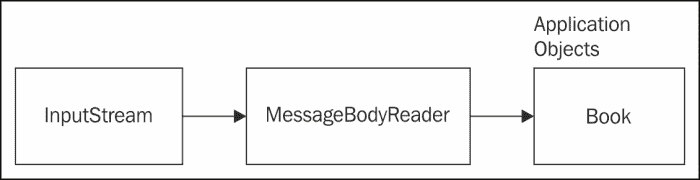
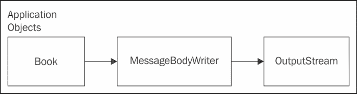

# 第一章：使用 JAX-RS 构建 RESTful Web 服务

实现异构应用程序之间的通信有多种方式。有基于 **SOAP**、**WSDL** 和 WS* 规范的标准化解决方案；与此同时，还有一个基于纯 HTTP 的轻量级解决方案，被称为 **表征状态转移**（**REST**）。

REST 通过可寻址资源、使用 HTTP 动词约束的接口、表示和无状态性等原则来识别。

REST 的关键原则是：

+   将 ID 关联到资源

+   使用标准 HTTP 方法

+   资源发送的数据的多种格式

+   无状态性

本章从使用 **JAX-RS** 2.0 API 构建 **RESTful Web 服务** 的基本概念开始，并涵盖以下部分：

+   开始使用 JAX-RS 2.0

+   使用 JAX-RS 2.0 注解将 POJO 转换为 RESTful 端点

+   `@Produces`、`@Consumes` 注解

+   JAX-RS 2.0 的客户端 API

+   展示所有动词的示例

+   用于 **序列化** 和 **反序列化** 用户定义类的自定义实体提供者使用 JAX-RS

+   利用 Bean Validation API 对 JAX-RS 2.0 进行验证

# 理解 REST

REST 架构风格基于客户端和服务器之间传输的请求和响应消息，参与节点中没有任何节点跟踪先前会话的状态。

REST 使用名词和动词以提高可读性。资源在请求中标识。发送给客户端的资源表示取决于请求和服务器发送数据的方式。

# RESTful Web 服务

RESTful Web 服务是一种接口和访问机制与 REST 原则一致的服务。URI 识别资源。例如，一个书籍的 RESTful 资源可以标识为 [`foo.org/book`](http://foo.org/book)。

一个通过 ISBN 标识的书籍资源可以是 [`foo.org/book/isbn/1234459`](http://foo.org/book/isbn/1234459)。这显示了易于理解和识别的易读 URI。

客户端拥有足够资源的元数据来修改或删除它，只要它被授权这样做。为了获取资源，客户端会发送一个 HTTP `GET` 请求。为了更新资源，客户端会发送一个 `PUT` 请求。为了删除资源，客户端会发送一个 `DELETE` 请求。为了创建新的资源，以及进行任意处理，客户端会发送一个 HTTP `POST` 请求。下一节将更详细地介绍这些动词。

# REST 中的动词

REST 中使用的一些请求如下：

+   `GET`：`GET` 请求从服务器到客户端检索资源的表示

+   `POST`：`POST` 请求用于根据客户端发送的表示在服务器上创建资源

+   `PUT`：`PUT` 请求用于在服务器上更新或创建对资源的引用

+   `DELETE`：`DELETE` 请求可以删除服务器上的资源

+   `HEAD`：`HEAD` 请求检查资源而不检索它

下一个部分将介绍安全性和**幂等性**的概念，这两个术语与 REST 紧密相关。

## 安全性和幂等性

当涉及到 REST 时，根据定义，一个安全的方法是一个不修改服务器上资源状态的 HTTP 方法。例如，在资源 URL 上调用 `GET` 或 `HEAD` 方法不应改变服务器上的资源。`PUT` 被认为是不可安全的，因为它通常会在服务器上创建资源。`DELETE` 也被认为是不可安全的，因为它会删除服务器上的资源。`POST` 也不安全，因为它会改变服务器上的资源。

**幂等**方法是可以多次调用而结果不会改变的方法。

`GET` 和 `HEAD` 是幂等的，这意味着即使相同的操作执行多次，结果也不会变化。`PUT` 是幂等的；多次调用 `PUT` 方法不会改变结果，资源状态保持完全相同。

`DELETE` 是幂等的，因为一旦资源被删除，它就消失了，多次调用相同的操作不会改变结果。

相反，`POST` 不是幂等的，多次调用 `POST` 可能会有不同的结果。

### 提示

HTTP 动词的幂等性和安全性是一种约定，意味着当有人使用您的 API 时，他们将假设 `GET`/`PUT`/`POST`/`DELETE` 具有之前描述的相同幂等特性；并且每个动词背后的业务逻辑实现应该支持这些特性。

服务器发送的响应可以是 XML、JSON 或任何其他 MIME 类型，只要服务器支持请求的格式。如果服务器无法支持请求的 MIME 类型，它可以返回状态码 406（不可接受）。

当我们以 RESTful 原则进行开发时，每条消息都应该包含足够的信息，以便服务器理解消息的目的以及如何处理该消息，以生成消息预期的响应，并最终确保可见性和无状态性。

总结，这些是 RESTful Web 服务的组成部分：

+   **基础 URI**：Web 服务的基础 URI 为 `http://foo.com/bar`

+   **媒体类型**：Web 服务支持的媒体类型

+   **方法**：如 `GET`、`PUT`、`POST` 和 `DELETE` 这样的 HTTP 方法

# JAX-RS 简介

**Java API for Representational State Transfer** (**JAX-RS**) 规范定义了一套 Java API，用于构建符合 REST 风格的 Web 服务。

本规范定义了如何使用 HTTP 作为网络协议将 POJOs 公开为 Web 资源。使用这些 API 的应用程序可以以可移植的方式部署到应用程序服务器。

JAX-RS 2.0 规范中引入的一些关键特性如下：

+   客户端 API

+   服务器端异步支持

+   **Bean Validation** 支持

在接下来的章节中，我们将介绍与 JAX-RS 2.0 相关的以下主题：

+   将 POJO 转换为 RESTful 资源

+   关于 JAX-RS 注解的更多内容

+   JAX-RS 客户端 API

+   JAX-RS 中的实体

+   JAX-RS 中的自定义实体提供者

+   在 JAX-RS 中使用 Bean 验证 API

## 将 POJO 转换为 RESTful 资源

资源类是一个使用 JAX-RS 注解的 POJO。资源类需要至少有一个被 `@Path` 或请求方法注解的方法。资源是我们所说的网络服务，传入的请求针对这些资源。

将 POJO 转换为 RESTful 端点的步骤：

1.  定义一个由 URI 标识的根资源

1.  定义资源的方法

1.  定义 MIME 类型

1.  定义应用程序子类

1.  定义子资源

### 定义一个由 URI 标识的根资源

JAX-RS 提供了非常丰富的客户端和服务器 API，这些 API 在任何 Java EE 应用程序服务器上都可以工作。使用 JAX-RS API，任何 POJO 都可以注解以构建 RESTful 资源。从一个简单的 POJO `BookResource` 开始，并使用 JAX-RS API 注解它。

```java
@Path("books")
public class BooksResource {
}
```

这是一个根资源类，它被 `@Path 注解` 标注。值 `"books"` 将表示资源将在类似于以下 URI 的位置可用：`http://host:port/appname/books`。

之后，我们将向此资源添加方法，以便当带有 `GET`、`PUT` 等请求击中此资源时，将调用类中的特定方法以生成响应。

### 定义资源的方法

要向此资源添加方法，我们需要使用 `@GET`、`@PUT`、`@DELETE` 或 `@HEAD` 注解该方法。在以下示例中，我们选择使用 `@GET 注解`：

```java
@GET
public String getGreeting() {
  return "Hello from Book resource"
}
```

`@GET` 注解指定 `getGreeting()` 方法处理 `HTTP GET` 请求。

### 定义 MIME 类型

要指定资源可以处理的 MIME 类型，我们应该使用 `@Produces` 和 `@Consumes` 注解资源方法：

```java
@Produces("text/plain")
@GET
public String getGreeting() {
  return "Hello from Book resource"
}
```

`@Produces` 指定该方法将生成的媒体类型是 `"text/plain"`。其他媒体类型的支持以及如何从 Java 映射到特定格式以及相反的映射将在实体提供者部分详细说明。因此，这是对拥有第一个 JAX-RS 资源初识的介绍。下一节将介绍 `Application` 子类的详细信息。

### 定义应用程序子类

`Application` 类是一种配置应用程序级细节的可移植方式，例如指定名称，并注册 JAX-RS 应用程序的各种组件。这包括应用程序中的不同 JAX-RS 资源和 JAX-RS 提供者。

类似地，可以使用 `Application` 的子类设置应用程序范围内的属性。`Application` 子类应放置在 WAR 文件的 `WEB-INF/classes` 或 `WEB-INF/lib` 中。应用程序类有以下可以重写的方法：

```java
public Set<Class<?>> getClasses() ;
public Map<String, Object> getProperties();
public Set<Object> getSingletons();
```

这里是我们案例中应用程序子类的一个示例：

```java
@ApplicationPath("/library/")
public class HelloWorldApplication extends Application {
@Override
  public Set<Class<?>> getClasses() {
    Set<Class<?>> classes = new HashSet<Class<?>>();
 classes.add(BooksResource.class);
    return classes;
  }
}
```

在此代码中，我们创建了一个 `HelloWorldApplication`，它是 `javax.ws.rs.core.Application` 的子类。使用 Servlet 3.0，不需要 `web.xml` 文件，并且 Servlet 容器使用 `@ApplicationPath` 中指定的值作为 servlet 映射。`Application` 类的 `getClasses()` 方法被重写以添加 `BooksResource.class`。

一个基本的 JAX-RS 资源现在可以使用了。当示例部署到如 GlassFish 这样的应用服务器时，你可以使用 curl 发送请求。

这里是一个如何发送 `curl -X GET` 请求的示例：

```java
curl -X GET http://localhost:8080/helloworld/books
```

终端窗口中的输出应该是：

**来自书籍资源的问候**

第五章，*通过示例学习 RESTful Web 服务*，将展示如何在 `web.xml` 文件中使用 Application 类。

### 定义子资源

资源类可以部分处理请求的一部分，并提供另一个子资源来处理请求的剩余部分。

例如，这里是一个根资源 `Library` 和另一个资源 `Book` 的片段。

```java
@Path("/")
public class Library {

 @Path("/books/{isbn}")
 public Book getBook(@PathParam("isbn") String isbn){
    //return book
  }
}

public class Book {
 @Path("/author")
  public String getAuthor(){
  }
}
```

子资源定位器是具有 `@Path` 注解但没有 HTTP 方法的资源方法。

在前面的例子中，`Library` 是一个根资源，因为它被 `@Path` 注解。`getBook()` 方法是一个子资源定位器，其任务是提供一个可以处理请求的对象。

`@PathParam` 是一个允许你在方法调用中映射 URI 路径片段的注解。在这个例子中，`isbn` URI 参数被传递以提供关于书籍的信息。

如果客户端使用以下 URI 发送请求：

```java
GET /books/123456789
```

将调用 `Library.getBook()` 方法。

如果客户端使用以下 URI 发送请求：

```java
GET /books/123456789/author
```

`Library.getBook()` 方法将首先被调用。返回一个 `Book` 对象，然后调用 `getAuthor()` 方法。

## 更多关于 JAX-RS 注解的内容

`@Produces` 注解用于定义资源中方法产生的输出类型。`@Consumes` 注解用于定义输入类型，资源中的方法消耗。

这里是一个资源中用于 `POST` 请求的方法：

```java
@POST
@Consumes(MediaType.APPLICATION_XML)
@Produces(MediaType.APPLICATION_XML)
public Response addBook(Book book) {
  BooksCollection.addBook(book);
  return    Response.ok(book).
  type(MediaType.APPLICATION_XML_TYPE).build();
}
```

如此片段所示，我们有一个 `@POST` 注解，表示此方法接受 `POST` 请求。

`@Produces(MediaType.APPLICATION_XML)` 表示该资源的 `addBook()` 方法产生了 `"application/xml"` 媒体类型。

`@Consumes(MediaType.APPLICATION_XML)` 表示该资源的 `addBook()` 方法消耗了 `"application/xml"` 媒体类型。

`Response.ok(book)` 方法构建了一个类型为 `MediaType.APPLICATION_XML_TYPE` 的 ok 响应。

其他支持的媒体类型 `@Produces` 和 `@Consumes` 包括 `"text/xml"`、`"text/html"`、`"application/json"` 等。

如果在 `@Produces` 或 `@Consumes` 注解中没有指定媒体类型，则默认假设支持任何媒体类型。

这里是一段显示 `@DELETE` 注解的代码片段。

```java
@DELETE
@Path("/{isbn}")
public Book deleteBook(@PathParam("isbn")String isbn) {
  return BooksCollection.deleteBook(isbn);
}
```

`@PathParam` 注解允许您将方法调用中的 URI 路径片段进行映射。在这个例子中，`isbn` URI 参数被传递以提供关于书籍的信息。

ISBN 唯一标识了书籍资源，以便可以删除它。

以下表格总结了包含在 Java EE 7 中并贯穿本书的 JAX-RS 2.0 重要注解。

| 注解 | 描述 |
| --- | --- |
| `@Path` | 用于注解一个 POJO，表示其资源路径。例如，`@Path("books")` 或注解一个注解类中的子资源方法。 |
| `@Produces` | 用于指定资源产生的输出类型，或在更窄的范围内指定资源中方法产生的输出类型。例如：`@Produces(MediaType.APPLICATION_JSON)`。 |
| `@Consumes` | 用于指定资源消耗的类型，或在更窄的范围内指定资源中方法消耗的类型。例如：`@Consumes (MediaType.APPLICATION_JSON)`。 |
| `@GET`、`@POST`、`@DELETE` 等等 | 将 HTTP 方法映射到表示类的资源中的方法。例如，`@GET` 可以放置在 `getBook` 方法上。 |
| `@PathParam` | 用于指定查询参数名称和方法之间的映射。例如：`getBook(@PathParam("isbn") String isbn)`。 |
| `@ApplicationPath` | 识别作为所有通过路径提供的资源 URI 的基础 URI 的应用程序路径。例如，为图书馆应用程序提供 `@ApplicationPath("library")`。 |
| `@Context` | 可以用来注入上下文对象，如 `UriInfo`，它提供了关于请求 URI 的特定请求上下文信息。例如：`getBook(@Context UriInfo uriInfo,` |

第五章, 《通过示例学习 RESTful Web 服务》，详细介绍了不同的 JAX-RS API，并将它们与其他 Java EE API 结合起来构建一个实际的应用程序。

## JAX-RS 的客户端 API

JAX-RS 2.0 提供了一个丰富的客户端 API 来访问网络资源。以下是使用我们之前构建的 `BooksResource` 客户端 API 的代码示例：

```java
Client client = ClientBuilder.newClient();
WebTarget target = client.target(URI);
```

可以使用 `ClientBuilder.newClient()` API 获取 `javax.ws.rs.client.Client` 对象的默认实例。`BooksResource` 可以通过 URI 进行识别。`WebTarget` 对象用于构建 URI。

```java
String book = target.request().get(String.class);
```

`target.request().get(String.class)` 方法构建一个 HTTP `GET` 请求，并在响应中获取一个 `String` 类型的对象。下一节将展示其他动词的客户端 API 的更多示例。

## JAX-RS 中的实体

HTTP 交互的主要部分由请求和响应实体组成。在某些情况下，实体也被称为有效载荷或消息体。

实体通过请求发送，通常使用 HTTP `POST` 和 `PUT` 方法，或者它们在响应中返回，这对于所有 HTTP 方法都适用。`Content-Type` HTTP 报头用于指示发送的实体类型。常见的 **内容类型** 包括 `"text/plain"`、`"text/xml"`、`"text/html"` 和 `"application/json"`。

媒体类型用于 `Accept` 报头中，以指示客户端想要接收的资源表示类型。

以下片段展示了如何使用客户端 API 创建 `POST` 请求。此调用接受一个用户定义类 `Book` 的实体以及 `MediaType.APPLICATION_XML_TYPE` 参数。

这里是调用 `POST` 方法的客户端代码：

```java
Response response = target.request()
post(Entity.entity(new Book("Getting Started with RESTful Web Services","111334444","Enterprise Applications"), MediaType.APPLICATION_XML_TYPE));
```

在前面的片段中，`WebTarget#request()` 方法返回一个 `Response` 对象。

这里是调用 `delete` 方法的客户端 API 代码：

```java
response = target.path("111334444")
request( MediaType.APPLICATION_XML_TYPE)
.delete();
```

下一节将展示实现 JAX-RS API 的实体提供者如何映射到 Java 类型请求和响应实体。

## JAX-RS 中的自定义实体提供者

JAX-RS 允许开发者向应用程序添加自定义实体提供者。自定义实体提供者可以用于处理请求和响应中的用户定义类。

添加自定义实体提供者提供了一种从消息体中反序列化用户定义类以及将任何媒体类型序列化到用户特定类的方法。

有两种类型的实体提供者：

+   `MessageBodyReader`

+   `MessageBodyWriter`

使用 `@Provider` 注解，可以查找特定于应用程序的提供者类。实体提供者提供表示和关联类型之间的映射。书中包含了一个示例，演示了实体提供者的使用。

### MessageBodyReader

应用程序可以通过实现 `isReadable()` 方法和 `readFrom()` 方法来提供 `MessageBodyReader` 接口的实现，将实体映射到所需的 Java 类型。

下图展示了 `MessageBodyReader` 如何读取 `InputStream` 对象并将其转换为用户定义的 Java 对象。



以下代码展示了如何提供 `MessageBodyReader` 的实现，并使用 JAX-RS 与 **Java Architecture for XML Binding**（**JAXB**）结合。JAXB 提供了一种快速便捷的方式将 XML 架构和 Java 表示形式绑定，使得 Java 开发者能够轻松地将 XML 数据和处理函数集成到 Java 应用程序中。作为此过程的一部分，JAXB 提供了将 XML 实例文档反序列化（读取）到 Java 内容树的方法，然后将 Java 内容树序列化（写入）回 XML 实例文档。

这里有一个名为 `Book` 的 JAXB 根元素。`Book` 具有名称和 ISBN 等属性。

```java
@XmlRootElement
public class Book {
  public String name;
  public String isbn;
  public String getName() {
    return name;
  }
  public String getIsbn() {
    return isbn;
  }
  public Book(String name, String isbn) {
    this.name=name;
    this.isbn=isbn;
  }
  //JAXB requires this
  public Book() {

  }
}
```

`MessageBodyReader` 实现类可以提供从 `inputStream` 对象读取并将其转换为 `Book` 对象的支持。以下表格显示了需要实现的方法：

| 消息体读取器方法 | 描述 |
| --- | --- |
| `isReadable()` | 检查 `MessageBodyReader` 类是否支持从流转换为 Java 类型。 |
| `readFrom()` | 从 `InputStream` 读取类型。 |

这里是 `SampleMessageBodyReader` 类的代码，它是 `MessageBodyReader` 接口的实现：

```java
@Provider
public class SampleMessageBodyReader implements 
MessageBodyReader<Book> {
}
```

`@Provider` 注解表示这是一个提供者，实现类也可以使用 `@Produces` 和 `@Consumes` 注解来限制它们支持的媒体类型。

这里是 `isReadable()` 方法的实现：

```java
public boolean isReadable(Class<?> aClass, Type type, Annotation[] annotations, MediaType mediaType) {
  return true;
}
```

`isReadable()` 方法返回 `true` 以指示这个 `SampleMessageBodyReader` 类可以处理 `mediaType` 参数。

这是 `SampleMessageBodyReader` 类的 `readFrom()` 方法的实现。可以在这里检查 `mediaType` 参数，并根据媒体类型采取不同的操作。

```java
public Book readFrom(Class<Book> bookClass, Type type, Annotation[] annotations,
MediaType mediaType,
MultivaluedMap<String, String> stringStringMultivaluedMap,
InputStream inputStream) throws IOException, WebApplicationException {
  try {

 Book book = (Book)unmarshaller.unmarshal(inputStream) ;
    return book;
  } catch (JAXBException e) {
    e.printStackTrace();
  }
  return null;
  }
}
```

方法返回的 `book` 对象，然后使用 JAXB **Unmarshaller** 和提供的 `inputStream` 对象作为参数进行反序列化。

### 消息体写入器

`MessageBodyWriter` 接口代表了一个提供者合约，该合约支持将 Java 类型转换为流。

下图显示了 `MessageBodyWriter` 如何将用户定义的类 `Book` 序列化到 `outputStream` 对象。



下表显示了 `MessageBodyWriter` 必须实现的方法及其每个方法的简要描述。

| 消息体写入器方法 | 描述 |
| --- | --- |
| `isWritable()` | 检查 `MessageBodyWriter 类` 是否支持从指定的 Java 类型进行转换。 |
| `getSize()` | 如果已知大小或为 -1，则检查字节数长度。 |
| `writeTo()` | 从类型写入到流。 |

这里是需要实现 `MessageBodyWriter` 接口的方法：

```java
public boolean isWriteable(Class<?> aClass, Type type, Annotation[] annotations, MediaType mediaType) {
    return true;
}
```

`MessageBodyWriter` 接口的 `isWritable()` 方法可以自定义以检查此 `MessageBodyWriter` 实现是否支持该类型。

```java
 public long getSize(Book book, Class<?> aClass, Type type, Annotation[] annotations, MediaType mediaType) {
        return -1;
    }
```

在 `writeTo()` 方法之前调用 `getSize()` 方法以确定响应中的字节数长度。

```java
public void writeTo(Book book, 
Class<?> aClass, 
Type type, Annotation[] annotations, 
MediaType mediaType,
MultivaluedMap<String, Object> map,
OutputStream outputStream) throws 
IOException, WebApplicationException {
  try {

    Marshaller marshaller = jaxbContext.createMarshaller();
    marshaller.marshal(book, outputStream);
  } catch (Exception e) {
    e.printStackTrace();
  }
}
```

`writeTo()` 方法将 `Book` 对象序列化到 `OutputStream`。

### 提示

**使用 `MessageBodyReader` 和 `MessageBodyWriter` 调试错误的技巧：**

+   查找 `@Provider` 注解。`MessageBodyReader` 实现类和 `MessageBodyWriter` 实现类需要 `@Provider` 注解。

+   确认 `MessageBodyReader` 和 `MessageBodyWriter` 接口的实现类是否已添加到应用程序子类的 `getClasses()` 方法中。

+   检查 `MessageBodyReader.isReadable()` 方法的实现是否返回 `true`。

+   检查 `MessageBodyWriter.isWritable()` 方法的实现是否返回 `true`。

+   确认 `MessageBodyWriter.getSize()` 方法是 `-1`，如果响应的大小未知，或者如果大小已知，则将其设置为正确的值。

客户端看起来是这样的：

```java
Client client = ClientBuilder.newClient();
client.register(MessageBodyReaderWriter.class).register(BooksResource.class);
Response response = target
.request()
.post(Entity.entity(new Book("Getting Started with RESTful Web Services","13332233"), MediaType.APPLICATION_XML_TYPE));

Book  = response.readEntity(Book.class);
```

使用 `client.register()` 方法注册 `MessageBodyReaderWriter.class` 和 `BooksResource.class`。

应用程序类 `Book` 是通过 `response.readEntity(Book.class)` 从响应中提取的。

## 在 JAX-RS 中使用 Bean Validation API

验证是验证给定输入是否符合定义的约束的过程。Bean Validation 规范定义了用于验证 **JavaBeans** 的 API。本节展示了如何使用 Bean Validation API 验证 JAX-RS 2.0 资源。

验证可以用来确保 JAX-RS 资源中的字段遵循某些约束。例如，检查一个字段是否不是 `null` 或 ISBN 是否遵循某种模式。使用 Bean Validation，用户可以编写自定义验证器，并使用自定义验证器注解 JAX-RS 资源及其组件。

书中包含的示例将展示如何使用 JAX-RS 2.0 资源与 Bean Validation 结合使用。

下面是一个代码片段，展示了如何强制执行验证，同时定义一个约束并将其添加到用户定义的消息中：

```java
@Path("books")
@ValidateOnExecution(ExecutableType.GETTER_METHODS)
public class BooksResource {

  @GET
  @Path("{isbn}")
  @Consumes(MediaType.APPLICATION_XML)
  @Produces(MediaType.APPLICATION_XML)
 @NotNull(message="Book does not exist for the
 ISBN requested")
  public Book getBook(
  @PathParam("isbn")String isbn)    {
    return BooksCollection.getBook(isbn);

  }
}
```

可以使用 `@ValidateOnExecution` 注解有选择地启用和禁用验证。在这个片段中，`getBook()` 方法被验证，因为 `@ValidateOnExecution` 注解启用了 `ExecutableType.GETTER_METHODS` 值的验证。

当执行示例代码时，如果书籍值不为 `null`，则返回书籍对象。如果书籍值为 `null`，则会出现验证错误，屏幕上显示的消息为 `"Book does not exist for the ISBN requested"`。这是之前显示的 `@NotNull` 注解提供的信息。

### 在应用程序中启用验证

默认情况下，从响应中获取验证错误是不启用的。书中包含的示例将演示如何从响应中获取验证错误。用户需要通过覆盖 `getProperties()` 方法，使用 `Application` 类将 `BV_SEND_ERROR_IN_RESPONSE` 属性设置为布尔值 `true`。

下面是 `Application` 子类的 `getProperties()` 方法。

```java
@override
public Map<String,Object> getProperties() {
  Map<String,Object> properties = new HashMap<String,Object>() ;
 properties.put(ServerProperties.BV_SEND_ERROR_IN_RESPONSE, true);
 return properties;
}
```

`getProperties()` 方法返回一个 `Map<String,Object>` 对象，其中 String 属性 `ServerProperties.BV_SEND_ERROR_IN_RESPONSE` 被设置为布尔值 `true`。

### 小贴士

**下载示例代码**

您可以从您在 [`www.packtpub.com`](http://www.packtpub.com) 的账户中下载您购买的所有 Packt 书籍的示例代码文件。如果您在其他地方购买了这本书，您可以访问 [`www.packtpub.com/support`](http://www.packtpub.com/support) 并注册，以便将文件直接通过电子邮件发送给您。

### 从响应中读取验证错误

在将应用程序类配置为将字符串属性 `ServerProperties.BV_SEND_ERROR_IN_RESPONSE` 设置为布尔值 `true` 之后，servlet 类中的以下代码将读取响应中的验证错误。

这是客户端代码的显示方式：

```java
List<ValidationError> errors = response.readEntity(new GenericType<List<ValidationError>>() {});
```

`response.readEntity()` 方法接受一个 `GenericType<ValidationError>` 参数的列表。从 `response.readEntity()` 方法返回的 `List<ValidationError>` `errors` 中，我们可以提取验证错误并获取验证消息。运行示例时，将显示以下消息：

**"在验证请求时出现 1 个错误"**

**"请求的 ISBN 对应的书籍不存在"**

# 摘要

本章首先简要介绍了 REST 和 RESTful Web 服务开发的关键原则，然后介绍了将 POJO 转换为 JAX-RS 资源、RESTful 端点，并讨论了不同的 HTTP 动词及其用法。

在介绍之后，本章通过介绍用于向使用 JAX-RS API 开发的资源发送请求的客户端 API，更深入地探讨了 JAX-RS API。我们还介绍了如何使用 `MessageBodyReader` 和 `MessageBodyWriters` 定制实体提供者以生成不同的输出格式。我们学习了如何使用 Bean Validation 验证 JAX-RS 2.0 资源。

在下一章中，我们将介绍不同的轮询技术，将它们与服务器发送事件（SSE）和 **WebSockets** 进行比较和对比，然后更详细地探讨 Java EE 7 如何为 SSE 和 WebSockets 提供支持。
