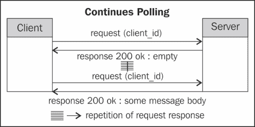
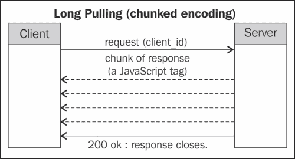
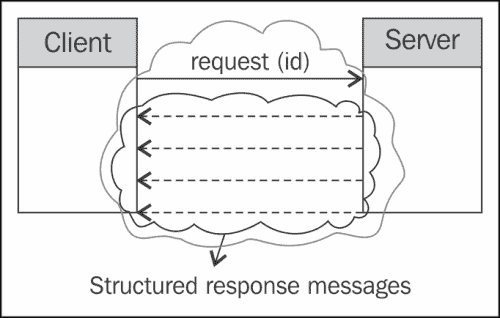
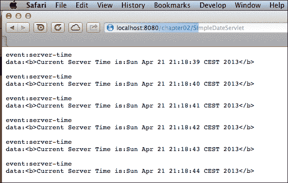
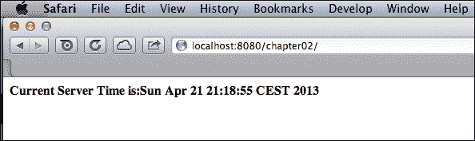

# 第二章：WebSocket 和服务器发送事件

随着网络架构的进步和新兴平台的涌现，这些平台可以提供实时或近实时信息，因此有必要有一种有效的方法将更新传达给客户端，这促使引入新的编程模型和新标准，使系统消费者端（也称为客户端，主要是网络浏览器）更容易利用这些实时信息。

在本章中，我们将介绍以下主题：

+   可以用于解决向客户端传输近实时更新的编程模型和解决方案

+   使用服务器发送事件（SSE）

+   使用 WebSocket

本章包含不同的代码片段，但完整的示例，展示了这些片段在实际操作中的使用，作为本书源代码下载包的一部分。

# 编程模型

在本节中，我们将介绍针对基于服务器生成的更新来处理客户端视图近实时更新的不同编程模型。

## 轮询

如前所述，HTTP，作为互联网通信的基础，使用简单的请求/响应模型，其中请求要么超时，要么从服务器收到响应。响应可以是请求所期望的实际响应，也可以是错误消息，位于标准错误状态代码之下。客户端始终是通信的发起者；服务器不能在没有收到客户端请求发送响应的情况下发起通信通道。

因此，基本上，要更新客户端，就需要检查服务器上的新更新，如果可用，客户端可以响应更新，例如，更改文本以表示之前不可用的书籍现在可以借阅，或者显示新的图像，或者执行任何其他与从服务器收到的响应相对应的操作。

向服务器发送周期性请求以检查更新被称为**轮询**。这种方法无法扩展到数十万个客户端，因此它不能成为处理当今应用程序大量客户端的有效编程模型。在轮询模型中，响应不一定包括服务器生成的更新，而可能只是没有特定更新的`200 OK`响应。在这个模型中，数十个请求可能什么也收不到，只是收到`200 OK`，没有任何有意义的更新供客户端使用，这意味着这些请求白白浪费了资源。当然，如果客户端数量有限，并且存在严重的兼容性问题，例如非常旧的浏览器，那么这种模型是有用的。以下图表显示了轮询模型：



基于轮询的模型在客户端通过 JavaScript 得到增强；浏览器可以在不改变页面内容的情况下更新视图，从而在图书馆应用程序中列出可用的书籍，而无需用户刷新页面。以下代码片段展示了用 Java 编写的轮询对的服务器端：

```java
public class PollingServlet extends HttpServlet {

    @Override
    protected void doGet(HttpServletRequest request, HttpServletResponse response) throws ServletException, IOException {
        response.setContentType("text/plain");
        response.setCharacterEncoding("UTF-8");
        response.getWriter().write((new Date()).toString());
    }
}
```

之前的示例没有使用 JSON 作为数据格式，也没有使用 Java EE 7 和 Servlet 3.1 中引入的新异步功能，这些功能在第三章、*详细理解 WebSocket 和服务器端事件*和第四章、*JSON 和异步处理*中进行了讨论，而是展示了基本的工作原理。Servlet 为任何`GET`请求写入当前日期。servlet 在`web.xml`文件中映射到`PollingServlet`路径。

以下代码片段展示了我们如何使用 JavaScript 在后台执行请求，获取响应，并通过操作等效的 DOM 树元素来更新 HTML 页面中`div`元素的内容。

```java
 <html>
  <head>
    <title>Ajax Continues Polling</title>        
      <script>
        function startUpdating() {
          req = new XMLHttpRequest();
          req.onreadystatechange = function() {updateDiv();};
          req.open("GET", "/PollingServlet", true);
          req.send(null);  
          results = req.responseText;
        }

        function updateDiv(){
          results = req.responseText;
          document.getElementById("dateDiv").innerHTML = results;
          setTimeout("startUpdating()", 5000);
        }
      </script>
  </head>
  <body onload="startUpdating()">
    <p>polling the time from server:</p>
    <div id="dateDiv"></div>
  </body>
</html>
```

前面的代码片段中的 HTML 页面是最简单的形式；它既不检查每个请求的响应是否为`OK`，也不检查代码是否在 IE 或非 IE 浏览器中执行，以简化处理。

现在，当页面加载时，会调用`startUpdating`函数，该函数向之前显示的 Servlet 发送请求，并调用`updateDiv`函数来更新 GUI，然后在 5 秒后再次调度它的调用。

轮询模型的局限性可以总结如下：

+   是客户端执行轮询，没有服务推送的参与

+   由于许多请求会导致没有对客户端有效的更新的响应，因此它消耗资源较多。

+   请求之间的长时间间隔可能会导致客户端视图过时，而短时间间隔会超载服务器

## 长轮询

考虑到轮询模型的局限性，出现了一种新的编程模型，其中请求要么超时，要么将有用的更新返回给客户端。在这个模型中，请求被发送到服务器，并在非常长的时间后设置超时，这样通过减少固定时间段内的请求数量和响应数量，尽可能减少握手和请求发起的成本。只有当服务器有更新时，才会发送响应，客户端应该接收这些更新。当这种更新在服务器上可用时，服务器会发送带有更新的响应，客户端在消耗了接收到的更新后，会发起另一个请求。这种模型的优点是请求数量比轮询少，这减少了资源消耗并提高了可扩展性。以下图表展示了**长轮询**模型。


### 长轮询客户端和 XMLHttpRequest

`XMLHttpRequest` 对象作为 JavaScript 浏览器 API 的一部分可用，以促进网页的 JavaScript 部分与 Web 服务器的交互。它可以用来向服务器发送请求并接收响应，而无需在页面加载后刷新页面；例如，在 `available.html` 页面加载后更新可用的书籍列表。

`XMLHttpRequest` 对象的功能分为事件、方法和属性。以下将简要讨论重要的属性、事件和重要方法。

当事件被触发或方法被调用时，属性的值会发生变化。检查属性值可以评估 `XMLHttpRequest` 对象的当前状态或处理响应。

+   `readyState`: 存储正在进行中的请求的当前状态。列表之后的表格显示了 `readyState` 属性的不同值。

+   `responseText`: 返回响应文本。

+   `responseXML`: 返回一个表示响应数据的 DOM 对象。假设响应文本是有效的 XML 文档。可以使用标准的 DOM 解析器方法遍历 XML 文档。

+   `status`: 显示请求的状态码；例如，`200`，`404` 等。

+   `statusText`: 请求状态码的易读文本等效。例如 `"OK"`，`"Not Found"` 等。

| `readyState` 值和文本等效 | 描述 |
| --- | --- |
| `0` (`UNINITIALIZED`) | `XMLHttpRequest` 对象已创建，但尚未打开。 |
| `1` (`LOADING`) | `XMLHttpRequest` 对象已创建，已调用 open 方法，但尚未发送请求。 |
| `2` (`LOADED`) | 调用了发送方法，但尚未收到响应。 |
| `3` (`INTERACTIVE`) | 调用了发送方法，已收到一些数据，但响应尚未结束。 |
| `4` (`COMPLETED`) | 响应已结束，已接收到整个消息。消息内容可在 `responseBody` 和 `responseText` 属性中找到。 |

每个事件都可以关联一个方法，当事件被触发时，该方法会被调用。随后的示例代码展示了如何使用这些事件。

+   `onreadystatechange`: 当由该 `XMLHttpRequest` 实例发起的请求状态改变时，会触发此事件。状态改变通过 `readyState` 属性进行通信。

+   `ontimeout`: 当使用该 `XMLHttpRequest` 实例发起的请求超时时，会触发此事件。

在调用每个方法后，相关属性的值将发生变化。

+   `abort`: 取消 `XMLHttpRequest` 实例的当前请求。`readyState` 值设置为 `0`。

+   `open`: 通过设置方法、URL 和安全凭据来准备请求。

+   `send`: 通过 `open` 方法发送准备好的请求。

### 分块传输编码

使用长轮询模型的另一种可能方式是使用消息体流来发送数据块和更新事件，当这些块在服务器上可用并准备好由开发者消费时。在消息体流模型中，服务器不会关闭响应，而是保持其打开状态，并将更新事件发送给客户端，就像它们在服务器中产生时一样。消息体流涉及使用分块传输编码，这是一个 `HTTP/1.1` 功能。

分块传输编码可以用来发送多个数据块作为响应体的一部分，这些数据块以流的形式打开。这些块可以是 JavaScript 标签，它们在隐藏的 `iframe` 中加载并按到达顺序执行。到达的脚本的执行可以导致视图更新或触发任何其他所需操作。以下图显示了长轮询的实际操作。



在前面的图中，客户端发送了一个包含 `client_id` 值的请求到服务器，当有更新可供发送给客户端时，服务器开始发送响应块。这些更新以 JavaScript 标签的形式发送，然后在客户端的浏览器中执行以更新 GUI。

长轮询模型的局限性可以概括如下：

+   单向通信

+   在分块传输编码模式下使用时没有标准的数据格式或消息格式

+   当不使用 `iframe` 技术时，每个请求只有一个响应

+   每个连接的初始化都有一个初始化成本

+   客户端和服务器之间没有缓存，这影响了服务器性能而不是从缓存中读取内容

# 新兴标准

随着对那些需求及其解决方案的出现，标准出现了以确保不同层、应用程序和组件之间的兼容性；异步通信，尤其是客户端和服务器之间的事件传播，就是其中之一。

## 服务器发送事件

**服务器发送事件** (**SSE**)，有时简称为 **EventSource**，是一个 HTML5 浏览器 API，它使服务器和客户端之间的事件推送对 Web 应用程序开发者可用。SSE 组件提供了一个结构化的机制，具有类似于长轮询的功能，但没有长轮询的一些缺点。由于它是一个 HTML5 组件，浏览器应该支持 HTML5 SSE 才能利用此 API。

SSE 内核包括 `EventSource` 和 `Event`。

`EventSource`是提供客户端订阅事件源的 API，这可能是一个 Servlet 或类似的东西。订阅后，这仅仅是打开到 URL 的连接，事件以它们产生的顺序发送到客户端，在客户端，事件监听器可以响应这些事件，例如通过更新聊天窗口、更改图表或更新可借阅的书籍列表或列出对事件 URL 所针对的主题感兴趣的人。

### SSE 的解剖结构

在我们深入 API 并了解 API 的工作原理之前，仔细研究 SSE 的特点以及 SSE 是如何工作的，这是很好的。以下图表显示了 SSE 的实际应用，这与前一部分中显示的块编码图表非常相似。可能会有人问：如果两者在请求、响应和消息内容方面工作方式相似，那么是什么使得 SSE 比长轮询更好？



使用 SSE，事件是服务器发送到客户端的纯文本消息，这意味着它不需要是一个需要在客户端执行的 JavaScript 标签集合，以更新某些内容，而更可以是客户端的事件监听器可以消费的数据，事件监听器可以解释并响应接收到的事件。

第二个区别是消息格式；SSE 定义了从服务器发送到客户端的事件的消息格式。消息格式由一个由换行符分隔的纯文本字符流组成。以`data:`开头的行携带消息体或数据，而以 QoS 属性名称后跟冒号然后是 QoS 属性值`directive: value`开头的行携带一些**服务质量**（**QoS**）指令。标准格式使得围绕 SSE 开发通用库成为可能，从而简化软件开发。以下代码片段显示了一个可以指示图中新点的示例消息。当客户端收到消息时，它可以在图上绘制新点以显示从图中构建的数据的变化。以下示例数据显示了一个多行消息，其中每行使用`\n`与下一行分隔，消息的结束用`\n\n`标记。

```java
data: Position: 75,55\n\n
data: Label: Large increase\n\n
data: Color: red\n\n
```

可以使用 servlet 开发 SSE 解决方案的服务器组件，而客户端可以使用 JavaScript 或 Java API 进行开发。用于消费 SSE 事件的 Java API 是 Java EE 7 的一部分，通过 JAX-RS 2.0 提供。接下来的两个部分将详细介绍客户端 API 以及解决方案的服务器端组件，后者是一个 servlet。

如前所述，除了实际的消息或消息体之外，每个 SSE 消息还可以携带一些指令，这些指令指示浏览器或 SSE 兼容客户端在交互的一些 QoS（服务质量）属性。以下将讨论一些这些 QoS 指令。

### 注意

JAX-RS 2.0 的参考实现是在 Jersey 2.0 项目中完成的。Jersey 项目位于[`jersey.java.net/`](http://jersey.java.net/)，拥有详尽的文档。

## 将 ID 与事件关联

每个 SSE 消息都可以有一个消息标识符，它可以用于各种目的；消息 ID 标准用法之一是跟踪客户端已接收的消息。当在 SSE 中使用消息 ID 时，客户端可以将最后一条消息 ID 作为连接参数之一，指示服务器从该消息开始继续。当然，服务器应该实现适当的程序来从客户端请求的位置恢复通信。

带有消息 ID 的示例消息格式如下代码片段所示：

```java
id: 123 \n
data: single line data \n\n
```

### 连接丢失和重新连接重试

支持 SSE 的浏览器（本节开头列出），在浏览器和服务器之间的连接被切断的情况下，可以尝试重新连接到服务器。默认的重试间隔是`3000`毫秒，但可以通过在服务器发送给客户端的消息中包含`retry`指令来调整。例如，要将重试间隔增加到`5000`毫秒，服务器发送的 SSE 消息可以类似于以下代码片段：

```java
retry: 5000\n
data: This is a single line data\n\n
```

### 将事件名称与事件关联

另一个 SSE 指令是事件名称。每个事件源可以生成多种类型的事件，客户端可以根据它订阅的事件类型来决定如何消费每种事件类型。以下代码片段显示了事件名称指令如何结合到消息中：

```java
event: bookavailable\n
data: {"name" : "Developing RESTful Services with JAX-RS 2.0, WebSockets and JSON"}\n\n
event: newbookadded\n
data: {"name" :"Netbeans IDE7 Cookbook"}\n\n
```

### 服务器发送事件和 JavaScript

被认为是 JavaScript 开发者客户端 SSE（服务器发送事件）基础的 SSE API 是`EventSource`接口。`EventSource`接口包含相当数量的函数和属性，但最重要的如下列所示：

+   **addEventListener 函数**：用于添加事件监听器以处理基于事件类型传入的事件。

+   **removeEventListener 事件函数**：用于移除已注册的监听器。

+   **onmessage 事件函数**：在消息到达时被调用。使用`onmessage`方法时没有可用的自定义事件处理。监听器管理自定义事件处理。

+   **onerror 事件函数**：在连接出现问题时被调用。

+   **onopen 事件函数**：在连接打开时被调用。

+   **close 函数**：在连接关闭时被调用。

下面的片段显示了如何订阅来自一个源省略的不同事件类型。该片段假设传入的消息是 JSON 格式的消息。`'bookavailable'`监听器使用简单的 JSON 解析器解析传入的 JSON，然后使用它来更新 GUI，而`'newbookadded'`监听器使用 reviver 函数过滤并选择性地处理 JSON 对。

```java
var source = new EventSource('books');
source.addEventListener('bookavailable', function(e) {
  var data = JSON.parse(e.data);
  // use data to update some GUI element...
}, false);

source.addEventListener('newbookadded', function(e) {
  var data = JSON.parse(e.data, function (key, value) {
    var type;
    if (value && typeof value === 'string') {
return "String value is: "+value;
    }
    return value;
});
}, false);
```

在我们转向 WebSocket 作为另一种新兴技术之前，让我们看看以下配对的客户端和服务器，它们被编写为 Java EE Servlet 和 JavaScript，以了解 SSE 是如何工作的：

Servlet 的`processRequest`函数看起来如下所示的片段：

```java
  protected void processRequest(HttpServletRequest request, HttpServletResponse response)
            throws ServletException, IOException {        
                   response.setContentType("text/event-stream");
                   response.setCharacterEncoding("utf-8");

        PrintWriter out = response.getWriter();
        while(true){                
                Date serverDate = new Date();
                out.write( "event:server-time\n");
                out.write( "data:<b>Current Server Time is:" + serverDate.toString() +"</b>\n\n");
                out.flush();                
                try {
                        Thread.sleep(1000);
                } catch (InterruptedException e) {
                        e.printStackTrace();
                }   
        }                
    }
```

前面的 Servlet 每秒写入当前日期，如果浏览器访问 Servlet 的 URL，输出应该类似于以下图示。



同一 Web 应用程序中的 JSP 页面看起来如下所示：

```java
<%@page contentType="text/html" pageEncoding="UTF-8"%>
<!DOCTYPE html>
<html>
  <head>
    <title>JSP Page With SSE EventSource</title>
      <script type="text/JavaScript">
        function startSSEConnection(){
        var source = new EventSource('SimpleDateServlet');
        source.addEventListener("server-time", function(event){
         document.getElementById("server-time").innerHTML=event.data;
         },false);
       }

      </script>

      </script>
    </head>
    <body onload="startSSEConnection();">
      <div id="server-time">[Server-Time]</div>
    </body>
</html>
```

检查 JSP 页面的 URL 将显示类似于以下截图的输出。如您所见，Servlet 的输出消息以 JSP 页面中 JavaScript 代码中指定的格式显示：



在第三章、“详细理解 WebSocket 和服务器发送事件”和第五章、“通过示例理解 RESTful Web 服务”中包含了更完整和高级的示例。前述示例的完整代码包含在本书的代码包中。

## WebSocket

HTML5 的 WebSocket 组件通过在客户端和服务器之间引入一个全双工的事件通信通道，为现代 Web 规模应用所需的可扩展性和灵活性提供了一种全新的交互方法。一旦客户端发起，服务器就可以通过该通道发送关于客户端的二进制和文本数据，而客户端也可以在不重新初始化连接的情况下向服务器发送消息。在“服务器发送事件”部分讨论的事件源和事件订阅模型同样适用于 WebSocket。

### WebSocket 握手

有一个可选的手动握手请求-响应机制，以便在需要时让应用程序切换到 WebSocket。在下面的示例场景中，客户端通过向服务器发送升级请求头来请求协议升级到 WebSocket。如果服务器支持升级，响应将包括后续显示的协议升级。

客户端请求升级到 WebSocket 看起来如下所示的代码片段：

```java
GET /demo HTTP/1.1
Host: mybookstoresample.com
Connection: Upgrade
Upgrade: WebSocket
Origin: http://mybookstoresample.com
```

服务器响应握手可以看起来如下所示的片段：

```java
        HTTP/1.1 101 WebSocket Protocol Handshake
        Upgrade: WebSocket
        Connection: Upgrade
```

在握手完成后，客户端和服务器之间的通信将通过双向套接字进行。WebSocket 的底层通信协议与 HTTP 底层协议不同，因此，中间服务器，如代理服务器或缓存服务器可能无法像处理 HTTP 消息那样拦截和处理 WebSocket 消息。

### 注意

在第三章，*详细了解 WebSocket 和服务器端事件*的 WebSocket 部分，你可以了解更多关于 WebSocket 客户端和服务器实现以及协议升级的细节。第五章，*通过示例了解 RESTful Web 服务*包括完整的示例应用程序，进一步深入使用 WebSocket。

### 浏览器和 JavaScript 对 WebSocket 的支持

新版的主要网络浏览器支持 WebSocket，在客户端使用 WebSocket 只需创建一个 WebSocket 对象，然后为不同的事件设置不同的监听器和事件处理器。以下列表显示了`WebSocket`类的关键函数和属性：

+   **构造函数**：为了初始化`WebSocket`对象，只需将资源 URL 传递给`WebSocket`构造函数即可。

+   **send 函数**：在对象构造期间，可以使用`send`函数向服务器指定的 URL 发送消息。

+   **onopen 事件函数**：当连接创建时，该函数被调用。`onopen`处理`open`事件类型。

+   **onclose 事件函数**：当连接正在关闭时，该函数被调用。`onclose`处理`close`事件类型。

+   **onmessage 事件函数**：当收到新消息时，`onmessage`函数被调用以处理`message`事件。

+   **onerror 事件函数**：当通信通道发生错误时，该函数被调用以处理`error`事件。

+   **close 函数**：用于关闭通信套接字并结束客户端与服务器之间的交互。

下面展示了使用 JavaScript WebSocket API 的一个非常基础的示例：

```java
//Constructionof the WebSocket object
var websocket = new WebSocket("books"); 
//Setting the message event Function
websocket.onmessage = function(evt) { onMessageFunc(evt) };
//onMessageFunc which when a message arrives is invoked.
function onMessageFunc (evt) { 
//Perform some GUI update depending the message content
}
//Sending a message to the server
websocket.send("books.selected.id=1020"); 
//Setting an event listener for the event type "open".
addEventListener('open', function(e){
        onOpenFunc(evt)});

//Close the connection.
websocket.close();
```

下面代码片段展示了示例服务器端组件，一个 WebSocket 端点：

```java
@ServerEndpoint(
decoders = BookDecoder.class,
encoders = BookEncoder.class,
path = "/books/")
public class BooksWebSocketsEndpoint {
@OnOpen
public void onOpen(Session session) {
            }

@OnMessage
public void bookReturned(Library.Book book, Session session) {
            }

@OnClose
public void onClose(Session session){
sessionToId.remove(session);
}
}
```

WebSocket 端点实现细节的详细信息包含在第三章，*详细了解 WebSocket 和服务器端事件*以及第五章，*通过示例了解 RESTful Web 服务*中。

# Java EE 和新兴标准

Java EE 一直是一个新兴标准和功能以及能力的采纳者，这些标准和能力是 Java EE 社区所需求的。从 Java EE 6 开始，Java EE 规范领导者将他们的注意力集中在新兴标准上，在 Java EE 7 中，规范中包括了 HTML5、SSE 和 WebSocket 的全面支持；因此，任何 Java EE 应用服务器都可以托管一个 WebSocket、SSE 和 HTML5 面向的应用程序，而不会在服务器端出现任何兼容性问题。

## Java EE 和服务器端事件

对于 SSE，这是一个 HTML5 浏览器 API 组件，服务器端可以是生成 SSE 消息的 Servlet，或者它可以是注解了 `@Path` 的 SSE 资源，即 POJO。在客户端，可以使用 JavaScript 作为标准浏览器 API 来消费 SSE 事件，或者如果需要基于 Java 的客户端，可以使用 Jersey 2.0 中引入的 SSE 客户端 API 来开发。

下表显示了包含在 Jersey 2.0 中的 SSE API 的重要类和接口，它们是 SSE API 的入口点：

| 类 | 描述 |
| --- | --- |
| `Broadcaster` | 用于向多个 `EventChannel` 实例广播 SSE。 |
| `OutboundEvent` | 这是发送服务器端事件的输出事件类。一个 `OutboundEvent` 可以与 id、name、date 和 comment 关联。 |
| `EventChannel` | 这是输出事件消息通道。当从资源方法返回时，底层连接保持打开状态，应用程序能够发送事件。这个类的实例与一个精确的 HTTP 连接相对应。 |
| `EventSource` | 这是读取和处理服务器端 `InboundEvents` 的客户端。 |
| `InboundEvent` | 这代表一个传入的事件。 |

| `ClientFactory` | 这是客户端 API 的主要入口点，用于启动客户端实例。例如：

```java
Client client = ClientFactory.newClient();
WebTarget webTarget= client.target(new URI(TARGET_URI)) ;

```

|

| `Client` | 客户端是构建和执行客户端请求以消费返回响应的流畅 API 的主要入口点。|

```java
Client client = ClientFactory.newClient();
WebTarget webTarget= client.target(new URI(TARGET_URI)) ;

```

|

| `ResourceConfig` | 这封装了配置一个 Web 应用程序的配置。 |
| --- | --- |

下表显示了包含在 Java EE 7 中并用于本书中开发 SSE 应用程序的重要注解：

| 注解 | 描述 |
| --- | --- |
| `@Path` | 用于注解一个 POJO，表示其资源路径。例如 `@Path("books")` 或注解一个子资源，该子资源是注解类中的方法。例如 `getBook`，包括与该方法相关联的参数以及方法参数的验证表达式。例如:`@Path("{id: ^\d{9}[\d&#124;X]$}")` `getBook(@PathParam("id") String isbn10)` |
| `@Produces` | 用于指定资源产生的输出类型，或者在更窄的范围内，指定资源中方法产生的输出类型。例如：`@Produces(MediaType.APPLICATION_JSON)` |
| `@Consumes` | 用于指定资源消费的类型，或在更窄的范围内，指定资源中方法消费的类型。例如：`@Consumes (MediaType.APPLICATION_JSON)` |
| `@GET@POST@DELETE` | 将 HTTP 方法映射到表示类的资源中的方法。例如，`@GET` 可以放置在 `getBook` 方法上 |
| `@PathParam` | 用于指定查询参数名称与方法之间的映射。例如：`getBook(@PathParam("id") String isbn10)` |
| `@ApplicationPath` | 识别应用程序路径，该路径作为由 `@Path` 提供的所有资源 URI 的基本 URI。例如，对于图书馆应用程序，使用 `@ApplicationPath("library")`。 |
| `@Context` | 这可以用来注入上下文对象，如 `UriInfo`，它提供了关于请求 URI 的特定请求上下文信息。例如：`getBook(@Context UriInfo uriInfo)` |

第三章, *详细理解 WebSocket 和服务器发送事件*，专门介绍注解；它解释了如何使用这些注解以及服务器发送事件和 第五章, *通过示例理解 RESTful Web 服务*，包括在真实用例中如何使用服务器发送事件和 WebSocket 的完整示例。

## Java EE 和 WebSocket

在 Java EE 7 中，有一个新的 JSR 支持在 Java EE 容器中实现 WebSocket。JSR-356 定义了 Java EE 应用服务器为开发基于 WebSocket 的应用程序提供的规范和 API。以下表格中包含了用于 WebSocket 开发的重要注解：

| 注解 | 描述 |
| --- | --- |
| `@ClientEndpoint` | 一个类级别的注解，用于表示一个 POJO 是一个 WebSocket 客户端，指示服务器将其部署为该类型的托管组件。 |
| `@OnClose` | 一个方法级别的注解，用于装饰一个 Java 方法，当 WebSocket 会话关闭时需要被调用。 |
| `@OnError` | 一个方法级别的注解，用于装饰一个 Java 方法，需要被调用以处理连接错误。 |
| `@OnMessage` | 一个方法级别的注解，用于标记一个 Java 方法作为 WebSocket 消息接收器。 |
| `@OnOpen` | 一个方法级别的注解，用于装饰一个 Java 方法，当新的 WebSocket 会话打开时应该被调用。 |
| `@PathParam` | 用于指定查询参数名称与方法之间的映射。例如：`getBook(@PathParam("id") String isbn10)` |
| `@ServerEndpoint` | 一个类级别的注解，声明它所装饰的类是一个 WebSocket 端点，该端点将被部署并在 WebSocket 服务器的 URI 空间中可用。例如：`@ServerEndpoint("/books "); public class Books {…}` |

以下表格显示了在讨论 WebSocket 时，整本书中使用的的重要类和接口：

| 类 | 描述 |
| --- | --- |
| `Encode(and subintefaces and subclasses)` | 定义如何将 WebSocket 消息映射到 Java 对象。 |
| `Decoder(and subintefaces and subclasses)` | 定义如何将 Java 对象映射到 WebSocket 消息。 |
| `Session` | 一个 WebSocket 会话代表两个 WebSocket 端点之间的对话。一旦 WebSocket 握手成功完成，WebSocket 实现就会为端点提供一个打开的 WebSocket 会话。 |

# 不同编程模型和标准的比较与用例

以下表格展示了本章中描述的三大技术和标准之间的比较和结论：

| 主题 | SSE | WebSockets | 长轮询 |
| --- | --- | --- | --- |
| 错误处理 | 内建错误处理支持 | 内建错误处理支持 | 在分块传输的情况下几乎没有任何错误处理 |
| 性能 | 通常结果比长轮询好，但比 WebSocket 差 | 与其他两种解决方案相比，性能最佳结果 | 小型 CPU 资源，但每个客户端连接都有一个空闲的进程/线程，限制了可扩展性和内存使用 |
| 浏览器支持 1,2 | Firefox, Chrome, Safari, Opera | 对于 RFC 6455：IE 10, Firefox 11, Chrome 16, Safari 6, Opera 12.10 | 所有当前浏览器都支持此功能 |
| 浏览器性能 | 浏览器内建支持，资源占用少 | 浏览器内建支持，资源占用少 | 特别是在有很多 JavaScript 和可能的内存泄漏时，获取正确的性能比较复杂 |
| 通信通道 | 单向 HTTP | 双向 WebSocket | 单向 HTTP |
| 实现复杂性 | 简单 | 需要支持 WebSocket 的服务器 | 最简单 |

更多详情请访问[`en.wikipedia.org/wiki/WebSocket#Browser_support`](http://en.wikipedia.org/wiki/WebSocket#Browser_support)和[`en.wikipedia.org/wiki/Server-sent_events#Web_browsers`](http://en.wikipedia.org/wiki/Server-sent_events#Web_browsers)。

### 注意

建议阅读[`www.ibm.com/developerworks/web/library/wa-memleak/`](http://www.ibm.com/developerworks/web/library/wa-memleak/)上的*JavaScript 内存泄漏模式*文章，以避免 JavaScript 内存泄漏的陷阱。

以下列表显示了哪些类型的用例与一种编程模型和标准相匹配：

+   长轮询：当兼容性是一个问题，并且浏览器没有更新（通常适用于坚持使用多年软件批准版本的企业的用户）

+   **SSE**: 当通信是单向的，服务器需要向浏览器发送事件以便浏览器更新一些 GUI 元素时。它提供了比长轮询更优越的错误处理和结构化消息格式。以下是一些示例用例：

    +   实时更新的图表

    +   显示最新头条的新闻播报器

    +   股票行情阅读器

+   WebSockets：当客户端和服务器之间需要全双工、双向通信时。以下是一些示例应用：

    +   聊天应用

    +   实时交互式多用户图表和绘图应用

    +   多用户基于浏览器的游戏

+   WebSockets 提供了 SSE 的所有优点和优势，但也存在以下缺点：

    +   传输协议不同，因此一些中间服务器，如代理服务器，可能无法拦截和解释消息。

    +   如果浏览器不支持 WebSockets，则无法使浏览器处理通信，而在 SSE 的情况下，浏览器可以使用 JavaScript 库来处理 SSE 通信，通过 polyfill 来弥补浏览器的不足。例如，**Remy Polyfill**。

    +   缺乏对事件 ID 的支持。

### 注意

您可以在[`remysharp.com/2010/10/08/what-is-a-polyfill/`](http://remysharp.com/2010/10/08/what-is-a-polyfill/)找到一篇很好的文章，进一步了解 Polifill。

# 摘要

本章通过介绍涉及网络架构的基本概念，并随着基本请求/响应模型从轮询、长轮询、服务器发送事件（Server-sent Event）到 WebSockets 的演变，为异步 Web 世界的整个领域打开了大门。

在下一章中，将详细介绍 WebSockets 和服务器发送事件。第五章，《通过示例学习 RESTful Web 服务》，包含使用 WebSockets 和服务器发送事件开发的完整示例应用。
