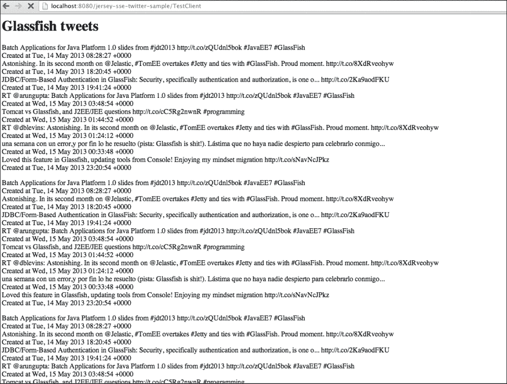
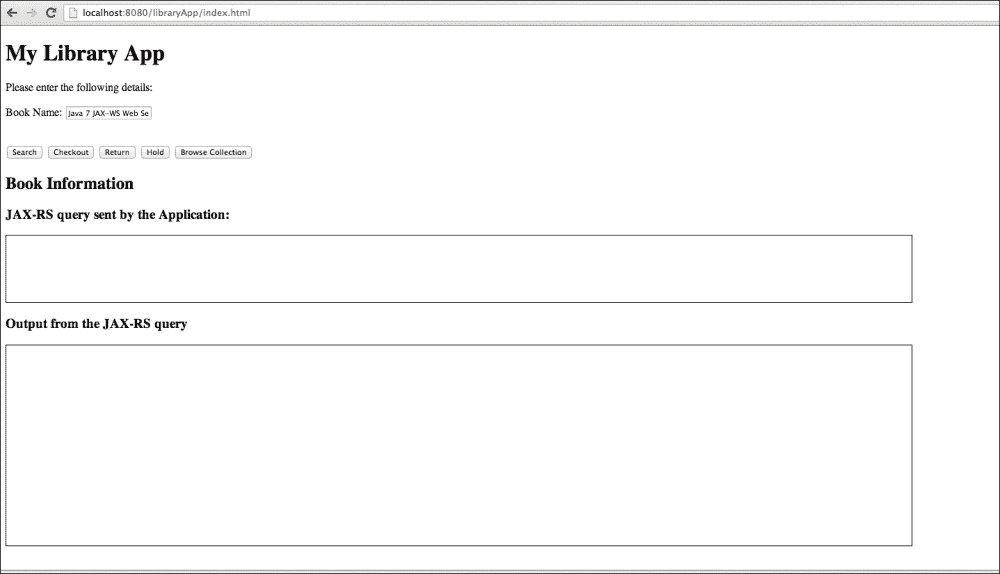

# 第五章：通过示例学习 RESTful Web 服务

在前几章中介绍和讨论的 API 和技术适用于不同类型的项目和用例。本章将介绍这些 API 和技术如何融入解决方案和面向案例的软件系统。

在简要介绍应用程序预期要做什么之后，我们将将其分解，并专注于每个组件和技术。所以，来一杯额外的摩卡，加入我们的乐趣吧。

本章将涵盖以下两个示例：

+   基于 Twitter 搜索 API 的事件通知应用程序，展示 Server-sent Events、**Async Servlet**、JSON-P API 和 JAX-RS

+   展示 JAX-RS API、WebSockets、JSON-P API 和异步 JAX-RS 资源以形成一个端到端解决方案的图书馆应用程序

# 事件通知应用程序

基于 Twitter 的应用程序是第一个示例应用程序，它将演示一个基于 HTML5 的应用程序，该应用程序在 Server-sent Events、JAX-RS 2.0 API、异步 Servlet 和 Twitter 搜索 API 的基础上开发，以定期动态更新页面并显示更多搜索结果。

用于示例应用程序的构建系统是 **Maven**，示例可以部署在任何 Java EE 7 兼容的应用服务器中，特别是 GlassFish v4.0，它是 Java EE 7 规范的开源参考实现。

### 注意

Apache Maven 是一个构建管理工具。有关 Maven 的更多信息，请访问 [`maven.apache.org`](http://maven.apache.org)，有关 GlassFish 的更多信息，请访问 [`glassfish.java.net/`](http:// https://glassfish.java.net/)

## 项目的布局

项目的目录布局遵循标准的 Maven 结构，以下表格中简要说明了：

| 源代码 | 描述 |
| --- | --- |
| `src/main/java` | 此目录包含图书馆应用程序所需的所有源代码。 |
| `src/main/webapp` | 此目录包含 JavaScript 文件、html 文件和 `WEB-INF/web.xml` 文件。 |

## 事件通知 GUI

事件通知应用程序由一个屏幕组成，该屏幕用作根据 Twitter 流显示动态更新的载体。屏幕在以下屏幕截图中显示：



该应用程序是一个基本示例，显示在携带更新的事件发生并接收时进行更新。这可能是一则新推文、Facebook 朋友的更新或任何其他类型的事件，这些事件可以被任何 Java EE 管理组件消费。关键是，一旦与服务器建立了通信通道，服务器就有责任在事件发生时发送更新。客户端不需要轮询更新。

在这个示例中，当 servlet 被加载时，有一个 **EJB 定时器**，每 10 秒运行一次，并激活一个使用 Twitter 搜索 API 获取新推文的 CDI 容器。Twitter 搜索 API 以 JSON 格式返回推文。然后，使用 JAX-RS 的服务器端发送事件支持将这些推文信息发送到客户端。在客户端，JSON 数据被解析以在屏幕上显示某些信息。

## 对事件通知应用程序的详细分析

在对应用程序应该做什么进行初步介绍之后，让我们进一步剖析它，并研究构建此应用程序的各个单独组件。

下面是介绍应用程序详细信息的顺序：

+   `web.xml`

+   `Application` 类的实现

+   应用程序中使用的 JAX-RS 资源

+   应用程序使用的异步 Servlet 客户端

+   与 Twitter 搜索 API 交互的 EJB

### `web.xml`

要设置应用程序，请按照以下方式配置 servlet 部署描述符 `web.xml`：

```java
<display-name>jersey-sse-twitter-sample</display-name>

<servlet>
  <servlet-name>Jersey application</servlet-name>
  <servlet-class>org.glassfish.jersey.servlet.ServletContainer</servlet-class>
  <init-param>
    <param-name>javax.ws.rs.Application</param-name>
    <param-value>org.glassfish.jersey.sample.sse.MyApplication</param-value>
  </init-param>
  <load-on-startup>1</load-on-startup>
  <async-supported>true</async-supported>
</servlet>
<servlet-mapping>
  <servlet-name>Jersey application</servlet-name>
  <url-pattern>/*</url-pattern>
</servlet-mapping>
```

`MyApplication` 是 `javax.ws.rs.Application` 的子类。它用于注册 JAX-RS 资源，以便 JAX-RS API 能够识别。

将 `async-supported` 元素设置为 `true` 以指示该 servlet 支持异步处理。

### `Application` 类的实现

下面是 `Application` 子类的实现：

```java
public class MyApplication extends Application {

  Set<Class<?>> classes = new HashSet<Class<?>>() {
    { add(ServerSentEventsResource.class);
      add(SseFeature.class);
    }
  };

  @Override
  public Set<Class<?>> getClasses() {
    return classes;
  }
}
```

`getClasses()` 方法被重写以返回：

+   `ServerSentEventsResource.class`

+   `SseFeature.class`

`ServerSentEventsResource` 类是一个简单的 JAX-RS，它将来自 Twitter 搜索 API 的 JSON 数据作为服务器端发送事件发送。我们将在下一节中更详细地查看 `ServerSentEventsResource`。

`SseFeature.class` 是由 **Jersey** 提供的实现，用于支持 `ServerSentEvents` 功能。它将确保数据是 `"text/event-stream"` 媒体类型。

### 小贴士

要启用服务器端发送事件功能，将 `SseFeatures.class` 添加到 `javax.ws.rs.Application` 实现中 `getClasses()` 方法返回的类列表中。

### 应用程序使用的 JAX-RS 资源

下面是 `ServerSentEventsResource.java` 的源代码。这是一个简单的 POJO，使用 `@Path` 注解来标识资源的 URI。

```java
@Path("twittersse")
public class ServerSentEventsResource {

  static EventOutput eventOutput = new EventOutput();

  @GET
  @Produces(SseFeature.SERVER_SENT_EVENTS)
 public EventOutput getMessage() {
    return eventOutput;
  }

  @POST
  @Consumes(MediaType.TEXT_PLAIN)
 public void sendMessage(String message) throws IOException {
    eventOutput.write(new OutboundEvent.Builder().name("custom-message").data(String.class, message).build());
  }
}
```

`EventOutput` 类是一个提供出站服务器端发送事件的通道。当我们从 `getMessage()` 方法返回 `EventOutput` 对象时，Jersey 实现保持连接打开，以便可以发送服务器端发送事件。这个类的单个实例与一个精确的 HTTP 连接相对应。

`sendMessage()` 方法使用 `eventOutput.write()` 方法写入消息。要写入服务器端发送事件，我们使用 `OutboundEvent.Builder()` 方法。将名称 `"custom-message"` 传递给这个 `OutboundEvent.Builder()` 方法，然后我们将消息对象传递给 `build()` 方法。消息对象包含我们示例中与推文相关的信息。

此外，可以使用`OutboundEvent.Builder().id(id)`将一个 ID 与之前未涵盖的 Server-sent Event 关联。

### 应用程序使用的异步 Servlet 客户端

在正常的请求响应场景中，每个请求都会保持一个线程运行，直到响应可用。当后端处理请求花费很长时间时，这会变成一个瓶颈，处理请求的线程等待后端完成准备所需的响应，因此无法处理任何新的传入请求。

解决这个问题的一种方法是将请求保存在一个集中队列中，并在线程可用时发送请求。调用`startAsync()`方法将请求/响应对存储在队列中，`doGet()`方法返回，调用线程可以被回收。

下面的部分讨论了使用 Servlet 进行异步请求处理的概念。

这里是应用程序的 Servlet 客户端代码：

```java
@WebServlet(name = "TestClient", urlPatterns = {"/TestClient"}, asyncSupported = true)
public class TestClient extends HttpServlet {

  private final static String TARGET_URI = "http://localhost:8080/jersey-sse-twitter-sample/twittersse";
```

这是一个设置了`urlPatterns={"/TestClient"}`和`async-supported`属性为 true 的 Servlet。`async-supported`属性指示容器这个 Servlet 将异步处理传入的请求，因此容器应该对处理线程的请求分配进行必要的修改。

下面的代码片段显示了处理`GET`和`POST`请求的`service()`方法的实现：

```java
/**
* Processes requests for both HTTP
* <code>GET</code> and
* <code>POST</code> methods.
*
* @param request  servlet request
* @param response servlet response
* @throws ServletException if a servlet-specific error occurs
* @throws IOException      if an I/O error occurs
*/
@Override
protected void service(final HttpServletRequest request, final HttpServletResponse response)
throws ServletException, IOException {
  response.setContentType("text/html;charset=UTF-8");

  try {

 final AsyncContext asyncContext = request.startAsync();
 asyncContext.setTimeout(600000);
 asyncContext.addListener(new AsyncListener() {

      @Override
      public void onComplete(AsyncEvent event) throws IOException {
      }

      @Override
      public void onTimeout(AsyncEvent event) throws IOException {
        System.out.println("Timeout" + event.toString());
      }

      @Override
      public void onError(AsyncEvent event) throws IOException {
        System.out.println("Error" + event.toString());
      }

      @Override
      public void onStartAsync(AsyncEvent event) throws IOException {
      }
    });

 Thread t = new Thread(new AsyncRequestProcessor(asyncContext));
    t.start();

    } catch (Exception e) {
    e.printStackTrace();
  }

}
```

在前面的代码片段中，通过调用`request.startAsync()`方法获得`AsyncContext`对象的实例。

`asyncContext.setTimeout(60000)`方法表示 Servlet 异步操作的毫秒级超时。

使用`asyncContext.addListener()`方法向异步上下文添加一个`AsyncListener`接口的实现。

在请求上调用`startAsync()`方法后，当操作完成、出现错误或操作超时时，将发送一个`AsyncEvent`对象到`AsyncListener`接口的实现。如前所述，我们有一个实现`AsyncListener`接口的实现，可以执行以下方法：`onComplete()`、`onError()`、`onTimeOut()`或`onStartAsync()`。

下面的代码中显示的`AsyncRequestProcessor`类是线程的`Runnable`实例，执行实际工作。`AsyncRequestProcessor`类将`EventSource`对象注册为监听由之前提到的 JAX-RS `ServerSentEventsResource.java`发送的 Server-sent Events。当事件发生时，`onEvent()`回调被触发，并使用 JSONP 解析事件。

```java
class AsyncRequestProcessor implements Runnable {

  private final AsyncContext context;

  public AsyncRequestProcessor(AsyncContext context) {
    this.context = context;
  }

  @Override
  public void run() {
    Client client = ClientBuilder.newClient();
    context.getResponse().setContentType("text/html");
    final javax.ws.rs.client.WebTarget webTarget;
    try {
      final PrintWriter out = context.getResponse().getWriter();
      webTarget = client.target(new URI(TARGET_URI));
      out.println("<html>");
      out.println("<head>");
      out.println("<title>Glassfish SSE TestClient</title>");
      out.println("</head>");
      out.println("<body>");
      out.println("<h1>");
      out.println("Glassfish tweets");
      out.println("</h1>");
      // EventSource eventSource = new EventSource(webTarget, executorService) {
        EventSource eventSource = new EventSource(webTarget) {
          @Override
          public void onEvent(InboundEvent inboundEvent) {
            try {
              //get the JSON data and parse it
              JSONObject jsonObject = JSONObject.fromObject(inboundEvent.getData(String.class,
              MediaType.APPLICATION_JSON_TYPE));
              //get the JSON data and parse it
              JsonReader jsonReader = Json.createReader (new ByteArrayInputStream(inboundEvent.getData(String.class,
              MediaType.APPLICATION_JSON_TYPE).getBytes()));
              JsonArray jsonArray = jsonReader.readArray();
              for (int i = 0; i <jsonArray.size(); i++) {
                JsonObject o = ((JsonObject)jsonArray.getJsonObject(i)) ;
                out.println( o.get("text"));
                out.println("<br>");
                out.println("Created at " + o.get("created_at"));
                out.println("<br>");

              }
              out.println("</p>");
              out.flush();
            } catch (IOException e) {
              e.printStackTrace();
            }
          }
        };
      } catch (Exception e) {
        e.printStackTrace();
      }
    }
  }
}
```

如前所述的代码所示，我们使用**JSR 353 Java API for JSON Processing**从`inboundEvent#getData()`方法创建一个`JSonReader`对象。`JSONArray`对象由`jsonReader.readArray()`方法返回。从数组中读取`JsnObject`对象，并显示推文信息。

### 与 Twitter 搜索 API 交互的 EJB

这是调用 Twitter 搜索 API 的 EJB 代码。此 EJB 有一个计时器，将定期调用 Twitter 搜索 API 以获取 GlassFish 的推文，并将结果以 JSON 格式返回。

```java
@Stateless
@Named
public class TwitterBean {
}
```

`@Stateless` 注解表示这是一个无状态会话 Bean。

**Twitter v1.1 API** 使用 **OAuth** 提供对其 API 的授权访问。Twitter 允许应用程序代表应用程序本身（而不是代表特定用户）发出认证请求。有关**OAuth**的更多信息，请查看[`dev.twitter.com/docs/api/1.1/overview`](https://dev.twitter.com/docs/api/1.1/overview)。

要运行此演示，您需要一个 Twitter 账户，并根据以下链接中指定的信息创建一个应用程序：[`dev.twitter.com/docs/auth/oauth`](https://dev.twitter.com/docs/auth/oauth)。请参阅包含示例的 `Readme.txt`，了解如何运行示例的说明。

以下代码使用了来自 [`twitter4j.org/en/index.html`](http://twitter4j.org/en/index.html) 的 **twitter4j** API 来集成 Java 和 Twitter API。

这是连接到`SEARCH_URL`并获取推文的代码

```java
/**
* Since twitter uses the v1.1 API we use twitter4j to get
* the search results using OAuth
* @return a JsonArray containing tweets
* @throws TwitterException
* @throws IOException
*/
public JsonArray getFeedData() throws TwitterException, IOException {

  Properties prop = new Properties();

  //load a properties file
  prop.load(this.getClass().getResourceAsStream("twitter4j.properties"));

  //get the property value and print it out
  String consumerKey = prop.getProperty("oauth.consumerKey");
  String consumerSecret= prop.getProperty("oauth.consumerSecret");
  String accessToken = prop.getProperty("oauth.accessToken");
  String accessTokenSecret = prop.getProperty("oauth.accessTokenSecret");
  ConfigurationBuilder cb = new ConfigurationBuilder();
  cb.setDebugEnabled(true)
  .setOAuthConsumerKey(consumerKey)
  .setOAuthConsumerSecret(consumerSecret)
  .setOAuthAccessToken(accessToken)
  .setOAuthAccessTokenSecret(accessTokenSecret);

  TwitterFactory tf = new TwitterFactory(cb.build());
  Twitter twitter = tf.getInstance();
  Query query = new Query("glassfish");
  QueryResult result = twitter.search(query);
  JsonArrayBuilder jsonArrayBuilder  = Json.createArrayBuilder();
  for (Status status : result.getTweets()) {
    jsonArrayBuilder
    .add(Json.createObjectBuilder().
    add("text", status.getText())
    .add("created_at", status.getCreatedAt().toString()));
  }
  return jsonArrayBuilder.build() ;
}
```

上述代码读取`twitter4j.properties`，并使用`consumerKey`、`consumerSecret`、`accessToken`和`accessTokenSecret`键创建一个`ConfigurationBuilder`对象。使用`TwitterFactory` API 创建 Twitter 对象的实例。创建一个`Query`对象，用于向 Twitter 发送带有关键字`"glassfish"`的搜索请求。`twitter.search`返回与指定查询匹配的推文。此方法调用[`search.twitter.com/search.json`](http://search.twitter.com/search.json)。

一旦获得`QueryResult`对象，使用`JsonArrayBuilder`对象构建包含结果的 JSON 对象。有关 twitter4j API 的更多信息，请查看[`twitter4j.org/oldjavadocs/3.0.0/index.html`](http://twitter4j.org/oldjavadocs/3.0.0/index.html)。

EJB Bean 有一个额外的方法，将调用 **EJB 计时器**。以下是 EJB 计时器代码，它将使用`POST`方法将这些从 Twitter 搜索 API 获取的推文发送到 REST 端点`ServerSentEventsResource`。

```java
private final static String TARGET_URI = "http://localhost:8080/jersey-sse-twitter-sample";

@Schedule(hour = "*", minute = "*", second = "*/10")
public void sendTweets() {

  Client client = ClientBuilder.newClient();
  try {
    WebTarget webTarget= client.target(new URI(TARGET_URI)) ;
    JsonArray statuses = null;

 statuses = getFeedData();
    webTarget.path("twittersse").request().post(Entity.json(statuses));
  }(catch Exception e) {
    e.printStackTrace();
  }
}
```

使用`@Schedule`注解来安排每 10 秒抓取一次推文。EJB 规范提供了更多关于`@Schedule`用法的详细信息。`JsonArray`对象`statuses`从前面章节中提到的`getFeedData()`方法获取内容。

使用`TARGET_URI`创建`WebTarget`，该 URL 为`http://localhost:8080/jersey-sse-twitter-sample`，应用程序部署于此。

`webTarget.path("twittersse")`方法指向前面提到的`ServerSentEventsResource`类，该类是 REST 资源。

使用`request().post(Entity.text(message))`方法将来自 Twitter 搜索 API 的推文作为文本实体发送。

这是事件序列：

1.  用户从以下 URL 部署应用并调用 Servlet 客户端`http://localhost:8080/jersey-sse-twitter-sample`。

1.  EJB 计时器每 10 秒被调度一次。

1.  EJB 计时器将每 10 秒调用一次 Twitter 搜索 API 以获取`"glassfish"`的推文，格式为 JSON。

1.  EJB 计时器使用`POST`请求将步骤中获得的数据发送到 JAX-RS `ServerSentEventsResource`类。

1.  JAX-RS 资源`ServerSentEventsResource`打开`EventOutput`通道，这是 Server-sent Events 的输出通道。

1.  步骤 1 中的 Servlet 客户端打开了一个`EventSource`对象，该对象正在监听 Server-sent Events。

1.  Servlet 客户端使用 JSON-P API 解析 Twitter 动态。

1.  最后，推文在浏览器中显示。

# 图书馆应用

图书馆应用是一个简单、自包含、基于现实生活的应用，演示了 HTML5 技术，如 WebSockets，并展示了如何使用 JAX-RS 动词，如何使用 JSON-P API 写入数据，以及如何利用处理资源的异步特性。为了保持一致性，应用包含使用简单 GUI 描述先前技术的组件，并且没有花哨的对话框或非常复杂的企业逻辑。

## 应用程序的部署方式

用于示例应用的构建系统是 Maven，示例可以部署在任何 Java EE 7 兼容的应用服务器中，特别是 GlassFish v4.0，它是 Java EE 规范的开放源代码参考实现。

## 项目的布局

项目目录布局遵循标准的 Maven 结构，以下表格简要说明：

| 来源代码 | 描述 |
| --- | --- |
| `src/main/java` | 此目录包含图书馆应用所需的所有源代码。 |
| `src/main/webapp` | 此目录包含 JavaScript 文件、HTML 文件和`WEB-INF/web.xml`文件。 |

## 图书馆应用 GUI

图书馆应用由一个屏幕组成，该屏幕作为展示不同数据表示和收集输入表单的载体。屏幕如下截图所示：



使用屏幕，用户可以进行以下操作：

1.  浏览书籍集合。

1.  搜索一本书。

1.  检出书籍。

1.  归还一本书。

1.  预订一本书。

以下表格显示了用户执行的操作、幕后发生的事情的详细信息以及处理请求涉及的 API 和技术：

| 动作 | 使用的 API 和技术 |
| --- | --- |
| 浏览书籍集合 | 此任务使用 JAX-RS `GET`动词获取图书馆中的书籍集合。它使用 JSON-P API 将数据写入 JSON 格式。我们使用 JAX-RS `MessageBodyWriter`类的实现，该类知道如何将自定义类序列化为 JSON 输出。 |
| 借阅书籍 | 当从图书馆借阅书籍时，它将从图书馆拥有的书籍集合中减少。这个任务展示了 JAX-RS 动词 `DELETE` 的使用，并将书籍从集合中删除。 |
| 归还书籍 | 当书籍归还到图书馆时，它将被添加到图书馆拥有的书籍集合中。这个任务展示了 JAX-RS 动词 `POST` 的使用，并将书籍添加到集合中。 |
| 预订书籍 | 当一本书被预订时，图书馆应用程序应该通知当前拥有这本书的其他用户归还它。一旦书籍归还，应向请求书籍的用户发送通知。这是一个异步操作。这个任务展示了 JAX-RS 资源异步处理的使用。 |

## 应用程序交互监控

有一个面板会显示发送到端点的查询，此外，我们还将显示端点返回的输出。

## 对图书馆应用程序的详细分析

在对应用程序应该做什么的初步介绍之后，让我们进一步剖析它，并研究构建此应用程序的每个单独组件。

以下是将介绍应用程序详细信息的顺序：

+   `web.xml`

+   我们应用程序中 `Application` 子类的实现

+   我们应用程序中使用的 JAX-RS 实体提供者

+   HTML 页面

+   以下功能的 JavaScript 片段和 JAX-RS 资源方法：

    +   浏览书籍集合

    +   搜索书籍

    +   借阅书籍

    +   归还书籍

    +   预订书籍

### `web.xml`

要设置应用程序，按照以下方式配置 servlet 部署描述符 `web.xml`：

```java
<servlet>
  <servlet-name>org.sample.library.BookApplication</servlet-name>
  <init-param>
    <param-name>javax.json.stream.JsonGenerator.prettyPrinting</param-name>
    <param-value>true</param-value>
  </init-param>
  <load-on-startup>1</load-on-startup>
</servlet>

<welcome-file-list>
  <welcome-file>
    index.html
  </welcome-file>
</welcome-file-list>
<servlet-mapping>
  <servlet-name>org.sample.library.BookApplication</servlet-name>
  <url-pattern>/app/*</url-pattern>
</servlet-mapping>
```

在前面的片段中，我们定义了一个用于接收 JAX-RS 应用程序 `BookApplication` 子类的 servlet。URL 模式是 `/app/*`。

### `Application` 子类

这里是 `BookApplication` 类的片段，该片段在 `web.xml` 描述中提到。

```java
public class BookApplication extends Application {

  @Override
  public Set<Class<?>> getClasses() {
    Set<Class<?>> classes = new HashSet<Class<?>>();
    classes.add(BooksResource.class);
    classes.add(BookCollectionWriter.class);
    classes.add(BookWriter.class);
    return classes;
  }
}
```

`BookApplication` 类扩展了 JAX-RS 的 `Application` 类。在 `getClasses()` 方法实现中，以下内容被注册：

+   `BookResource.class`

+   `BookCollectionWriter.class`

+   `BookWriter.class`

`BookResource` 类将在接下来的几节中详细介绍，包括 JavaScript 的每个功能；`BookResource` 类的相应方法将进行解释。

`BookCollectionWriter` 类是 `MessageBodyWriter` 接口的一个实现，它接收一个 `List<Book>` 对象并将其序列化为 JSON 格式。为了产生 `application/json` 编码的输出，`BookCollectionWriter` 类使用了 JSON-P API。

`BookWriter`类提供了序列化用户定义的`Book`类的功能，如下节所示。`Book`类有诸如书籍名称、作者和 ISBN 等字段。使用这个`BookWriter`类，可以将这个`Book`类转换为资源中指定的格式，例如`"text/plain"`或`"application/json"`。

### JAX-RS 实体提供者：BookCollectionWriter

与前面章节中提到的`BookWriter`类类似，在示例中还有一个名为`BookCollectionWriter`的类；这个类用于序列化书籍列表。以下是`BookCollectionWriter`类中`writeTo()`方法的实现：

```java
@Override
public void writeTo(List<Book> books, Class<?> type, Type genericType, Annotation[] annotations, MediaType mediaType, MultivaluedMap<String, Object> httpHeaders, OutputStream entityStream) throws IOException, WebApplicationException {
  StringWriter writer = new StringWriter();
 if (mediaType.equals(MediaType.APPLICATION_JSON_TYPE)) {
    JsonGenerator generator = Json.createGenerator(writer);
    Map<String, Object> configs;
    configs = new HashMap<String, Object>(1);
    configs.put(JsonGenerator.PRETTY_PRINTING, true);

    generator.writeStartArray();
    for (Book book: books) {
      generator.writeStartObject()
      .write("Name", book.getName())
      .write(" ISBN", book.getIsbn())
      .write("Author",book.getAuthor()) .writeEnd();

    }
    generator.writeEnd();
    generator.close();
    entityStream.write(writer.toString().getBytes());
 } else if (mediaType.equals(MediaType.TEXT_PLAIN_TYPE)) {
    StringBuilder stringBuilder = new StringBuilder("Book ");
    for (Book book: books) {
      stringBuilder.append(book.toString()).append("\n");
    }
    entityStream.write(stringBuilder.toString().getBytes());

  }
}
```

上述代码执行媒体类型过滤；如果`mediaType`参数等于`MediaType.APPLICATION_JSON_TYPE`，则使用 JSON-P API 创建一个`JsonGenerator`对象。使用`JsonGenerator`类的`writeStartArray()`和`writeStartObject()`方法，写入 JSON 对象数组。

如果`mediaType`参数等于`MediaType.TEXT_PLAIN_TYPE`，则返回书籍的字符串表示形式。

### HTML 页面

如您所回忆的，当应用程序在浏览器中启动时，您将看到`index.html`屏幕。让我们看一下`index.html`文件的源代码：

```java
<!DOCTYPE html>
<html>
  <head>
    <meta http-equiv="Content-Type" content="text/html; charset=UTF-8">
    <title>Library App</title>
    <script src="img/main.js">
    </script>
  </head>
  <body>
    <h1 id="helloMessage">
    </h1>

    Please enter the following details:
    <p>
      Book Name:
      <input type="text" value="Game of thrones" id="bookName"/>
    </p>
    <br>
    <button onclick="search_onclick()">Search</button>
    <button onclick="checkout_onclick()">Checkout</button>
    <button onclick="return_onclick()">Return</button>
    <button onclick="hold_onclick()">Hold</button>
    <button onclick="browse_onclick()">Browse Collection</button>

    <h2>Book Information</h2>
    <h3>JAX-RS query sent by the Application:</h3>

 <div id="query" style="border: 1px solid black; color: black; height: 6em; width: 80%"></div>
    <h3>Output from the JAX-RS query</h3>
 <div id="output" style="border: 1px solid black; color: black; height: 18em; width: 80%"></div>
  </body>
</html>
```

这是一种标准的 HTML，它使用一个名为`main.js`的外部 JavaScript 文件来导入以下功能：

+   浏览书籍集合

+   搜索书籍

+   检索书籍

+   归还书籍

+   预订书籍

突出的`div`元素`query`和`output`显示了 JAX-RS 查询和页面上的输出。每个按钮都有一个与它关联的`onclick()`事件，该事件调用 JavaScript 中的一个函数。每个函数将在下一节中详细介绍。

### 浏览书籍集合

当用户点击 HTML 页面上的**浏览集合**按钮时，会检查输入，然后在 JavaScript 中调用`sendBrowseRequest()`函数。

#### 使用 JavaScript

这里是`sendBrowseRequest()`的代码片段：

```java
function sendBrowseRequest( ) {
  var req = createRequest(); // defined above
  // Create the callback:
  req.onreadystatechange = function() {
    if (req.readyState == 4) {
      document.getElementById("query").innerHTML="GET app/library/books" ;
      document.getElementById("output").innerHTML=req.responseText;
    }
  }
  req.open("GET","app/library/books" ,true);
  req.send(null);
}
```

`createRequest()`函数用于创建`XMLHttpRequest`对象，如第二章中所述，*WebSockets 和服务器端事件*。发送到 JAX-RS 资源的请求是一个带有 URI `/app/library/books` 的`GET`请求（我们将在下一节中介绍 JAX-RS 资源）。当`XMLHttpRequest`对象的`readyState`值为`4`时，表示响应已完成，我们可以获取数据。在我们的示例中，我们使用代码片段`document.getElementById("output").innerHTML=req.responseText;`显示`responseText`。

#### GET 请求的 JAX-RS 资源方法

这里是`GET`请求的代码片段：

```java
@GET
@Path("books")
@Produces({MediaType.TEXT_PLAIN, MediaType.APPLICATION_JSON})
public List<Book> browseCollection() {
  return bookService.getBooks();
} 
```

这是一个非常简单的方法，它将使用我们之前提到的`BookCollectionWriter`类来输出`List<Book>`对象，以 JSON 格式或纯文本格式。

### 搜索书籍

当用户点击 HTML 页面上的**搜索**按钮时，在 JavaScript 中调用`sendSearchWSRequest()`函数。

#### 使用 JavaScript

`sendSearchWSRequest()`函数展示了我们应用程序中的 WebSocket 功能。在 JavaScript 中初始化 WebSocket URI 如下：

```java
var wsUri = "ws://localhost:8080/libraryApp/app/websockets";
function sendSearchWSRequest(book) {
  websocket.send(book);
  console.log("Searching for: " + book);
}
```

`sendSearchWSRequest()`函数使用 WebSocket JavaScript API 将字符串`book`名称发送到下节中所示的`BookWebSocket`类。

#### WebSockets 端点

这里是 WebSockets 的`ServerEndpoint`注解类`BookWebSocket`的代码片段：

```java
@ServerEndpoint(value="/app/websockets")
public class BookWebSocket {
  @OnMessage
  public String searchBook(String name) {
    return "Found book " + name;
  }
}
```

`BookWebSocket`是一个带有`@ServerEndpoint`注解的 POJO，初始化为`/app/websockets`的 URI。`searchBook()`方法上的`@OnMessage`注解会在 WebSocket 服务器端点接收到消息时调用此方法。为了示例的简单性，WebSocket 端点仅返回一个包含书籍名称的字符串。

### 检索一本书

当用户点击 HTML 页面上的**借阅**按钮时，会检查输入，然后在 JavaScript 中调用`sendCheckoutRequest()`函数。

#### 使用 JavaScript

这里是`sendCheckoutRequest()`函数的代码片段：

```java
function sendCheckoutRequest( book) {
  var req = createRequest(); // defined above
  ;
  // Create the callback:
  req.onreadystatechange = function() {

    if (req.readyState == 4) {
      document.getElementById("query").innerHTML="DELETE app/library/book/" + encodeURI(book.trim());
      document.getElementById("output").innerHTML=req.responseText;

    }
  }
  req.open("DELETE","app/library/book/" + book,true);
  req.send(null);
}
```

发送到 JAX-RS 资源的请求是一个放置在`/app/library/book/` URI 上的`DELETE`请求。我们将在下一节中介绍 JAX-RS 资源。

#### 用于`DELETE`请求的 JAX-RS 资源方法

这里是`DELETE`请求的代码片段：

```java
@DELETE
@Path("book/{name}")
@Produces({MediaType.TEXT_PLAIN })
@Consumes({MediaType.TEXT_PLAIN })
public Book checkoutBook(@PathParam("name") String nameOfBook) {
  return bookService.deleteBook(nameOfBook);

}
```

这是一个非常简单的函数，如果集合中存在书籍，则会删除书籍，并使用之前介绍的`BookWriter`类发送书籍详情。

### 归还一本书

当用户点击 HTML 页面上的**归还**按钮时，会检查输入，然后在 JavaScript 中调用`sendReturnRequest()`函数。

#### 使用 JavaScript

这里是`sendReturnRequest()`函数的代码片段：

```java
function sendReturnRequest( book) {
  var req = createRequest(); // defined above
  ;
  // Create the callback:
  req.onreadystatechange = function() {

    if (req.readyState == 4) {
      document.getElementById("query").innerHTML="POST app/library/book/" + encodeURI(book.trim());
      document.getElementById("output").innerHTML=req.responseText;

    }
  }
  req.open("POST","app/library/book/" + book,true);
  req.send(null);
}
```

发送到 JAX-RS 资源的请求是一个以`app/library/book/`为目标 URI 的`POST`请求。

#### 用于`POST`请求的 JAX-RS 资源方法

这里是`POST`请求的代码片段：

```java
@POST
@Path("book/{name}")
@Produces({MediaType.TEXT_PLAIN })
@Consumes({MediaType.TEXT_PLAIN })
public String returnBook(@PathParam("name") String nameOfBook)      {

  return "Successfully returned Book " + nameOfBook;
}
```

### 预约一本书

当用户点击 HTML 页面上的**预约**按钮时，会检查输入，然后在 JavaScript 中调用`sendHoldRequest()`函数。

#### 使用 JavaScript

这里是`sendHoldRequest()`函数的代码片段：

```java
function sendHoldRequest( book) {
  var req = createRequest(); // defined above
  ;
  // Create the callback:
  req.onreadystatechange = function() {

    if (req.readyState == 4) {
      document.getElementById("query").innerHTML="POST app/library/hold/" + encodeURI(book.trim());
      document.getElementById("output").innerHTML=req.responseText;

    }
  }
  req.open("POST","app/library/hold/" + book,true);
   req.send(null);

}
```

向位于`app/library/hold/` URI 的 JAX-RS 资源发送一个`POST`请求。该资源将在下一节中介绍。

#### 用于异步`POST`请求的 JAX-RS 资源方法

这里是放置书籍预约的 JAX-RS 资源方法。这是一个异步资源，在第四章中介绍，*JSON 和异步处理*：

```java
/**
* Asynchronously reply to placing a book on hold after sleeping for sometime
*
*/
@POST
@Produces({MediaType.TEXT_PLAIN})
@Path("hold/{name}")
public void asyncEcho(@PathParam("name") final String name,  @Suspended final AsyncResponse ar) {
  TASK_EXECUTOR.submit(new Runnable() {

    public void run() {
      try {
        Thread.sleep(SLEEP_TIME_IN_MILLIS);
      } catch (InterruptedException ex) {
        ar.cancel();
      }
      ar.resume("Placed a hold for " + name);
    }
  });
}
```

`AsyncResponse` 类型的参数 `ar` 与 Servlet 3.0 规范中的 `AsyncContext` 类类似，它简化了异步请求的执行。在这个例子中，请求被暂停了特定的时间，响应通过 `AsyncResponse.resume()` 方法推送到客户端。

### 单例 EJB BookService

下面是存储关于书籍详细信息的单例 EJB 的代码：

```java
@Singleton
public class BookService {

  private static final HashMap<String,Book> books = new HashMap<String,Book>();

  public static void addBook(Book book) {
    books.put(book.getName(), book);
  }

  public static int getSize() {
    return  books.size();
  }

  public static Book deleteBook(String isbn) {
    return books.remove(isbn);
  }

  public static List<Book> getBooks() {
    return new ArrayList<Book>(books.values());
  }

  public BookService() {
    // initial content
    addBook( new Book("Java EE development using GlassFish Aplication Server","782345689","David Heffinger"));
    addBook( new Book("Java 7 JAX-WS Web Services","123456789","Deepak Vohra"));
    addBook( new Book("Netbeans IDE7 CookBook","2234555567","Rhawi Dantas"));
    addBook( new Book("Getting Started with RESTful WebServices","11233333","Bhakti Mehta, Masoud Kalali"));

  }
}
```

因此，我们已经详细了解了使用不同 JAX-RS 2.0、WebSockets 和 JSON-P API 的库应用程序。

# 摘要

本章介绍了两个实际的 RESTful Web 服务示例。一开始，使用事件通知示例，我们演示了如何使用服务器端发送事件（Server-sent Events）与异步处理 servlet，以及服务器如何在事件发生时将数据推送到客户端。

在图书馆应用程序中，我们介绍了 JAX-RS API 以及自定义消息体读取器和写入器。我们还演示了 JSON-P API 的使用。该库应用程序展示了如何从 JavaScript 客户端使用 WebSockets 并向 WebSockets 端点发送消息。
