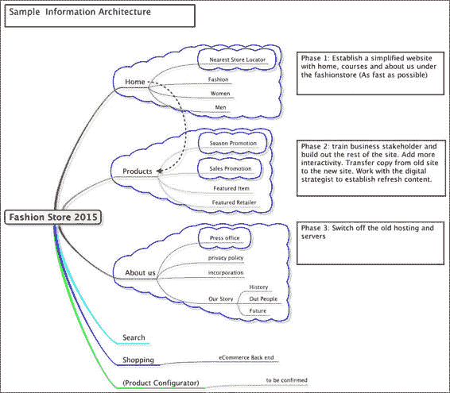

# 第一章. 数字 Java EE 7

|    | *"没有人比我更生气，因为网站不工作"* |    |
| --- | --- | --- |
|    | --*美国总统巴拉克·奥巴马，2013 年 10 月 21 日在玫瑰园的演讲* |

数字适应是当代网络设计涉及的软件开发者的时代标志。数字转型这个短语是商业高管们又一种迎合的时髦词汇。企业 Java 开发者不必害怕这个新的数字世界，因为我们参与构建这个星球上最激动人心的软件。我们正在为用户、客户和人们构建软件。将*数字*这个词替换为*用户体验*，你将立刻明白所有这些喧嚣的原因。

因此，让我们彻底摆脱营销术语。数字化转型将非在线业务流程转化为等效的在线版本。当然，一个笨重的丑陋毛毛虫不会一夜之间突然变成美丽的红雀蝶，没有生活经验和遗传因素。这需要开发者、设计师和建筑师相当大的技能来适应、转换并将业务需求应用于技术。近年来，软件行业已经认识到用户及其经验的合理性。本质上，我们已经成熟了。

这本书是关于那些能够成熟并且渴望成熟的开发者。这些开发者能够拥抱 Java 技术，并对相关网络技术表示同情。

在本章中，我们将从网络开发者的要求开始，也就是所谓的“前端”工程师，以及数字和创意行业。我们将调查企业 Java 平台，并问这样一个问题：Java 在哪里？我们将研究 JavaScript 的增长。我们将了解 Java EE 7 的现代网络架构。最后，我们将通过一个简单的 JavaServer Faces 示例结束本章。

# 在数字领域工作

在数字领域工作要求企业超越传统和制度化的思维。仅仅堆砌一些 HTML、几个指向新闻发布的链接和一些白皮书，打包一些写得不好的 JavaScript 代码，然后称之为网站，这种策略曾经是合适的。如今，私营和公共公司，甚至政府，通过关注高可用性和内容来为商业的长尾效应规划网络技术（[`en.wikipedia.org/wiki/Long_tail`](https://en.wikipedia.org/wiki/Long_tail)）。如果你的网络技术难以使用，那么你将不会赚到任何钱，也没有任何公民会使用你的在线服务。

# 数字 Java 开发者要求

作为数字开发者，你肯定需要强大的开发机器，能够同时运行多个应用程序。你需要坚强和自信，并坚持你的经验是最好的。你对自己的学习负责。数字开发者不应该被适合销售和营销部门的笔记本电脑所束缚。

你的工作机器必须能够物理上处理以下列表中每个工具的需求：

| 项目 | 说明 |
| --- | --- |
| Java SE 8（或至少 Java SE 7） | Java SE 8 于 2014 年 3 月 18 日发布，提供了 Lambda 表达式，其中函数是一等公民。Java 7 是短期内的可接受替代品，对于谨慎的商业 IT 总监来说也是如此。 |
| Java EE 7 | GlassFish 4.1 应用程序服务器是 Java EE 7 的参考实现，但缺乏专业支持。作为替代，IT 总监可以考虑拥有服务级别协议的 Red Hat JBoss WildFly 9。 |
| 集成开发环境 | IDE 如 IntelliJ IDEA 14、Eclipse Kepler 4.3 或 NetBeans 8 |
| Adobe 创意套件 | Adobe Photoshop CC（有时还有 Adobe Illustrator）是创意数字媒体行业内的实际图形工作。 |
| Cucumber 或 Selenium | Cucumber 是一种行为驱动开发，用于测试 Web 应用程序的功能。它是针对 Ruby 编程语言编写的，因此需要该环境和工具链。 |
| 一套现代网络浏览器 | Mozilla Firefox、Google Chrome 和 Internet Explorer 10 以及支持 HTML5 和最新 W3C 标准的实际网络浏览器。最近推出的 Windows 10 需要 Edge。 |
| 网络浏览器开发者插件 | 在你的工具集中拥有 JavaScript 调试器、HTML 和 CSS 元素检查器非常有帮助。如 Chrome 开发者工具之类的插件可以简化数字工程。 |
| 文本编辑器 | 轻量级文本编辑器常用于处理小型工作，对于编辑 JavaScript、Puppet（或 Chef）脚本，以及 HTML 和 CSS 文件非常有用。 |

只需查看这个软件表，就不难理解为什么平均的商业提供的公司笔记本电脑在处理这种开发时如此不配备。

### 小贴士

**数字工程师是聪明、专业的工程师**

我个人有一台 2012 年的 MacBook Pro Retina 版，16 GB 的 RAM，512 GB 的静态硬盘驱动器作为我的主要机器。一些客户给了我配置不当的机器。一个特定的金融客户给了我一台只有 4 GB RAM 的 Dell Latitude，运行 Windows 7 专业版。这台开发者机器性能如此之差，以至于我不得不多次投诉。通知你业务中的决策者，数字工作者需要适合工程和设计优秀用户体验的开发机器。

让我们从创造力和设计转向 Java 平台。

# 图中的 Java

Java 平台目前被广泛使用。它是最先商业化的语言，具备 JVM 和具有垃圾回收、沙箱安全和网络功能的字节码，被企业所采用。Java 的最大优势是，企业信任这个平台来驱动服务器端计算中的企业级应用。自 1995 年以来，这种深度优势已经发展到平台被视为非常成熟和主流的程度。作为主流群体的一个部分，其劣势是创新需要一段时间才能发生；作为平台的管理者，早期的 Sun Microsystems 和现在的 Oracle Corporation，始终保证向后兼容性和通过 Java Community Process 维护标准。

JVM 是平台上的皇冠上的宝石。Java 是在 JVM 上运行的母编程语言。其他如 Scala、Groovy 和 Clojure 等语言也运行在 JVM 上。这些替代 JVM 语言很受欢迎，因为它们向主流开发者引入了许多函数式编程思想。函数式编程原语，如闭包和推导式，以及如 Scala 这样的语言展示了纯面向对象模型和混入。这些语言受益于一个名为 **REPL** 的易于交互的工具。

### 小贴士

事实上，Java SE 9 很可能将拥有 **读取-评估-打印-循环**（**REPL**）。请密切关注官方 OpenJDK 项目 Kulla 的进展，该项目网址为 [`openjdk.java.net/projects/kulla/`](http://openjdk.java.net/projects/kulla/)。

2014 年发布的 Java SE 8 特性包括函数式接口，也称为 Lambda，它将闭包和函数式块的好处带到了平台上的主要 JVM 语言。

无论你选择哪种编程语言来开发你的下一个企业级应用，Java、Scala 或其他，我认为你可以赌 JVM 会长期存在，至少在未来十年左右。PermGen 问题终于在 Java SE 8 中得到了解决，因为其中没有永久生成。在 Java SE 8 之前，PermGen 是许多内存泄漏（缓慢且稳定的内存消耗者）的来源。这也是 JVM 将类加载到内存片段（如 Java 运行时，例如`java.lang.String`、`java.lang.System`或`java.util.concurrent.ConcurrentHashMap`）的专用空间。然而，类很少被卸载或压缩大小，尤其是在 JVM 非常长的执行过程中。如果你在连续几天甚至几周的时间内运行网站，并且有一定程度的用户交互，那么你的应用程序（及其应用服务器）可能会耗尽内存（`java.lang.OutOfMemoryError: PermGen space`）。永久生成是 JDK 8 之前为 Java 类的内部表示保留的存储区域。对于长时间运行的应用服务器和 JVM 进程，即使 WAR/EAR 应用程序未部署和卸载，元数据和类的引用也可能仍然保留在永久生成内存中。在 Java SE 8 中，为 Java 类保留的内存分配是自适应的。现在，JVM 可以优雅地管理自己的内存分配，与之前的版本相比，至少提高了 10%的效率。

在 Java SE 8 中，我们有一个名为 G1 的垃圾回收器，它是一个并行收集器。Java SE 8 还包括新的字节码，以提高诸如 JRuby 和 Clojure 这样的动态语言的效率。从 JDK 7 继承的 InvokeDynamic 字节码和 Method Handle API 特别为 Nashorn（JavaScript（ECMAScript Edition 6）的实现）进行了优化。

### 提示

截至 2015 年 4 月，Oracle 停止向其公共下载站点发布 Java SE 7 的更新。请将此信息转达给你的 CTO！

毫无疑问，Java 平台将继续作为后端技术为数字工程师提供服务。企业甚至可能会利用 Java SE 8 平台提供的客户端技术。JavaFX 是一个有趣的解决方案，但超出了本书的范围。

我们现在应该引入一些代码。以下是一个 Java SE 8 的 Lambda 函数：

```java
public interface PaymentIssuer {
  public void allocate( int id );
}

@ApplicationScoped
public class CreditCardTicketTracker() {
  // Rely on CDI product factory to inject the correct type
  @Inject PaymentIssuer issuer;

  public void processTickets( List<Ticket> ticketBatch ) {
  final LocalDate dt = LocalDate.now().plusDays(2)
    ticketBatch.stream()
      .filter(
        t -> t.isAvailable()  &&
        t -> t.paymentType == PaymentType.CreditCard &&
        dt.isBefore(DateUtils.asLocalDate(
      t.getConcertDate())))
      .map(t -> t.getAllocation().allocateToTicket(t))
      .forEach(allocation -> issuer.allocate(allocation));
  }
}
```

如果这段代码看起来非常奇怪，那么你可能还不熟悉 Lambda 表达式。我们有一个**上下文和依赖注入**（**CDI**）bean，它是应用范围的，称为`CreditCardTicketTracker`。它有一个名为`processTickets()`的方法，该方法接受一个包含 Ticket 对象的列表集合。Ticket 的确切类型并不重要。然而，重要的是 CDI 注入到**普通 Java 对象**（**POJO**）中的`PaymentIssuer`类型。`processTickets()`方法调用了 Java SE 8 集合的流 API。本质上，调用`parallelStream()`方法会导致在 Java 集合的每个元素上以多线程的方式执行处理操作。Lambda 表达式位于更新后的 Collection API 的`filter()`、`map()`和`forEach()`方法上。

此外，代码的阅读效果接近于书面英语。现在让我来解释一下`processTickets()`方法。外部组件正在将一批音乐会门票发送到我们的组件`CreditCardTicketTracker`进行处理。对于批次中的每一张门票，我们只过滤那些标记为可用、已经使用信用卡支付并且音乐会日期在当前日期两天或两天以上的门票。顺便说一句，我们利用了 Java SE 8 中新出现的`java.time.LocalDate`。

因此，非常简短地说，Lambda 表达式是一个匿名方法，其语法遵循以下格式：

```java
( [[Type1] param1 [,  [Type2] param2 ....]] ) -> { 
  /*
   * Do something here and return a result type
   * including void
   */
}
```

Lambda 表达式可以是参数化的；因此，Java 编译器可以推断出可以用表达式替换`java.lang.Runnable`类型。如果有参数，编译器可以在提供足够信息的情况下推断出参数的类型。因此，Type1 和 Type2 声明是可选的。Lambda 必须返回一个类型的单个实例，或者可能是 void，这意味着可以省略花括号。

Lambda 表达式简洁、节省时间，并允许将函数传递到库中。有关更多信息，请参阅 Oracle 网站上的优秀 Java SE 8 教程（[`docs.oracle.com/javase/tutorial/java/index.html`](http://docs.oracle.com/javase/tutorial/java/index.html)）。正如我们在前面的示例中所看到的，你的应用程序可以使用集合中的并行流功能来实现并发。

Lambda 表达式的一个直接用途是替换调用管理线程服务的内部类，即 Java EE 7 中的`javax.enterprise.concurrent.ManagedExecutorService`。我们知道 Java 支持多线程、网络和安全。让我们把注意力转向客户端。

# JavaScript 令人印象深刻的增长

在过去十年中，数字工程师对 JavaScript 作为编程语言的健康尊重。尽管它有许多缺点，但开发者已经学会了编写模块化应用程序，真正利用了这种在浏览器和服务器上普遍执行的编程语言的功能。最终改变游戏规则的框架是被称为 jQuery 的东西。它是由 John Resig 编写的，目的是简化 HTML 的客户端脚本。2006 年发布，它是当今 JavaScript 库中最受欢迎的框架。

jQuery 最大的创新是名为 Sizzle 的选择器引擎，它允许 JavaScript 编程通过声明过滤 DOM 元素，允许遍历，并通过集合理解（collection comprehension）类型执行算法。它为 JavaScript 开发开辟了新的方向。

不仅 jQuery 在推动 JavaScript 的发展。实际上，这种进步可以追溯到 AJAX 技术的重新发现以及几个竞争框架的出现，例如 **Script.aculo.us** 和 **Prototype**。

以下是一个使用 jQuery 的 JavaScript 代码示例：

```java
var xenonique = xenonique || {}

xenonique.Main = function($) {
    // Specifies the page marker ID
    var siteNavigationMarker = '#navigationMarker';

    var init = function() {
      $(document).ready( function() {
        $('#scrollToTheTopArrow').click( function() {
        $('html, body').animate({
                scrollTop: 0
            }, 750);          
        })      
      })
    }

    var oPublic = {
       init: init,
        siteNavigationMarker: siteNavigationMarker,
    };

    return oPublic;
}(jQuery);
```

如果你在理解前面的代码上遇到困难，请不要担心，当然也不要避开这段 JavaScript 代码。这段代码展示了在现代以良好的、可靠的和可维护的方式开发 JavaScript 的现代习语，而不使用全局变量。它完美地说明了将 JavaScript 变量和函数方法保持在封装作用域内的模块技术。作用域是理解 JavaScript 编程中最重要的项目。

前面的 JavaScript 代码创建了一个名为 **xenonique** 的命名空间，它存在于自己的作用域中。我们利用 `Module Pattern` 创建了一个名为 `Main` 的模块，该模块依赖于 jQuery。定义了一个名为 `init()` 的方法，它使用匿名函数执行 jQuery 选择器。当用户点击具有 ID `#scrollToTheArrow` 的 HTML 元素时，网页会在 750 毫秒内自动滚动到顶部。

## JavaScript 模块模式

在此代码中，Douglas Crockford 在他的经典著作 *JavaScript: The Good Parts* 中详细阐述的关键技术是创建一个类似单例对象（singleton object）的模块。由于声明末尾的参数语句，该模块被解释器立即调用，这依赖于 jQuery 实例。

让我们简化模块以产生效果：

```java
var xenonique = xenonique || {}

xenonique.Main = function($) {
    /* ...a */
    return oPublic;
}(jQuery);
```

上一段代码中的模块 `xenonique.Main` 实际上是一个 JavaScript 闭包，它有自己的作用域。因此，模块模式模拟了私有和公共成员和函数。闭包的返回值是一个对象，它定义了公开可访问的属性和方法。在模块中，`init()` 方法和 `siteNavigationMarker` 属性对其他 JavaScript 变量是公开可访问的。闭包与 JavaScript 执行上下文一起保留在返回对象中，因此所有私有和公共方法将在整个应用程序的生命周期中存在。

## JavaScript 高级库

对于一些工程师来说，即使是围绕 jQuery 选择器的自定义 JavaScript 编写，也过于详细和底层。AngularJS 是一个将客户端编程进化推向更高阶段的 JavaScript 框架的例子。AngularJS 特别具有将 DOM 元素声明性地双向绑定到彼此或 JavaScript 模块代码的功能。AngularJS 的创造者旨在将 **模型-视图-控制器**（**MVC**）设计模式和关注点分离引入到网络应用开发中，并通过内置的测试框架激发行为驱动设计。

AngularJS ([`angularjs.org/`](http://angularjs.org/)) 是 JavaScript 新现代运动中的亮点之一。尽管似乎每周都有新的 JavaScript 库被发明，但在专业开发领域脱颖而出的还包括 GruntJS、Node.js、RequireJS 和 UnderscoreJS。

GruntJS ([`gruntjs.com/`](http://gruntjs.com/)) 特别有趣，因为它在 C 或 C++ 中的 Make 或者在 Java 空间中的 Maven 或 Gradle 的工作方式相似。Grunt 是一个 JavaScript 任务管理系统，它可以构建应用程序、执行单元测试、编译 Sass 和 LESS 文件到 CSS，并使用资源执行其他任务。它还可以调用通过称为精简的过程压缩 JavaScript 的实用程序，并将它们优化成丑陋（难以逆向工程）的文件，以实现速度和一定程度的安全性。

### 注意

Sass ([`sass-lang.com/`](http://sass-lang.com/)) 和 LESS ([`lesscss.org/`](http://lesscss.org/)) 是设计师和开发者使用的 CSS 预处理器。这些工具将可重用的通用样式配置转换为特定设备和网站的样式表。

对于一位新数字工程师，你可能觉得这个讨论令人压倒。所以我会以下表的形式总结：

| JavaScript 项目 | 描述 |
| --- | --- |
| jQuery | 用于操作 DOM 和通过 ID 和名称选择元素的最重要的开源 JavaScript 库。它有一个非常流行的插件架构，提供了许多产品。[`jquery.org/`](http://jquery.org/) |
| jQuery UI | 这是一个流行的插件，它扩展了标准的 jQuery，并添加了额外的动画、可定制的主题以及包括日期日历选择器在内的 UI 组件。[`jqueryui.org/`](http://jqueryui.org/) |
| RequireJS | 一个 JavaScript 文件和模块的依赖管理框架及模块加载器。这个框架具有优化大型应用程序模块包的能力，特别是通过异步模块定义 API。[`requirejs.org/`](http://requirejs.org/) |
| Nashorn | 由 Oracle 构建，并随 Java SE 8 标准提供的 JavaScript 运行时引擎。Nashorn 在 JVM 上运行，是开源的，也是 OpenJDK 项目的一部分。[`openjdk.java.net/projects/nashorn/`](http://openjdk.java.net/projects/nashorn/) |
| Dojo Toolkit 和微内核架构 | 一个经过重构的 JavaScript 模块化框架和工具包，包含丰富的组件。它利用 AMD（异步模块定义）实现快速下载速度和模块的高效性，仅加载客户端应用程序所需的必要内容。Dojo Toolkit 包含实用的图表和可视化组件。[`dojotoolkit.org/`](http://dojotoolkit.org/) |
| Ember JS | Ember 是一个用于构建客户端 Web 应用程序的框架。它使用 JavaScript 调用模板以生成页面内容。Ember 致力于希望与原生应用程序竞争的移动开发者。该框架利用了 Handlebars 模板库。[`emberjs.com/`](http://emberjs.com/) |
| Handlebars JS | Handlebars 是一个用于客户端 Web 应用程序的 JavaScript 模板库。在初步观察中，模板类似于 HTML，增加了表达式标记。熟悉 AngularJS 的人会发现，这些表达式的语法非常相似。[`www.handlebarsjs.com/`](http://www.handlebarsjs.com/) |
| Underscore JS | 这是一个 JavaScript 开发者库，通过 API 将函数式编程的思想和结构引入语言。它包含超过 80 个库辅助方法，包括 select、map、flatMap、filter、reduce、forEach 和 invoke 等方法。[`underscorejs.org/`](http://underscorejs.org) |
| Backbone JS | 一个为客户端应用程序添加建模功能的 JavaScript 框架。它为模型提供与 DOM 的键值绑定和自定义应用程序事件。模型和集合可以保存到服务器。Backbone 还提供了具有声明性数据绑定的视图。在许多方面，这个框架被视为 AngularJS 的可行竞争对手。[`backbonejs.org/`](http://backbonejs.org/) |
| Angular JS | AngularJS 是一个提供 DOM 元素和自定义 JavaScript 模块代码之间双向数据绑定的 JavaScript 框架。它具有模型-视图-控制器架构，并通过一个名为指令的功能提供对自定义 HTML 组件的支持。AngularJS 也得到目前在工作于 Google 的开发者的强烈支持，因此它是一个著名的 JavaScript 框架。它的优势在于单页网络应用程序和声明式编程。[`angularjs.org/`](http://angularjs.org/) |

正如你所见，如果你恰好与精通上述许多技术的前端（界面开发者）工程师合作，你会面临许多挑战。一个企业级 Java 或后端工程师必须了解其他人的技能集。（参见附录 C，*敏捷性能 – 数字团队内部工作*）。

# 信息架构和用户体验

当前的数字工作者面临着多种输入和客户设计要求。其中之一就是所谓的**信息架构**（**IA**）。这本质上是一个网站的静态结构，并描述了为了获得最佳的客户用户体验而进行的流程。信息架构模拟了客户可以在网页、应用程序和环境中所看到的共享视觉和上下文数据。

大多数 Java 工程师可能都见过在业务团队讨论中，设计师和业务分析师之间传递的信息架构图。简单地忽略或忽视这些讨论是一个错误，这就是为什么数字开发者应该对信息架构如何、为什么以及在哪里应用有一定的了解。它看起来有点像网站地图的视觉化。以下是一个电子商务应用程序的信息架构图示例：



时尚商店网站的基本信息架构

上述图表描述了一个潜在时尚商店网络应用程序的信息架构。对于本书来说，它可能显得过于简单。然而，这个图表是为了提案、为了赢得开发并构建网络应用程序的合同而进行的销售会议的一部分。架构基于三个对客户至关重要的组件：初始欢迎页面、访问目录和产品，以及关于公司的内容。对于这个特定的客户，图表反映了他们对特色时尚商品、品牌和促销的关注。信息架构会随着与客户进一步互动而演变。如果我们赢得了开发时尚商店应用程序的提案，那么可能需要更深入地研究网站的搜索功能。

信息架构有助于设计师、开发者和业务利益相关者通过一个共享的语言来理解网站的结构，这个语言巩固了领域的知识和目的。网站所有者和业务可以视信息架构为内容的分解。他们可以理解网站是如何构建的。

信息架构也可以是关于对内容的感觉反应（某人内心的感受）。在未来，这对于可穿戴计算机来说将非常重要，因为用户可能不会通过屏幕来感受和接收通知。交互可能通过声音，甚至通过气味或味道。这些建模技术和能够以具有情感影响的方式写作的能力被纳入一个新的、最近的工作标题：内容策略师。

编写和构建专业网站或企业应用程序已经从其婴儿期成长起来。现在的开发者必须可接近、可适应和复杂。可接近意味着能够与他人和谐共事并作为一个团队。可适应意味着面对持续的挑战和变化时无所畏惧；复杂意味着能够应对压力并优雅地处理它。

让我们继续了解企业 Java 平台的技术方面。

# Java EE 7 架构

Java EE 是一个开放标准，一个企业平台，以及一个适用于在服务器上执行的应用程序的规范。对于数字工作者，Java EE 提供了许多构建 Web 应用程序的服务，包括 Servlets、JavaServer Faces、Facelets、上下文和依赖注入、Java 消息服务、WebSocket 以及至关重要的用于 RESTful 服务的 Java。

Java EE 7 于 2013 年 6 月宣布并发布，其主题是更好的 HTML5 支持和提高生产力。目前，看起来未来的 Java EE 8 规范可能会通过声明性注解（JSR 220 的扩展）增加对服务和管理方面的声明性配置支持。

## 标准平台组件和 API

Java EE 架构是一个基于容器和层的架构。设计的核心是一个应用服务器和日益基于云的解决方案，尽管这尚未在规范中标准化。

在非云基础的 Java EE 中，我们可以将 Java EE 视为四个独立的容器：第一个是用于企业 Java Bean 生命周期管理的 EJB 容器，第二个容器是用于 Java Servlets 和托管 Bean 生命周期管理的 Web 容器。第三个容器被称为应用程序客户端容器，它管理客户端组件的生命周期。最后，第四个容器是为 Java Applets 及其生命周期预留的。

大多数时候，数字工程师关注的是 EJB、Web 和托管 CDI Bean 容器。

### 注意

如果您对架构的完整描述感兴趣，请参阅我的第一本书，由 Packt Publishing 出版的 *《Java EE 7 开发者手册》*。您可以将其视为这本书的姊妹篇。

根据 Java EE 7 规范，有两个官方实现配置文件：完整配置文件和 Web 配置文件。完全符合 Java EE 规范的产品，如 Glassfish 或 JBoss WildFly 应用服务器，实现了完整配置文件，这意味着它拥有所有容器：EJB、CDI 和 Web。像 Apache Tomcat 这样的服务器，它基于 Java EE 7 Web 配置文件构建，仅实现 Web 容器。像 Tom EE 这样的服务器，它扩展了 Apache Tomcat，实现了 Web 容器，并可能添加额外的设施，如 CDI、EJB，甚至是 JMS 和 JAX-RS。

以下图表说明了作为企业解决方案的完整配置文件 Java EE 7 架构。Java EE 平台是硬件、磁盘存储、网络和机器代码的抽象。Java EE 依赖于 Java 虚拟机的存在以进行操作。有 JVM 版本已经移植到英特尔、ARM、AMD、Sparc、FreeScale 等硬件芯片，以及包括 Windows、Mac OS、Linux、Solaris，甚至树莓派在内的操作系统。

因此，Java 和其他替代语言可以在这个芯片架构上无缝执行，这适用于企业应用程序。Java EE 为标准核心 Java SE 提供了额外的标准 API。让我们简要地看看一些 Java EE 功能。

Java EE 7 利用 Java SE 版本的 **新输入输出**（**NIO**）功能，允许 Java Servlet 3.1 处理异步通信。

JavaServer Faces 2.2 现在增强了与 CDI 的更紧密集成、改进的生命周期事件以及 AJAX 请求的新队列控制。对于数字工程师来说，有合理的 HTML5 支持、资源库合约、faces flows 和无状态视图。


Java EE 7 完整平台和 JSR 规范的示意图

表达式语言 3.0 并非一个全新的规范，但它是从 Servlets、JavaServer Pages 和 JavaServer Faces 中分离出来的规范。开发者可以访问表达式评估器，并对自定义表达式进行调用处理，例如，他们的自定义标签库或服务器端业务逻辑。

也许，Java EE 7 中最重要的变化是加强 CDI（控制反转），以提高类型安全性和简化 CDI 扩展的开发。CDI、拦截器和通用注解提高了 CDI 容器内类型安全的依赖注入和生命周期事件的观察。这三个规范共同确保可以编写解决横切关注点且可应用于任何组件的扩展。开发者现在可以编写可移植的 CDI 扩展，以标准方式扩展平台。

RESTful 服务（JAX-RS）有三个关键增强：添加客户端 API 以调用 REST 端点、客户端和服务器端点的异步 I/O 支持以及超媒体链接。

Bean 验证是针对领域和值对象的约束验证解决方案。现在它支持方法级别的验证，并且与 Java EE 平台的其他部分有更好的集成。

WebSocket API 1.0 是添加到 Java EE 7 的新规范。它允许 Java 应用程序与 HTML5 WebSocket 客户端进行通信。

Java EE 7 继续了平台早期版本中开始的主题：提高开发便利性，并允许开发者编写 POJOs。

# Xentracker JavaServer Faces

现在让我们进入开发模式。我们将查看我为之前书籍创建的 JSF 示例。项目被称为**XenTracker**。代码可在[`github.com/peterpilgrim/javaee7-developer-handbook`](https://github.com/peterpilgrim/javaee7-developer-handbook)找到。以下是一个 JSF 视图（`xentracker-basic/src/main/webapp/views/index.xhtml`）：

```java
<!DOCTYPE html>
<html 

      >

  <ui:composition template="/views/template.xhtml">
    <f:metadata>
      <f:viewParam name="id" value="#{taskListViewController.id}" />
      <f:event type="preRenderView" listener="#{taskListViewController.findProjectById}"/>
    </f:metadata>

    <ui:define name="content">

      <div class="entry-form-area">

        <h1>Task List for Project</h1>

        <p>
          <h:outputText value="Task list for this project:"/>
        </p>

        <h:link styleClass="btn btn-primary" outcome= "createTask.xhtml?id=#{taskListViewController.id}">
        <f:param name="id" value="#{taskListViewController.id}" />
        Create New Task
        </h:link>

        <table class="table table-striped table-bordered" >
          <tr>
            <td>Title:</td>
            <td><strong>
             &#160;#{taskListViewController.project.name}
            </strong></td>
          </tr>
          <tr>
            <td>Headline:</td>
            <td>&#160;
            #{taskListViewController.project.headline}</td>
          </tr>
          <tr>
            <td>Description:</td>
            <td>&#160;
            #{taskListViewController.project.description}</td>
          </tr>
        </table>
        <!-- form table grid see below -->
      </div>
    </ui:define>
  </ui:composition>
</html>
```

初看之下，这看起来像是标准的 HTML5；具体的 JSF 标签和表达式语言语法并不那么明显。项目中的文件名为`projectTaskList.xhtml`，这为该文件代表的视图类型提供了重要线索。实际上，这个视图是一个 JSF Facelet 模板。文件类型指的是 HTML 4.01 标准创建后，由**万维网联盟**（**W3C**）批准的较老 XHTML 标准。XHTML 与 HTML4 相同，但受 XML 模式限制，因此真正是一个 XML 文档。

为了从 JSF 生成任何输出，规范规定了提供一种**页面描述语言**（**PDL**）。可能存在多种类型的 PDL。标准 PDL 是一个称为 Facelet 视图模板的视图。Facelet 框架最初是一个独立于 JCP 的开源 API，但自从 JSF 2.0 以来，它已经被纳入其中。Facelet 模板被设计成轻量级，并且与 JSF 框架原生工作。Facelets 对 JSF 生命周期有隐式了解，可以通过表达式语言访问 UI 组件，并为标准 HTML 元素提供装饰器。Facelets 模板解决方案在 servlet 引擎中表现非常出色。它最终可能会在 Java EE 8 的规范中拥有自己的特性。

上述示例中的模板通过特定的 Facelet 标签进行说明，即`<ui:define>`和`<ui:composition>`。简而言之，`<ui:composition>`标签指的是一个模板视图，它定义了页面的布局。可以将其视为主视图。`<ui:define>`标签定义了实际内容，这些内容将被插入到模板中，形成最终的页面输出。我们将在本书的后续章节中全面探讨 JSF 和 Facelets。

通过检查视图定义顶部的打开 XML 定义，我们可以看到一些命名空间声明。`xmlns:ui` 命名空间，正如你已经看到的，指的是 Facelet 扩展。`xmlns:f` 命名空间指的是核心 JSF 标签，而 `xmlns:h` 命名空间指的是渲染 HTML 元素的 JSF 组件。警告你，不要期望完全的一对一匹配，因为你将在后面理解。例如，`<h:outputText>` 标签只是打印内容；你几乎可以将其视为 PHP 中的 echo 函数。

在你们当中真正细心的观察者会看到，使用 JSF 建立现代网站是完全可能的。标记中有一个 `<div>` 元素，是的，正如你可能正确猜到的，Bootstrap CSS 确实被使用了。重要的是要强调 JSF 是一种服务器端模板解决方案和视图技术。

重新查看以下部分：

```java
<h:link styleClass="btn btn-primary" outcome="createTask.xhtml?id=#{taskListViewController.id}">
```

这大约等同于以下直接的 HTML5：

```java
<a style="btn btn-primary" href="JSF_munged_createTask.xhtml?id=jsf_fizz_12345">
```

在 JSF 中，语法分隔符表示 `表达式：#{...}`。表达式语言在 JSF 运行时在生命周期渲染阶段被解析。我们将在下一章讨论生命周期。

之前的视图是不完整的，因为我们缺少表格视图组件。尽管由于网页内容的布局，HTML 表格不被看好，但表格对于其原始目的仍然极其重要，即显示表格数据。

以下是在正确位置插入的缺失的表格视图：

```java
<h:form>
  <h:dataTable id="projects" value="#{taskListViewController.project.tasks}" styleClass="table table-bordered" var="task">
    <h:column>
      <f:facet name="header">
        <h:outputText value="Task Name" />
        </f:facet>
        <h:outputText value="#{task.name}"/>
    </h:column>
    <h:column>
      <f:facet name="header">
        <h:outputText value="Target Date" />
      </f:facet>
        <h:outputText value="#{task.targetDate}">
          <f:convertDateTime pattern="dd-MMM-yyyy" />
        </h:outputText>
    </h:column>
    <h:column>
      <f:facet name="header">
        <h:outputText value="Completed" />
      </f:facet>
      <h:outputText value="#{task.completed}"/>
    </h:column>
    <h:column>
      <f:facet name="header">
        <h:outputText value="Action" />
      </f:facet>
      <h:link styleClass="btn" outcome="editTask.xhtml?taskId=#{task.id}">
        <f:param name="taskId" value="#{task.id}" />
        <i class="icon-edit"></i>
      </h:link>
      <h:link styleClass="btn" outcome="removeTask.xhtml?taskId=#{task.id}">
        <f:param name="taskId" value="#{task.id}" />
          <i class="icon-trash"></i>
      </h:link>

    </h:column>
  </h:dataTable>
  <hr/>
  <h:commandLink styleClass="btn btn-primary btn-info" immediate="true" action="#{taskListViewController.returnToProjects}">
    Return to Projects</h:commandLink>
</h:form>
```

之前的代码示例展示了 JSF 风格的内容。`<h:form>` 标签对应于 HTML 表单元素。`<h:dataTable>` 标签表示渲染来自管理 JSF 实例的数据的表格组件网格。值属性表示从名为 `taskListViewController` 的服务器组件检索的数据。该控制器使用表达式语言访问任务对象的列表集合，并将其转换为 `taskListViewController.getProjects().getTasks()` 的 Java 反射调用。再次值得注意的是属性 `styleClass="table table-bordered"` 中的 Bootstrap CSS。

`<h:dataTable>` JSF 组件本质上遍历 Java 集合、数组、迭代器或枚举器，设置由属性 `var` 定义的当前元素，并在其体中处理内容。它构建一个 HTML 表格。`<h:column>` 标签声明行中的每一列的内容，而 `<f:facet>` 标签声明特定于放入表格表头行的内容。

`<h:outputText>` 标签也足够灵活，可以接受另一个常用标签 `<f:convertDateTime>`，它将特定数据值格式化为日期时间格式。

最后，我们有`h:commandLink`标签，它渲染一个 HTML 锚点标签，其行为类似于表单提交按钮。`h:commandLink`标签可以与后端 bean 关联，在我们的例子中是`taskListViewController`。JSF HTML 标签的某些组件，如`h:dataTable`和`h:commandLink`，包含在`h:form`标签中，以便正确处理。

### 小贴士

Bootstrap CSS ([`getbootstrap.com`](http://getbootstrap.com)) 是一个非常流行的 CSS、组件和前端框架，用于开发响应式网站。它默认适用于移动项目，因为它基于一个灵活且流动的网格系统。CSS 和 JavaScript 可以轻松添加到 Web 应用程序中；Bootstrap 确实是许多项目的启动器。

# 应用程序服务器

在撰写本文时，有几个流行的应用程序服务器被认证为 Java EE 7 兼容：GlassFish、WildFly、Payara、Cosminexus 和 TMax Jeus 8。整个伞形规范参考实现是 GlassFish 4.1 ([`glassfish.java.net/`](https://glassfish.java.net/))。在 2013 年，我专门为 GlassFish 撰写了姐妹书籍和源代码示例，即《Java EE 7 开发者手册》，因为它是当时唯一可用的服务器。GlassFish 基于开源，有一个公共问题跟踪器，许多关于 Java EE 主题的论坛，并且由于 Oracle 支持主机和源代码仓库，它可以直接使用。

为了成为 Java EE 7 应用程序服务器，供应商或开源提供者必须通过测试兼容性工具包（Test Compatibility Kit），这保证了符合性认证列表（[`www.oracle.com/technetwork/java/javaee/overview/compatibility-jsp-136984.html`](http://www.oracle.com/technetwork/java/javaee/overview/compatibility-jsp-136984.html)）。仅针对 Java EE 7 标准 API 编写的代码必须能够在符合性服务器上运行，否则“标准”这个词就失去了意义。Java 的基本原则：一次编写，到处运行，应该是可以实现的。问题在于当代码依赖于标准之外的供应商特定功能时。也值得指出的是，TCK 并非免费。事实上，我知道一个非常好的信息来源，它提到成本至少为 250 K 美元。因此，这个入门障碍超出了大多数开源项目或**中小企业**（**SME**）的能力范围，除非有天使投资者或 Kick-starter 基金的重大投资。

2014 年初，Oracle 宣布将停止对 GlassFish 服务器的商业支持。这一消息让 Java EE 社区对应用服务器的未来感到不安。Oracle 后来澄清说，GlassFish 5 有一个路线图，它仍然是 Java EE 8 的参考实现计划之一。数据库供应商和 Java 管理员建议升级到 Oracle WebLogic 以用于生产。2014 年，Oracle 发布了带有选定的 Java EE 7 兼容组件的 WebLogic 12.1.3。

WildFly 9 ([`wildfly.org/`](http://wildfly.org/)) 是 Red Hat 公司下一代的应用服务器。该服务器采用基于新类加载器基础设施的模块化架构，旨在避免第三方 JAR 与服务器内部基础设施之间的依赖冲突问题。WildFly 有两个关键优势：新的高性能 HTTP 服务器，称为 Undertow ([`undertow.io/`](http://undertow.io/))，以及管理端口的减少。端口 8080 用于 Web 流量、Servlets、REST 和 WebSocket 终端，9990 用于服务器管理。使用 WildFly，可以通过事实上的 HTTP 端口 8080 调用 EJB 远程方法，这为企业管理应用增加了许多有趣的可能性。

WildFly 9 中的模块化方法似乎适合那些希望对其企业架构部署有严格控制的终端站点。WildFly 有一个名为 *核心* 的下载选项，允许开发者在应用服务器运行时配置他们所需的模块。WildFly 的最终优势是它是第一个与 Java SE 8 兼容的 Java EE 7 服务器（Lambdas 和默认接口）。只有 GlassFish 4.1 版本与 Java SE 8 兼容。

在 GlassFish 专业支持失败之后，另一家公司进入了这个领域。C2B2 咨询公司提供了一个名为 Payara Server ([`payara.co.uk`](http://payara.co.uk)) 的开源 GlassFish 版本，提供 24/7 的生产支持。

我应该快速提及其他一个正在服务器端 Java 社区中崭露头角的服务器，这也是未来值得关注的。Apache 软件基金会有一个名为 Tom EE ([`tomee.apache.org/`](http://tomee.apache.org/)) 的开源项目。Tom EE（发音为 *Tommy*）本质上是一个带有额外扩展的 Apache Tomcat 7，这些扩展已经配置好以支持 JSF、JPA JAX-RS、CDI 和 EJB。David Blevins，一位受欢迎的演讲者和 ASF 提交者，是 Tom EE 项目的创始人。在撰写本文时，Tom EE 仅针对 Java EE 6 Web Profile 进行认证；然而，有计划添加对 Java EE 7 的支持。企业利益相关者可以通过像 Tomi Tribe ([`www.tomitribe.com/`](http://www.tomitribe.com/)) 这样的供应商获得 Tom EE 的商业和生产支持。

由于 GlassFish、WildFly 和 Payara 是当时唯一获得 Java EE 7 兼容性认证的应用服务器，因此我们将在这本书的剩余部分只关注它们。源代码示例与这两个服务器都兼容。在必要时，我们将指出差异并适当地解释功能。现在让我们继续我们的 Java EE 7 数字网络之旅。

# 摘要

在本章中，我们讨论了数字工人的角色，也就是你，作为工程师，以及你如何适应作为创意人员的新的市场营销角色。我们探讨了在 2015 年和 2016 年预期所需的技能和工具链集合。我们介绍了 Java 平台和 JVM 如何融入这幅画面。

成为数字 Java EE 7 工人不仅仅是开发服务器端 Java 代码；你被期望在基础层面上理解 JavaScript 编程。你们中的一些人可能已经具备基本的 JavaScript 知识，而其他人可能对客户端空间的编程了解得更多。尽管 JavaScript 存在许多缺陷和失误，但它是一种值得尊重的专业语言，我们介绍了一些你们预期应该了解的框架。虽然这本书并不教授 JavaScript，而是针对 Java EE 开发，但我建议你们复习一下关于模块模式和高级库应用方面的技能。

在本章中，我们探讨了 Java EE 7 架构和平台的一部分规范。最后，我们仔细审查了一个简单的 JavaServer Faces 示例的代码。特别是，我们检查了 Facelet 视图代码。我们注意到视图的大部分内容与标准 HTML 相似。

在接下来的章节中，我们将深入探讨 JSF，并构建一个简单的**创建、检索、更新、删除**（**CRUD**）示例。我们将以几种不同的方式生成这个示例。正如俗话所说，我们必须先爬行，然后才能走路，然后才能奔跑。我们的爬行已经结束，现在让我们开始走路。

# 练习

为了帮助教育领域的人士：学生、教师和讲师，我们在本书每一章的末尾都提供了问题。

1.  拿一张纸；概述核心 Java EE 7 规范，包括 Servlets CDI、EJB、JPA、JMS、JAX-RS 和 JSF。在 1-10（1 为新手，10 为专家）的尺度上，问问自己你诚实地知道多少？

1.  你上次查看 Java EE 是什么时候？如果你仍然认为企业开发就是 J2EE 这个术语，那么你绝对需要看看这本书，《Java EE 开发者手册》。记下你不太熟悉的规范，并计划学习它们。

1.  通过将规范与您最近参与的一个 Web 应用程序相匹配来测试你对 Java EE 平台的了解。描述每个规范如何提供好处，包括生产力的提升。

1.  现在转到另一边，反对 Java EE。社区中有一些声音支持标准化，而另一些则坚决反对。批评者说，标准化过程对于需要和创新的世界来说太慢了。你认为依赖 Java EE 平台可能存在哪些潜在的风险？考虑软件开发以外的领域，如教育、培训、招聘和更广泛的社区。Java 的理想状态是什么，你可以做你喜欢的事情，而不必承担责任？

1.  你可能已经有一个喜欢的网站，你经常访问，也许每天都会访问。为它绘制或概述其基本（高级）信息架构。你的最爱网站可能拥有大量丰富的内容，并且存在了很长时间。你注意到了信息架构的哪些变化，基于你现在的了解？

1.  你的 JavaScript 知识水平如何？在 1（初学者）到 10（专家）的评分尺度上，你如何评估你的技能？你的 JavaScript 与你的 Java 编程相比如何？

1.  你知道你可以使用现代网络浏览器的开发者工具（Chrome 开发者工具[`developer.chrome.com/devtools`](https://developer.chrome.com/devtools)或 Christopher Pederick 的 Web 开发者工具[`chrispederick.com/work/web-developer/`](http://chrispederick.com/work/web-developer/)或类似工具）动态地检查 HTML、CSS 和 JavaScript 吗？你是否曾通过这些工具学习过调试 JavaScript？为什么不学习简单地给代码添加断点呢？使用检查器检查计算出的 CSS 怎么样？

1.  使用分布式版本控制系统 Git，从 GitHub（[`github.com/peterpilgrim/digitaljavaee7`](http://github.com/peterpilgrim/digitaljavaee7)）克隆本书的源代码，并检查本章给出的简单 JSF 示例周围的代码。下载并设置 GlassFish 4.1（[`glassfish.java.net/`](https://glassfish.java.net/)）或 WildFly 9（[`wildfly.org/`](http://wildfly.org/)）应用服务器，并运行第一个示例。

1.  在网页设计中（使用商业应用程序 Adobe Photoshop 或 Firework 或 Xara Edit）你的图像编辑技能如何？你在工作中或在家里参与这项活动吗，还是将这项工作委托给另一个人，比如创意设计师？在这个领域拥有更好的知识是否会对你的更广泛的职业规划有所帮助？问问自己，这会让你成为一个更好的数字工作者吗？

1.  实践敏捷软件开发数字团队的往往与利益相关者合作。如果他们很幸运，他们能与利益相关者直接接触。利益相关者是客户，是业务终端用户的代表，这些团队正是向他们交付软件的。您是否曾直接与利益相关者（们）进行过对话？这些讨论的结果如何？它们是如何进行的？您是否曾希望更加参与其中？您是否曾感到想要逃避？回顾过去，您在这些谈话中的努力如何才能做得更好？试着站在利益相关者的角度，理解他如何看待您。
