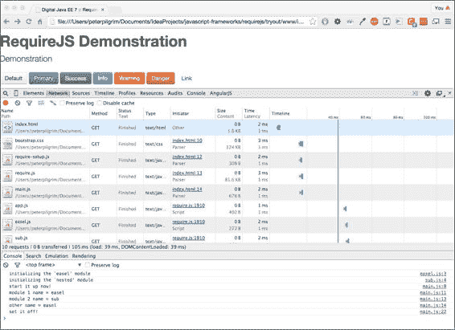

# 第七章。渐进式 JavaScript 框架和模块

|   | *"如果你是一个跑步者，你在比赛中跑步，你可能会输。如果你不跑，你肯定要输。"* |   |
| --- | --- | --- |
|   | --*耶稣会士杰西·杰克逊* |

在当今构建网站的方式中，无法避开 JavaScript 语言，因为它是现代网络浏览器的事实标准。JavaScript 对于开发者来说要么是一种乐趣，要么是一种重大不便。如果你为客户编写或打算构建数字网络应用程序，几乎无法避开 HTML5、CSS 和 JavaScript 的知识。幸运的是，你不需要成为 JavaScript 的专家才能变得高效，因为有许多框架可以帮助你，你可以利用这些想法。本质上，在 JavaScript 方面，你需要了解并跟上现代数字的最佳实践。

虽然 JavaScript 对于数字网站来说是一个非常相关的话题，但这一章不能教你所有你需要知道的内容。相反，我将努力指出正确的方向，并提供一个概述，你应该肯定地通过进一步资源扩展你的知识。

我们将从基本的 JavaScript 编程和语言的概念开始。然后我们将直接进入使用 JavaScript 对象的编程。之后，我们将查看世界上一些主要的 JavaScript 框架。

# JavaScript 基础

JavaScript 本身是一种备受尊重的编程语言。它有一个名为 ECMAScript 的标准([`www.ecmascript.org/`](http://www.ecmascript.org/))，并被 W3C 承认为一个批准的标准。这种语言是基本标准网络技术的三合一之一：HTML5、CSS 和 JavaScript。那么，什么是 JavaScript 呢？它是一种具有对象类型和封闭作用域函数块的动态类型脚本语言。在 JavaScript 中，每个类型严格上是对象。JavaScript 支持函数作为一等公民，并支持将函数分配给相关词法作用域变量、属性或实体的声明。JavaScript 支持字符串、整数、浮点数和原型。JavaScript 本质上是一种属性和原型语言。它通过作用域和闭包支持基于对象的编程。该语言的广泛应用并不显式地有保留关键字，并且它通过支持面向对象继承的结构化。通过巧妙的编程和原型，开发者可以复制对象类继承。

### 小贴士

**我应该学习哪种基础标准的 JavaScript？**

本章将探讨 JavaScript 1.5，即 ECMA Script 版本 3。这种语言版本可以在所有主要网络浏览器（Firefox、Chrome、Safari 和 Internet Explorer）中运行。即将推出的 JavaScript ECMA 6 将支持面向对象编程（[`es6-features.org/`](http://es6-features.org/)）。

JavaScript 是在正常 Java 网络应用程序客户端上的一种流行语言。你应该知道，JavaScript 也可以通过 Node.js 或 Nashorn 等实现方式在服务器端运行。然而，这些内容并不在本章的讨论范围内。

## 创建对象

让我们深入探讨客户端的 JavaScript。作为数字开发者，你能用对象编写什么样的 JavaScript 程序呢？以下是一个答案——一个嵌入脚本的 HTML5 网页，该脚本创建了一个联系人详细信息，如下所示：

```java
<!DOCTYPE html>
<html lang="en">
  <body>
    <script> 
      var contact = new Object();
      contact.gender = 'female';
      contact.firstName = 'Anne';
      contact.lastName = 'Jackson';
      contact.age = 28;
      contact.occupation = 'Software Developer'
      contact.getFullName = function() { 
        return contact.firstName + " " + contact.lastName;
      }
      console.log(contact); 
    </script>
  </body>
</html>
```

这个简单的程序创建了一个具有属性的联系人详细信息。JavaScript 属性可以是整数、数值数字：number、布尔值或 String 类型。JavaScript 对象还可以定义方法，例如 `getFullName()`。对于一个经验丰富的经典 Java 开发者来说，这种从函数定义属性的方法看起来很奇特；然而，函数是许多语言的一等公民。定义对象的 JavaScript 函数被称为方法。

在现代 JavaScript 编写实践中，你将学会识别类似这种风格的函数，这与 Java 语法相反。以下是一个来自数学的第三阶多项式函数在 JavaScript 中的示例：

```java
var polynomial = function(x1,x2,x3) {
   return (2 * x1 * x1 * x1) - ( 3 * x2 * x2 )
       + 4 * x3 + 5;
}

console.log("The answer is: " + polynomial(1.5,2.0,3.75) );
```

这个变量定义了一个名为 `polynomial()` 的 JavaScript 函数，它接受三个数字类型的参数，并返回一个数字类型。JavaScript 是一种动态类型语言，因此没有静态类型。

### 控制台日志

控制台日志是现代网络浏览器（Firefox、Chrome、Opera、Safari 和 Internet Explorer）中的一个标准对象。它通常可以从用于调试的菜单中访问。以前，控制台对象并未完全支持所有浏览器。

幸运的是，我们不会在 2016 年编写以下条件代码：

```java
if ( window.console && window.console.log ) {
  // console is available
}
```

让我们转向对象构造函数。让我提供一条关于编写控制台日志的最终建议：仅在开发代码中使用它。开发者们常常忘记从生产代码中移除控制台日志输出，这最终导致某些网络浏览器崩溃，破坏了数字客户的旅程。利用像 jQuery、RequireJS 或 Dojo 这样的 JavaScript 框架，这些框架通过库函数抽象化控制台日志。

如果你还没有这样做，我强烈建议你下载适用于 Google Chrome 或 Firefox 网络浏览器的 Chrome 开发者工具和 Web 开发者工具。

## 编写 JavaScript 对象构造函数

与其他语言相比，JavaScript 语言具有有限的原始类型。粗略地说，这些原始类型包括 String、Number、Boolean、Array 和 Object。这些类型可以使用原生的 JavaScript 对象构造函数创建：`String()`、`Number()`、`Boolean()`、`Array()` 和 `Object()`。

这里是如何使用这些原生构造函数的示例：

```java
var message = new String('Digital');
var statusFlag = new Boolean(true);
var itemPrice= new Number(1199.95);
var names = new Array();
names[0] = 'Emkala';
names[1] = 'Sharon';
names[2] = 'Timothy';
console.log(message);  // Digital
console.log(statusFlag); // true
console.log(itemPrice); // 1199.95
console.log(names); // Object (Surprise ;-)
```

显然，很少将 String、Boolean 和 Number 类型从原生构造函数中分配。然而，请注意 Array 原生构造函数的使用。在 JavaScript 中，数组被视为对象。它们从索引零开始枚举，就像大多数计算机语言一样。要找到数组的大小，调用隐式长度属性（`name.length`）。

为了建立 JavaScript 的基础知识，我们可以改进前面的示例，并利用函数引入它们自己的作用域的能力，如下所示：

```java
var ContactDetail = function(
  gender, firstName, lastName, age, occupation ) 
{
  this.gender = gender;
  this.firstName = firstName;
  this.lastName = lastName;
  this.age = age;
  this.occupation = occupation
  this.getFullName = function() { 
    return contact.firstName + " " + contact.lastName;
  }
   return this;
}

var anne = new ContactDetail(
  'female', 'Anne', 'Jackson', 28, 'Software Developer');

console.log(anne.female); 
console.log(anne.firstName);
console.log(anne.lastName);
```

在这个第二个示例中，有几件事情正在进行。首先，我们将函数类型分配给 `ContactDetail` 变量。实际上，这个函数是一个名为变量名称的新对象类型的构造函数。在这个构造函数中，有一个特殊的 `this` 引用变量，它与当前级别的函数作用域相关联。当引用返回时，它成为对象实例。在函数中，我们允许定义与对象关联的其他函数，例如 `getFullName()`。这就是现代 JavaScript 中基于对象的编程方式。

我们将使用这个新的对象类型构造函数在名为 `anne` 的变量中声明联系详情。对于 Java 习惯程序员来说，这种语法一开始可能看起来非常奇怪，但 JavaScript 完全不同于 Java，并且作为一个独立的编程语言被认真接受。作用域在定义对象模块中有实际用途，我在本书的第一章中展示了这些对象模块。

## JavaScript 属性表示法

在类型中访问 JavaScript 属性有两种基本方法。第一种方法对所有 Java 程序员来说都很熟悉。它是点符号。第二种方法称为括号符号，在其他非 Java 语言中看起来像映射或字典关联。括号符号等同于点符号，并且有其用途。

检查以下代码，它演示了创建 JavaScript 对象的另一种方法。记住，JavaScript 是一种动态类型语言。

```java
var product = { 
  'title': 'Java EE Developer Handbook', 
  'price': 38.75,
  'author': 'Peter A. Pilgrim'
};

console.log( product.name );
console.log( product['name']);

product.price = 34.50;
product['price'] = 34.50;

product.subject = 'Enterprise Java';
console.log(product['price']);

product.pi = function() { return 3.14159; };
console.log(product.pi());
```

你是否注意到了对象中引入了一个名为 subject 的新属性以及一个方法函数？当然，我在这里推广的是我的第一本技术书的标题，但这不是重点。JavaScript 允许程序员在对象内部和属性上相当灵活。对象 product 的声明应该会让人想起一些东西，因为它与事实上的**JavaScript 对象表示法**（**JSON**）标准非常相似。开括号表示法是一种定义具有属性键和值的对象的方式。

## 处理 null 和 undefined 引用指针

查尔斯·安东尼·理查德·霍尔爵士（Tony Hoare）开发了经典的计算机科学算法**快速排序**，但他也后悔地说，这也是一个价值十亿美元的错误：可怕的 null 引用指针。我个人认为，其他人可能会偶然发现这样一个明显的解决方案，以快速解决一个普遍问题。

JavaScript 将 null 引用视为哨兵，并具有 undefined。以下 JavaScript 摘录尝试在`test`对象中打印 null 引用：

```java
var testObject = { item: null };
console.log(testObject.item);   // prints out 'null'.
```

null 值告诉你对象类型的东西已定义但尚未可用。undefined 值通知开发者某些东西缺失。记住，JavaScript 是一种动态语言，因此，在对象图中导航并找不到团队认为放置在那里的对象类型是完全可能的。

在 JavaScript 中，如果你需要测试一个 null 值，你必须使用三等号运算符（`===`），如下所示：

```java
var testbject = null;
console.log(testObject == null);   // Wrong!
console.log(testObject === null);  // Correct.
```

关于等价性的写作，我们如何在 JavaScript 中知道两个对象何时是等价的？

## JavaScript 真值

在 JavaScript 中，条件表达式为假，如果它匹配以下空值集合之一：`false`、`0`、`-0`、`null`、空字符串（`''`）、`NaN`或`undefined`。一个值在条件表达式中评估为 JavaScript 真值，当且仅当该值不匹配空值集合中的任何元素。任何匹配空值集合中元素的值都是评估为 JavaScript 真的空值集合。

以下 JavaScript 都评估为假：

```java
console.log(Boolean(0)); 
console.log(Boolean(-0)); 
console.log(Boolean('')); 
console.log(Boolean(null)); 
console.log(Boolean(false)); 
console.log(Boolean(undefined)); 
console.log(Boolean(Number.NAN));
```

这里，我们使用带有 new 关键字的`Boolean`构造函数直接实例化一个类型。以下语句评估为真：

```java
console.log(Boolean(1)); 
console.log(Boolean(-1)); 
console.log(Boolean('runner')); 
console.log(Boolean(true)); 
console.log(Boolean(1234567); 
console.log(Boolean(new Array()); 
```

## 运行时类型信息

为了找出 JavaScript 值的运行时信息，你可以应用`typeof`运算符。这允许程序员编写专门代码来检查函数的参数。以下是一个`typeof`查询的示例：

```java
console.log(typeof true); // Prints 'boolean'.
console.log(typeof 'magic'); // Prints 'string'. 
console.log(typeof 3.141596527); // Prints 'number'. 
```

如果使用原生构造函数，JavaScript 有一些其他怪癖：

```java
console.log(typeof new Boolean(true)); // Prints 'object'.
console.log(typeof new String('MAGIC')); // Prints 'object'. 
console.log(typeof new Number(3.141596527)); // Prints 'object'. 
```

这很令人惊讶！以下证据显示了为什么数字网络开发者因为语言、标准和这些标准的实现不一致而发疯。

## JavaScript 函数

在现代 JavaScript 中，与经典 Java（8 版本之前的 Java 和 Lambda 表达式）相比，你会看到很多准函数式编程。函数是一等公民。你可以将函数作为参数传递给函数。你也可以从一个函数中返回一个函数类型。将函数作为参数传递给方法有什么帮助？在 JavaScript 中，你可以编写无名的匿名函数。你可以利用将代码块传递给库函数的优势。这种风格是函数式编程的基础。我们不是用命令式编程，而是可以编写简洁且内联的代码，这几乎是声明式的。

这里有一个匿名函数的示例：

```java
var outside = function (yourIn) {
  yourIn(); // Invokes the supplied function.
}

outside( function () { 
  console.log('inside'); 
});
```

`outside()`函数接受一个匿名`yourIn()`函数作为单一参数。现在在`outside()`函数内部，它立即调用参数`yourIn`，即提供的匿名定义的函数。这是一个强大的技术。

JavaScript 还有一个技巧，有助于模块的声明，尤其是当它与函数对象作用域结合使用时。可以定义一个函数并直接内联调用它。考虑以下示例：

```java
var initializeGui = function() { 
  console.log("start up the client side GUI...");
} ();
```

在前面的代码中，我们定义了一个名为`initializeGui`的变量，并将其分配给一个匿名函数。定义的关键在于方法语句末尾的最终圆括号。JavaScript 立即在定义解析的确切位置调用函数。在这里，我们假装通过写入控制台来初始化客户端 GUI。

你也可以将参数传递给内联函数，如下所示：

```java
var initializeGui2 = function(msg,value) { 
  console.log("start up GUI..."+msg+","+value);
} ( 'Spirits in the Sky', 1973 );
```

上述代码演示了参数是从外部全局作用域传递到被调用的函数的。

实际上，我们可以去掉变量`initializeGui2`并创建一个自调用的匿名函数：

```java
(function(msg,value) { 
  console.log("start up GUI..."+msg+","+value);
})( 'Spirits in the Sky', 1973 );
```

这种代码相当典型，在流行的 JavaScript 框架和应用程序中都可以看到。

在函数定义中，我们将利用 JavaScript 的作用域。参见第一章，*数字 Java EE 7*，了解关于模块命名空间技术的早期解释。

我想我该停在这里了。现代 JavaScript 编程的多样性和更深入的知识轨迹远远超出了我所能描述的范围。我建议你投资于其他入门级编程书籍，例如 Douglas Crockford 的杰出作品*JavaScript：The Good Parts*，以及作者*Stoyan Stefanov*和*Kumar Chetan Sharma*的 Packt Publishing 的*面向对象的 JavaScript*。

### 小贴士

Steve Kwan 已经编写了一个关于 JavaScript 模块模式的优秀示例；你可能想调查他的最佳实践，请参阅[`github.com/stevekwan/best-practices/blob/master/javascript/best-practices.md`](https://github.com/stevekwan/best-practices/blob/master/javascript/best-practices.md)。

让我们看看 JavaScript 的一个非常重要的编程框架，jQuery。

# 介绍 jQuery 框架

jQuery ([`learn.jquery.com/`](http://learn.jquery.com/)) 是一个跨平台的 JavaScript 框架，用于客户端 Web 应用程序开发。它是 2004 年和 2005 年原始 AJAX 狂潮的幸存者，当时它与 Prototype ([`prototypejs.org/`](http://prototypejs.org/)) 和 Scriptaculous ([`script.aculo.us/`](http://script.aculo.us/)) 竞争，现在仍在竞争。jQuery 被称为 Java 集合框架对 Java 编程语言所做贡献的等价物。根据维基百科，jQuery 占据了世界上 10,000 个最受欢迎的网站中的 70%。换句话说，它是第一个真正引起开发者注意并使他们重新思考底层语言最远能力的 JavaScript 框架。jQuery 是免费的，并且根据 MIT 开源许可证提供。

jQuery 的构建目的是使操作 **文档对象模型** (**DOM**) 更容易，并将 CSS 应用到 HTML 元素上。在 jQuery 中，有一个名为 Sizzle 的秘密配方，它是一个遍历 DOM 的选择器引擎。该引擎结合了选择的灵活性、对函数式编程的尊重以及回调，使工程师能够舒适地编写利用网页中底层 HTML 和 CSS 元素的 JavaScript 代码。

## 在 JSF 应用程序中包含 jQuery

您可以将 jQuery JavaScript 库包含在您的页面视图中。在 JSF 中，该文件夹位于 `src/main/webapp/resources/` 文件夹下：

```java
<!DOCTYPE html>
<html ... >
  ...
  <script src="#{request.contextPath}
    /resources/javascripts/jquery-2.1.0.min.js"></script>
  <script src="#{request.contextPath}
    /resources/app/main.js"></script>
  ...
</html>
```

我们将使用表达式语言 `#{request.contextPath}` 来提供位置独立性。优秀的数字开发者会使用压缩的 JavaScript 来提高性能并增加他们的商业 SEO 机会！

## jQuery 准备函数回调

jQuery 框架将全局作用域中的 `$` 符号专门用于我们的使用。美元符号是 jQuery 对象实例的别名，显然它很简洁。通过巧妙的编程，这超出了本书的范围，jQuery 接受一个代表 HTML DOM 对象的参数。jQuery 的入口点是 `ready()` 方法，它接受一个函数对象类型的参数。

这个参数可以是一个匿名函数或一个命名函数，正如我们在这里演示的，以初始化一个虚构的网站：

```java
$( document ).ready(function() {
    // Write your code here.
    console.log("this page view is starting up!");
   MyNamespace.MyModule1.init(); 
   MyNamespace.MyModule2.init(); 
});
```

当 jQuery 调用匿名函数时，框架可以保证浏览器已经初始化，所有图片都已下载，事件堆栈已设置，以及某些 Web 客户端的其它专有功能已完成。在前面的示例中，我们将以模块模式初始化模块中的其他 JavaScript 库并将日志记录到控制台：

```java
console.log( $ === jQuery );  // true
```

`$( document )` 表达式可以概括为以下内容：

```java
$( <expression-selector> )
```

表达式选择器段落可以是 CSS 选择器表达式或 HTML DOM 元素。以下是一些示例选择器：

```java
var divs1 = $('div');
var divs2 = jQuery('div');
var win1  = $( window );

var redBtn  = $( "#redButton" );
var offerSubmitBtn = $( "#offerSubmitBtn" );

var navigationControl  = $( ".navControls" );
var footerArea = $( ".footerArea  div" );
```

以哈希字符（`#`）开头的元素选择器等同于 DOM HTML API 调用 `getElementById()`，这意味着它们可能返回元素也可能不返回。`#offerSubmitBtn` 选择器检索具有 ID 属性指定的元素：

```java
<h:commandButton value="Apply Now!"
   id="offerSubmitButton"
   action="#{longTermProvider.applyForCredit}"/>
```

jQuery 提供了非常强大的类选择器，可以检索一组 HTML 元素。`$('div')` 选择器检索文档和页面视图中的所有 HTML `div` 元素。同样，`$('div')` 类选择器检索所有 HTML 锚点元素。正如有些人所说，知识就是力量！我们可以组合 CSS 类选择器，以降低和微调我们想要操作的元素。`$( ".footerArea div" )` 选择器限制了页脚区域中的 HTML `div` 元素。

## 对 jQuery 选择器进行操作

jQuery 允许数字开发者访问网页上的 HTML DOM 元素。那么，如何对这些强大的选择器进行操作呢？API 提供了许多接受函数类型参数的回调方法。让我们看看这样一个名为 `click()` 的方法，当特定的 HTML 元素被按下和释放时，它会触发一个事件。

这是之前看到的红色按钮的代码：

```java
$( document ).ready(function() { 
  $( "#redButton" ).click(function( event ) {
      alert( "You pressed the red button!" );
  });
});
```

当用户点击红色按钮时，jQuery 处理 DOM 事件并调用与 jQuery 匹配选择器关联的匿名函数。用户会看到警告对话框。但这并没有结束。以下是一些使红色按钮从视图中淡出的代码：

```java
$( document ).ready(function() { 
  $( "#redButton" ).click(function( event ) {
    $( "#redButton").animate(
      {
        'opacity':'0.0'
      }, 250);
  });
}
```

这是一个 jQuery 动画能力的示例。`animate()` 方法接受两个参数：动画属性的关键和值以及持续时间。在这里，我们将指定按钮的不透明度，但我们也可以设置其他属性，例如元素的宽度或高度，甚至可以为仅针对 CSS3 确认的 Web 浏览器提供目标 Web 客户端的 3D 变换。持续时间以毫秒为单位。

如果这是一段旨在重用的代码，并且我想为界面开发者团队编写干净模块化的代码，以下是我会整理代码并避免尴尬的方法：

```java
var DigitalJavaEE7 = DigitalJavaEE7 || {};

DigitalJavaEE7.RedModule = function($) {
  var init = function() {
    $( document ).ready(function() { 
      var redButton = $( "#redButton" )
      redButton.click(function( event ) {
        redButton.animate({'opacity':'0.0'}, 250);
      });
    }
  };

  var performOtherOWork = function() {
    console.log("other animation stuff.")
    /* ... */
  };

  var oPublic = {
      init: init,
      performOtherWork: performOtherWork
  };

  return oPublic;
}(jQuery);
```

使用流行的模块模式，我将 jQuery 的初始化代码推入一个名为 `RedModule` 的模块中，该模块具有 `DigitalJavaEE7` 命名空间。在这个模块的 `init()` 函数中，我将 CSS 选择器在一个调用中优化为 `redButton` 变量。结果发现，jQuery 正在努力将 CSS 选择器解释为一组潜在的 HTML DOM 元素。因此，我们将避免让框架对 DOM 进行两次搜索。代码本质上相同，但更简洁且易于理解。

### 操作 DOM 元素

在前面的章节中，你学习了如何使用 jQuery 选择 DOM 元素。可以使用 jQuery 选择器检索组元素。使用 API 的操纵部分，我们将向元素添加和删除类样式，在组件前后插入元素，并替换元素的内容。有许多调用需要学习；我们在这里将回顾一小部分。

为了演示我们如何操作 DOM 元素，让我们定义两个 HTML 按钮元素。我们将应用红色样式，另一个将是蓝色。以下是代码：

```java
$( document ).ready(function() { 
  var redButton = $( "#redButton" )
  var blueButton = $( "#blueButton" )
  var textArea = $( "#messageArea" )
  redButton.click(function( event ) {
    textArea.addClass('.text-danger');
    textArea.html('Danger Will, watch out!');
  });

  blueButton.click(function( event ) {
    textArea.removeClass('.text-danger');
    textArea.html('Everthing is fine now.');
  });
}
```

我们将设置匿名函数，为`messageArea`添加一个 Bootstrap 类和 text-danger 类，你可以合理地假设这是一个用于文本输出的保留`div`元素。`addClass()`方法将样式类追加到匹配的元素上。我们将使用`redButton`元素的回调函数将样式添加到文本区域。为`blueButton`设置的第二个匿名函数将从元素中删除该类。这两个函数都将改变显示区域中的消息。

`html()`方法具有双重用途。在 jQuery 框架中，它被重载。当`html()`方法带有一个单一参数被调用时，它将替换元素的内容。我们将使用`html()`方法来更改消息区域中的文本。如果没有参数传递给该方法，它将返回元素的内容。jQuery 中有几个具有这种双重性的 API 方法，例如`attr()`和`val()`。以下是它们的描述：

+   `attr()`方法可以检索或操作 DOM 元素的属性。

+   `val()`方法检索匹配元素集中第一个元素当前的值，或者设置每个匹配元素的值。`val()`方法特别有用，可以访问 HTML 选择选项元素集中的名称和值。

### 动画

网站上最复杂的数字应用程序集成了智能动画和提示（显然得到了 UX 负责人的批准），以引导用户在他们的数字旅程中。通常，只需提供一些微妙的提示，告诉用户如何获得最佳的网站体验就足够了，这可以在整体满意度上产生巨大的差异。jQuery 具有基本的动画功能，如滑动`div`层和弹出窗口，缩小和扩大层，以及透明度技巧，这些都可能提供帮助。

要查看动画，让我们看看如何使用 jQuery 在用户向下滚动页面一定距离时动画化滚动到顶部的箭头。这是一个常见的用户界面设计模式。出于明显的空间原因，我们不会在这里使用模块模式。

假设我们在 JSF 页面视图中有一个简单的 HTML 内容：

```java
<div id="scrollBackTopArrow">
  
</div>
```

首先，我们需要编写一个函数处理程序，当用户在页面视图中向上或向下滚动时，它会监听滚动事件。在 DOM 中，全局 Window 对象上有一个标准方法`scroll()`，它接受一个函数对象作为回调。

有了一个入口点，我们将编写一个处理函数，如下所示：

```java
$(window).scroll( function(){
  var epsilon    = 0.25;
  var scrollingCount = 0;
     var minOpacity = 0.0, maxOpacity = 0.85;
  var scrollArrow=$('#scrollBackTopArrow');
  scrollArrow.each( function(i) {
    var windowHeight = $(window).height();
    var windowScroll = $(window).scrollTop();
    var opacity = scrollArrow.css("opacity")

    var upper = windowHeight * 0.525;
    var lower = windowHeight * 0.315;

    if( windowScroll > upper ){
      if ( opacity <= (maxOpacity - epsilon )) {
        if ( scrollingCount == 0 ) {
            scrollArrow.animate({'opacity':'0.75'}, 100);
            scrollingCount = 15;
        }
      }
    }

    if( windowScroll < lower ){
      if ( opacity >= (minOpacity + epsilon)) {
        if ( scrollingCount == 0 ) {
            scrollArrow.animate({'opacity':'0.0'}, 100);
            scrollingCount = 15;
        }
      }
    }

    if ( scrollingCount > 0 ) {
      scrollingCount = scrollingCount - 1;
    }
  }); 
}); // end of the scroll function
```

不要害怕这个 JavaScript 函数的长度，因为现在所有内容都将揭晓。结果是，将回调附加为滚动监听器意味着网络浏览器可能会根据用户的设备每秒调用回调 10 次或更多次。因此，我们引入了一个阻尼因子，`scrollingCount`，作为一个倒计时变量，以防止动画被过度触发。`epsilon`变量还控制动画激活时的灵敏度。我们可以使用设置的最小和最大不透明度值来限制动画激活。

作为 jQuery 选择器 API，`$('#scrollBackTopArrow')`可能会检索零个或多个 DOM 元素，我们将调用`each()`方法来有效地遍历这些元素。我们使用匿名函数这样做，该函数接受一个元素作为单个参数。在这种情况下，我们知道选择器将只返回一个 DOM 元素，如果它确实存在的话。

我们将在函数中捕获当前窗口高度，`$(window).height()`，并将其存储在一个变量中。使用`windowHeight`变量，我们将推导出一些垂直限制，其中箭头应该淡入和淡出：下限和上限。原点坐标`(0,0)`位于设备窗口的左上角。函数调用`${window).scrollTop()`检索一个整数位置，表示页面当前的滚动位置。

现在我们将解释一些棘手的部分。两个条件语句检查页面视图滚动位置是否在最低或最高边界之上。如果滚动位置超过上限，我们将从视图中淡入箭头。如果滚动位置低于下限，我们将从视图中淡出箭头。我们将设置一个倒计时计时器以防止动画重新触发。请注意，JavaScript 支持访问函数定义外部声明的变量，也称为闭包。`minOpacity`、`maxOpacity`、`epsilon`和`scrollingCount`变量是闭包变量。

这里是另一个使用 CSS3 三维变换来实现扩展按钮或图标的 jQuery 示例。这个效果借鉴了较老的 Mac OS X 风格用户界面，其中应用程序图标在应用栏中扩展和收缩，如下面的代码所示：

```java
var selector = $("expando-btn");

selector.mouseenter( function() {
  $(this).each( function(i) {
    css({
        'transition': 'all 0.5s',
        '-webkit-transform': 'scale(1.667)',
        '-moz-transform': 'scale(1.667)',
        '-o-transform': 'scale(1.667)',
        'transform': 'scale(1.667)',
    });
  });
});

selector.mouseexit( function() {
  $(this).each( function(i) {
    css({
        'transition': 'all 0.5s',
        '-webkit-transform': 'scale(1.0)',
        '-moz-transform': 'scale(1.0)',
        '-o-transform': 'scale(1.0)',
        'transform': 'scale(1.0)',
    });
  });
});
```

我们将使用`mouseenter()`和`mouseexit()`方法来构建效果。这些方法分别捕获鼠标进入和离开按钮的情况，如果按钮显示且可见。匿名函数设置 CSS 动画。CSS 3 已经具有动画类样式。过渡类声明了动画的总长度，为 0.5 毫秒，我们还声明了一个 2D 变换，该变换可以放大或缩小元素。为了扩展按钮元素，我们将比例因子设置为默认按钮大小的`1.667`。为了收缩按钮元素，我们将比例因子重置为默认渲染大小`1.0`。请注意，我们仍然需要声明专有浏览器类，例如 WebKit 浏览器（如苹果的 Safari 和之前的 Google Chrome 版本）的`-webkit-transform`。最终，这个例子对于触摸屏设备来说并不实用，因为没有设备（目前）能够检测手指在屏幕上非常接近的悬停！（参见本章末尾的练习。）

使用 HTML、JavaScript 和 CSS 可能相当复杂，这是界面开发者的工作，了解需求并构建前端。然而，Java 开发者也应该欣赏这项工作。我希望你能看到一些结果。

# RequireJS 框架

如果你认真对待大量 JavaScript 文件和组件的组织，那么你会很高兴地发现依赖注入框架（如 CDI 和 Spring）的想法也已经进入世界。一些专业组织已经依赖于一个小型框架，称为 RequireJS([`requirejs.org/`](http://requirejs.org/))。RequireJS 框架是一个 JavaScript 文件和模块加载器。该框架具有内置的模块脚本加载器，这将提高你代码的速度和质量。

RequireJS 实现了 JavaScript 的**异步模块定义**（**AMD**）规范([`github.com/amdjs/amdjs-api/wiki/AMD`](https://github.com/amdjs/amdjs-api/wiki/AMD))。这个规范定义了一种机制，该机制反过来定义了模块以及模块之间的依赖关系，以及它们如何异步加载。

AMD 规范解决了当你有许多 JavaScript 模块并定义多个 HTML 脚本元素以加载它们时出现的关键问题，但你发现每个模块都有一个依赖顺序。

假设我们有一个名为 A 的 JavaScript 模块，它依赖于模块 B，然后模块 B 又依赖于模块 C 和 D。你可能会忘记包含模块 D 的依赖项。更糟糕的是，你可能会弄错依赖项的顺序：

```java
<script src="img/module-b.js" ></script>
<!-- Code failure: we forgot to load the module C -->
<script src="img/module-d.js" ></script>
<!-- Oops: module B has a dependency on module D -->
<script src="img/module-a.js" ></script>
```

RequireJS 帮助处理这些临时依赖。首先，我们必须了解 RequireJS 如何加载 JavaScript 文件。该框架有一个最佳实践文件夹布局。

在 Java Web 应用程序方面，让我们在一个项目中定义一些文件，如下所示：

`src/main/webapp/`

`src/main/webapp/index.xhtml`

`src/main/webapp/resources/js/`

`src/main/webapp/resources/js/app.js`

`src/main/webapp/resources/js/app/`

`src/main/webapp/resources/js/app/easel.js`

`src/main/webapp/resources/js/app/nested/sub.js`

`src/main/webapp/resources/js/lib/`

`src/main/webapp/resources/js/lib/jquery-2.1.1.js`

`src/main/webapp/resources/js/lib/bootstrap-3.2.0.js`

`src/main/webapp/resources/js/require.js`

`src/main/webapp/resources/js/require-setup.js`

在一个 JSF 应用中，我们将 JavaScript 模块放在`resources`文件夹中。由于 JSF 需要间接引用，所以这与标准的 JavaScript 描述不同。应用文件通常保存在`/js/app`文件夹中。JavaScript 库存储在`/js/lib`文件夹中。`/js/require.js`文件是 RequireJS 框架模块的 JavaScript 文件。

在一个 HTML5 应用中，您首先需要包含对 RequireJS 文件的引用：

```java
<!DOCTYPE html>
<h:html>
  <h:head>
    <meta charset="UTF-8">
    <title>Digital Java EE 7 :: Require JS </title>
    <link href="styles/bootstrap.css" rel="stylesheet" />
    <script 
      src="img/require-setup.js" >
      </script>
    <script 
      src="img/require.js" 
      data-main="#{request.contextPath}js/app/app"></script>
    <script 
      src="img/main.js" ></script>
  </h:head>

  <h:body>
    <header>RequireJS Application</header>
    <!-- ... -->
  </h:body>
</h:html>
```

上述代码是 RequireJS 的实际应用，因为我们在一个应用中使用了 Bootstrap 和 jQuery。最重要的 HTML 脚本元素是第二个，因为它加载了 RequireJS（require.js）。第一个脚本标签很重要，因为它配置了 RequireJS 框架。我们稍后会看到这一点。第三个脚本标签加载了一个应用 JavaScript 模块。

### 注意

许多商业网站在页面内容底部放置标签，以遵循最佳实践惯例并提高性能。然而，由于 RequireJS 是为 AMD 设计的，因此这种做法可能会违背在页面继续加载的同时异步加载和执行脚本的目的。换句话说，效果可能因应用而异，您需要在开发工作中进行测试。

## RequireJS 配置

让我们逆序查看已加载的 JavaScript 文件，因此这是 `/js/app/app.js`。这是包含 RequireJS 库的`<script>`标签元素中引用数据-main 属性的的目标：

```java
requirejs.config({
  baseUrl: 'js/lib',

  paths: {
      app: '../app'
  }
});
```

此文件配置了 RequireJS 如何搜索和加载 JavaScript 文件作为模块。`requirejs`是库在全局头作用域中定义的 JavaScript 对象类型变量。引用对象有一个名为`config()`的方法，它接受一个 JavaScript 属性对象。`baseUrl`属性定义了加载文件的默认位置。`paths`属性是一个嵌套属性，它列出了一个路径集合，这些路径是默认加载规则的例外。

默认情况下，之前的 RequireJS 配置从`js/lib`文件夹加载任何模块的 ID。但是，如果模块 ID 以前缀`app`开头，则它将从`js/app`目录加载，如路径键指定的那样。

`paths`属性配置相对于`baseUrl`，并且从不包含`.js`后缀扩展名，因为`paths`属性可以代表目录文件夹。

由于我们将为这个示例加载 jQuery 和 Bootstrap，我们需要将一个方形的木塞塞入一个圆形的洞中。在 JavaScript 编程世界中，为了避免与许多流行的库冲突，作者采用了 shims 的想法。

### 小贴士

**什么是 Shim？**

Shim 是 JavaScript 术语中的一个俚语表达，用于强制不同的框架协同工作。它也是一个用于在 JavaScript 上下文中 monkey-patching 以包含所有 ECMAScript 5 方法的术语。

在 RequireJS 中，我们必须在第一个加载的文件（`require-setup.js`）中设置此配置：

```java
// require-setup.js
var require = {
  shim: {
    "bootstrap" : { "deps" :['jquery'] },
   "jquery": { exports: '$' }
  },
  paths: {
    "jquery" : "jquery-2.1.3",
    "bootstrap" : "bootstrap-3.2.0"  
  }
};
```

重新审视我们的 JavaScript 文件夹布局是有帮助的。require-setup 文件简单地设置了一个名为 `require` 的特殊变量，在全局 head 范围内使用对象定义。通过属性名 shim 引用的嵌套对象定义了两个更改。首先，一个名为 `bootstrap` 的模块依赖于一个名为 `jquery` 的模块。其次，`jquery` 模块导出符号（`$`）。

配置中的第二个属性键 paths 定义了一个模块名称的关联对象。每个模块名称都映射到其真实名称。因此，`jquery` 模块实际上与一个名为 `jquery-2.1.3` 的文件相关联。由于现在我们可以轻松地升级库版本，这有一个额外的好处。这是一个单行更改！

## 应用模块

完成 RequireJS 的配置后，我们现在可以编写我们应用程序的默认应用模块，如下所示：

```java
requirejs(['jquery', 'bootstrap', 'easel', 'nested/sub'],
  function ($, bootstrap, easel, sub) {
    // jquery, easel and the nested/sub module are all
    // loaded and can be used here now.
    console.log("start it up now!");

    var e = new easel();
    console.log("module 1 name = "+e.getName() );

    var s = new sub();
    console.log("module 2 name = "+s.getName() );
    console.log("other name = "+s.getCanvasName() );

    // DOM ready
    $(function(){
      // Programmatically add class to toggles
      $('.btn.danger').button('toggle').addClass('fat');

      console.log("set it off!");

      alert("set it off!");
    });
  }
);
```

前面的 `/js/app/main.js` 脚本是我们的简单客户端应用程序的通用文件。全局 `requirejs()` 函数是库依赖注入功能的路径。以下是这个函数的格式：

```java
requirejs( <MODULE-ARRAY-LIST>, <CALLBACK> )
```

这里，`<MODULE-ARRAY-LIST>` 是模块名称依赖项的列表集合，而 `<CALLBACK>` 是单个函数参数。

因此，代码示例要求 RequireJS 初始化以下模块：`jquery`、`bootstrap`、`easel` 和 `nested/sub`。请特别注意最后一个模块，因为 `sub.js` 位于 `app` 文件夹的子目录中；因此，名称使用了路径分隔符。记住，使用 RequireJS，你不需要添加后缀（`.js`）。

当 RequireJS 调用回调函数时，模块已经加载。因此，我们将写入控制台日志，如果我们使用 jQuery，我们将在另一个匿名函数声明中做一些关于切换按钮的复杂选择器操作。这应该开始让人明白为什么我们会在先前的 shim 配置中明确导出美元符号。还请注意，我们能够通过函数参数访问引用依赖项。

那么，我们将如何使用 RequireJS 定义模块模式？请阅读下一节。

## 定义模块

为了使用 RequireJS 定义我们自己的自定义模块，我们将利用框架中的另一个全局作用域方法。遵循 AMD 规范，框架提供了一个名为`define()`的方法。此方法的格式如下：

```java
define( <MODULE-ARRAY-LIST>, <FUNCTION-OBJECT> )
```

这几乎与`requirejs()`调用相同。`define()`方法接受一个模块名称列表作为依赖项。`<FUNCTION-OBJECT>`第二个参数意味着该函数必须显式返回一个 JavaScript 对象。换句话说，它不能返回空或无结果。

让我们看看 canvas 模块的定义：

```java
// js/app/easel.js
define([], function () {
  console.log("initializing the `easel' module");
  var returnedModule = function () {
    var _name = 'easel';
    this.getName = function () {
      return _name;
    }
  };

  return returnedModule; 
});
```

模块列表可以是一个空数组，这意味着该模块没有所需的依赖项。文件路径是`/js/app/easel.js`。在匿名函数中，我们将使用方法和属性实例化我们的 JavaScript 构造函数对象，并将其返回给 RequireJS。该模块仅定义了一个名为`getName()`的方法，它返回一个私有可访问变量的值。遵循 JavaScript 的模块模式，可以在示例中声明私有作用域变量和函数，如`_name`，这些变量和函数在函数定义之外不可访问。

这里是另一个模块的列表，其文件路径为`/js/app/nested/sub.js`，它依赖于 easel 模块：

```java
// js/app/nested/sub.js
define(['easel'], function (easel) {
  var easel = new easel();
  console.log("initializing the `nested' module");
  var returnedModule = function () {
    this.getCanvasName = function () {
      return easel.getName();
    }
    this.getName = function () {
      return "sub";
    }
  };

  return returnedModule;
});
```

`nested/sub 模块`定义了一个包含两个方法的对象：`getName()`和`getCanvasName()`。我们将创建一个名为`easel`的对象变量。在函数调用期间，RequireJS 将模块引用作为参数提供。`getCanvasName()`方法使用这个私有引用在依赖模块`easel`上调用`getName()`方法。

这里是 RequireJS 在加载模块时的截图：



RequireJS 示例应用的截图

如果一开始觉得这很简略，请记住，要完全理解函数和对象作用域需要一点时间。对于专业的界面开发者来说，其优势很明显，可以克服 JavaScript 原始设计中的严重缺点。我们已经涵盖了足够多的 RequireJS，以便数字开发可以继续广泛进行。我们将继续介绍另一个框架。

# UnderscoreJS

我将向您介绍另一个在开发中可能很有用的 JavaScript 框架。UnderscoreJS（[`underscorejs.org/`](http://underscorejs.org/））是一个将函数式编程构造和技巧引入语言的框架。该库包含超过 100 个方法，为 JavaScript 添加了函数式支持。

UnderscoreJS 是一个像 jQuery 和 RequireJS 一样下载的单个 JavaScript 文件。如果你将必需的版本化的 `underscore.js` 文件添加到 `/js/lib` 文件夹，那么你已经有方法将其注入到你的应用程序中。以下是文件 `require-setup.js` 中的附加配置：

```java
var require = {
  shim: {
    "bootstrap" : { "deps" :['jquery'] },
    "jquery": { exports: '$' },
    "underscore": { exports: '_'}
  },
  paths: {
    "jquery" : "jquery-2.1.3",
    "bootstrap" : "bootstrap-3.2.0",  
    "underscore" : "underscore-1.8.2"
  }
};
```

UnderscoreJS 将符号下划线（`_`）导出为其库给开发者，并且其函数方法可以通过该符号访问。我们将回顾这些方法的小子集。

函数式程序员通常对以下五个主要关注点感兴趣：

+   如何在内部遍历元素集合？

+   如何过滤集合中的元素？

+   如何将集合中的元素从一种类型映射到另一种类型？

+   如何将元素集合扁平化成一个集合？

+   最后，如何将集合中的元素收集或归约成一个单一元素或值？

你可能会将这些关注点识别为 JVM 中替代编程语言的标准化思想，例如 Scala、Clojure，甚至是带有 Lambda 的 Java 8。

## 遍历操作

在 UnderscoreJS 中，我们可以取一个数组对象并简单地遍历它。

`each()` 函数允许你遍历列表集合，如下所示：

```java
// /js/app/underscore-demo.js
requirejs(['underscore'],
  function (_) {
    console.log("inside underscore-demo module");

    _.each( [1, 2, 3], function(n) { console.log(n); });
  }
);
```

这里，我们使用了在 `underscore-demo.js` 模块中作为 AMD 加载器的 RequireJS。`each()` 函数遍历数组对象中的元素，并调用提供的函数，该函数被称为**迭代器**，以元素作为单个参数。`each()` 函数替换了命令式编程语言中的典型 `foreach` 或 `for-do` 复合语句。

## 过滤操作

过滤可以通过多种方式实现。让我们以过滤列表的基本示例为例：

```java
var r1 = _.filter(['Anne','Mike','Pauline','Steve'],
  function(name){ return name.startsWith('P'); });
console.log(r1);    // ['Pauline']
```

此代码遍历列表中的每个值，返回一个通过真值测试（谓词）的所有值的数组。`filter()` 的第二个参数被称为谓词，它是一个回调函数，如果提供的元素满足条件测试，则返回一个布尔值。在这里，我们正在过滤以字母 `P` 开头的列表中的名称。

UnderscoreJS 还提供了一种更复杂的过滤方法。`where()` 方法搜索列表并返回一个包含所有具有列出的键值对属性的值的数组：

```java
var contacts = [ 
  new ContactDetail( 'F', 'Anne', 'Jackson', 28, 'Developer' ),
  new ContactDetail( 'M', 'William', 'Benson', 29, 'Developer' ),
  new ContactDetail( 'M', 'Micheal', 'Philips', 33, 'Tester' ),
  new ContactDetail( 'M', 'Ian', 'Charles', 45, 'Sales' ),
  new ContactDetail( 'F', 'Sarah', 'Hart', 55, 'CEO' ),
];

var r2 = _.where(contacts, {occupation: 'Developer', age: 28 });
console.log(r2);
```

上一段代码使用了我们在本章前面定义的 `ContactDetail` JavaScript 对象。我们将使用联系人列表和提供的键值对象（包含我们想要过滤的属性）调用 `where()` 方法。结果是匹配安妮·杰克逊的 `ContactDetail`，因为她有匹配的职业（软件开发者）和年龄（28）。

## 映射操作

`map()` 函数通过映射列表中的每个元素，并使用用户提供的函数，生成一个新的数组对象：

```java
console.log( 
  _.map( [1, 2, 3], 
   function(n){ return n * 3; } )  
);
// [3, 6, 9]

console.log(
  _.map( [ 1, 2, 3, 4], function(x){ return x * x; } )
);
// [1, 4\. 9, 16]

console.log(
  _.map( [ 1, 2, 3, 4], 
    function(x){ return "A" + x; } )
);
// [ 'A1', 'A2', 'A3', 'A4']
```

用户提供的函数接受当前元素参数，并负责返回新的元素类型。在这些例子中，我们将创建一个新的包含数字元素的三个元素的数组列表，然后我们将创建一个新的包含数字元素平方的数组列表。最后，我们将创建一个包含字符串元素的数组列表。

## 展平操作

现在我们知道了如何使用 UnderscoreJS 迭代、过滤和映射集合，我们也应该学习如何展平元素集合。有一个名为 `flatten()` 的方法，它接受一个元素集合，并在这些元素中有一个或多个本身是集合的情况下将其展平。

让我们看看以下两个例子：

```java
var Sector = function( name, value ) {
  this.name = name;
  this.value = value;
};

var salesSectorData = [ 
  [
    [ 
      new Sector("New York", 3724.23),
      new Sector("Boston", 8091.79)
    ],
    [
      new Sector("Houston", 9631.54)
    ],
  ],
  [
    new Sector("London", 2745.23),
    new Sector("Glasgow", 4286.36)
  ]
];

var f3 = _.flatten(salesSectorData);
console.log("f3 = "+f3);
// [Sector, Sector, Sector, Sector, Sector ]
var f4 = _.flatten(salesSectorData, true );
console.log("f4 = "+f4);
// [ [Sector, Sector], [Sector], Sector, Sector ]
```

在这里，我们定义了一个名为 `Sector` 的对象，它代表，比如说，销售和营销数据。我们创建了一个嵌套集合 `salesSectorData`，实际上它是一个包含两个元素的数组，但每个元素都是一个更进一步的集合。简而言之，`salesSectorData` 是一个二级有序数据结构。

第一次 `flatten()` 调用将数组列表中的数据结构完全展平。因此，我们将得到一个包含五个元素的数组。我们将向第二个 `flatten()` 调用传递第二个参数，这是一个布尔参数，用于指定是否应该对集合的元素也执行展平操作。`f4` 的结果是包含四个元素的数组。第一个元素是一个包含两个元素的数组列表，第二个元素是一个包含一个元素的数组列表，然后剩余的元素将依次排列。

应该很明显，为什么一个 JavaScript 接口开发者会对 UnderscoreJS 赞不绝口。我们将继续进行这次火热的审查中的最后一个操作。

## 减少操作

如果我们不能将这些功能操作缩减为单一的标量值或对象，它们有什么好处呢？幸运的是，RequireJS 为我们提供了几种方法，如 `reduce()`、`reduceRight()`、`min()` 和 `max()`。

我们现在只看看 `reduce()` 操作。如果我们想发现所有之前部门对象的销售额总和，我们该如何做呢？下面是答案：

```java
var totalValue=  _.reduce(
  f3, 
  function(acc, sector) {
    return acc + sector.value;
  }, 
  0 );
console.log("totalValue = " + totalValue)
```

`reduce()` 操作接受三个参数：集合、迭代函数和初始值。为了将集合缩减为一个单一的标量值，`reduce()` 操作会在每个元素上调用迭代函数。迭代函数接受标量值参数和元素。匿名函数将销售部门值添加到累加器中。

`reduce()` 操作符在集合方面是左结合的，而 `reduceRight()` 是右结合的。这完成了我们在 UnderscoreJS 中的旅程。一个更有兴趣的读者可以进一步在线和通过其他信息资源深入了解这个框架。

# GruntJS

在我们结束关于渐进式 JavaScript 编程的这一章之前，我们将快速了解一下一个用于启动动作的工具。这个工具是 GruntJS ([`gruntjs.com/`](http://gruntjs.com/))，其背后的团队将其描述为 JavaScript 任务运行器。GruntJS 是一个 Node.js 工具，在这个生态系统中工作。因此，开发者在使用 GruntJS 之前必须安装 Node.js。

该工具目前在数字社区中很受欢迎。以下是 GruntJS 被视为加分项的一些原因：

+   配置在一个地方，并且可以在你的数字团队中的其他开发人员、测试人员和操作人员之间共享。

+   GruntJS 采用插件系统构建。

+   工具压缩你的 CSS 并最小化你的 JavaScript 文件，以提高性能并将它们交付到产品网站。

+   GruntJS 允许专门的界面开发团队在网站的客户端部分分别或共同工作。然后，这些工具将他们的 JavaScript 和 CSS 组件合并在一起，以便进行生产交付。

+   它可以优化你的图像以减少整体文件大小，同时仍然保持质量，这对于交付大规模的*英雄*风格视网膜显示屏图形以及创建移动友好型图像是完美的。

+   开发者可以利用 Sass 和 Less 进行 CSS 编写。

有 GruntJS 插件用于 Less、Sass、RequireJS、CoffeeScript 等。

Node.js 是一个 JavaScript 运行平台，因此，它与 Java 平台绝对不同。如果你恰好使用 Gradle，有两个开源插件可以帮助它们之间的桥梁。它们被称为 Gradle-GruntJS 插件 ([`github.com/srs/gradle-grunt-plugin`](https://github.com/srs/gradle-grunt-plugin)) 和 Gradle-Node 插件 ([`github.com/srs/gradle-node-plugin`](https://github.com/srs/gradle-node-plugin))。Node.js 还有一个自己的包管理器，称为 npm，它处理库的安装、更新和删除。Npm 允许 Node.js 和 JavaScript 开源库与社区共享。

每个 GruntJS 项目都需要在根目录下放置以下两个文件：

+   `package.json`：此文件指定了 npm 项目的元数据，并包含了项目所需的 JavaScript 工具和库依赖项，包括 GruntJS。

+   `gruntfile.js`：此文件配置并定义了项目的构建任务。你还可以在此文件中添加 GruntJS 插件的依赖项。

对于一个 JSF 项目，你需要在项目根目录下放置`package.json`文件。以下是该文件的代码示例：

```java
{
  "name": "my-digital-project",
  "version": "1.0-SNAPSHOT",
  "devDependencies": {
    "grunt": "~0.4.5"
  }
}
```

你会发现这个文件看起来几乎像是一个 JSON 文件。关键的`devDependencies`属性声明了一组 npm 工具和框架。我们肯定希望从版本 0.4.5 或更高版本加载 GruntJS。

现在，我们将直接深入一个实际的 GruntJS 应用案例。在一个数字项目中，我们希望优化性能并确保我们的搜索引擎优化排名。我们需要合并第三方 JavaScript 库并最小化 JavaScript 文件。界面开发者更喜欢继续使用 Sass 工具来管理 CSS 文件的灵活性。我们已经与我们的管理层达成协议，目前保持开发的 JavaScript 文件不变。

这里是实现这一目标的 `gruntfile.js` 文件：

```java
module.exports = function(grunt) {              
  grunt.initConfig({
    pkg: grunt.file.readJSON('package.json'),

    concat: {  /* ... */ }

    uglify: { /* ... */ }

    sass: { /* ... */ } 
  });

  grunt.loadNpmTasks('grunt-contrib-concat');
  grunt.loadNpmTasks('grunt-contrib-uglify');
  grunt.loadNpmTasks('grunt-contrib-sass');
  grunt.registerTask('default', ['concat', 'uglify', 'sass']);
};
```

上述 `gruntfile.js` 文件在 Node.js 系统中定义了一个模块。在另一个模块中有一个模块系统听起来可能有些令人困惑；然而，我们只需知道模块是一种封装形式，它允许通过重用进行共享。`module.exports` 定义允许 Grunt 参与到 Node.js 系统中。因此，可以将这个 Grunt 模块与其他 Node.js 模块共享。

`grunt.initConfig()` 段落是初始化 GruntJS 工具所必需的。其中最重要的部分指定了元数据文件的名称，`package.json`。之后，我们有一个预留的区域用于插件配置。每个 GruntJS 插件都有独立的属性配置。有三个插件：`grunt-contrib-concat`、`grunt-contrib-uglify` 和 `grunt-contrib-sass`。每个插件声明了一个配置属性名称：`concat`、`uglify` 和 `sass`。

要配置连接插件，我们有以下段落：

```java
concat: {   
  dist: {
    src: [
      'src/main/webapp/resources/js/libs/*.js', 
      'src/main/webapp/resources/js/global.js'  
    ],
    dest: 'build/webapp/js/build/thirdparty.js',
  }
}
```

`grunt-contrib-concat` 插件需要一个文件源和一个目标文件。它会将所有现有的 JavaScript 库文件整合在一起，然后生成一个名为 `thirdparty.js` 的单个文件。在我们的 Gradle（或 Maven）项目中，假设我们有一个将最终打包目标文件的 WAR 任务。

我们必须了解事实上的 Gradle 和 Maven 目录布局配置，这对于 Web 项目来说。因此，我们将 `src/main/webapp` 添加到文件路径中。

要配置压缩插件，我们将执行以下代码：

```java
uglify: {
  build: {
    src: 'src/main/webapp/thirdparty.js',
    dest: 'src/main/webapp/thirdparty.min.js'
  }
}
```

这个配置非常容易理解；我们只需将 `grunt-uglify-contrib` 插件指向源并指定目标文件路径。

最后，我们将按照以下方式配置 Sass CSS 构建插件：

```java
sass: {
  dist: {
    options: {
      style: 'compressed'
    },
    files: {
      'src/main/webapp/resources/js/styles/build/mysite.css': 
      'build/webapp/resources/styles/mysite.scss'
    }
  }
}
```

对于 `grunt-contrib-sass` 插件，我们需要稍微更多的指令。这个插件需要文件的键值属性。目标文件是键属性，SASS 源文件是值。

### 提示

安装 SASS 还需要安装有效的 Ruby 安装和相应的 RubyGem。

GruntJS 是客户端数字开发者的一款令人兴奋且强大的工具。这一点毫无疑问。插件系统仍然相当不成熟，我建议您检查文档以了解配置更改。

# 摘要

本章是对现代数字 JavaScript 编程的快速浏览。如果您从未使用过 JavaScript 语言，或者已经多年远离它，那么我真心希望您已经重新振作起来，学习这项基本技能。我们研究了 JavaScript 对象的编程。我们看到了如何构建对象。我们了解了属性表示法，并处理了 JavaScript 的真值。

我们特别拜访了 jQuery——JavaScript 编程的祖母或祖父。如果您没有学到其他东西，那么现在您应该能够理解 jQuery。我们看到了选择器如何搜索 HTML DOM 中的元素，然后可以对这些元素进行操作以产生效果。我们简要地涉猎了动画，这为为顾客和商业主创造更复杂体验打开了大门。

我们尝试了 RequireJS 的模块依赖管理。我们学习了这个框架如何帮助数字开发者组织模块，并将检索它们的顺序留给框架。

在本章末尾，我们跨越了非 Java 平台 Node.js 的桥梁，特别是学习了 GruntJS 的基本细节。我们研究了 GruntJS 定义的一个示例，该定义将 JavaScript 库文件捆绑在一起，从 Sass 生成 CSS，并优化了 JavaScript 文件的大小。

在接下来的章节中，我们将探讨 AngularJS 以及新兴的 Java EE MVC 框架。

# 练习

以下是为本章的练习和问题：

1.  以下 JavaScript 代码定义了什么？还有哪些与之类似？

    ```java
    var hospital = {
      name: "St Stephen's Hospital",
      location: "Kensington & Chelsea",
      patients: 1250,
      doctors: ['Patel', 'Radeksky', 'Brown', 'Shockley']
    };
    ```

1.  从前面的代码中，解释 `hospital.patients` 和 `hospital['patients']` 属性访问器之间的主要区别是什么？

1.  编写一个 JavaScript 对象，构建一个 Java 用户组成员的参与者。假设您将您的对象命名为 `JUGParticipant`。您需要捕捉他们的名字、电话联系方式、电子邮件地址（可选），以及他们的特定兴趣（可选）。

1.  将 `JUGParticipant` 修改为接受兴趣作为另一个对象。编写一个 JavaScript 标签对象，以便构建包含 Java EE、Android 或 HTML 等技能的数组。演示您能够构建 `JUGParticipants` 和标签对象的这种对象图。

1.  通过创建一个 `JUGEvent` 会议对象来调整您的 JavaScript 对象图。您的对象需要包含诸如事件标题、描述、地点、演讲者（可选）以及愿意的 `JUGParticipants` 等属性。

1.  了解 JavaScript 1.5（或 ECMAScript 版本 3）中的九个原生对象构造函数。为了开始，这里有四个：`Number()`、`String()`、`Boolean()` 和 `Object()`。

1.  使用以下 HTML，使用 jQuery 改变 `div` 元素 `messageArea` 的背景颜色。代码中有三个按钮，表示交通灯的规则。（您允许使内容更美观！）

    ```java
    <div class="traffic-light">
      <div id="messageArea" class="message-area">
        <p class="lead">
          This is it!
        </p>
      </div>
      <div>
        <a id="#redBtn" href="#" class="button" >Red</a>
        <a id="#yellowBtn" href="#" class="button" >Yellow</a>
        <a id="#greenBtn" href="#" class="button" >Green</a>
      </div>
    </div>
    ```

1.  解释以下两个 jQuery 语句之间的区别：

    ```java
    $('hero-image').attr('alt');
    $('hero-image').attr('alt', 'Voted best by Carworld 2015!');
    ```

1.  使用以下 HTML5 代码，该代码显示一个 Bootstrap 警告框，我们希望用户在点击关闭图标时使警告消失。编写 JavaScript 和 jQuery 来动画化关键通知，使其淡出，然后从 HTML 中移除内容。

    ```java
    <div>
      <p class="lead">
        Here is something I desperately want you
        to know right here, right now.
      </p

      <div class="critical-notice  alert-danger">
        <button type="button" class="close  pull-right" 
          aria-label="Close">
          <span aria-hidden="true">&times;</span>
        </button>

        <span class="glyphicon glyphicon-warning-sign" 
          aria-hidden="true" id="closeNotch" ></span>
        <strong>Danger!</strong> I'm very annoyed.
      </div>
    </div>
    ```

1.  查看书籍的源代码，并开始使用 RequireJS。研究代码。你的任务是修改代码并添加你的模块，你可以将其命名为 `/js/app/oxygen.js`。你需要使用 AMD 规范的 `define()` 方法调用。

1.  现在你已经编写了新的 RequireJS 模块 `oxygen.js`，你怎么知道它按预期工作？你是否编写了一个测试网页？你可能需要编写一个 `/js/app/oxygendemo.js` JavaScript 文件。

1.  定义两个模块，分别命名为 `/js/app/hydrogen.js` 和 `/js/app/water.js`。设置水模块，使其依赖于其他两个模块：氢和氧。

1.  使用 UnderscoreJS 并假设你已经设置了依赖项，练习以下 JavaScript 示例：

    ```java
    var arr = [1, 2, 3, 4, 5];
    var newArr = _.map(arr, function (x) {
      return (x + 3) * (x - 2) * (x + 1);
    });
    ```

1.  查看以下 JavaScript 代码，该代码定义了一个百分比和一个产品价格数组。使用 UnderscoreJS 计算总价格，以及当每个价格增加百分比时的总价格：

    ```java
    var Product = function(name, price, type ) {
      this.name = name;
      this.price = price;
      this.type = type;
    }

    var percentage = 3.25,
    var productPrices = [
      new Product("Secutars", 27.99, "Garden"), 
      new Product("Chair", 99.99, "Home" ), 
      new Product("Luxury Red Wines", 79.99, "Food" ),
      new Product("Microwave", 49.99, "Home" ),
      new Product("Mower", 169.99, "Garden" )
    ];
    ```

1.  注意，我们有不同类型的产品。使用 UnderscoreJS，计算原始价格的总金额，然后计算增加 5.35% 的总金额。
