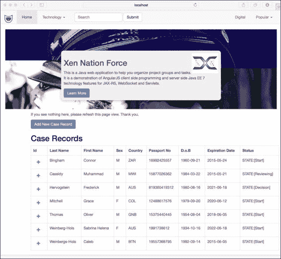
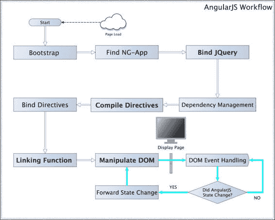
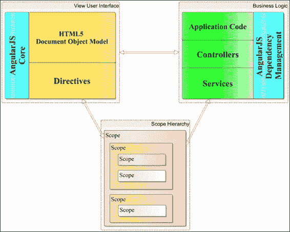
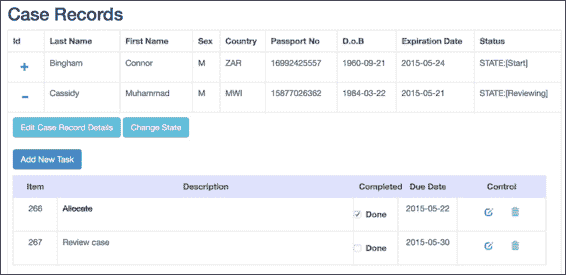
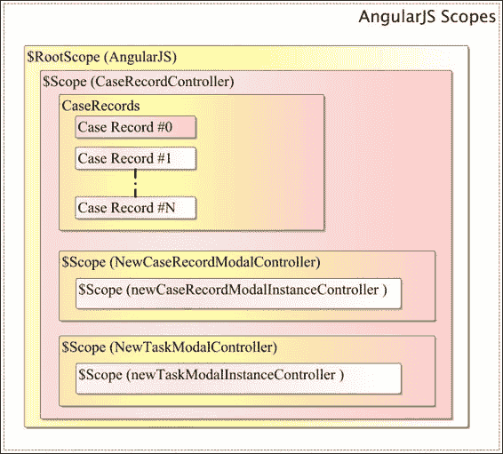
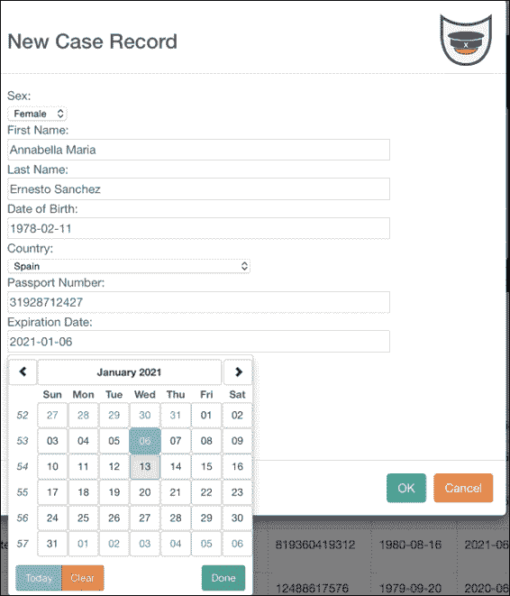
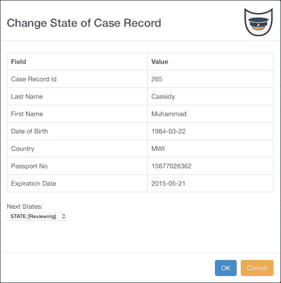

# 第八章. AngularJS 和 Java RESTful 服务

|   | *"慢 - 任何超过 50 毫秒的东西对人类来说都是不可察觉的，因此可以被认为是‘瞬间’。"* |   |
| --- | --- | --- |
|   | --*AngularJS 的共同创造者 Misko Hevery* |

在本章中，我们将走出 JSF 的舒适区，探索一种不同的 Web 应用程序模式。你们大多数人都会熟悉像 Google Mail、Facebook 和 Twitter 这样的流行社交媒体及其 Web 用户界面。这些 Web 应用程序具有特殊用户体验和信息架构，给人一种交互发生在单个网页上的错觉。然而，在幕后，这些应用程序依赖于标准技术：HTML5、CSS 和客户端 JavaScript。它们都使用 AJAX 调用通过 HTTP 与后端服务器通信。当服务器端应用程序向 Web 客户端发送数据时，只有页面的一部分被更新。在当代使用中，许多数字网站利用应用程序后端上的 RESTful 服务端点。一些复杂的企业应用程序可能使用**服务器发送事件**（**SSE**）向多个工作用户发送通知，而更前沿的一些则依赖于新近制定的 HTML5 WebSocket 规范，以在客户端和服务器之间提供全双工通信。顺便提一下，来自 Java Community Process 的完整 Java EE 7 规范支持 JAX-RS、SSE 和 WebSocket。

# 单页应用程序

在单页面上构建应用程序的设计理念，使其类似于桌面应用程序，与 JavaServer Faces 原始的页面间导航链接设计形成鲜明对比。JSF 1.0 是在 2000 年代初创建的，远在 2005 年重新发现`XMLHttpRequest` JavaScript 对象和 Google Maps 之前，所以这个历史注释不应令人惊讶（[`en.wikipedia.org/wiki/JavaServer_Faces`](http://en.wikipedia.org/wiki/JavaServer_Faces)）。完全有可能将 JSF 编写为单页应用程序，但我不会推荐将方钉强行塞入圆孔的努力！JSF 适合于本质和设计上极度状态化的应用程序，其中客户旅程基于页面间的导航。在前几章中，我们已经详细介绍了使用 JSF 的状态化 Web 应用程序、流作用域、会话和视图作用域的 bean。如果您对这些概念不熟悉，我强烈建议您再次复习这些材料。现在，我们将继续探讨另一种设计模式。

让我们列出单页应用程序的有益特性：

+   SPAs 通常具有适合单页的网站或 Web 应用程序。

+   它们依赖于现代数字 JavaScript 技术，包括 AJAX、HTML5 和 CSS。

+   在导航期间，此类应用程序不是加载整个页面，而是操作**文档对象模型**（**DOM**）以提供页面更新。

+   这些应用程序通常使用 HTML 模板引擎在客户端本地渲染内容。客户端的表示逻辑和服务器端的业务逻辑之间存在关注点的分离。

+   单页应用程序与网络服务器动态通信，通常使用 RESTful 服务，JSON 作为流行的有效载荷类型。

单页应用程序存在一些缺点，内容策略师、技术负责人开发人员和显然的股东商业人士都应该了解：

+   将搜索引擎优化应用到单页应用程序中可能有些困难。

+   使用浏览器中的后退按钮可能会导致数据条目丢失；单页应用程序与网页浏览器历史记录不兼容。

+   单页应用程序需要更高程度的应用开发知识来处理响应式编程和概念。值得注意的是，工程师应该意识到关于权衡可扩展性、弹性、事件驱动处理和通知的因素，并保持响应。

最后，让我给你一些建议。行业中的数字界面开发人员拥有 JavaScript、HTML5 和 CSS 技能。在本章中，你将学会认识到 JavaScript 编程能力与 Java 服务器端需求同样重要。换句话说，使用 AngularJS 和类似的客户端框架往往是一种全栈参与。

# 案件工作者应用程序

对于本章，我们将探讨一种特定类型的单页应用程序，这种应用程序适用于国际政府，称为案件工作者系统。案件工作者的业务用户将坐在办公桌前，他们的大部分时间都在处理申请人的产品申请阶段。

以下是该应用程序的截图：



案件工作者应用程序截图，xen national force

该应用程序名为 **xen-national-force**，它被设计用来通过微型工作流程处理护照。它远远不能满足真实商业应用的需求。例如，为了尽可能简化，没有实现用户输入安全。它仅适用于一个案件工作者，并且从用户体验的角度来看存在一个非常明显的设计缺陷。然而，xen-national-force 应用程序展示了如何使用 AngularJS 构建具有 CRUD 操作的主从记录系统，并且它具有基本的有限状态机实现。

我们现在将转向学习流行的 AngularJS 框架。

# AngularJS

我们如何使用 jQuery 将文本输入与 `div` 元素中的消息区域连接起来？一个可行的方法是编写如下事件处理程序和回调函数的 JavaScript 模块片段：

```java
$('#helloForm input.greeting-name').on('value', function() {
  $('#helloForm div.greeting-name').text('Hello ' + this.val() + '!');
});
```

```java
input.greeting-name, then jQuery invokes the callback function, which updates the inner HTML in the div element layer, identified with the CSS class div.greeting.name. We could extend this code and write a generic solution with parameters, especially if we have more cases like this in our application, but sooner rather than later, programming at this low-level introduces complexities and bugs.
```

AngularJS 的设计者意识到有改进的机会。相同的示例可以使用 AngularJS 重新编写，如下所示：

```java
<!DOCTYPE HTML>
<html>
<head>
  <script src="img/angular.js"></script>
</head>
<body ng-app ng-init="greeting-name = 'Mr. Anderson'">
  <form>
    <input ng-model="customer-name" type="text" />
    <div class="greeting-name">Hello {{customer-name}}!</div>
  </form>
</body>
</html>
```

前面的片段完全是 HTML。它从一个远程服务器包含了 AngularJS 框架，**内容分发网络**（**CDN**）。HTML 的主体元素被一个非标准属性 `ng-app` 标注，以声明这个 DOM 节点是整体模板的一部分。另一个属性 `ng-init` 在客户端渲染模板之前声明了一个数据模型。AngularJS 需要知道从哪里开始模板或动态修改 DOM；因此，每个页面都以 `ng-app` 属性开始。通常，`ng-app` 属性应用于 HTML 的 `body` 元素。没有访问数据模型，AngularJS 模板将毫无用处，这就是 `ng-init` 属性的目的。它设置了一个作用域变量 `greeting-name` 并将其赋值为字符串字面量 `Mr. Anderson`。

注意额外的属性类型 `ng-model` 和特殊的双大括号语法：`{{customer-name}}`。这个属性是 AngularJS 框架提供的一个特殊扩展，用于在行内标识数据模型，而大括号代表一种特殊的 HTML 模板语法，称为指令。在这里，我们将 `ng-model` 属性应用于输入字段元素。当页面加载时，输入文本字段显示文本 `Mr Anderson`。代码还允许用户在输入字段中输入文本，并同时更新消息区域。在这个简单的情况下，不需要编程；实际上，它是声明式的。那么，秘诀是什么呢？下面的代码展示了双向绑定的一种形式。让我们扩展它来演示完整的双向绑定：

```java
<form>
  <input ng-model="customer-name" type="text" />
  <div class="greeting-name">Hello {{customer-name}}!</div>
  <p>
   <button class="btn-large" ng-click="user-model = 'Karen'">
   Karen </button> </p>
  <p>
   <button class="btn-large" ng-click="user-model = 'Albert'">
   Albert </button> </p>
</form>
```

我们引入了带有新属性 `ng-click` 的 HTML `button` 元素。属性的值是一个 AngularJS JavaScript 表达式。每个按钮都会用新的名字更新数据模型。实际上，它们重置了输入字段和消息区域中的名字。这有多酷？这里根本不需要 jQuery 编程。AngularJS 有许多特殊的自定义属性，如 `ng-repeat`、`ng-switch` 和 `ng-option`，我们将在本章后面遇到。

你可能想知道这些绑定和模板非常聪明；那么客户端是如何工作的呢？

## AngularJS 是如何工作的？

AngularJS 作为 HTML 页面内容的一部分在网页浏览器中加载。框架最强大的部分是它鼓励关注点的分离。表示视图应该故意与业务逻辑和数据模型混合。这有几个原因。当 Angular JS 框架加载页面时，框架会在 DOM 中上下移动并寻找某些非标准属性，称为指令。它使用编译器解析和处理这个标记。实际上，AngularJS 将静态加载的 DOM 转换为渲染视图。框架将这些指令创建关联、绑定和额外的行为。

`ng-app` 属性与一个初始化应用的指令相关联。`ng-init` 与一个允许程序员设置数据模型的指令相关联。它可以用来给变量赋值。`ng-model` 与指令访问相关联或存储与 HTML 输入元素相关联的值。AngularJS 允许开发者编写自定义指令。你可能将来会想编写一个来获取对 DOM 的访问权限。

AngularJS 在模板视图中基于嵌套作用域工作。作用域是表达式的执行上下文。作用域可以以层次结构组织，以便它们模仿 DOM 模型。



AngularJS 的基本工作原理

AngularJS 依赖于定义控制器和其他逻辑的 JavaScript 模块。模块可以依赖于其他模块；然而，与 RequireJS 不同，不属于不同 JavaScript 文件的模块不会自动加载到应用程序中。作用域是绑定表示和数据模型的粘合剂。作用域是 AngularJS 中定义观察者和监听器的地方。大多数时候，框架将自动处理表达式处理和数据绑定，并处理 JavaScript 模块和 DOM 元素组件之间的通知。在编译阶段之后，AngularJS 继续到链接阶段，并将表达式关联到模块控制器方法和其他资源。

让我们总结这些步骤：

1.  AngularJS 框架启动自身。特别是，它搜索 DOM 中带有 `ng-app` 属性的 HTML 元素。这是框架的触发点。

1.  一旦找到 `ng-app` 元素，AngularJS 就会创建一个依赖注入器。

1.  然后，它将静态 DOM 编译成渲染中间视图，在过程中收集指令。

1.  然后，AngularJS 开始将指令与它们关联的作用域进行链接和组合。这是一个算法性和层次性的操作。在执行链接阶段之前，框架创建了一个初始作用域，称为根作用域。

1.  最后，AngularJS 使用根作用域调用 apply 调用，在这个阶段，视图被渲染。

让我们看看案件工作者的视图。在书籍的源代码中，你会找到一个名为 **xen-force-angularjs** 的 Gradle 项目。它遵循 Java EE 项目的 Maven 惯例。我们的讨论将分为两个部分。我们将查看由 HTML5、JavaScript 和一些 CSS 组成的前端代码。之后，我们将深入研究 Java 服务器端后端。让我们看看以下这张图：



指令与 AngularJS 中的业务逻辑之间的关系

# 案件工作者概述

案件工作者项目展示了一个主从应用程序。我们的工作人员启动应用程序，看到一系列案件记录，其中包含每个申请人的姓名和护照详情。这是主记录。每个案件记录可能附有零个或多个任务记录。那些是主记录的详细记录。每个主记录还包含一个状态属性，显示每个申请人在过程中的位置。我们的用户被允许访问所有案件记录并将当前状态从开始移动到结束。

## 案件工作者主视图

在案件工作者示例中只有一个 HTML 文件，它作为 `src/main/webapp/index.xhtml` 文件中的模板。记住，这是一个单页应用程序！

```java
<!DOCTYPE html>
<html ng-app="app">
  <head>
    ...
    <link href="styles/bootstrap.css" rel="stylesheet">
    <link href="styles/main.css" rel="stylesheet">
  </head>

  <body ng-controller="CaseRecordController">
    ...
    <div id="mainContent">
      ...
      <div class="case-record-view" >
        ...
        <div class="actionBar"
          ng-controller="NewCaseRecordModalController" >
          <button class="btn btn-primary" ng-click="openCreateCaseRecordDialog()" >Add New Case Record</button>
          <div ng-show="selected">Selection from a modal: {{ selected }}</div>
        </div>

        <h2 class="case-record-headline">Case Records</h2>
        <table class="table table-bordered" >
          <tr>
            <th>Id</th>
            <th>Last Name</th>
            <th>First Name</th>
            <th>Sex</th>
            <th>Country</th>
            <th>Passport No</th>
            <th>D.o.B</th>
            <th>Expiration Date</th>
            <th>Status</th>
          </tr>
          ...
        </table>
      </div>
    </div>
  </body>
</html>
```

HTML 标签元素被赋予了一个 AngularJS 指令 `ng-app`，它指定了作为应用程序的作用域值名称。我们有常见的 `head` 和 `body` 元素。我们包含了 CSS 文件 Bootstrap (`bootstrap.css`) 和应用程序的样式文件 `main.css`。直到我们到达带有 `ng-controller` 属性的 `Body` 标签，没有太多区别。`ng-controller` 指令将控制器附加到视图中。控制器是 MVC 模式的一部分 JavaScript 对象。因此，DOM 中的整个 `body` 标签元素绑定到名为 `CaseRecordController` 的 JavaScript 对象。我们稍后会看到它的代码，但首先，让我们深入一点。

随着你进一步检查代码，你会在名为 `action-bar` 的 CSS 选择器的 `div` 元素上注意到另一个控制器指令。这个元素与一个名为 `NewCaseRecordModalController` 的不同控制器相关联。每当一个 `ng-controller` 指令被赋予属性时，AngularJS 就会创建一个新的作用域。因此，作用域可以相互嵌套。这是 AngularJS 框架中的关键概念。如果存在，作用域存在于与嵌套作用域相关联并包含它们的元素上。

主视图渲染了一个案件记录的表格。前面的代码渲染了申请人的姓名、性别、出生日期、ISO 国家代码、护照号码和护照的有效期。

以下内容是渲染主表行的下一部分：

```java
    <tr ng-repeat-start="caseRecord in caseRecords">
      <td>
        <div ng-controller="NewCaseRecordModalController" style="display: inline;">
          <a class="btn" href="#" ng-click="showOrHideTasks($parent.caseRecord)">
          <i class="glyphicon" ng-class="getIconClass($parent.caseRecord)" ></i>
          </a>
        </div>
      </td>
      <td>{{caseRecord.lastName}}</td>
      <td>{{caseRecord.firstName}}</td>
      <td>{{caseRecord.sex}}</td>
      <td>{{caseRecord.country}}</td>
      <td>{{caseRecord.passportNo}}</td>
      <td>{{caseRecord.dateOfBirth}}</td>
      <td>{{caseRecord.expirationDate}}</td>
      <td>{{caseRecord.currentState}}</td>
    </tr>
```

这段代码内容有几个部分。`ng-repeat-start` 是一个特殊的指令，它允许使用表达式迭代内容。表达式是一个 AngularJS 动态评估的表单选择查询。因此，`<"caseRecord in caseRecords">` 表达式意味着对名为 `caseRecords` 的作用域中对象的总体迭代，并将每个元素分配为一个名为 `caseRecord` 的对象。我们使用 AngularJS 绑定指令表达式在适当的表格单元格元素中渲染每个案件记录的信息。我们对 `{{caseRecord.lastName}}` 单元格这样做，然后重复此过程。

第一个数据单元格是特殊的，因为它渲染了一个嵌入的 `div` 元素。它说明了如何关联一个布尔值，并提供了一个展开和折叠的关联到案例记录。我们必须在 `div` 上创建一个作用域，并将适当的控制器 `NewCaseRecordModalController` 与 `ng-controller` 属性关联起来。我们利用 `ng-click` 指令来调用控制器上的 `showOrHideTasks()` 方法。注意，我们传递作用域的父元素，其中包含当前的 `CaseRecord`，因为表格正在渲染。还有一个名为 `ng-class` 的指令，它通过设置 CSS 选择器将图标元素与 Bootstrap 中的适当矢量图标关联起来。此代码在表格视图中打开和关闭一个二级行，渲染任务视图。它还根据任务视图是打开还是关闭来正确更新矢量图标。

此表格视图内容的第三部分现在如下所示：

```java
<tr ng-repeat-end  ng-if="caseRecord.showTasks" >
  <td colspan="9">
    <div class="case-record-task-view">
      <div ng-controller="NewCaseRecordModalController">
        <button class="btn btn-info"
        ng-click="openEditCaseRecordDialog($parent.caseRecord)" >Edit Case Record Details</button>
        <button class="btn btn-info"
        ng-click="changeStateCaseRecordDialog($parent.caseRecord)" >Change State</button>
      </div>
      <br />

      <div ng-controller="NewTaskModalController">
        <p>
          <button class="btn btn-primary"
            ng-click="openNewTaskDialog(caseRecord.id)">Add New Task</button>
        </p>
      </div>

      <table class="case-record-task-table">
        <tr>
          <td> Item </td>
          <td> Description </td>
          <td> Completed </td>
          <td> Due Date </td>
          <td> Control </td>
        </tr>

        <tr ng-repeat="task in caseRecord.tasks">
          ...
        </tr><!-- ng-repeat-end ## tasks in caseRecords.tasks -->
      </table>
    </div>
  </td>
</tr><!-- ng-repeat-end ## caseRecord in caseRecords -->
```

主表格中的二级行有一个 `ng-repeat-end` 指令，它通知 AngularJS 每个案例记录元素结束循环迭代的 DOM 元素。实际上还有一个名为 `ng-repeat` 的指令，它将 `ng-repeat-start` 和 `ng-repeat-end` 结合到一个单个 DOM 元素上。该指令通常用于渲染表格中的简单行。

`ng-if` 指令条件性地向 DOM 中添加或删除内容。我们使用这个 `ng-if` 来显示或隐藏每个案例记录元素的任务视图区域。AngularJS 提供了其他类似的指令，称为 `ng-show` 和 `ng-hide`，但它们不会动态地从 DOM 中添加或删除内容。

### 小贴士

为什么我们会选择 `ng-if` 而不是 `ng-show`？假设你的数据库中有数百个案例记录元素，我们是否想在 Web 前端渲染所有这些案例及其任务历史？

我们有一个 `div-layer` 元素，专门用于显示与案例记录关联的任务。看看 CSS 选择器，`case-record-task-view`。我们添加内容以显示每个 `task` 元素作为表格。有一个使用 `ng-repeat` 的示例，它有一个表达式任务，在 `caseRecord.tasks` 中。

有两个其他的内部 `div` 层。第一个元素绑定到编辑当前案例记录的逻辑，并引用名为 `NewCaseRecordModalController` 的控制器。第二个元素允许用户创建一个新的任务，并引用一个名为 `NewTaskModalController` 的新控制器。我们将在稍后看到这些控制器的 JavaScript 代码。

以下截图展示了显示任务的展开和收缩：



这张截图展示了使用 `ng-if` 的二级行元素的展开和收缩。

为了完成表格视图的内容，我们写入表格数据行以显示 `task` 元素的属性：

```java
<tr ng-repeat="task in caseRecord.tasks">
  <td> {{task.id}} </td>
  <td>
    <span class="done-{{task.completed}}"> {{task.name}} </span>
  </td>
  <td>
    <label class="checkbox">
      <input type="checkbox" ng-model="task.completed" ng-change="updateProjectTaskCompleted(task)">
      Done
    </label>
  </td>
  <td>
    {{task.targetDate}}
  </td>
  <td>
    <div ng-controller="NewTaskModalController">
      <a class="btn" href="#"ng-click="openEditTaskDialog($parent.task)" >
        <i class="glyphicon glyphicon-edit"></i></a>
      <a class="btn" href="#"ng-click="openDeleteTaskDialog($parent.task)" >
        <i class="glyphicon glyphicon-trash"></i></a>
    </div>
  </td>
</tr><!-- ng-repeat-end ## tasks in caseRecords.tasks -->
```

在视图的第四部分，我们充分利用 AngularJS 的双向绑定来渲染一个 HTML `checkbox`元素，并将其与布尔属性`caseRecord.completed`关联。使用 CSS 选择器，我们使用类选择器表达式`class="done-{{task.completed}}"`动态更改任务名称的文本。当用户更改复选框时，选择以下 CSS：

```java
.done-true {
  text-decoration: line-through; color: #52101d;
}
```

当任务完成时，文本会被划掉！我们向复选框元素添加了`ng-change`指令，AngularJS 将其与一个改变事件关联。AngularJS 调用控制器`NewTaskModalController`上的`updateProjectTaskCompleted()`方法。此方法调用一个`WebSocket`调用。我们很快会解释其背后的代码！请注意，方法调用传递了当前的`task`元素，因为我们仍然处于渲染作用域中。

为了完成任务视图，我们有一个与控制器`NewTaskModalController`关联的`div`层，带有用于编辑和删除任务的图标按钮。正如你所看到的，我们需要传递`$parent.task`以便引用元素循环变量。

是时候查看项目组织以及单个 JavaScript 模块、控制器和工厂了。

# 项目组织

项目被组织成一个 Java EE 网络应用程序。我们将所有的 JavaScript 代码放入遵循 AngularJS 约定的文件夹中，因为我们很可能在一个全栈环境中专业工作，并与具有混合技能的代码库共享。AngularJS 控制器放在`app/controllers`下，而工厂和服务放在`app/service`下，如下所示的结构：

`src/main/webapp/app/controllers`

`src/main/webapp/app/controllers/main.js`

`src/main/webapp/app/controllers/newcaserecord-modal.js`

`src/main/webapp/app/controllers/newtask-modal.js`

`src/main/webapp/app/services`

`src/main/webapp/app/services/iso-countries.js`

`src/main/webapp/app/services/shared-services.js`

接下来，我们将第三方 JavaScript 库放入指定的区域：

`src/main/webapp/javascripts`

`src/main/webapp/javascripts/angular.js`

`src/main/webapp/javascripts/bootstrap.js`

`src/main/webapp/javascripts/jquery-2.1.3.js`

`src/main/webapp/javascripts/ui-bootstrap-0.12.1.js`

`src/main/webapp/javascripts/ui-bootstrap-tpl-0.12.1.js`

注意，我们的案件工作者应用程序还依赖于 Bootstrap、jQuery 和扩展库，Bootstrap UI for AngularJS。我们在主视图`index.html`的内容最后部分明确包含了所有这些库，如下所示：

```java
<html ng-app="app">  ...
  <body> ...
    <script src="img/jquery-2.1.3.js"></script>
    <script src="img/angular.js"></script>
    <script src="img/bootstrap.js"></script>
    <script src="img/ui-bootstrap-tpls-0.12.1.js"></script>
    <script src="img/main.js"></script>
    <script src="img/newcaserecord-modal.js"></script>
    <script src="img/newtask-modal.js"></script>
    <script src="img/shared-service.js"></script>
    <script src="img/iso-countries.js"></script>
  </body>
</html>
```

如我之前所说，为了演示的目的，我们保持了代码库的简单性，但我们本可以使用 RequireJS 来处理依赖加载。

### 小贴士

如果你没有在 AngularJS 之前明确加载 jQuery，那么它将加载自己的较小版本的 jQuery，称为 **jq-lite**。所以如果你的应用程序依赖于 jQuery 库的完整版本，请确保它在 AngularJS 加载之前加载。

最后一步是将 CSS 放入它们自己的特殊区域：

`src/main/webapp/styles`

`src/main/webapp/styles/bootstrap.css`

`src/main/webapp/styles/bootstrap-theme.css`

`src/main/webapp/styles/main.css`

上述文件在主视图的顶部加载，位于常规的 `head` HTML 元素内。

# 应用程序主控制器

我们 AngularJS 应用程序中的第一个模块声明了应用程序的名称。以下是在文件 `src/main/webapp/app/controllers/main.js` 中的声明：

```java
var myApp = angular.module('app', ['ui.bootstrap', 'newcaserecord','newtask', 'sharedService', 'isoCountries']);
```

该框架导出一个名为 `angular` 的函数对象，并且它有一个名为 `module` 的方法，用于定义一个模块。第一个参数是模块的名称，第二个参数是依赖模块名称的数组。`module()` 方法将 AngularJS 模块对象返回给调用者。从那里，我们声明初始控制器。

模块 `ui.bootstrap` 包含 AngularJS 和 Bootstrap 的集成。模块 `newcaserecord` 是案件工作人员应用程序的一部分，并定义了一个控制器，用于插入和修改主记录。模块 `newtask` 定义了一个控制器，用于插入、修改和删除详细记录。`sharedService` 定义了一个工厂提供者，执行应用程序的实用函数，最后，`isoCountries` 定义了另一个提供者，包含 ISO 护照国家的列表。

AngularJS 框架有一个流畅的 API 用于定义模块、控制器和提供者；因此，我们可以编写类似于以下代码摘录的几乎声明式的 JavaScript：

```java
angular.module('myApp', [ 'depend1', 'depend2'])
  .controller( 'controller1', function( depend1, depend2 ) {
      /* ... */
  })
  .controller( 'controller2', function( depend1 ) {
      /* ... */   
  })
  .filter('greet', function() {
   return function(name) {
      return 'Hello, ' + name + '!';
    };
  }) 
  .service( 'our-factory', function( ... ) {
      /* ... */   
  })
  .directive( 'my-directive', function( ... ) {
      /* ... */   
});
```

上述编码风格是个人喜好问题，其缺点是所有模块都被合并在一起。许多专业开发者更喜欢将实际的 Angular 模块对象分配给全局模块变量。

视图中的 `body` 标签元素定义了一个控制器：

```java
<body ng-controller="CaseRecordController">
```

以下摘录显示了将用户界面绑定到客户端数据模型的控制器 `CaseRecordController`：

```java
myApp.controller('CaseRecordController',  function ($scope, $http, $log, UpdateTaskStatusFactory, sharedService, isoCountries ) {
  var self = this;
  $scope.caseRecords = [{sex: "F", firstName: "Angela", lastName: "Devonshire", dateOfBirth: "1982-04-15", expirationDate: "2018-11-21", country: "Australia", passportNo: "123456789012", currentState: "Start"},];

  $scope.isoCountries = isoCountries;

  $scope.getCaseRecords = function () {
    $http.get('rest/caseworker/list').success(function(data) {
      $scope.caseRecords = data;
    });
  }

  $scope.$on('handleBroadcastMessage', function() {
    var message = sharedService.getBroadcastMessage();
    if ( message !== "showTasksCaseRecord")  {
      $scope.getCaseRecords();
    }
  })

  // Retrieve the initial list of case records
  $scope.getCaseRecords();

  $scope.connect = function() {
    UpdateTaskStatusFactory.connect();
  }

  $scope.send = function( msg ) {
    UpdateTaskStatusFactory.send(msg);
  }

  $scope.updateProjectTaskCompleted = function( task ) {
    var message = { 'caseRecordId': task.caseRecordId, 'taskId': task.id, 'completed': task.completed }
    $scope.connect()
    var jsonMessage = JSON.stringify(message)
    $scope.send(jsonMessage)
  }
});
```

AngularJS 对象中的控制器方法接受第一个参数作为名称。第二个参数是函数对象，按照惯例，我们传递一个带有参数的匿名 JavaScript 函数。

```java
function ($scope, $http, $log, UpdateTaskStatusFactory, sharedService, isoCountries ) { /* ... */ }
```

参数都是 AngularJS 注入到控制器中的对象模块。AngularJS 定义了以美元符号（`$`）开头的标准模块。模块 `$scope` 是一个特殊参数，表示当前作用域。模块 `$http` 代表一个核心 AngularJS 服务，具有与远程 HTTP 服务器通信的方法。模块 `$log` 是另一个核心服务，用于向控制台记录日志。其他参数 `UpdateTaskStatusFactory`、`sharedService` 和 `isoCountries` 是我们应用程序提供的工厂和服务。AngularJS，像许多现代 JavaScript 数字框架一样，鼓励模块化编程，并尽可能避免污染全局作用域。

那么这个控制器具体做什么呢？首先，出于演示目的，控制器初始化了一个虚拟的 JSON 记录，`$scope.caseRecord`，以防在页面视图加载时服务器不可用。接下来，我们为记录列表定义了一个属性，`$scope.caseRecords`。是的，向 AngularJS `$scope` 添加自定义属性是数据模型与用户界面通信的方式。

我们为控制器定义了属性，`$scope.isoCountries`。

我们定义了第一个函数，`getCaseRecords()`，如下所示：

```java
$scope.getCaseRecords = function () {
  $http.get('rest/caseworker/list').success(function(data) {
    $scope.caseRecords = data;
  });
}
```

此函数从同一主机向远程服务器发出 RESTful GET 请求，该主机提供页面视图。URL 可能类似于这样：`http://localhost:8080/xen-national-force/rest/caseworker/list`。

我们利用流畅的 API 在服务器返回 JSON 结果后执行一个操作。匿名函数用最新的数据覆盖了 `$scope.caseRecords` 属性。

顺便说一下，当我们构建 `CaseRecordController` 的函数对象时，我们调用 `getCaseRecords()` 方法来启动应用程序。

在 AngularJS 中，我们可以通过创建应用程序创建的工厂服务或通过向服务器发出 HTTP 请求，将信息从一个控制器传递到另一个控制器。还有可能监听 AngularJS 在广播频道上发布的事件。

在 `CaseRecordController` 中的以下代码演示了如何更新除一条消息之外的所有消息的用户界面：

```java
  $scope.$on('handleBroadcastMessage', function() {
    var message = sharedService.getBroadcastMessage();
    if ( message !== "showTasksCaseRecord")  {
      $scope.getCaseRecords();
    }
  })
```

在这里，我们在 AngularJS 作用域上注册了一个事件处理器，以便从我们的 `SharedService` 提供者获取通知。`$on()` 方法在特定事件类型上注册了一个监听器。第一个参数是消息类型，第二个参数是回调函数。在函数回调内部，如果消息（因此是自定义事件）不是 `showTasksCaseRecord`，我们就会向服务器发出 HTTP 请求以检索整个案例记录集。

### 小贴士

在处理程序回调函数内部，我们读取整个数据集，这在实际的企业应用程序中可能是数千个案例记录。因此，我们可以提高 REST 调用和响应代码的性能。然而，我们应该抵制过早优化的诱惑。你应该优先考虑让用户故事工作。

控制器中的其他方法，`connect()` 和 `send()`，分别建立到服务器的 WebSocket 通道并向服务器发送 JSON 消息。我们将在稍后的部分检查 `UpdateTaskStatusFactory` 模块，以及最后的 `updateProjectTaskCompleted()` 方法。

如果你以前从未专业地开发过任何 JavaScript，那么这个章节可能一开始看起来非常令人畏惧。然而，请坚持下去，因为这实际上只是关于有足够的耐心才能成功。在这方面，我准备了一个简化的 AngularJS 作用域图，它在我们案件工作人员应用程序中呈现的样子。



案件工作人员应用程序中的 AngularJS 作用域

上述图表描绘了进度之旅，帮助我们了解我们将要走向何方。它还建立了 AngularJS 如何以类似于 DOM 本身的方式分层绑定作用域的概念。幕后，AngularJS 创建内部作用域来处理渲染 HTML `table` 元素的重复性 DOM 元素，这是案例记录的列表。开发者只能通过编程表达式来访问这些内部数据，我们应该将它们视为不透明对象。

### 小贴士

在撰写本文时，有一个名为 Batarang 的 Google Chrome 插件（[`chrome.google.com/webstore/detail/angularjs-batarang-stable/`](https://chrome.google.com/webstore/detail/angularjs-batarang-stable/)），我强烈推荐检查浏览器中的 AngularJS 作用域。遗憾的是，这个工具似乎不再维护。如果有人采用了它，仍然值得检查。

# 新案例记录控制器

我们将创建和编辑案例记录的代码放置在一个名为 `newcaserecord-modal.js` 的单独文件中，该文件包含用户定义的 AngularJS 模块 `newcaserecord`。此模块依赖于其他模块，其中一些之前已经提到。`ui.bootstrap.modal` 是来自 AngularJS UI Bootstrap 第三方框架的一个特殊模块。该模块定义了 AngularJS 团队编写的 Bootstrap 组件。特别是，它有一个有用的模态对话框扩展，我们在整个案件工作人员应用程序中使用。

以下是为 `newcaserecord` 模块和 `NewCaseRecordModalController` 的简短代码：

```java
var newcaserecord = angular.module('newcaserecord', ['ui.bootstrap.modal', 'sharedService','isoCountries'])

newcaserecord.controller('NewCaseRecordModalController', function($scope, $modal, $http, $log, sharedService, isoCountries ) {
  $scope.caseRecord = {
    sex: "F", firstName: "", lastName: "", country: "", passportNo: "", dateOfBirth: "", expirationDate: "", country: "", currentState: "", showTasks: false};
  $scope.returnedData = null;
  $scope.isoCountries = isoCountries;

  $scope.openCreateCaseRecordDialog = function () {
    var modalInstance = $modal.open({
      templateUrl: 'newCaseRecordContent.html', controller: newCaseRecordModalInstanceController, isoCountries: isoCountries, resolve: {
            caseRecord: function () {
              return $scope.caseRecord;
            }
      }
    });

    modalInstance.result.then(function (data) {
      $scope.selected = data;
      $http.post('rest/caseworker/item', $scope.caseRecord).success(function(data) {
        $scope.returnedData = data;
        sharedService.setBroadcastMessage("newCaseRecord");
      });

    }, function () {
      $log.info('Modal dismissed at: ' + new Date());
    });
  };
  // . . .
);
```

控制器函数对象接受注入的参数，如 `$http`、`$log` 和 `sharedService`。我们还注入了 `$modal` 实例，这使得我们可以在控制器中打开模态对话框。

由于每个控制器都注入了自己的作用域，我们需要提供数据模型元素以便视图可以访问。因此，我们在作用域中创建了一个空的案例记录 `$scope.caseRecord`。我们还设置了返回数据和 ISO 国家列表。

函数 `$scope.openCreateCaseRecordDialog()` 生成一个模态对话框，因此用户可以输入主案例记录。

### 提示

允许用户创建任意应用程序护照记录可能会被禁止，并且仅限于管理员和经理以外的任何员工。我们的演示应用程序根本没有任何角色和权限的概念。开发者应该小心，避免将零日漏洞引入他们的数字应用程序中。

UI Bootstrap 扩展接受多个参数。第一个参数是 HTML 模板指令的引用。第二个参数指的是另一个名为 `newCaseRecordModalInstanceController` 的控制器，该控制器负责处理与对话框的交互。第三个参数是解析器，它允许库代码在封装作用域内找到用户模态中的引用数据：

```java
var modalInstance = $modal.open({
  templateUrl: 'newCaseRecordContent.html',
    controller: newCaseRecordModalInstanceController,
      resolve: {
        caseRecord: function () {
          return $scope.caseRecord;
        }
      }
});
```

控制器的下一部分，`NewCaseRecordModalController` 处理模态对话框成功完成后的回调，因为用户输入了数据并按下了确认按钮。我们在名为 `then` 的对象上注册了两个函数对象作为参数。

```java
    modalInstance.result.then(function (data) {...},
       function () { /* modal dismissed */ });
```

第一个函数是回调处理程序，其中包含将案例记录数据发送到服务器的 REST POST 请求的代码。第二个函数保留用于对话框被取消的情况。你会注意到 AngularJS 使用了流畅的接口。即使你不了解 JavaScript 和框架的所有内容，代码也应该相当容易理解。

因此，让我们看看模态对话框实例的代码，即对象 `newCaseRecordModalInstanceController`：

```java
var newCaseRecordModalInstanceController = function ($scope, $modalInstance, caseRecord ) {
  caseRecord.showTasks = true; // Convenience for the user
  $scope.caseRecord = caseRecord;

  $scope.ok = function () {
    $modalInstance.close(true);
  };

  $scope.cancel = function () {
    $modalInstance.dismiss('cancel');
  };
};
```

如果你注意到，这个变量并不是一个封装的 JavaScript 模块；相反，`newCaseRecordModalInstanceController` 函数是在全局作用域中声明的。我想总有例外。UI Bootstrap 代码通过 `$modalInstance.open()` 调用调用这个控制器函数。框架向该函数提供三个参数，即作用域 `$scope`、模态实例 `$modalInstance` 和案例记录 `caseRecord`。我们将案例记录分配给提供的作用域，以便从模态对话框中写回数据。在那里，函数对象实现了两个方法，`ok()` 和 `cancel()`，分别处理对话框的确认和取消。

我们只需要编写对话框的 HTML 指令。

## 案例记录模态视图模板

如我们所知，网站的所有内容都在一个单页应用程序中。HTML 指令也出现在视图`index.html`中。如何在页面内容中写入指令而不在视图中显示？秘诀是否与 CSS 有关？

虽然样式化是一个好主意，但这并不是正确答案。AngularJS 设计者利用了 HTML Script 标签的正式定义，这是嵌入或引用可执行脚本的元素。

以下是将新案件记录插入应用程序的 HTML 指令：

```java
<script type="text/ng-template" id="newCaseRecordContent.html">
  <div class="modal-header">
    <h3>New Case Record </h3>
  </div>
  <div class="modal-body">
    <form name="newCaseRecordForm" class="css-form" novalidate>
      Sex:<br />
      <select ng-model="caseRecord.sex" required>
        <option value="F" ng-option="selected caseRecord.sex === 'F'">Female</option>
        <option value="M" ng-option="selected caseRecord.sex === 'M'">Male</option>
      </select>
      <br/>
      First Name:<br />
      <input type="text" ng-model="caseRecord.firstName" required /><br />
      Last Name:<br />
      <input type="text" ng-model="caseRecord.lastName" required /><br />
      Date of Birth:<br />
      <input type="text" ng-model="caseRecord.dateOfBirth" datepicker-popup="yyyy-MM-dd" required /><br />
      Country:<br />
      <select ng-model="caseRecord.country" required ng-options="item.code as item.country for item in isoCountries.countryToCodeArrayMap">
      </select>
      <br />
      Passport Number:<br />
      <input type="text" ng-model="caseRecord.passportNo" required /><br />
      Expiration Date:<br />
      <input type="text" ng-model="caseRecord.expirationDate" datepicker-popup="yyyy-MM-dd" required /><br />
    </form>
  </div>
  <div class="modal-footer">
    <button class="btn btn-primary" ng-click="ok()" ng-disabled="newCaseRecordForm.$invalid" >OK</button>
    <button class="btn btn-warning" ng-click="cancel()">Cancel</button>
  </div>
</script>
```

前面的 HTML 指令定义了一个 UI Bootstrap 模式对话框，因为 HTML `script`标签被标记为`text/ng-template`类型的属性。所有 AngularJS 指令都需要一个标识符。从 CSS 中我们可以看到，该指令包含一个标题、页脚和主体。主要的`div`层是一个 HTML 表单。

表单中的每个输入字段都与`newCaseRecordModalInstanceController`实例中的数据模型绑定。一旦 UI Bootstrap 调用了函数对象，案件记录就被分配到了作用域中。因此，`ng-model`数据模型`$scope.caseRecord.firstName`对保留用于姓氏的 HTML 文本输入元素是可用的。

AngularJS 有一个优雅的额外标记用于验证表单输入元素。你可以在几乎所有输入上看到额外的必需属性。不幸的是，由于本书无法深入探讨验证检查的细节，我想将你的注意力引向两个微妙的验证检查。

数据输入利用 UI Bootstrap 日期选择器组件，使案件工作人员能够轻松输入日期：

```java
<input type="text" ng-model="caseRecord.dateOfBirth" datepicker-popup="yyyy-MM-dd" required />
```

日期的格式由`datepicker-popup`属性定义。

最后，我们在 HTML `select`元素中显示 ISO 护照国家名称的下拉列表。这部分代码如下：

```java
<select ng-model="caseRecord.country" required
  ng-options="item.code as item.country for item in
    isoCountries.countryToCodeArrayMap">
</select>
```

`isoCountries`是一个服务实例，我们将在后面看到。由于该模块被注入到`NewCaseRecordModalController`模块中，并且后者的作用域恰好包围了模式实例作用域，AngularJS 允许我们访问该服务。`isoCountries`实例包含一个护照国家的键值字典列表。代码允许我们将 ISO 代码`AUS`与国家名称澳大利亚关联起来。`ng-option`属性接受一个表达式，类似于 SQL 查询。我们声明性地通知 AngularJS 如何为每个 HTML `option`元素推导显示名称（`item.country`）和输入表单值（`item.code`）。

以下是一个带有日期选择器的创建案件记录模式对话框的截图：



带有日期选择器的创建案件记录模式对话框的截图，日期选择器效果全开

让我们转到与案件记录控制器类似的任务记录控制器。

# 新的任务记录控制器

当案件工作人员使用系统时，他们能够展开和折叠与案例记录相关的任务记录。用户可以创建、编辑和修改任务，还可以更改案件的状态。

AngularJS 模块 `newtask` 定义如下：

```java
var newtask = angular.module('newtask', ['ui.bootstrap.modal', 'sharedService'])
newtask.config(function($httpProvider) {
  $httpProvider.defaults.headers["delete"] = {
    'Content-Type': 'application/json;charset=utf-8'
  };
})
```

我们在 AngularJS 的 HTTP 远程处理周围添加了一个配置更改。HTTP DELETE 请求中存在一个微妙的错误。存在于 GlassFish 和 Payara 应用服务器中的 JAX-RS 引用实现 Jersey，在响应代码 415 时引发了一个 HTTP 错误：“不支持的媒体类型”。这迫使 AngularJS 在 DELETE 请求中发送 MIME 类型，将 JSON 作为解决方法。

由于任务控制器的代码非常相似，本书中仅揭示 CRUD 的创建部分。有关其他方法的源代码，请参阅源文件。以下为 `NewTaskModalController` 的源代码：

```java
newtask.controller('NewTaskModalController', function($scope, $modal, $http, $log, sharedService ) {
  $scope.selected = false;
  $scope.task = {
      id: 0, name: '', targetDate: null, completed: false, caseRecordId: 0
  };
  $scope.returnedData = null;
  $scope.openNewTaskDialog = function(caseRecordId) {
    var modalInstance = $modal.open({
      templateUrl: 'newTaskContent.html',
      controller: newTaskModalInstanceController,
      resolve: {
        task: function () {
          return $scope.task;
        }
      }
    });

    modalInstance.result.then(function (data) {
      $scope.selected = data;
      $http.post('rest/caseworker/item/'+caseRecordId+'/task', $scope.task).success(function(data) {
        $scope.returnedData = data;
        sharedService.setBroadcastMessage("newTask");
        // Reset Task in this scope for better UX affordance.
        $scope.task = {
          id: 0, name: '', targetDate: null, completed: false, caseRecordId: 0
        };
      });
    }, function () {
        $log.info('Modal dismissed at: ' + new Date());
    });
  };

  $scope.openEditTaskDialog = function(taskItem) {
    // ...
  };

  $scope.openDeleteTaskDialog = function(taskItem) {
    // ...
  };
});
```

在此控制器中，我们有一个空的、默认的 `$scope.task` 对象，而不是 `$scope.caseRecord`。每个 `Task` 对象都通过 `caseRecordId` 属性引用其父对象。

函数 `openNewTaskDialog()` 打开一个 UI Bootstrap 模态对话框，允许用户输入一个新任务。该方法将模态对话框与当前 `Task` 对象的 AngularJS 作用域连接起来。主要区别是 REST URL 端点，其形式为 `rest/caseworker/item/'+caseRecordId+'/task`。

我们使用 UI Bootstrap 的 `$modal` 对象，并创建一个与之前相同的模态对话框实例，但现在我们传递了不同的参数。这些参数是 HTML 指令 ID，即 `newTaskContent.html`；控制器名为 `newTaskModalInstanceController`，以及解析函数。AngularJS 调用解析函数，该函数定义为一个匿名函数，以便引用封装的 `Task` 对象。

在 `modalInstance` 对象的回调函数中，我们方便地重置了 `Task` 对象，这样当对话框再次弹出时，用户不会被过时的表单数据所惊讶。我们在 `sharedService` 中设置了广播消息。

处理任务对话框中模态实例的代码几乎相同：

```java
var newTaskModalInstanceController = function ($scope, $modalInstance, task) {
  $scope.task = task;

  $scope.ok = function () {
      $modalInstance.close(true);
  };

  $scope.cancel = function () {
    $modalInstance.dismiss('cancel');
  };
};
```

`newTaskModalInstanceController` 函数接受三个参数：绑定模态实例对话框的 `$scope`，`$modalInstance` 本身，以及 `Task` 对象。最后一个参数，即 `Task` 对象，被解析，并将其设置为作用域上的一个属性，以便在模板中轻松渲染视图。

## 任务模态视图模板

AngularJS 指令 `newTaskContent.html` 渲染允许用户输入新任务的模态对话框视图。由于只有四个属性，因此此视图比案例记录更短。

此视图的定义如下：

```java
<script type="text/ng-template" id="newTaskContent.html">
  <div class="modal-header">
    <h3>New Task</h3>
  </div>
  <div class="modal-body">
    <form name="newTaskForm" class="css-form" novalidate>
      Task Name:<br />
      <textarea ng-model="task.name" rows="3" required /><br />
      Target Date:  <br />
      <input type="text" datepicker-popup="yyyy-MM-dd" ng-model="task.targetDate" required /><br />
      Task Completed: <br />
      Done <input type="checkbox" ng-model="task.completed" />
        <br />
    </form>
  </div>
  <div class="modal-footer">
    <button class="btn btn-primary" ng-click="ok()" ng-disabled="newTaskForm.$invalid" >OK</button>
    <button class="btn btn-warning" ng-click="cancel()">Cancel</button>
  </div>
</script>
```

此视图也遵循 UI Bootstrap CSS 样式用于模态对话框。我们演示了一个与数据模型关联的 HTML `text area`元素，该数据模型是`Task`对象。每个表单字段都有一个`ng-model`关联。对于目标日期，我们重用了日期选择器，并说明了如何使用 HTML `checkbox`元素。

编辑和删除任务记录的代码看起来大致相同。然而，对于编辑，用户在确认模态对话框后不会重置任务记录，而对于删除，我们只显示任务记录的只读视图；模态对话框只是一个确认。

让我们看看我们如何处理状态的变化。

# 状态变化

案例记录存在于以下状态：

| 状态 | 描述 |
| --- | --- |
| 开始 | 系统中的每位新申请人都是从这一初始状态开始的 |
| 结束 | 在流程结束时，申请人的案例将结束在这个最终状态 |
| 审查 | 案例工作人员正在审查申请人的记录 |
| 决定 | 案例已经审查完毕，业务正在做出决定 |
| 接受 | 案例已被接受，申请人正在被通知 |
| 拒绝 | 案例已被拒绝，申请人正在被拒绝 |

所有这些业务需求都被捕获在有限状态机中。

## 控制器代码

到现在为止，代码应该对您来说已经很熟悉了。`NewTaskModalController`中的控制器方法`changeStateCaseRecordDialog()`如下所示：

```java
$scope.changeStateCaseRecordDialog = function (caseRecordItem) {
    /* Copy  */
  $scope.caseRecord = {
    id: caseRecordItem.id,
    firstName: caseRecordItem.firstName,
    lastName: caseRecordItem.lastName,
    dateOfBirth: caseRecordItem.dateOfBirth,
    country: caseRecordItem.country,
    passportNo: caseRecordItem.passportNo,
    expirationDate: caseRecordItem.expirationDate,
    currentState: caseRecordItem.currentState,
    nextStates: caseRecordItem.nextStates,
    showTask: caseRecordItem.showTasks
  };

  $scope.caseRecord.nextStates.push( caseRecordItem.currentState );
  $scope.saveCurrentState = caseRecordItem.currentState;

  var modalInstance = $modal.open({
    templateUrl: 'changeStateCaseRecordContent.html', controller: moveStateRecordModalInstanceController, resolve: {
          caseRecord: function () {
            return $scope.caseRecord;
          }
      }
  });

  modalInstance.result.then(function (data) {
      $scope.selected = data;
      if ( $scope.saveCurrentState !== $scope.caseRecord.currentState ) {
          $http.put('rest/caseworker/state/'+$scope.caseRecord.id, $scope.caseRecord).success(function(data) {
            $scope.returnedData = data;
            sharedService.setBroadcastMessage("editCaseRecord");
          });
      }
  }, function () { $log.info('Modal dismissed."); } );
};
```

由于我们只是在编辑现有的案例记录，所以我们把`CaseRecord`的属性从封装作用域复制到控制器作用域。记住，外部作用域是主模块。

服务器发送的每个 JSON 案例记录（我们稍后会看到）都有一个名为`nextStates`的属性，它是一个列表，包含用户可以将记录移动到的下一个可能的状态。以一个例子来说，`开始`状态只有一个可能的后继状态，称为`Reviewing`。

每个案例记录对象都有一个`currentState`属性。我们将当前状态推送到当前作用域中存储的后继状态列表。这个数组`$scope.nextStates`允许对话框 HTML 指令在视图中渲染下拉菜单。

您可以看到，这个函数`changeStateCaseRecordDialog()`打开了一个 UI Bootstrap 模态对话框。

## 模板视图代码

因此，让我们检查状态变化的 HTML 指令：

```java
<script type="text/ng-template" id="changeStateCaseRecordContent.html">
  <div class="modal-header">
    <h3>Change State of Case Record</h3>
  </div>
  <div class="modal-body">
    <p>
      <table class="table table-bordered">
        <tr>
          <th> Field </th> <th> Value </th>
        </tr>
        <tr>

          <td> Case Record Id</td> <td> {{caseRecord.id }}</td>
        </tr>
          ...
      </table>
    </p>
      <form name="moveStateCaseRecordForm" class="css-form" novalidate>
      Next States:<br />
      <select ng-model="caseRecord.currentState" ng-options="state for state in caseRecord.nextStates">
      </select>
      </form>
  </div>
  <div class="modal-footer">
    <button class="btn btn-primary" ng-click="ok()" ng-disabled="moveStateCaseRecordForm.$invalid" >OK</button>
    <button class="btn btn-warning" ng-click="cancel()">Cancel</button>
  </div>
</script>
```

前面的指令，标识为`changeStateCaseRecordContent.html`，本质上是对整个案例记录的只读视图。唯一可修改的部分是显示案例记录下一个可能状态的 HTML `select`元素。为了生成 HTML `option`元素，有一个不同的表达式形式用于`ng-options`属性，它声明为`state for state in caseRecord.nextStates`。这个表达式意味着数组 String 的选项名称和值是相同的，如下所示：



更改案例记录的状态

模态实例代码基本上是相同的。与对话框相关联的相应函数被称为 `moveStateRecordModalInstanceController()`。

```java
var moveStateRecordModalInstanceController = function ($scope, $modalInstance, caseRecord) {
  $scope.caseRecord = caseRecord;
  $scope.ok = function () { $modalInstance.close(true); };
  $scope.cancel = function () { $modalInstance.dismiss('cancel'); };
};
```

在我们结束这个关于 AngularJS 和客户端的漫长示例之前，我们将介绍几个更多功能。这些功能是定义 `NewCaseRecordModalController` 模块的组成部分。

## 切换任务显示状态

第一个函数 `showOrHideTasks()`，切换案件记录中的显示属性 `showTasks`。它还会向服务器发送一个带有案件记录 JSON 数据的 HTTP PUT 请求。代码如下：

```java
$scope.showOrHideTasks = function(caseRecord) {
  caseRecord.showTasks = !caseRecord.showTasks;
  $http.put('rest/caseworker/showtasks/'+caseRecord.id, caseRecord).success(function(data) {
    sharedService.setBroadcastMessage("showTasksCaseRecord");
  });
}
```

第二个函数 `getIconClass()` 是一种作弊模式。它根据显示状态返回 Bootstrap CSS 图标选择器。AngularJS 确实有一个用于 `ng-class` 的条件表达式；然而，在编写本文时，作者无法使其对案件记录元素数组起作用。因此，这个函数作为代码库中的解决方案存在。

```java
$scope.getIconClass = function(caseRecord) {
  if ( caseRecord.showTasks)
    return "glyphicon-minus"
  else
    return "glyphicon-plus"
}
```

如果你感兴趣，客户端应该工作的正确代码如下：

```java
<i class="glyphicon" ng-class="{true: 'glyphicon-minus', false: 'glyphicon-plus'}[caseRecord.showTasks]">
```

我们现在将跳转到服务器端。

# 服务器端 Java

我们为案件工作者系统构建的 Java EE 应用程序是基于 RESTful 服务、Java WebSocket、JSON-P 和 Java 持久性的。

### 提示

本书本节依赖于对 Java EE 开发从基础水平到高级水平的前期理解。我建议您阅读姊妹书籍 *Java EE 7 开发手册*，特别是如果您发现这些主题难以理解的话。

## 实体对象

没有几个领域对象，服务器端将什么都不是。这些被称为 `CaseRecord` 和 `Task` 的名称并不令人惊讶。

以下是从 `CaseRecord` 实体对象中提取的带有完整注解的代码：

```java
@NamedQueries({
  @NamedQuery(name="CaseRecord.findAllCases",
    query = "select c from CaseRecord c order by c.lastName, c.firstName"),
    /* ... */
})
@Entity
@Table(name = "CASE_RECORD")
public class CaseRecord {
  @Id @GeneratedValue(strategy = GenerationType.AUTO)
  private Integer id;
  @NotEmpty @Size(max=64) private String lastName;
  @NotEmpty @Size(max=64) private String firstName;
  @NotEmpty @Size(max=1) private String sex;
  @NotEmpty @Size(max=16) private String passportNo;
  @NotEmpty @Size(max=32) private String country;
  @Past @NotNull @Temporal(TemporalType.DATE) private Date dateOfBirth;
  @Future @NotNull @Temporal(TemporalType.DATE) private Date expirationDate;
  @NotEmpty private String currentState;
  private boolean showTasks;
  @OneToMany(cascade = CascadeType.ALL, mappedBy = "caseRecord", fetch = FetchType.EAGER)
  private List<Task> tasks = new ArrayList<>();

  // Required by JPA
  public CaseRecord() {}
  /*  ... */
}
```

对于这些实体，我们利用流行的 Hibernate Validator 注解来确保信息被正确地保存到数据库中。详细的 `Task` 实体如下：

```java
@Entity
public class Task {
  @Id @GeneratedValue(strategy = GenerationType.AUTO)
  @Column(name="TASK_ID") private Integer id;
  @NotEmpty @Size(max=256) private String name;
  @Temporal(TemporalType.DATE)
  @Column(name="TARGET_NAME") @Future
  private Date targetDate;
  private boolean completed;
  @ManyToOne(cascade = CascadeType.ALL)
  @JoinColumn(name="CASE_RECORD_ID")
  private CaseRecord caseRecord;

  public Task() { /* Required by JPA */ }
  /*  ... */
}
```

实体对象映射非常紧密地对应于我们在客户端看到的 JavaScript 对象。在实践中，不同领域的业务应用程序可能会选择替代设计，例如数据模型的门面、聚合或投影。

当然，这些实体都有一个持久层，以便将信息检索和存储到数据库中。在源代码中，有一个 `CaseRecordTaskService` 负责持久化 `CaseRecord` 和 `Task` 记录。

## RESTful 通信

无状态的会话 EJB 类 `CaseWorkerRESTServerEndpoint` 作为我们的 RESTful 端点：

```java
package uk.co.xenonique.nationalforce.control;
/* ... */
import javax.json.*;
import javax.json.stream.*;
import javax.ws.rs.*;
import javax.ws.rs.container.*;
import javax.ws.rs.core.*;
import static javax.ws.rs.core.MediaType.*;

@Path("/caseworker/")
@Stateless
public class CaseWorkerRESTServerEndpoint {
  static JsonGeneratorFactory jsonGeneratorFactory = Json.createGeneratorFactory(new HashMap<String, Object>() {{
        put(JsonGenerator.PRETTY_PRINTING, true);
      }});

  @Inject
  CaseRecordTaskService service;
/* ... */
}
```

这个类用 `@Path` 注解了此端点的初始 URI。这个相对 URI `/caseworker/` 与 AngularJS 客户端匹配。我们将持久状态会话 EJB `CaseRecordTaskService` 注入到这个端点中，并且我们还设置了一个 JSON 生成器工厂，它将打印 JSON 输出。我们在整个 Java EE 7 中使用标准的 JSON 生成器工厂。

### 案件记录检索

为了处理案例工作者记录的检索，我将演示如何使用 JAX-RS 处理异步操作。我们需要从应用程序服务器中获取一个管理的执行器，并确保在部署后 Web 应用程序支持`async`操作。

对于 Java EE 7 来说，在 Web XML 部署描述符（`src/main/web-app/WEB/web.xml`）中启用异步支持至关重要。此文件如下：

```java
<?xml version="1.0" encoding="UTF-8"?>
<web-app  ...
         version="3.1" ... >
  <servlet>
    <servlet-name>javax.ws.rs.core.Application</servlet-name>
    <load-on-startup>1</load-on-startup>
    <async-supported>true</async-supported>
  </servlet>
  <servlet-mapping>
    <servlet-name>javax.ws.rs.core.Application</servlet-name>
    <url-pattern>/rest/*</url-pattern>
  </servlet-mapping>
  <resource-env-ref>
    <resource-env-ref-name>
      concurrent/LongRunningTasksExecutor
    </resource-env-ref-name>
    <resource-env-ref-type>
      javax.enterprise.concurrent.ManagedExecutorService
    </resource-env-ref-type>
  </resource-env-ref>
</web-app>
```

重要的 XML 元素是`<async-supported>`，我们将其内容设置为 true。我们还设置了整个应用程序接收 REST 查询的 URI，即`/rest`。因此，结合`CaseWorkerRESTServerEndpoint`类，完整的相对 URI 到目前为止是`/rest/caseworker`。最后，我们通过在`<resource-env-ref>`周围添加 XML 元素向 Java EE 7 应用程序服务器声明我们的应用程序需要一个管理的执行器。这个管理的执行器被称为`concurrent/LongRunningTasksExecutor`（JNDI 查找名称）。

我们现在将在第一个 REST 查询方法中使用它：

```java
  @Resource(name="concurrent/LongRunningTasksExecutor")
  ManagedExecutorService executor;

  @GET
  @Produces(MediaType.APPLICATION_JSON)
  @Path("/list")
  public void getCaseRecordList(
    @Suspended final AsyncResponse asyncResponse) {
    executor.submit(new Runnable() {
      @Override
      public void run() {
        final List<CaseRecord> caseRecords = service.findAllCases();
        final StringWriter swriter = new StringWriter();
        final JsonGenerator generator = jsonGeneratorFactory.createGenerator(swriter);
          CaseRecordHelper.generateCaseRecordAsJson(generator, caseRecords).close();
          final Response response = Response.ok(swriter.toString()).build();
          asyncResponse.resume(response);
      }
    });
  }
```

我们使用`@GET`注解标注`getCaseRecordList()`方法来处理来自完整相对 URI `/rest/caseworker/list`的 HTTP GET 请求。此方法异步执行。它依赖于注入的`ManagedExecutorService`实例，这是一个 Java EE 7 管理的线程池执行器。为了参与服务，我们提供了一个方法参数，即标注了`@Suspended`的`AsyncResponse`对象。

我们`getCaseRecordList()`方法的主体将一个工作实例（`java.lang.Runnable`）提交给管理的执行器服务。该工作实例从持久化服务检索一系列案例记录并将它们转换为 JSON 输出。输出被转换为字符串，然后我们通过`AsyncResponse`实例的`resume()`方法请求开始通过输出通道向客户端发送数据。我们使用 JAX RS 的`@Produces`注解来标注`getCaseRecordList()`方法，以声明输出内容的 MIME 类型为`application.json`。

### 小贴士

顺便提一下，Java EE 7 中有两个`@Produces`注解。一个是 JAX-RS 的一部分，另一个是 CDI。

我们还有一个通过 ID 检索特定案例记录的 REST 端点。让我们看看我们如何实现这一点：

```java
  @GET
  @Path("/item/{id}")
  @Produces(APPLICATION_JSON)
  public String retrieveCase(
      @PathParam("id") int caseId ) {
    List<CaseRecord> caseRecords = service.findCaseById( caseId );
    StringWriter swriter = new StringWriter();
    JsonGenerator generator = jsonGeneratorFactory.createGenerator(swriter);
    CaseRecordHelper.writeCaseRecordAsJson(generator, caseRecords.get(0)).close();
    return swriter.toString();
  }
```

`retrieveCase()`方法被标注为`@GET`以处理 HTTP GET 请求。它具有相对 URI `/rest/caseworker/item/{id}`。该方法通过 ID 搜索案例记录并创建其 JSON 表示。它同步地将输出发送到客户端。简短说明：为了节省空间，我们在这些摘录中移除了健全性检查代码。

### 创建案例记录

我们已经涵盖了检索方面，现在我们转向创建 REST 端点。在我们的系统中，Web 客户端可以使用 REST 调用创建案例记录。以下代码将一个新的案例记录插入到应用程序中。创建新案例记录的相对 URI 是`/rest/caseworker/item`。

```java
  @POST
  @Path("/item")
  @Consumes(APPLICATION_JSON)
  @Produces(APPLICATION_JSON)
  public String createCase( JsonObject json )
    throws Exception {
    CaseRecord caseRecord = new CaseRecord();
    caseRecord.setSex(json.getString("sex"));
    caseRecord.setFirstName(json.getString("firstName"));
    caseRecord.setLastName(json.getString("lastName"));
    caseRecord.setCountry(json.getString("country"));
    caseRecord.setPassportNo(json.getString("passportNo"));
    caseRecord.setDateOfBirth( CaseRecordHelper.FMT2.parse(json.getString("dateOfBirth")));
    caseRecord.setExpirationDate( CaseRecordHelper.FMT2.parse(json.getString("expirationDate")));
    caseRecord.setCurrentState( BasicStateMachine.FSM_START.toString());
    caseRecord.setShowTasks(json.getBoolean("showTasks", false));

    JsonArray tasksArray = json.getJsonArray("tasks");
    if ( tasksArray != null ) {
      for ( int j=0; j<tasksArray.size(); ++j ) {
        JsonObject taskObject = tasksArray.getJsonObject(j);
        Task task = new Task(taskObject.getString("name"), ( taskObject.containsKey("targetDate") ?
              CaseRecordHelper.FMT.parse(taskObject.getString("targetDate")) : null ), taskObject.getBoolean("completed"));
            caseRecord.addTask(task);
            task.setCaseRecord(caseRecord);
        }
    }

    service.saveCaseRecord(caseRecord);
    StringWriter swriter = new StringWriter();
    JsonGenerator generator = jsonGeneratorFactory.createGenerator(swriter);
    CaseRecordHelper.writeCaseRecordAsJson(generator, caseRecord).close();
    return swriter.toString();
}
```

`createCase()` 方法较长，因为它将 JSON-P 对象实例内部的数据传输到 `CaseRecord` 实体中。我们使用 `@POST` 注解该方法，表示此端点处理 HTTP POST 请求。这是一段冗长的样板代码，通过在其他非 Java EE 7 框架（如 GSON [`code.google.com/p/google-gson/`](https://code.google.com/p/google-gson/)）或 Faster Jackson 处理 JSON API ([`wiki.fasterxml.com/JacksonInFiveMinutes`](http://wiki.fasterxml.com/JacksonInFiveMinutes)）上的数据类型绑定来解决。但在这里我必须展示标准方法。我们得等到规范主体交付 JSON-B（Java JSON 绑定 API）之后，我们才能使这段代码更加精简。

### 更新案例记录

更新案例记录与创建新记录非常相似，不同之处在于我们首先通过其 ID 搜索记录，然后从 JSON 输入逐字段更新记录字段。

`updateCase()` 方法如下：

```java
@PUT
@Path("/item/{caseId}")
@Consumes(APPLICATION_JSON)
@Produces(APPLICATION_JSON)
public String updateCase(
  @PathParam("caseId") int caseId, JsonObject json ) throws Exception {
  final List<CaseRecord> caseRecords = service.findCaseById(caseId);
  CaseRecord caseRecord = caseRecords.get(0);
  caseRecord.setSex(json.getString("sex"));
  /* ... omitted */
  caseRecord.setDateOfBirth( FMT2.parse( json.getString("dateOfBirth")));
  caseRecord.setExpirationDate( FMT2.parse(json.getString("expirationDate")));
  caseRecord.setCurrentState( BasicStateMachine.retrieveCurrentState( json.getString("currentState", BasicStateMachine.FSM_START.toString())).toString());
  caseRecord.setShowTasks(json.getBoolean("showTasks", false));
  service.saveCaseRecord(caseRecord);
  final StringWriter swriter = new StringWriter();
  final JsonGenerator generator = jsonGeneratorFactory.createGenerator(swriter);
  CaseRecordHelper.writeCaseRecordAsJson(generator, caseRecord).close();
  return swriter.toString();
}
```

这个 RESTful 端点使用 `@PUT` 注解来处理 HTTP PUT 请求。这次，相对 URI 是 `/rest/caseworker/item/{id}`，表示客户端必须提供案例记录 ID。同样，我们复制 JSON 对象中的值，并覆盖从持久化中检索到的 `CaseRecord` 中的属性；然后我们保存记录。我们生成记录的 JSON 表示，并将其设置为 JAX-RS 将发送回客户端的响应。

静态实例 FMT2 是一个 `java.text.SimpleDateFormat`，它在过期日期和出生日期字符串与 `java.util.Date` 实例之间进行转换。模式格式是 yyyy-MM-dd。`BasicStateMachine` 实例是有限状态机的实现。`FSM_START` 是可能状态之一的一个单例实例。请参考书籍的源代码，以了解其实现方式。

### 创建任务记录

我们现在将迅速检查任务记录的创建、更新和删除端点。检索已经解决，因为每个 `CaseRecord` 实例都有一个零个或多个 `Task` 实体的集合，这满足了主从详细安排。

创建和更新任务记录是非常相似的操作。所以让我们首先研究创建方法：

```java
@POST
@Path("/item/{caseId}/task")
@Consumes(APPLICATION_JSON)
@Produces(APPLICATION_JSON)
public String createNewTaskOnCase(
  @PathParam("caseId") int caseId, JsonObject taskObject ) throws Exception
{
  final List<CaseRecord> caseRecords =
    service.findCaseById(caseId);
  final CaseRecord caseRecord = caseRecords.get(0);
  final Task task = new Task(
    taskObject.getString("name"),
    ( taskObject.containsKey("targetDate") ?
      CaseRecordHelper.convertToDate(
      taskObject.getString("targetDate")) :
      null ),
    ( taskObject.containsKey("completed")) ?
        taskObject.getBoolean("completed") : false );
  caseRecord.addTask(task);
  service.saveCaseRecord(caseRecord);
  final StringWriter swriter = new StringWriter();
  JsonGenerator generator =
    jsonGeneratorFactory.createGenerator(swriter);
  CaseRecordHelper.writeCaseRecordAsJson(
    generator, caseRecord).close();
  return swriter.toString();
}
```

我们使用 `@POST` 注解 `createNewTaskOnCase()` 方法。相对 URI 是 `/rest/caseworker/item/{caseId}/task`。客户端提交父案例记录，该方法使用此 ID 来检索适当的 `CaseRecord`。与从新任务记录控制器引用 AngularJS 客户端端点交叉引用可能是个好主意。在 `createNewTaskOnCase()` 内部，我们再次移除了健全性检查代码，以便专注于实质内容。代码的下一部分是将 JSON 映射到 Java 实体。之后，我们将 `Task` 实体添加到 `CaseRecord` 中，然后持久化主记录。一旦我们写入响应，该方法就完成了。

### 更新任务记录

`updateTaskOnCase()`方法执行任务更新。我们用`@PUT`注解这个方法，并使用两个 RESTful 参数。相对 URI 是`/rest/caseworker/item/{caseId}/task/{taskId}`。更新任务记录的代码如下：

```java
@PUT
@Path("/item/{caseRecordId}/task/{taskId}")
@Consumes(APPLICATION_JSON)
@Produces(APPLICATION_JSON)
public String updateTaskOnCase(
  @PathParam("caseRecordId") int caseRecordId,
  @PathParam("taskId") int taskId,
  JsonObject taskObject ) throws Exception
{
  final List<CaseRecord> caseRecords =
    service.findCaseById(caseRecordId);
  final CaseRecord caseRecord = caseRecords.get(0);
  caseRecord.getTasks().stream().filter(
    task -> task.getId().equals(taskId)).forEach(
      task -> {
        task.setName( taskObject.getString("name") );
        task.setTargetDate(
          taskObject.containsKey("targetDate") ?
          CaseRecordHelper.convertToDate(
            taskObject.getString("targetDate")) : null );
        task.setCompleted(taskObject.containsKey("completed") ?
            taskObject.getBoolean("completed") : false );
    }); 
  service.saveCaseRecord(caseRecord);
  final StringWriter swriter = new StringWriter();
  final JsonGenerator generator =
    jsonGeneratorFactory.createGenerator(swriter);
  CaseRecordHelper.writeCaseRecordAsJson(
    generator, caseRecord).close();
  return swriter.toString();
}
```

使用我们的两个坐标`caseRecordId`和`TaskId`，我们定位适当的`Task`实体，然后从 JSON 输入中更新属性。在这里，我们利用 Java 8 Lambdas 和 Stream API 进行函数式方法。我们保存实体，并从当前的`CaseRecord`实体渲染 JSON 响应。

### 删除任务记录

最后但同样重要的是，我们为客户端前端提供了一种从案例记录中删除任务记录的方法。代码如下：

```java
@DELETE
@Path("/item/{caseRecordId}/task/{taskId}")
@Consumes( { APPLICATION_JSON, APPLICATION_XML, TEXT_PLAIN })
@Produces(APPLICATION_JSON)
public String removeTaskFromCase(
  @PathParam("caseRecordId") int caseRecordId,
  @PathParam("taskId") int taskId,
  JsonObject taskObject )
  throws Exception
{
  final List<CaseRecord> caseRecords =
    service.findCaseById(caseRecordId);
  final CaseRecord caseRecord = caseRecords.get(0);
  caseRecord.getTasks().stream().filter(
    task -> task.getId().equals(taskId))
    .forEach( task -> caseRecord.removeTask(task) );
  service.saveCaseRecord(caseRecord);
  final StringWriter swriter = new StringWriter();
  final JsonGenerator generator =
          jsonGeneratorFactory.createGenerator(swriter);
  CaseRecordHelper.writeCaseRecordAsJson(generator, caseRecord).close();
  return swriter.toString();
}
```

对于 HTTP DELETE 请求，我们用`@DELETE`注解`deleteTaskFromCase()`方法。这个方法的相对 URI 是严格 RESTful 服务端点`/rest/caseworker/item/{caseId}/task/{taskId}`。

在这个方法中，棘手的部分是搜索实际的`Task`记录。在这里，Java 8 Lambda 和流函数使这项任务变得非常全面且令人愉快。在正确识别了`Task`实体后，我们从父`CaseRecord`中删除它，然后使用持久性保存主记录。在消息的末尾，我们发送一个`CaseRecord`的 JSON 响应。

这涵盖了应用程序的 JAX-RS 方面；我们现在将转向 Java EE WebSocket 支持。

## WebSocket 通信

WebSocket 是一种 HTML 协议扩展，允许客户端和服务器在网络中进行全双工异步通信。它通过在向后兼容的 HTTP 之前进行两个端点的初始握手来工作，然后切换到更快的 TCP/IP 流。WebSocket 规范（RFC 6455）是 HTML5 技术集合的一部分，由**Web Hypertext Application Technology Working Group**（**WHATWG**）([`whatwg.org`](https://whatwg.org))和**Internet Engineering Task Force**（**IETF**）([`www.ietf.org`](https://www.ietf.org))推动。

WebSocket 支持自 Java EE 7 版本发布以来就已经可用，相关的 JSCP 规范是 JSR 356 ([`jcp.org/en/jsr/detail?id=356`](https://jcp.org/en/jsr/detail?id=356))。我们可以使用注解或直接针对 API 来开发 JavaEE WebSocket。使用注解编写更容易，正如我们将看到的。

### AngularJS 客户端

在新任务记录控制器和应用程序主控制器周围再次审查 AngularJS 客户端是有帮助的。让我们检查`CaseRecordController`中的`updateProjectTaskCompleted()`方法。每当用户通过选择或取消选择 HTML `checkbox`元素来决定任务是否完成时，我们通过`send()`方法将前端连接起来，发送 WebSocket 消息：

```java
  $scope.updateProjectTaskCompleted = function( task ) {
      var message = { 'caseRecordId': task.caseRecordId, 'taskId': task.id, 'completed': task.completed }
      $scope.connect()
      var jsonMessage = JSON.stringify(message)
      $scope.send(jsonMessage)
  }
```

整个本地的 JavaScript 任务记录都作为 JSON 发送。

为了在客户端的其它模块中提供 WebSocket 通信，AngularJS 建议我们定义一个工厂或服务。工厂通常只初始化一次。另一方面，服务添加功能，并返回不同的实例，这取决于调用上下文。

以下缺失的工厂：

```java
myApp.factory('UpdateTaskStatusFactory', function( $log ) {
  var service = {};

  service.connect = function() {
    if (service.ws) { return; }
    var ws = new WebSocket("ws://localhost:8080/
      xen-force-angularjs-1.0-SNAPSHOT/update-task-status");
    ws.onopen = function() {
      $log.log("WebSocket connect was opened"); };
    ws.onclose = function() {
      $log.log("WebSocket connection was closed"); }
    ws.onerror = function() {
      $log.log("WebSocket connection failure"); }
    ws.onmessage = function(message) {
      $log.log("message received ["+message+"]"); };
    service.ws = ws;
  }

  service.send = function(message) {
      service.ws.send(message);
  }

  return service;
});
```

定义 AngularJS 工厂的惯用语与定义控制器或模块非常相似。在主模块`myApp`中，我们使用两个参数调用库的`factory()`方法：工厂的名称和定义服务的函数回调。工厂只依赖于默认的日志模块`$log`。

这个`connect()`方法通过实例化 WebSocket 实例来初始化一个 HTML5 WebSocket。通过句柄，我们注册可选的回调来处理事件：当 WebSocket 打开、关闭、接收消息或发生错误时。每个回调都会将消息输出到 Web 浏览器的控制台日志。

我们定义了几个`send()`方法，这些方法将消息体内容发送到 WebSocket 的对方。在 WebSocket 术语中，远程端点被称为对方，因为客户端和服务器端点之间没有区别。双方都可以开始与对方建立连接并开始通信；因此，术语全双工。

### 服务器端 WebSocket 端点

如前所述，在 Java EE 7 中，我们可以快速使用标准注解开发 WebSocket 端点。Java WebSocket API 紧密遵循 IETF 规范，你会在浏览器内的许多 JavaScript 实现中认识到这些相似之处。配置和不同注解方法以及直接编程到库的方法太多，无法合理地压缩在这本数字 Java EE 书中。

尽管如此，关键的 Java 类实际上被注解为无状态会话 EJB 以及 WebSocket。这并不令人惊讶，因为 Java EE 规范允许在某些情况下混合使用这些注解。

以下是在`CaseRecordUpdateTaskWebSocketEndpoint`中的端点：

```java
package uk.co.xenonique.nationalforce.control;
/* ... */
import javax.websocket.*;
import javax.websocket.server.ServerEndpoint;

@ServerEndpoint("/update-task-status")
@Stateless
public class CaseRecordUpdateTaskWebSocketEndpoint {
  @Inject
  CaseRecordTaskService service;

  static JsonGeneratorFactory jsonGeneratorFactory =
    Json.createGeneratorFactory(...);

  @OnMessage
  public String updateTaskStatus(String message) {
    final StringReader stringReader = new StringReader(message);
    final JsonReader reader = Json.createReader(stringReader);
    final JsonObject obj = reader.readObject();
    final int projectId = obj.getInt("caseRecordId");
    final int taskId = obj.getInt("taskId");
    final boolean completed = obj.getBoolean("completed");
    final List<CaseRecord> projects =
      service.findCaseById(projectId);
    if ( !projects.isEmpty()) {
      projects.get(0).getTasks().stream()
        .filter(task -> task.getId() == taskId).
        forEach(task -> {
            task.setCompleted(completed);
            service.saveCaseRecord(task.getCaseRecord());
        });
      return "OK";
    }
    return "NOT FOUND";
  }

  @OnOpen
  public void open( Session session ) { ... }
  @OnClose
  public void close( Session session ) { ... }
  @OnError
  public void error( Session session, Throwable err ){
      err.printStackTrace(System.err);
  }
}
```

我们使用`@ServerEndpoint`注解 bean 来表示服务器端端点。*服务器端*的概念基本上是 Java EE 术语，用于声明这个端点位于应用程序服务器上。还有像`@ClientEndpoint`这样的连接。

而不是回调，Java EE 使用注解方法来处理 WebSocket 周围的开启、关闭和失败事件，分别使用`@OnOpen`、`@OnClose`和`@OnError`。

为了正确处理 WebSocket 上的消息接收，POJO 或 bean 必须只有一个方法被注解为`@Message`。在幕后，库框架将消息转换为一个字符串，以处理我们这里的最简单情况。可以发送二进制和复杂的数据类型通过线和网络。

在 `updateTaskStatus()` 方法内部，我们利用 JSON-P API 将文本解析为任务的显著属性。从输入文本消息中，我们需要案例记录 ID、任务 ID 和任务的完成属性。我们从持久化中检索匹配的 `CaseRecord` 实体，并过滤 `Task` 对象集合以找到正确项。一旦我们找到它，我们就设置完成属性，并将整个记录持久化回持久化存储。

WebSockets 允许向对等方返回一个响应。我们像这里一样同步发送响应，使用像`OK`或`NOT FOUND`这样的文本消息。读者应该知道，也可以异步发送响应。

我们已经讨论了服务器端的最后一点。

# 考虑你的设计需求

AngularJS 是一个强大的客户端 JavaScript MVC 框架。开发者、设计师和数字经理们总是期待着下一个令人兴奋的技术。人们常常倾向于评估新框架的影响。可以公平地说，AngularJS 是一个变革者，因为它使得与模型绑定的组件开发变得容易。默认情况下，不使用 jQuery 实现这种潜在的错误代码所付出的努力是巨大的！

我们知道 AngularJS 适合单页应用。这意味着你的下一个企业应用必须是一个 SPA 吗？嗯，实践顾问的回答是，这总是取决于你的目标。SPA 适合有限的客户旅程，以及在体验主要发生在同一个地方的情况下。案例工作人员应用就是这种类型，因为工作人员是逐个评估护照申请人的，因此，他们在工作日的大部分时间都待在一个网页上工作。

案例工作人员应用演示了主从关系。你的下一个企业应用可能需要更复杂的一组用例。你的领域可能需要广泛的实体集。一个单独的 SPA 可能无法涵盖所有领域。首先，你需要更多的 JavaScript 模块、控制器和工厂，以及 HTML 指令，以完全包围系统的边界上下文。

那对于这些复杂的需求我们该怎么办呢？一种方法是将所有 JavaScript 逻辑打包到客户端脚本中，然后下载。例如，GruntJS 这样的工具，我们在上一章中简要介绍过，可以将文件合并、压缩和优化。我们可以利用 Java EE 的优势，在多个网页和导航中。

## 单页应用数组集合

我们可以将 SPA 结构化为线性序列，以便系统的客户旅程几乎遵循工作流程。在仓库订单管理、工程和金融交易等领域，这种做法可能是有意义的。在这些领域，业务用户通过一系列复杂的步骤来处理从 A 到 B 的大量工作单元。如果 SPA 数组具有短线性序列，可能包括三到四个步骤，那么它们的优势就会被获得，但如果链的长度大于或等于七个，这些优势就会丧失。

## 单页应用程序的分层集合

另一种方法是完全从线性序列下降到 SPA 的分层树结构。这种方法非常专业，建议在寻求一些架构保证以确认这条路径对您的业务是可持续的。为什么企业会希望以这种方式组织 SPA？您的利益相关者可能希望以与领域完全一致的方式维持组织功能。设计方法是一种风险程序，因为它在整体模型中引入了僵化性，在我看来，这似乎是由管理层领导的权威权力，而不是有机的。如果层次树是按长度和宽度而不是按长度和深度组织的话，问问自己为什么？

在这些工程师和建筑师都在寻找微服务以实现扩展并优雅地将单一业务功能封装在单个盒子中的时代，HSPA 可能确实很有用。树结构的大小应该大约有 10 个节点。

# 摘要

在这一长章节中，我们介绍了使用案例工作者应用程序进行客户端 AngularJS 开发。我们学习了 AngularJS 框架如何操作 DOM，以及它是如何通过 MVC 提供数据与元素渲染之间的绑定。我们还学习了 AngularJS 的一些概念，如作用域、模块、控制器和工厂。

通过研究示例，我们说明了 AngularJS 如何从客户端使用 RESTful 服务调用与远程服务器进行通信。我们还简要研究了 WebSocket 交互。在 JavaScript 客户端方面，我们在案例工作者应用程序中走过了整个 CRUD 习语。

在服务器端，我们看到了使用 JAX-RS 实现的 RESTful 服务的实现，它涵盖了四个标准的 HTTP 方法请求。我们还学习了 Java WebSocket 的实现。

AngularJS 适合需要单页应用程序模式的应用。然而，这可能或可能不适合您的业务需求。采用 AngularJS 需要具备 JavaScript 编程和 Java EE 开发的全面知识。转向像 AngularJS 这样的框架会使您的业务面临招聘、保留和学习更多技术的风险。

还有一个三角形的另一面需要考虑：组织动态。苹果公司（美国）著名地将当时负责在线购物商店的敏捷团队分为纯服务器和客户端部门。他们之间唯一允许的通信是一个商定的编程接口。这种划分发生在 iPhone 开发期间（大约 2005-2007 年），显然早于 AngularJS。你的团队可能有所不同，但设计合同的概念仍然相关，因为它展示了可以实现什么，特别是在 RESTful 服务方面。

我将留给你们来自 AngularJS 共同创造者 Misko Hevery 的第二句引言。他说：

> *"有限 – 你实际上无法在单页面上向人类展示超过 2000 件信息。超过这个数量真的很糟糕的用户界面，而且人类无论如何都无法处理这些信息。"*

# 练习

1.  下载 xen-national-force 案件工作人员应用程序的源代码，并研究实现方法几个小时。你注意到了什么？编译代码并将生成的 WAR 部署到您选择的应用程序服务器上。

1.  使用本章的材料，创建一个只有一个简单实体 `EMPLOYEE` 的 CRUD AngularJS 应用程序。这个实体应该有一个员工 ID、姓名和社会安全号码。客户端使用 AngularJS 构建，服务器端使用 JAX-RS 构建。（在本书的源代码中，有一个空白项目可以帮助你开始。）

1.  在从上一个问题构建 AngularJS 和 JavaEE 中的 EMPLOYEE CRUD 时，你是否使用了 UI Bootstrap 的模态对话框？如果没有，调查其他渲染视图以插入、更新和删除记录的方法。（提示：一种可能的方式是动态显示和隐藏不同的 `DIV` 元素。）

1.  案件工作人员应用程序存在一个明显的设计缺陷。你是否发现了？当案件工作人员显示或隐藏任务视图时，它会更新持久化数据库；解释为什么这是一个问题？

1.  想象一下，从今天起，你已经成为整个 xen-national-force 团队的项目负责人，并且业务突然决定他们想要在状态改变后立即向其他案件工作人员广播通知。在技术层面上解释这个用户故事可能如何实现。考虑 AngularJS 客户端的挑战。你将如何构建 Java EE 服务器端？

1.  研究一下 xen-national-force 中的工厂模块 (`iso-countries.js`)，它负责维护 ISO 护照国家名称及其代码的集合。这个模块在前端是如何使用的？它在哪些地方被使用？

1.  不要在 `CaseRecord` JPA 实体中使用专门的布尔属性来表示任务视图是否显示，而是编写一个 AngularJS 工厂模块，该模块在客户端本地存储所有案件记录的信息。

1.  样本案件工作者应用程序检索数据库中的所有记录并将其返回给用户。假设真实系统有 1,000 个案件记录。这个功能可能存在什么问题？你会如何解决这个问题？如果案件工作者无法看到所有记录，请解释你将如何确保他们能看到相关案件？你需要在 AngularJS 客户端和 Java EE 服务器端实现哪些功能？
