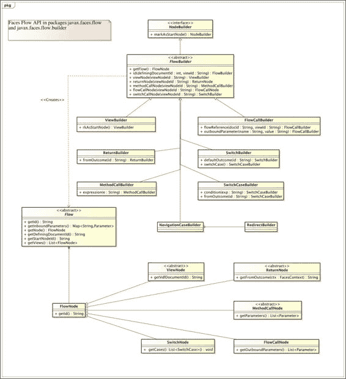

# 附录 A. JSF 与 HTML5、资源和 Faces Flows

本附录包含 JSF 库的快速参考，分为两部分。第一部分涵盖了库的参考资料、架构资源库合同和国际化配置。第二部分专门介绍使用 Java API 编写 Faces Flows。

# 一个 HTML5 友好的标记

在 Java EE 7 和 JSF 2.2 发布之后，框架始终渲染 HTML5 文档类型：`<DOCTYPE html>`。这是现代数字网站的默认行为。有了 HTML5 支持，开发者只需在 Facelets 视图（一个`*.xhtml`文件）中编写内容，该视图与现代网络浏览器的渲染引擎兼容。

JSF 2.2 为 HTML 元素提供了两种类型的属性：`pass-through`属性和`pass-through`元素。

## 透传属性

`pass-through`属性使 JSF 能够无缝支持由 HTML5 定义的新和扩展属性。这些属性适用于 JSF HTML 渲染套件的自定义标签，如`<h:inputText>`。为了使用`pass-through`属性，我们将在 Facelets 视图的顶部定义一个 JSF 命名空间，该命名空间引用 URL [`xmlns.jcp.org/jsf/passthrough`](http://xmlns.jcp.org/jsf/passthrough)。

让我们举一个使用 HTML5 属性作为占位文本的例子：

```java
<html 

      >
...
  <div class="form-group">
    <label for="birthday" class="col-sm-3 control-label">
    Birthday </label>
    <div class="col-sm-9">
      <h:inputText p:type="date"
       class="form-control" id="birthday"
       value="#{customerController.birthday}"
       p:placeholder="1977-10-25"/>
    </div>
  </div>
  <div class="form-group">
    <label for="email" class="col-sm-3 control-label">
    Email </label>
    <div class="col-sm-9">
      <h:inputText p:type="email"
       class="form-control" id="email"
       value="#{customerController.email}"
       p:placeholder="yourname@yourserverhost.com"/>
    </div>
  </div>
```

在前面的示例中，`pass-through`属性使用完整的命名空间`p:placeholder`和`p:type`进行标记。一个输入字段用于日期格式，另一个用于电子邮件地址。占位符的值向客户/用户提供了一个视觉提示，说明如何填写字段。JSF 渲染套件会将此属性（减去 XML 命名空间）传递给渲染的标签输出。类型值覆盖了默认渲染套件的设置。

一些 JavaScript 框架也依赖于扩展属性，例如 AngularJS 或某些 JQuery 插件。JSF 允许页面内容编写者和界面开发者将这些值作为属性传递。透传属性的值可能是动态的，也可以从 EL 中派生。因此，我们可以编写以下标记来验证安全的贷款金额：

```java
  <h:inputText p:type="range"
   class="form-control" id="loanAmount"
   value="#{customerController.loanAmount}"
   p:min="#{loanHelper.min}" 
   p:max="#{loanHelper.max}" p:step="#{loanHelper.step}"
   p:placeholder="Decimal number between {loanHelper.min} and {loanHelper.max}"/>
```

在前面的代码片段中，`pass-through`属性`p:type`作为范围值会导致现代浏览器渲染滑动控件而不是文本控件。有一个名为`loanHelper`的后备 bean，它动态地向控件提供最小值、最大值和步进单位值。

## 透传元素

`pass-through`属性的缺点是它们不考虑现代网络浏览器中可用的标准 HTML5 属性。使用快速 UX 标记（如`<h:inputText>`）定义的输入字段，如果没有在后台运行微服务，则利益相关者客户端无法直接查看。

为了启用我们的 Facelets 视图中的`pass-through`元素，我们首先必须定义 JSF 命名空间`http://xmlns.jcp.org/jsf`。为了触发`pass-through`元素，至少一个 HTML 元素的属性必须在命名空间中。

让我们看看在实际的 Facelets 视图中它是如何工作的：

```java
<html 
      >
  <head jsf:id="head"> ... </head>
  <body jsf:id="body">
    ...
    <form jsf:id="vacationForm">
      ...
      <input type="text" jsf:id="companyId"
          placeholder="Your company identity number"
          jsf:value="#{vacationController.companyNo}"/>
      <input type="text" jsf:id="lastName"
          placeholder="Enter last name"
          jsf:value="#{vacationController.name}"/>
      ...
      <button class="btn btn-primary"
        jsf:action="#{vacationController.makeRequest}">
        Make Vacation Request</button>
    </form>
  </body>
</html>
```

HTML 元素（`head`、`body`、`form`、`input`和`button`）至少有一个 JSF 命名空间属性。JSF 检测该属性并向其渲染树添加一个组件。元素名称决定了添加的组件类型。因此，`head`元素实际上是通过等效的`<h:head>`自定义标签渲染的，而`body`元素也是通过等效的 JSF `<h:body>`自定义标签渲染的。HTML 输入类型被特别处理，并使用`<h:inputText>`渲染。`id`和`value`属性通过 JSF 命名空间传递。占位符属性作为正常属性传递，不带 JSF 命名空间。它们意外地被提供并像`pass-through`属性一样处理！

我们可以为看起来像是正常的 HTML5 元素添加验证。以下代码确保用户至少输入六个字符：

```java
<input type="text" jsf:id="companyId"
    placeholder="Your company identity number"
    jsf:value="#{vacationController.companyNo}"/>
  <f:validateLength minimum="6" />
</input>
```

我们将把`<f:validateLength>`作为 HTML 输入元素的直接体内容插入。HTML5 支持确保该标签被翻译为 JSF 输入组件。支持还扩展到 AJAX 标签和库函数。

# 资源标识符

在 JSF 2.0 中，资源是一个图像、文档或其他数字资产。它们被放置在 Web 上下文文件夹下的`resources`文件夹中。在一个 Gradle 或 Maven 项目中，特定的资源位于路径上，如下所示：

```java
src/main/webapp/resources/<RESOURCE-IDENTIFIER>
```

一个资源也可以存储在`WEB-INF/lib`文件夹下的 JAR 文件中：

```java
src/main/webapp/WEB-INF/lib/<SOME>.jar
```

如果资源存储在 JAR 文件中，它必须位于`META-INF`文件夹中，以便可以通过路径找到：

```java
META-INF/resources/<RESOURCE-IDENTIFIER>
```

`RESOURCE-IDENTIFIER`可以进一步细分为单独的路径。最广泛的情况支持完全本地化。组成部分如下：

```java
<RESOURCE-IDENTIFIER> := 
  [ <LOCALE-PREFIX> / ] [ <LIBRARY-NAME> / ] 
  [ <LIBRARY-VERSION> / ]
  <RESOURCE-NAME> [ / <RESOURCE-VERSION> ]
```

子术语允许轻松识别和分离资源标识符。

可选的`LOCALE-PREFIX`术语表示一个区域设置，例如`en_gb`（英国英语）或`de`（德国）。

可选的`LIBRARY-NAME`术语指定了一个库名称。你可以定义库名称并在 JSF 自定义标签中使用它，如下所示：

```java
<h:outputStylesheet library="default" name="styles/app.css" />
<h:outputStylesheet library="admin" name="styles/app.css" />
```

之前的示例检索了适合库的应用样式表。这有助于区分你的数字应用的不同部分。资源查找可能解析为以下内容：

```java
<WEB-CONTEXT>/resources/en/default/1_0/styles/app.css
<WEB-CONTEXT>src/main/webapp/resources/en/admin/1_0/styles/app.css
```

这些 URL 映射到传统项目中的以下源文件资产：

```java
src/main/webapp/resources/en/default/1_0/styles/app.css
src/main/webapp/resources/en/admin/1_0/styles/app.css
```

开发者不指定库版本。相反，JSF 资源查找机制搜索相应资源的最高版本文件。文件夹名称的版本号必须匹配正则表达式：`\d_\d`。因此，`version`文件夹名称`2_0`大于`1_5`，而`1_5`又大于`1_0`。

# 资源库合同

JSF 2.2 引入了资源库合同的概念，允许数字开发者将资产和模板组织成一个可重用的资源集。资源库合同必须位于应用程序的 web 上下文根目录中的合同目录文件夹中。在标准的 Maven 或 Gradle 构建约定中，这个文件夹是`src/main/webapp/contracts`。合同文件夹中的每个子文件夹代表一个命名的资源合同。

第六章的设置，*JSF 流程和技巧*使用了资源库合同的布局，如下所示：

`/src/main/webapp/contracts/`

`/src/main/webapp/contracts/default/`

`/src/main/webapp/contracts/default/template.xhtml`

`/src/main/webapp/contracts/default/styles/app.css`

`/src/main/webapp/contracts/default/images/`

`/src/main/webapp/contracts/victoria/`

`/src/main/webapp/contracts/victoria/template.xhtml`

`/src/main/webapp/contracts/victoria/styles/app.css`

`/src/main/webapp/contracts/victoria/images/`

每个合同至少必须有一个声明的`template.xhtml`文件。合同可以拥有多个模板以进行自定义。声明的模板至少有一个声明的插入点，这被定义为`<ui:insert>`标签。模板通常依赖于数字资产，这些被称为声明的资源。

合同可以被打包成 JAR 文件供客户使用。资源库合同必须放置在 JAR 文件的`META-INF/contracts`文件夹中。因此，我们可以按照以下布局重新打包流程示例：

`META-INF/contracts/`

`META-INF/contracts/default/javax.faces.contract.xml`

`META-INF/contracts/default/template.xhtml`

`META-INF/contracts/default/styles/app.css`

`META-INF/contracts/default/images/`

`META-INF/contracts/victoria/`

`META-INF/contracts/victoria/javax.faces.contract.xml`

`META-INF/contracts/victoria/template.xhtml`

`META-INF/contracts/victoria/styles/app.css`

`META-INF/contracts/victoria/images/`

我们需要为每个合同添加一个空的标记文件，`javax.faces.contract.xml`。这个文件名的引用可以在静态字符串`javax.faces.application.ResourceHandler.RESOURCE_CONTRACT_XML`中找到。

# 一个 Faces servlet

在 JSF 中，FacesServlet 充当前端控制器，是所有请求的通道，同时也将响应发送回客户端。这个 servlet 是`javax.servlet.Servlet`的子类。

网络浏览器客户端向 servlet 容器发送 HTTP 请求。如果是 Faces 请求，则 servlet 容器调用 FacesServlet 的 `service()` 方法。该方法将请求的处理交给一个成员实例 `javax.faces.lifecycle.LifeCycle` 对象。该方法还创建了一个 FacesContext 实例。`LifeCycle` 实例负责处理请求到所有在 第二章 中描述的 JSF 阶段，即 *JavaServer Faces 生命周期* 以及响应的渲染。

## 资源路径的重配置

通过配置 web XML 部署描述符，还可以更改资源查找和合同文件夹的路径名称。常量定义在 `javax.faces.application.ResourceHandler` 类中。`WEBAPP_RESOURCES_DIRECTORY_PARAM_NAME` 字符串常量定义了资源目录属性名称，而 `WEBAPP_CONTRACTS_DIRECTORY_PARAM_NAME` 定义了合同目录属性。

我们可以使用以下 `web.xml` 设置重新定义 JSF 网络应用程序的默认值：

```java
<web-app  ...>
  <servlet>
    <servlet-name>Faces Servlet</servlet-name>
    <servlet-class>javax.faces.webapp.FacesServlet</servlet-class>
    <init-param>
      <param-name>javax.faces.WEBAPP_RESOURCES_DIRECTORY</param-name>
      <param-value>/myresources</param-value>
    </init-param>
    <init-param>
      <param-name>javax.faces.WEBAPP_CONTRACTS_DIRECTORY</param-name>
      <param-value>/mycontracts</param-value>
    </init-param>
  </servlet> ...
</web-app>
```

我们可以通过在覆盖默认配置的情况下在 Faces servlet 上指定初始参数。

## JSF 特定配置

Faces servlet 理解其他几个配置参数。以下是可能的参数名称列表。这些名称以 `javax.faces` 为前缀：

| 参数名称 | 描述 |
| --- | --- |
| `CONFIG_FILES` | 这指定了一个逗号分隔的列表，包含与上下文相关的附加资源路径，这些路径会自动与 `WEB-INF/faces-config.xml` 一起加载。 |
| `DEFAULT_SUFFIX` | 这设置了 JSF 文件的后缀；默认为 `*.xhtml`。如果您更改此配置，则建议您也更改 `web.xml` 中的 welcome-file-list。 |
| `DISABLE_FACELET_JSF_VIEW_HANDLER` | 如果此参数设置为 `true`，则禁用 Facelets 作为默认页面声明语言。默认值为 `false`。 |
| `FACELETS_BUFFER_SIZE` | 这指定了 JSF 响应的缓冲区大小。默认大小为 `-1`，表示无限制大小。 |
| `FACELETS_REFRESH_PERIOD` | 这设置 JSF 编译器检查更改的间隔时间（秒）。在生产模式下，此值设置为 `-1`，表示 JSF 编译器不应检查；否则，在参考实现中默认设置为 `2`。 |
| `FACELETS_SKIP_COMMENT` | 这是一个布尔值，用于确定 Facelets 视图中的 XML 注释是否包含在响应中。默认值为 `true`。 |
| `FACELETS_LIBRARIES` | 这指定了一个分号分隔的列表集合，通过路径指定 Facelets 标签库。 |
| `LIFECYCLE_ID` | 这覆盖了 JSF `javax.faces.lifecycle.Lifecycle` 实例的默认实现。 |
| `PROJECT_STAGE` | 这指定了开发项目阶段。可接受值为 `Development`、`UnitTest`、`SystemTest` 或 `Production`。 |
| `STATE_SAVING_METHOD` | 这指定了在 JSF 应用程序中保存状态的位置。可接受的值是`client`和`server`。 |
| `WEBAPP_CONTRACTS_DIRECTORY` | 这覆盖了 JSF 资源合同的默认位置。默认是`<web-context>/contracts`。 |
| `WEBAPP_RESOURCES_DIRECTORY` | 这覆盖了 JSF 为数字资产保留的资源的默认位置。默认是`<web-context>/resources`。 |

这些设置最好在 Web 部署描述符文件（`web.xml`）中进行配置。

# 国际化

一个 JSF 应用程序可以使用标准资源包（`java.util.ResourceBundle`）和消息进行国际化。资源包适合用于国际化组件、控件和数字资产上的文本；而消息文件旨在国际化 JSF 验证错误。

在 Gradle 或 Maven 项目中，我们将添加一个资源包或消息文件到`src/main/resources`项目位置，并使用必要的 Java 包作为文件夹。

## 资源包

我们将在 Web 应用程序的配置文件`/WEB-INF/faces-config.xml`中配置资源包。

对于第四章中关于联系详情的应用程序第四章，我们有两个英语和德语文言包文件：`appMessages.properties`和`appMessage_de.properties`。

以下是英语语言包：

```java
// uk/co/xenonique/digital/appMessages.properties
contactForm.firstName=First Name
contactForm.lastName=Last Name
contactForm.houseOrFlatNumber=House or Flat Number
contactForm.street1=Street 1
contactForm.street2=Street 2
contactForm.townOrCity=Town or City
contactForm.region=Region
contactForm.postCode=Post Code
```

以下是德语文言包：

```java
// uk/co/xenonique/digital/appMessages_de.properties
contactForm.firstName=Vornamen
contactForm.lastName=Nachnamen
contactForm.houseOrFlatNumber=Haus oder Wohnung Nummer
contactForm.street1=Strasse 1
contactForm.street2=Strasse 2
contactForm.townOrCity=Stadt oder Gemeinde
contactForm.region=Lande
contactForm.postCode=PLZ
```

为了在我们的 JSF 包中使用这些包，我们将按照以下方式配置 Faces 配置：

```java
<?xml version="1.0"?>
<faces-config version="2.2"

  xsi:schemaLocation="http://xmlns.jcp.org/xml/ns/javaee 
  http://xmlns.jcp.org/xml/ns/javaee/web-facesconfig_2_2.xsd">
  <application>
    <resource-bundle>
       <base-name>uk.co.xenonique.digital.appMessages</base-name>
       <var>appMessages</var>
    </resource-bundle>
  </application>
</faces-config>
```

我们将在`/WEB-INF/faces-config.xml`中为我们的应用程序消息定义一个资源包配置。在这个文件中，我们可以为我们的包定义一个应用范围变量，即`appMessages`。

从这里，我们可以使用 EL 语法使用这个包。以下是应用程序中房屋号码的代码：

```java
<h:form id="yourAddressForm"
        styleClass="form-horizontal" p:role="form">
  <div class="form-group">
    <h:outputLabel for="houseOrFlatNumber" 
      class="col-sm-3 control-label">
        #{appMessages['contactForm.houseOrFlatNumber']}
    </h:outputLabel>...
  </div> ...
</h:form>
```

由于我们在属性名中使用点（`.`），我们必须使用映射 EL 语法来获取所需的消息：`#{appMessages['contactForm.houseOrFlatNumber']}`。

资源包也可能包含带有格式化标记参数的参数化消息属性。标记参数在消息解析过程中由 JSF 框架或通过应用程序自定义代码进行展开。以下是一个参数化消息属性的示例：

```java
contactForm.specialNote = proctor records {0}, {1} and {2} 
```

然后，我们将使用`<h:outputFormat>`标签来渲染输出，如下所示：

```java
<h:outputFormat value="#{appMessages['contactForm.specialNote']}">
  <f:param value="first argument" />
  <f:param value="second argument" />
  <f:param value="third argument" />
</h:outputFormat>
```

## 消息包

在 JSF 应用程序中，后端代码通常可以生成输出消息，这些消息也可以进行国际化。这些消息存储在 FacesContext 对象中。我们需要确保用户可以看到所有或部分这些消息。我们将使用`<h:messages>`或`<h:message>` JSF 标签来实现这一点。

在第四章中，我们已经查看了消息包的`faces-config.xml`。

## 浏览器配置的区域设置

对于许多数字站点，用户的浏览器决定了网站的语言环境。开发者可以在`/WEB/faces-config.xml`文件中通知 JSF 关于应用程序支持的语言。

这里是联系详情应用的设置：

```java
<faces-config>
   <application>
      <locale-config>
         <default-locale>en</default-locale>
         <supported-locale>fr</supported-locale>
         <supported-locale>de</supported-locale>
      </locale-config>
  </application>
</faces-config>
```

在此文件中，我们将指定我们的默认语言环境为英语，支持的语言环境有法语和德语。

## 应用程序控制的语言环境

某些数字站点的要求是允许用户在两个或多个语言环境之间切换。因此，我们必须通过编程实现这个目标。对于 JSF 中渲染的每个视图，我们都需要在控制器方法中设置语言环境。我们将使用 FacesContext 来访问 Faces 响应中的根视图 UI，并在此处设置语言环境。

假设我们为一家在英国伦敦和德国南部海德堡设有办事处的运动汽车制造商工作；那么，我们可以编写以下代码：

```java
final UIViewRoot viewRoot = FacesContext
  .getCurrentInstance().getViewRoot();
viewRoot.setLocale(new Locale("de"));
```

视图将被设置为德语语言环境。

## 单个页面控制的语言环境

如果利益相关者想要一个数字站点，其中每个单独的页面都可以有自己的配置语言环境，那么 JSF 可以实现这个目标。开发者可以使用`<f:view>`视图标签来覆盖页面的语言环境。在 JSF 2.0 标准之前，视图标签包装了内容并充当容器元素。在 JSF 2.0 及以后的版本中，这现在是多余的，视图标签可以设置语言环境。

这里是从具有名为`primaryLocale`属性的配置文件中检索语言环境的代码片段：

```java
<f:view locale="#{userProfile.primaryLocale}"/>
```

这里是与页面视图相关的会话范围 bean：

```java
@SessionScoped
class UserProfile {
  private Locale primaryLocale = Locale.ENGLISH;
  public Locale getPrimaryLocale() {
    return primaryLocale;
  }
}
```

# 网络部署描述符

这是为了进入一个单独的附录。

这里是 JSF 2.2 和 Java EE 7 的参考开发 XML 部署描述符：

```java
<?xml version="1.0" encoding="UTF-8"?>
<web-app 

 xsi:schemaLocation="http://xmlns.jcp.org/xml/ns/javaee 
 http://xmlns.jcp.org/xml/ns/javaee/web-app_3_1.xsd"
 version="3.1">
  <context-param>
    <param-name>javax.faces.PROJECT_STAGE</param-name>
    <param-value>Development</param-value>
  </context-param>
  <servlet>
    <servlet-name>Faces Servlet</servlet-name>
    <servlet-class>javax.faces.webapp.FacesServlet</servlet-class>
    <load-on-startup>1</load-on-startup>
  </servlet>
  <servlet-mapping>
    <servlet-name>Faces Servlet</servlet-name>
    <url-pattern>*.jsf</url-pattern>
  </servlet-mapping>
  <session-config>
    <session-timeout> 30 </session-timeout>
  </session-config>
  <welcome-file-list>
    <welcome-file>index.jsf</welcome-file>
  </welcome-file-list>
</web-app>
```

# 编程式 Faces 流程

在这个附录中，我们将提供 JavaServer Faces 流程的快速参考。一个流程是根据用户和每个 Web 应用程序的有限状态机，具有节点。有一个默认的入口节点和至少一个出口节点。

## 视图类型

在第六章，“JSF 流程和优雅”，我们讨论了从 Faces 配置 XML 文件构建流程导航。JSF 2.2 规范描述了使用目录结构存储和设置流程的约定。

存在几种类型的节点。它们在以下表中列出：

| 节点类型 | 描述 |
| --- | --- |
| 视图节点 | 此节点表示一个视图。JSF 提供者渲染视图，流程仍然活跃。 |
| 返回节点 | 此节点表示从流程中退出到此流程外部的一个出口点。当前流程在调用此节点时终止。 |
| 流程调用节点 | 此节点表示对另一个嵌套流程的调用。 |
| 方法调用节点 | 此节点表示在流程范围内的 bean 中对方法调用的调用。离开此方法调用后，当前流程仍然活跃。 |
| 切换节点 | 此节点表示一个可选择的条件状态。根据状态，流程可能移动到一个或多个替代状态，并且有一个默认结果。当前流程仍然有效。 |
| 导航情况节点 | 此节点表示一个具有导航的通用条件状态。根据状态，流程可能移动到新的结果或执行流程外的 HTTP 重定向。 |

### 小贴士

通过将 Faces Flows 与其他流程或业务流程技术进行比较，应该承认没有所谓的初始节点。

# Faces Flows 程序化接口

Faces Flows 由 CDI 驱动。可以通过声明一个生成 Faces Flow 的 POJO 来编写程序化流程。为了动态生成流程，我们必须将一个 Bean 标注为 CDI 生成器并生成一个流程实例。

这里是一个基本的 `SimpleFlowFactory` 类，它提供 Faces Flow：

```java
import javax.faces.flow.builder.*;

public class SimpleFlowFactory implements Serializable {
  @Inject DocumentIdGenerator generator;

  @Produces @FlowDefinition
  public Flow createFlow( 
    @FlowBuilderParameter FlowBuilder flowBuilder)
  {
    final String documentId = generator.generate();
    flowBuilder.id(documentId, "simpleFlow");
    flowBuilder.viewNode("simpleFlow", 
      "/simpleFlow/simpleFlow.xhtml")
      .markAsStartNode();
    return flowBuilder.getFlow();
  }
}
```

我们将 `createFlow()` 方法标注为具有特殊限定符的 CDI 生成器，即 `@FlowDefinition`。我们还将为此方法提供一个单一参数，即 `FlowBuilder`，它也被标注为 `@FlowBuilderParameter`。顺便说一下，这些定义可以在保留的导入包 `javax.faces.flow.builder` 中找到。我们使用注入的 `FlowBuilder` 来生成特定的流程。实际的节点类型可以在 `javax.faces.flow` 包中找到。

Faces Flow 需要一个流程标识符，即 `simpleFlow`。我们可以选择性地也定义一个特定的文档 ID。我们将使用一个依赖生成器实例来演示它是如何工作的。如果没有必要提供文档 ID，则提供一个空字符串。

Faces Flow 至少需要一个视图，这通常在 XML 配置中是默认名称。为了完成第一个视图节点，我们将定义一个 ViewNode 和流程视图模板的 URI：`/simpleFlow/simpleFlow.xhtml`。我们还需要设置流程的起始节点，调用设置为 `markAsStartNode()`，因为 Faces Flow 需要一个初始节点。`FlowBuilder` 的 API 来自流畅构建器模式。在 `createFlow()` 方法的末尾，我们将生成一个流程实例并返回它。从这一点开始，JSF 提供者接管流程定义。

记住，虽然我们自己在构建流程，但我们不必完全遵循 XML 配置的所有规则。然而，一个流程定义的所有视图模板必须位于 Web 应用程序根上下文下的一个单独文件夹中。

尽管我们定义了流程定义生成器，我们仍然需要实际的流程作用域 Bean，即：

```java
@Named("simpleFlowController")
@FlowScoped("simple")
public class SimpleFlow implements Serializable {
  /* ... */
}
```

我们将在以下章节中查看每种节点类型的详细信息。

以下 UML 类图说明了 API 中的关键类型：



Faces Flow API 的 UML 类图

## ViewNode

使用 `FlowBuilder`，我们可以定义 ViewNode 实例。实际类型是 `javax.faces.faces.ViewNode` 的子类。

以下代码示例扩展了最后一个流实例并提供了额外的视图节点：

```java
@Produces @FlowDefinition
public Flow createFlow( 
  @FlowBuilderParameter FlowBuilder flowBuilder)
{
  final String documentId = generator.generate();
  flowBuilder.id(documentId, "simpleFlow");
  /* ... */
  flowBuilder.viewNode("page1", "/simpleFlow/page1.xhtml")
  flowBuilder.viewNode("page2", "/simpleFlow/page2.xhtml")
  flowBuilder.viewNode("page3", "/simpleFlow/page3.xhtml")
  return flowBuilder.getFlow();
}
```

`viewNode()`方法接受两个参数。第一个参数是视图节点 ID，我们将在视图内容中写入并引用它。第二个参数是视图描述语言文档标识符，它对应于 Facelets 视图的 URI。

URI 的路径也可以是一个相对 URL。这意味着最终路径相对于流 URI 路径是相对的。否则，URI 必须相对于 Web 上下文根路径是绝对的，正如我们可以在前面的代码摘录中看到的那样。

`viewNode()`方法返回一个`ViewBuilder`类型，它只有一个额外的`markAsStartNode()`方法。

## ReturnNode

我们还可以从`FlowBuilder`生成一个`ReturnNode`实例。使用`returnNode()`方法非常简单。实际类型是`javax.faces.faces.ReturnNode`的子类。

这是`createFlow()`方法的摘录，它指定了一个返回节点：

```java
@Produces @FlowDefinition
public Flow createFlow( 
  @FlowBuilderParameter FlowBuilder flowBuilder)
{
  final String documentId = generator.generate();
  flowBuilder.id(documentId, "simpleFlow");
  /* ... */
  flowBuilder.returnNode("return-backup").fromOutcome("welcome");
  return flowBuilder.getFlow();
}
```

`returnNode()`方法接受一个参数，即视图节点 ID，并返回一个`ReturnBuilder`实例。`fromOutcome()`方法调用指定了返回当前流后要导航到的结果视图的名称。

## MethodCall

使用`FlowBuilder`实例，我们还可以创建一个方法调用节点并将其添加到 Faces Flow 中。实际类型是`javax.faces.faces.MethodCallNode`的子类。以下是 POJO 类：

```java
@Produces @FlowDefinition
public Flow createFlow( 
  @FlowBuilderParameter FlowBuilder flowBuilder)
{
  /* ... */
  flowBuilder.methodCallNode("check-funds")  
    .expression(
      "#{loanController.verifyCustomer(customer.account)}", 
      new Class[]{String.class});  
    .defaultOutcome("no-funds-available")
  return flowBuilder.getFlow();
}
```

`methodCallNode()`调用接受一个视图节点 ID 并创建一个`MethodCallBuilder`实例。此节点需要一个表达式来通知 JSF 关于要调用的 bean 的名称和方法。在这里，方法是在可访问的后备 bean 控制器`loanController`上的`verifyCustomer()`。我们还可以使用表达式语言传递客户的详细信息中的账户记录。如果目标方法调用返回 null 或空字符串，我们可以指定一个默认的结果视图标识符。

我建议你在分层架构中尽可能减少耦合。注意不要将太多表示层信息与业务逻辑混合。

## FlowCall

我们将使用相同的抽象类类型`FlowBuilder`创建一个流调用节点。此节点类型调用嵌套的 Faces Flow。`flowCallNode()`方法接受一个视图节点 ID 参数，并返回一个`FlowCallBuilder`实例。实际类型是`javax.faces.faces.FlowCallNode`的子类。

在这个基于第六章 *工业部门碳足迹*讨论的代码摘录中，我们将重写名为`footprint-flow.xml`的流定义 XML 文件，如下面的`SectorFlowFactory` POJO 类所示：

```java
class SectorFlowFactory implements Serializable {
  /* ... */
  @Produces @FlowDefinition
  public Flow createFlow( 
    @FlowBuilderParameter FlowBuilder flowBuilder)
  {
    flowBuilder.id("", "sector-flow");
    /* ... */
    flowBuilder.flowCallNode("callFootprintFlow")
      .flowReference("", "footprint-flow)
      .outboundParameter("param1FromSectorFlow", 
        "param1 sectorFlow value")
      .outboundParameter("param2FromSectorFlow", 
        "param2 sectorFlow value")
      .outboundParameter("param3FromSectorFlow", 
        "#{sectorFlow.footprint}");
    return flowBuilder.getFlow();
  }
}
```

在前面的代码中，节点被标识为`callFootprintFlow`。我们必须通过`flowReference()`方法提供嵌套流的节点 ID。`flowReference()`的第一个参数是流文档 ID，这里是一个空字符串。嵌套流通过第二个参数被标识为足迹流。

我们将在`FlowCallBuilder`上使用`outboundParameter()`方法来声明出站参数，这些参数将数据从调用者 sector-flow 传递到嵌套足迹流。`outboundParameter()`的第一个参数是参数名称，第二个参数是字面字符串或表达式。

我们还可以通过编程方式重写嵌套流的流定义 XML 文件。以下是`FootprintFlowFactory`类的摘录：

```java
class FootprintFlowFactory implements Serializable {
  /* ... */
  @Produces @FlowDefinition
  public Flow createFlow( 
    @FlowBuilderParameter FlowBuilder flowBuilder)
  {
    flowBuilder.id("", "footprint-flow");
    flowBuilder.inboundParameter("param1FromSectorFlow", 
      "#{flowScope.param1Value}");
    flowBuilder.inboundParameter("param2FromSectorFlow", 
      "#{flowScope.param2Value}");
    flowBuilder.inboundParameter("param3FromSectorFlow", 
      "#{flowScope.param3Value}");
    /* ... */
    return flowBuilder.getFlow();
  }
}
```

在此代码中，我们注意到足迹流 ID 必须与调用者引用 ID 匹配。对于此 Faces Flow，我们将使用`inboundParameter()`方法调用声明入站参数。第一个参数是参数名称，第二个参数是一个表达式语言引用，它定义了值存储的位置。

## SwitchNode

我们可以使用`FlowBuilder`来创建声明切换节点的声明。这些节点类型由条件语句和结果之间的关联组成。结果是视图 ID。切换节点有一个或多个条件语句。它也可能有一个默认结果。在流的处理过程中，JSF 依次执行每个条件语句。如果它评估为真（或者更确切地说，`Boolean.TRUE`），那么相关的结果就是选择的结果。实际类型是`javax.faces.faces.SwitchNode`的子类。

让我们看看在 POJO 中切换节点实际操作的例子。这是另一个名为`LoanDecisionFlowFactory`的货币贷款决策者类：

```java
class LoanDecisionFlowFactory implements Serializable {
  /* ... */
  @Produces @FlowDefinition
  public Flow createFlow( 
    @FlowBuilderParameter FlowBuilder flowBuilder)
  {
    flowBuilder.id("", "loan-application");
    /* ... */
    flowBuilder.switchNode("loan-decision")
      .defaultOutcome("home")
      .switchCase()  
        .condition("#{loanMaker.decision=='Agreed'}")
        .fromOutcome("loan-agreement")
      .switchCase()  
        .condition("#{loanMaker.decision=='Declined'}")
        .fromOutcome("loan-declined")
      .switchCase()  
        .condition("#{loanMaker.decision=='Pending'}")
        .fromOutcome("loan-pending")
    /* ... */
    return flowBuilder.getFlow();
  }
}
```

在`createFlow()`方法中，我们将创建一个标识为 loan-application 的 Faces Flow。然后我们将使用`switchNode()`创建一个切换节点声明，并标识为 loan-decision。此方法返回一个`SwitchBuilder`类型。此构建器类型具有`switchCase()`，它返回`SwitchCaseBuilder`。其他包含的重载方法被称为`defaultCome()`。

建议您还使用`defaultOutcome()`方法声明一个默认结果，它接受一个视图 ID。这样，流总是移动到下一个可行的位置。

给定`SwitchBuilder`构建器类型，我们将使用`condition()`和`fromOutCome()`方法声明单个案例。`condition()`调用接受一个表达式字符串，并返回`SwitchCaseBuilder`。此构建器上的唯一属性是有效的结果，它是一个视图标识符。

## 导航情况节点

API 中的最后一个构建器类型与一个通用抽象类类型`NavigationCaseBuilder`相关。我们可以使用`FlowBuilder`创建导航情况节点。实际类型是`javax.faces.faces.FlowNode`的子类。

这里是一个来自金融服务领域的 POJO，它被设计成允许投资银行的后台工作人员在工作流中发布流程交易：

```java
class PostProcessTradeFlowFactory implements Serializable {
  /* ... */
  @Produces @FlowDefinition
  public Flow createFlow( 
    @FlowBuilderParameter FlowBuilder flowBuilder)
  {
    flowBuilder.id("", "post-process-trade-flow"); /* ... */
    flowBuilder.navigationCase()
      .fromOutcome("trade-check")
      .condition("#{trade.amount > global.risk.limit}")
      .toViewId("exceptional");

    flowBuilder.navigationCase()
      .fromOutcome("trade-check")
      .condition("#{trade.settlementCcy != 'USD'")
      .redirect().includeViewParams()
      .parameter("deskCodeNotice", "OUT_OF_CURRENCY_DEAL");
    /* ... */
    return flowBuilder.getFlow();
  }
}
```

在这个`PostProcessTradeFlowFactory` POJO 中，我们再次有一个`createFlow()`方法，但这次我们将调用`navigationCase()`两次。这个方法没有参数，并返回一个`NavigationCaseBuilder`类型的对象，该对象创建指定的 Faces Flow。导航案例流程需要一个触发点、一个条件表达式和一个结果或重定向响应。

在第一个流程中，我们将对`NavigationCaseBuilder`调用`fromOutcome()`方法，以声明触发检查的 JSF 视图 ID。`condition()`方法定义了必须返回布尔值的表达式。`toViewId()`方法定义了如果条件表达式评估为`Boolean.TRUE`，则导航到的结果视图 ID。因此，如果交易价值超过公司范围内的风险限制（`trade.amount > global.risk.limit`），则流程将导航到异常视图。

在第二个流程声明中，我们将定义一个导航案例来处理一种货币交易，这可能是一个掉期、债券或其他衍生品。使用相同的触发结果交易检查，我们将捕获非美元货币的表达式：`trade.settlementCcy != 'USD'`。使用这个导航案例节点，我们将执行一个 HTTP 重定向，导致客户退出整个流程。我们将调用`redirect()`，它将返回`NavigationCaseBuilder.RedirectBuilder`。这个嵌套的抽象类有两个方法：`includeViewParams()`和`parameter()`。`includeViewParams()`方法将所有视图参数添加到重定向 URL 中。`parameter()`方法将名称和值对添加到重定向 URL 中。记住，在流程完成后，从安全数字开发者的角度来看，这些参数将在最终的 HTTP GET 请求的 URL 中非常明显！

## 构建器类型

构建器类型——`ViewBuilder`、`ReturnBuilder`、`MethodCallBuilder`、`FlowCallBuilder`、`SwitchBuilder`、`SwitchCaseBuilder`和`NavigationCaseBuilder`是抽象类。它们是`javax.faces.flow.builder.NodeBuilder`接口的实现。Faces Flow API 是嵌入式领域特定语言的例子。
