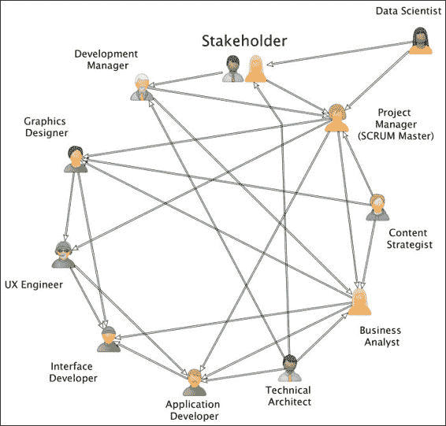

# 附录 C.敏捷性能 - 数字团队内部工作

我们处于数字时代。这对我们这些在数字团队工作的人来说是个好消息；但软件开发、设计和架构的实践永远不会一帆风顺。构建高质量工程解决方案确实存在实际可感知的成本。我们就是成本。这消耗了我们的时间、资源和精力，而且对更好的性能、利润率和用户友好性的需求永无止境。数字团队的表现，就像任何其他业务线一样，很大程度上取决于良好的沟通和与同事良好合作的能力。

# 数字团队与适应

作为数字团队的一部分，我们的事业是帮助适应旧世界的商业，将其在线推进，并乐观地朝着更好的未来前进。

数字工作的另一面是工作表现。如果你的团队负责一个高调的业务或客户，你可能会发现自己受到严格的审查，以确保项目按计划进行。有时满足客户目标与敏捷的放任开发相矛盾。在关键时刻，团队必须团结一致，以便快速交付产品，同时足够平衡，以便让团队根据他们的用户故事自行组织技术决策。通常，数字团队可以迅速前进，很少考虑整体技术架构，导致最终状态和最终交付让利益相关者感到沮丧和担忧。敏捷并不能保证产品的质量，但它有所帮助。

那么，我们如何才能改善这些问题呢？作为本书的读者，你可能是一位 Java EE 7 开发者，并参与编程和测试的各个方面。我们必须在我们的数字团队中的工程角色中保持清晰，并且更重要的是，了解我们各自团队中其他成员的角色和关注点。尽职调查、投资回报、减少技术债务和上市时间真正指明了通往更大透明度、诚信和对他人尊重的道路。这是现代数字团队的首要指令，因此推动我们的表现向前发展。让我们看看下面的截图：

组织人员及其在现代数字团队中的角色

# 角色

让我们看看下一节中的角色。我们将角色分为不同的视角：开发、设计、架构和管理。

## 开发视角

在数字团队中有许多角色需要具备可行的软件开发技能，以及用编程逻辑解决问题并带有创意暗示的能力。

### Java 工程师

由于你正在阅读这本书，你很可能已经熟悉了 Java 工程师的角色。作为软件开发者的角色意味着你有责任为数字应用程序编写产品代码的实现。我将进一步说明，这个角色包括编写单元测试、功能测试和集成测试。现代开发者遵循敏捷实践以提高效率。他们参与业务和领域逻辑、表示层、领域层和集成层。Java 工程师将与测试人员、界面开发人员和有时与业务分析师保持密切沟通。

### 界面开发工程师

界面开发人员负责编写数字应用程序前端客户端的 JavaScript 代码。这个头衔也适用于使用 iOS、Android 和其他平台编写代码的手机开发者。界面开发人员通常涉及 HTML5、CSS 和 JavaScript 编码。不可避免的是，他们也了解现代实践和最新的前端测试、调试和测试。

界面开发人员几乎只会在表示层工作。他们也可能帮助设计和向领域层架构师提供输入和想法。据称，苹果美国将他们的网络团队分为用户界面工程和服务器端工程，同时共享领域模型。

界面开发人员将与测试人员、Java 工程师和业务分析师沟通。他们肯定会与用户体验设计师、创意设计师和内容策略师保持密切接触，因为界面开发人员的工作之一是将设计转换为前端产品代码。

### 质量保证测试员

这个角色范围从在非敏捷环境中独立团队中的传统专用测试人员，他们在产品团队中寻找产品缺陷，到那些作为敏捷团队一部分并参与软件开发生命周期所有方面的测试人员。在数字环境中，测试人员可能负责在各种不同的设备上断言生产代码的质量：智能手机、平板电脑和台式电脑，甚至包括现代可穿戴计算机。测试人员还可能编写需要深度参与行为驱动设计规范的规范，以确保最终系统的质量高，符合整个团队的目标。

测试人员将与团队中的每个人沟通和交流，包括设计师。在熟练的敏捷团队中，他们通常是每个人都要给留下深刻印象的人，因为他们编写了完成的定义。

### 开发者测试中的软件

在测试中的软件开发者是一种质量保证测试员的变化形式，这个角色根据不同的观点是有争议的。最好的情况下，这个角色是一个流动性和有争议的角色，确保团队中的其他软件开发者编写足够的可测试和可验证的生产代码。因此，这个角色需要具备开发 Java 代码的能力；它可能还需要 JavaScript 能力和自动化测试。由于政治结果的影响，Java 和接口开发者是否编写了足够的质量测试，如单元测试、功能测试和集成测试，这个角色仍然是一个定义不明确的角色。这个角色可能包括测试倡导。

在开发者测试中，一个更广泛的角色可能包括维护和解决构建环境中的问题的责任，以及包括持续集成和持续部署的方面。

## 设计视角

如果你被邀请参加一个派对，你在那里遇到了另一个专业人士，并且你偶然问他们，他们做什么工作？那个人然后说他们也从事数字领域的工作，但作为设计师。他们日常的工作内容通常并不明确。在“设计师”这个总称下有许多不同类型的设计师。在这里，我们谈论的是软件应用的数字和创意设计师，而不是软件架构师和设计师。这个角色与其他行业的设计师（如汽车（汽车）、航空（飞机）、电子产品和工业产品（吸尘器和 iPod））也不同，因为他们与有形产品打交道。设计师有一个共同点：他们设计一个解决方案来解决一个没有正确或明确答案的问题。

在接下来的章节中，我们将探讨数字领域的设计师。

### 创意设计师

一个富有创造力的设计师有责任将数字概念展示或呈现给客户和利益相关者的需求。这个角色涉及到艺术能力以及运用图形设计、排版和现代标准方面的知识。

通常，一个创意设计师在一个团队中工作，他们支持他人并在团队环境中进行沟通以探索不同的想法是很重要的。与众不同和个性化是可以的；然而，项目的关键设计必须优先考虑，确保只有最好的图形设计被发布给利益相关者。

一个创意设计师了解流行的专业软件包，包括 Adobe PhotoShop、Fireworks、InDesign、Illustrator 和 Xara Design。

设计师，尤其是那些在数字代理机构工作的设计师，有很多沟通。因此，这个角色需要能够按时完成任务，并交付巧妙的创意概念，以区别于客户的竞争对手，并且有压力以细致入微的关注细节来表现。通常，与团队中的其他成员相比，他们可能需要更长的工作时间，以便交付新的数字工业概念。设计师会与可用性工程师、界面设计师和内容策略师紧密合作。

### 可用性体验工程师

可用性工程师的角色是为数字应用程序设计和发展引人入胜的用户体验。这个角色是关于增强产品的动觉情感和感觉。可用性工程师负责对设计的视觉构图进行实地测试。这可能意味着在内部或与外部可用性测试实验室合作，并构建交互设计的线框图。

**用户界面**（**UI**）和**用户体验**（**UX**）工程师/设计师的角色在职场中相对较新，因为企业一直致力于在多个设备屏幕上构建人机交互。这些角色因其专业能力而成为专门领域，并从通用目的创意设计师中分离出来。UX 角色的任务是识别人类层面的界面、元素和核心功能，以及视觉语言，以便帮助客户快速而熟练地进步，从而实现他们的最终目标。UX 工程师会生成原型、线框图，并向利益相关者和团队展示客户的旅程。由于这个角色的关键特征完全关于用户测试，他们还促进 A/B 测试，并在行为和设计语言方面进行大量研究。

UX 工程师通常与创意设计师、界面开发人员和质量保证部门频繁沟通。对于核心开发，他们还会与 Java 开发者沟通。UX 工程师还会直接与内容策略师讨论问题，以明确项目的整体设计语言。

### 内容策略师

内容策略师是一个编写内容设计的人。这个角色是关于审视一个项目交互的语言。它涉及规划文案写作、写作风格、如何控制语言传递的过程，并成为治理的来源。内容策略师的角色可以比作博物馆馆长、酿酒师或大师品酒师。内容策略师对书面语言有出色的掌握，这可能包括媒体内容、视频、电影制作和摄影，如果需要的话。

内容策略师的一个非常常见的角色是为整个项目奠定业务术语知识的基础。这个角色需要传达数字业务（或政府部门）的关键信息和主题。他们还负责确定搜索引擎优化的内容。策略师将与元数据、内容目的和网页写作一起工作。

在日常活动中，内容策略师与业务分析师和利益相关者紧密合作，以确定设计语言。

## 建筑视角

在数字领域，还有一些角色与应用程序的架构有关，而不仅仅是创意或软件设计。

### 数据科学家

近年来，数字领域出现了另一个角色，专门用于统计数据分析、数据建模和信息设计。这是专门数据科学家的职责，这是一个与所谓的大数据相关的新兴领域。数据科学家负责从可能是有结构或无结构的大数据集中提取信息和知识。简单来说，他们可以理解对普通读者来说可能只是噪音的信号。结果是数据可视化和模型，这些将被展示给关键业务利益相关者和管理层。

数据科学家通过应用科学和数学技术分析大量数据。他们可能会使用一些特定的计算机算法来深入了解数据集的模式。一些数据科学家可以编写计算机程序，尽管许多人熟悉统计分析软件包。他们通常拥有大学后的学位，如硕士或博士学位，以便在其角色中实践。

数据科学家可能独立于数字团队工作。他们可能为几个不同的团队工作。他们通常与 Java 工程师、商业和管理层沟通。

### 技术架构师

数字团队可能有一个特定的技术架构师，以确保应用程序满足某些**非功能性要求**。**非功能性要求**是目标软件的一个方面或特性，它不反映其功能操作。对案件工作人员的功能操作是工作人员被允许实时处理案件。**非功能性要求**（**NFRs**）是特性和标准，它们指定和描述系统架构的操作。操作特性被称为适应性、可用性、灵活性、可维护性、性能、可重用性、鲁棒性、可伸缩性、安全性和可测试性。通常，架构师必须在这些非功能性要求之间进行权衡。例如，他们考虑可用性与性能之间的权衡，并询问业务利益相关者哪个特性更重要，或者与架构达成妥协。

架构师负责确保最终应用程序按计划进行，并满足非功能性需求。通常会有大量的软件设计和领域模型分析。在软件中具有常见设计模式的经验可能会有所帮助，但一个好的架构师在决定特定策略之前，会非常详细地检查根本需求。

技术架构师直接与核心平台团队沟通：Java 工程师和界面开发者，尤其是在设计过程中。他们将促进团队讨论关于使用哪种编程语言以及是否应该使用开源库框架。架构师也与业务利益相关者和管理层保持联系。他们还可能与数据科学家交谈，以帮助检索或捕获信息进行统计分析。最后，实际操作的架构师预计将开发软件，并需要能够指导其他技术工程师的所有层面。

## 管理视角

一个项目需要良好的质量管理。你的经理是员工中的关键成员，他坐在业务利益相关者和工程师、测试员、设计师团队之间。他实际上是高级管理层和软件开发团队之间的缓冲器。

### 商业分析师和联络官

一些数字团队将专门为查看项目的业务需求而设有商业分析师。这种角色取决于项目的敏捷性。一些项目和公司取消了商业分析师的角色，并依赖敏捷的 Scrum 流程来获取需求知识。其他类型的公司，特别是那些实践瀑布软件开发方面，仍然有一个单独的人来弥合工程师和设计师之间的差距，并帮助在团队中建立更深入的领域知识：分析师。

商业分析师评估变更提案。他们定义了不明确且处于早期进展中的用户故事的范围和定义。他们收集信息和证据来评估项目的好处、成本和风险。分析师深入研究业务领域知识，以阐明最终影响项目的法律和商业条款和政策。因此，商业分析师是建立与利益相关者通用语言的关键。这是软件团队理解业务利益相关者需求以及反之亦然的对话。当需要时，分析师会与利益相关者、项目经理、开发经理和其他技术人员广泛沟通。

### 项目经理/敏捷大师

项目经理负责将产品交付给利益相关者和业务。有时项目经理也被称为产品负责人。在其他组织中，这个角色由两个人分担：开发经理和项目经理。通常，项目经理是认证的敏捷大师或者对敏捷流程有一些了解。

项目经理领导软件团队按时并在预算内交付产品。他们与利益相关者紧密合作，以定义产品交付。在敏捷项目中，他们通过运行各种活动来记录和设置背景故事。然后，项目经理通过组织冲刺规划会议、回顾、每日站立会议和运行迭代来扮演敏捷大师的角色。在冲刺结束时，他们设置展示和感知会议，让利益相关者有机会看到当前的进度、演示和交付的工作。

这个角色需要大量的沟通，以便持续了解项目细节，因为项目经理必须跟踪产品的进度。项目经理本质上依赖于日常站立会议期间的信息。因此，项目经理会定期与项目中的每个人交谈。如果有一个用户故事无法合理推进，团队成员会通知敏捷大师。这些用户故事被称为阻塞器。最好的项目经理专注于用户故事的更新，而不是实际工作和对个人施加压力。

### 数字发展经理

开发经理负责交付项目和开发团队的运作。在这个角色中，经理与其他部门或部门有密切的合作。他将参与销售和营销、零售、消费者金融、保险和人力资源人员。因此，这个人有责任负责业务的战略和运营。管理内部项目的经理最终将交付给公司的其他职能，而面向客户的项目的涉及与客户和利益相关者的深入对话和互动。

在这个管理角色中，个人将与财务规划一起工作；如果不涉及财务，他们将做出决策并模拟业务。因此，开发经理需要预算、组织规划和数值技能。

尽管开发经理对直接汇报者有总体权威的领导权，但他或她可能将日常责任委托给团队领导，特别是如果有多个并发进行的项目。在扁平化的组织结构中，开发经理可能将责任委托给有效的项目经理和敏捷大师，特别是如果个别项目作为可行的自我组织团队运作。最好的开发经理鼓励个人和整个团队的自然成长。

# 软件质量

在数字团队中，关键的可交付成果应该完全关乎质量。没有管理、纪律和人员，很难写出高质量的软件。团队必须小心避免走下孤立的道路，即所谓的委员会设计，这在商业上通常被称为康威定律（梅尔文·康威的社会学观察，可在[`en.wikipedia.org/wiki/Conway%27s_law`](https://en.wikipedia.org/wiki/Conway%27s_law)找到）。

为了避免软件最终交付成果中的功能障碍，数字团队应该实践以下具有以下特征的行为：

+   在架构、设计和构建软件时，他们应该是有计划的。

+   他们应该旨在制定完全可管理的计划。

+   团队应该对软件交付的最终状态有非常明确的想法。每个人都清楚他们为谁编写代码吗？他们是如何实现的？为什么项目存在？

+   团队中的每个人都必须了解客户的旅程，因此，将客户的需求置于业务流程和工具之上。

+   他们应该确保数字软件交付在减少技术债务的同时，最大限度地利用技术。

如果团队正在使用 Java 6 或 Java EE 5 或 Java EE 6 的旧版本，那么在新项目中强烈建议升级。如果允许一个数字团队在没有变革力量的情况下使用过时的技术来构建新的软件，那么软件的质量将会更差。如果你有任何问题，可以考虑边界上下文的概念（埃里克·埃文斯的领域驱动设计，可在[`martinfowler.com/bliki/BoundedContext.html`](http://martinfowler.com/bliki/BoundedContext.html)找到）。

# 阶级与形式

如果你是一个体育迷，那么你可能听说过这样一句话，*阶级是永恒的，形式是暂时的*。如果你想一个数字团队能够快速、熟练、准确地交付代码，那么你需要雇佣最优秀的人才。就像在体育中一样，寻找这些有才华的个人是昂贵且困难的。如果你在一个拥有这些灵魂的数字团队中，那么恭喜你！你是精英的一部分，并且已经在能够快速交付的环境中工作。我们大多数人并不这么幸运，尤其是如果你在超大城市以外的省份工作。精英开发、设计和架构是一种负担得起的奢侈。

因此，确保数字团队能够工作，特别是如果你只是一个开发者，以下事项请务必记住：

+   认识到数字团队也是由人组成的，他们会有家庭、朋友和生活中的起伏。

+   不要成为工作狂。给你的大脑和团队一个休息的机会。使用你的年度假期配额。

+   最好的创意、设计和建筑理念有时来自意想不到的地方：健身房淋浴、遛狗和午睡。

+   技术领导者、经理和利益相关者，请注意！组织项目时要包括缓冲时间。不要把任务和项目一个接一个地堆在一起。

+   企业层级底部的团队成员，请注意！不要成为胆小鬼。如果项目困难和具有挑战性，那么就沟通！尽早让团队的其他人知道问题，并向高级管理层提出反馈。

+   不要分心做多项任务。这行不通。一次专注于一件事情。

+   允许个人成长为未来的榜样，以促进成长：有机技术领导力。

+   给你和你的团队一个学习的机会，参加会议，结识其他行业人士，并接受额外培训。

记住，如果你想成为一名优秀的摇滚主音吉他手，你需要练习，练习，再练习。对于在地球上构建一些最佳软件应用的佼佼者来说，也是如此。
